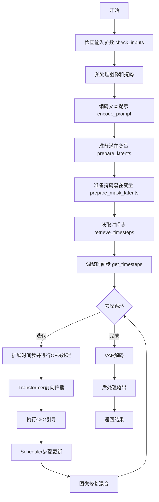
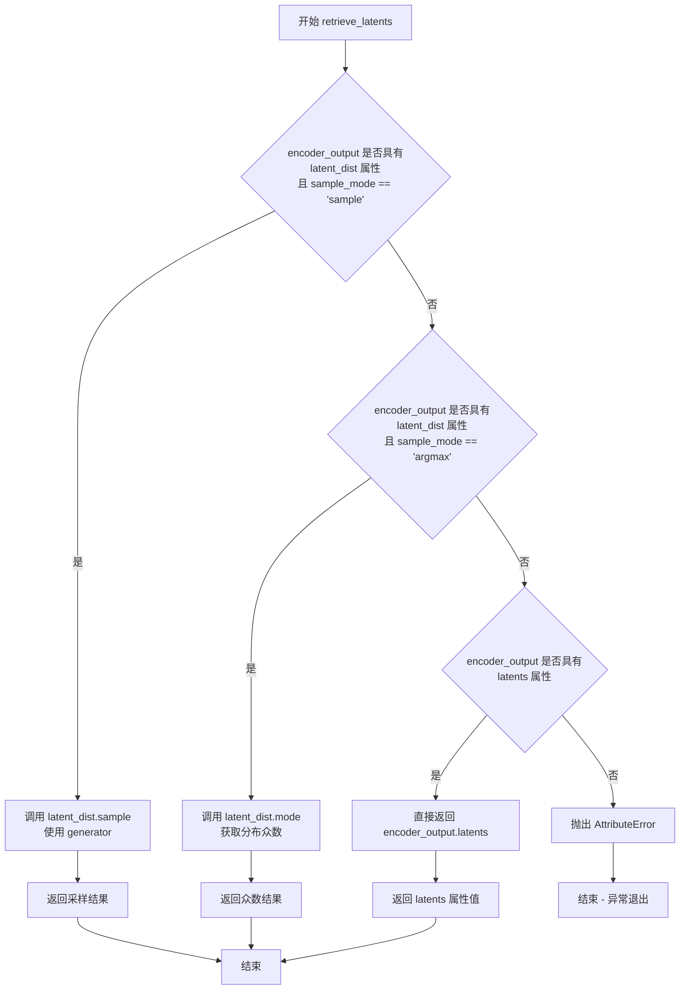
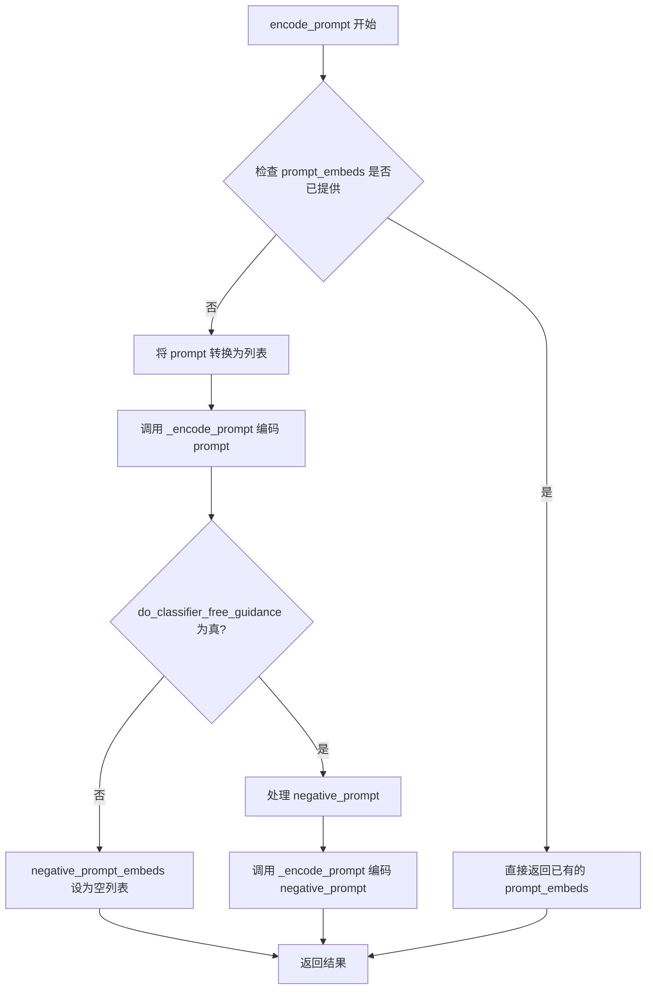

```mermaid
flowchart TD
    A[开始 __call__] --> B[1. 检查输入参数 check_inputs]
    B --> C[2. 预处理图像和掩码]
    C --> D[获取图像尺寸 height/width]
    D --> E{height/width是否可被vae_scale整除?}
    E -->|否| F[抛出ValueError]
    E -->|是| G[预处理掩码 mask_processor.preprocess]
    G --> H[3. 定义调用参数 batch_size]
    H --> I{prompt_embeds是否提供?}
    I -->|是且prompt为None| J{是否需要CFG?}
    I -->|否| K[encode_prompt编码提示词]
    J -->|是且negative_prompt_embeds为None| L[抛出ValueError]
    J -->|否| M[4. 准备潜在变量]
    K --> M
    L --> M
    M --> N[计算latent尺寸 image_seq_len]
    N --> O[5. 准备时间步]
    O --> P[calculate_shift计算mu]
    P --> Q[retrieve_timesteps获取时间步]
    Q --> R[6. 根据strength调整时间步]
    R --> S[7. prepare_latents准备初始噪声潜在向量]
    S --> T[8. 准备掩码和掩码图像潜在向量]
    T --> U[9. 去噪循环开始]
    U --> V{遍历每个timestep}
    V --> W{检查interrupt标志}
    W -->|是| V
    W -->|否| X[展开timestep到batch维度]
    X --> Y[CFG截断处理]
    Y --> Z{是否应用CFG?}
    Z -->|是| AA[复制latents和prompt_embeds x2]
    Z -->|否| AB[直接使用原始输入]
    AA --> AC[transformer前向传播]
    AB --> AC
    AC --> AD{CFG应用?}
    AD -->|是| AE[分离正负输出并计算noise_pred]
    AD -->|否| AF[堆叠输出作为noise_pred]
    AE --> AG[scheduler.step去噪一步]
    AF --> AG
    AG --> AH[图像修复混合: 掩码区域用去噪结果，非掩码区域用原图]
    AH --> AI[回调函数处理]
    AI --> AJ{是否完成所有步数?}
    AJ -->|否| V
    AJ -->|是| AK[10. 解码生成最终图像]
    AK --> AL{output_type是latent?}
    AL -->|是| AM[直接返回latents]
    AL -->|否| AN[VAE解码并后处理]
    AN --> AO[maybe_free_model_hooks卸载模型]
    AO --> AP{return_dict为True?}
    AP -->|是| AQ[返回ZImagePipelineOutput]
    AP -->|否| AR[返回元组]
```

# `diffusers\src\diffusers\pipelines\z_image\pipeline_z_image_inpaint.py` 详细设计文档

ZImageInpaintPipeline是一个基于ZImage Transformer模型的图像修复（inpainting）扩散管道，支持通过文本提示引导和mask掩码对图像指定区域进行智能修复，采用FlowMatchEulerDiscreteScheduler进行去噪，支持分类器自由引导（CFG）和多种高级配置选项。

## 整体流程



## 类结构

```
DiffusionPipeline (抽象基类)
├── ZImageLoraLoaderMixin (Mixin)
├── FromSingleFileMixin (Mixin)
└── ZImageInpaintPipeline
```

## 全局变量及字段


### `XLA_AVAILABLE`
    
Boolean flag indicating whether PyTorch XLA is available for accelerated computation

类型：`bool`
    


### `logger`
    
Logger instance for recording runtime information and warnings

类型：`logging.Logger`
    


### `EXAMPLE_DOC_STRING`
    
Documentation string containing usage examples for the inpainting pipeline

类型：`str`
    


### `ZImageInpaintPipeline.scheduler`
    
Scheduler for denoising encoded image latents using flow matching

类型：`FlowMatchEulerDiscreteScheduler`
    


### `ZImageInpaintPipeline.vae`
    
Variational Auto-Encoder for encoding images to and decoding latents from latent representations

类型：`AutoencoderKL`
    


### `ZImageInpaintPipeline.text_encoder`
    
Pre-trained model for encoding text prompts into embedding vectors

类型：`PreTrainedModel`
    


### `ZImageInpaintPipeline.tokenizer`
    
Tokenizer for converting text prompts into token IDs for the text encoder

类型：`AutoTokenizer`
    


### `ZImageInpaintPipeline.transformer`
    
Transformer model for denoising image latents with text conditioning

类型：`ZImageTransformer2DModel`
    


### `ZImageInpaintPipeline.vae_scale_factor`
    
Scaling factor derived from VAE architecture for computing latent dimensions

类型：`int`
    


### `ZImageInpaintPipeline.image_processor`
    
Image processor for preprocessing input images and postprocessing output images

类型：`VaeImageProcessor`
    


### `ZImageInpaintPipeline.mask_processor`
    
Mask processor for preprocessing inpainting masks with binarization and normalization

类型：`VaeImageProcessor`
    


### `ZImageInpaintPipeline.model_cpu_offload_seq`
    
Sequence string defining the order for CPU offloading of models (text_encoder->transformer->vae)

类型：`str`
    


### `ZImageInpaintPipeline._optional_components`
    
List of optional pipeline components that can be omitted during initialization

类型：`list`
    


### `ZImageInpaintPipeline._callback_tensor_inputs`
    
List of tensor variable names that can be passed to the step-end callback function

类型：`list`
    
    

## 全局函数及方法


### `calculate_shift`

该函数用于根据图像序列长度计算线性插值的偏移量（shift），通常用于扩散模型调度器中根据不同图像尺寸动态调整噪声调度参数。

参数：

- `image_seq_len`：`int`，输入图像的序列长度（latent space 中的 token 数量）
- `base_seq_len`：`int` = 256，基础序列长度，用于线性插值的起点
- `max_seq_len`：`int` = 4096，最大序列长度，用于线性插值的终点
- `base_shift`：`float` = 0.5，基础偏移量，对应 base_seq_len 时的偏移值
- `max_shift`：`float` = 1.15，最大偏移量，对应 max_seq_len 时的偏移值

返回值：`float`，根据图像序列长度线性插值计算得到的偏移量 mu

#### 流程图

```mermaid
flowchart TD
    A[开始] --> B[计算斜率 m<br/>m = (max_shift - base_shift) / (max_seq_len - base_seq_len)]
    B --> C[计算截距 b<br/>b = base_shift - m * base_seq_len]
    C --> D[计算偏移量 mu<br/>mu = image_seq_len * m + b]
    D --> E[返回 mu]
    
    style A fill:#f9f,stroke:#333
    style E fill:#9f9,stroke:#333
```

#### 带注释源码

```
# Copied from diffusers.pipelines.flux.pipeline_flux.calculate_shift
def calculate_shift(
    image_seq_len,          # 输入：图像序列长度（latent token 数量）
    base_seq_len: int = 256,       # 默认基础序列长度
    max_seq_len: int = 4096,       # 默认最大序列长度
    base_shift: float = 0.5,       # 默认基础偏移量
    max_shift: float = 1.15,       # 默认最大偏移量
):
    """
    根据图像序列长度计算线性插值的偏移量。
    
    这是一个线性函数：mu = m * image_seq_len + b
    其中 m 是斜率，b 是截距，用于在 base_seq_len 到 max_seq_len 的范围内
    从 base_shift 线性插值到 max_shift。
    
    这个偏移量通常用于扩散模型的调度器（如 FlowMatchEulerDiscreteScheduler）
    来根据输入图像的尺寸动态调整噪声调度。
    """
    # 计算斜率 m：表示每单位序列长度增加的偏移量
    m = (max_shift - base_shift) / (max_seq_len - base_seq_len)
    
    # 计算截距 b：确保当 seq_len = base_seq_len 时，shift = base_shift
    b = base_shift - m * base_seq_len
    
    # 根据当前图像序列长度计算偏移量 mu
    mu = image_seq_len * m + b
    
    # 返回计算得到的偏移量
    return mu
```


### `retrieve_latents`

从编码器输出中提取潜在表示（latents），支持多种提取模式（采样、argmax 或直接获取属性）。

参数：

- `encoder_output`：`torch.Tensor`，编码器输出对象，通常包含 `latent_dist` 或 `latents` 属性
- `generator`：`torch.Generator | None`，可选的随机数生成器，用于采样时的随机性控制
- `sample_mode`：`str`，采样模式，可选值为 `"sample"`（从分布采样）或 `"argmax"`（取分布的众数），默认为 `"sample"`

返回值：`torch.Tensor`，提取出的潜在表示张量

#### 流程图



#### 带注释源码

```python
# Copied from diffusers.pipelines.stable_diffusion.pipeline_stable_diffusion_img2img.retrieve_latents
def retrieve_latents(
    encoder_output: torch.Tensor, generator: torch.Generator | None = None, sample_mode: str = "sample"
):
    """
    从编码器输出中提取潜在表示（latents）。
    
    该函数支持三种模式：
    1. 当 encoder_output 具有 latent_dist 属性且 sample_mode 为 "sample" 时，
       从潜在分布中进行随机采样
    2. 当 encoder_output 具有 latent_dist 属性且 sample_mode 为 "argmax" 时，
       返回潜在分布的众数（最大值对应的点）
    3. 当 encoder_output 直接具有 latents 属性时，直接返回该属性值
    
    Args:
        encoder_output: 编码器输出对象，通常是 VAE 编码后的输出，
                       包含 latent_dist 或 latents 属性
        generator: 可选的 PyTorch 随机数生成器，用于控制采样过程的随机性，
                  确保结果可复现
        sample_mode: 字符串，指定提取模式。"sample" 表示从分布中采样，
                    "argmax" 表示取分布的众数
    
    Returns:
        torch.Tensor: 提取出的潜在表示张量
    
    Raises:
        AttributeError: 当 encoder_output 既没有 latent_dist 属性
                       也没有 latents 属性时抛出
    """
    # 模式1：如果有 latent_dist 属性且要求采样模式
    if hasattr(encoder_output, "latent_dist") and sample_mode == "sample":
        # 从潜在分布中采样，使用传入的 generator 控制随机性
        return encoder_output.latent_dist.sample(generator)
    
    # 模式2：如果有 latent_dist 属性且要求 argmax 模式
    elif hasattr(encoder_output, "latent_dist") and sample_mode == "argmax":
        # 返回潜在分布的众数（概率最大的点）
        return encoder_output.latent_dist.mode()
    
    # 模式3：直接获取 latents 属性
    elif hasattr(encoder_output, "latents"):
        # 直接返回预计算的 latents
        return encoder_output.latents
    
    # 错误处理：无法从 encoder_output 中提取 latents
    else:
        raise AttributeError("Could not access latents of provided encoder_output")
```


### `retrieve_timesteps`

该函数是扩散管道中用于获取时间步调度的核心工具函数。它调用调度器的`set_timesteps`方法，并从调度器中检索生成的时间步序列。支持自定义时间步（timesteps）或自定义sigmas，也可以使用默认的推理步数（num_inference_steps）来生成时间步。

参数：

- `scheduler`：`SchedulerMixin`，调度器对象，用于生成时间步序列
- `num_inference_steps`：`int | None`，生成样本时使用的扩散步数，如果使用此参数，则`timesteps`必须为`None`
- `device`：`str | torch.device | None`，时间步要移动到的设备，如果为`None`则不移动时间步
- `timesteps`：`list[int] | None`，自定义时间步，用于覆盖调度器的时间步间隔策略，如果传入此参数，则`num_inference_steps`和`sigmas`必须为`None`
- `sigmas`：`list[float] | None`，自定义sigmas，用于覆盖调度器的sigma间隔策略，如果传入此参数，则`num_inference_steps`和`timesteps`必须为`None`
- `**kwargs`：任意关键字参数，将传递给调度器的`set_timesteps`方法

返回值：`tuple[torch.Tensor, int]`，元组第一个元素是调度器的时间步序列，第二个元素是推理步数

#### 流程图

```mermaid
flowchart TD
    A[开始] --> B{检查timesteps和sigmas是否同时非空}
    B -->|是| C[抛出ValueError: 只能选择timesteps或sigmas之一]
    B -->|否| D{检查timesteps是否非空}
    D -->|是| E[检查scheduler.set_timesteps是否接受timesteps参数]
    E -->|不接受| F[抛出ValueError: 当前调度器不支持自定义timesteps]
    E -->|接受| G[调用scheduler.set_timesteps并传入timesteps和device]
    G --> H[从scheduler获取timesteps]
    H --> I[计算num_inference_steps为len(timesteps)]
    D -->|否| J{检查sigmas是否非空}
    J -->|是| K[检查scheduler.set_timesteps是否接受sigmas参数]
    K -->|不接受| L[抛出ValueError: 当前调度器不支持自定义sigmas]
    K -->|接受| M[调用scheduler.set_timesteps并传入sigmas和device]
    M --> N[从scheduler获取timesteps]
    N --> O[计算num_inference_steps为len(timesteps)]
    J -->|否| P[调用scheduler.set_timesteps并传入num_inference_steps和device]
    P --> Q[从scheduler获取timesteps]
    Q --> R[返回timesteps和num_inference_steps]
    I --> R
    O --> R
    C --> Z[结束]
    F --> Z
    L --> Z
```

#### 带注释源码

```
# Copied from diffusers.pipelines.stable_diffusion.pipeline_stable_diffusion.retrieve_timesteps
def retrieve_timesteps(
    scheduler,  # 调度器对象，用于生成时间步
    num_inference_steps: int | None = None,  # 推理步数，与timesteps/sigmas互斥
    device: str | torch.device | None = None,  # 目标设备
    timesteps: list[int] | None = None,  # 自定义时间步列表
    sigmas: list[float] | None = None,  # 自定义sigma列表
    **kwargs,  # 传递给scheduler.set_timesteps的其他参数
):
    r"""
    Calls the scheduler's `set_timesteps` method and retrieves timesteps from the scheduler after the call. Handles
    custom timesteps. Any kwargs will be supplied to `scheduler.set_timesteps`.

    Args:
        scheduler (`SchedulerMixin`):
            The scheduler to get timesteps from.
        num_inference_steps (`int`):
            The number of diffusion steps used when generating samples with a pre-trained model. If used, `timesteps`
            must be `None`.
        device (`str` or `torch.device`, *optional*):
            The device to which the timesteps should be moved to. If `None`, the timesteps are not moved.
        timesteps (`list[int]`, *optional*):
            Custom timesteps used to override the timestep spacing strategy of the scheduler. If `timesteps` is passed,
            `num_inference_steps` and `sigmas` must be `None`.
        sigmas (`list[float]`, *optional*):
            Custom sigmas used to override the timestep spacing strategy of the scheduler. If `sigmas` is passed,
            `num_inference_steps` and `timesteps` must be `None`.

    Returns:
        `tuple[torch.Tensor, int]`: A tuple where the first element is the timestep schedule from the scheduler and the
        second element is the number of inference steps.
    """
    # 验证输入：timesteps和sigmas不能同时非空
    if timesteps is not None and sigmas is not None:
        raise ValueError("Only one of `timesteps` or `sigmas` can be passed. Please choose one to set custom values")
    
    # 分支1：使用自定义timesteps
    if timesteps is not None:
        # 检查调度器的set_timesteps方法是否支持timesteps参数
        accepts_timesteps = "timesteps" in set(inspect.signature(scheduler.set_timesteps).parameters.keys())
        if not accepts_timesteps:
            raise ValueError(
                f"The current scheduler class {scheduler.__class__}'s `set_timesteps` does not support custom"
                f" timestep schedules. Please check whether you are using the correct scheduler."
            )
        # 调用调度器的set_timesteps方法，传入自定义timesteps
        scheduler.set_timesteps(timesteps=timesteps, device=device, **kwargs)
        # 从调度器获取生成的时间步
        timesteps = scheduler.timesteps
        # 计算推理步数
        num_inference_steps = len(timesteps)
    
    # 分支2：使用自定义sigmas
    elif sigmas is not None:
        # 检查调度器的set_timesteps方法是否支持sigmas参数
        accept_sigmas = "sigmas" in set(inspect.signature(scheduler.set_timesteps).parameters.keys())
        if not accept_sigmas:
            raise ValueError(
                f"The current scheduler class {scheduler.__class__}'s `set_timesteps` does not support custom"
                f" sigmas schedules. Please check whether you are using the correct scheduler."
            )
        # 调用调度器的set_timesteps方法，传入自定义sigmas
        scheduler.set_timesteps(sigmas=sigmas, device=device, **kwargs)
        # 从调度器获取生成的时间步
        timesteps = scheduler.timesteps
        # 计算推理步数
        num_inference_steps = len(timesteps)
    
    # 分支3：使用默认推理步数
    else:
        # 调用调度器的set_timesteps方法，传入推理步数
        scheduler.set_timesteps(num_inference_steps, device=device, **kwargs)
        # 从调度器获取生成的时间步
        timesteps = scheduler.timesteps
    
    # 返回时间步序列和推理步数
    return timesteps, num_inference_steps
```


### `ZImageInpaintPipeline.__init__`

初始化 ZImage 图像修复管道，构建并注册所有必需的模块（VAE、文本编码器、分词器、调度器和变换器），同时配置图像处理器和掩码处理器。

参数：

- `scheduler`：`FlowMatchEulerDiscreteScheduler`，用于去噪过程的调度器
- `vae`：`AutoencoderKL`，变分自编码器模型，用于编码和解码图像到潜在表示
- `text_encoder`：`PreTrainedModel`，文本编码器模型，用于编码文本提示
- `tokenizer`：`AutoTokenizer`，分词器，用于将文本提示转换为标记
- `transformer`：`ZImageTransformer2DModel`，ZImage 变换器模型，用于对编码的图像潜在表示进行去噪

返回值：`None`，构造函数无返回值

#### 流程图

```mermaid
flowchart TD
    A[开始 __init__] --> B[调用父类 __init__]
    B --> C[register_modules: 注册 vae, text_encoder, tokenizer, scheduler, transformer]
    C --> D{检查 vae 是否存在且非空}
    D -->|是| E[计算 vae_scale_factor = 2^(len(vae.config.block_out_channels) - 1)]
    D -->|否| F[vae_scale_factor = 8]
    E --> G[创建 VaeImageProcessor for image with vae_scale_factor * 2]
    F --> G
    G --> H[创建 VaeImageProcessor for mask with vae_scale_factor * 2<br/>do_normalize=False, do_binarize=True, do_convert_grayscale=True]
    H --> I[结束 __init__]
```

#### 带注释源码

```python
def __init__(
    self,
    scheduler: FlowMatchEulerDiscreteScheduler,  # 调度器：控制去噪过程的噪声调度
    vae: AutoencoderKL,  # VAE：变分自编码器，用于图像编码/解码
    text_encoder: PreTrainedModel,  # 文本编码器：将文本提示编码为嵌入向量
    tokenizer: AutoTokenizer,  # 分词器：文本和嵌入之间的转换
    transformer: ZImageTransformer2DModel,  # 变换器：核心的去噪模型
):
    # 调用父类 DiffusionPipeline 的初始化方法
    # 继承基础管道功能，如设备管理、模型卸载等
    super().__init__()

    # 注册所有模块到管道中，使其可通过 self.xxx 访问
    # 同时注册了可选组件和回调张量输入
    self.register_modules(
        vae=vae,
        text_encoder=text_encoder,
        tokenizer=tokenizer,
        scheduler=scheduler,
        transformer=transformer,
    )
    
    # 计算 VAE 的缩放因子
    # 基于 VAE 块输出通道数的深度计算下采样倍数
    # 例如：若 block_out_channels=[128,256,512,512]，则 scale_factor=2^(4-1)=16
    self.vae_scale_factor = (
        2 ** (len(self.vae.config.block_out_channels) - 1) if hasattr(self, "vae") and self.vae is not None else 8
    )
    
    # 创建图像后处理器，用于将潜在表示转换为最终图像
    # 乘以 2 是因为处理的是处理后的图像（已下采样两次）
    self.image_processor = VaeImageProcessor(vae_scale_factor=self.vae_scale_factor * 2)
    
    # 创建掩码专用处理器
    # do_normalize=False: 保持原始掩码值范围
    # do_binarize=True: 将掩码转换为二值（0或1）
    # do_convert_grayscale=True: 转换为灰度图
    self.mask_processor = VaeImageProcessor(
        vae_scale_factor=self.vae_scale_factor * 2,
        do_normalize=False,
        do_binarize=True,
        do_convert_grayscale=True,
    )
```


### `ZImageInpaintPipeline.encode_prompt`

该方法负责将文本提示词（prompt）编码为向量嵌入（embeddings），支持可选的负面提示词（negative_prompt）编码，以便在图像修复（inpainting）过程中实现分类器自由引导（Classifier-Free Guidance, CFG）。

参数：

- `self`：`ZImageInpaintPipeline` 实例本身
- `prompt`：`str | list[str]`，要编码的文本提示词，可以是单个字符串或字符串列表
- `device`：`torch.device | None`，指定计算设备，若为 None 则使用执行设备
- `do_classifier_free_guidance`：`bool`，是否启用分类器自由引导，默认为 True
- `negative_prompt`：`str | list[str] | None`，负面提示词，用于引导模型避免生成相关内容
- `prompt_embeds`：`list[torch.FloatTensor] | None`，预计算的提示词嵌入，若提供则直接返回
- `negative_prompt_embeds`：`torch.FloatTensor | None`，预计算的负面提示词嵌入
- `max_sequence_length`：`int`，tokenizer 的最大序列长度，默认为 512

返回值：`tuple[list[torch.FloatTensor], list[torch.FloatTensor]]`，返回提示词嵌入和负面提示词嵌入的元组

#### 流程图



#### 带注释源码

```python
def encode_prompt(
    self,
    prompt: str | list[str],
    device: torch.device | None = None,
    do_classifier_free_guidance: bool = True,
    negative_prompt: str | list[str] | None = None,
    prompt_embeds: list[torch.FloatTensor] | None = None,
    negative_prompt_embeds: torch.FloatTensor | None = None,
    max_sequence_length: int = 512,
):
    """
    编码文本提示词为嵌入向量。
    
    Args:
        prompt: 输入的文本提示词
        device: 计算设备
        do_classifier_free_guidance: 是否启用 CFG
        negative_prompt: 负面提示词
        prompt_embeds: 预计算的提示词嵌入
        negative_prompt_embeds: 预计算的负面提示词嵌入
        max_sequence_length: 最大序列长度
    
    Returns:
        (prompt_embeds, negative_prompt_embeds) 元组
    """
    # 将单个字符串转换为列表，统一处理方式
    prompt = [prompt] if isinstance(prompt, str) else prompt
    
    # 调用内部方法 _encode_prompt 进行编码
    # 如果 prompt_embeds 已提供，该方法会直接返回
    prompt_embeds = self._encode_prompt(
        prompt=prompt,
        device=device,
        prompt_embeds=prompt_embeds,
        max_sequence_length=max_sequence_length,
    )

    # 如果启用 CFG，需要处理负面提示词
    if do_classifier_free_guidance:
        if negative_prompt is None:
            # 如果未提供负面提示词，使用空字符串
            negative_prompt = ["" for _ in prompt]
        else:
            # 同样将负面提示词转换为列表
            negative_prompt = [negative_prompt] if isinstance(negative_prompt, str) else negative_prompt
        
        # 验证 prompt 和 negative_prompt 数量一致
        assert len(prompt) == len(negative_prompt)
        
        # 编码负面提示词
        negative_prompt_embeds = self._encode_prompt(
            prompt=negative_prompt,
            device=device,
            prompt_embeds=negative_prompt_embeds,
            max_sequence_length=max_sequence_length,
        )
    else:
        # 不启用 CFG 时，负面嵌入为空列表
        negative_prompt_embeds = []
    
    return prompt_embeds, negative_prompt_embeds
```


### `ZImageInpaintPipeline._encode_prompt`

该方法是 ZImageInpaintPipeline 类的内部方法，负责将文本提示（prompt）编码为文本嵌入向量（text embeddings）。它使用聊天模板处理提示，通过 tokenizer 转换为 token ID，然后利用 text_encoder 生成隐藏状态，最后根据注意力掩码提取有效的嵌入向量。

参数：

- `self`：ZImageInpaintPipeline 实例，隐式参数
- `prompt`：`str | list[str]`，要编码的文本提示，可以是单个字符串或字符串列表
- `device`：`torch.device | None`，可选参数，指定将张量放置到的设备，如果为 None 则使用执行设备
- `prompt_embeds`：`list[torch.FloatTensor] | None`，可选参数，预计算的文本嵌入，如果已提供则直接返回跳过编码
- `max_sequence_length`：`int`，可选参数，默认值为 512，表示最大序列长度用于 tokenization

返回值：`list[torch.FloatTensor]`，返回编码后的文本嵌入列表，每个元素对应一个提示的嵌入向量

#### 流程图

```mermaid
flowchart TD
    A[开始 _encode_prompt] --> B{device 是否为 None?}
    B -->|是| C[使用 self._execution_device]
    B -->|否| D[使用传入的 device]
    C --> E{prompt_embeds 是否已提供?}
    D --> E
    E -->|是| F[直接返回 prompt_embeds]
    E -->|否| G{prompt 是否为字符串?}
    G -->|是| H[将 prompt 转换为列表]
    G -->|否| I[使用原始 prompt 列表]
    H --> J[遍历每个 prompt_item]
    I --> J
    J --> K[构建 messages 列表]
    K --> L[调用 tokenizer.apply_chat_template]
    L --> M[启用 generation_prompt 和 thinking]
    M --> N[更新 prompt 列表]
    N --> O{所有 prompt 处理完成?}
    O -->|否| J
    O -->|是| P[调用 tokenizer 进行 tokenization]
    P --> Q[提取 input_ids 和 attention_mask]
    Q --> R[将张量移动到 device]
    R --> S[调用 text_encoder 获取隐藏状态]
    S --> T[获取倒数第二层隐藏状态 hidden_states[-2]]
    T --> U[遍历每个嵌入向量]
    U --> V[根据 prompt_masks 过滤有效 token]
    V --> W[将过滤后的嵌入添加到列表]
    W --> X{所有嵌入处理完成?}
    X -->|否| U
    X -->|是| Y[返回 embeddings_list]
    F --> Z[结束]
    Y --> Z
```

#### 带注释源码

```python
def _encode_prompt(
    self,
    prompt: str | list[str],
    device: torch.device | None = None,
    prompt_embeds: list[torch.FloatTensor] | None = None,
    max_sequence_length: int = 512,
) -> list[torch.FloatTensor]:
    """Encode prompt into text embeddings.
    
    Args:
        prompt: The prompt or prompts to encode.
        device: The device to use for encoding.
        prompt_embeds: Pre-computed prompt embeddings.
        max_sequence_length: Maximum sequence length for tokenization.
    
    Returns:
        List of encoded prompt embeddings.
    """
    # 如果未指定设备，则使用管道的执行设备
    device = device or self._execution_device

    # 如果已经提供了预计算的嵌入，直接返回以跳过编码过程
    if prompt_embeds is not None:
        return prompt_embeds

    # 确保 prompt 是列表格式，以便统一处理
    if isinstance(prompt, str):
        prompt = [prompt]

    # 遍历每个提示，应用聊天模板进行格式化
    for i, prompt_item in enumerate(prompt):
        # 构建消息格式，遵循聊天模板规范
        messages = [
            {"role": "user", "content": prompt_item},
        ]
        # 使用 tokenizer 的聊天模板功能格式化提示
        # tokenize=False 返回格式化后的文本而非 tokens
        # add_generation_prompt=True 添加生成提示
        # enable_thinking=True 启用思考模式
        prompt_item = self.tokenizer.apply_chat_template(
            messages,
            tokenize=False,
            add_generation_prompt=True,
            enable_thinking=True,
        )
        # 更新提示列表
        prompt[i] = prompt_item

    # 使用 tokenizer 将文本转换为模型输入格式
    text_inputs = self.tokenizer(
        prompt,
        padding="max_length",           # 填充到最大长度
        max_length=max_sequence_length,  # 最大序列长度
        truncation=True,                 # 截断超长序列
        return_tensors="pt",             # 返回 PyTorch 张量
    )

    # 提取 input IDs 和注意力掩码，并移至指定设备
    text_input_ids = text_inputs.input_ids.to(device)
    # 将注意力掩码转换为布尔值，用于后续过滤
    prompt_masks = text_inputs.attention_mask.to(device).bool()

    # 调用文本编码器模型生成嵌入
    # output_hidden_states=True 要求返回所有隐藏状态
    prompt_embeds = self.text_encoder(
        input_ids=text_input_ids,
        attention_mask=prompt_masks,
        output_hidden_states=True,
    ).hidden_states[-2]  # 获取倒数第二层隐藏状态

    # 创建一个列表存储过滤后的嵌入
    embeddings_list = []

    # 遍历每个提示的嵌入，根据注意力掩码过滤掉填充 token
    for i in range(len(prompt_embeds)):
        # 仅保留有效 token（mask 为 True 的位置）的嵌入
        embeddings_list.append(prompt_embeds[i][prompt_masks[i]])

    # 返回编码后的嵌入列表
    return embeddings_list
```


### `ZImageInpaintPipeline.get_timesteps`

该方法根据推理步数和强度（strength）参数计算并返回调整后的时间步序列，用于图像修复pipeline的去噪过程。它通过计算实际需要去噪的起始点，实现对原始图像的部分变换。

参数：

- `num_inference_steps`：`int`，推理步数，即扩散模型去噪的总迭代次数
- `strength`：`float`，变换强度，范围0到1之间，决定对原始图像保留程度（1.0表示完全重绘）
- `device`：`torch.device`，计算设备，用于指定张量存放位置

返回值：`tuple[torch.Tensor, int]`，包含两个元素——第一个是调整后的时间步序列（torch.Tensor），第二个是实际推理步数（int）

#### 流程图

```mermaid
flowchart TD
    A[开始] --> B[计算init_timestep<br/>min(num_inference_steps × strength,<br/>num_inference_steps)]
    --> C[计算起始索引t_start<br/>max(num_inference_steps - init_timestep, 0)]
    --> D[从scheduler.timesteps切片<br/>timesteps[t_start × scheduler.order:]
    --> E{scheduler是否有<br/>set_begin_index方法?}
    -->|是| F[调用scheduler.set_begin_index<br/>设置起始索引]
    --> G[返回timesteps和<br/>num_inference_steps - t_start]
    |否| G
```

#### 带注释源码

```
def get_timesteps(self, num_inference_steps, strength, device):
    # 根据强度参数计算实际使用的初始时间步数
    # strength=1.0时使用全部步数，strength越小使用的步数越少
    init_timestep = min(num_inference_steps * strength, num_inference_steps)

    # 计算起始索引，决定从时间步序列的哪个位置开始
    # 这样可以实现部分变换：跳过前面的时间步，保留更多原始图像信息
    t_start = int(max(num_inference_steps - init_timestep, 0))
    
    # 从scheduler获取完整的时间步序列，并按起始索引切片
    # scheduler.order用于多步调度器（如DPMSolverMultistepScheduler）
    timesteps = self.scheduler.timesteps[t_start * self.scheduler.order :]
    
    # 如果scheduler支持设置起始索引（某些调度器需要）
    # 这确保调度器从正确的位置开始迭代
    if hasattr(self.scheduler, "set_begin_index"):
        self.scheduler.set_begin_index(t_start * self.scheduler.order)

    # 返回调整后的时间步序列和实际推理步数
    return timesteps, num_inference_steps - t_start
```


### `ZImageInpaintPipeline.prepare_mask_latents`

该方法负责准备图像修复（inpainting）所需的掩码和掩码图像潜在向量。它将输入的掩码调整到潜在空间维度，使用VAE编码掩码图像，并应用VAE的缩放因子，最后根据batch_size进行扩展，为后续的去噪循环提供必要的输入。

参数：

- `self`：`ZImageInpaintPipeline`，Pipeline实例本身
- `mask`：`torch.Tensor`，二值掩码张量，1表示需要修复的区域，0表示保留区域
- `masked_image`：`torch.Tensor`，原始图像，掩码区域已置零
- `batch_size`：`int`，生成图像的数量
- `height`：`int`，输出图像的高度
- `width`：`int`，输出图像的宽度
- `dtype`：`torch.dtype`，张量的数据类型
- `device`：`torch.device`，张量放置的设备
- `generator`：`torch.Generator | list[torch.Generator] | None`，随机生成器，用于确保可重现性

返回值：`Tuple[torch.Tensor, torch.Tensor]`，返回掩码和掩码图像潜在向量元组，准备好用于去噪循环

#### 流程图

```mermaid
flowchart TD
    A[开始: prepare_mask_latents] --> B[计算潜在空间维度]
    B --> C[latent_height = 2 * height / (vae_scale_factor * 2)]
    C --> D[latent_width = 2 * width / (vae_scale_factor * 2)]
    D --> E{掩码插值}
    E --> F[torch.nn.functional.interpolate mask 到 latent 尺寸]
    F --> G[将掩码移动到指定设备和数据类型]
    G --> H{处理掩码图像}
    H --> I[将 masked_image 移动到设备和转换类型]
    I --> J{generator 是列表?}
    J -->|是| K[逐个编码 masked_image 片段]
    K --> L[收集所有编码结果并拼接]
    J -->|否| M[直接编码整个 masked_image]
    L --> N[retrieve_latents 提取潜在向量]
    M --> N
    N --> O[应用 VAE 缩放]
    O --> P[masked_image_latents = (latents - shift_factor) * scaling_factor]
    P --> Q{mask batch_size < 实际 batch_size?}
    Q -->|是| R[重复掩码以匹配 batch_size]
    Q -->|否| S{masked_image_latents batch_size < 实际 batch_size?}
    S -->|是| T[重复 masked_image_latents 以匹配 batch_size]
    S -->|否| U[返回: mask, masked_image_latents]
    R --> U
    T --> U
```

#### 带注释源码

```python
def prepare_mask_latents(
    self,
    mask,                      # 二值掩码张量，1=需要修复区域，0=保留区域
    masked_image,              # 原始图像，掩码区域已置零
    batch_size,                # 要生成的图像数量
    height,                    # 输出图像高度（像素）
    width,                     # 输出图像宽度（像素）
    dtype,                     # 输出张量的数据类型
    device,                    # 张量放置的设备（cpu/cuda）
    generator,                 # 随机生成器，用于可重现性
):
    """Prepare mask and masked image latents for inpainting.

    Args:
        mask: Binary mask tensor where 1 = inpaint region, 0 = preserve region.
        masked_image: Original image with masked regions zeroed out.
        batch_size: Number of images to generate.
        height: Output image height.
        width: Output image width.
        dtype: Data type for the tensors.
        device: Device to place tensors on.
        generator: Random generator for reproducibility.

    Returns:
        Tuple of (mask, masked_image_latents) prepared for the denoising loop.
    """
    # 计算潜在空间维度：VAE会将图像缩小 vae_scale_factor * 2 倍
    # 乘以2是因为潜在空间通常是原图的2倍下采样
    latent_height = 2 * (int(height) // (self.vae_scale_factor * 2))
    latent_width = 2 * (int(width) // (self.vae_scale_factor * 2))

    # 调整掩码大小到潜在空间维度
    # 使用最近邻插值保持二值掩码的值（0或1）
    mask = torch.nn.functional.interpolate(mask, size=(latent_height, latent_width), mode="nearest")
    # 将掩码移动到指定设备和数据类型
    mask = mask.to(device=device, dtype=dtype)

    # 将掩码图像移动到指定设备和数据类型
    masked_image = masked_image.to(device=device, dtype=dtype)
    
    # 使用VAE编码掩码图像为潜在向量
    # 处理generator为列表的情况（每个样本使用不同的随机种子）
    if isinstance(generator, list):
        # 逐个编码每个样本以便使用各自的generator
        masked_image_latents = [
            retrieve_latents(self.vae.encode(masked_image[i : i + 1]), generator=generator[i])
            for i in range(masked_image.shape[0])
        ]
        # 沿batch维度拼接所有编码结果
        masked_image_latents = torch.cat(masked_image_latents, dim=0)
    else:
        # 一次性编码整个批次（使用同一个generator）
        masked_image_latents = retrieve_latents(self.vae.encode(masked_image), generator=generator)

    # 应用VAE缩放因子
    # VAE的shift_factor和scaling_factor用于归一化潜在空间
    masked_image_latents = (masked_image_latents - self.vae.config.shift_factor) * self.vae.config.scaling_factor

    # 扩展掩码以匹配目标batch_size
    # 如果掩码数量不足，则重复掩码以填满batch
    if mask.shape[0] < batch_size:
        # 检查batch_size是否能被掩码数量整除
        if not batch_size % mask.shape[0] == 0:
            raise ValueError(
                "The passed mask and the required batch size don't match. Masks are supposed to be duplicated to"
                f" a total batch size of {batch_size}, but {mask.shape[0]} masks were passed. Make sure the number"
                " of masks that you pass is divisible by the total requested batch size."
            )
        # 重复掩码 (batch_size // mask.shape[0]) 次
        mask = mask.repeat(batch_size // mask.shape[0], 1, 1, 1)
    
    # 扩展掩码图像潜在向量以匹配目标batch_size
    if masked_image_latents.shape[0] < batch_size:
        if not batch_size % masked_image_latents.shape[0] == 0:
            raise ValueError(
                "The passed images and the required batch size don't match. Images are supposed to be duplicated"
                f" to a total batch size of {batch_size}, but {masked_image_latents.shape[0]} images were passed."
                " Make sure the number of images that you pass is divisible by the total requested batch size."
            )
        # 重复潜在向量 (batch_size // masked_image_latents.shape[0]) 次
        masked_image_latents = masked_image_latents.repeat(batch_size // masked_image_latents.shape[0], 1, 1, 1)

    # 返回处理好的掩码和掩码图像潜在向量
    return mask, masked_image_latents
```


### `ZImageInpaintPipeline.prepare_latents`

该方法负责为图像修复（inpainting）任务准备潜在变量（latents），包括计算潜在空间的尺寸、对输入图像进行VAE编码、生成噪声，并根据时间步对图像潜在变量进行噪声处理，以便后续的去噪扩散过程使用。

参数：

- `self`：`ZImageInpaintPipeline` 实例本身
- `image`：`PipelineImageInput`，待修复的输入图像
- `timestep`：`torch.Tensor`，当前扩散时间步，用于噪声缩放
- `batch_size`：`int`，批次大小
- `num_channels_latents`：`int`，潜在变量的通道数（通常由transformer的in_channels决定）
- `height`：`int`，输出图像高度（像素）
- `width`：`int`，输出图像宽度（像素）
- `dtype`：`torch.dtype`，张量的数据类型
- `device`：`torch.device`，计算设备
- `generator`：`torch.Generator` 或 `list[torch.Generator]` 或 `None`，随机数生成器，用于可重复的噪声生成
- `latents`：`torch.FloatTensor` 或 `None`，可选的预生成潜在变量

返回值：`tuple[torch.Tensor, torch.Tensor, torch.Tensor]`，包含三个张量：

- `latents`：`torch.Tensor`，经过噪声处理后的图像潜在变量，用于去噪
- `noise`：`torch.Tensor`，生成的噪声张量，用于图像混合
- `image_latents`：`torch.Tensor`，原始图像的潜在表示，用于保真混合

#### 流程图

```mermaid
flowchart TD
    A[开始 prepare_latents] --> B[计算潜在空间尺寸: height/width]
    B --> C{检查 latents 是否提供?}
    C -->|是| D[使用提供的 latents]
    C -->|否| E[对输入图像进行 VAE 编码]
    D --> F[生成噪声 randn_tensor]
    E --> G{检查图像通道数是否匹配 num_channels_latents?}
    G -->|不匹配| H[通过 VAE.encode 获取 image_latents]
    G -->|匹配| I[直接使用 image]
    H --> J[应用 VAE scaling: (latents - shift_factor) * scaling_factor]
    I --> K[批量大小扩展检查]
    J --> K
    F --> L[batch_size 扩展检查]
    K --> L
    L --> M{latents 已提供?}
    M -->|是| N[返回: latents, noise, image_latents]
    M -->|否| O[使用 scheduler.scale_noise 添加噪声]
    O --> P[返回: latents, noise, image_latents]
```

#### 带注释源码

```python
def prepare_latents(
    self,
    image,                      # 输入图像 (PipelineImageInput)
    timestep,                   # 扩散时间步 (torch.Tensor)
    batch_size,                 # 批次大小 (int)
    num_channels_latents,       # 潜在变量通道数 (int)
    height,                     # 输出高度 (int)
    width,                      # 输出宽度 (int)
    dtype,                      # 数据类型 (torch.dtype)
    device,                     # 计算设备 (torch.device)
    generator,                  # 随机数生成器
    latents=None,               # 可选的预生成潜在变量
):
    """Prepare latents for inpainting, returning noise and image_latents for blending.

    Returns:
        Tuple of (latents, noise, image_latents) where:
        - latents: Noised image latents for denoising
        - noise: The noise tensor used for blending
        - image_latents: Clean image latents for blending
    """
    # 1. 计算潜在空间的尺寸 (VAE scale factor 的两倍)
    height = 2 * (int(height) // (self.vae_scale_factor * 2))
    width = 2 * (int(width) // (self.vae_scale_factor * 2))

    # 2. 定义潜在变量的形状
    shape = (batch_size, num_channels_latents, height, width)

    # 3. 如果提供了 latents，直接使用并生成用于混合的噪声和图像潜在变量
    if latents is not None:
        # 为混合生成噪声
        noise = randn_tensor(shape, generator=generator, device=device, dtype=dtype)
        
        # 准备图像用于编码混合
        image = image.to(device=device, dtype=dtype)
        
        # 处理多个生成器的情况 (batch 中每个样本一个生成器)
        if isinstance(generator, list):
            image_latents = [
                retrieve_latents(self.vae.encode(image[i : i + 1]), generator=generator[i])
                for i in range(image.shape[0])
            ]
            image_latents = torch.cat(image_latents, dim=0)
        else:
            image_latents = retrieve_latents(self.vae.encode(image), generator=generator)
        
        # 应用 VAE 缩放因子 (逆变换: decode 时是 latents/scaling + shift)
        image_latents = (image_latents - self.vae.config.shift_factor) * self.vae.config.scaling_factor
        
        # 如果 batch_size 大于 image_latents 数量，进行扩展复制
        if batch_size > image_latents.shape[0] and batch_size % image_latents.shape[0] == 0:
            image_latents = torch.cat([image_latents] * (batch_size // image_latents.shape[0]), dim=0)
        
        # 返回提供的 latents、噪声和编码后的图像 latent
        return latents.to(device=device, dtype=dtype), noise, image_latents

    # 4. 如果没有提供 latents，则从图像编码生成
    image = image.to(device=device, dtype=dtype)
    
    # 5. 检查图像通道数是否与潜在变量通道数匹配
    if image.shape[1] != num_channels_latents:
        # 图像需要编码到潜在空间
        if isinstance(generator, list):
            # 处理多个生成器的情况
            image_latents = [
                retrieve_latents(self.vae.encode(image[i : i + 1]), generator=generator[i])
                for i in range(image.shape[0])
            ]
            image_latents = torch.cat(image_latents, dim=0)
        else:
            image_latents = retrieve_latents(self.vae.encode(image), generator=generator)

        # 应用 VAE 缩放 (解码的逆操作)
        image_latents = (image_latents - self.vae.config.shift_factor) * self.vae.config.scaling_factor
    else:
        # 图像已经是潜在变量格式
        image_latents = image

    # 6. 处理批量大小扩展
    if batch_size > image_latents.shape[0] and batch_size % image_latents.shape[0] == 0:
        additional_image_per_prompt = batch_size // image_latents.shape[0]
        image_latents = torch.cat([image_latents] * additional_image_per_prompt, dim=0)
    elif batch_size > image_latents.shape[0] and batch_size % image_latents.shape[0] != 0:
        raise ValueError(
            f"Cannot duplicate `image` of batch size {image_latents.shape[0]} to {batch_size} text prompts."
        )

    # 7. 为初始噪声化和后续混合生成噪声
    noise = randn_tensor(shape, generator=generator, device=device, dtype=dtype)

    # 8. 使用 flow matching scheduler 的 scale_noise 方法添加噪声
    latents = self.scheduler.scale_noise(image_latents, timestep, noise)

    # 9. 返回: 带噪声的 latents、噪声张量、原始图像 latents
    return latents, noise, image_latents
```


### `ZImageInpaintPipeline.check_inputs`

该方法用于验证图像修复管道的输入参数是否合法，确保所有必需的参数都正确提供，且参数值在有效范围内。如果任何验证失败，该方法会抛出详细的错误信息。

参数：

- `prompt`：`str | list[str]`，用户提供的文本提示词，用于引导图像生成
- `image`：`PipelineImageInput`，输入的原始图像，用于修复
- `mask_image`：`PipelineImageInput`，输入的掩码图像，白色区域表示需要修复的区域
- `strength`：`float`，修复强度，范围在 0 到 1 之间，控制原始图像与噪声的混合比例
- `height`：`int | None`，生成图像的高度（像素）
- `width`：`int | None`，生成图像的宽度（像素）
- `output_type`：`str`，输出格式类型，支持 "latent"、"pil"、"np" 或 "pt"
- `negative_prompt`：`str | list[str] | None`，可选的负面提示词，用于引导模型避免生成某些内容
- `prompt_embeds`：`list[torch.FloatTensor] | None`，可选的预计算文本嵌入
- `negative_prompt_embeds`：`torch.FloatTensor | None`，可选的预计算负面文本嵌入
- `callback_on_step_end_tensor_inputs`：`list[str] | None`，可选的回调函数张量输入列表

返回值：`None`，该方法不返回值，仅通过抛出异常来处理验证错误

#### 流程图

```mermaid
flowchart TD
    A[开始 check_inputs 验证] --> B{strength 在 [0, 1] 范围内?}
    B -- 否 --> B1[抛出 ValueError: strength 必须在 0.0 到 1.0 之间]
    B -- 是 --> C{callback_on_step_end_tensor_inputs 合法?}
    C -- 否 --> C1[抛出 ValueError: 包含非法的 tensor 输入]
    C -- 是 --> D{prompt 和 prompt_embeds 同时提供?}
    D -- 是 --> D1[抛出 ValueError: 不能同时提供两者]
    D -- 否 --> E{prompt 和 prompt_embeds 都未提供?}
    E -- 是 --> E1[抛出 ValueError: 至少需要提供其一]
    E -- 否 --> F{prompt 类型合法?}
    F -- 否 --> F1[抛出 ValueError: prompt 类型必须是 str 或 list]
    F -- 是 --> G{negative_prompt 和 negative_prompt_embeds 同时提供?}
    G -- 是 --> G1[抛出 ValueError: 不能同时提供两者]
    G -- 否 --> H{image 为 None?}
    H -- 是 --> H1[抛出 ValueError: image 不能为空]
    H -- 否 --> I{mask_image 为 None?}
    I -- 是 --> I1[抛出 ValueError: mask_image 不能为空]
    I -- 否 --> J{output_type 合法?}
    J -- 否 --> J1[抛出 ValueError: output_type 必须是 'latent', 'pil', 'np' 或 'pt']
    J -- 是 --> K[验证通过，方法结束]
    
    B1 --> Z[结束]
    C1 --> Z
    D1 --> Z
    E1 --> Z
    F1 --> Z
    G1 --> Z
    H1 --> Z
    I1 --> Z
    J1 --> Z
    K --> Z
```

#### 带注释源码

```python
def check_inputs(
    self,
    prompt,
    image,
    mask_image,
    strength,
    height,
    width,
    output_type,
    negative_prompt=None,
    prompt_embeds=None,
    negative_prompt_embeds=None,
    callback_on_step_end_tensor_inputs=None,
):
    """
    验证图像修复管道的输入参数合法性。
    
    该方法执行以下验证：
    1. strength 参数必须在 [0.0, 1.0] 范围内
    2. callback_on_step_end_tensor_inputs 必须是有效的张量输入列表
    3. prompt 和 prompt_embeds 不能同时提供
    4. prompt 和 prompt_embeds 至少提供一个
    5. prompt 必须是 str 或 list 类型
    6. negative_prompt 和 negative_prompt_embeds 不能同时提供
    7. image 不能为 None（修复任务必需）
    8. mask_image 不能为 None（修复任务必需）
    9. output_type 必须是支持的格式之一
    """
    
    # 验证 1: strength 必须在 [0, 1] 范围内
    if strength < 0 or strength > 1:
        raise ValueError(f"The value of strength should be in [0.0, 1.0] but is {strength}")

    # 验证 2: callback_on_step_end_tensor_inputs 必须是合法的张量输入
    if callback_on_step_end_tensor_inputs is not None and not all(
        k in self._callback_tensor_inputs for k in callback_on_step_end_tensor_inputs
    ):
        raise ValueError(
            f"`callback_on_step_end_tensor_inputs` has to be in {self._callback_tensor_inputs}, but found {[k for k in callback_on_step_end_tensor_inputs if k not in self._callback_tensor_inputs]}"
        )

    # 验证 3: prompt 和 prompt_embeds 不能同时提供
    if prompt is not None and prompt_embeds is not None:
        raise ValueError(
            f"Cannot forward both `prompt`: {prompt} and `prompt_embeds`: {prompt_embeds}. Please make sure to"
            " only forward one of the two."
        )
    
    # 验证 4: prompt 和 prompt_embeds 至少提供一个
    elif prompt is None and prompt_embeds is None:
        raise ValueError(
            "Provide either `prompt` or `prompt_embeds`. Cannot leave both `prompt` and `prompt_embeds` undefined."
        )
    
    # 验证 5: prompt 必须是 str 或 list 类型
    elif prompt is not None and (not isinstance(prompt, str) and not isinstance(prompt, list)):
        raise ValueError(f"`prompt` has to be of type `str` or `list` but is {type(prompt)}")

    # 验证 6: negative_prompt 和 negative_prompt_embeds 不能同时提供
    if negative_prompt is not None and negative_prompt_embeds is not None:
        raise ValueError(
            f"Cannot forward both `negative_prompt`: {negative_prompt} and `negative_prompt_embeds`:"
            f" {negative_prompt_embeds}. Please make sure to only forward one of the two."
        )

    # 验证 7: image 不能为 None（修复任务必需原始图像）
    if image is None:
        raise ValueError("`image` input cannot be undefined for inpainting.")

    # 验证 8: mask_image 不能为 None（修复任务必需掩码）
    if mask_image is None:
        raise ValueError("`mask_image` input cannot be undefined for inpainting.")

    # 验证 9: output_type 必须是支持的格式
    if output_type not in ["latent", "pil", "np", "pt"]:
        raise ValueError(f"`output_type` must be one of 'latent', 'pil', 'np', or 'pt', but got {output_type}")
```


### ZImageInpaintPipeline.__call__

ZImageInpaintPipeline的`__call__`方法是Z-Image图像修复管道的核心入口函数，接收提示词、待修复图像和掩码图像，通过编码提示词、准备潜在变量、执行去噪循环（在去噪过程中结合掩码进行图像修复区域的混合），最终解码生成修复后的图像。

参数：

- `prompt`：`Union[str, List[str]]`，要引导图像生成的提示词，如果未定义则必须传递`prompt_embeds`
- `image`：`PipelineImageInput`，用作起点的图像批次，可以是张量、PIL图像或numpy数组，值范围在[0, 1]
- `mask_image`：`PipelineImageInput`，修复掩码图像，白色像素（值1）将被修复，黑色像素（值0）将从原图中保留
- `masked_image_latents`：`Optional[torch.FloatTensor]`，可选的预编码掩码图像潜在向量，如果提供则跳过掩码图像编码步骤
- `strength`：`float`，指示转换参考图像的程度，必须在0到1之间，值越高添加的噪声越多
- `height`：`int | None`，生成图像的高度（像素），默认1024，未提供时使用输入图像高度
- `width`：`int | None`，生成图像的宽度（像素），默认1024，未提供时使用输入图像宽度
- `num_inference_steps`：`int`，去噪步数，默认50，步数越多通常图像质量越高但推理越慢
- `sigmas`：`list[float] | None`，自定义sigma值用于支持sigma参数的调度器
- `guidance_scale`：`float`，无分类器自由引导（CFG）比例，默认5.0，值越大越贴近文本提示
- `cfg_normalization`：`bool`，是否应用CFG归一化，默认False
- `cfg_truncation`：`float`，CFG截断值，默认1.0
- `negative_prompt`：`Optional[Union[str, List[str]]]`，不引导图像生成的负面提示词
- `num_images_per_prompt`：`int`，每个提示词生成的图像数量，默认1
- `generator`：`torch.Generator | list[torch.Generator] | None`，随机生成器用于保证可重复性
- `latents`：`Optional[torch.FloatTensor]`，预生成的高斯分布噪声潜在向量
- `prompt_embeds`：`Optional[List[torch.FloatTensor]]`，预生成的文本嵌入
- `negative_prompt_embeds`：`Optional[List[torch.FloatTensor]]`，预生成的负面文本嵌入
- `output_type`：`str`，生成图像的输出格式，可选"latent"、"pil"、"np"或"pt"，默认"pil"
- `return_dict`：`bool`，是否返回PipelineOutput对象而非元组，默认True
- `joint_attention_kwargs`：`Optional[Dict[str, Any]]`，传递给注意力处理器的参数字典
- `callback_on_step_end`：`Optional[Callable[[int, int, Dict], None]]`，每个去噪步骤结束时调用的回调函数
- `callback_on_step_end_tensor_inputs`：`List[str]`，回调函数接收的张量输入列表，默认["latents"]
- `max_sequence_length`：`int`，提示词最大序列长度，默认512

返回值：`ZImagePipelineOutput`或`tuple`，返回生成的图像列表，如果`return_dict`为True则返回`ZImagePipelineOutput`对象

#### 流程图



#### 带注释源码

```python
@torch.no_grad()
@replace_example_docstring(EXAMPLE_DOC_STRING)
def __call__(
    self,
    prompt: Union[str, List[str]] = None,
    image: PipelineImageInput = None,
    mask_image: PipelineImageInput = None,
    masked_image_latents: Optional[torch.FloatTensor] = None,
    strength: float = 1.0,
    height: int | None = None,
    width: int | None = None,
    num_inference_steps: int = 50,
    sigmas: list[float] | None = None,
    guidance_scale: float = 5.0,
    cfg_normalization: bool = False,
    cfg_truncation: float = 1.0,
    negative_prompt: Optional[Union[str, List[str]]] = None,
    num_images_per_prompt: Optional[int] = 1,
    generator: torch.Generator | list[torch.Generator] | None = None,
    latents: Optional[torch.FloatTensor] = None,
    prompt_embeds: Optional[List[torch.FloatTensor]] = None,
    negative_prompt_embeds: Optional[List[torch.FloatTensor]] = None,
    output_type: str = "pil",
    return_dict: bool = True,
    joint_attention_kwargs: Optional[Dict[str, Any]] = None,
    callback_on_step_end: Optional[Callable[[int, int, Dict], None]] = None,
    callback_on_step_end_tensor_inputs: List[str] = ["latents"],
    max_sequence_length: int = 512,
):
    """
    执行图像修复推理的主方法。
    
    处理流程:
    1. 验证输入参数的合法性
    2. 预处理输入图像和掩码
    3. 编码文本提示词
    4. 准备VAE latent变量
    5. 配置调度器时间步
    6. 根据strength调整时间步
    7. 准备图像latent和噪声
    8. 准备掩码相关latent
    9. 执行去噪循环(核心推理过程)
    10. 解码并输出最终图像
    """
    # ==================== 1. 检查输入参数 ====================
    # 验证所有必需参数和参数组合的合法性
    self.check_inputs(
        prompt=prompt,
        image=image,
        mask_image=mask_image,
        strength=strength,
        height=height,
        width=width,
        output_type=output_type,
        negative_prompt=negative_prompt,
        prompt_embeds=prompt_embeds,
        negative_prompt_embeds=negative_prompt_embeds,
        callback_on_step_end_tensor_inputs=callback_on_step_end_tensor_inputs,
    )

    # ==================== 2. 预处理图像和掩码 ====================
    # 使用图像处理器预处理输入图像到模型所需格式
    init_image = self.image_processor.preprocess(image)
    init_image = init_image.to(dtype=torch.float32)

    # 从预处理后的图像获取尺寸信息
    if height is None:
        height = init_image.shape[-2]
    if width is None:
        width = init_image.shape[-1]

    # 计算VAE缩放因子并验证图像尺寸对齐
    vae_scale = self.vae_scale_factor * 2
    if height % vae_scale != 0:
        raise ValueError(
            f"Height must be divisible by {vae_scale} (got {height}). "
            f"Please adjust the height to a multiple of {vae_scale}."
        )
    if width % vae_scale != 0:
        raise ValueError(
            f"Width must be divisible by {vae_scale} (got {width}). "
            f"Please adjust the width to a multiple of {vae_scale}."
        )

    # 预处理掩码图像
    mask = self.mask_processor.preprocess(mask_image, height=height, width=width)

    # 获取执行设备
    device = self._execution_device

    # 初始化内部状态变量
    self._guidance_scale = guidance_scale
    self._joint_attention_kwargs = joint_attention_kwargs
    self._interrupt = False
    self._cfg_normalization = cfg_normalization
    self._cfg_truncation = cfg_truncation

    # ==================== 3. 定义调用参数 ====================
    # 确定批次大小:根据prompt类型或prompt_embeds长度
    if prompt is not None and isinstance(prompt, str):
        batch_size = 1
    elif prompt is not None and isinstance(prompt, list):
        batch_size = len(prompt)
    else:
        batch_size = len(prompt_embeds)

    # 验证prompt_embeds和negative_prompt_embeds的组合
    if prompt_embeds is not None and prompt is None:
        if self.do_classifier_free_guidance and negative_prompt_embeds is None:
            raise ValueError(
                "When `prompt_embeds` is provided without `prompt`, "
                "`negative_prompt_embeds` must also be provided for classifier-free guidance."
            )
    else:
        # 编码提示词生成文本嵌入
        (
            prompt_embeds,
            negative_prompt_embeds,
        ) = self.encode_prompt(
            prompt=prompt,
            negative_prompt=negative_prompt,
            do_classifier_free_guidance=self.do_classifier_free_guidance,
            prompt_embeds=prompt_embeds,
            negative_prompt_embeds=negative_prompt_embeds,
            device=device,
            max_sequence_length=max_sequence_length,
        )

    # ==================== 4. 准备潜在变量 ====================
    # 获取transformer的输入通道数
    num_channels_latents = self.transformer.in_channels

    # 为每个提示词生成的图像数量复制prompt_embeds
    if num_images_per_prompt > 1:
        prompt_embeds = [pe for pe in prompt_embeds for _ in range(num_images_per_prompt)]
        if self.do_classifier_free_guidance and negative_prompt_embeds:
            negative_prompt_embeds = [npe for npe in negative_prompt_embeds for _ in range(num_images_per_prompt)]

    # 计算实际批次大小
    actual_batch_size = batch_size * num_images_per_prompt

    # 计算latent空间的尺寸用于计算shift参数
    latent_height = 2 * (int(height) // (self.vae_scale_factor * 2))
    latent_width = 2 * (int(width) // (self.vae_scale_factor * 2))
    image_seq_len = (latent_height // 2) * (latent_width // 2)

    # ==================== 5. 准备时间步 ====================
    # 计算图像序列长度对应的sigma shift值
    mu = calculate_shift(
        image_seq_len,
        self.scheduler.config.get("base_image_seq_len", 256),
        self.scheduler.config.get("max_image_seq_len", 4096),
        self.scheduler.config.get("base_shift", 0.5),
        self.scheduler.config.get("max_shift", 1.15),
    )
    # 设置最小sigma值
    self.scheduler.sigma_min = 0.0
    scheduler_kwargs = {"mu": mu}
    # 获取调度器的时间步
    timesteps, num_inference_steps = retrieve_timesteps(
        self.scheduler,
        num_inference_steps,
        device,
        sigmas=sigmas,
        **scheduler_kwargs,
    )

    # ==================== 6. 根据strength调整时间步 ====================
    # 根据图像转换强度调整timesteps
    timesteps, num_inference_steps = self.get_timesteps(num_inference_steps, strength, device)
    if num_inference_steps < 1:
        raise ValueError(
            f"After adjusting the num_inference_steps by strength parameter: {strength}, the number of pipeline "
            f"steps is {num_inference_steps} which is < 1 and not appropriate for this pipeline."
        )
    # 复制初始时间步以匹配批次大小
    latent_timestep = timesteps[:1].repeat(actual_batch_size)

    # ==================== 7. 准备latents ====================
    # 准备初始latent变量(包含噪声和用于混合的图像latent)
    latents, noise, image_latents = self.prepare_latents(
        init_image,
        latent_timestep,
        actual_batch_size,
        num_channels_latents,
        height,
        width,
        prompt_embeds[0].dtype,
        device,
        generator,
        latents,
    )

    # ==================== 8. 准备掩码和掩码图像latents ====================
    # 创建掩码图像:只保留非掩码区域(mask=0的部分保留原图)
    if masked_image_latents is None:
        # 保留非修复区域
        masked_image = init_image * (mask < 0.5)
    else:
        masked_image = None  # 使用提供的masked_image_latents

    # 准备掩码latents用于后续混合
    mask, masked_image_latents = self.prepare_mask_latents(
        mask,
        masked_image if masked_image is not None else init_image,
        actual_batch_size,
        height,
        width,
        prompt_embeds[0].dtype,
        device,
        generator,
    )

    # 计算预热步数用于进度条显示
    num_warmup_steps = max(len(timesteps) - num_inference_steps * self.scheduler.order, 0)
    self._num_timesteps = len(timesteps)

    # ==================== 9. 去噪循环 ====================
    with self.progress_bar(total=num_inference_steps) as progress_bar:
        for i, t in enumerate(timesteps):
            # 检查中断标志
            if self.interrupt:
                continue

            # 广播到批次维度(兼容ONNX/Core ML)
            timestep = t.expand(latents.shape[0])
            # 归一化时间: (1000 - t) / 1000
            timestep = (1000 - timestep) / 1000
            # 用于时间感知配置的归一化时间(0在开始,1在结束)
            t_norm = timestep[0].item()

            # 处理CFG截断
            current_guidance_scale = self.guidance_scale
            if (
                self.do_classifier_free_guidance
                and self._cfg_truncation is not None
                and float(self._cfg_truncation) <= 1
            ):
                if t_norm > self._cfg_truncation:
                    current_guidance_scale = 0.0

            # 判断是否应用CFG
            apply_cfg = self.do_classifier_free_guidance and current_guidance_scale > 0

            if apply_cfg:
                # 准备CFG输入:复制latents和prompt_embeds以同时处理正负样本
                latents_typed = latents.to(self.transformer.dtype)
                latent_model_input = latents_typed.repeat(2, 1, 1, 1)
                prompt_embeds_model_input = prompt_embeds + negative_prompt_embeds
                timestep_model_input = timestep.repeat(2)
            else:
                latent_model_input = latents.to(self.transformer.dtype)
                prompt_embeds_model_input = prompt_embeds
                timestep_model_input = timestep

            # Transformer期望list格式输入
            latent_model_input = latent_model_input.unsqueeze(2)
            latent_model_input_list = list(latent_model_input.unbind(dim=0))

            # 调用transformer进行去噪预测
            model_out_list = self.transformer(
                latent_model_input_list,
                timestep_model_input,
                prompt_embeds_model_input,
            )[0]

            # 执行Classifier-Free Guidance
            if apply_cfg:
                # 分离正负样本输出
                pos_out = model_out_list[:actual_batch_size]
                neg_out = model_out_list[actual_batch_size:]

                noise_pred = []
                for j in range(actual_batch_size):
                    pos = pos_out[j].float()
                    neg = neg_out[j].float()

                    # CFG公式: pred = pos + scale * (pos - neg)
                    pred = pos + current_guidance_scale * (pos - neg)

                    # CFG归一化处理
                    if self._cfg_normalization and float(self._cfg_normalization) > 0.0:
                        ori_pos_norm = torch.linalg.vector_norm(pos)
                        new_pos_norm = torch.linalg.vector_norm(pred)
                        max_new_norm = ori_pos_norm * float(self._cfg_normalization)
                        if new_pos_norm > max_new_norm:
                            pred = pred * (max_new_norm / new_pos_norm)

                    noise_pred.append(pred)

                noise_pred = torch.stack(noise_pred, dim=0)
            else:
                # 无CFG时直接堆叠输出
                noise_pred = torch.stack([t.float() for t in model_out_list], dim=0)

            # 处理输出维度并取反(符合标准diffusion公式)
            noise_pred = noise_pred.squeeze(2)
            noise_pred = -noise_pred

            # 调度器执行一步去噪:x_t -> x_t-1
            latents = self.scheduler.step(noise_pred.to(torch.float32), t, latents, return_dict=False)[0]
            assert latents.dtype == torch.float32

            # ==================== 图像修复混合 ====================
            # 获取用于混合的原始图像latent
            init_latents_proper = image_latents

            # 如果不是最后一步,将原始latent缩放到当前噪声级别
            if i < len(timesteps) - 1:
                noise_timestep = timesteps[i + 1]
                init_latents_proper = self.scheduler.scale_noise(
                    init_latents_proper, torch.tensor([noise_timestep]), noise
                )

            # 混合:掩码=1使用去噪结果(修复区域),掩码=0使用原图(保留区域)
            latents = (1 - mask) * init_latents_proper + mask * latents

            # 步骤结束回调处理
            if callback_on_step_end is not None:
                callback_kwargs = {}
                for k in callback_on_step_end_tensor_inputs:
                    callback_kwargs[k] = locals()[k]
                callback_outputs = callback_on_step_end(self, i, t, callback_kwargs)

                # 更新回调返回的张量
                latents = callback_outputs.pop("latents", latents)
                prompt_embeds = callback_outputs.pop("prompt_embeds", prompt_embeds)
                negative_prompt_embeds = callback_outputs.pop("negative_prompt_embeds", negative_prompt_embeds)
                mask = callback_outputs.pop("mask", mask)
                masked_image_latents = callback_outputs.pop("masked_image_latents", masked_image_latents)

            # 进度条更新(在最后一步或预热步后每scheduler.order步更新)
            if i == len(timesteps) - 1 or ((i + 1) > num_warmup_steps and (i + 1) % self.scheduler.order == 0):
                progress_bar.update()

            # XLA设备优化标记
            if XLA_AVAILABLE:
                xm.mark_step()

    # ==================== 10. 解码生成最终图像 ====================
    if output_type == "latent":
        # 直接返回latent表示
        image = latents

    else:
        # VAE解码latent到图像空间
        latents = latents.to(self.vae.dtype)
        # 反向缩放:除以scaling_factor并加上shift_factor
        latents = (latents / self.vae.config.scaling_factor) + self.vae.config.shift_factor

        # 解码
        image = self.vae.decode(latents, return_dict=False)[0]
        # 后处理转换为指定输出格式
        image = self.image_processor.postprocess(image, output_type=output_type)

    # 释放模型钩子
    self.maybe_free_model_hooks()

    # 返回结果
    if not return_dict:
        return (image,)

    return ZImagePipelineOutput(images=image)
```

## 关键组件


### ZImageInpaintPipeline

Z-Image图像修复管道核心类，集成扩散模型、VAE解码器、文本编码器，实现基于FlowMatch的图像修复推理，支持分类器自由引导(CFG)和掩码混合。

### encode_prompt / _encode_prompt

文本提示编码模块，负责将用户输入的文本提示转换为 transformer 所需的嵌入向量，支持聊天模板应用和attention mask处理。

### prepare_latents

潜在变量准备模块，在图像修复中同时返回噪声潜在变量、噪声张量和图像潜在变量，用于后续的去噪循环中的图像混合操作。

### prepare_mask_latents

掩码潜在变量准备模块，将二值掩码和掩码图像编码为潜在表示，处理VAE缩放因子，并支持批量大小扩展。

### retrieve_latents

潜在变量检索工具函数，从VAE编码器输出中提取潜在分布样本或模式，支持多种采样方式和潜在变量格式。

### retrieve_timesteps / get_timesteps

时间步管理模块，调度器时间步获取与调整，支持自定义timesteps和sigmas，根据strength参数调整去噪步数。

### calculate_shift

FlowMatch调度器偏移计算函数，根据图像序列长度计算mu值，用于调整噪声调度策略。

### Denoising Loop (去噪循环)

核心推理循环，执行以下关键操作：
- 时间步归一化处理
- CFG截断策略实现
- Transformer模型前向传播
- CFG归一化与重归一化
- 图像潜在变量与掩码混合
- 回调机制支持

### image_processor / mask_processor

VAE图像处理器，负责图像的预处理(归一化、调整大小)和后处理(解码、转换输出格式)；掩码专用处理器支持二值化和灰度转换。

### VaeImageProcessor

通用VAE图像处理工具，支持多种输入格式(PIL/numpy/tensor)的预处理和后处理，提供可配置的归一化、二值化参数。

## 问题及建议


### 已知问题

- **类型注解不完整**：部分函数缺少返回类型注解，如`calculate_shift`函数；使用了Python 3.10+的`|`联合类型语法但未添加`from __future__ import annotations`，可能在旧版本Python中导致问题。
- **代码重复**：在`prepare_latents`和`prepare_mask_latents`中存在重复的VAE编码逻辑和`retrieve_latents`调用模式；`encode_prompt`和`_encode_prompt`中的embeddings_list构建逻辑可以提取为通用方法。
- **硬编码数值**：多处出现`vae_scale_factor * 2`的硬编码计算；数值1000（在`timestep`转换中）和0.0等magic numbers缺乏解释。
- **错误处理不足**：当`generator`为list类型时，代码假设其长度与batch size匹配，但缺乏明确验证；某些边界情况如`mask.shape[0]`与`batch_size`不匹配时的处理逻辑分散在多处。
- **性能优化空间**：在denoising循环中使用了Python for循环逐个处理batch，可考虑向量化操作；存在多次`to(dtype=...)`类型转换；`callback_on_step_end`中使用`locals()`获取变量可能带来性能开销。
- **API设计问题**：参数`cfg_normalization`和`cfg_truncation`在`__call__`中被赋值给`self._cfg_normalization`但未在类初始化中定义默认值，可能导致属性未定义的潜在问题。
- **文档缺失**：部分关键方法如`get_timesteps`缺少详细的docstring说明其具体逻辑；`calculate_shift`函数来自其他pipeline的复制但缺乏来源注释。
- **内存管理**：在denoising循环中创建的临时张量（如`latent_model_input_list`）可能未及时释放；缺少显式的torch.cuda.empty_cache()调用来处理大图处理场景。

### 优化建议

- 添加`from __future__ import annotations`以支持联合类型注解；为所有公共方法补充完整的类型注解和返回类型。
- 将重复的VAE编码逻辑抽取为私有方法如`_encode_image_to_latents`，减少代码冗余。
- 将magic numbers提取为类常量或配置参数，如定义`LATENT_SCALE_FACTOR = 2`、`TIMESTEP_SCALE = 1000`等。
- 在`__init__`方法中初始化所有使用的实例变量（如`self._cfg_normalization`、`self._cfg_truncation`），并提供合理的默认值。
- 考虑将denoising循环中的部分逻辑进行函数化或向量化优化，减少Python循环开销。
- 补充关键方法的详细docstring，特别是数学计算逻辑部分。
- 添加对输入参数的类型和维度验证，特别是在处理generator为list的情况时。

## 其它


### 设计目标与约束

本pipeline的设计目标是实现基于ZImage模型的图像修复（inpainting）功能，能够根据给定的文本提示（prompt）、原始图像和掩码（mask），在掩码指定的区域内生成与文本描述相符的新内容。核心约束包括：1) 输入图像尺寸必须能被vae_scale_factor*2整除；2) strength参数必须控制在0-1之间；3) 仅支持FlowMatchEulerDiscreteScheduler调度器；4) 模型输入输出需遵循DiffusionPipeline的标准接口；5) 最大序列长度限制为512。

### 错误处理与异常设计

代码中通过check_inputs方法进行输入参数校验，涵盖：strength值范围检查、callback_on_step_end_tensor_inputs合法性验证、prompt与prompt_embeds互斥检查、image和mask_image非空检查、output_type支持类型检查。在latents准备阶段，验证batch_size与image_latents的兼容性。scheduler配置检查确保支持自定义timesteps或sigmas。自定义异常信息均包含具体的错误上下文和修复建议。

### 数据流与状态机

Pipeline执行遵循以下状态转换：1) INITIAL状态：检查输入参数；2) PREPROCESS状态：预处理图像和掩码；3) ENCODE状态：编码文本提示和图像；4) DENOISE状态：迭代去噪（主循环）；5) DECODE状态：将latents解码为最终图像；6) OFFLOAD状态：释放模型资源。数据流从原始图像→预处理→VAE编码→潜在空间操作→Transformer去噪→VAE解码→后处理输出图像。状态转换由num_inference_steps和strength参数控制。

### 外部依赖与接口契约

核心依赖包括：transformers库（AutoTokenizer、PreTrainedModel）、diffusers库（DiffusionPipeline、PipelineImageInput、VaeImageProcessor、FlowMatchEulerDiscreteScheduler）、torch及torch_xla（可选用于XLA加速）。外部模型依赖：text_encoder（文本编码）、tokenizer（分词器）、vae（变分自编码器）、transformer（去噪Transformer）、scheduler（噪声调度器）。接口契约规定：encode_prompt返回prompt_embeds和negative_prompt_embeds元组；__call__方法接受Union[str, List[str]]类型的prompt，返回ZImagePipelineOutput或tuple；所有图像输入支持Tensor/PIL.Image/np.ndarray/List形式。

### 性能考量与优化空间

性能瓶颈主要存在于：1) VAE编码/解码的内存占用；2) Transformer推理的计算复杂度；3) 批量生成时的内存峰值。优化策略包括：1) 使用model_cpu_offload_seq实现模型按序卸载；2) 通过XLA_AVAILABLE启用XLA加速；3) 支持generator列表实现并行采样；4) 支持prompt_embeds预计算避免重复编码；5) 支持latents预生成实现相同种子的可复现生成。当前代码已实现模型钩子卸载和进度条显示。

### 安全性考虑

代码安全性设计包括：1) 输入验证防止无效参数导致运行时错误；2) dtype转换确保计算精度兼容；3) 设备管理防止CPU/GPU资源冲突；4) classifier-free guidance实现避免不当内容生成；5) cfg_truncation机制可在特定时间步禁用CFG。当前未实现的内容过滤机制需在上层应用中处理。

### 并发与线程安全

代码支持以下并发场景：1) num_images_per_prompt > 1时自动复制prompt_embeds；2) generator支持list类型实现多 generator并行；3) callback_on_step_end支持外部回调但需调用方保证线程安全；4) XLA模式下xm.mark_step()保证设备同步。需要注意：模型权重共享时的并发访问、多个pipeline实例的内存隔离、callback函数的线程安全性。

    