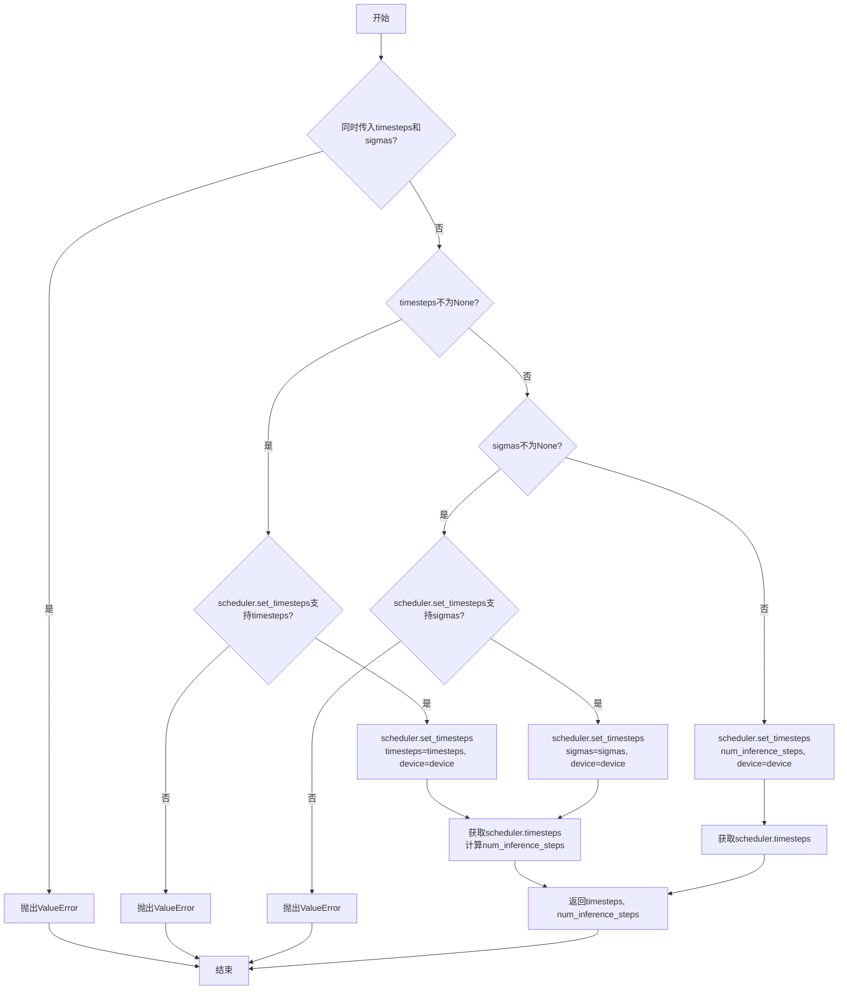
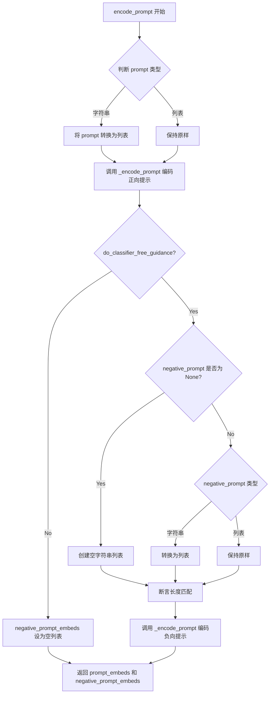
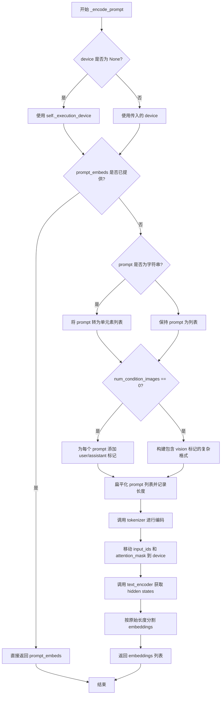
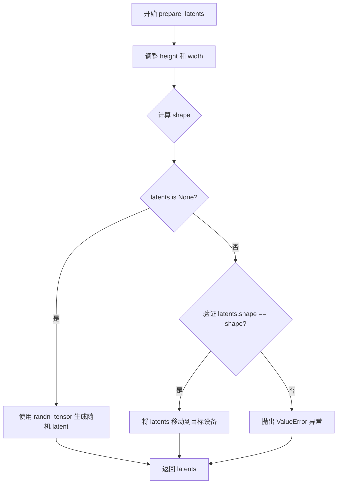
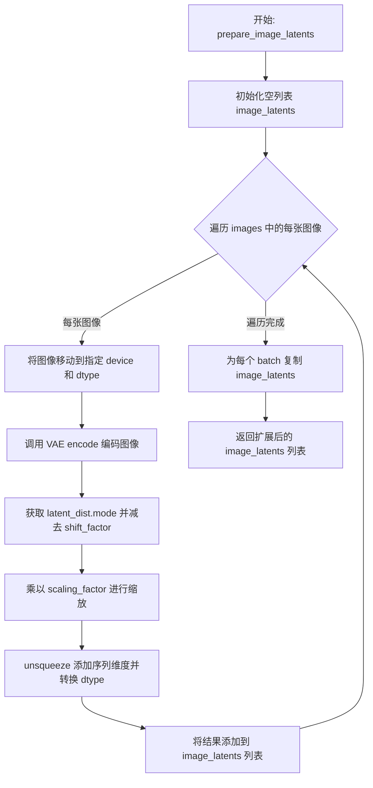
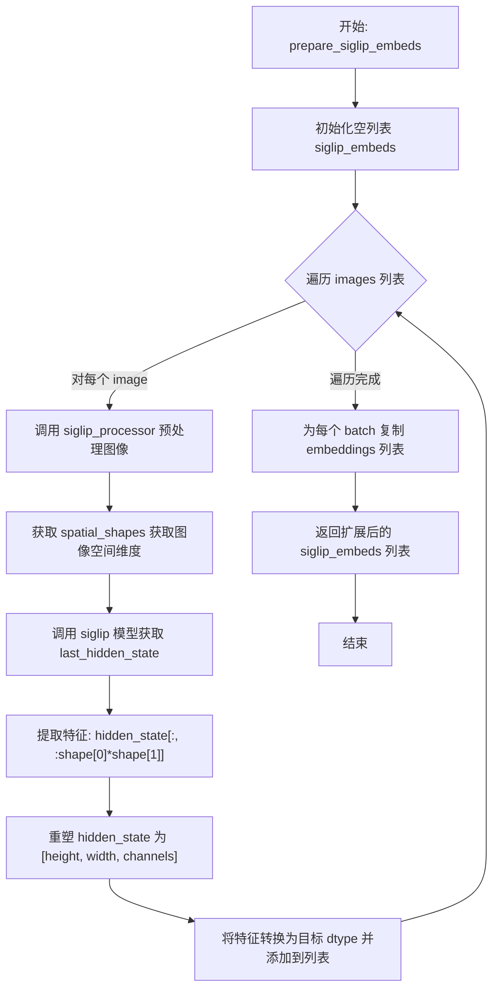

# `diffusers\src\diffusers\pipelines\z_image\pipeline_z_image_omni.py` 详细设计文档

ZImageOmniPipeline是一个基于扩散模型的图像生成管道，支持从文本提示和可选图像条件生成图像。该管道集成了VAE、文本编码器、Transformer模型和SigLIP视觉编码器，采用FlowMatchEulerDiscreteScheduler进行去噪处理，并支持分类器自由引导(CFG)、CFG截断和归一化等高级功能。

## 整体流程

```mermaid
graph TD
    A[开始] --> B[encode_prompt: 编码文本提示词]
    B --> C{有条件图像?}
    C -- 是 --> D[prepare_image_latents: 编码条件图像为latents]
    C -- 否 --> E[prepare_latents: 初始化随机latents]
    D --> F[prepare_siglip_embeds: 生成SigLIP视觉特征]
    E --> G[calculate_shift: 计算调度器偏移参数]
    F --> G
    G --> H[retrieve_timesteps: 获取去噪时间步]
    H --> I{去噪循环}
    I --> J{执行CFG?}
    J -- 是 --> K[复制latents和条件: repeat(2,1,1,1)]
    J -- 否 --> L[直接使用单份latents]
    K --> M[transformer: 前向传播]
    L --> M
    M --> N{CFG应用?}
    N -- 是 --> O[计算CFG: pos + scale*(pos-neg)]
    N -- 否 --> P[直接使用预测噪声]
    O --> Q[scheduler.step: 去噪一步]
    P --> Q
    Q --> R{还有更多时间步?}
    R -- 是 --> I
    R -- 否 --> S{output_type==latent?}
    S -- 是 --> T[直接返回latents]
    S -- 否 --> U[vae.decode: 解码latents为图像]
    U --> V[image_processor.postprocess: 后处理]
    V --> W[结束: 返回ZImagePipelineOutput]
    T --> W
```

## 类结构

```
DiffusionPipeline (基类)
├── ZImageLoraLoaderMixin (LoRA加载混合)
├── FromSingleFileMixin (单文件加载混合)
└── ZImageOmniPipeline (主类)
    ├── 模块: scheduler (FlowMatchEulerDiscreteScheduler)
    ├── 模块: vae (AutoencoderKL)
    ├── 模块: text_encoder (PreTrainedModel)
    ├── 模块: tokenizer (AutoTokenizer)
    ├── 模块: transformer (ZImageTransformer2DModel)
    ├── 模块: siglip (Siglip2VisionModel)
    └── 模块: siglip_processor (Siglip2ImageProcessorFast)
```

## 全局变量及字段


### `logger`
    
模块级日志记录器

类型：`logging.Logger`
    


### `EXAMPLE_DOC_STRING`
    
模块级示例文档字符串

类型：`str`
    


### `ZImageOmniPipeline.scheduler`
    
扩散调度器

类型：`FlowMatchEulerDiscreteScheduler`
    


### `ZImageOmniPipeline.vae`
    
变分自编码器

类型：`AutoencoderKL`
    


### `ZImageOmniPipeline.text_encoder`
    
文本编码器

类型：`PreTrainedModel`
    


### `ZImageOmniPipeline.tokenizer`
    
分词器

类型：`AutoTokenizer`
    


### `ZImageOmniPipeline.transformer`
    
主干Transformer模型

类型：`ZImageTransformer2DModel`
    


### `ZImageOmniPipeline.siglip`
    
SigLIP视觉编码器

类型：`Siglip2VisionModel`
    


### `ZImageOmniPipeline.siglip_processor`
    
SigLIP图像处理器

类型：`Siglip2ImageProcessorFast`
    


### `ZImageOmniPipeline.vae_scale_factor`
    
VAE缩放因子

类型：`int`
    


### `ZImageOmniPipeline.image_processor`
    
图像处理器

类型：`Flux2ImageProcessor`
    


### `ZImageOmniPipeline._guidance_scale`
    
引导尺度(属性)

类型：`float`
    


### `ZImageOmniPipeline._joint_attention_kwargs`
    
联合注意力参数(属性)

类型：`dict`
    


### `ZImageOmniPipeline._num_timesteps`
    
时间步数(属性)

类型：`int`
    


### `ZImageOmniPipeline._interrupt`
    
中断标志(属性)

类型：`bool`
    


### `ZImageOmniPipeline._cfg_normalization`
    
CFG归一化标志

类型：`bool`
    


### `ZImageOmniPipeline._cfg_truncation`
    
CFG截断值

类型：`float`
    
    

## 全局函数及方法


### `calculate_shift`

计算图像序列长度的偏移量，用于调度器参数调整，通过线性插值方法根据图像序列长度计算调度器的mu参数。

参数：

- `image_seq_len`：`int`，图像序列长度，表示当前图像的序列长度
- `base_seq_len`：`int`，基础序列长度，默认为256，用于线性插值的基准点
- `max_seq_len`：`int`，最大序列长度，默认为4096，用于线性插值的上限
- `base_shift`：`float`，基础偏移量，默认为0.5，对应base_seq_len时的偏移值
- `max_shift`：`float`，最大偏移量，默认为1.15，对应max_seq_len时的偏移值

返回值：`float`，计算得到的偏移量mu，用于调度器的参数调整

#### 流程图

```mermaid
flowchart TD
    A[开始 calculate_shift] --> B[计算斜率 m<br/>m = (max_shift - base_shift) / (max_seq_len - base_seq_len)]
    --> C[计算截距 b<br/>b = base_shift - m * base_seq_len]
    --> D[计算偏移量 mu<br/>mu = image_seq_len * m + b]
    --> E[返回 mu]
    
    B -.-> B1[输入: image_seq_len, base_seq_len=256, max_seq_len=4096, base_shift=0.5, max_shift=1.15]
    B1 --> B
```

#### 带注释源码

```python
def calculate_shift(
    image_seq_len,           # 图像序列长度，用于计算偏移量
    base_seq_len: int = 256,    # 基础序列长度，默认256
    max_seq_len: int = 4096,    # 最大序列长度，默认4096
    base_shift: float = 0.5,    # 基础偏移量，默认0.5
    max_shift: float = 1.15,    # 最大偏移量，默认1.15
):
    """
    计算图像序列长度的偏移量，用于调度器参数调整。
    使用线性插值方法，根据图像序列长度在基础序列长度和最大序列长度之间
    计算对应的偏移量。
    
    Args:
        image_seq_len: 图像的序列长度
        base_seq_len: 基础序列长度，默认为256
        max_seq_len: 最大序列长度，默认为4096
        base_shift: 基础偏移量，默认为0.5
        max_shift: 最大偏移量，默认为1.15
    
    Returns:
        float: 计算得到的偏移量mu
    """
    # 计算线性插值的斜率 m
    # 斜率 = (最大偏移量 - 基础偏移量) / (最大序列长度 - 基础序列长度)
    m = (max_shift - base_shift) / (max_seq_len - base_seq_len)
    
    # 计算线性插值的截距 b
    # 截距 = 基础偏移量 - 斜率 * 基础序列长度
    b = base_shift - m * base_seq_len
    
    # 计算最终的偏移量 mu
    # mu = 图像序列长度 * 斜率 + 截距
    mu = image_seq_len * m + b
    
    # 返回计算得到的偏移量
    return mu
```


### `retrieve_timesteps`

从调度器获取时间步，处理自定义时间步和sigmas，输出调度器的时间步调度表和推理步数。

参数：

- `scheduler`：`SchedulerMixin`，调度器对象，用于获取时间步
- `num_inference_steps`：`int | None`，扩散模型生成样本时使用的推理步数。如果使用此参数，则`timesteps`必须为`None`
- `device`：`str | torch.device | None`，时间步应移动到的设备。如果为`None`，则不移动时间步
- `timesteps`：`list[int] | None`，用于覆盖调度器时间步间隔策略的自定义时间步。如果传入此参数，则`num_inference_steps`和`sigmas`必须为`None`
- `sigmas`：`list[float] | None`，用于覆盖调度器sigma间隔策略的自定义sigmas。如果传入此参数，则`num_inference_steps`和`timesteps`必须为`None`
- `**kwargs`：任意关键字参数，将传递给`scheduler.set_timesteps`

返回值：`tuple[torch.Tensor, int]`，元组包含调度器的时间步调度表（第一个元素）和推理步数（第二个元素）

#### 流程图



#### 带注释源码

```
def retrieve_timesteps(
    scheduler,
    num_inference_steps: int | None = None,
    device: str | torch.device | None = None,
    timesteps: list[int] | None = None,
    sigmas: list[float] | None = None,
    **kwargs,
):
    r"""
    Calls the scheduler's `set_timesteps` method and retrieves timesteps from the scheduler after the call. Handles
    custom timesteps. Any kwargs will be supplied to `scheduler.set_timesteps`.

    Args:
        scheduler (`SchedulerMixin`):
            The scheduler to get timesteps from.
        num_inference_steps (`int`):
            The number of diffusion steps used when generating samples with a pre-trained model. If used, `timesteps`
            must be `None`.
        device (`str` or `torch.device`, *optional*):
            The device to which the timesteps should be moved to. If `None`, the timesteps are not moved.
        timesteps (`list[int]`, *optional*):
            Custom timesteps used to override the timestep spacing strategy of the scheduler. If `timesteps` is passed,
            `num_inference_steps` and `sigmas` must be `None`.
        sigmas (`list[float]`, *optional*):
            Custom sigmas used to override the timestep spacing strategy of the scheduler. If `sigmas` is passed,
            `num_inference_steps` and `timesteps` must be `None`.

    Returns:
        `tuple[torch.Tensor, int]`: A tuple where the first element is the timestep schedule from the scheduler and the
        second element is the number of inference steps.
    """
    # 检查是否同时传入了timesteps和sigmas，只能选择其中一种自定义方式
    if timesteps is not None and sigmas is not None:
        raise ValueError("Only one of `timesteps` or `sigmas` can be passed. Please choose one to set custom values")
    
    # 处理自定义timesteps的情况
    if timesteps is not None:
        # 检查调度器的set_timesteps方法是否支持timesteps参数
        accepts_timesteps = "timesteps" in set(inspect.signature(scheduler.set_timesteps).parameters.keys())
        if not accepts_timesteps:
            raise ValueError(
                f"The current scheduler class {scheduler.__class__}'s `set_timesteps` does not support custom"
                f" timestep schedules. Please check whether you are using the correct scheduler."
            )
        # 调用调度器的set_timesteps方法设置自定义时间步
        scheduler.set_timesteps(timesteps=timesteps, device=device, **kwargs)
        # 从调度器获取时间步
        timesteps = scheduler.timesteps
        # 计算推理步数
        num_inference_steps = len(timesteps)
    # 处理自定义sigmas的情况
    elif sigmas is not None:
        # 检查调度器的set_timesteps方法是否支持sigmas参数
        accept_sigmas = "sigmas" in set(inspect.signature(scheduler.set_timesteps).parameters.keys())
        if not accept_sigmas:
            raise ValueError(
                f"The current scheduler class {scheduler.__class__}'s `set_timesteps` does not support custom"
                f" sigmas schedules. Please check whether you are using the correct scheduler."
            )
        # 调用调度器的set_timesteps方法设置自定义sigmas
        scheduler.set_timesteps(sigmas=sigmas, device=device, **kwargs)
        # 从调度器获取时间步
        timesteps = scheduler.timesteps
        # 计算推理步数
        num_inference_steps = len(timesteps)
    # 默认情况：使用num_inference_steps
    else:
        scheduler.set_timesteps(num_inference_steps, device=device, **kwargs)
        timesteps = scheduler.timesteps
    
    # 返回时间步张量和推理步数
    return timesteps, num_inference_steps
```


### `ZImageOmniPipeline.__init__`

该方法为 ZImageOmniPipeline 扩散管道类的构造函数，接收调度器、VAE、文本编码器、分词器、Transformer、视觉编码器 SigLIP 及其图像处理器等7个核心模型组件，通过父类注册所有模块，并计算 VAE 缩放因子后初始化 Flux2ImageProcessor 图像处理器。

参数：

- `scheduler`：`FlowMatchEulerDiscreteScheduler`，用于扩散模型去噪过程的时间步调度器
- `vae`：`AutoencoderKL`，变分自编码器，负责潜在空间的编码与解码
- `text_encoder`：`PreTrainedModel`，预训练文本编码器，将文本提示转换为嵌入向量
- `tokenizer`：`AutoTokenizer`，自动分词器，用于对输入文本进行分词处理
- `transformer`：`ZImageTransformer2DModel`，Z-Image 变换器模型，执行主要的图像生成变换
- `siglip`：`Siglip2VisionModel`，SigLIP 视觉编码模型，用于提取图像条件特征
- `siglip_processor`：`Siglip2ImageProcessorFast`，SigLIP 图像处理器，用于预处理图像输入

返回值：无（`None`），构造函数不返回任何值

#### 流程图

```mermaid
flowchart TD
    A[开始 __init__] --> B[调用 super().__init__]
    B --> C[调用 self.register_modules 注册7个模块]
    C --> D[计算 self.vae_scale_factor]
    D --> E{self.vae 存在且非空}
    E -->|是| F[使用 VAE block_out_channels 计算缩放因子]
    E -->|否| G[使用默认值 8]
    F --> H[初始化 Flux2ImageProcessor]
    G --> H
    H --> I[结束 __init__]
```

#### 带注释源码

```python
def __init__(
    self,
    scheduler: FlowMatchEulerDiscreteScheduler,  # .FlowMatchEulerDiscreteScheduler，扩散调度器
    vae: AutoencoderKL,                          # .AutoencoderKL，VAE模型
    text_encoder: PreTrainedModel,              # .PreTrainedModel，文本编码器
    tokenizer: AutoTokenizer,                  # .AutoTokenizer，分词器
    transformer: ZImageTransformer2DModel,     # .ZImageTransformer2DModel，主变换器
    siglip: Siglip2VisionModel,                # Siglip2VisionModel，视觉编码器
    siglip_processor: Siglip2ImageProcessorFast,# Siglip2ImageProcessorFast，图像处理器
):
    # 调用父类 DiffusionPipeline 的初始化方法
    super().__init__()

    # 将所有模型组件注册到管道中，使其可通过 self.xxx 访问
    self.register_modules(
        vae=vae,
        text_encoder=text_encoder,
        tokenizer=tokenizer,
        scheduler=scheduler,
        transformer=transformer,
        siglip=siglip,
        siglip_processor=siglip_processor,
    )
    
    # 计算 VAE 缩放因子：基于 VAE block_out_channels 数量计算 2^(n-1)
    # 若 VAE 不存在则使用默认值 8
    self.vae_scale_factor = (
        2 ** (len(self.vae.config.block_out_channels) - 1) if hasattr(self, "vae") and self.vae is not None else 8
    )
    
    # 注释掉原有的 VaeImageProcessor，改用 Flux2ImageProcessor
    # self.image_processor = VaeImageProcessor(vae_scale_factor=self.vae_scale_factor * 2)
    
    # 初始化 Flux2ImageProcessor，缩放因子乘以2以适应更高的分辨率要求
    self.image_processor = Flux2ImageProcessor(vae_scale_factor=self.vae_scale_factor * 2)
```


### `ZImageOmniPipeline.encode_prompt`

该方法负责将文本提示（prompt）和负向提示（negative_prompt）编码为文本嵌入向量（text embeddings），支持分类器自由引导（Classifier-Free Guidance，CFG）模式。当启用 CFG 时，会同时生成正向和负向提示的嵌入；否则仅生成正向提示嵌入。方法内部委托给 `_encode_prompt` 私有方法完成实际的编码工作。

参数：

- `prompt`：`str | list[str]`，待编码的文本提示，可以是单个字符串或字符串列表
- `device`：`torch.device | None`，指定计算设备，若为 None 则使用执行设备
- `do_classifier_free_guidance`：`bool`，是否启用分类器自由引导，默认为 True
- `negative_prompt`：`str | list[str] | None`，负向提示，用于引导模型避免生成某些内容
- `prompt_embeds`：`list[torch.FloatTensor] | None`，预计算的提示嵌入，若提供则直接返回
- `negative_prompt_embeds`：`torch.FloatTensor | None`，预计算的负向提示嵌入
- `max_sequence_length`：`int`，最大序列长度，默认为 512
- `num_condition_images`：`int`，条件图像数量，用于处理多模态提示，默认为 0

返回值：`tuple[list[torch.FloatTensor], list[torch.FloatTensor]]`，返回包含正向提示嵌入和负向提示嵌入的元组

#### 流程图



#### 带注释源码

```python
def encode_prompt(
    self,
    prompt: str | list[str],
    device: torch.device | None = None,
    do_classifier_free_guidance: bool = True,
    negative_prompt: str | list[str] | None = None,
    prompt_embeds: list[torch.FloatTensor] | None = None,
    negative_prompt_embeds: torch.FloatTensor | None = None,
    max_sequence_length: int = 512,
    num_condition_images: int = 0,
):
    """
    编码文本提示为嵌入向量，支持分类器自由引导模式。

    参数:
        prompt: 待编码的文本提示，字符串或字符串列表
        device: 计算设备，若为 None 则使用执行设备
        do_classifier_free_guidance: 是否启用 CFG
        negative_prompt: 负向提示，用于避免生成不希望的内容
        prompt_embeds: 预计算的提示嵌入，若提供则直接使用
        negative_prompt_embeds: 预计算的负向提示嵌入
        max_sequence_length: 最大序列长度
        num_condition_images: 条件图像数量，用于多模态提示

    返回:
        包含正向和负向提示嵌入的元组
    """
    # 标准化 prompt 为列表格式
    prompt = [prompt] if isinstance(prompt, str) else prompt
    
    # 调用内部方法编码正向提示
    prompt_embeds = self._encode_prompt(
        prompt=prompt,
        device=device,
        prompt_embeds=prompt_embeds,
        max_sequence_length=max_sequence_length,
        num_condition_images=num_condition_images,
    )

    # 如果启用分类器自由引导，则同时编码负向提示
    if do_classifier_free_guidance:
        # 处理负向提示为空的情况，填充空字符串
        if negative_prompt is None:
            negative_prompt = ["" for _ in prompt]
        else:
            # 标准化负向提示为列表格式
            negative_prompt = [negative_prompt] if isinstance(negative_prompt, str) else negative_prompt
        
        # 确保正负提示数量一致
        assert len(prompt) == len(negative_prompt)
        
        # 编码负向提示
        negative_prompt_embeds = self._encode_prompt(
            prompt=negative_prompt,
            device=device,
            prompt_embeds=negative_prompt_embeds,
            max_sequence_length=max_sequence_length,
            num_condition_images=num_condition_images,
        )
    else:
        # 不启用 CFG 时，负向提示嵌入为空列表
        negative_prompt_embeds = []
    
    return prompt_embeds, negative_prompt_embeds
```


### `ZImageOmniPipeline._encode_prompt`

该方法负责将文本 prompt 编码为文本嵌入向量（text embeddings），支持单条和多条 prompt 处理，并根据条件图像数量添加相应的特殊标记符。

参数：

- `self`：隐式参数，pipeline 实例本身
- `prompt`：`str | list[str]`，待编码的文本提示，可以是单条字符串或字符串列表
- `device`：`torch.device | None`，指定计算设备，若为 None 则使用执行设备
- `prompt_embeds`：`list[torch.FloatTensor] | None`，预计算的文本嵌入，若提供则直接返回该值
- `max_sequence_length`：`int`，tokenizer 的最大序列长度，默认 512
- `num_condition_images`：`int`，条件图像的数量，用于决定 prompt 的格式模板，默认 0

返回值：`list[torch.FloatTensor]`，编码后的文本嵌入列表，每个元素对应一条 prompt 的嵌入

#### 流程图



#### 带注释源码

```python
def _encode_prompt(
    self,
    prompt: str | list[str],
    device: torch.device | None = None,
    prompt_embeds: list[torch.FloatTensor] | None = None,
    max_sequence_length: int = 512,
    num_condition_images: int = 0,
) -> list[torch.FloatTensor]:
    """将文本 prompt 编码为嵌入向量"""
    # 确定设备，优先使用传入的 device，否则使用 pipeline 的执行设备
    device = device or self._execution_device

    # 如果已经提供了预计算的嵌入，直接返回，避免重复计算
    if prompt_embeds is not None:
        return prompt_embeds

    # 统一将字符串转为列表形式处理
    if isinstance(prompt, str):
        prompt = [prompt]

    # 根据条件图像数量为每条 prompt 添加特定的标记格式
    for i, prompt_item in enumerate(prompt):
        if num_condition_images == 0:
            # 无条件图像时，使用简单的 user/assistant 对话格式
            # 格式: <|im_start|>user\n{prompt}<|im_end|>\n<|im_start|>assistant\n
            prompt[i] = ["<|im_start|>user\n" + prompt_item + "<|im_end|>\n<|im_start|>assistant\n"]
        elif num_condition_images > 0:
            # 有条件图像时，插入多个 vision 标记用于图像编码
            # 构建包含多个 <|vision_start|> 和 <|vision_end|> 的列表
            prompt_list = ["<|im_start|>user\n<|vision_start|>"]
            prompt_list += ["<|vision_end|><|vision_start|>"] * (num_condition_images - 1)
            prompt_list += ["<|vision_end|>" + prompt_item + "<|im_end|>\n<|im_start|>assistant\n<|vision_start|>"]
            prompt_list += ["<|vision_end|><|im_end|>"]
            prompt[i] = prompt_list

    # 扁平化 prompt 列表为单一列表，同时记录每条原始 prompt 的长度以便后续分割
    flattened_prompt = []
    prompt_list_lengths = []

    for i in range(len(prompt)):
        prompt_list_lengths.append(len(prompt[i]))
        flattened_prompt.extend(prompt[i])

    # 使用 tokenizer 将文本转换为 token ID 序列
    text_inputs = self.tokenizer(
        flattened_prompt,
        padding="max_length",
        max_length=max_sequence_length,
        truncation=True,
        return_tensors="pt",
    )

    # 将 token ID 和 attention mask 移动到指定设备
    text_input_ids = text_inputs.input_ids.to(device)
    prompt_masks = text_inputs.attention_mask.to(device).bool()

    # 调用 text_encoder 获取文本表示，输出 hidden states
    # 取倒数第二层的 hidden states 作为最终嵌入
    prompt_embeds = self.text_encoder(
        input_ids=text_input_ids,
        attention_mask=prompt_masks,
        output_hidden_states=True,
    ).hidden_states[-2]

    # 由于 tokenizer 返回的是扁平化的批次，需要按原始长度重新分割 embeddings
    embeddings_list = []
    start_idx = 0
    for i in range(len(prompt_list_lengths)):
        batch_embeddings = []
        end_idx = start_idx + prompt_list_lengths[i]
        # 提取对应位置的嵌入，并使用 attention mask 过滤无效位置
        for j in range(start_idx, end_idx):
            batch_embeddings.append(prompt_embeds[j][prompt_masks[j]])
        embeddings_list.append(batch_embeddings)
        start_idx = end_idx

    return embeddings_list
```


### `ZImageOmniPipeline.prepare_latents`

该方法负责为图像生成流程准备 latent 变量。它首先根据 VAE 缩放因子调整输入的 height 和 width 参数，然后计算预期的 latent 形状。如果未提供 latents，则使用随机张量生成器创建高斯噪声 latent；如果已提供，则验证其形状是否符合预期，并将其移动到目标设备上。

参数：

- `batch_size`：`int`，批量大小，决定生成 latent 的数量
- `num_channels_latents`：`int`，latent 变量的通道数，对应于 transformer 模型的输入通道数
- `height`：`int`，目标图像的高度（像素），会被调整为适配 VAE 缩放因子
- `width`：`int`，目标图像的宽度（像素），会被调整为适配 VAE 缩放因子
- `dtype`：`torch.dtype`，生成的 latent 张量的数据类型
- `device`：`torch.device`，生成的张量所放置的目标设备
- `generator`：`torch.Generator` 或 `None`，用于生成确定性随机数的随机数生成器
- `latents`：`torch.FloatTensor` 或 `None`，可选的预生成 latent 变量，如果为 None 则自动生成

返回值：`torch.FloatTensor`，调整大小并准备好的 latent 张量，形状为 (batch_size, num_channels_latents, height, width)

#### 流程图



#### 带注释源码

```
def prepare_latents(
    self,
    batch_size,               # 批量大小
    num_channels_latents,     # latent 通道数
    height,                   # 图像高度
    width,                    # 图像宽度
    dtype,                    # 数据类型
    device,                   # 目标设备
    generator,                # 随机数生成器
    latents=None,             # 可选的预生成 latent
):
    # 根据 VAE 缩放因子调整高度和宽度，确保尺寸是 2 的倍数
    # VAE 缩放因子 = 2^(len(vae.config.block_out_channels) - 1)
    # 乘以 2 是因为 pipeline 中使用了 vae_scale_factor * 2
    height = 2 * (int(height) // (self.vae_scale_factor * 2))
    width = 2 * (int(width) // (self.vae_scale_factor * 2))

    # 计算最终的 latent 形状: (batch_size, num_channels, height, width)
    shape = (batch_size, num_channels_latents, height, width)

    # 如果没有提供 latents，使用随机张量生成器创建高斯噪声
    if latents is None:
        latents = randn_tensor(shape, generator=generator, device=device, dtype=dtype)
    else:
        # 验证提供的 latents 形状是否与预期形状匹配
        if latents.shape != shape:
            raise ValueError(f"Unexpected latents shape, got {latents.shape}, expected {shape}")
        # 将已提供的 latents 移动到目标设备
        latents = latents.to(device)
    
    # 返回准备好的 latent 张量
    return latents
```


### `ZImageOmniPipeline.prepare_image_latents`

该方法负责将输入的图像列表编码为潜在表示（latent representations），供后续的 transformer 模型使用。它使用 VAE（变分自编码器）对每张图像进行编码，并根据 VAE 配置的缩放因子和偏移量进行调整，最后将结果扩展到指定的批处理大小。

参数：

- `images`：`list[torch.Tensor]`，输入的图像张量列表，每张图像应该是预处理后的张量格式
- `batch_size`：`int`，批处理大小，用于将图像潜在表示扩展到对应的批次维度
- `device`：`torch.device`，指定计算设备（如 CUDA 或 CPU）
- `dtype`：`torch.dtype`，指定计算的数据类型（如 torch.float32）

返回值：`list[list[torch.Tensor]]`，返回嵌套列表结构的图像潜在表示，外层列表长度为 batch_size，内层列表长度为输入图像数量，每个元素是编码后的潜在张量

#### 流程图



#### 带注释源码

```
def prepare_image_latents(
    self,
    images: list[torch.Tensor],
    batch_size,
    device,
    dtype,
):
    """
    将输入图像编码为潜在表示，供 transformer 模型使用
    
    Args:
        images: 预处理后的图像张量列表
        batch_size: 批处理大小
        device: 计算设备
        dtype: 计算数据类型
    
    Returns:
        嵌套列表结构的图像潜在表示
    """
    # 用于存储每张图像编码后的潜在表示
    image_latents = []
    
    # 遍历每张输入图像
    for image in images:
        # 将图像移动到指定设备和数据类型
        image = image.to(device=device, dtype=dtype)
        
        # 使用 VAE 编码图像，获取潜在分布的均值（mode），
        # 然后根据 VAE 配置进行缩放和偏移调整
        image_latent = (
            self.vae.encode(image.bfloat16()).latent_dist.mode()[0] 
            - self.vae.config.shift_factor  # 减去偏移因子
        ) * self.vae.config.scaling_factor  # 乘以缩放因子
        
        # 添加批次维度并转换数据类型
        image_latent = image_latent.unsqueeze(1).to(dtype)
        image_latents.append(image_latent)  # (16, 128, 128)

    # 为每个批处理复制一份图像潜在表示
    # 注意：这里使用 copy() 避免浅拷贝问题
    # 原注释: image_latents = [image_latents] * batch_size
    image_latents = [image_latents.copy() for _ in range(batch_size)]

    return image_latents
```


### `ZImageOmniPipeline.prepare_siglip_embeds`

该方法用于处理输入图像，提取 SigLIP（Siglip2VisionModel）的视觉特征嵌入（embeddings），为后续的图像生成 pipeline 提供条件特征支持。

参数：

- `self`：隐式参数，ZImageOmniPipeline 实例本身
- `images`：`list[torch.Tensor]`，待处理的图像张量列表，每张图像为一个 torch.Tensor
- `batch_size`：`int`，批处理大小，用于复制 embeddings 以匹配批次维度
- `device`：`torch.device`，计算设备（如 cuda 或 cpu）
- `dtype`：`torch.dtype`，目标数据类型（如 torch.float16 或 torch.bfloat16）

返回值：`list`，返回处理后的 SigLIP embeddings 列表，外层列表长度为 batch_size，内层列表包含各个图像的 embedding 张量。

#### 流程图



#### 带注释源码

```python
def prepare_siglip_embeds(
    self,
    images: list[torch.Tensor],
    batch_size,
    device,
    dtype,
):
    """
    准备 SigLIP 视觉特征嵌入用于条件图像生成。

    该方法遍历输入图像列表，对每张图像：
    1. 使用 siglip_processor 预处理为模型输入格式
    2. 通过 Siglip2VisionModel 提取视觉特征
    3. 调整形状以匹配空间维度
    4. 最后复制 embeddings 以匹配 batch_size
    """
    siglip_embeds = []  # 存储单张图像的 embeddings
    for image in images:
        # Step 1: 使用 SigLIP 图像处理器预处理图像
        # 将 PIL 图像或张量转换为模型所需的输入格式
        siglip_inputs = self.siglip_processor(images=[image], return_tensors="pt").to(device)
        
        # Step 2: 获取图像的空间形状信息 (height, width)
        shape = siglip_inputs.spatial_shapes[0]
        
        # Step 3: 通过 SigLIP 视觉模型提取特征
        # 返回最后一层隐藏状态，形状为 [batch, num_patches, hidden_dim]
        hidden_state = self.siglip(**siglip_inputs).last_hidden_state
        
        # Step 4: 获取形状并截取与空间维度匹配的特征
        B, N, C = hidden_state.shape  # B=batch, N=token数, C=通道数
        # 只保留与图像空间位置对应的 tokens
        hidden_state = hidden_state[:, : shape[0] * shape[1]]
        
        # Step 5: 重塑为 [height, width, channels] 格式
        hidden_state = hidden_state.view(shape[0], shape[1], C)
        
        # Step 6: 转换数据类型并添加到列表
        siglip_embeds.append(hidden_state.to(dtype))

    # Step 7: 复制 embeddings 以匹配 batch_size
    # 原始实现: siglip_embeds = [siglip_embeds] * batch_size
    # 修复: 使用 copy() 避免引用同一列表
    siglip_embeds = [siglip_embeds.copy() for _ in range(batch_size)]

    return siglip_embeds
```


### `ZImageOmniPipeline.__call__`

该方法是 ZImageOmniPipeline 的核心推理入口，接收文本提示和可选的条件图像，通过 Flow Match 扩散模型进行去噪处理，最终生成符合条件的目标图像。支持 Classifier-Free Guidance、条件图像编码、多图像生成及推理过程中的回调控制。

参数：

- `self`：实例方法隐式参数
- `image`：`list[PIL.Image.Image, PIL.Image.Image] | None`，可选的条件图像输入，用于图像到图像的生成或控制生成的起始点
- `prompt`：`str | list[str]`，文本提示，引导图像生成的内容方向
- `height`：`int | None`，生成图像的高度（像素），默认为 1024
- `width`：`int | None`，生成图像的宽度（像素），默认为 1024
- `num_inference_steps`：`int`，去噪迭代步数，默认 50，步数越多质量越高但推理越慢
- `sigmas`：`list[float] | None`，自定义噪声调度 sigmas，用于覆盖默认的时间步调度策略
- `guidance_scale`：`float`，Classifier-Free Guidance 引导强度，默认 5.0，值越大越忠实于 prompt
- `cfg_normalization`：`bool`，是否启用 CFG 预测归一化，默认 False
- `cfg_truncation`：`float`，CFG 截断阈值，控制 CFG 在推理后期的衰减，默认 1.0
- `negative_prompt`：`str | list[str] | None`，负面提示，用于引导模型避免生成某些内容
- `num_images_per_prompt`：`int`，每个 prompt 生成的图像数量，默认 1
- `generator`：`torch.Generator | list[torch.Generator] | None`，随机数生成器，用于确保生成的可复现性
- `latents`：`torch.FloatTensor | None`，预生成的噪声 latent，可用于控制相同初始噪声下的生成结果
- `prompt_embeds`：`list[torch.FloatTensor] | None`，预计算的文本嵌入，可跳过 prompt 编码步骤
- `negative_prompt_embeds`：`list[torch.FloatTensor] | None`，预计算的负面文本嵌入
- `output_type`：`str | None`，输出格式，可选 "pil"、"latent" 或 "np"，默认 "pil"
- `return_dict`：`bool`，是否返回字典格式的输出，默认 True
- `joint_attention_kwargs`：`dict[str, Any] | None`，传递给注意力处理器的额外参数
- `callback_on_step_end`：`Callable[[int, int], None] | None`，每步结束时的回调函数
- `callback_on_step_end_tensor_inputs`：`list[str]`，回调函数接收的 tensor 输入列表，默认 ["latents"]
- `max_sequence_length`：`int`，文本序列的最大长度，默认 512

返回值：`ZImagePipelineOutput | tuple`，返回生成的图像列表或元组，取决于 return_dict 参数

#### 流程图

```mermaid
flowchart TD
    A[开始 __call__] --> B{检查 image 参数是否为 list}
    B -->|否| C[将 image 转换为 list]
    B -->|是| D[直接使用]
    C --> D
    D --> E[获取执行设备 device]
    E --> F[设置内部状态: _guidance_scale, _joint_attention_kwargs, _interrupt, _cfg_normalization, _cfg_truncation]
    F --> G{判断 batch_size}
    G -->|prompt 是 str| H[batch_size = 1]
    G -->|prompt 是 list| I[batch_size = len(prompt)]
    G -->|其他| J[batch_size = len(prompt_embeds)]
    H --> K{检查 prompt_embeds 和 prompt}
    I --> K
    J --> K
    K -->|prompt_embeds 为 None| L[调用 encode_prompt]
    K -->|已有 prompt_embeds| M[跳过编码]
    L --> N[处理条件图像]
    M --> N
    N --> O[验证 height/width 可被 vae_scale 整除]
    O --> P[准备 latents]
    P --> Q[准备 condition_latents]
    Q --> R[准备 condition_siglip_embeds]
    R --> S[重复 prompt_embeds num_images_per_prompt 次]
    S --> T[计算 image_seq_len]
    T --> U[计算时间步 shift mu]
    U --> V[获取 timesteps]
    V --> W[进入去噪循环]
    W --> X{当前步是否 interrupt}
    X -->|是| Y[continue 跳过]
    X -->|否| Z[展开 timestep]
    Y --> AA
    Z --> AB[归一化 timestep]
    AB --> AC{检查 CFG truncation 条件}
    AC -->|满足| AD[current_guidance_scale = 0]
    AC -->|不满足| AE[保持原 guidance_scale]
    AD --> AF{apply_cfg 判断}
    AE --> AF
    AF -->|是| AG[复制 latents 和条件 x2]
    AF -->|否| AH[直接使用原始输入]
    AG --> AI[构建 combined x 和 image_noise_mask]
    AH --> AI
    AI --> AJ[调用 self.transformer 进行前向推理]
    AJ --> AK{是否应用 CFG}
    AK -->|是| AL[分离正负输出并计算加权预测]
    AK -->|否| AM[直接使用模型输出]
    AL --> AN[执行 CFG renormalization]
    AN --> AO[堆叠 noise_pred]
    AM --> AO
    AO --> AP[scheduler.step 计算上一步 latents]
    AP --> AQ{callback_on_step_end 是否存在}
    AQ -->|是| AR[执行回调并更新 latents]
    AQ -->|否| AS[继续]
    AR --> AT
    AS --> AT{是否完成所有步或满足 warmup}
    AT -->|是| AU[progress_bar.update]
    AT -->|否| AV
    AU --> AV{循环是否结束}
    AV -->|否| X
    AV -->|是| AW{output_type == 'latent'}
    AW -->|是| AX[直接返回 latents]
    AW -->|否| AY[解码 latents 到图像]
    AX --> BA
    AY --> BA[后处理图像]
    BA --> BB[释放模型钩子]
    BB --> BC{return_dict}
    BC -->|是| BD[返回 ZImagePipelineOutput]
    BC -->|否| BE[返回元组]
    BD --> BF[结束]
    BE --> BF
```

#### 带注释源码

```python
@torch.no_grad()
@replace_example_docstring(EXAMPLE_DOC_STRING)
def __call__(
    self,
    image: list[PIL.Image.Image, PIL.Image.Image] | None = None,
    prompt: str | list[str] = None,
    height: int | None = None,
    width: int | None = None,
    num_inference_steps: int = 50,
    sigmas: list[float] | None = None,
    guidance_scale: float = 5.0,
    cfg_normalization: bool = False,
    cfg_truncation: float = 1.0,
    negative_prompt: str | list[str] | None = None,
    num_images_per_prompt: int | None = 1,
    generator: torch.Generator | list[torch.Generator] | None = None,
    latents: torch.FloatTensor | None = None,
    prompt_embeds: list[torch.FloatTensor] | None = None,
    negative_prompt_embeds: list[torch.FloatTensor] | None = None,
    output_type: str | None = "pil",
    return_dict: bool = True,
    joint_attention_kwargs: dict[str, Any] | None = None,
    callback_on_step_end: Callable[[int, int], None] | None = None,
    callback_on_step_end_tensor_inputs: list[str] = ["latents"],
    max_sequence_length: int = 512,
):
    r"""
    Function invoked when calling the pipeline for generation.

    Args:
        image: Image, numpy array or tensor representing an image batch to be used as the starting point.
        prompt: The prompt or prompts to guide the image generation.
        height: The height in pixels of the generated image.
        width: The width in pixels of the generated image.
        num_inference_steps: The number of denoising steps.
        sigmas: Custom sigmas to use for the denoising process.
        guidance_scale: Guidance scale as defined in Classifier-Free Diffusion Guidance.
        cfg_normalization: Whether to apply configuration normalization.
        cfg_truncation: The truncation value for configuration.
        negative_prompt: The prompt or prompts not to guide the image generation.
        num_images_per_prompt: The number of images to generate per prompt.
        generator: One or a list of torch generator(s) to make generation deterministic.
        latents: Pre-generated noisy latents.
        prompt_embeds: Pre-generated text embeddings.
        negative_prompt_embeds: Pre-generated negative text embeddings.
        output_type: The output format of the generate image.
        return_dict: Whether or not to return a ZImagePipelineOutput instead of a plain tuple.
        joint_attention_kwargs: A kwargs dictionary passed along to the AttentionProcessor.
        callback_on_step_end: A function that calls at the end of each denoising steps.
        callback_on_step_end_tensor_inputs: The list of tensor inputs for the callback function.
        max_sequence_length: Maximum sequence length to use with the prompt.

    Returns:
        ZImagePipelineOutput or tuple: Generated images.
    """

    # 1. 预处理输入图像，转换为列表格式以便批量处理
    if image is not None and not isinstance(image, list):
        image = [image]
    num_condition_images = len(image) if image is not None else 0

    # 2. 获取执行设备
    device = self._execution_device

    # 3. 设置内部状态变量
    self._guidance_scale = guidance_scale
    self._joint_attention_kwargs = joint_attention_kwargs
    self._interrupt = False
    self._cfg_normalization = cfg_normalization
    self._cfg_truncation = cfg_truncation

    # 4. 确定批处理大小
    if prompt is not None and isinstance(prompt, str):
        batch_size = 1
    elif prompt is not None and isinstance(prompt, list):
        batch_size = len(prompt)
    else:
        batch_size = len(prompt_embeds)

    # 5. 验证 prompt_embeds 和 negative_prompt_embeds 的一致性
    if prompt_embeds is not None and prompt is None:
        if self.do_classifier_free_guidance and negative_prompt_embeds is None:
            raise ValueError(
                "When `prompt_embeds` is provided without `prompt`, "
                "`negative_prompt_embeds` must also be provided for classifier-free guidance."
            )
    else:
        # 6. 编码文本 prompt
        (
            prompt_embeds,
            negative_prompt_embeds,
        ) = self.encode_prompt(
            prompt=prompt,
            negative_prompt=negative_prompt,
            do_classifier_free_guidance=self.do_classifier_free_guidance,
            prompt_embeds=prompt_embeds,
            negative_prompt_embeds=negative_prompt_embeds,
            device=device,
            max_sequence_length=max_sequence_length,
            num_condition_images=num_condition_images,
        )

    # 7. 处理条件图像（如果提供）
    condition_images = []
    resized_images = []
    if image is not None:
        # 7.1 检查图像输入有效性
        for img in image:
            self.image_processor.check_image_input(img)
        
        # 7.2 调整大图像尺寸并进行预处理
        for img in image:
            image_width, image_height = img.size
            # 如果图像面积超过 1024x1024，进行缩放
            if image_width * image_height > 1024 * 1024:
                if height is not None and width is not None:
                    img = self.image_processor._resize_to_target_area(img, height * width)
                else:
                    img = self.image_processor._resize_to_target_area(img, 1024 * 1024)
                image_width, image_height = img.size
            resized_images.append(img)

            # 7.3 确保尺寸是 vae_scale 的倍数
            multiple_of = self.vae_scale_factor * 2
            image_width = (image_width // multiple_of) * multiple_of
            image_height = (image_height // multiple_of) * multiple_of
            img = self.image_processor.preprocess(img, height=image_height, width=image_width, resize_mode="crop")
            condition_images.append(img)

        # 7.4 设置默认高度和宽度
        if len(condition_images) > 0:
            height = height or image_height
            width = width or image_width
    else:
        # 7.5 没有条件图像时使用默认尺寸
        height = height or 1024
        width = width or 1024

    # 8. 验证尺寸可被 vae_scale 整除
    vae_scale = self.vae_scale_factor * 2
    if height % vae_scale != 0:
        raise ValueError(f"Height must be divisible by {vae_scale} (got {height}).")
    if width % vae_scale != 0:
        raise ValueError(f"Width must be divisible by {vae_scale} (got {width}).")

    # 9. 准备 latent 变量
    num_channels_latents = self.transformer.in_channels

    # 9.1 准备主要的噪声 latent
    latents = self.prepare_latents(
        batch_size * num_images_per_prompt,
        num_channels_latents,
        height,
        width,
        torch.float32,
        device,
        generator,
        latents,
    )

    # 9.2 准备条件图像的 latent
    condition_latents = self.prepare_image_latents(
        images=condition_images,
        batch_size=batch_size * num_images_per_prompt,
        device=device,
        dtype=torch.float32,
    )
    # 转换为 transformer 的数据类型
    condition_latents = [[lat.to(self.transformer.dtype) for lat in lats] for lats in condition_latents]
    # 如果使用 CFG，准备负样本条件 latent
    if self.do_classifier_free_guidance:
        negative_condition_latents = [[lat.clone() for lat in batch] for batch in condition_latents]

    # 9.3 准备 SigLIP 特征嵌入
    condition_siglip_embeds = self.prepare_siglip_embeds(
        images=resized_images,
        batch_size=batch_size * num_images_per_prompt,
        device=device,
        dtype=torch.float32,
    )
    condition_siglip_embeds = [[se.to(self.transformer.dtype) for se in sels] for sels in condition_siglip_embeds]
    if self.do_classifier_free_guidance:
        negative_condition_siglip_embeds = [[se.clone() for se in batch] for batch in condition_siglip_embeds]

    # 10. 重复 prompt_embeds 以匹配 num_images_per_prompt
    if num_images_per_prompt > 1:
        prompt_embeds = [pe for pe in prompt_embeds for _ in range(num_images_per_prompt)]
        if self.do_classifier_free_guidance and negative_prompt_embeds:
            negative_prompt_embeds = [npe for npe in negative_prompt_embeds for _ in range(num_images_per_prompt)]

    # 11. 为 SigLIP 嵌入添加 None 以匹配后续处理
    condition_siglip_embeds = [None if sels == [] else sels + [None] for sels in condition_siglip_embeds]
    negative_condition_siglip_embeds = [
        None if sels == [] else sels + [None] for sels in negative_condition_siglip_embeds
    ]

    # 12. 计算实际批处理大小和图像序列长度
    actual_batch_size = batch_size * num_images_per_prompt
    image_seq_len = (latents.shape[2] // 2) * (latents.shape[3] // 2)

    # 13. 准备时间步
    mu = calculate_shift(
        image_seq_len,
        self.scheduler.config.get("base_image_seq_len", 256),
        self.scheduler.config.get("max_image_seq_len", 4096),
        self.scheduler.config.get("base_shift", 0.5),
        self.scheduler.config.get("max_shift", 1.15),
    )
    self.scheduler.sigma_min = 0.0
    scheduler_kwargs = {"mu": mu}
    timesteps, num_inference_steps = retrieve_timesteps(
        self.scheduler,
        num_inference_steps,
        device,
        sigmas=sigmas,
        **scheduler_kwargs,
    )
    num_warmup_steps = max(len(timesteps) - num_inference_steps * self.scheduler.order, 0)
    self._num_timesteps = len(timesteps)

    # 14. 去噪循环
    with self.progress_bar(total=num_inference_steps) as progress_bar:
        for i, t in enumerate(timesteps):
            # 14.1 检查中断标志
            if self.interrupt:
                continue

            # 14.2 广播时间步到批处理维度
            timestep = t.expand(latents.shape[0])
            timestep = (1000 - timestep) / 1000
            # 归一化时间 (0 在开始，1 在结束)
            t_norm = timestep[0].item()

            # 14.3 处理 CFG 截断
            current_guidance_scale = self.guidance_scale
            if (
                self.do_classifier_free_guidance
                and self._cfg_truncation is not None
                and float(self._cfg_truncation) <= 1
            ):
                if t_norm > self._cfg_truncation:
                    current_guidance_scale = 0.0

            # 14.4 判断是否应用 CFG
            apply_cfg = self.do_classifier_free_guidance and current_guidance_scale > 0

            # 14.5 准备模型输入
            if apply_cfg:
                # 复制输入以同时处理正向和负向
                latents_typed = latents.to(self.transformer.dtype)
                latent_model_input = latents_typed.repeat(2, 1, 1, 1)
                prompt_embeds_model_input = prompt_embeds + negative_prompt_embeds
                condition_latents_model_input = condition_latents + negative_condition_latents
                condition_siglip_embeds_model_input = condition_siglip_embeds + negative_condition_siglip_embeds
                timestep_model_input = timestep.repeat(2)
            else:
                latent_model_input = latents.to(self.transformer.dtype)
                prompt_embeds_model_input = prompt_embeds
                condition_latents_model_input = condition_latents
                condition_siglip_embeds_model_input = condition_siglip_embeds
                timestep_model_input = timestep

            # 14.6 扩展 latent 维度并拆分
            latent_model_input = latent_model_input.unsqueeze(2)
            latent_model_input_list = list(latent_model_input.unbind(dim=0))

            # 14.7 组合条件 latents 和目标 latent
            current_batch_size = len(latent_model_input_list)
            x_combined = [
                condition_latents_model_input[i] + [latent_model_input_list[i]] for i in range(current_batch_size)
            ]
            # 创建噪声掩码：0 表示条件图像（干净），1 表示目标图像（有噪声）
            image_noise_mask = [
                [0] * len(condition_latents_model_input[i]) + [1] for i in range(current_batch_size)
            ]

            # 14.8 执行 transformer 前向传播
            model_out_list = self.transformer(
                x=x_combined,
                t=timestep_model_input,
                cap_feats=prompt_embeds_model_input,
                siglip_feats=condition_siglip_embeds_model_input,
                image_noise_mask=image_noise_mask,
                return_dict=False,
            )[0]

            # 14.9 应用 CFG（如果启用）
            if apply_cfg:
                pos_out = model_out_list[:actual_batch_size]
                neg_out = model_out_list[actual_batch_size:]

                noise_pred = []
                for j in range(actual_batch_size):
                    pos = pos_out[j].float()
                    neg = neg_out[j].float()

                    # CFG 预测公式: pred = pos + scale * (pos - neg)
                    pred = pos + current_guidance_scale * (pos - neg)

                    # 归一化处理（如果启用）
                    if self._cfg_normalization and float(self._cfg_normalization) > 0.0:
                        ori_pos_norm = torch.linalg.vector_norm(pos)
                        new_pos_norm = torch.linalg.vector_norm(pred)
                        max_new_norm = ori_pos_norm * float(self._cfg_normalization)
                        if new_pos_norm > max_new_norm:
                            pred = pred * (max_new_norm / new_pos_norm)

                    noise_pred.append(pred)

                noise_pred = torch.stack(noise_pred, dim=0)
            else:
                noise_pred = torch.stack([t.float() for t in model_out_list], dim=0)

            # 14.10 后处理预测结果
            noise_pred = noise_pred.squeeze(2)
            noise_pred = -noise_pred

            # 14.11 通过 scheduler 计算上一步的 latents
            latents = self.scheduler.step(noise_pred.to(torch.float32), t, latents, return_dict=False)[0]
            assert latents.dtype == torch.float32

            # 14.12 执行每步结束时的回调
            if callback_on_step_end is not None:
                callback_kwargs = {}
                for k in callback_on_step_end_tensor_inputs:
                    callback_kwargs[k] = locals()[k]
                callback_outputs = callback_on_step_end(self, i, t, callback_kwargs)

                latents = callback_outputs.pop("latents", latents)
                prompt_embeds = callback_outputs.pop("prompt_embeds", prompt_embeds)
                negative_prompt_embeds = callback_outputs.pop("negative_prompt_embeds", negative_prompt_embeds)

            # 14.13 更新进度条
            if i == len(timesteps) - 1 or ((i + 1) > num_warmup_steps and (i + 1) % self.scheduler.order == 0):
                progress_bar.update()

    # 15. 处理输出
    if output_type == "latent":
        image = latents
    else:
        # 解码 latent 到图像
        latents = latents.to(self.vae.dtype)
        latents = (latents / self.vae.config.scaling_factor) + self.vae.config.shift_factor

        image = self.vae.decode(latents, return_dict=False)[0]
        image = self.image_processor.postprocess(image, output_type=output_type)

    # 16. 释放模型内存
    self.maybe_free_model_hooks()

    # 17. 返回结果
    if not return_dict:
        return (image,)

    return ZImagePipelineOutput(images=image)
```

## 关键组件


### ZImageOmniPipeline

主扩散管道类，继承自DiffusionPipeline、ZImageLoraLoaderMixin和FromSingleFileMixin。该类是整个图像生成流程的核心入口，集成了VAE、文本编码器、Transformer和SigLIP视觉模型，用于根据文本提示和可选图像条件生成高质量图像。

### encode_prompt / _encode_prompt

文本编码模块，负责将输入的文本提示转换为Transformer可用的嵌入向量。该模块处理单提示和批量提示，支持分类器自由引导（CFG），并为条件图像添加特殊的视觉标记（<|im_start|>、<|vision_start|>、<|vision_end|>等），同时处理负向提示以实现CFG推理。

### prepare_latents

潜在变量准备模块，负责初始化或验证用于去噪过程的潜在变量。该模块根据目标图像尺寸和VAE缩放因子计算潜在空间的分辨率，并使用randn_tensor生成符合高斯分布的随机潜在变量，或验证并迁移用户提供的潜在变量到指定设备。

### prepare_image_latents

图像条件潜在变量生成模块，实现了反量化支持。该模块将输入图像编码为VAE潜在空间表示，通过减去shift_factor并乘以scaling_factor进行归一化处理。每个图像的潜在变量被扩展维度后存储在列表中，并为批量生成复制到指定batch_size维度。

### prepare_siglip_embeds

SigLIP视觉特征提取模块，负责将输入图像转换为视觉嵌入向量以增强条件理解。该模块使用Siglip2ImageProcessorFast处理图像，然后通过Siglip2VisionModel提取最后一层隐藏状态，并对输出进行形状重塑以匹配空间维度，最终将嵌入转换为指定数据类型。

### calculate_shift

调度器偏移计算函数，用于动态调整去噪调度器的参数。该函数基于图像序列长度和预设的基础/最大序列长度及偏移值，通过线性插值计算当前的偏移量mu，以优化不同分辨率图像生成的时间步调度。

### retrieve_timesteps

时间步检索模块，负责配置和获取调度器的时间步序列。该函数支持自定义时间步和sigma值，能够处理不同调度器的接口差异，调用set_timesteps方法后返回调度后的时间步数组和实际推理步数，确保与各类调度器的兼容性。

### __call__ (主推理方法)

完整的图像生成流程，整合了所有组件进行端到端推理。该方法处理多模态输入（文本提示和条件图像），执行潜在变量初始化、条件嵌入生成、去噪循环（包含CFG和反量化）、VAE解码和后处理，最终输出 PIL 图像或潜在变量。

### 张量索引与批处理

在去噪循环中，代码使用列表解绑（unbind）和索引操作处理变长条件输入。通过 x_combined 列表将条件潜在变量与目标潜在变量逐样本拼接，并创建相应的噪声掩码（0表示条件图像，1表示目标图像），实现了灵活的批处理和条件融合机制。

### 反量化与数据类型转换

代码实现了多层次的数据类型管理，包括从bfloat16到float32的转换以保证VAE编码精度，从float32到transformer.dtype的转换以利用可能的量化加速，以及在CFG推理中分别处理正向和负向输出的类型转换，确保数值计算的稳定性和效率。

### 调度器与时间步处理

去噪循环中使用时间步归一化（将[0,1000]范围映射到[0,1]）支持时间感知配置，并通过cfg_truncation参数实现CFG截断策略。调度器步进（scheduler.step）接收预测的噪声并返回去噪后的潜在变量，循环结束后进行VAE解码和图像后处理。

## 问题及建议


### 已知问题

- **类型注解不完整**：`prepare_latents`、`prepare_image_latents`、`prepare_siglip_embeds` 等方法的多个参数缺少类型注解，降低了代码的可读性和 IDE 辅助能力。
- **硬编码值分散**：图像尺寸默认值 `1024` 在 `__call__` 方法中多处硬编码，图像大小阈值 `1024 * 1024` 也直接在逻辑中写死，缺乏统一配置常量。
- **代码重复**：`condition_latents` 和 `condition_siglip_embeds` 复制批次维度的逻辑几乎相同（`[lat.copy() for lat in lats]` 和 `[se.clone() for se in batch]`），存在重复实现。
- **数据类型转换风险**：`prepare_image_latents` 中使用 `.bfloat16()` 强制转换输入图像，未考虑原始 tensor 可能已经是其他精度类型；`latents` 在 `prepare_latents` 中被硬编码为 `torch.float32`，但后续在 VAE 解码时又转换为 `self.vae.dtype`，可能导致不必要的数据搬运。
- **缺失错误处理**：未检查 `generator` 列表长度是否与 `batch_size * num_images_per_prompt` 匹配；也未验证 `prompt_embeds` 与 `negative_prompt_embeds` 的长度一致性（虽然有 assert 但不够健壮）。
- **未使用的配置**：`model_cpu_offload_seq` 定义了但可能未被所有场景充分利用；注释掉的 `VaeImageProcessor` 代码表明可能存在遗留代码。

### 优化建议

- 提取硬编码的常量（如 `DEFAULT_IMAGE_SIZE = 1024`、`IMAGE_SIZE_THRESHOLD = 1024 * 1024`）到类或模块级别统一管理。
- 将 `condition_latents` 和 `condition_siglip_embeds` 的批次复制逻辑抽取为通用工具函数，减少重复代码。
- 改进 `prepare_latents` 的 dtype 处理，支持传入 dtype 参数或使用更灵活的策略，避免强制 `torch.float32` 再转换。
- 增加对 `generator` 参数的类型和长度校验，以及对 `prompt_embeds` / `negative_prompt_embeds` 长度匹配的空值和类型检查。
- 补充缺失的类型注解，完善 docstring 中关于返回值和异常的描述。
- 清理注释掉的遗留代码（如 `VaeImageProcessor` 相关），保持代码库整洁。

## 其它


### 设计目标与约束

该管道设计用于实现基于文本提示的图像生成功能，支持多模态条件输入（图像+文本），采用Flow Match扩散模型架构。设计约束包括：1) 输入图像分辨率需为vae_scale_factor*2的倍数；2) 文本提示长度上限为512个token；3) 仅支持PyTorch设备；4) 推理步数推荐9-50步；5) guidance_scale默认5.0，支持CFG截断和归一化；6) 支持单文件加载和LoRA微调扩展。

### 错误处理与异常设计

管道在以下场景进行错误处理：1) 参数校验阶段检查timesteps与sigmas互斥、scheduler是否支持自定义timesteps、latents shape不匹配、height/width不符合vae_scale要求；2) encode_prompt阶段检查prompt_embeds与negative_prompt_embeds的CFG一致性；3) 推理循环中通过interrupt标志支持外部中断；4) 使用assert验证latents数据类型；5) callback机制允许外部注入错误处理逻辑。异常类型主要为ValueError和运行时断言错误。

### 数据流与状态机

数据流分为五个阶段：1) 预处理阶段将原始图像和文本编码为模型所需格式；2) 潜在变量初始化生成随机噪声或使用指定latents；3) 条件编码将条件图像通过VAE和Siglip分别编码为latent和embedding；4) 去噪循环通过transformer预测噪声并由scheduler更新latents；5) 解码阶段将最终latents通过VAE解码为图像。状态机表现为_guidance_scale、_joint_attention_kwargs、_interrupt、_cfg_normalization、_cfg_truncation等内部属性的更新，以及num_timesteps的累加。

### 外部依赖与接口契约

核心依赖包括：1) transformers库提供AutoTokenizer和PreTrainedModel；2) diffusers库提供DiffusionPipeline基类、AutoencoderKL、FlowMatchEulerDiscreteScheduler；3) PIL库处理图像输入输出；4) torch库提供张量运算。接口契约方面：encode_prompt返回prompt_embeds和negative_prompt_embeds的元组；__call__方法接受多种可选参数组合，返回ZImagePipelineOutput或tuple；prepare_latents返回torch.FloatTensor；prepare_image_latents和prepare_siglip_embeds返回列表格式的条件编码结果。

### 性能考虑与优化空间

性能优化点包括：1) 使用@torch.no_grad()装饰器禁用梯度计算；2) 支持model_cpu_offload_seq进行模型卸载；3) 可选Flash Attention 2/3加速；4) VAE和Transformer使用bfloat16精度；5) 支持多图像生成(num_images_per_prompt)。潜在优化空间：1) 当前图像处理为串行，可考虑批处理；2) prepare_siglip_embeds中重复创建processor调用，可缓存；3) 条件图像latents的clone操作可优化；4) 可添加xformers等更多注意力后端支持；5) 调度器步进可考虑混合精度。

### 配置与参数设计

关键配置参数包括：1) vae_scale_factor根据VAE block_out_channels自动计算或默认为8；2) scheduler配置支持base_image_seq_len、max_image_seq_len、base_shift、max_shift等用于calculate_shift；3) model_cpu_offload_seq定义模型卸载顺序"text_encoder->transformer->vae"；4) _optional_components和_callback_tensor_inputs支持扩展；5) 图像预处理支持crop resize模式。参数设计遵循可选参数有默认值、必需参数显式传递、类型提示完整的原则。

### 安全性考虑

安全相关设计：1) 使用Apache 2.0许可证；2) 支持negative_prompt实现内容过滤；3) guidance_scale可控制生成内容与提示的相关性；4) 支持外部回调函数进行结果审查；5) 模型卸载机制防止敏感模型权重长时间驻留GPU内存；6) 输入图像尺寸限制(单图不超过1024x1024)防止资源耗尽。

### 并发与异步处理

当前实现为同步执行，主要通过以下机制支持并发：1) callback_on_step_end支持在每个推理步骤后执行自定义逻辑；2) 支持传入多个generator实现多结果确定性生成；3) num_images_per_prompt支持单次调用生成多图。异步优化方向：可考虑使用torch.cuda.amp.autocast实现混合精度异步执行，图像预处理可移至CPU后台线程。

### 资源管理与内存优化

内存管理策略：1) model_cpu_offload_seq实现模型按序卸载；2) maybe_free_model_hooks在推理结束后自动释放；3) 潜在变量使用float32，模型推理使用transformer.dtype(bfloat16)；4) 条件编码结果在不需要时及时释放。资源优化建议：1) 大批量生成时考虑分片处理；2) 可添加显存峰值监控；3) 图像latents和siglip embeddings可采用内存池复用。

### 测试策略建议

建议测试覆盖：1) 单元测试验证calculate_shift、retrieve_timesteps等工具函数；2) 集成测试验证完整pipeline在不同参数组合下的输出；3) 图像尺寸边界测试(最小/最大分辨率、倍数校验)；4) 错误输入测试(不兼容的scheduler、错误的latents shape)；5) 内存泄漏测试(多次调用后显存释放)；6) CFG相关参数组合测试(cfg_normalization、cfg_truncation)；7) 多模态输入测试(图像+文本条件)。

    