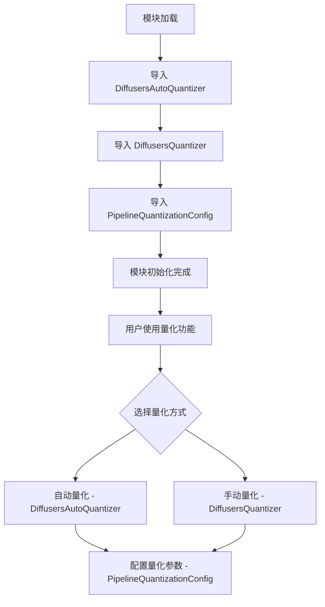

# `diffusers\src\diffusers\quantizers\__init__.py` 详细设计文档

该模块是HuggingFace Diffusers量化功能的核心入口文件，主要负责导出量化相关的核心类：DiffusersAutoQuantizer（自动量化器）、DiffusersQuantizer（量化器基类）和PipelineQuantizationConfig（流水线量化配置），为Diffusers模型提供量化推理能力。

## 整体流程



## 类结构

```
DiffusersQuantizer (基类/抽象基类)
├── DiffusersAutoQuantizer (自动量化器)
└── PipelineQuantizationConfig (配置类)
```

## 全局变量及字段


    

## 全局函数及方法


## 关键组件


### DiffusersAutoQuantizer

自动量化器，负责根据模型和配置自动选择和应用量化策略。该模块从 .auto 子模块导入，用于简化量化配置过程。

### DiffusersQuantizer

基础量化器类，定义了量化接口和通用方法。该模块从 .base 子模块导入，作为所有具体量化实现的基类。

### PipelineQuantizationConfig

流水线量化配置类，存储和管理量化参数。该模块从 .pipe_quant_config 子模块导入，用于配置整个推理流水线的量化选项。

### 张量索引与惰性加载

虽然当前代码未直接体现，但基于模块名称推测，该量化框架支持在推理时按需加载和索引张量数据，避免全量加载导致的内存占用。

### 反量化支持

量化后的权重需要反量化回原始精度进行计算，该模块通过 DiffusersQuantizer 基类提供反量化逻辑支持。

### 量化策略

从模块架构来看，DiffusersAutoQuantizer 负责自动选择量化策略（如动态量化、静态量化），PipelineQuantizationConfig 存储策略参数，DiffusersQuantizer 执行具体量化操作。


## 问题及建议


### 已知问题

- 缺少包级别的文档字符串（__init__.py 应包含模块说明）
- 未定义 `__all__` 变量明确公共 API 导出，可能导致意外暴露内部实现细节
- 缺少版本信息管理，无法追踪包版本变化
- 无可选依赖处理，如果导入的模块依赖未安装的库会导致 ImportError
- 使用相对导入但未做兼容性说明，可能在某些导入场景下出现问题
- 缺少类型注解信息，不利于静态分析和类型检查工具工作

### 优化建议

- 添加 `__all__ = ["DiffusersAutoQuantizer", "DiffusersQuantizer", "PipelineQuantizationConfig"]` 明确导出接口
- 添加包级别 docstring 描述模块功能（如"This package provides quantization utilities for Diffusers models"）
- 使用 try-except 处理可选依赖导入，提供更友好的错误提示
- 考虑使用延迟导入（lazy import）以减少模块加载时间，特别是当这些类不总是被使用时
- 添加类型提示文件（.pyi）或在导入时添加类型信息
- 添加版本常量 `__version__` 以便外部调用


## 其它


### 设计目标与约束

本模块旨在为Hugging Face Diffusers库提供模型量化功能，支持对扩散模型进行量化配置以减少模型大小和推理内存占用。设计约束包括：必须兼容Diffusers库的最新API，量化配置需遵循Apache 2.0许可证，仅支持PyTorch后端，量化过程不应破坏原始模型的推理精度。

### 错误处理与异常设计

模块主要通过Python异常机制处理错误场景。当导入的类不存在时应抛出ImportError，当量化配置参数无效时应抛出ValueError，当量化器不支持指定模型类型时应抛出NotImplementedError。异常信息应包含详细的错误描述和可能的修复建议。

### 数据流与状态机

数据流从PipelineQuantizationConfig开始，经由DiffusersQuantizer进行量化参数验证，最后由DiffusersAutoQuantizer根据模型类型自动选择合适的量化实现。状态机包含三个主要状态：初始化状态（加载配置）、验证状态（检查量化参数兼容性）、执行状态（应用量化配置）。

### 外部依赖与接口契约

核心依赖包括diffusers库、PyTorch框架以及可能的量化后端（如bitsandbytes）。接口契约规定DiffusersQuantizer作为基类需实现quantize和dequantize方法，DiffusersAutoQuantizer需实现from_pretrained方法返回对应的量化器实例，PipelineQuantizationConfig需提供to_dict和from_dict方法用于配置序列化。

### 性能考虑

量化操作本身应尽可能减少额外的计算开销，配置加载应支持缓存机制以避免重复解析。对于大规模模型批量量化场景，应考虑支持并行处理和增量量化。自动量化器应维护量化器注册表以提高查找效率。

### 安全性考虑

量化配置中可能包含敏感的模型参数，应确保配置对象在序列化时不泄露敏感信息。远程加载量化配置时应验证来源可靠性。应遵循最小权限原则，仅请求必要的权限和资源。

### 兼容性考虑

模块应保持向后兼容，新版本量化配置格式应能读取旧版本配置。应记录与不同Diffusers版本、PyTorch版本的兼容性矩阵。对于废弃的量化方法应提供平滑迁移路径和合理的弃用警告。

### 测试策略

应包含单元测试覆盖所有量化配置类、集成测试验证量化模型与Diffusers pipeline的兼容性、性能测试对比量化前后的推理速度和内存占用、边界测试验证异常输入的处理能力。

### 部署注意事项

在生产环境部署时需确保量化依赖正确安装，注意不同硬件平台（CPU/GPU）的量化支持差异，监控量化模型的推理质量指标，建议在部署前进行充分的模型精度验证测试。

    