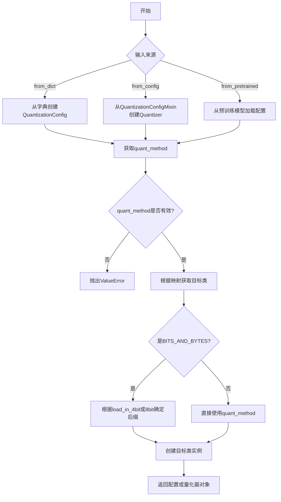
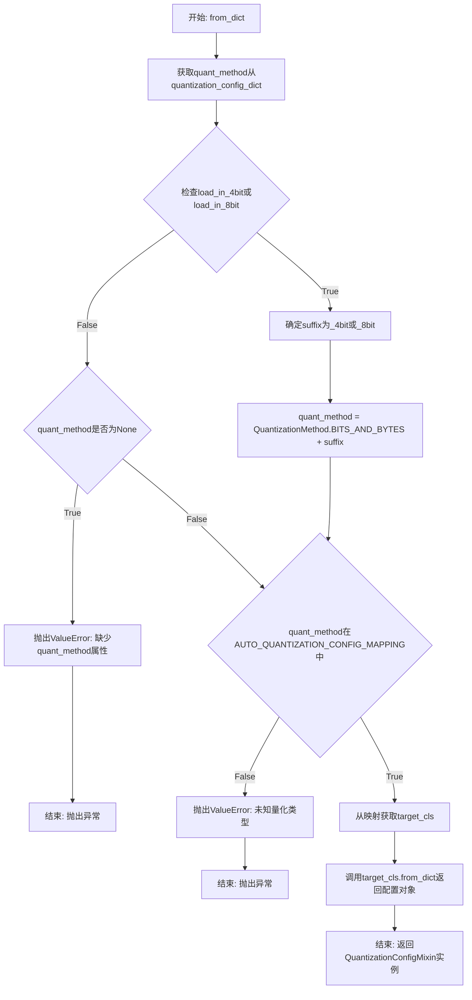
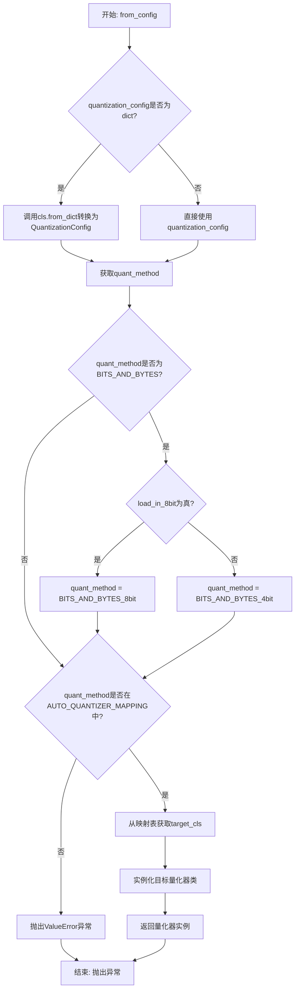
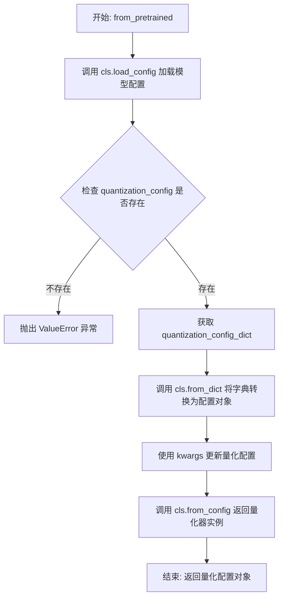
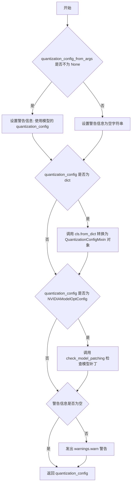
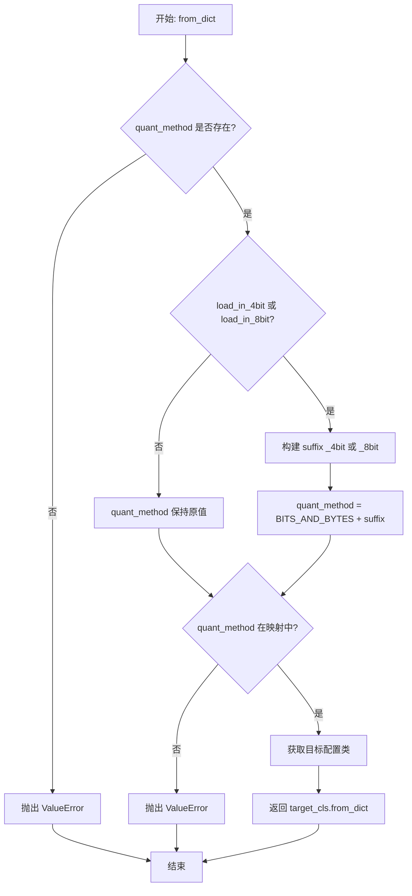
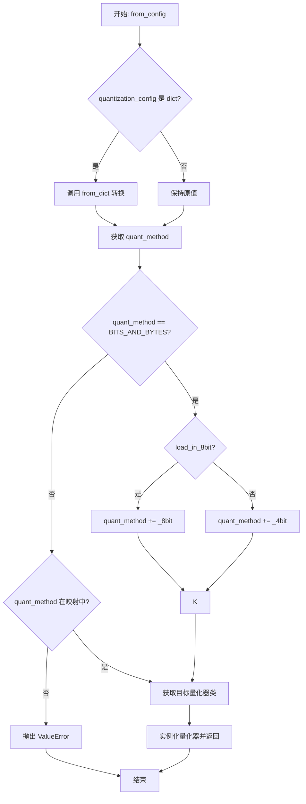
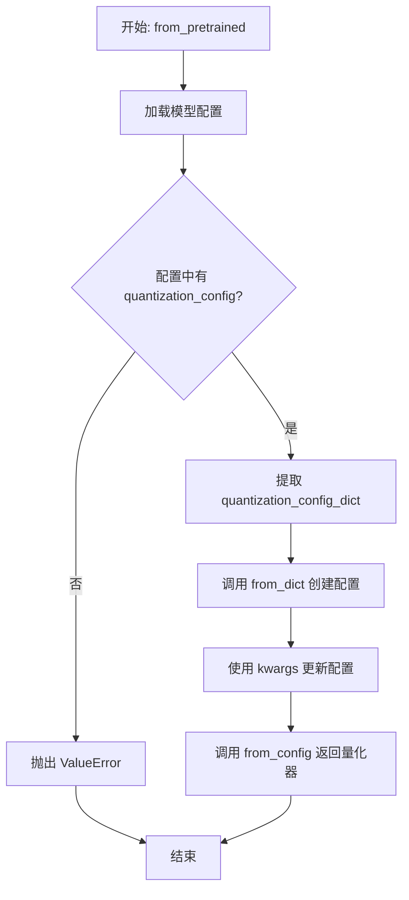
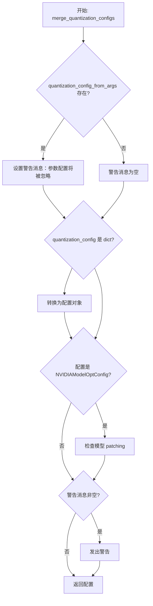

# `diffusers\src\diffusers\quantizers\auto.py` 详细设计文档

这是一个自动量化器类，用于根据量化配置自动实例化正确的DiffusersQuantizer，支持多种量化方法(bitsandbytes_4bit, bitsandbytes_8bit, gguf, quanto, torchao, modelopt)，实现量化配置与量化器的自动映射和动态加载。

## 整体流程



## 类结构

```
DiffusersAutoQuantizer (自动量化器类)
├── from_dict (类方法：从字典创建量化配置)
├── from_config (类方法：从配置对象创建量化器)
├── from_pretrained (类方法：从预训练模型加载)
└── merge_quantization_configs (类方法：合并量化配置)
```

## 全局变量及字段


### `AUTO_QUANTIZER_MAPPING`
    
映射量化方法名称到对应的Diffusers量化器类的字典

类型：`dict[str, type]`
    


### `AUTO_QUANTIZATION_CONFIG_MAPPING`
    
映射量化方法名称到对应的量化配置类的字典

类型：`dict[str, type]`
    


### `bitsandbytes.BnB4BitDiffusersQuantizer`
    
BitsAndBytes 4位量化器的Diffusers实现类

类型：`type`
    


### `bitsandbytes.BnB8BitDiffusersQuantizer`
    
BitsAndBytes 8位量化器的Diffusers实现类

类型：`type`
    


### `gguf.GGUFQuantizer`
    
GGUF格式量化器的Diffusers实现类

类型：`type`
    


### `modelopt.NVIDIAModelOptQuantizer`
    
NVIDIA ModelOpt量化器的Diffusers实现类

类型：`type`
    


### `quantization_config.BitsAndBytesConfig`
    
BitsAndBytes量化配置类，支持4位和8位量化

类型：`type`
    


### `quantization_config.GGUFQuantizationConfig`
    
GGUF量化方法的配置类

类型：`type`
    


### `quantization_config.NVIDIAModelOptConfig`
    
NVIDIA ModelOpt量化方法的配置类

类型：`type`
    


### `quantization_config.QuantizationConfigMixin`
    
量化配置混入类，定义量化配置的通用接口

类型：`type`
    


### `quantization_config.QuantizationMethod`
    
量化方法枚举类，定义支持的量化方法类型

类型：`type`
    


### `quantization_config.QuantoConfig`
    
Quanto量化方法的配置类

类型：`type`
    


### `quantization_config.TorchAoConfig`
    
TorchAO量化方法的配置类

类型：`type`
    


### `quanto.QuantoQuantizer`
    
Quanto量化器的Diffusers实现类

类型：`type`
    


### `torchao.TorchAoHfQuantizer`
    
TorchAO量化器的HuggingFace实现类

类型：`type`
    
    

## 全局函数及方法


### `DiffusersAutoQuantizer.from_dict`

该类方法用于根据提供的量化配置字典自动实例化相应的量化配置对象，支持多种量化方法（如bitsandbytes、gguf、quanto、torchao、modelopt）的动态选择与初始化。

参数：

- `cls`：类型，当前类（`DiffusersAutoQuantizer`），隐式参数，表示类方法
- `quantization_config_dict`：`dict`，包含量化配置的字典，必须包含`quant_method`键，或通过`load_in_4bit`/`load_in_8bit`键推断量化方法

返回值：`QuantizationConfigMixin`，根据量化方法映射到的具体配置类（如`BitsAndBytesConfig`、`GGUFQuantizationConfig`等）的实例

#### 流程图



#### 带注释源码

```python
@classmethod
def from_dict(cls, quantization_config_dict: dict):
    """
    根据量化配置字典自动实例化对应的量化配置类
    
    参数:
        quantization_config_dict: 包含量化配置的字典
            - quant_method: 量化方法（如"bitsandbytes_4bit"）
            - load_in_4bit: 是否加载为4位量化
            - load_in_8bit: 是否加载为8位量化
    
    返回:
        对应量化方法的具体配置类实例
    
    异常:
        ValueError: 缺少quant_method或量化方法不支持
    """
    # 从配置字典中获取quant_method，若不存在则默认为None
    quant_method = quantization_config_dict.get("quant_method", None)
    
    # 特殊处理bnb（BitsAndBytes）模型，需要根据load_in_4bit/load_in_8bit添加后缀
    # 以区分4位和8位量化配置
    if quantization_config_dict.get("load_in_8bit", False) or quantization_config_dict.get("load_in_4bit", False):
        # 如果load_in_4bit为True则使用_4bit后缀，否则使用_8bit
        suffix = "_4bit" if quantization_config_dict.get("load_in_4bit", False) else "_8bit"
        # 拼接完整的量化方法标识符
        quant_method = QuantizationMethod.BITS_AND_BYTES + suffix
    elif quant_method is None:
        # 如果没有指定量化方法且不是bnb模型，抛出错误
        raise ValueError(
            "The model's quantization config from the arguments has no `quant_method` attribute. Make sure that the model has been correctly quantized"
        )

    # 验证量化方法是否在支持列表中
    if quant_method not in AUTO_QUANTIZATION_CONFIG_MAPPING.keys():
        raise ValueError(
            f"Unknown quantization type, got {quant_method} - supported types are:"
            f" {list(AUTO_QUANTIZER_MAPPING.keys())}"
        )

    # 根据量化方法从映射表获取对应的配置类
    target_cls = AUTO_QUANTIZATION_CONFIG_MAPPING[quant_method]
    # 调用配置类的from_dict方法创建实例并返回
    return target_cls.from_dict(quantization_config_dict)
```


### `DiffusersAutoQuantizer.from_config`

该方法是一个类方法，负责根据传入的量化配置（可以是字典或`QuantizationConfigMixin`对象）自动实例化对应的量化器。它首先将字典形式的配置转换为`QuantizationConfig`对象，然后根据量化方法类型从映射表中查找并创建相应的量化器实例。

参数：

- `quantization_config`：`QuantizationConfigMixin | dict`，量化配置对象或包含量化配置的字典
- `**kwargs`：可变关键字参数，用于传递给目标量化器类的构造函数

返回值：`DiffusersQuantizer`（具体类型由`quant_method`决定），返回对应量化方法的具体量化器实例

#### 流程图



#### 带注释源码

```python
@classmethod
def from_config(cls, quantization_config: QuantizationConfigMixin | dict, **kwargs):
    """
    从QuantizationConfigMixin或dict创建对应的DiffusersQuantizer实例。
    
    参数:
        quantization_config: 量化配置，可以是QuantizationConfigMixin对象或字典
        **kwargs: 额外参数，传递给目标量化器构造函数
    
    返回:
        对应量化方法的具体DiffusersQuantizer子类的实例
    """
    # 如果传入的是字典，先将其转换为QuantizationConfig对象
    if isinstance(quantization_config, dict):
        quantization_config = cls.from_dict(quantization_config)

    # 从配置对象中获取量化方法
    quant_method = quantization_config.quant_method

    # BITS_AND_BYTES特殊处理：同一个配置类同时支持4bit和8bit量化
    # 需要根据load_in_8bit标志来确定具体的量化方法
    if quant_method == QuantizationMethod.BITS_AND_BYTES:
        if quantization_config.load_in_8bit:
            quant_method += "_8bit"
        else:
            quant_method += "_4bit"

    # 验证量化方法是否在支持列表中
    if quant_method not in AUTO_QUANTIZER_MAPPING.keys():
        raise ValueError(
            f"Unknown quantization type, got {quant_method} - supported types are:"
            f" {list(AUTO_QUANTIZER_MAPPING.keys())}"
        )

    # 从映射表获取对应量化器类
    target_cls = AUTO_QUANTIZER_MAPPING[quant_method]
    # 使用配置和额外参数实例化量化器并返回
    return target_cls(quantization_config, **kwargs)
```


### `DiffusersAutoQuantizer.from_pretrained`

该方法是一个类方法，用于从预训练模型路径自动加载量化配置，并实例化对应的量化器。它首先加载模型配置，检查是否存在量化配置，然后将配置字典转换为量化配置对象，最后返回相应类型的量化器实例。

参数：

- `cls`：类本身（隐式参数），表示 DiffusersAutoQuantizer 类
- `pretrained_model_name_or_path`：`str`，预训练模型的名称或路径，用于定位模型配置文件
- `**kwargs`：`任意类型`，可变关键字参数，会传递给 `load_config` 和后续的 `from_config` 方法，用于覆盖或补充量化配置

返回值：`QuantizationConfigMixin`，返回具体的量化配置对象（可能是 BitsAndBytesConfig、GGUFQuantizationConfig、QuantoConfig、TorchAoConfig 或 NVIDIAModelOptConfig 的实例）

#### 流程图



#### 带注释源码

```python
@classmethod
def from_pretrained(cls, pretrained_model_name_or_path, **kwargs):
    """
    从预训练模型路径加载量化配置并返回对应的量化器实例。
    
    参数:
        pretrained_model_name_or_path: 预训练模型的名称或路径
        **kwargs: 传递给 load_config 的额外参数
    
    返回:
        QuantizationConfigMixin: 具体的量化配置对象实例
    """
    # 步骤1: 调用类方法 load_config 加载模型的配置文件（通常是 config.json）
    model_config = cls.load_config(pretrained_model_name_or_path, **kwargs)
    
    # 步骤2: 检查模型配置中是否包含 quantization_config 属性
    if getattr(model_config, "quantization_config", None) is None:
        # 如果没有量化配置，抛出错误提示用户模型未被正确量化
        raise ValueError(
            f"Did not found a `quantization_config` in {pretrained_model_name_or_path}. "
            f"Make sure that the model is correctly quantized."
        )
    
    # 步骤3: 从模型配置中获取 quantization_config 字典
    quantization_config_dict = model_config.quantization_config
    
    # 步骤4: 调用类方法 from_dict 将字典转换为 QuantizationConfigMixin 对象
    quantization_config = cls.from_dict(quantization_config_dict)
    
    # 步骤5: 使用传入的 kwargs 更新量化配置对象（允许用户覆盖默认配置）
    # Update with potential kwargs that are passed through from_pretrained.
    quantization_config.update(kwargs)
    
    # 步骤6: 调用类方法 from_config 实例化并返回具体的量化器
    return cls.from_config(quantization_config)
```


### `DiffusersAutoQuantizer.merge_quantization_configs`

该方法用于处理从参数传入的量化配置和从模型配置中加载的量化配置同时存在的情况，确保最终使用模型自带的量化配置，并在存在冲突时发出警告。

参数：

- `quantization_config`：`dict | QuantizationConfigMixin`，模型的量化配置字典或配置对象
- `quantization_config_from_args`：`QuantizationConfigMixin | None`，从参数传入的量化配置，如果为 None 则表示没有传入额外的量化配置

返回值：`QuantizationConfigMixin`，处理后的最终量化配置对象

#### 流程图



#### 带注释源码

```python
@classmethod
def merge_quantization_configs(
    cls,
    quantization_config: dict | QuantizationConfigMixin,
    quantization_config_from_args: QuantizationConfigMixin | None,
):
    """
    handles situations where both quantization_config from args and quantization_config from model config are
    present.
    """
    # 如果从参数传入了量化配置，设置警告信息提示将使用模型自带的配置
    if quantization_config_from_args is not None:
        warning_msg = (
            "You passed `quantization_config` or equivalent parameters to `from_pretrained` but the model you're loading"
            " already has a `quantization_config` attribute. The `quantization_config` from the model will be used."
        )
    else:
        # 没有传入额外配置时，警告信息为空
        warning_msg = ""

    # 如果 quantization_config 是字典格式，转换为 QuantizationConfigMixin 对象
    if isinstance(quantization_config, dict):
        quantization_config = cls.from_dict(quantization_config)

    # 如果是 NVIDIA ModelOpt 配置，进行模型补丁检查
    if isinstance(quantization_config, NVIDIAModelOptConfig):
        quantization_config.check_model_patching()

    # 如果存在警告信息，发出警告
    if warning_msg != "":
        warnings.warn(warning_msg)

    # 返回处理后的量化配置
    return quantization_config
```


## 关键组件


## 一段话描述

DiffusersAutoQuantizer 是一个自动量化器工厂类，通过映射机制根据量化方法（bitsandbytes 4bit/8bit、gguf、quanto、torchao、modelopt）自动实例化相应的量化器类和量化配置类，支持从字典、配置对象和预训练模型三种方式加载量化配置，并提供配置合并功能以处理命令行参数与模型内置配置的冲突。

## 文件的整体运行流程

该文件主要通过 DiffusersAutoQuantizer 类的类方法实现量化器的自动选择和实例化。运行流程如下：

1. **入口点选择**：根据输入类型调用不同的类方法（from_dict、from_config 或 from_pretrained）
2. **量化方法解析**：从配置中提取 quant_method 或根据 load_in_4bit/load_in_8bit 推断
3. **映射查找**：在 AUTO_QUANTIZER_MAPPING 和 AUTO_QUANTIZATION_CONFIG_MAPPING 中查找对应的类
4. **实例化**：使用查找到的类创建量化器或配置对象
5. **配置合并**：可选地合并来自命令行参数的配置

## 类的详细信息

### 类：DiffusersAutoQuantizer

**描述**：自动量化器工厂类，负责根据量化配置动态选择和实例化正确的量化器实现。

**类字段**：

无类字段（仅包含类方法）。

**类方法**：

#### 1. from_dict

- **名称**：from_dict
- **参数名称**：quantization_config_dict
- **参数类型**：dict
- **参数描述**：包含量化配置的字典，必须包含 quant_method 键，或包含 load_in_4bit/load_in_8bit 用于推断量化方法
- **返回值类型**：QuantizationConfigMixin 子类
- **返回值描述**：从字典解析出的量化配置对象

**mermaid 流程图**：



**带注释源码**：

```python
@classmethod
def from_dict(cls, quantization_config_dict: dict):
    """从字典创建量化配置对象"""
    quant_method = quantization_config_dict.get("quant_method", None)
    # 兼容处理：对于 bitsandbytes，需要根据 load_in_4bit/load_in_8bit 构建完整的 quant_method
    if quantization_config_dict.get("load_in_8bit", False) or quantization_config_dict.get("load_in_4bit", False):
        # 根据位数添加后缀
        suffix = "_4bit" if quantization_config_dict.get("load_in_4bit", False) else "_8bit"
        quant_method = QuantizationMethod.BITS_AND_BYTES + suffix
    elif quant_method is None:
        # 缺少 quant_method 时抛出错误
        raise ValueError(
            "The model's quantization config from the arguments has no `quant_method` attribute. Make sure that the model has been correctly quantized"
        )

    # 验证 quant_method 是否在支持的映射中
    if quant_method not in AUTO_QUANTIZATION_CONFIG_MAPPING.keys():
        raise ValueError(
            f"Unknown quantization type, got {quant_method} - supported types are:"
            f" {list(AUTO_QUANTIZER_MAPPING.keys())}"
        )

    # 从映射获取配置类并实例化
    target_cls = AUTO_QUANTIZATION_CONFIG_MAPPING[quant_method]
    return target_cls.from_dict(quantization_config_dict)
```

#### 2. from_config

- **名称**：from_config
- **参数名称**：quantization_config, **kwargs
- **参数类型**：QuantizationConfigMixin | dict, **kwargs
- **参数描述**：量化配置对象或字典，可传递额外关键字参数到量化器构造函数
- **返回值类型**：DiffusersQuantizer 子类
- **返回值描述**：根据配置实例化的量化器对象

**mermaid 流程图**：



**带注释源码**：

```python
@classmethod
def from_config(cls, quantization_config: QuantizationConfigMixin | dict, **kwargs):
    # 如果是字典，先转换为 QuantizationConfig 对象
    if isinstance(quantization_config, dict):
        quantization_config = cls.from_dict(quantization_config)

    quant_method = quantization_config.quant_method

    # 特殊处理：BitsAndBytes 使用单一配置类但需要区分 4bit 和 8bit
    if quant_method == QuantizationMethod.BITS_AND_BYTES:
        if quantization_config.load_in_8bit:
            quant_method += "_8bit"
        else:
            quant_method += "_4bit"

    # 验证量化方法是否被支持
    if quant_method not in AUTO_QUANTIZER_MAPPING.keys():
        raise ValueError(
            f"Unknown quantization type, got {quant_method} - supported types are:"
            f" {list(AUTO_QUANTIZER_MAPPING.keys())}"
        )

    # 从映射获取量化器类并用配置实例化
    target_cls = AUTO_QUANTIZER_MAPPING[quant_method]
    return target_cls(quantization_config, **kwargs)
```

#### 3. from_pretrained

- **名称**：from_pretrained
- **参数名称**：pretrained_model_name_or_path, **kwargs
- **参数类型**：str, **kwargs
- **参数描述**：预训练模型的名称或路径，可传递额外参数用于覆盖配置
- **返回值类型**：DiffusersQuantizer 子类
- **返回值描述**：从预训练模型加载配置后实例化的量化器对象

**mermaid 流程图**：



**带注释源码**：

```python
@classmethod
def from_pretrained(cls, pretrained_model_name_or_path, **kwargs):
    """从预训练模型加载量化器"""
    # 加载模型配置文件
    model_config = cls.load_config(pretrained_model_name_or_path, **kwargs)
    # 检查是否存在量化配置
    if getattr(model_config, "quantization_config", None) is None:
        raise ValueError(
            f"Did not found a `quantization_config` in {pretrained_model_name_or_path}. Make sure that the model is correctly quantized."
        )
    # 提取量化配置字典
    quantization_config_dict = model_config.quantization_config
    # 解析为配置对象
    quantization_config = cls.from_dict(quantization_config_dict)
    # 用 kwargs 更新配置（允许覆盖）
    quantization_config.update(kwargs)

    return cls.from_config(quantization_config)
```

#### 4. merge_quantization_configs

- **名称**：merge_quantization_configs
- **参数名称**：quantization_config, quantization_config_from_args
- **参数类型**：dict | QuantizationConfigMixin, QuantizationConfigMixin | None
- **参数描述**：模型内置的量化配置和从命令行参数传入的量化配置，用于处理配置冲突
- **返回值类型**：QuantizationConfigMixin
- **返回值描述**：合并后的量化配置对象，优先使用模型内置配置

**mermaid 流程图**：



**带注释源码**：

```python
@classmethod
def merge_quantization_configs(
    cls,
    quantization_config: dict | QuantizationConfigMixin,
    quantization_config_from_args: QuantizationConfigMixin | None,
):
    """
    handles situations where both quantization_config from args and quantization_config from model config are
    present.
    """
    # 决定使用哪个配置，模型内置配置优先
    if quantization_config_from_args is not None:
        warning_msg = (
            "You passed `quantization_config` or equivalent parameters to `from_pretrained` but the model you're loading"
            " already has a `quantization_config` attribute. The `quantization_config` from the model will be used."
        )
    else:
        warning_msg = ""

    # 统一转换为配置对象
    if isinstance(quantization_config, dict):
        quantization_config = cls.from_dict(quantization_config)

    # NVIDIA ModelOpt 需要特殊检查
    if isinstance(quantization_config, NVIDIAModelOptConfig):
        quantization_config.check_model_patching()

    # 发出警告（如果需要）
    if warning_msg != "":
        warnings.warn(warning_msg)

    return quantization_config
```

---

## 全局变量和全局函数详细信息

### 全局变量

#### AUTO_QUANTIZER_MAPPING

- **名称**：AUTO_QUANTIZER_MAPPING
- **类型**：dict
- **描述**：量化方法名称到量化器类的映射字典，用于根据 quant_method 动态选择量化器实现类

#### AUTO_QUANTIZATION_CONFIG_MAPPING

- **名称**：AUTO_QUANTIZATION_CONFIG_MAPPING
- **类型**：dict
- **描述**：量化方法名称到量化配置类的映射字典，用于根据 quant_method 动态选择配置类

---

## 关键组件信息

### 组件1：量化方法映射机制

通过 AUTO_QUANTIZER_MAPPING 和 AUTO_QUANTIZATION_CONFIG_MAPPING 两个字典实现量化器与配置类的动态绑定，支持 bitsandbytes_4bit、bitsandbytes_8bit、gguf、quanto、torchao、modelopt 六种量化方法

### 组件2：BitsAndBytes 特殊处理逻辑

在 from_dict 和 from_config 方法中对 BitsAndBytes 量化方法进行特殊处理，根据 load_in_4bit 或 load_in_8bit 标志动态添加后缀以区分 4bit 和 8bit 量化器，因为两者共享同一个配置类 BitsAndBytesConfig

### 组件3：多层配置加载接口

提供三种配置加载入口（from_dict、from_pretrained、from_config），支持从字典、预训练模型文件、配置对象多种来源加载量化配置，具有良好的扩展性和兼容性

### 组件4：配置合并与冲突处理

merge_quantization_configs 方法处理命令行参数与模型内置配置的冲突，遵循模型内置配置优先的原则，并针对 NVIDIAModelOptConfig 进行额外的模型 patching 检查

---

## 潜在的技术债务或优化空间

1. **重复的 BitsAndBytes 处理逻辑**：在 from_dict 和 from_config 方法中都有类似的 BitsAndBytes 后缀处理逻辑，存在代码重复，可以提取为私有方法

2. **硬编码的映射关系**：量化方法映射目前是硬编码的静态字典，未来添加新的量化方法需要修改多处，建议改为注册机制

3. **错误信息一致性**：不同方法中错误信息格式略有差异，建议统一错误处理和提示格式

4. **缺少日志记录**：当前仅使用 warnings.warn 进行警告，缺少详细的日志记录机制，不利于生产环境调试

5. **load_config 方法缺失**：from_pretrained 方法调用了 cls.load_config，但该方法未在此文件中定义，依赖外部实现，存在隐式依赖

---

## 其它项目

### 设计目标与约束

- **设计模式**：采用工厂模式（Factory Pattern）实现量化器的动态选择
- **向后兼容**：通过 BitsAndBytes 的后缀处理逻辑确保与旧版本配置格式的兼容性
- **单一职责**：每个类方法职责明确，from_dict 负责解析、from_config 负责实例化、merge_quantization_configs 负责合并

### 错误处理与异常设计

- 当 quant_method 不在映射中时，抛出 ValueError 并列出支持的量化方法列表
- 当模型配置中缺少 quantization_config 属性时，抛出 ValueError 提示模型未正确量化
- 当同时传入配置参数和存在模型内置配置时，发出警告并使用模型内置配置

### 数据流与状态机

- 配置加载流程：字典 → 配置对象 → 量化器对象
- 量化方法推断流程：显式 quant_method 或基于 load_in_4bit/load_in_8bit 推断
- 配置优先级：模型内置配置 > 命令行参数配置

### 外部依赖与接口契约

- 依赖 QuantizationConfigMixin 基类及其子类（BitsAndBytesConfig、GGUFQuantizationConfig 等）
- 依赖 QuantizationMethod 枚举定义量化方法常量
- 依赖各个量化器类（BnB4BitDiffusersQuantizer、BnB8BitDiffusersQuantizer、GGUFQuantizer 等）
- from_pretrained 隐式依赖外部的 load_config 方法实现


## 问题及建议


### 已知问题

- **类型混用问题**：在 `from_dict` 和 `from_config` 方法中，对 `QuantizationMethod` 枚举类型使用字符串拼接操作（`QuantizationMethod.BITS_AND_BYTES + suffix`），这种做法不够类型安全，可能导致意外行为。
- **bnb 量化方法判断逻辑重复且不一致**：bnb 相关的量化方法判断逻辑在 `from_dict` 和 `from_config` 中重复出现，且判断条件不完全一致（`from_dict` 中判断 `load_in_8bit/4bit`，`from_config` 中判断 `quantization_config.load_in_8bit`），容易造成维护困难。
- **参数类型处理不够健壮**：`from_dict` 方法接收 `dict` 类型参数但没有类型提示，`from_config` 方法的参数类型标注为 `QuantizationConfigMixin | dict` 但内部需要额外转换。
- **warning_msg 处理方式不够优雅**：使用空字符串 `""` 作为判断条件，应该使用 `None` 或更明确的布尔标志。
- **merge_quantization_configs 方法设计冗余**：该方法同时处理 `dict` 和 `QuantizationConfigMixin` 两种类型，职责不够单一，且与 `from_dict`、`from_config` 功能存在部分重叠。
- **缺少对 `load_in_8bit` 和 `load_in_4bit` 同时为 True 的错误处理**：在 `from_dict` 中如果两个参数同时为 True，逻辑行为不明确。

### 优化建议

- 将 bnb 的量化方法映射逻辑抽取为独立的私有方法，避免代码重复。
- 使用 `None` 替代空字符串作为"无警告"的标志，使逻辑更清晰。
- 为 `from_dict` 方法的参数添加类型提示 `typing.Dict[str, Any]`。
- 在 `from_dict` 中添加对 `load_in_8bit` 和 `load_in_4bit` 同时为 True 的错误处理。
- 考虑使用 `dataclass` 或 `pydantic` 等方式增强配置类的类型安全和验证能力。
- 统一量化方法字符串的生成方式，可以考虑在 `QuantizationMethod` 枚举中添加辅助方法。

## 其它


### 设计目标与约束

**设计目标**：
- 实现自动化的模型量化器选择机制，根据 quantization config 自动实例化对应的 DiffusersQuantizer
- 提供统一的接口（from_dict、from_config、from_pretrained）来加载量化配置
- 支持多种量化后端（BitsAndBytes、GGUF、Quanto、TorchAO、ModelOpt）

**约束条件**：
- 依赖 QuantizationConfigMixin 抽象基类，所有量化配置类必须继承该类
- 必须维护向后兼容性，特别是对 BitsAndBytes 的 4bit 和 8bit 处理
- quant_method 必须在 AUTO_QUANTIZER_MAPPING 和 AUTO_QUANTIZATION_CONFIG_MAPPING 中注册

### 错误处理与异常设计

**异常类型**：
1. **ValueError** - 当 quant_method 为 None 或不在支持列表中时抛出
2. **AttributeError** - 当模型配置中缺少 quantization_config 属性时抛出（在 from_pretrained 中）

**错误处理策略**：
- from_dict 方法：检查 quant_method 是否存在，若不存在且没有 load_in_4bit/8bit 标志则抛出详细错误信息
- from_config 方法：将 dict 转换为 QuantizationConfig 对象后验证 quant_method
- from_pretrained 方法：先加载配置文件，验证是否存在 quantization_config，再进行后续处理
- merge_quantization_configs 方法：处理配置合并时的冲突，使用模型原有配置并给出警告

### 数据流与状态机

**主要数据流**：
1. **from_dict 流程**：dict 输入 → 提取 quant_method → 处理 BNB 特殊情况 → 映射到配置类 → 调用 from_dict 返回配置对象
2. **from_config 流程**：Config/Dict 输入 → 转换为 QuantizationConfig → 提取 quant_method → 处理 BNB 后缀 → 映射到量化器类 → 实例化返回
3. **from_pretrained 流程**：模型路径 → load_config → 提取 quantization_config → from_dict → from_config → 返回量化器实例
4. **merge_quantization_configs 流程**：两个配置输入 → 合并策略（使用模型配置）→ 返回最终配置

**状态转换**：
- quant_method 字符串状态：None → 具体方法名（如 bitsandbytes_4bit）
- 配置对象状态：dict → QuantizationConfigMixin 子类实例

### 外部依赖与接口契约

**外部依赖**：
1. **量化器类**：BnB4BitDiffusersQuantizer、BnB8BitDiffusersQuantizer、GGUFQuantizer、QuantoQuantizer、TorchAoHfQuantizer、NVIDIAModelOptQuantizer
2. **配置类**：BitsAndBytesConfig、GGUFQuantizationConfig、QuantoConfig、TorchAoConfig、NVIDIAModelOptConfig
3. **枚举类**：QuantizationMethod（定义量化方法常量）
4. **抽象基类**：QuantizationConfigMixin（所有配置类的基类）

**接口契约**：
- AUTO_QUANTIZER_MAPPING：quant_method 字符串到量化器类的映射
- AUTO_QUANTIZATION_CONFIG_MAPPING：quant_method 字符串到配置类的映射
- 量化器类必须接受 (quantization_config, **kwargs) 构造函数签名
- 配置类必须实现 from_dict 类方法返回配置实例

### 性能考虑

**性能优化点**：
- 使用类方法（@classmethod）避免实例化额外对象
- 配置合并时使用 dict.get() 避免多次字典查找
- 避免不必要的对象复制，直接操作引用

**潜在性能瓶颈**：
- from_pretrained 中调用 load_config 可能涉及远程模型加载
- 每次调用都需要遍历 MAPPING 字典进行查找

### 安全性考虑

**安全检查**：
- 验证 quant_method 是否在白名单中，防止任意类加载
- NVIDIAModelOptConfig 在合并时会调用 check_model_patching() 进行模型修补验证

**风险点**：
- 动态类加载机制可能被恶意配置利用
- 未验证的 quantization_config_dict 可能包含危险参数

### 兼容性设计

**向后兼容性**：
- 处理遗留的 load_in_4bit/load_in_8bit 参数，自动映射到新的 quant_method
- BitsAndBytes 使用单一配置类支持 4bit 和 8bit，通过后缀区分

**版本兼容性**：
- 依赖于 transformers 库的 QuantizationMethod 枚举
- 配置更新机制允许 kwargs 覆盖原有配置

### 测试策略建议

**单元测试**：
- 测试每种 quant_method 的 from_dict、from_config 流程
- 测试配置合并逻辑和警告信息
- 测试异常抛出场景（无效 quant_method、缺失配置等）

**集成测试**：
- 测试 from_pretrained 加载真实量化模型
- 测试不同量化方法之间的互操作性

### 部署注意事项

**环境要求**：
- 需要安装对应的量化库（bitsandbytes、gguf、quanto、torchao、modelopt）
- Python 版本支持取决于依赖库要求

**配置管理**：
- 量化配置应作为模型元数据保存
- 支持从预训练模型自动加载量化配置
- 生产环境应注意量化配置的安全性验证

    