# `diffusers\src\diffusers\quantizers\base.py` 详细设计文档

DiffusersQuantizer是一个抽象基类，用于对HuggingFace Diffusers模型进行量化处理，支持推理和/或量化操作。该类主要被diffusers.models.modeling_utils.ModelMixin.from_pretrained方法调用，提供模型预处理、权重加载、量化参数检查、后处理以及解量化等核心功能。

## 整体流程

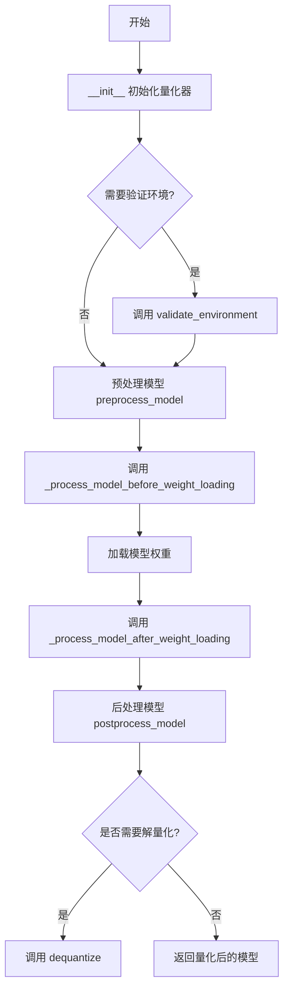
```mermaid
graph TD
A[开始] --> B[__init__ 初始化量化器]
B --> C{需要验证环境?}
C -- 是 --> D[调用 validate_environment]
C -- 否 --> E[预处理模型 preprocess_model]
D --> E
E --> F[调用 _process_model_before_weight_loading]
F --> G[加载模型权重]
G --> H[调用 _process_model_after_weight_loading]
H --> I[后处理模型 postprocess_model]
I --> J{是否需要解量化?}
J -- 是 --> K[调用 dequantize]
J -- 否 --> L[返回量化后的模型]
```

## 类结构

```
DiffusersQuantizer (抽象基类)
│
│   # 抽象属性（必须由子类实现）
│   ├── is_serializable (property)
│   ├── is_trainable (property)
│   │
│   │   # 抽象方法（必须由子类实现）
│   ├── _process_model_before_weight_loading()
│   ├── _process_model_after_weight_loading()
│   │
│   │   # 可选重写方法
│   ├── update_torch_dtype()
│   ├── update_device_map()
│   ├── adjust_target_dtype()
│   ├── update_missing_keys()
│   ├── get_special_dtypes_update()
│   ├── adjust_max_memory()
│   ├── check_if_quantized_param()
│   ├── create_quantized_param()
│   ├── check_quantized_param_shape()
│   ├── validate_environment()
│   ├── preprocess_model()
│   ├── postprocess_model()
│   ├── dequantize()
│   ├── _dequantize()
│   └── get_cuda_warm_up_factor()
```

## 全局变量及字段


### `DiffusersQuantizer.requires_calibration`
    
类属性，表示量化方法是否需要校准，默认值为False

类型：`bool`
    


### `DiffusersQuantizer.required_packages`
    
类属性，列出使用该量化器所需安装的Python包，默认值为None

类型：`list[str] | None`
    


### `DiffusersQuantizer.quantization_config`
    
实例属性，定义模型量化参数的量化配置对象

类型：`QuantizationConfigMixin`
    


### `DiffusersQuantizer.modules_to_not_convert`
    
实例属性，存储不进行转换的模块名称列表

类型：`list[str]`
    


### `DiffusersQuantizer.pre_quantized`
    
实例属性，标记模型权重是否已经预量化，默认值为True

类型：`bool`
    
    

## 全局函数及方法


### `DiffusersQuantizer.__init__`

构造函数，初始化量化器实例，设置量化配置、处理可选的关键字参数（如模块转换排除列表和预量化标志），并验证量化方法是否需要预量化模型。

参数：

- `quantization_config`：`QuantizationConfigMixin`，定义模型量化参数的量化配置对象
- `**kwargs`：可变关键字参数，支持以下可选参数：
  - `modules_to_not_convert`：`list[str]`，可选，要排除转换的模块名称列表，默认为空列表
  - `pre_quantized`：`bool`，可选，指示模型权重是否已预量化，默认为 `True`

返回值：无（`None`），构造函数不返回任何值，仅初始化实例状态

#### 流程图

```mermaid
flowchart TD
    A[开始 __init__] --> B[接收 quantization_config 和 **kwargs]
    B --> C[设置 self.quantization_config = quantization_config]
    C --> D[从 kwargs 中提取 modules_to_not_convert<br/>默认值: 空列表 []]
    D --> E[从 kwargs 中提取 pre_quantized<br/>默认值: True]
    E --> F{检查: not pre_quantized<br/>且 requires_calibration?}
    F -->|是| G[抛出 ValueError 异常]
    F -->|否| H[初始化完成]
    G --> I[结束]
    H --> I
```

#### 带注释源码

```python
def __init__(self, quantization_config: QuantizationConfigMixin, **kwargs):
    """
    构造函数，初始化 DiffusersQuantizer 实例
    
    Args:
        quantization_config: 量化配置对象，定义模型量化方法及相关参数
        **kwargs: 可选关键字参数，支持 modules_to_not_convert 和 pre_quantized
    """
    # 将量化配置保存到实例属性
    self.quantization_config = quantization_config

    # -- 处理额外的关键字参数 --
    # 提取不转换的模块列表，默认为空列表
    self.modules_to_not_convert = kwargs.pop("modules_to_not_convert", [])
    # 提取预量化标志，默认为 True
    self.pre_quantized = kwargs.pop("pre_quantized", True)

    # 验证逻辑：如果模型未预量化但量化方法需要校准，则抛出错误
    if not self.pre_quantized and self.requires_calibration:
        raise ValueError(
            f"The quantization method {quantization_config.quant_method} does require the model to be pre-quantized."
            f" You explicitly passed `pre_quantized=False` meaning your model weights are not quantized. Make sure to "
            f"pass `pre_quantized=True` while knowing what you are doing."
        )
```


### `DiffusersQuantizer.update_torch_dtype`

该方法是 `DiffusersQuantizer` 类的成员方法，用于在模型量化过程中更新 torch 数据类型。某些量化方法需要显式设置模型的 dtype 为特定的目标 dtype，子类可以通过重写此方法来确保该行为被正确保留。默认实现直接返回传入的 `torch_dtype`，不进行任何修改。

参数：

- `torch_dtype`：`torch.dtype`，从 `from_pretrained` 方法传入的输入数据类型，用于指定模型权重的目标精度

返回值：`torch.dtype`，返回处理后的 torch 数据类型

#### 流程图

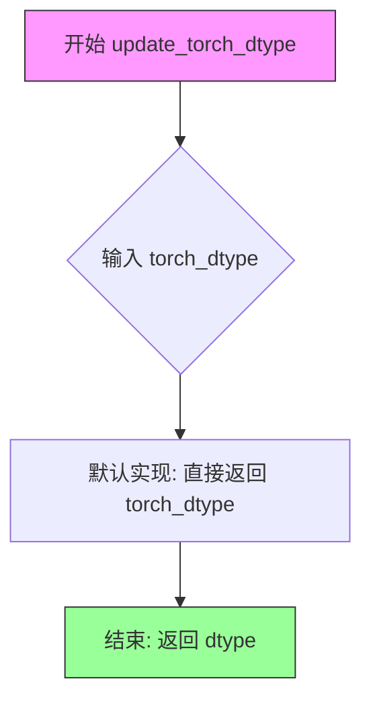
```mermaid
flowchart TD
    A[开始 update_torch_dtype] --> B{输入 torch_dtype}
    B --> C[默认实现: 直接返回 torch_dtype]
    C --> D[结束: 返回 dtype]
    
    style A fill:#f9f,stroke:#333
    style D fill:#9f9,stroke:#333
```

#### 带注释源码

```python
def update_torch_dtype(self, torch_dtype: "torch.dtype") -> "torch.dtype":
    """
    Some quantization methods require to explicitly set the dtype of the model to a target dtype. You need to
    override this method in case you want to make sure that behavior is preserved

    Args:
        torch_dtype (`torch.dtype`):
            The input dtype that is passed in `from_pretrained`
    """
    return torch_dtype
```


### `DiffusersQuantizer.update_device_map`

该方法是一个可选的钩子方法，用于在模型量化过程中更新设备映射（device_map）。当需要为特定的量化方法（如 bitsandbytes）修改默认的设备映射行为时，可以覆盖此方法。例如，如果未提供设备映射，该方法可以自动将其设置为 "auto"，以确保与 `accelerate` 库的兼容性。

参数：

- `device_map`：`dict[str, Any] | None`，从 `from_pretrained` 方法传入的设备映射，可以是字典、字符串或 None

返回值：`dict[str, Any] | None`，返回更新后的设备映射

#### 流程图

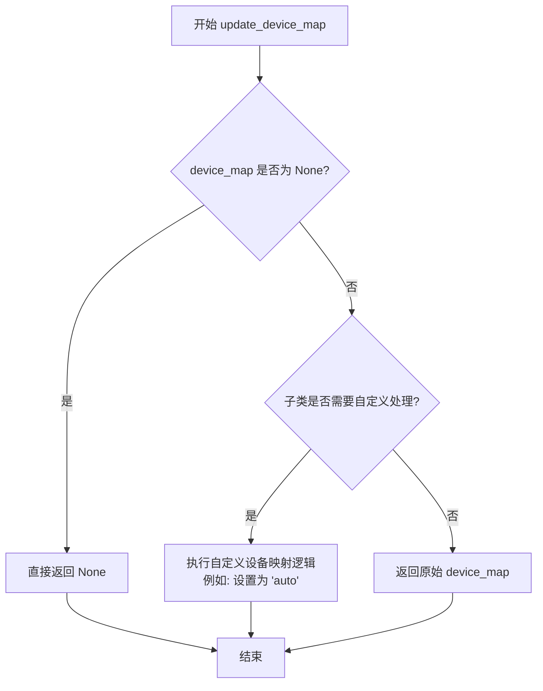
```mermaid
flowchart TD
    A[开始 update_device_map] --> B{device_map 是否为 None?}
    B -->|是| C[直接返回 None]
    B -->|否| D{子类是否需要自定义处理?}
    D -->|是| E[执行自定义设备映射逻辑<br>例如: 设置为 'auto']
    D -->|否| F[返回原始 device_map]
    C --> G[结束]
    E --> G
    F --> G
```

#### 带注释源码

```python
def update_device_map(self, device_map: dict[str, Any] | None) -> dict[str, Any] | None:
    """
    Override this method if you want to pass a override the existing device map with a new one. E.g. for
    bitsandbytes, since `accelerate` is a hard requirement, if no device_map is passed, the device_map is set to
    `"auto"``

    Args:
        device_map (`dict | str`, *optional*):
            The device_map that is passed through the `from_pretrained` method.
    """
    # 直接返回传入的 device_map，不做任何修改
    # 子类（如 BitsAndBytesQuantizer）可以覆盖此方法来实现自定义逻辑
    # 例如：在 accelerate 是硬性要求时，如果未提供 device_map 则自动设置为 "auto"
    return device_map
```


### DiffusersQuantizer.adjust_target_dtype

该方法是 `DiffusersQuantizer` 抽象类中的一个核心方法，用于在模型加载时调整用于计算设备映射（device_map）的目标数据类型。当设备映射是字符串类型时，此方法允许量化器修改默认的目标数据类型，例如 bitsandbytes 量化器可以强制将目标数据类型设置为 `torch.int8`，或者为 4-bit 量化传递自定义枚举类型 `accelerate.CustomDtype.int4`。

参数：

- `torch_dtype`：`torch.dtype`，可选参数，用于计算设备映射的 torch 数据类型

返回值：`torch.dtype`，返回调整后的目标数据类型

#### 流程图

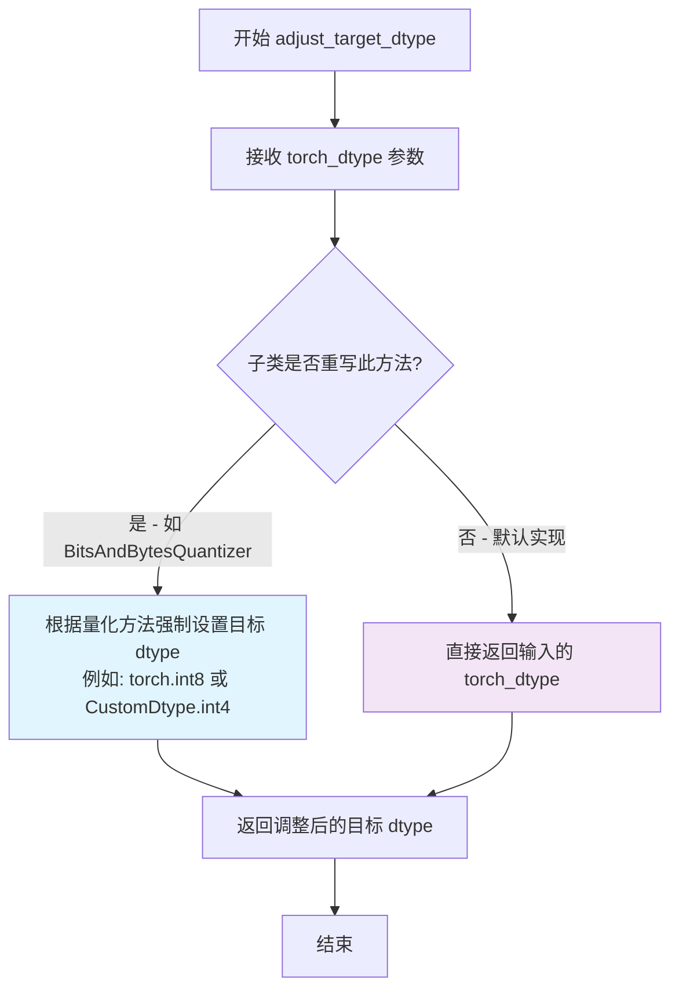
```mermaid
flowchart TD
    A[开始 adjust_target_dtype] --> B[接收 torch_dtype 参数]
    B --> C{子类是否重写此方法?}
    C -->|是 - 如 BitsAndBytesQuantizer| D[根据量化方法强制设置目标 dtype<br/>例如: torch.int8 或 CustomDtype.int4]
    C -->|否 - 默认实现| E[直接返回输入的 torch_dtype]
    D --> F[返回调整后的目标 dtype]
    E --> F
    F --> G[结束]
    
    style D fill:#e1f5fe
    style E fill:#f3e5f5
```

#### 带注释源码

```python
def adjust_target_dtype(self, torch_dtype: "torch.dtype") -> "torch.dtype":
    """
    Override this method if you want to adjust the `target_dtype` variable used in `from_pretrained` to compute the
    device_map in case the device_map is a `str`. E.g. for bitsandbytes we force-set `target_dtype` to `torch.int8`
    and for 4-bit we pass a custom enum `accelerate.CustomDtype.int4`.

    Args:
        torch_dtype (`torch.dtype`, *optional*):
            The torch_dtype that is used to compute the device_map.
    """
    # 默认实现：直接返回原始的 torch_dtype，不做任何修改
    # 子类可以重写此方法来实现特定的 dtype 调整逻辑
    # 例如：BitsAndBytesQuantizer 会重写此方法强制返回 torch.int8
    return torch_dtype
```


### DiffusersQuantizer.update_missing_keys

该方法是一个可选的钩子方法，允许子类在从预训练模型加载权重时调整缺失键列表。当检查点中的键与模型状态字典不匹配时，可以使用此方法添加、删除或修改缺失键。

参数：

- `self`：`DiffusersQuantizer`，调用此方法的量化器实例
- `model`：`Any`，需要进行权重加载的模型实例（类型未在方法签名中显式标注，但从调用上下文推断为 `ModelMixin`）
- `missing_keys`：`list[str]`，检查点中缺失的键列表，即检查点中的键在模型状态字典中不存在
- `prefix`：`str`，用于递归处理时模型参数的前缀路径

返回值：`list[str]`，返回处理（添加、删除或修改）后的缺失键列表

#### 流程图

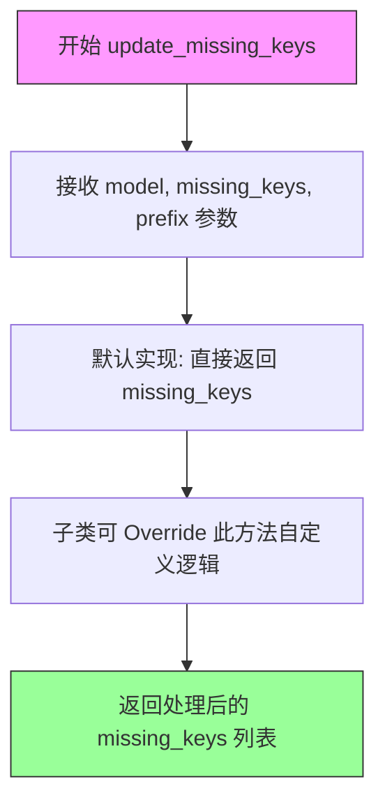
```mermaid
flowchart TD
    A[开始 update_missing_keys] --> B[接收 model, missing_keys, prefix 参数]
    B --> C[默认实现: 直接返回 missing_keys]
    C --> D[子类可 Override 此方法自定义逻辑]
    D --> E[返回处理后的 missing_keys 列表]
    
    style A fill:#f9f,stroke:#333
    style E fill:#9f9,stroke:#333
```

#### 带注释源码

```python
def update_missing_keys(self, model, missing_keys: list[str], prefix: str) -> list[str]:
    """
    Override this method if you want to adjust the `missing_keys`.

    Args:
        missing_keys (`list[str]`, *optional*):
            The list of missing keys in the checkpoint compared to the state dict of the model
    """
    # 默认实现直接返回原始的 missing_keys 列表
    # 子类可以通过重写此方法来实现自定义的缺失键处理逻辑
    # 例如：过滤掉某些不需要的键、添加额外的键、或修改键的名称
    return missing_keys
```


### `DiffusersQuantizer.get_special_dtypes_update`

获取特殊数据类型更新的方法，用于返回不进行量化的模块的 dtype 映射，以便在 `from_pretrained` 中计算设备映射（device_map）。

参数：

- `model`：`ModelMixin`，要量化的模型
- `torch_dtype`：`torch.dtype`，从 `from_pretrained` 方法传入的目标 dtype

返回值：`dict[str, torch.dtype]`，返回不量化模块的名称到 dtype 的映射字典

#### 流程图

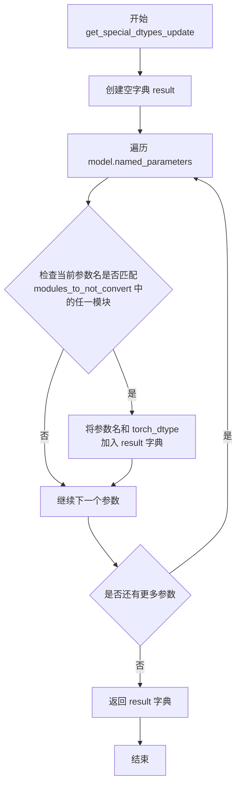
```mermaid
flowchart TD
    A[开始 get_special_dtypes_update] --> B[创建空字典 result]
    B --> C[遍历 model.named_parameters]
    C --> D{检查当前参数名是否匹配<br/>modules_to_not_convert 中的任一模块}
    D -->|是| E[将参数名和 torch_dtype<br/>加入 result 字典]
    D -->|否| F[继续下一个参数]
    E --> F
    F --> G{是否还有更多参数}
    G -->|是| C
    G -->|否| H[返回 result 字典]
    H --> I[结束]
```

#### 带注释源码

```python
def get_special_dtypes_update(self, model, torch_dtype: "torch.dtype") -> dict[str, "torch.dtype"]:
    """
    returns dtypes for modules that are not quantized - used for the computation of the device_map in case one
    passes a str as a device_map. The method will use the `modules_to_not_convert` that is modified in
    `_process_model_before_weight_loading`. `diffusers` models don't have any `modules_to_not_convert` attributes
    yet but this can change soon in the future.

    Args:
        model (`~diffusers.models.modeling_utils.ModelMixin`):
            The model to quantize
        torch_dtype (`torch.dtype`):
            The dtype passed in `from_pretrained` method.
    """

    # 使用字典推导式遍历模型的所有命名参数
    # 筛选出名称中包含 modules_to_not_convert 任一模块名的参数
    # 为这些不进行量化的模块指定 dtype
    return {
        name: torch_dtype
        for name, _ in model.named_parameters()
        if any(m in name for m in self.modules_to_not_convert)
    }
```


### `DiffusersQuantizer.adjust_max_memory`

调整 max_memory 参数以供 `infer_auto_device_map()` 使用，以防量化需要额外内存。

参数：

- `max_memory`：`dict[str, int | str]`，用于指定各设备最大内存的字典，键为设备标识（如 "cpu"、"cuda:0" 等），值为整数（字节数）或字符串（如 "10GB"）

返回值：`dict[str, int | str]`，返回调整后的 max_memory 字典

#### 流程图

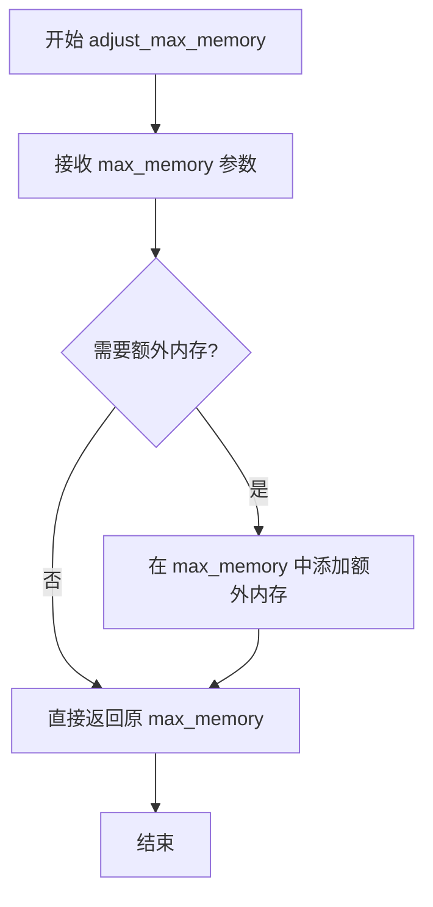
```mermaid
flowchart TD
    A[开始 adjust_max_memory] --> B[接收 max_memory 参数]
    B --> C{需要额外内存?}
    C -->|否| D[直接返回原 max_memory]
    C -->|是| E[在 max_memory 中添加额外内存]
    E --> D
    D --> F[结束]
```

#### 带注释源码

```python
def adjust_max_memory(self, max_memory: dict[str, int | str]) -> dict[str, int | str]:
    """
    adjust max_memory argument for infer_auto_device_map() if extra memory is needed for quantization
    
    该方法是一个钩子方法，用于在量化过程中调整模型的内存分配。
    子类可以重写此方法以根据具体的量化策略增加内存预算。
    
    Args:
        max_memory: 原始的 max_memory 字典，包含各设备的内存限制
        
    Returns:
        调整后的 max_memory 字典，如果不需要调整则直接返回原字典
    """
    # 默认实现直接返回原始的 max_memory，不做任何修改
    # 子类（如具体的量化器实现）可以重写此方法
    # 例如：某些量化方法可能需要额外的内存来存储量化表或校准数据
    return max_memory
```


### `DiffusersQuantizer.check_if_quantized_param`

检查给定参数是否为量化参数的方法。该方法用于在加载模型权重时验证状态字典中的组件是否是量化参数的一部分，并进行相应的验证检查。此方法仅对需要为量化创建新参数的量化方法有实际实现，基类中默认返回 `False`。

参数：

- `model`：`ModelMixin`，要进行量化处理的模型实例
- `param_value`：`torch.Tensor`，要检查的参数张量值
- `param_name`：`str`，参数的名称，用于匹配和识别
- `state_dict`：`dict[str, Any]`，模型的状态字典，包含所有参数的键值对
- `**kwargs`：可变关键字参数，用于传递额外的选项

返回值：`bool`，返回 `True` 表示参数是量化参数，返回 `False` 表示不是量化参数

#### 流程图

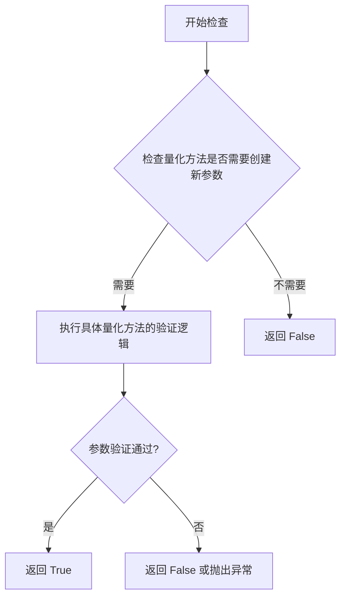
```mermaid
flowchart TD
    A[开始检查] --> B{检查量化方法是否需要创建新参数}
    B -->|需要| C[执行具体量化方法的验证逻辑]
    B -->|不需要| D[返回 False]
    C --> E{参数验证通过?}
    E -->|是| F[返回 True]
    E -->|否| G[返回 False 或抛出异常]
```

#### 带注释源码

```python
def check_if_quantized_param(
    self,
    model: "ModelMixin",
    param_value: "torch.Tensor",
    param_name: str,
    state_dict: dict[str, Any],
    **kwargs,
) -> bool:
    """
    checks if a loaded state_dict component is part of quantized param + some validation; only defined for
    quantization methods that require to create a new parameters for quantization.
    """
    # 基类实现：默认返回 False，表示当前参数不是量化参数
    # 具体的量化器（如 BitsAndBytesQuantizer）会重写此方法
    # 以实现真正的量化参数检测逻辑
    return False
```


### `DiffusersQuantizer.create_quantized_param`

创建量化参数的方法，用于从状态字典中获取所需组件并创建量化参数。该方法是抽象方法，具体实现由子类重写。

参数：

- `*args`：可变位置参数，具体参数由子类实现决定，通常包含模型、参数值、参数名、状态字典等
- `**kwargs`：可变关键字参数，具体参数由子类实现决定，用于传递额外的配置选项

返回值：`torch.nn.Parameter`，返回创建的量化参数对象

#### 流程图

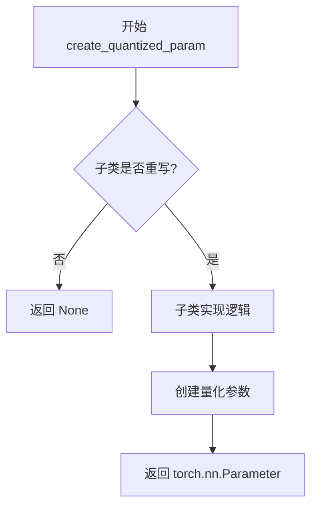
```mermaid
flowchart TD
    A[开始 create_quantized_param] --> B{子类是否重写?}
    B -->|否| C[返回 None]
    B -->|是| D[子类实现逻辑]
    D --> E[创建量化参数]
    E --> F[返回 torch.nn.Parameter]
```

#### 带注释源码

```python
def create_quantized_param(self, *args, **kwargs) -> "torch.nn.Parameter":
    """
    takes needed components from state_dict and creates quantized param.
    """
    return
```

**代码说明：**

- 该方法是`DiffusersQuantizer`抽象类中的一个抽象方法（但未使用`@abstractmethod`装饰器标记）
- 方法使用`*args`和`**kwargs`接收可变数量的参数，具体参数由子类实现时定义
- 默认实现返回`None`，具体量化参数创建逻辑由子类重写实现
- 返回类型声明为`torch.nn.Parameter`，表示量化后的参数对象
- 该方法在模型权重加载过程中被调用，用于将状态字典中的组件转换为量化参数


### `DiffusersQuantizer.check_quantized_param_shape`

检查量化参数是否具有预期的形状。该方法是抽象基类中的占位符实现，子类需重写以实现具体的形状验证逻辑。

参数：

- `self`：`DiffusersQuantizer`，当前量化器实例
- `*args`：可变位置参数，用于传递检查所需的参数（参数名称、参数值等）
- `**kwargs`：可变关键字参数，用于传递检查所需的额外参数（如状态字典、模型等）

返回值：`bool`，返回 `True` 表示量化参数形状符合预期，`False` 表示不符合

#### 流程图

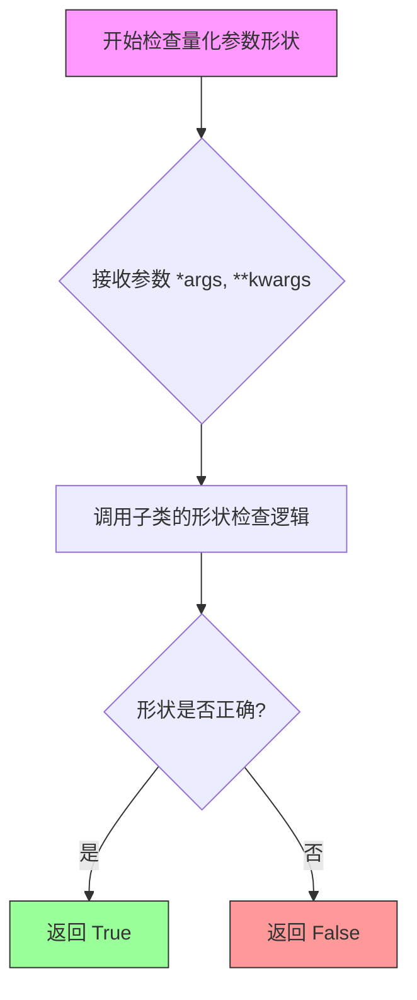
```mermaid
flowchart TD
    A[开始检查量化参数形状] --> B{接收参数 *args, **kwargs}
    B --> C[调用子类的形状检查逻辑]
    C --> D{形状是否正确?}
    D -->|是| E[返回 True]
    D -->|否| F[返回 False]
    
    style A fill:#f9f,stroke:#333
    style E fill:#9f9,stroke:#333
    style F fill:#f99,stroke:#333
```

> **注意**：由于基类中该方法为 stub 实现（直接返回 `True`），实际形状检查逻辑由子类重写实现。

#### 带注释源码

```python
def check_quantized_param_shape(self, *args, **kwargs):
    """
    checks if the quantized param has expected shape.
    
    这是一个抽象基类中的占位符方法，用于检查量化参数是否具有预期的形状。
    不同的量化方法（如 bitsandbytes、ggml 等）需要重写此方法以实现
    具体的形状验证逻辑。
    
    Args:
        *args: 可变位置参数，用于传递检查所需的参数
               （如参数名称、参数值、状态字典等）
        **kwargs: 可变关键字参数，用于传递检查所需的额外参数
                  （如模型实例、量化配置等）
    
    Returns:
        bool: 返回 True 表示量化参数形状符合预期，
              子类应重写此方法以实现具体的验证逻辑
    
    Example:
        # 子类重写示例（以具体量化器为例）
        def check_quantized_param_shape(self, param_name, param_value, state_dict, ...):
            # 检查参数是否存在于状态字典中
            if param_name not in state_dict:
                return False
            # 检查形状是否匹配预期
            expected_shape = self.get_expected_shape(param_name)
            return param_value.shape == expected_shape
    """
    return True
```


### `DiffusersQuantizer.validate_environment`

该方法是一个环境验证钩子，用于在模型加载前检查量化器配置与 `from_pretrained` 参数之间是否存在潜在冲突。所有集成到 diffusers 的量化器都应实现此方法，若无需显式检查则直接返回空值。

参数：

- `self`：`DiffusersQuantizer`，量化器实例，隐式参数
- `*args`：`Any`，可变位置参数，用于传递额外的位置参数
- `**kwargs`：`dict[str, Any]`，可变关键字参数，用于传递额外的关键字参数

返回值：`None`，无返回值

#### 流程图

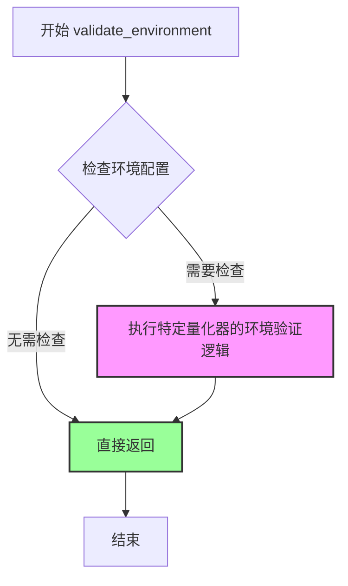
```mermaid
flowchart TD
    A[开始 validate_environment] --> B{检查环境配置}
    B -->|需要检查| C[执行特定量化器的环境验证逻辑]
    B -->|无需检查| D[直接返回]
    C --> D
    D --> E[结束]
    
    style C fill:#f9f,stroke:#333,stroke-width:2px
    style D fill:#9f9,stroke:#333,stroke-width:2px
```

#### 带注释源码

```python
def validate_environment(self, *args, **kwargs):
    """
    This method is used to potentially check for potential conflicts with arguments that are passed in
    `from_pretrained`. You need to define it for all future quantizers that are integrated with diffusers. If no
    explicit check are needed, simply return nothing.
    
    该方法是一个抽象方法，由子类具体实现。基类中提供默认的空实现。
    主要用途是在模型量化之前验证环境配置是否满足要求，例如：
    - 检查必要的依赖包是否已安装
    - 验证 CUDA 环境是否可用
    - 检查量化方法是否与当前硬件兼容
    
    Args:
        *args: 可变位置参数，用于传递额外的位置参数
        **kwargs: 可变关键字参数，用于传递额外的关键字参数
    
    Returns:
        None: 无返回值，若验证失败应在子类中抛出异常
    """
    return  # 默认空实现，子类可重写此方法进行具体的环境验证
```


### `DiffusersQuantizer.preprocess_model`

该方法在加载权重之前设置模型属性和/或转换模型。此时模型应该在 meta device 上初始化，以便可以自由操作模型骨架来替换模块。需要重写抽象方法 `_process_model_before_weight_loading`。

参数：

- `model`：`ModelMixin`，要量化的模型
- `kwargs`：`dict`，可选，传给 `_process_model_before_weight_loading` 的关键字参数

返回值：任意类型，`_process_model_before_weight_loading` 方法的返回值

#### 流程图

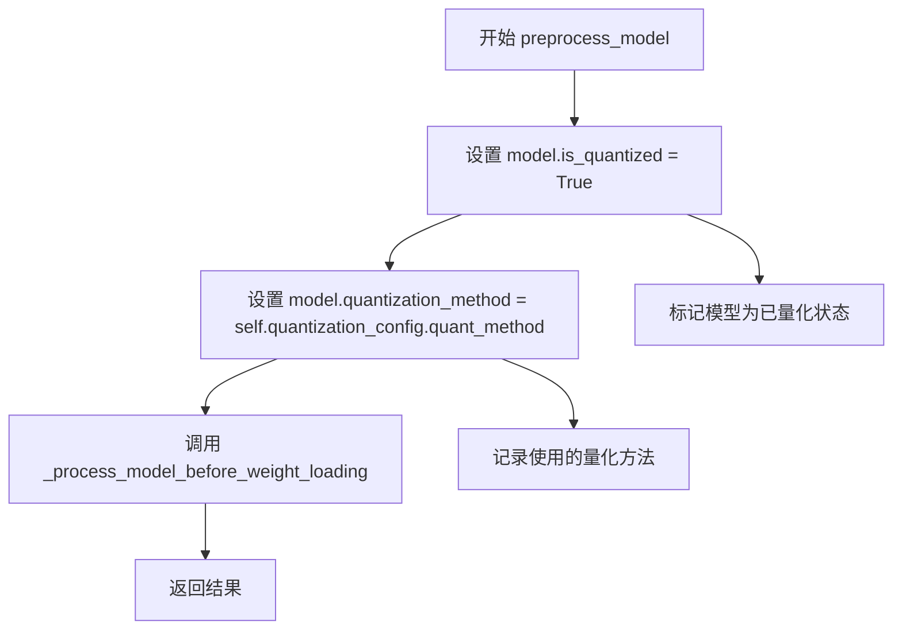
```mermaid
flowchart TD
    A[开始 preprocess_model] --> B[设置 model.is_quantized = True]
    B --> C[设置 model.quantization_method = self.quantization_config.quant_method]
    C --> D[调用 _process_model_before_weight_loading]
    D --> E[返回结果]
    
    B --> B1[标记模型为已量化状态]
    C --> C1[记录使用的量化方法]
```

#### 带注释源码

```python
def preprocess_model(self, model: "ModelMixin", **kwargs):
    """
    Setting model attributes and/or converting model before weights loading. At this point the model should be
    initialized on the meta device so you can freely manipulate the skeleton of the model in order to replace
    modules in-place. Make sure to override the abstract method `_process_model_before_weight_loading`.

    Args:
        model (`~diffusers.models.modeling_utils.ModelMixin`):
            The model to quantize
        kwargs (`dict`, *optional*):
            The keyword arguments that are passed along `_process_model_before_weight_loading`.
    """
    # 设置模型的量化标志，表示该模型已被量化
    model.is_quantized = True
    # 从 quantization_config 中获取量化方法并设置到模型
    model.quantization_method = self.quantization_config.quant_method
    # 调用抽象方法处理权重加载前的模型预处理，由子类实现具体逻辑
    return self._process_model_before_weight_loading(model, **kwargs)
```


### `DiffusersQuantizer.postprocess_model`

该方法是在模型权重加载之后对模型进行后处理的入口点，它调用抽象方法 `_process_model_after_weight_loading` 来执行具体的量化后处理逻辑。

参数：

- `self`：`DiffusersQuantizer`，隐式参数，表示量化器实例本身
- `model`：`ModelMixin`（或 `~diffusers.models.modeling_utils.ModelMixin`），要量化的模型实例
- `**kwargs`：`dict`，可选关键字参数，将传递给 `_process_model_after_weight_loading` 方法

返回值：任意类型，返回 `_process_model_after_weight_loading` 方法的执行结果（具体类型由子类实现决定）

#### 流程图

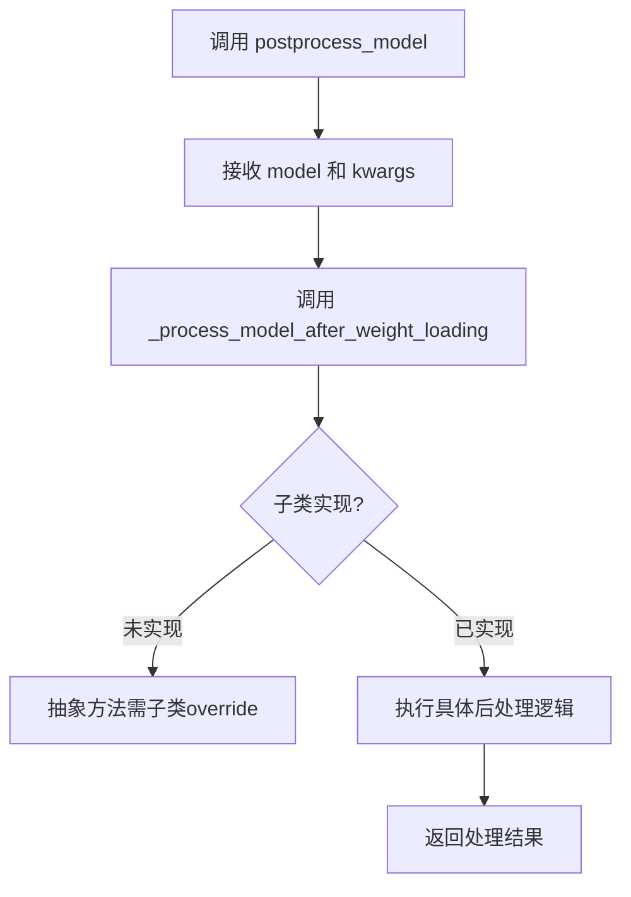
```mermaid
flowchart TD
    A[调用 postprocess_model] --> B[接收 model 和 kwargs]
    B --> C[调用 _process_model_after_weight_loading]
    C --> D{子类实现?}
    D -->|未实现| E[抽象方法需子类override]
    D -->|已实现| F[执行具体后处理逻辑]
    F --> G[返回处理结果]
```

#### 带注释源码

```python
def postprocess_model(self, model: "ModelMixin", **kwargs):
    """
    Post-process the model post weights loading. Make sure to override the abstract method
    `_process_model_after_weight_loading`.

    Args:
        model (`~diffusers.models.modeling_utils.ModelMixin`):
            The model to quantize
        kwargs (`dict`, *optional*):
            The keyword arguments that are passed along `_process_model_after_weight_loading`.
    """
    # 调用抽象方法 _process_model_after_weight_loading 来执行实际的后处理逻辑
    # 子类必须实现该抽象方法以提供具体的量化后处理行为
    return self._process_model_after_weight_loading(model, **kwargs)
```


### `DiffusersQuantizer.dequantize`

该方法是 `DiffusersQuantizer` 类的公开接口，用于将量化后的模型解量化以恢复原始模型（可能伴随一定的精度/性能损失）。并非所有量化方案都支持此操作。

参数：

- `model`：`ModelMixin`，待解量化的模型对象

返回值：`ModelMixin`，解量化后的模型对象

#### 流程图

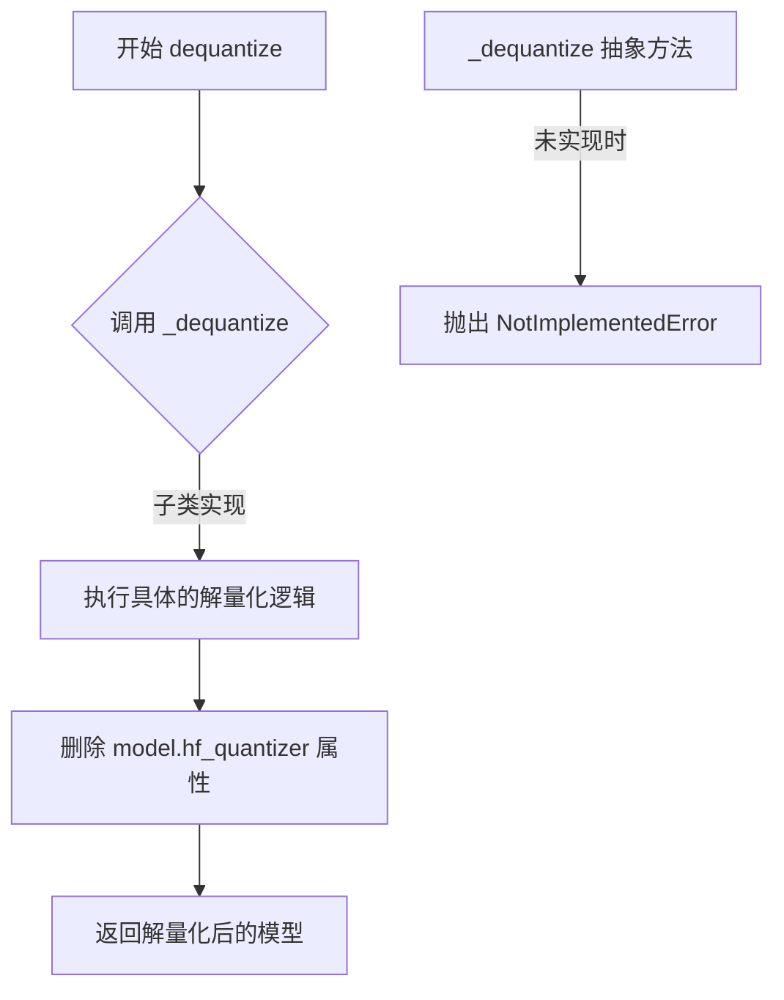
```mermaid
flowchart TD
    A[开始 dequantize] --> B{调用 _dequantize}
    B -->|子类实现| C[执行具体的解量化逻辑]
    C --> D[删除 model.hf_quantizer 属性]
    D --> E[返回解量化后的模型]
    
    F[_dequantize 抽象方法] -->|未实现时| G[抛出 NotImplementedError]
```

#### 带注释源码

```python
def dequantize(self, model):
    """
    Potentially dequantize the model to retrieve the original model, with some loss in accuracy / performance. Note
    not all quantization schemes support this.
    
    该方法尝试将量化后的模型解量化，以恢复其原始精度。
    需要注意的是，并非所有量化方法都支持解量化操作。
    
    Args:
        model: 待解量化的模型对象
        
    Returns:
        解量化后的模型对象
    """
    # 调用子类实现的 _dequantize 方法执行实际的解量化逻辑
    model = self._dequantize(model)

    # 删除模型的量化器属性，清理量化相关状态
    del model.hf_quantizer

    return model
```


### `DiffusersQuantizer.get_cuda_warm_up_factor`

获取CUDA预热因子，用于在CUDA缓存分配器预热时计算需要预分配的字节数。默认返回4，表示预分配模型大小一半的内存（适用于无法预先知道权重位数的场景）。

参数：
- 该方法无显式参数（仅包含隐式`self`参数）

返回值：`int`，返回预热因子值，默认值为4，表示预分配模型一半的内存空间

#### 流程图

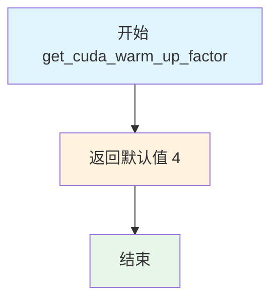
```mermaid
flowchart TD
    A[开始 get_cuda_warm_up_factor] --> B[返回默认值 4]
    B --> C[结束]
    
    style A fill:#e1f5fe
    style B fill:#fff3e0
    style C fill:#e8f5e9
```

#### 带注释源码

```python
def get_cuda_warm_up_factor(self):
    """
    The factor to be used in `caching_allocator_warmup` to get the number of bytes to pre-allocate to warm up cuda.
    A factor of 2 means we allocate all bytes in the empty model (since we allocate in fp16), a factor of 4 means
    we allocate half the memory of the weights residing in the empty model, etc...
    """
    # By default we return 4, i.e. half the model size (this corresponds to the case where the model is not
    # really pre-processed, i.e. we do not have the info that weights are going to be 8 bits before actual
    # weight loading)
    return 4
```


### `DiffusersQuantizer._dequantize`

内部抽象方法，用于将量化后的模型反量化以恢复原始模型（精度/性能会有所损失）。注意并非所有量化方案都支持此操作。该方法是抽象的，具体实现由子类提供。

参数：

- `model`：`ModelMixin`，需要反量化的模型实例

返回值：`ModelMixin`，反量化后的模型实例

#### 流程图

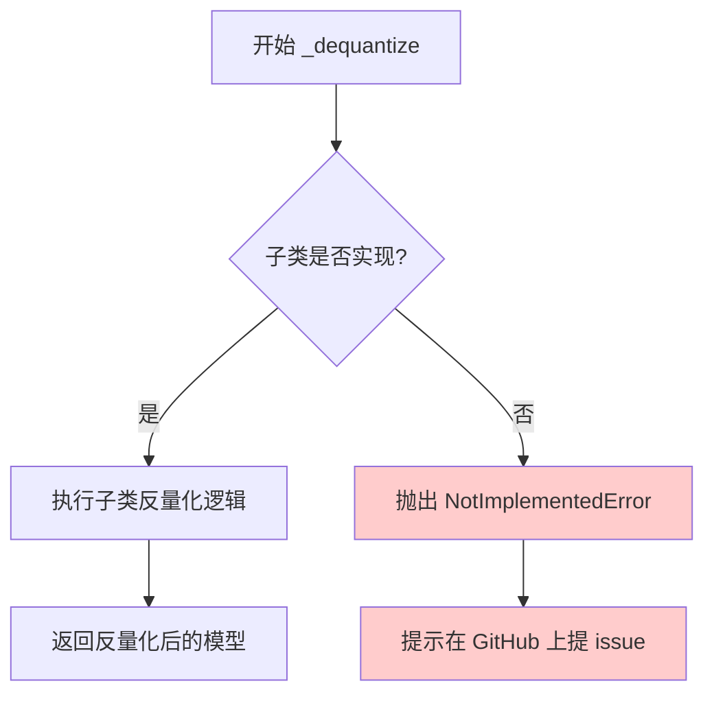
```mermaid
flowchart TD
    A[开始 _dequantize] --> B{子类是否实现?}
    B -->|是| C[执行子类反量化逻辑]
    B -->|否| D[抛出 NotImplementedError]
    C --> E[返回反量化后的模型]
    D --> F[提示在 GitHub 上提 issue]
    
    style D fill:#ffcccc
    style F fill:#ffcccc
```

#### 带注释源码

```python
def _dequantize(self, model):
    """
    内部抽象方法，用于执行模型反量化。
    
    此方法是 DiffusersQuantizer 的抽象接口，具体反量化逻辑
    需要由子类（如具体的量化器实现）提供。
    
    注意：并非所有量化方法都支持反量化操作。
    
    Args:
        model (ModelMixin):
            需要反量化的模型实例
        
    Raises:
        NotImplementedError:
            当子类未实现该方法时抛出，提示用户在 GitHub 上提交 issue
        
    Returns:
        ModelMixin: 反量化后的模型实例
    """
    raise NotImplementedError(
        f"{self.quantization_config.quant_method} has no implementation of `dequantize`, please raise an issue on GitHub."
    )
```


### `DiffusersQuantizer._process_model_before_weight_loading`

在权重加载之前预处理模型的抽象方法。该方法在 `preprocess_model` 方法中被调用，允许子类在模型权重加载前执行必要的预处理操作，例如替换模块、设置属性等。

参数：

- `self`：`DiffusersQuantizer` 实例，量化器对象本身
- `model`：`ModelMixin`，需要进行预处理和量化的模型对象
- `**kwargs`：可变关键字参数，用于传递额外的配置参数

返回值：`Any`（由子类实现决定），预处理操作的结果

#### 流程图

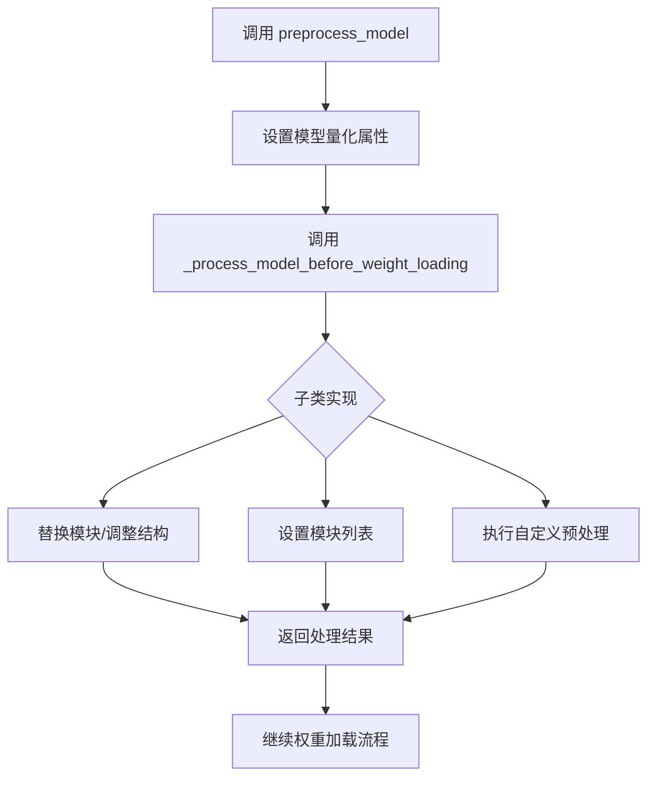
```mermaid
flowchart TD
    A[调用 preprocess_model] --> B[设置模型量化属性]
    B --> C[调用 _process_model_before_weight_loading]
    C --> D{子类实现}
    D --> E[替换模块/调整结构]
    D --> F[设置模块列表]
    D --> G[执行自定义预处理]
    E --> H[返回处理结果]
    F --> H
    G --> H
    H --> I[继续权重加载流程]
```

#### 带注释源码

```python
@abstractmethod
def _process_model_before_weight_loading(self, model, **kwargs):
    """
    抽象方法：在权重加载之前预处理模型。
    
    此方法由 preprocess_model 方法调用，允许量化器实现类
    在模型权重加载前执行必要的预处理操作，如：
    - 替换模型中的特定模块为量化版本
    - 设置 modules_to_not_convert 列表
    - 修改模型结构以适应量化需求
    
    Args:
        model (~diffusers.models.modeling_utils.ModelMixin):
            需要预处理和量化的模型实例
        kwargs (dict, *optional):
            额外的关键字参数，由调用者传递
    
    Returns:
        任意类型：预处理操作的结果，具体由子类实现决定
    """
    ...  # 抽象方法，子类必须实现
```


### `DiffusersQuantizer._process_model_after_weight_loading`

权重加载后处理模型的抽象方法。该方法在模型权重从预训练检查点加载完成后被调用，用于执行任何必要的模型后处理操作，例如验证量化参数、调整模型结构或应用特定的后处理转换。

参数：

- `self`：`DiffusersQuantizer`，量化器实例本身
- `model`：`ModelMixin`，需要处理的目标模型（来自 `diffusers.models.modeling_utils.ModelMixin`）
- `**kwargs`：`dict`，可选的关键字参数，会传递给具体的实现方法

返回值：`None`，该抽象方法不返回值，具体实现由子类重写

#### 流程图

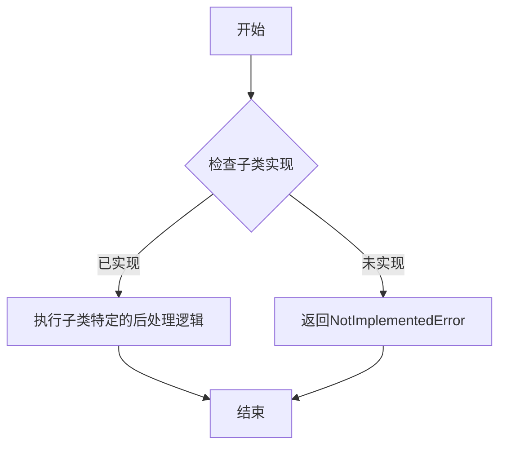
```mermaid
flowchart TD
    A[开始] --> B{检查子类实现}
    B -->|已实现| C[执行子类特定的后处理逻辑]
    B -->|未实现| D[返回NotImplementedError]
    C --> E[结束]
    D --> E
```

#### 带注释源码

```python
@abstractmethod
def _process_model_after_weight_loading(self, model, **kwargs):
    """
    抽象方法：在模型权重加载完成后对模型进行后处理
    
    此方法在 `postprocess_model` 中被调用，用于在权重从预训练检查点加载完成后
    执行必要的模型处理操作。具体实现由子类重写，例如：
    - 验证量化参数的形状和类型
    - 将量化参数转换为适当的torch.nn.Parameter
    - 调整模型结构以适应量化格式
    - 冻结量化参数
    
    Args:
        model (~diffusers.models.modeling_utils.ModelMixin):
            需要处理的目标模型
        kwargs (dict, optional):
            额外的关键字参数，会传递给具体的实现方法
            
    Returns:
        None: 此抽象方法不返回值，具体处理由子类实现
    """
    ...  # 抽象方法占位符，由子类实现具体逻辑
```


### `DiffusersQuantizer.__init__`

初始化DiffusersQuantizer量化器实例，设置量化配置并处理额外参数（如modules_to_not_convert和pre_quantized），同时验证量化方法与预量化状态的一致性，若不一致则抛出ValueError异常。

参数：

- `self`：实例本身（隐式参数）
- `quantization_config`：`QuantizationConfigMixin`，量化配置对象，包含量化方法和其他量化参数
- `**kwargs`：可变关键字参数，支持以下可选参数：
  - `modules_to_not_convert`：`list[str]`，需要跳过量化转换的模块名称列表，默认为空列表
  - `pre_quantized`：`bool`，标记模型权重是否已经过预量化，默认为True

返回值：无（`None`），构造函数不返回值

#### 流程图

```mermaid
flowchart TD
    A[开始 __init__] --> B[设置 self.quantization_config]
    B --> C{从 kwargs 获取 modules_to_not_convert}
    C -->|未提供| D[设置为空列表 []]
    C -->|已提供| E[使用提供的值]
    D --> F{从 kwargs 获取 pre_quantized}
    E --> F
    F -->|未提供| G[设置为 True]
    F -->|已提供| H[使用提供的值]
    G --> I{检查 pre_quantized 和 requires_calibration}
    H --> I
    I -->|pre_quantized=False 且 requires_calibration=True| J[抛出 ValueError 异常]
    I -->|其他情况| K[结束 __init__]
    J --> K
```

#### 带注释源码

```python
def __init__(self, quantization_config: QuantizationConfigMixin, **kwargs):
    # 将传入的量化配置对象存储为实例属性
    # 这是量化器的核心配置，包含了量化方法(quant_method)和其他参数
    self.quantization_config = quantization_config

    # -- Handle extra kwargs below --
    
    # 从kwargs中提取modules_to_not_convert参数
    # 如果未提供，则默认为空列表，表示所有模块都需要进行量化转换
    # 这个参数允许用户指定某些特定模块不被量化（如某些层需要保持原始精度）
    self.modules_to_not_convert = kwargs.pop("modules_to_not_convert", [])
    
    # 从kwargs中提取pre_quantized参数
    # 默认为True，表示模型权重已经是量化后的格式
    # 如果为False，则表示需要实时对模型进行量化
    self.pre_quantized = kwargs.pop("pre_quantized", True)

    # 验证逻辑：如果模型未预量化但量化方法需要校准，则抛出错误
    # 这确保了使用需要校准的量化方法时必须提供预量化权重
    if not self.pre_quantized and self.requires_calibration:
        raise ValueError(
            f"The quantization method {quantization_config.quant_method} does require the model to be pre-quantized."
            f" You explicitly passed `pre_quantized=False` meaning your model weights are not quantized. Make sure to "
            f"pass `pre_quantized=True` while knowing what you are doing."
        )
```


### `DiffusersQuantizer.update_torch_dtype`

该方法是一个模板方法（Template Method），用于在模型加载过程中允许量化器子类显式设置模型的 dtype，某些量化方法需要显式设置模型 dtype 为目标类型，子类可通过重写此方法来实现自定义的 dtype 转换逻辑，默认实现仅原样返回输入的 `torch_dtype`。

参数：

- `torch_dtype`：`torch.dtype`，从 `from_pretrained` 方法传入的目标数据类型，用于指定模型权重的预期数据类型

返回值：`torch.dtype`，返回经过处理后的目标 dtype，如果无需处理则原样返回

#### 流程图

```mermaid
flowchart TD
    A[开始 update_torch_dtype] --> B{检查是否需要自定义 dtype 处理?}
    B -- 是 --> C[执行子类自定义 dtype 转换逻辑]
    B -- 否 --> D[直接返回原始 torch_dtype]
    C --> E[返回转换后的 dtype]
    D --> E
    F[结束] --> E
```

#### 带注释源码

```python
def update_torch_dtype(self, torch_dtype: "torch.dtype") -> "torch.dtype":
    """
    Some quantization methods require to explicitly set the dtype of the model to a target dtype. You need to
    override this method in case you want to make sure that behavior is preserved

    Args:
        torch_dtype (`torch.dtype`):
            The input dtype that is passed in `from_pretrained`
    """
    # 默认实现：直接返回原始传入的 torch_dtype，不做任何转换
    # 子类（如 AutoQuantizer）可重写此方法以实现特定的 dtype 转换逻辑
    # 例如：某些量化方法可能需要将 fp16 强制转换为 int8
    return torch_dtype
```


### `DiffusersQuantizer.update_device_map`

该方法是一个可重写的钩子方法，用于在模型量化过程中覆盖或修改设备映射配置，常见用途如 bitsandbytes 量化器需要在未提供 device_map 时自动设置为 `"auto"` 以支持加速库。

参数：

- `device_map`：`dict[str, Any] | None`，从 `from_pretrained` 方法传入的设备映射，可以是字典类型、字符串类型（如 `"auto"`）或 `None`

返回值：`dict[str, Any] | None`，处理或覆盖后的设备映射配置

#### 流程图

```mermaid
flowchart TD
    A[接收 device_map 参数] --> B{检查是否需要覆盖}
    B -->|否，直接返回原 device_map| C[返回 device_map]
    B -->|是，如 bitsandbytes 设置为 "auto"| D[设置 device_map = "auto"]
    D --> C
    
    subgraph 子类 Override
    B -.-> E[重写此方法实现自定义逻辑]
    end
    
    style A fill:#f9f,stroke:#333
    style C fill:#9f9,stroke:#333
    style E fill:#ff9,stroke:#333,stroke-dasharray: 5 5
```

#### 带注释源码

```python
def update_device_map(self, device_map: dict[str, Any] | None) -> dict[str, Any] | None:
    """
    Override this method if you want to pass a override the existing device map with a new one. E.g. for
    bitsandbytes, since `accelerate` is a hard requirement, if no device_map is passed, the device_map is set to
    `"auto"``

    Args:
        device_map (`dict | str`, *optional*):
            The device_map that is passed through the `from_pretrained` method.
    """
    # 默认实现直接返回原始的 device_map，不做任何修改
    # 子类（如 BitsAndBytesQuantizer）可以重写此方法
    # 例如：当 device_map 为 None 时，返回 "auto" 字符串以启用自动设备映射
    return device_map
```


### `DiffusersQuantizer.adjust_target_dtype`

该方法用于在 `from_pretrained` 中计算 `device_map` 时调整 `target_dtype` 变量。当 `device_map` 为字符串类型时，此方法允许量化器根据具体需求修改目标数据类型。例如，bitsandbytes 会强制将 `target_dtype` 设置为 `torch.int8`，而 4-bit 量化会传递自定义枚举 `accelerate.CustomDtype.int4`。基类默认直接返回原始的 `torch_dtype`，具体实现由子类覆盖。

参数：

- `self`：`DiffusersQuantizer`，调用该方法的量化器实例本身
- `torch_dtype`：`torch.dtype`，从 `from_pretrained` 传入的用于计算 device_map 的目标数据类型

返回值：`torch.dtype`，调整后的目标数据类型，用于后续 device_map 的计算

#### 流程图

```mermaid
flowchart TD
    A[开始 adjust_target_dtype] --> B{输入 torch_dtype}
    B --> C[子类可选择覆盖此方法<br>修改 torch_dtype 值]
    C --> D[返回 torch_dtype]
    D --> E[结束]
    
    style C fill:#f9f,stroke:#333,stroke-width:2px
```

#### 带注释源码

```python
def adjust_target_dtype(self, torch_dtype: "torch.dtype") -> "torch.dtype":
    """
    Override this method if you want to adjust the `target_dtype` variable used in `from_pretrained` to compute the
    device_map in case the device_map is a `str`. E.g. for bitsandbytes we force-set `target_dtype` to `torch.int8`
    and for 4-bit we pass a custom enum `accelerate.CustomDtype.int4`.

    Args:
        torch_dtype (`torch.dtype`, *optional*):
            The torch_dtype that is used to compute the device_map.
    """
    # 基类实现直接返回原始的 torch_dtype，不做任何修改
    # 子类（如 BitsAndBytesQuantizer）可以覆盖此方法
    # 根据量化方法的需求返回调整后的目标数据类型
    return torch_dtype
```


### `DiffusersQuantizer.update_missing_keys`

该方法是一个可重写的钩子方法，用于在模型加载权重时调整或过滤缺失键列表。子类可以覆盖此方法以自定义缺失键的处理逻辑，例如添加额外的键或过滤掉不需要的键。

参数：

- `self`：`DiffusersQuantizer`，当前量化器实例
- `model`：未指定类型，模型实例，用于上下文参考
- `missing_keys`：`list[str]`，与模型状态字典相比，权重检查点中缺失的键列表
- `prefix`：`str`，键的前缀，通常用于嵌套模块的路径标识

返回值：`list[str]`，处理（过滤/修改）后的缺失键列表

#### 流程图

```mermaid
flowchart TD
    A[开始: update_missing_keys] --> B[接收参数: model, missing_keys, prefix]
    B --> C{子类是否覆盖?}
    C -->|否 - 默认实现| D[直接返回 missing_keys 列表]
    C -->|是 - 自定义实现| E[执行子类的自定义逻辑]
    E --> F[返回修改后的 missing_keys 列表]
    D --> G[结束]
    F --> G
```

#### 带注释源码

```python
def update_missing_keys(self, model, missing_keys: list[str], prefix: str) -> list[str]:
    """
    Override this method if you want to adjust the `missing_keys`.

    Args:
        missing_keys (`list[str]`, *optional*):
            The list of missing keys in the checkpoint compared to the state dict of the model
    """
    # 默认实现直接返回原始的 missing_keys 列表，不做任何处理
    # 子类可以覆盖此方法以实现自定义逻辑，例如：
    # - 过滤掉某些不需要的键
    # - 添加额外的缺失键
    # - 修改键的名称或路径
    return missing_keys
```


### `DiffusersQuantizer.get_special_dtypes_update`

该方法用于返回模型中不被量化的模块的 dtype 信息，以便在 `from_pretrained` 方法中计算 device_map 时使用。通过检查模型参数名称是否匹配 `modules_to_not_convert` 列表中的模块，来确定哪些模块需要保持原始 dtype 而不被量化。

参数：

- `self`：`DiffusersQuantizer` 实例，隐含参数，量化器对象本身
- `model`：`ModelMixin`，需要量化的模型对象，用于遍历其所有参数
- `torch_dtype`：`torch.dtype`，从 `from_pretrained` 方法传入的目标 dtype，用于指定非量化模块应保持的数据类型

返回值：`dict[str, torch.dtype]`，返回模块名称到 dtype 的映射字典，键为模块名称，值为对应的 torch.dtype

#### 流程图

```mermaid
flowchart TD
    A[开始 get_special_dtypes_update] --> B[初始化空结果字典]
    B --> C{遍历 model.named_parameters}
    C --> D[获取当前参数名称 name]
    D --> E{检查 modules_to_not_convert}
    E --> F{any模块名 in name?}
    F -->|是| G[将 name: torch_dtype 加入结果字典]
    F -->|否| H[跳过当前参数]
    G --> C
    H --> C
    C --> I[返回结果字典]
    I --> J[结束]
```

#### 带注释源码

```python
def get_special_dtypes_update(self, model, torch_dtype: "torch.dtype") -> dict[str, "torch.dtype"]:
    """
    返回不被量化的模块的 dtype，用于 device_map 计算。
    当用户传入字符串形式的 device_map（如 "auto"）时，此方法用于确定
    不应被量化的模块应保持的数据类型。
    
    该方法使用在 _process_model_before_weight_loading 中修改的 modules_to_not_convert 属性。
    目前 diffusers 模型尚未默认设置此属性，但未来可能会添加。

    参数:
        model (~diffusers.models.modeling_utils.ModelMixin):
            要量化的模型
        torch_dtype (torch.dtype):
            从 from_pretrained 方法传入的 dtype

    返回:
        dict[str, torch.dtype]:
            模块名称到 dtype 的映射字典
    """
    # 使用字典推导式遍历模型的所有参数
    # 筛选出名称包含在 modules_to_not_convert 列表中的参数
    # 为这些参数指定原始的 torch_dtype，保持其数据类型不变
    return {
        name: torch_dtype
        for name, _ in model.named_parameters()
        if any(m in name for m in self.modules_to_not_convert)
    }
```


### `DiffusersQuantizer.adjust_max_memory`

该方法用于在量化过程中调整 `max_memory` 参数，以适应量化操作可能需要的额外内存。当前实现为默认透传，直接返回原始的 `max_memory` 字典，子类可重写此方法以实现特定的内存调整逻辑。

参数：

- `self`：`DiffusersQuantizer` 实例本身
- `max_memory`：`dict[str, int | str]`，传入的设备内存映射字典，键为设备标识（如 `"cpu"`、`"cuda:0"`），值为对应的内存大小（字节或字符串格式如 `"10GB"`）

返回值：`dict[str, int | str]`，返回调整后的内存映射字典

#### 流程图

```mermaid
flowchart TD
    A[开始 adjust_max_memory] --> B[输入 max_memory 字典]
    B --> C{子类是否重写?}
    C -->|否 - 使用默认实现| D[直接返回 max_memory]
    C -->|是 - 子类重写| E[执行子类自定义逻辑]
    E --> F[返回调整后的字典]
    D --> G[结束]
    F --> G
```

#### 带注释源码

```python
def adjust_max_memory(self, max_memory: dict[str, int | str]) -> dict[str, int | str]:
    """
    adjust max_memory argument for infer_auto_device_map() if extra memory is needed for quantization
    
    该方法为量化器提供一个钩子，用于在自动设备映射计算前调整内存分配。
    某些量化方法（如 bitsandbytes）可能需要额外的内存空间来存储量化元数据
    或临时计算缓冲区。默认实现直接透传输入，子类可重写以实现特定逻辑。
    
    Args:
        max_memory (dict[str, int | str]): 
            原始的设备-内存映射字典，例如 {"cpu": "10GB", "cuda:0": "20GB"}
    
    Returns:
        dict[str, int | str]: 返回（可能已调整的）内存映射字典
    """
    return max_memory
```


### `DiffusersQuantizer.check_if_quantized_param`

检查加载的状态字典组件是否是量化参数的一部分，并进行验证；该方法仅针对需要为量化创建新参数的量化方法定义。

参数：

- `self`：隐式参数，`DiffusersQuantizer` 实例本身
- `model`：`ModelMixin`，要进行量化处理的模型实例
- `param_value`：`torch.Tensor`，从状态字典中加载的参数值
- `param_name`：`str`，参数的名称，用于标识参数
- `state_dict`：`dict[str, Any]`，模型的状态字典，包含所有参数
- `**kwargs`：可变关键字参数，用于传递额外的配置选项

返回值：`bool`，返回 `True` 表示参数是量化参数的一部分并通过验证；返回 `False`（默认实现）表示不支持此功能

#### 流程图

```mermaid
flowchart TD
    A[开始 check_if_quantized_param] --> B[接收参数: model, param_value, param_name, state_dict, **kwargs]
    B --> C{检查是否是量化参数}
    C -->|默认实现| D[返回 False]
    C -->|子类实现| E[返回 True 或 False]
    
    D --> F[流程结束]
    E --> F
    
    style D fill:#f9f,stroke:#333
    style E fill:#9f9,stroke:#333
```

#### 带注释源码

```python
def check_if_quantized_param(
    self,
    model: "ModelMixin",
    param_value: "torch.Tensor",
    param_name: str,
    state_dict: dict[str, Any],
    **kwargs,
) -> bool:
    """
    checks if a loaded state_dict component is part of quantized param + some validation; only defined for
    quantization methods that require to create a new parameters for quantization.
    
    参数说明:
        model: 要进行量化处理的模型实例，继承自 ModelMixin
        param_value: 从预训练模型状态字典中加载的当前参数值
        param_name: 参数的唯一标识名称，用于匹配量化参数模式
        state_dict: 完整的状态字典，包含了模型的所有权重参数
        **kwargs: 额外的关键字参数，由具体量化方法实现定义
    
    返回值:
        bool: 
            - True: 当前参数是量化参数的一部分，验证通过
            - False: 默认实现，表示该量化方法不支持此功能检查
    
    注意:
        这是一个抽象基类的默认实现，具体量化方法（如 bitsandbytes、gptq 等）
        需要重写此方法以实现真正的量化参数检查逻辑。
    """
    return False
```


### `DiffusersQuantizer.create_quantized_param`

该方法是 `DiffusersQuantizer` 抽象类中的抽象方法，用于从预训练模型的状态字典（state_dict）中提取量化所需的组件（如权重、缩放因子、零点等），并创建量化后的参数对象。该方法由子类具体实现，用于支持不同的量化方案（如 bitsandbytes、AWQ 等）。

参数：

- `self`：调用该方法的对象实例，类型为 `DiffusersQuantizer` 及其子类
- `*args`：可变位置参数，用于传递位置参数，具体参数由子类实现定义
- `**kwargs`：可变关键字参数，用于传递关键字参数，具体参数由子类实现定义

返回值：`"torch.nn.Parameter"`，返回量化后的参数对象。在基类实现中返回 `None`，具体返回值由子类重写实现决定。

#### 流程图

```mermaid
flowchart TD
    A[调用 create_quantized_param] --> B{子类是否重写?}
    B -->|否| C[返回 None]
    B -->|是| D[从 state_dict 提取量化组件]
    D --> E[解析参数名称和形状]
    E --> F[提取权重张量]
    F --> G[提取量化元数据]
    G --> H{验证量化参数完整性}
    H -->|失败| I[抛出异常或返回 False]
    H -->|成功| J[构造量化参数对象]
    J --> K[返回 torch.nn.Parameter]
```

#### 带注释源码

```python
def create_quantized_param(self, *args, **kwargs) -> "torch.nn.Parameter":
    """
    takes needed components from state_dict and creates quantized param.
    
    这是一个抽象方法，具体的量化实现由子类提供。该方法的主要职责是：
    1. 从 state_dict 中提取当前参数对应的量化组件（权重、量化格式、缩放因子等）
    2. 验证量化参数的完整性和合法性
    3. 根据量化方案构造相应的 Parameter 对象
    
    参数由子类通过 *args 和 **kwargs 传入，通常包含：
    - model: 模型实例
    - param_value: 原始参数值
    - param_name: 参数名称
    - state_dict: 模型状态字典
    
    返回:
    - 量化后的 Parameter 对象
    """
    return  # 基类实现返回 None，由子类重写实现具体逻辑
```


### `DiffusersQuantizer.check_quantized_param_shape`

检查量化参数是否具有预期形状。该方法是一个抽象基类的存根方法，用于验证量化参数的形状是否符合预期，当前实现默认返回 True，表示形状检查通过。具体的形状验证逻辑应由子类重写实现。

参数：

- `*args`：可变位置参数，接受任意数量的位置参数，用于传递需要检查的量化参数相关数据
- `**kwargs`：可变关键字参数，接受任意数量的关键字参数，用于传递额外的配置选项或参数名称、状态字典等信息

返回值：`bool`，返回 True 表示量化参数形状符合预期，当前默认实现始终返回 True，子类可通过重写实现具体的形状验证逻辑

#### 流程图

```mermaid
flowchart TD
    A[开始检查量化参数形状] --> B{接收args和kwargs参数}
    B --> C[默认返回True]
    C --> D[形状检查通过]
    
    style A fill:#f9f,stroke:#333,stroke-width:2px
    style D fill:#9f9,stroke:#333,stroke-width:2px
```

#### 带注释源码

```python
def check_quantized_param_shape(self, *args, **kwargs):
    """
    checks if the quantized param has expected shape.
    
    这是一个抽象基类中的存根方法，用于检查量化参数是否具有预期的形状。
    当前的默认实现简单地返回 True，表示形状检查通过。具体的形状验证逻辑
    应该由继承自 DiffusersQuantizer 的子类根据具体的量化方法（如量化方法
    需要创建新参数）来重写实现。
    
    Args:
        *args: 可变位置参数，接受任意数量的位置参数，通常用于传递模型参数张量
        **kwargs: 可变关键字参数，可包含如 param_name, param_value, state_dict 等
                  用于形状验证的上下文信息
    
    Returns:
        bool: 返回 True 表示量化参数形状符合预期，返回 False 表示形状不匹配
    """
    return True
```


### `DiffusersQuantizer.validate_environment`

此方法用于检查在 `from_pretrained` 中传递的参数是否存在潜在冲突。所有与 Diffusers 集成的量化器都需要定义此方法。如果不需要显式检查，只需返回空即可。

参数：

- `self`：`DiffusersQuantizer`，当前量化器实例
- `*args`：可变位置参数，用于接收从 `from_pretrained` 传递的额外位置参数
- `**kwargs`：可变关键字参数，用于接收从 `from_pretrained` 传递的额外关键字参数

返回值：`None`，无返回值（该方法为基类默认实现，返回 None）

#### 流程图

```mermaid
flowchart TD
    A[开始 validate_environment] --> B{子类是否重写该方法?}
    B -- 是 --> C[执行子类自定义验证逻辑]
    B -- 否 --> D[直接返回 None]
    C --> E[返回验证结果或 None]
    D --> E
```

#### 带注释源码

```python
def validate_environment(self, *args, **kwargs):
    """
    This method is used to potentially check for potential conflicts with arguments that are passed in
    `from_pretrained`. You need to define it for all future quantizers that are integrated with diffusers. If no
    explicit check are needed, simply return nothing.
    
    此方法用于潜在检查从 from_pretrained 传递的参数是否存在冲突。
    所有未来与 diffusers 集成的量化器都需要定义它。如果不需要显式检查，
    只需返回空即可。
    
    Args:
        *args: 可变位置参数，接收来自 from_pretrained 的额外位置参数
        **kwargs: 可变关键字参数，接收来自 from_pretrained 的额外关键字参数
    
    Returns:
        None: 该基类实现不执行任何验证，直接返回 None
    """
    return  # 默认返回 None，子类可以重写此方法进行自定义验证
```


### `DiffusersQuantizer.preprocess_model`

在权重加载前设置模型属性（如 `is_quantized` 和 `quantization_method`），并调用子类实现的 `_process_model_before_weight_loading` 方法完成模型预处理。

参数：

- `model`：`ModelMixin`，需要量化的模型实例
- `**kwargs`：可选关键字参数，传递给 `_process_model_before_weight_loading` 的额外参数

返回值：`Any`，返回 `_process_model_before_weight_loading` 的执行结果

#### 流程图

```mermaid
flowchart TD
    A[开始 preprocess_model] --> B[设置 model.is_quantized = True]
    B --> C[设置 model.quantization_method = self.quantization_config.quant_method]
    C --> D[调用 _process_model_before_weight_loading]
    D --> E[返回结果]
```

#### 带注释源码

```python
def preprocess_model(self, model: "ModelMixin", **kwargs):
    """
    Setting model attributes and/or converting model before weights loading. At this point the model should be
    initialized on the meta device so you can freely manipulate the skeleton of the model in order to replace
    modules in-place. Make sure to override the abstract method `_process_model_before_weight_loading`.

    Args:
        model (`~diffusers.models.modeling_utils.ModelMixin`):
            The model to quantize
        kwargs (`dict`, *optional*):
            The keyword arguments that are passed along `_process_model_before_weight_loading`.
    """
    # 设置模型的量化标志，表示该模型已被量化
    model.is_quantized = True
    # 设置模型的量化方法，取自 quantization_config 中的 quant_method
    model.quantization_method = self.quantization_config.quant_method
    # 调用子类实现的抽象方法，完成模型预处理的具体逻辑
    return self._process_model_before_weight_loading(model, **kwargs)
```


### `DiffusersQuantizer.postprocess_model`

在权重加载后对模型进行后处理的方法。该方法是一个模板方法，调用子类实现的抽象方法 `_process_model_after_weight_loading` 来完成具体的后处理逻辑（如量化参数转换、模型验证等）。

参数：

- `model`：`ModelMixin`，需要后处理的模型实例
- `kwargs`：字典，可选，关键字参数，会传递给 `_process_model_after_weight_loading` 方法

返回值：取决于具体子类 `_process_model_after_weight_loading` 的实现（类型为 `Any`）

#### 流程图

```mermaid
flowchart TD
    A[开始 postprocess_model] --> B[接收 model 和 kwargs]
    B --> C{调用 _process_model_after_weight_loading}
    C --> D[子类实现的具体后处理逻辑]
    D --> E[返回处理结果]
    E --> F[结束]
    
    style C fill:#f9f,stroke:#333,stroke-width:2px
    style D fill:#ff9,stroke:#333,stroke-width:2px
```

#### 带注释源码

```python
def postprocess_model(self, model: "ModelMixin", **kwargs):
    """
    Post-process the model post weights loading. Make sure to override the abstract method
    `_process_model_after_weight_loading`.

    Args:
        model (`~diffusers.models.modeling_utils.ModelMixin`):
            The model to quantize
        kwargs (`dict`, *optional`):
            The keyword arguments that are passed along `_process_model_after_weight_loading`.
    """
    # 委托给子类实现的抽象方法进行实际的后处理操作
    # 子类需要实现 _process_model_after_weight_loading 方法来完成：
    # - 量化参数的转换和验证
    # - 模型结构的最终调整
    # - 加载后的状态检查等
    return self._process_model_after_weight_loading(model, **kwargs)
```


### `DiffusersQuantizer.dequantize`

解量化模型以恢复原始模型，移除量化配置并返回未量化状态的模型实例。注意并非所有量化方法都支持此操作。

参数：

- `self`：自动传入的实例引用
- `model`：`ModelMixin`，需要解量化的模型对象，该模型应已包含量化信息

返回值：`ModelMixin`，解量化后的模型对象，已移除量化器属性

#### 流程图

```mermaid
flowchart TD
    A[开始 dequantize] --> B{调用 _dequantize 方法}
    B --> C{实现类是否重写 _dequantize?}
    C -->|是| D[执行实际的解量化操作]
    C -->|否| E[抛出 NotImplementedError]
    D --> F[删除 model.hf_quantizer 属性]
    F --> G[返回解量化后的模型]
    E --> H[结束]
    G --> H
```

#### 带注释源码

```python
def dequantize(self, model):
    """
    Potentially dequantize the model to retrieve the original model, with some loss in accuracy / performance. Note
    not all quantization schemes support this.
    """
    # Step 1: 调用子类实现的 _dequantize 方法执行实际的解量化逻辑
    # 该方法由具体的量化器实现类重写（如 BnbQuantizer、GPTQQuantizer 等）
    model = self._dequantize(model)

    # Step 2: 清理模型对象上的量化器引用
    # 删除 hf_quantizer 属性，移除与量化相关的所有状态
    del model.hf_quantizer

    # Step 3: 返回解量化后的模型
    # 注意：返回的模型可能存在精度或性能损失
    return model
```


### `DiffusersQuantizer.get_cuda_warm_up_factor`

该方法用于获取CUDA缓存分配器的预热因子（warm-up factor），该因子用于计算在CUDA缓存预热期间需要预分配的内存字节数。默认返回4，表示预分配一半的模型内存大小（因为无法在权重加载前确定权重的实际位宽，默认按fp16的一半来估算）。

参数：

- `self`：`DiffusersQuantizer`，隐式参数，表示量化器实例本身

返回值：`int`，返回CUDA缓存分配器预热因子，默认值为4

#### 流程图

```mermaid
flowchart TD
    A[开始] --> B[返回默认值4]
    B --> C[结束]
    
    style A fill:#f9f,stroke:#333
    style B fill:#ff9,stroke:#333
    style C fill:#f9f,stroke:#333
```

#### 带注释源码

```python
def get_cuda_warm_up_factor(self):
    """
    The factor to be used in `caching_allocator_warmup` to get the number of bytes to pre-allocate to warm up cuda.
    A factor of 2 means we allocate all bytes in the empty model (since we allocate in fp16), a factor of 4 means
    we allocate half the memory of the weights residing in the empty model, etc...
    """
    # By default we return 4, i.e. half the model size (this corresponds to the case where the model is not
    # really pre-processed, i.e. we do not have the info that weights are going to be 8 bits before actual
    # weight loading)
    return 4
```


### `DiffusersQuantizer._dequantize`

内部解量化实现方法（抽象方法，需子类实现），用于将量化后的模型权重恢复为原始精度，以便进行推理或微调。

参数：

- `self`：`DiffusersQuantizer`，隐含的类实例引用
- `model`：`ModelMixin`，需要解量化的模型实例

返回值：`ModelMixin`，解量化后的模型实例

#### 流程图

```mermaid
flowchart TD
    A[开始 _dequantize] --> B{子类是否实现?}
    B -->|是| C[执行子类实现的解量化逻辑]
    B -->|否| D[抛出 NotImplementedError]
    C --> E[返回解量化后的模型]
    D --> F[提示在 GitHub 上提交问题]
    
    style B fill:#f9f,stroke:#333
    style C fill:#9f9,stroke:#333
    style D fill:#f99,stroke:#333
```

#### 带注释源码

```python
def _dequantize(self, model):
    """
    抽象解量化方法，由子类实现具体的解量化逻辑。
    
    此方法在基类中默认抛出 NotImplementedError，因为不同的量化方法
    （如 bitsandbytes、GPTQ 等）有不同的解量化实现方式。
    
    子类需要覆盖此方法以实现：
    1. 将量化权重（如 int8、int4）转换回浮点精度（如 fp16、bf16）
    2. 恢复模型的实际权重数据
    3. 清理量化相关的临时属性
    
    注意：并非所有量化方法都支持解量化操作，部分方法只能进行量化
    而无法还原原始权重。
    
    Args:
        model (ModelMixin): 已经量化过的模型对象，需要解量化恢复
        
    Raises:
        NotImplementedError: 当子类未实现此方法时抛出
        
    Returns:
        ModelMixin: 解量化后的模型对象，权重已恢复为原始精度
    """
    raise NotImplementedError(
        f"{self.quantization_config.quant_method} has no implementation of `dequantize`, please raise an issue on GitHub."
    )
```


### `DiffusersQuantizer._process_model_before_weight_loading`

抽象方法，定义在 `DiffusersQuantizer` 类中，用于在权重加载前对模型进行预处理。该方法由 `preprocess_model` 方法调用，允许子类在权重加载前修改模型结构或配置。

参数：

- `self`：`DiffusersQuantizer`，隐式参数，表示当前量化器实例
- `model`：`ModelMixin`，需要进行预处理的目标模型
- `**kwargs`：`dict`，可选的关键字参数，用于传递额外的配置信息

返回值：无明确返回值（抽象方法，使用 `...` 表示），实际实现由子类定义

#### 流程图

```mermaid
flowchart TD
    A[preprocess_model 调用 _process_model_before_weight_loading] --> B{子类实现}
    B --> C[修改模型结构]
    B --> D[配置量化参数]
    B --> E[设置模块跳过列表]
    B --> F[其他预处理操作]
    C --> G[返回处理后的模型状态]
    D --> G
    E --> G
    F --> G
```

#### 带注释源码

```python
@abstractmethod
def _process_model_before_weight_loading(self, model, **kwargs):
    """
    抽象方法：权重加载前处理模型
    
    该方法在模型权重加载之前被调用，允许量化器实现类在权重加载前
    对模型进行必要的预处理操作，例如：
    - 修改模型结构（如替换层、添加量化感知层）
    - 设置模块跳过列表（modules_to_not_convert）
    - 配置量化参数
    - 准备量化所需的状态信息
    
    此方法由 preprocess_model 方法调用：
    def preprocess_model(self, model: "ModelMixin", **kwargs):
        model.is_quantized = True
        model.quantization_method = self.quantization_config.quant_method
        return self._process_model_before_weight_loading(model, **kwargs)
    
    Args:
        model: 需要预处理的目标模型（ModelMixin 实例）
        **kwargs: 额外的关键字参数
        
    Returns:
        无明确返回值（具体实现由子类定义）
        
    Note:
        这是一个抽象方法，所有具体的量化器实现类（如 BnbQuantizer）
        必须重写此方法以提供实际的预处理逻辑
    """
    ...  # 抽象方法，由子类实现
```


### `DiffusersQuantizer._process_model_after_weight_loading`

抽象方法，定义在 `DiffusersQuantizer` 类中，用于在模型权重加载完成后对模型进行后处理。该方法由子类实现具体的量化后处理逻辑，例如参数验证、量化状态标记等。

参数：

- `self`：隐含的实例引用，`DiffusersQuantizer` 类的实例
- `model`：`ModelMixin` 类型，需进行权重加载后处理的模型实例
- `**kwargs`：可变关键字参数，传递额外的配置参数

返回值：`None`，该方法为抽象方法，无返回值（Python 中使用 `...` 表示占位）

#### 流程图

```mermaid
flowchart TD
    A[开始 _process_model_after_weight_loading] --> B{子类实现?}
    B -->|是| C[执行子类具体实现]
    B -->|否| D[抽象方法占位]
    C --> E[结束]
    D --> E
```

#### 带注释源码

```python
@abstractmethod
def _process_model_after_weight_loading(self, model, **kwargs):
    """
    抽象方法：权重加载后处理模型
    
    该方法在模型权重从预训练检查点加载完成后被调用。子类需要重写此方法以执行
    具体的量化后处理操作，例如：
    - 验证量化参数的完整性
    - 将模型状态标记为已量化
    - 执行量化权重的格式转换
    - 冻结量化参数防止梯度更新
    
    注意：此方法由 postprocess_model 方法调用，框架会自动在权重加载完成后触发。
    
    Args:
        model (ModelMixin): 
            已加载权重的模型实例，通常是 diffusers 库的 ModelMixin 子类
        **kwargs: 
            额外的关键字参数，由调用方传入的可选配置选项
            
    Returns:
        None: 该方法为抽象方法，具体返回由子类实现决定
        
    Example:
        # 子类实现示例 (以具体量化器为例)
        def _process_model_after_weight_loading(self, model, **kwargs):
            # 标记模型为已量化状态
            model.is_quantized = True
            model.quantization_method = self.quantization_config.quant_method
            
            # 冻结所有量化参数
            for name, param in model.named_parameters():
                if 'quant' in name or 'weight' in name:
                    param.requires_grad = False
    """
    ...  # 抽象方法占位符，由子类实现具体逻辑
```


### `DiffusersQuantizer.is_serializable`

抽象属性，标记量化模型是否可序列化。该属性由子类实现，用于指示当前的量化方法是否支持将量化后的模型序列化保存。

参数：

- `self`：隐式参数，表示当前量化器实例

返回值：`bool`，返回量化模型是否可序列化

#### 流程图

```mermaid
flowchart TD
    A[访问 is_serializable 属性] --> B{子类实现?}
    B -->|是| C[返回序列化状态布尔值]
    B -->|否| D[NotImplementedError]
    C --> E[调用方根据返回值处理序列化逻辑]
```

#### 带注释源码

```python
@property
@abstractmethod
def is_serializable(self): ...
"""
抽象属性，用于标记量化模型是否可序列化。

该属性是一个抽象属性（使用 @property 和 @abstractmethod 装饰），
要求所有子类必须实现此属性并返回布尔值：
- True: 表示当前量化方法支持模型序列化
- False: 表示当前量化方法不支持模型序列化

通常与 is_trainable 属性配对使用，用于在模型加载和保存时
检查量化方法的兼容性。

Returns:
    bool: 量化模型是否可序列化
"""
```


### `DiffusersQuantizer.is_trainable`

抽象属性，标记量化模型是否可训练。该属性由子类实现，用于指示当前量化方法是否支持训练已量化模型。

参数：无（除了隐含的 `self`）

返回值：`bool`，返回 `True` 表示量化后的模型可训练，返回 `False` 表示不可训练

#### 流程图

```mermaid
flowchart TD
    A[DiffusersQuantizer] --> B{is_trainable 属性}
    B --> C[子类实现]
    C --> D{返回布尔值}
    D -->|True| E[模型可训练]
    D -->|False| F[模型仅可推理]
    
    style B fill:#f9f,stroke:#333,stroke-width:2px
    style C fill:#ff9,stroke:#333,stroke-width:1px
```

#### 带注释源码

```python
@property
@abstractmethod
def is_trainable(self): ...
```

**注释说明：**

- `@property`: 装饰器，将方法转换为属性，可以直接通过 `instance.is_trainable` 访问
- `@abstractmethod`: 抽象方法装饰器，强制子类必须实现此属性
- `...`: 方法体为空（使用省略号），表示此方法没有具体实现，由子类负责实现
- 返回值类型应为 `bool`：表示量化模型是否可训练的状态标志


### `DiffusersQuantizer.is_compileable`

标记量化模型是否可以被编译的属性。默认返回 `False`，表示当前量化方法不支持模型编译。子类可以重写此属性以返回 `True` 来指示支持编译。

参数：

- （无参数）

返回值：`bool`，标记量化模型是否可以被编译（`True` 表示可编译，`False` 表示不可编译）

#### 流程图

```mermaid
flowchart TD
    A[开始检查 is_compileable] --> B{子类是否重写?}
    B -- 是 --> C[返回子类定义的值]
    B -- 否 --> D[返回默认值 False]
    D --> E[结束]
    C --> E
```

#### 带注释源码

```python
@property
def is_compileable(self) -> bool:
    """
    Flag indicating whether the quantized model can be compiled
    
    Returns:
        bool: True if the quantization method supports torch.compile(), False otherwise.
              Default implementation returns False, indicating the quantized model
              cannot be compiled. Subclasses should override this property if they
              support model compilation.
    """
    return False
```

#### 备注

这是一个具体实现的属性（而非抽象方法），在抽象类 `DiffusersQuantizer` 中提供默认实现。默认返回 `False` 是因为大多数量化方法（如 bitsandbytes）在与 `torch.compile()` 一起使用时存在兼容性问题。如果某个量化实现支持编译，可以在其子类中重写此属性并返回 `True`。

## 关键组件


### DiffusersQuantizer (抽象基类)

HuggingFace Diffusers模型的量化器抽象基类，提供了模型量化工作流程的模板方法，包括预处理、权重加载、后处理和反量化等核心操作，支持多种量化方法（如bitsandbytes）的集成。

### quantization_config (量化配置)

QuantizationConfigMixin类型，存储模型的量化参数配置，包括量化方法、位宽等关键信息。

### modules_to_not_convert (跳过量化模块列表)

list[str]类型，指定在量化过程中需要跳过的模块名称列表，用于保护某些层不被量化。

### pre_quantized (预量化标志)

bool类型，指示模型权重是否已经过预量化处理，用于决定是否需要执行量化流程。

### preprocess_model (模型预处理方法)

在权重加载前对模型进行预处理，设置量化状态标记并调用抽象方法_process_model_before_weight_loading进行具体的模型转换操作。

### postprocess_model (模型后处理方法)

在权重加载后对模型进行后处理，调用抽象方法_process_model_after_weight_loading完成量化后的模型调整工作。

### dequantize (反量化方法)

将量化后的模型恢复为原始精度，支持需要恢复原始权重的场景，但并非所有量化方案都支持此操作。

### check_if_quantized_param (量化参数检查)

检查加载的state_dict组件是否为量化参数的一部分，并进行相应验证，主要用于需要创建新量化参数的方法。

### create_quantized_param (创建量化参数)

从state_dict中获取必要组件并创建量化参数对象，用于将原始权重转换为量化格式。

### validate_environment (环境验证)

在from_pretrained过程中检查潜在冲突，确保量化方法所需的依赖和环境条件满足。

### _process_model_before_weight_loading (抽象预处理方法)

子类必须实现的抽象方法，在权重加载前对模型进行具体转换，如替换模块、准备量化结构等。

### _process_model_after_weight_loading (抽象后处理方法)

子类必须实现的抽象方法，在权重加载后进行最终调整，确保量化模型可以正常运行。

### is_serializable (可序列化属性)

抽象属性，指示量化后的模型是否可以被序列化保存。

### is_trainable (可训练属性)

抽象属性，指示量化后的模型是否支持训练操作。

### update_torch_dtype (dtype更新方法)

允许量化方法覆盖模型的目标dtype，用于需要显式设置数据类型的情况（如int8量化）。

### adjust_target_dtype (目标dtype调整方法)

调整用于计算device_map的target_dtype，如bitsandbytes强制使用torch.int8。

### get_special_dtypes_update (特殊dtype更新)

返回不需要量化的模块的dtype映射，用于device_map计算时确定非量化层的设备分配。

### adjust_max_memory (内存调整方法)

调整infer_auto_device_map的max_memory参数，为量化操作预留额外内存空间。


## 问题及建议


### 已知问题

- **类型注解不一致**：部分参数使用字符串形式标注类型（如 `"torch.dtype"`），而部分使用实际类型，造成代码风格不统一。
- **抽象方法定义不规范**：`_process_model_before_weight_loading` 和 `_process_model_after_weight_loading` 使用 `...` 作为方法体，虽然语法可行，但不符合常见的 Python 抽象方法定义模式。
- **返回值语义不明确**：`create_quantized_param` 方法返回 `return`（等价于 `return None`），但方法签名声明返回 `torch.nn.Parameter`，存在语义冲突；`check_quantized_param_shape` 总是返回 `True` 而无实际检查逻辑。
- **属性类型声明与默认值不匹配**：`required_packages` 类属性声明为 `list[str] | None` 类型，但默认值设为 `None`，且类文档中描述为 `list[str]`，类型注解应为 `list[str] | None` 以保持一致。
- **异常处理缺失**：`dequantize` 方法直接执行 `del model.hf_quantizer`，未检查属性是否存在，可能导致 `AttributeError`。
- **方法文档不完整**：多个方法（如 `check_if_quantized_param`、`create_quantized_param`）的参数缺少详细描述，文档注释不完整。
- **命名不一致**：文档字符串中使用下划线命名（如 `quantization_config`），但部分方法参数使用混合风格（如 `torch_dtype`）。
- **缺少验证逻辑**：`__init__` 方法中 `kwargs.pop` 未对提取的值进行有效性校验。

### 优化建议

- 统一类型注解风格，全部使用实际类型或全部使用字符串形式（建议使用实际类型，并确保导入）。
- 将抽象方法的方法体替换为 `raise NotImplementedError("Subclass must implement...")` 以提高可读性和调试体验。
- 为 `create_quantized_param` 提供合理的默认实现或改为抽象方法；为 `check_quantized_param_shape` 添加实际验证逻辑或移除该方法。
- 修正 `required_packages` 的类型注解为 `list[str] | None`，与默认值保持一致。
- 在 `dequantize` 方法中添加属性存在性检查：`if hasattr(model, 'hf_quantizer'): del model.hf_quantizer`。
- 补充缺失的参数描述和返回值说明，完善文档字符串。
- 对 `kwargs.pop` 的值进行类型或合法性检查，提升鲁棒性。

## 其它


### 设计目标与约束

本模块的设计目标是为Diffusers模型提供统一的量化框架，支持多种量化方法（如bitsandbytes等），实现模型权重的量化与反量化处理。约束条件包括：必须继承自ABC抽象基类、实现所有抽象方法、量化配置必须继承自QuantizationConfigMixin、pre_quantized为True时不需要校准、为False时requires_calibration必须为False。

### 错误处理与异常设计

1. **量化方法不支持反量化时**：抛出`NotImplementedError`，提示用户该量化方法未实现dequantize功能，建议在GitHub上提issue。2. **pre_quantized与requires_calibration冲突时**：抛出`ValueError`，明确说明量化方法需要预量化模型，用户显式传递了`pre_quantized=False`但未进行校准准备。3. **抽象方法未实现时**：通过`@abstractmethod`装饰器强制子类实现，否则无法实例化。

### 数据流与状态机

**主要状态转换流程**：1. `validate_environment()` - 验证环境兼容性；2. `preprocess_model()` - 模型预处理，设置量化标识；3. `_process_model_before_weight_loading()` - 权重加载前处理（抽象方法）；4. 权重加载阶段；5. `_process_model_after_weight_loading()` - 权重加载后处理（抽象方法）；6. `dequantize()` - 可选的解量化流程。模型属性状态：`model.is_quantized`标记是否量化，`model.quantization_method`记录量化方法，`model.hf_quantizer`保存量化器实例。

### 外部依赖与接口契约

**必需的外部依赖**：1. `torch` - PyTorch框架（通过`is_torch_available()`检查）；2. `diffusers.quantization_config.QuantizationConfigMixin` - 量化配置混入类；3. `diffusers.models.modeling_utils.ModelMixin` - 模型混合基类。**接口契约**：1. 子类必须实现`_process_model_before_weight_loading`和`_process_model_after_weight_loading`两个抽象方法；2. 子类必须实现`is_serializable`和`is_trainable`两个抽象属性；3. `check_if_quantized_param`、`create_quantized_param`、`check_quantized_param_shape`方法供需要创建量化参数的量化方法使用；4. 返回值类型需严格遵守注解声明。

### 性能考虑与基准测试

1. **CUDA预热因子**：`get_cuda_warm_up_factor()`默认返回4，表示预分配空模型一半内存的权重内存；2. **设备映射优化**：`adjust_target_dtype()`和`adjust_max_memory()`允许量化方法调整设备映射策略；3. **模块过滤**：`get_special_dtypes_update()`通过`modules_to_not_convert`列表排除特定模块的量化，减少计算开销。

### 安全性考虑

1. **kwargs过滤**：构造函数中使用`kwargs.pop()`安全提取参数，避免未预期参数传递；2. **类型检查**：方法参数使用类型注解，提供IDE级别的类型安全保障；3. **只读配置**：`quantization_config`作为实例属性持有，不进行外部修改。

### 兼容性设计

1. **TYPE_CHECKING导入**：使用条件导入避免运行时循环依赖；2. **可选依赖检查**：`is_torch_available()`确保PyTorch可用才导入；3. **向后兼容**：通过抽象属性`is_compileable`默认返回False，允许子类覆盖支持torch.compile。

### 版本演进与迁移策略

1. **抽象基类模式**：使用ABC确保新增量化方法时必须实现核心接口；2. **可选方法模式**：提供默认实现的虚方法（如`update_torch_dtype`、`update_device_map`），子类可选择性覆盖；3. **版本注释**：代码源自transformers库，保持接口同步以便未来迁移。

### 测试策略建议

1. **单元测试**：针对每个抽象方法实现Mock测试类验证接口完整性；2. **集成测试**：测试`from_pretrained`流程中量化器的完整生命周期；3. **异常测试**：验证各类错误场景的异常抛出符合预期；4. **性能测试**：验证不同量化方法的内存占用和推理延迟。

### 配置与扩展点

1. **量化配置扩展**：通过`QuantizationConfigMixin`允许自定义量化参数；2. **模块排除机制**：`modules_to_not_convert`支持细粒度控制不量化的模块；3. **设备映射扩展**：`update_device_map`允许量化方法自定义设备分配策略。


    