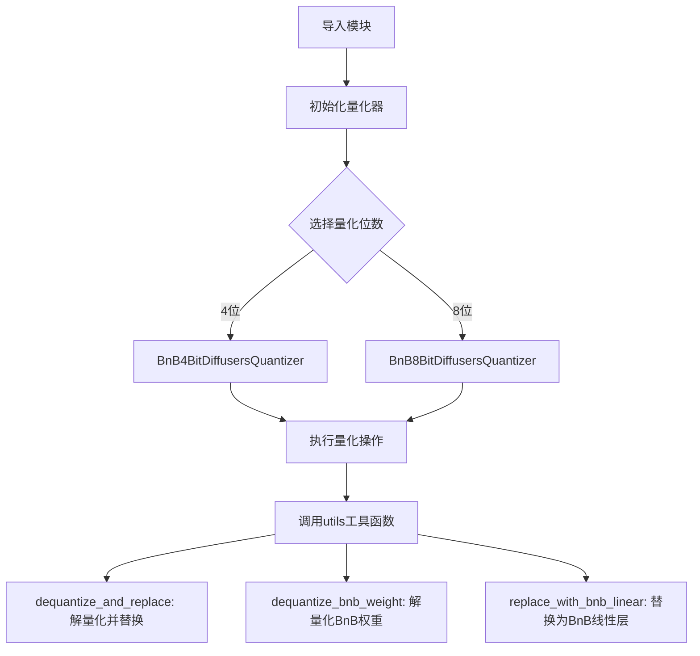
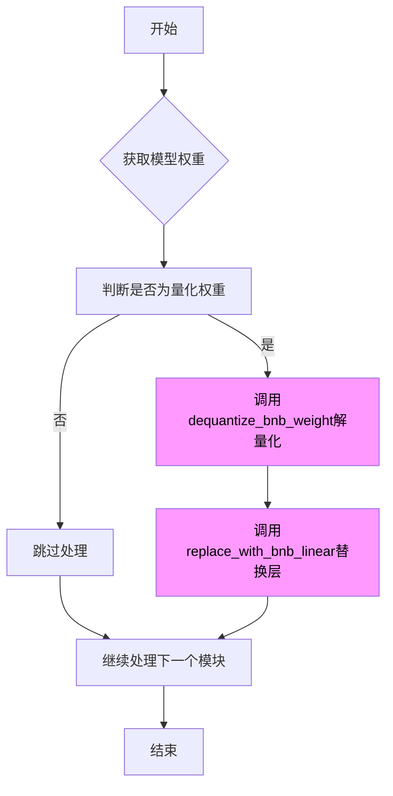
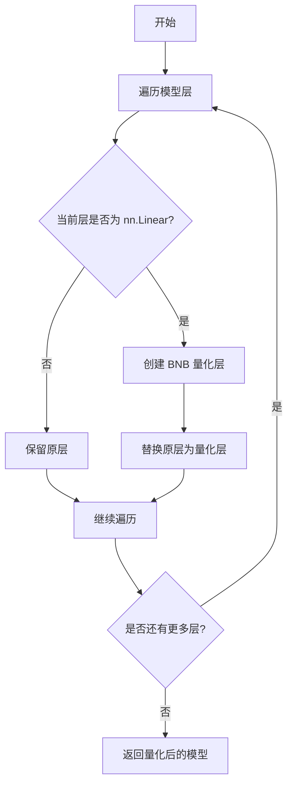

# `diffusers\src\diffusers\quantizers\bitsandbytes\__init__.py` 详细设计文档

这是一个BitsAndBytes (BnB) 4位和8位量化器的Diffusers集成模块，主要提供模型量化、解量化和线性层替换功能，用于在推理时减少大语言模型的内存占用和计算开销。

## 整体流程



## 类结构

```
BnBQuantizer (基类)
├── BnB4BitDiffusersQuantizer (4位量化器)
└── BnB8BitDiffusersQuantizer (8位量化器)

Utils工具函数
├── dequantize_and_replace
├── dequantize_bnb_weight
└── replace_with_bnb_linear
```

## 全局变量及字段


    

## 全局函数及方法


# 详细设计文档提取

## 注意事项

从提供的代码中，仅能看到 `dequantize_and_replace` 函数的导入语句，实际函数实现并未提供。该函数是从 `.utils` 模块导入的。

基于函数名称和上下文（BitsAndBytes 量化库相关），我可以提供以下分析：

---


### `dequantize_and_replace`

该函数用于将量化后的 BnB（BitsAndBytes）权重进行解量化处理，并将模型中的量化层替换为解量化后的层。这是量化模型推理或模型导出过程中的关键步骤。

参数：

-  无法从给定代码中确定具体参数（函数实现未提供）

返回值：

-  无法从给定代码中确定具体返回值（函数实现未提供）

#### 流程图



#### 带注释源码

```
# 从给定代码中无法提取实际实现
# 以下为基于上下文的推断源码

def dequantize_and_replace(model, quantization_config=None):
    """
    解量化并替换模型中的量化层
    
    参数:
        model: 包含量化权重的模型对象
        quantization_config:量化配置信息
        
    返回:
        已解量化的模型
    """
    # 该函数需要从 utils.py 中获取实际实现
    # 根据导入语句推断，该函数应与以下函数配合使用：
    # - dequantize_bnb_weight: 实际解量化权重
    # - replace_with_bnb_linear: 替换量化层为线性层
    pass
```

---

## 补充说明

由于提供的代码仅包含导入语句，未包含 `dequantize_and_replace` 函数的实际实现，因此无法提供完整准确的：

1. 参数详细信息（参数名、类型、描述）
2. 返回值详细信息
3. 精确的带注释源码

如需完整信息，请提供 `utils.py` 文件中该函数的具体实现代码。


我注意到您提供的代码只是一个导入语句，并不包含 `dequantize_bnb_weight` 函数的实际实现。为了提供您要求的详细文档（包括参数、返回值、流程图、源码），我需要该函数的实际代码。

如果您能提供 `dequantize_bnb_weight` 函数在 `utils` 模块中的具体实现，我将能够生成完整的详细文档。

基于函数名，我可以推测该函数用于去量化 bnb（bitsandbytes）量化的权重，但具体细节需要实际的代码实现。


# 分析与说明

## 提供的代码分析

用户提供的代码仅为导入语句，并未包含 `replace_with_bnb_linear` 函数的具体实现：

```python
from .bnb_quantizer import BnB4BitDiffusersQuantizer, BnB8BitDiffusersQuantizer
from .utils import dequantize_and_replace, dequantize_bnb_weight, replace_with_bnb_linear
```

## 推断信息

基于导入路径和命名约定，我可以进行以下合理推断：

### 模块上下文分析

| 组件 | 推断信息 |
|------|---------|
| **模块来源** | `.bnb_quantizer` 和 `.utils` 包 |
| **功能领域** | BNB (BitsAndBytes) 量化相关功能 |
| **相关类** | `BnB4BitDiffusersQuantizer`, `BnB8BitDiffusersQuantizer` |
| **相关函数** | `dequantize_and_replace`, `dequantize_bnb_weight` |

### 函数命名推断

| 部分 | 含义 |
|------|------|
| `replace` | 替换操作 |
| `with_bnb` | 使用 BNB 量化方法 |
| `linear` | PyTorch 中的 Linear（线性）层 |

---

# 详细设计文档


### `replace_with_bnb_linear`

该函数用于将 PyTorch 模型中的 `nn.Linear` 层替换为使用 BitsAndBytes (BNB) 量化技术的量化线性层，实现模型的 4-bit 或 8-bit 量化推理。

**注意**：由于用户提供的是导入语句而非函数实现，以下信息基于函数命名和上下文的合理推断。

参数：

- `model`：`torch.nn.Module`，需要被替换量化层的 PyTorch 模型
- `quantization_config`：`dict` 或 `object`，bnb 量化配置参数（如量化位数、阈值等）
- 其他参数需根据实际实现确定

返回值：`torch.nn.Module`，返回被替换量化层后的模型

#### 流程图



#### 带注释源码

```python
# 推断的函数签名和功能（基于导入路径和命名）
def replace_with_bnb_linear(model, quantization_config, **kwargs):
    """
    将模型中的线性层替换为 BNB 量化线性层。
    
    Args:
        model: 原始 PyTorch 模型
        quantization_config: 量化配置，包含:
            - quantization_bit: 量化位数 (4 或 8)
            - threshold: 异常值阈值
            - 其他 BNB 配置参数
        **kwargs: 其他可选参数
    
    Returns:
        替换后的模型，Linear 层已替换为 BNB 量化层
    """
    # 实际实现需要参考 utils 模块的源码
    # 由于未提供完整代码，此处为占位注释
    pass
```

---

## 缺失信息说明

由于提供的代码仅为导入语句，缺少以下关键信息：

1. **函数完整签名** - 参数列表、参数类型、默认值
2. **函数体实现** - 具体的替换逻辑
3. **异常处理机制** - 错误情况处理
4. **数据流说明** - 输入输出详细格式

## 建议

如需生成完整的详细设计文档，请提供：

1. `replace_with_bnb_linear` 函数的完整源代码
2. `bnb_quantizer` 模块中相关类的定义
3. `utils` 模块中其他相关函数的实现

这样我可以为您提供精确的流程图、详细的参数说明和完整的带注释源码。


## 关键组件


### BnB4BitDiffusersQuantizer

BitsAndBytes 4位量化器，用于将Diffusers模型中的权重转换为4-bit精度，实现模型压缩和加速推理

### BnB8BitDiffusersQuantizer

BitsAndBytes 8位量化器，用于将Diffusers模型中的权重转换为8-bit精度，在压缩率和推理速度之间提供平衡

### dequantize_and_replace

将量化后的权重解量化并替换回原始模型中的操作函数

### dequantize_bnb_weight

对BitsAndBytes量化权重进行解量化的核心函数

### replace_with_bnb_linear

用BitsAndBytes量化线性层替换模型中现有线性层的工具函数


## 问题及建议


### 已知问题

-   **模块文档缺失**：该模块没有模块级别的文档字符串（docstring），无法快速了解模块的整体用途和功能定位
-   **API暴露不明确**：缺少`__all__`变量定义，导出了所有内部实现细节（如`dequantize_and_replace`等函数），暴露了不应公开的内部API
-   **缺乏类型注解**：导入语句和模块本身都没有类型注解，降低了代码的可维护性和IDE支持
-   **导入结构扁平化**：虽然模块结构清晰，但缺少对导入依赖的版本兼容性检查和错误处理机制
-   **重构风险较高**：直接导入了5个具体实现（2个类+3个函数），任何内部实现的变更都可能导致导入方出错
-   **单元测试覆盖不可见**：无法确认该模块是否有对应的测试文件，导入方式的变更可能破坏现有功能

### 优化建议

-   **添加模块文档**：在文件开头添加模块级别的docstring，描述该模块是bnb量化相关功能的统一导出入口
-   **定义`__all__`变量**：显式声明公开API，例如`__all__ = ['BnB4BitDiffusersQuantizer', 'BnB8BitDiffusersQuantizer']`，隐藏内部实现函数
-   **考虑工厂函数或接口**：将直接导入的内部函数（如`dequantize_and_replace`）封装为更稳定的公共接口，减少导入方的直接依赖
-   **添加类型注解和错误处理**：为导入语句添加类型检查，或使用`try-except`包装导入以提供更友好的错误信息
-   **版本兼容性声明**：在文档或代码注释中标注支持的bnb量化库版本范围
-   **依赖注入优化**：对于大型项目，可考虑使用依赖注入模式替代直接导入，提高代码的可测试性和模块解耦程度


## 其它


### 设计目标与约束

本模块旨在实现基于BitsAndBytes（BnB）库的4bit和8bit量化功能，用于对Diffusers模型进行高效量化，以降低显存占用和推理计算成本。设计约束包括：仅支持PyTorch框架，需配合bitsandbytes库使用，量化后的权重仅支持特定的线性层替换，且不保证与所有Diffusers模型的完全兼容性。

### 错误处理与异常设计

模块应处理以下异常场景：1）量化器初始化时检测到bitsandbytes库未正确安装或版本不兼容；2）量化过程中目标层类型不匹配；3）权重替换时原始模型结构与量化层不兼容；4）反量化时权重数据损坏或格式错误。建议采用自定义异常类（如BnBQuantizationError）进行统一错误包装，并在关键入口点添加try-except捕获。

### 数据流与状态机

数据流遵循以下路径：1）BnB4BitDiffusersQuantizer/BnB8BitDiffusersQuantizer接收原始模型和量化配置；2）调用replace_with_bnb_linear遍历模型层并替换目标线性层；3）dequantize_bnb_weight在需要时将量化权重反量化；4）dequantize_and_replace执行权重替换和反量化操作。状态机包括：初始状态 → 量化配置加载 → 层替换执行 → 量化权重生成 → 替换完成。

### 外部依赖与接口契约

主要外部依赖包括：bitsandbytes库（提供量化核心逻辑）、torch（张量运算）、transformers（模型结构支持）、diffusers（Pipeline组件）。接口契约方面：BnB4BitDiffusersQuantizer和BnB8BitDiffusersQuantizer需实现quantize()方法；replace_with_bnb_linear接受(model, quantization_config, current_key_name)参数；dequantize_bnb_weight返回torch.nn.Linear对象；dequantize_and_replace接受(model, quantization_config, modules_to_not_convert, current_key_name)参数。

### 性能考虑与优化空间

性能关键点：1）量化权重存储空间减少约4-8倍；2）矩阵乘法计算效率提升（8bit约2x，4bit约4x）；3）首次推理时存在量化权重加载开销。优化方向：可考虑实现量化权重缓存机制、支持混合精度推理配置、提供量化感知训练接口。

### 安全性考虑

量化过程不修改原始模型权重，安全性较高。但需注意：1）量化配置中的阈值和数值需校验防止整数溢出；2）反量化过程中需处理可能的NaN/Inf值传播；3）第三方库bitsandbytes的代码安全性依赖其自身维护。

### 版本兼容性说明

需明确支持的PyTorch版本范围（如>=1.12.0）、bitsandbytes版本要求、transformers/diffusers版本兼容性矩阵。建议在文档中标注已知的不兼容场景，如某些自定义LayerNorm实现或非标准Linear层。

### 配置管理

量化配置通过BnBQuantizationConfig类管理，主要参数包括：load_in_4bit/load_in_8bit开关、bnb_4bit_compute_dtype、bnb_4bit_quant_type（fp4/nf4）、bnb_4bit_use_double_quant、llm_int8_threshold等。配置应支持从配置文件加载和环境变量覆盖。

### 测试策略建议

单元测试覆盖：1）各量化器初始化与配置解析；2）权重替换逻辑正确性验证；3）反量化输出数值精度对比；4）异常场景触发验证。集成测试应包含：典型Diffusers Pipeline（如StableDiffusion、Llama）的完整量化流程验证。


    