# `diffusers\src\diffusers\quantizers\bitsandbytes\bnb_quantizer.py` 详细设计文档

该文件实现了基于bitsandbytes库的4位和8位量化器，用于对Diffusers模型进行高效内存占用的量化加载，支持在GPU上快速推理的同时减少模型内存占用。

## 整体流程

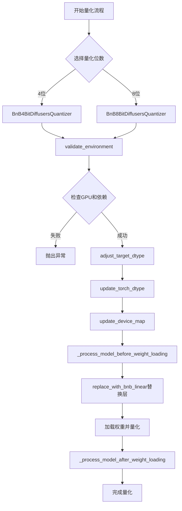

## 类结构

```
DiffusersQuantizer (抽象基类)
├── BnB4BitDiffusersQuantizer (4位量化实现)
└── BnB8BitDiffusersQuantizer (8位量化实现)
```

## 全局变量及字段


### `logger`
    
模块级别的日志记录器，用于记录量化过程中的信息

类型：`logging.Logger`
    


### `BnB4BitDiffusersQuantizer.use_keep_in_fp32_modules`
    
类属性，指示是否保持某些模块在FP32精度

类型：`bool`
    


### `BnB4BitDiffusersQuantizer.requires_calibration`
    
类属性，指示4-bit量化是否需要校准

类型：`bool`
    


### `BnB4BitDiffusersQuantizer.modules_to_not_convert`
    
实例属性，存储不需要进行4-bit量化转换的模块名称列表

类型：`list`
    


### `BnB8BitDiffusersQuantizer.use_keep_in_fp32_modules`
    
类属性，指示是否保持某些模块在FP32精度

类型：`bool`
    


### `BnB8BitDiffusersQuantizer.requires_calibration`
    
类属性，指示8-bit量化是否需要校准

类型：`bool`
    


### `BnB8BitDiffusersQuantizer.modules_to_not_convert`
    
实例属性，存储不需要进行8-bit量化转换的模块名称列表

类型：`list`
    
    

## 全局函数及方法


### `get_module_from_name`

该函数根据给定的参数名称，从模型中获取对应的模块（层）对象和参数的张量名称。这是量化过程中重要的辅助函数，用于定位模型中特定参数的位置。

参数：

- `model`：`torch.nn.Module` 或 `ModelMixin`，需要从中获取模块的模型对象
- `param_name`：`str`，参数的完整路径名称（例如 `transformer.encoder.layer.0.mlp.dense_h_to_4h.weight`）

返回值：返回元组 `(module, tensor_name)`，其中 `module` 是 `torch.nn.Module` 类型，表示参数所在的模块；`tensor_name` 是 `str` 类型，表示参数在模块中的属性名称（例如 `weight` 或 `bias`）

#### 流程图

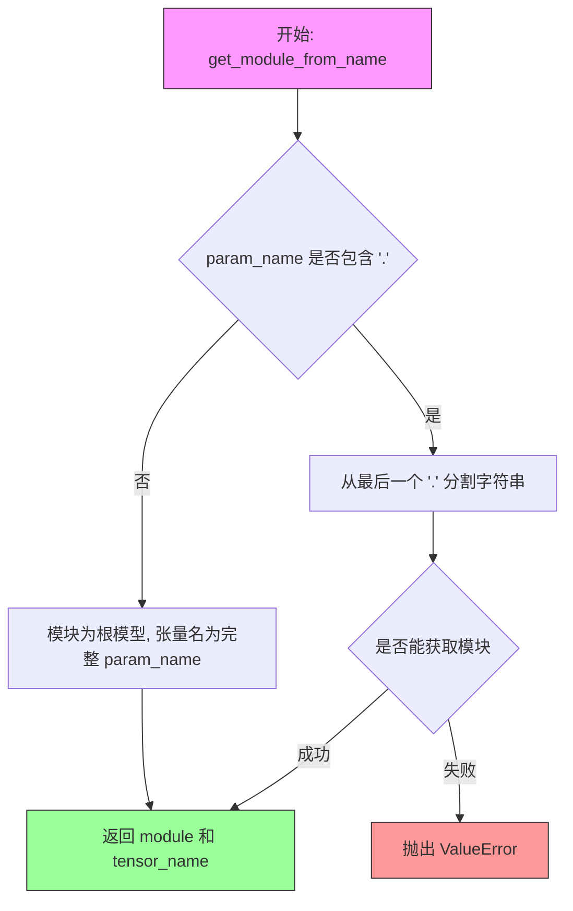

#### 带注释源码

```python
def get_module_from_name(model, param_name):
    """
    从模型中获取给定参数名对应的模块和张量名
    
    参数:
        model: 模型的根模块
        param_name: 参数的完整路径名称
        
    返回:
        tuple: (module, tensor_name) - 父模块和张量属性名
    """
    # 如果参数名不包含点，说明是根级别的参数
    if "." not in param_name:
        return model, param_name
    
    # 从最后一个点分割，获取模块路径和张量名
    # 例如: "transformer.encoder.weight" -> module_path="transformer", tensor_name="encoder.weight"
    # 需要递归遍历获取最终的父模块
    module_path, tensor_name = param_name.rsplit(".", 1)
    
    # 递归获取嵌套的子模块
    # 使用 getattr 逐层获取，如 model.transformer.encoder
    module = model
    for attr in module_path.split("."):
        module = getattr(module, attr)
    
    # 返回最终的父模块和张量名称
    return module, tensor_name
```

> **注意**：由于该函数的实际实现在 `...utils` 模块中（源自 HuggingFace Transformers 库），以上源码为基于使用方式的推断实现。实际实现可能包含更完善的错误处理和边界情况处理。


### `replace_with_bnb_linear`

该函数是 BNB (bitsandbytes) 量化器的核心工具函数，用于在模型加载前将原始的 `torch.nn.Linear` 层替换为 bitsandbytes 库提供的量化线性层（如 `Linear4bit` 或 `Linear8bitLt`），同时根据配置跳过指定的模块以保持数值稳定性。

参数：

- `model`：`ModelMixin`，需要被替换的 Diffusers 模型实例
- `modules_to_not_convert`：`List[str]`，需要保持原始 dtype 而不被量化替换的模块名称列表（例如输出投影层、lm_head 等）
- `quantization_config`：量化配置对象，包含量化参数（如量化位宽、量化方法等）

返回值：`ModelMixin`，完成层替换后的模型对象

#### 流程图

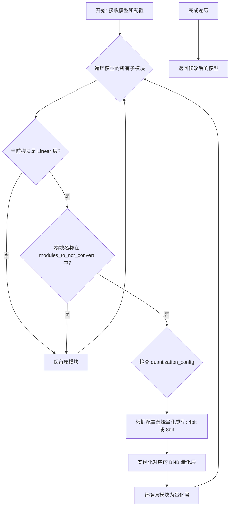

#### 带注释源码

```python
def replace_with_bnb_linear(model, modules_to_not_convert, quantization_config):
    """
    将模型中的标准 nn.Linear 层替换为 bitsandbytes 量化层。
    
    参数:
        model: 需要进行量化替换的模型
        modules_to_not_convert: 不应被替换的模块名称列表（如 ['lm_head', 'proj_out']）
        quantization_config: 包含量化细节的配置对象（如 BitsAndBytesConfig）
    
    返回:
        完成量化层替换的模型
    """
    import bitsandbytes as bnb
    from ...models.modeling_utils import ModelMixin
    
    # 1. 获取量化配置参数
    # 4bit 量化使用 load_in_4bit，8bit 量化使用 load_in_8bit
    load_in_4bit = quantization_config.load_in_4bit
    load_in_8bit = quantization_config.load_in_8bit
    
    # 2. 遍历模型的所有模块
    for name, module in model.named_modules():
        # 3. 检查是否为需要跳过的模块
        # 将模块名称转换为点分隔形式以便精确匹配
        if any(module_name in name for module_name in modules_to_not_convert):
            continue
            
        # 4. 判断是否为标准的 Linear 层
        if isinstance(module, torch.nn.Linear):
            # 5. 获取原始层的参数
            in_features = module.in_features
            out_features = module.out_features
            bias = module.bias is not None
            
            # 6. 根据量化类型创建对应的 BNB 量化层
            if load_in_4bit:
                # 4bit 量化：使用 Linear4bit
                # 关键参数：
                # - threshold: 异常值处理的阈值
                # - has_bias: 是否有偏置
                # - compress_statistics: 是否压缩统计数据
                # - quant_type: 量化类型 (fp4 或 nf4)
                new_layer = bnb.nn.Linear4bit(
                    in_features, 
                    out_features, 
                    bias=bias, 
                    threshold=quantization_config.threshold,
                    compress_statistics=quantization_config.compress_statistics,
                    quant_type=quantization_config.quant_type
                )
            elif load_in_8bit:
                # 8bit 量化：使用 Linear8bitLt
                # 关键参数：
                # - threshold: 异常值处理的阈值
                # - has_bias: 是否有偏置
                new_layer = bnb.nn.Linear8bitLt(
                    in_features, 
                    out_features, 
                    bias=bias, 
                    threshold=quantization_config.threshold
                )
            
            # 7. 将原模块替换为量化层
            # 需要递归设置属性以确保正确替换嵌套模块
            parts = name.split('.')
            parent = model
            for part in parts[:-1]:
                parent = getattr(parent, part)
            setattr(parent, parts[-1], new_layer)
            
            # 8. 将量化层移到目标设备（通常是 GPU）
            if torch.cuda.is_available():
                new_layer = new_layer.to(model.device)
    
    return model
```


### `dequantize_and_replace`

该函数用于将量化后的模型权重反量化并替换回原始的线性层，实现从 4-bit/8-bit 量化格式恢复到全精度格式。

参数：

- `model`：`torch.nn.Module`，需要反量化的模型
- `modules_to_not_convert`：`List[str]`，需要保持量化状态的模块名称列表（不进行反量化）
- `quantization_config`：量化配置对象，包含量化参数和设置

返回值：`torch.nn.Module`，反量化并替换后的模型

#### 流程图

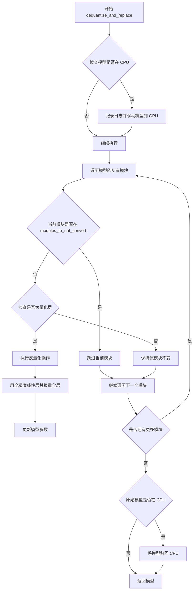

> **注意**：由于 `dequantize_and_replace` 函数定义在 `utils` 模块中（通过 `from .utils import dequantize_and_replace` 导入），而该模块的完整实现未在提供的代码片段中展示，因此无法提供完整的带注释源码。

#### 带注释源码

```
# 源码未在提供的代码片段中定义
# 函数通过 from .utils import dequantize_and_replace 导入
# 根据调用上下文推断的函数签名和用途：

def dequantize_and_replace(
    model: torch.nn.Module,
    modules_to_not_convert: List[str],
    quantization_config
) -> torch.nn.Module:
    """
    反量化并替换量化层为全精度线性层
    
    Args:
        model: 需要反量化的 PyTorch 模型
        modules_to_not_convert: 不需要反量化的模块名称列表
        quantization_config: 量化配置对象
    
    Returns:
        反量化后的模型
    """
    # 实现逻辑（需查看 utils 模块完整源码）
    ...
```

> **技术债务/优化空间**：
> 1. 提供的代码片段中未包含 `utils.py` 的完整实现，建议补充该模块源码
> 2. 反量化操作可能涉及较大的内存开销，可考虑添加内存优化选项
> 3. 当前实现未提供批处理反量化的支持


### `BnB4BitDiffusersQuantizer.__init__`

该方法是 `BnB4BitDiffusersQuantizer` 类的构造函数，用于初始化 4-bit 量化器。它调用父类构造函数并设置需要跳过转换的模块列表。

参数：

- `quantization_config`：对象，量化配置对象，包含量化参数如 `llm_int8_skip_modules` 等
- `**kwargs`：字典，额外关键字参数，用于传递给父类构造函数

返回值：`None`，无返回值（构造函数）

#### 流程图

```mermaid
flowchart TD
    A[开始 __init__] --> B[调用父类构造函数<br/>super().__init__quantization_config, **kwargs]
    B --> C{quantization_config.llm_int8_skip_modules<br/>是否不为 None}
    C -->|是| D[设置 self.modules_to_not_convert =<br/>quantization_config.llm_int8_skip_modules]
    C -->|否| E[跳过此步骤]
    D --> F[结束 __init__]
    E --> F
```

#### 带注释源码

```python
def __init__(self, quantization_config, **kwargs):
    """
    初始化 BnB4BitDiffusersQuantizer 量化器
    
    参数:
        quantization_config: 量化配置对象，包含量化相关参数
        **kwargs: 额外关键字参数，传递给父类
    """
    # 调用父类 DiffusersQuantizer 的构造函数进行基础初始化
    super().__init__(quantization_config, **kwargs)

    # 如果量化配置中指定了需要跳过的模块列表（llm_int8_skip_modules），
    # 则将其保存到实例属性中，后续在模型处理时这些模块将不会被转换为 4-bit 量化
    if self.quantization_config.llm_int8_skip_modules is not None:
        self.modules_to_not_convert = self.quantization_config.llm_int8_skip_modules
```


### `BnB4BitDiffusersQuantizer.validate_environment`

该方法用于在模型量化前验证运行环境是否满足4位量化所需的所有前提条件，包括GPU可用性、依赖库版本兼容性、权重格式支持以及设备映射配置的合理性。

参数：

- `self`：隐式参数，`BnB4BitDiffusersQuantizer`类的实例方法调用时自动传入的实例本身
- `*args`：可变位置参数，类型为任意类型，目前未被使用，保留用于接口兼容性
- `**kwargs`：可变关键字参数，类型为任意类型，用于接收可选参数如`from_flax`和`device_map`

返回值：无返回值（`None`），该方法通过抛出异常来处理验证失败的情况

#### 流程图

```mermaid
flowchart TD
    A[开始验证环境] --> B{GPU可用?}
    B -->|否| C[抛出RuntimeError: No GPU found]
    B -->|是| D Accelerate版本>=0.26.0?}
    D -->|否| E[抛出ImportError: 需要Accelerate]
    D -->|是| F{BitsAndBytes版本>=0.43.3?}
    F -->|否| G[抛出ImportError: 需要bitsandbytes]
    F -->|是| H{from_flax=True?}
    H -->|是| I[抛出ValueError: 不支持从Flax转换]
    H -->|否| J{device_map是dict?}
    J -->|否| K[验证通过]
    J -->|是| L{启用了FP32 CPU offload?}
    L -->|是| K
    L -->|否| M{设备包含cpu或disk?}
    M -->|是| N[抛出ValueError: 内存不足风险]
    M -->|否| K
```

#### 带注释源码

```python
def validate_environment(self, *args, **kwargs):
    """
    验证运行环境和依赖是否满足4位量化要求
    
    检查项目：
    1. CUDA或XPU GPU可用性
    2. Accelerate库版本 >= 0.26.0
    3. BitsAndBytes库版本 >= 0.43.3
    4. 权重格式为PyTorch（不支持Flax）
    5. device_map配置不包含CPU/disk（除非启用FP32 CPU offload）
    """
    # 检查GPU是否可用（支持CUDA或XPU）
    if not (torch.cuda.is_available() or torch.xpu.is_available()):
        raise RuntimeError("No GPU found. A GPU is needed for quantization.")
    
    # 验证Accelerate库版本
    if not is_accelerate_available() or is_accelerate_version("<", "0.26.0"):
        raise ImportError(
            "Using `bitsandbytes` 4-bit quantization requires Accelerate: `pip install 'accelerate>=0.26.0'`"
        )
    
    # 验证BitsAndBytes库版本
    if not is_bitsandbytes_available() or is_bitsandbytes_version("<", "0.43.3"):
        raise ImportError(
            "Using `bitsandbytes` 4-bit quantization requires the latest version of bitsandbytes: `pip install -U bitsandbytes`"
        )

    # 检查是否尝试从Flax权重转换（不支持）
    if kwargs.get("from_flax", False):
        raise ValueError(
            "Converting into 4-bit weights from flax weights is currently not supported, please make"
            " sure the weights are in PyTorch format."
        )

    # 获取device_map配置
    device_map = kwargs.get("device_map", None)
    
    # 检查device_map配置是否合理
    if (
        device_map is not None
        and isinstance(device_map, dict)
        and not self.quantization_config.llm_int8_enable_fp32_cpu_offload
    ):
        # 过滤掉不需转换的模块后检查设备映射
        device_map_without_no_convert = {
            key: device_map[key] for key in device_map.keys() if key not in self.modules_to_not_convert
        }
        # 如果有模块放在CPU或磁盘上且未启用FP32 CPU offload，则报错
        if "cpu" in device_map_without_no_convert.values() or "disk" in device_map_without_no_convert.values():
            raise ValueError(
                "Some modules are dispatched on the CPU or the disk. Make sure you have enough GPU RAM to fit the "
                "quantized model. If you want to dispatch the model on the CPU or the disk while keeping these modules "
                "in 32-bit, you need to set `load_in_8bit_fp32_cpu_offload=True` and pass a custom `device_map` to "
                "`from_pretrained`. Check "
                "https://huggingface.co/docs/transformers/main/en/main_classes/quantization#offload-between-cpu-and-gpu "
                "for more details. "
            )
```


### `BnB4BitDiffusersQuantizer.adjust_target_dtype`

该方法用于在 4-bit 量化过程中调整目标数据类型，当目标数据类型不是 `torch.int8` 时，将其替换为 `CustomDtype.INT4` 以支持 4-bit 量化；如果目标数据类型是 `torch.int8` 则抛出异常。

参数：

- `target_dtype`：`torch.dtype`，目标数据类型，指定量化过程中期望的目标数据类型

返回值：`torch.dtype`，返回调整后的目标数据类型，对于 4-bit 量化返回 `CustomDtype.INT4`

#### 流程图

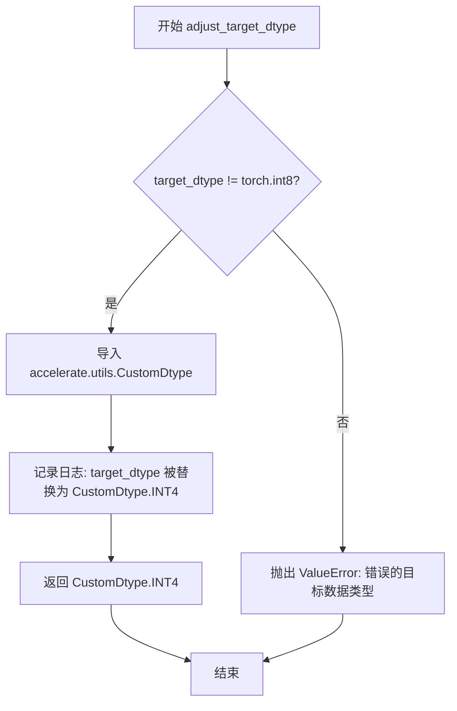

#### 带注释源码

```python
def adjust_target_dtype(self, target_dtype: "torch.dtype") -> "torch.dtype":
    """
    调整目标数据类型以适配 4-bit 量化。
    
    对于 4-bit BnB 量化，不接受 torch.int8 作为目标数据类型，
    需要将其替换为 CustomDtype.INT4 以支持 4-bit 量化格式。
    
    参数:
        target_dtype: 期望的目标数据类型
        
    返回:
        调整后的目标数据类型，4-bit 量化时为 CustomDtype.INT4
        
    异常:
        ValueError: 当 target_dtype 为 torch.int8 时抛出
    """
    # 检查目标数据类型是否不是 int8
    if target_dtype != torch.int8:
        # 导入自定义数据类型 CustomDtype，用于表示 4-bit 整数类型
        from accelerate.utils import CustomDtype

        # 记录日志，告知用户目标数据类型已被替换
        logger.info("target_dtype {target_dtype} is replaced by `CustomDtype.INT4` for 4-bit BnB quantization")
        # 返回 4-bit 自定义数据类型
        return CustomDtype.INT4
    else:
        # 如果目标数据类型是 int8，抛出异常（4-bit 量化不支持 int8）
        raise ValueError(f"Wrong `target_dtype` ({target_dtype}) provided.")
```


### BnB4BitDiffusersQuantizer.check_if_quantized_param

该方法用于检查模型参数是否已经被量化为4-bit参数。它通过检查参数类型（bnb.nn.Params4bit）以及特殊处理Linear4bit层的偏置（bias）参数来判断参数是否已被量化。

参数：

- `self`：BnB4BitDiffusersQuantizer，当前量化器实例
- `model`：`ModelMixin`，模型实例
- `param_value`：`torch.Tensor`，待检查的参数张量值
- `param_name`：`str`，参数的名称
- `state_dict`：`dict[str, Any]`，模型的状态字典
- `**kwargs`：可变关键字参数

返回值：`bool`，如果参数已被量化为4-bit参数则返回 `True`，否则返回 `False`

#### 流程图

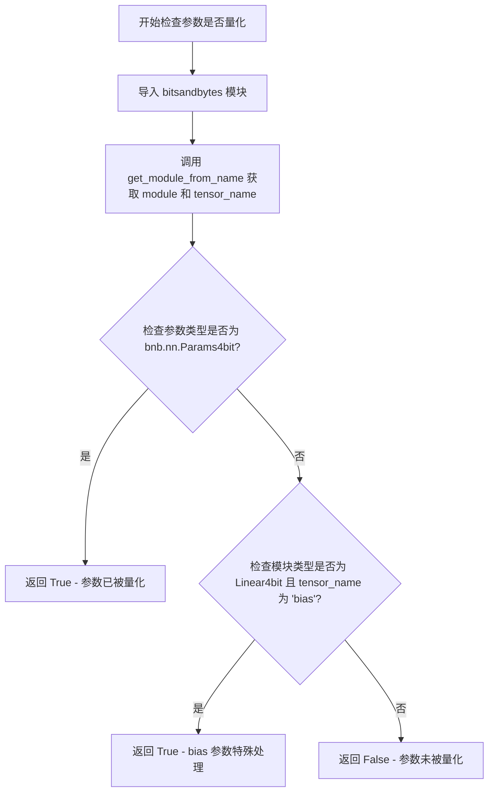

#### 带注释源码

```python
def check_if_quantized_param(
    self,
    model: "ModelMixin",
    param_value: "torch.Tensor",
    param_name: str,
    state_dict: dict[str, Any],
    **kwargs,
) -> bool:
    """
    检查给定的模型参数是否已被量化为4-bit参数。
    
    参数:
        model: 模型实例
        param_value: 参数的张量值
        param_name: 参数的名称
        state_dict: 模型的状态字典
        **kwargs: 其他可选参数
        
    返回:
        bool: 如果参数已被量化则返回True，否则返回False
    """
    # 导入 bitsandbytes 库用于类型检查
    import bitsandbytes as bnb

    # 从模型中获取给定参数名对应的模块和具体的tensor名称
    module, tensor_name = get_module_from_name(model, param_name)
    
    # 检查参数的当前值是否已经是 Params4bit 类型（已量化）
    if isinstance(module._parameters.get(tensor_name, None), bnb.nn.Params4bit):
        # TODO: 这里可以添加对已加载组件数据类型的检查，一旦序列化实现完成
        # 返回 True 表示该参数已被量化
        return True
    # 检查是否为 Linear4bit 层的 bias 参数
    # bias 可能会通过 accelerate 的 set_module_tensor_to_device() 加载，
    # 但在那里使用未初始化的权重会导致错误
    elif isinstance(module, bnb.nn.Linear4bit) and tensor_name == "bias":
        # 对于 bias 参数也返回 True，进行特殊处理
        return True
    else:
        # 参数未被量化
        return False
```


### `BnB4BitDiffusersQuantizer.create_quantized_param`

该方法负责在模型权重加载过程中为4位量化模型创建和配置`Params4bit`对象，处理预量化权重的反序列化、偏置项的特殊处理以及量化统计信息的收集。

参数：

- `model`：`ModelMixin`，目标模型实例，用于访问模块结构和参数
- `param_value`：`torch.Tensor`，从状态字典加载的原始参数张量
- `param_name`：`str`，参数的名称，用于从模型中定位对应的模块和参数
- `target_device`：`torch.device`，要将参数移动到的目标设备（如CUDA设备）
- `state_dict`：`dict[str, Any]`，模型的状态字典，包含所有权重和量化统计信息
- `unexpected_keys`：`list[str] | None`，可选，用于跟踪在加载过程中未预期的键
- `**kwargs`：其他关键字参数，用于传递额外的配置选项

返回值：`None`，该方法直接修改模型的内部参数，不返回任何值

#### 流程图

```mermaid
flowchart TD
    A[开始 create_quantized_param] --> B[获取 module 和 tensor_name]
    B --> C{检查参数是否存在}
    C -->|否| D[抛出 ValueError]
    C -->|是| E[获取旧参数值 old_value]
    E --> F{判断是否为 bias}
    F -->|是| G[处理 bias 参数]
    G --> H{param_value 是否为 None}
    H -->|是| I[new_value = old_value.to target_device]
    H -->|否| J[new_value = param_value.to target_device]
    I --> K[创建 Parameter 并赋值]
    J --> K
    K --> L[返回]
    
    F -->|否| M{检查是否为 Params4bit 类型}
    M -->|否| N[抛出 ValueError]
    M -->|是| O{检查设备状态}
    O --> P{old_value 在 meta 设备且 param_value 为 None}
    P -->|是| Q[抛出 ValueError]
    P -->|否| R{判断是否为预量化权重]
    
    R -->|是| S[检查序列化兼容性]
    S --> T{is_serializable 为 True]
    T -->|否| U[抛出 ValueError]
    T -->|是| V{检查量化统计信息是否存在}
    V -->|否| W[抛出 ValueError]
    V -->|是| X[收集量化统计信息]
    X --> Y[创建 Params4bit from_prequantized]
    Y --> Z[赋值并返回]
    
    R -->|否| AA[转换为 CPU 并创建 Params4bit]
    AA --> Z
```

#### 带注释源码

```python
def create_quantized_param(
    self,
    model: "ModelMixin",
    param_value: "torch.Tensor",
    param_name: str,
    target_device: "torch.device",
    state_dict: dict[str, Any],
    unexpected_keys: list[str] | None = None,
    **kwargs,
):
    """
    为4位量化模型创建量化参数。
    
    该方法处理两种场景：
    1. 预量化权重加载：从已量化的状态字典恢复参数
    2. 动态量化：先将权重转换为4bit格式再加载
    
    Parameters:
        model: 目标模型实例
        param_value: 从状态字典加载的原始参数张量
        param_name: 参数名称，用于定位模块
        target_device: 目标设备
        state_dict: 模型状态字典
        unexpected_keys: 可选的未预期键列表
    """
    import bitsandbytes as bnb

    # 从参数名称获取对应的模块和tensor名称
    module, tensor_name = get_module_from_name(model, param_name)

    # 验证模块是否具有指定的参数
    if tensor_name not in module._parameters:
        raise ValueError(f"{module} does not have a parameter or a buffer named {tensor_name}.")

    # 获取模块中已有的参数值
    old_value = getattr(module, tensor_name)

    # 特殊情况：处理偏置项(bias)
    if tensor_name == "bias":
        if param_value is None:
            # 如果没有提供新值，使用旧值并移动到目标设备
            new_value = old_value.to(target_device)
        else:
            # 使用提供的值并移动到目标设备
            new_value = param_value.to(target_device)

        # 创建参数对象，保持原有的梯度要求
        new_value = torch.nn.Parameter(new_value, requires_grad=old_value.requires_grad)
        module._parameters[tensor_name] = new_value
        return  # 偏置处理完成，直接返回

    # 验证当前参数是否为4bit参数类型
    if not isinstance(module._parameters[tensor_name], bnb.nn.Params4bit):
        raise ValueError("this function only loads `Linear4bit components`")
    
    # 检查meta设备上的参数是否需要实际值
    if (
        old_value.device == torch.device("meta")
        and target_device not in ["meta", torch.device("meta")]
        and param_value is None
    ):
        raise ValueError(f"{tensor_name} is on the meta device, we need a `value` to put in on {target_device}.")

    # 根据是否预量化选择不同的处理路径
    if self.pre_quantized:
        # 路径1：加载预量化权重
        # 4bit加载场景：收集用于恢复量化权重的组件
        
        # 检查bitsandbytes版本是否支持序列化
        if not self.is_serializable:
            raise ValueError(
                "Detected int4 weights but the version of bitsandbytes is not compatible with int4 serialization. "
                "Make sure to download the latest `bitsandbytes` version. `pip install --upgrade bitsandbytes`."
            )

        # 验证状态字典中是否包含必要的量化统计信息
        if (param_name + ".quant_state.bitsandbytes__fp4" not in state_dict) and (
            param_name + ".quant_state.bitsandbytes__nf4" not in state_dict
        ):
            raise ValueError(
                f"Supplied state dict for {param_name} does not contain `bitsandbytes__*` and possibly other `quantized_stats` components."
            )

        # 收集与当前参数相关的所有量化统计信息
        quantized_stats = {}
        for k, v in state_dict.items():
            # 使用startswith处理state_dict中可能有多个同名参数的情况
            if param_name + "." in k and k.startswith(param_name):
                quantized_stats[k] = v
                # 从unexpected_keys中移除已处理的键
                if unexpected_keys is not None and k in unexpected_keys:
                    unexpected_keys.remove(k)

        # 使用from_prequantized方法创建量化参数
        new_value = bnb.nn.Params4bit.from_prequantized(
            data=param_value,
            quantized_stats=quantized_stats,
            requires_grad=False,
            device=target_device,
        )
    else:
        # 路径2：动态量化
        # 将参数值先移动到CPU（bitsandbytes要求）
        new_value = param_value.to("cpu")
        # 获取原始参数的所有属性（如量化配置）
        kwargs = old_value.__dict__
        # 创建新的4bit参数对象并移动到目标设备
        new_value = bnb.nn.Params4bit(new_value, requires_grad=False, **kwargs).to(target_device)

    # 更新模块中的参数
    module._parameters[tensor_name] = new_value
```


### `BnB4BitDiffusersQuantizer.check_quantized_param_shape`

验证量化参数形状的函数，用于确保加载的量化参数形状与预期形状匹配。该方法计算当前参数的元素数量，并根据参数类型（bias 或 weight）推断预期的量化后形状，然后与加载的参数形状进行比对。

参数：

- `param_name`：`str`，参数的名称，用于判断是否为 bias 类型
- `current_param`：`torch.Tensor`，当前模型中的参数张量
- `loaded_param`：`torch.Tensor`，从状态字典加载的参数张量

返回值：`bool`，如果形状匹配返回 `True`，否则抛出 `ValueError`

#### 流程图

```mermaid
flowchart TD
    A[开始] --> B[获取 current_param 的形状]
    B --> C[获取 loaded_param 的形状]
    C --> D[计算元素数量 n = current_param_shape.numel]
    D --> E{param_name 包含 'bias'?}
    E -->|是| F[推断形状 = (n,)]
    E -->|否| G[推断形状 = ((n + 1) // 2, 1)]
    F --> H{loaded_param_shape == inferred_shape?}
    G --> H
    H -->|是| I[返回 True]
    H -->|否| J[抛出 ValueError]
    I --> K[结束]
    J --> K
```

#### 带注释源码

```python
def check_quantized_param_shape(self, param_name, current_param, loaded_param):
    """
    检查量化参数的形状是否正确。

    参数:
        param_name: 参数名称，用于判断是否为 bias 类型
        current_param: 当前模型中的参数张量
        loaded_param: 从状态字典加载的参数张量

    返回:
        bool: 形状匹配返回 True

    异常:
        ValueError: 当加载的参数形状与推断形状不匹配时抛出
    """
    # 获取当前参数的形状
    current_param_shape = current_param.shape
    # 获取加载参数的形状
    loaded_param_shape = loaded_param.shape

    # 计算当前参数的总元素数量
    n = current_param_shape.numel()
    # 根据参数类型推断预期的量化后形状
    # bias 参数：形状保持不变 (n,)
    # weight 参数：4-bit 量化使用 2 bits/element，需要 (n+1)//2 个字节，形状为 ((n+1)//2, 1)
    inferred_shape = (n,) if "bias" in param_name else ((n + 1) // 2, 1)
    
    # 比较加载的形状与推断的形状
    if loaded_param_shape != inferred_shape:
        raise ValueError(
            f"Expected the flattened shape of the current param ({param_name}) to be {loaded_param_shape} but is {inferred_shape}."
        )
    else:
        return True
```


### `BnB4BitDiffusersQuantizer.adjust_max_memory`

该方法用于在4位量化过程中调整最大内存限制，通过将每个设备的最大内存值降低到原来的90%，为量化过程中创建的缓冲区预留额外的内存空间。

参数：

- `max_memory`：`dict[str, int | str]`，一个字典，键为设备标识（如"cuda:0"、"cpu"等），值为该设备的最大内存限制（整数字节数或字符串形式）

返回值：`dict[str, int | str]`，返回调整后的最大内存字典，每个值都是原始值的90%

#### 流程图

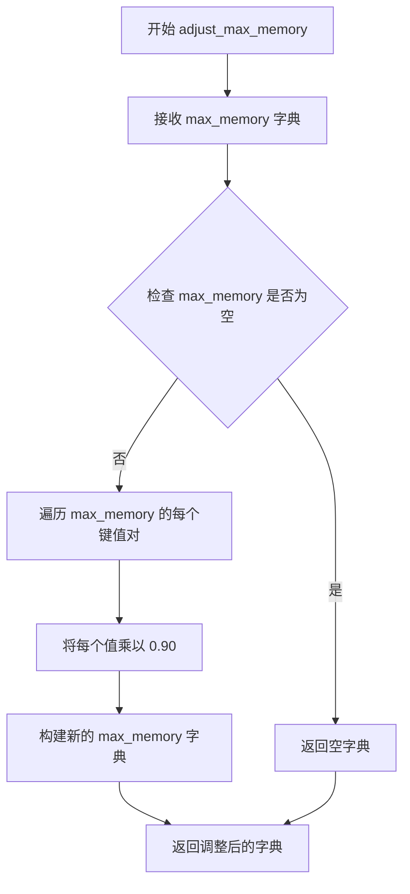

#### 带注释源码

```python
def adjust_max_memory(self, max_memory: dict[str, int | str]) -> dict[str, int | str]:
    """
    调整最大内存限制，为量化过程中创建的缓冲区预留额外空间。
    
    参数:
        max_memory: 包含各设备最大内存限制的字典，键为设备标识，值为内存大小
        
    返回:
        调整后的最大内存字典，每个值都是原始值的90%
    """
    # 需要更多空间来存储量化过程中创建的缓冲区
    # 将每个设备的内存限制降低到原来的90%，留出10%作为缓冲空间
    max_memory = {key: val * 0.90 for key, val in max_memory.items()}
    return max_memory
```


### `BnB4BitDiffusersQuantizer.update_torch_dtype`

该方法是 BnB4BitDiffusersQuantizer 类的成员方法，用于在加载 bitsandbytes 4-bit 量化模型时更新 PyTorch 数据类型。当用户未指定 `torch_dtype` 时，该方法会强制将其覆盖为 `float16`，这是 bitsandbytes 库加载 8-bit 或 4-bit 量化模型的硬性要求，以确保模型能够正确加载。

参数：

- `torch_dtype`：`torch.dtype`，待更新的 PyTorch 数据类型，如果为 `None` 则会被覆盖为 `float16`

返回值：`torch.dtype`，更新后的 PyTorch 数据类型

#### 流程图

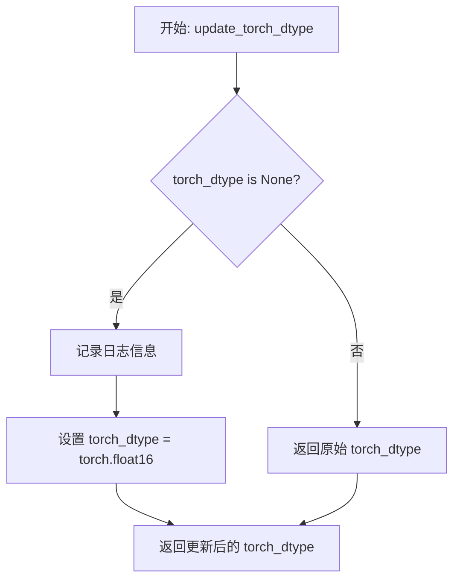

#### 带注释源码

```python
def update_torch_dtype(self, torch_dtype: "torch.dtype") -> "torch.dtype":
    """
    更新 torch 数据类型以适配 bitsandbytes 量化要求。
    
    参数:
        torch_dtype: 目标 PyTorch 数据类型，如果为 None 则使用 float16
        
    返回:
        更新后的 PyTorch 数据类型
    """
    # 检查是否未指定数据类型
    if torch_dtype is None:
        # 强制将 dtype 设置为 float16，这是 bitsandbytes 的必需条件
        logger.info(
            "Overriding torch_dtype=%s with `torch_dtype=torch.float16` due to "
            "requirements of `bitsandbytes` to enable model loading in 8-bit or 4-bit. "
            "Pass your own torch_dtype to specify the dtype of the remaining non-linear layers or pass"
            " torch_dtype=torch.float16 to remove this warning.",
            torch_dtype,
        )
        # 覆盖为 float16 类型
        torch_dtype = torch.float16
    # 返回更新后的数据类型
    return torch_dtype
```

#### 关键组件信息

| 名称 | 一句话描述 |
|------|-----------|
| `BnB4BitDiffusersQuantizer` | 4-bit 量化器类，封装 bitsandbytes 4-bit 量化逻辑 |
| `DiffusersQuantizer` | 基类，定义量化器通用接口 |
| `logger` | 模块级日志记录器，用于输出量化过程信息 |

#### 潜在技术债务或优化空间

1. **硬编码的数据类型覆盖**：当前实现强制使用 `float16`，缺乏灵活性，未来可能需要支持更多数据类型选项
2. **重复代码**：该方法与 `BnB8BitDiffusersQuantizer.update_torch_dtype` 实现完全相同，存在代码重复，可考虑提取到基类中
3. **日志信息冗余**：每次调用都会记录日志，在批量加载模型时可能产生大量日志输出

#### 其它项目

**设计目标与约束：**

- 强制 `torch_dtype` 为 `float16` 以满足 bitsandbytes 库的底层要求
- 保持与 HuggingFace Transformers 库中量化接口的一致性

**错误处理与异常设计：**

- 本方法不抛出异常，仅进行数据类型覆盖
- 错误检查由 `validate_environment` 方法在更早阶段完成

**数据流与状态机：**

- 该方法在模型加载流程的早期被调用，位于 `DiffusersQuantizer` 量化处理流程的数据类型调整阶段
- 输入 `torch_dtype` 通常来自用户配置或默认参数，输出传递给后续的模型权重加载流程

**外部依赖与接口契约：**

- 依赖 `bitsandbytes` 库（版本 >= 0.43.3）
- 依赖 `torch` 库
- 依赖 `logging` 模块记录信息


### `BnB4BitDiffusersQuantizer.update_device_map`

该方法用于更新模型推理的设备映射（device_map）。当用户未显式指定 device_map 时，该方法会自动检测当前可用的计算设备（优先使用 XPU，其次使用 CUDA），并生成一个默认的设备映射字典，将整个模型分配到当前设备上。

参数：

- `device_map`：`dict | None`，表示模型的设备映射配置。如果为 `None`，则自动生成一个将整个模型映射到当前设备的 device_map；否则返回原始的 device_map。

返回值：`dict`，返回处理后的设备映射字典。

#### 流程图

```mermaid
flowchart TD
    A[开始 update_device_map] --> B{device_map is None?}
    B -->|是| C{torch.xpu.is_available?}
    C -->|是| D[获取当前 XPU 设备: current_device = f"xpu:{torch.xpu.current_device()}"]
    C -->|否| E[获取当前 CUDA 设备: current_device = f"cuda:{torch.cuda.current_device()}"]
    D --> F[创建 device_map = {'': current_device}]
    E --> F
    F --> G[记录日志信息]
    B -->|否| H[直接返回原始 device_map]
    G --> I[返回 device_map]
    H --> I
    I[结束]
```

#### 带注释源码

```python
def update_device_map(self, device_map):
    """
    更新设备映射（device_map）。

    如果未提供 device_map，则根据当前可用的 GPU 类型（XPU 或 CUDA）
    自动创建一个默认的设备映射，将整个模型分配到当前设备上。
    
    参数:
        device_map: 可选的设备映射字典，用于指定模型各层分配到的设备。
                    如果为 None，则自动生成一个默认映射。
    
    返回:
        处理后的设备映射字典。
    """
    # 检查是否需要自动生成 device_map
    if device_map is None:
        # 优先检测 Intel XPU 是否可用
        if torch.xpu.is_available():
            # 获取当前 XPU 设备编号，构建设备字符串
            current_device = f"xpu:{torch.xpu.current_device()}"
        else:
            # 回退到 NVIDIA CUDA，获取当前 CUDA 设备编号
            current_device = f"cuda:{torch.cuda.current_device()}"
        
        # 创建默认的设备映射：将整个模型（空字符串键）映射到当前设备
        device_map = {"": current_device}
        
        # 记录日志，提醒用户可以使用 device_map='auto' 进行更灵活的设备分配
        logger.info(
            "The device_map was not initialized. "
            "Setting device_map to {"
            ": {current_device}}. "
            "If you want to use the model for inference, please set device_map ='auto' "
        )
    
    # 返回处理后的 device_map（可能是原始的，也可能是自动生成的）
    return device_map
```


### `BnB4BitDiffusersQuantizer._process_model_before_weight_loading`

该方法在加载权重之前对模型进行处理，主要完成以下工作：收集需要保持原始精度（FP32）的模块列表，处理设备映射（CPU/Disk offloading），然后使用 `replace_with_bnb_linear` 将模型中的线性层替换为 bitsandbytes 的 4 位量化线性层，最后更新模型配置以标记已启用 4 位量化。

参数：

- `model`：`ModelMixin`，要进行量化处理的模型对象
- `device_map`：未标注类型（通常为 `dict` 或 `None`），指定模型各层的设备映射关系
- `keep_in_fp32_modules`：`list[str] = []`，需要保持 FP32 精度（不进行量化）的模块名称列表
- `**kwargs`：任意关键字参数，用于扩展

返回值：`ModelMixin`，处理后的模型对象（经过线性层替换和配置更新）

#### 流程图

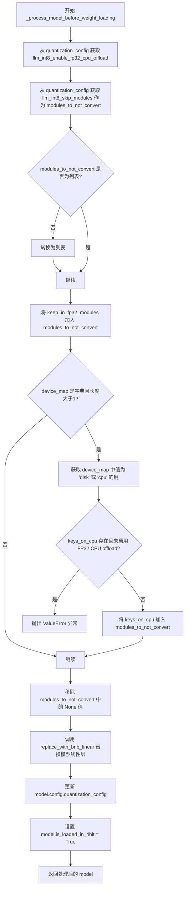

#### 带注释源码

```python
def _process_model_before_weight_loading(
    self,
    model: "ModelMixin",
    device_map,
    keep_in_fp32_modules: list[str] = [],
    **kwargs,
):
    """
    在加载权重之前处理模型：替换线性层为 4-bit 量化层
    
    参数:
        model: 要处理的模型
        device_map: 设备映射字典
        keep_in_fp32_modules: 要保持 FP32 的模块列表
        **kwargs: 额外参数
    返回:
        处理后的模型
    """
    # 从 utils 模块导入替换函数
    from .utils import replace_with_bnb_linear

    # 获取 FP32 CPU offload 配置
    load_in_8bit_fp32_cpu_offload = self.quantization_config.llm_int8_enable_fp32_cpu_offload

    # 获取需要保持原始精度的模块列表（用于数值稳定性）
    self.modules_to_not_convert = self.quantization_config.llm_int8_skip_modules

    # 确保 modules_to_not_convert 是列表类型
    if not isinstance(self.modules_to_not_convert, list):
        self.modules_to_not_convert = [self.modules_to_not_convert]

    # 扩展不转换列表，添加用户指定保持 FP32 的模块
    self.modules_to_not_convert.extend(keep_in_fp32_modules)

    # 如果 device_map 是字典且包含多个键，处理 CPU/Disk offload 情况
    if isinstance(device_map, dict) and len(device_map.keys()) > 1:
        # 找出被调度到 CPU 或 Disk 的模块键
        keys_on_cpu = [key for key, value in device_map.items() if value in ["disk", "cpu"]]

        # 如果有模块在 CPU/Disk 但未启用 FP32 CPU offload，则报错
        if len(keys_on_cpu) > 0 and not load_in_8bit_fp32_cpu_offload:
            raise ValueError(
                "If you want to offload some keys to `cpu` or `disk`, you need to set "
                "`llm_int8_enable_fp32_cpu_offload=True`. Note that these modules will not be "
                " converted to 8-bit but kept in 32-bit."
            )
        # 将这些键也加入不转换列表
        self.modules_to_not_convert.extend(keys_on_cpu)

    # 清除 None 值（与 transformers 不同，diffusers 不总是知道哪些模块需保持 FP32）
    self.modules_to_not_convert = [module for module in self.modules_to_not_convert if module is not None]

    # 执行核心替换：将模型中的 Linear 层替换为 bnb 4-bit 量化层
    model = replace_with_bnb_linear(
        model, modules_to_not_convert=self.modules_to_not_convert, quantization_config=self.quantization_config
    )
    
    # 更新模型配置中的量化配置
    model.config.quantization_config = self.quantization_config
    
    # 标记模型已加载为 4-bit
    model.is_loaded_in_4bit = True
```


### `BnB4BitDiffusersQuantizer._process_model_after_weight_loading`

该方法用于在模型权重加载完成后进行处理，主要职责是设置模型的 4 位量化可序列化标志，以便后续模型保存和加载操作能够正确处理量化状态。

参数：

-  `self`：`BnB4BitDiffusersQuantizer` 类型，当前量化器实例（隐式参数）
-  `model`：`ModelMixin` 类型，需要处理的模型对象
-  `**kwargs`：可变关键字参数，用于接收额外的参数（当前方法未使用）

返回值：`ModelMixin` 类型，返回处理后的模型对象

#### 流程图

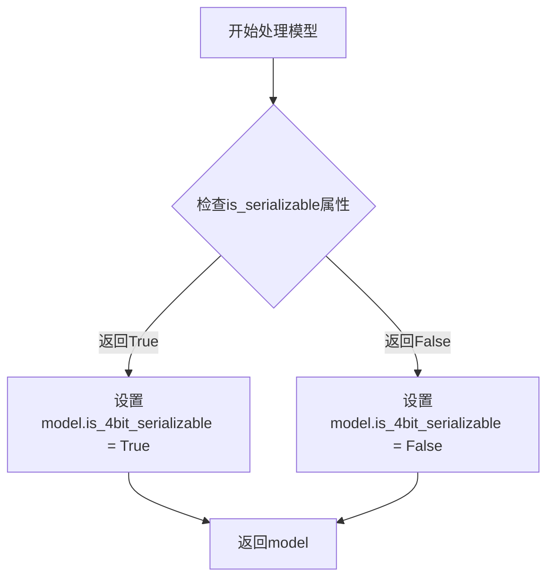

#### 带注释源码

```python
def _process_model_after_weight_loading(self, model: "ModelMixin", **kwargs):
    """
    在模型权重加载完成后调用的处理方法。
    
    此方法的主要作用是将量化器的可序列化状态传递给模型对象，
    以便在后续的模型保存和加载过程中能够正确处理 4 位量化权重。
    
    参数:
        model: ModelMixin 类型，已经加载了权重的模型对象
        **kwargs: 额外的关键字参数（当前未使用）
    
    返回:
        ModelMixin 类型，返回设置了量化标志的模型对象
    """
    # 从量化器获取可序列化状态，并将其设置为模型的属性
    # is_serializable 属性在类中定义为始终返回 True
    # 因为代码要求 bitsandbytes 版本 >= 0.43.3，该版本支持 4 位量化序列化
    model.is_4bit_serializable = self.is_serializable
    
    # 返回处理后的模型对象
    return model
```


### `BnB4BitDiffusersQuantizer.is_serializable`

该属性用于检查4位量化模型是否可序列化。由于代码强制要求 `bitsandbytes` 版本为 0.43.3 及以上，因此始终返回 `True`，表示当前的量化配置支持序列化操作。

参数：无

返回值：`bool`，表示4位量化模型是否支持序列化操作（始终返回 `True`）

#### 流程图

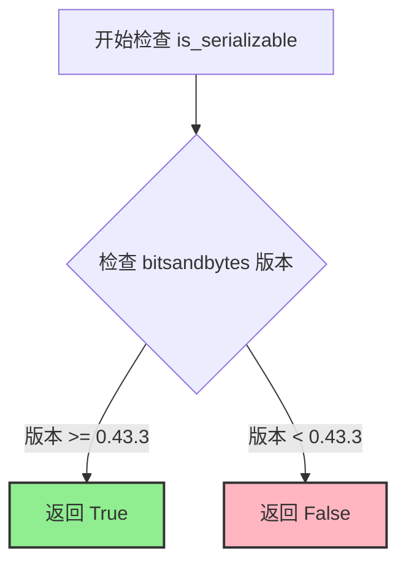

#### 带注释源码

```python
@property
def is_serializable(self):
    # 因为代码强制要求 bitsandbytes 版本为 0.43.3 或更高，
    # 所以此属性始终返回 True，表示当前的量化配置支持序列化操作
    # 这意味着模型可以被正确地序列化和反序列化
    return True
```

#### 详细说明

**功能描述：**
`is_serializable` 是一个只读属性，属于 `BnB4BitDiffusersQuantizer` 类。该属性用于向调用者指示当前的 4 位量化配置是否支持将量化后的模型权重序列化保存。由于代码在 `validate_environment` 方法中已经强制检查了 `bitsandbytes` 版本必须 >= 0.43.3，因此该属性始终返回 `True`。

**使用场景：**
该属性在 `create_quantized_param` 方法中被使用，用于在加载预量化权重时检查序列化兼容性。如果 `is_serializable` 为 `False` 但检测到预量化权重，则会抛出错误提示用户升级 bitsandbytes 版本。

**技术约束：**
- 依赖于 bitsandbytes 库的版本检查机制
- 版本要求在 `validate_environment` 方法中已强制执行


### `BnB4BitDiffusersQuantizer.is_trainable`

这是一个属性（property）方法，用于判断 4 位量化模型是否支持训练。由于 bitsandbytes 库的版本被限定为 0.43.3 或更高，该属性始终返回 `True`，表示当前的 4 位量化配置是支持训练操作的。

参数：

- 无显式参数（隐含的 `self` 参数指向 `BnB4BitDiffusersQuantizer` 实例本身）

返回值：`bool`，始终返回 `True`，表示该量化器支持训练模式。

#### 流程图

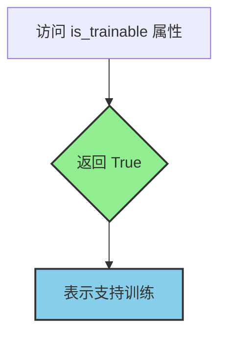

#### 带注释源码

```python
@property
def is_trainable(self) -> bool:
    """
    属性：判断 4 位量化模型是否可训练
    
    由于 bitsandbytes 库版本被限定为 0.43.3 或更高版本，
    该版本完全支持 4 位量化模型的训练功能，因此始终返回 True。
    
    Returns:
        bool: 始终返回 True，表示当前量化配置支持模型训练
    """
    # Because we're mandating `bitsandbytes` 0.43.3.
    return True
```


### `BnB4BitDiffusersQuantizer._dequantize`

该方法用于将量化后的4位模型解量化回原始精度（FP16），处理模型设备的移动，并调用工具函数替换量化层为标准线性层。

参数：

- `model`：`ModelMixin`，需要解量化的模型对象

返回值：`ModelMixin`，解量化后的模型对象

#### 流程图

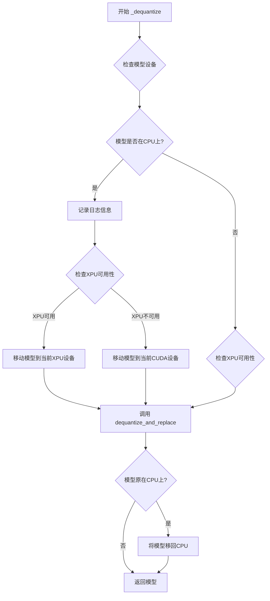

#### 带注释源码

```python
def _dequantize(self, model):
    """
    将量化后的4位模型解量化回原始精度（FP16）
    
    处理流程：
    1. 检查模型当前设备，如果是CPU则临时移至GPU
    2. 调用反量化函数替换所有量化层为标准线性层
    3. 如果模型原本在CPU上，则移回CPU保持原有设备状态
    
    参数:
        model: 需要解量化的模型对象
        
    返回:
        解量化后的模型对象
    """
    # 导入反量化工具函数
    from .utils import dequantize_and_replace

    # 检查模型是否在CPU上（可能是enable_model_cpu_offload()的结果）
    is_model_on_cpu = model.device.type == "cpu"
    
    # 如果模型在CPU上，需要先移动到GPU进行解量化
    if is_model_on_cpu:
        logger.info(
            "Model was found to be on CPU (could happen as a result of `enable_model_cpu_offload()`). "
            "So, moving it to GPU. After dequantization, will move the model back to CPU again "
            "to preserve the previous device."
        )
        # 根据可用设备类型选择目标设备
        if torch.xpu.is_available():
            model.to(torch.xpu.current_device())
        else:
            model.to(torch.cuda.current_device())

    # 执行核心解量化操作：替换量化层为标准线性层
    model = dequantize_and_replace(
        model, 
        self.modules_to_not_convert,  # 保持不转换的模块列表
        quantization_config=self.quantization_config  # 量化配置
    )
    
    # 如果模型原本在CPU上，解量化后移回CPU以保持原有设备状态
    if is_model_on_cpu:
        model.to("cpu")
    
    # 返回解量化后的模型
    return model
```


### `BnB8BitDiffusersQuantizer.__init__`

该方法是 `BnB8BitDiffusersQuantizer` 类的构造函数，负责初始化 8 位量化器。它调用父类的初始化方法，并处理需要跳过量化处理的模块列表。

参数：

- `quantization_config`：对象，包含量化配置参数（如 `llm_int8_skip_modules` 等）
- `**kwargs`：可变关键字参数，传递给父类初始化方法

返回值：`None`，构造函数无返回值

#### 流程图

```mermaid
flowchart TD
    A[__init__ 开始] --> B[调用 super().__init__]
    B --> C{quantization_config.llm_int8_skip_modules 是否存在}
    C -->|是| D[将 llm_int8_skip_modules 赋值给 self.modules_to_not_convert]
    C -->|否| E[不进行赋值]
    D --> F[初始化完成]
    E --> F
```

#### 带注释源码

```python
def __init__(self, quantization_config, **kwargs):
    # 调用父类 DiffusersQuantizer 的 __init__ 方法，传递量化配置和额外关键字参数
    super().__init__(quantization_config, **kwargs)

    # 检查 quantization_config 中是否定义了 llm_int8_skip_modules（需要跳过量化处理的模块列表）
    if self.quantization_config.llm_int8_skip_modules is not None:
        # 将配置中的跳过模块列表赋值给实例变量 modules_to_not_convert
        # 这些模块在量化过程中将被保留为原始精度
        self.modules_to_not_convert = self.quantization_config.llm_int8_skip_modules
```


### `BnB8BitDiffusersQuantizer.validate_environment`

该方法用于验证运行 8-bit 量化所需的环境是否满足条件，包括检查 GPU 可用性、依赖库版本兼容性、输入模型格式以及设备映射配置的合法性。

参数：

-  `self`：隐式参数，类型为 `BnB8BitDiffusersQuantizer` 实例，表示量化器对象本身
-  `*args`：可变位置参数，类型为任意类型，目前未被使用，保留用于接口兼容性
-  `**kwargs`：可变关键字参数，类型为字典，包含可选的额外配置参数，目前使用 `from_flax` 和 `device_map` 两个键

返回值：`None`，无返回值（该方法通过抛出异常来报告验证失败）

#### 流程图

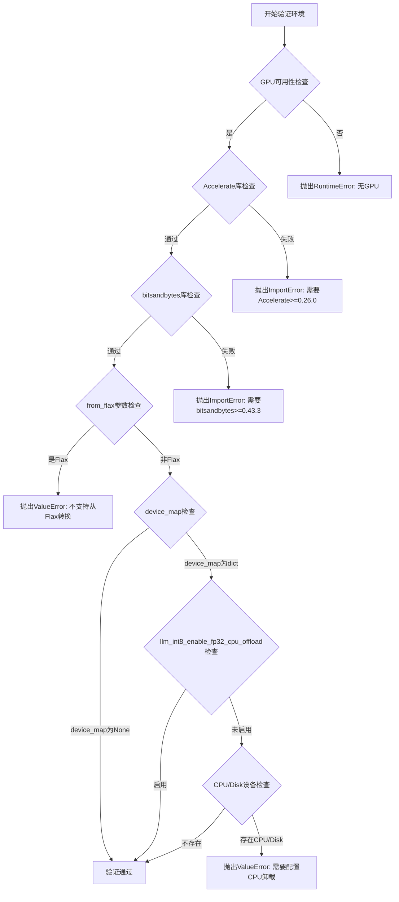

#### 带注释源码

```python
def validate_environment(self, *args, **kwargs):
    """
    验证进行8-bit量化所需的环境是否满足所有前提条件。
    
    检查项包括：
    1. GPU或XPU设备可用性
    2. Accelerate库版本 >= 0.26.0
    3. bitsandbytes库版本 >= 0.43.3
    4. 不支持从Flax权重格式转换
    5. device_map配置中不能有模块放在CPU或磁盘（除非启用FP32 CPU卸载）
    """
    
    # 检查GPU或XPU是否可用，8-bit量化必须在支持CUDA或XPU的设备上运行
    if not (torch.cuda.is_available() or torch.xpu.is_available()):
        raise RuntimeError("No GPU found. A GPU is needed for quantization.")
    
    # 检查Accelerate库是否可用且版本满足最低要求
    if not is_accelerate_available() or is_accelerate_version("<", "0.26.0"):
        raise ImportError(
            "Using `bitsandbytes` 8-bit quantization requires Accelerate: `pip install 'accelerate>=0.26.0'`"
        )
    
    # 检查bitsandbytes库是否可用且版本满足最低要求
    if not is_bitsandbytes_available() or is_bitsandbytes_version("<", "0.43.3"):
        raise ImportError(
            "Using `bitsandbytes` 8-bit quantization requires the latest version of bitsandbytes: `pip install -U bitsandbytes`"
        )

    # 检查是否尝试从Flax模型权重转换，8-bit量化目前不支持Flax格式
    if kwargs.get("from_flax", False):
        raise ValueError(
            "Converting into 8-bit weights from flax weights is currently not supported, please make"
            " sure the weights are in PyTorch format."
        )

    # 获取device_map参数，用于控制模型各层的设备分配
    device_map = kwargs.get("device_map", None)
    
    # 如果device_map存在且为字典类型，且未启用FP32 CPU卸载，则需验证设备配置
    if (
        device_map is not None
        and isinstance(device_map, dict)
        and not self.quantization_config.llm_int8_enable_fp32_cpu_offload
    ):
        # 过滤掉不需要转换的模块，只检查剩余模块的设备分配
        device_map_without_no_convert = {
            key: device_map[key] for key in device_map.keys() if key not in self.modules_to_not_convert
        }
        
        # 检查是否有模块被分配到CPU或磁盘
        if "cpu" in device_map_without_no_convert.values() or "disk" in device_map_without_no_convert.values():
            raise ValueError(
                "Some modules are dispatched on the CPU or the disk. Make sure you have enough GPU RAM to fit the "
                "quantized model. If you want to dispatch the model on the CPU or the disk while keeping these modules "
                "in 32-bit, you need to set `load_in_8bit_fp32_cpu_offload=True` and pass a custom `device_map` to "
                "`from_pretrained`. Check "
                "https://huggingface.co/docs/transformers/main/en/main_classes/quantization#offload-between-cpu-and-gpu "
                "for more details. "
            )
```


### `BnB8BitDiffusersQuantizer.adjust_max_memory`

该方法用于在8位量化过程中调整模型的最大内存限制，通过将每个设备的最大内存值降低10%来为量化过程中创建的缓冲区预留额外的内存空间。

参数：

- `max_memory`：`dict[str, int | str]`，一个字典，键为设备标识（如"cpu"、"cuda:0"等），值为对应的最大内存大小（字节或字符串格式）

返回值：`dict[str, int | str]`，返回调整后的最大内存字典，每个设备的内存值被乘以0.90以预留量化缓冲区空间

#### 流程图

```mermaid
flowchart TD
    A[开始 adjust_max_memory] --> B{输入 max_memory}
    B --> C[遍历 max_memory 的每个键值对]
    C --> D[将每个值乘以 0.90]
    D --> E[构建新的字典]
    E --> F[返回调整后的 max_memory]
    F --> G[结束]
    
    style A fill:#e1f5fe
    style F fill:#e1f5fe
    style G fill:#e8f5e8
```

#### 带注释源码

```python
# Copied from diffusers.quantizers.bitsandbytes.bnb_quantizer.BnB4BitDiffusersQuantizer.adjust_max_memory
def adjust_max_memory(self, max_memory: dict[str, int | str]) -> dict[str, int | str]:
    """
    Adjusts the maximum memory allocation for each device during quantization.
    
    This method reduces the maximum memory by 10% to accommodate temporary buffers
    that are created during the quantization process. These buffers are needed
    for intermediate computations when converting model weights to 8-bit format.
    
    Args:
        max_memory: A dictionary mapping device identifiers (e.g., "cuda:0", "cpu") 
                    to their maximum memory allocation. Values can be integers 
                    (in bytes) or strings (e.g., "10GB").
    
    Returns:
        A new dictionary with the same keys but with each memory value multiplied 
        by 0.90 (90% of the original value), providing space for quantization buffers.
    """
    # need more space for buffers that are created during quantization
    # 通过将每个设备的内存限制降低10%，为量化过程中创建的临时缓冲区预留空间
    max_memory = {key: val * 0.90 for key, val in max_memory.items()}
    return max_memory
```


### `BnB8BitDiffusersQuantizer.update_torch_dtype`

该方法用于在加载 8-bit 量化模型时更新 PyTorch 数据类型。如果未指定 `torch_dtype`，则强制将其设置为 `float16`，以满足 `bitsandbytes` 库加载模型的要求。

参数：

- `torch_dtype`：`torch.dtype`，指定模型的目標数据类型，可以为 `None`

返回值：`torch.dtype`，返回处理后的数据类型（若输入为 `None` 则返回 `torch.float16`，否则原样返回）

#### 流程图

```mermaid
flowchart TD
    A[开始 update_torch_dtype] --> B{torch_dtype is None?}
    B -->|是| C[记录日志警告]
    C --> D[设置 torch_dtype = torch.float16]
    B -->|否| E[不修改 torch_dtype]
    D --> F[返回 torch_dtype]
    E --> F
```

#### 带注释源码

```python
def update_torch_dtype(self, torch_dtype: "torch.dtype") -> "torch.dtype":
    """
    更新模型的 torch dtype。
    
    如果 torch_dtype 为 None，则强制设置为 float16，
    因为 bitsandbytes 库要求使用 float16 进行 8-bit 或 4-bit 量化模型加载。
    
    参数:
        torch_dtype: 目标数据类型，若为 None 则会被覆盖为 torch.float16
        
    返回:
        处理后的数据类型
    """
    if torch_dtype is None:
        # We force the `dtype` to be float16, this is a requirement from `bitsandbytes`
        logger.info(
            "Overriding torch_dtype=%s with `torch_dtype=torch.float16` due to "
            "requirements of `bitsandbytes` to enable model loading in 8-bit or 4-bit. "
            "Pass your own torch_dtype to specify the dtype of the remaining non-linear layers or pass"
            " torch_dtype=torch.float16 to remove this warning.",
            torch_dtype,
        )
        torch_dtype = torch.float16
    return torch_dtype
```


### `BnB8BitDiffusersQuantizer.update_device_map`

该方法用于初始化或更新模型的设备映射（device_map），当设备映射未提供时，自动将其设置为当前可用的GPU设备（CUDA或XPU）。

参数：

- `device_map`：`dict | None`，设备映射字典，用于指定模型各层到物理设备的分配。若为`None`，则自动创建默认设备映射。

返回值：`dict`，返回处理后的设备映射字典，确保模型各层被正确分配到计算设备上。

#### 流程图

```mermaid
flowchart TD
    A[开始] --> B{device_map is None?}
    B -->|Yes| C{torch.xpu.is_available?}
    C -->|Yes| D[current_device = f"xpu:{torch.xpu.current_device()}"]
    C -->|No| E[current_device = f"cuda:{torch.cuda.current_device()}"]
    D --> F[device_map = {'': current_device}]
    E --> F
    F --> G[logger.info 记录信息]
    G --> H[返回 device_map]
    B -->|No| I[直接返回原始 device_map]
    I --> H
```

#### 带注释源码

```python
def update_device_map(self, device_map):
    """
    更新设备映射，如果未提供则自动创建默认设备映射。
    
    当用户未指定 device_map 时，该方法会自动检测当前可用的计算设备
    （优先使用 XPU，其次使用 CUDA），并将整个模型映射到该设备上。
    这确保了在没有显式指定设备映射的情况下，量化模型能够正确加载到 GPU。
    """
    # 检查是否需要自动创建设备映射
    if device_map is None:
        # 检测可用的加速设备
        if torch.xpu.is_available():
            # Intel GPU (XPU) 可用时使用 XPU
            current_device = f"xpu:{torch.xpu.current_device()}"
        else:
            # 否则使用 NVIDIA GPU (CUDA)
            current_device = f"cuda:{torch.cuda.current_device()}"
        
        # 创建默认设备映射，空字符串键表示整个模型
        device_map = {"": current_device}
        
        # 记录日志，告知用户已自动设置设备映射
        logger.info(
            "The device_map was not initialized. "
            "Setting device_map to {"
            ": {current_device}}. "
            "If you want to use the model for inference, please set device_map ='auto' "
        )
    
    # 返回设备映射（可能是新创建的或原始传入的）
    return device_map
```


### `BnB8BitDiffusersQuantizer.adjust_target_dtype`

该方法用于在8位量化过程中调整目标数据类型，确保所有目标数据类型都被规范化为 `torch.int8`，以适配 bitsandbytes 的 8位量化机制。

参数：

- `target_dtype`：`torch.dtype`，传入的目标数据类型，用于指定量化过程中期望的目标数据类型

返回值：`torch.dtype`，返回调整后的目标数据类型，始终返回 `torch.int8`

#### 流程图

```mermaid
flowchart TD
    A[开始 adjust_target_dtype] --> B{target_dtype != torch.int8?}
    B -- 是 --> C[记录日志: 目标数据类型被替换为 torch.int8]
    B -- 否 --> D[不记录日志]
    C --> E[返回 torch.int8]
    D --> E
    E[结束]
```

#### 带注释源码

```python
def adjust_target_dtype(self, target_dtype: "torch.dtype") -> "torch.dtype":
    """
    调整目标数据类型以适配8位量化。
    
    该方法确保无论传入何种目标数据类型，都会被规范化为 torch.int8，
    因为 bitsandbytes 的 8位量化仅支持 int8 格式。
    
    参数:
        target_dtype: 传入的目标数据类型
        
    返回值:
        torch.dtype: 始终返回 torch.int8
    """
    # 检查目标数据类型是否为非 int8
    if target_dtype != torch.int8:
        # 记录日志信息，告知用户目标数据类型被替换为 int8
        logger.info("target_dtype {target_dtype} is replaced by `torch.int8` for 8-bit BnB quantization")
    
    # 无论输入如何，始终返回 torch.int8
    return torch.int8
```

#### 备注

- **设计目标**：强制将所有目标数据类型规范化为 `torch.int8`，这是 bitsandbytes 8位量化方法的硬性要求
- **错误处理**：该方法不会抛出异常，即使传入的目标数据类型无效也会返回 `torch.int8`
- **与4位量化的区别**：与 `BnB4BitDiffusersQuantizer.adjust_target_dtype` 方法不同，4位版本在传入非 int8 类型时会抛出 `ValueError`，而8位版本则更宽松地直接返回 `torch.int8`
- **日志信息不完整**：注意日志信息中使用了 f-string 语法但未以 `f` 前缀标记，这可能导致日志输出不完整（显示为 `{target_dtype}` 而非实际值）


### `BnB8BitDiffusersQuantizer.check_if_quantized_param`

该方法用于检查给定参数是否为 8 位量化参数，通过检查参数模块中的参数类型是否为 `bnb.nn.Int8Params` 来判断。如果模型启用了预量化，还会验证状态字典中是否存在必需的 `SCB` 组件以及参数值的数据类型是否正确。

参数：

- `self`：`BnB8BitDiffusersQuantizer` 实例，当前量化器对象
- `model`：`ModelMixin`，要检查的模型对象，用于获取模块信息
- `param_value`：`torch.Tensor`，参数的当前值张量，用于检查数据类型
- `param_name`：`str`，参数的完整名称（包含模块路径），用于定位模块和参数
- `state_dict`：`dict[str, Any]`，模型的状态字典，用于检查预量化权重所需的量化统计信息
- `**kwargs`：可变关键字参数，用于传递额外的选项

返回值：`bool`，如果参数是量化参数则返回 `True`，否则返回 `False`

#### 流程图

```mermaid
flowchart TD
    A[开始检查量化参数] --> B[导入 bitsandbytes 库]
    B --> C[从模型中获取模块和参数名]
    C --> D{参数是否为 bnb.nn.Int8Params 类型?}
    D -->|是| E{是否预量化模型?}
    D -->|否| I[返回 False]
    E -->|是| F{state_dict 中是否存在 SCB?}
    E -->|否| G[返回 True]
    F -->|是| H{参数值 dtype 是否为 int8?}
    F -->|否| J[抛出 ValueError: Missing SCB]
    H -->|是| G
    H -->|否| K[抛出 ValueError: Incompatible dtype]
```

#### 带注释源码

```python
def check_if_quantized_param(
    self,
    model: "ModelMixin",
    param_value: "torch.Tensor",
    param_name: str,
    state_dict: dict[str, Any],
    **kwargs,
):
    """
    检查给定的参数是否为 8 位量化参数。
    
    参数:
        model: 模型对象，用于从参数名获取对应的模块
        param_value: 参数的张量值，用于检查数据类型
        param_name: 参数的完整名称（包含模块路径）
        state_dict: 模型权重状态字典，用于验证预量化权重
        **kwargs: 额外的关键字参数
    
    返回:
        bool: 如果参数是量化参数返回 True，否则返回 False
    """
    import bitsandbytes as bnb

    # 从模型中获取模块和参数名称
    # get_module_from_name 是一个工具函数，返回 (module, tensor_name)
    module, tensor_name = get_module_from_name(model, param_name)
    
    # 检查模块中指定名称的参数是否为 Int8Params 类型
    if isinstance(module._parameters.get(tensor_name, None), bnb.nn.Int8Params):
        # 如果是预量化模型，需要验证必要的量化组件存在
        if self.pre_quantized:
            # 将参数名中的 'weight' 替换为 'SCB'，构建统计信息键名
            # SCB (Scale Byte) 是 8 位量化的缩放因子
            if param_name.replace("weight", "SCB") not in state_dict.keys():
                raise ValueError("Missing quantization component `SCB`")
            
            # 验证预量化权重的数据类型必须是 int8
            if param_value.dtype != torch.int8:
                raise ValueError(
                    f"Incompatible dtype `{param_value.dtype}` when loading 8-bit prequantized weight. Expected `torch.int8`."
                )
        # 满足量化参数条件，返回 True
        return True
    
    # 参数不是 Int8Params 类型，返回 False
    return False
```


### BnB8BitDiffusersQuantizer.create_quantized_param

该方法用于在加载量化模型时创建并设置8位量化参数（Int8Params），处理权重、量化统计信息（SCB）的加载，以及将参数设备转移到目标设备。

参数：

- `model`：`ModelMixin`，要量化的模型实例
- `param_value`：`torch.Tensor`，参数的权重值张量
- `param_name`：`str`，参数的名称，用于在模型中定位参数
- `target_device`：`torch.device`，目标设备，用于将量化参数放置到指定设备（如GPU）
- `state_dict`：`dict[str, Any]`，包含模型权重和量化统计信息的状态字典
- `unexpected_keys`：`list[str] | None`，加载过程中发现的意外键列表，用于在处理后移除已使用的键
- `**kwargs`：其他关键字参数，会传递给 Int8Params 构造函数

返回值：`None`，该方法直接修改模型的参数，不返回任何值

#### 流程图

```mermaid
flowchart TD
    A[开始] --> B[计算fp16_statistics_key和fp16_weights_format_key]
    B --> C[从state_dict获取fp16_statistics和fp16_weights_format]
    C --> D[通过get_module_from_name获取module和tensor_name]
    D --> E{tensor_name是否在module._parameters中?}
    E -->|否| F[抛出ValueError: 参数不存在]
    E -->|是| G[获取old_value = getattr(module, tensor_name)]
    G --> H{module._parameters[tensor_name]是bnb.nn.Int8Params?}
    H -->|否| I[抛出ValueError: 参数类型错误]
    H -->|是| J{old_value在meta设备且target_device不是meta且param_value为None?}
    J -->|是| K[抛出ValueError: 需要value参数]
    J -->|否| L[new_value = param_value.to('cpu')]
    L --> M{self.pre_quantized且not self.is_serializable?}
    M -->|是| N[抛出ValueError: bitsandbytes版本不兼容]
    M -->|否| O[kwargs = old_value.__dict__]
    O --> P[new_value = bnb.nn.Int8Params(new_value, requires_grad=False, **kwargs).to(target_device)]
    P --> Q[module._parameters[tensor_name] = new_value]
    Q --> R{fp16_statistics不为None?}
    R -->|是| S[setattr(module.weight, 'SCB', fp16_statistics.to(target_device))]
    R -->|否| T
    S --> U{unexpected_keys不为None?}
    R -->|否| U
    U -->|是| V[unexpected_keys.remove(fp16_statistics_key)]
    U -->|否| W
    V --> W{fp16_weights_format不为None且unexpected_keys不为None?}
    W -->|是| X[unexpected_keys.remove(fp16_weights_format_key)]
    W -->|否| Y[结束]
    X --> Y
```

#### 带注释源码

```python
def create_quantized_param(
    self,
    model: "ModelMixin",
    param_value: "torch.Tensor",
    param_name: str,
    target_device: "torch.device",
    state_dict: dict[str, Any],
    unexpected_keys: list[str] | None = None,
    **kwargs,
):
    """
    创建并设置8位量化参数
    
    参数:
        model: 要加载量化权重的模型
        param_value: 权重张量值
        param_name: 参数名称，用于定位模型中的参数
        target_device: 目标设备
        state_dict: 包含权重和量化统计信息的状态字典
        unexpected_keys: 意外键列表，用于跟踪已处理的键
    """
    import bitsandbytes as bnb

    # 构建量化统计信息的键名：将"weight"替换为"SCB"获取缩放因子键
    fp16_statistics_key = param_name.replace("weight", "SCB")
    # 构建权重格式键：用于跟踪权重格式
    fp16_weights_format_key = param_name.replace("weight", "weight_format")

    # 从状态字典中获取量化统计信息和权重格式
    fp16_statistics = state_dict.get(fp16_statistics_key, None)
    fp16_weights_format = state_dict.get(fp16_weights_format_key, None)

    # 通过参数名获取对应的模块和张量名
    module, tensor_name = get_module_from_name(model, param_name)
    
    # 验证参数是否存在于模块中
    if tensor_name not in module._parameters:
        raise ValueError(f"{module} does not have a parameter or a buffer named {tensor_name}.")

    # 获取旧的参数值
    old_value = getattr(module, tensor_name)

    # 验证参数类型必须是Int8Params
    if not isinstance(module._parameters[tensor_name], bnb.nn.Int8Params):
        raise ValueError(f"Parameter `{tensor_name}` should only be a `bnb.nn.Int8Params` instance.")
    
    # 检查参数是否在meta设备上但需要转移到实际设备
    if (
        old_value.device == torch.device("meta")
        and target_device not in ["meta", torch.device("meta")]
        and param_value is None
    ):
        raise ValueError(f"{tensor_name} is on the meta device, we need a `value` to put in on {target_device}.")

    # 先将参数值移到CPU（bitsandbytes要求）
    new_value = param_value.to("cpu")
    
    # 检查是否使用了预量化权重但bitsandbytes版本不支持序列化
    if self.pre_quantized and not self.is_serializable:
        raise ValueError(
            "Detected int8 weights but the version of bitsandbytes is not compatible with int8 serialization. "
            "Make sure to download the latest `bitsandbytes` version. `pip install --upgrade bitsandbytes`."
        )

    # 保留旧参数的所有属性（如quant_state等）
    kwargs = old_value.__dict__
    # 创建新的Int8Params对象并移动到目标设备
    new_value = bnb.nn.Int8Params(new_value, requires_grad=False, **kwargs).to(target_device)

    # 更新模块的参数
    module._parameters[tensor_name] = new_value
    
    # 如果存在量化统计信息（SCB），设置到module的weight上
    if fp16_statistics is not None:
        setattr(module.weight, "SCB", fp16_statistics.to(target_device))
        # 从unexpected_keys中移除已处理的统计信息键
        if unexpected_keys is not None:
            unexpected_keys.remove(fp16_statistics_key)

    # 清理weight_format键以避免不必要的警告信息
    # 正确的格式会在第一次前向传播时自动获取
    if fp16_weights_format is not None and unexpected_keys is not None:
        unexpected_keys.remove(fp16_weights_format_key)
```


### `BnB8BitDiffusersQuantizer._process_model_after_weight_loading`

该方法在模型权重加载完成后被调用，用于标记模型是否支持8位量化序列化，并返回处理后的模型。

参数：

- `self`：隐含的 `BnB8BitDiffusersQuantizer` 实例，表示当前量化器对象。
- `model`：`"ModelMixin"` 类型，需要进行后权重加载处理的模型实例。
- `**kwargs`：可变关键字参数，用于接收额外的可选参数（当前未使用，但保留以便扩展）。

返回值：`ModelMixin` 类型，返回处理后的模型对象。

#### 流程图

```mermaid
flowchart TD
    A[开始 _process_model_after_weight_loading] --> B[设置 model.is_8bit_serializable]
    B --> C{获取 self.is_serializable}
    C -->|返回值 True| D[model.is_8bit_serializable = True]
    C -->|返回值 False| E[model.is_8bit_serializable = False]
    D --> F[返回 model]
    E --> F
```

#### 带注释源码

```python
# Copied from diffusers.quantizers.bitsandbytes.bnb_quantizer.BnB4BitDiffusersQuantizer._process_model_after_weight_loading with 4bit->8bit
def _process_model_after_weight_loading(self, model: "ModelMixin", **kwargs):
    """
    在模型权重加载完成后进行处理。

    参数:
        model: 待处理的模型实例 (ModelMixin)
        **kwargs: 额外的关键字参数

    返回:
        处理后的模型实例
    """
    # 将量化器的序列化属性标记到模型配置中
    # is_serializable 属性在 BnB8BitDiffusersQuantizer 中始终返回 True
    # 因为 bitsandbytes 版本被强制要求为 >= 0.43.3
    model.is_8bit_serializable = self.is_serializable
    
    # 返回处理后的模型，以便链式调用
    return model
```


### BnB8BitDiffusersQuantizer._process_model_before_weight_loading

在模型权重加载之前，该方法负责准备8位量化环境。它获取量化配置中需要跳过的模块列表，结合传入的保持FP32的模块，以及设备映射中位于CPU或磁盘的模块，然后调用 `replace_with_bnb_linear` 将模型中的标准线性层替换为 bitsandbytes 的 8 位量化线性层（Linear8bitLt），最后更新模型配置和标记模型已加载为 8 位量化模式。

参数：

- `self`：BnB8BitDiffusersQuantizer，当前量化器实例
- `model`：`ModelMixin`，需要准备量化的模型实例
- `device_map`：设备映射字典，指定模型各层分配到的设备
- `keep_in_fp32_modules`：`list[str]`，需要在加载过程中保持 FP32 精度的额外模块列表，默认为空列表
- `**kwargs`：其他关键字参数，用于未来扩展

返回值：`ModelMixin`，处理并替换线性层后的模型对象

#### 流程图

```mermaid
flowchart TD
    A[开始 _process_model_before_weight_loading] --> B[导入 replace_with_bnb_linear 工具函数]
    B --> C[从量化配置获取 llm_int8_enable_fp32_cpu_offload 设置]
    C --> D[获取 quantization_config.llm_int8_skip_modules 作为 modules_to_not_convert]
    D --> E{modules_to_not_convert 是否为列表?}
    E -->|否| F[转换为列表]
    E -->|是| G[直接使用]
    F --> G
    G --> H[将 keep_in_fp32_modules 列表扩展到 modules_to_not_convert]
    H --> I{device_map 是字典且键数量 > 1?}
    I -->|否| L[过滤掉 None 值]
    I -->|是| J[找出 device_map 中值为 'disk' 或 'cpu' 的键]
    J --> K{有 CPU/Disk 模块且未启用 FP32 CPU offload?}
    K -->|是| M[抛出 ValueError 异常]
    K -->|否| N[将 CPU/Disk 模块键扩展到 modules_to_not_convert]
    M --> L
    N --> L
    L --> O[调用 replace_with_bnb_linear 替换模型线性层]
    O --> P[更新 model.config.quantization_config]
    P --> Q[设置 model.is_loaded_in_8bit = True]
    Q --> R[返回处理后的 model]
```

#### 带注释源码

```python
def _process_model_before_weight_loading(
    self,
    model: "ModelMixin",
    device_map,
    keep_in_fp32_modules: list[str] = [],
    **kwargs,
):
    """
    在权重加载前处理模型，准备8位量化环境。
    
    参数:
        model: 待量化的模型实例
        device_map: 设备映射字典
        keep_in_fp32_modules: 需要保持FP32精度的模块列表
        **kwargs: 其他关键字参数
    """
    # 从 utils 模块导入替换函数，用于将线性层替换为 bnb 量化层
    from .utils import replace_with_bnb_linear

    # 获取量化配置中的 FP32 CPU offload 设置
    load_in_8bit_fp32_cpu_offload = self.quantization_config.llm_int8_enable_fp32_cpu_offload

    # 从量化配置获取需要跳过的模块列表（如 lm_head、tied modules 等）
    # 这些模块将保持在原始精度，不进行量化
    self.modules_to_not_convert = self.quantization_config.llm_int8_skip_modules

    # 确保 modules_to_not_convert 是列表类型，以便后续扩展操作
    if not isinstance(self.modules_to_not_convert, list):
        self.modules_to_not_convert = [self.modules_to_not_convert]

    # 将调用方指定的需要保持 FP32 的模块添加到跳过列表
    self.modules_to_not_convert.extend(keep_in_fp32_modules)

    # 如果 device_map 是多设备映射，检查是否有模块被分配到 CPU 或磁盘
    # 这些模块也需要保持在 FP32，因为量化层不能放在 CPU/磁盘上
    if isinstance(device_map, dict) and len(device_map.keys()) > 1:
        # 找出映射到 'cpu' 或 'disk' 的模块键
        keys_on_cpu = [key for key, value in device_map.items() if value in ["disk", "cpu"]]

        # 如果存在 CPU/磁盘模块但未启用 FP32 CPU offload，抛出错误
        if len(keys_on_cpu) > 0 and not load_in_8bit_fp32_cpu_offload:
            raise ValueError(
                "If you want to offload some keys to `cpu` or `disk`, you need to set "
                "`llm_int8_enable_fp32_cpu_offload=True`. Note that these modules will not be "
                " converted to 8-bit but kept in 32-bit."
            )
        # 将 CPU/磁盘模块也加入不转换列表
        self.modules_to_not_convert.extend(keys_on_cpu)

    # 清理列表，移除所有 None 值
    # 这是必要的，因为 None 值可能导致后续处理出错
    self.modules_to_not_convert = [module for module in self.modules_to_not_convert if module is not None]

    # 核心操作：使用 bitsandbytes 的 8 位量化线性层替换模型中的标准线性层
    # 同时传递需要保持原始精度的模块列表和量化配置
    model = replace_with_bnb_linear(
        model, modules_to_not_convert=self.modules_to_not_convert, quantization_config=self.quantization_config
    )
    
    # 更新模型配置，保存量化配置信息
    model.config.quantization_config = self.quantization_config
    
    # 标记模型已以 8 位模式加载，供后续流程判断使用
    model.is_loaded_in_8bit = True
    
    # 返回处理后的模型（此时模型已准备好进行 8 位权重加载）
    return model
```


### `BnB8BitDiffusersQuantizer.is_serializable`

这是一个属性方法，用于检查 8-bit 量化模型是否可以被序列化。由于代码强制要求 `bitsandbytes` 版本至少为 0.43.3，该版本支持序列化功能，因此此属性始终返回 `True`。

参数：无

返回值：`bool`，表示当前量化器配置下的模型是否支持序列化操作。

#### 流程图

```mermaid
flowchart TD
    A[开始检查 is_serializable] --> B{强制要求 bitsandbytes >= 0.43.3}
    B -->|是| C[返回 True]
    B -->|否| D[返回 False]
    C --> E[结束]
    D --> E
```

#### 带注释源码

```python
@property
# Copied from diffusers.quantizers.bitsandbytes.bnb_quantizer.BnB4BitDiffusersQuantizer.is_serializable
def is_serializable(self):
    # Because we're mandating `bitsandbytes` 0.43.3.
    # 由于强制要求 bitsandbytes 版本为 0.43.3 或更高，
    # 该版本已支持 int8 权重的序列化功能，因此始终返回 True
    return True
```


### `BnB8BitDiffusersQuantizer.is_trainable`

该属性表示 8 位量化模型是否支持训练。由于强制要求 `bitsandbytes` 版本为 0.43.3，因此返回 `True`，表示当前量化配置支持训练模式。

参数： 无

返回值：`bool`，返回 `True` 表示 8 位量化器支持训练

#### 流程图

```mermaid
flowchart TD
    A[访问 is_trainable 属性] --> B{检查 bitsandbytes 版本}
    B -->|版本 >= 0.43.3| C[返回 True]
    B -->|版本 < 0.43.3| D[理论上应返回 False, 但代码强制要求特定版本]
```

#### 带注释源码

```python
@property
# Copied from diffusers.quantizers.bitsandbytes.bnb_quantizer.BnB4BitDiffusersQuantizer.is_serializable
def is_trainable(self) -> bool:
    # Because we're mandating `bitsandbytes` 0.43.3.
    # 由于强制要求 bitsandbytes 版本为 0.43.3，该版本的 8 位量化支持训练
    return True
```


### `BnB8BitDiffusersQuantizer.is_compileable`

该属性表示 8 位量化器是否支持编译模式。由于 bitsandbytes 0.43.3 版本支持编译功能，因此返回 `True`。

参数：无参数（这是一个属性 getter）

返回值：`bool`，返回该量化器是否支持编译模式

#### 流程图

```mermaid
flowchart TD
    A[开始检查 is_compileable 属性] --> B{返回常量值}
    B -->|True| C[返回 True - 表示支持编译]
```

#### 带注释源码

```python
@property
def is_compileable(self) -> bool:
    """
    属性：检查量化器是否支持编译模式
    
    返回值：
        bool: 始终返回 True，表示当前版本的 bitsandbytes (>=0.43.3) 支持对该量化模型进行编译优化
    """
    return True
```


### `BnB8BitDiffusersQuantizer._dequantize`

该方法负责将量化后的8位模型进行解量化处理，将量化权重转换回原始精度（FP16/FP32），以便进行后续的推理或微调操作。

参数：

- `model`：`ModelMixin`，需要解量化的PyTorch模型对象

返回值：`ModelMixin`，解量化后的模型对象

#### 流程图

```mermaid
flowchart TD
    A[开始 _dequantize] --> B[导入 dequantize_and_replace 工具函数]
    B --> C{检查模型是否在CPU上}
    C -->|是| D[记录日志: 将模型从CPU移动到GPU]
    C -->|否| E[跳过设备移动]
    D --> F[调用 dequantize_and_replace 替换量化层]
    E --> F
    F --> G{模型原来是否在CPU上}
    G -->|是| H[将模型移回CPU]
    G -->|否| I[保持当前设备]
    H --> J[返回模型]
    I --> J
```

#### 带注释源码

```python
def _dequantize(self, model):
    """
    解量化8位量化模型，将量化权重转换回原始精度
    
    参数:
        model: ModelMixin - 需要解量化的PyTorch模型对象
        
    返回:
        ModelMixin - 解量化后的模型对象
    """
    # 从当前包的utils模块导入解量化工具函数
    from .utils import dequantize_and_replace

    # 检查模型当前是否在CPU上运行
    # (可能是由于调用了enable_model_cpu_offload()导致的)
    is_model_on_cpu = model.device.type == "cpu"
    
    # 如果模型在CPU上，需要先移动到GPU进行解量化操作
    if is_model_on_cpu:
        # 记录日志说明情况
        logger.info(
            "Model was found to be on CPU (could happen as a result of `enable_model_cpu_offload()`). "
            "So, moving it to GPU. After dequantization, will move the model back to CPU again "
            "to preserve the previous device."
        )
        # 根据可用的加速设备类型进行移动
        if torch.xpu.is_available():
            model.to(torch.xpu.current_device())
        else:
            model.to(torch.cuda.current_device())

    # 调用核心解量化函数，替换量化层为原始精度层
    # 参数:
    #   - model: 要解量化的模型
    #   - self.modules_to_not_convert: 需要保持量化状态的模块列表
    #   - quantization_config: 量化配置信息
    model = dequantize_and_replace(
        model, self.modules_to_not_convert, quantization_config=self.quantization_config
    )
    
    # 如果模型原本在CPU上，解量化完成后移回CPU以保持原有设备状态
    if is_model_on_cpu:
        model.to("cpu")
        
    # 返回解量化后的模型
    return model
```

#### 关键点说明

1. **设备处理**：方法会智能处理模型所在设备，如果模型在CPU上会先移到GPU进行解量化操作，完成后再移回CPU
2. **模块保护**：通过`modules_to_not_convert`参数保护某些模块不被解量化（如需要保持FP32精度的模块）
3. **工具函数依赖**：核心解量化逻辑委托给`dequantize_and_replace`函数实现

## 关键组件


### BnB4BitDiffusersQuantizer

4位量化器类，基于bitsandbytes库的4位量化方法实现，负责将Diffusers模型转换为4位量化格式，支持权重加载、量化参数管理和反量化功能。

### BnB8BitDiffusersQuantizer

8位量化器类，基于bitsandbytes库的8位量化方法实现，负责将Diffusers模型转换为8位量化格式，处理参数Bulling和状态字典管理。

### validate_environment

环境验证方法，检查GPU可用性、accelerate和bitsandbytes库版本是否满足要求，确保设备映射配置正确，防止在不支持的环境中进行量化。

### create_quantized_param

量化参数创建方法，处理4位或8位量化权重的加载，包括从预量化状态恢复权重、处理.meta设备上的参数、管理quant_state组件等核心逻辑。

### check_if_quantized_param

量化参数检查方法，判断给定参数是否为量化参数（bnb.nn.Params4bit或bnb.nn.Int8Params），用于识别需要特殊处理的量化权重。

### _process_model_before_weight_loading

权重加载前处理方法，调用replace_with_bnb_linear将模型中的Linear层替换为量化层，管理modules_to_not_convert列表以保留特定模块的原始精度。

### _process_model_after_weight_loading

权重加载后处理方法，设置模型的量化状态标志（is_4bit_serializable/is_8bit_serializable），标记模型已加载相应位数的量化权重。

### adjust_target_dtype

目标数据类型调整方法，将目标dtype替换为量化所需的CustomDtype.INT4或torch.int8，确保量化层使用正确的目标类型。

### adjust_max_memory

最大内存调整方法，将可用内存降低10%以留出量化过程中创建缓冲区的空间，确保量化操作有足够的内存。

### update_torch_dtype

torch数据类型更新方法，当未指定torch_dtype时强制使用float16，满足bitsandbytes库的量化要求。

### update_device_map

设备映射更新方法，自动生成设备映射将整个模型分配到当前GPU设备，处理CUDA和XPU设备的差异。

### _dequantize

模型反量化方法，将量化模型转换回全精度模型，处理模型在CPU上的特殊情况并还原原始设备。

### check_quantized_param_shape

量化参数形状验证方法，检查加载的量化权重形状是否符合预期，验证flattened形状的正确性。


## 问题及建议


### 已知问题

-   **代码重复严重**：`BnB4BitDiffusersQuantizer` 和 `BnB8BitDiffusersQuantizer` 之间存在大量重复代码，如 `validate_environment`、`adjust_max_memory`、`update_torch_dtype`、`update_device_map`、`_process_model_before_weight_loading` 等方法几乎完全相同，增加了维护成本。
-   **硬编码版本检查**：强制要求 `bitsandbytes >= 0.43.3` 和 `accelerate >= 0.26.0`，但未考虑版本间功能差异，且 `is_serializable` 和 `is_trainable` 属性硬编码返回 `True`，未实际验证版本兼容性。
-   **硬编码内存调整因子**：`adjust_max_memory` 方法中直接使用 `0.90` 作为缩放因子，缺乏灵活性，可能不适用于所有硬件配置。
-   **日志格式错误**：`adjust_target_dtype` 方法中 `logger.info` 使用了 `{target_dtype}` 但未正确格式化（应使用 f-string 或 `.format()`），导致日志输出可能包含原始占位符。
-   **拼写错误**：文档字符串中存在 "fitst" 应为 "first" 的拼写错误。
-   **缺少文档字符串**：类和方法缺乏详细的文档字符串，影响代码可读性和可维护性。
-   **类型提示不完整**：部分方法参数缺少类型标注，如 `check_if_quantized_param` 中的 `param_value`。
-   **性能潜在瓶颈**：`create_quantized_param` 方法中，在预量化模式下遍历整个 `state_dict` 构建 `quantized_stats`，当模型较大时可能导致性能问题。
-   **错误处理不足**：`check_quantized_param_shape` 方法仅检查偏置形状，对于非偏置参数的形状验证逻辑可能不够严格。
-   **设备处理逻辑复杂**：`_dequantize` 方法中对于模型在 CPU 上的情况，尝试移动到 GPU 后再移回 CPU，逻辑繁琐且可能引入不必要的开销。
-   **内部导入影响性能**：`bitsandbytes` 等库的导入在方法内部进行，虽然避免了全局依赖检查失败，但可能影响运行时性能。
-   **魔法数字和字符串**：代码中多处使用硬编码的字符串和数字，如 `"meta"`、`"cpu"`、`"disk"` 等，分散在各处难以统一管理。

### 优化建议

-   **提取公共逻辑**：将重复代码抽象到基类或混入类中，例如创建一个 `BnBQuantizerMixin` 类，包含通用的验证、内存调整、设备映射等方法，减少代码冗余。
-   **动态版本验证**：在 `is_serializable` 和 `is_trainable` 属性中实际检查 `bitsandbytes` 版本，而非硬编码返回 `True`，确保功能真正可用。
-   **配置化内存因子**：将 `0.90` 提取为配置参数，允许用户根据硬件调整，或提供合理的默认值。
-   **修复日志格式**：统一使用 f-string 或 `.format()` 格式化日志消息，确保变量正确替换。
-   **修正拼写错误**：检查并修正文档字符串中的拼写错误。
-   **补充文档字符串**：为所有类和方法添加详细的文档字符串，说明参数、返回值和功能。
-   **完善类型提示**：为所有方法参数添加完整的类型标注，提高代码可靠性。
-   **优化状态字典遍历**：在构建 `quantized_stats` 时考虑使用更高效的数据结构或算法，避免全量遍历。
-   **增强错误处理**：扩展形状验证逻辑，覆盖更多边缘情况，并提供更详细的错误信息。
-   **简化设备处理**：重构 `_dequantize` 方法的设备移动逻辑，考虑使用上下文管理器或更清晰的流程。
-   **优化导入策略**：对于频繁使用的库，考虑在模块顶部导入，并通过 `TYPE_CHECKING` 条件导入类型提示相关库。
-   **集中管理常量**：将魔法数字和字符串提取为常量或枚举类，提高代码可读性和可维护性。

## 其它


### 设计目标与约束

本模块的设计目标是实现基于bitsandbytes库的4-bit和8-bit模型量化功能，使Diffusers框架能够加载和运行高度压缩的神经网络模型。核心约束包括：(1) 仅支持PyTorch深度学习框架；(2) 要求GPU设备支持CUDA或XPU；(3) 强制使用特定版本的bitsandbytes（>=0.43.3）和accelerate（>=0.26.0）；(4) 量化过程中保持某些关键模块（如投影层）使用FP32精度以确保数值稳定性；(5) 不支持从Flax格式直接转换为4-bit/8-bit权重。

### 错误处理与异常设计

代码采用多层次的错误处理机制。在环境验证阶段（`validate_environment`），通过`RuntimeError`和`ImportError`分别处理GPU缺失和依赖库版本不兼容问题；在参数加载阶段（`create_quantized_param`），通过`ValueError`捕获参数缺失、设备不匹配、量化状态字典缺失等逻辑错误；在形状验证阶段（`check_quantized_param_shape`），通过显式的形状比较抛出参数维度不匹配异常。所有错误信息均包含详细的诊断提示和修复建议，例如指向官方文档的链接。

### 数据流与状态机

量化过程遵循状态机模型：初始化阶段创建量化器实例并配置参数；验证阶段检查GPU可用性和依赖版本；预处理阶段（`_process_model_before_weight_loading`）将目标模型中的线性层替换为量化兼容层；加载阶段通过`create_quantized_param`将权重转换为量化参数对象；后处理阶段（`_process_model_after_weight_loading`）标记模型的量化状态。数据流从原始FP32权重经由CPU内存传输到目标GPU设备，根据`pre_quantized`标志决定是直接量化还是从预量化状态恢复。

### 外部依赖与接口契约

主要依赖包括：(1) `torch` - 基础张量计算和设备管理；(2) `bitsandbytes` - 提供`Linear4bit`、`Linear8bitLt`、`Params4bit`、`Int8Params`等量化层实现；(3) `accelerate` - 设备映射和模型分片；(4) `diffusers.utils` - 提供`get_module_from_name`等工具函数。接口契约规定调用方必须提供有效的`quantization_config`对象，且在调用量化器方法前确保GPU可用。量化器通过属性（`is_serializable`、`is_trainable`、`is_compileable`）向外部声明其能力。

### 配置参数说明

`quantization_config`包含以下关键参数：(1) `llm_int8_skip_modules` - 指定跳过量化保持FP32的模块列表；(2) `llm_int8_enable_fp32_cpu_offload` - 允许将部分模块卸载到CPU以节省GPU显存；(3) `load_in_4bit` / `load_in_8bit` - 触发4-bit或8-bit量化加载的标志。配置参数通过构造函数注入并存储为实例属性`self.quantization_config`，供各个方法访问。

### 版本兼容性要求

bitsandbytes版本需>=0.43.3以支持4-bit和8-bit量化以及序列化功能；accelerate版本需>=0.26.0以提供设备映射和自定义dtype支持；PyTorch版本需支持CUDA或XPU设备。版本检查在`validate_environment`方法中通过`is_bitsandbytes_version`和`is_accelerate_version`函数强制执行，不满足版本要求时抛出ImportError。

### 性能考量

4-bit量化可实现约8倍的模型体积压缩和内存占用减少，8-bit量化实现约4倍压缩。量化过程中通过`adjust_max_memory`将可用显存预扣10%用于量化缓冲区。`use_keep_in_fp32_modules = True`策略确保关键层保持全精度以避免推理精度显著下降。`update_torch_dtype`强制使用float16以符合bitsandbytes的内部计算要求。

### 序列化与反序列化

4-bit量化保存时，量化状态（quant_state）随权重字典一同序列化，包含`bitsandbytes__fp4`或`bitsandbytes__nf4`分量；8-bit量化保存SCB（Scale Channel Block）分量。加载时通过`create_quantized_param`的`pre_quantized`分支从状态字典重组量化参数。`_dequantize`方法支持将量化模型完全解压缩回FP16/FP32以便导出或进一步处理。

### 与Transformers库的差异

本实现适配Diffusers的DiffusersQuantizer基类接口，区别于Transformers的BitsAndBytesConfig配置方式。在Diffusers中，量化器通过`replace_with_bnb_linear`替换模型层，而非在配置中声明；针对扩散模型特性，未强制保留lm_head等语言模型特定模块的FP32精度；新增`is_compileable`属性以支持PyTorch 2.0的torch.compile功能。

### 使用示例

```python
from diffusers import DiffusionPipeline
import torch
from transformers import BitsAndBytesConfig

# 4-bit量化加载
quantization_config = BitsAndBytesConfig(
    load_in_4bit=True,
    bnb_4bit_compute_dtype=torch.float16
)
pipeline = DiffusionPipeline.from_pretrained(
    "runwayml/stable-diffusion-v1-5",
    quantization_config=quantization_config,
    device_map="auto"
)

# 8-bit量化加载
quantization_config = BitsAndBytesConfig(
    load_in_8bit=True,
    llm_int8_skip_modules=["proj_out"]
)
pipeline = DiffusionPipeline.from_pretrained(
    "runwayml/stable-diffusion-v1-5",
    quantization_config=quantization_config
)
```


    