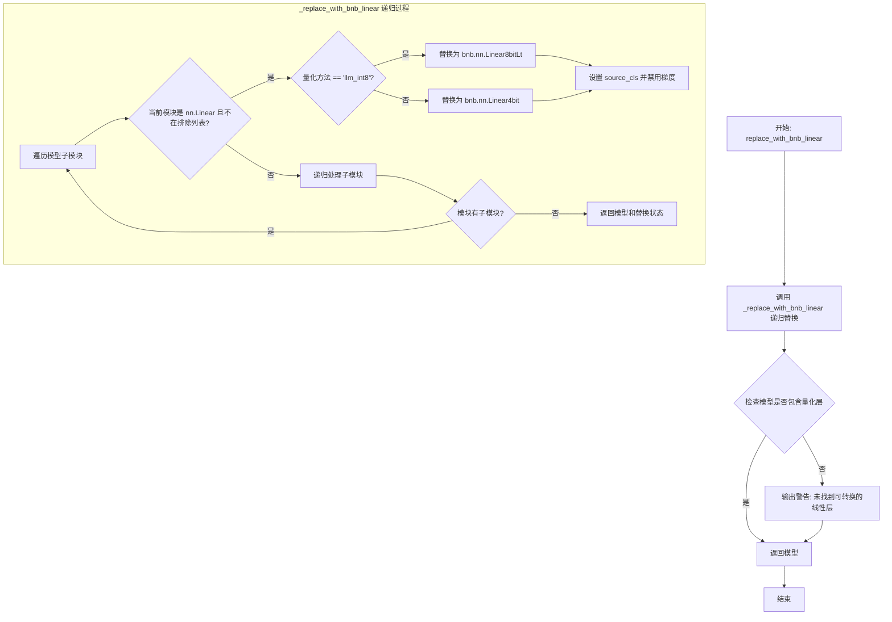
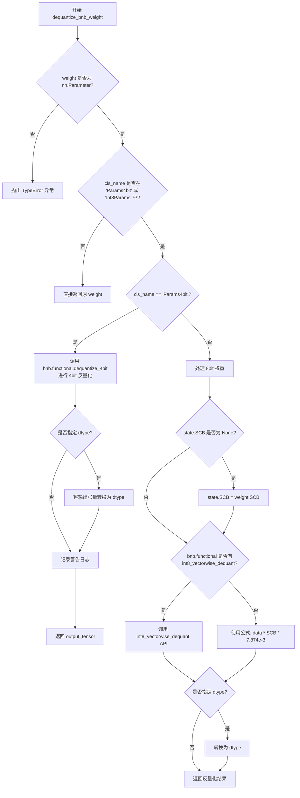
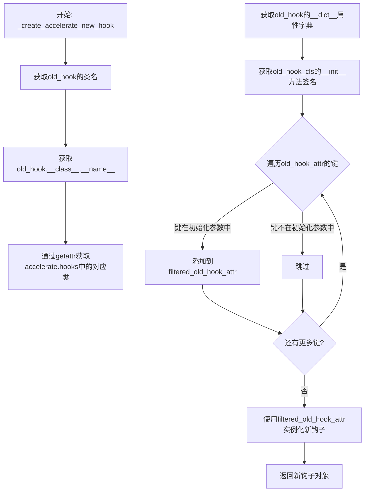
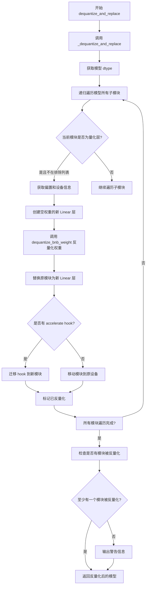

# `diffusers\src\diffusers\quantizers\bitsandbytes\utils.py` 详细设计文档

该代码实现了将PyTorch模型中的nn.Linear层替换为bitsandbytes库的量化层（4bit或8bit）的功能，支持模型量化、权重解量化以及与accelerate库的钩子集成，用于大语言模型的量化推理和微调。

## 整体流程

```mermaid
graph TD
A[开始] --> B{是否启用4bit量化?}
B -- 是 --> C[调用replace_with_bnb_linear]
C --> D[递归遍历模型所有模块]
D --> E{当前模块是nn.Linear且不在排除列表?}
E -- 否 --> F[继续递归子模块]
E -- 是 --> G{量化方法是否为llm_int8?}
G -- 是 --> H[替换为bnb.nn.Linear8bitLt]
G -- 否 --> I[替换为bnb.nn.Linear4bit]
H --> J[记录source_cls并设置requires_grad_(False)]
I --> J
J --> K{还有子模块需要处理?}
K -- 是 --> D
K -- 否 --> L[检查是否替换成功]
L --> M{替换成功?}
M -- 是 --> N[返回量化后的模型]
M -- 否 --> O[输出警告信息]
O --> N
B -- 否 --> P[结束或执行其他操作]
N --> Q[可选: 调用dequantize_and_replace解量化]
```

## 类结构

```
模块级函数 (无类)
├── _replace_with_bnb_linear (私有递归函数)
├── replace_with_bnb_linear (公共接口)
├── dequantize_bnb_weight (解量化辅助函数)
├── _create_accelerate_new_hook (私有钩子创建函数)
├── _dequantize_and_replace (私有递归解量化函数)
├── dequantize_and_replace (公共解量化接口)
└── _check_bnb_status (状态检查函数)
```

## 全局变量及字段


### `logger`
    
用于记录模块运行时日志信息的Logger对象

类型：`logging.Logger`
    


    

## 全局函数及方法


### `_replace_with_bnb_linear`

该函数是一个私有递归方法，用于将模型中的 `nn.Linear` 层替换为 bitsandbytes 库提供的量化线性层（`bnb.nn.Linear8bitLt` 或 `bnb.nn.Linear4bit`），支持 LLM.int8() 和 QLoRA 量化方法。

参数：

- `model`：`torch.nn.Module`，输入模型，函数将递归地替换其中的线性层
- `modules_to_not_convert`：`list[str] | None`，需要保留为原始精度（不进行量化）的模块名称列表，用于避免将某些关键层量化以保证数值稳定性
- `current_key_name`：`list[str] | None`，递归过程中用于追踪当前模块路径的键名列表，用于检查当前模块是否在 `modules_to_not_convert` 列表中
- `quantization_config`：`BitsAndBytesConfig`，量化配置对象，包含量化方法、计算数据类型、量化阈值等参数
- `has_been_replaced`：`bool`，标记是否已完成至少一次线性层替换的布尔标志，用于跟踪转换状态

返回值：`(torch.nn.Module, bool)`，返回转换后的模型和表示转换是否成功的布尔值

#### 流程图

```mermaid
flowchart TD
    A([开始 _replace_with_bnb_linear]) --> B[遍历 model.named_children]
    B --> C{还有未处理的子模块?}
    C -->|是| D[获取子模块名称和对象]
    C -->|否| Z[返回 model 和 has_been_replaced]
    
    D --> E[current_key_name 添加模块名]
    E --> F{module 是 nn.Linear\n且名称不在 modules_to_not_convert?}
    
    F -->|否| G{module 有子模块?}
    F -->|是| H[构建 current_key_name_str]
    
    H --> I{当前键名是否在\nmodules_to_not_convert 中?}
    I -->|是| G
    I -->|否| J{quantization_method == 'llm_int8'?}
    
    J -->|是| K[创建 bnb.nn.Linear8bitLt]
    J -->|否| L{名称在 llm_int8_skip_modules 中?}
    
    L -->|是| G
    L -->|否| M[检查是否支持 quant_storage 参数]
    M --> N[创建 bnb.nn.Linear4bit]
    
    K --> O[设置 source_cls = 原始类型]
    N --> O
    O --> P[requires_grad_(False)]
    P --> Q[has_been_replaced = True]
    Q --> G
    
    G --> R{module.children() > 0?}
    R -->|是| S[递归调用 _replace_with_bnb_linear]
    S --> T[更新 has_been_replaced]
    R -->|否| U[current_key_name.pop]
    T --> U
    
    U --> C
```

#### 带注释源码

```python
def _replace_with_bnb_linear(
    model,                       # torch.nn.Module: 要替换线性层的模型
    modules_to_not_convert=None, # list[str] | None: 保留原始精度的模块名称列表
    current_key_name=None,       # list[str] | None: 递归追踪当前模块路径
    quantization_config=None,    # BitsAndBytesConfig: 量化配置
    has_been_replaced=False,     # bool: 标记是否已成功替换
):
    """
    Private method that wraps the recursion for module replacement.
    返回转换后的模型和一个布尔值，指示转换是否成功。
    """
    # 遍历模型的所有直接子模块
    for name, module in model.named_children():
        # 初始化 current_key_name 为空列表（如果为 None）
        if current_key_name is None:
            current_key_name = []
        # 将当前模块名添加到路径中
        current_key_name.append(name)

        # 检查当前模块是否为 nn.Linear 且不在排除列表中
        if isinstance(module, nn.Linear) and name not in modules_to_not_convert:
            # 构建完整的键名路径字符串，用于精确匹配
            current_key_name_str = ".".join(current_key_name)
            # 检查当前键名是否匹配排除列表中的任何键
            # 匹配规则：键名 + "." 作为前缀，或完全相等
            if not any(
                (key + "." in current_key_name_str) or (key == current_key_name_str) 
                for key in modules_to_not_convert
            ):
                # 使用 init_empty_weights 上下文管理器初始化空权重
                with init_empty_weights():
                    # 获取原始线性层的输入输出特征维度
                    in_features = module.in_features
                    out_features = module.out_features

                    # 根据量化方法选择不同的 bitsandbytes 线性层
                    if quantization_config.quantization_method() == "llm_int8":
                        # 8-bit 量化：使用 Linear8bitLt
                        model._modules[name] = bnb.nn.Linear8bitLt(
                            in_features,
                            out_features,
                            module.bias is not None,
                            has_fp16_weights=quantization_config.llm_int8_has_fp16_weight,
                            threshold=quantization_config.llm_int8_threshold,
                        )
                        has_been_replaced = True
                    else:
                        # 4-bit 量化：检查是否需要跳过当前模块
                        if (
                            quantization_config.llm_int8_skip_modules is not None
                            and name in quantization_config.llm_int8_skip_modules
                        ):
                            pass  # 跳过此模块，不进行替换
                        else:
                            # 构建额外关键字参数
                            # 检查 bnb.nn.Linear4bit 是否支持 quant_storage 参数
                            extra_kwargs = (
                                {"quant_storage": quantization_config.bnb_4bit_quant_storage}
                                if "quant_storage" in list(signature(bnb.nn.Linear4bit).parameters)
                                else {}
                            )
                            # 创建 4-bit 量化线性层
                            model._modules[name] = bnb.nn.Linear4bit(
                                in_features,
                                out_features,
                                module.bias is not None,
                                quantization_config.bnb_4bit_compute_dtype,
                                compress_statistics=quantization_config.bnb_4bit_use_double_quant,
                                quant_type=quantization_config.bnb_4bit_quant_type,
                                **extra_kwargs,
                            )
                            has_been_replaced = True
                    
                    # 保存原始模块类型，以便后续可能需要转置权重
                    model._modules[name].source_cls = type(module)
                    # 强制禁用梯度计算，避免意外的梯度计算错误
                    model._modules[name].requires_grad_(False)
        
        # 递归处理：如果当前模块还有子模块，则递归调用自身
        if len(list(module.children())) > 0:
            _, has_been_replaced = _replace_with_bnb_linear(
                module,
                modules_to_not_convert,
                current_key_name,
                quantization_config,
                has_been_replaced=has_been_replaced,
            )
        
        # 递归返回时，移除最后一个键名，保持路径栈平衡
        current_key_name.pop(-1)
    
    return model, has_been_replaced
```


### `replace_with_bnb_linear`

这是一个辅助函数，用于将 PyTorch 模型中的 `nn.Linear` 层递归替换为 bitsandbytes 库提供的量化版本（`bnb.nn.Linear8bit` 或 `bnb.nn.Linear4bit`），以实现模型的 8 位或 4 位量化，从而减少模型体积和加速推理。

参数：

- `model`：`torch.nn.Module`，输入模型或模块，函数会递归处理该模型的所有子模块。
- `modules_to_not_convert`：`list[str]`，可选，默认为 `[]`，指定不需要转换的模块名称列表，这些模块将保持原始精度。
- `current_key_name`：`list[str]`，可选，用于递归跟踪当前模块键的数组，用于判断当前模块是否应被跳过。
- `quantization_config`：`BitsAndBytesConfig`，量化配置文件，包含量化方法、计算精度、量化类型等配置信息。

返回值：`torch.nn.Module`，返回替换了量化线性层后的模型。

#### 流程图



#### 带注释源码

```python
def replace_with_bnb_linear(model, modules_to_not_convert=None, current_key_name=None, quantization_config=None):
    """
    Helper function to replace the `nn.Linear` layers within `model` with either `bnb.nn.Linear8bit` or
    `bnb.nn.Linear4bit` using the `bitsandbytes` library.

    References:
        * `bnb.nn.Linear8bit`: [LLM.int8(): 8-bit Matrix Multiplication for Transformers at
          Scale](https://huggingface.co/papers/2208.07339)
        * `bnb.nn.Linear4bit`: [QLoRA: Efficient Finetuning of Quantized
          LLMs](https://huggingface.co/papers/2305.14314)

    Parameters:
        model (`torch.nn.Module`):
            Input model or `torch.nn.Module` as the function is run recursively.
        modules_to_not_convert (`list[`str`]`, *optional*, defaults to `[]`):
            Names of the modules to not convert in `Linear8bitLt`. In practice we keep the `modules_to_not_convert` in
            full precision for numerical stability reasons.
        current_key_name (`list[`str`]`, *optional*):
            An array to track the current key of the recursion. This is used to check whether the current key (part of
            it) is not in the list of modules to not convert (for instances modules that are offloaded to `cpu` or
            `disk`).
        quantization_config ('transformers.utils.quantization_config.BitsAndBytesConfig'):
            To configure and manage settings related to quantization, a technique used to compress neural network
            models by reducing the precision of the weights and activations, thus making models more efficient in terms
            of both storage and computation.
    """
    # 调用私有方法进行递归替换，返回替换后的模型和替换状态（此处状态被丢弃）
    model, _ = _replace_with_bnb_linear(model, modules_to_not_convert, current_key_name, quantization_config)

    # 检查模型中是否确实存在被替换的量化层
    has_been_replaced = any(
        isinstance(replaced_module, (bnb.nn.Linear4bit, bnb.nn.Linear8bitLt))
        for _, replaced_module in model.named_modules()
    )
    # 如果没有找到可转换的线性层，输出警告信息
    if not has_been_replaced:
        logger.warning(
            "You are loading your model in 8bit or 4bit but no linear modules were found in your model."
            " Please double check your model architecture, or submit an issue on github if you think this is"
            " a bug."
        )

    return model
```


### `dequantize_bnb_weight`

该函数是用于将 bitsandbytes 库量化的 4bit 或 8bit 权重反量化为原始精度权重的辅助函数。如果输入的权重不是 bnb 量化的权重，则直接返回原权重。

参数：

- `weight`：`torch.nn.Parameter`，需要反量化的权重参数
- `state`：可选状态对象，用于 8bit 权重反量化时传递量化状态信息
- `dtype`：`torch.dtype`，可选参数，指定反量化后权重的目标数据类型

返回值：`torch.Tensor` 或 `torch.nn.Parameter`，返回反量化后的权重张量

#### 流程图



#### 带注释源码

```python
def dequantize_bnb_weight(weight: "torch.nn.Parameter", state=None, dtype: "torch.dtype" = None):
    """
    Helper function to dequantize 4bit or 8bit bnb weights.

    If the weight is not a bnb quantized weight, it will be returned as is.
    
    参数:
        weight: 需要反量化的权重参数，必须是 torch.nn.Parameter 类型
        state: 可选的量化状态对象，用于 8bit 权重反量化
        dtype: 可选的目标数据类型，用于转换反量化后的权重
    
    返回:
        反量化后的权重张量，如果输入不是 bnb 量化权重则返回原权重
    """
    # 参数类型检查，确保输入是 nn.Parameter 类型
    if not isinstance(weight, torch.nn.Parameter):
        raise TypeError(f"Input weight should be of type nn.Parameter, got {type(weight)} instead")

    # 获取权重的类名，判断量化类型
    cls_name = weight.__class__.__name__
    
    # 如果不是 bnb 量化的权重类型，直接返回原权重
    if cls_name not in ("Params4bit", "Int8Params"):
        return weight

    # 处理 4bit 量化权重
    if cls_name == "Params4bit":
        # 调用 bitsandbytes 的 4bit 反量化函数
        output_tensor = bnb.functional.dequantize_4bit(weight.data, weight.quant_state)
        
        # 构建警告消息，说明当前权重的数据类型
        msg = f"The model is going to be dequantized in {output_tensor.dtype} - if you want to upcast it to another dtype, make sure to pass the desired dtype when quantizing the model through `bnb_4bit_quant_type` argument of `BitsAndBytesConfig`"
        
        # 如果指定了目标 dtype，进行类型转换
        if dtype:
            msg = f"The model is going to be first dequantized in {output_tensor.dtype} and type-casted to {dtype}"
            output_tensor = output_tensor.to(dtype)
        
        # 记录一次警告日志
        logger.warning_once(msg)
        return output_tensor

    # 处理 8bit 量化权重
    # 初始化 SCB（缩放因子块）如果尚未设置
    if state.SCB is None:
        state.SCB = weight.SCB

    # 检查是否使用新版本 bitsandbytes 的 API
    if hasattr(bnb.functional, "int8_vectorwise_dequant"):
        # 使用 bitsandbytes v0.45.0+ 的 API 进行向量化反量化
        dequantized = bnb.functional.int8_vectorwise_dequant(weight.data, state.SCB)
    else:
        # 使用手动公式进行反量化: weight * scale / 127
        # 7.874015718698502e-3 = 1/127
        dequantized = weight.data * state.SCB.view(-1, 1) * 7.874015718698502e-3

    # 如果指定了目标 dtype，进行类型转换
    if dtype:
        dequantized = dequantized.to(dtype)
    
    return dequantized
```


### `_create_accelerate_new_hook`

该函数用于根据现有的accelerate钩子对象创建一个新的钩子副本，通过获取原钩子的类名和属性，过滤出与新钩子类初始化参数匹配的属性，最后实例化出一个具有相同配置的新钩子对象。

参数：

-  `old_hook`：任意accelerate hooks类实例，需要被复制的原始钩子对象

返回值：`Any`，返回一个新的accelerate钩子对象，其属性与原钩子相同

#### 流程图



#### 带注释源码

```python
def _create_accelerate_new_hook(old_hook):
    r"""
    根据旧钩子创建一个新钩子。仅当你知道自己在做什么时才使用此方法！
    此方法是PEFT库中对应方法的副本，带有一些修改。
    """
    # 步骤1: 获取旧钩子对应的类
    # 通过old_hook.__class__.__name__获取类名（如"AlignHook"），
    # 然后从accelerate.hooks模块中动态获取该类
    old_hook_cls = getattr(accelerate.hooks, old_hook.__class__.__name__)
    
    # 步骤2: 获取旧钩子的所有属性字典
    # __dict__包含了对象的所有实例属性
    old_hook_attr = old_hook.__dict__
    
    # 步骤3: 创建过滤后的属性字典
    # 用于存储只存在于钩子类初始化参数中的属性
    filtered_old_hook_attr = {}
    
    # 步骤4: 获取旧钩子类的__init__方法签名
    # inspect.signature可以获取方法的参数信息
    old_hook_init_signature = inspect.signature(old_hook_cls.__init__)
    
    # 步骤5: 遍历旧钩子的所有属性
    # 过滤出只存在于初始化签名中的参数
    for k in old_hook_attr.keys():
        # 检查当前属性名是否在初始化方法的参数列表中
        if k in old_hook_init_signature.parameters:
            # 如果是，则添加到过滤后的属性字典中
            filtered_old_hook_attr[k] = old_hook_attr[k]
    
    # 步骤6: 使用过滤后的属性创建新钩子
    # 通过**filtered_old_hook_attr解包参数，创建新实例
    new_hook = old_hook_cls(**filtered_old_hook_attr)
    
    # 步骤7: 返回新创建的钩子对象
    return new_hook
```


### `_dequantize_and_replace`

将量化后的模型（如 4bit 或 8bit 的 BitsAndBytes 量化模型）解量化为标准的 `torch.nn.Linear` 层。该函数递归遍历模型结构，检测目标类别的模块，调用 `dequantize_bnb_weight` 解量化权重，并替换为原始的线性层，适用于 QLoRA 适配器合并等特定用例。

参数：

- `model`：`torch.nn.Module`，输入的量化模型
- `dtype`：`torch.dtype`，解量化后权重的目标数据类型
- `modules_to_not_convert`：`List[str] | None`，可选，不进行解量化的模块名称列表
- `current_key_name`：`List[str] | None`，可选，递归追踪当前模块路径的键名列表
- `quantization_config`：`QuantizationConfig`，量化配置对象，包含量化方法和相关参数
- `has_been_replaced`：`bool`，可选，标记是否已有模块被解量化的标志

返回值：`(torch.nn.Module, bool)`，返回解量化后的模型和一个布尔值，指示转换是否成功

#### 流程图

```mermaid
flowchart TD
    A[开始 _dequantize_and_replace] --> B[获取 quantization_config.quantization_method]
    B --> C{判断量化方法}
    C -->|llm_int8| D[target_cls = Linear8bitLt]
    C -->|其他| E[target_cls = Linear4bit]
    D --> F[遍历 model.named_children]
    E --> F
    F --> G{检查模块类型}
    G -->|是 target_cls 且不在 modules_to_not_convert| H[获取 bias 和 device]
    G -->|否| I[递归调用 _dequantize_and_replace]
    H --> J[创建新的 torch.nn.Linear]
    J --> K{quant_method == llm_int8}
    K -->|是| L[获取 module.state]
    K -->|否| M[state = None]
    L --> N[调用 dequantize_bnb_weight 解量化权重]
    M --> N
    N --> O[设置 new_module.weight]
    O --> P{检查 _hf_hook}
    P -->|有| Q[创建新 hook 并替换]
    P -->|无| R[移动到原设备]
    Q --> S[替换 model._modules[name]]
    R --> S
    S --> T[has_been_replaced = True]
    I --> U{有子模块}
    U -->|是| V[递归处理子模块]
    U -->|否| W[弹出 current_key_name]
    V --> W
    T --> W
    W --> X[返回 model 和 has_been_replaced]
```

#### 带注释源码

```python
def _dequantize_and_replace(
    model,                      # torch.nn.Module: 需要解量化的模型
    dtype,                      # torch.dtype: 解量化后权重的目标数据类型
    modules_to_not_convert=None,  # List[str] | None: 跳过不解量化的模块名列表
    current_key_name=None,     # List[str] | None: 递归追踪当前模块路径
    quantization_config=None,   # QuantizationConfig: 量化配置对象
    has_been_replaced=False,    # bool: 标记是否已有模块被解量化
):
    """
    将量化模型转换为解量化版本。仅用于特定用例（如 QLoRA 适配器合并），
    因为转换后模型相比原始量化模型会有性能下降。
    
    返回解量化后的模型和表示转换是否成功的布尔值。
    """
    # 从配置中获取量化方法（llm_int8 或 4bit）
    quant_method = quantization_config.quantization_method()

    # 根据量化方法确定目标类别（Linear8bitLt 或 Linear4bit）
    target_cls = bnb.nn.Linear8bitLt if quant_method == "llm_int8" else bnb.nn.Linear4bit

    # 遍历模型的直接子模块
    for name, module in model.named_children():
        # 初始化键名列表（如果为 None）
        if current_key_name is None:
            current_key_name = []
        current_key_name.append(name)

        # 检查当前模块是否是目标量化层且不在排除列表中
        if isinstance(module, target_cls) and name not in modules_to_not_convert:
            # 构建当前模块的完整路径字符串
            current_key_name_str = ".".join(current_key_name)

            # 检查当前路径是否匹配排除列表中的任何键
            if not any(
                (key + "." in current_key_name_str) or (key == current_key_name_str) 
                for key in modules_to_not_convert
            ):
                # 获取原始偏置（如果有）
                bias = getattr(module, "bias", None)

                # 获取原始设备
                device = module.weight.device
                
                # 使用 init_empty_weights 上下文创建新的线性层（避免在原位分配内存）
                with init_empty_weights():
                    new_module = torch.nn.Linear(
                        module.in_features, 
                        module.out_features, 
                        bias=bias is not None
                    )

                # 根据量化方法获取状态对象（8bit 需要 state，4bit 不需要）
                if quant_method == "llm_int8":
                    state = module.state
                else:
                    state = None

                # 调用解量化函数将量化权重转换为浮点张量
                new_module.weight = torch.nn.Parameter(
                    dequantize_bnb_weight(module.weight, state, dtype)
                )

                # 如果有偏置，保留原始偏置
                if bias is not None:
                    new_module.bias = bias

                # 如果模块使用了 accelerate 的 hook，需要迁移 hook 到新模块
                if hasattr(module, "_hf_hook"):
                    old_hook = module._hf_hook
                    # 根据旧 hook 创建新 hook
                    new_hook = _create_accelerate_new_hook(old_hook)

                    # 从原模块移除 hook 并添加到新模块
                    remove_hook_from_module(module)
                    add_hook_to_module(new_module, new_hook)

                # 将新模块移动到原始设备
                new_module.to(device)
                # 替换模型中的模块
                model._modules[name] = new_module
                has_been_replaced = True
        
        # 如果当前模块有子模块，递归处理
        if len(list(module.children())) > 0:
            _, has_been_replaced = _dequantize_and_replace(
                module,
                dtype=dtype,
                modules_to_not_convert=modules_to_not_convert,
                current_key_name=current_key_name,
                quantization_config=quantization_config,
                has_been_replaced=has_been_replaced,
            )
        
        # 递归返回时移除最后一个键（回溯）
        current_key_name.pop(-1)
    
    return model, has_been_replaced
```


### `dequantize_and_replace`

该函数是 HuggingFace Transformers 中用于将量化模型（如 4bit 或 8bit 量化）转换为原始精度模型的公共接口函数。它通过递归遍历模型的所有层，检测 BitsAndBytes 量化层（Linear4bit 或 Linear8bitLt），调用 `dequantize_bnb_weight` 将量化权重反量化为全精度权重，并用新的 `torch.nn.Linear` 层替换原量化层，最后返回反量化后的模型。

参数：

- `model`：`torch.nn.Module`，需要反量化的模型
- `modules_to_not_convert`：`list[str]`，可选，默认值为 `None`，指定不进行反量化的模块名称列表，用于保留某些层为量化状态
- `quantization_config`：`BitsAndBytesConfig`，可选，默认值为 `None`，包含量化方法的配置信息，用于确定是 4bit 还是 8bit 量化

返回值：`torch.nn.Module`，反量化后的模型

#### 流程图



#### 带注释源码

```python
def dequantize_and_replace(
    model,
    modules_to_not_convert=None,
    quantization_config=None,
):
    """
    将量化模型转换回其原始精度版本。
    
    注意：反量化后的模型与原始模型相比可能会有性能下降。
    此方法仅适用于特定用例，如 QLoRA 适配器合并。
    
    参数:
        model (torch.nn.Module): 要反量化的模型
        modules_to_not_convert (list[str], optional): 不需要反量化的模块名称列表
        quantization_config (BitsAndBytesConfig): 量化配置，包含量化方法等信息
        
    返回:
        torch.nn.Module: 反量化后的模型
    """
    # 调用内部函数进行实际反量化操作，同时传入模型的数据类型
    model, _ = _dequantize_and_replace(
        model,
        dtype=model.dtype,  # 使用模型的当前数据类型作为目标精度
        modules_to_not_convert=modules_to_not_convert,
        quantization_config=quantization_config,
    )
    
    # 检查模型中是否成功反量化了至少一个 Linear 层
    # 使用 any() 遍历所有模块，检查是否存在 nn.Linear 类型的模块
    has_been_replaced = any(
        isinstance(replaced_module, torch.nn.Linear) 
        for _, replaced_module in model.named_modules()
    )
    
    # 如果没有成功反量化任何模块，发出警告提示用户检查模型架构
    if not has_been_replaced:
        logger.warning(
            "Some linear modules were not dequantized. This could lead to unexpected behaviour. Please check your model."
        )

    return model
```


### `_check_bnb_status`

该函数用于检查给定的PyTorch模块是否通过bitsandbytes库以4bit或8bit量化方式加载，并返回三个布尔值分别表示是否使用bnb加载、是否4bit加载以及是否8bit加载。

参数：

- `module`：`torch.nn.Module`，需要检查的模块对象，用于判断其是否使用bitsandbytes量化方法加载

返回值：`tuple[bool, bool, bool]`，返回一个三元组：
- 第一个bool：是否使用bitsandbytes加载（4bit或8bit）
- 第二个bool：是否以4bit方式加载
- 第三个bool：是否以8bit方式加载

#### 流程图

```mermaid
flowchart TD
    A[开始检查module] --> B{检查module是否有is_loaded_in_4bit属性且为True<br/>且quantization_method为BITS_AND_BYTES}
    B -->|是| C[is_loaded_in_4bit_bnb = True]
    B -->|否| D[is_loaded_in_4bit_bnb = False]
    C --> E{检查module是否有is_loaded_in_8bit属性且为True<br/>且quantization_method为BITS_AND_BYTES}
    D --> E
    E -->|是| F[is_loaded_in_8bit_bnb = True]
    E -->|否| G[is_loaded_in_8bit_bnb = False]
    F --> H[返回 (is_loaded_in_4bit_bnb or is_loaded_in_8bit_bnb,<br/>is_loaded_in_4bit_bnb,<br/>is_loaded_in_8bit_bnb)]
    G --> H
    H --> I[结束]
```

#### 带注释源码

```python
def _check_bnb_status(module) -> bool | bool:
    """
    检查模块是否使用bitsandbytes (bnb) 量化方法加载。
    
    参数:
        module: 需要检查的PyTorch模块
        
    返回:
        三元组 (is_loaded_in_bnb, is_loaded_in_4bit_bnb, is_loaded_in_8bit_bnb)
        - is_loaded_in_bnb: 是否使用bnb加载（4bit或8bit）
        - is_loaded_in_4bit_bnb: 是否以4bit方式加载
        - is_loaded_in_8bit_bnb: 是否以8bit方式加载
    """
    # 检查模块是否以4bit量化方式加载
    # 需要同时满足三个条件：
    # 1. 模块具有is_loaded_in_4bit属性
    # 2. is_loaded_in_4bit属性值为True
    # 3. quantization_method属性值为BITS_AND_BYTES
    is_loaded_in_4bit_bnb = (
        hasattr(module, "is_loaded_in_4bit")
        and module.is_loaded_in_4bit
        and getattr(module, "quantization_method", None) == QuantizationMethod.BITS_AND_BYTES
    )
    
    # 检查模块是否以8bit量化方式加载
    # 同样需要同时满足三个条件：
    # 1. 模块具有is_loaded_in_8bit属性
    # 2. is_loaded_in_8bit属性值为True
    # 3. quantization_method属性值为BITS_AND_BYTES
    is_loaded_in_8bit_bnb = (
        hasattr(module, "is_loaded_in_8bit")
        and module.is_loaded_in_8bit
        and getattr(module, "quantization_method", None) == QuantizationMethod.BITS_AND_BYTES
    )
    
    # 返回三元组：是否bnb加载、是否4bit、是否8bit
    return is_loaded_in_4bit_bnb or is_loaded_in_8bit_bnb, is_loaded_in_4bit_bnb, is_loaded_in_8bit_bnb
```

## 关键组件


### 张量索引与惰性加载

通过 `init_empty_weights()` 上下文管理器实现惰性加载，避免在量化替换时立即分配完整权重内存，使用 `model._modules[name]` 直接索引和修改子模块。

### 反量化支持

`dequantize_bnb_weight` 函数支持 4bit 和 8bit 权重的反量化，将量化参数还原为全精度张量；`_dequantize_and_replace` 函数将量化模型完整反量化为原始 `nn.Linear` 模块。

### 量化策略

支持 LLM.int8 (8bit) 和 QLoRA (4bit) 两种量化策略，通过 `quantization_config.quantization_method()` 判断使用 `bnb.nn.Linear8bitLt` 或 `bnb.nn.Linear4bit`。

### 模块替换机制

`_replace_with_bnb_linear` 递归遍历模型所有子模块，将符合条件的 `nn.Linear` 层替换为 bitsandbytes 的量化线性层，同时处理模块跳过列表和精度配置。

### Accelerate 钩子管理

`_create_accelerate_new_hook` 从旧钩子复制属性创建新钩子，配合 `add_hook_to_module` 和 `remove_hook_from_module` 在反量化过程中保持模型并行化能力。

### 量化状态检查

`_check_bnb_status` 检查模型是否已加载为 4bit 或 8bit 量化状态，返回布尔值元组指示加载状态和具体量化类型。

### 警告日志机制

在模块替换和反量化过程中，通过 `logger.warning` 和 `logger.warning_once` 输出量化配置和潜在问题警告。


## 问题及建议


### 已知问题

-   **类型注解不规范**：使用字符串引用类型（如 `"torch.nn.Parameter"`、`"torch.dtype"`）而非标准类型注解，且 `_check_bnb_status` 返回类型 `bool | bool` 冗余
-   **硬编码魔法数字**：`7.874015718698502e-3`（8-bit 反量化因子 127/16161.5）硬编码无注释说明来源
-   **递归逻辑重复**：`replace_with_bnb_linear` 和 `dequantize_and_replace` 中模块遍历和替换逻辑高度重复，可抽象为通用函数
-   **性能开销**：`signature(bnb.nn.Linear4bit)` 在每次调用时都执行，耗时长且无缓存
-   **错误处理不足**：`dequantize_bnb_weight` 未检查 `weight.quant_state` 是否存在，缺少对 4bit 权重 `quant_state` 为 `None` 的处理
-   **API 兼容性风险**：依赖 `bnb.functional.int8_vectorwise_dequant` 和 `quant_state` 属性，这些在不同 bitsandbytes 版本中可能不存在
-   **变量作用域混乱**：`has_been_replaced` 作为参数在递归中传递，易产生副作用 bug；`current_key_name` 管理复杂易出错

### 优化建议

-   **提取公共递归逻辑**：将模块遍历、key 管理和替换检查抽象为基函数，减少重复代码
-   **缓存函数签名**：在模块级别缓存 `signature(bnb.nn.Linear4bit)` 结果，避免重复调用
-   **完善类型注解**：使用标准类型提示（`from __future__ import annotations`），修正返回类型为 `tuple[bool, bool, bool]`
-   **添加错误检查**：在 `dequantize_bnb_weight` 中增加 `quant_state` 存在性检查，处理不同版本 bitsandbytes 的 API 差异
-   **提取常量**：将 `7.874015718698502e-3` 定义为常量并添加注释说明其数学含义
-   **改进状态传递**：考虑使用上下文对象或返回新状态而非通过参数修改，避免副作用

## 其它


### 设计目标与约束

本代码的设计目标是将PyTorch模型中的`nn.Linear`层替换为bitsandbytes库提供的量化层（4bit或8bit），以实现大模型推理的内存优化和计算加速。核心约束包括：仅支持PyTorch模型中的线性层替换；4bit量化依赖bitsandbytes v0.45.0+版本的部分API；量化后模型权重精度降低，可能影响模型输出精度；不支持所有类型的模块替换，仅限于`nn.Linear`及其子类。

### 错误处理与异常设计

本代码的错误处理设计如下：1）类型检查：在`dequantize_bnb_weight`函数中，使用`isinstance`检查输入参数类型，如果不是`torch.nn.Parameter`则抛出`TypeError`；2）配置校验：通过`quantization_config.quantization_method()`获取量化方法，确保只处理"llm_int8"和4bit两种合法量化类型；3）警告机制：当未找到可替换的线性层或解量化失败时，使用`logger.warning`和`logger.warning_once`输出警告信息而非抛出异常，以保持程序继续运行；4）可选API处理：对于bitsandbytes的不同版本，使用`hasattr`检查API是否存在，如`int8_vectorwise_dequant`以实现向后兼容。

### 数据流与状态机

数据流主要分为两条路径：量化路径和解量化路径。量化路径：`replace_with_bnb_linear` → `_replace_with_bnb_linear`递归遍历模型所有子模块，对符合条件的`nn.Linear`层替换为`bnb.nn.Linear4bit`或`bnb.nn.Linear8bitLt`，同时保存原始模块类信息到`source_cls`属性并禁用梯度。解量化路径：`dequantize_and_replace` → `_dequantize_and_replace`递归遍历模型，将量化层替换回`torch.nn.Linear`，调用`dequantize_bnb_weight`将4bit/8bit权重解量化回原始精度。状态机涉及的关键状态包括：量化方法（llm_int8/4bit）、模块是否被替换（has_been_replaced）、权重类型（Params4bit/Int8Params）等。

### 外部依赖与接口契约

本代码依赖以下外部包：1）`torch`和`torch.nn`：基础深度学习框架；2）`bitsandbytes`（简称bnb）：提供`bnb.nn.Linear4bit`、`bnb.nn.Linear8bitLt`量化层和`bnb.functional.dequantize_4bit`、`bnb.functional.int8_vectorwise_dequant`解量化函数；3）`accelerate`：提供`init_empty_weights`上下文管理器、模型hooks管理（`add_hook_to_module`、`remove_hook_from_module`）；4）`transformers.QuantizationMethod`：枚举类，定义量化方法类型。接口契约：替换函数接受`model`（torch.nn.Module）、`modules_to_not_convert`（列表）、`quantization_config`对象，返回替换后的模型；解量化函数接受相同参数，返回解量化后的模型。

### 兼容性考虑

本代码考虑了以下兼容性：1）Python版本：需要Python 3.8+；2）PyTorch版本：需要PyTorch 1.12.0+；3）bitsandbytes版本：部分API（如`int8_vectorwise_dequant`）需要v0.45.0+，通过`hasattr`动态检测；4）accelerate版本：需要0.20.0+以支持hooks相关API；5）设备兼容性：替换后的模块保持原始设备的属性（如CPU/GPU）；6）量化配置兼容性：通过`signature(bnb.nn.Linear4bit).parameters`动态检测`quant_storage`参数是否被支持。

### 性能特征与资源消耗

量化后的模型在推理时显著降低显存占用：8bit量化通常减少约50%显存，4bit量化可减少约75%显存。解量化操作（`dequantize_bnb_weight`）在运行时会产生额外的计算开销和内存分配，因为需要将量化权重展开为全精度。递归遍历模型的操作时间复杂度为O(n)，其中n为模型中模块的数量，对于大型模型可能耗时较长。替换过程中使用`init_empty_weights()`上下文管理器可避免中间权重分配，减少峰值内存使用。

    