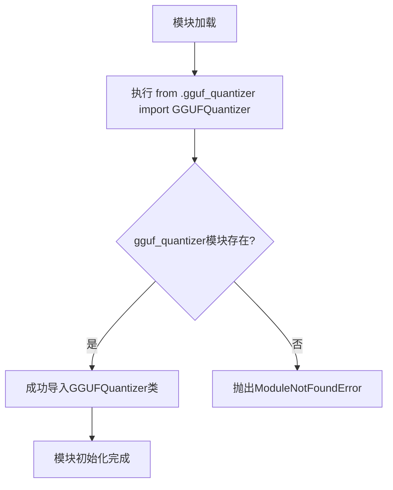

# `diffusers\src\diffusers\quantizers\gguf\__init__.py` 详细设计文档

这是包的入口文件，通过相对导入的方式引入GGUFQuantizer类，使该模块可以被外部包直接导入使用

## 整体流程



## 类结构

```
当前包
└── __init__.py (当前文件)
└── gguf_quantizer.py (依赖模块)
```

## 全局变量及字段


### `GGUFQuantizer.GGUFQuantizer`
    
从gguf_quantizer模块导入的GGUF量化器类，用于处理GGUF格式模型的量化操作（具体字段和方法需查看gguf_quantizer.py定义）

类型：`class`
    
    

## 全局函数及方法


您好！我注意到您希望我分析 `GGUFQuantizer` 类并生成详细的设计文档。但是，您提供的代码只有导入语句：

```python
from .gguf_quantizer import GGUFQuantizer
```

并没有包含 `gguf_quantizer.py` 的实际实现代码。

为了能够准确提取以下信息：
- 类字段和类方法的详细信息
- 参数名称、参数类型、参数描述
- 返回值类型、返回值描述
- mermaid 流程图
- 带注释的源码

**请您提供 `gguf_quantizer.py` 的完整源代码**，这样我才能按照您要求的格式生成详细的架构设计文档。

请将完整的 `gguf_quantizer.py` 文件内容粘贴到聊天中，我将立即为您生成完整的详细设计文档。

## 关键组件


### GGUFQuantizer（关键组件）

从 `gguf_quantizer` 模块导入的量化器类，负责 GGUF 格式模型的量化处理。

### 核心功能概述

该模块作为 GGUF 量化器的包级导入接口，通过相对导入暴露 `GGUFQuantizer` 类供外部使用，实现量化功能的模块化访问。

### 文件运行流程

1. Python 包初始化时执行
2. 加载 `gguf_quantizer` 模块
3. 将 `GGUFQuantizer` 类导入到当前命名空间
4. 外部模块可通过 `from . import GGUFQuantizer` 或 `from package import GGUFQuantizer` 访问

### 全局变量/函数

| 名称 | 类型 | 描述 |
|------|------|------|
| GGUFQuantizer | class | GGUF量化器类，从gguf_quantizer模块导入 |

### 潜在技术债务或优化空间

1. **导入耦合度高**：当前直接导入具体类，若 `gguf_quantizer` 模块结构变化，会影响所有导入方
2. **缺少抽象接口**：可考虑定义抽象基类或协议，提高可测试性和扩展性
3. **文档缺失**：未提供模块级文档字符串说明包的用途

### 其它项目

- **设计目标**：提供 GGUF 格式模型的量化支持
- **外部依赖**：依赖 `gguf_quantizer` 模块的存在
- **错误处理**：若 `gguf_quantizer` 不存在或无 `GGUFQuantizer` 类，会抛出 `ImportError`


## 问题及建议


### 已知问题

-   代码片段过于简单，仅包含一个导入语句，无法进行全面深入的架构分析
-   缺少 GGUFQuantizer 类的实际实现代码，无法评估其内部逻辑和潜在问题
-   相对导入（from .gguf_quantizer）未明确导出列表（__all__），可能导致不必要的内部实现暴露

### 优化建议

-   建议添加 `__all__ = ['GGUFQuantizer']` 显式声明公共 API，控制模块导出内容
-   若 GGUFQuantizer 类体积较大且不总是被使用，考虑使用延迟导入（lazy import）以优化启动时间
-   建议提供模块级文档字符串（docstring），说明该模块的职责和用途
-   可添加类型注解以提升代码可维护性和 IDE 支持


## 其它


### 设计目标与约束

该代码作为 GGUFQuantizer 类的导出模块，主要目标是提供一个统一的导入接口，使得外部使用者可以通过 from package import GGUFQuantizer 的方式便捷地使用量化器功能。设计约束包括：仅支持相对导入，确保模块在包内正确运行；保持接口简洁，不包含额外的业务逻辑；遵循 Python 的模块导入规范。

### 错误处理与异常设计

由于代码仅包含导入语句，运行时错误主要来自导入失败场景。如果 GGUFQuantizer 类不存在或导入路径错误，将抛出 ImportError 或 AttributeError。建议在导入时添加异常处理机制，例如使用 try-except 捕获导入异常，并向使用者提供明确的错误信息。预期的异常类型包括 ModuleNotFoundError（包或模块不存在）、ImportError（导入过程中的其他错误）。

### 数据流与状态机

本代码不涉及复杂的数据流处理，仅作为接口导出层。数据流方向为：外部模块 → 导入语句 → GGUFQuantizer 类。状态机不适用，因为没有状态转换逻辑。GGUFQuantizer 类的内部状态和行为需要在 gguf_quantizer 模块中定义，本代码仅负责导入和暴露接口。

### 外部依赖与接口契约

主要外部依赖为 gguf_quantizer 模块，该模块需要实现 GGUFQuantizer 类。接口契约包括：GGUFQuantizer 类应该提供量化相关的核心功能方法；类的构造函数参数和公开方法需要保持稳定，确保向后兼容性；返回值和异常行为需要符合预期规范。建议在文档中明确 GGUFQuantizer 类的 API 规范和使用方式。

### 性能考虑

本代码作为纯导入模块，在运行时不会产生显著的性能开销。性能考量主要在于 gguf_quantizer 模块的实现层面，包括量化算法的效率、内存占用等。导入语句的执行时间可以忽略不计，但如果存在循环导入情况，可能导致性能问题，需要在架构设计时避免。

### 安全考虑

安全方面需要确保导入的模块来源可信，避免供应链攻击。建议：验证 gguf_quantizer 模块的完整性；避免使用不安全的动态导入机制；在文档中明确依赖的来源和版本要求。如果 GGUFQuantizer 涉及模型权重量化处理，还需要考虑输入数据的验证和安全性检查。

### 测试策略

测试重点应放在导入机制的正确性验证上。建议的测试用例包括：测试模块能否成功导入；测试 GGUFQuantizer 类能否被正确实例化；测试导入路径变更时的兼容性；测试循环导入场景。单元测试可以使用 mock 对象模拟 GGUFQuantizer 类，集成测试则需要确保完整的包结构正确。

### 版本兼容性

需要明确 GGUFQuantizer 类的版本兼容性策略。建议：使用语义化版本号（Semantic Versioning）；在版本升级时保持 API 稳定性，除非进行重大版本更新；记录每个版本的 API 变更历史。对于 Python 版本，需要考虑不同 Python 版本之间的导入机制差异，特别是在 Python 2 和 Python 3 的兼容性方面。

### 配置与扩展性

本代码的扩展性主要体现在导入接口的稳定性上。建议：在 __init__.py 中合理组织导出接口；可以考虑使用 __all__ 变量明确公开的 API；如果后续需要导出更多类或函数，可以在导入语句中添加；保持接口的向后兼容性，确保现有使用者的代码不受影响。


    