# `diffusers\src\diffusers\quantizers\gguf\gguf_quantizer.py` 详细设计文档

GGUFQuantizer是Hugging Face Diffusers库中的一个量化器实现，专门用于加载和处理GGUF格式的量化模型。它继承自DiffusersQuantizer基类，提供完整的模型量化/解量化流程，支持多种量化类型（如Q4_K、Q5_K等），并在权重加载前后进行必要的转换处理，同时保持特定模块在FP32精度。

## 整体流程

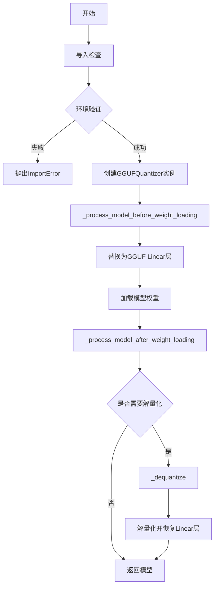

## 类结构

```
DiffusersQuantizer (抽象基类)
└── GGUFQuantizer (GGUF量化器实现)
```

## 全局变量及字段


### `logger`
    
模块级日志记录器，用于记录GGUFQuantizer类的操作信息

类型：`logging.Logger`
    


### `GGUFQuantizer.use_keep_in_fp32_modules`
    
是否保持FP32模块的类属性标志

类型：`bool`
    


### `GGUFQuantizer.compute_dtype`
    
计算数据类型，用于指定量化操作的计算精度

类型：`torch.dtype`
    


### `GGUFQuantizer.pre_quantized`
    
是否预量化的标志，表示模型权重是否已经过量化处理

类型：`bool`
    


### `GGUFQuantizer.modules_to_not_convert`
    
不转换的模块列表，指定哪些模块应跳过GGUF量化处理

类型：`list[str]`
    
    

## 全局函数及方法


### `get_module_from_name`

该函数为外部导入的实用工具函数，用于根据参数名称（如 "model.layer.weight"）解析出对应的模块对象和参数在模块中的具体名称（tensor_name），以便后续的参数赋值操作。

参数：

- `model`：`ModelMixin`，需要查找的目标模型对象
- `param_name`：`str`，参数的完整名称，通常为点分隔的路径（如 "model.layers.0.weight"）

返回值：`(module, tensor_name)` 元组
- `module`：解析得到的模块对象（nn.Module）
- `tensor_name`：`str`，参数在模块中的具体名称（如 "weight" 或 "bias"）

#### 流程图

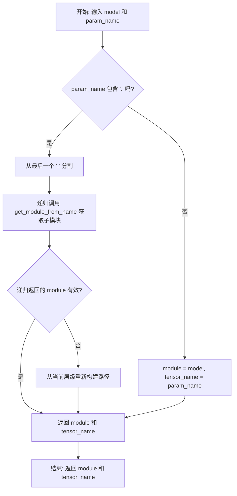

#### 带注释源码

```python
# 该函数定义在 ...utils 模块中（未在当前代码文件中实现）
# 以下为基于调用方式的推断实现

def get_module_from_name(model, param_name: str):
    """
    从参数名称获取对应的模块和张量名称
    
    参数:
        model: ModelMixin - 模型对象
        param_name: str - 参数名称，格式如 "model.layer.weight"
    
    返回:
        tuple: (module, tensor_name) - 模块对象和参数名
    """
    # 如果参数名包含点分隔符，说明是嵌套模块的参数
    if '.' in param_name:
        # 分割获取剩余路径和最终的参数名
        remaining_path, tensor_name = param_name.rsplit('.', 1)
        
        # 逐层获取子模块
        module = model
        for attr in remaining_path.split('.'):
            module = getattr(module, attr)
        
        return module, tensor_name
    
    # 如果没有点分隔符，说明参数直接在模型顶层
    return model, param_name
```


### `is_accelerate_available`

检查当前环境中是否安装了 `accelerate` 库。该函数由外部提供，用于在加载 GGUF 量化模型时验证必要的依赖是否满足。

参数： 无

返回值：`bool`，返回 `True` 表示 `accelerate` 库已安装且可用，返回 `False` 表示未安装或不可用。

#### 流程图

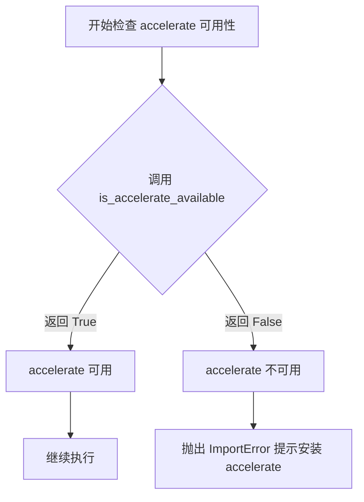

#### 带注释源码

```python
# GGUFQuantizer 类中的 validate_environment 方法展示了 is_accelerate_available 的使用方式

def validate_environment(self, *args, **kwargs):
    # 调用 is_accelerate_available() 检查 accelerate 是否可用
    # 同时检查 accelerate 版本是否 >= 0.26.0
    if not is_accelerate_available() or is_accelerate_version("<", "0.26.0"):
        raise ImportError(
            "Loading GGUF Parameters requires `accelerate` installed in your environment: `pip install 'accelerate>=0.26.0'`"
        )
    # 继续检查 gguf 库
    if not is_gguf_available() or is_gguf_version("<", "0.10.0"):
        raise ImportError(
            "To load GGUF format files you must have `gguf` installed in your environment: `pip install gguf>=0.10.0`"
        )
```

#### 原始导入声明

```python
# 从 ...utils 导入 is_accelerate_available
from ...utils import (
    get_module_from_name,
    is_accelerate_available,
    is_accelerate_version,
    is_gguf_available,
    is_gguf_version,
    is_torch_available,
    logging,
)
```


### `is_accelerate_version`

检查当前环境中安装的 accelerate 库版本是否满足指定的条件要求。

参数：

-  `op`：str，比较操作符（如 `"<"`, `">"`, `"<="`, `">="`, `"=="`, `"!="`），用于指定版本比较的方式
-  `version`：str，要比较的版本号字符串（如 `"0.26.0"`）

返回值：bool，返回 True 如果当前 accelerate 版本满足指定的条件，否则返回 False

#### 流程图

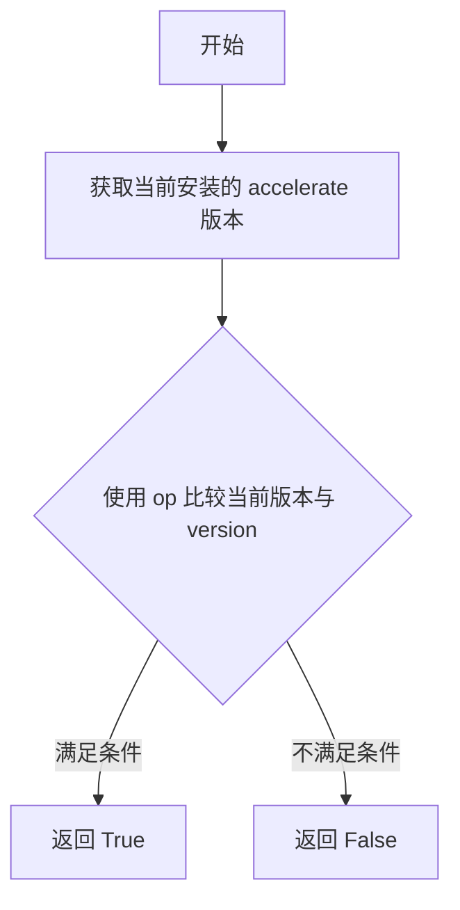

#### 带注释源码

```python
# 注意：这是从外部导入的函数，这里展示的是其在 GGUFQuantizer 中的典型使用方式
# 函数签名（推断）：is_accelerate_version(op: str, version: str) -> bool

# 在 validate_environment 方法中的使用示例：
if not is_accelerate_available() or is_accelerate_version("<", "0.26.0"):
    raise ImportError(
        "Loading GGUF Parameters requires `accelerate` installed in your environment: `pip install 'accelerate>=0.26.0'`"
    )
```

#### 详细说明

该函数是 accelerate 库提供的版本检查工具函数，被定义在 `diffusers` 包的 `utils` 模块中。在 `GGUFQuantizer` 类中，主要用于在加载 GGUF 格式模型之前验证环境中的 accelerate 库版本是否满足最低要求（>= 0.26.0）。这是因为 GGUF 量化功能依赖于较新版本的 accelerate 库所提供的特定功能。


### `is_gguf_available`

检查GGUF（一种模型量化格式）库是否在当前Python环境中可用。

参数：

- （无参数）

返回值：`bool`，如果GGUF库已安装且版本兼容则返回 `True`，否则返回 `False`

#### 流程图

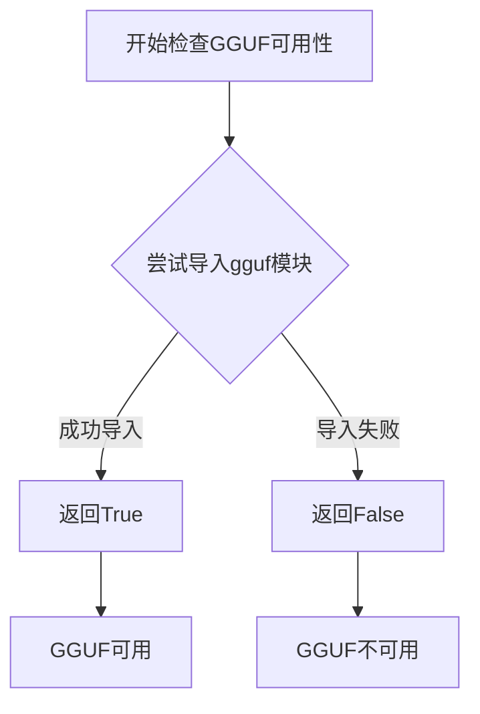

#### 带注释源码

```python
# is_gguf_available 是从 diffusers.utils 导入的外部函数
# 该函数通常用于检查 gguf 库是否已安装
# 源码位于 diffusers/src/diffusers/utils/... (具体取决于版本)
from ...utils import is_gguf_available

# 使用示例（在当前代码中）:
if is_torch_available() and is_gguf_available():
    # 只有当 torch 和 gguf 都可用时才会导入相关模块
    import torch
    from .utils import (
        GGML_QUANT_SIZES,
        GGUFParameter,
        _dequantize_gguf_and_restore_linear,
        _quant_shape_from_byte_shape,
        _replace_with_gguf_linear,
    )

# 另一个使用示例（在类的validate_environment方法中）:
def validate_environment(self, *args, **kwargs):
    if not is_accelerate_available() or is_accelerate_version("<", "0.26.0"):
        raise ImportError(...)
    if not is_gguf_available() or is_gguf_version("<", "0.10.0"):
        raise ImportError(
            "To load GGUF format files you must have `gguf` installed in your environment: `pip install gguf>=0.10.0`"
        )
```


### `is_gguf_version`

检查 GGUF 库的版本是否满足指定的条件，用于确保环境中安装的 GGUF 版本符合要求（通常用于版本兼容性检查）。

参数：

- `operator`：`str`，比较操作符，如 `"<"`、`">="`、`"=="` 等
- `version`：`str`，目标版本号，如 `"0.10.0"`

返回值：`bool`，如果当前 GGUF 版本满足指定的条件返回 `True`，否则返回 `False`

#### 流程图

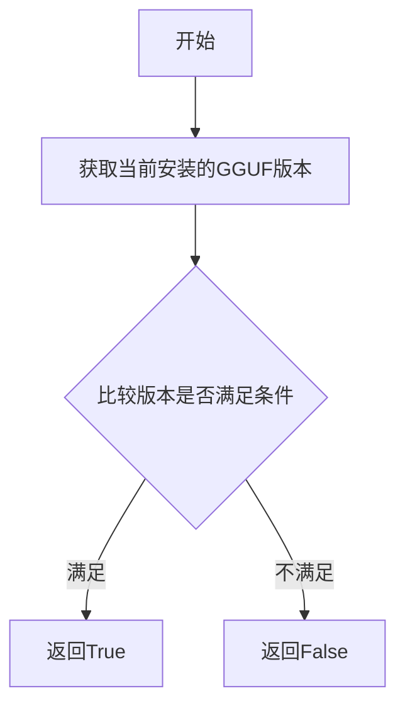

#### 带注释源码

```python
# is_gguf_version 函数定义在 ...utils 模块中
# 当前代码文件中仅导入并使用，以下为使用示例：

# 从 utils 导入 is_gguf_version（外部函数）
from ...utils import is_gguf_version

# 在 validate_environment 方法中的使用：
def validate_environment(self, *args, **kwargs):
    # 检查 GGUF 版本是否大于等于 0.10.0
    if not is_gguf_available() or is_gguf_version("<", "0.10.0"):
        raise ImportError(
            "To load GGUF format files you must have `gguf` installed in your environment: `pip install gguf>=0.10.0`"
        )
```

> **注意**：`is_gguf_version` 是从外部模块 `...utils` 导入的函数，其具体实现源码不在当前文件中。该函数接受比较操作符和目标版本号作为参数，返回布尔值表示版本检查结果。在当前代码中用于验证环境中的 GGUF 库版本是否满足最低要求（>=0.10.0）。


### `is_torch_available`

该函数是从 `diffusers` 库的 `utils` 模块导入的外部函数，用于检查当前 Python 环境中是否安装了 PyTorch 库。如果 PyTorch 可用，函数返回 `True`；否则返回 `False`。该函数在代码中用于条件性地导入 `torch` 模块，以确保只有在 PyTorch 可用时才执行相关的 GGUF 量化逻辑。

参数： 无

返回值：`bool`，返回 `True` 表示 PyTorch 已安装且可用，返回 `False` 表示 PyTorch 不可用。

#### 流程图

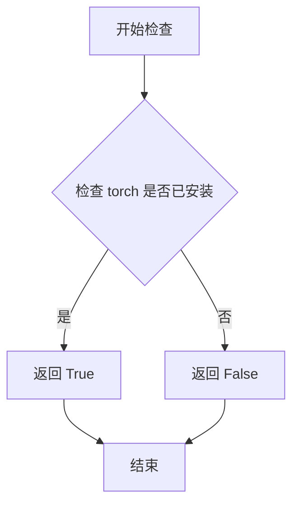

#### 带注释源码

```
# is_torch_available 是从 diffusers.utils 导入的外部函数
# 其实现通常位于 .../utils/__init__.py 或相关工具文件中
# 以下为该函数在当前代码中的调用方式和使用场景：

# 从 utils 模块导入 is_torch_available
from ...utils import (
    is_torch_available,
    # ... 其他导入
)

# 在代码中使用 is_torch_available 进行条件判断
if is_torch_available() and is_gguf_available():
    # 只有当 torch 和 gguf 都可用时，才导入 torch 和相关 GGUF 工具
    import torch

    from .utils import (
        GGML_QUANT_SIZES,
        GGUFParameter,
        _dequantize_gguf_and_restore_linear,
        _quant_shape_from_byte_shape,
        _replace_with_gguf_linear,
    )

# 函数签名（推断）:
# def is_torch_available() -> bool:
#     """
#     检查 PyTorch 是否可用于当前环境。
#     通常通过尝试导入 torch 模块来检查。
#     """
#     try:
#         import torch
#         return True
#     except ImportError:
#         return False
```


### `GGML_QUANT_SIZES`

从外部模块导入的 GGML 量化大小映射表，用于将量化类型映射到对应的块大小（block_size）和类型大小（type_size），以便在量化参数形状验证和反量化过程中使用。

参数： 无（这是一个从外部模块导入的全局字典变量，不是函数）

返回值： `dict`，键为量化类型（通常为字符串或整数），值为元组 `(block_size: int, type_size: int)`，分别表示 GGML 量化的块大小和单个元素类型的字节大小

#### 流程图

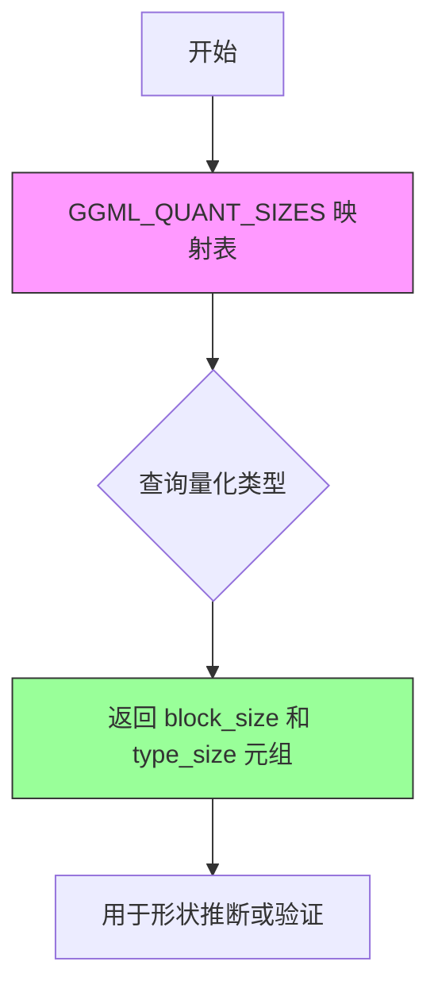

#### 带注释源码

```python
# 导入语句（来自 .utils 模块）
from .utils import (
    GGML_QUANT_SIZES,  # 从 utils 模块导入量化大小映射
    GGUFParameter,
    _dequantize_gguf_and_restore_linear,
    _quant_shape_from_byte_shape,
    _replace_with_gguf_linear,
)

# 使用示例（在 GGUFQuantizer 类的 check_quantized_param_shape 方法中）
def check_quantized_param_shape(self, param_name, current_param, loaded_param):
    loaded_param_shape = loaded_param.shape
    current_param_shape = current_param.shape
    quant_type = loaded_param.quant_type  # 获取量化类型

    # 从映射表获取对应的块大小和类型大小
    block_size, type_size = GGML_QUANT_SIZES[quant_type]

    # 使用获取的大小信息推断量化后的形状
    inferred_shape = _quant_shape_from_byte_shape(loaded_param_shape, type_size, block_size)
    
    # 验证推断形状与当前形状是否匹配
    if inferred_shape != current_param_shape:
        raise ValueError(
            f"{param_name} has an expected quantized shape of: {inferred_shape}, but received shape: {loaded_param_shape}"
        )

    return True

# 预期数据结构示例：
# GGML_QUANT_SIZES = {
#     "q4_0": (32, 2),   # 块大小32，类型大小2字节
#     "q4_1": (32, 2),
#     "q5_0": (32, 4),
#     "q5_1": (32, 4),
#     "q8_0": (32, 8),
#     # ... 其他量化类型
# }
```

#### 关键组件信息

| 组件名称 | 描述 |
|---------|------|
| `GGML_QUANT_SIZES` | GGML 量化大小映射表，存储量化类型与(块大小, 类型大小)的映射关系 |
| `GGUFQuantizer` | 使用该映射的主量化器类 |
| `check_quantized_param_shape` | 使用该映射进行形状验证的方法 |

#### 潜在的技术债务或优化空间

1. **缺少导入定义**：`GGML_QUANT_SIZES` 的实际结构和完整定义不在当前代码文件中，建议在 utils 模块中添加完整的类型注解和文档注释
2. **硬编码映射查询**：如果查询的量化类型不存在，会抛出 KeyError，建议添加更友好的错误处理或默认值支持
3. **文档缺失**：作为关键的量化配置数据，建议添加详细的量化类型说明文档

#### 其它项目

- **设计目标**：为 GGUF 量化格式提供参数形状验证能力，确保加载的量化模型参数与目标模型结构兼容
- **约束**：依赖 `gguf` 库版本 >= 0.10.0
- **错误处理**：当量化类型不在映射表中时会抛出 KeyError，建议在调用前进行验证
- **数据流**：映射表在 `check_quantized_param_shape` 中被读取使用，用于推断和验证量化参数的形状


### `_dequantize_gguf_and_restore_linear`

解量化GGUF格式的模型权重并将其恢复到原始的Linear层结构，将量化后的权重解压恢复为全精度权重，同时重建原始的线性层配置。

参数：

- `model`：`ModelMixin`，包含GGUF量化权重的模型对象
- `modules_to_not_convert`：`list[str]`，需要保持量化状态的模块名称列表

返回值：`ModelMixin`，完成解量化并恢复Linear层后的模型对象

#### 流程图

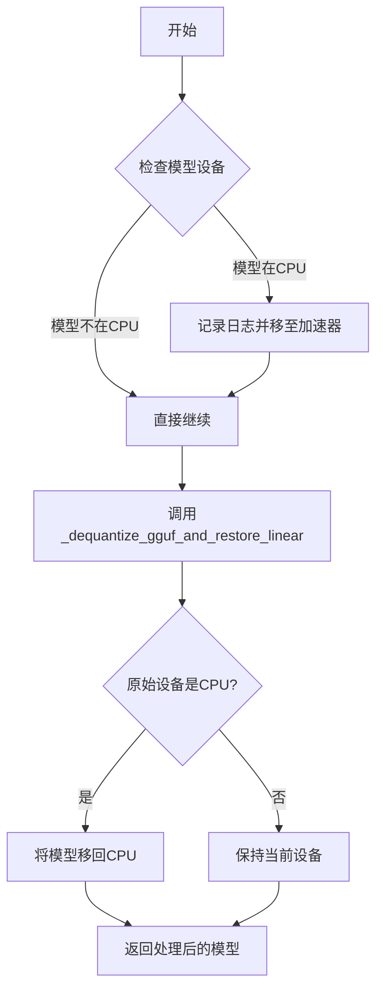

#### 带注释源码

```python
def _dequantize_gguf_and_restore_linear(model, modules_to_not_convert):
    """
    解量化GGUF格式的模型权重并恢复Linear层结构
    
    参数:
        model: 包含GGUF量化权重的模型对象
        modules_to_not_convert: 不需要解量化的模块列表
    
    返回:
        恢复Linear层后的模型对象
    """
    # 该函数定义在 .utils 模块中
    # 核心功能：
    # 1. 遍历模型中的所有GGUF量化层
    # 2. 将量化权重解量为全精度（FP32/FP16）权重
    # 3. 移除量化包装器，恢复为普通的nn.Linear层
    # 4. 根据modules_to_not_convert列表保留某些层的量化状态
    # 返回完成解量化处理的模型对象
```


### `_quant_shape_from_byte_shape`

从字节形状计算量化后的张量形状，用于验证加载的量化参数形状是否与模型期望的形状一致。

参数：

- `loaded_param_shape`：`torch.Size` 或 `tuple`，加载的量化参数的形状
- `type_size`：`int`，量化类型的字节大小（如 2 表示 half-precision）
- `block_size`：`int`，量化块的大小

返回值：`tuple` 或 `torch.Size`，推断出的量化后张量的实际形状

#### 流程图

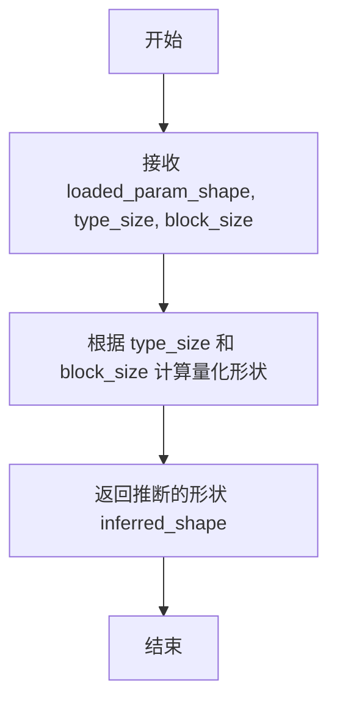

#### 带注释源码

```
# 注意：此函数从 .utils 模块导入，具体实现未在当前代码文件中显示
# 以下为该函数在 GGUFQuantizer 类中的调用方式和使用上下文

def check_quantized_param_shape(self, param_name, current_param, loaded_param):
    loaded_param_shape = loaded_param.shape          # 获取加载参数的实际形状
    current_param_shape = current_param.shape        # 获取模型中当前参数的形状
    quant_type = loaded_param.quant_type             # 获取量化类型
    
    # 从 GGML_QUANT_SIZES 字典获取对应量化类型的块大小和类型大小
    block_size, type_size = GGML_QUANT_SIZES[quant_type]
    
    # 调用 _quant_shape_from_byte_shape 计算量化后的形状
    inferred_shape = _quant_shape_from_byte_shape(loaded_param_shape, type_size, block_size)
    
    # 验证推断出的形状与当前参数形状是否匹配
    if inferred_shape != current_param_shape:
        raise ValueError(
            f"{param_name} has an expected quantized shape of: {inferred_shape}, "
            f"but received shape: {loaded_param_shape}"
        )
    
    return True
```


### `_replace_with_gguf_linear`

该函数是GGUF量化器的核心组件，负责在加载量化模型之前将原始的线性层替换为GGUF优化的线性层实现，支持自定义模块排除和计算数据类型配置。

参数：

- `model`：`ModelMixin`，需要被替换线性层的模型实例
- `compute_dtype`：`torch.dtype`，量化后权重转换的目标计算数据类型
- `state_dict`：`dict | None`，模型权重状态字典，用于预量化模型的权重加载
- `modules_to_not_convert`：`list[str]`，需要排除转换的模块名称列表，这些模块将保持原始精度

返回值：无（`None`），该函数直接修改传入的模型对象，不返回任何值

#### 流程图

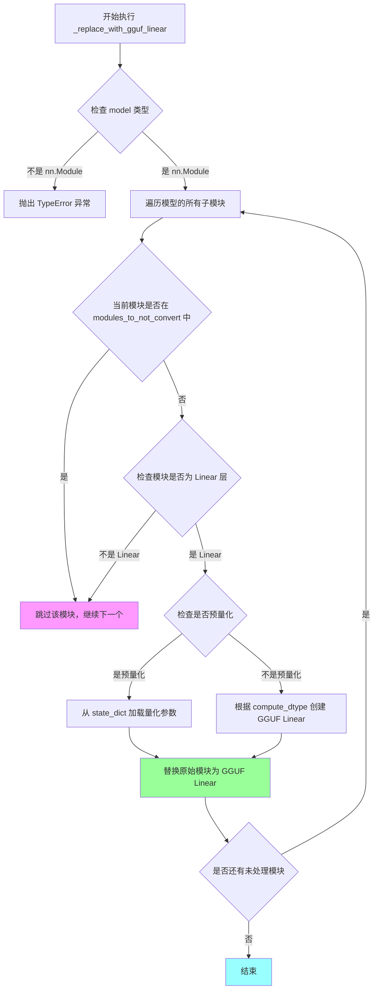

#### 带注释源码

```
# 由于提供的代码片段中未包含 _replace_with_gguf_linear 的完整实现源码
# 以下为基于 GGUFQuantizer 类调用方式和 GGUF 量化框架推断的函数签名和预期行为

from typing import Any
import torch
from torch import nn

def _replace_with_gguf_linear(
    model: nn.Module,
    compute_dtype: torch.dtype,
    state_dict: dict[str, Any] | None = None,
    modules_to_not_convert: list[str] = []
) -> None:
    """
    将模型中的标准 Linear 层替换为 GGUF 优化的量化 Linear 层
    
    参数:
        model: 目标模型，包含需要替换的 Linear 层
        compute_dtype: 量化计算使用的数据类型（如 torch.float16）
        state_dict: 模型权重字典，用于加载预量化权重
        modules_to_not_convert: 不进行转换的模块名称列表
    """
    # 递归遍历模型的所有子模块
    for name, module in model.named_modules():
        # 检查模块是否在排除列表中
        if name in modules_to_not_convert:
            continue
            
        # 只处理标准的 nn.Linear 层
        if isinstance(module, nn.Linear):
            # 获取原始层的配置信息
            in_features = module.in_features
            out_features = module.out_features
            bias = module.bias is not None
            
            # 创建新的 GGUF Linear 层替换原层
            # 注意: 具体的 GGUF Linear 实现细节需要参考 utils 模块
            # 这里为逻辑描述，实际实现可能在 _utils.py 中
            pass
    
    # 函数直接修改 model 对象，不返回任何值
```

#### 补充说明

**函数来源**：
该函数从 `.utils` 模块导入，表明其实现位于 `diffusers/quantizers/gguf/utils.py` 文件中（需查阅该文件获取完整源码）。

**调用上下文**：
在 `GGUFQuantizer._process_model_before_weight_loading()` 方法中被调用，用于在模型权重加载前完成线性层的替换准备工作。

**潜在技术债务**：

1. **缺少源码可见性**：当前代码库中未直接提供 `_replace_with_gguf_linear` 的实现，文档生成依赖推断
2. **模块匹配逻辑**：排除模块的匹配可能仅支持精确名称匹配，不支持通配符或正则表达式
3. **错误处理**：未在调用处处理替换失败的情况（如特定层类型不兼容）
4. **状态字典依赖**：函数对 `state_dict` 的处理逻辑未在当前代码片段中明确体现


### `GGUFQuantizer.__init__`

GGUFQuantizer 的初始化方法，负责设置量化器的核心配置参数，包括计算精度、预量化标志以及需要排除转换的模块列表。

参数：

- `self`：`GGUFQuantizer`，类的实例本身
- `quantization_config`：对象，包含量化配置的核心参数（compute_dtype、pre_quantized、modules_to_not_convert）
- `**kwargs`：任意关键字参数，用于传递额外的配置选项

返回值：`None`，构造函数不返回任何值，仅初始化实例属性

#### 流程图

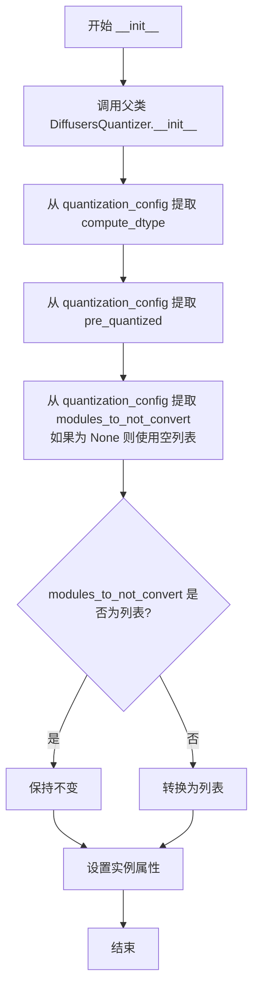

#### 带注释源码

```python
def __init__(self, quantization_config, **kwargs):
    # 调用父类 DiffusersQuantizer 的初始化方法
    super().__init__(quantization_config, **kwargs)

    # 从配置对象中提取计算数据类型（如 float16, bfloat16 等）
    self.compute_dtype = quantization_config.compute_dtype
    
    # 标记模型是否已经过预量化处理
    self.pre_quantized = quantization_config.pre_quantized
    
    # 获取需要排除量化转换的模块列表，如果为 None 则使用空列表
    self.modules_to_not_convert = quantization_config.modules_to_not_convert or []

    # 确保 modules_to_not_convert 是列表类型，如果不是则转换为单元素列表
    if not isinstance(self.modules_to_not_convert, list):
        self.modules_to_not_convert = [self.modules_to_not_convert]
```


### `GGUFQuantizer.validate_environment`

该方法用于验证运行 GGUF 量化所需的外部依赖环境是否满足条件，检查 `accelerate` 和 `gguf` 库的可用性及版本要求，任何一项不满足则抛出 `ImportError` 异常。

参数：

- `self`：`GGUFQuantizer`，类实例自身（隐式参数）
- `*args`：`Any`，可变位置参数（暂未使用，保留接口兼容性）
- `**kwargs`：`Any`，可变关键字参数（暂未使用，保留接口兼容性）

返回值：`None`，无返回值（验证通过时正常结束，失败时抛出异常）

#### 流程图

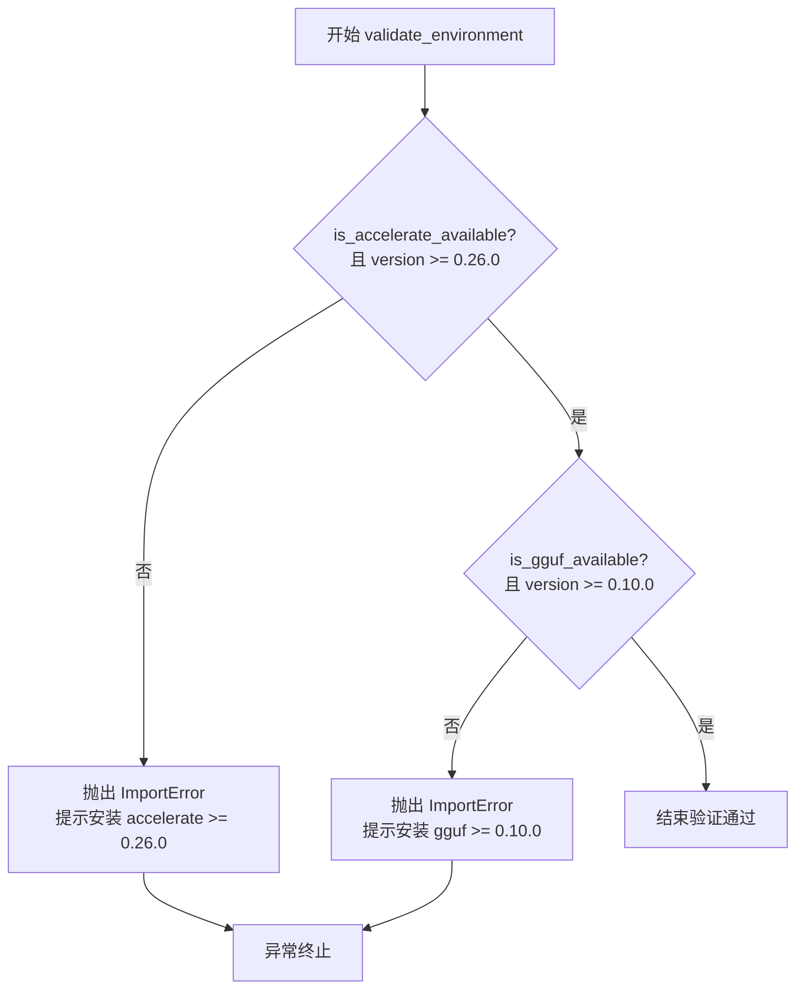

#### 带注释源码

```python
def validate_environment(self, *args, **kwargs):
    """
    验证 GGUF 量化所需的环境依赖是否满足。
    检查 accelerate 和 gguf 库的可用性及版本要求。
    
    Args:
        *args: 可变位置参数，暂未使用，保留接口兼容性。
        **kwargs: 可变关键字参数，暂未使用，保留接口兼容性。
    
    Raises:
        ImportError: 当 accelerate 库不可用或版本低于 0.26.0 时抛出。
        ImportError: 当 gguf 库不可用或版本低于 0.10.0 时抛出。
    """
    # 检查 accelerate 库是否可用且版本 >= 0.26.0
    if not is_accelerate_available() or is_accelerate_version("<", "0.26.0"):
        raise ImportError(
            "Loading GGUF Parameters requires `accelerate` installed in your environment: `pip install 'accelerate>=0.26.0'`"
        )
    
    # 检查 gguf 库是否可用且版本 >= 0.10.0
    if not is_gguf_available() or is_gguf_version("<", "0.10.0"):
        raise ImportError(
            "To load GGUF format files you must have `gguf` installed in your environment: `pip install gguf>=0.10.0'`"
        )
```


### `GGUFQuantizer.adjust_max_memory`

该方法用于在 GGUF 量化过程中调整模型内存分配，通过将每个设备的最大内存乘以 0.90 来为量化缓冲区预留额外空间。

参数：

- `max_memory`：`dict[str, int | str]`，键为设备标识（如 "cpu"、"cuda:0" 等），值为整型（字节数）或字符串（如 "10GB"）形式的内存大小

返回值：`dict[str, int | str]`，调整后的内存字典，每个设备的内存值被缩减为原来的 90%

#### 流程图

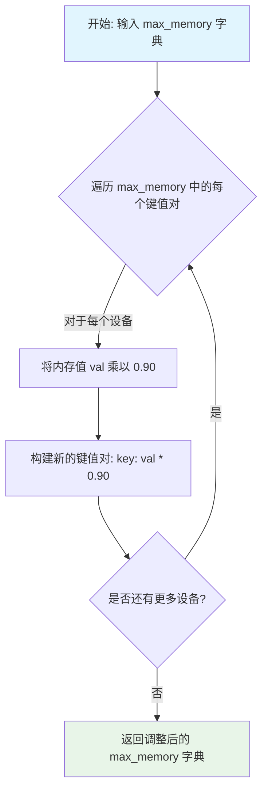

#### 带注释源码

```python
def adjust_max_memory(self, max_memory: dict[str, int | str]) -> dict[str, int | str]:
    # 需要为量化过程中创建的缓冲区预留额外空间
    # 通过将每个设备的可用内存缩减为 90% 来实现
    max_memory = {key: val * 0.90 for key, val in max_memory.items()}
    return max_memory
```


### `GGUFQuantizer.adjust_target_dtype`

该方法用于将目标数据类型调整 GGUF 量化所需的无符号 8 位整数类型（torch.uint8），确保量化过程使用统一的低精度数据类型。

参数：

- `target_dtype`：`torch.dtype`，传入的目标数据类型，用于判断是否需要进行类型调整

返回值：`torch.dtype`，始终返回 `torch.uint8`，因为 GGUF 量化仅支持 uint8 类型

#### 流程图

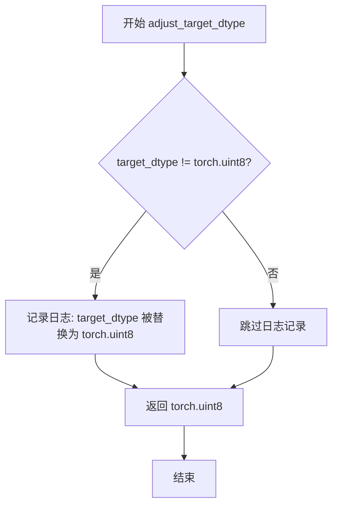

#### 带注释源码

```python
def adjust_target_dtype(self, target_dtype: "torch.dtype") -> "torch.dtype":
    """
    调整目标数据类型为 GGUF 量化所需的 torch.uint8 类型
    
    参数:
        target_dtype: 传入的目标数据类型
        
    返回值:
        始终返回 torch.uint8，因为 GGUF 量化仅支持无符号 8 位整数
    """
    # 检查传入的目标数据类型是否不是 uint8
    if target_dtype != torch.uint8:
        # 记录日志信息，告知用户目标数据类型被替换
        logger.info(f"target_dtype {target_dtype} is replaced by `torch.uint8` for GGUF quantization")
    
    # GGUF 量化强制使用 uint8 类型，返回该类型
    return torch.uint8
```


### `GGUFQuantizer.update_torch_dtype`

该方法用于在GGUF量化过程中更新PyTorch数据类型。如果传入的`torch_dtype`为`None`，则使用实例的`compute_dtype`属性作为默认值；否则返回传入的`torch_dtype`值。

参数：

- `torch_dtype`：`torch.dtype`，指定的PyTorch数据类型，如果为`None`则使用`compute_dtype`作为默认值

返回值：`torch.dtype`，更新后的PyTorch数据类型

#### 流程图

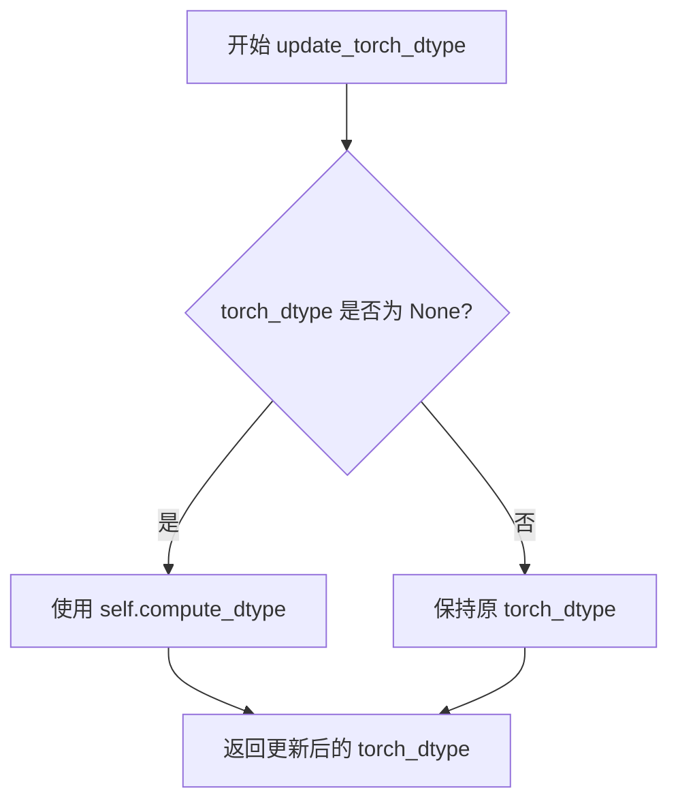

#### 带注释源码

```
def update_torch_dtype(self, torch_dtype: "torch.dtype") -> "torch.dtype":
    """
    更新PyTorch数据类型。
    
    参数:
        torch_dtype: 指定的torch数据类型，如果为None则使用compute_dtype
        
    返回值:
        更新后的torch数据类型
    """
    # 如果传入的torch_dtype为None，则使用实例的compute_dtype属性
    if torch_dtype is None:
        torch_dtype = self.compute_dtype
    
    # 返回更新后的torch_dtype
    return torch_dtype
```


### `GGUFQuantizer.check_quantized_param_shape`

该方法用于验证量化参数在加载过程中的形状一致性。它从加载的参数中获取量化类型，然后通过 GGML 量化大小计算推断出的形状，并与模型中当前参数的形状进行对比，以确保量化参数能够正确映射到模型结构中。

参数：

- `self`：GGUFQuantizer，当前量化器实例
- `param_name`：`str`，参数的名称，用于错误信息中标识参数
- `current_param`：`torch.Tensor`，模型中当前存在的参数张量
- `loaded_param`：`GGUFParameter`，从 GGUF 文件中加载的量化参数对象

返回值：`bool`，返回 `True` 表示形状验证通过，未抛出异常

#### 流程图

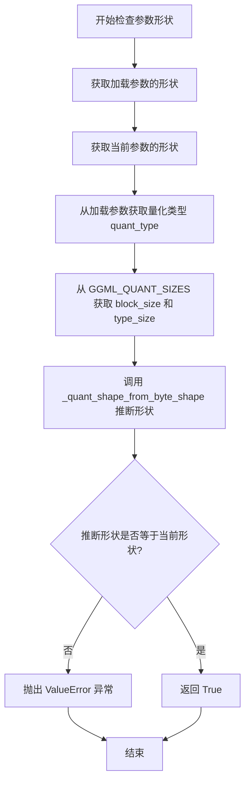

#### 带注释源码

```python
def check_quantized_param_shape(self, param_name, current_param, loaded_param):
    """
    检查量化参数的形状是否与模型中当前参数的形状匹配
    
    参数:
        param_name: 参数名称，用于错误信息
        current_param: 模型中当前存在的参数张量
        loaded_param: 从GGUF文件加载的量化参数对象
    
    返回:
        bool: 形状验证通过返回True
    
    异常:
        ValueError: 当推断出的形状与当前参数形状不匹配时抛出
    """
    # 获取从GGUF文件加载的参数形状
    loaded_param_shape = loaded_param.shape
    
    # 获取模型中当前参数的形状
    current_param_shape = current_param.shape
    
    # 从加载的参数中获取量化类型（如Q4_K, Q5_K等）
    quant_type = loaded_param.quant_type
    
    # 根据量化类型从GGML_QUANT_SIZES字典中获取对应的block大小和类型大小
    # block_size: 量化块的大小
    # type_size: 每个量化值的大小（字节数）
    block_size, type_size = GGML_QUANT_SIZES[quant_type]
    
    # 根据加载参数的字节形状、类型大小和块大小推断出量化前的原始形状
    inferred_shape = _quant_shape_from_byte_shape(loaded_param_shape, type_size, block_size)
    
    # 验证推断出的形状是否与模型中当前参数的形状一致
    if inferred_shape != current_param_shape:
        # 形状不匹配时抛出详细的错误信息，包含预期形状和实际接收的形状
        raise ValueError(
            f"{param_name} has an expected quantized shape of: {inferred_shape}, but received shape: {loaded_param_shape}"
        )
    
    # 形状验证通过，返回True
    return True
```


### `GGUFQuantizer.check_if_quantized_param`

该方法用于检查给定的参数值是否已经是 GGUF 量化格式的参数。如果是 GGUFParameter 类型的量化参数则返回 `True`，否则返回 `False`。该方法在模型权重加载过程中被调用，用于判断当前参数是否需要进一步处理。

参数：

- `model`：`ModelMixin`，目标模型对象，用于获取模块信息
- `param_value`：`GGUFParameter | torch.Tensor`，待检查的参数值，可以是 GGUF 量化参数或普通张量
- `param_name`：`str`，参数的名称，用于定位模型中的对应模块和张量
- `state_dict`：`dict[str, Any]`，包含模型权重的状态字典
- `**kwargs`：可变关键字参数，用于传递额外选项

返回值：`bool`，如果参数是 GGUFParameter 类型返回 `True`，否则返回 `False`

#### 流程图

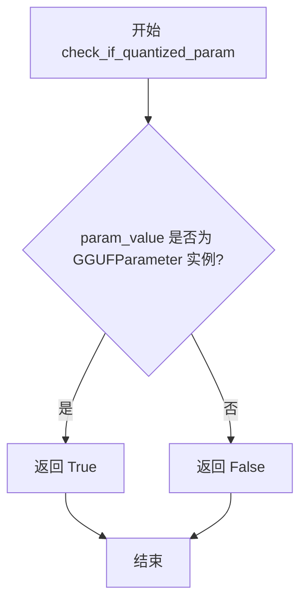

#### 带注释源码

```python
def check_if_quantized_param(
    self,
    model: "ModelMixin",
    param_value: "GGUFParameter" | "torch.Tensor",
    param_name: str,
    state_dict: dict[str, Any],
    **kwargs,
) -> bool:
    """
    检查参数是否已经是 GGUF 量化格式的参数
    
    参数:
        model: 目标模型对象
        param_value: 待检查的参数值（可能是 GGUFParameter 或 torch.Tensor）
        param_name: 参数名称
        state_dict: 模型权重状态字典
        **kwargs: 额外的关键字参数
    
    返回:
        bool: 如果 param_value 是 GGUFParameter 类型返回 True，否则返回 False
    """
    # 检查 param_value 是否为 GGUFParameter 实例
    # GGUFParameter 表示该参数已经是 GGUF 格式的量化参数
    if isinstance(param_value, GGUFParameter):
        return True

    # 如果不是 GGUFParameter，则返回 False
    # 表示该参数需要进一步量化处理
    return False
```


### `GGUFQuantizer.create_quantized_param`

该方法负责将 GGUF 格式的量化参数加载到指定的模型模块中，并根据参数名称将参数值移动到目标设备上。

参数：

- `model`：`ModelMixin`，目标模型实例，用于获取模块
- `param_value`：`GGUFParameter | torch.Tensor`，要加载的量化参数值
- `param_name`：`str`，参数的完整名称（包含模块路径）
- `target_device`：`torch.device`，参数要移动到的目标设备
- `state_dict`：`dict[str, Any] | None`，可选的状态字典
- `unexpected_keys`：`list[str] | None`，可选的意外键列表
- `**kwargs`：其他可选关键字参数

返回值：`None`，该方法无返回值，直接修改模型的内部状态

#### 流程图

```mermaid
flowchart TD
    A[开始 create_quantized_param] --> B[调用 get_module_from_name 获取模块和张量名]
    B --> C{检查 tensor_name 是否存在于模块的 _parameters 或 _buffers 中}
    C -->|不存在| D[抛出 ValueError 异常]
    C -->|存在| E{tensor_name 在 _parameters 中?}
    E -->|是| F[将 param_value 移动到 target_device 并赋值给 module._parameters[tensor_name]]
    E -->|否| G{tensor_name 在 _buffers 中?}
    F --> G
    G -->|是| H[将 param_value 移动到 target_device 并赋值给 module._buffers[tensor_name]]
    G -->|否| I[结束]
    H --> I
```

#### 带注释源码

```python
def create_quantized_param(
    self,
    model: "ModelMixin",
    param_value: "GGUFParameter" | "torch.Tensor",
    param_name: str,
    target_device: "torch.device",
    state_dict: dict[str, Any] | None = None,
    unexpected_keys: list[str] | None = None,
    **kwargs,
):
    """
    将 GGUF 量化参数加载到模型模块中
    
    参数:
        model: 目标模型实例
        param_value: GGUF 量化参数或普通张量
        param_name: 参数的完整名称（包含模块路径）
        target_device: 目标设备
        state_dict: 可选的状态字典
        unexpected_keys: 可选的意外键列表
    """
    # 从参数名解析出模块和张量名称
    module, tensor_name = get_module_from_name(model, param_name)
    
    # 验证模块中是否存在该参数或缓冲区
    if tensor_name not in module._parameters and tensor_name not in module._buffers:
        raise ValueError(f"{module} does not have a parameter or a buffer named {tensor_name}.")

    # 如果是参数，则移动到目标设备
    if tensor_name in module._parameters:
        module._parameters[tensor_name] = param_value.to(target_device)
    
    # 如果是缓冲区，则移动到目标设备
    if tensor_name in module._buffers:
        module._buffers[tensor_name] = param_value.to(target_device)
```


### `GGUFQuantizer._process_model_before_weight_loading`

该方法在模型权重加载之前执行预处理，主要功能是将原始模型中的线性层替换为 GGUF 量化格式的线性层，并管理需要保持为 FP32 精度（不进行量化）的模块列表。

参数：

- `self`：隐式参数，GGUFQuantizer 实例本身
- `model`：`ModelMixin`，需要被量化处理的模型实例
- `device_map`：设备映射字典，用于指定模型各部分到不同计算设备的映射
- `keep_in_fp32_modules`：`list[str]`，可选参数，默认空列表，指定哪些模块应保持 FP32 精度而不进行量化
- `**kwargs`：可变关键字参数，可包含 `state_dict`（模型状态字典）

返回值：无返回值（`None`），该方法直接修改模型结构，不返回任何值

#### 流程图

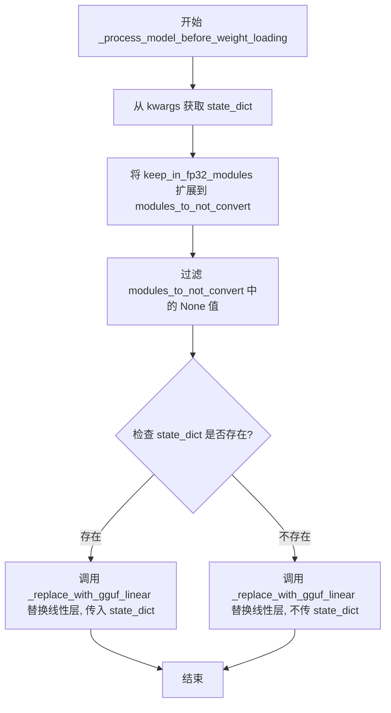

#### 带注释源码

```python
def _process_model_before_weight_loading(
    self,
    model: "ModelMixin",
    device_map,
    keep_in_fp32_modules: list[str] = [],
    **kwargs,
):
    """
    在模型权重加载之前进行预处理，将模型中的线性层替换为 GGUF 量化格式
    
    参数:
        model: 需要进行 GGUF 量化的模型实例
        device_map: 设备映射配置，指定模型各层到不同设备的分配
        keep_in_fp32_modules: 需要保持 FP32 精度的模块名称列表，这些模块不会被量化
        **kwargs: 额外的关键字参数，其中可能包含 state_dict 用于权重加载
    
    返回:
        None: 该方法直接修改模型结构，不返回任何值
    """
    # 从 kwargs 中提取可选的 state_dict 参数，用于后续的线性层替换
    state_dict = kwargs.get("state_dict", None)

    # 将传入的 keep_in_fp32_modules 列表添加到实例的 modules_to_not_convert 中
    # 这样可以累积多个来源的 FP32 模块列表
    self.modules_to_not_convert.extend(keep_in_fp32_modules)
    
    # 过滤掉 modules_to_not_convert 列表中的 None 值，防止后续处理出现异常
    self.modules_to_not_convert = [module for module in self.modules_to_not_convert if module is not None]

    # 调用工具函数 _replace_with_gguf_linear 执行核心的线性层替换操作
    # 该函数会遍历模型的所有线性层，并根据量化配置将其替换为 GGUF 格式的量化线性层
    # modules_to_not_convert 参数确保指定的模块不会被量化，保持原始精度
    _replace_with_gguf_linear(
        model,                                          # 要处理的模型实例
        self.compute_dtype,                             # 计算数据类型（量化后的数据类型）
        state_dict,                                     # 模型状态字典（可能包含预量化权重）
        modules_to_not_convert=self.modules_to_not_convert  # 不进行量化的模块列表
    )
```


### `GGUFQuantizer._process_model_after_weight_loading`

该方法是 GGUFQuantizer 类的后处理方法，在权重加载完成后被调用。当前实现直接返回原始模型，未执行任何实际操作，保留此接口以符合量化框架的扩展性要求。

参数：

- `self`：隐式参数，GGUFQuantizer 实例本身
- `model`：`ModelMixin`，需要处理的模型实例
- `**kwargs`：可变关键字参数，包含额外的上下文参数（如 `device_map`、`original_loaded_state` 等，但当前方法未使用）

返回值：`ModelMixin`，处理后的模型实例（当前实现直接返回输入的 model）

#### 流程图

```mermaid
flowchart TD
    A[开始 _process_model_after_weight_loading] --> B[接收 model 和 kwargs]
    B --> C[直接返回 model]
    C --> D[结束]
```

#### 带注释源码

```python
def _process_model_after_weight_loading(self, model: "ModelMixin", **kwargs):
    """
    在模型权重加载完成后执行的后处理操作。
    
    该方法是量化框架的钩子方法，用于在权重加载后对模型进行额外处理。
    当前 GGUFQuantizer 实现中，此方法为最小化实现，仅返回原始模型，
    实际的量化权重处理已在 _process_model_before_weight_loading 和
    create_quantized_param 阶段完成。
    
    参数:
        model (ModelMixin): 已加载权重的模型实例
        **kwargs: 额外的关键字参数，由量化框架传入，当前未使用
        
    返回:
        ModelMixin: 处理后的模型实例
    """
    return model
```

#### 上下文信息

该方法是 `GGUFQuantizer` 类的一部分，继承自 `DiffusersQuantizer`。在 GGUF 量化流程中：

- `_process_model_before_weight_loading`：在权重加载前将模型中的 Linear 层替换为 GGUF 兼容层
- `_process_model_after_weight_loading`：在权重加载后执行清理工作（本方法）
- `create_quantized_param`：实际创建量化参数并将其绑定到模型模块

当前实现为占位符，可能为未来功能扩展预留。


### `GGUFQuantizer._dequantize`

该方法负责将 GGUF 量化后的模型权重进行反量化，恢复为原始精度（fp32），并处理模型设备迁移逻辑。

参数：

- `model`：`ModelMixin`，待反量化的模型实例

返回值：`ModelMixin`，反量化并恢复线性层后的模型

#### 流程图

```mermaid
flowchart TD
    A[开始 _dequantize] --> B{模型是否在 CPU?}
    B -->|是| C[记录日志说明情况]
    C --> D[获取当前加速器设备]
    D --> E[将模型移动到加速器设备]
    E --> F[调用 _dequantize_gguf_and_restore_linear]
    B -->|否| F
    F --> G{模型原本在 CPU?}
    G -->|是| H[将模型移回 CPU]
    H --> I[返回模型]
    G -->|否| I
    I[结束]
```

#### 带注释源码

```python
def _dequantize(self, model):
    """
    将 GGUF 量化后的模型进行反量化，恢复原始精度并重建线性层。

    参数:
        model: 待反量化的模型实例

    返回:
        反量化并恢复线性层后的模型
    """
    # 检查模型当前是否在 CPU 上运行
    # 这可能是由于 enable_model_cpu_offload() 导致的
    is_model_on_cpu = model.device.type == "cpu"
    
    if is_model_on_cpu:
        # 记录日志说明需要临时移动模型到加速器
        logger.info(
            "Model was found to be on CPU (could happen as a result of `enable_model_cpu_offload()`). "
            "So, moving it to accelerator. After dequantization, will move the model back to CPU again "
            "to preserve the previous device."
        )
        
        # 获取当前加速器设备
        # 优先使用 torch.accelerator（较新 API），否则回退到 torch.cuda
        device = (
            torch.accelerator.current_accelerator()
            if hasattr(torch, "accelerator")
            else torch.cuda.current_device()
        )
        
        # 将模型临时移动到加速器设备上进行反量化
        model.to(device)

    # 执行核心反量化操作：将 GGUF 格式权重反量化并恢复为 nn.Linear 层
    # 同时保留 modules_to_not_convert 列表中指定的模块不进行反量化
    model = _dequantize_gguf_and_restore_linear(model, self.modules_to_not_convert)
    
    # 如果模型原本在 CPU 上，反量化完成后移回 CPU 以保持原有设备状态
    if is_model_on_cpu:
        model.to("cpu")
    
    return model
```

## 关键组件


### GGUFQuantizer

核心量化器类，继承自DiffusersQuantizer，负责处理GGUF格式模型的量化与反量化操作。

### 张量索引与惰性加载

通过create_quantized_param方法实现，使用get_module_from_name从模型中获取模块和张量名称，然后通过param_value.to(target_device)将参数移动到目标设备，实现惰性加载。

### 反量化支持

_dequantize方法实现反量化功能，支持CPU和GPU设备，能在反量化前后自动处理设备迁移，并调用_dequantize_gguf_and_restore_linear恢复线性层。

### 量化策略

通过check_quantized_param_shape验证量化参数形状，check_if_quantized_param检查参数类型，以及_process_model_before_weight_loading中_replace_with_gguf_linear替换原有线性层为量化版本。

### 环境验证

validate_environment方法检查accelerate和gguf库的版本要求，确保环境兼容。

### 内存与数据类型管理

adjust_max_memory调整最大内存使用，adjust_target_dtype强制使用torch.uint8，update_torch_dtype根据配置更新数据类型。

### 模块过滤机制

modules_to_not_convert字段和keep_in_fp32_modules参数指定哪些模块保持FP32精度，用于保护关键层。


## 问题及建议


### 已知问题

-   **文档字符串缺失**：整个类及所有方法都缺少文档字符串（docstring），无法快速理解类字段、方法的用途和参数含义，增加维护成本。
-   **硬编码的魔法数字**：`adjust_max_memory` 方法中直接使用 `0.90` 作为内存调整系数，缺乏常量定义或配置入口，难以解释为何选择该值。
-   **未使用的参数**：`validate_environment` 方法接收 `*args` 和 `**kwargs` 但完全未使用；`check_quantized_param` 方法接收 `model`、`param_name`、`state_dict`、`**kwargs` 等多个参数但仅使用了 `param_value` 的类型检查。
-   **`is_serializable` 属性硬编码返回 False**：该属性直接返回 `False`，未提供可配置的序列化支持或解释说明，可能导致下游调用者无法序列化该量化器配置。
-   **`create_quantized_param` 方法逻辑冗余**：使用两个独立的 `if` 语句分别处理 `_parameters` 和 `_buffers`，而这两个分支互斥（一个参数不可能既在 `_parameters` 又在 `_buffers` 中），应使用 `elif` 提升可读性。
-   **错误信息不够具体**：`check_quantized_param_shape` 抛出异常时仅包含形状信息，未提供量化类型、原始参数名等调试所需的上下文信息。
-   **类型注解不一致**：多处使用字符串形式的类型注解（如 `"torch.dtype"`），虽然代码已导入 `from __future__ import annotations`，但这种做法与直接的类型注解混用，风格不统一。

### 优化建议

-   **添加文档字符串**：为类、类字段和每个方法添加规范的文档字符串，说明功能、参数、返回值和可能的异常。
-   **提取魔法数字**：将 `0.90` 定义为类常量或从量化配置中读取，并添加注释说明其用途。
-   **清理未使用参数**：移除 `validate_environment` 中未使用的 `*args` 和 `**kwargs`；简化 `check_quantized_param` 方法签名，仅保留必要的参数。
-   **改进 `is_serializable` 设计**：考虑通过量化配置控制序列化行为，或在返回 `False` 时记录日志说明原因。
-   **优化条件分支**：在 `create_quantized_param` 中使用 `elif` 替代连续的 `if` 语句，避免不必要的条件判断。
-   **增强错误信息**：在 `check_quantized_param_shape` 的异常信息中加入量化类型（`quant_type`）和参数名称，便于定位问题。
-   **统一类型注解风格**：统一使用 `from __future__ import annotations` 带来的前向引用语法，避免字符串类型注解与直接类型注解混用。

## 其它


### 设计目标与约束

本模块的主要设计目标是将GGUF（Georg G. F. Quantization）量化格式集成到Diffusers库中，使得用户能够加载和使用预量化的大语言模型。核心约束包括：1）仅支持torch.uint8作为目标数据类型；2）依赖accelerate>=0.26.0和gguf>=0.10.0；3）不支持训练（is_trainable返回False）；4）不支持序列化（is_serializable返回False）；5）模块需要保持FP32精度（use_keep_in_fp32_modules=True）。

### 错误处理与异常设计

本模块的异常处理设计如下：1）在`validate_environment`方法中，若缺少必要依赖（accelerate或gguf）或版本不满足要求，将抛出`ImportError`；2）在`check_quantized_param_shape`方法中，若推断的量化形状与实际加载参数形状不匹配，将抛出`ValueError`；3）在`create_quantized_param`方法中，若目标模块中不存在指定的参数或缓冲区，将抛出`ValueError`；4）所有torch相关操作均依赖运行时环境检查（通过`is_torch_available()`和`is_gguf_available()`确保依赖可用）。

### 数据流与状态机

数据流主要分为三个阶段：加载前处理、权重加载和解量化。在`_process_model_before_weight_loading`阶段，调用`_replace_with_gguf_linear`替换模型中的线性层为GGUF量化兼容层；在权重加载阶段，通过`check_if_quantized_param`、`check_quantized_param_shape`和`create_quantized_param`协作完成参数验证和创建；在`_dequantize`阶段，调用`_dequantize_gguf_and_restore_linear`将量化权重还原为原始精度。状态转换：从正常模式→量化模式→解量化模式。

### 外部依赖与接口契约

本模块的外部依赖包括：1）`diffusers.base.DiffusersQuantizer`：基类，定义量化器接口；2）`accelerate`：>=0.26.0，用于模型加载和设备管理；3）`gguf`：>=0.10.0，用于解析GGUF格式文件；4）`torch`：用于张量操作；5）本地模块`.utils`：包含GGML_QUANT_SIZES、GGUFParameter、_dequantize_gguf_and_restore_linear等工具函数。接口契约：所有继承自DiffusersQuantizer的量化器需实现validate_environment、adjust_max_memory、adjust_target_dtype、update_torch_dtype、check_quantized_param_shape、check_if_quantized_param、create_quantized_param、_process_model_before_weight_loading、_process_model_after_weight_loading和_dequantize方法。

### 性能考虑与优化空间

当前实现的主要性能考量：1）内存优化：`adjust_max_memory`方法将可用内存降低10%以留出缓冲区空间；2）设备处理：在CPU和加速器之间移动模型时会记录日志。潜在优化空间：1）解量化时的设备迁移可以更智能地处理多GPU场景；2）可以添加量化参数缓存以减少重复计算；3）`is_serializable`返回False表明序列化功能未完成实现，这是未来的技术债务；4）可以添加异步加载支持以提升大规模模型的加载速度。

### 版本兼容性

本模块明确要求的版本约束：accelerate>=0.26.0，gguf>=0.10.0，torch（通过is_torch_available()检查）。compute_dtype支持多种torch数据类型（如torch.float16、torch.bfloat16等），但最终都会在adjust_target_dtype中被规范化为torch.uint8进行量化存储。

### 安全性考虑

本模块的安全性考量：1）依赖版本检查可以防止使用已知存在漏洞的旧版本；2）参数形状验证可以防止加载恶意构造的量化模型导致内存溢出；3）模块名称验证（modules_to_not_convert）可以防止关键模块被意外量化。潜在风险：当前未对state_dict进行深度验证，恶意构造的GGUF文件可能导致未知行为。

### 配置参数说明

quantization_config参数：1）compute_dtype：指定计算时使用的数据类型（如torch.float16）；2）pre_quantized：指示模型是否已经过预量化；3）modules_to_not_convert：指定不需要量化的模块列表（支持字符串或列表格式）。keep_in_fp32_modules参数：在_process_model_before_weight_loading中传入，指定需要保持FP32精度的额外模块。

### 使用示例

```python
from diffusers import AutoModelForCausalLM
from diffusers.quantizers.gguf_quantizer import GGUFQuantizer

# 加载预量化模型
model = AutoModelForCausalLM.from_pretrained(
    "model_path",
    quantization_config=GGUFQuantizerConfig(...),
    device_map="auto"
)
# 模型自动进行解量化处理
```

### 测试策略建议

建议添加以下测试用例：1）环境验证失败的单元测试（缺少accelerate或gguf）；2）参数形状不匹配的错误场景测试；3）不同compute_dtype配置下的兼容性测试；4）多模块skip列表的功能测试；5）CPU和CUDA设备上的解量化流程测试；6）大规模模型的内存使用基准测试。


    