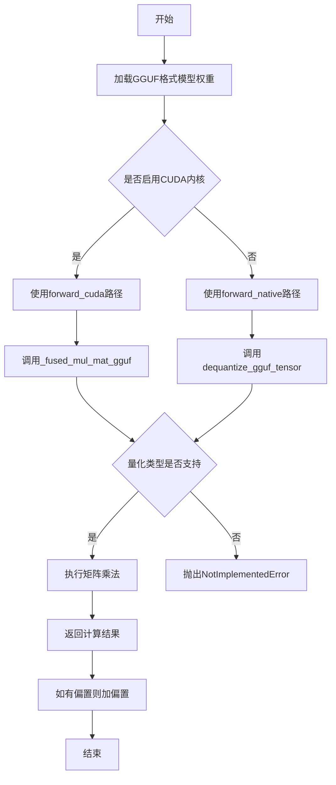
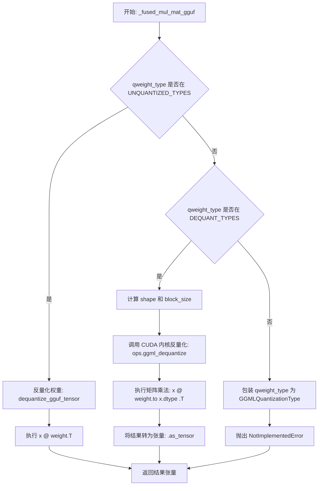
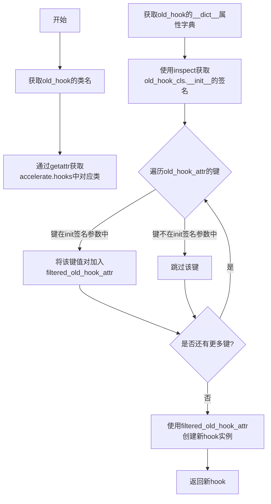
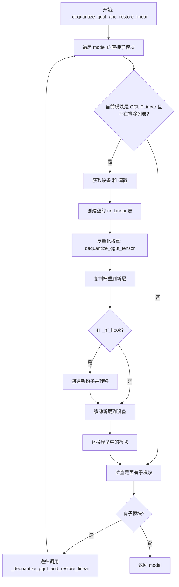
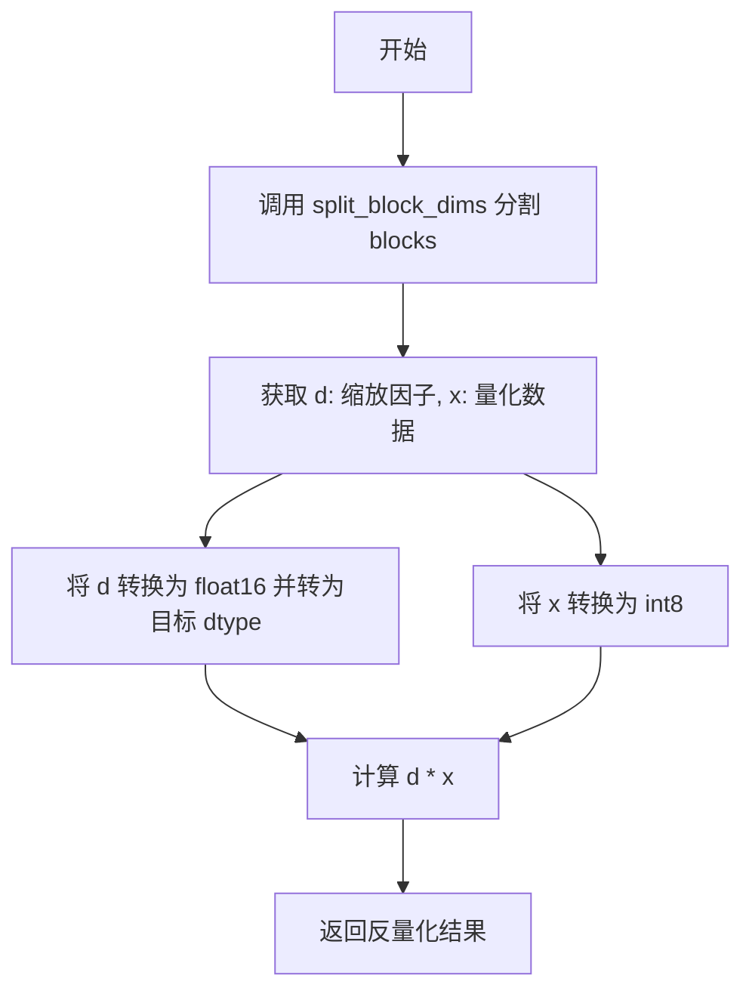
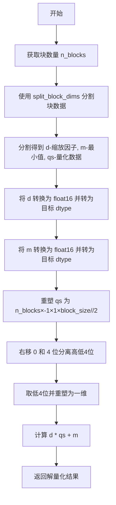
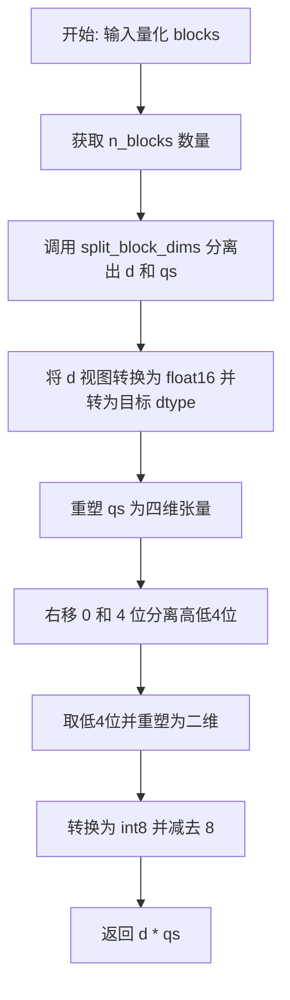
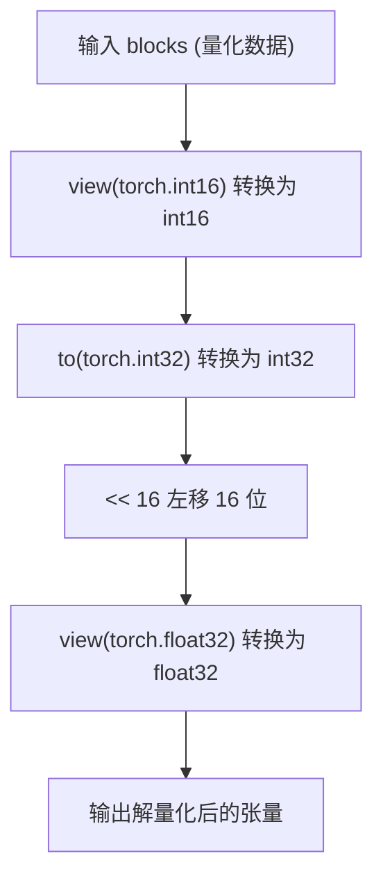
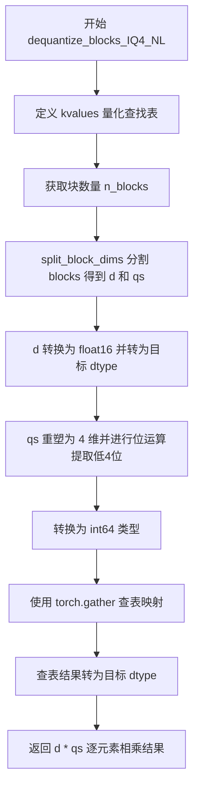

# `diffusers\src\diffusers\quantizers\gguf\utils.py` 详细设计文档

这是一个GGUF量化格式的PyTorch量化器实现，用于在HuggingFace Diffusers中加载和处理GGUF格式的量化模型权重，支持多种量化类型（Q2_K到Q8_1及IQ系列），并提供CUDA内核加速的反量化操作。

## 整体流程



## 类结构

```
GGUFParameter (torch.nn.Parameter子类)
└── 封装量化参数信息

GGUFLinear (nn.Linear子类)
├── forward (前向传播入口)
├── forward_native (CPU/非CUDA路径)
└── forward_cuda (CUDA加速路径)
```

## 全局变量及字段


### `can_use_cuda_kernels`
    
CUDA内核是否可用

类型：`bool`
    


### `ops`
    
CUDA内核操作对象

类型：`object`
    


### `UNQUANTIZED_TYPES`
    
未量化类型集合

类型：`set`
    


### `STANDARD_QUANT_TYPES`
    
标准量化类型集合

类型：`set`
    


### `KQUANT_TYPES`
    
K量化类型集合

类型：`set`
    


### `IMATRIX_QUANT_TYPES`
    
I矩阵量化类型集合

类型：`set`
    


### `DEQUANT_TYPES`
    
可反量化类型集合

类型：`set`
    


### `MMVQ_QUANT_TYPES`
    
MMVQ类型集合

类型：`set`
    


### `MMQ_QUANT_TYPES`
    
MMQ类型集合

类型：`set`
    


### `QK_K`
    
K量化块大小常量(256)

类型：`int`
    


### `K_SCALE_SIZE`
    
K缩放大小常量(12)

类型：`int`
    


### `GGML_QUANT_SIZES`
    
量化大小映射

类型：`dict`
    


### `dequantize_functions`
    
反量化函数映射

类型：`dict`
    


### `SUPPORTED_GGUF_QUANT_TYPES`
    
支持的量化类型列表

类型：`list`
    


### `GGUFParameter.quant_type`
    
量化类型

类型：`GGMLQuantizationType`
    


### `GGUFParameter.quant_shape`
    
量化后的形状

类型：`tuple`
    


### `GGUFLinear.compute_dtype`
    
计算数据类型

类型：`torch.dtype`
    


### `GGUFLinear.device`
    
设备

类型：`torch.device`
    
    

## 全局函数及方法


### `_fused_mul_mat_gguf`

该函数是GGUF量化格式的核心融合矩阵乘法运算函数，根据权重 quantization type 选择最优计算路径：对未量化权重直接反量化后运算，对量化权重调用CUDA内核或fallback到反量化计算，对不支持的类型抛出异常。

参数：
- `x`：`torch.Tensor`，输入张量，通常为隐藏状态或特征向量
- `qweight`：`torch.Tensor`，量化后的权重张量，包含GGUF格式的压缩权重数据
- `qweight_type`：`int`，量化类型枚举值，对应`gguf.GGMLQuantizationType`的不同量化算法

返回值：`torch.Tensor`，返回输入与量化权重的矩阵乘法结果张量

#### 流程图



#### 带注释源码

```python
def _fused_mul_mat_gguf(x: torch.Tensor, qweight: torch.Tensor, qweight_type: int) -> torch.Tensor:
    # 对于 fp16/bf16 等未量化类型，直接反量化后进行矩阵乘法
    # 无需调用任何 CUDA 内核，因为这些类型已经是半精度格式
    if qweight_type in UNQUANTIZED_TYPES:
        # 调用反量化函数将量化权重还原为标准张量
        weight = dequantize_gguf_tensor(qweight)
        # 执行标准的矩阵乘法运算 (x @ weight.T)
        return x @ weight.T

    # ============================================================
    # TODO(Isotr0py): GGUF 的 MMQ 和 MMVQ 实现针对连续批处理设计，
    # 与 diffusers 的批处理方式不兼容，因此当前版本已禁用。
    # 保留代码以便将来支持多矩阵查询(MMQ)优化。
    # ============================================================
    # elif qweight_type in MMVQ_QUANT_TYPES:
    #     y = ops.ggml_mul_mat_vec_a8(qweight, x, qweight_type, qweight.shape[0])
    # elif qweight_type in MMQ_QUANT_TYPES:
    #     y = ops.ggml_mul_mat_a8(qweight, x, qweight_type, qweight.shape[0])

    # 如果没有可用的 MMQ 内核，则回退到反量化方式计算
    # 支持 STANDARD_QUANT_TYPES、KQUANT_TYPES 和 IMATRIX_QUANT_TYPES
    if qweight_type in DEQUANT_TYPES:
        # 从 GGUF 库获取指定量化类型的块大小和类型大小
        block_size, type_size = gguf.GGML_QUANT_SIZES[qweight_type]
        # 计算反量化后的权重形状：(输出维度, 输入维度还原)
        shape = (qweight.shape[0], qweight.shape[1] // type_size * block_size)
        # 调用自定义 CUDA 内核执行反量化操作
        weight = ops.ggml_dequantize(qweight, qweight_type, *shape)
        # 将权重转换为与输入相同的 dtype 后执行矩阵乘法
        # 注意：需要转置权重矩阵 (weight.T) 以适配线性层计算
        y = x @ weight.to(x.dtype).T
    else:
        # 处理不支持的量化类型，用于捕获 llama.cpp 新增的量化格式
        # 将整数包装为 GGMLQuantizationType 枚举以验证其有效性
        qweight_type = gguf.GGMLQuantizationType(qweight_type)
        raise NotImplementedError(f"Unsupported GGUF quantization type: {qweight_type}")
    
    # 将计算结果从自定义张量格式转换为标准 PyTorch 张量
    return y.as_tensor()
```


### `_create_accelerate_new_hook`

该函数用于根据已有的 accelerate hook 对象创建一个新的 hook 副本。它通过检查旧 hook 的初始化签名，过滤出符合初始化参数要求的属性，然后用这些属性实例化一个新的同类型 hook 对象。此方法在将 GGUFLinear 模块替换回原始的 nn.Linear 模块时，用于保留原有的 accelerate 钩子。

参数：

- `old_hook`：`Any`（实际上应该是 `accelerate.hooks` 模块中的某个 Hook 类实例），需要复制的原始 accelerate hook 对象

返回值：`Any`（返回新创建的 hook 对象，与原始 hook 类型相同），返回新创建的 hook 副本，保留了原始 hook 在初始化时需要的属性

#### 流程图



#### 带注释源码

```
def _create_accelerate_new_hook(old_hook):
    r"""
    Creates a new hook based on the old hook. Use it only if you know what you are doing ! This method is a copy of:
    https://github.com/huggingface/peft/blob/748f7968f3a31ec06a1c2b0328993319ad9a150a/src/peft/utils/other.py#L245 with
    some changes
    """
    # 获取原始hook对象的类名，然后在accelerate.hooks模块中查找同名的类
    # 例如如果old_hook是SomeHook类的实例，则获取accelerate.hooks.SomeHook类
    old_hook_cls = getattr(accelerate.hooks, old_hook.__class__.__name__)
    
    # 获取原始hook实例的__dict__属性字典，包含所有实例属性
    old_hook_attr = old_hook.__dict__
    
    # 初始化一个空字典用于存储过滤后的属性
    filtered_old_hook_attr = {}
    
    # 使用inspect模块获取原始hook类的__init__方法的签名
    # 这样可以知道创建该类实例需要哪些参数
    old_hook_init_signature = inspect.signature(old_hook_cls.__init__)
    
    # 遍历原始hook的所有属性
    for k in old_hook_attr.keys():
        # 只保留那些在__init__签名中存在的参数
        # 这样可以过滤掉一些非必要的实例属性
        if k in old_hook_init_signature.parameters:
            filtered_old_hook_attr[k] = old_hook_attr[k]
    
    # 使用过滤后的属性创建新的hook实例
    new_hook = old_hook_cls(**filtered_old_hook_attr)
    
    # 返回新创建的hook对象
    return new_hook
```


### `_replace_with_gguf_linear`

该函数是一个递归函数，用于遍历模型结构并将符合条件的 `nn.Linear` 层替换为自定义的 `GGUFLinear` 层，以支持 GGUF 量化格式的权重。它会检查状态字典中的权重是否为 `GGUFParameter` 类型，并对模型进行就地替换。

参数：

-  `model`：`torch.nn.Module`，要转换的 PyTorch 模型
-  `compute_dtype`：`torch.dtype`，用于计算的数据类型（如 `torch.float16`）
-  `state_dict`：`dict`，包含模型权重的状态字典，其中键为权重名称，值为 `GGUFParameter` 或普通张量
-  `prefix`：`str`，模块层级的前缀路径，用于递归跟踪，默认为空字符串
-  `modules_to_not_convert`：`list`，不进行转换的模块名称列表，默认为空列表

返回值：`torch.nn.Module`，返回转换后的模型（实际上是对输入模型的原地修改）

#### 流程图

```mermaid
flowchart TD
    A[开始 _replace_with_gguf_linear] --> B{模型是否有子模块?}
    B -->|否| Z[返回 model]
    B -->|是| C[遍历模型的子模块]
    C --> D[递归调用 _replace_with_gguf_linear]
    D --> E{当前模块是 nn.Linear<br/>且应在 GGUF 中转换<br/>且不在排除列表中?}
    E -->|否| C
    E -->|是| F{是否使用 accelerate?}
    F -->|是| G[使用 init_empty_weights 上下文]
    F -->|否| H[使用 nullcontext 上下文]
    G --> I[在上下文中创建 GGUFLinear]
    H --> I
    I --> J[设置 source_cls 属性]
    J --> K[设置 requires_grad_(False)]
    K --> C
    C --> L{遍历完成?}
    L -->|否| C
    L -->|是| Z
```

#### 带注释源码

```python
def _replace_with_gguf_linear(model, compute_dtype, state_dict, prefix="", modules_to_not_convert=[]):
    """
    递归地将模型中的 nn.Linear 层替换为 GGUFLinear 层
    
    参数:
        model: 要转换的 PyTorch 模型
        compute_dtype: 计算时使用的数据类型
        state_dict: 模型权重状态字典
        prefix: 模块路径前缀
        modules_to_not_convert: 不需要转换的模块列表
    """
    
    def _should_convert_to_gguf(state_dict, prefix):
        """判断该模块是否应该被转换为 GGUF 格式"""
        weight_key = prefix + "weight"
        # 检查权重键是否存在且为 GGUFParameter 类型
        return weight_key in state_dict and isinstance(state_dict[weight_key], GGUFParameter)

    # 获取模型的直接子模块
    has_children = list(model.children())
    # 如果没有子模块（已经是叶子节点），直接返回
    if not has_children:
        return

    # 遍历模型的所有子模块
    for name, module in model.named_children():
        # 构建当前模块的前缀路径
        module_prefix = prefix + name + "."
        
        # 递归处理子模块
        _replace_with_gguf_linear(module, compute_dtype, state_dict, module_prefix, modules_to_not_convert)

        # 检查当前模块是否符合转换条件
        if (
            isinstance(module, nn.Linear)  # 是线性层
            and _should_convert_to_gguf(state_dict, module_prefix)  # 权重是 GGUF 量化格式
            and name not in modules_to_not_convert  # 不在排除列表中
        ):
            # 根据是否使用 accelerate 选择上下文管理器
            ctx = init_empty_weights if is_accelerate_available() else nullcontext
            with ctx():
                # 创建 GGUFLinear 替换原来的 Linear
                model._modules[name] = GGUFLinear(
                    module.in_features,
                    module.out_features,
                    module.bias is not None,
                    compute_dtype=compute_dtype,
                )
            # 保存原始模块类型，以便后续恢复
            model._modules[name].source_cls = type(module)
            # 禁用梯度计算，避免意外的梯度错误
            model._modules[name].requires_grad_(False)

    return model
```


### `_dequantize_gguf_and_restore_linear`

该函数是一个递归函数，用于将模型中所有的 GGUFLinear 层反量化为标准的 `nn.Linear` 层。它遍历模型的子模块，将量化权重通过 `dequantize_gguf_tensor` 还原为浮点张量，并保留原始的偏置和设备信息，同时处理与 accelerate 库相关的钩子迁移。

参数：

-  `model`：`torch.nn.Module`，需要处理的模型对象
-  `modules_to_not_convert`：`list`，模块名称列表，这些模块将被跳过，不进行反量化转换

返回值：`torch.nn.Module`，完成反量化转换后的模型对象

#### 流程图



#### 带注释源码

```python
def _dequantize_gguf_and_restore_linear(model, modules_to_not_convert=[]):
    """
    将模型中的 GGUFLinear 层反量化为标准的 nn.Linear 层
    
    参数:
        model: torch.nn.Module - 需要处理的模型对象
        modules_to_not_convert: list - 跳过转换的模块名称列表
    
    返回:
        torch.nn.Module - 完成反量化后的模型
    """
    # 遍历模型的所有直接子模块
    for name, module in model.named_children():
        # 检查模块是否为 GGUFLinear 且不在排除列表中
        if isinstance(module, GGUFLinear) and name not in modules_to_not_convert:
            # 获取原始设备信息
            device = module.weight.device
            # 获取偏置项（如果有）
            bias = getattr(module, "bias", None)

            # 根据是否使用 accelerate 决定是否使用空权重上下文
            ctx = init_empty_weights if is_accelerate_available() else nullcontext
            with ctx():
                # 创建新的标准线性层，保持输入输出维度不变
                new_module = nn.Linear(
                    module.in_features,   # 输入特征数
                    module.out_features,  # 输出特征数
                    module.bias is not None,  # 是否使用偏置
                    device=device,         # 原始设备
                )
            
            # 关键步骤：将 GGUF 量化权重反量化为标准浮点张量
            new_module.weight = nn.Parameter(dequantize_gguf_tensor(module.weight))
            # 如果有偏置，保留原始偏置
            if bias is not None:
                new_module.bias = bias

            # 处理 accelerate 的钩子迁移
            # 当使用 accelerate 进行分布式计算时，需要迁移钩子到新模块
            if hasattr(module, "_hf_hook"):
                old_hook = module._hf_hook
                # 创建新的钩子对象
                new_hook = _create_accelerate_new_hook(old_hook)

                # 从原模块移除钩子，添加到新模块
                remove_hook_from_module(module)
                add_hook_to_module(new_module, new_hook)

            # 确保新模块在正确的设备上
            new_module.to(device)
            # 用新的标准 Linear 层替换原来的 GGUFLinear 层
            model._modules[name] = new_module

        # 递归处理子模块
        has_children = list(module.children())
        if has_children:
            _dequantize_gguf_and_restore_linear(module, modules_to_not_convert)

    return model
```


### `to_uint32`

将包含字节数据的张量重新组合为32位无符号整数的函数。该函数常用于GGUF量化张量的解量化过程中，将分块的字节数据合并为连续的32位值。

参数：

-  `x`：`torch.Tensor`，输入的张量，包含字节数据（通常为4个连续的字节列）

返回值：`torch.Tensor`，返回重新组合后的32位整数张量，形状为 (n, 1)，其中 n 为输入张量的行数

#### 流程图

```mermaid
flowchart TD
    A[输入张量 x] --> B[view(torch.uint8)<br/>将张量转换为字节视图]
    B --> C[to(torch.int32)<br/>转换为32位整数类型]
    C --> D[按位或运算<br/>x[:, 0] | x[:, 1] << 8<br/>| x[:, 2] << 16 | x[:, 3] << 24]
    D --> E[unsqueeze(1)<br/>在维度1增加一个维度]
    E --> F[返回重组后的32位整数张量]
```

#### 带注释源码

```python
def to_uint32(x):
    """
    将包含4字节数据的张量重新组合为32位无符号整数
    
    参数:
        x: 输入张量，应包含至少4列的字节数据
        
    返回:
        重新组合后的32位整数张量，形状为 (n, 1)
    """
    # Step 1: 将输入张量视图转换为无符号字节类型
    # 这允许我们按列访问各个字节
    x = x.view(torch.uint8).to(torch.int32)
    
    # Step 2: 通过位运算将4个连续的字节组合成32位整数
    # x[:, 0] - 最低有效字节 (LSB)
    # x[:, 1] << 8 - 第二个字节，左移8位
    # x[:, 2] << 16 - 第三个字节，左移16位
    # x[:, 3] << 24 - 最高有效字节 (MSB)，左移24位
    # 使用按位或运算符(|)将它们合并
    return (x[:, 0] | x[:, 1] << 8 | x[:, 2] << 16 | x[:, 3] << 24).unsqueeze(1)
```


### `split_block_dims`

该函数用于将输入的张量块（blocks）按指定的维度大小分割成多个子张量。它接收一个张量和若干个整数参数，根据这些参数计算每个分割块的大小，并将剩余部分作为最后一个块返回。

参数：

- `blocks`：`torch.Tensor`，输入的需要分割的张量块，通常是量化后的块数据
- `*args`：可变数量的 `int` 类型整数参数，表示每个分割块的维度大小

返回值：`Tuple[torch.Tensor]`，返回分割后的张量元组，每个元素是一个分割后的张量

#### 流程图

```mermaid
flowchart TD
    A[开始] --> B[获取 blocks 张量第二维度的大小 n_max]
    B --> C[将可变参数 args 转换为列表]
    C --> D[计算剩余维度大小: n_max - sum(args)]
    D --> E[将剩余维度大小追加到列表末尾]
    E --> F[调用 torch.split 按指定维度分割]
    F --> G[返回分割后的张量元组]
```

#### 带注释源码

```python
def split_block_dims(blocks, *args):
    """
    将输入的张量块按指定维度分割成多个子张量
    
    参数:
        blocks: 输入的张量，形状为 (n_blocks, n_max)，其中 n_max 是第二维度的大小
        *args: 可变数量的整数，每个整数指定一个分割块的大小
    
    返回:
        分割后的张量元组
    """
    # 获取输入张量第二维度（即列维度）的最大尺寸
    n_max = blocks.shape[1]
    
    # 将输入的可变参数转换为列表，作为分割维度大小
    dims = list(args)
    
    # 计算剩余的维度大小：总维度大小减去已指定的所有维度大小之和
    # 将其作为最后一个分割块的大小
    dims.append(n_max - sum(args))
    
    # 使用 torch.split 函数沿第二维度（dim=1）分割张量
    # 返回一个张量元组
    return torch.split(blocks, dims, dim=1)
```


### `get_scale_min`

该函数用于从 GGUF 量化格式的缩放块中提取缩放值(scales)和最小值(min)，主要应用于 Q4_K、Q5_K 等 K 类型的量化块解码过程。

参数：

- `scales`：`torch.Tensor`，输入的量化缩放张量，形状为 (n_blocks, 12)，包含压缩后的缩放和最小值数据

返回值：`Tuple[torch.Tensor, torch.Tensor]`，返回两个张量元组：
- 第一个张量 (sc)：缩放值，形状为 (n_blocks, 8)
- 第二个张量 (min)：最小值，形状为 (n_blocks, 8)

#### 流程图

```mermaid
flowchart TD
    A[开始: 输入 scales 张量] --> B[获取 n_blocks = scales.shape[0]]
    B --> C[将 scales 转换为 uint8 类型]
    C --> D[reshape 为 n_blocks x 3 x 4]
    D --> E[沿 dim=-2 分割为 d, m, m_d]
    E --> F[计算 sc: 合并 d 低6位 和 m_d 低4位与d高2位的组合]
    F --> G[计算 min: 合并 m 低6位 和 m_d 高4位与m高2位的组合]
    G --> H[reshape sc 和 min 为 n_blocks x 8]
    H --> I[返回元组 (sc, min)]
```

#### 带注释源码

```python
def get_scale_min(scales):
    """
    从 GGUF K类型量化块中提取缩放值和最小值
    
    参数:
        scales: 形状为 (n_blocks, 12) 的张量，包含压缩的缩放和最小值数据
        
    返回:
        (sc, min): 两个形状为 (n_blocks, 8) 的张量，分别代表缩放值和最小值
    """
    # 获取块数量
    n_blocks = scales.shape[0]
    
    # 将张量转换为 uint8 类型以便进行位操作
    scales = scales.view(torch.uint8)
    
    # 重塑为 (n_blocks, 3, 4) 的形状
    # 3行4列: 每行存储不同的量化参数
    scales = scales.reshape((n_blocks, 3, 4))
    
    # 沿倒数第二维分割为三个部分: d, m, m_d
    # d: 缩放因子
    # m: 最小值
    # m_d: 缩放和最小值的增量信息
    d, m, m_d = torch.split(scales, scales.shape[-2] // 3, dim=-2)
    
    # 计算缩放值 (sc):
    # - d & 0x3F: 取 d 的低6位
    # - (m_d & 0x0F) | ((d >> 2) & 0x30): 合并 m_d 低4位和 d 的高2位
    sc = torch.cat([d & 0x3F, (m_d & 0x0F) | ((d >> 2) & 0x30)], dim=-1)
    
    # 计算最小值 (min):
    # - m & 0x3F: 取 m 的低6位
    # - (m_d >> 4) | ((m >> 2) & 0x30): 合并 m_d 的高4位和 m 的高2位
    min = torch.cat([m & 0x3F, (m_d >> 4) | ((m >> 2) & 0x30)], dim=-1)
    
    # 重塑为最终形状 (n_blocks, 8)
    return (sc.reshape((n_blocks, 8)), min.reshape((n_blocks, 8)))
```


### `dequantize_blocks_Q8_0`

该函数用于将 GGUF 量化格式中的 Q8_0（8位量化）张量块进行反量化，通过分离缩放因子和数据块，将其转换为浮点张量。

参数：

- `blocks`：`torch.Tensor`，包含量化后的张量块数据
- `block_size`：`int`，每个块的元素数量
- `type_size`：`int`，类型的字节大小
- `dtype`：`torch.dtype`，可选，目标数据类型，默认为 None

返回值：`torch.Tensor`，反量化后的浮点张量

#### 流程图



#### 带注释源码

```
def dequantize_blocks_Q8_0(blocks, block_size, type_size, dtype=None):
    """
    反量化 Q8_0 格式的 GGUF 张量块
    
    Q8_0 量化格式:
    - 每个块包含 2 字节的缩放因子 (d) 和剩余的量化数据 (x)
    - 缩放因子以 float16 存储
    - 数据以 int8 存储
    - 反量化公式: result = d * x
    
    参数:
        blocks: 量化后的张量块，形状为 (n_blocks, type_size)
        block_size: 每个块的元素数量
        type_size: 类型的字节大小
        dtype: 目标数据类型，默认为 None
        
    返回:
        反量化后的浮点张量
    """
    
    # 分割张量块：将 blocks 按维度 1 分割
    # d: 前 2 个元素作为缩放因子（2 字节 = float16）
    # x: 剩余元素作为量化数据（int8）
    d, x = split_block_dims(blocks, 2)
    
    # 将缩放因子 d 从 float16 视图转换为目标 dtype
    # 如果 dtype 为 None，则保持 float16
    d = d.view(torch.float16).to(dtype)
    
    # 将量化数据 x 转换为 int8 类型
    x = x.view(torch.int8)
    
    # 元素级乘法：d * x
    # 这会根据缩放因子对量化数据进行缩放
    return d * x
```


### `dequantize_blocks_Q5_1`

将 GGUF Q5_1 量化格式的块解量化为浮点张量。Q5_1 是一种 5 位量化方案，每个块使用两个 float16 值分别存储缩放系数和最小值，用于更精确地表示量化数据。

参数：

- `blocks`：`torch.Tensor`，包含量化数据的张量，形状为 (n_blocks, type_size)
- `block_size`：`int`，每个量化块的元素数量
- `type_size`：`int`，每个块的字节大小
- `dtype`：`torch.dtype`（可选），输出张量的目标数据类型，默认为 None

返回值：`torch.Tensor`，解量化后的浮点张量，形状为 (n_blocks, block_size)

#### 流程图

```mermaid
flowchart TD
    A[开始] --> B[获取块数量 n_blocks]
    B --> C[分割块维度: d, m, qh, qs]
    C --> D[将 d 转换为 float16 并转换到目标 dtype]
    D --> E[将 m 转换为 float16 并转换到目标 dtype]
    E --> F[将 qh 转换为 uint32]
    F --> G[重塑 qh 并右移提取高位比特]
    G --> H[将 qh 与 1 按位与，保留最低位]
    H --> I[重塑 qs 并右移 0 和 4 位提取低4位]
    I --> J[qs 与 0x0F 按位与并重塑]
    J --> K[合并 ql 和 qh: qs = ql | qh << 4]
    K --> L[计算结果: (d * qs) + m]
    L --> M[结束]
```

#### 带注释源码

```python
def dequantize_blocks_Q5_1(blocks, block_size, type_size, dtype=None):
    # 获取块的数量
    n_blocks = blocks.shape[0]

    # 分割块维度：d(2字节缩放) + m(2字节最小值) + qh(4字节高位) + qs(剩余字节低位)
    # Q5_1 格式: d=2, m=2, qh=4, 其余为 qs
    d, m, qh, qs = split_block_dims(blocks, 2, 2, 4)
    
    # 将缩放系数 d 从 float16 转换为目标 dtype
    d = d.view(torch.float16).to(dtype)
    
    # 将最小值 m 从 float16 转换为目标 dtype
    m = m.view(torch.float16).to(dtype)
    
    # 将高位 qh 转换为 32 位无符号整数，便于位操作
    qh = to_uint32(qh)

    # 重塑 qh 为 (n_blocks, 1)，然后右移 0-31 位
    # 生成每个块的 32 位位置掩码，用于提取高位比特
    qh = qh.reshape((n_blocks, 1)) >> torch.arange(32, device=d.device, dtype=torch.int32).reshape(1, 32)
    
    # 重塑 qs 为 (n_blocks, -1, 1, block_size//2)，右移 0 和 4 位
    # 提取每个字节的低 4 位和高 4 位
    ql = qs.reshape((n_blocks, -1, 1, block_size // 2)) >> torch.tensor(
        [0, 4], device=d.device, dtype=torch.uint8
    ).reshape(1, 1, 2, 1)
    
    # 保留每位的最低位 (0 或 1)，表示高位比特的符号/值
    qh = (qh & 1).to(torch.uint8)
    
    # 保留低 4 位 (0-15)，并重塑为 (n_blocks, -1)
    ql = (ql & 0x0F).reshape((n_blocks, -1))

    # 合并低位和高位：ql | (qh << 4)
    # 重新组合成完整的 5 位值
    qs = ql | (qh << 4)
    
    # 计算解量化结果: (d * qs) + m
    # d 是缩放系数，m 是最小值偏移
    return (d * qs) + m
```


### `dequantize_blocks_Q5_0`

该函数是 GGUF Q5_0 量化格式的反量化实现，负责将压缩的 Q5_0 量化块解码为浮点张量。它首先分离量化块中的缩放因子（d）和量化数据（qh, qs），然后通过位运算重构完整的 8 位数值，最后与缩放因子相乘得到最终的反量化结果。

参数：

-  `blocks`：`torch.Tensor`，量化后的块数据，形状为 (n_blocks, type_size)，包含压缩的量化数据
-  `block_size`：`int`，量化块大小，对于 Q5_0 通常为 32
-  `type_size`：`int`，每个块的字节数，Q5_0 为 20
-  `dtype`：可选参数，指定输出数据类型，默认为 None

返回值：`torch.Tensor`，反量化后的浮点张量，形状为 (n_blocks, QK_K)

#### 流程图

```mermaid
flowchart TD
    A[开始: blocks, block_size, type_size, dtype] --> B[获取块数量: n_blocks = blocks.shape[0]]
    B --> C[分离数据块: split_block_dims(blocks, 2, 4)]
    C --> D[提取缩放因子: d = d.view.float16.to dtype]
    E[提取量化头: qh = to_uint32 qh] --> F[重塑qh: qh.reshape n_blocks, 1]
    F --> G[位运算提取高位: qh >> arange32 & 1]
    H[提取量化数据: ql = qs.reshape] --> I[位运算提取低位: ql >> [0,4] & 0x0F]
    G --> J[合并高低位: ql | qh << 4]
    I --> J
    J --> K[转换为有符号整型并偏移: to int8 - 16]
    K --> L[反量化计算: d * qs]
    D --> L
    L --> M[结束: 返回反量化张量]
```

#### 带注释源码

```python
def dequantize_blocks_Q5_0(blocks, block_size, type_size, dtype=None):
    """
    反量化 Q5_0 格式的量化块
    
    Q5_0 量化格式:
    - 每个块 32 个元素 (QK_K = 256 / 8)
    - 块结构: 2字节(d) + 4字节(qh) + 14字节(qs) = 20字节
    - d: 缩放因子 (float16)
    - qh: 高位信息 (4字节, 存储每8个元素的最高位)
    - qs: 量化数据 (每个元素4位, 存储低4位)
    """
    n_blocks = blocks.shape[0]  # 获取块数量

    # 分离数据块: 2字节缩放因子, 4字节量化头, 剩余为量化数据
    d, qh, qs = split_block_dims(blocks, 2, 4)
    
    # 将缩放因子从 float16 转换为目标 dtype
    d = d.view(torch.float16).to(dtype)
    
    # 将量化头转换为 32 位整数
    qh = to_uint32(qh)

    # 处理量化头: 重塑后通过位移提取每位
    # qh.reshape(n_blocks, 1) >> torch.arange(32) 将每位移位 0-31 位
    # 结果取最低位得到每个元素的最高位 (sign bit)
    qh = qh.reshape(n_blocks, 1) >> torch.arange(32, device=d.device, dtype=torch.int32).reshape(1, 32)
    
    # 处理量化数据: 重塑为 (n_blocks, -1, 1, block_size//2)
    # 每 2 个字节 (16 位) 存储 4 个元素的低 4 位
    # 位移 [0, 4] 分别提取低4位和高4位
    ql = qs.reshape(n_blocks, -1, 1, block_size // 2) >> torch.tensor(
        [0, 4], device=d.device, dtype=torch.uint8
    ).reshape(1, 1, 2, 1)

    # 提取并重塑: 取最低位作为高位，取低4位作为低位
    qh = (qh & 1).to(torch.uint8)
    ql = (ql & 0x0F).reshape(n_blocks, -1)

    # 合并高低位: 低4位 | (高位 << 4)
    # 转换为有符号整型并减去 16 (Q5_0 使用偏移量 16)
    qs = (ql | (qh << 4)).to(torch.int8) - 16
    
    # 反量化: 缩放因子乘以重构的量化值
    return d * qs
```


### `dequantize_blocks_Q4_1`

该函数用于将 GGUF 格式的 Q4_1 量化数据块解量化为浮点数张量。Q4_1 是一种4位量化格式，每个块包含2字节的缩放因子(d)、2字节的最小值(m)和剩余的量化数据(qs)，解量化时需要将量化数据解码后乘以缩放因子再加上最小值。

参数：

- `blocks`：`torch.Tensor`，包含量化数据的输入张量，形状为 (n_blocks, type_size)
- `block_size`：`int`，量化块的尺寸，用于计算量化数据的维度
- `type_size`：`int`，类型的字节大小，用于确定每个块的总字节数
- `dtype`：`torch.dtype`，可选参数，指定输出张量的目标数据类型，默认为 None

返回值：`torch.Tensor`，解量化后的浮点张量，形状为 (n_blocks, block_size)

#### 流程图



#### 带注释源码

```python
def dequantize_blocks_Q4_1(blocks, block_size, type_size, dtype=None):
    """
    解量化 Q4_1 量化格式的数据块
    
    Q4_1 量化格式结构:
    - d (2 bytes): 缩放因子
    - m (2 bytes): 最小值
    - qs (剩余): 量化数据，每4位表示一个值
    
    参数:
        blocks: 量化数据块，形状为 (n_blocks, type_size)
        block_size: 量化块大小
        type_size: 类型字节大小
        dtype: 目标数据类型
    
    返回:
        解量化后的浮点张量
    """
    # 获取块数量
    n_blocks = blocks.shape[0]

    # 使用 split_block_dims 分割块数据
    # 分割为: d(2字节), m(2字节), qs(剩余部分)
    d, m, qs = split_block_dims(blocks, 2, 2)
    
    # 将缩放因子 d 从 float16 转换为目标 dtype
    d = d.view(torch.float16).to(dtype)
    
    # 将最小值 m 从 float16 转换为目标 dtype
    m = m.view(torch.float16).to(dtype)

    # 重塑量化数据 qs 以便进行位操作
    # 将数据分为每组 block_size//2 个半字节
    qs = qs.reshape((n_blocks, -1, 1, block_size // 2)) >> torch.tensor(
        [0, 4], device=d.device, dtype=torch.uint8
    ).reshape(1, 1, 2, 1)
    
    # 提取低4位（0x0F 掩码）并重塑为一维
    # 这样可以将4位量化值解压为完整的字节值
    qs = (qs & 0x0F).reshape(n_blocks, -1)

    # 解量化公式: result = d * qs + m
    # d 是缩放因子，qs 是解码后的量化值，m 是最小值偏移
    return (d * qs) + m
```


### `dequantize_blocks_Q4_0`

该函数用于将 GGUF 量化格式中的 Q4_0 类型量化数据块反量化为浮点张量。Q4_0 是一种 4 位量化方法，每个量化块使用 2 字节存储缩放因子（d），其余字节存储 4 位量化值。函数通过分离缩放因子和解码量化值，最终返回反量化后的浮点结果。

参数：

- `blocks`：`torch.Tensor`，包含量化数据的输入张量，形状为 (n_blocks, type_size)
- `block_size`：`int`，量化块的大小
- `type_size`：`int`，类型大小（字节数）
- `dtype`：`torch.dtype`（可选），目标数据类型，默认为 None

返回值：`torch.Tensor`，反量化后的浮点张量，形状为 (n_blocks, QK_K)

#### 流程图



#### 带注释源码

```python
def dequantize_blocks_Q4_0(blocks, block_size, type_size, dtype=None):
    """
    反量化 Q4_0 格式的量化数据块
    
    Q4_0 格式结构:
    - 每个块 32 字节 (block_size=32)
    - 前 2 字节: 缩放因子 d (float16)
    - 后 30 字节: 量化值 (4 位/值, 共 64 个值)
    
    参数:
        blocks: 量化数据块，形状为 (n_blocks, type_size)
        block_size: 量化块大小
        type_size: 每个块的字节数
        dtype: 目标数据类型
    
    返回:
        反量化后的浮点张量，形状为 (n_blocks, 32)
    """
    # 获取块数量
    n_blocks = blocks.shape[0]

    # 分离缩放因子 d (2字节) 和量化值 qs (剩余字节)
    d, qs = split_block_dims(blocks, 2)
    
    # 将 d 转换为 float16，再转换为目标 dtype
    d = d.view(torch.float16).to(dtype)

    # 重塑量化值以便位操作
    # 将 qs 从 (n_blocks, 30) 重塑为 (n_blocks, -1, 1, block_size//2)
    # 即 (n_blocks, 15, 1, 16) - 假设 block_size=32
    qs = qs.reshape((n_blocks, -1, 1, block_size // 2)) >> torch.tensor(
        [0, 4], device=d.device, dtype=torch.uint8
    ).reshape((1, 1, 2, 1))
    
    # 提取低 4 位 (0x0F)，重塑为 (n_blocks, -1)
    # 每个字节包含两个 4 位值
    qs = (qs & 0x0F).reshape((n_blocks, -1)).to(torch.int8) - 8
    
    # 反量化: d * qs
    # 减去 8 是因为 Q4_0 使用有符号量化，范围为 [-8, 7]
    return d * qs
```


### `dequantize_blocks_Q6_K`

该函数实现GGUF量化格式中Q6_K量化类型的解量化操作，将包含4位量化值的压缩数据块解压缩为浮点张量，适用于大语言模型的权重解量化。

参数：

- `blocks`：`torch.Tensor`，量化后的数据块，包含ql(低4位)、qh(高4位)、scales(缩放因子)和d(缩放系数)四个部分的拼接数据
- `block_size`：`int`，量化块的大小（通常为256）
- `type_size`：`int`，量化类型的字节大小
- `dtype`：可选的`torch.dtype`，目标输出数据类型，默认为None

返回值：`torch.Tensor`，解量化后的浮点张量，形状为(n_blocks, QK_K)，其中QK_K=256

#### 流程图

```mermaid
flowchart TD
    A[开始] --> B[获取block数量<br/>n_blocks = blocks.shape[0]]
    B --> C[分割数据块<br/>split_block_dims]
    C --> D[提取ql qh scales d]
    D --> E[处理scales和d<br/>scales=int8转dtype<br/>d=float16转dtype<br/>d = d * scales]
    E --> F[处理ql低4位<br/>reshape并右移4位<br/>提取低4位]
    F --> G[处理qh高4位<br/>reshape并右移移位<br/>提取低2位]
    G --> H[合并ql和qh<br/>ql | (qh << 4)<br/>减32偏移]
    I[reshape到16组] --> J[计算最终结果<br/>d * q]
    H --> I
    J --> K[reshape到QK_K<br/>返回结果]
```

#### 带注释源码

```python
def dequantize_blocks_Q6_K(blocks, block_size, type_size, dtype=None):
    """
    解量化Q6_K量化格式的数据块
    
    Q6_K格式将256个值(QK_K)量化到每个值4位，使用以下布局：
    - ql: QK_K/2 = 128字节 (低4位)
    - qh: QK_K/4 = 64字节 (高4位)
    - scales: QK_K/16 = 16字节 (缩放因子)
    - d: 2字节 (缩放系数)
    """
    n_blocks = blocks.shape[0]  # 获取块数量

    # 分割数据块为四个部分：ql(低4位)、qh(高4位)、scales(缩放因子)、d(缩放系数)
    (
        ql,    # 低4位量化值: 128字节
        qh,    # 高4位量化值: 64字节  
        scales,# 缩放因子: 16字节
        d,     # 缩放系数: 2字节
    ) = split_block_dims(blocks, QK_K // 2, QK_K // 4, QK_K // 16)

    # 将scales转换为int8然后转到目标dtype
    scales = scales.view(torch.int8).to(dtype)
    # 将d转换为float16然后转到目标dtype，并乘以scales进行缩放
    d = d.view(torch.float16).to(dtype)
    d = (d * scales).reshape((n_blocks, QK_K // 16, 1))

    # 处理ql：提取低4位
    # reshape到(n_blocks, -1, 1, 64)，右移0和4位，提取低4位
    ql = ql.reshape((n_blocks, -1, 1, 64)) >> torch.tensor([0, 4], device=d.device, dtype=torch.uint8).reshape(
        (1, 1, 2, 1)
    )
    ql = (ql & 0x0F).reshape((n_blocks, -1, 32))
    
    # 处理qh：提取高4位中的2位
    # reshape到(n_blocks, -1, 1, 32)，右移0,2,4,6位，提取低2位
    qh = qh.reshape((n_blocks, -1, 1, 32)) >> torch.tensor([0, 2, 4, 6], device=d.device, dtype=torch.uint8).reshape(
        (1, 1, 4, 1)
    )
    qh = (qh & 0x03).reshape((n_blocks, -1, 32))
    
    # 合并ql和qh形成完整的6位量化值，并减去32偏移
    q = (ql | (qh << 4)).to(torch.int8) - 32
    q = q.reshape((n_blocks, QK_K // 16, -1))

    # 计算最终解量化结果：缩放系数乘以量化值
    return (d * q).reshape((n_blocks, QK_K))
```


### `dequantize_blocks_Q5_K`

解量化 Q5_K 量化类型的张量块，将量化数据转换为浮点表示。

参数：

- `blocks`：`torch.Tensor`，包含量化数据的输入张量，形状为 (n_blocks, type_size)
- `block_size`：`int`，每个块的元素数量
- `type_size`：`int`，每个元素的字节大小
- `dtype`：`torch.dtype` 或 `None`，可选参数，指定输出数据类型，默认为 None

返回值：`torch.Tensor`，解量化后的浮点张量，形状为 (n_blocks, QK_K)

#### 流程图

```mermaid
flowchart TD
    A[开始: dequantize_blocks_Q5_K] --> B[获取块数量: n_blocks = blocks.shape[0]]
    B --> C[分割数据块: split_block_dims]
    C --> D[提取 d, dmin, scales, qh, qs]
    D --> E[转换数据类型: d 和 dmin 转为 float16]
    E --> F[获取缩放值: get_scale_min]
    F --> G[计算 d = d * sc]
    G --> H[计算 dm = dmin * m]
    H --> I[处理低半位: ql = qs >> [0,4] & 0x0F]
    I --> J[处理高半位: qh = qh >> [0-7] & 0x01]
    J --> K[组合量化的 q: q = ql | qh << 4]
    K --> L[计算最终结果: (d * q - dm)]
    L --> M[reshape 为 n_blocks x QK_K]
    M --> N[返回解量化张量]
```

#### 带注释源码

```python
def dequantize_blocks_Q5_K(blocks, block_size, type_size, dtype=None):
    """
    解量化 Q5_K 量化类型的张量块
    
    Q5_K 量化格式使用以下结构：
    - 2 字节: d (缩放因子)
    - 2 字节: dmin (最小值)
    - K_SCALE_SIZE (12) 字节: scales (缩放和最小值编码)
    - QK_K//8 (32) 字节: qh (高位半字节)
    - QK_K//8 (32) 字节: qs (低位半字节)
    
    最终每块共 QK_K (256) 字节
    """
    # 获取块数量
    n_blocks = blocks.shape[0]

    # 分割数据块为: d, dmin, scales, qh, qs
    # 分割维度: 2, 2, K_SCALE_SIZE(12), QK_K//8(32)
    d, dmin, scales, qh, qs = split_block_dims(blocks, 2, 2, K_SCALE_SIZE, QK_K // 8)

    # 将 d 和 dmin 从 float16 转换为目标 dtype
    d = d.view(torch.float16).to(dtype)
    dmin = dmin.view(torch.float16).to(dtype)

    # 从 scales 中解码出 sc (缩放) 和 m (最小值)
    # 格式: 3个4字节组，分别包含 d 和 dmin 的缩放因子
    sc, m = get_scale_min(scales)

    # 应用缩放因子并 reshape 以便后续广播计算
    # (n_blocks, -1, 1) 形状用于与量化值相乘
    d = (d * sc).reshape((n_blocks, -1, 1))
    dm = (dmin * m).reshape((n_blocks, -1, 1))

    # 处理低位半字节 (ql)
    # 将 qs 按每 2 个半字节分组，右移 0 和 4 位，然后取低 4 位
    # reshape 为 (n_blocks, -1, 1, 32) 然后操作
    ql = qs.reshape((n_blocks, -1, 1, 32)) >> torch.tensor([0, 4], device=d.device, dtype=torch.uint8).reshape(
        (1, 1, 2, 1)
    )
    
    # 处理高位半字节 (qh)
    # 按 8 个一组进行移位操作
    qh = qh.reshape((n_blocks, -1, 1, 32)) >> torch.arange(0, 8, device=d.device, dtype=torch.uint8).reshape(
        (1, 1, 8, 1)
    )
    
    # 提取低位半字节 (4 位)
    ql = (ql & 0x0F).reshape((n_blocks, -1, 32))
    # 提取高位半字节 (1 位)
    qh = (qh & 0x01).reshape((n_blocks, -1, 32))
    
    # 组合成完整的量化值 (8 位)
    # 低位半字节在低 4 位，高位半字节在高 4 位
    q = ql | (qh << 4)

    # 计算最终解量化结果: d * q - dm
    # d 是缩放因子，q 是量化值，dm 是最小值偏移
    return (d * q - dm).reshape((n_blocks, QK_K))
```


### `dequantize_blocks_Q4_K`

该函数用于将 Q4_K 量化格式的权重块解量化恢复为浮点张量，是 GGUF 量化方案中 K 系列量化解量化的核心实现之一。

参数：

- `blocks`：`torch.Tensor`，包含量化数据的输入张量，形状为 (n_blocks, type_size)，其中每个 block 存储了压缩后的权重数据
- `block_size`：`int`，量化块的大小，用于确定每个 block 包含多少个权重元素
- `type_size`：`int`，量化类型的字节大小，用于计算原始张量形状
- `dtype`：`torch.dtype` 或 `None`，可选参数，指定输出张量的目标数据类型，默认为 None

返回值：`torch.Tensor`，解量化后的浮点张量，形状为 (n_blocks, QK_K)，其中 QK_K = 256

#### 流程图

```mermaid
flowchart TD
    A[输入: blocks, block_size, type_size, dtype] --> B[获取 n_blocks = blocks.shape[0]]
    B --> C[split_block_dims 分割块: d, dmin, scales, qs]
    C --> D[将 d 和 dmin 转为 float16 并转换 dtype]
    D --> E[get_scale_min 从 scales 提取 sc 和 m]
    E --> F[d = d * sc, 重塑为 (n_blocks, -1, 1)]
    F --> G[dm = dmin * m, 重塑为 (n_blocks, -1, 1)]
    G --> H[qs 移位 4 位并掩码提取低4位]
    H --> I[qs 重塑为 (n_blocks, -1, 32)]
    I --> J[计算: result = d * qs - dm]
    J --> K[重塑输出为 (n_blocks, QK_K)]
    K --> L[返回解量化张量]
```

#### 带注释源码

```python
def dequantize_blocks_Q4_K(blocks, block_size, type_size, dtype=None):
    """
    解量化 Q4_K 量化格式的权重块
    
    Q4_K 是一种混合量化方法，使用 4 位量化结合缩放因子和最小值来保持精度。
    每个 block 包含：2 字节 d（主缩放因子）+ 2 字节 dmin（最小值缩放）
    + 12 字节 scales（缩放系数）+ 剩余字节 qs（4 位量化数据）
    
    Args:
        blocks: 量化数据张量，形状 (n_blocks, type_size)
        block_size: 量化块大小
        type_size: 量化类型字节大小
        dtype: 目标输出数据类型
    
    Returns:
        解量化后的浮点张量，形状 (n_blocks, 256)
    """
    # 获取块数量
    n_blocks = blocks.shape[0]

    # 将输入块按指定维度分割为 d, dmin, scales, qs 四个部分
    # d: 2 字节，主缩放因子 (float16)
    # dmin: 2 字节，最小值缩放因子 (float16)
    # scales: 12 字节，缩放系数
    # qs: 剩余字节，4 位量化数据
    d, dmin, scales, qs = split_block_dims(blocks, 2, 2, K_SCALE_SIZE)
    
    # 将 d 和 dmin 从 float16 视图转换为目标 dtype
    d = d.view(torch.float16).to(dtype)
    dmin = dmin.view(torch.float16).to(dtype)

    # 从 scales 中提取缩放系数 sc 和最小值系数 m
    # 使用位操作从 12 字节的 scales 中重构 8 字节的 (sc, m)
    sc, m = get_scale_min(scales)

    # 应用缩放因子：d 乘以 sc，dmin 乘以 m
    # 重塑为 (n_blocks, -1, 1) 以便后续广播计算
    d = (d * sc).reshape((n_blocks, -1, 1))
    dm = (dmin * m).reshape((n_blocks, -1, 1))

    # 处理量化数据 qs
    # qs 原本存储为 4 位打包格式，每字节包含两个 4 位值
    # 通过右移 0 和 4 位分别提取低 4 位和高 4 位
    qs = qs.reshape((n_blocks, -1, 1, 32)) >> torch.tensor([0, 4], device=d.device, dtype=torch.uint8).reshape(
        (1, 1, 2, 1)
    )
    # 掩码提取低 4 位 (0x0F = 00001111)
    qs = (qs & 0x0F).reshape((n_blocks, -1, 32))

    # 计算最终解量化结果
    # 公式: result = d * qs - dm
    # 其中 d*qs 计算加权值，dm 为最小值偏移
    return (d * qs - dm).reshape((n_blocks, QK_K))
```


### `dequantize_blocks_Q3_K`

该函数是 GGUF Q3_K 量化格式的反量化实现，通过位操作从压缩的量化块中恢复原始的浮点权重数据。

参数：

-  `blocks`：`torch.Tensor`，包含量化数据的块 tensor，形状为 (n_blocks, type_size)
-  `block_size`：`int`，量化块大小
-  `type_size`：`int`，每个块包含的字节数
-  `dtype`：`torch.dtype`，可选，目标数据类型，默认为 None

返回值：`torch.Tensor`，反量化后的浮点数据，形状为 (n_blocks, QK_K)

#### 流程图

```mermaid
flowchart TD
    A[开始: dequantize_blocks_Q3_K] --> B[获取块数量 n_blocks]
    B --> C[split_block_dims 分割数据: hmask, qs, scales, d]
    C --> D[将 d 转换为 float16 并转到目标 dtype]
    E[分割 scales] --> F[处理低8位 scales: lscales]
    F --> G[右移 0,4 位并重塑]
    H[处理高8位 scales: hscales] --> I[右移 0,2,4,6 位并重塑]
    I --> J[合并 lscales 和 hscales]
    J --> K[应用掩码 0x0F 和移位]
    K --> L[转换为 int8 并减 32]
    L --> M[计算 dl = d * scales]
    N[处理 qs: ql] --> O[重塑并右移 0,2,4,6 位]
    O --> P[应用掩码 & 3]
    Q[处理 hmask: qh] --> R[重塑并按位右移]
    R --> S[应用掩码 & 1 并 XOR 1]
    S --> T[计算最终量化值: q = ql - (qh << 2)]
    T --> U[返回 dl * q 重塑后的结果]
    M --> U
    P --> T
```

#### 带注释源码

```python
def dequantize_blocks_Q3_K(blocks, block_size, type_size, dtype=None):
    """
    反量化 Q3_K 量化格式的块数据
    
    参数:
        blocks: 包含量化数据的 tensor，形状为 (n_blocks, type_size)
        block_size: 量化块大小
        type_size: 每个块的字节数
        dtype: 目标数据类型，可选
    
    返回:
        反量化后的浮点 tensor，形状为 (n_blocks, QK_K)
    """
    n_blocks = blocks.shape[0]  # 获取块数量

    # 分割量化块数据为: 头掩码、量化值、低精度值、缩放因子
    # QK_K // 8 = 32 (hmask), QK_K // 4 = 64 (qs), 12 (scales), 其余为 d
    hmask, qs, scales, d = split_block_dims(blocks, QK_K // 8, QK_K // 4, 12)
    
    # 将 d 从 float16 转换到目标 dtype
    d = d.view(torch.float16).to(dtype)

    # ======== 处理 scales (缩放因子) ========
    # 分割为低8位和高8位
    lscales, hscales = scales[:, :8], scales[:, 8:]
    
    # 低8位: 右移 0,4 位获取两个4位值
    lscales = lscales.reshape((n_blocks, 1, 8)) >> torch.tensor([0, 4], device=d.device, dtype=torch.uint8).reshape(
        (1, 2, 1)
    )
    lscales = lscales.reshape((n_blocks, 16))
    
    # 高8位: 右移 0,2,4,6 位获取四个2位值
    hscales = hscales.reshape((n_blocks, 1, 4)) >> torch.tensor(
        [0, 2, 4, 6], device=d.device, dtype=torch.uint8
    ).reshape((1, 4, 1))
    hscales = hscales.reshape((n_blocks, 16))
    
    # 合并: (lscales & 0x0F) | ((hscales & 0x03) << 4)
    scales = (lscales & 0x0F) | ((hscales & 0x03) << 4)
    # 转换为 int8 并减去 32 进行偏移
    scales = scales.to(torch.int8) - 32

    # 计算 dl: d * scales，形状为 (n_blocks, 16, 1)
    dl = (d * scales).reshape((n_blocks, 16, 1))

    # ======== 处理量化值 (ql 和 qh) ========
    # ql: 从 qs 中提取，4个2位值一组
    ql = qs.reshape((n_blocks, -1, 1, 32)) >> torch.tensor([0, 2, 4, 6], device=d.device, dtype=torch.uint8).reshape(
        (1, 1, 4, 1)
    )
    
    # qh: 从 hmask 中提取，8个1位值一组
    qh = hmask.reshape(n_blocks, -1, 1, 32) >> torch.arange(0, 8, device=d.device, dtype=torch.uint8).reshape(
        (1, 1, 8, 1)
    )
    
    # 应用掩码并重塑
    ql = ql.reshape((n_blocks, 16, QK_K // 16)) & 3  # 保留2位
    qh = (qh.reshape((n_blocks, 16, QK_K // 16)) & 1) ^ 1  # 保留1位并取反
    
    # 计算最终量化值: q = ql - (qh << 2)
    q = ql.to(torch.int8) - (qh << 2).to(torch.int8)

    # ======== 最终计算 ========
    # 返回 dl * q，重塑为 (n_blocks, QK_K)
    return (dl * q).reshape((n_blocks, QK_K))
```


### `dequantize_blocks_Q2_K`

解量化 GGUF Q2_K 量化格式的权重块，将量化数据还原为浮点张量。

参数：

- `blocks`：`torch.Tensor`，包含 Q2_K 量化数据的输入张量，形状为 (n_blocks, type_size)
- `block_size`：`int`，量化块大小（Q2_K 为 256）
- `type_size`：`int`，量化类型的字节大小（Q2_K 为 16）
- `dtype`：`torch.dtype`，可选，目标数据类型，默认为 None

返回值：`torch.Tensor`，解量化后的浮点张量，形状为 (n_blocks, QK_K)

#### 流程图

```mermaid
flowchart TD
    A[开始: 输入量化块] --> B[获取块数量 n_blocks]
    B --> C[split_block_dims 分割数据]
    C --> D[提取 scales, qs, d, dmin]
    D --> E[d 和 dmin 转换为 float16]
    E --> F[计算 dl = d * (scales & 0xF)]
    F --> G[计算 ml = dmin * (scales >> 4)]
    G --> H[创建 shift 张量 [0,2,4,6]]
    H --> I[qs 右移 shift 位并 & 3]
    I --> J[重塑 qs 为 (n_blocks, 16, 16)]
    J --> K[计算 qs = dl * qs - ml]
    K --> L[返回重塑后的张量 qs.reshape(n_blocks, -1)]
```

#### 带注释源码

```python
def dequantize_blocks_Q2_K(blocks, block_size, type_size, dtype=None):
    """
    解量化 Q2_K 量化格式的权重块
    
    参数:
        blocks: 包含量化数据的输入张量，形状为 (n_blocks, type_size)
        block_size: 量化块大小，Q2_K 为 256
        type_size: 量化类型的字节大小，Q2_K 为 16
        dtype: 目标数据类型，可选
    
    返回:
        解量化后的浮点张量，形状为 (n_blocks, QK_K)
    """
    n_blocks = blocks.shape[0]  # 获取块数量

    # 使用 split_block_dims 将数据分割为多个部分
    # scales: 缩放因子 (QK_K // 16 = 16)
    # qs: 量化值 (QK_K // 4 = 64)
    # d: 量化常数 (2 bytes)
    # dmin: 最小值 (2 bytes)
    scales, qs, d, dmin = split_block_dims(blocks, QK_K // 16, QK_K // 4, 2)
    
    # 将 d 和 dmin 从 float16 转换为目标 dtype
    d = d.view(torch.float16).to(dtype)
    dmin = dmin.view(torch.float16).to(dtype)

    # 计算缩放后的值
    # scales & 0xF 获取低4位作为缩放因子
    # (n_blocks, 16, 1)
    dl = (d * (scales & 0xF)).reshape((n_blocks, QK_K // 16, 1))
    # scales >> 4 获取高4位作为最小值缩放因子
    ml = (dmin * (scales >> 4)).reshape((n_blocks, QK_K // 16, 1))

    # 创建移位张量，用于从量化值中提取2位
    shift = torch.tensor([0, 2, 4, 6], device=d.device, dtype=torch.uint8).reshape((1, 1, 4, 1))

    # 重塑 qs 并进行位操作提取2位量化值
    qs = (qs.reshape((n_blocks, -1, 1, 32)) >> shift) & 3
    qs = qs.reshape((n_blocks, QK_K // 16, 16))
    
    # 应用缩放: dl * qs - ml
    # 其中 dl 是缩放后的常数，ml 是最小值偏移
    qs = dl * qs - ml

    # 返回重塑后的张量
    return qs.reshape((n_blocks, -1))
```


### `dequantize_blocks_BF16`

将 BF16（Brain Float 16）格式的量化数据块解量化为 float32 格式。该函数通过位操作将 int16 数据转换为 int32，再通过左移 16 位和类型转换恢复为 IEEE float32 表示。

参数：

- `blocks`：`torch.Tensor`，输入的 BF16 量化块数据（int16 或 uint8 视图）
- `block_size`：未使用，保留用于 API 一致性
- `type_size`：未使用，保留用于 API 一致性
- `dtype`：未使用，保留用于 API 一致性

返回值：`torch.Tensor`，解量化后的 float32 张量

#### 流程图



#### 带注释源码

```python
def dequantize_blocks_BF16(blocks, block_size, type_size, dtype=None):
    """
    解量化 BF16 格式的块数据为 float32。
    
    BF16 与 float32 共享相同的指数和符号位结构，区别仅在于尾数位数。
    此函数通过位操作实现转换：
    1. 将输入视为 int16 位模式
    2. 转换为 int32 并左移 16 位，使符号位和指数位对齐到 float32 位置
    3. 直接 reinterpret bits 为 float32
    
    参数:
        blocks: 输入的量化块数据张量
        block_size: 块大小（此函数未使用）
        type_size: 类型大小（此函数未使用）
        dtype: 目标数据类型（此函数未使用）
    
    返回:
        解量化后的 float32 张量
    """
    return (blocks.view(torch.int16).to(torch.int32) << 16).view(torch.float32)
```


### `dequantize_blocks_IQ4_NL`

该函数实现了 IQ4_NL（Integer Quantization 4-bit Non-Linear）量化类型的块解量化功能，通过查表方式将 4 位量化数据转换为浮点数值，利用预定义的 16 级非均匀量化表（kvalues）进行非线性映射。

参数：

- `blocks`：`torch.Tensor`，包含量化数据的块张量，形状为 (n_blocks, type_size)，其中 type_size 通常为 32 字节
- `block_size`：`int`，每个块对应的元素数量，对于 IQ4_NL 通常为 32
- `type_size`：`int`，每个块占用的字节数，对于 IQ4_NL 通常为 32
- `dtype`：`torch.dtype`，可选参数，指定输出张量的目标数据类型，默认为 None

返回值：`torch.Tensor`，解量化后的浮点张量，形状为 (n_blocks, block_size)，即每个块恢复为原始的浮点数值

#### 流程图



#### 带注释源码

```python
def dequantize_blocks_IQ4_NL(blocks, block_size, type_size, dtype=None):
    """
    解量化 IQ4_NL 量化类型的块数据
    
    参数:
        blocks: 量化数据块，形状为 (n_blocks, type_size)
        block_size: 每个块的元素数量
        type_size: 每个块占用的字节数
        dtype: 目标输出数据类型
    
    返回:
        解量化后的浮点张量，形状为 (n_blocks, block_size)
    """
    # 定义 16 级非均匀量化查找表（kvalues）
    # 这些值对应 4 位量化（0-15）的非线性映射
    kvalues = torch.tensor(
        [-127, -104, -83, -65, -49, -35, -22, -10, 1, 13, 25, 38, 53, 69, 89, 113],
        dtype=torch.float32,
        device=blocks.device,
    )
    # 获取块数量
    n_blocks = blocks.shape[0]
    
    # 分割块数据：前 2 字节为缩放因子 d，后 30 字节为量化数据 qs
    d, qs = split_block_dims(blocks, 2)
    
    # 将缩放因子从 float16 转换为目标 dtype
    d = d.view(torch.float16).to(dtype)
    
    # 重塑量化数据并提取低 4 位
    # 每个字节包含两个 4 位量化值，通过右移 0 和 4 位分离
    qs = qs.reshape((n_blocks, -1, 1, block_size // 2)) >> torch.tensor(
        [0, 4], device=blocks.device, dtype=torch.uint8
    ).reshape((1, 1, 2, 1))
    
    # 掩码提取只保留低 4 位，并重塑为一维
    qs = (qs & 15).reshape((n_blocks, -1)).to(torch.int64)
    
    # 准备查表：扩展 kvalues 维度以匹配 qs 形状
    kvalues = kvalues.view(1, 1, 16)
    qs = qs.unsqueeze(-1)
    
    # 使用 gather 操作进行查表映射，将量化索引转换为实际值
    qs = torch.gather(kvalues.expand(qs.shape[0], qs.shape[1], 16), 2, qs)
    qs = qs.squeeze(-1).to(dtype)
    
    # 逐元素乘以缩放因子得到最终解量化结果
    return d * qs
```


### `dequantize_blocks_IQ4_XS`

该函数是GGUF量化格式中IQ4_XS类型的解量化核心实现，通过位运算和查表操作将压缩的int4/uint4量化数据块还原为半精度浮点数张量，涉及 scales 重组、量化值查找和缩放因子应用等关键步骤。

参数：

- `blocks`：`torch.Tensor`，量化数据块，形状为 (n_blocks, type_size)，包含压缩的量化权重数据
- `block_size`：`int`，量化块大小（IQ4_XS 为 256）
- `type_size`：`int`，数据类型大小（IQ4_XS 为 32 字节）
- `dtype`：`torch.dtype`，可选，目标输出数据类型，默认为 None

返回值：`torch.Tensor`，解量化后的浮点数张量，形状为 (n_blocks, QK_K)，即 (n_blocks, 256)

#### 流程图

```mermaid
flowchart TD
    A[开始 dequantize_blocks_IQ4_XS] --> B[定义16个kvalues查找表]
    B --> C[从blocks分离: d, scales_h, scales_l, qs]
    C --> D[处理d: view float16并转换dtype]
    D --> E[处理scales_l: 右移4位并与0x0F取模]
    E --> F[处理scales_h: 按位右移并与0x03取模]
    F --> G[合并scales: scales_l | (scales_h << 4) - 32]
    G --> H[计算dl: d * scales]
    H --> I[处理qs: 右移、掩码、reshape为int64]
    I --> J[使用gather查表替换量化值]
    J --> K[乘以缩放因子: dl * qs]
    K --> L[reshape并返回最终结果]
```

#### 带注释源码

```python
def dequantize_blocks_IQ4_XS(blocks, block_size, type_size, dtype=None):
    """
    解量化IQ4_XS量化格式的数据块
    
    IQ4_XS是一种混合量化方案:
    - d: 每块2字节的缩放因子(半精度浮点)
    - scales_h/scales_l: 每块2+2字节的缩放因子(用于重建完整8位缩放值)
    - qs: 每块QK_K//64=4字节的量化数据(4bit*8=32个值)
    """
    # 定义16级量化查找表，将4bit索引映射到实际浮点值
    kvalues = torch.tensor(
        [-127, -104, -83, -65, -49, -35, -22, -10, 1, 13, 25, 38, 53, 69, 89, 113],
        dtype=torch.float32,
        device=blocks.device,
    )
    # 获取块数量
    n_blocks = blocks.shape[0]
    
    # 分割数据块: d(2字节) + scales_h(2字节) + scales_l(2字节) + qs(QK_K//64字节)
    d, scales_h, scales_l, qs = split_block_dims(blocks, 2, 2, QK_K // 64)
    
    # 处理缩放因子d: 转为半精度浮点并转换目标dtype
    d = d.view(torch.float16).to(dtype)
    
    # 处理低位缩放因子scales_l: 右移0和4位，得到两个4bit值
    scales_l = scales_l.reshape((n_blocks, -1, 1)) >> torch.tensor(
        [0, 4], device=blocks.device, dtype=torch.uint8
    ).reshape((1, 1, 2))
    
    # 处理高位缩放因子scales_h: 提取2bit值
    # QK_K//32 = 8, 生成 [0,2,4,6,8,10,12,14] 用于位提取
    scales_h = scales_h.reshape((n_blocks, 1, -1)) >> torch.tensor(
        [2 * i for i in range(QK_K // 32)], device=blocks.device, dtype=torch.uint8
    ).reshape((1, -1, 1))
    
    # 掩码提取: scales_l保留低4位, scales_h保留低2位
    scales_l = scales_l.reshape((n_blocks, -1)) & 0x0F
    scales_h = scales_h.reshape((n_blocks, -1)) & 0x03
    
    # 重建8位缩放值: (low | (high << 4)) - 32 (偏移量)
    scales = (scales_l | (scales_h << 4)) - 32
    
    # 计算每块的缩放因子: d * scales
    dl = (d * scales.to(dtype)).reshape((n_blocks, -1, 1))
    
    # 处理量化数据qs: 每4bit一组提取
    shifts_q = torch.tensor([0, 4], device=blocks.device, dtype=torch.uint8).reshape(1, 1, 2, 1)
    qs = qs.reshape((n_blocks, -1, 1, 16)) >> shifts_q  # 右移提取高低4bit
    qs = (qs & 15).reshape((n_blocks, -1, 32)).to(torch.int64)  # 掩码保留4bit
    
    # 准备查找表维度
    kvalues = kvalues.view(1, 1, 1, 16)
    qs = qs.unsqueeze(-1)
    
    # 使用gather将4bit索引映射到实际浮点值
    qs = torch.gather(kvalues.expand(qs.shape[0], qs.shape[1], qs.shape[2], 16), 3, qs)
    qs = qs.squeeze(-1).to(dtype)
    
    # 应用缩放因子并reshape返回
    return (dl * qs).reshape(n_blocks, -1)
```


### `_quant_shape_from_byte_shape`

该函数用于将GGUF量化张量的字节形状（byte shape）转换为解码后的实际张量形状。由于GGUF量化格式使用量化块来存储数据，原始字节张量的最后一维包含了压缩后的量化块，因此需要根据`type_size`（每个量化值的字节大小）和`block_size`（每个量化块中的值的数量）来计算解码后张量的实际维度。

参数：

- `shape`：`tuple`，原始量化张量的形状（以字节为单位的形状）
- `type_size`：`int`，每个量化值的字节大小（例如Q4_0为2字节）
- `block_size`：`int`，每个量化块中包含的值的数量（例如Q4_0为32）

返回值：`tuple`，解码后的张量形状（实际数据的维度）

#### 流程图

```mermaid
flowchart TD
    A[输入: shape, type_size, block_size] --> B[取shape[:-1]: 保留除最后一维外的所有维度]
    B --> C[计算: shape[-1] // type_size * block_size]
    C --> D[组合: (*shape[:-1], 计算结果)]
    E[输出: 转换后的形状tuple]
    D --> E
```

#### 带注释源码

```python
def _quant_shape_from_byte_shape(shape, type_size, block_size):
    """
    将GGUF量化张量的字节形状转换为解码后的实际形状。
    
    GGUF量化将多个原始值打包成更少的字节。例如Q4_0将32个float16值量化为2字节。
    因此，字节张量的最后一维需要除以type_size（每个值的字节数）再乘以block_size（每个块的值的数量）
    来得到原始数据的实际维度。
    
    参数:
        shape: 原始量化张量的形状（以字节为单位）
        type_size: 每个量化值的字节大小
        block_size: 每个量化块中包含的值的数量
    
    返回:
        解码后的张量形状
    """
    # 保持除最后一维外的所有维度不变
    # 例如输入 (1, 4096, 256) 变成 (1, 4096)
    shape_without_last = shape[:-1]
    
    # 最后一维的计算逻辑:
    # shape[-1] 是字节张量的最后一维大小
    # // type_size 得到量化值的数量
    # * block_size 得到原始值的数量（每个块包含block_size个原始值）
    # 例如: 256 // 2 * 32 = 128 * 32 = 4096
    last_dim = shape[-1] // type_size * block_size
    
    # 组合所有维度
    return (*shape_without_last, last_dim)
```


### `dequantize_gguf_tensor`

该函数负责将量化格式的 GGUF 张量解量化回浮点张量，通过查找对应的解量化函数并重塑张量块来完成从量化表示到原始数值范围的转换。

参数：

- `tensor`：`torch.Tensor`，需要解量化的 GGUF 张量对象，需包含 quant_type 属性以标识量化类型

返回值：`torch.Tensor`，解量化后的浮点张量，已恢复为原始数值范围

#### 流程图

```mermaid
flowchart TD
    A[开始: 输入GGUF张量] --> B{检查tensor是否有quant_type属性}
    B -->|否| C[直接返回原始tensor]
    B -->|是| D[获取quant_type量化类型]
    D --> E[从dequantize_functions字典获取对应解量化函数]
    E --> F[从GGML_QUANT_SIZES获取block_size和type_size]
    F --> G[将tensor view转换为uint8类型]
    G --> H[调用_quant_shape_from_byte_shape计算目标shape]
    H --> I[计算n_blocks = tensor.numel // type_size]
    I --> J[将tensor重塑为n_blocks行, type_size列的块矩阵]
    J --> K[调用dequant_fn解量化函数]
    K --> L[将结果重塑为目标shape]
    L --> M[调用.as_tensor方法转换为普通Tensor]
    M --> N[返回解量化后的浮点张量]
```

#### 带注释源码

```python
def dequantize_gguf_tensor(tensor):
    # 如果张量没有 quant_type 属性，说明该张量未被量化，直接返回原张量
    if not hasattr(tensor, "quant_type"):
        return tensor

    # 从张量中获取量化类型（GGMLQuantizationType 枚举值）
    quant_type = tensor.quant_type
    
    # 根据量化类型从预定义的解量化函数字典中获取对应的解量化函数
    # 支持 IQ4_NL, IQ4_XS, BF16, Q8_0, Q5_1, Q5_0, Q4_1, Q4_0, Q6_K, Q5_K, Q4_K, Q3_K, Q2_K 等类型
    dequant_fn = dequantize_functions[quant_type]

    # 从 GGML_QUANT_SIZES 获取该量化类型的块大小和类型大小
    # block_size: 每个量化块包含的元素数量
    # type_size: 每个元素占用的字节数
    block_size, type_size = GGML_QUANT_SIZES[quant_type]

    # 将张量视图转换为 uint8 类型，便于按字节处理量化数据
    tensor = tensor.view(torch.uint8)
    
    # 根据字节形状计算解量化后的目标张量形状
    # 公式: (*shape[:-1], shape[-1] // type_size * block_size)
    shape = _quant_shape_from_byte_shape(tensor.shape, type_size, block_size)

    # 计算总字节数能分解出的量化块数量
    n_blocks = tensor.numel() // type_size
    
    # 将量化数据重塑为 (n_blocks, type_size) 的二维张量，每行代表一个块
    blocks = tensor.reshape((n_blocks, type_size))

    # 调用对应的解量化函数将量化块转换为浮点数值
    # 该函数会根据量化类型（如 Q4_0, Q5_1 等）执行不同的解码算法
    dequant = dequant_fn(blocks, block_size, type_size)
    
    # 将解量化结果重塑为目标形状
    dequant = dequant.reshape(shape)

    # 调用 as_tensor 方法将 GGUFParameter 子类转换回普通 torch.Tensor
    return dequant.as_tensor()
```


### `GGUFParameter.__new__`

创建一个 GGUFParameter 实例，这是 GGUF 量化张量的自定义 Parameter 子类，用于存储量化参数并保留量化类型信息。

参数：

- `cls`：`type`，类本身，用于 Python 面向对象机制
- `data`：`torch.Tensor | None`，初始化张量数据，如果为 None 则创建空张量
- `requires_grad`：`bool`，是否需要梯度，默认为 False
- `quant_type`：`gguf.GGMLQuantizationType | None`，量化类型，指定 GGUF 量化方法（如 Q4_0、Q8_0 等）

返回值：`GGUFParameter`，返回 GGUFParameter 类型的实例对象

#### 流程图

```mermaid
flowchart TD
    A[开始 __new__] --> B{data 是否为 None}
    B -->|是| C[创建 torch.empty(0) 空张量]
    B -->|否| D[使用传入的 data]
    C --> E[调用 torch.Tensor._make_subclass 创建子类实例]
    D --> E
    E --> F[设置 self.quant_type = quant_type]
    G[获取 GGML_QUANT_SIZES[quant_type]] --> H[解包 block_size 和 type_size]
    H --> I[调用 _quant_shape_from_byte_shape 计算量化形状]
    I --> J[设置 self.quant_shape]
    F --> G
    J --> K[返回实例]
```

#### 带注释源码

```python
def __new__(cls, data, requires_grad=False, quant_type=None):
    # 如果 data 为 None，则创建一个空的 float32 张量
    # 这是为了避免在未提供数据时出现异常
    data = data if data is not None else torch.empty(0)
    
    # 使用 PyTorch 的 _make_subclass 方法创建自定义 Parameter 子类实例
    # cls 是 GGUFParameter 类本身，data 是实际数据，requires_grad 控制梯度
    self = torch.Tensor._make_subclass(cls, data, requires_grad)
    
    # 存储量化类型，用于后续反量化操作
    # quant_type 决定使用哪种 GGUF 量化方法
    self.quant_type = quant_type
    
    # 根据量化类型获取对应的 block_size 和 type_size
    # block_size: 每个量化块包含的元素数量
    # type_size: 量化后每个元素的字节数
    block_size, type_size = GGML_QUANT_SIZES[quant_type]
    
    # 计算量化后的张量形状
    # 将原始形状转换为量化存储所需的形状
    # 公式: (*shape[:-1], shape[-1] // type_size * block_size)
    self.quant_shape = _quant_shape_from_byte_shape(self.shape, type_size, block_size)

    return self
```


### `GGUFParameter.as_tensor`

将 GGUFParameter 实例转换为标准的 torch.Tensor 对象，保留原始数据的值和梯度要求属性。该方法主要用于在需要普通张量而不想保留量化参数信息的场景下进行类型转换。

参数：

- `self`：`GGUFParameter`，隐式参数，表示当前的 GGUFParameter 实例

返回值：`torch.Tensor`，返回一个标准 Tensor 对象，其数据与原始 GGUFParameter 相同，并保留 `requires_grad` 属性

#### 流程图

```mermaid
flowchart TD
    A[开始 as_tensor] --> B{检查调用对象}
    B --> C[调用 torch.Tensor._make_subclass]
    C --> D[传入 torch.Tensor 作为基类]
    C --> E[传入当前 GGUFParameter 实例 self]
    C --> F[传入 self.requires_grad 保留梯度属性]
    D --> G[返回标准 Tensor 对象]
    E --> G
    F --> G
    G --> H[结束]
```

#### 带注释源码

```python
def as_tensor(self):
    """
    将 GGUFParameter 转换为标准 torch.Tensor。
    
    此方法通过 torch.Tensor._make_subclass 创建一个新的 Tensor 实例，
    而不是返回原始的 GGUFParameter。这样可以：
    1. 剥离量化类型信息（quant_type）
    2. 返回一个标准的 Tensor 而非 Parameter 子类
    3. 保留原始的 requires_grad 梯度计算设置
    
    Returns:
        torch.Tensor: 一个新的 Tensor 对象，包含与原 GGUFParameter 相同的数据
    """
    # 使用 _make_subclass 方法创建新的 Tensor 子类实例
    # 参数1: torch.Tensor - 新的基类
    # 参数2: self - 源 GGUFParameter 实例，包含数据
    # 参数3: self.requires_grad - 保留原始梯度要求设置
    return torch.Tensor._make_subclass(torch.Tensor, self, self.requires_grad)
```


### `GGUFParameter._extract_quant_type`

该静态方法用于在张量操作（如split、cat等）后从参数中提取并保留量化类型信息，确保GGUFParameter的量化类型不会在张量操作中丢失。

参数：

- `args`：`tuple`，包含可能包含GGUFParameter的任意类型参数，用于从中提取量化类型信息

返回值：`gguf.GGMLQuantizationType | None`，从参数中提取的量化类型，如果参数中不包含GGUFParameter则返回None

#### 流程图

```mermaid
flowchart TD
    A[开始 _extract_quant_type] --> B{遍历 args 中的每个元素}
    B --> C{当前元素是 list 且第一个元素是 GGUFParameter?}
    C -->|是| D[返回第一个元素的 quant_type]
    C -->|否| E{当前元素是 GGUFParameter?}
    E -->|是| F[返回该元素的 quant_type]
    E -->|否| G{是否还有更多元素?}
    G -->|是| B
    G -->|否| H[返回 None]
    D --> I[结束]
    F --> I
    H --> I
```

#### 带注释源码

```python
@staticmethod
def _extract_quant_type(args):
    # 当从原始格式的checkpoint转换时，我们经常在tensor上使用splits、cats等操作
    # 此方法确保这些操作返回的tensor类型仍然是GGUFParameter
    # 以便保留quant_type信息
    for arg in args:
        # 检查参数是否为list，且第一个元素是否为GGUFParameter
        # 用于处理list类型的参数情况
        if isinstance(arg, list) and isinstance(arg[0], GGUFParameter):
            return arg[0].quant_type
        # 检查参数是否直接为GGUFParameter类型
        if isinstance(arg, GGUFParameter):
            return arg.quant_type
    # 如果遍历完所有参数都没有找到GGUFParameter，则返回None
    return None
```


### `GGUFParameter.__torch_function__`

该方法是 PyTorch 的 `__torch_function__` 协议实现，用于拦截 PyTorch 操作并确保操作结果仍为 `GGUFParameter` 类型，从而保留 `quant_type`（量化类型）信息。

参数：

- `cls`：类型，表示 `GGUFParameter` 类本身（类方法的第一个隐式参数）
- `func`：`torch.function` 类型，被调用的 PyTorch 函数/操作（如 `torch.split`、`torch.cat` 等）
- `types`：`tuple` 类型，函数输入参数的类型元组
- `args`：`tuple` 类型，调用函数时的位置参数列表
- `kwargs`：`dict` 类型，调用函数时的关键字参数（默认为空字典）

返回值：

- 如果结果为 `torch.Tensor`：返回带有 `quant_type` 的新 `GGUFParameter` 对象
- 如果结果为 `list` 或 `tuple`：返回包装后的列表或元组，其中 `torch.Tensor` 被替换为 `GGUFParameter`
- 其他情况：返回原始结果

#### 流程图

```mermaid
flowchart TD
    A[开始 __torch_function__] --> B{kwargs is None?}
    B -->|是| C[kwargs = {}]
    B -->|否| D[使用传入的 kwargs]
    C --> E[调用父类 __torch_function__ 获取 result]
    D --> E
    E --> F{result 是 torch.Tensor?}
    F -->|是| G[从 args 提取 quant_type]
    G --> H[返回 GGUFParameter(result, quant_type=quant_type)]
    F -->|否| I{result 是 list 或 tuple?}
    I -->|是| J[从 args 提取 quant_type]
    J --> K[遍历 result 包装 tensor]
    K --> L{每个元素是 torch.Tensor?}
    L -->|是| M[转换为 GGUFParameter]
    L -->|否| N[保持不变]
    M --> O[构建新列表/元组]
    O --> P[返回原类型的结果]
    I -->|否| Q[返回原始 result]
    H --> R[结束]
    P --> R
    Q --> R
```

#### 带注释源码

```python
@classmethod
def __torch_function__(cls, func, types, args=(), kwargs=None):
    """
    PyTorch __torch_function__ 协议实现，用于拦截 PyTorch 操作并保持 GGUFParameter 类型。
    
    参数:
        cls: GGUFParameter 类本身
        func: 被调用的 PyTorch 函数（如 torch.split, torch.cat 等）
        types: 函数输入的类型元组
        args: 位置参数元组
        kwargs: 关键字参数字典
    
    返回:
        根据结果类型返回 GGUFParameter 或保持原始类型
    """
    # 处理 kwargs 为 None 的情况
    if kwargs is None:
        kwargs = {}

    # 调用父类的 __torch_function__ 执行原始的 PyTorch 操作
    result = super().__torch_function__(func, types, args, kwargs)

    # 检查结果是否为单个 torch.Tensor
    if isinstance(result, torch.Tensor):
        # 从原始参数中提取 quant_type 信息
        quant_type = cls._extract_quant_type(args)
        # 返回带有 quant_type 的新 GGUFParameter 对象
        return cls(result, quant_type=quant_type)
    # 处理返回值为元组或列表的情况
    elif type(result) in (list, tuple]):
        # 从原始参数中提取 quant_type 信息
        quant_type = cls._extract_quant_type(args)
        # 遍历结果，将其中的 tensor 包装为 GGUFParameter
        wrapped = [cls(x, quant_type=quant_type) if isinstance(x, torch.Tensor) else x for x in result]
        # 保持原始类型（tuple 或 list）返回
        return type(result)(wrapped)
    else:
        # 其他类型的结果直接返回
        return result
```


### `GGUFLinear.__init__`

该方法是 GGUFLinear 类的构造函数，负责初始化一个支持 GGUF 量化格式的线性层。它继承自 PyTorch 的 `nn.Linear`，并添加了 `compute_dtype` 属性以支持不同计算精度下的矩阵运算。

参数：

- `in_features`：`int`，输入特征的维度
- `out_features`：`int`，输出特征的维度
- `bias`：`bool`，是否包含偏置项，默认为 `False`
- `compute_dtype`：`torch.dtype`，用于指定计算时的数据类型（如 `torch.float16`），默认为 `None`
- `device`：`torch.device`，指定模型所在的设备，默认为 `None`

返回值：`None`，该方法不返回任何值，仅完成对象的初始化

#### 流程图

```mermaid
flowchart TD
    A[开始 __init__] --> B{调用父类 nn.Linear 初始化}
    B --> C[设置 self.compute_dtype]
    D --> E[设置 self.device]
    C --> E
    E --> F[结束 __init__]
```

#### 带注释源码

```python
def __init__(
    self,
    in_features,
    out_features,
    bias=False,
    compute_dtype=None,
    device=None,
) -> None:
    # 调用父类 nn.Linear 的构造函数，初始化线性层的基本参数
    # 包括输入维度、输出维度、是否使用偏置以及设备信息
    super().__init__(in_features, out_features, bias, device)
    
    # 保存计算数据类型，用于在前向传播时将权重和输入转换为指定的精度
    # 这允许在保持模型兼容性的同时使用更低精度的计算
    self.compute_dtype = compute_dtype
    
    # 保存设备信息，确保权重和计算在正确的设备上进行
    self.device = device
```


### `GGUFLinear.forward`

该方法是 GGUF 量化线性层的核心前向传播函数，负责根据输入和权重的设备类型自动选择 CUDA 加速或原生 PyTorch 两种计算路径进行矩阵乘法运算。

参数：

- `inputs`：`torch.Tensor`，输入张量，通常是隐藏状态或特征向量

返回值：`torch.Tensor`，经线性变换后的输出张量

#### 流程图

```mermaid
flowchart TD
    A[forward 输入] --> B{检查条件}
    B --> C{ops 不为 None}
    B --> D[调用 forward_native]
    C --> E{weight.is_cuda}
    C --> D
    E --> F{inputs.is_cuda}
    E --> D
    F --> G[调用 forward_cuda]
    F --> D
    
    G --> H[CUDA Kernel 融合矩阵乘法]
    D --> I[解量化权重到 compute_dtype]
    I --> J[调用 torch.nn.functional.linear]
    H --> K[加上偏置]
    J --> K
    K --> L[返回输出张量]
```

#### 带注释源码

```python
def forward(self, inputs: torch.Tensor):
    """
    GGUFLinear 的前向传播方法。
    
    根据权重和输入是否在 CUDA 设备上，自动选择最优计算路径：
    - 若 CUDA kernels 可用且权重与输入均在 GPU 上，使用融合矩阵乘法的 CUDA kernel
    - 否则，使用原生 PyTorch 方式（需先解量化权重）
    
    参数:
        inputs: 输入张量，形状为 (batch_size, in_features) 或任意维度最后为 in_features
        
    返回:
        线性变换后的输出张量，形状为 (batch_size, out_features) 或对应维度
    """
    # 检查 CUDA kernels 是否可用且权重与输入均在 GPU 上
    # ops 为 None 表示未启用 CUDA kernels 或环境不支持
    # self.weight.is_cuda 检查权重是否在 GPU
    # inputs.is_cuda 检查输入是否在 GPU
    if ops is not None and self.weight.is_cuda and inputs.is_cuda:
        # 路径1: 使用 CUDA 加速的融合矩阵乘法
        # 调用 _fused_mul_mat_gguf 函数，该函数内部处理解量化并执行矩阵乘法
        return self.forward_cuda(inputs)
    
    # 路径2: 使用原生 PyTorch 进行前向传播
    # 需要先对 GGUF 量化权重进行解量化，然后再执行线性变换
    return self.forward_native(inputs)
```


### `GGUFLinear.forward_native`

该方法是 GGUFLinear 类的原生前向传播实现，负责将 GGUF 量化后的权重张量解量化到指定的计算数据类型，然后使用 PyTorch 的 functional linear 层执行标准的线性运算。

参数：

- `inputs`：`torch.Tensor`，输入到线性层的张量

返回值：`torch.Tensor`，线性运算的结果

#### 流程图

```mermaid
graph TD
    A[开始: forward_native] --> B[获取 self.weight]
    B --> C[调用 dequantize_gguf_tensor 解量化权重]
    C --> D[将权重转换为 compute_dtype]
    D --> E{判断 bias 是否存在?}
    E -->|是| F[将 bias 转换为 compute_dtype]
    E -->|否| G[bias 设为 None]
    F --> H[调用 torch.nn.functional.linear]
    G --> H
    H --> I[返回 output]
```

#### 带注释源码

```python
def forward_native(self, inputs: torch.Tensor):
    # 从 GGUFParameter 中获取量化权重，并解量化为完整的浮点张量
    # 该函数会根据权重存储的 quant_type 选择合适的解量化算法
    weight = dequantize_gguf_tensor(self.weight)
    
    # 将解量化后的权重转换为指定的计算数据类型（如 float16、float32 等）
    # 以便在后续计算中使用
    weight = weight.to(self.compute_dtype)
    
    # 如果存在偏置，也将其转换为计算数据类型；若不存在则设为 None
    bias = self.bias.to(self.compute_dtype) if self.bias is not None else None
    
    # 使用 PyTorch 的功能性线性层进行矩阵乘法运算
    # 等价于: output = inputs @ weight.T + bias
    output = torch.nn.functional.linear(inputs, weight, bias)
    
    # 返回线性变换的结果
    return output
```


### `GGUFLinear.forward_cuda`

该方法是 GGUFLinear 类的 CUDA 加速前向传播方法，通过调用融合的 GGUF 矩阵乘法内核对量化权重进行高效计算，支持多种 GGUF 量化类型（Q4_0、Q5_1、Q8_0 等），同时处理偏置项并返回计算结果。

参数：

- `self`：隐含的类实例参数，表示 GGUFLinear 类的实例
- `inputs`：`torch.Tensor`，输入的张量数据，通常是上一层的输出

返回值：`torch.Tensor`，经过 GGUF 量化矩阵乘法计算后的输出张量，已加上偏置（如果存在）

#### 流程图

```mermaid
graph TD
    A[开始 forward_cuda] --> B[获取 quant_type<br/>从 self.weight.quant_type]
    B --> C[数据类型转换<br/>inputs.to(self.compute_dtype)]
    C --> D[调用 _fused_mul_mat_gguf<br/>执行量化矩阵乘法]
    D --> E{self.bias 是否存在?}
    E -->|是| F[偏置处理<br/>output += bias.to(compute_dtype)]
    E -->|否| G[直接返回 output]
    F --> G
    G --> H[结束 forward_cuda<br/>返回 output]
```

#### 带注释源码

```python
def forward_cuda(self, inputs: torch.Tensor):
    """
    CUDA 加速的前向传播方法
    
    使用 GGUF 量化权重执行矩阵乘法运算。
    该方法利用融合的内核进行高效的量化矩阵运算，
    避免了解量化带来的额外开销。
    
    参数:
        inputs: 输入张量，通常是来自上一层的激活值
        
    返回:
        经过量化矩阵乘法计算后的输出张量
    """
    # 从权重的 quant_type 属性获取量化类型
    # quant_type 决定了使用哪种 GGUF 量化格式 (Q4_0, Q8_0, etc.)
    quant_type = self.weight.quant_type
    
    # 调用融合的 GGUF 矩阵乘法函数
    # 1. 将输入转换为计算数据类型 (compute_dtype，如 fp16/bf16)
    # 2. 使用 GGUF 量化权重进行矩阵乘法
    # 3. 函数内部会根据 quant_type 选择合适的处理方式：
    #    - 未量化类型：直接解量化后计算
    #    - 支持的量化类型：使用 CUDA 内核融合计算
    #    - 不支持的类型：抛出 NotImplementedError
    output = _fused_mul_mat_gguf(
        inputs.to(self.compute_dtype),  # 输入数据，转换为计算精度
        self.weight,                     # GGUF 量化权重
        quant_type                       # 量化类型标识
    )
    
    # 如果存在偏置项，将其加到输出上
    # 同样需要转换为计算精度 (compute_dtype)
    if self.bias is not None:
        output += self.bias.to(self.compute_dtype)
    
    # 返回最终计算结果
    return output
```

## 关键组件


### GGUFParameter

自定义Parameter子类，用于存储GGUF量化张量，保留quant_type信息，支持惰性加载和torch_function机制以在张量操作后保持量化类型。

### GGUFLinear

自定义Linear层，支持CUDA内核加速和原生PyTorch两种前向传播路径，可根据输入和权重设备自动选择最优执行路径。

### dequantize_gguf_tensor

将GGUF量化张量反量化为FP16/FP32张量的核心函数，根据quant_type分派到对应的dequantize_blocks_*函数执行反量化。

### _fused_mul_mat_gguf

融合矩阵乘法函数，支持量化权重的GPU高效计算，根据量化类型选择dequantize或调用CUDA内核执行矩阵乘法。

### 量化类型集合

UNQUANTIZED_TYPES、FANDARD_QUANT_TYPES、KQUANT_TYPES、IMATRIX_QUANT_TYPES分别定义未量化、标准K量化和I-Matrix量化类型，用于分支判断和策略选择。

### dequantize_functions

量化类型到反量化函数的映射字典，涵盖IQ4_NL、IQ4_XS、BF16、Q8_0、Q5_1、Q5_0、Q4_1、Q4_0、Q6_K、Q5_K、Q4_K、Q3_K、Q2_K等12种量化类型的反量化实现。

### _replace_with_gguf_linear

递归遍历模型将nn.Linear替换为GGUFLinear的转换函数，支持accelerate的init_empty_weights上下文以实现零副本模型替换。

### _dequantize_gguf_and_restore_linear

将GGUFLinear恢复为标准nn.Linear的函数，执行反量化并将权重恢复为原始精度格式。

### to_uint32

辅助函数，将字节张量重新解释为32位无符号整数，用于解析量化块的头信息。

### get_scale_min

从scales张量中提取scale和min值的函数，处理K量化类型中的缩放因子压缩格式。

### split_block_dims

根据给定维度将量化块张量分割为多个子张量的辅助函数。


## 问题及建议


### 已知问题

-   **CUDA 内核可用性检查时机不当**: `can_use_cuda_kernels` 在模块导入时评估，如果 CUDA 环境在导入后可用（如动态加载 GPU），内核将无法使用。应改为延迟检查或在运行时动态检测。
-   **MMQ/MMVQ 内核被禁用**: 代码中注释掉的 MMQ（多查询矩阵乘法）和 MMVQ 内核因效率问题被禁用，但 TODO 中提到未来需要添加支持，当前实现缺乏高性能路径。
-   **GGUFParameter 的 `__torch_function__` 实现不完整**: 当 `result` 是非 tensor 类型（如字典或自定义对象）时，代码直接返回原始结果，可能导致量化类型信息丢失。此外，对 `list` 和 `tuple` 的处理使用列表推导式，可能破坏原始嵌套结构。
-   **冗余的张量复制**: 在 `dequantize_gguf_tensor` 和 `_fused_mul_mat_gguf` 中，多次创建中间张量（如 `.view(torch.uint8)`、`.reshape()`、`.to(dtype)`），未使用 inplace 操作，内存占用较高。
-   **量化类型验证缺失**: `dequantize_gguf_tensor` 直接从字典获取解量化函数，未验证 `quant_type` 是否在 `SUPPORTED_GGUF_QUANT_TYPES` 中，可能导致 KeyError。
-   **设备迁移逻辑不够健壮**: `_dequantize_gguf_and_restore_linear` 中使用 `module.weight.device` 获取设备，但在某些边缘情况下（如量化权重在 CPU、输入在 CUDA），可能出现设备不匹配错误。
-   **accelerate 钩子处理可能失败**: `_create_accelerate_new_hook` 依赖 `inspect.signature` 动态获取参数，如果 accelerate 库的钩子类接口变化，可能导致运行时错误。
-   **硬编码的常量缺乏文档**: `QK_K = 256` 和 `K_SCALE_SIZE = 12` 等常量无文档说明其含义和来源。
-   **不支持混合量化**: 代码假设整个模型使用同一种量化类型，未提供层级别或张量级别的混合量化支持。
-   **解量化函数重复逻辑**: 多个 `dequantize_blocks_*` 函数中存在重复的位操作和形状变换逻辑，可抽象为共享工具函数。

### 优化建议

-   **延迟加载 CUDA 内核**: 将 `can_use_cuda_kernels` 检查移至 `forward_cuda` 方法内部，或提供 `reload_kernels()` 函数供运行时重新检测。
-   **实现 MMQ 内核支持**: 根据 TODO 注释，开发针对 diffusers 批处理优化的 MMQ/MMVQ 内核，减少因回退到解量化导致的性能损失。
-   **改进 GGUFParameter 的类型处理**: 增强 `__torch_function__` 以处理更多返回类型（如 `dict`），并使用 `copy.deepcopy` 或更安全的结构保留逻辑确保嵌套结构完整。
-   **使用视图和原地操作**: 在解量化函数中优先使用 `.view()` 而非 `.reshape()`，减少不必要的内存分配；对非关键张量使用 inplace 操作（如 `tensor.add_(...)`）。
-   **添加量化类型验证**: 在 `dequantize_gguf_tensor` 入口处添加 `if quant_type not in dequantize_functions: raise ValueError(...)`。
-   **统一设备管理**: 在 `GGUFLinear` 中添加设备兼容性检查，将输入和权重显式移至同一设备后再计算。
-   **重构 accelerate 钩子逻辑**: 使用更健壮的参数过滤方式（如白名单而非依赖 `inspect`），或直接复制已知的安全参数列表。
-   **提取公共位操作函数**: 将 `to_uint32`、位移和掩码操作封装为通用工具函数（如 `_extract_bits`），减少代码重复。
-   **添加量化配置类**: 创建 `GGUFQuantizationConfig` 类统一管理量化参数，支持混合量化场景。
-   **性能分析标记**: 在关键路径（如解量化、矩阵乘法）添加 `torch.profiler` 标记，便于定位瓶颈。


## 其它


### 设计目标与约束

本模块旨在为Diffusers提供GGUF量化模型的支持，使得用户能够加载和运行基于GGUF格式的量化权重。主要设计目标包括：支持多种量化类型（Q4_0、Q5_0、Q8_0等）、支持CUDA内核加速、支持与Accelerate库的集成、支持模型在量化与原始格式之间的转换。约束条件包括：CUDA内核需要计算能力>=7.0的GPU、MMQ和MMVQ内核因与Diffusers批处理不兼容而被禁用、仅支持特定的量化类型。

### 错误处理与异常设计

代码采用多层错误处理策略：对于不支持的量化类型，抛出NotImplementedError并说明具体的量化类型；对于缺少必要依赖的情况，通过条件导入进行优雅降级；当CUDA内核不可用时，自动回退到原生PyTorch实现。GGUFParameter类通过__torch_function__拦截张量操作，确保在分割、连接等操作后仍能保留quant_type信息。

### 数据流与状态机

数据流主要分为两条路径：推理路径和权重恢复路径。推理路径中，输入数据经过forward方法分发到forward_cuda或forward_native：若CUDA内核可用且权重在GPU上，使用融合矩阵乘法内核；否则进行解量化后再执行矩阵乘法。权重恢复路径通过_dequantize_gguf_and_restore_linear函数将GGUFLinear层还原为标准nn.Linear层，同时保留加速器的hook。

### 外部依赖与接口契约

核心依赖包括：gguf（GGML量化类型定义）、torch和torch.nn（张量和神经网络）、accelerate（分布式训练支持，可选）、kernels（CUDA内核实现，可选）。环境变量DIFFUSERS_GGUF_CUDA_KERNELS控制CUDA内核启用状态。GGUFLinear类提供与nn.Linear兼容的接口，GGUFParameter扩展torch.nn.Parameter以携带量化元数据。

### 性能优化考量

代码通过_fused_mul_mat_gguf函数实现融合矩阵乘法，避免完整的解量化过程。UNQUANTIZED_TYPES类型的权重直接解量化后参与计算，无需内核调用。GGUFLinear根据权重和输入的设备位置动态选择最优路径。模块级别的ops变量缓存内核函数，避免重复初始化开销。

### 内存管理与资源释放

GGUFParameter在创建时计算quant_shape用于记录解量化后的张量形状。_replace_with_gguf_linear使用init_empty_weights上下文管理器避免在CPU上实例化大模型时占用内存。_dequantize_gguf_and_restore_linear在权重转换过程中保持原有设备位置，通过requires_grad_(False)避免不必要的梯度内存分配。

### 并发与线程安全

代码本身不涉及多线程安全挑战，因为PyTorch的张量操作本身是线程安全的。Accelerate的hook机制在模型并行场景下可能存在竞态条件，但_create_accelerate_new_hook通过深拷贝hook属性确保每个模块的hook独立运作。

### 兼容性说明

本模块兼容Python 3.8+、PyTorch 2.0+、Diffusers库。要求CUDA计算能力7.0及以上（即Volta架构及更新GPU）。支持的量化类型分为三类：标准类型（Q4_0到Q8_1）、K类型（Q2_K到Q6_K）、I-Matrix类型（IQ系列），但MMQ内核仅支持前两类。

### 安全考量

代码不涉及用户输入验证或网络通信，安全性主要依赖于加载的模型文件。由于量化权重可能来自不受信任的来源，建议在生产环境中对加载的模型进行完整性校验。模块通过环境变量控制CUDA内核加载，可通过安全策略限制敏感环境的内核使用。

    