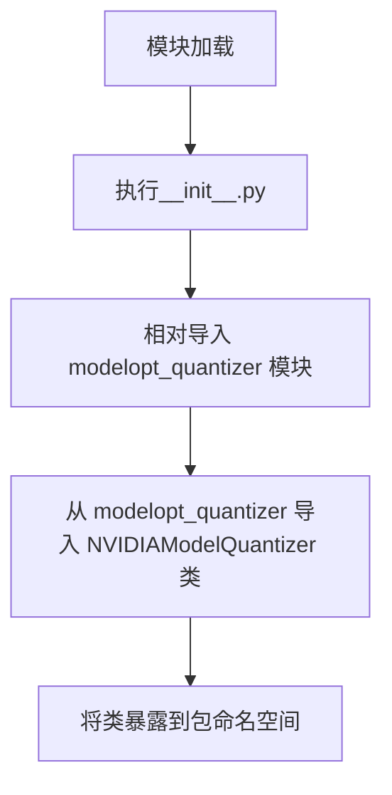

# `diffusers\src\diffusers\quantizers\modelopt\__init__.py` 详细设计文档

这是一个模块入口文件，通过相对导入的方式从同目录下的modelopt_quantizer模块导出NVIDIAModelOptQuantizer类，使得该包的使用者可以通过from modelopt_quantizer import NVIDIAModelOptQuantizer的方式直接访问NVIDIA模型优化量化器类。

## 整体流程



## 类结构

```
NVIDIAModelOptQuantizer (需从modelopt_quantizer模块获取)
```

## 全局变量及字段


### `NVIDIAModelOptQuantizer`
    
NVIDIA ModelOpt量化器类，用于模型量化处理

类型：`class`
    


### `NVIDIAModelOptQuantizer.NVIDIAModelOptQuantizer`
    
需要查看modelopt_quantizer源码才能确定具体字段信息

类型：`class`
    
    

## 全局函数及方法


# 文档生成结果

根据您提供的代码，我只能看到以下内容：

```python
from .modelopt_quantizer import NVIDIAModelOptQuantizer
```

这是一个简单的导入语句，它从 `modelopt_quantizer` 模块（可能是 `modelopt_quantizer.py` 文件）导入 `NVIDIAModelOptQuantizer` 类。

## 限制说明

由于代码中仅包含导入语句，**我无法获取 `NVIDIAModelOptQuantizer` 类的完整实现源码**。因此，我无法提供：

- 类的完整字段和方法详细信息
- 方法的参数和返回值详情
- 流程图（需要了解方法内部逻辑）
- 带注释的源码（需要源码内容）
- 完整的技术债务分析

## 当前可提取的信息

### `NVIDIAModelOptQuantizer`

**描述：** 从 `modelopt_quantizer` 模块导入的量化器类，可能用于 NVIDIA ModelOpt 框架的模型量化操作。

## 请求

为了生成完整的详细设计文档，请您提供：

1. **`modelopt_quantizer` 模块的完整源代码**，或
2. **`NVIDIAModelOptQuantizer` 类的具体实现代码**

您可以通过以下方式之一提供：

- 直接粘贴源代码
- 指定文件路径（如果您在本地环境中）
- 提供更多上下文信息

有了完整的源代码后，我将能够生成包含所有必要细节的详细设计文档，包括：
- 完整的类结构和方法签名
- 参数和返回值的详细说明
- Mermaid 流程图展示执行流程
- 带注释的源代码
- 技术债务和优化建议

## 关键组件


### NVIDIAModelOptQuantizer

NVIDIA ModelOpt量化器类，负责使用NVIDIA的ModelOpt库对模型进行量化处理。


## 问题及建议


### 已知问题

-   **单一导入依赖**：该模块仅重导出 `NVIDIAModelOptQuantizer` 类，外部使用者无法判断该模块还提供了哪些其他功能或类，降低了模块的可发现性和可扩展性
-   **缺乏错误处理**：相对导入（`.modelopt_quantizer`）在包结构不完整或模块缺失时直接抛出 `ModuleNotFoundError` 或 `ImportError`，缺少友好的错误提示
-   **缺少显式导出声明**：未定义 `__all__` 列表来明确公开接口，导致 `from . import *` 无法控制哪些成员可被导入
-   **可测试性受限**：由于仅有导入语句，无独立的测试入口或示例代码，难以独立验证该模块的行为

### 优化建议

-   **添加异常处理**：使用 `try-except` 包装导入语句，提供 fallback 机制或友好的错误信息
-   **声明 `__all__`**：在 `__init__.py` 中定义 `__all__ = ['NVIDIAModelOptQuantizer']`，明确导出接口
-   **考虑文档字符串**：为该模块添加模块级 docstring，说明 `NVIDIAModelOptQuantizer` 的用途和主要功能
-   **拆分或扩展**：若 `NVIDIAModelOptQuantizer` 承担多个职责，考虑按功能拆分为多个子模块或添加更多相关导出


## 其它


### 设计目标与约束

本模块的设计目标是通过ModelOpt量化技术实现模型的量化压缩，以减少模型体积和推理延迟，同时尽可能保持模型精度。约束条件包括需要NVIDIA的ModelOpt库支持，以及对特定GPU架构的兼容性要求。

### 错误处理与异常设计

当导入模块或初始化量化器失败时，应抛出具体的异常信息，包括可能的解决方案。常见的异常场景包括：ModelOpt库未安装、GPU驱动不支持、模型格式不兼容等。异常应提供足够的上下文信息以便调试。

### 外部依赖与接口契约

本模块依赖NVIDIA ModelOpt库，期望`modelopt_quantizer`模块中定义的`NVIDIAModelOptQuantizer`类具有标准的量化接口方法，包括模型加载、量化配置、量化执行和结果保存等。接口契约应明确输入模型格式、输出模型格式以及量化参数的定义。

### 性能考虑与基准测试

量化过程的性能开销主要来自于模型参数的重新计算和精度转换。应提供性能基准测试结果，包括量化时间、模型大小缩减比例、推理延迟变化等指标。

### 版本兼容性

明确支持的Python版本范围、ModelOpt库版本要求以及CUDA版本要求。

### 配置管理

定义量化配置的结构，包括量化位数、校准方法、量化策略等参数的默认值和允许值范围。

### 安全性考虑

验证输入模型的来源和完整性，防止恶意模型的量化攻击。

### 可扩展性设计

支持自定义量化算法和后处理步骤的插件式扩展机制。

### 测试策略

单元测试覆盖模块导入、接口契约验证、异常处理逻辑；集成测试验证量化流程的端到端功能。

### 日志与监控

记录量化过程的详细信息，包括配置参数、处理进度、性能指标等，便于问题诊断和优化分析。


    