# `diffusers\src\diffusers\quantizers\modelopt\modelopt_quantizer.py` 详细设计文档

NVIDIAModelOptQuantizer是Diffusers框架中用于Nvidia Model Optimizer的量化器实现类,负责对扩散模型进行FP8量化处理,支持模型权重加载前后的量化配置、参数验证、内存调整和类型转换等核心功能。

## 整体流程

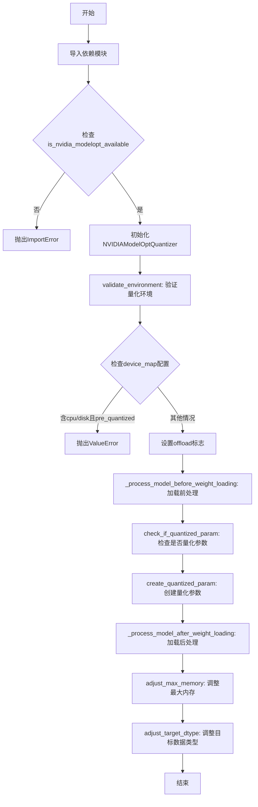

## 类结构

```
DiffusersQuantizer (基类)
└── NVIDIAModelOptQuantizer (实现类)
```

## 全局变量及字段


### `logger`
    
用于记录日志的 logger 对象

类型：`logging.Logger`
    


### `TYPE_CHECKING`
    
用于类型检查的标志（运行时为 False）

类型：`bool`
    


### `Any`
    
表示任意类型的类型提示

类型：`typing.Any`
    


### `torch`
    
PyTorch 库模块

类型：`module`
    


### `nn`
    
PyTorch 神经网络模块

类型：`module`
    


### `set_module_tensor_to_device`
    
将张量设置到设备的函数

类型：`function`
    


### `NVIDIAModelOptQuantizer.use_keep_in_fp32_modules`
    
是否保持FP32模块

类型：`bool`
    


### `NVIDIAModelOptQuantizer.requires_calibration`
    
是否需要校准

类型：`bool`
    


### `NVIDIAModelOptQuantizer.required_packages`
    
必需包列表

类型：`list`
    


### `NVIDIAModelOptQuantizer.offload`
    
是否启用cpu/disk卸载

类型：`bool`
    


### `NVIDIAModelOptQuantizer.pre_quantized`
    
是否预量化模型

类型：`bool`
    


### `NVIDIAModelOptQuantizer.quantization_config`
    
量化配置对象

类型：`object`
    
    

## 全局函数及方法


### `get_module_from_name`

该函数用于根据参数的完整名称（包含模块路径）从模型中提取对应的模块对象和参数名称。它在量化参数检查和创建过程中起到关键作用，用于定位特定的子模块和参数。

参数：

- `model`：`torch.nn.Module`，目标模型对象，需要从中提取模块
- `param_name`：`str`，参数的完整名称，通常为形如 "layer.weight" 的层级路径

返回值：返回元组 `(module, tensor_name)`
- `module`：`torch.nn.Module`，参数所属的模块对象
- `tensor_name`：`str`，参数在模块中的具体名称（如 "weight" 或 "bias"）

#### 流程图

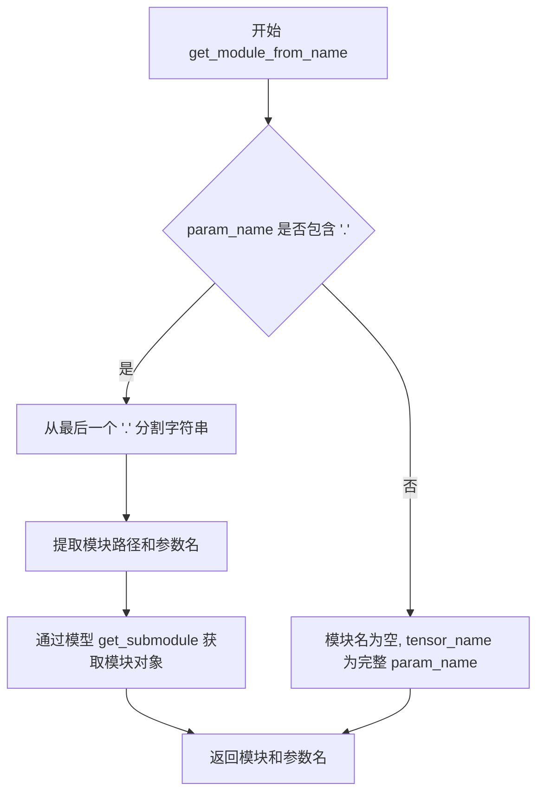

#### 带注释源码

```
# 该函数定义在 ...utils 模块中，此处为基于调用的推断实现
def get_module_from_name(model, param_name):
    """
    根据参数字符串获取对应的模块和参数名
    
    参数:
        model: 神经网络模型
        param_name: 参数字符串，如 'transformer.layer1.weight'
    
    返回:
        tuple: (module, tensor_name) - 模块对象和参数名
    """
    if '.' in param_name:
        # 分割出模块路径和参数名
        # 例如: 'transformer.layer1.weight' -> 'transformer.layer1' 和 'weight'
        module_name, tensor_name = param_name.rsplit('.', 1)
        # 获取子模块
        module = model.get_submodule(module_name)
    else:
        # 没有层级，直接在根模型上
        module = model
        tensor_name = param_name
    
    return module, tensor_name
```

**注意**：由于 `get_module_from_name` 函数的具体实现位于 `...utils` 模块中（未在当前代码片段中提供），以上源码是基于其在 `check_if_quantized_param` 和 `create_quantized_param` 方法中的使用方式推断得出的。该函数的核心作用是将参数的完整路径（如 "encoder.layer1.weight"）解析为对应的模块对象和参数名（"weight"），以便对特定参数进行量化处理。


### is_accelerate_available

该函数用于检查当前环境是否安装了 `accelerate` 库。在代码中，它被用作条件判断，以决定是否导入 `accelerate.utils` 中的 `set_module_tensor_to_device` 函数，从而实现模型张量到指定设备的分发功能。

参数：
- 无

返回值：`bool`，如果 `accelerate` 库可用返回 `True`，否则返回 `False`

#### 流程图

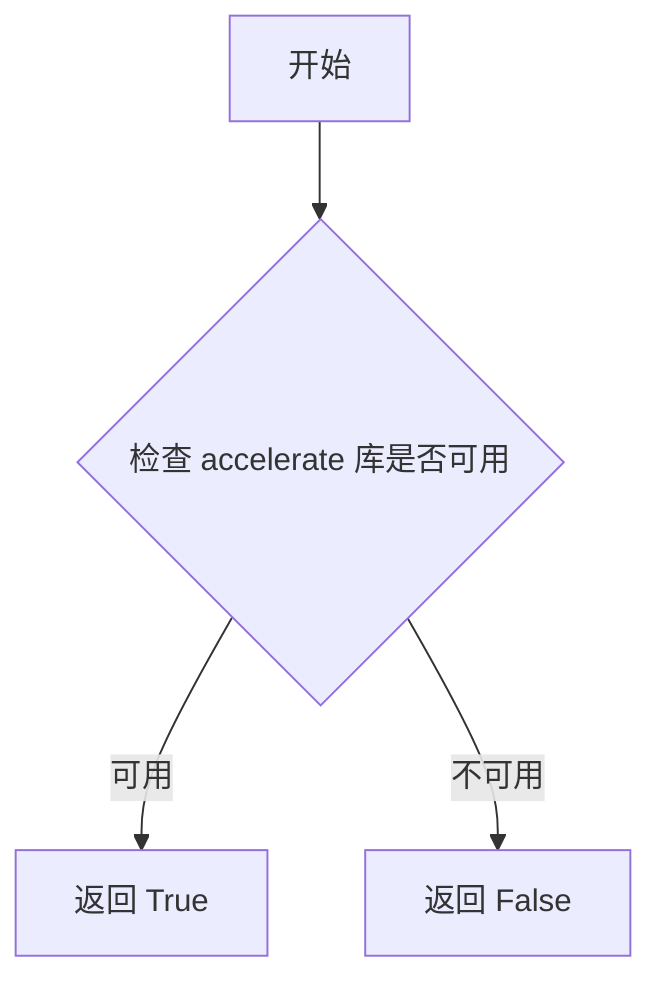

#### 带注释源码

```
# 该函数定义位于 ...utils 模块中，此处仅展示其在当前文件中的导入和使用方式
from ...utils import (
    get_module_from_name,
    is_accelerate_available,  # 从 utils 模块导入该函数
    is_nvidia_modelopt_available,
    is_torch_available,
    logging,
)

# 使用方式示例
if is_accelerate_available():
    from accelerate.utils import set_module_tensor_to_device
    # 只有在 accelerate 可用时才会执行此导入
```

**注意**：该函数的完整实现源码位于 `...utils` 模块中，当前代码文件仅导入了该函数而未包含其实现。要获取完整的函数实现源码，请查阅 `diffusers` 库源代码中的 `diffusers/src/diffusers/utils` 相关文件。


### `is_nvidia_modelopt_available`

检查 nvidia-modelopt 库是否已安装并可用。该函数通常在加载量化模型之前被调用，以验证必要的依赖项是否存在，如果库不可用则抛出 ImportError 提示用户安装。

参数： 无

返回值： `bool`，返回 `True` 表示 nvidia-modelopt 库可用，返回 `False` 表示不可用

#### 流程图

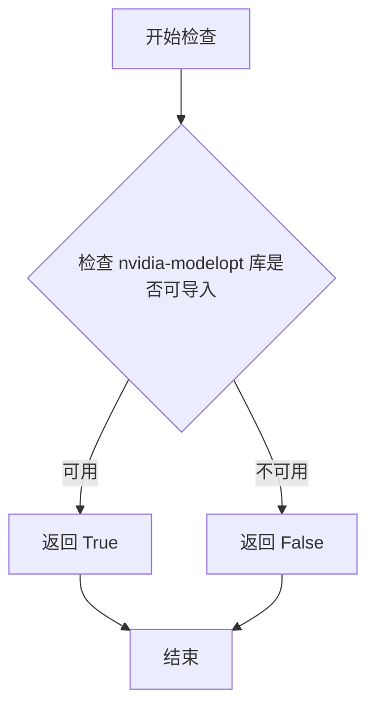

#### 带注释源码

```
# 这是一个从 ...utils 导入的函数
# 源码位置：.../utils/__init__.py 或类似模块
# 以下是推断的实现逻辑

def is_nvidia_modelopt_available() -> bool:
    """
    检查 nvidia-modelopt 库是否可用。
    
    Returns:
        bool: 如果可以成功导入 nvidia_modelopt 返回 True，否则返回 False
    """
    try:
        # 尝试导入 nvidia-modelopt 库
        import nvidia_modelopt
        return True
    except ImportError:
        # 如果导入失败，返回 False
        return False

# 使用示例（在 NVIDIAModelOptQuantizer.validate_environment 中）
def validate_environment(self, *args, **kwargs):
    if not is_nvidia_modelopt_available():
        raise ImportError(
            "Loading an nvidia-modelopt quantized model requires "
            "nvidia-modelopt library (`pip install nvidia-modelopt`)"
        )
    # ... 其他验证逻辑
```

#### 关键组件信息

| 组件名称 | 描述 |
|---------|------|
| `nvidia_modelopt` | NVIDIA 的模型优化库，用于模型量化和高性能推理 |
| `NVIDIAModelOptQuantizer` | 使用 nvidia-modelopt 的 Diffusers 量化器类 |
| `validate_environment` | 验证环境是否满足加载量化模型的要求的方法 |

#### 潜在的技术债务或优化空间

1. **依赖检查时机**：可以在更早的阶段（如模块导入时）进行依赖检查，而不是等到 `validate_environment` 被调用时
2. **错误信息一致性**：错误信息可以更加详细，包含当前环境信息以便调试
3. **版本兼容性**：当前只检查库是否存在，未检查版本兼容性

#### 其它项目

- **设计目标**：提供一个轻量级的依赖可用性检查函数，避免在库不可用时出现难以理解的导入错误
- **错误处理**：如果库不可用，抛出 `ImportError` 并提供清晰的安装指令
- **外部依赖**：依赖于 `nvidia_modelopt` Python 包
- **接口契约**：返回布尔值作为简单的可用性标志，调用方负责根据返回值决定后续操作


### `is_torch_available`

该函数用于检查当前环境中 PyTorch 库是否可用，返回布尔值以决定是否导入 torch 相关模块。

参数：无需参数

返回值：`bool`，返回 `True` 表示 PyTorch 已安装且可用，返回 `False` 表示不可用

#### 流程图

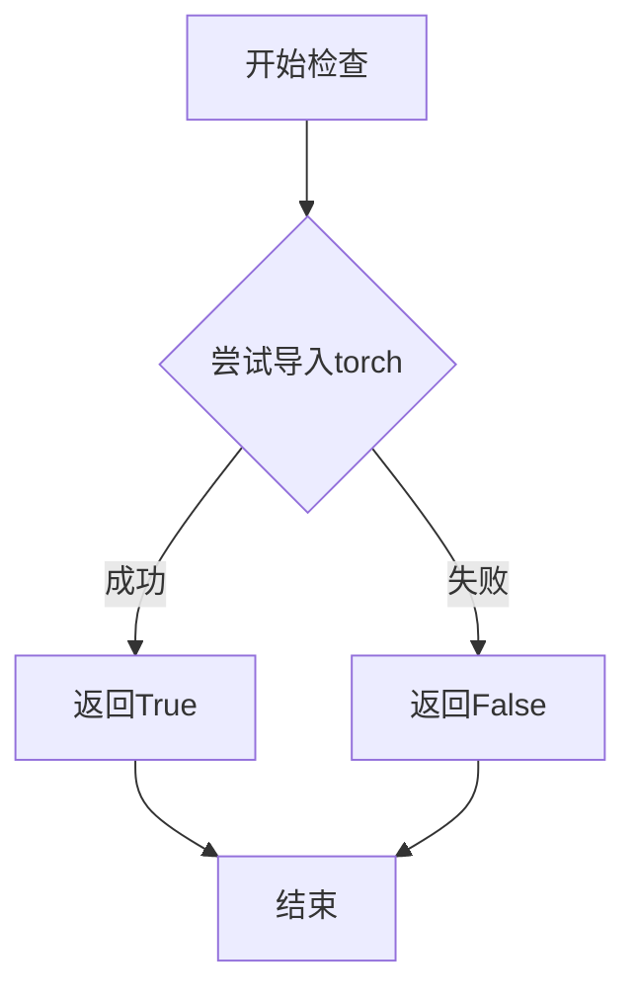

#### 带注释源码

```
# 注意：此函数定义在 ...utils 模块中，当前代码文件仅导入并使用
# 根据代码中的使用方式推断的实现逻辑：

def is_torch_available() -> bool:
    """
    检查 PyTorch 是否可在当前环境中使用。
    
    Returns:
        bool: 如果 torch 可用返回 True，否则返回 False
    """
    try:
        import torch
        return True
    except ImportError:
        return False
```


### `logging.get_logger`

获取指定模块的日志记录器实例，用于在代码中输出日志信息。

参数：

- `name`：`str`，模块名称，通常使用 `__name__` 变量来自动获取当前模块的完全限定名

返回值：`logging.Logger`，返回一个日志记录器实例，用于记录该模块的日志信息

#### 流程图

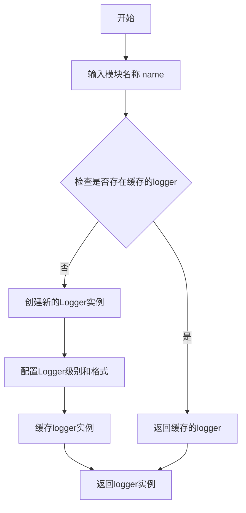

#### 带注释源码

```python
# 从 utils 模块导入 logging 对象
# logging 对象包含了 get_logger 方法
from ...utils import (
    get_module_from_name,
    is_accelerate_available,
    is_nvidia_modelopt_available,
    is_torch_available,
    logging,  # 导入 logging 模块
)

# 使用 logging.get_logger(__name__) 获取当前模块的 logger
# __name__ 是 Python 的内置变量，表示当前模块的完全限定名
# 例如：对于文件 src/diffusers/quantizers/nvidia_modelopt.py，其 __name__ 为 "diffusers.quantizers.nvidia_modelopt"
logger = logging.get_logger(__name__)

# 之后可以使用 logger 进行日志记录
# logger.info("消息") - 输出信息级别日志
# logger.warning("消息") - 输出警告级别日志
# logger.error("消息") - 输出错误级别日志
# logger.debug("消息") - 输出调试级别日志
```


### `modelopt.torch.quantization.utils.is_quantized`

该函数是 ModelOpt 库中的一个工具函数，用于检查给定的 PyTorch 模块是否已被量化。在 `NVIDIAModelOptQuantizer` 类的 `check_if_quantized_param` 方法中被调用，用于判断模块是否处于量化状态，以便决定是否需要对该模块的参数进行量化处理。

参数：

- `module`：`torch.nn.Module`，需要检查的 PyTorch 模块对象，用于判断该模块是否已被量化

返回值：`bool`，返回一个布尔值，表示给定的模块是否已被量化。如果模块已被量化则返回 `True`，否则返回 `False`

#### 流程图

```mermaid
flowchart TD
    A[开始检查模块是否量化] --> B{调用 is_quantized 函数}
    B --> C{module 是否已被量化？}
    C -->|是| D[返回 True]
    C -->|否| E[返回 False]
    D --> F[与 "weight" in tensor_name 进行逻辑与运算]
    E --> F
    F --> G{结果是否为 True？}
    G -->|是| H[返回 True: 参数是量化参数]
    G -->|否| I[返回 False: 参数不是量化参数]
```

#### 带注释源码

```python
# 在 NVIDIAModelOptQuantizer 类的 check_if_quantized_param 方法中调用
def check_if_quantized_param(
    self,
    model: "ModelMixin",
    param_value: "torch.Tensor",
    param_name: str,
    state_dict: dict[str, Any],
    **kwargs,
):
    # ModelOpt imports diffusers internally. This is here to prevent circular imports
    # 延迟导入 is_quantized 函数，避免循环导入问题
    from modelopt.torch.quantization.utils import is_quantized

    # 从参数名称获取对应的模块和张量名称
    module, tensor_name = get_module_from_name(model, param_name)
    
    # 如果模型已经是预量化状态，直接返回 True
    if self.pre_quantized:
        return True
    # 使用 is_quantized 函数检查模块是否已量化
    # 并且检查当前参数名称是否包含 "weight"（权重参数）
    elif is_quantized(module) and "weight" in tensor_name:
        return True
    
    # 默认返回 False，表示该参数不是量化参数
    return False
```

#### 补充说明

该函数的具体实现位于 `modelopt.torch.quantization.utils` 模块中，是 ModelOpt 量化框架的核心工具函数之一。在 Diffusers 集成中，这个函数被用于在权重加载过程中识别哪些参数已经被量化，从而避免重复量化。从调用方式来看，该函数应该是一个轻量级的检查函数，主要通过检查模块的 `state_dict` 或特定属性来判断量化状态。


### `modelopt.torch.quantization.calibrate`

该函数是 ModelOpt 量化框架的核心校准方法，用于在动态量化过程中对神经网络模块进行校准，以确定最佳的量化参数。

参数：

-  `module`：`torch.nn.Module`，需要校准的神经网络模块
-  `algorithm`：`str` 或配置对象，来自 `quantization_config.modelopt_config["algorithm"]`，指定使用的量化算法
-  `forward_loop`：`callable` 或配置对象，来自 `quantization_config.forward_loop`，定义校准时的前向传播逻辑

返回值：`None`，该函数直接修改传入的 module 对象，不返回任何值

#### 流程图

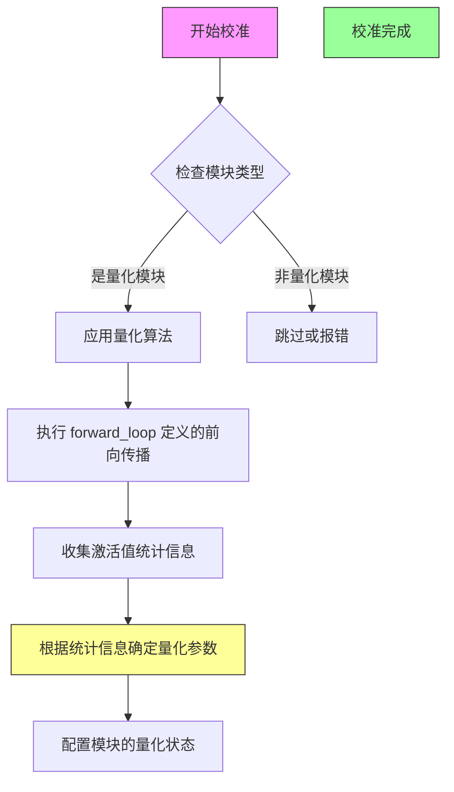

#### 带注释源码

```python
# 在 NVIDIAModelOptQuantizer.create_quantized_param 方法中调用
# 该函数属于 modelopt.torch.quantization 模块 (mtq)

# 调用示例:
import modelopt.torch.quantization as mtq

# 获取模块和配置信息
module, tensor_name = get_module_from_name(model, param_name)

# 执行校准过程
mtq.calibrate(
    module,  # 需要校准的神经网络模块
    self.quantization_config.modelopt_config["algorithm"],  # 量化算法配置
    self.quantization_config.forward_loop  # 校准时的前向传播逻辑
)

# 校准后执行压缩
mtq.compress(module)

# 禁用梯度计算
module.weight.requires_grad = False
```

#### 关键组件信息

| 组件名称 | 一句话描述 |
|---------|-----------|
| `NVIDIAModelOptQuantizer` | Nvidia Model Optimizer 量化器实现类，负责管理 Diffusers 模型的量化流程 |
| `create_quantized_param` | 核心方法，调用 calibrate 函数进行量化校准 |
| `mtq.calibrate` | ModelOpt 库的校准函数，用于收集激活统计信息并确定量化参数 |
| `mtq.compress` | 紧随 calibrate 之后的压缩函数，将模块转换为量化格式 |

#### 潜在技术债务与优化空间

1. **循环导入处理**：代码中多处使用延迟导入（`import modelopt.torch.quantization as mtq`）来避免循环依赖，这表明模块设计可能存在耦合问题
2. **错误处理缺失**：`calibrate` 和 `compress` 调用没有异常处理机制
3. **硬编码魔法数字**：内存调整中的 `0.90` 系数应作为可配置参数
4. **类型注解不完整**：部分方法参数和返回值缺少类型注解
5. **日志记录不足**：校准过程没有任何日志输出，难以调试和监控进度
6. **文档缺失：`forward_loop` 参数的具体行为和格式缺乏说明

#### 其它项目

**设计目标与约束**：
- 目标：实现 Nvidia ModelOpt 量化框架与 Diffusers 的集成
- 约束：不支持 CPU/磁盘 offload 与预量化模型同时使用

**错误处理与异常设计**：
- `validate_environment` 中检查库可用性并抛出 `ImportError`
- 对不支持的配置组合抛出 `ValueError`

**数据流与状态机**：
- 量化状态通过 `ModeloptStateManager` 管理
- 校准流程：加载权重 → 校准 → 压缩 → 冻结参数

**外部依赖与接口契约**：
- 依赖 `nvidia_modelopt` 包
- 依赖 `modelopt.torch.quantization` 和 `modelopt.torch.opt` 子模块
- `forward_loop` 参数需为可调用对象或包含前向传播逻辑的配置字典


### `modelopt.torch.quantization.compress`

这是来自 `modelopt.torch.quantization` 模块的压缩函数，用于在模型量化过程中对已校准的模块进行权重压缩，将浮点权重转换为量化格式。

参数：

-  `module`：`torch.nn.Module`，需要被压缩的神经网络模块（通常是线性层或卷积层），该模块已经过 `calibrate()` 校准

返回值：`None`，该函数为就地（in-place）操作，直接修改传入的模块，不返回任何值

#### 流程图

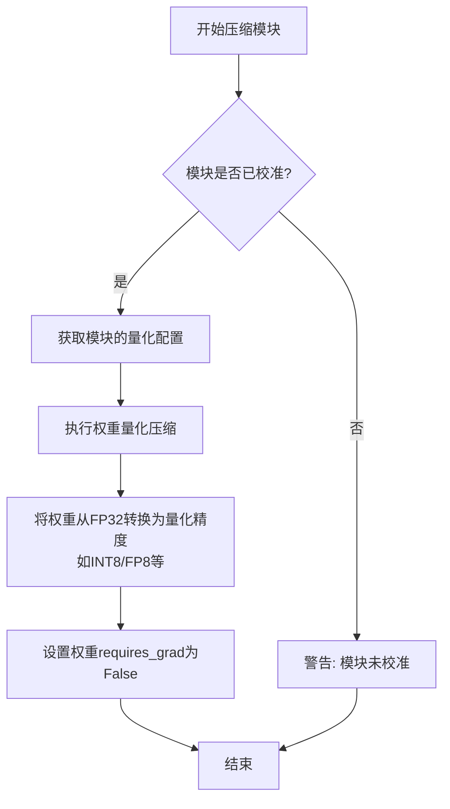

#### 带注释源码

```python
# 调用 modelopt.torch.quantization.compress 函数
# 该函数位于 modelopt 库中，此处为调用点的源码

# 在 NVIDIAModelOptQuantizer.create_quantized_param 方法中的调用：
import modelopt.torch.quantization as mtq

# ... 前置操作：设置模块参数到目标设备 ...
set_module_tensor_to_device(model, param_name, target_device, param_value, dtype)

# 1. 首先调用 calibrate 进行校准
#    - algorithm: 量化算法配置
#    - forward_loop: 前向传播循环用于收集统计信息
mtq.calibrate(
    module, self.quantization_config.modelopt_config["algorithm"], self.quantization_config.forward_loop
)

# 2. 调用 compress 进行权重压缩
#    - module: 已经过校准的模块
#    - 作用: 将模块的 FP32 权重转换为量化格式(如 INT8/FP8)
#    - 返回值: None (就地修改模块)
mtq.compress(module)

# 3. 禁止权重梯度更新
module.weight.requires_grad = False
```

#### 补充说明

由于 `modelopt.torch.quantization.compress` 是外部库函数（来自 `nvidia-modelopt` 包），上述源码为调用点的代码片段，而非该函数的内部实现。该函数的主要作用：

1. **权重量化**：将 FP32 浮点权重转换为低精度格式（INT8/FP8 等）
2. **就地修改**：直接修改传入的 `module` 对象，不返回新对象
3. **冻结权重**：压缩后的权重通常设置为不可训练（`requires_grad = False`）


### `modelopt.torch.opt.apply_mode`

该函数是 NVIDIA ModelOpt 库提供的外部函数，用于在模型权重加载前应用量化模式配置。在 `NVIDIAModelOptQuantizer` 类中，`_process_model_before_weight_loading` 方法调用此函数将量化配置应用到模型的各个模块上。

参数：

- `model`：`ModelMixin`，需要应用量化模式的模型实例
- `mode`：`list[tuple[str, dict]]`，量化模式配置列表，每个元素为元组 `(模式名称, 配置字典)`，在代码中传入 `[("quantize", self.quantization_config.modelopt_config)]`

返回值：无返回值（`None`），该函数直接修改传入的模型对象

#### 流程图

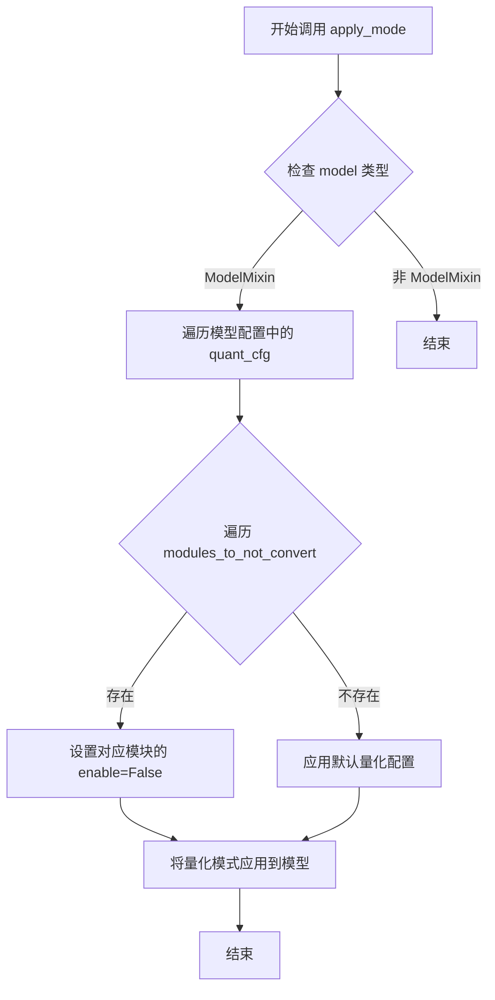

#### 带注释源码

由于 `apply_mode` 函数是外部库 (`nvidia-modelopt`) 中的函数，不在当前项目代码库中定义，因此无法直接获取其完整源码。以下为代码中调用该函数的位置及相关上下文：

```python
def _process_model_before_weight_loading(
    self,
    model: "ModelMixin",
    device_map,
    keep_in_fp32_modules: list[str] = [],
    **kwargs,
):
    # 防止循环导入，延迟导入 modelopt
    # ModelOpt imports diffusers internally. This is here to prevent circular imports
    import modelopt.torch.opt as mto

    # 如果模型已经预量化，则跳过处理
    if self.pre_quantized:
        return

    # 获取需要排除量化转换的模块列表
    modules_to_not_convert = self.quantization_config.modules_to_not_convert

    # 处理 modules_to_not_convert 参数格式
    if modules_to_not_convert is None:
        modules_to_not_convert = []
    if isinstance(modules_to_not_convert, str):
        modules_to_not_convert = [modules_to_not_convert]
    
    # 扩展排除列表，包含需要保持 FP32 的模块
    modules_to_not_convert.extend(keep_in_fp32_modules)
    
    # 如果禁用卷积层量化，则添加所有卷积参数名
    if self.quantization_config.disable_conv_quantization:
        modules_to_not_convert.extend(self.get_conv_param_names(model))

    # 为每个需要排除的模块配置量化禁用
    for module in modules_to_not_convert:
        self.quantization_config.modelopt_config["quant_cfg"]["*" + module + "*"] = {"enable": False}
    
    # 更新最终的排除模块列表
    self.quantization_config.modules_to_not_convert = modules_to_not_convert
    
    # 调用外部库函数 apply_mode，应用量化模式
    # 这是核心函数，将量化配置应用到模型
    mto.apply_mode(model, mode=[("quantize", self.quantization_config.modelopt_config)])
    
    # 将量化配置保存到模型 config 中
    model.config.quantization_config = self.quantization_config
```

#### 补充说明

由于 `apply_mode` 来自外部依赖库 `nvidia-modelopt`，其具体实现细节不可见。根据调用方式和 ModelOpt 库的设计模式，该函数的主要功能包括：

1. 解析传入的 `mode` 配置参数
2. 遍历模型的所有模块
3. 根据配置应用量化设置
4. 修改模型模块的内部状态以启用量化

如需获取该函数的完整源码实现，建议查阅 [NVIDIA ModelOpt 官方文档](https://github.com/NVIDIA/modelopt) 或安装库后通过 Python 内省查看。


### `modelopt.torch.opt.ModeloptStateManager.remove_state`

该方法用于从指定模块中移除ModeloptStateManager管理的状态，通常在模型权重加载后清理子模块的量化状态信息。

参数：

- `module`：`torch.nn.Module`，需要移除状态的模块对象

返回值：`None`，无返回值

#### 流程图

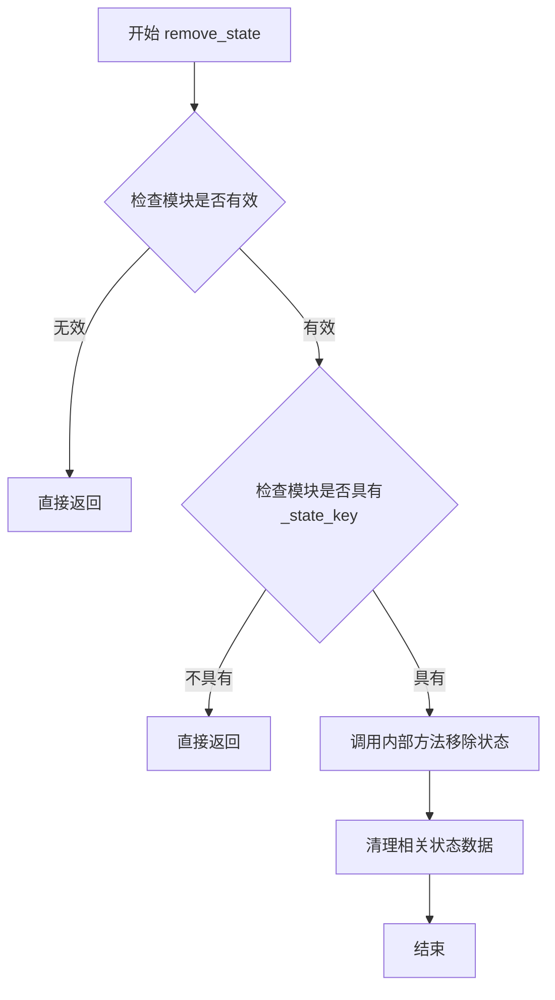

#### 带注释源码

```
# 注：由于此方法定义在外部库modelopt.torch.opt中，以下为基于代码中调用方式的推断
# 实际源码需要参考nvidia-modelopt库

def remove_state(module):
    """
    从指定模块中移除ModeloptStateManager管理的状态
    
    参数:
        module: torch.nn.Module - 需要移除状态的模块
        
    返回:
        None
    """
    # 基于代码中的调用方式推断的实现逻辑
    if module is None:
        return
    
    # 检查模块是否具有状态键
    if not hasattr(module, ModeloptStateManager._state_key):
        return
    
    # 获取状态键
    state_key = ModeloptStateManager._state_key
    
    # 移除模块上的状态属性
    if hasattr(module, state_key):
        delattr(module, state_key)
    
    # 清理相关的状态字典
    if hasattr(module, '_state'):
        delattr(module, '_state')
```

#### 在NVIDIAModelOptQuantizer中的调用示例

```python
def _process_model_after_weight_loading(self, model, **kwargs):
    # ModelOpt imports diffusers internally. This is here to prevent circular imports
    from modelopt.torch.opt import ModeloptStateManager

    if self.pre_quantized:
        return model

    # 遍历模型中的所有模块
    for _, m in model.named_modules():
        # 检查模块是否具有ModeloptStateManager的状态键，且不是模型本身
        if hasattr(m, ModeloptStateManager._state_key) and m is not model:
            # 移除子模块的量化状态，保留顶层模型的状态
            ModeloptStateManager.remove_state(m)

    return model
```


### `NVIDIAModelOptQuantizer.__init__`

该方法为 `NVIDIAModelOptQuantizer` 类的构造函数，负责初始化量化器实例，通过调用父类 `DiffusersQuantizer` 的初始化方法设置量化配置和传递额外关键字参数。

参数：

- `quantization_config`：量化配置对象，用于存储量化相关的配置参数
- `**kwargs`：可变关键字参数，用于传递额外的配置选项

返回值：`None`，构造函数不返回任何值

#### 流程图

```mermaid
flowchart TD
    A[开始 __init__] --> B[接收 quantization_config 和 **kwargs]
    B --> C[调用父类 super().__init__]
    C --> D[初始化完成]
    
    style A fill:#f9f,color:#333
    style D fill:#9f9,color:#333
```

#### 带注释源码

```python
def __init__(self, quantization_config, **kwargs):
    """
    初始化 NVIDIAModelOptQuantizer 量化器
    
    参数:
        quantization_config: 量化配置对象，包含量化相关参数
        **kwargs: 可变关键字参数，传递给父类
    """
    # 调用父类 DiffusersQuantizer 的初始化方法
    # 继承父类的属性和初始化逻辑
    super().__init__(quantization_config, **kwargs)
```


### `NVIDIAModelOptQuantizer.validate_environment`

该方法用于验证运行环境中是否安装了 nvidia-modelopt 库，并检查设备映射配置是否与量化模型兼容。如果未安装必要的库或尝试对预量化模型进行 CPU/磁盘卸载，将抛出相应的异常。

参数：

- `self`：`NVIDIAModelOptQuantizer` 类实例，表示量化器对象本身
- `*args`：`tuple`，可变位置参数，用于传递额外的位置参数（当前未使用）
- `**kwargs`：`dict`，可变关键字参数，用于传递设备映射等配置参数，当前主要使用 `device_map` 参数

返回值：`None`，无返回值，但该方法会修改实例属性 `self.offload` 的值

#### 流程图

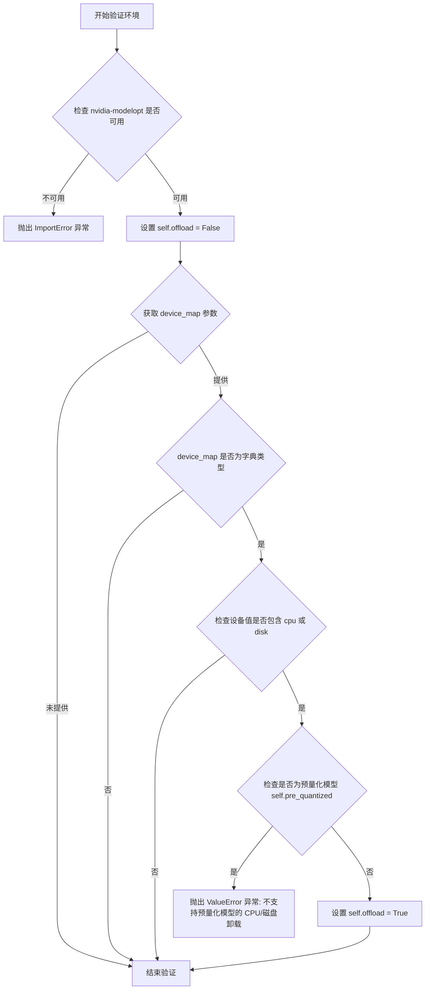

#### 带注释源码

```python
def validate_environment(self, *args, **kwargs):
    """
    验证运行环境中是否安装了 nvidia-modelopt 库，并检查设备映射配置。
    
    该方法执行以下验证：
    1. 检查 nvidia-modelopt 库是否已安装，未安装则抛出 ImportError
    2. 检查 device_map 参数，如果包含 cpu 或 disk 设备：
       - 对于预量化模型，抛出 ValueError（不支持 CPU/磁盘卸载）
       - 对于非预量化模型，设置 self.offload = True
    """
    
    # 检查 nvidia_modelopt 库是否可用
    if not is_nvidia_modelopt_available():
        raise ImportError(
            "Loading an nvidia-modelopt quantized model requires nvidia-modelopt library (`pip install nvidia-modelopt`)"
        )

    # 初始化 offload 标志为 False
    self.offload = False

    # 从 kwargs 中获取 device_map 参数，默认值为 None
    device_map = kwargs.get("device_map", None)
    
    # 检查 device_map 是否为字典类型
    if isinstance(device_map, dict):
        # 检查设备映射中是否包含 cpu 或 disk 设备
        if "cpu" in device_map.values() or "disk" in device_map.values():
            # 如果是预量化模型，抛出异常
            if self.pre_quantized:
                raise ValueError(
                    "You are attempting to perform cpu/disk offload with a pre-quantized modelopt model "
                    "This is not supported yet. Please remove the CPU or disk device from the `device_map` argument."
                )
            else:
                # 非预量化模型，允许设置 offload 标志
                self.offload = True
```


### `NVIDIAModelOptQuantizer.check_if_quantized_param`

该方法用于检查给定模型参数是否已经被量化，通过判断模型是否预量化或通过 ModelOpt 的 `is_quantized` 工具函数检测模块的量化状态。

参数：

- `self`：隐含的 `NVIDIAModelOptQuantizer` 实例，当前量化器对象
- `model`：`ModelMixin`，需要进行量化检查的模型实例
- `param_value`：`torch.Tensor`，待检查的参数张量值
- `param_name`：`str`，参数的名称，用于定位模块中的具体参数
- `state_dict`：`dict[str, Any]`，模型的状态字典
- `**kwargs`：可选的关键字参数，用于扩展额外配置

返回值：`bool`，如果参数已被量化则返回 `True`，否则返回 `False`

#### 流程图

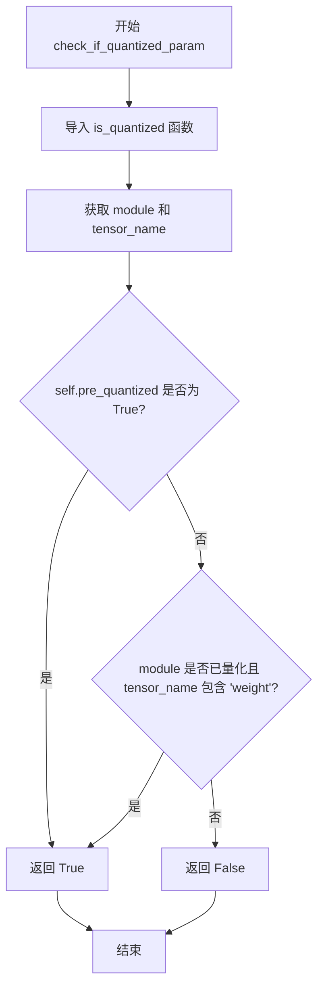

#### 带注释源码

```python
def check_if_quantized_param(
    self,
    model: "ModelMixin",
    param_value: "torch.Tensor",
    param_name: str,
    state_dict: dict[str, Any],
    **kwargs,
):
    # ModelOpt imports diffusers internally. This is here to prevent circular imports
    # 动态导入避免循环依赖，ModelOpt 库内部会导入 diffusers
    from modelopt.torch.quantization.utils import is_quantized

    # 根据参数名获取对应的模块和张量名称
    module, tensor_name = get_module_from_name(model, param_name)
    
    # 如果模型已经预量化，直接返回 True
    if self.pre_quantized:
        return True
    # 否则检查模块是否已量化且参数名为 'weight'
    elif is_quantized(module) and "weight" in tensor_name:
        return True
    
    # 默认返回 False，表示该参数未被量化
    return False
```


### NVIDIAModelOptQuantizer.create_quantized_param

该方法负责创建量化参数，通过在设置参数到模块后调用校准（calibrate）和压缩（compress）来完成量化过程。

参数：

- `self`：NVIDIAModelQuantizer 实例，当前量化器对象
- `model`：`ModelMixin`，需要进行量化处理的模型对象
- `param_value`：`torch.Tensor`，要量化的参数张量值
- `param_name`：`str`，参数的名称，用于在模块中定位参数
- `target_device`：`torch.device`，目标设备，用于将参数移动到指定设备
- `*args`：可变位置参数，保留用于未来扩展
- `**kwargs`：可变关键字参数，可包含 `dtype` 等额外参数

返回值：`None`，该方法直接在模块上修改参数，不返回任何值

#### 流程图

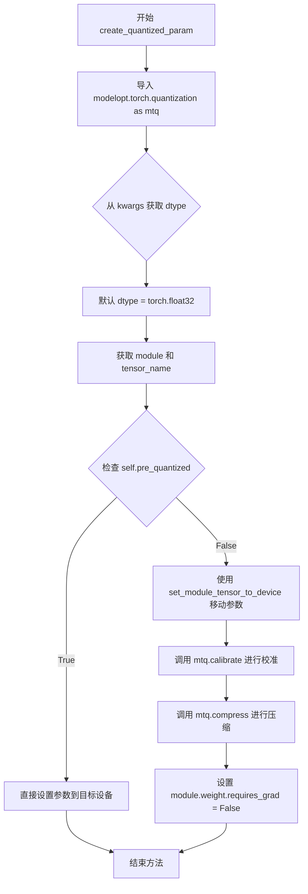

#### 带注释源码

```python
def create_quantized_param(
    self,
    model: "ModelMixin",
    param_value: "torch.Tensor",
    param_name: str,
    target_device: "torch.device",
    *args,
    **kwargs,
):
    """
    Create the quantized parameter by calling .calibrate() after setting it to the module.
    通过在设置参数到模块后调用 .calibrate() 来创建量化参数
    """
    # ModelOpt imports diffusers internally. This is here to prevent circular imports
    # ModelOpt 在内部导入 diffusers，这里是为了防止循环导入
    import modelopt.torch.quantization as mtq

    # 从 kwargs 中获取 dtype，默认值为 torch.float32
    # Get dtype from kwargs, default to torch.float32
    dtype = kwargs.get("dtype", torch.float32)
    
    # 从模型中获取模块和参数名称
    # Get module and tensor name from model
    module, tensor_name = get_module_from_name(model, param_name)
    
    # 检查是否为预量化模型
    # Check if it's a pre-quantized model
    if self.pre_quantized:
        # 如果是预量化模型，直接将参数移动到目标设备
        # If pre-quantized, directly set parameter to target device
        module._parameters[tensor_name] = torch.nn.Parameter(param_value.to(device=target_device))
    else:
        # 如果不是预量化模型，需要进行量化处理
        # If not pre-quantized, need to perform quantization
        
        # 将参数移动到目标设备
        # Move parameter to target device
        set_module_tensor_to_device(model, param_name, target_device, param_value, dtype)
        
        # 调用 ModelOpt 的 calibrate 方法进行校准
        # Call ModelOpt's calibrate method for calibration
        mtq.calibrate(
            module, 
            self.quantization_config.modelopt_config["algorithm"], 
            self.quantization_config.forward_loop
        )
        
        # 调用 ModelOpt 的 compress 方法进行压缩
        # Call ModelOpt's compress method for compression
        mtq.compress(module)
        
        # 禁用权重梯度，防止后续训练修改量化参数
        # Disable weight gradient to prevent subsequent training from modifying quantized parameters
        module.weight.requires_grad = False
```


### `NVIDIAModelOptQuantizer.adjust_max_memory`

该方法用于调整模型推理时的最大内存分配，将传入的内存字典中每个设备的内存值减少到原来的 90%，以留出一定的内存缓冲空间，防止 OOM 错误。

参数：

- `max_memory`：`dict[str, int | str]`，包含设备标识到内存大小的映射字典（如 `{"cuda:0": 1000000000, "cpu": 8000000000}`）

返回值：`dict[str, int | str]`，返回调整后的最大内存字典，每个设备的内存值已被缩放为原值的 90%

#### 流程图

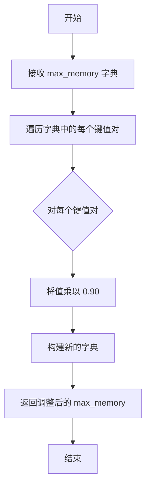

#### 带注释源码

```python
def adjust_max_memory(self, max_memory: dict[str, int | str]) -> dict[str, int | str]:
    """
    调整最大内存分配，按比例缩放每个设备的内存值
    
    参数:
        max_memory: 设备到内存大小的映射字典
        
    返回:
        调整后的内存字典，每个值减少到原来的 90%
    """
    # 使用字典推导式遍历原始字典，将每个值乘以 0.90
    # 这样可以为模型推理预留 10% 的内存缓冲，防止 OOM
    max_memory = {key: val * 0.90 for key, val in max_memory.items()}
    return max_memory
```


### `NVIDIAModelOptQuantizer.adjust_target_dtype`

该方法用于在模型量化过程中根据量化配置类型动态调整目标张量的数据类型。当量化配置中的 `quant_type` 设置为 "FP8" 时，将目标数据类型转换为 FP8 浮点格式（torch.float8_e4m3fn），以支持 8 位量化推理；否则保持原始目标数据类型不变。

参数：

- `self`：`NVIDIAModelOptQuantizer` 类实例，表示量化器对象本身
- `target_dtype`：`torch.dtype`，原始的目标数据类型，指定模型权重转换前的目标精度

返回值：`torch.dtype`，调整后的目标数据类型。如果量化类型为 FP8，则返回 `torch.float8_e4m3fn`；否则返回原始的 `target_dtype`。

#### 流程图

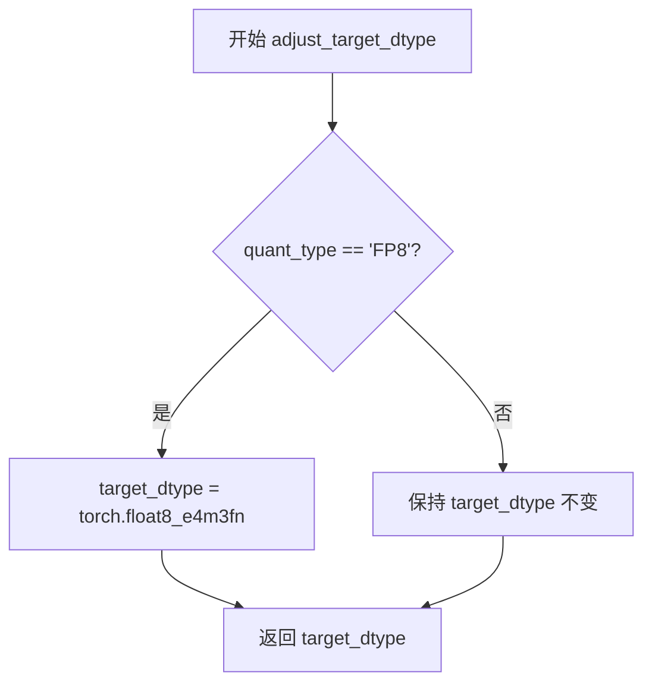

#### 带注释源码

```python
def adjust_target_dtype(self, target_dtype: "torch.dtype") -> "torch.dtype":
    """
    根据量化配置调整目标数据类型。
    
    当量化类型为 FP8 时，将目标数据类型转换为 8 位浮点格式，
    以支持 FP8 量化推理；否则保持原始数据类型不变。
    
    参数:
        target_dtype: torch.dtype
            原始的目标数据类型，指定模型权重转换前的目标精度。
            
    返回:
        torch.dtype
            调整后的目标数据类型。如果量化类型为 FP8，则返回
            torch.float8_e4m3fn；否则返回原始的 target_dtype。
    """
    # 检查量化配置中的 quant_type 是否为 FP8
    if self.quantization_config.quant_type == "FP8":
        # FP8 量化使用 float8_e4m3fn 数据类型
        # 这是一种 8 位浮点数格式，具有更好的精度和动态范围
        target_dtype = torch.float8_e4m3fn
    
    # 返回调整后的目标数据类型
    return target_dtype
```


### `NVIDIAModelOptQuantizer.update_torch_dtype`

该方法用于在模型加载时处理用户指定的 `torch_dtype` 参数，如果用户未指定则默认使用 `torch.float32`，确保量化模型加载时具有明确的数据类型。

参数：

- `torch_dtype`：`torch.dtype`，可选参数，表示期望加载模型的张量数据类型，默认为 `None`

返回值：`torch.dtype`，返回处理后的 `torch_dtype` 值

#### 流程图

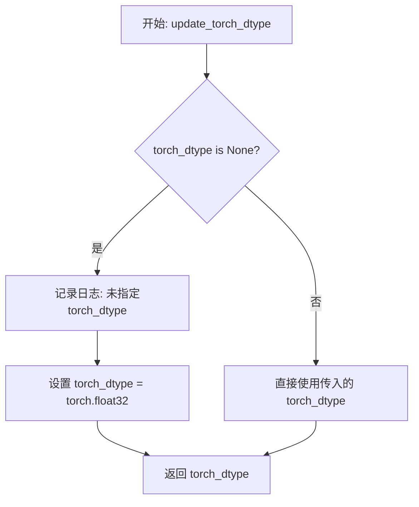

#### 带注释源码

```python
def update_torch_dtype(self, torch_dtype: "torch.dtype" = None) -> "torch.dtype":
    """
    处理并返回模型加载时使用的 torch_dtype。
    
    如果用户未在 from_pretrained 中指定 torch_dtype，则默认使用 torch.float32。
    这确保了量化模型在加载时具有明确的数据类型，避免潜在的精度问题。
    
    参数:
        torch_dtype: 期望的模型参数数据类型，None 表示使用默认值
        
    返回值:
        处理后的 torch_dtype 值
    """
    # 检查用户是否指定了 torch_dtype
    if torch_dtype is None:
        # 用户未指定，记录日志说明将使用默认的 float32
        logger.info("You did not specify `torch_dtype` in `from_pretrained`. Setting it to `torch.float32`.")
        # 设置默认数据类型为 torch.float32
        torch_dtype = torch.float32
    # 返回处理后的 dtype（可能是用户指定的或默认的 float32）
    return torch_dtype
```


### `NVIDIAModelOptQuantizer.get_conv_param_names`

获取给定HuggingFace ModelMixin模型中所有卷积层（Conv1d/2d/3d及ConvTranspose1d/2d/3d）的参数名称列表，用于在量化过程中排除这些层。

参数：

- `model`：`ModelMixin`，HuggingFace的ModelMixin模型实例，需要提取卷积层参数名称的模型对象

返回值：`list[str]`，返回卷积层参数名称的列表，格式为`"模块名.参数名"`，如`"encoder.block.0.conv1d.weight"`

#### 流程图

```mermaid
flowchart TD
    A[开始 get_conv_param_names] --> B[定义卷积类型元组 conv_types]
    B --> C[创建空列表 conv_param_names]
    C --> D[遍历 model.named_modules]
    D --> E{当前模块是否为卷积类型?}
    E -->|是| F[遍历模块的非递归参数]
    F --> G[拼接参数名称: f'{name}.{param_name}']
    G --> H[添加到 conv_param_names 列表]
    H --> D
    E -->|否| D
    D --> I[返回 conv_param_names 列表]
    I --> J[结束]
```

#### 带注释源码

```python
def get_conv_param_names(self, model: "ModelMixin") -> list[str]:
    """
    Get parameter names for all convolutional layers in a HuggingFace ModelMixin. Includes Conv1d/2d/3d and
    ConvTranspose1d/2d/3d.
    """
    # 定义所有卷积层类型的元组，包括普通卷积和转置卷积
    conv_types = (
        nn.Conv1d,    # 一维卷积
        nn.Conv2d,    # 二维卷积（最常用，如图像处理）
        nn.Conv3d,    # 三维卷积（如视频处理）
        nn.ConvTranspose1d,  # 一维转置卷积（也称为反卷积）
        nn.ConvTranspose2d,  # 二维转置卷积
        nn.ConvTranspose3d,  # 三维转置卷积
    )

    # 初始化存储卷积参数名称的列表
    conv_param_names = []
    
    # 遍历模型中的所有模块（named_modules返回模块名称和模块对象的迭代器）
    for name, module in model.named_modules():
        # 检查当前模块是否是卷积类型之一
        if isinstance(module, conv_types):
            # 遍历当前卷积模块的直接参数（recurse=False表示不递归子模块）
            for param_name, _ in module.named_parameters(recurse=False):
                # 拼接完整的参数名称，格式为"模块名.参数名"（如"encoder.conv1.weight"）
                conv_param_names.append(f"{name}.{param_name}")

    # 返回包含所有卷积层参数名称的列表
    return conv_param_names
```


### `NVIDIAModelOptQuantizer._process_model_before_weight_loading`

该方法在模型权重加载之前被调用，主要用于配置 NVIDIA ModelOpt 量化参数。它会处理需要排除量化的模块列表（如卷积层、用户指定的 FP32 模块），并将这些配置更新到量化配置中，最后将量化模式应用到模型上。

参数：

- `model`：`ModelMixin`，要进行量化处理的模型实例
- `device_map`：设备映射配置，用于指定模型各层到不同设备的分配
- `keep_in_fp32_modules`：`list[str]`，默认值为空列表，用户指定的需要保持在 FP32 精度而不进行量化的模块列表
- `**kwargs`：其他可选关键字参数

返回值：`None`，无返回值（当 `pre_quantized` 为 True 时直接返回）

#### 流程图

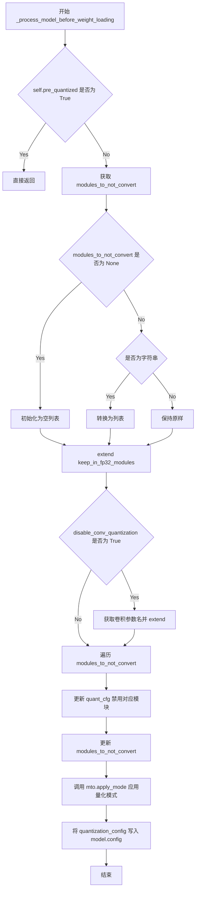

#### 带注释源码

```
def _process_model_before_weight_loading(
    self,
    model: "ModelMixin",
    device_map,
    keep_in_fp32_modules: list[str] = [],
    **kwargs,
):
    # 导入 ModelOpt 库，避免循环导入问题
    # ModelOpt 内部会导入 diffusers，所以放在函数内部延迟导入
    import modelopt.torch.opt as mto

    # 如果模型已经是预量化状态，则跳过处理直接返回
    if self.pre_quantized:
        return

    # 从量化配置中获取需要排除量化转换的模块列表
    modules_to_not_convert = self.quantization_config.modules_to_not_convert

    # 如果未配置排除模块，则初始化为空列表
    if modules_to_not_convert is None:
        modules_to_not_convert = []
    
    # 如果是单个字符串模块名，转换为列表形式
    if isinstance(modules_to_not_convert, str):
        modules_to_not_convert = [modules_to_not_convert]
    
    # 将用户指定的保持 FP32 的模块加入到排除列表中
    modules_to_not_convert.extend(keep_in_fp32_modules)
    
    # 如果配置了禁用卷积层量化，获取所有卷积层参数名并加入排除列表
    if self.quantization_config.disable_conv_quantization:
        modules_to_not_convert.extend(self.get_conv_param_names(model))

    # 遍历所有需要排除的模块，在量化配置中将其禁用
    # 通过通配符匹配模块名称，设置 enable: false
    for module in modules_to_not_convert:
        self.quantization_config.modelopt_config["quant_cfg"]["*" + module + "*"] = {"enable": False}
    
    # 更新量化配置中的排除模块列表
    self.quantization_config.modules_to_not_convert = modules_to_not_convert
    
    # 调用 ModelOpt 的 apply_mode 方法，将量化模式应用到整个模型
    # 使用 quantization_config 中的 modelopt_config 配置
    mto.apply_mode(model, mode=[("quantize", self.quantization_config.modelopt_config)])
    
    # 将更新后的量化配置保存到模型的配置对象中
    # 以便后续权重加载时能够访问到正确的配置
    model.config.quantization_config = self.quantization_config
```


### `NVIDIAModelOptQuantizer._process_model_after_weight_loading`

该方法用于在权重加载完成后对模型进行后处理，主要职责是清理模型中非顶层模块的量化状态，防止模型在后续使用过程中出现状态冲突。

参数：

- `model`：`ModelMixin`，HuggingFace模型实例，待处理的模型对象
- `**kwargs`：可变关键字参数，用于接收额外的配置参数（当前方法内未使用）

返回值：`ModelMixin`，处理完成后返回的模型对象

#### 流程图

```mermaid
flowchart TD
    A[开始 _process_model_after_weight_loading] --> B{self.pre_quantized?}
    B -->|是| C[直接返回 model]
    B -->|否| D[导入 ModeloptStateManager]
    D --> E[遍历模型所有模块 named_modules]
    E --> F{当前模块是否有 ModeloptStateManager._state_key?}
    F -->|否| G[继续下一个模块]
    F -->|是| H{当前模块是否等于 model?}
    H -->|是| G
    H -->|否| I[调用 ModeloptStateManager.remove_state 移除状态]
    I --> G
    G --> J{是否还有未遍历的模块?}
    J -->|是| E
    J -->|否| K[返回 model]
    C --> K
```

#### 带注释源码

```python
def _process_model_after_weight_loading(self, model, **kwargs):
    """
    在权重加载完成后对模型进行后处理。
    
    该方法主要处理模型量化状态的清理工作。当模型不是预量化模型时，
    会遍历模型的所有子模块，移除其中可能存在的量化状态信息，
    以确保后续推理或训练过程的正确性。
    
    参数:
        model: HuggingFace ModelMixin 实例，待处理的模型对象
        **kwargs: 额外的关键字参数，当前方法未使用此参数
    
    返回:
        处理完成后的模型对象
    """
    # ModelOpt 在内部导入 diffusers。为了避免循环导入，这里使用延迟导入
    # 这是一个常见的最佳实践，用于解决库之间的循环依赖问题
    from modelopt.torch.opt import ModeloptStateManager

    # 如果模型已经是预量化状态，则直接返回原始模型，不进行任何处理
    # 预量化模型的状态管理方式不同，不需要清理中间状态
    if self.pre_quantized:
        return model

    # 遍历模型中的所有模块（包括容器层和叶子层）
    # named_modules() 返回迭代器，yield (module_name, module) 元组
    for _, m in model.named_modules():
        # 检查当前模块是否具有 ModeloptStateManager 的状态键
        # _state_key 是 ModeloptStateManager 内部用于标识量化状态的属性
        if hasattr(m, ModeloptStateManager._state_key) and m is not model:
            # 排除模型根节点本身，只清理子模块的状态
            # 这样做是为了保留根模型的完整状态，同时清理子模块的临时状态
            # 避免状态冲突和内存泄漏
            ModeloptStateManager.remove_state(m)

    # 返回处理后的模型对象
    return model
```


### `NVIDIAModelOptQuantizer.is_trainable`

该属性方法用于返回当前量化器所管理的模型是否可训练的状态。NVIDIAModelOptQuantizer 量化器支持训练模式，因此始终返回 `True`。

参数：无

返回值：`bool`，返回 `True` 表示该量化器管理的模型处于可训练状态

#### 流程图

```mermaid
flowchart TD
    A[开始 is_trainable 属性访问] --> B{执行属性 getter}
    B --> C[返回常量 True]
    C --> D[结束: 模型可训练]
    
    style A fill:#e1f5fe
    style C fill:#c8e6c9
    style D fill:#fff9c4
```

#### 带注释源码

```python
@property
def is_trainable(self):
    """
    属性方法：返回当前量化模型是否可训练
    
    该属性覆盖基类 DiffusersQuantizer 的实现，
    用于指示使用 NVIDIAModelOptQuantizer 量化的模型是否支持训练。
    
    在 ModelOpt 量化方案中，模型权重在量化后通常会设置为不可训练，
    但量化器本身会记录原始模型的训练能力。
    
    返回:
        bool: 始终返回 True，表示底层模型具有可训练的能力。
              具体的权重训练状态由模型内部的 requires_grad 属性决定。
    """
    return True
```

---

**补充说明：**

- 这是一个只读的 `@property` 装饰器方法，不需要额外参数
- 返回值固定为 `True`，表明 NVIDIAModelOpt 量化方案保留了模型的训练能力
- 与之对应的 `is_serializable` 属性用于检查模型是否可序列化保存
- 该属性的设计符合量化模型在推理/训练不同场景下的灵活切换需求


### `NVIDIAModelOptQuantizer.is_serializable`

该属性方法用于验证模型在保存时是否支持序列化。它调用 `quantization_config.check_model_patching` 方法检查模型修补状态，确保模型可以进行序列化操作。

参数：无（作为属性方法无需显式参数，`self` 由 Python 隐式处理）

返回值：`bool`，返回 `True` 表示模型可序列化；如验证失败则由 `check_model_patching` 方法抛出异常

#### 流程图

```mermaid
flowchart TD
    A[开始 is_serializable] --> B{调用 check_model_patching}
    B -->|验证通过| C[返回 True]
    B -->|验证失败| D[抛出异常]
    
    style A fill:#f9f,color:#333
    style C fill:#9f9,color:#333
    style D fill:#f99,color:#333
```

#### 带注释源码

```python
@property
def is_serializable(self):
    """
    检查模型是否可序列化。
    
    该属性方法在模型保存操作前被调用，用于验证当前量化配置
    是否支持序列化。通过调用 quantization_config.check_model_patching
    方法来检查模型的修补状态。
    
    Returns:
        bool: 如果模型支持序列化则返回 True。
              如果不支持则由 check_model_patching 方法抛出异常。
    """
    # 调用配置对象的检查方法，验证模型在保存操作时的修补状态
    # operation="saving" 指定了检查针对保存操作
    self.quantization_config.check_model_patching(operation="saving")
    
    # 验证通过后返回 True，表示模型可以正常序列化
    return True
```

## 关键组件


### NVIDIAModelOptQuantizer

核心量化器类，继承自DiffusersQuantizer，用于集成NVIDIA Model Optimizer的量化功能，支持FP8量化、模型预处理和后处理、卷积层特殊处理等。

### 张量索引与惰性加载

通过`check_if_quantized_param`方法判断参数是否已被量化，支持预量化模型和动态量化两种模式，实现参数的惰性加载和按需处理。

### 反量化支持

`create_quantized_param`方法在设置参数后调用`mtq.calibrate()`和`mtq.compress()`完成量化流程，支持将参数反量化到目标设备并保持FP32精度。

### 量化策略

通过`quantization_config.modelopt_config`配置量化策略，支持通过`modules_to_not_convert`排除特定模块，通过`disable_conv_quantization`控制卷积层量化，通过`algorithm`指定量化算法。

### 环境验证

`validate_environment`方法检查nvidia-modelopt库可用性，验证设备映射配置是否与预量化模型兼容，支持CPU/Disk offload检测。

### 内存优化

`adjust_max_memory`方法将最大内存降低10%（乘以0.90）以预留缓冲空间，`adjust_target_dtype`方法将FP8量化映射到torch.float8_e4m3fn类型。

### 卷积层处理

`get_conv_param_names`方法遍历模型获取所有Conv1d/2d/3d和ConvTranspose1d/2d/3d层的参数名，支持可选地禁用卷积层量化。

### 模型预处理

`_process_model_before_weight_loading`方法在权重加载前应用量化模式，排除指定模块，并将配置写入model.config。

### 模型后处理

`_process_model_after_weight_loading`方法清理中间模块的量化状态，管理ModeloptStateManager状态。

### dtype管理

`update_torch_dtype`方法在未指定torch_dtype时默认使用FP32，确保量化过程的精度控制。

### 可训练性

`is_trainable`属性返回True，表明该量化器支持训练场景；`is_serializable`属性验证模型补丁状态确保模型可保存。


## 问题及建议


### 已知问题

-   **硬编码的魔法数字**：`adjust_max_memory` 方法中硬编码了 `0.90` 系数，无法灵活配置内存调整比例
-   **重复导入 modelopt**：`check_if_quantized_param` 和 `create_quantized_param` 方法内部重复导入 `modelopt` 相关模块，每次调用都有导入开销
-   **类型检查效率低**：`get_conv_param_names` 方法遍历所有模块，即使找到卷积层后仍继续遍历，没有提前退出优化
-   **方法返回值不一致**：`_process_model_after_weight_loading` 方法在 `pre_quantized` 为 True 时返回 model，但其他情况未明确返回值
-   **FP8 量化扩展性差**：`adjust_target_dtype` 方法仅支持 FP8 类型判断，其他量化类型硬编码返回原类型
-   **缺乏配置验证**：构造函数 `__init__` 未验证 `quantization_config` 的必要字段是否存在
-   **日志记录不完整**：关键操作如 `calibrate`、`compress` 成功后缺少日志记录，难以追踪量化流程

### 优化建议

-   将 `0.90` 系数提取为类属性或通过参数传入，提高灵活性
-   在类初始化时导入 `modelopt` 相关模块并缓存，避免重复导入开销
-   在 `get_conv_param_names` 中找到卷积层后使用 `break` 或 `yield` 提前退出
-   统一 `_process_model_after_weight_loading` 方法的返回值，确保所有分支都返回 `model`
-   使用策略模式或映射字典扩展 `adjust_target_dtype` 方法，支持更多量化类型
-   在 `__init__` 中添加 `quantization_config` 必要字段的验证逻辑
-   在关键操作如 `calibrate()` 和 `compress()` 成功后添加 `logger.info` 日志记录

## 其它


### 设计目标与约束

本模块旨在为Diffusers库提供NVIDIA Model Optimizer量化支持，实现对预训练模型的FP8等量化方案。核心约束包括：不支持CPU/磁盘设备卸载与预量化模型同时使用；仅支持FP8量化类型；要求部署环境安装nvidia-modelopt包；模型权重默认保持FP32精度。

### 错误处理与异常设计

当nvidia-modelopt库未安装时，validate_environment方法抛出ImportError，提示用户通过pip安装。当尝试对预量化模型进行CPU或磁盘设备卸载时，抛出ValueError并说明不支持该操作。is_serializable属性在保存前调用check_model_patching进行序列化可行性验证。

### 数据流与状态机

量化流程分为三个阶段：模型加载前处理(_process_model_before_weight_loading)、权重加载阶段(create_quantized_param)、模型加载后处理(_process_model_after_weight_loading)。check_if_quantized_param在权重加载时判断参数是否已量化，adjust_max_memory在推理前调整GPU显存分配，adjust_target_dtype根据量化类型转换目标数据类型。

### 外部依赖与接口契约

依赖is_torch_available、is_accelerate_available、is_nvidia_modelopt_available三个工具函数进行环境检查。依赖modelopt.torch.quantization和modelopt.torch.opt模块实现量化和压缩功能。接口契约要求quantization_config必须包含modelopt_config字典，其中包含algorithm和forward_loop配置项；modules_to_not_convert需为列表或字符串类型。

### 性能考量与优化空间

adjust_max_memory方法通过0.90系数预留10%显存避免OOM。use_keep_in_fp32_modules=True确保关键模块保持高精度。is_trainable返回True表示量化模型仍可训练，但module.weight.requires_grad在create_quantized_param中被显式设置为False以锁定权重。

### 序列化与反序列化

is_serializable属性执行保存前的模型修补检查。pre_quantized标志区分预量化模型和动态量化模型路径。模型配置通过model.config.quantization_config保存量化配置信息，支持后续from_pretrained恢复量化状态。

### 模块兼容性

get_conv_param_names方法识别Conv1d/2d/3d和ConvTranspose1d/2d/3d卷积层类型，支持HuggingFace模型结构。disable_conv_quantization配置项允许禁用卷积层量化以保持推理精度。modules_to_not_convert机制支持通过通配符排除特定模块。


    