# `diffusers\src\diffusers\quantizers\pipe_quant_config.py` 详细设计文档

这是一个流水线量化配置类，用于在运行时动态对DiffusionPipeline进行量化处理，支持多种量化后端（如bitsandbytes），允许用户通过quant_backend或quant_mapping方式指定量化配置，并能够细粒度控制要量化的管道组件。

## 整体流程

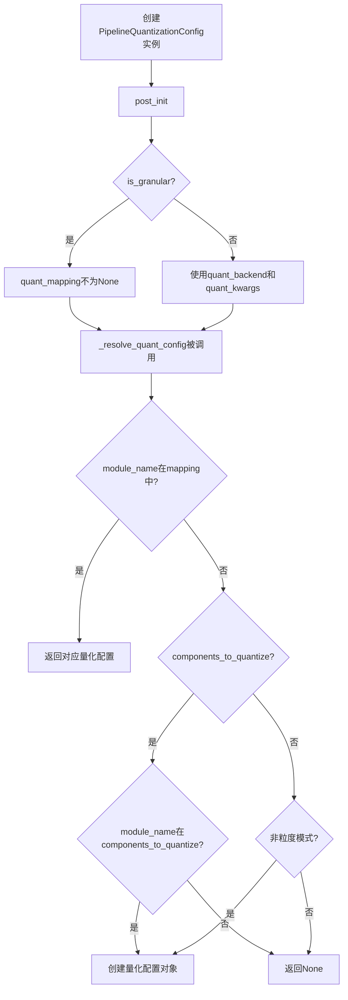

## 类结构

```
PipelineQuantizationConfig (主类)
```

## 全局变量及字段


### `logger`
    
用于记录模块内部日志的Logger对象

类型：`logging.Logger`
    


### `TransformersQuantConfigMixin`
    
从transformers库导入的QuantizationConfigMixin类，若导入失败则为空的fallback类

类型：`class | type`
    


### `DiffQuantConfigMixin`
    
diffusers库中QuantizationConfigMixin的别名，用于量化配置混入类

类型：`type`
    


### `PipelineQuantizationConfig.quant_backend`
    
量化后端名称，指定使用的量化方法（如bnb, awq等）

类型：`str | None`
    


### `PipelineQuantizationConfig.quant_kwargs`
    
量化参数字典，包含初始化量化后端类所需的配置参数

类型：`dict[str, str | float | int | dict]`
    


### `PipelineQuantizationConfig.components_to_quantize`
    
要量化的组件列表，指定pipeline中需要进行量化的模块名称

类型：`list[str] | str | None`
    


### `PipelineQuantizationConfig.quant_mapping`
    
自定义量化映射配置，定义每个模块对应的量化规格

类型：`dict[str, DiffQuantConfigMixin | TransformersQuantConfigMixin] | None`
    


### `PipelineQuantizationConfig.config_mapping`
    
已解析的量化配置映射，用于内部记录已实例化的量化配置对象

类型：`dict[str, Any]`
    


### `PipelineQuantizationConfig.is_granular`
    
是否为粒度模式，True表示使用自定义quant_mapping，False表示使用全局quant_backend

类型：`bool`
    
    

## 全局函数及方法


### `logging.get_logger`

获取或创建一个与指定模块名称关联的logger实例，用于在diffusers库中进行日志记录。

参数：

- `name`：`str`，logger的名称，通常使用`__name__`变量传入，以标识日志来源的模块

返回值：`logging.Logger`，返回一个Python标准库的Logger对象，用于输出日志信息

#### 流程图

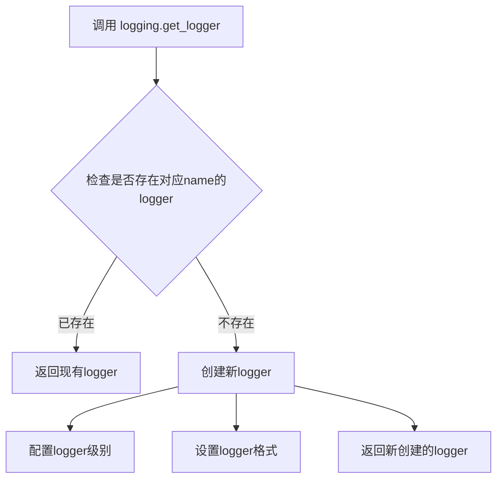

#### 带注释源码

```python
# 这是从 ..utils 导入的 logging 模块中的 get_logger 函数
# 调用方式如下：

# 导入语句（在文件开头）
from ..utils import is_transformers_available, logging

# 使用示例：获取当前模块的logger
logger = logging.get_logger(__name__)

# 参数说明：
# - __name__: Python内置变量，表示当前模块的全限定名
#   例如：如果模块路径是 src.utils.hub，则 __name__ 为 "src.utils.hub"

# 返回值说明：
# - 返回一个 logging.Logger 实例，可用于记录不同级别的日志
#   例如：logger.info(), logger.debug(), logger.warning(), logger.error()

# 常见用法：
logger = logging.get_logger(__name__)  # 初始化logger

# 后续在代码中可以这样使用：
# logger.info("This is an info message")
# logger.debug("This is a debug message")
# logger.warning("This is a warning message")
# logger.error("This is an error message")
```


### `is_transformers_available`

该函数用于检查 `transformers` 库是否已安装且可用。如果 `transformers` 可用，则返回 `True`，否则返回 `False`。这在代码中用于条件性地导入 `transformers` 相关的量化配置映射。

参数：此函数无参数。

返回值：`bool`，返回 `True` 表示 `transformers` 库可用，返回 `False` 表示不可用。

#### 流程图

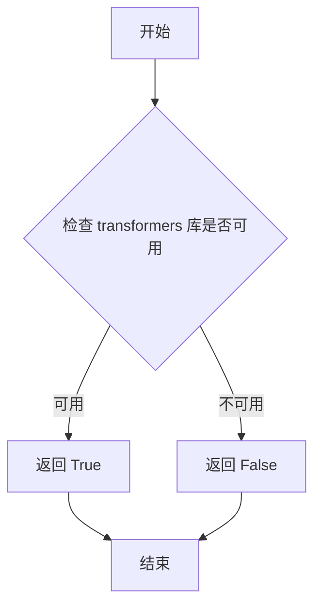

#### 带注释源码

```
# 该函数定义在 ..utils 模块中，此处为引用
# 源代码位于项目根目录的 utils 模块
from ..utils import is_transformers_available, logging

# 在 _get_quant_config_list 方法中的使用示例：
def _get_quant_config_list(self):
    # 检查 transformers 是否可用
    if is_transformers_available():
        # 如果可用，从 transformers 导入量化配置映射
        from transformers.quantizers.auto import (
            AUTO_QUANTIZATION_CONFIG_MAPPING as quant_config_mapping_transformers,
        )
    else:
        # 如果不可用，设置为 None
        quant_config_mapping_transformers = None

    # 从 diffusers 导入量化配置映射（diffusers 必须可用）
    from ..quantizers.auto import AUTO_QUANTIZATION_CONFIG_MAPPING as quant_config_mapping_diffusers

    return quant_config_mapping_transformers, quant_config_mapping_diffusers
```

#### 补充说明

- **模块来源**：`is_transformers_available` 函数定义在 `..utils` 模块中（即 `diffusers` 包的 `utils` 目录）
- **设计目的**：这是一个实用函数，用于在运行时动态检测 `transformers` 库是否已安装，避免在 `transformers` 不可用的环境中导入失败
- **常见实现模式**：通常通过尝试 `import transformers` 并捕获 `ImportError` 来实现


### `PipelineQuantizationConfig._validate_init_kwargs_in_backends`

该方法用于验证所选量化后端在 transformers 和 diffusers 两个库中的配置类的 `__init__` 方法签名是否一致，确保两边接受的参数名称相同，以避免量化配置在不同库之间出现不兼容问题。

参数：无需额外参数（仅使用类属性 `self.quant_backend`）

返回值：无返回值（仅进行验证，可能抛出 ValueError 异常）

#### 流程图

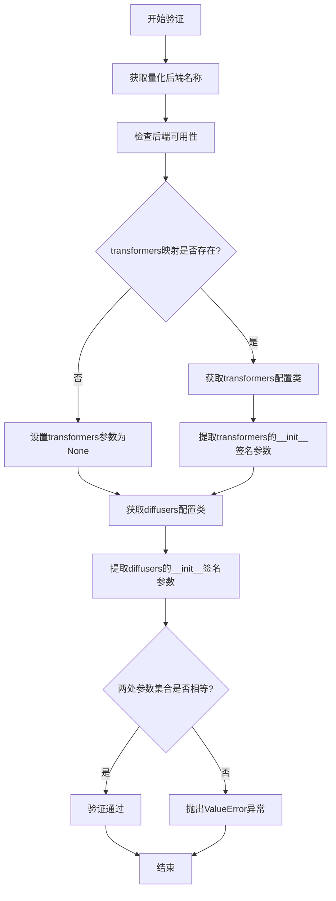

#### 带注释源码

```python
def _validate_init_kwargs_in_backends(self):
    """
    验证所选量化后端在transformers和diffusers中的配置类签名是否一致。
    如果不一致，提示用户使用quant_mapping手动指定映射关系。
    """
    # 获取当前配置的量化后端名称
    quant_backend = self.quant_backend

    # 首先检查后端在两个库中是否可用
    self._check_backend_availability(quant_backend)

    # 获取transformers和diffusers两边的量化配置映射字典
    quant_config_mapping_transformers, quant_config_mapping_diffusers = self._get_quant_config_list()

    # 处理transformers端的配置类签名
    if quant_config_mapping_transformers is not None:
        # 使用inspect.signature获取transformers侧量化配置类的__init__方法签名
        init_kwargs_transformers = inspect.signature(quant_config_mapping_transformers[quant_backend].__init__)
        # 提取参数名称，排除self参数，保留其他参数名
        init_kwargs_transformers = {name for name in init_kwargs_transformers.parameters if name != "self"}
    else:
        # 如果没有transformers映射，设置为None
        init_kwargs_transformers = None

    # 使用inspect.signature获取diffusers侧量化配置类的__init__方法签名
    init_kwargs_diffusers = inspect.signature(quant_config_mapping_diffusers[quant_backend].__init__)
    # 提取参数名称，排除self参数
    init_kwargs_diffusers = {name for name in init_kwargs_diffusers.parameters if name != "self"}

    # 比较两边的参数集合是否完全一致
    if init_kwargs_transformers != init_kwargs_diffusers:
        # 签名不一致，抛出详细错误信息，引导用户使用quant_mapping参数
        raise ValueError(
            "The signatures of the __init__ methods of the quantization config classes in `diffusers` and `transformers` don't match. "
            f"Please provide a `quant_mapping` instead, in the {self.__class__.__name__} class. Refer to [the docs](https://huggingface.co/docs/diffusers/main/en/quantization/overview#pipeline-level-quantization) to learn more about how "
            "this mapping would look like."
        )
```


### `PipelineQuantizationConfig.__init__`

初始化量化配置类，用于在运行时对 DiffusionPipeline 进行量化配置。该方法接收量化后端、量化参数、待量化组件列表以及量化映射等参数，并进行基础初始化和验证。

参数：

- `quant_backend`：`str`，量化后端名称，指定使用的量化后端（如 "bnb" 等），需要同时在 diffusers 和 transformers 中可用
- `quant_kwargs`：`dict[str, str | float | int | dict]`，初始化量化后端类的参数字典，默认为空字典
- `components_to_quantize`：`list[str] | str | None`，Pipeline 中需要量化的组件名称列表，支持单个字符串或字符串列表
- `quant_mapping`：`dict[str, DiffQuantConfigMixin | "TransformersQuantConfigMixin"]`，定义量化规格的映射字典，用于为不同组件指定具体的量化配置类

返回值：`None`，无返回值（构造函数）

#### 流程图

```mermaid
flowchart TD
    A[开始 __init__] --> B[设置 self.quant_backend]
    B --> C[设置 self.quant_kwargs<br>如果为None则设为空字典 {}]
    C --> D{components_to_quantize<br>是否存在?}
    D -->|是| E{是否为字符串?}
    D -->|否| F[设置 self.components_to_quantize]
    E -->|是| G[将字符串转为列表]
    E -->|否| F
    G --> F
    F --> H[设置 self.quant_mapping]
    H --> I[初始化 self.config_mapping<br>为空字典 {}]
    I --> J[调用 post_init]
    J --> K[结束]
    
    J --> L[_validate_init_args]
    L --> M{quant_backend 和 quant_mapping<br>是否同时存在?}
    M -->|是| N[抛出 ValueError]
    M -->|否| O{quant_mapping 和 quant_backend<br>是否都不存在?}
    O -->|是| P[抛出 ValueError]
    O -->|否| Q{quant_kwargs 和 quant_mapping<br>是否都不存在?]
    Q -->|是| R[抛出 ValueError]
    Q -->|否| S{quant_backend 是否存在?}
    S -->|是| T[_validate_init_kwargs_in_backends]
    S -->|否| U{quant_mapping 是否存在?]
    U -->|是| V[_validate_quant_mapping_args]
    U -->|否| W[结束验证]
```

#### 带注释源码

```python
def __init__(
    self,
    quant_backend: str = None,
    quant_kwargs: dict[str, str | float | int | dict] = None,
    components_to_quantize: list[str] | str | None = None,
    quant_mapping: dict[str, DiffQuantConfigMixin | "TransformersQuantConfigMixin"] = None,
):
    """
    初始化 PipelineQuantizationConfig 实例。
    
    Args:
        quant_backend: 量化后端名称，需要同时在 diffusers 和 transformers 中可用
        quant_kwargs: 初始化量化后端类的参数字典
        components_to_quantize: 需要量化的组件名称列表
        quant_mapping: 组件到量化配置的映射字典
    """
    # 设置量化后端
    self.quant_backend = quant_backend
    
    # 初始化 kwargs 为空字典，确保默认值一致性
    # 使用 or {} 而不是直接赋值，避免 mutable default argument 问题
    self.quant_kwargs = quant_kwargs or {}
    
    # 处理 components_to_quantize 参数
    if components_to_quantize:
        # 如果是单个字符串，转换为列表以便统一处理
        if isinstance(components_to_quantize, str):
            components_to_quantize = [components_to_quantize]
    
    # 设置待量化组件列表
    self.components_to_quantize = components_to_quantize
    
    # 设置量化映射配置
    self.quant_mapping = quant_mapping
    
    # 初始化配置映射簿，用于记录每个模块的量化配置
    self.config_mapping = {}  # book-keeping Example: `{module_name: quant_config}`
    
    # 调用后置初始化方法，进行参数验证和状态设置
    self.post_init()
```


### PipelineQuantizationConfig.post_init

该方法作为 `PipelineQuantizationConfig` 类的初始化钩子，在 `__init__` 方法结束时被调用。它主要用于确定当前量化配置的粒度级别（细粒度或全局），并调用内部验证方法 `_validate_init_args` 来确保传入的初始化参数符合业务规则。

参数：

- `self`：`PipelineQuantizationConfig`，表示类的实例本身。

返回值：`None`，该方法不返回任何值。

#### 流程图

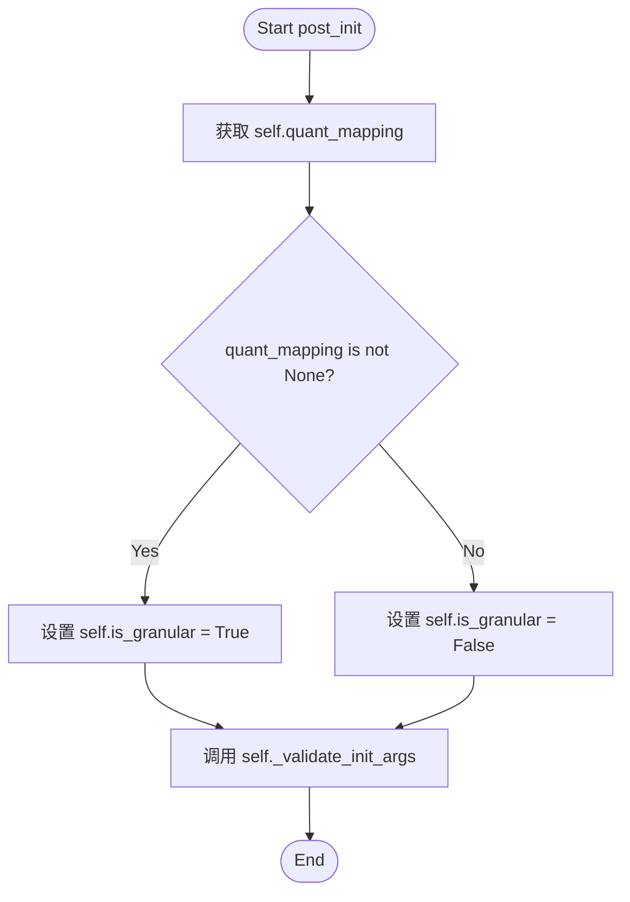

#### 带注释源码

```python
def post_init(self):
    """
    在初始化后设置量化粒度标志并进行参数校验。
    """
    # 获取实例的 quant_mapping 属性，用于判断配置模式
    quant_mapping = self.quant_mapping
    
    # 判断是否为细粒度（Granular）模式
    # 如果提供了 quant_mapping，则视为细粒度量化；否则使用全局后端配置
    self.is_granular = True if quant_mapping is not None else False

    # 执行初始化参数的合法性校验
    # 校验逻辑包含检查 quant_backend 与 quant_mapping 的互斥性、必填参数等
    self._validate_init_args()
```


### `PipelineQuantizationConfig._validate_init_args`

该方法负责验证 `PipelineQuantizationConfig` 类的初始化参数，确保用户正确配置了量化后端或量化映射，并检查参数之间的一致性和合法性。

参数：

- `self`：`PipelineQuantizationConfig` 实例，隐式参数，表示当前配置对象

返回值：`None`，该方法不返回值，仅通过抛出 `ValueError` 来表示验证失败

#### 流程图

```mermaid
flowchart TD
    A[开始 _validate_init_args] --> B{quant_backend 且 quant_mapping 都存在?}
    B -->|是| C[抛出 ValueError: 不能同时指定两者]
    B -->|否| D{quant_mapping 和 quant_backend 都不存在?}
    D -->|是| E[抛出 ValueError: 必须提供 quant_backend]
    D -->|否| F{quant_kwargs 和 quant_mapping 都不存在?}
    F -->|是| G[抛出 ValueError: 不能同时为 None]
    F -->|否| H{quant_backend 不为 None?]
    H -->|是| I[调用 _validate_init_kwargs_in_backends 验证后端]
    H -->|否| J{quant_mapping 不为 None?}
    I --> J
    J -->|是| K[调用 _validate_quant_mapping_args 验证映射]
    J -->|否| L[验证通过]
    K --> L
    C --> M[结束]
    E --> M
    G --> M
    L --> M
```

#### 带注释源码

```python
def _validate_init_args(self):
    """
    验证初始化参数的合法性。
    
    该方法在 PipelineQuantizationConfig 对象创建后被调用，用于确保：
    1. quant_backend 和 quant_mapping 不能同时指定（互斥关系）
    2. 必须至少提供 quant_backend 或 quant_mapping 之一
    3. quant_kwargs 和 quant_mapping 不能同时为 None
    4. 如果提供了 quant_backend，验证其在 transformers 和 diffusers 中的可用性
    5. 如果提供了 quant_mapping，验证映射中的配置类是否可用
    """
    
    # 检查1: quant_backend 和 quant_mapping 互斥，不能同时指定
    if self.quant_backend and self.quant_mapping:
        raise ValueError("Both `quant_backend` and `quant_mapping` cannot be specified at the same time.")

    # 检查2: 必须至少提供 quant_backend 或 quant_mapping 之一
    if not self.quant_mapping and not self.quant_backend:
        raise ValueError("Must provide a `quant_backend` when not providing a `quant_mapping`.")

    # 检查3: quant_kwargs 和 quant_mapping 不能同时为 None
    # 当使用 quant_mapping 时，不需要额外的 quant_kwargs
    if not self.quant_kwargs and not self.quant_mapping:
        raise ValueError("Both `quant_kwargs` and `quant_mapping` cannot be None.")

    # 如果提供了 quant_backend，进一步验证其在后端中的可用性
    if self.quant_backend is not None:
        self._validate_init_kwargs_in_backends()

    # 如果提供了 quant_mapping，进一步验证映射参数的合法性
    if self.quant_mapping is not None:
        self._validate_quant_mapping_args()
```


### `PipelineQuantizationConfig._validate_init_kwargs_in_backends`

该方法用于验证所选量化后端在 `diffusers` 和 `transformers` 两个库中的配置类 `__init__` 方法签名是否一致，以确保跨框架量化配置的一致性。如果签名不匹配，则抛出 `ValueError` 引导用户使用自定义的 `quant_mapping`。

参数：

- `self`：类的实例本身，无需显式传递

返回值：`None`，该方法通过抛出异常来处理验证失败的情况，正常执行完毕不返回任何值

#### 流程图

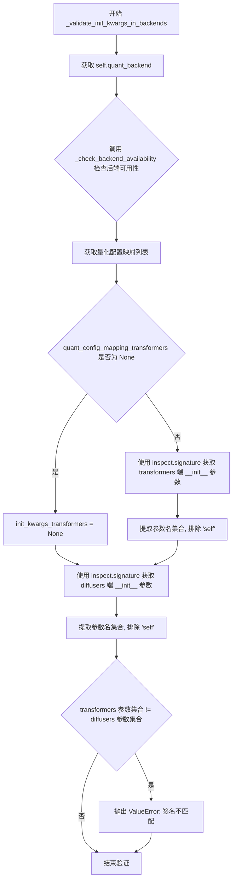

#### 带注释源码

```python
def _validate_init_kwargs_in_backends(self):
    """
    验证所选量化后端在 diffusers 和 transformers 中的配置类 __init__ 方法签名是否一致。
    如果不一致，抛出 ValueError 引导用户使用 quant_mapping 自定义映射。
    """
    # 1. 获取当前配置的量化后端名称
    quant_backend = self.quant_backend

    # 2. 检查该后端在 diffusers 和 transformers 中是否都可用
    self._check_backend_availability(quant_backend)

    # 3. 获取 transformers 和 diffusers 两端的量化配置映射字典
    # 返回格式: (transformers_config_mapping, diffusers_config_mapping)
    quant_config_mapping_transformers, quant_config_mapping_diffusers = self._get_quant_config_list()

    # 4. 如果 transformers 映射存在，获取该后端配置类的 __init__ 方法签名
    if quant_config_mapping_transformers is not None:
        # 使用 inspect.signature 获取 __init__ 方法的签名对象
        init_kwargs_transformers = inspect.signature(quant_config_mapping_transformers[quant_backend].__init__)
        # 提取所有参数名，转换为集合并排除 'self' 参数
        init_kwargs_transformers = {name for name in init_kwargs_transformers.parameters if name != "self"}
    else:
        # transformers 库不可用或未安装相关量化后端
        init_kwargs_transformers = None

    # 5. 获取 diffusers 端配置类的 __init__ 方法签名
    init_kwargs_diffusers = inspect.signature(quant_config_mapping_diffusers[quant_backend].__init__)
    # 同样提取参数名集合，排除 'self'
    init_kwargs_diffusers = {name for name in init_kwargs_diffusers.parameters if name != "self"}

    # 6. 比较两端的 __init__ 方法参数签名是否完全一致
    if init_kwargs_transformers != init_kwargs_diffusers:
        # 签名不一致，抛出详细错误信息，引导用户使用 quant_mapping 自定义配置
        raise ValueError(
            "The signatures of the __init__ methods of the quantization config classes in `diffusers` and `transformers` don't match. "
            f"Please provide a `quant_mapping` instead, in the {self.__class__.__name__} class. Refer to [the docs](https://huggingface.co/docs/diffusers/main/en/quantization/overview#pipeline-level-quantization) to learn more about how "
            "this mapping would look like."
        )
```


### `PipelineQuantizationConfig._validate_quant_mapping_args`

该方法负责验证实例属性 `quant_mapping` 中提供的所有配置对象。它会检查每个配置对象是否为 `diffusers` 或 `transformers` 库中已支持的量化配置类的实例。如果检测到无效的配置类型，则抛出 `ValueError` 以阻止流水线初始化。

参数：

-  `self`：`PipelineQuantizationConfig`，隐式参数。调用此方法的对象实例，用于访问 `self.quant_mapping` 和 `self._get_quant_config_list()`。

返回值：`None`，无返回值。该方法仅在验证失败时通过抛出异常来表明错误。

#### 流程图

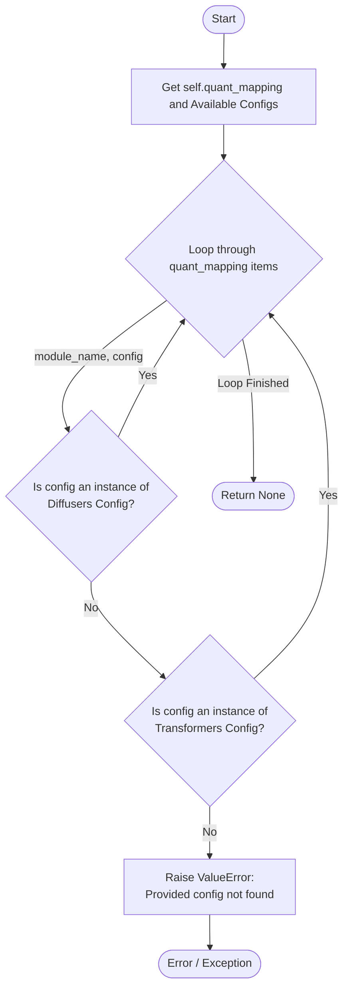

#### 带注释源码

```python
def _validate_quant_mapping_args(self):
    # 获取实例的 quant_mapping 属性
    quant_mapping = self.quant_mapping
    
    # 获取当前支持的量化配置类列表（分别来自 transformers 和 diffusers）
    transformers_map, diffusers_map = self._get_quant_config_list()

    # 将字典形式的映射转换为配置类列表，若 transformers 不可用则为 None
    available_transformers = list(transformers_map.values()) if transformers_map else None
    available_diffusers = list(diffusers_map.values())

    # 遍历 quant_mapping 中每一对 (模块名, 配置对象)
    for module_name, config in quant_mapping.items():
        # 1. 检查该配置是否为 diffusers 支持的配置类实例
        if any(isinstance(config, cfg) for cfg in available_diffusers):
            continue # 合法，继续下一个检查

        # 2. 如果 transformers 可用，检查该配置是否为 transformers 支持的配置类实例
        if available_transformers and any(isinstance(config, cfg) for cfg in available_transformers):
            continue # 合法，继续下一个检查

        # 3. 如果既不在 diffusers 也不在 transformers 中，抛出错误
        if available_transformers:
            raise ValueError(
                f"Provided config for module_name={module_name} could not be found. "
                f"Available diffusers configs: {available_diffusers}; "
                f"Available transformers configs: {available_transformers}."
            )
        else:
            raise ValueError(
                f"Provided config for module_name={module_name} could not be found. "
                f"Available diffusers configs: {available_diffusers}."
            )
```


### `PipelineQuantizationConfig._check_backend_availability`

该方法用于验证指定的量化后端（quant_backend）在 diffusers 和 transformers 库中是否可用。如果指定的量化后端在任一库中不存在，将抛出包含可用后端列表的 ValueError 异常。

参数：

- `quant_backend`：`str`，要检查的量化后端名称

返回值：`None`，该方法不返回值，仅在验证失败时抛出异常

#### 流程图

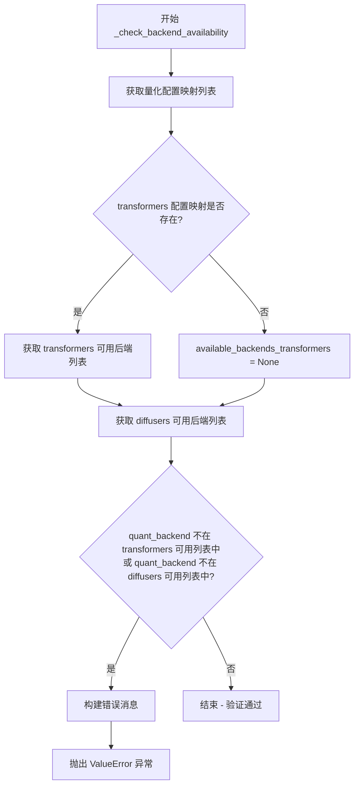

#### 带注释源码

```python
def _check_backend_availability(self, quant_backend: str):
    """
    检查指定的量化后端是否在 diffusers 和 transformers 中都可用。
    
    参数:
        quant_backend: str，要检查的量化后端名称
    异常:
        ValueError: 如果指定的量化后端在任一库中不存在
    """
    # 获取 transformers 和 diffusers 的量化配置映射列表
    quant_config_mapping_transformers, quant_config_mapping_diffusers = self._get_quant_config_list()

    # 获取 transformers 可用的后端列表（如果 transformers 可用）
    available_backends_transformers = (
        list(quant_config_mapping_transformers.keys()) if quant_config_mapping_transformers else None
    )
    # 获取 diffusers 可用的后端列表
    available_backends_diffusers = list(quant_config_mapping_diffusers.keys())

    # 检查提供的后端是否在任一库中不可用
    if (
        available_backends_transformers and quant_backend not in available_backends_transformers
    ) or quant_backend not in quant_config_mapping_diffusers:
        # 构建详细的错误消息，包含可用后端信息
        error_message = f"Provided quant_backend={quant_backend} was not found."
        if available_backends_transformers:
            error_message += f"\nAvailable ones (transformers): {available_backends_transformers}."
        error_message += f"\nAvailable ones (diffusers): {available_backends_diffusers}."
        # 抛出包含可用后端列表的 ValueError 异常
        raise ValueError(error_message)
```


### `PipelineQuantizationConfig._resolve_quant_config`

该方法负责为指定的模块名称解析并返回相应的量化配置对象。它首先检查是否存在粒度化的量化映射（granular quant_mapping），如果存在则直接使用；否则根据组件列表或全局配置判断是否需要对当前模块进行量化，并据此返回对应的量化配置实例或 None。

参数：

- `is_diffusers`：`bool`，指示使用的后端类型，True 表示 diffusers，False 表示 transformers
- `module_name`：`str`，需要解析量化配置的模块名称

返回值：`QuantizationConfigMixin | None`，返回解析后的量化配置对象，如果不存在适用的配置则返回 None

#### 流程图

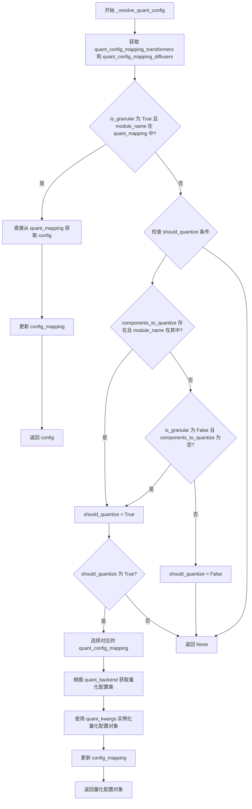

#### 带注释源码

```python
def _resolve_quant_config(self, is_diffusers: bool = True, module_name: str = None):
    """
    为指定的模块名称解析并返回量化配置。
    
    Args:
        is_diffusers: 指示是否使用 diffusers 后端，默认为 True
        module_name: 需要解析配置的模块名称
    
    Returns:
        量化配置对象，如果无适用配置则返回 None
    """
    # 获取 transformers 和 diffusers 两者的量化配置映射列表
    quant_config_mapping_transformers, quant_config_mapping_diffusers = self._get_quant_config_list()

    # 从实例属性获取量化映射和待量化组件列表
    quant_mapping = self.quant_mapping
    components_to_quantize = self.components_to_quantize

    # ========== 粒度情况 (Granular case) ==========
    # 如果启用了粒度模式，且当前模块名称存在于量化映射中
    if self.is_granular and module_name in quant_mapping:
        logger.debug(f"Initializing quantization config class for {module_name}.")
        # 直接从 quant_mapping 中获取该模块对应的配置类
        config = quant_mapping[module_name]
        # 更新配置映射记录（用于追踪哪些模块已被配置）
        self.config_mapping.update({module_name: config})
        return config

    # ========== 全局配置情况 (Global config case) ==========
    else:
        should_quantize = False
        
        # 情况1：只量化指定组件
        # 如果提供了 components_to_quantize 列表，且当前模块在列表中
        if components_to_quantize and module_name in components_to_quantize:
            should_quantize = True
        # 情况2：量化所有组件
        # 如果未启用粒度模式且未指定 components_to_quantize，则量化所有模块
        elif not self.is_granular and not components_to_quantize:
            should_quantize = True

        # 如果满足量化条件
        if should_quantize:
            logger.debug(f"Initializing quantization config class for {module_name}.")
            
            # 根据 is_diffusers 标志选择使用 diffusers 还是 transformers 的配置映射
            mapping_to_use = quant_config_mapping_diffusers if is_diffusers else quant_config_mapping_transformers
            
            # 从映射中获取对应的量化配置类
            quant_config_cls = mapping_to_use[self.quant_backend]
            
            # 获取初始化参数并实例化量化配置对象
            quant_kwargs = self.quant_kwargs
            quant_obj = quant_config_cls(**quant_kwargs)
            
            # 记录配置对象到映射表中
            self.config_mapping.update({module_name: quant_obj})
            return quant_obj

    # ========== 回退情况 ==========
    # 无适用配置时返回 None
    return None
```


### `PipelineQuantizationConfig._get_quant_config_list`

获取 transformers 和 diffusers 两个库的量化配置映射表（AutoQuantizationConfigMapping），用于验证和解析量化配置。

参数：

- `self`：`PipelineQuantizationConfig`，隐式参数，当前类的实例

返回值：`tuple[dict | None, dict]`，返回一个元组，包含两个量化配置映射字典：
- 第一个元素：transformers 库的量化配置映射（如果 transformers 可用则返回映射字典，否则返回 `None`）
- 第二个元素：diffusers 库的量化配置映射（始终返回映射字典）

#### 流程图

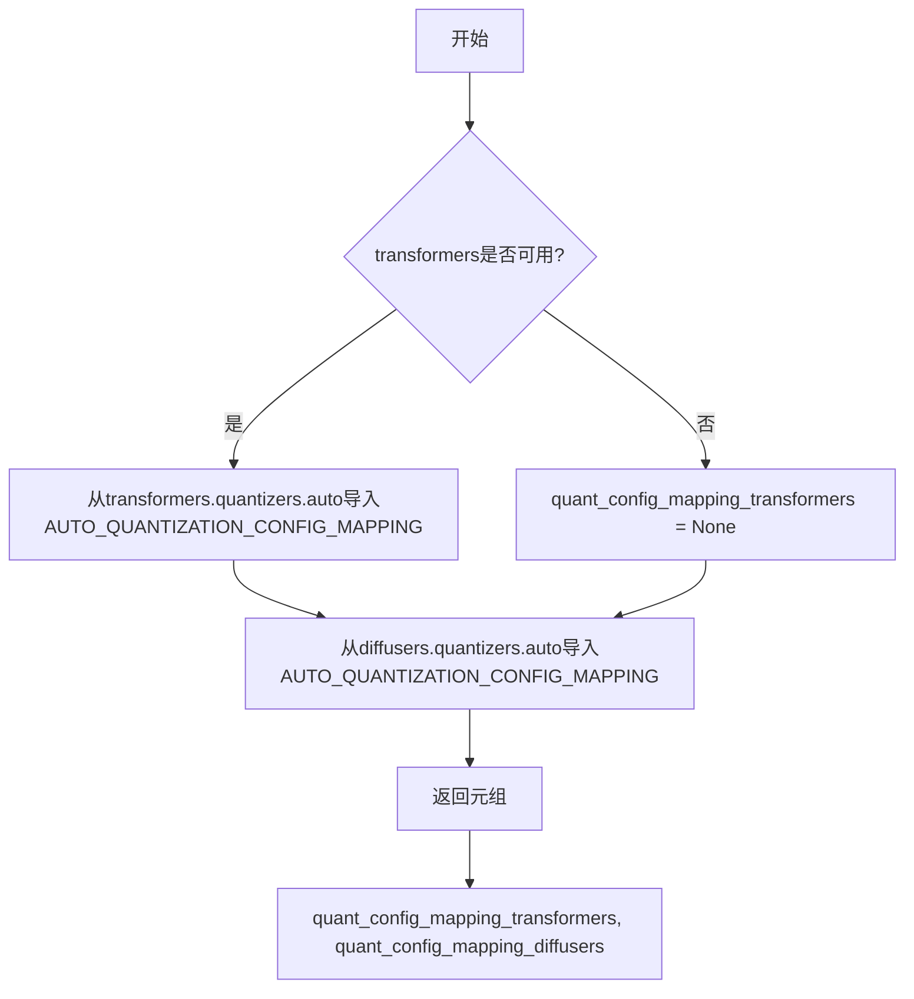

#### 带注释源码

```python
def _get_quant_config_list(self):
    # 检查transformers库是否可用
    if is_transformers_available():
        # 从transformers库中导入量化配置映射字典
        # 该映射定义了支持的量化后端及其对应的配置类
        from transformers.quantizers.auto import (
            AUTO_QUANTIZATION_CONFIG_MAPPING as quant_config_mapping_transformers,
        )
    else:
        # 如果transformers不可用，设置为None
        # 这在某些环境下（如纯diffusers环境）可能发生
        quant_config_mapping_transformers = None

    # 从diffusers库中导入量化配置映射字典
    # diffusers的量化配置始终可用
    from ..quantizers.auto import AUTO_QUANTIZATION_CONFIG_MAPPING as quant_config_mapping_diffusers

    # 返回两个库的量化配置映射元组
    # 返回格式: (transformers映射, diffusers映射)
    return quant_config_mapping_transformers, quant_config_mapping_diffusers
```


### `PipelineQuantizationConfig.__repr__`

该方法用于生成 `PipelineQuantizationConfig` 对象的字符串表示形式，通过遍历并拼接已排序的配置映射中的模块名称及其对应的量化配置信息。

参数： 无（仅包含隐式参数 `self`）

返回值：`str`，返回包含所有模块名称及其量化配置的可读字符串

#### 流程图

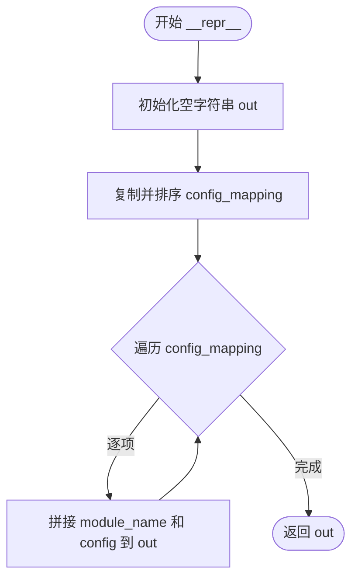

#### 带注释源码

```python
def __repr__(self):
    """
    生成对象的字符串表示形式。
    
    Returns:
        str: 包含所有模块名称及其对应量化配置的字符串，
             格式为 '{module_name} {config}' 的拼接结果。
    """
    out = ""  # 初始化输出字符串
    # 对 config_mapping 进行排序复制，确保输出顺序一致
    config_mapping = dict(sorted(self.config_mapping.copy().items()))
    # 遍历排序后的配置映射，拼接每个模块名称和对应的配置对象
    for module_name, config in config_mapping.items():
        out += f"{module_name} {config}"
    return out  # 返回拼接后的字符串表示
```

## 关键组件


### PipelineQuantizationConfig 类

核心配置类，用于在运行时动态管理 DiffusionPipeline 的量化配置，支持细粒度量化映射和全局量化策略两种模式。

### quant_backend

字符串类型，指定要使用的量化后端（如 "bitsandbytes"、"gptq" 等），需同时被 diffusers 和 transformers 支持。

### quant_kwargs

字典类型，初始化量化后端类所需的参数集合，如量化位数、量化方法等配置选项。

### components_to_quantize

列表或字符串类型，指定管道中需要量化的具体组件名称，支持部分模块选择性量化。

### quant_mapping

字典类型，自定义模块名到量化配置类的映射，允许用户精确控制每个组件的量化规格，优先级高于 quant_backend。

### is_granular

布尔类型标志，标识当前配置是否为细粒度模式，通过是否提供 quant_mapping 来自动判断。

### _resolve_quant_config 方法

核心解析方法，根据模块名返回对应的量化配置对象。支持细粒度映射查找和全局配置两种逻辑，采用惰性初始化策略，按需创建量化配置实例。

### _get_quant_config_list 方法

获取当前环境可用的量化配置映射列表，从 transformers 和 diffusers 两个库中分别加载可用的量化后端及其对应配置类。

### _validate_init_args 方法

初始化参数验证器，确保 quant_backend 和 quant_mapping 不同时指定，且至少提供一种量化配置方式，维护配置的一致性。

### _validate_init_kwargs_in_backends 方法

跨库签名验证器，比较 diffusers 和 transformers 中相同量化后端的配置类 __init__ 方法签名，确保参数兼容一致。

### _check_backend_availability 方法

后端可用性检查器，验证指定的后端是否同时在 diffusers 和 transformers 中可用，提供友好的错误提示。

### config_mapping

字典类型，内部配置账本，记录已解析的模块名称到量化配置对象的映射，用于配置追踪和调试。

### 惰性加载机制

通过 _resolve_quant_config 方法实现，按需创建量化配置对象而非在初始化时全部生成，优化内存占用。


## 问题及建议


### 已知问题

- **类型注解不完整**：多处参数类型注解缺少 `| None`，如 `quant_kwargs: dict[str, str | float | int | dict] = None` 应改为 `dict[str, str | float | int | dict] | None = None`
- **重复调用开销**：`_get_quant_config_list()` 在多个验证方法中被重复调用，没有缓存机制，导致重复导入模块
- **魔法字符串硬编码**：错误消息中的 "diffusers" 和 "transformers" 被硬编码在多处，应提取为常量以提高可维护性
- **异常处理粒度粗**：`except ImportError` 直接返回 `None`，可能导致后续代码在未明确告知的情况下失败
- **命名不一致**：类内部混用驼峰命名（如 `is_granular`）和下划线命名（如 `config_mapping`）
- **冗余的 None 检查**：在多处进行 `if xxx is not None` 检查后直接使用，而没有考虑早期返回或更清晰的控制流
- **config_mapping 非线程安全**：`config_mapping` 字典在并发场景下可能被竞争写入
- **文档注释不完整**：部分方法如 `_resolve_quant_config` 缺少详细的参数和返回值说明

### 优化建议

- 完善所有可空参数的类型注解，使用 Python 3.10+ 的 union 语法
- 在 `__init__` 或 `post_init` 中缓存 `_get_quant_config_list()` 的结果，避免重复调用
- 提取字符串常量（如 backend 名称、错误消息模板）到类或模块级别
- 为 `TransformersQuantConfigMixin` 定义明确的基类或协议，而非运行时尝试导入
- 考虑使用 `dataclass` 或 `pydantic` 简化配置对象的定义和验证逻辑
- 添加类型提示和详细的 docstring，尤其是针对公开方法
- 如果涉及多线程使用，考虑对 `config_mapping` 使用线程安全的数据结构或加锁机制

## 其它


### 设计目标与约束

该类旨在为DiffusionPipeline提供运行时动态量化配置的能力，支持两种量化配置方式：1) 通过quant_backend指定量化后端自动生成配置；2) 通过quant_mapping手动指定每个模块的量化规范。设计约束包括：quant_backend和quant_mapping不能同时指定；必须提供quant_backend或quant_mapping之一；quant_kwargs和quant_mapping不能同时为None。

### 错误处理与异常设计

代码通过_validate_init_args方法进行初始化参数校验，抛出ValueError的情况包括：同时指定quant_backend和quant_mapping；两者都未指定；quant_kwargs和quant_mapping都未提供。_validate_init_kwargs_in_backends方法验证transformers和diffusers的量化配置类初始化签名是否匹配。_validate_quant_mapping_args方法检查quant_mapping中提供的配置是否在可用配置列表中。_check_backend_availability方法验证指定的量化后端是否在可用后端列表中。所有错误信息都包含详细的可用选项提示。

### 数据流与状态机

数据流首先通过__init__接收参数，然后调用post_init进行初始化。post_init中设置is_granular标志（根据是否提供quant_mapping），然后调用_validate_init_args进行验证。验证通过后，用户可以通过_resolve_quant_config方法获取特定模块的量化配置，该方法支持两种模式：granular模式（精确匹配module_name）和global模式（根据components_to_quantize或默认全部量化）。配置解析时会根据is_diffusers标志选择使用transformers或diffusers的配置映射。

### 外部依赖与接口契约

外部依赖包括：1) transformers库（可选，用于量化配置映射）；2) diffusers内部的quantizers模块；3) inspect模块用于签名检查；4) utils模块提供的is_transformers_available和logging工具。接口契约方面：quant_backend参数接受字符串类型的后端名称；quant_kwargs接受字典类型的初始化参数；components_to_quantize接受字符串或字符串列表；quant_mapping接受模块名到量化配置类的映射字典。

### 性能考虑

_resolve_quant_config方法会缓存已解析的配置到config_mapping字典中，避免重复解析同一模块。_get_quant_config_list方法在每次调用时都会重新导入模块，可能影响性能，可以考虑缓存结果。inspect.signature调用在每次验证时都会执行，对于支持的后端数量较多的情况可能存在优化空间。

### 兼容性考虑

代码通过try-except处理transformers不可用的情况，通过is_transformers_available检查transformers的可用性。_validate_init_kwargs_in_backends方法专门处理transformers和diffusers两边配置签名可能不一致的情况，要求用户使用quant_mapping显式指定兼容的配置。

### 安全性考虑

代码本身不涉及敏感数据处理，主要关注配置的正确性验证。量化配置涉及模型参数的压缩，需要确保量化配置来源可信，避免使用未验证的自定义量化配置导致模型行为异常。

### 使用示例与配置选项详解

quant_backend方式：指定后端名称（如"bitsandbytes"），通过quant_kwargs传递后端初始化参数，components_to_quantize指定要量化的模块列表。quant_mapping方式：直接构建模块名到量化配置类的映射，适合需要精确控制每个模块量化规范的场景。

### 版本兼容性与未来考虑

当前代码依赖transformers的QuantizationConfigMixin接口，如果transformers版本升级导致接口变化，可能需要更新_validate_init_kwargs_in_backends的验证逻辑。未来可考虑支持更多量化后端，增加对自定义量化配置类的验证机制。

    