# `diffusers\src\diffusers\quantizers\quantization_config.py` 详细设计文档

这是一个模型量化配置模块，提供了多种量化方法（BitsAndBytes、GGUF、TorchAO、Quanto、ModelOpt）的配置类，用于在加载模型时进行量化配置，支持不同精度和压缩率的模型量化。

## 整体流程

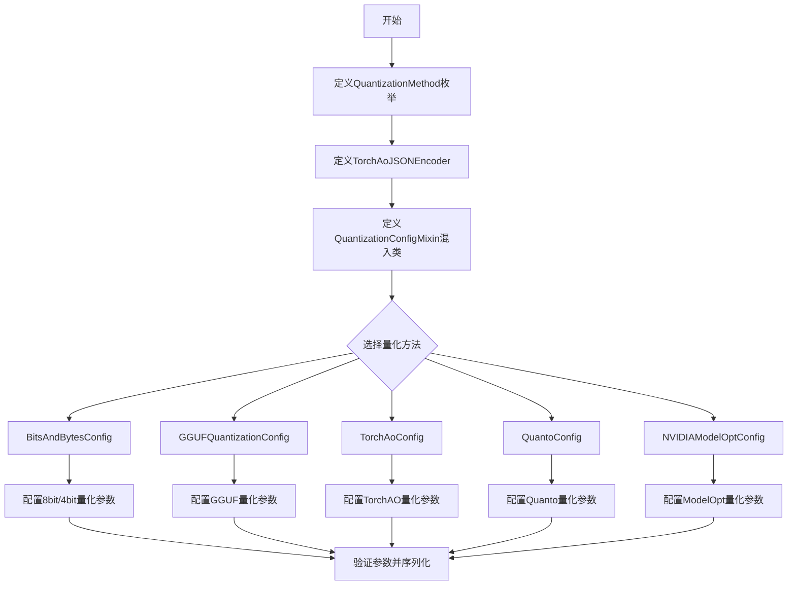
```mermaid
graph TD
A[开始] --> B[定义QuantizationMethod枚举]
B --> C[定义TorchAoJSONEncoder]
C --> D[定义QuantizationConfigMixin混入类]
D --> E{选择量化方法}
E --> F[BitsAndBytesConfig]
E --> G[GGUFQuantizationConfig]
E --> H[TorchAoConfig]
E --> I[QuantoConfig]
E --> J[NVIDIAModelOptConfig]
F --> K[配置8bit/4bit量化参数]
G --> L[配置GGUF量化参数]
H --> M[配置TorchAO量化参数]
I --> N[配置Quanto量化参数]
J --> O[配置ModelOpt量化参数]
K --> P[验证参数并序列化]
L --> P
M --> P
N --> P
O --> P
```

## 类结构

```
Enum: QuantizationMethod
├── BITS_AND_BYTES
├── GGUF
├── TORCHAO
├── QUANTO
└── MODELOPT
Class: TorchAoJSONEncoder (JSONEncoder)
Class: QuantizationConfigMixin (dataclass)
Class: BitsAndBytesConfig (QuantizationConfigMixin)
Class: GGUFQuantizationConfig (QuantizationConfigMixin)
Class: TorchAoConfig (QuantizationConfigMixin)
Class: QuantoConfig (QuantizationConfigMixin)
Class: NVIDIAModelOptConfig (QuantizationConfigMixin)
```

## 全局变量及字段


### `logger`
    
用于记录模块日志的日志记录器对象

类型：`logging.Logger`
    


### `QuantizationMethod`
    
量化方法枚举类，定义了支持的量化方法包括bitsandbytes、gguf、torchao、quanto和modelopt

类型：`Enum`
    


### `TorchAoJSONEncoder`
    
自定义JSON编码器，用于序列化torchAO的MappingType枚举到JSON

类型：`json.JSONEncoder`
    


### `QuantizationMethod.QuantizationMethod.BITS_AND_BYTES`
    
bitsandbytes量化方法的枚举值

类型：`str`
    


### `QuantizationMethod.QuantizationMethod.GGUF`
    
gguf量化方法的枚举值

类型：`str`
    


### `QuantizationMethod.QuantizationMethod.TORCHAO`
    
torchao量化方法的枚举值

类型：`str`
    


### `QuantizationMethod.QuantizationMethod.QUANTO`
    
quanto量化方法的枚举值

类型：`str`
    


### `QuantizationMethod.QuantizationMethod.MODELOPT`
    
modelopt量化方法的枚举值

类型：`str`
    


### `QuantizationConfigMixin.quant_method`
    
量化方法类型

类型：`QuantizationMethod`
    


### `QuantizationConfigMixin._exclude_attributes_at_init`
    
初始化时需要排除的属性列表

类型：`list`
    


### `BitsAndBytesConfig.quant_method`
    
量化方法类型

类型：`QuantizationMethod`
    


### `BitsAndBytesConfig._load_in_4bit`
    
内部标志，记录是否启用4位量化

类型：`bool`
    


### `BitsAndBytesConfig._load_in_8bit`
    
内部标志，记录是否启用8位量化

类型：`bool`
    


### `BitsAndBytesConfig.llm_int8_threshold`
    
LLM.int8()异常值检测阈值

类型：`float`
    


### `BitsAndBytesConfig.llm_int8_skip_modules`
    
8位量化时需要跳过的模块列表

类型：`list[str]`
    


### `BitsAndBytesConfig.llm_int8_enable_fp32_cpu_offload`
    
是否启用FP32 CPU卸载

类型：`bool`
    


### `BitsAndBytesConfig.llm_int8_has_fp16_weight`
    
是否使用16位主权重

类型：`bool`
    


### `BitsAndBytesConfig.bnb_4bit_compute_dtype`
    
4位量化计算数据类型

类型：`torch.dtype`
    


### `BitsAndBytesConfig.bnb_4bit_quant_type`
    
4位量化数据类型(fp4或nf4)

类型：`str`
    


### `BitsAndBytesConfig.bnb_4bit_use_double_quant`
    
是否使用嵌套双重量化

类型：`bool`
    


### `BitsAndBytesConfig.bnb_4bit_quant_storage`
    
4位量化参数存储类型

类型：`torch.dtype`
    


### `GGUFQuantizationConfig.quant_method`
    
量化方法类型

类型：`QuantizationMethod`
    


### `GGUFQuantizationConfig.compute_dtype`
    
GGUF量化计算数据类型

类型：`torch.dtype`
    


### `GGUFQuantizationConfig.pre_quantized`
    
标记是否为预量化模型

类型：`bool`
    


### `GGUFQuantizationConfig.modules_to_not_convert`
    
不进行转换的模块列表

类型：`list[str]`
    


### `TorchAoConfig.quant_method`
    
量化方法类型

类型：`QuantizationMethod`
    


### `TorchAoConfig.quant_type`
    
torchAO量化类型或配置对象

类型：`str | AOBaseConfig`
    


### `TorchAoConfig.modules_to_not_convert`
    
不进行量化的模块列表

类型：`list[str]`
    


### `TorchAoConfig.quant_type_kwargs`
    
量化类型的额外参数

类型：`dict`
    


### `QuantoConfig.quant_method`
    
量化方法类型

类型：`QuantizationMethod`
    


### `QuantoConfig.weights_dtype`
    
量化后权重的目标数据类型

类型：`str`
    


### `QuantoConfig.modules_to_not_convert`
    
不进行量化的模块列表

类型：`list[str]`
    


### `NVIDIAModelOptConfig.quant_method`
    
量化方法类型

类型：`QuantizationMethod`
    


### `NVIDIAModelOptConfig.quant_type`
    
modelopt量化类型字符串

类型：`str`
    


### `NVIDIAModelOptConfig.modules_to_not_convert`
    
不进行量化的模块列表

类型：`list[str]`
    


### `NVIDIAModelOptConfig.weight_only`
    
是否仅量化权重

类型：`bool`
    


### `NVIDIAModelOptConfig.channel_quantize`
    
通道量化轴

类型：`int`
    


### `NVIDIAModelOptConfig.block_quantize`
    
块量化大小

类型：`int`
    


### `NVIDIAModelOptConfig.calib_cfg`
    
校准配置字典

类型：`dict`
    


### `NVIDIAModelOptConfig.forward_loop`
    
校准时使用的前向传播循环函数

类型：`Callable`
    


### `NVIDIAModelOptConfig.scale_channel_quantize`
    
缩放通道量化轴

类型：`int`
    


### `NVIDIAModelOptConfig.scale_block_quantize`
    
缩放块大小

类型：`int`
    


### `NVIDIAModelOptConfig.modelopt_config`
    
modelopt自定义配置字典

类型：`dict`
    


### `NVIDIAModelOptConfig.disable_conv_quantization`
    
是否禁用卷积层量化

类型：`bool`
    


### `NVIDIAModelOptConfig.quanttype_to_numbits`
    
量化类型到位数的映射字典(类属性)

类型：`dict`
    


### `NVIDIAModelOptConfig.quanttype_to_scalingbits`
    
量化类型到缩放位数的映射字典(类属性)

类型：`dict`
    
    

## 全局函数及方法


### `is_torch_available`

该函数用于检查当前 Python 环境中是否安装了 PyTorch 库。如果安装了 PyTorch，则返回 `True`，否则返回 `False`。此函数通常用于条件导入 PyTorch 或条件执行依赖于 PyTorch 的代码逻辑。

参数： 无

返回值：`bool`，返回 `True` 表示 PyTorch 可用并已安装；返回 `False` 表示 PyTorch 不可用或未安装。

#### 流程图

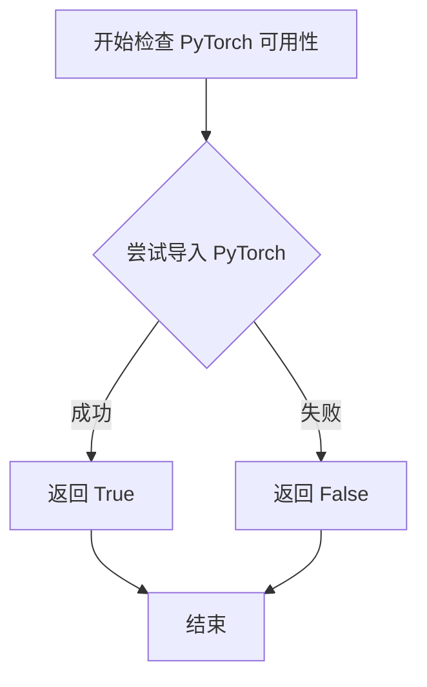
```mermaid
flowchart TD
    A[开始检查 PyTorch 可用性] --> B{尝试导入 PyTorch}
    B -->|成功| C[返回 True]
    B -->|失败| D[返回 False]
    C --> E[结束]
    D --> E
```

#### 带注释源码

```python
# 该函数定义在 ..utils 模块中（从相对导入 ..utils 可知）
# 当前文件中的使用方式如下：

from ..utils import is_torch_available, is_torchao_available, is_torchao_version, logging

# 条件导入：仅当 PyTorch 可用时才导入 torch 模块
if is_torch_available():
    import torch

# 在代码中的多处使用场景：
# 1. 用于条件导入 torch
# 2. 用于检查是否可以使用 torch 的相关功能（如 BitsAndBytesConfig 中的 dtype 处理）
# 3. 用于判断是否支持某些特定的量化方法
```

#### 补充说明

| 项目 | 说明 |
|------|------|
| **模块来源** | `..utils`（上级目录的 utils 模块） |
| **调用场景** | 条件导入 `torch`、条件执行 PyTorch 相关逻辑 |
| **依赖关系** | 依赖 `importlib` 或类似的机制来检测包是否已安装 |
| **异常处理** | 如果 PyTorch 未安装，函数应捕获 ImportError 并返回 False，而不是抛出异常 |


根据提供的代码，我分析如下：

### `is_torchao_available`

这是一个从 `..utils` 模块导入的全局函数，用于检查 `torchao` 库是否可用。

参数： 无

返回值：`bool`，返回 `True` 表示 `torchao` 库已安装且可用，返回 `False` 表示不可用。

#### 流程图

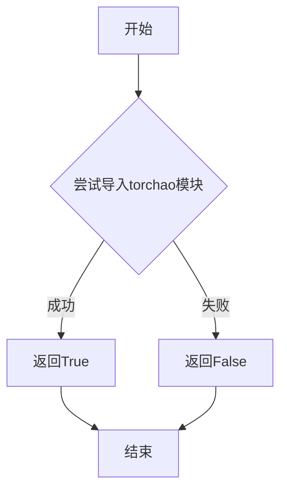
```mermaid
flowchart TD
    A[开始] --> B{尝试导入torchao模块}
    B -->|成功| C[返回True]
    B -->|失败| D[返回False]
    C --> E[结束]
    D --> E
```

#### 带注释源码

```
# 该函数定义在 ..utils 模块中（diffusers/utils/__init__.py）
# 以下为基于代码使用方式的推断实现

def is_torchao_available() -> bool:
    """
    检查 torchao 库是否已安装且可用。
    
    通常实现方式：
    1. 尝试使用 importlib.metadata.version('torchao') 获取版本
    2. 如果成功获取版本号，返回 True
    3. 如果抛出异常（包未安装），返回 False
    
    或者：
    1. 尝试 import torchao
    2. 如果成功导入，返回 True
    3. 如果导入失败，返回 False
    """
    # 具体实现取决于 ..utils 模块的定义
    pass
```

---

### 说明

从提供的代码中可以看到：

```python
from ..utils import is_torch_available, is_torchao_available, is_torchao_version, logging
```

`is_torchao_available` 函数定义在 `diffusers` 包的 `utils` 模块中，未包含在当前代码文件内。该函数在代码中被多次使用：

1. **条件导入**：`if is_torchao_available():` 用于条件性地导入 `torchao.quantization.quant_primitives` 模块
2. **配置验证**：在 `TorchAoConfig` 类中与 `is_torchao_version` 配合使用，验证 `torchao` 版本并提供相应的配置选项

如需获取 `is_torchao_available` 的完整源码，请查阅 `diffusers/utils/__init__.py` 文件。


从给定的代码中可以看到，`is_torchao_version` 函数是 **从 `..utils` 模块导入的外部函数**，并未在该代码文件中定义。它通过 `from ..utils import is_torchao_available, is_torchao_version, logging` 导入，并在代码中多次被调用。

下面是从代码使用方式中提取的该函数的信息：

### is_torchao_version

用于检查当前安装的 torchao 版本是否满足指定的条件比较。

参数：

- `op`：`str`，比较运算符（如 `"<="`, `">"`, `"=="`, `"<"` 等）
- `version`：`str`，要比较的版本号字符串（如 `"0.9.0"`, `"0.14.1"`）

返回值：`bool`，如果当前 torchao 版本满足指定条件则返回 `True`，否则返回 `False`

#### 流程图

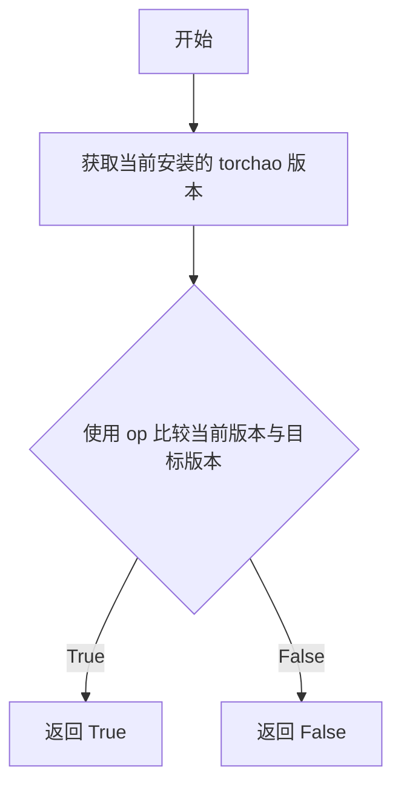
```mermaid
flowchart TD
    A[开始] --> B[获取当前安装的 torchao 版本]
    B --> C{使用 op 比较当前版本与目标版本}
    C -->|True| D[返回 True]
    C -->|False| E[返回 False]
```

#### 带注释源码

```python
# 该函数定义在 diffusers 库的 utils 模块中
# 以下是基于代码使用方式推断的函数实现逻辑

def is_torchao_version(op: str, version: str) -> bool:
    """
    检查当前安装的 torchao 版本是否满足指定的条件比较。
    
    该函数通过比较当前安装的 torchao 版本与传入的版本号，
    返回布尔值来表示版本是否满足条件。
    
    Args:
        op: 比较运算符，支持 ">=", "<=", ">", "<", "==", "!=" 等
        version: 要比较的版本号字符串，格式如 "0.9.0", "0.14.1"
    
    Returns:
        bool: 如果当前 torchao 版本满足指定条件返回 True，否则返回 False
    
    Example Usage:
        # 在代码中的使用方式：
        if is_torchao_version("<=", "0.9.0"):
            raise ValueError("...")
        
        if is_torchao_version("<=", "0.14.1"):
            from torchao.quantization import fpx_weight_only
    """
    from packaging import version
    import importlib.metadata
    
    try:
        # 获取当前安装的 torchao 版本
        current_version = importlib.metadata.version("torchao")
    except importlib.metadata.PackageNotFoundError:
        # 如果 torchao 未安装，返回 False
        return False
    
    # 使用 packaging.version 进行版本比较
    # 将运算符字符串转换为实际的比较操作
    current = version.parse(current_version)
    target = version.parse(version)
    
    if op == ">=":
        return current >= target
    elif op == "<=":
        return current <= target
    elif op == ">":
        return current > target
    elif op == "<":
        return current < target
    elif op == "==":
        return current == target
    elif op == "!=":
        return current != target
    else:
        raise ValueError(f"Unsupported operator: {op}")
```

---

**注意**：由于 `is_torchao_version` 函数定义在外部模块 (`..utils`) 中，未在当前代码文件中直接定义，因此以上信息基于代码中的使用方式进行推断。如需获取完整的实现细节，建议查看 `diffusers` 库的 `utils` 模块源文件。


### `logging.get_logger`

获取一个与指定模块关联的日志记录器实例，用于在该模块中记录日志。

参数：

- `name`：`str`，日志记录器的名称，通常传入 `__name__` 以标识日志来源的模块。

返回值：`logging.Logger`，返回一个 `logging.Logger` 对象，可用于记录不同级别的日志信息。

#### 流程图

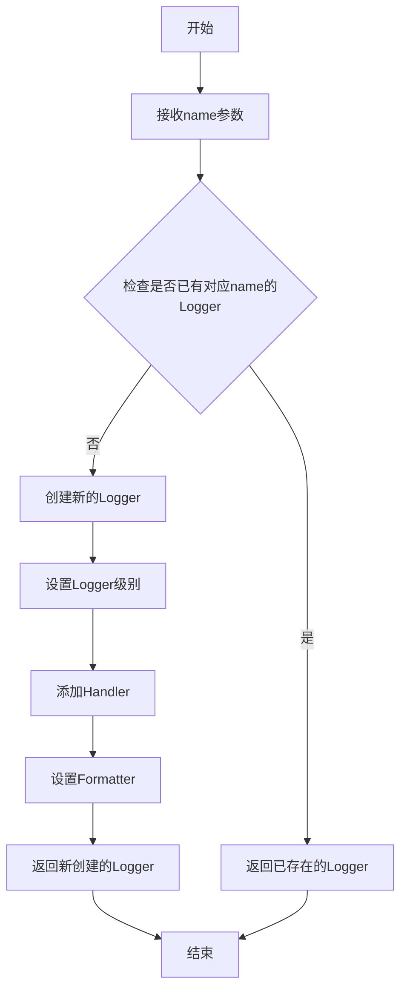
```mermaid
flowchart TD
    A[开始] --> B[接收name参数]
    B --> C{检查是否已有对应name的Logger}
    C -->|是| D[返回已存在的Logger]
    C -->|否| E[创建新的Logger]
    E --> F[设置Logger级别]
    F --> G[添加Handler]
    G --> H[设置Formatter]
    H --> I[返回新创建的Logger]
    I --> J[结束]
    D --> J
```

#### 带注释源码

```python
# 在代码中的使用方式：
from ..utils import is_torch_available, is_torchao_available, is_torchao_version, logging

# 使用 logging.get_logger 获取当前模块的日志记录器
# __name__ 是 Python 内置变量，表示当前模块的完整路径
logger = logging.get_logger(__name__)

# 示例用法：
# logger.info("This is an info message")
# logger.warning("This is a warning message")
# logger.error("This is an error message")

# 该 logger 对象被用于在 BitsAndBytesConfig 类中输出警告信息：
# if kwargs and not all(k in self._exclude_attributes_at_init for k in kwargs):
#     logger.warning(f"Unused kwargs: {list(kwargs.keys())}. These kwargs are not used in {self.__class__}.")
```

#### 补充说明

| 属性 | 说明 |
|------|------|
| 所属模块 | `..utils.logging` (Hugging Face diffusers 工具模块) |
| 用途 | 创建或获取指定名称的日志记录器，实现模块级日志管理 |
| 常见调用 | `logging.get_logger(__name__)` 获取当前模块的日志记录器 |
| 返回值类型 | `logging.Logger` |


### `TorchAoJSONEncoder.default`

该方法是自定义 JSON 编码器 `TorchAoJSONEncoder` 的核心方法，用于处理 `torchao` 库中的 `MappingType` 枚举类型的序列化，将 `MappingType` 对象转换为其名称字符串以便 JSON 序列化，同时对其他类型调用父类的默认处理逻辑。

参数：

- `self`：`TorchAoJSONEncoder`，JSON 编码器实例，方法调用者
- `obj`：`Any`，需要被 JSON 序列化的对象，可能是 `MappingType` 枚举或其他任意类型

返回值：`Any`，如果对象是 `MappingType` 类型则返回其名称（`str`），否则返回父类 `json.JSONEncoder.default()` 的处理结果

#### 流程图

```mermaid
flowchart TD
    A[开始 default 方法] --> B{判断 obj 是否为 MappingType}
    B -->|是| C[返回 obj.name 字符串]
    B -->|否| D[调用 super().default obj]
    D --> E[返回父类处理结果]
    C --> F[结束]
    E --> F
```

#### 带注释源码

```python
class TorchAoJSONEncoder(json.JSONEncoder):
    def default(self, obj):
        """
        自定义 JSON 序列化方法，处理特殊类型的编码
        
        参数:
            obj: Any - 需要序列化的对象
            
        返回值:
            Any - MappingType 返回其名称字符串，其他类型返回父类处理结果
        """
        # 检查对象是否为 MappingType 枚举类型
        if isinstance(obj, MappingType):
            # MappingType 是 torchao 中的枚举类型，转换为其名称字符串
            # 例如 MappingType.FLOAT -> "FLOAT"
            return obj.name
        # 对于其他未知类型，调用父类的默认处理方法
        return super().default(obj)
```


### `QuantizationConfigMixin.from_dict`

该类方法用于从 Python 字典参数实例化 `QuantizationConfigMixin` 配置对象，支持通过 `kwargs` 覆盖字典中的参数，并可选返回未使用的关键字参数。

参数：

- `config_dict`：`dict[str, Any]`，用于实例化配置对象的字典
- `return_unused_kwargs`：`bool`，可选，默认为 `False`，是否返回未使用的关键字参数列表，用于 `PreTrainedModel` 的 `from_pretrained` 方法
- `kwargs`：`dict[str, Any]`，用于初始化配置对象的额外参数

返回值：`QuantizationConfigMixin`，从参数实例化的配置对象；若 `return_unused_kwargs` 为 `True`，则返回元组 `(QuantizationConfigMixin, dict[str, Any])`

#### 流程图

```mermaid
flowchart TD
    A[开始 from_dict] --> B[使用 config_dict 初始化 config 对象: config = cls(**config_dict)]
    C[初始化空列表 to_remove] --> D{遍历 kwargs.items()}
    D -->|hasattr(config, key)| E[使用 setattr 设置属性并记录 key 到 to_remove]
    D -->|不满足条件| F[不处理该 key]
    E --> G{遍历 to_remove}
    G --> H[从 kwargs 中移除已处理的 key]
    H --> I{return_unused_kwargs == True?}
    I -->|True| J[返回 (config, kwargs)]
    I -->|False| K[返回 config]
```

#### 带注释源码

```python
@classmethod
def from_dict(cls, config_dict, return_unused_kwargs=False, **kwargs):
    """
    Instantiates a [`QuantizationConfigMixin`] from a Python dictionary of parameters.

    Args:
        config_dict (`dict[str, Any]`):
            Dictionary that will be used to instantiate the configuration object.
        return_unused_kwargs (`bool`, *optional*, defaults to `False`):
            Whether or not to return a list of unused keyword arguments. Used for `from_pretrained` method in
            `PreTrainedModel`.
        kwargs (`dict[str, Any]`):
            Additional parameters from which to initialize the configuration object.

    Returns:
        [`QuantizationConfigMixin`]: The configuration object instantiated from those parameters.
    """

    # 步骤1: 使用传入的字典参数通过类的构造函数创建配置对象实例
    config = cls(**config_dict)

    # 步骤2: 遍历额外的关键字参数 kwargs，尝试将匹配的属性设置到 config 对象
    to_remove = []  # 用于记录已处理的 key
    for key, value in kwargs.items():
        if hasattr(config, key):  # 检查 config 对象是否具有该属性
            setattr(config, key, value)  # 设置属性值
            to_remove.append(key)  # 记录需要移除的 key

    # 步骤3: 从 kwargs 中移除已处理的 key，保留未使用的参数
    for key in to_remove:
        kwargs.pop(key, None)

    # 步骤4: 根据 return_unused_kwargs 标志决定返回值
    if return_unused_kwargs:
        return config, kwargs  # 返回配置对象和未使用的 kwargs
    else:
        return config  # 仅返回配置对象
```


### `QuantizationConfigMixin.to_json_file`

将当前配置实例序列化为 JSON 格式并保存到指定的文件路径中。

参数：

- `json_file_path`：`str | os.PathLike`，要保存的 JSON 文件路径

返回值：`None`，无返回值（直接将配置写入文件）

#### 流程图

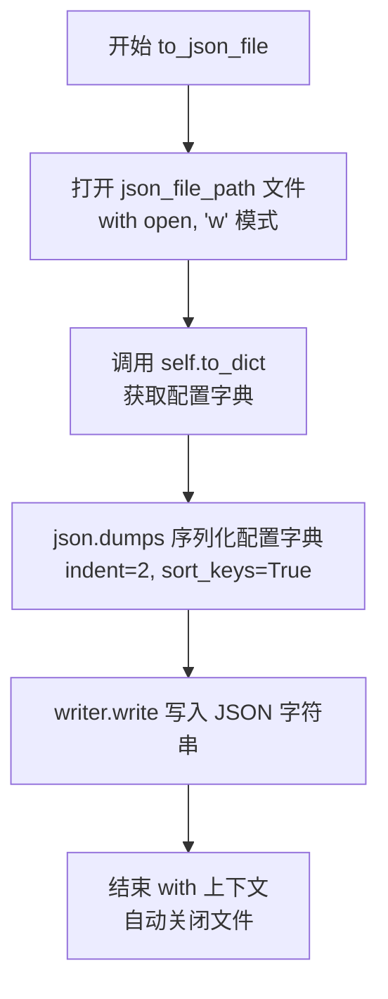
```mermaid
flowchart TD
    A[开始 to_json_file] --> B[打开 json_file_path 文件<br/>with open, 'w' 模式]
    B --> C[调用 self.to_dict<br/>获取配置字典]
    C --> D[json.dumps 序列化配置字典<br/>indent=2, sort_keys=True]
    D --> E[writer.write 写入 JSON 字符串]
    E --> F[结束 with 上下文<br/>自动关闭文件]
```

#### 带注释源码

```python
def to_json_file(self, json_file_path: str | os.PathLike):
    """
    Save this instance to a JSON file.

    Args:
        json_file_path (`str` or `os.PathLike`):
            Path to the JSON file in which this configuration instance's parameters will be saved.
        use_diff (`bool`, *optional*, defaults to `True`):
            If set to `True`, only the difference between the config instance and the default
            `QuantizationConfig()` is serialized to JSON file.
    """
    # 使用 with 语句确保文件正确关闭
    with open(json_file_path, "w", encoding="utf-8") as writer:
        # 将当前实例的所有属性转换为字典
        config_dict = self.to_dict()
        # 将字典序列化为格式化的 JSON 字符串
        # indent=2: 使用 2 空格缩进
        # sort_keys=True: 按键名排序
        json_string = json.dumps(config_dict, indent=2, sort_keys=True) + "\n"

        # 将 JSON 字符串写入文件
        writer.write(json_string)
```

#### 备注

- **技术债务**：文档字符串中描述了 `use_diff` 参数，但在实际实现中并未使用该参数。这意味着 `use_diff` 功能尚未实现，但文档中已经描述了该特性。
- **依赖方法**：该方法依赖 `to_dict()` 方法来获取配置字典的序列化表示。
- **错误处理**：未包含显式的异常处理，如文件写入失败、权限问题等情况的处理。


### `QuantizationConfigMixin.to_dict`

将当前量化配置实例序列化为 Python 字典。

参数：

-  `self`：`QuantizationConfigMixin`，调用此方法的配置实例本身

返回值：`dict[str, Any]`，包含该配置实例所有属性的字典

#### 流程图

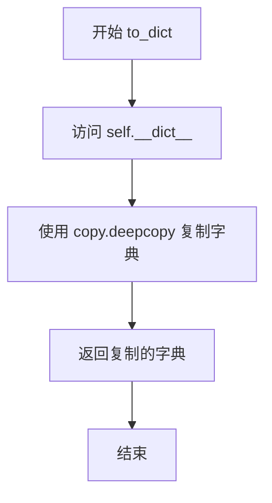
```mermaid
flowchart TD
    A[开始 to_dict] --> B[访问 self.__dict__]
    B --> C[使用 copy.deepcopy 复制字典]
    C --> D[返回复制的字典]
    D --> E[结束]
```

#### 带注释源码

```python
def to_dict(self) -> dict[str, Any]:
    """
    Serializes this instance to a Python dictionary.
    
    Returns:
        `dict[str, Any]`: Dictionary of all the attributes that make up 
                         this configuration instance.
    """
    # 使用 copy.deepcopy 深拷贝实例的 __dict__ 属性
    # __dict__ 包含对象的所有实例属性
    # deepcopy 确保返回的字典是独立副本，避免外部修改影响原始对象
    return copy.deepcopy(self.__dict__)
```


### `QuantizationConfigMixin.__iter__`

该方法实现 Python 的迭代器协议，使 `QuantizationConfigMixin` 及其子类实例可以直接通过 `dict(obj)` 转换为字典，或在 `for` 循环中迭代对象的属性名称和值。

参数：

- 该方法无显式参数（仅包含 `self`）

返回值：`Generator[tuple[str, Any], None, None]`，生成器，逐个产出属性名与属性值的元组

#### 流程图

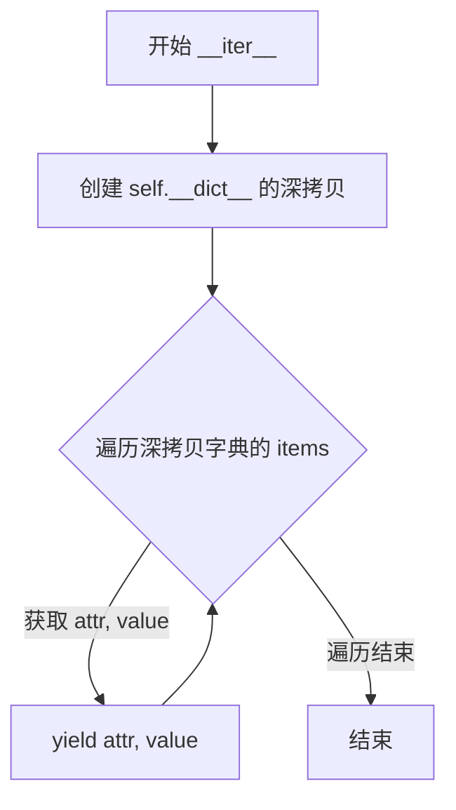
```mermaid
flowchart TD
    A[开始 __iter__] --> B[创建 self.__dict__ 的深拷贝]
    B --> C{遍历深拷贝字典的 items}
    C -->|获取 attr, value| D[yield attr, value]
    D --> C
    C -->|遍历结束| E[结束]
```

#### 带注释源码

```python
def __iter__(self):
    """
    allows `dict(obj)` for situations where obj may be a dict or QuantizationConfigMixin
    
    该方法实现 Python 迭代器协议，使 QuantizationConfigMixin 实例可以：
    1. 通过 dict(obj) 转换为字典
    2. 在 for 循环中直接迭代属性
    """
    # 使用 copy.deepcopy 确保迭代过程中原始对象的属性不会被修改
    # 防止迭代时对 self.__dict__ 的修改影响遍历过程
    for attr, value in copy.deepcopy(self.__dict__).items():
        # yield 返回属性名和属性值的元组
        # 这使得 dict(obj) 可以正确地将对象转换为 {attr: value} 字典
        yield attr, value
```


### `QuantizationConfigMixin.__repr__`

返回量化配置对象的字符串表示形式，格式为 "类名 + JSON字符串"，用于调试和日志输出。

参数：
- （无显式参数，隐含参数 `self` 为 `QuantizationConfigMixin` 实例）

返回值：`str`，返回对象的可读字符串表示，包含类名和序列化后的 JSON 配置内容。

#### 流程图

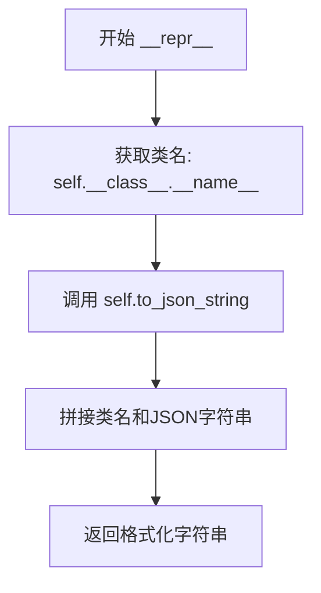
```mermaid
flowchart TD
    A[开始 __repr__] --> B[获取类名: self.__class__.__name__]
    B --> C[调用 self.to_json_string]
    C --> D[拼接类名和JSON字符串]
    D --> E[返回格式化字符串]
```

#### 带注释源码

```python
def __repr__(self):
    """
    返回对象的官方字符串表示。
    
    格式为: "类名 JSON字符串"
    例如: "BitsAndBytesConfig {...}"
    
    Returns:
        str: 包含类名和JSON序列化结果的字符串
    """
    return f"{self.__class__.__name__} {self.to_json_string()}"
```


### `QuantizationConfigMixin.to_json_string`

将当前量化配置实例序列化为 JSON 字符串。根据 `use_diff` 参数的值，可以选择输出完整的配置字典或仅输出与默认配置不同的部分。

参数：

- `use_diff`：`bool`，可选，默认为 `True`。如果设为 `True`，则只序列化该配置实例与默认 `PretrainedConfig()` 之间的差异部分为 JSON 字符串；如果设为 `False`，则序列化完整的配置实例所有属性。

返回值：`str`，包含该配置实例所有属性（或差异部分）的 JSON 格式字符串。

#### 流程图

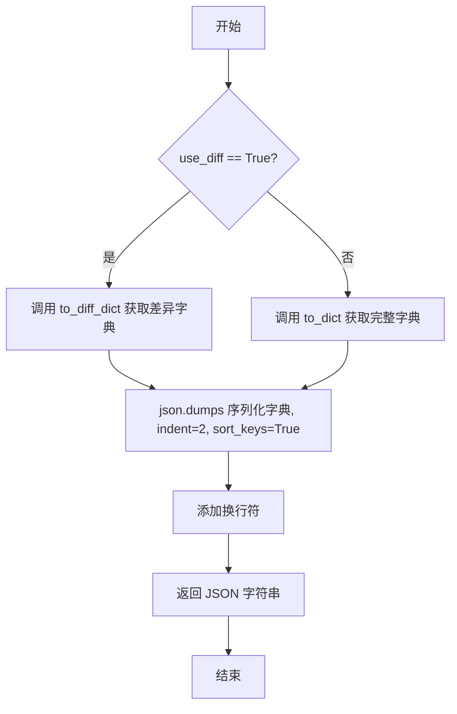
```mermaid
flowchart TD
    A[开始] --> B{use_diff == True?}
    B -->|是| C[调用 to_diff_dict 获取差异字典]
    B -->|否| D[调用 to_dict 获取完整字典]
    C --> E[json.dumps 序列化字典, indent=2, sort_keys=True]
    D --> E
    E --> F[添加换行符 \n]
    F --> G[返回 JSON 字符串]
    G --> H[结束]
```

#### 带注释源码

```python
def to_json_string(self, use_diff: bool = True) -> str:
    """
    Serializes this instance to a JSON string.

    Args:
        use_diff (`bool`, *optional*, defaults to `True`):
            If set to `True`, only the difference between the config instance and the default `PretrainedConfig()`
            is serialized to JSON string.

    Returns:
        `str`: String containing all the attributes that make up this configuration instance in JSON format.
    """
    # 根据 use_diff 参数决定使用哪种序列化方式
    if use_diff is True:
        # 仅获取与默认配置不同的属性
        config_dict = self.to_diff_dict()
    else:
        # 获取所有属性
        config_dict = self.to_dict()
    
    # 使用 json.dumps 将字典序列化为格式化的 JSON 字符串
    # indent=2: 使用 2 空格缩进
    # sort_keys=True: 按键的字母顺序排序
    # 添加换行符以确保文件以换行符结尾
    return json.dumps(config_dict, indent=2, sort_keys=True) + "\n"
```


### `QuantizationConfigMixin.update`

该方法用于动态更新类实例的属性，通过检查 `kwargs` 中的键是否存在于当前实例中，如果存在则使用 `setattr` 进行更新，最终返回未被使用的 kwargs 字典。

参数：

- `kwargs`：`dict[str, Any]`，表示要用来更新类实例属性的字典参数

返回值：`dict[str, Any]`，返回包含所有未被用于更新实例的键值对字典

#### 流程图

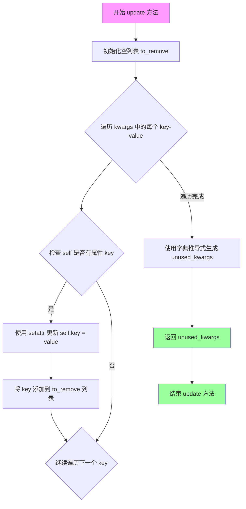
```mermaid
flowchart TD
    A[开始 update 方法] --> B[初始化空列表 to_remove]
    B --> C{遍历 kwargs 中的每个 key-value}
    C --> D{检查 self 是否有属性 key}
    D -->|是| E[使用 setattr 更新 self.key = value]
    E --> F[将 key 添加到 to_remove 列表]
    F --> G{继续遍历下一个 key}
    D -->|否| G
    C -->|遍历完成| H[使用字典推导式生成 unused_kwargs]
    H --> I[返回 unused_kwargs]
    I --> J[结束 update 方法]
    
    style A fill:#f9f,color:#333
    style I fill:#9f9,color:#333
    style J fill:#9f9,color:#333
```

#### 带注释源码

```python
def update(self, **kwargs):
    """
    Updates attributes of this class instance with attributes from `kwargs` if they match existing attributes,
    returning all the unused kwargs.

    Args:
        kwargs (`dict[str, Any]`):
            Dictionary of attributes to tentatively update this class.

    Returns:
        `dict[str, Any]`: Dictionary containing all the key-value pairs that were not used to update the instance.
    """
    # 用于存储已经被更新过的 key
    to_remove = []
    # 遍历传入的 kwargs 字典中的每个键值对
    for key, value in kwargs.items():
        # 检查当前类实例是否具有该属性
        if hasattr(self, key):
            # 如果存在则使用 setattr 更新该属性
            setattr(self, key, value)
            # 将已更新的 key 加入到 to_remove 列表中
            to_remove.append(key)

    # 移除所有已经被更新的属性，构建未被使用的 kwargs 字典
    # 这里使用字典推导式，排除已经在 to_remove 列表中的 key
    unused_kwargs = {key: value for key, value in kwargs.items() if key not in to_remove}
    # 返回未被使用的 kwargs 字典
    return unused_kwargs
```


### `BitsAndBytesConfig.__init__`

这是 BitsAndBytesConfig 类的初始化方法，用于配置 bitsandbytes 量化方法的参数。它设置了 8-bit 和 4-bit 量化的各种选项，包括阈值、计算数据类型、量化类型等，并执行基本的安全性检查。

参数：

- `load_in_8bit`：`bool`，默认为 `False`，用于启用 LLM.int8() 的 8-bit 量化
- `load_in_4bit`：`bool`，默认为 `False`，用于启用 FP4/NF4 的 4-bit 量化
- `llm_int8_threshold`：`float`，默认为 `6.0`，用于异常值检测的阈值
- `llm_int8_skip_modules`：`list[str]`，可选，不转换为 8-bit 的模块列表
- `llm_int8_enable_fp32_cpu_offload`：`bool`，默认为 `False`，用于在不同部分启用 fp32 CPU 卸载
- `llm_int8_has_fp16_weight`：`bool`，默认为 `False`，用于使用 16-bit 主权重运行 LLM.int8()
- `bnb_4bit_compute_dtype`：`torch.dtype | str | None`，默认为 `None`（实际为 torch.float32），设置计算类型
- `bnb_4bit_quant_type`：`str`，默认为 `"fp4"`，设置量化数据类型（fp4 或 nf4）
- `bnb_4bit_use_double_quant`：`bool`，默认为 `False`，用于嵌套量化
- `bnb_4bit_quant_storage`：`torch.dtype | str | None`，默认为 `None`（实际为 torch.uint8），设置存储类型
- `kwargs`：`dict[str, Any]`，可选，用于初始化配置对象的附加参数

返回值：`None`，无返回值（构造函数）

#### 流程图

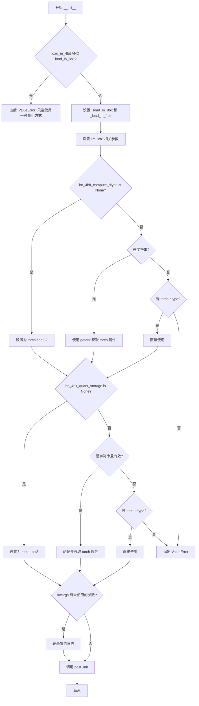
```mermaid
flowchart TD
    A[开始 __init__] --> B{load_in_4bit AND load_in_8bit?}
    B -->|是| C[抛出 ValueError: 只能使用一种量化方式]
    B -->|否| D[设置 _load_in_8bit 和 _load_in_4bit]
    D --> E[设置 llm_int8 相关参数]
    E --> F{bn_4bit_compute_dtype is None?}
    F -->|是| G[设置为 torch.float32]
    F -->|否| H{是字符串?}
    H -->|是| I[使用 getattr 获取 torch 属性]
    H -->|否| J{是 torch.dtype?}
    J -->|是| K[直接使用]
    J -->|否| L[抛出 ValueError]
    G --> M{bn_4bit_quant_storage is None?}
    I --> M
    K --> M
    M -->|是| N[设置为 torch.uint8]
    M -->|否| O{是字符串且有效?}
    O -->|是| P[验证并获取 torch 属性]
    O -->|否| Q{是 torch.dtype?}
    Q -->|是| R[直接使用]
    Q -->|否| L
    N --> S{kwargs 有未使用的参数?}
    P --> S
    R --> S
    S -->|是| T[记录警告日志]
    S -->|否| U[调用 post_init]
    T --> U
    U --> V[结束]
```

#### 带注释源码

```python
def __init__(
    self,
    load_in_8bit=False,                          # 是否启用 8-bit 量化
    load_in_4bit=False,                          # 是否启用 4-bit 量化
    llm_int8_threshold=6.0,                      # LLM.int8() 异常值检测阈值
    llm_int8_skip_modules=None,                 # 不进行 8-bit 转换的模块列表
    llm_int8_enable_fp32_cpu_offload=False,     # 启用 FP32 CPU 卸载
    llm_int8_has_fp16_weight=False,             # 使用 16 位主权重
    bnb_4bit_compute_dtype=None,                 # 4-bit 计算数据类型
    bnb_4bit_quant_type="fp4",                   # 4-bit 量化类型 (fp4/nf4)
    bnb_4bit_use_double_quant=False,             # 是否使用双重量化
    bnb_4bit_quant_storage=None,                 # 4-bit 量化存储类型
    **kwargs,                                     # 其他附加参数
):
    # 设置量化方法为 BITS_AND_BYTES
    self.quant_method = QuantizationMethod.BITS_AND_BYTES

    # 检查 load_in_4bit 和 load_in_8bit 是否互斥
    if load_in_4bit and load_in_8bit:
        raise ValueError("load_in_4bit and load_in_8bit are both True, but only one can be used at the same time")

    # 设置内部属性（使用下划线前缀的私有属性）
    self._load_in_8bit = load_in_8bit
    self._load_in_4bit = load_in_4bit
    self.llm_int8_threshold = llm_int8_threshold
    self.llm_int8_skip_modules = llm_int8_skip_modules
    self.llm_int8_enable_fp32_cpu_offload = llm_int8_enable_fp32_cpu_offload
    self.llm_int8_has_fp16_weight = llm_int8_has_fp16_weight
    self.bnb_4bit_quant_type = bnb_4bit_quant_type
    self.bnb_4bit_use_double_quant = bnb_4bit_use_double_quant

    # 处理 bnb_4bit_compute_dtype：如果为 None，默认为 torch.float32
    if bnb_4bit_compute_dtype is None:
        self.bnb_4bit_compute_dtype = torch.float32
    # 如果是字符串，使用 getattr 获取对应的 torch dtype
    elif isinstance(bnb_4bit_compute_dtype, str):
        self.bnb_4bit_compute_dtype = getattr(torch, bnb_4bit_compute_dtype)
    # 如果已经是 torch.dtype，直接使用
    elif isinstance(bnb_4bit_compute_dtype, torch.dtype):
        self.bnb_4bit_compute_dtype = bnb_4bit_compute_dtype
    else:
        raise ValueError("bnb_4bit_compute_dtype must be a string or a torch.dtype")

    # 处理 bnb_4bit_quant_storage：如果为 None，默认为 torch.uint8
    if bnb_4bit_quant_storage is None:
        self.bnb_4bit_quant_storage = torch.uint8
    # 如果是字符串，验证并获取对应的 torch dtype
    elif isinstance(bnb_4bit_quant_storage, str):
        if bnb_4bit_quant_storage not in [
            "float16",
            "float32",
            "int8",
            "uint8",
            "float64",
            "bfloat16",
        ]:
            raise ValueError(
                "`bnb_4bit_quant_storage` must be a valid string (one of 'float16', 'float32', 'int8', 'uint8', 'float64', 'bfloat16') "
            )
        self.bnb_4bit_quant_storage = getattr(torch, bnb_4bit_quant_storage)
    # 如果已经是 torch.dtype，直接使用
    elif isinstance(bnb_4bit_quant_storage, torch.dtype):
        self.bnb_4bit_quant_storage = bnb_4bit_quant_storage
    else:
        raise ValueError("bnb_4bit_quant_storage must be a string or a torch.dtype")

    # 检查是否有未使用的 kwargs（排除预先定义的属性）
    if kwargs and not all(k in self._exclude_attributes_at_init for k in kwargs):
        logger.warning(f"Unused kwargs: {list(kwargs.keys())}. These kwargs are not used in {self.__class__}.")

    # 调用 post_init 进行安全性检查和默认值替换
    self.post_init()
```


### `BitsAndBytesConfig.load_in_4bit`

该属性是 `BitsAndBytesConfig` 类中用于控制是否启用 4 位量化的配置项。它通过 getter 方法返回内部私有属性 `_load_in_4bit` 的值，并通过 setter 方法在赋值时进行类型检查和与 `load_in_8bit` 的互斥验证。

参数：
- 该方法无参数（property getter）

返回值：`bool`，表示是否启用 4 位量化（`True` 启用，`False` 禁用）

#### 流程图

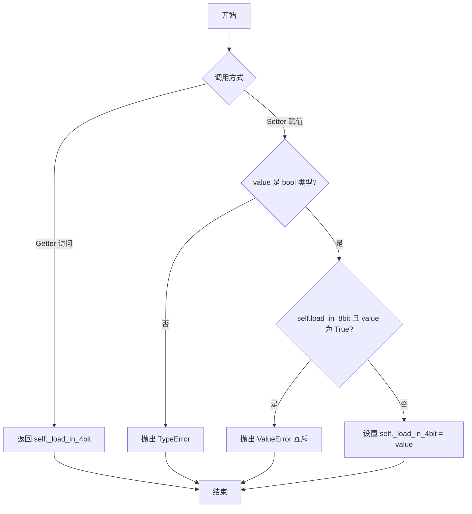
```mermaid
graph TD
    A[开始] --> B{调用方式}
    B -->|Getter 访问| C[返回 self._load_in_4bit]
    B -->|Setter 赋值| D{value 是 bool 类型?}
    D -->|否| E[抛出 TypeError]
    D -->|是| F{self.load_in_8bit 且 value 为 True?}
    F -->|是| G[抛出 ValueError 互斥]
    F -->|否| H[设置 self._load_in_4bit = value]
    C --> I[结束]
    E --> I
    G --> I
    H --> I
```

#### 带注释源码

```python
@property
def load_in_4bit(self):
    """
    Getter 属性方法，返回当前是否启用 4 位量化配置。
    
    Returns:
        bool: 如果启用 4 位量化返回 True，否则返回 False
    """
    return self._load_in_4bit

@load_in_4bit.setter
def load_in_4bit(self, value: bool):
    """
    Setter 属性方法，用于设置 4 位量化配置。
    在赋值前会进行类型检查和与 load_in_8bit 的互斥验证。
    
    Args:
        value (bool): 要设置的布尔值，True 表示启用 4 位量化
    
    Raises:
        TypeError: 如果 value 不是布尔类型
        ValueError: 如果 load_in_8bit 已启用且 value 为 True（两者互斥）
    """
    if not isinstance(value, bool):
        raise TypeError("load_in_4bit must be a boolean")

    if self.load_in_8bit and value:
        raise ValueError("load_in_4bit and load_in_8bit are both True, but only one can be used at the same time")
    self._load_in_4bit = value
```


### `BitsAndBytesConfig.load_in_4bit.setter`

这是 `BitsAndBytesConfig` 类的属性 setter 方法，用于设置 `_load_in_4bit` 内部属性，并在设置时进行类型检查和与 `load_in_8bit` 的互斥验证。

参数：

-  `value`：`bool`，要设置的 `load_in_4bit` 属性值

返回值：`None`，无返回值（setter 方法）

#### 流程图

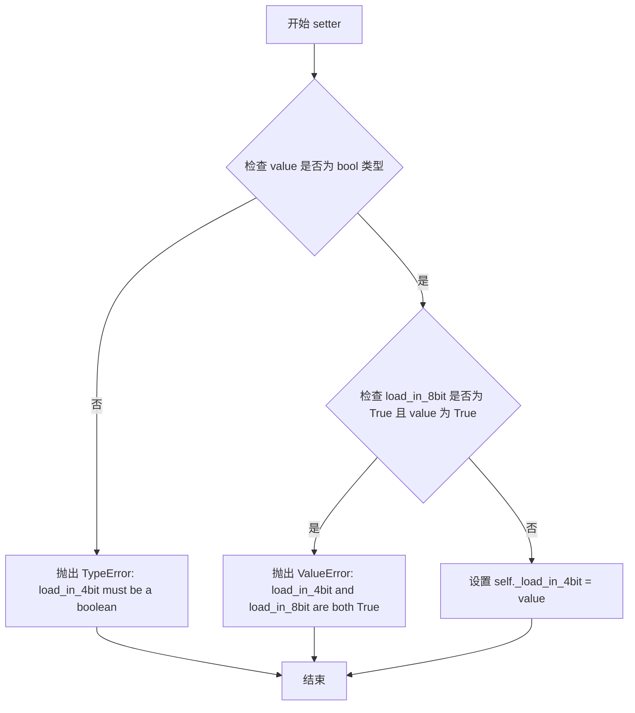
```mermaid
flowchart TD
    A[开始 setter] --> B{检查 value 是否为 bool 类型}
    B -- 否 --> C[抛出 TypeError: load_in_4bit must be a boolean]
    B -- 是 --> D{检查 load_in_8bit 是否为 True 且 value 为 True}
    D -- 是 --> E[抛出 ValueError: load_in_4bit and load_in_8bit are both True]
    D -- 否 --> F[设置 self._load_in_4bit = value]
    C --> G[结束]
    E --> G
    F --> G
```

#### 带注释源码

```python
@load_in_4bit.setter
def load_in_4bit(self, value: bool):
    """
    设置 load_in_4bit 属性的值。
    
    参数:
        value: bool, 要设置的布尔值
        
    异常:
        TypeError: 当 value 不是布尔类型时抛出
        ValueError: 当 load_in_8bit 已设置为 True 且 value 也为 True 时抛出（两者互斥）
    """
    # 检查 value 是否为布尔类型
    if not isinstance(value, bool):
        raise TypeError("load_in_4bit must be a boolean")

    # 检查与 load_in_8bit 的互斥关系：两者不能同时为 True
    if self.load_in_8bit and value:
        raise ValueError("load_in_4bit and load_in_8bit are both True, but only one can be used at the same time")
    
    # 设置内部属性 _load_in_4bit
    self._load_in_4bit = value
```


### `BitsAndBytesConfig.load_in_8bit`

该属性是 `BitsAndBytesConfig` 类中的一个 property，用于获取或设置是否启用 8 位量化（load_in_8bit）。它提供了对内部 `_load_in_8bit` 私有属性的受控访问，并包含验证逻辑确保与 4 位量化互斥。

#### 参数

- **getter**: 无参数
- **setter**:
  - `value`：`bool`，要设置的布尔值，表示是否启用 8 位量化

#### 返回值

- **getter**: `bool`，当前是否启用 8 位量化
- **setter**: `None`，无返回值

#### 流程图

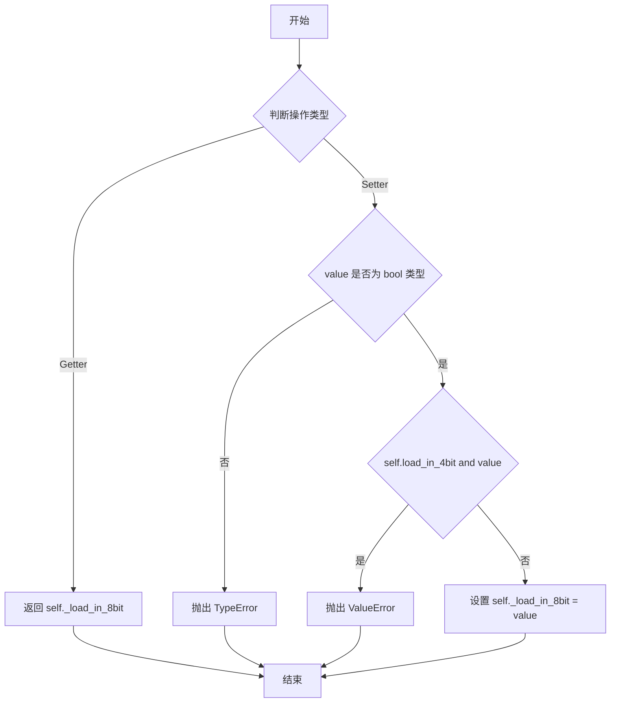
```mermaid
flowchart TD
    A[开始] --> B{判断操作类型}
    
    B -->|Getter| C[返回 self._load_in_8bit]
    C --> D[结束]
    
    B -->|Setter| E{value 是否为 bool 类型}
    E -->|否| F[抛出 TypeError]
    F --> D
    E -->|是| G{self.load_in_4bit and value}
    G -->|是| H[抛出 ValueError]
    H --> D
    G -->|否| I[设置 self._load_in_8bit = value]
    I --> D
```

#### 带注释源码

```python
@property
def load_in_8bit(self):
    """
    获取当前是否启用 8 位量化配置。
    
    Returns:
        bool: 如果启用 8 位量化返回 True，否则返回 False
    """
    return self._load_in_8bit

@load_in_8bit.setter
def load_in_8bit(self, value: bool):
    """
    设置 8 位量化配置。
    
    Args:
        value (bool): 要设置的布尔值，表示是否启用 8 位量化
        
    Raises:
        TypeError: 如果 value 不是布尔类型
        ValueError: 如果 load_in_4bit 和 load_in_8bit 同时为 True
    """
    # 验证 value 是否为布尔类型
    if not isinstance(value, bool):
        raise TypeError("load_in_8bit must be a boolean")

    # 检查是否与 load_in_4bit 冲突（两者不能同时为 True）
    if self.load_in_4bit and value:
        raise ValueError("load_in_4bit and load_in_8bit are both True, but only one can be used at the same time")
    
    # 设置内部属性
    self._load_in_8bit = value
```


### `BitsAndBytesConfig.load_in_8bit.setter`

该 setter 方法用于设置 `BitsAndBytesConfig` 类的 `load_in_8bit` 属性，在赋值前进行类型检查和互斥性验证，确保 `load_in_8bit` 和 `load_in_4bit` 不能同时为 `True`。

参数：

-  `self`：`BitsAndBytesConfig`，隐含的实例参数，表示当前配置对象
-  `value`：`bool`，要设置的 `load_in_8bit` 值，必须为布尔类型

返回值：`None`，setter 方法不返回值

#### 流程图

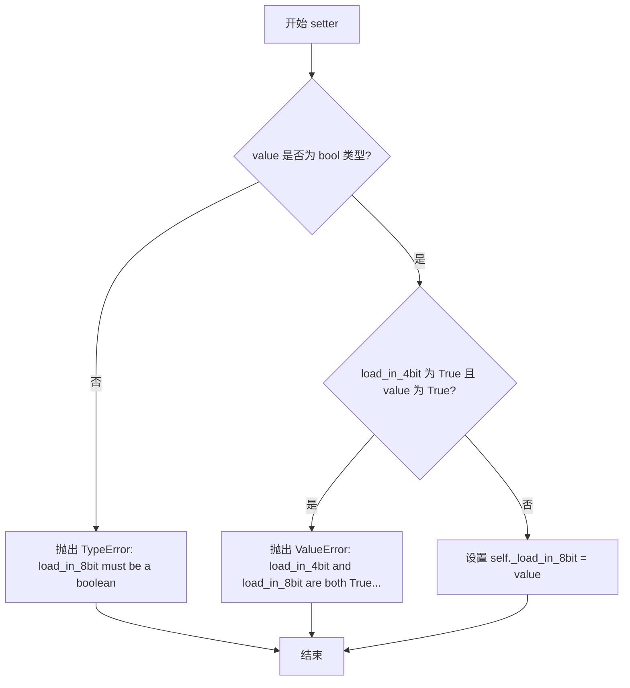
```mermaid
flowchart TD
    A[开始 setter] --> B{value 是否为 bool 类型?}
    B -- 否 --> C[抛出 TypeError: load_in_8bit must be a boolean]
    C --> D[结束]
    B -- 是 --> E{load_in_4bit 为 True 且 value 为 True?}
    E -- 是 --> F[抛出 ValueError: load_in_4bit and load_in_8bit are both True...]
    F --> D
    E -- 否 --> G[设置 self._load_in_8bit = value]
    G --> D
```

#### 带注释源码

```python
@load_in_8bit.setter
def load_in_8bit(self, value: bool):
    """
    setter 方法用于设置 load_in_8bit 属性
    
    参数:
        value: bool - 要设置的 load_in_8bit 值
        
    异常:
        TypeError: 当 value 不是布尔类型时抛出
        ValueError: 当 load_in_4bit 和 load_in_8bit 同时为 True 时抛出
    """
    # 参数类型检查：确保传入的 value 是布尔类型
    if not isinstance(value, bool):
        raise TypeError("load_in_8bit must be a boolean")

    # 互斥性检查：load_in_4bit 和 load_in_8bit 不能同时为 True
    # 因为 bitsandbytes 不支持同时使用 4-bit 和 8-bit 量化
    if self.load_in_4bit and value:
        raise ValueError("load_in_4bit and load_in_8bit are both True, but only one can be used at the same time")
    
    # 通过所有检查后，设置内部私有属性 _load_in_8bit
    self._load_in_8bit = value
```


### `BitsAndBytesConfig.post_init`

安全检查器，验证 `BitsAndBytesConfig` 实例的所有属性类型是否正确，并在 4-bit 量化时检查 bitsandbytes 库版本是否满足最低要求（>= 0.39.0）。

参数：

-  `self`：`BitsAndBytesConfig`，当前实例本身，无需显式传递

返回值：`None`，该方法仅进行验证和检查，不返回任何值

#### 流程图

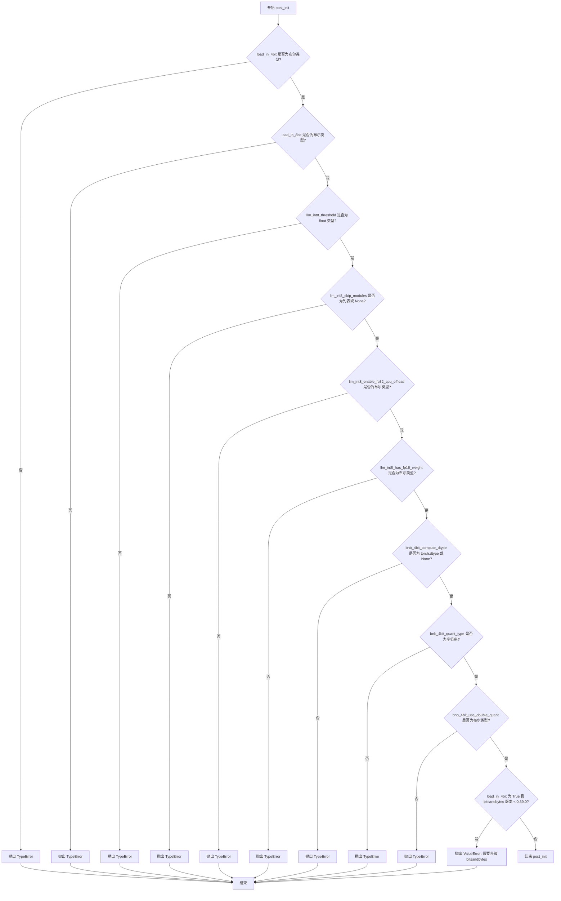
```mermaid
flowchart TD
    A[开始 post_init] --> B{load_in_4bit 是否为布尔类型?}
    B -->|否| B1[抛出 TypeError]
    B -->|是| C{load_in_8bit 是否为布尔类型?}
    C -->|否| C1[抛出 TypeError]
    C -->|是| D{llm_int8_threshold 是否为 float 类型?}
    D -->|否| D1[抛出 TypeError]
    D -->|是| E{llm_int8_skip_modules 是否为列表或 None?}
    E -->|否| E1[抛出 TypeError]
    E -->|是| F{llm_int8_enable_fp32_cpu_offload 是否为布尔类型?}
    F -->|否| F1[抛出 TypeError]
    F -->|是| G{llm_int8_has_fp16_weight 是否为布尔类型?}
    G -->|否| G1[抛出 TypeError]
    G -->|是| H{bnb_4bit_compute_dtype 是否为 torch.dtype 或 None?}
    H -->|否| H1[抛出 TypeError]
    H -->|是| I{bnb_4bit_quant_type 是否为字符串?}
    I -->|否| I1[抛出 TypeError]
    I -->|是| J{bnb_4bit_use_double_quant 是否为布尔类型?}
    J -->|否| J1[抛出 TypeError]
    J -->|是| K{load_in_4bit 为 True 且 bitsandbytes 版本 < 0.39.0?}
    K -->|是| K1[抛出 ValueError: 需要升级 bitsandbytes]
    K -->|否| L[结束 post_init]
    
    B1 --> Z[结束]
    C1 --> Z
    D1 --> Z
    E1 --> Z
    F1 --> Z
    G1 --> Z
    H1 --> Z
    I1 --> Z
    J1 --> Z
    K1 --> Z
```

#### 带注释源码

```python
def post_init(self):
    r"""
    Safety checker that arguments are correct - also replaces some NoneType arguments with their default values.
    """
    # 检查 load_in_4bit 是否为布尔类型
    if not isinstance(self.load_in_4bit, bool):
        raise TypeError("load_in_4bit must be a boolean")

    # 检查 load_in_8bit 是否为布尔类型
    if not isinstance(self.load_in_8bit, bool):
        raise TypeError("load_in_8bit must be a boolean")

    # 检查 llm_int8_threshold 是否为浮点数类型
    if not isinstance(self.llm_int8_threshold, float):
        raise TypeError("llm_int8_threshold must be a float")

    # 检查 llm_int8_skip_modules 是否为列表（若不为 None）
    if self.llm_int8_skip_modules is not None and not isinstance(self.llm_int8_skip_modules, list):
        raise TypeError("llm_int8_skip_modules must be a list of strings")
    
    # 检查 llm_int8_enable_fp32_cpu_offload 是否为布尔类型
    if not isinstance(self.llm_int8_enable_fp32_cpu_offload, bool):
        raise TypeError("llm_int8_enable_fp32_cpu_offload must be a boolean")

    # 检查 llm_int8_has_fp16_weight 是否为布尔类型
    if not isinstance(self.llm_int8_has_fp16_weight, bool):
        raise TypeError("llm_int8_has_fp16_weight must be a boolean")

    # 检查 bnb_4bit_compute_dtype 是否为 torch.dtype 类型（若不为 None）
    if self.bnb_4bit_compute_dtype is not None and not isinstance(self.bnb_4bit_compute_dtype, torch.dtype):
        raise TypeError("bnb_4bit_compute_dtype must be torch.dtype")

    # 检查 bnb_4bit_quant_type 是否为字符串类型
    if not isinstance(self.bnb_4bit_quant_type, str):
        raise TypeError("bnb_4bit_quant_type must be a string")

    # 检查 bnb_4bit_use_double_quant 是否为布尔类型
    if not isinstance(self.bnb_4bit_use_double_quant, bool):
        raise TypeError("bnb_4bit_use_double_quant must be a boolean")

    # 检查 4-bit 量化时 bitsandbytes 版本是否满足最低要求
    if self.load_in_4bit and not version.parse(importlib.metadata.version("bitsandbytes")) >= version.parse(
        "0.39.0"
    ):
        raise ValueError(
            "4 bit quantization requires bitsandbytes>=0.39.0 - please upgrade your bitsandbytes version"
        )
```


### BitsAndBytesConfig.is_quantizable

该方法用于判断当前量化配置是否启用了量化功能。通过检查 `load_in_8bit` 或 `load_in_4bit` 属性，如果其中任意一个为 True，则返回 True 表示模型可量化；否则返回 False。

参数：
- （无参数，仅包含 self）

返回值：`bool`，如果模型启用了 8bit 或 4bit 量化则返回 True，否则返回 False。

#### 流程图

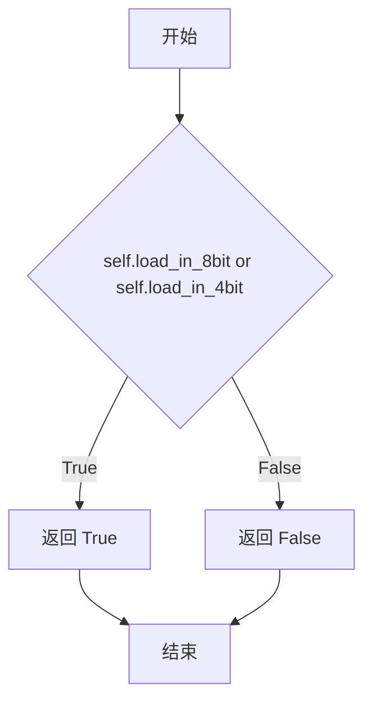
```mermaid
graph TD
    A[开始] --> B{self.load_in_8bit or self.load_in_4bit}
    B -->|True| C[返回 True]
    B -->|False| D[返回 False]
    C --> E[结束]
    D --> E
```

#### 带注释源码

```python
def is_quantizable(self):
    r"""
    Returns `True` if the model is quantizable, `False` otherwise.
    """
    # 通过逻辑或运算判断是否启用了任意一种量化方式
    # load_in_8bit: 8bit 量化开关
    # load_in_4bit: 4bit 量化开关
    # 两者任一为 True 则表示模型可量化
    return self.load_in_8bit or self.load_in_4bit
```


### `BitsAndBytesConfig.quantization_method`

该方法返回模型当前使用的量化方法（"llm_int8"、"fp4" 或 "nf4"），如果模型不可量化则返回 `None`。

参数：

- `self`：`BitsAndBytesConfig`，表示当前 `BitsAndBytesConfig` 实例

返回值：`str | None`，返回具体量化方法字符串（"llm_int8"、"fp4" 或 "nf4"），如果模型既未启用 8bit 量化也未启用 4bit 量化则返回 `None`

#### 流程图

```mermaid
flowchart TD
    A[Start: quantization_method] --> B{load_in_8bit?}
    B -->|Yes| C[Return 'llm_int8']
    B -->|No| D{load_in_4bit and bnb_4bit_quant_type == 'fp4'?}
    D -->|Yes| E[Return 'fp4']
    D -->|No| F{load_in_4bit and bnb_4bit_quant_type == 'nf4'?}
    F -->|Yes| G[Return 'nf4']
    F -->|No| H[Return None]
```

#### 带注释源码

```python
def quantization_method(self):
    r"""
    This method returns the quantization method used for the model. If the model is not quantizable, it returns
    `None`.
    
    Returns:
        str or None: The quantization method string:
            - "llm_int8": If 8-bit quantization is enabled via load_in_8bit
            - "fp4": If 4-bit quantization is enabled with FP4 data type
            - "nf4": If 4-bit quantization is enabled with NF4 data type
            - None: If neither 8-bit nor 4-bit quantization is enabled
    """
    # 检查是否启用了 8-bit 量化
    if self.load_in_8bit:
        return "llm_int8"
    # 检查是否启用了 4-bit 量化且量化类型为 FP4
    elif self.load_in_4bit and self.bnb_4bit_quant_type == "fp4":
        return "fp4"
    # 检查是否启用了 4-bit 量化且量化类型为 NF4
    elif self.load_in_4bit and self.bnb_4bit_quant_type == "nf4":
        return "nf4"
    # 如果既未启用 8-bit 也未启用 4-bit 量化，返回 None
    else:
        return None
```


### `BitsAndBytesConfig.to_dict`

该方法用于将 `BitsAndBytesConfig` 实例序列化为 Python 字典，特别处理了 torch dtype 类型的序列化，将 dtype 转换为字符串形式（如 "float32"），并通过属性访问器获取标志位的当前值。

参数：

- 该方法无显式参数（仅包含隐式参数 `self`）

返回值：`dict[str, Any]`，包含此配置实例所有属性的字典

#### 流程图

```mermaid
flowchart TD
    A[开始 to_dict] --> B[深拷贝 self.__dict 到 output]
    B --> C[处理 bnb_4bit_compute_dtype]
    C --> D{output['bnb_4bit_compute_dtype'] 是 torch.dtype}
    D -->|是| E[转换为字符串并提取类型名]
    D -->|否| F[保持原值]
    E --> G[处理 bnb_4bit_quant_storage]
    F --> G
    G --> H{output['bnb_4bit_quant_storage'] 是 torch.dtype}
    H -->|是| I[转换为字符串并提取类型名]
    H -->|否| J[保持原值]
    I --> K[通过属性访问器获取 load_in_4bit]
    J --> K
    K --> L[通过属性访问器获取 load_in_8bit]
    L --> M[返回 output 字典]
```

#### 带注释源码

```python
def to_dict(self) -> dict[str, Any]:
    """
    Serializes this instance to a Python dictionary. Returns:
        `dict[str, Any]`: Dictionary of all the attributes that make up this configuration instance.
    """
    # 深拷贝实例的 __dict__ 以避免修改原始对象
    output = copy.deepcopy(self.__dict__)
    
    # 将 torch.dtype 对象转换为字符串形式（如 "float32"）
    # 原始形式为 "torch.float32"，split(".")[1] 提取 "float32"
    output["bnb_4bit_compute_dtype"] = str(output["bnb_4bit_compute_dtype"]).split(".")[1]
    
    # 同样处理 bnb_4bit_quant_storage
    output["bnb_4bit_quant_storage"] = str(output["bnb_4bit_quant_storage"]).split(".")[1]
    
    # 通过属性访问器获取值，确保返回的是经过 setter 验证的值
    # 而非直接访问私有属性 _load_in_4bit
    output["load_in_4bit"] = self.load_in_4bit
    output["load_in_8bit"] = self.load_in_8bit

    # 返回包含所有配置属性的字典
    return output
```


### `BitsAndBytesConfig.__repr__`

该方法用于生成 `BitsAndBytesConfig` 对象的字符串表示形式，以便于调试和日志输出。它通过调用 `to_dict()` 方法获取配置字典，然后使用 `json.dumps` 格式化后与类名拼接返回。

参数：

- `self`：`BitsAndBytesConfig`，调用该方法的对象实例，本身

返回值：`str`，返回配置对象的字符串表示，格式为 `{类名} {JSON格式的配置字典}`

#### 流程图

```mermaid
flowchart TD
    A[开始 __repr__] --> B[调用 self.to_dict 获取配置字典]
    B --> C{异常处理}
    C -->|正常| D[使用 json.dumps 格式化字典]
    C -->|异常| E[抛出异常]
    D --> F[拼接类名和格式化后的JSON字符串]
    F --> G[返回字符串结果]
    E --> G
```

#### 带注释源码

```python
def __repr__(self):
    """
    返回对象的字符串表示形式，用于调试和日志输出。
    
    该方法重写了dataclass的默认__repr__实现，
    以便以更友好的JSON格式展示配置信息。
    """
    # 获取配置对象的字典表示
    # to_dict() 方法会将所有配置属性序列化为字典，
    # 包括处理torch.dtype等特殊类型的转换
    config_dict = self.to_dict()
    
    # 使用json.dumps格式化字典为JSON字符串，
    # indent=2 表示缩进2个空格，sort_keys=True 表示按键排序
    # 最后添加换行符以保持一致性
    return f"{self.__class__.__name__} {json.dumps(config_dict, indent=2, sort_keys=True)}\n"
```


### `BitsAndBytesConfig.to_diff_dict`

此方法用于序列化 `BitsAndBytesConfig` 实例为字典，但仅包含与默认配置值不同的属性，以提高可读性。

参数：
- 无显式参数（`self` 为隐含参数）

返回值：`dict[str, Any]`，返回只包含与默认值不同的配置属性的字典。

#### 流程图

```mermaid
flowchart TD
    A[开始 to_diff_dict] --> B[调用 self.to_dict 获取当前配置字典]
    B --> C[创建默认配置实例 BitsAndBytesConfig]
    C --> D[调用默认配置的 to_dict 方法]
    D --> E[初始化空字典 serializable_config_dict]
    E --> F{遍历配置字典中的键值对}
    F --> G{当前值是否不等于默认值?}
    G -->|是| H[将键值对添加到 serializable_config_dict]
    G -->|否| I[跳过该键值对]
    H --> F
    I --> F
    F --> J[返回 serializable_config_dict]
```

#### 带注释源码

```python
def to_diff_dict(self) -> dict[str, Any]:
    """
    Removes all attributes from config which correspond to the default config attributes for better readability and
    serializes to a Python dictionary.

    Returns:
        `dict[str, Any]`: Dictionary of all the attributes that make up this configuration instance,
    """
    # 获取当前配置实例的字典表示
    config_dict = self.to_dict()

    # 获取默认配置的字典表示
    default_config_dict = BitsAndBytesConfig().to_dict()

    # 用于存储与默认值不同的配置项
    serializable_config_dict = {}

    # 只序列化与默认配置不同的值
    for key, value in config_dict.items():
        if value != default_config_dict[key]:
            serializable_config_dict[key] = value

    return serializable_config_dict
```


### `GGUFQuantizationConfig.__init__`

这是 `GGUFQuantizationConfig` 类的初始化方法，用于配置 GGUF（GPTQ-Gradient Unified Format）量化技术的相关参数。该方法设置量化方法标识、计算数据类型、预量化标志以及需要保留原始精度的模块列表。

参数：

- `compute_dtype`：`"torch.dtype" | None`，计算数据类型，用于指定量化过程中使用的计算精度类型。如果为 `None`，则默认使用 `torch.float32`。例如可以设置为 `torch.float16` 或 `torch.bfloat16` 以获得更好的性能。

返回值：`None`，该方法为构造函数，不返回任何值。

#### 流程图

```mermaid
flowchart TD
    A[开始 __init__] --> B[设置 quant_method = QuantizationMethod.GGUF]
    B --> C[设置 compute_dtype 参数值]
    C --> D[设置 pre_quantized = True]
    D --> E[设置 modules_to_not_convert = None]
    E --> F{compute_dtype is None?}
    F -->|是| G[设置 compute_dtype = torch.float32]
    F -->|否| H[使用传入的 compute_dtype 值]
    G --> I[结束]
    H --> I
```

#### 带注释源码

```python
def __init__(self, compute_dtype: "torch.dtype" | None = None):
    # 设置量化方法为 GGUF
    self.quant_method = QuantizationMethod.GGUF
    
    # 接收传入的计算数据类型参数
    self.compute_dtype = compute_dtype
    
    # 标记为预量化模型（GGUF 通常用于加载已经量化好的模型权重）
    self.pre_quantized = True

    # TODO: (Dhruv) Add this as an init argument when we can support loading unquantized checkpoints.
    # 设置需要保持原始精度的模块列表（暂不支持，保留为 None）
    self.modules_to_not_convert = None

    # 如果未指定计算类型，默认使用 float32
    if self.compute_dtype is None:
        self.compute_dtype = torch.float32
```


### `TorchAoConfig.__init__`

这是 `TorchAoConfig` 类的初始化方法，用于配置 TorchAO 量化/稀疏化技术。该方法接收量化类型、模块排除列表等参数，初始化配置对象并进行验证。

参数：

-  `self`：自动包含，当前实例对象
-  `quant_type`：`str | AOBaseConfig`，量化类型，支持字符串形式（如 "int8wo"、"int4_weight_only" 等）或 AOBaseConfig 实例
-  `modules_to_not_convert`：`list[str] | None`，可选，要保留原精度不进行量化的模块列表，默认为 None
-  `**kwargs`：`dict[str, Any]`，其他关键字参数，用于传递给具体量化方法的配置选项（如 group_size、inner_k_tiles 等）

返回值：`None`，构造函数无返回值

#### 流程图

```mermaid
flowchart TD
    A[开始 __init__] --> B[设置 quant_method = QuantizationMethod.TORCHAO]
    B --> C[设置 quant_type 属性]
    C --> D[设置 modules_to_not_convert 属性]
    D --> E{检查 quant_type_kwargs 是否在 kwargs 中}
    E -->|是| F[使用 kwargs 中的 quant_type_kwargs]
    E -->|否| G[将 kwargs 作为 quant_type_kwargs]
    F --> H
    G --> H[调用 post_init 进行验证]
    H --> I{quant_type 是字符串?}
    I -->|否| J{torchao 版本 <= 0.9.0?}
    I -->|是| K[调用 _get_torchao_quant_type_to_method 获取支持的方法]
    J -->|是| L[抛出 ValueError: 仅支持字符串]
    J -->|否| M{quant_type 是 AOBaseConfig 实例?}
    M -->|否| N[抛出 TypeError]
    M -->|是| O[通过验证，结束]
    K --> P{quant_type 在支持列表中?}
    P -->|否| Q{检查浮点类型兼容性}
    P -->|是| R[获取方法签名检查 kwargs]
    Q --> S{浮点类型且 CUDA capability < 8.9?}
    S -->|是| T[抛出 ValueError]
    S -->|否| U{是 floatx 类型且 torchao > 0.14.1?}
    U -->|是| V[抛出 ValueError: 不支持]
    U -->|否| W[抛出 ValueError: 不支持的类型]
    R --> X{unsupported_kwargs 列表为空?}
    X -->|否| Y[抛出 ValueError: 不支持的参数]
    X -->|是| O[结束 __init__]
```

#### 带注释源码

```python
def __init__(
    self,
    quant_type: str | "AOBaseConfig",  # noqa: F821
    modules_to_not_convert: list[str] | None = None,
    **kwargs,
) -> None:
    """
    初始化 TorchAoConfig 实例。
    
    参数:
        quant_type: 量化类型，可以是字符串形式（如 "int8wo", "int4_weight_only"）或 AOBaseConfig 实例
        modules_to_not_convert: 可选，要保留原精度不进行量化的模块列表
        **kwargs: 其他关键字参数，将传递给具体的量化方法
    """
    # 设置量化方法为 TorchAO
    self.quant_method = QuantizationMethod.TORCHAO
    
    # 存储量化类型
    self.quant_type = quant_type
    
    # 存储不进行量化的模块列表
    self.modules_to_not_convert = modules_to_not_convert

    # 当从序列化配置加载时，"quant_type_kwargs" 将作为 key
    # 否则将 kwargs 作为量化方法的参数
    if "quant_type_kwargs" in kwargs:
        self.quant_type_kwargs = kwargs["quant_type_kwargs"]
    else:
        self.quant_type_kwargs = kwargs

    # 调用 post_init 进行参数验证和初始化后处理
    self.post_init()
```


### TorchAoConfig.post_init

该方法是 TorchAoConfig 类的后初始化方法，主要负责验证量化配置参数的有效性，包括检查 quant_type 是否为支持的字符串或 AOBaseConfig 实例，验证量化方法是否支持所给的参数，并针对特定的 torchao 版本和硬件平台进行兼容性检查。

参数：

- `self`：隐式参数，表示 TorchAoConfig 实例本身，无需显式传递

返回值：无返回值（`None`），该方法通过抛出异常来处理验证失败的情况

#### 流程图

```mermaid
flowchart TD
    A[开始 post_init] --> B{quant_type 是否为字符串?}
    B -->|否| C{torchao版本 <= 0.9.0?}
    C -->|是| D[抛出ValueError: 版本不兼容]
    C -->|否| E{quant_type是否为AOBaseConfig实例?}
    E -->|否| F[抛出TypeError: 类型错误]
    E -->|是| G[验证通过，方法结束]
    B -->|是| H{quant_type是否在支持的方法列表中?}
    H -->|否| I{是否为浮点数量化类型?}
    I -->|是| J{CUDA计算能力 >= 8.9?}
    J -->|否| K[抛出ValueError: GPU不兼容]
    I -->|否| L{是否为floatx量化?}
    L -->|是| M{torchao版本 <= 0.14.1?}
    L -->|否| N[抛出ValueError: 不支持的量化类型]
    M -->|否| N
    M -->|是| N
    J -->|是| N
    H -->|是| O{量化方法是否支持传入的参数?}
    O -->|否| P[抛出ValueError: 不支持的参数]
    O -->|是| G
```

#### 带注释源码

```python
def post_init(self):
    """
    后初始化方法，用于验证 TorchAoConfig 的配置参数。
    
    该方法执行以下验证：
    1. 检查 quant_type 的类型（字符串或 AOBaseConfig 实例）
    2. 验证 torchao 版本兼容性
    3. 确认量化类型是否在支持列表中
    4. 验证量化方法是否支持传入的参数
    """
    
    # 情况1：quant_type 不是字符串（可能是 AOBaseConfig 实例）
    if not isinstance(self.quant_type, str):
        # 检查 torchao 版本是否过旧
        if is_torchao_version("<=", "0.9.0"):
            raise ValueError(
                f"torchao <= 0.9.0 only supports string quant_type, got {type(self.quant_type).__name__}. "
                f"Upgrade to torchao > 0.9.0 to use AOBaseConfig."
            )

        # 动态导入 AOBaseConfig 类（仅在 torchao 可用时）
        from torchao.quantization.quant_api import AOBaseConfig

        # 验证 quant_type 是否为 AOBaseConfig 实例
        if not isinstance(self.quant_type, AOBaseConfig):
            raise TypeError(f"quant_type must be a AOBaseConfig instance, got {type(self.quant_type).__name__}")

    # 情况2：quant_type 是字符串
    elif isinstance(self.quant_type, str):
        # 获取支持的量化类型到方法的映射
        TORCHAO_QUANT_TYPE_METHODS = self._get_torchao_quant_type_to_method()

        # 检查 quant_type 是否在支持的方法列表中
        if self.quant_type not in TORCHAO_QUANT_TYPE_METHODS.keys():
            # 判断是否为浮点数量化类型
            is_floatx_quant_type = self.quant_type.startswith("fp")
            is_float_quant_type = self.quant_type.startswith("float") or is_floatx_quant_type
            
            # 如果是浮点数量化类型，检查GPU兼容性
            if is_float_quant_type and not self._is_xpu_or_cuda_capability_atleast_8_9():
                raise ValueError(
                    f"Requested quantization type: {self.quant_type} is not supported on GPUs with CUDA capability <= 8.9. You "
                    f"can check the CUDA capability of your GPU using `torch.cuda.get_device_capability()`."
                )
            # 检查 floatx 量化类型是否与 torchao 版本兼容
            elif is_floatx_quant_type and not is_torchao_version("<=", "0.14.1"):
                raise ValueError(
                    f"Requested quantization type: {self.quant_type} is only supported in torchao <= 0.14.1. "
                    f"Please downgrade to torchao <= 0.14.1 to use this quantization type."
                )

            # 抛出通用的不支持错误
            raise ValueError(
                f"Requested quantization type: {self.quant_type} is not supported or is an incorrect `quant_type` name. If you think the "
                f"provided quantization type should be supported, please open an issue at https://github.com/huggingface/diffusers/issues."
            )

        # 获取量化方法并检查参数兼容性
        method = TORCHAO_QUANT_TYPE_METHODS[self.quant_type]
        signature = inspect.signature(method)
        
        # 提取方法支持的所有参数名
        all_kwargs = {
            param.name
            for param in signature.parameters.values()
            if param.kind in [inspect.Parameter.KEYWORD_ONLY, inspect.Parameter.POSITIONAL_OR_KEYWORD]
        }
        
        # 检查用户传入的参数是否都被支持
        unsupported_kwargs = list(self.quant_type_kwargs.keys() - all_kwargs)

        if len(unsupported_kwargs) > 0:
            raise ValueError(
                f'The quantization method "{self.quant_type}" does not support the following keyword arguments: '
                f"{unsupported_kwargs}. The following keywords arguments are supported: {all_kwargs}.'
            )
```


### `TorchAoConfig.to_dict`

该方法将 `TorchAoConfig` 实例序列化为 Python 字典格式，支持两种quant_type类型（字符串和AOBaseConfig）的序列化处理。对于字符串类型的quant_type，会特殊处理layout参数的序列化；对于AOBaseConfig类型，则调用torchao库的config_to_dict进行深度序列化。

参数：
- `self`：`TorchAoConfig` 类实例，隐含参数，无需显式传递

返回值：`dict[str, Any]`，返回包含所有配置属性的字典，包括quant_method、quant_type、modules_to_not_convert、quant_type_kwargs等键值对。

#### 流程图

```mermaid
flowchart TD
    A[开始 to_dict] --> B[调用父类 to_dict 获取基础字典 d]
    B --> C{quant_type 是字符串类型?}
    C -->|是| D{quant_type_kwargs 中有 layout?}
    C -->|否| E[从 torchao.core.config 导入 config_to_dict]
    D -->|是| F{layout 是 dataclass?}
    D -->|否| H[返回字典 d]
    F -->|是| G[将 layout 转换为 类名 + 参数字典 列表]
    F -->|否| I{layout 是列表?}
    I -->|是| J[验证列表格式: 长度为2, 首元素为字符串, 次元素为字典]
    I -->|否| K[抛出 ValueError: layout must be a list]
    G --> H
    J --> H
    E --> L[将 quant_type 序列化为 {'default': config_to_dict(self.quant_type)}]
    L --> H
```

#### 带注释源码

```python
def to_dict(self):
    """Convert configuration to a dictionary."""
    # 首先调用父类 QuantizationConfigMixin 的 to_dict 方法
    # 获取包含 quant_method, quant_type, modules_to_not_convert 等基础属性的字典
    d = super().to_dict()

    # 判断 quant_type 的类型，不同类型采用不同的序列化策略
    if isinstance(self.quant_type, str):
        # === 字符串类型的 quant_type 处理 ===
        # 例如: "int8wo", "int4_weight_only", "float8dq" 等
        
        # 检查是否存在 quant_type_kwargs 并且其中包含 layout 参数
        if "quant_type_kwargs" in d and "layout" in d["quant_type_kwargs"]:
            # 如果 layout 是 dataclass 实例，需要特殊序列化
            if is_dataclass(d["quant_type_kwargs"]["layout"]):
                # 将 dataclass 转换为 [类名, 参数字典] 的列表格式
                # 便于 JSON 序列化和反序列化
                d["quant_type_kwargs"]["layout"] = [
                    d["quant_type_kwargs"]["layout"].__class__.__name__,
                    dataclasses.asdict(d["quant_type_kwargs"]["layout"]),
                ]
            
            # 如果 layout 已经是列表，验证其格式是否符合规范
            if isinstance(d["quant_type_kwargs"]["layout"], list):
                # 列表必须包含两个元素：布局名称和布局参数字典
                assert len(d["quant_type_kwargs"]["layout"]) == 2, "layout saves layout name and layout kwargs"
                # 第一个元素必须是字符串类型的布局名称
                assert isinstance(d["quant_type_kwargs"]["layout"][0], str), "layout name must be a string"
                # 第二个元素必须是字典类型的布局参数
                assert isinstance(d["quant_type_kwargs"]["layout"][1], dict), "layout kwargs must be a dict"
            else:
                # layout 既不是 dataclass 也不是列表，抛出异常
                raise ValueError("layout must be a list")
    else:
        # === AOBaseConfig 类型的 quant_type 处理 ===
        # 当 quant_type 是 AOBaseConfig 实例时（如 Int8WeightOnlyConfig）
        # 使用 torchao 库的配置序列化工具
        
        from torchao.core.config import config_to_dict

        # 当前设计假设每个 Transformer 只有一个配置
        # 未来可能会支持每个 fqn（完全限定名）有独立的配置
        # 将 quant_type 序列化为 {"default": <序列化结果>} 的嵌套结构
        d["quant_type"] = {"default": config_to_dict(self.quant_type)}

    # 返回完整的配置字典
    return d
```


### `TorchAoConfig.from_dict`

该类方法用于从 Python 字典参数实例化 `TorchAoConfig` 配置对象，支持从序列化配置恢复量化配置，支持字符串和 AOBaseConfig 两种 quant_type 格式的解析与反序列化。

参数：

- `config_dict`：`dict[str, Any]`，用于实例化配置对象的字典
- `return_unused_kwargs`：`bool`，可选，默认值为 `False`，是否返回未使用的关键字参数
- `kwargs`：`dict[str, Any]`，用于初始化配置对象的附加参数

返回值：`TorchAoConfig`，从参数中实例化的配置对象

#### 流程图

```mermaid
flowchart TD
    A[开始 from_dict] --> B{检查 torchao 版本 > 0.9.0}
    B -->|否| C[抛出 NotImplementedError]
    B -->|是| D[复制 config_dict]
    D --> E[提取 quant_type]
    E --> F{quant_type 是字符串?}
    F -->|是| G[直接返回 cls quant_type=quant_type]
    F -->|否| H{quant_type 字典只有一个 default 键?}
    H -->|否| I[抛出 AssertionError]
    H -->|是| J[提取 quant_type default 值]
    J --> K[从 torchao.core.config 反序列化 quant_type]
    K --> L[返回 cls quant_type=quant_type]
```

#### 带注释源码

```python
@classmethod
def from_dict(cls, config_dict, return_unused_kwargs=False, **kwargs):
    """
    Create configuration from a dictionary.
    
    从字典创建配置对象。支持两种 quant_type 格式：
    1. 字符串格式：直接用于实例化配置
    2. AOBaseConfig 字典格式：需要反序列化后再实例化
    """
    # 检查 torchao 版本，必须大于 0.9.0
    if not is_torchao_version(">", "0.9.0"):
        raise NotImplementedError("TorchAoConfig requires torchao > 0.9.0 for construction from dict")
    
    # 复制字典，避免修改原始字典
    config_dict = config_dict.copy()
    
    # 从配置字典中提取 quant_type
    quant_type = config_dict.pop("quant_type")

    # 如果 quant_type 是字符串，直接使用字符串创建配置
    if isinstance(quant_type, str):
        return cls(quant_type=quant_type, **config_dict)
    
    # quant_type 是字典格式，验证只有一个 'default' 键
    # 在未来可能会支持每个 fqn 一个配置
    assert len(quant_type) == 1 and "default" in quant_type, (
        "Expected only one key 'default' in quant_type dictionary"
    )
    
    # 提取 default 值
    quant_type = quant_type["default"]

    # 如果需要，从 torchao.core.config 反序列化 quant_type
    from torchao.core.config import config_from_dict

    quant_type = config_from_dict(quant_type)

    # 使用反序列化后的 quant_type 创建配置对象
    return cls(quant_type=quant_type, **config_dict)
```


### TorchAoConfig._get_torchao_quant_type_to_method

该方法是一个类方法，用于返回支持的 TorchAO 量化类型映射表。它根据当前的 TorchAO 版本和硬件能力（CUDA/XPU），动态生成并返回包含所有常用量化方法别名的字典，支持 INT4、INT8、FLOAT8、FPX 和 UINTX 等多种量化类型。

参数：
- `cls`：类本身（Python 类方法隐含参数）

返回值：`dict`，返回一个字典，键为量化类型的字符串别名（如 "int8wo"、"float8dq_e4m3_tensor" 等），值为对应的量化方法函数或偏函数（partial function）。

#### 流程图

```mermaid
flowchart TD
    A[开始 _get_torchao_quant_type_to_method] --> B{is_torchao_available?}
    B -->|是| C[导入基础量化函数]
    B -->|否| Z[抛出 ValueError 提示安装 torchao]
    
    C --> D{is_torchao_version <= 0.14.1?}
    D -->|是| E[导入 fpx_weight_only]
    D -->|否| F[跳过 FPX 导入]
    
    E --> F
    F --> G[导入 PerRow, PerTensor 观察器]
    
    G --> H[定义 generate_float8dq_types 函数]
    H --> I[定义 generate_fpx_quantization_types 函数]
    
    I --> J[构建 INT4_QUANTIZATION_TYPES 字典]
    J --> K[构建 INT8_QUANTIZATION_TYPES 字典]
    
    L --> M[构建 UINTX_QUANTIZATION_DTYPES 字典]
    M --> N{_is_xpu_or_cuda_capability_atleast_8_9?}
    
    N -->|是| O[更新 FLOATX_QUANTIZATION_TYPES]
    N -->|否| P[跳过 FLOATX 类型]
    
    O --> Q[合并所有 QUANTIZATION_TYPES]
    P --> Q
    
    Q --> R[返回 QUANTIZATION_TYPES 字典]
```

#### 带注释源码

```python
@classmethod
def _get_torchao_quant_type_to_method(cls):
    r"""
    Returns supported torchao quantization types with all commonly used notations.
    """
    # 检查 torchao 是否可用
    if is_torchao_available():
        # TODO(aryan): Support sparsify - 未来可能支持稀疏化
        # 导入 TorchAO 量化方法
        from torchao.quantization import (
            float8_dynamic_activation_float8_weight,
            float8_static_activation_float8_weight,
            float8_weight_only,
            int4_weight_only,
            int8_dynamic_activation_int4_weight,
            int8_dynamic_activation_int8_weight,
            int8_weight_only,
            uintx_weight_only,
        )

        # 仅在 torchao <= 0.14.1 时导入 FPX（浮点 X 位量化）
        if is_torchao_version("<=", "0.14.1"):
            from torchao.quantization import fpx_weight_only
        
        # 导入观察器用于指定量化粒度
        # TODO(aryan): Add a note on how to use PerAxis and PerGroup observers
        from torchao.quantization.observer import PerRow, PerTensor

        def generate_float8dq_types(dtype: torch.dtype):
            """生成 float8 动态激活量化类型的辅助函数"""
            # 根据数据类型确定名称后缀
            name = "e5m2" if dtype == torch.float8_e5m2 else "e4m3"
            types = {}

            # 为每种粒度（PerTensor/PerRow）生成对应的量化类型
            for granularity_cls in [PerTensor, PerRow]:
                # 注意：激活和权重不能有不同的粒度
                granularity_name = "tensor" if granularity_cls is PerTensor else "row"
                # 使用 partial 创建配置好的量化方法
                types[f"float8dq_{name}_{granularity_name}"] = partial(
                    float8_dynamic_activation_float8_weight,
                    activation_dtype=dtype,
                    weight_dtype=dtype,
                    granularity=(granularity_cls(), granularity_cls()),
                )

            return types

        def generate_fpx_quantization_types(bits: int):
            """生成浮点 X 位量化类型的辅助函数"""
            if is_torchao_version("<=", "0.14.1"):
                types = {}

                # 遍历可能的指数位数组合
                for ebits in range(1, bits):
                    mbits = bits - ebits - 1
                    types[f"fp{bits}_e{ebits}m{mbits}"] = partial(fpx_weight_only, ebits=ebits, mbits=mbits)

                # 计算默认的指数和尾数位数
                non_sign_bits = bits - 1
                default_ebits = (non_sign_bits + 1) // 2
                default_mbits = non_sign_bits - default_ebits
                types[f"fp{bits}"] = partial(fpx_weight_only, ebits=default_ebits, mbits=default_mbits)

                return types
            else:
                # torchao >= 0.15.0 不支持 FPX
                raise ValueError("Floating point X-bit quantization is not supported in torchao >= 0.15.0")

        # 定义 INT4 量化类型映射
        INT4_QUANTIZATION_TYPES = {
            # int4 weight + bfloat16/float16 activation
            "int4wo": int4_weight_only,
            "int4_weight_only": int4_weight_only,
            # int4 weight + int8 activation
            "int4dq": int8_dynamic_activation_int4_weight,
            "int8_dynamic_activation_int4_weight": int8_dynamic_activation_int4_weight,
        }

        # 定义 INT8 量化类型映射
        INT8_QUANTIZATION_TYPES = {
            # int8 weight + bfloat16/float16 activation
            "int8wo": int8_weight_only,
            "int8_weight_only": int8_weight_only,
            # int8 weight + int8 activation
            "int8dq": int8_dynamic_activation_int8_weight,
            "int8_dynamic_activation_int8_weight": int8_dynamic_activation_int8_weight,
        }

        # TODO(aryan): handle torch 2.2/2.3 - 需要处理不同 PyTorch 版本
        # 定义 FLOAT8/FLOATX 量化类型映射
        FLOATX_QUANTIZATION_TYPES = {
            # float8_e5m2 weight + bfloat16/float16 activation
            "float8wo": partial(float8_weight_only, weight_dtype=torch.float8_e5m2),
            "float8_weight_only": float8_weight_only,
            "float8wo_e5m2": partial(float8_weight_only, weight_dtype=torch.float8_e5m2),
            # float8_e4m3 weight + bfloat16/float16 activation
            "float8wo_e4m3": partial(float8_weight_only, weight_dtype=torch.float8_e4m3fn),
            # float8_e5m2 weight + float8 activation (dynamic)
            "float8dq": float8_dynamic_activation_float8_weight,
            "float8_dynamic_activation_float8_weight": float8_dynamic_activation_float8_weight,
            # ===== Matrix multiplication is not supported in float8_e5m2 so the following errors out.
            # However, changing activation_dtype=torch.float8_e4m3 might work here =====
            # "float8dq_e5m2": partial(
            #     float8_dynamic_activation_float8_weight,
            #     activation_dtype=torch.float8_e5m2,
            #     weight_dtype=torch.float8_e5m2,
            # ),
            # **generate_float8dq_types(torch.float8_e5m2),
            # ===== =====
            # float8_e4m3 weight + float8 activation (dynamic)
            "float8dq_e4m3": partial(
                float8_dynamic_activation_float8_weight,
                activation_dtype=torch.float8_e4m3fn,
                weight_dtype=torch.float8_e4m3fn,
            ),
            **generate_float8dq_types(torch.float8_e4m3fn),
            # float8 weight + float8 activation (static)
            "float8_static_activation_float8_weight": float8_static_activation_float8_weight,
        }

        # 根据版本添加 FP3-FP7 量化类型
        if is_torchao_version("<=", "0.14.1"):
            FLOATX_QUANTIZATION_TYPES.update(generate_fpx_quantization_types(3))
            FLOATX_QUANTIZATION_TYPES.update(generate_fpx_quantization_types(4))
            FLOATX_QUANTIZATION_TYPES.update(generate_fpx_quantization_types(5))
            FLOATX_QUANTIZATION_TYPES.update(generate_fpx_quantization_types(6))
            FLOATX_QUANTIZATION_TYPES.update(generate_fpx_quantization_types(7))

        # 定义 UINTX 无符号整数量化类型映射
        UINTX_QUANTIZATION_DTYPES = {
            "uintx_weight_only": uintx_weight_only,
            "uint1wo": partial(uintx_weight_only, dtype=torch.uint1),
            "uint2wo": partial(uintx_weight_only, dtype=torch.uint2),
            "uint3wo": partial(uintx_weight_only, dtype=torch.uint3),
            "uint4wo": partial(uintx_weight_only, dtype=torch.uint4),
            "uint5wo": partial(uintx_weight_only, dtype=torch.uint5),
            "uint6wo": partial(uintx_weight_only, dtype=torch.uint6),
            "uint7wo": partial(uintx_weight_only, dtype=torch.uint7),
            # "uint8wo": partial(uintx_weight_only, dtype=torch.uint8),  # uint8 quantization is not supported
        }

        # 合并所有量化类型到统一字典
        QUANTIZATION_TYPES = {}
        QUANTIZATION_TYPES.update(INT4_QUANTIZATION_TYPES)
        QUANTIZATION_TYPES.update(INT8_QUANTIZATION_TYPES)
        QUANTIZATION_TYPES.update(UINTX_QUANTIZATION_DTYPES)

        # 仅在支持的硬件上添加 FLOATX 类型（CUDA capability >= 8.9 或 XPU）
        if cls._is_xpu_or_cuda_capability_atleast_8_9():
            QUANTIZATION_TYPES.update(FLOATX_QUANTIZATION_TYPES)

        return QUANTIZATION_TYPES
    else:
        # torchao 不可用时抛出错误
        raise ValueError(
            "TorchAoConfig requires torchao to be installed, please install with `pip install torchao`"
        )
```


### `TorchAoConfig._is_xpu_or_cuda_capability_atleast_8_9`

检查当前运行环境是否具有至少 8.9 的 CUDA 计算能力，或者 Intel XPU 是否可用。该方法用于确定当前硬件是否支持特定的 TorchAO 量化类型。

参数：

- 该方法无参数

返回值：`bool`，如果 CUDA 设备计算能力 ≥ 8.9 或 XPU 可用则返回 `True`，否则抛出 `RuntimeError`。

#### 流程图

```mermaid
flowchart TD
    A[开始] --> B{torch.cuda.is_available?}
    B -->|Yes| C[获取CUDA设备计算能力 major, minor]
    B -->|No| D{torch.xpu.is_available?}
    C --> E{major == 8?}
    E -->|Yes| F{minor >= 9?}
    E -->|No| G{major >= 9?}
    F -->|Yes| H[返回 True]
    F -->|No| I[返回 False]
    G -->|Yes| H
    G -->|No| I
    D -->|Yes| J[返回 True]
    D -->|No| K[抛出 RuntimeError]
```

#### 带注释源码

```python
@staticmethod
def _is_xpu_or_cuda_capability_atleast_8_9() -> bool:
    """
    检查 CUDA 或 XPU 设备是否满足最低计算能力要求（CUDA >= 8.9 或 XPU 可用）。
    
    Returns:
        bool: 如果 CUDA 设备计算能力 >= 8.9 或者 XPU 可用则返回 True，否则返回 False。
    
    Raises:
        RuntimeError: 当既没有 CUDA 也没有 XPU 可用时抛出。
    """
    # 检查 CUDA 是否可用
    if torch.cuda.is_available():
        # 获取当前 CUDA 设备的计算能力 (major, minor)
        major, minor = torch.cuda.get_device_capability()
        # 如果主版本号为 8，则次版本号必须 >= 9
        if major == 8:
            return minor >= 9
        # 主版本号 >= 9 直接返回 True
        return major >= 9
    # 检查 XPU 是否可用（Intel GPU）
    elif torch.xpu.is_available():
        return True
    else:
        # 既没有 CUDA 也没有 XPU，抛出运行时错误
        raise RuntimeError("TorchAO requires a CUDA compatible GPU or Intel XPU and installation of PyTorch.")
```


### `TorchAoConfig.get_apply_tensor_subclass`

根据配置信息创建适当的量化方法，根据硬件平台（CPU/XPU）和torch/torchao版本自动处理Int4量化布局。

参数：
- `self`：`TorchAoConfig`类实例，隐含参数，包含量化配置信息

返回值：`Any`，返回量化方法对象（可能是AOBaseConfig实例或通过partial包装的量化函数）

#### 流程图

```mermaid
flowchart TD
    A[开始 get_apply_tensor_subclass] --> B{quant_type 是否为字符串?}
    B -->|是| C[获取量化方法映射表]
    B -->|否| D[直接返回 quant_type]
    C --> E[复制 quant_type_kwargs]
    F{是否为 int4_weight_only<br/>且无CUDA且有torchao 0.8.0+<br/>且未设置layout?} -->|否| H[直接调用方法返回]
    F -->|是| G{是否有 XPU?}
    G -->|是| I{torchao>=0.11.0<br/>且torch>2.7.9?}
    I -->|是| J[设置 Int4XPULayout<br/>和 zero_point_domain]
    I -->|否| K[抛出版本要求错误]
    G -->|否| L[设置 Int4CPULayout]
    J --> H
    L --> H
    H --> M[返回量化方法对象]
    D --> M
```

#### 带注释源码

```python
def get_apply_tensor_subclass(self):
    """Create the appropriate quantization method based on configuration."""
    # 如果 quant_type 不是字符串（如 AOBaseConfig 实例），直接返回
    if not isinstance(self.quant_type, str):
        return self.quant_type
    else:
        # 获取支持的量化方法映射表（字符串到量化函数的映射）
        methods = self._get_torchao_quant_type_to_method()
        # 复制量化参数字典，避免修改原始配置
        quant_type_kwargs = self.quant_type_kwargs.copy()
        
        # 特殊处理 int4_weight_only 量化类型
        # 当没有CUDA但有torchao 0.8.0+且未设置layout时
        if (
            not torch.cuda.is_available()  # 没有CUDA
            and is_torchao_available()  # 有torchao
            and self.quant_type == "int4_weight_only"  # 是int4权重量化
            and version.parse(importlib.metadata.version("torchao")) >= version.parse("0.8.0")  # torchao版本>=0.8.0
            and quant_type_kwargs.get("layout", None) is None  # 未设置layout
        ):
            # 检查是否是Intel XPU设备
            if torch.xpu.is_available():
                # XPU需要torchao>=0.11.0且torch>2.7.9
                if version.parse(importlib.metadata.version("torchao")) >= version.parse(
                    "0.11.0"
                ) and version.parse(importlib.metadata.version("torch")) > version.parse("2.7.9"):
                    # 导入XPU特定的Int4布局类
                    from torchao.dtypes import Int4XPULayout
                    from torchao.quantization.quant_primitives import ZeroPointDomain

                    # 设置XPU布局和零点域
                    quant_type_kwargs["layout"] = Int4XPULayout()
                    quant_type_kwargs["zero_point_domain"] = ZeroPointDomain.INT
                else:
                    raise ValueError(
                        "TorchAoConfig requires torchao >= 0.11.0 and torch >= 2.8.0 for XPU support. Please upgrade the version or use run on CPU with the cpu version pytorch."
                    )
            else:
                # 非XPU（CPU）情况，设置CPU布局
                from torchao.dtypes import Int4CPULayout

                quant_type_kwargs["layout"] = Int4CPULayout()

        # 使用方法映射表和参数创建量化方法对象并返回
        return methods[self.quant_type](**quant_type_kwargs)
```


### `TorchAoConfig.__repr__`

该方法用于生成 `TorchAoConfig` 对象的可读字符串表示，将配置对象转换为格式化的 JSON 字符串，便于调试和日志输出。

参数：

- `self`：`TorchAoConfig` 类实例，隐式参数，无需显式传递

返回值：`str`，返回配置对象的格式化 JSON 字符串表示，包含类名和所有配置属性。

#### 流程图

```mermaid
flowchart TD
    A[开始 __repr__] --> B[调用 self.to_dict]
    B --> C{判断 quant_type 类型}
    C -->|string| D[处理布局序列化]
    C -->|AOBaseConfig| E[从 torchao.core.config 导入 config_to_dict]
    D --> F[返回配置字典]
    E --> F
    F --> G[使用 json.dumps 格式化]
    G --> H[使用 TorchAoJSONEncoder 处理 MappingType]
    H --> I[返回格式化字符串]
    I --> J[结束]
    
    style A fill:#e1f5fe
    style J fill:#e1f5fe
    style I fill:#c8e6c9
```

#### 带注释源码

```python
def __repr__(self):
    r"""
    示例：对于 `TorchAoConfig("uint4wo", group_size=32)` 的输出格式如下：

    ```
    TorchAoConfig {
        "modules_to_not_convert": null,
        "quant_method": "torchao",
        "quant_type": "uint4wo",
        "quant_type_kwargs": {
            "group_size": 32
        }
    }
    ```
    """
    # 步骤1: 获取配置字典
    # to_dict() 方法继承自 QuantizationConfigMixin，会递归序列化所有属性
    # 对于 quant_type 字符串类型，会处理布局（layout）序列化
    # 对于 AOBaseConfig 类型，会调用 torchao.core.config.config_to_dict 进行序列化
    config_dict = self.to_dict()
    
    # 步骤2: 使用 json.dumps 转换为格式化 JSON 字符串
    # indent=2: 使用2个空格缩进
    # sort_keys=True: 按键名排序
    # cls=TorchAoJSONEncoder: 自定义编码器，处理 MappingType 等特殊类型
    return (
        f"{self.__class__.__name__} {json.dumps(config_dict, indent=2, sort_keys=True, cls=TorchAoJSONEncoder)}\n"
    )
```


### `QuantoConfig.__init__`

这是 `QuantoConfig` 类的构造函数，用于初始化Quanto量化配置对象。该方法设置量化方法、权重数据类型和需要排除转换的模块列表，并调用安全性检查方法。

参数：

- `weights_dtype`：`str`，默认为 `"int8"`，表示量化后权重的目标数据类型，支持的值包括 "float8"、"int8"、"int4"、"int2"
- `modules_to_not_convert`：`list[str] | None`，默认为 `None`，表示不进行量化转换的模块列表，用于保留某些模块的原始精度（例如 Whisper 编码器、Llava 编码器、Mixtral 门层等）
- `**kwargs`：`dict[str, Any]`，可选的额外关键字参数，用于扩展或未来兼容性

返回值：`None`，构造函数不返回任何值

#### 流程图

```mermaid
flowchart TD
    A[开始 __init__] --> B[设置 quant_method = QuantizationMethod.QUANTO]
    B --> C[设置 weights_dtype 参数]
    C --> D[设置 modules_to_not_convert 参数]
    D --> E[调用 post_init 方法进行安全检查]
    E --> F[结束]
```

#### 带注释源码

```python
def __init__(
    self,
    weights_dtype: str = "int8",
    modules_to_not_convert: list[str] | None = None,
    **kwargs,
):
    """
    Initialize QuantoConfig for quanto quantization.
    
    Args:
        weights_dtype: The target dtype for the weights after quantization.
            Supported values are ("float8","int8","int4","int2")
        modules_to_not_convert: The list of modules to not quantize, useful for 
            quantizing models that explicitly require to have some modules left in 
            their original precision.
        **kwargs: Additional keyword arguments for extensibility.
    """
    # 设置量化方法为 QUANTO
    self.quant_method = QuantizationMethod.QUANTO
    
    # 存储权重数据类型参数
    self.weights_dtype = weights_dtype
    
    # 存储需要保留原始精度的模块列表
    self.modules_to_not_convert = modules_to_not_convert
    
    # 调用后初始化方法进行参数验证
    self.post_init()
```


### `QuantoConfig.post_init`

该方法是 `QuantoConfig` 类的后初始化安全检查方法，用于验证 `weights_dtype` 参数是否在支持的权重数据类型列表中，确保配置参数的有效性。

参数：该方法没有显式参数（隐式使用 `self` 访问实例属性）

返回值：`None`，该方法不返回任何值，仅进行参数验证

#### 流程图

```mermaid
flowchart TD
    A[开始 post_init] --> B{检查 weights_dtype 是否在 accepted_weights 中}
    B -->|是| C[验证通过 - 方法结束]
    B -->|否| D[抛出 ValueError 异常]
    D --> E[错误信息: 仅支持 float8, int8, int4, int2]
    
    style A fill:#e1f5fe
    style C fill:#e8f5e8
    style D fill:#ffebee
    style E fill:#ffcdd2
```

#### 带注释源码

```python
def post_init(self):
    r"""
    Safety checker that arguments are correct
    """
    # 定义支持的权重数据类型列表
    accepted_weights = ["float8", "int8", "int4", "int2"]
    
    # 检查实例的 weights_dtype 属性是否在支持的数据类型列表中
    if self.weights_dtype not in accepted_weights:
        # 如果不在列表中，抛出 ValueError 异常并显示错误信息
        raise ValueError(f"Only support weights in {accepted_weights} but found {self.weights_dtype}")
```


### `NVIDIAModelOptConfig.__init__`

该方法是 `NVIDIAModelOptConfig` 类的构造函数，用于初始化 NVIDIA ModelOpt 量化配置。它接收量化类型、模块排除列表、权重量化选项、通道/块量化参数、算法选择、前向循环函数等配置，并设置量化方法、校准配置以及根据量化类型生成 ModelOpt 内部配置字典。

参数：

- `quant_type`：`str`，量化类型，指定要使用的量化方法（如 FP8、INT8、INT4、NF4、NVFP4 等）
- `modules_to_not_convert`：`list[str] | None`，需要排除量化转换的模块列表
- `weight_only`：`bool = True`，是否仅对权重进行量化
- `channel_quantize`：`int | None = None`，通道量化轴，用于跨不同轴进行模型量化
- `block_quantize`：`int | None = None`，块大小，用于进一步将每个通道/轴量化为块
- `scale_channel_quantize`：`int | None = None`，缩放通道量化轴
- `scale_block_quantize`：`int | None = None`，缩放块大小
- `algorithm`：`str = "max"`，量化算法，当前仅支持 "max"
- `forward_loop`：`Callable | None = None`，量化校准期间使用的前向循环函数
- `modelopt_config`：`dict | None = None`，ModelOpt 配置字典，用于传递自定义配置
- `disable_conv_quantization`：`bool = False`，是否禁用卷积层的量化

返回值：`None`，该方法为构造函数，不返回任何值

#### 流程图

```mermaid
flowchart TD
    A[开始 __init__] --> B[设置 quant_method = QuantizationMethod.MODELOPT]
    B --> C[调用 _normalize_quant_type 验证并标准化 quant_type]
    C --> D[设置 modules_to_not_convert]
    D --> E[设置 weight_only]
    E --> F[设置 channel_quantize 和 block_quantize]
    F --> G[创建 calib_cfg 字典，包含 algorithm]
    G --> H[设置 forward_loop]
    H --> I[设置 scale_channel_quantize 和 scale_block_quantize]
    I --> J{检查 modelopt_config 是否为 None?}
    J -->|是| K[调用 get_config_from_quant_type 获取配置]
    J -->|否| L[使用传入的 modelopt_config]
    K --> M[设置 disable_conv_quantization]
    L --> M
    M --> N[结束 __init__]
```

#### 带注释源码

```python
def __init__(
    self,
    quant_type: str,
    modules_to_not_convert: list[str] | None = None,
    weight_only: bool = True,
    channel_quantize: int | None = None,
    block_quantize: int | None = None,
    scale_channel_quantize: int | None = None,
    scale_block_quantize: int | None = None,
    algorithm: str = "max",
    forward_loop: Callable | None = None,
    modelopt_config: dict | None = None,
    disable_conv_quantization: bool = False,
    **kwargs,
) -> None:
    """
    初始化 NVIDIAModelOptConfig 实例
    
    参数:
        quant_type: 量化类型 (如 FP8, INT8, INT4, NF4, NVFP4)
        modules_to_not_convert: 不进行量化转换的模块列表
        weight_only: 是否仅量化权重
        channel_quantize: 通道量化轴
        block_quantize: 块量化大小
        scale_channel_quantize: 缩放通道量化轴
        scale_block_quantize: 缩放块大小
        algorithm: 量化算法 (当前仅支持 'max')
        forward_loop: 校准时的前向循环函数
        modelopt_config: ModelOpt 自定义配置
        disable_conv_quantization: 是否禁用卷积层量化
    """
    # 设置量化方法为 MODELOPT
    self.quant_method = QuantizationMethod.MODELOPT
    
    # 验证并标准化量化类型字符串
    self._normalize_quant_type(quant_type)
    
    # 设置需要排除量化的模块列表
    self.modules_to_not_convert = modules_to_not_convert
    
    # 设置是否仅量化权重
    self.weight_only = weight_only
    
    # 设置通道和块量化参数
    self.channel_quantize = channel_quantize
    self.block_quantize = block_quantize
    
    # 创建校准配置字典，包含算法方法
    self.calib_cfg = {
        "method": algorithm,
        # 可在此处添加更多选项
    }
    
    # 设置前向循环函数（用于量化校准）
    self.forward_loop = forward_loop
    
    # 设置缩放通道和块量化参数
    self.scale_channel_quantize = scale_channel_quantize
    self.scale_block_quantize = scale_block_quantize
    
    # 根据是否有自定义 modelopt_config 来决定:
    # - 如果没有提供，则根据量化类型自动生成配置
    # - 否则使用传入的自定义配置
    self.modelopt_config = self.get_config_from_quant_type() if not modelopt_config else modelopt_config
    
    # 设置是否禁用卷积层量化
    self.disable_conv_quantization = disable_conv_quantization
```


### `NVIDIAModelOptConfig.check_model_patching`

该方法用于检查 ModelOpt 库是否已正确初始化（通过检查是否有已修补的类）。如果 ModelOpt 未正确初始化，该方法会发出警告，提醒用户在加载/保存模型权重之前运行特定的初始化代码。

参数：

-  `self`：`NVIDIAModelOptConfig`，NVIDIAModelOptConfig 类实例本身
-  `operation`：`str`，默认为 "loading"，表示当前正在执行的操作类型（"loading" 或 "saving"）

返回值：`None`，无返回值（仅发出警告）

#### 流程图

```mermaid
flowchart TD
    A[开始 check_model_patching] --> B[导入 _PATCHED_CLASSES]
    B --> C{_PATCHED_CLASSES 长度是否为 0?}
    C -->|是| D[构建警告消息]
    D --> E[发出 warnings.warn 警告]
    E --> F[结束]
    C -->|否| F
```

#### 带注释源码

```python
def check_model_patching(self, operation: str = "loading"):
    """
    检查 ModelOpt 是否已正确初始化。
    
    ModelOpt 会在内部导入 diffusers，为防止循环导入，这里采用延迟导入方式。
    该方法验证在加载/保存模型权重前是否已调用 enable_huggingface_checkpointing()。
    
    Args:
        operation: 操作类型，可选 "loading" 或 "saving"，用于在警告消息中描述当前操作
    """
    # ModelOpt imports diffusers internally. This is here to prevent circular imports
    # 从 modelopt 库中导入 _PATCHED_CLASSES 变量，该变量记录了已修补的类
    from modelopt.torch.opt.plugins.huggingface import _PATCHED_CLASSES

    # 检查 _PATCHED_CLASSES 列表是否为空
    # 如果为空，说明 ModelOpt 未正确初始化，需要发出警告
    if len(_PATCHED_CLASSES) == 0:
        # 构建详细的警告消息，包含操作类型和修复建议
        warning_msg = (
            f"Not {operation} weights in modelopt format. This might cause unreliable behavior."
            "Please make sure to run the following code before loading/saving model weights:\n\n"
            "    from modelopt.torch.opt import enable_huggingface_checkpointing\n"
            "    enable_huggingface_checkpointing()\n"
        )
        # 发出警告，提醒用户执行初始化代码
        warnings.warn(warning_msg)
```


### `NVIDIAModelOptConfig._normalize_quant_type`

该方法用于验证并规范化量化类型字符串。它将 quant_type 拆分为权重和激活分量，根据支持的类型列表进行验证，并用安全默认值替换不支持的值。

参数：

- `quant_type`：`str`，输入的量化类型字符串（例如 'FP8_INT8'）

返回值：`str`，有效的量化类型字符串（例如 'FP8_INT8' 或 'FP8'）

#### 流程图

```mermaid
flowchart TD
    A[开始: _normalize_quant_type] --> B[将 quant_type 按 '_' 分割成列表]
    B --> C[parts.0 赋值给 w_type]
    C --> D{len&#40;parts&#41; > 1?}
    D -->|是| E[parts.1 赋值给 act_type]
    D -->|否| F[act_type = None]
    E --> G{len&#40;parts&#41; > 2?}
    F --> G
    G -->|是| H[记录警告: 选择 FP8_INT8 为默认值]
    H --> I[w_type = 'FP8', act_type = None]
    G -->|否| J{w_type 在 quanttype_to_numbits 中?}
    I --> P
    J -->|否| K[记录警告: 选择 FP8 为默认值]
    K --> L[w_type = 'FP8']
    J -->|是| M{act_type 不为 None 且 act_type 不在 quanttype_to_numbits 中?}
    L --> M
    M -->|是| N[记录警告: 选择 INT8 为默认值]
    N --> O[act_type = None]
    M -->|否| P
    O --> P[self.quant_type = w_type + '&#95;' + act_type 或 w_type]
    P --> Q[结束: 返回 quant_type]
```

#### 带注释源码

```python
def _normalize_quant_type(self, quant_type: str) -> str:
    """
    Validates and normalizes the quantization type string.

    Splits the quant_type into weight and activation components, verifies them against supported types, and
    replaces unsupported values with safe defaults.

    Args:
        quant_type (str): The input quantization type string (e.g., 'FP8_INT8').

    Returns:
        str: A valid quantization type string (e.g., 'FP8_INT8' or 'FP8').
    """
    # 步骤1: 按下划线分割量化类型字符串
    # 例如: 'FP8_INT8' -> ['FP8', 'INT8']
    parts = quant_type.split("_")
    
    # 步骤2: 提取权重类型（第一个部分）
    w_type = parts[0]
    
    # 步骤3: 如果存在第二个部分，则为激活类型
    # 如果没有第二部分，则为 None（表示仅权重量化）
    act_type = parts[1] if len(parts) > 1 else None
    
    # 步骤4: 处理超过两个部分的不支持格式
    if len(parts) > 2:
        # 格式不正确，记录警告并使用默认值
        logger.warning(f"Quantization type {quant_type} is not supported. Picking FP8_INT8 as default")
        w_type = "FP8"
        act_type = None
    else:
        # 步骤5: 验证权重类型是否在支持的类型列表中
        # quanttype_to_numbits = {"FP8": (4, 3), "INT8": 8, "INT4": 4, "NF4": 4, "NVFP4": (2, 1)}
        if w_type not in NVIDIAModelOptConfig.quanttype_to_numbits:
            logger.warning(f"Weight Quantization type {w_type} is not supported. Picking FP8 as default")
            w_type = "FP8"
        
        # 步骤6: 验证激活类型是否在支持的类型列表中（如果存在）
        if act_type is not None and act_type not in NVIDIAModelOptConfig.quanttype_to_numbits:
            logger.warning(f"Activation Quantization type {act_type} is not supported. Picking INT8 as default")
            act_type = None
    
    # 步骤7: 重新组合规范化的量化类型并保存到实例属性
    # 格式: "FP8_INT8" 或 "FP8"（如果没有激活类型）
    self.quant_type = w_type + ("_" + act_type if act_type is not None else "")
```


### NVIDIAModelOptConfig.get_config_from_quant_type

该方法根据量化类型生成模型量化配置字典，包含量化器设置、校准算法以及权重/激活的量化参数。

参数：
- 无显式参数（隐式参数 `self` 表示实例本身）

返回值：`dict[str, Any]`，包含量化配置和校准算法的字典，用于初始化 modelopt 量化器

#### 流程图

```mermaid
flowchart TD
    A[开始 get_config_from_quant_type] --> B[导入 modelopt.torch.quantization as mtq]
    B --> C[创建 BASE_CONFIG 基础配置]
    C --> C1[设置默认 quant_cfg]
    C1 --> C2[设置默认 algorithm]
    C2 --> D{self.weight_only?}
    D -->|True| E[禁用除 weight_quantizer 外的所有量化器]
    D -->|False| F[继续]
    E --> F
    F --> G[解析 self.quant_type 获取 w_type 和 act_type]
    G --> H[遍历 quant_cfg 设置 num_bits]
    H --> I{self.block_quantize 和 self.channel_quantize 都存在?}
    I -->|是| J[设置 block_sizes 配置]
    I -->|否| K{self.channel_quantize 存在?}
    J --> L{self.scale_channel_quantize 和 self.scale_block_quantize 存在?}
    K -->|是| M[设置 axis 配置]
    K -->|否| L
    M --> L
    L -->|是| N[设置 scale_bits 和 scale_block_sizes]
    L -->|否| O[返回 BASE_CONFIG]
    N --> O
```

#### 带注释源码

```python
def get_config_from_quant_type(self) -> dict[str, Any]:
    """
    Get the config from the quantization type.
    
    根据 quantization type 生成对应的 modelopt 量化配置字典
    """
    # 导入 modelopt 量化模块
    import modelopt.torch.quantization as mtq

    # 基础配置模板，包含量化器配置和校准算法设置
    BASE_CONFIG = {
        "quant_cfg": {
            # 权重量化器：禁用假量化
            "*weight_quantizer": {"fake_quant": False},
            # 输入量化器：使用默认配置
            "*input_quantizer": {},
            # 输出量化器：默认禁用
            "*output_quantizer": {"enable": False},
            # bmm 量化器配置
            "*q_bmm_quantizer": {},
            "*k_bmm_quantizer": {},
            "*v_bmm_quantizer": {},
            # softmax 量化器配置
            "*softmax_quantizer": {},
            # 合并默认禁用的量化器配置
            **mtq.config._default_disabled_quantizer_cfg,
        },
        # 校准算法配置
        "algorithm": self.calib_cfg,
    }

    # 获取量化配置字典的引用
    quant_cfg = BASE_CONFIG["quant_cfg"]
    
    # 如果仅量化权重，禁用除权重量化器外的其他量化器
    if self.weight_only:
        for k in quant_cfg:
            # 只保留 weight_quantizer 启用，其他量化器禁用
            if "*weight_quantizer" not in k and not quant_cfg[k]:
                quant_cfg[k]["enable"] = False

    # 解析量化类型字符串，如 'FP8_INT8' 解析为 'FP8' 和 'INT8'
    parts = self.quant_type.split("_")
    w_type = parts[0]  # 权重量化类型
    # 激活类型：去掉 'A' 前缀（如 'AINT8' -> 'INT8'）
    act_type = parts[1].replace("A", "") if len(parts) > 1 else None
    
    # 遍历所有量化器配置，设置量化位宽
    for k in quant_cfg:
        # 跳过默认禁用的量化器和已有 enable 字段的配置
        if k not in mtq.config._default_disabled_quantizer_cfg and "enable" not in quant_cfg[k]:
            if k == "*input_quantizer":
                # 输入量化器使用激活类型位宽
                if act_type is not None:
                    quant_cfg[k]["num_bits"] = NVIDIAModelOptConfig.quanttype_to_numbits[act_type]
                continue
            # 其他量化器使用权重类型位宽
            quant_cfg[k]["num_bits"] = NVIDIAModelOptConfig.quanttype_to_numbits[w_type]

    # 处理通道量化和块量化配置
    if self.block_quantize is not None and self.channel_quantize is not None:
        # 同时设置块大小和动态类型
        quant_cfg["*weight_quantizer"]["block_sizes"] = {self.channel_quantize: self.block_quantize}
        quant_cfg["*input_quantizer"]["block_sizes"] = {
            self.channel_quantize: self.block_quantize,
            "type": "dynamic",
        }
    elif self.channel_quantize is not None:
        # 仅设置通道轴
        quant_cfg["*weight_quantizer"]["axis"] = self.channel_quantize
        quant_cfg["*input_quantizer"]["axis"] = self.channel_quantize
        quant_cfg["*input_quantizer"]["type"] = "dynamic"

    # 处理缩放通道和块量化配置（仅支持固定缩放大小）
    if self.scale_channel_quantize is not None and self.scale_block_quantize is not None:
        # 权重缩放位宽配置
        if w_type in NVIDIAModelOptConfig.quanttype_to_scalingbits:
            quant_cfg["*weight_quantizer"]["block_sizes"].update(
                {
                    "scale_bits": NVIDIAModelOptConfig.quanttype_to_scalingbits[w_type],
                    "scale_block_sizes": {self.scale_channel_quantize: self.scale_block_quantize},
                }
            )
        # 激活缩放位宽配置
        if act_type and act_type in NVIDIAModelOptConfig.quanttype_to_scalingbits:
            quant_cfg["*input_quantizer"]["block_sizes"].update(
                {
                    "scale_bits": NVIDIAModelOptConfig.quanttype_to_scalingbits[act_type],
                    "scale_block_sizes": {self.scale_channel_quantize: self.scale_block_quantize},
                }
            )

    # 返回完整的基础配置字典
    return BASE_CONFIG
```

## 关键组件


### QuantizationMethod 枚举类

定义支持的量化方法枚举，包括 BITS_AND_BYTES、GGUF、TORCHAO、QUANTO 和 MODELOPT 五种量化策略。

### QuantizationConfigMixin 混入类

提供量化配置通用的序列化和反序列化方法，包括 from_dict、to_dict、to_json_file、to_json_string、update 等方法，支持字典互转和 JSON 持久化。

### BitsAndBytesConfig 数据类

封装 bitsandbytes 量化库的所有配置参数，支持 8 位和 4 位量化，包含量化阈值、计算精度、量化类型、双重量化等选项的设置与校验。

### GGUFQuantizationConfig 数据类

GGUF 量化技术的配置类，存储计算精度类型和预量化标志，支持将模型加载为预量化状态。

### TorchAoConfig 数据类

TorchAO 量化/稀疏技术的配置核心类，支持丰富的量化类型：整数量化（int4/int8）、浮点 8 位量化（float8）、浮点 X 位量化（fpx）、无符号整数量化（uintx），提供模块跳过列表和参数字典，支持 XPU 和 CPU 布局的自动适配。

### QuantoConfig 数据类

quanto 量化库的包装配置类，定义权重数据类型（float8/int8/int4/int2）和需要保持原始精度的模块列表，包含参数校验逻辑。

### NVIDIAModelOptConfig 数据类

NVIDIA ModelOpt 量化框架的配置类，支持 FP8、INT8、INT4、NF4、NVFP4 等量化类型，提供通道量化、块量化、缩放通道/块量化等高级配置选项，包含量化类型规范化方法。

### TorchAoJSONEncoder 类

继承自 json.JSONEncoder 的自定义编码器，用于处理 MappingType 等特殊对象的 JSON 序列化，将枚举值转换为其名称字符串。

### TorchAO 量化类型映射方法

_get_torchao_quant_type_to_method 方法建立量化字符串别名到实际量化方法的映射，支持 int4wo、int8wo、float8dq、uintx 等多种量化速记符与完整函数名的对应关系。

### GPU/XPU 能力检测

_is_xpu_or_cuda_capability_atleast_8_9 静态方法检测当前硬件是否支持 float8 等高级量化特性，基于 CUDA 计算能力 8.9 或 XPU 设备进行判断。


## 问题及建议


### 已知问题

-   **代码重复**：多个配置类（`BitsAndBytesConfig`、`TorchAoConfig`、`QuantoConfig`）都实现了 `post_init()` 方法进行参数验证，逻辑相似但未提取为通用方法
-   **方法冗长**：`TorchAoConfig._get_torchao_quant_type_to_method()` 方法包含大量硬编码的量化类型映射（约200行代码），维护困难，新增量化类型需要修改该方法
-   **版本检查分散**：bitsandbytes 版本要求（"0.39.0"）、torchao 版本检查（"0.9.0"、"0.14.1"等）在多处重复出现，缺乏集中管理
-   **类型提示不完整**：`GGUFQuantizationConfig.__init__` 中 `compute_dtype` 参数使用了字符串 `"torch.dtype"` 而非实际类型；`TorchAoConfig.__init__` 中 `AOBaseConfig` 使用字符串前向引用（`"AOBaseConfig"`）
-   **魔法数字和硬编码**：`BitsAndBytesConfig` 中 `_exclude_attributes_at_init` 列表定义了但未被使用；版本号 "0.39.0" 直接写在条件判断中
-   **不一致的序列化处理**：`BitsAndBytesConfig.to_dict()` 手动处理属性序列化，而 `TorchAoConfig.to_dict()` 调用父类方法后额外处理，逻辑不统一
-   **TODO 标记未完成**：代码中存在多个 TODO 注释（如 `# TODO(aryan): Support sparsify`、`# TODO(aryan): handle torch 2.2/2.3`）表示功能未完成
-   **异常处理不一致**：部分配置类在初始化时验证参数，部分仅在 `post_init()` 中验证，`NVIDIAModelOptConfig` 缺少 `post_init()` 调用
-   **依赖导入方式**：`TorchAoConfig` 在多处动态导入 `torchao` 相关模块，每次调用方法都可能重复导入检查
-   **配置类职责过重**：`NVIDIAModelOptConfig` 集成了量化类型规范化、配置生成、模型修补检查等功能，违背单一职责原则

### 优化建议

-   提取公共的 `post_init()` 验证逻辑到 `QuantizationConfigMixin` 基类，或创建验证器类统一管理
-   将量化类型映射外部化为配置文件或注册机制，使用注册表模式替代大型 switch-case 方法
-   创建集中的版本管理模块或常量类，统一管理所有第三方库版本要求
-   完善类型提示，使用 `from __future__ import annotations` 解决前向引用问题
-   将硬编码的版本号、默认参数提取为类级别常量或配置对象
-   统一序列化/反序列化接口，定义抽象方法让子类实现特定逻辑
-   清理 TODO 标记，评估功能优先级后实现或移除
-   在基类 `QuantizationConfigMixin` 中定义抽象的 `post_init()` 方法，强制子类实现
-   优化 `torchao` 导入逻辑，使用模块级导入并在类初始化时缓存
-   拆分 `NVIDIAModelOptConfig` 职能，将配置生成、规范化、修补检查分离为独立类

## 其它


### 设计目标与约束

1. **多量化方法支持**：统一接口支持5种量化方法（BITS_AND_BYTES、GGUF、TORCHAO、QUANTO、MODELOPT），每种方法有独立的配置类
2. **互斥约束**：BitsAndBytesConfig中load_in_4bit和load_in_8bit不能同时为True
3. **版本依赖约束**：4bit量化需要bitsandbytes>=0.39.0；TorchAoConfig要求torchao>0.9.0；float8量化需要CUDA capability >= 8.9
4. **类型安全约束**：所有配置参数在post_init中进行严格的类型检查和值验证

### 错误处理与异常设计

1. **类型错误**：参数类型不匹配时抛出TypeError（如load_in_4bit必须为bool）
2. **值错误**：参数值无效时抛出ValueError（如bnb_4bit_compute_dtype必须是string或torch.dtype）
3. **版本错误**：依赖库版本不满足要求时抛出ValueError并给出明确提示
4. **不支持的操作**：对于不支持的量化类型，在post_init中验证并抛出详细的错误信息，包含解决方案提示
5. **警告机制**：使用logger.warning记录未使用的kwargs和配置警告

### 数据流与状态机

1. **配置创建流程**：构造函数 → 类型转换处理 → post_init验证 → 配置就绪
2. **序列化流程**：to_dict() → 递归处理嵌套对象（如TorchAo的AOBaseConfig） → JSON编码
3. **反序列化流程**：from_dict() → 版本检查 → 类型重建 → 配置对象
4. **量化方法映射**：quant_type字符串 → _get_torchao_quant_type_to_method() → 具体量化函数

### 外部依赖与接口契约

1. **核心依赖**：torch（必须）、packaging（版本检查）
2. **可选量化库**：
   - bitsandbytes：用于BitsAndBytesConfig
   - torchao：用于TorchAoConfig
   - quanto：用于QuantoConfig
   - modelopt：用于NVIDIAModelOptConfig
3. **内部依赖**：diffusers.utils（is_torch_available、logging等工具函数）
4. **接口契约**：
   - 所有配置类继承QuantizationConfigMixin
   - 必须实现quant_method属性
   - 必须支持to_dict()/from_dict()序列化接口

### 配置继承与Mixins机制

QuantizationConfigMixin作为基类Mixin，提供通用序列化能力：
- to_dict()：深拷贝所有__dict__属性
- to_json_string()：支持use_diff参数选择完整或差异序列化
- to_json_file()：保存到JSON文件
- from_dict()：从字典创建实例，支持kwargs覆盖
- update()：动态更新配置属性并返回未使用的kwargs

### GPU/设备兼容性检查

1. **CUDA能力检测**：_is_xpu_or_cuda_capability_atleast_8_9()检查GPU计算能力
2. **XPU支持**：Intel XPU设备使用不同的layout配置
3. **设备特定优化**：int4_weight_only在XPU上自动选择Int4XPULayout，在CPU上选择Int4CPULayout
4. **动态降级**：不支持的量化类型根据设备和版本给出明确错误提示

### 配置验证与后处理

1. **post_init钩子**：每个配置类实现post_init()进行安全检查
2. **属性转换**：构造函数中自动将字符串转换为torch.dtype
3. **默认值处理**：None值被替换为合理的默认值（如bnb_4bit_compute_dtype默认为torch.float32）
4. **量化方法计算**：quantization_method()根据配置返回具体的量化策略字符串

### 序列化特殊处理

1. **差异序列化**：to_diff_dict()仅保存与默认配置不同的值，减少配置文件体积
2. **枚举处理**：QuantizationMethod作为Enum在序列化时自动转为字符串
3. **torch.dtype序列化**：dtype通过str().split(".")[1]转为字符串（如"float32"）
4. **自定义JSON编码器**：TorchAoJSONEncoder处理MappingType等特殊对象
5. **嵌套配置序列化**：TorchAoConfig.to_dict()处理AOBaseConfig和layout等复杂对象

### 版本兼容性矩阵

| 量化方法 | 最低版本要求 | 额外约束 |
|---------|------------|---------|
| BitsAndBytes 4bit | bitsandbytes>=0.39.0 | 必须 |
| TorchAo (string) | torchao > 0.9.0 | 必须 |
| TorchAo (AOBaseConfig) | torchao <= 0.9.0 | 禁止 |
| float8/fpx | CUDA capability >= 8.9 | GPU必须 |
| fpx (float X-bit) | torchao <= 0.14.1 | 必须 |
| int4 XPU | torchao >= 0.11.0 && torch > 2.7.9 | XPU必须 |

### 配置对象生命周期

1. **创建阶段**：__init__接收参数，进行基本类型转换
2. **验证阶段**：post_init()执行完整验证，可能抛出异常
3. **使用阶段**：配置对象被传递到模型加载器进行量化
4. **序列化阶段**：可持久化为JSON文件或字典
5. **反序列化阶段**：from_dict重建配置对象，重新执行验证


    