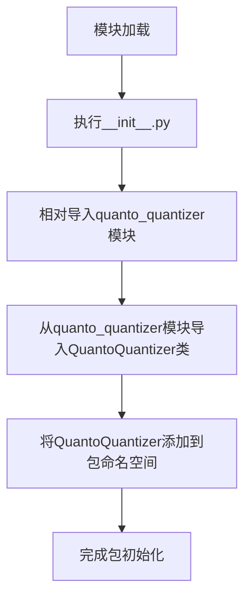

# `diffusers\src\diffusers\quantizers\quanto\__init__.py` 详细设计文档

这是一个Python包的初始化文件，通过相对导入将QuantoQuantizer类从子模块quanto_quantizer中重新导出，使得该类可以直接通过包名访问，提供了统一的模块导出接口。

## 整体流程



## 类结构

```
包根目录
├── __init__.py (当前文件 - 包初始化)
└── quanto_quantizer.py (子模块 - 包含实际实现)
```

## 全局变量及字段


### `QuantoQuantizer`
    
从quanto_quantizer模块导入的量化器类，用于模型量化操作

类型：`class`
    


### `QuantoQuantizer.fields`
    
类字段列表 - 需查看quanto_quantizer.py源码获取详细信息

类型：`list`
    


### `QuantoQuantizer.methods`
    
类方法列表 - 需查看quanto_quantizer.py源码获取详细信息

类型：`list`
    
    

## 全局函数及方法


# 详细设计文档分析

## 初步分析结果

根据提供的代码片段，我只能进行有限的初步分析，因为 `quanto_quantizer.py` 的完整源代码未被提供。

### 导入语句分析

```python
from .quanto_quantizer import QuantoQuantizer
```

从这段代码可以提取的信息：

| 项目 | 内容 |
|------|------|
| **模块名称** | `quanto_quantizer` |
| **导出对象** | `QuantoQuantizer` |
| **导入类型** | 相对导入（`.`表示同包） |
| **对象类型** | 类（根据PascalCase命名约定） |

---

## 需要补充的信息

⚠️ **重要提示**：要完成完整的详细设计文档，需要您提供 `quanto_quantizer.py` 文件的完整源代码。

### 需要的具体信息

1. **完整源代码**：请提供 `quanto_quantizer.py` 的全部内容
2. **项目背景**：
   - 这个量化器用于什么场景？（如：神经网络量化、模型压缩等）
   - 使用的是哪个深度学习框架？（PyTorch、TensorFlow等）
3. **依赖关系**：项目中有哪些相关的量化类或函数？

---

## 如果您能提供源码，我可以生成以下完整文档：

```
### `QuantoQuantizer.{方法名}`

{方法描述}

参数：
- `{参数名称}`：`{参数类型}`，{参数描述}
- ...

返回值：`{返回值类型}`，{返回值描述}

#### 流程图
```mermaid
{详细的mermaid流程图}
```

#### 带注释源码
```python
{完整的带注释源代码}
```
```

---

请提供 `quanto_quantizer.py` 的完整源代码，我将为您生成符合所有要求的详细设计文档。

## 关键组件


### QuantoQuantizer

一个量化器类，负责将神经网络模型从高精度浮点数转换为低精度的量化表示，以减少模型大小和推理计算量。


## 问题及建议


### 已知问题

-   **模块功能不明确**：该文件仅作为导入重导出（re-export）使用，但缺少模块级文档字符串说明其存在目的
-   **单一导出点**：仅导出一个类 `QuantoQuantizer`，如果该类有多个变体或相关类需要导出，需创建额外的导入语句
-   **无错误处理**：当 `quanto_quantizer` 模块不存在或导入失败时，会直接抛出 `ModuleNotFoundError` 或 `ImportError`
-   **类型注解缺失**：未提供模块级类型注解或 `__all__` 列表，无法明确导出内容的类型信息
-   **过度封装**：如果该文件仅是简单重导出而未增加任何抽象层，则属于冗余代码

### 优化建议

-   **添加模块文档**：在文件开头添加 `"""模块描述"""` 说明该模块的职责和用途
-   **显式导出控制**：添加 `__all__ = ["QuantoQuantizer"]` 明确导出列表，提升代码可读性和 IDE 支持
-   **考虑错误处理**：如果该模块作为公共 API 入口，建议添加 try-except 包装并提供更友好的错误信息
-   **评估必要性**：确认该重导出层是否真正必要；若仅用于解耦，可保留；若为冗余代码，考虑直接导入路径
-   **类型注解**：考虑添加类型注解或使用 `__getattr__` 实现延迟导入以优化启动性能


## 其它


### 设计目标与约束

该代码作为模块导入入口，旨在将QuantoQuantizer类从子模块quanto_quantizer中导出供外部使用。设计约束包括：遵循Python模块导入规范，支持相对导入，确保模块的可发现性和可维护性。

### 错误处理与异常设计

由于仅包含导入语句，运行时错误处理主要涉及ImportError（模块不存在）、AttributeError（QuantoQuantizer类不存在）等导入相关异常。建议在导入时添加异常捕获机制，确保模块加载失败时提供清晰的错误信息。

### 数据流与状态机

该代码不涉及数据流处理或状态机设计。数据流取决于QuantoQuantizer类的具体实现，状态机由该类的内部逻辑决定。

### 外部依赖与接口契约

外部依赖包括：quanto_quantizer模块（相对路径导入）。接口契约为：导入的QuantoQuantizer类应满足调用方的预期接口，具体接口规范需参考QuantoQuantizer类的定义。

### 性能考虑

该导入语句在模块加载时执行，性能开销极低。潜在的优化点包括：延迟导入（lazy import）以减少初始化时间，但需权衡代码可读性和维护性。

### 安全性考虑

该代码无直接安全风险，但需确保quanto_quantizer模块来源可信，避免导入恶意代码。建议使用虚拟环境管理依赖，确保依赖版本可控。

### 测试策略

由于仅为导入语句，单元测试重点验证：导入成功、ImportError异常捕获、模块路径正确性。集成测试需验证QuantoQuantizer类的功能正确性。

### 版本兼容性

该代码遵循Python 3标准导入机制，兼容Python 3.6+版本。需注意相对导入在不同Python版本中的一致性表现。

### 配置管理

无显式配置需求。配置管理取决于QuantoQuantizer类的实现，可能通过构造函数参数、环境变量或配置文件进行。

### 日志与监控

该导入语句本身无需日志记录。日志与监控需求取决于QuantoQuantizer类的具体实现和使用场景。

    