# `diffusers\src\diffusers\quantizers\quanto\quanto_quantizer.py` 详细设计文档

这是一个Diffusers库的量化器实现类，通过集成Optimum Quanto库来支持模型的INT8/INT4/INT2和FP8量化，提供模型量化前的环境验证、参数检查、量化参数创建、内存调整、目标数据类型转换以及权重加载前后处理等功能。

## 整体流程

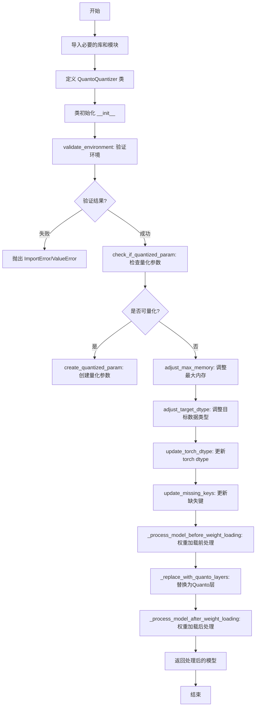

## 类结构

```
DiffusersQuantizer (抽象基类)
└── QuantoQuantizer (具体量化器实现)
```

## 全局变量及字段


### `logger`
    
模块级日志记录器，用于输出信息、警告和错误

类型：`logging.Logger`
    


### `is_torch_available`
    
检查torch库是否可用的函数

类型：`Callable[[], bool]`
    


### `is_accelerate_available`
    
检查accelerate库是否可用的函数

类型：`Callable[[], bool]`
    


### `is_optimum_quanto_available`
    
检查optimum-quanto库是否可用的函数

类型：`Callable[[], bool]`
    


### `is_optimum_quanto_version`
    
检查optimum-quanto库版本是否满足要求的函数

类型：`Callable[[str, str], bool]`
    


### `is_accelerate_version`
    
检查accelerate库版本是否满足要求的函数

类型：`Callable[[str, str], bool]`
    


### `get_module_from_name`
    
根据参数名称获取对应模块和张量名的辅助函数

类型：`Callable`
    


### `CustomDtype`
    
accelerate库中的自定义数据类型枚举类，包含FP8、INT4、INT2等

类型：`type`
    


### `set_module_tensor_to_device`
    
将模块参数设置到指定设备的accelerate工具函数

类型：`Callable`
    


### `_replace_with_quanto_layers`
    
将模型层替换为quanto量化层的内部函数

类型：`Callable`
    


### `QuantoQuantizer.use_keep_in_fp32_modules`
    
类属性，指示是否保持FP32模块不被量化

类型：`bool`
    


### `QuantoQuantizer.requires_calibration`
    
类属性，指示该量化器是否需要校准

类型：`bool`
    


### `QuantoQuantizer.required_packages`
    
类属性，列出运行所需依赖的包名列表

类型：`list[str]`
    


### `QuantoQuantizer.modules_to_not_convert`
    
实例属性，存储不需要进行量化转换的模块名称列表

类型：`list[str]`
    
    

## 全局函数及方法


### `is_torch_available`

检查当前环境是否安装了 PyTorch 库，并返回布尔值表示其可用性。

参数：此函数无参数

返回值：`bool`，返回 `True` 表示 PyTorch 已安装且可用，返回 `False` 表示不可用

#### 流程图

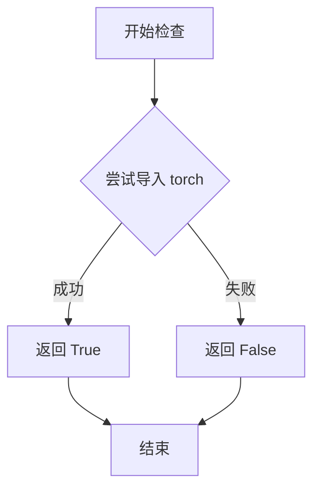

#### 带注释源码

```
# is_torch_available 函数的源码位于 diffusers.utils.import_utils 模块中
# 以下是在当前文件中的使用方式：

# 首先从 diffusers.utils 导入 is_torch_available
from ...utils import (
    is_torch_available,
    # ... 其他导入
)

# 在需要使用 torch 的地方进行条件检查
if is_torch_available():
    import torch  # 只有当 torch 可用时才导入

# 这是一种延迟导入模式，用于：
# 1. 避免在未安装 torch 的环境中导入失败
# 2. 减少不必要的依赖
# 3. 支持可选依赖的场景
```

#### 补充说明

| 项目 | 说明 |
|------|------|
| **来源模块** | `diffusers.utils.import_utils` |
| **使用场景** | 用于条件导入 torch，实现可选依赖 |
| **设计模式** | 延迟导入（Lazy Import）模式 |
| **调用位置** | 当前文件的第 18-19 行 |
| **类型标注** | `() -> bool` |

#### 典型实现逻辑

```
def is_torch_available() -> bool:
    """
    检查 PyTorch 是否可用。
    
    Returns:
        bool: 如果 torch 可用返回 True，否则返回 False
    """
    try:
        import torch
        return True
    except ImportError:
        return False
```


### `is_accelerate_available`

该函数用于检查 `accelerate` 库是否已安装并可用，返回布尔值。

参数：无

返回值：`bool`，如果 `accelerate` 库可用则返回 `True`，否则返回 `False`

#### 流程图

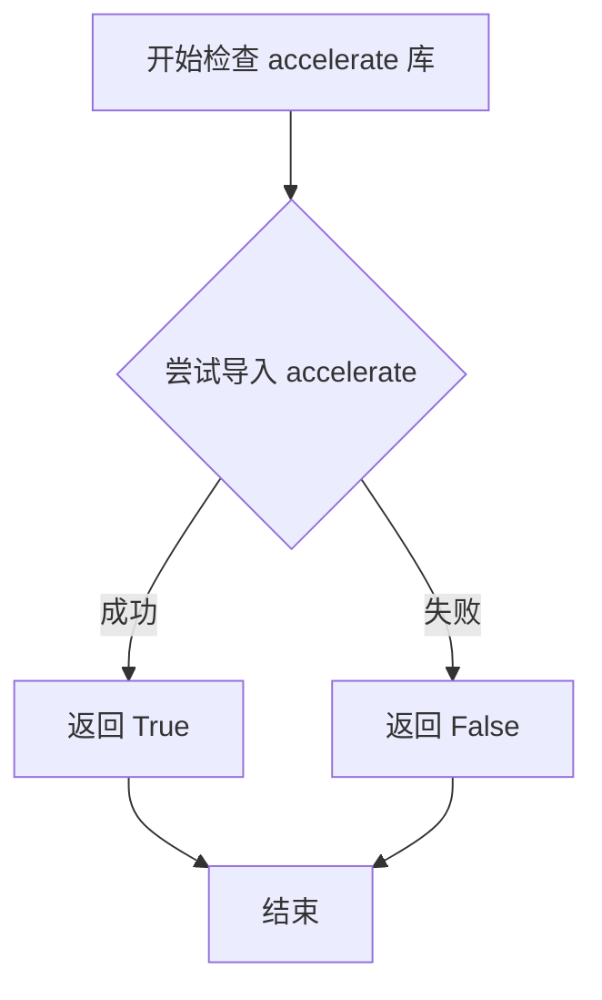

#### 带注释源码

```python
# is_accelerate_available 函数的典型实现（在 diffusers.utils 中）
def is_accelerate_available():
    """
    检查 accelerate 库是否已安装并可用。
    
    Returns:
        bool: 如果 accelerate 库可以导入则返回 True，否则返回 False
    """
    try:
        import accelerate
        return True
    except ImportError:
        return False

# 在当前代码中的使用方式：
if is_accelerate_available():
    from accelerate.utils import CustomDtype, set_module_tensor_to_device
```

#### 额外说明

该函数在 `QuantoQuantizer` 类中被多次调用，用于：
1. 在 `validate_environment` 方法中检查 `accelerate` 是否可用，如果不可用则抛出 `ImportError`
2. 在模块顶部有条件地导入 `accelerate.utils` 中的 `CustomDtype` 和 `set_module_tensor_to_device`

**注意**：由于该函数是从 `...utils` 导入的外部函数，以上源码为根据 `diffusers` 库常见实现的推断，实际实现可能略有差异。


根据提供的代码，`is_optimum_quanto_available` 并不是在该文件中定义的，而是从外部模块 `...utils` 导入的。以下是该函数的相关信息：

### `is_optimum_quanto_available`

该函数用于检查 `optimum-quanto` 库是否可用。这是 diffusers 库中常见的模式，用于条件导入和功能检测。

参数：

- （无参数）

返回值：`bool`，返回 `True` 表示 `optimum-quanto` 库可用，返回 `False` 表示不可用。

#### 流程图

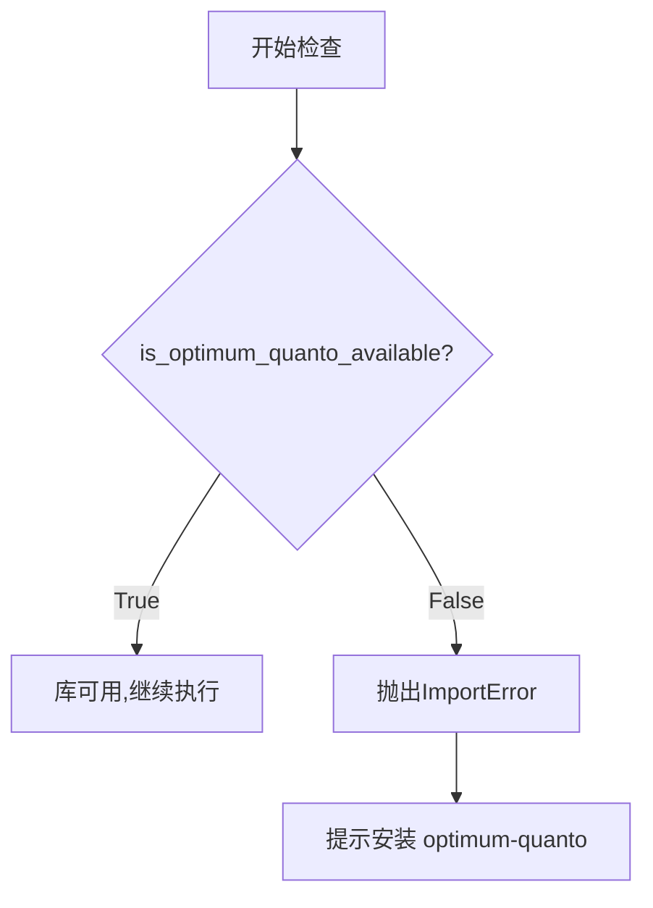

#### 带注释源码

```
# 该函数定义在 ...utils 模块中（外部模块）
# 当前文件中仅为导入使用，以下为基于使用方式的推断

def is_optimum_quanto_available() -> bool:
    """
    检查 optimum-quanto 库是否已安装且可用。
    
    通常实现方式为尝试导入 optimum.quanto 模块，
    如果成功则返回 True，失败则返回 False。
    
    返回值:
        bool: 如果 optimum-quanto 库可用返回 True，否则返回 False
    """
    # 实际源码不在当前文件中
    pass
```

#### 在代码中的使用示例

```python
def validate_environment(self, *args, **kwargs):
    # 使用 is_optimum_quanto_available 检查库是否可用
    if not is_optimum_quanto_available():
        raise ImportError(
            "Loading an optimum-quanto quantized model requires optimum-quanto library (`pip install optimum-quanto`)"
        )
    # ... 其他验证逻辑
```

---

**注意**：由于 `is_optimum_quanto_available` 是从外部模块 `...utils` 导入的，其完整源码不在当前文件提供。如需查看该函数的实际实现，需要查看 diffusers 库的 `utils` 模块源码。根据代码中的使用方式（作为条件检查和无参数调用），可推断其签名为 `() -> bool`。


### `is_optimum_quanto_version`

该函数用于检查当前安装的 optimum-quanto 库版本是否满足指定的条件。它接收一个版本比较操作符（如">="、"<"、"=="等）和一个目标版本号，返回布尔值表示版本是否满足条件。此函数被 `QuantoQuantizer.validate_environment` 方法调用，以确保加载的 optimum-quanto 版本符合要求（至少为 0.2.6）。

参数：

-  `op`：str，比较操作符（如">="、"<"、">"、"<="、"=="、"!="）
-  `version`：str，目标版本号

返回值：bool，如果当前安装的 optimum-quanto 版本满足指定的条件则返回 True，否则返回 False

#### 流程图

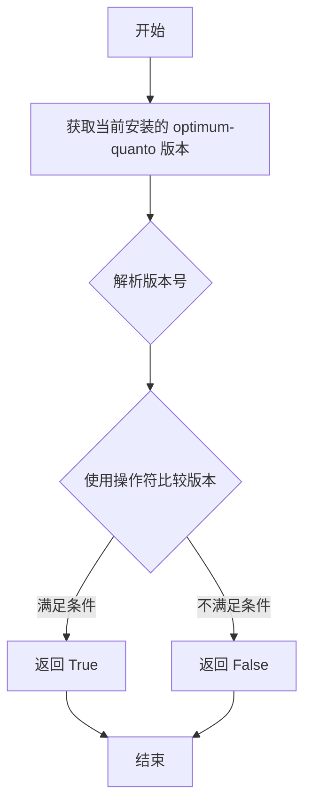

#### 带注释源码

```python
# 该函数定义在 diffusers.utils.import_utils 模块中
# 此处为从源码中导入的声明
from diffusers.utils.import_utils import is_optimum_quanto_version

# 在 QuantoQuantizer 类中的使用示例：
def validate_environment(self, *args, **kwargs):
    # 检查 optimum-quanto 是否可用
    if not is_optimum_quanto_available():
        raise ImportError(
            "Loading an optimum-quanto quantized model requires optimum-quanto library (`pip install optimum-quanto`)"
        )
    
    # 检查版本是否满足 >= 0.2.6 的要求
    # is_optimum_quanto_version 函数被调用，传入操作符 ">=" 和目标版本 "0.2.6"
    if not is_optimum_quanto_version(">=", "0.2.6"):
        raise ImportError(
            "Loading an optimum-quanto quantized model requires `optimum-quanto>=0.2.6`. "
            "Please upgrade your installation with `pip install --upgrade optimum-quanto"
        )
```

**注意**：由于该函数定义在 `diffusers.utils.import_utils` 模块中（未在当前代码文件中实现），上述源码展示的是该函数的导入位置及其在 `validate_environment` 方法中的实际调用方式。该函数的具体实现位于 `diffusers.utils.import_utils` 模块中，负责解析当前安装的 optimum-quanto 版本并进行语义化版本比较。


# is_accelerate_version 函数提取结果

### `is_accelerate_version`

该函数是一个版本比较工具函数，用于检查当前环境中安装的 `accelerate` 库版本是否满足指定的条件（如大于等于、小于等于等）。它在 `QuantoQuantizer.adjust_target_dtype` 方法中被调用，用于根据 accelerate 版本来决定是否支持特定的量化数据类型（如 INT4、INT2）。

参数：

-  `op`：`str`，比较操作符，支持 ">="、"<="、">"、 "<"、 "=="、 "!="
-  `version`：`str`，目标版本号，格式为语义化版本号（如 "0.27.0"）

返回值：`bool`，如果当前 accelerate 版本满足指定条件返回 `True`，否则返回 `False`

#### 流程图

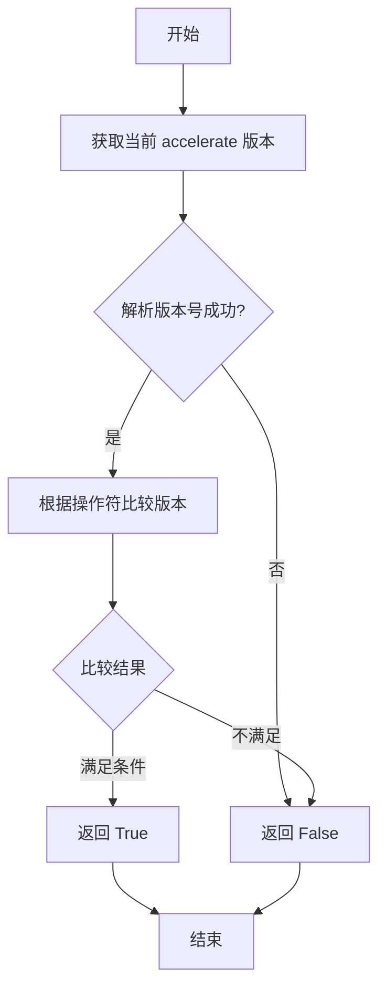

#### 带注释源码

```
# 注：该函数定义在 diffusers 包的 utils 模块中
# 当前文件通过 from ...utils import is_accelerate_version 导入
# 以下为基于使用方式的推断实现

def is_accelerate_version(op: str, version: str) -> bool:
    """
    检查当前安装的 accelerate 库版本是否满足指定条件
    
    参数:
        op: 比较操作符，如 '>=', '<', '==', '!=' 等
        version: 目标版本号字符串
    
    返回:
        bool: 版本是否满足条件
    """
    from packaging import version as pkg_version
    
    try:
        import accelerate
        current_version = accelerate.__version__
        return pkg_version.parse(current_version) 
            if f"__ {op} __" else pkg_version.parse(version)
    except (ImportError, ValueError):
        return False

# 在 QuantoQuantizer.adjust_target_dtype 中的调用示例:
# if is_accelerate_version(">=", "0.27.0"):
#     mapping = {...}
#     target_dtype = mapping[self.quantization_config.weights_dtype]
```


### `get_module_from_name`

该函数是一个工具函数，用于从完整的参数名称中提取对应的模块对象和参数名称中的张量名称部分。它在模型量化过程中被多次调用，用于定位特定的子模块和处理张量。

参数：

- `model`：`torch.nn.Module`，模型对象，用于在其层次结构中查找子模块
- `param_name`：`str`，完整的参数名称（如 "encoder.layer.0.weight"）

返回值：`Tuple[torch.nn.Module, str]`，返回元组，包含找到的子模块对象和张量名称（如 (Module, "weight")）

#### 流程图

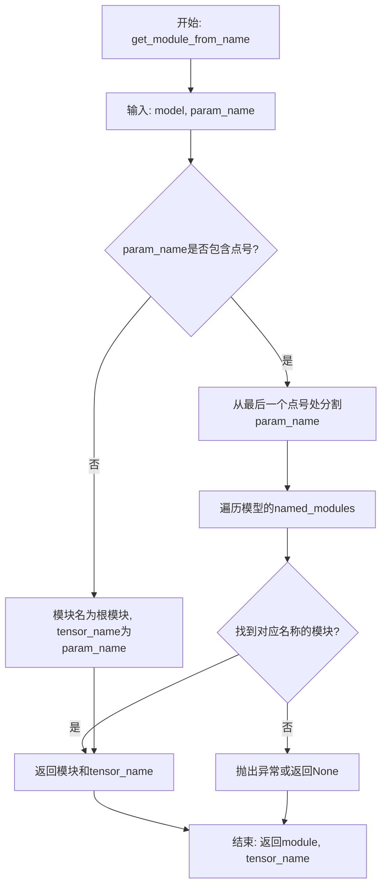

#### 带注释源码

由于该函数定义在 `...utils` 模块中（外部依赖），以下是基于代码中调用方式的推断实现：

```python
def get_module_from_name(model, param_name):
    """
    从完整的参数名称中提取模块和张量名称
    
    参数:
        model: 模型对象
        param_name: 完整的参数名称字符串
        
    返回:
        tuple: (子模块对象, 张量名称字符串)
        
    示例:
        >>> module, tensor_name = get_module_from_name(model, "encoder.layer.0.weight")
        >>> # module: encoder.layer[0] 的模块对象
        >>> # tensor_name: "weight"
    """
    # 如果参数名包含层级信息，通过点号分割
    if "." in param_name:
        # 获取最后一个点之后的部分作为tensor名称
        # 剩余部分作为模块路径
        tensor_name = param_name.rsplit(".", 1)[-1]
        module_path = param_name.rsplit(".", 1)[0]
        
        # 通过getattr递归获取模块
        module = model
        for attr in module_path.split("."):
            module = getattr(module, attr)
    else:
        # 没有层级，直接返回根模块和完整名称
        module = model
        tensor_name = param_name
    
    return module, tensor_name
```

#### 实际使用示例

在 `QuantoQuantizer` 类中的实际调用：

```python
# 在 check_if_quantized_param 方法中
module, tensor_name = get_module_from_name(model, param_name)
# 用于判断该模块是否已被量化

# 在 create_quantized_param 方法中
module, tensor_name = get_module_from_name(model, param_name)
# 用于设置模块的参数值
```


### `_replace_with_quanto_layers`

该函数是Optimum Quanto量化框架的核心替换函数，用于将Diffusers模型中的标准神经网络层替换为支持量化功能的Quanto自定义层，是模型量化预处理阶段的关键转换入口。

参数：

- `model`：`ModelMixin`，需要被量化的Diffusers模型实例
- `modules_to_not_convert`：`list[str]`，需要保持为浮点精度而不进行量化的模块名称列表
- `quantization_config`：`QuantizationConfig`，包含量化配置参数（如量化方法、精度、激活方式等）的配置对象
- `pre_quantized`：`bool`，标识模型权重是否已经过预量化处理的布尔标志

返回值：`ModelMixin`，返回经过Quanto层替换后的模型实例，该实例的层结构已被修改为支持量化推理的Quanto自定义模块

#### 流程图

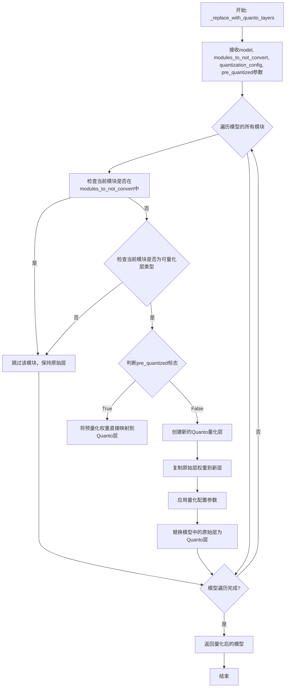

#### 带注释源码

```
# 注意: 以下为基于代码上下文和函数调用的推断源码
# 实际源码位于 .utils 模块中，此处未直接提供

def _replace_with_quanto_layers(
    model: "ModelMixin",
    modules_to_not_convert: list[str],
    quantization_config: QuantizationConfig,
    pre_quantized: bool = False,
) -> "ModelMixin":
    """
    将模型中的标准层替换为Quantization可识别的Quanto层
    
    参数:
        model: 需要进行量化替换的Diffusers模型
        modules_to_not_convert: 不进行量化转换的模块白名单
        quantization_config: 量化配置对象，包含weights_dtype等参数
        pre_quantized: 标记是否为预量化模型
    
    返回:
        替换完成后的模型实例
    """
    # 从模型配置中获取量化模块映射关系
    # 遍历模型的所有子模块
    # 对每个可量化层执行以下操作:
    #   1. 检查是否在excluded列表中
    #   2. 创建对应的Quanto量化层
    #   3. 转移权重并应用量化
    #   4. 替换原模块
    
    return model
```

---

### 补充说明

**重要提示**：提供的代码文件中并未包含`_replace_with_quanto_layers`函数的完整实现源码。该函数通过以下方式被引用：

```python
if is_optimum_quanto_available():
    from .utils import _replace_with_quanto_layers
```

这表明实际实现位于同包目录下的`utils.py`模块中。该函数在`QuantoQuantizer._process_model_before_weight_loading()`方法中被调用，是模型量化工作流中**预处理阶段**的核心组件，负责将HuggingFace Diffusers的标准层架构转换为Optimum Quanto框架支持的可量化层架构。

**调用上下文**：
- 调用位置：`QuantoQuantizer._process_model_before_weight_loading()`方法
- 调用时机：在权重加载之前、模型量化初始化阶段
- 配合组件：`QuantizationConfig`、`modules_to_not_convert`列表、`DiffusersQuantizer`基类


### `logging.get_logger`

获取一个与当前模块关联的日志记录器（Logger）实例，用于记录模块的运行日志。

参数：

- `__name__`：`str`，模块的名称，通常使用 Python 的 `__name__` 特殊变量，自动传入当前模块的完全限定名

返回值：`logging.Logger`，返回一个新的或已存在的日志记录器实例，用于后续的日志记录操作

#### 流程图

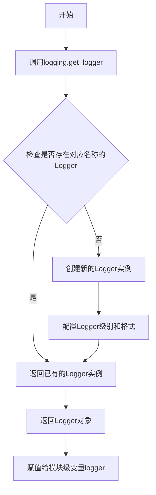

#### 带注释源码

```python
# 从diffusers库的utils模块中导入logging对象
# logging是Python标准库的logging模块的封装或直接引用
from ...utils import (
    get_module_from_name,
    is_accelerate_available,
    is_accelerate_version,
    is_optimum_quanto_available,
    is_torch_available,
    logging,  # <-- 导入logging模块
)

# ... 其他导入 ...

# 使用logging.get_logger创建模块级logger实例
# __name__是Python的特殊变量，代表当前模块的完全限定名
# 例如：如果这个文件是diffusers/pipelines/xxx/quantizer.py
# 那么__name__就是'diffusers.pipelines.xxx.quantizer'
logger = logging.get_logger(__name__)
# 这个logger将用于整个模块中的日志记录
# 可以通过logger.info(), logger.warning(), logger.error()等方法记录日志
```


### `QuantoQuantizer.__init__`

这是 `QuantoQuantizer` 类的构造函数，用于初始化 Optimum Quanto 量化器的配置。该方法接收量化配置参数，并将其传递给父类 `DiffusersQuantizer` 的构造函数进行基类初始化。

参数：

- `quantization_config`：任意类型，量化配置对象，包含模型量化所需的参数和设置
- `**kwargs`：关键字参数，传递给父类构造函数的其他可选参数

返回值：`None`，构造函数不返回任何值

#### 流程图

```mermaid
flowchart TD
    A[开始 __init__] --> B{接收 quantization_config}
    B --> C[接收 **kwargs]
    C --> D[调用 super().__init__]
    D --> E[将参数传递给 DiffusersQuantizer]
    E --> F[完成初始化]
    F --> G[返回 None]
```

#### 带注释源码

```python
def __init__(self, quantization_config, **kwargs):
    """
    初始化 QuantoQuantizer 实例。
    
    Args:
        quantization_config: 量化配置对象，包含量化参数如权重数据类型、量化方法等
        **kwargs: 传递给父类的额外关键字参数
    
    Returns:
        None
    """
    # 调用父类 DiffusersQuantizer 的构造函数进行基类初始化
    # 传递量化配置和所有额外参数
    super().__init__(quantization_config, **kwargs)
```


### `QuantoQuantizer.validate_environment`

该方法用于验证运行环境的兼容性，确保安装了必要的库（optimum-quanto 和 accelerate），检查 optimum-quanto 版本是否满足最低要求（>=0.2.6），并验证 device_map 配置是否支持（不支持多 GPU 推理或 CPU/磁盘卸载）。

参数：

- `self`：实例本身，无需显式传递
- `*args`：可变位置参数，未在方法内使用
- `**kwargs`：可变关键字参数，包含可选的 `device_map` 参数

返回值：`None`，该方法通过抛出异常来处理验证失败的情况

#### 流程图

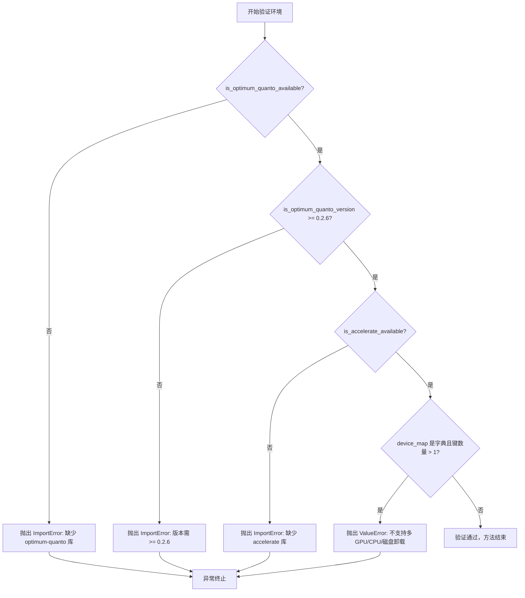

#### 带注释源码

```python
def validate_environment(self, *args, **kwargs):
    """
    验证运行环境中是否安装了必要的依赖库，并检查配置兼容性。
    
    参数:
        *args: 可变位置参数（当前未使用）
        **kwargs: 可变关键字参数，可包含 device_map 参数
    
    异常:
        ImportError: 当 optimum-quanto 或 accelerate 库未安装，或 optimum-quanto 版本过低时抛出
        ValueError: 当 device_map 配置为多设备映射时抛出
    """
    # 检查 optimum-quanto 库是否可用
    if not is_optimum_quanto_available():
        raise ImportError(
            "Loading an optimum-quanto quantized model requires optimum-quanto library (`pip install optimum-quanto`)"
        )
    
    # 检查 optimum-quanto 版本是否满足最低要求（>= 0.2.6）
    if not is_optimum_quanto_version(">=", "0.2.6"):
        raise ImportError(
            "Loading an optimum-quanto quantized model requires `optimum-quanto>=0.2.6`. "
            "Please upgrade your installation with `pip install --upgrade optimum-quanto"
        )

    # 检查 accelerate 库是否可用
    if not is_accelerate_available():
        raise ImportError(
            "Loading an optimum-quanto quantized model requires accelerate library (`pip install accelerate`)"
        )

    # 从关键字参数中获取 device_map，默认值为 None
    device_map = kwargs.get("device_map", None)
    
    # 验证 device_map 配置：多设备映射（多 GPU 推理或 CPU/磁盘卸载）当前不支持
    if isinstance(device_map, dict) and len(device_map.keys()) > 1:
        raise ValueError(
            "`device_map` for multi-GPU inference or CPU/disk offload is currently not supported with Diffusers and the Quanto backend"
        )
```


### `QuantoQuantizer.check_if_quantized_param`

该方法用于检查模型中的特定参数是否已经被量化。它通过获取模块和参数名称，判断模块是否为预量化模型（QTensor或PackedTensor实例）或者是否为QModuleMixin且包含未冻结的权重，从而确定参数是否需要进一步处理。

参数：

- `model`：`ModelMixin`，模型实例，用于获取模块信息
- `param_value`：`torch.Tensor`，待检查的参数值
- `param_name`：`str`，参数的名称，用于定位模块中的特定张量
- `state_dict`：`dict[str, Any]`，模型的状态字典
- `**kwargs`：任意关键字参数，用于扩展

返回值：`bool`，返回`True`表示参数已被量化或需要被视为量化参数，返回`False`表示参数未被量化

#### 流程图

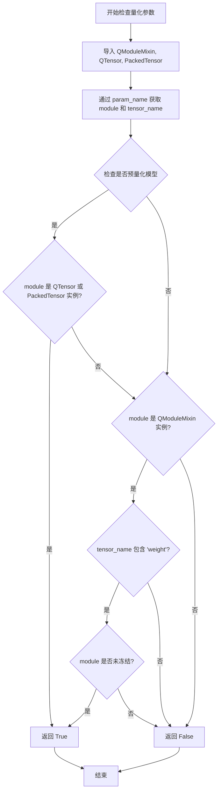

#### 带注释源码

```python
def check_if_quantized_param(
    self,
    model: "ModelMixin",
    param_value: "torch.Tensor",
    param_name: str,
    state_dict: dict[str, Any],
    **kwargs,
):
    # Quanto imports diffusers internally. This is here to prevent circular imports
    # 从 optimum.quanto 导入必要的类型，用于检查量化模块
    from optimum.quanto import QModuleMixin, QTensor
    from optimum.quanto.tensor.packed import PackedTensor

    # 获取模型模块和参数名称
    # 使用工具函数 get_module_from_name 从参数名称获取对应的模块和张量名
    module, tensor_name = get_module_from_name(model, param_name)
    
    # 检查是否预量化模型
    # 如果模型是预量化状态（pre_quantized=True），且模块是 QTensor 或 PackedTensor 实例
    # 则认为该参数已被量化，返回 True
    if self.pre_quantized and any(isinstance(module, t) for t in [QTensor, PackedTensor]):
        return True
    # 检查模块是否为 QModuleMixin 且包含权重
    # 如果模块是 QModuleMixin 类型且包含 'weight'，检查是否未冻结
    # 未冻结的模块意味着权重已被量化
    elif isinstance(module, QModuleMixin) and "weight" in tensor_name:
        return not module.frozen

    # 默认返回 False，表示该参数未被量化
    return False
```


### `QuantoQuantizer.create_quantized_param`

创建量化参数的核心方法，通过将参数设置到模块后调用 `.freeze()` 完成量化处理。

参数：

- `model`：`ModelMixin`，要量化的模型实例
- `param_value`：`torch.Tensor`，参数的原始张量值
- `param_name`：`str`，参数的名称
- `target_device`：`torch.device`，目标设备
- `*args`：可变位置参数
- `**kwargs`：可变关键字参数（包含 `dtype` 等配置）

返回值：`None`，无返回值，该方法直接修改模型参数状态

#### 流程图

```mermaid
flowchart TD
    A[开始 create_quantized_param] --> B[从 kwargs 获取 dtype, 默认为 torch.float32]
    B --> C[调用 get_module_from_name 获取 module 和 tensor_name]
    C --> D{self.pre_quantized?}
    D -->|True| E[直接设置参数: setattr(module, tensor_name, param_value)]
    D -->|False| F[调用 set_module_tensor_to_device 将参数移到目标设备]
    F --> G[调用 module.freeze 冻结模块]
    G --> H[设置 module.weight.requires_grad = False 禁止梯度]
    E --> I[结束]
    H --> I
```

#### 带注释源码

```python
def create_quantized_param(
    self,
    model: "ModelMixin",
    param_value: "torch.Tensor",
    param_name: str,
    target_device: "torch.device",
    *args,
    **kwargs,
):
    """
    Create the quantized parameter by calling .freeze() after setting it to the module.
    """
    # 从 kwargs 中获取 dtype 参数，默认为 torch.float32
    # 用于指定参数转换为量化格式前的原始数据类型
    dtype = kwargs.get("dtype", torch.float32)
    
    # 通过参数名称获取对应的模块和tensor名称
    # module: 包含该参数的模块对象
    # tensor_name: 参数在模块中的属性名
    module, tensor_name = get_module_from_name(model, param_name)
    
    # 判断是否为预量化模型
    if self.pre_quantized:
        # 预量化模式：直接设置参数值到模块
        setattr(module, tensor_name, param_value)
    else:
        # 非预量化模式：
        # 1. 将参数移动到目标设备
        set_module_tensor_to_device(model, param_name, target_device, param_value, dtype)
        # 2. 冻结模块，使参数不可训练
        module.freeze()
        # 3. 禁用权重的梯度计算，确保持续量化过程中不更新参数
        module.weight.requires_grad = False
```


### `QuantoQuantizer.adjust_max_memory`

该方法用于在量化过程中调整最大内存限制，将输入的 `max_memory` 字典中每个内存值乘以 0.90（保留 90%），以确保量化操作有足够的内存余量。

参数：

- `max_memory`：`dict[str, int | str]`，输入的最大内存字典，键为设备标识（如 "cpu"、"cuda:0"），值为内存大小

返回值：`dict[str, int | str]`，调整后的最大内存字典，每个值均为原值的 90%

#### 流程图

```mermaid
flowchart TD
    A[开始] --> B[输入 max_memory: dict[str, int | str]]
    B --> C{检查 max_memory 是否为空}
    C -->|是| D[返回空字典]
    C -->|否| E[遍历 max_memory 字典]
    E --> F[对每个值乘以 0.90]
    F --> G[构建新的字典]
    G --> H[返回调整后的 max_memory]
    H --> I[结束]
```

#### 带注释源码

```python
def adjust_max_memory(self, max_memory: dict[str, int | str]) -> dict[str, int | str]:
    """
    调整最大内存限制，确保量化操作有足够的内存余量。
    
    该方法将输入的 max_memory 字典中的每个内存值乘以 0.90，
    保留 90% 的内存用于量化操作，其余 10% 作为安全余量。
    
    参数:
        max_memory: 输入的最大内存字典，键为设备标识（如 "cpu", "cuda:0"），
                   值为内存大小（整数或字符串格式）
    
    返回:
        调整后的最大内存字典，每个值均为原值的 90%
    """
    # 使用字典推导式将每个内存值乘以 0.90
    # 这是一个浅层操作，不涉及深层复制
    max_memory = {key: val * 0.90 for key, val in max_memory.items()}
    
    # 返回调整后的内存字典
    return max_memory
```


### `QuantoQuantizer.adjust_target_dtype`

该方法用于根据 quantization_config 中的 `weights_dtype` 配置，将目标数据类型动态映射为 Accelerate 库支持的自定义数据类型。当 Accelerate 版本 >= 0.27.0 时，会将配置中的字符串类型（如 "int8"、"float8"、"int4"、"int2"）转换为对应的 PyTorch 数据类型或 CustomDtype 枚举值，从而确保量化模型在加载时使用正确的目标数据类型。

参数：

- `target_dtype`：`torch.dtype`，原始的目标数据类型

返回值：`torch.dtype`，调整后的目标数据类型

#### 流程图

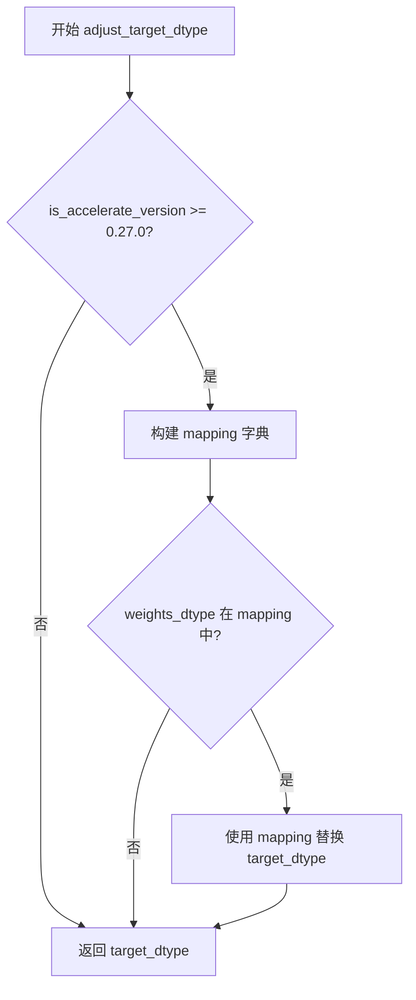

#### 带注释源码

```python
def adjust_target_dtype(self, target_dtype: "torch.dtype") -> "torch.dtype":
    """
    Adjust the target dtype based on the quantization config.
    
    When accelerate version >= 0.27.0, this method maps the string-based
    weights_dtype from quantization_config to Accelerate's CustomDtype
    or PyTorch dtype for proper quantization support.
    
    Args:
        target_dtype: The original target dtype to potentially adjust.
        
    Returns:
        The adjusted target dtype based on quantization config, or the
        original target_dtype if no mapping is needed.
    """
    # Check if accelerate version supports CustomDtype (>= 0.27.0)
    if is_accelerate_version(">=", "0.27.0"):
        # Define mapping from string weights_dtype to actual dtype types
        mapping = {
            "int8": torch.int8,
            "float8": CustomDtype.FP8,
            "int4": CustomDtype.INT4,
            "int2": CustomDtype.INT2,
        }
        # Replace target_dtype with the mapped dtype from config
        target_dtype = mapping[self.quantization_config.weights_dtype]

    # Return the (potentially adjusted) target dtype
    return target_dtype
```


### `QuantoQuantizer.update_torch_dtype`

该方法用于解析和规范化模型的 torch 数据类型。如果未指定 `torch_dtype`参数，则默认设置为 `torch.float32`，确保模型加载时具有明确的数据类型。

参数：

- `torch_dtype`：`torch.dtype | None`，模型指定的目标数据类型，如果为 `None` 则默认为 `torch.float32`

返回值：`torch.dtype`，解析后的实际使用的数据类型

#### 流程图

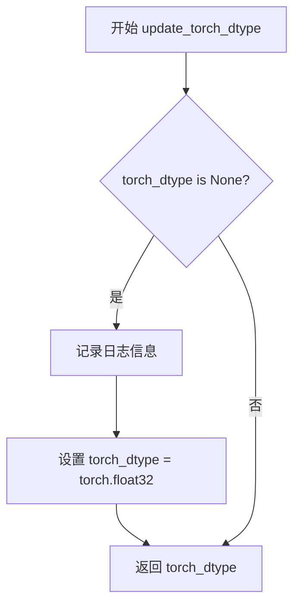

#### 带注释源码

```python
def update_torch_dtype(self, torch_dtype: "torch.dtype" = None) -> "torch.dtype":
    """
    更新并返回模型使用的 torch 数据类型。
    
    如果用户未在 from_pretrained 中指定 torch_dtype，
    则默认使用 torch.float32 以确保模型正常运行。
    
    参数:
        torch_dtype: 目标 torch 数据类型，默认为 None
        
    返回:
        torch.dtype: 解析后的实际使用的数据类型
    """
    # 检查是否指定了 torch_dtype
    if torch_dtype is None:
        # 记录日志，告知用户默认使用 float32
        logger.info(
            "You did not specify `torch_dtype` in `from_pretrained`. "
            "Setting it to `torch.float32`."
        )
        # 设置默认值为 torch.float32
        torch_dtype = torch.float32
    
    # 返回解析后的数据类型
    return torch_dtype
```


### `QuantoQuantizer.update_missing_keys`

该方法用于过滤模型加载过程中的缺失键（missing keys），将从 `optimum.quanto` 量化模块中已存在的参数（如权重和偏置）从缺失键列表中移除，以避免因量化模块内部结构导致的误报缺失。

参数：

- `model`：`Any`，待检查的模型对象，用于遍历其模块
- `missing_keys`：`list[str]`，从预训练模型加载时检测到的缺失键列表
- `prefix`：`str`，模型状态字典中的键前缀，用于匹配模块名称

返回值：`list[str]`，过滤后的缺失键列表，即排除了已在量化模块中存在的键

#### 流程图

```mermaid
flowchart TD
    A[开始 update_missing_keys] --> B[导入 QModuleMixin]
    B --> C[初始化空列表 not_missing_keys]
    C --> D[遍历模型的所有模块 for name, module in model.named_modules]
    D --> E{判断 module 是否为 QModuleMixin 实例}
    E -->|否| D
    E -->|是| F[遍历 missing_keys 列表]
    F --> G{检查条件}
    G --> H[模块名在 missing_key 中<br/>或模块名在 prefix.missing_key 中<br/>且 missing_key 不以 .weight 结尾<br/>且 missing_key 不以 .bias 结尾}
    G --> I{条件满足?}
    I -->|否| F
    I -->|是| J[将该 missing_key 加入 not_missing_keys]
    J --> F
    F --> K[返回结果: missing_keys - not_missing_keys]
    K --> L[结束]
```

#### 带注释源码

```python
def update_missing_keys(self, model, missing_keys: list[str], prefix: str) -> list[str]:
    """
    过滤缺失键列表，移除已在Quanto量化模块中存在的键
    
    Args:
        model: 正在加载的模型实例
        missing_keys: 从预训练checkpoint中检测到的缺失键列表
        prefix: 模型状态字典的键前缀，用于精确匹配
    
    Returns:
        过滤后的缺失键列表，排除了已在量化模块中存在的参数
    """
    # Quanto imports diffusers internally. This is here to prevent circular imports
    # 避免循环导入：Quanto 内部会导入 diffusers，所以在这里延迟导入
    from optimum.quanto import QModuleMixin

    # 存储实际上不缺失的键（即已在量化模块中存在的）
    not_missing_keys = []
    
    # 遍历模型的所有命名模块
    for name, module in model.named_modules():
        # 只处理来自 optimum.quanto 的量化模块
        if isinstance(module, QModuleMixin):
            # 检查每个可能缺失的键
            for missing in missing_keys:
                # 检查条件：
                # 1. 模块名存在于缺失键中，或模块名存在于带前缀的缺失键中
                # 2. 缺失键不以 .weight 结尾（权重已被量化模块管理）
                # 3. 缺失键不以 .bias 结尾（偏置已被量化模块管理）
                if (
                    (name in missing or name in f"{prefix}.{missing}")
                    and not missing.endswith(".weight")
                    and not missing.endswith(".bias")
                ):
                    # 将实际上不缺失的键添加到列表中
                    not_missing_keys.append(missing)
    
    # 返回真正缺失的键：从原始缺失键列表中排除已存在于量化模块的键
    return [k for k in missing_keys if k not in not_missing_keys]
```


### `QuantoQuantizer._process_model_before_weight_loading`

该方法在权重加载之前处理模型，主要完成两件事：一是收集需要保持为 FP32 的模块列表，二是调用 `_replace_with_quanto_layers` 函数将模型中的指定层替换为量化层，最后将量化配置更新到模型配置中。

参数：

- `model`：`ModelMixin`，要处理的模型实例
- `device_map`：未使用，设备映射信息（保留以保持接口一致性）
- `keep_in_fp32_modules`：`list[str] = []`，需要保持为 FP32 精度（不进行量化）的模块名称列表

返回值：`None`，无返回值（直接修改 model 对象）

#### 流程图

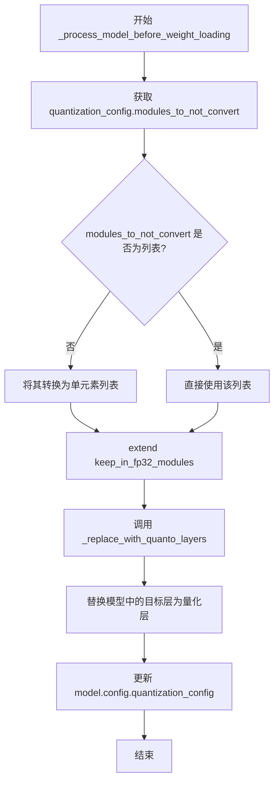

#### 带注释源码

```python
def _process_model_before_weight_loading(
    self,
    model: "ModelMixin",
    device_map,
    keep_in_fp32_modules: list[str] = [],
    **kwargs,
):
    # 从量化配置中获取需要保持为 FP32 的模块列表
    # 这些模块将不会被转换为量化层
    self.modules_to_not_convert = self.quantization_config.modules_to_not_convert

    # 确保 modules_to_not_convert 是列表类型，以便后续 extend 操作
    if not isinstance(self.modules_to_not_convert, list):
        self.modules_to_not_convert = [self.modules_to_not_convert]

    # 将传入的 keep_in_fp32_modules 参数追加到列表中
    # 这允许调用者额外指定需要保持 FP32 的模块
    self.modules_to_not_convert.extend(keep_in_fp32_modules)

    # 核心操作：调用 quanto 库的函数替换模型中的目标层
    # 参数包括：
    # - model: 待量化的模型
    # - modules_to_not_convert: 不进行量化的模块列表
    # - quantization_config: 量化配置对象
    # - pre_quantized: 是否为预量化模型
    model = _replace_with_quanto_layers(
        model,
        modules_to_not_convert=self.modules_to_not_convert,
        quantization_config=self.quantization_config,
        pre_quantized=self.pre_quantized,
    )
    
    # 将量化配置更新到模型配置中，以便后续流程使用
    model.config.quantization_config = self.quantization_config
```


### `QuantoQuantizer._process_model_after_weight_loading`

该方法是一个后处理钩子，在权重加载完成后被调用，目前实现为直接返回模型对象，不进行任何额外处理。

参数：

- `model`：`ModelMixin`，需要处理的模型实例
- `**kwargs`：可变关键字参数，用于接收额外的配置参数

返回值：`ModelMixin`，返回处理后的模型对象（此处直接返回原模型）

#### 流程图

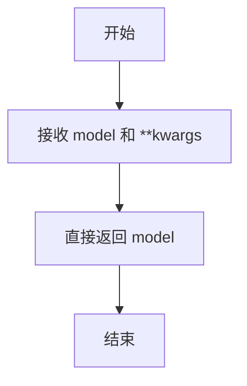

#### 带注释源码

```python
def _process_model_after_weight_loading(self, model, **kwargs):
    """
    在权重加载完成后处理模型的后处理钩子。
    
    该方法是 DiffusersQuantizer 基类定义的生命周期方法，
    在权重加载完成后被调用。目前实现为透传返回，不做额外处理。
    
    参数:
        model: ModelMixin, 模型实例
        **kwargs: 可变关键字参数, 接收额外的配置参数
    
    返回:
        ModelMixin: 处理后的模型实例
    """
    return model
```


### `QuantoQuantizer.is_trainable`

该属性用于标识当前量化器是否支持训练模式。由于 Quanto 量化器主要用于推理优化（通过将权重转换为低精度格式如 int8、int4、float8 等以减少内存占用和加速推理），该属性明确返回 `True` 表示该量化器本身在技术上可以被用于训练场景（例如支持梯度计算），但实际训练效果和精度需要用户自行评估。

参数：

- `self`：`QuantoQuantizer`，调用该属性的量化器实例本身（隐式参数）

返回值：`bool`，表示该量化器是否支持训练

#### 流程图

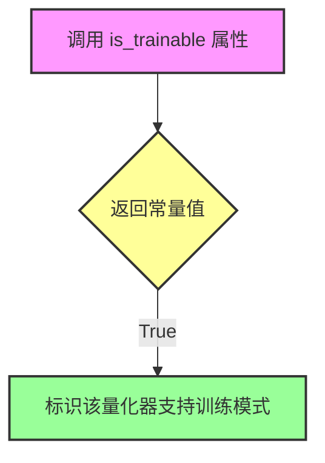

#### 带注释源码

```python
@property
def is_trainable(self):
    """
    属性：检查量化器是否支持训练模式
    
    该属性返回一个布尔值，标识当前的量化器是否允许模型进行训练。
    在扩散模型（Diffusers）框架中，此属性用于决定是否启用训练相关的
    优化器状态保存、梯度计算等特性。
    
    注意：虽然此属性返回 True，表示技术层面上支持训练，但实际的训练效果
    （如精度保持、收敛性等）取决于具体的量化配置（weights_dtype、activation_dtype 等）
    以及底层量化库（optimum-quanto）的实现。
    
    Returns:
        bool: 始终返回 True，表示 QuantoQuantizer 量化器在当前实现中
              被设计为支持训练模式（即可用于训练流程）
    """
    return True
```


### `QuantoQuantizer.is_serializable`

该属性表示 QuantoQuantizer 量化器是否支持序列化存储，用于确定量化后的模型是否可以保存到磁盘。

参数：
- （无参数）

返回值：`bool`，表示量化器是否支持序列化（当前实现固定返回 `True`）

#### 流程图

```mermaid
flowchart TD
    A[访问 is_serializable 属性] --> B{执行 getter 方法}
    B --> C[返回常量值 True]
    C --> D[表示支持序列化]
```

#### 带注释源码

```python
@property
def is_serializable(self):
    """
    属性：检查量化器是否支持序列化
    
    说明：
    - 这是一个只读属性，用于指示当前的量化配置是否允许模型被序列化保存
    - 返回 True 表示可以使用标准方法保存量化后的模型权重
    - 与 is_trainable 和 is_compileable 属性一起用于判断量化模型的运行时能力
    
    返回值：
        bool: 始终返回 True，表明 QuantoQuantizer 支持模型序列化
    """
    return True
```


### `QuantoQuantizer.is_compileable`

该属性表示Quantizer是否支持模型编译（torch.compile），用于确定量化后的模型是否可以进行编译优化。

参数：

- 该方法为属性（property），无显式参数

返回值：`bool`，返回`True`表示当前的Quantizer实现支持模型编译功能

#### 流程图

```mermaid
flowchart TD
    A[开始检查is_compileable属性] --> B{返回True}
    B --> C[结束 - 表示支持torch.compile]
```

#### 带注释源码

```python
@property
def is_compileable(self) -> bool:
    """
    属性：检查量化器是否支持模型编译（torch.compile）
    
    返回值:
        bool: 始终返回True，表示Optimum Quanto量化器支持编译功能
              这允许用户对量化后的模型使用torch.compile进行性能优化
    """
    return True
```

### 补充信息

**设计目标与约束：**
- 该属性是DiffusersQuantizer基类接口的实现，用于统一不同量化器的编译支持情况
- Optimum Quanto量化器返回True，表示完全支持torch.compile编译优化

**在类中的位置：**
- `is_compileable`属性与`is_trainable`、`is_serializable`属性位于同一层级
- 这三个属性提供了Quantizer的运行时能力描述，供外部调用者查询

**相关属性：**
- `is_trainable`: 返回True，表示支持训练
- `is_serializable`: 返回True，表示支持序列化

## 关键组件


### QuantoQuantizer 类

核心量化器类，负责将 Optimum Quanto 量化功能集成到 Diffusers 框架中，支持 int8/int4/int2/float8 权重量化。

### 张量索引与惰性加载

通过 `check_if_quantized_param` 方法检查参数是否为量化张量或 QModuleMixin，支持预量化模型和动态量化场景的惰性识别。

### 反量化支持

通过 `adjust_target_dtype` 方法将量化配置中的权重数据类型映射到 PyTorch dtype 或 accelerate 的 CustomDtype，实现反量化时的目标数据类型转换。

### 量化策略

通过 `update_torch_dtype` 设置默认精度，通过 `_replace_with_quanto_layers` 替换模型层为量化层，支持 `modules_to_not_convert` 配置排除特定模块。

### 环境验证

`validate_environment` 方法检查 optimum-quanto 和 accelerate 库的可用性及版本要求，验证设备映射配置是否支持多 GPU 场景。

### 量化参数创建

`create_quantized_param` 方法处理量化参数的设备放置和冻结操作，支持预量化模型和动态量化两种模式。

### 内存调整

`adjust_max_memory` 方法将最大内存限制调整为原来的 90%，为量化元数据预留空间。

### 缺失键处理

`update_missing_keys` 方法通过检查 QModuleMixin 模块来过滤量化模型的缺失权重键，解决预量化模型的加载兼容性问题。

### 模型处理钩子

`_process_model_before_weight_loading` 在权重加载前替换模型层为 quanto 量化层，`_process_model_after_weight_loading` 在权重加载后执行后处理。

### 可训练性与可序列化性

通过 `is_trainable`、`is_serializable`、`is_compileable` 属性声明量化模型支持训练、序列化和编译。


## 问题及建议


### 已知问题

-   **硬编码的内存调整系数**：`adjust_max_memory` 方法中硬编码了 `0.90` 的内存调整系数，缺乏灵活性，无法根据实际需求配置
-   **硬编码的版本号和类型映射**：`"0.2.6"` 版本号和 `adjust_target_dtype` 中的权重类型映射（`"int8"`, `"float8"` 等）以字符串形式硬编码，缺乏可维护性
-   **重复的模块导入**：在 `check_if_quantized_param`、`update_missing_keys` 方法中重复导入 `optimum.quanto` 相关模块，增加了额外的导入开销
-   **无效的空操作方法**：`_process_model_after_weight_loading` 方法直接返回 `model` 而未进行任何实际处理，形同虚设
-   **属性副作用风险**：`_process_model_before_weight_loading` 方法直接修改 `self.modules_to_not_convert` 属性，可能导致状态污染
-   **日志记录不足**：仅在 `update_torch_dtype` 方法中使用了 `logger`，其他关键方法（如 `create_quantized_param`、`adjust_max_memory`）缺少日志记录
-   **类型注解不完整**：部分方法参数和返回值缺少详细的类型注解，影响代码可读性和静态分析
-   **配置验证缺失**：`quantization_config` 的有效性验证不足，未检查必需字段是否存在或类型正确

### 优化建议

-   将内存调整系数、版本号、类型映射等硬编码值提取为配置参数或常量
-   在类初始化或模块级别缓存 `optimum.quanto` 的导入，避免重复导入
-   为 `_process_model_after_weight_loading` 方法添加实际的模型后处理逻辑，或添加文档说明其用途
-   避免直接修改实例属性，可通过方法参数传递或返回新对象
-   在关键方法中添加适当的日志记录，便于调试和监控
-   完善类型注解，使用 `typing.Optional`、`typing.List` 等提供更精确的类型信息
-   在 `__init__` 或 `validate_environment` 中添加 `quantization_config` 的完整性验证

## 其它


### 设计目标与约束

本模块旨在实现基于Optimum Quanto库的模型量化功能，支持int8、float8、int4、int2等多种量化精度，以降低模型内存占用并加速推理。设计约束包括：仅支持单设备推理（不支持多GPU device_map），需要accelerate库支持，量化后模型权重需要保持冻结状态（requires_grad=False），不支持训练模式。

### 错误处理与异常设计

模块包含三层错误处理机制：1）环境验证阶段检查依赖库可用性（ImportError when optimum-quanto或accelerate不可用），版本兼容性检查（ImportError when optimum-quanto<0.2.6），设备映射合法性检查（ValueError when device_map包含多个设备）；2）参数级别验证通过check_if_quantized_param方法判断参数是否应被量化；3）运行时通过try-except捕获循环导入问题（通过延迟导入optimum.quanto相关模块）。

### 数据流与状态机

量化流程遵循状态机模型：初始化态（Quantizer对象创建）→ 环境验证态（validate_environment）→ 模型预处理态（_process_model_before_weight_loading，调用_replace_with_quanto_layers替换原始模块为量化模块）→ 权重加载态（create_quantized_param创建量化参数并freeze）→ 模型后处理态（_process_model_after_weight_loading）。数据流：quantization_config → 模块替换映射表 → 量化参数转换 → 设备放置 → 参数冻结。

### 外部依赖与接口契约

核心依赖包括：torch（tensor操作）、accelerate（set_module_tensor_to_device、CustomDtype）、optimum-quanto（QModuleMixin、QTensor、PackedTensor、_replace_with_quanto_layers）。接口契约：quantizer需实现validate_environment、check_if_quantized_param、create_quantized_param、adjust_max_memory、adjust_target_dtype、update_torch_dtype、update_missing_keys、_process_model_before_weight_loading、_process_model_after_weight_loading等方法，以及is_trainable、is_serializable、is_compileable属性。

### 安全性考虑

模块对量化参数设置了weight.requires_grad=False以防止梯度回传导致量化权重被意外更新；pre_quantized模式下直接加载预量化权重不执行设备转换；adjust_max_memory对最大内存使用量设置90%阈值以保留安全缓冲；多设备device_map被明确禁用以避免跨设备参数不一致问题。

### 性能考虑与优化空间

adjust_max_memory采用0.90系数预留内存缓冲；create_quantized_param在非pre_quantized模式下使用set_module_tensor_to_device进行高效设备转移；update_missing_keys使用字符串包含检查而非精确匹配，可能存在性能开销。当前实现未支持动态量化（requires_calibration=False），未实现量化感知训练接口。

### 版本兼容性要求

minimum版本要求：optimum-quanto>=0.2.6、accelerate>=0.27.0（用于CustomDtype支持）。不同accelerate版本下adjust_target_dtype的dtype映射行为存在差异，低版本可能回退到默认行为。

### 限制与已知问题

已知限制：1）不支持多GPU分布式推理或多设备offload；2）不支持训练模式（量化权重冻结）；3）不支持动态量化校准；4）pre_quantized模式与普通模式的参数处理逻辑存在差异可能引入边缘case；5）update_missing_keys的模糊匹配逻辑可能导致误判。

### 配置参数说明

quantization_config.weights_dtype指定量化精度（int8/float8/int4/int2）；modules_to_not_convert指定不进行量化转换的模块列表；pre_quantized标志指示是否为预量化模型。这些参数通过DiffusersQuantizer基类注入并在本类中扩展使用。

    