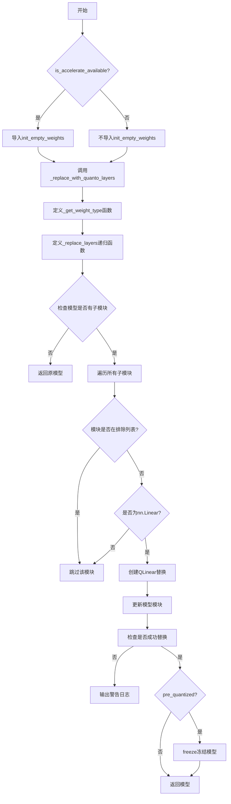
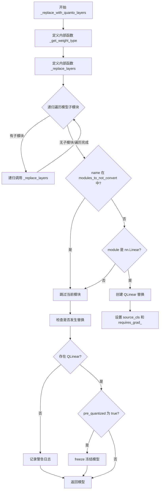
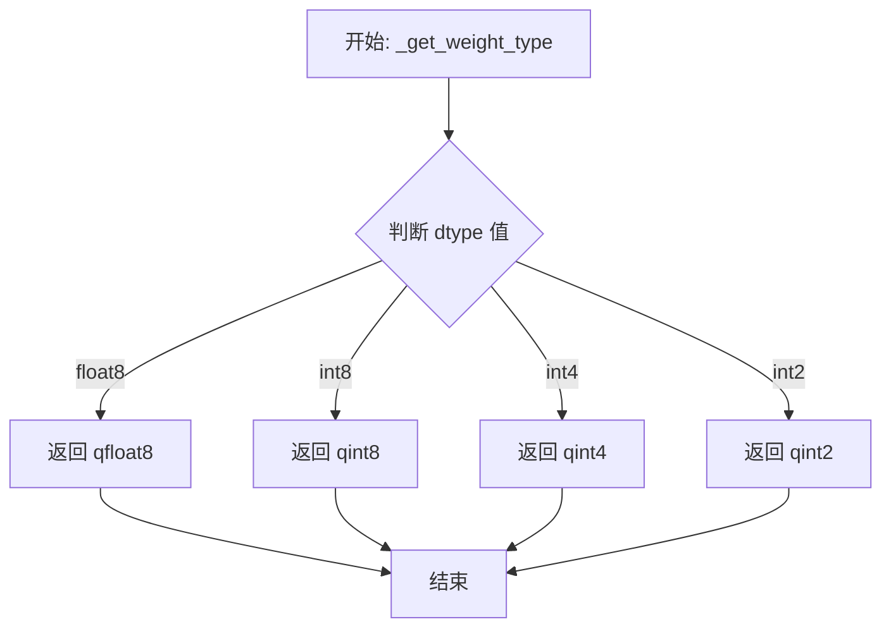
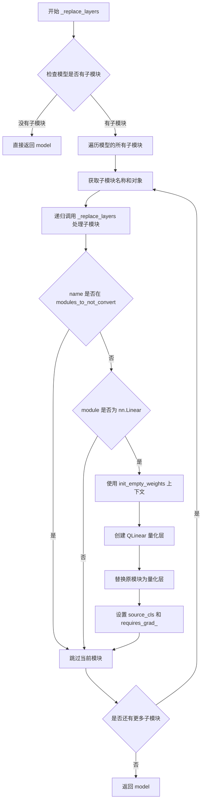

# `diffusers\src\diffusers\quantizers\quanto\utils.py` 详细设计文档

该代码是一个模型量化工具模块，通过使用quanto库将PyTorch模型中的nn.Linear层替换为量化版本（QLinear），支持int2/int4/int8/float8等多种量化精度，并提供灵活的模块排除机制，适用于大模型的推理优化。

## 整体流程



## 类结构

```
无类层次结构（纯工具函数模块）
```

## 全局变量及字段


### `nn`
    
PyTorch神经网络模块，提供各种层和工具

类型：`torch.nn模块`
    


### `is_accelerate_available`
    
检查accelerate库是否可用的函数

类型：`函数`
    


### `logging`
    
日志工具模块，提供日志记录功能

类型：`模块`
    


### `logger`
    
模块级日志记录器，用于输出警告和信息

类型：`Logger对象`
    


### `init_empty_weights`
    
初始化空权重上下文管理器，用于在量化替换时临时初始化模型权重

类型：`函数`
    


### `QLinear`
    
量化线性层，支持多种量化精度

类型：`类`
    


### `freeze`
    
冻结模型参数，使其不可训练

类型：`函数`
    


### `qfloat8`
    
float8量化类型，用于8位浮点量化

类型：`类型`
    


### `qint2`
    
int2量化类型，用于2位整数量化

类型：`类型`
    


### `qint4`
    
int4量化类型，用于4位整数量化

类型：`类型`
    


### `qint8`
    
int8量化类型，用于8位整数量化

类型：`类型`
    


    

## 全局函数及方法


### `_replace_with_quanto_layers`

该函数是量化模型替换的核心函数，负责将 PyTorch 模型中的 `nn.Linear` 层递归替换为 `quanto` 库提供的量化线性层（QLinear），支持 int2/int4/int8/float8 多种量化精度，并在替换后冻结模型权重以确保量化状态一致。

参数：

- `model`：`torch.nn.Module`，要进行量化层替换的 PyTorch 模型
- `quantization_config`：配置对象，包含 `weights_dtype` 字段指定量化精度（如 "int8"、"int4"、"float8"）
- `modules_to_not_convert`：`list`，需要排除替换的模块名称列表，如输出层、embedding 层等
- `pre_quantized`：`bool`，标记模型是否为预量化状态，若是则调用 freeze() 冻结模型

返回值：`nn.Module`，完成量化层替换后的模型对象

#### 流程图



#### 带注释源码

```python
def _replace_with_quanto_layers(model, quantization_config, modules_to_not_convert: list, pre_quantized=False):
    """
    将模型中的 nn.Linear 层替换为 quanto 库的 QLinear 量化层
    
    参数:
        model: 要替换的 PyTorch 模型
        quantization_config: 量化配置，包含 weights_dtype 字段
        modules_to_not_convert: 不需要转换的模块名称列表
        pre_quantized: 是否为预量化模型
    
    返回:
        替换后的模型对象
    """
    # 动态导入 quanto 相关模块，避免循环导入
    from optimum.quanto import QLinear, freeze, qfloat8, qint2, qint4, qint8

    def _get_weight_type(dtype: str):
        """根据字符串类型映射到对应的量化数据类型"""
        return {"float8": qfloat8, "int8": qint8, "int4": qint4, "int2": qint2}[dtype]

    def _replace_layers(model, quantization_config, modules_to_not_convert):
        """
        递归遍历模型并替换 nn.Linear 为 QLinear
        
        递归终止条件: 模型没有子模块（叶子节点）
        替换策略: 使用 init_empty_weights 上下文管理器创建 QLinear，
                  保留原始权重的数据类型，并设置权重为不可训练
        """
        # 获取模型的直接子模块
        has_children = list(model.children())
        # 如果没有子模块，返回原模型（递归终止）
        if not has_children:
            return model

        # 遍历当前模型的所有子模块
        for name, module in model.named_children():
            # 递归处理子模块
            _replace_layers(module, quantization_config, modules_to_not_convert)

            # 检查当前模块是否在排除列表中
            if name in modules_to_not_convert:
                continue

            # 仅处理 nn.Linear 类型的层
            if isinstance(module, nn.Linear):
                # 使用 init_empty_weights 上下文管理器初始化空权重
                # 这样可以避免在创建 QLinear 时复制原始权重
                with init_empty_weights():
                    qlinear = QLinear(
                        in_features=module.in_features,
                        out_features=module.out_features,
                        bias=module.bias is not None,
                        dtype=module.weight.dtype,
                        weights=_get_weight_type(quantization_config.weights_dtype),
                    )
                    # 替换原模块为量化层
                    model._modules[name] = qlinear
                    # 保存原始模块类型，便于后续恢复或调试
                    model._modules[name].source_cls = type(module)
                    # 量化层权重设置为不可训练
                    model._modules[name].requires_grad_(False)

        return model

    # 执行层替换操作
    model = _replace_layers(model, quantization_config, modules_to_not_convert)
    
    # 检查是否成功替换了至少一个层
    has_been_replaced = any(isinstance(replaced_module, QLinear) for _, replaced_module in model.named_modules())

    # 如果没有替换任何层，记录警告信息
    if not has_been_replaced:
        logger.warning(
            f"{model.__class__.__name__} does not appear to have any `nn.Linear` modules. Quantization will not be applied."
            " Please check your model architecture, or submit an issue on Github if you think this is a bug."
            " https://github.com/huggingface/diffusers/issues/new"
        )

    # 对于预量化模型，需要冻结模型以确保 state_dict 匹配
    if pre_quantized:
        freeze(model)

    return model
```


### `_get_weight_type`

这是一个内部嵌套函数，用于将量化数据类型名称字符串映射到对应的量化类型对象（qfloat8、qint8、qint4、qint2）。

参数：

- `dtype`：`str`，量化数据类型名称，如 "float8"、"int8"、"int4"、"int2"

返回值：`量化类型对象`，返回与输入字符串对应的实际量化类型对象（qfloat8/qint8/qint4/qint2）

#### 流程图



#### 带注释源码

```python
def _get_weight_type(dtype: str):
    """
    获取量化类型映射
    
    将量化数据类型名称字符串映射到实际的量化类型对象
    
    参数:
        dtype: str - 量化数据类型名称，支持 "float8", "int8", "int4", "int2"
    
    返回:
        量化类型对象 - 对应的Quanto量化类型（qfloat8/qint8/qint4/qint2）
    """
    # 使用字典映射将字符串类型的量化参数转换为实际的量化类型对象
    # 这种方式比使用多个 if-elif 语句更加简洁和高效
    return {"float8": qfloat8, "int8": qint8, "int4": qint4, "int2": qint2}[dtype]
```


### `_replace_layers`

该函数是一个内部递归函数，用于递归遍历模型的子模块，将 `nn.Linear` 层替换为量化层 `QLinear`，实现模型各层的量化替换。

参数：

- `model`：`torch.nn.Module`，需要检查和替换层的模型
- `quantization_config`：量化配置对象，包含权重数据类型等信息
- `modules_to_not_convert`：`list`，不需要转换的模块名称列表

返回值：`torch.nn.Module`，完成层替换后的模型

#### 流程图



#### 带注释源码

```python
def _replace_layers(model, quantization_config, modules_to_not_convert):
    """
    递归替换模型中的 nn.Linear 层为量化层 QLinear
    
    参数:
        model: 需要处理的模型
        quantization_config: 量化配置，包含权重数据类型
        modules_to_not_convert: 不需要转换的模块列表
    """
    # 获取模型的直接子模块
    has_children = list(model.children())
    
    # 如果模型没有子模块（叶子节点），直接返回
    if not has_children:
        return model

    # 遍历模型的所有子模块（名称和对象）
    for name, module in model.named_children():
        # 递归处理子模块
        _replace_layers(module, quantization_config, modules_to_not_convert)

        # 如果模块在不需要转换的列表中，跳过
        if name in modules_to_not_convert:
            continue

        # 检查模块是否为 nn.Linear 线性层
        if isinstance(module, nn.Linear):
            # 使用 init_empty_weights 上下文管理器进行空权重初始化
            with init_empty_weights():
                # 创建量化线性层 QLinear
                qlinear = QLinear(
                    in_features=module.in_features,      # 输入特征维度
                    out_features=module.out_features,    # 输出特征维度
                    bias=module.bias is not None,        # 是否包含偏置
                    dtype=module.weight.dtype,           # 权重数据类型
                    weights=_get_weight_type(quantization_config.weights_dtype),  # 量化权重类型
                )
                # 替换原模块为量化层
                model._modules[name] = qlinear
                # 保存原始模块类型，以便后续参考
                model._modules[name].source_cls = type(module)
                # 禁用梯度计算
                model._modules[name].requires_grad_(False)

    # 返回处理后的模型
    return model
```

## 关键组件


### 量化层替换器 (`_replace_with_quanto_layers`)

该模块负责将 PyTorch `nn.Linear` 层递归替换为 Quanto 库的量化线性层 (`QLinear`)，支持 int2/int4/int8/float8 量化精度，同时保持模型结构兼容性和冻结预量化模型。

### 依赖检查与空权重初始化

通过 `is_accelerate_available()` 检查 accelerate 库可用性，并使用 `init_empty_weights()` 上下文管理器实现惰性加载，避免在替换过程中分配实际内存。

### 权重类型映射 (`_get_weight_type`)

将字符串形式的权重类型（"float8", "int8", "int4", "int2"）映射到对应的Quanto量化数据类型（`qfloat8`, `qint8`, `qint4`, `qint2`）。

### 递归层替换 (`_replace_layers`)

内部递归函数，深度优先遍历模型结构，对每个 `nn.Linear` 层创建对应的 `QLinear` 量化层，保留原始层的输入/输出维度、偏置设置和权重数据类型，同时支持跳过指定模块。

### 量化配置解析

从 `quantization_config.weights_dtype` 获取目标量化精度，结合模块原始权重dtype确保类型兼容性，并通过 `requires_grad_(False)` 禁用梯度计算。

### 替换验证与警告日志

替换完成后验证模型中是否存在可替换的线性层，若无则输出警告日志提示用户检查模型架构，并提供GitHub issue链接。

### 预量化模型冻结

当 `pre_quantized=True` 时，调用 `freeze(model)` 冻结模型权重，确保加载状态字典与模型状态字典匹配。


## 问题及建议


### 已知问题

- **递归遍历效率低下**：代码先获取 `model.named_children()` 进行判断，随后在循环内递归调用，但未复用已获取的子模块迭代器，造成重复遍历和性能浪费。
- **硬编码的权重类型映射**：`_get_weight_type` 函数使用硬编码字典，不支持的 `dtype` 会直接抛出 `KeyError`，缺乏友好的错误提示和扩展性。
- **变量命名遮蔽**：内部函数 `_replace_layers` 的参数 `modules_to_not_convert` 与外部函数参数同名，易造成理解和维护困惑。
- **缺乏类型校验**：未对 `quantization_config`、`modules_to_not_convert` 等参数进行类型检查，可能导致运行时错误。
- **异常处理不足**：模块替换失败时没有捕获异常，若量化过程中出现错误会直接中断，缺乏容错机制。
- **魔法字符串**：权重类型名称（"float8"、"int8" 等）以字符串形式硬编码，应提取为常量或枚举。
- **内存优化空间**：每个 `nn.Linear` 替换时都使用 `init_empty_weights()` 上下文管理器创建临时权重，可考虑批量处理。
- **代码可测试性差**：核心逻辑被嵌套在内部函数中，难以单独进行单元测试。

### 优化建议

- **优化递归逻辑**：在遍历子模块时直接复用迭代器，避免重复调用 `model.named_children()`。
- **提取配置常量**：将权重类型映射表和字符串常量提取为模块级常量或配置类，提升可维护性。
- **添加参数校验**：在函数入口处增加参数类型和合法性校验，提供明确的错误信息。
- **重构内部函数**：将 `_replace_layers` 提升为模块级函数或独立的工具类，改善可测试性。
- **增强异常处理**：对可能的异常情况进行捕获，提供降级方案或友好的错误日志。
- **优化权重冻结逻辑**：考虑对批量替换操作进行统一管理，减少上下文切换开销。

## 其它


### 设计目标与约束

**目标**：实现将PyTorch模型中的nn.Linear层替换为quanto库的量化线性层，支持int2/int4/int8/float8等多种量化精度，以减少模型大小和推理延迟。

**约束**：
- 仅处理nn.Linear类型的层，其他层类型保持不变
- 支持指定modules_to_not_convert列表以排除特定层
- 量化后的模型权重类型必须与quantization_config.weights_dtype匹配
- pre_quantized模式下需要冻结模型以确保state_dict匹配

### 错误处理与异常设计

- 当模型中不存在任何nn.Linear层时，输出warning日志而非抛出异常
- 若quantization_config.weights_dtype指定了不支持的类型（如非float8/int8/int4/int2），_get_weight_type函数会抛出KeyError
- init_empty_weights上下文管理器用于避免在替换时分配实际内存
- 循环导入问题通过在函数内部导入quanto来避免

### 数据流与状态机

**数据流**：
1. 输入：model（PyTorch模型）、quantization_config（量化配置）、modules_to_not_convert（排除列表）、pre_quantized（是否预量化）
2. 递归遍历模型的所有子模块
3. 对每个nn.Linear层创建对应的QLinear替换
4. 输出：替换后的模型

**状态机**：
- 初始状态：原始PyTorch模型
- 处理状态：递归遍历模型结构
- 完成状态：部分或全部Linear层被替换为QLinear

### 外部依赖与接口契约

**依赖**：
- torch.nn：PyTorch神经网络模块
- optimum.quanto：量化库（QLinear, freeze, qfloat8, qint2, qint4, qint8）
- accelerate：用于init_empty_weights（条件导入）
- diffusers.utils：日志和工具函数

**接口契约**：
- model：任意继承自nn.Module的PyTorch模型
- quantization_config：必须包含weights_dtype属性，值为"float8"/"int8"/"int4"/"int2"之一
- modules_to_not_convert：字符串列表，表示不进行量化转换的模块名称
- pre_quantized：布尔值，表示模型是否已预量化

### 性能考虑

- 使用init_empty_weights避免替换时分配内存，减少内存峰值
- 递归遍历的时间复杂度为O(n)，n为模型层数
- 替换后的QLinear层requires_grad_(False)以禁用梯度计算

### 安全性考虑

- 量化会降低模型精度，需在文档中明确说明精度损失
- freeze操作会修改模型状态，需注意状态一致性

### 测试策略

- 测试不同weights_dtype配置
- 测试modules_to_not_convert排除功能
- 测试包含/不包含Linear层的模型
- 测试pre_quantized=True/False两种模式

### 版本兼容性

- minimum torch版本需支持nn.Module
- optimum.quanto版本需支持QLinear及相关量化类型
- accelerate版本需支持init_empty_weights

    