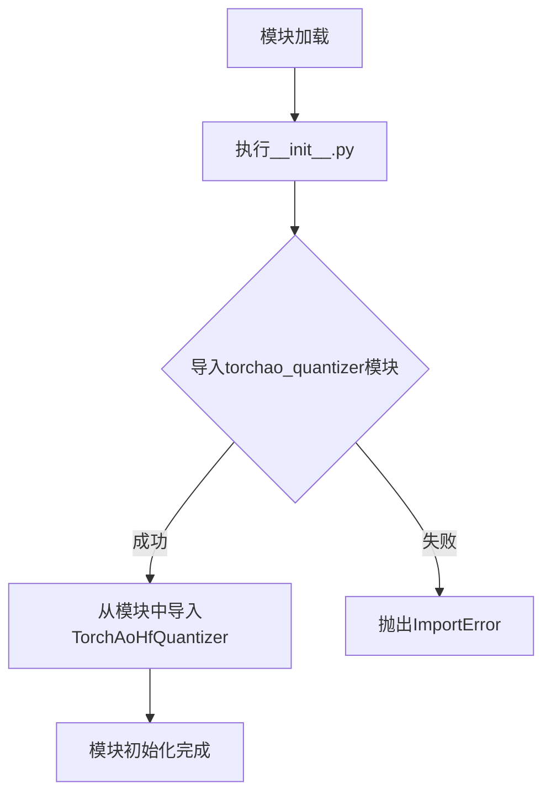
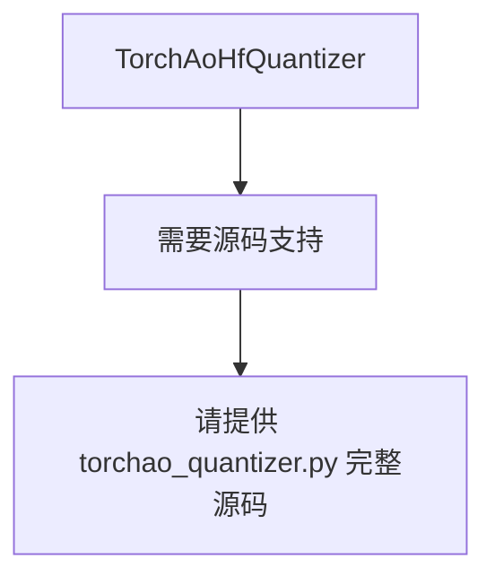

# `diffusers\src\diffusers\quantizers\torchao\__init__.py` 详细设计文档

这是Hugging Face Transformers库的初始化文件，主要用于导出TorchAoHfQuantizer量化器类，以便其他模块可以方便地导入使用。

## 整体流程



## 类结构

```
无显式类定义
└── 从子模块导入: TorchAoHfQuantizer (来自 torchao_quantizer)
```

## 全局变量及字段


### `TorchAoHfQuantizer`
    
从本地模块 torchao_quantizer 导入的量化器类，用于 HuggingFace 模型的 TorchAO 量化操作

类型：`class (imported from .torchao_quantizer)`
    


### `N/A.fields`
    
类字段信息 - 需查看 torchao_quantizer 模块源码获取详细字段定义

类型：`list`
    


### `N/A.methods`
    
类方法信息 - 需查看 torchao_quantizer 模块源码获取详细方法定义

类型：`list`
    
    

## 全局函数及方法


# 分析结果

## 说明

提供的代码仅包含一个导入语句，未包含 `TorchAoHfQuantizer` 类的实际实现源码。由于缺少 `torchao_quantizer` 模块的具体源码，我无法提供完整的方法详情、流程图和带注释源码。

基于代码上下文（Apache 2.0 许可证、HuggingFace 项目、 TorchAO 量化相关），我推测这应该是一个量化器类，但无法确认其具体实现细节。

---

### `TorchAoHfQuantizer`

**描述：** HuggingFace 集成的 TorchAO 量化器类，用于对模型进行量化操作以减少模型大小和推理计算量。

#### 参数

- **无法确认**：`torchao_quantizer` 模块源码未提供，无法提取具体参数信息

#### 返回值

- **无法确认**：需要查看源码后确定

#### 流程图



#### 带注释源码

```
# 由于缺少源码，无法提供
```

---

## 建议

请提供 `torchao_quantizer.py` 文件的完整源码，以便我能够：
1. 提取所有类方法及其参数
2. 生成详细的流程图
3. 提供带注释的完整源码
4. 识别潜在的技术债务和优化空间

**文件路径推测：** `torchao_quantizer.py` 应位于相同目录下，与当前文件同级。

## 关键组件


### TorchAoHfQuantizer

从 torchao_quantizer 模块导入的量化器类，用于 HuggingFace 模型的黑盒量化操作。该模块作为包级别的导出接口，使得外部可以通过 from . import 方式统一访问核心量化组件。

### 关键组件信息

- **TorchAoHfQuantizer**: 从子模块 torchao_quantizer 导入的量化器类，负责模型的黑盒量化处理

### 设计目标与约束

- 作为模块入口文件，提供统一的导出接口
- 依赖于 torchao_quantizer 模块的存在

### 错误处理与异常设计

- 如果 torchao_quantizer 模块不存在或 TorchAoHfQuantizer 类未定义，将抛出 ImportError

### 潜在的技术债务或优化空间

- 当前仅为简单的导入重导出，缺乏更详细的模块文档
- 建议添加 __all__ 显式定义导出的公共接口


## 问题及建议


### 已知问题

-   **功能单一，实质仅为重导出**：模块仅包含一行导入语句，本质上是`TorchAoHfQuantizer`的简单重导出，未添加任何额外的封装、配置或增强功能，引入此间接层增加架构复杂度而未带来实际价值
-   **缺少模块级文档字符串**：没有通过`"""..."""`说明该模块的职责、设计意图及在整体系统中的角色，后续维护者难以理解其存在意义
-   **无版本依赖声明**：未通过`__version__`或依赖配置文件声明对`torchao_quantizer`模块的版本约束，可能导致接口不兼容时难以追踪问题
-   **导入语句无保护机制**：直接使用`from .torchao_quantizer import TorchAoHfQuantizer`，未考虑目标模块或类不存在时的异常处理，降低了模块的健壮性
-   **未定义公共接口**：缺少`__all__`显式声明导出的符号，削弱了模块的API透明性和IDE自动补全支持
-   **测试覆盖困难**：由于无实际逻辑代码，当前模块难以编写有意义的单元测试，测试覆盖率指标可能受影响

### 优化建议

-   **添加文档字符串**：为模块补充简洁的文档说明，例如说明该模块是HuggingFace集成TorchAO量化功能的入口点
-   **显式声明公共接口**：添加`__all__ = ["TorchAoHfQuantizer"]`明确导出项，配合IDE和静态分析工具
-   **添加异常处理**：考虑捕获`ImportError`并提供更友好的错误提示，或在文档中说明依赖要求
-   **评估架构必要性**：若仅用于重导出，考虑是否可移除此模块而直接引用`torchao_quantizer`，或确认其是否承载未来扩展职责（如配置注入、生命周期钩子等）
-   **补充类型注解**：如有类型检查需求，可添加`from __future__ import annotations`或类型标注
-   **添加基本测试**：至少验证导入成功及类存在性，确保模块可正常加载


## 其它


### 设计目标与约束

本模块的设计目标是提供一个 HuggingFace 集成的 TorchAO 量化器，用于在 HuggingFace Transformers 生态系统中对模型进行量化操作。约束条件包括：必须继承自 TorchAoHfQuantizer 基类、遵循 HuggingFace 的量化器接口规范、仅支持 PyTorch 2.0 及以上版本、需要 torchAO 库支持。

### 错误处理与异常设计

当前模块主要依赖导入的 TorchAoHfQuantizer 类处理错误。建议的错误处理策略包括：在导入失败时抛出 ImportError 并提示安装 torchAO 包、在量化过程中捕获 QuantizationError 异常、提供友好的错误信息帮助用户定位问题、验证输入模型类型的合法性。

### 数据流与状态机

数据流如下：用户初始化 TorchAoHfQuantizer 实例 → 调用 quantize() 方法 → 对输入模型进行量化处理 → 返回量化后的模型。状态机包含：初始化状态（Initialized）→ 量化中（Quantizing）→ 量化完成（Quantized）→ 错误状态（Error）。

### 外部依赖与接口契约

主要外部依赖包括：torch (>=2.0)、torchAO 包、HuggingFace Transformers 库。接口契约：TorchAoHfQuantizer 类必须实现 quantize() 方法接受 model 和 config 参数、必须继承正确的基类以确保与 HuggingFace Trainer 兼容。

### 配置与参数说明

本模块无独立配置参数，具体量化配置由 TorchAoHfQuantizer 类通过 config 参数传递，包括量化方法（GPTQ/AWQ/FP8 等）、量化位数、量化策略等配置项。

### 使用示例

```python
from .torchao_quantizer import TorchAoHfQuantizer
quantizer = TorchAoHfQuantizer()
quantized_model = quantizer.quantize(base_model, quantization_config)
```

### 性能考虑

量化操作本身会引入一定的计算开销，但量化后的模型推理速度会显著提升，具体性能提升取决于量化位数和模型架构。建议在生产环境进行基准测试以验证实际性能收益。

### 安全考虑

量化过程不涉及模型权重解密或敏感数据处理，安全性主要依赖于输入模型的来源验证。建议仅使用可信来源的预训练模型进行量化。

### 版本兼容性

需要确保 torch >= 2.0、transformers 库版本与 torchAO 兼容、Python 版本 >= 3.8。建议在项目 requirements.txt 中明确指定版本约束。

### 测试策略

建议的测试内容包括：导入测试验证模块可正常加载、单元测试验证量化器接口实现、集成测试验证与 HuggingFace Trainer 的兼容性、回归测试确保量化后模型功能正确。

### 监控与日志

建议在量化过程中添加日志记录关键步骤：量化开始、量化方法选择、量化完成、警告信息。可使用 Python logging 模块集成项目统一的日志系统。

### 部署注意事项

部署时需确保：目标环境已安装 torchAO 包、量化后的模型格式与推理框架兼容、模型文件大小符合部署平台的存储限制、首次推理可能需要额外的初始化时间。

### 已知限制

当前模块仅作为导入接口，实际量化逻辑在 torchao_quantizer 模块中。支持的量化方法取决于 torchAO 库的版本，某些高级量化特性可能需要特定硬件支持。


    