# `diffusers\src\diffusers\quantizers\torchao\torchao_quantizer.py` 详细设计文档

这是一个TorchAO量化器的实现，用于在HuggingFace Diffusers库中对模型进行量化处理，支持int4/int8/uint/float8等多种量化类型，以减少模型大小并加速推理。

## 整体流程

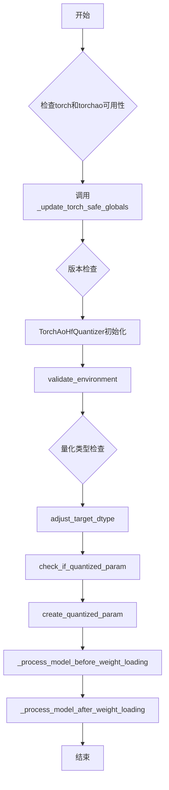

## 类结构

```
DiffusersQuantizer (抽象基类)
└── TorchAoHfQuantizer (TorchAO量化器实现类)
```

## 全局变量及字段


### `logger`
    
用于记录日志的logger对象

类型：`logging.Logger`
    


### `SUPPORTED_TORCH_DTYPES_FOR_QUANTIZATION`
    
支持的量化数据类型元组，包含int8、float8及uint1-7等类型

类型：`tuple`
    


### `is_torch_available`
    
检查torch是否可用的函数

类型：`function`
    


### `is_torch_version`
    
检查torch版本的函数

类型：`function`
    


### `is_torchao_available`
    
检查torchao是否可用的函数

类型：`function`
    


### `is_torchao_version`
    
检查torchao版本的函数

类型：`function`
    


### `_update_torch_safe_globals`
    
更新torch安全全局变量的函数，用于序列化时安全加载tensor

类型：`function`
    


### `fuzzy_match_size`
    
从配置名称中提取大小数字的函数，用于解析量化配置

类型：`function`
    


### `_quantization_type`
    
获取权重量化类型的辅助函数，返回量化tensor的类别信息

类型：`function`
    


### `_linear_extra_repr`
    
获取线性层额外表示的函数，用于自定义量化后的print输出

类型：`function`
    


### `TorchAoHfQuantizer.requires_calibration`
    
是否需要校准，TorchAO量化器不需要校准

类型：`bool (类属性)`
    


### `TorchAoHfQuantizer.required_packages`
    
所需依赖包列表，包含torchao

类型：`list (类属性)`
    


### `TorchAoHfQuantizer.offload`
    
是否允许CPU/磁盘卸载，用于控制是否将权重卸载到CPU或磁盘

类型：`bool (实例属性)`
    


### `TorchAoHfQuantizer.modules_to_not_convert`
    
不需要量化的模块列表，用于指定哪些模块保持浮点精度

类型：`list (实例属性)`
    
    

## 全局函数及方法


### `_update_torch_safe_globals`

该函数用于在 PyTorch 序列化系统中注册安全全局变量，以便能够正确加载包含 TorchAO 量化张量（如 `UintxTensor`、`NF4Tensor` 等）的模型检查点。函数首先定义基础的无符号整型数据类型，然后尝试导入 TorchAO 库中的特定张量类，根据 TorchAO 版本添加对应的张量实现类，最后通过 `torch.serialization.add_safe_globals()` 注册到 PyTorch 的安全加载机制中。

参数： 无

返回值： `None`，该函数没有返回值，通过副作用完成全局注册

#### 流程图

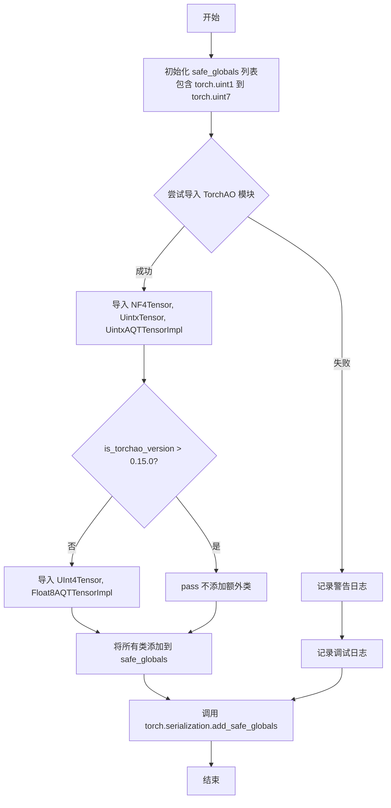

#### 带注释源码

```python
def _update_torch_safe_globals():
    """
    更新 PyTorch 的安全全局变量注册表，以便能够加载包含 TorchAO 量化张量的检查点。
    TorchAO 的张量类（如 UintxTensor, NF4Tensor）需要注册为安全全局变量，
    否则 PyTorch 在反序列化时会拒绝加载这些自定义张量类型。
    """
    
    # 第一步：定义基础的无符号整型数据类型（uint1 到 uint7）
    # 这些是 Torch 2.6+ 支持的新数据类型，用于量化
    safe_globals = [
        (torch.uint1, "torch.uint1"),
        (torch.uint2, "torch.uint2"),
        (torch.uint3, "torch.uint3"),
        (torch.uint4, "torch.uint4"),
        (torch.uint5, "torch.uint5"),
        (torch.uint6, "torch.uint6"),
        (torch.uint7, "torch.uint7"),
    ]
    
    # 第二步：尝试导入 TorchAO 的张量类
    # 使用 try-except 捕获导入错误，确保即使 TorchAO 不可用也不会崩溃
    try:
        # 导入 TorchAO 的核心张量类
        from torchao.dtypes import NF4Tensor
        from torchao.dtypes.uintx.uintx_layout import UintxAQTTensorImpl, UintxTensor

        # 将这些类添加到安全全局列表
        # 注意：添加的是类本身，不是元组
        safe_globals.extend([UintxTensor, UintxAQTTensorImpl, NF4Tensor])

        # 第三步：处理版本兼容性
        # 注意：is_torchao_version(">=", "0.16.0") 与 torchao nightly 版本配合使用有问题
        # 所以使用 ">" 检查，这在夜间版本中能正常工作
        if is_torchao_version(">", "0.15.0"):
            # 较新版本（> 0.15.0）已经包含了这些类，不需要额外添加
            pass
        else:
            # 较旧版本需要额外导入这些类
            from torchao.dtypes.floatx.float8_layout import Float8AQTTensorImpl
            from torchao.dtypes.uintx.uint4_layout import UInt4Tensor

            # 将旧版本的特有类添加到安全全局列表
            safe_globals.extend([UInt4Tensor, Float8AQTTensorImpl])

    except (ImportError, ModuleNotFoundError) as e:
        # 第四步：处理导入失败的情况
        # 如果 TorchAO 不可用，记录警告但继续执行
        logger.warning(
            "Unable to import `torchao` Tensor objects. This may affect loading checkpoints serialized with `torchao`"
        )
        # 记录详细的导入错误信息用于调试
        logger.debug(e)

    finally:
        # 第五步：注册安全全局变量
        # 无论导入成功或失败，都执行此步骤
        # 如果 TorchAO 导入失败，safe_globals 只包含基础 uint 类型
        # 如果成功，则包含所有必要的 TorchAO 张量类
        torch.serialization.add_safe_globals(safe_globals=safe_globals)
```


### `fuzzy_match_size`

该函数用于从配置名称字符串（如 "4weight"、"8weight"）中提取大小数字。它接收一个配置名称字符串作为输入，通过正则表达式匹配 "数字weight" 格式，如果找到匹配则返回捕获的数字字符（作为字符串），否则返回 None。

参数：

- `config_name`：`str`，输入的配置名称字符串，用于从中提取大小数字

返回值：`str | None`，如果成功匹配到数字则返回该数字字符的字符串形式，否则返回 None

#### 流程图

```mermaid
flowchart TD
    A[开始 fuzzy_match_size] --> B[将 config_name 转换为小写]
    B --> C[使用正则表达式 (\d)weight 匹配字符串]
    C --> D{是否匹配成功?}
    D -->|是| E[返回匹配组 1: 数字字符]
    D -->|否| F[返回 None]
    E --> G[结束]
    F --> G
```

#### 带注释源码

```python
def fuzzy_match_size(config_name: str) -> str | None:
    """
    Extract the size digit from strings like "4weight", "8weight". Returns the digit as an integer if found, otherwise
    None.
    """
    # 将输入的配置名称转换为小写，以确保匹配不区分大小写
    config_name = config_name.lower()

    # 使用正则表达式搜索 "数字weight" 格式
    # (\d) 捕获任意数字字符，weight 为字面匹配
    # 例如：匹配 "4weight", "8weight" 等模式
    str_match = re.search(r"(\d)weight", config_name)

    # 如果找到匹配，则返回捕获的数字字符（作为字符串）
    if str_match:
        return str_match.group(1)

    # 如果没有匹配到任何内容，返回 None
    return None
```


### `_quantization_type`

获取权重张量的量化类型，并返回格式化的字符串描述，用于在模型表示中展示量化信息。

参数：

- `weight`：`torch.Tensor` 或其子类，需要获取量化类型的权重张量

返回值：`str`，量化类型的字符串描述，例如 `"AffineQuantizedTensor(int8)"` 或 `"LinearActivationQuantizedTensor(activation=..., weight=...)"`

#### 流程图

```mermaid
flowchart TD
    A[开始: weight] --> B{isinstance weight, AffineQuantizedTensor}
    B -- 是 --> C[返回 f"{weight.__class__.__name__}({weight._quantization_type()})"]
    B -- 否 --> D{isinstance weight, LinearActivationQuantizedTensor}
    D -- 是 --> E[递归调用 _quantization_type 获取原始权重类型]
    F[f"weight={_quantization_type(weight.original_weight_tensor)}"]
    E --> F
    F --> G[返回 f"{weight.__class__.__name__}(activation={weight.input_quant_func}, weight={...})"]
    D -- 否 --> H[返回 None]
    C --> I[结束]
    G --> I
    H --> I
```

#### 带注释源码

```python
def _quantization_type(weight):
    """
    获取权重张量的量化类型，并返回格式化的字符串描述。
    
    该函数是TorchAO量化器的辅助函数，用于在模型字符串表示(extra_repr)中
    展示权重的量化信息。它递归地处理不同层次的量化张量类型。
    
    Args:
        weight: torch.Tensor或其子类，表示神经网络的权重参数
        
    Returns:
        str: 量化类型的字符串表示，格式因量化类型不同而异：
            - AffineQuantizedTensor: "AffineQuantizedTensor(量化类型)"
            - LinearActivationQuantizedTensor: "LinearActivationQuantizedTensor(activation=..., weight=...)"
            - 其他: None
    """
    # 延迟导入以避免在非TorchAO环境下导入失败
    from torchao.dtypes import AffineQuantizedTensor
    from torchao.quantization.linear_activation_quantized_tensor import LinearActivationQuantizedTensor

    # 检查权重是否为AffineQuantizedTensor类型
    # AffineQuantizedTensor是TorchAO中用于权重量化的主要张量类型
    if isinstance(weight, AffineQuantizedTensor):
        # 返回格式化的字符串，包含类名和内部量化类型
        # 例如: "AffineQuantizedTensor(int8)"
        return f"{weight.__class__.__name__}({weight._quantization_type()})"

    # 检查权重是否为LinearActivationQuantizedTensor类型
    # 这是一种同时量化激活值和权重的张量类型
    if isinstance(weight, LinearActivationQuantizedTensor):
        # 递归调用以获取原始权重张量的量化类型
        # weight属性指向原始权重，original_weight_tensor获取量化前的张量
        weight_quant_type = _quantization_type(weight.original_weight_tensor)
        
        # 返回包含激活量化和权重量化信息的字符串
        # activation参数记录输入量化函数，weight参数记录权重量化类型
        return f"{weight.__class__.__name__}(activation={weight.input_quant_func}, weight={weight_quant_type})"
    
    # 对于其他非量化类型或未知类型，返回None
    # 调用方需处理None值（如在_linear_extra_repr中所示）
    return None
```


### `_linear_extra_repr`

该函数是 TorchAO 量化器的辅助函数，用于自定义 nn.Linear 层的字符串表示形式（extra_repr）。当加载预量化模型时，它会提供更友好的权重信息展示，包括输入/输出特征维度以及权重的量化类型（如 AffineQuantizedTensor 的具体子类信息）。

参数：

- `self`：`torch.nn.Linear`，表示一个线性层（nn.Linear）的实例，用于获取该层的权重参数信息

返回值：`str`，返回该线性层的额外表示字符串，包含 `in_features`、`out_features` 和 `weight` 信息

#### 流程图

```mermaid
flowchart TD
    A[开始] --> B[调用 _quantization_type 获取权重量化类型]
    B --> C{weight 是否为 None?}
    C -->|是| D[返回基础表示字符串: in_features, out_features, weight=None]
    C -->|否| E[返回包含量化类型的表示字符串: in_features, out_features, weight={量化类型}]
    D --> F[结束]
    E --> F
```

#### 带注释源码

```python
def _linear_extra_repr(self):
    """
    自定义 nn.Linear 层的 extra_repr 方法，用于在打印模型时展示量化信息。
    
    该函数被绑定到 nn.Linear 层的 extra_repr 方法上，以便在模型概览中显示
    权重的量化类型（如 AffineQuantizedTensor 的具体子类）。
    
    参数:
        self: nn.Linear 实例，表示一个线性层
        
    返回:
        str: 包含层信息的字符串，格式为 "in_features={...}, out_features={...}, weight={...}"
    """
    # 调用 _quantization_type 函数获取权重的量化类型字符串
    # 如果权重未被量化，返回 None；否则返回如 "AffineQuantizedTensor(int8)" 的字符串
    weight = _quantization_type(self.weight)
    
    # 检查权重量化类型是否存在
    if weight is None:
        # 权重未被量化，返回基本的线性层参数信息
        # shape[1] 表示输入特征数 (in_features)
        # shape[0] 表示输出特征数 (out_features)
        return f"in_features={self.weight.shape[1]}, out_features={self.weight.shape[0]}, weight=None"
    else:
        # 权重已被量化，返回包含量化类型信息的参数表示
        # weight 字符串包含如 "AffineQuantizedTensor(int8)" 的量化信息
        return f"in_features={self.weight.shape[1]}, out_features={self.weight.shape[0]}, weight={weight}"
```


### `TorchAoHfQuantizer.__init__`

该方法是 `TorchAoHfQuantizer` 类的构造函数，用于初始化 TorchAO 量化器。它接收量化配置参数，并将这些参数传递给父类 `DiffusersQuantizer` 的构造函数进行基类初始化。

参数：

- `quantization_config`：任意类型，量化配置对象，包含量化方法的配置参数
- `**kwargs`：字典，可变关键字参数，用于传递额外的配置选项

返回值：`None`，无返回值（隐式返回 None）

#### 流程图

```mermaid
flowchart TD
    A[开始 __init__] --> B[调用 super().__init__]
    B --> C[传递 quantization_config 和 kwargs]
    C --> D[返回 None]
```

#### 带注释源码

```python
def __init__(self, quantization_config, **kwargs):
    """
    初始化 TorchAoHfQuantizer 实例。
    
    参数:
        quantization_config: 量化配置对象，包含量化方法的配置参数
        **kwargs: 可变关键字参数，传递给父类
    """
    # 调用父类 DiffusersQuantizer 的构造函数
    # 这是必需的，因为 TorchAoHfQuantizer 继承自 DiffusersQuantizer
    # 父类的 __init__ 会负责初始化继承的属性
    super().__init__(quantization_config, **kwargs)
```


### `TorchAoHfQuantizer.validate_environment`

该方法用于验证运行环境和依赖库的兼容性，检查 TorchAO 库是否可用、版本是否满足要求（≥0.7.0），并处理设备映射（device_map）和预量化模型的加载约束。

参数：

- `*args`：可变位置参数，目前未被使用
- `**kwargs`：可变关键字参数，包含以下键值对：
  - `device_map`：`dict | None`，指定模型各层到设备的映射关系
  - `weights_only`：`bool | None`，是否仅加载权重参数

返回值：`None`，该方法不返回任何值，主要通过异常处理来反馈验证结果

#### 流程图

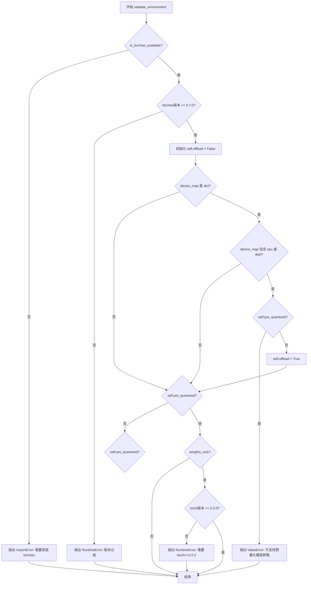

#### 带注释源码

```python
def validate_environment(self, *args, **kwargs):
    """
    验证运行环境和依赖库的兼容性
    
    检查项：
    1. TorchAO 库是否可用
    2. TorchAO 版本是否满足最低要求（0.7.0）
    3. device_map 配置是否与预量化模型冲突
    4. 使用 weights_only 加载时 torch 版本要求
    """
    # 检查 TorchAO 库是否可用
    if not is_torchao_available():
        raise ImportError(
            "Loading a TorchAO quantized model requires the torchao library. Please install with `pip install torchao`"
        )
    
    # 获取并验证 torchao 版本（注意：这里使用的是 torch 版本解析，可能有误）
    # 实际应该获取 torchao 版本而非 torch 版本
    torchao_version = version.parse(importlib.metadata.version("torch"))
    if torchao_version < version.parse("0.7.0"):
        raise RuntimeError(
            f"The minimum required version of `torchao` is 0.7.0, but the current version is {torchao_version}. Please upgrade with `pip install -U torchao`."
        )

    # 初始化 offload 标志，默认为 False
    self.offload = False

    # 获取 device_map 参数
    device_map = kwargs.get("device_map", None)
    
    # 如果 device_map 是字典类型，检查是否包含 cpu 或 disk 设备
    if isinstance(device_map, dict):
        if "cpu" in device_map.values() or "disk" in device_map.values():
            # 对于预量化模型，不支持 cpu/disk 卸载
            if self.pre_quantized:
                raise ValueError(
                    "You are attempting to perform cpu/disk offload with a pre-quantized torchao model "
                    "This is not supported yet. Please remove the CPU or disk device from the `device_map` argument."
                )
            else:
                # 非预量化模型允许卸载，设置 offload 标志
                self.offload = True

    # 如果是预量化模型，检查 weights_only 模式下的 torch 版本要求
    if self.pre_quantized:
        weights_only = kwargs.get("weights_only", None)
        if weights_only:
            torch_version = version.parse(importlib.metadata.version("torch"))
            if torch_version < version.parse("2.5.0"):
                # TODO(aryan): TorchAO is compatible with Pytorch >= 2.2 for certain quantization types. Try to see if we can support it in future
                raise RuntimeError(
                    f"In order to use TorchAO pre-quantized model, you need to have torch>=2.5.0. However, the current version is {torch_version}."
                )
```


### `TorchAoHfQuantizer.update_torch_dtype`

该方法用于在加载 TorchAO 量化模型时更新 PyTorch 数据类型。如果未指定 `torch_dtype` 或指定的类型与整数/无符号整数量化不兼容，该方法会自动将其调整为 `torch.bfloat16`，以确保与 `torchao` 量化操作兼容。

参数：

- `torch_dtype`：`torch.dtype | None`，用户指定的模型数据类型。如果为 `None`，则自动设置为 `bfloat16`；如果为整数或无符号整数量化类型指定了非 `bfloat16` 类型，则会发出警告。

返回值：`torch.dtype`，更新后的 PyTorch 数据类型，确保与 TorchAO 量化兼容。

#### 流程图

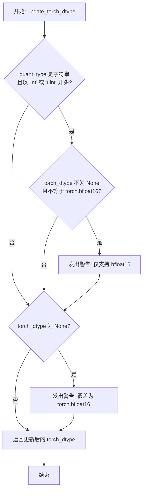

#### 带注释源码

```python
def update_torch_dtype(self, torch_dtype):
    """
    更新 torch 数据类型以确保与 TorchAO 量化兼容。
    
    对于整数/无符号整数量化类型，仅支持 bfloat16。
    如果未指定 torch_dtype，则默认使用 bfloat16 以避免量化操作时的数据类型不匹配。
    """
    # 获取量化配置中的量化类型
    quant_type = self.quantization_config.quant_type
    
    # 检查量化类型是否为整数或无符号整数类型
    if isinstance(quant_type, str) and (quant_type.startswith("int") or quant_type.startswith("uint")):
        # 如果用户指定了非 bfloat16 的 dtype，发出警告
        if torch_dtype is not None and torch_dtype != torch.bfloat16:
            logger.warning(
                f"You are trying to set torch_dtype to {torch_dtype} for int4/int8/uintx quantization, but "
                f"only bfloat16 is supported right now. Please set `torch_dtype=torch.bfloat16`."
            )

    # 如果未指定 torch_dtype，自动设置为 bfloat16
    if torch_dtype is None:
        # 需要设置 torch_dtype，否则在执行量化线性操作时会出现数据类型不匹配
        logger.warning(
            "Overriding `torch_dtype` with `torch_dtype=torch.bfloat16` due to requirements of `torchao` "
            "to enable model loading in different precisions. Pass your own `torch_dtype` to specify the "
            "dtype of the remaining non-linear layers, or pass torch_dtype=torch.bfloat16, to remove this warning."
        )
        torch_dtype = torch.bfloat16

    # 返回更新后的 torch_dtype
    return torch_dtype
```


### `TorchAoHfQuantizer.adjust_target_dtype`

该方法根据量化配置中的 `quant_type` 类型，动态调整目标数据类型（target_dtype），确保返回的 dtype 与 TorchAO 量化框架兼容，以便 accelerate 能够正确计算模型的设备分配和内存占用。

参数：

- `target_dtype`：`torch.dtype`，待调整的目标数据类型

返回值：`torch.dtype`，调整后的目标数据类型

#### 流程图

```mermaid
flowchart TD
    A[开始 adjust_target_dtype] --> B{quant_type 是字符串?}
    B -->|Yes| C{quant_type.startswith 'int8'?}
    B -->|No| D{is_torchao_version > 0.9.0?}
    C -->|Yes| E[返回 torch.int8]
    C -->|No| F{quant_type.startswith 'int4'?}
    F -->|Yes| G[返回 CustomDtype.INT4]
    F -->|No| H{quant_type == 'uintx_weight_only'?}
    H -->|Yes| I[从 quant_type_kwargs 获取 dtype, 默认 torch.uint8]
    H -->|No| J{quant_type.startswith 'uint'?}
    J -->|Yes| K[根据 quant_type[4] 映射到对应的 uint 类型]
    J -->|No| L{quant_type.startswith 'float' 或 'fp'?}
    L -->|Yes| M[返回 torch.bfloat16]
    L -->|No| N{target_dtype 属于 SUPPORTED_DTYPES?}
    N -->|Yes| O[返回 target_dtype]
    N -->|No| P[抛出 ValueError]
    
    D -->|Yes| Q{quant_type 是 AOBaseConfig 实例?}
    D -->|No| N
    Q -->|Yes| R[使用 fuzzy_match_size 提取配置名称中的数字]
    R --> S{数字 == '4'?}
    S -->|Yes| T[返回 CustomDtype.INT4]
    S -->|No| U[返回 torch.int8]
```

#### 带注释源码

```python
def adjust_target_dtype(self, target_dtype: "torch.dtype") -> "torch.dtype":
    """
    根据 quantization_config 中的 quant_type 调整目标数据类型。
    此方法确保返回的 dtype 与 TorchAO 量化框架兼容，
    以便 accelerate 能够正确计算模型的设备分配和内存占用。
    """
    quant_type = self.quantization_config.quant_type
    # 从 accelerate 导入自定义数据类型，用于支持 int4 等特殊类型
    from accelerate.utils import CustomDtype

    # 处理字符串类型的 quant_type（旧版配置方式）
    if isinstance(quant_type, str):
        # int8 量化：虽然 int4 权重打包到 torch.int8 中，
        # 但由于没有 torch.int4 类型，这里统一返回 torch.int8
        if quant_type.startswith("int8"):
            return torch.int8
        # int4 量化：返回自定义的 INT4 类型
        elif quant_type.startswith("int4"):
            return CustomDtype.INT4
        # uintx_weight_only 模式：从配置中获取具体的 dtype
        elif quant_type == "uintx_weight_only":
            return self.quantization_config.quant_type_kwargs.get("dtype", torch.uint8)
        # uint1-uint7 类型：根据 quant_type 中的数字映射到对应的 torch.uint 类型
        elif quant_type.startswith("uint"):
            return {
                1: torch.uint1,
                2: torch.uint2,
                3: torch.uint3,
                4: torch.uint4,
                5: torch.uint5,
                6: torch.uint6,
                7: torch.uint7,
            }[int(quant_type[4])]
        # float/fp 类型：返回 bfloat16（TorchAO 量化要求）
        elif quant_type.startswith("float") or quant_type.startswith("fp"):
            return torch.bfloat16

    # 处理新版 AOBaseConfig 配置（TorchAO > 0.9.0）
    elif is_torchao_version(">", "0.9.0"):
        from torchao.core.config import AOBaseConfig

        quant_type = self.quantization_config.quant_type
        if isinstance(quant_type, AOBaseConfig):
            # 使用模糊匹配从类名中提取数字（如 Int4WeightOnlyConfig -> 4）
            config_name = quant_type.__class__.__name__
            size_digit = fuzzy_match_size(config_name)

            # 提取到数字 4 时返回 INT4，否则默认返回 int8
            if size_digit == "4":
                return CustomDtype.INT4
            else:
                # Default to int8
                return torch.int8

    # 如果 target_dtype 已经是支持的量化类型，直接返回
    if isinstance(target_dtype, SUPPORTED_TORCH_DTYPES_FOR_QUANTIZATION):
        return target_dtype

    # 无法推断出合适的 dtype 时，抛出错误
    # accelerate 需要支持的 dtype 来计算模块大小以进行自动设备放置
    possible_device_maps = ["auto", "balanced", "balanced_low_0", "sequential"]
    raise ValueError(
        f"You have set `device_map` as one of {possible_device_maps} on a TorchAO quantized model but a suitable target dtype "
        f"could not be inferred. The supported target_dtypes are: {SUPPORTED_TORCH_DTYPES_FOR_QUANTIZATION}. If you think the "
        f"dtype you are using should be supported, please open an issue at https://github.com/huggingface/diffusers/issues."
    )
```


### `TorchAoHfQuantizer.adjust_max_memory`

该方法用于调整模型加载时的最大内存限制。它将每个设备的内存限制乘以0.9（保留90%），以留出一定的内存空间给运行时开销和其他操作使用。

参数：

- `max_memory`：`dict[str, int | str]`，最大内存字典，键为设备标识符（如 "cpu"、"cuda:0" 等），值为对应的内存大小（整数表示字节数，或字符串如 "10GB"）

返回值：`dict[str, int | str]`，返回调整后的最大内存字典，每个设备的内存值被缩小为原来的90%

#### 流程图

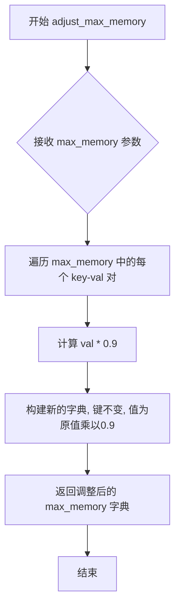

#### 带注释源码

```python
def adjust_max_memory(self, max_memory: dict[str, int | str]) -> dict[str, int | str]:
    """
    调整最大内存限制，将其缩小为原始值的90%。
    
    这是为了在模型加载时留出足够的内存空间给运行时开销、临时缓冲区等使用。
    避免因内存完全占满而导致OOM（Out Of Memory）错误。
    
    参数:
        max_memory: 一个字典，键为设备标识符（如 "cpu", "cuda:0", "cuda:1" 等），
                    值为该设备上可用的最大内存（可以是整数字节数或字符串如 "10GB"）
    
    返回:
        一个新的字典，每个设备的内存限制都被缩小为原来的90%
    """
    # 使用字典推导式遍历原始max_memory字典
    # 将每个设备的内存值乘以0.9（保留90%）
    max_memory = {key: val * 0.9 for key, val in max_memory.items()}
    
    # 返回调整后的内存字典
    return max_memory
```


### `TorchAoHfQuantizer.check_if_quantized_param`

该方法用于检查给定的参数是否应该被量化。它通过检查参数名称是否在排除列表中、设备是否为 CPU 且启用了 offload，以及参数是否为 nn.Linear 层的权重来判断。

参数：

- `self`：隐藏的 `TorchAoHfQuantizer` 实例引用
- `model`：`ModelMixin`，要检查的模型实例
- `param_value`：`torch.Tensor`，要检查的参数张量值
- `param_name`：`str`，参数的名称（键名）
- `state_dict`：`dict[str, Any]`，包含模型权重参数字典
- `**kwargs`：可变关键字参数，包含 `param_device`（可选，参数所在设备）

返回值：`bool`，如果该参数应该被量化则返回 `True`，否则返回 `False`

#### 流程图

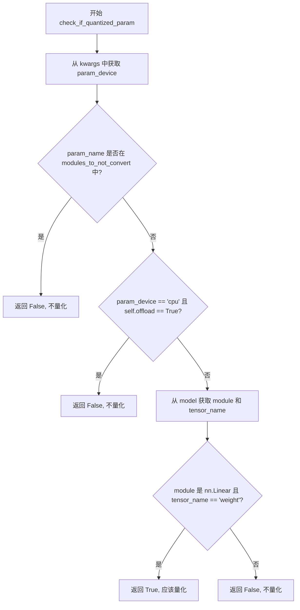

#### 带注释源码

```python
def check_if_quantized_param(
    self,
    model: "ModelMixin",
    param_value: "torch.Tensor",
    param_name: str,
    state_dict: dict[str, Any],
    **kwargs,
) -> bool:
    """
    检查给定的参数是否应该被量化。
    
    参数:
        model: 模型实例，用于获取模块信息
        param_value: 参数的当前张量值
        param_name: 参数在 state_dict 中的名称
        state_dict: 模型的参数字典
        **kwargs: 额外关键字参数，可包含 param_device 指定参数所在设备
    
    返回:
        bool: 如果参数应该被量化返回 True，否则返回 False
    """
    # 从 kwargs 中提取 param_device，默认为 None
    param_device = kwargs.pop("param_device", None)
    
    # 检查参数名称是否在需要排除转换的模块列表中
    # 使用前缀匹配（key + "."）和完全匹配（key == param_name）两种方式
    if any((key + "." in param_name) or (key == param_name) for key in self.modules_to_not_convert):
        return False
    # 如果参数位于 CPU 设备且模型启用了 offload，则不量化
    elif param_device == "cpu" and self.offload:
        # We don't quantize weights that we offload
        return False
    else:
        # 获取参数对应的模块和 tensor 名称
        # 我们只量化 nn.Linear 层的权重（weight）
        module, tensor_name = get_module_from_name(model, param_name)
        return isinstance(module, torch.nn.Linear) and (tensor_name == "weight")
```


### `TorchAoHfQuantizer.create_quantized_param`

该方法负责在模型权重加载过程中创建量化参数。对于每个需要量化的 `nn.Linear` 层，该方法首先设置权重张量的值，然后将其移动到目标设备，最后执行量化操作。

参数：

- `self`：`TorchAoHfQuantizer`，量化器实例本身
- `model`：`ModelMixin`，模型实例，用于获取模块信息
- `param_value`：`torch.Tensor`，需要量化或加载的权重张量值
- `param_name`：`str`，参数的名称，用于从模型中获取对应的模块和张量
- `target_device`：`torch.device`，目标设备，用于将权重移动到指定设备
- `state_dict`：`dict[str, Any]`，状态字典，包含模型的所有参数
- `unexpected_keys`：`list[str]`，加载过程中遇到的意外键列表
- `**kwargs`：可变关键字参数，用于传递额外参数

返回值：无（`None`），该方法直接修改模型模块的参数，不返回任何值

#### 流程图

```mermaid
flowchart TD
    A[开始 create_quantized_param] --> B[从 param_name 获取 module 和 tensor_name]
    B --> C{self.pre_quantized 是否为真?}
    C -->|是| D[预量化模型处理分支]
    C -->|否| E[动态量化处理分支]
    
    D --> D1[将 param_value 移动到 target_device]
    D1 --> D2[创建 Parameter 并赋值给 module._parameters[tensor_name]]
    D2 --> D3{module 是否为 nn.Linear?}
    D3 -->|是| D4[设置 module.extra_repr 为 _linear_extra_repr]
    D3 -->|否| D5[结束]
    D4 --> D5
    
    E --> E1[创建 Parameter 并移动到 target_device]
    E1 --> E2[调用 quantize_ 进行量化]
    E2 --> E3[结束]
```

#### 带注释源码

```python
def create_quantized_param(
    self,
    model: "ModelMixin",
    param_value: "torch.Tensor",
    param_name: str,
    target_device: "torch.device",
    state_dict: dict[str, Any],
    unexpected_keys: list[str],
    **kwargs,
):
    r"""
    Each nn.Linear layer that needs to be quantized is processed here. First, we set the value the weight tensor,
    then we move it to the target device. Finally, we quantize the module.
    """
    # 从参数名称获取对应的模块（module）和张量名称（tensor_name）
    # 例如：'model.layers.0.mlp.dense_h_to_4h.weight' -> (nn.Linear, 'weight')
    module, tensor_name = get_module_from_name(model, param_name)

    if self.pre_quantized:
        # 如果是加载预量化权重（即权重已经在量化格式下）
        # 替换线性层的 repr 以便更美观地打印 AffineQuantizedTensor 的信息
        module._parameters[tensor_name] = torch.nn.Parameter(param_value.to(device=target_device))
        
        # 检查模块是否为 nn.Linear，如果是则自定义其 extra_repr 方法
        if isinstance(module, nn.Linear):
            # 使用 types.MethodType 将 _linear_extra_repr 函数绑定到 module 上
            # 这样打印 module 时会显示量化类型信息
            module.extra_repr = types.MethodType(_linear_extra_repr, module)
    else:
        # 如果是动态量化（ quantization is performed during loading）
        # 不需要手动设置 extra_repr，因为量化后的 repr 会自动显示为 AQT 格式
        
        # 首先创建 Parameter，然后将整个 module（包括新参数）移动到目标设备
        # 注意：这里先创建 Parameter，再调用 .to(device=target_device)
        # 与预量化分支的处理顺序不同
        module._parameters[tensor_name] = torch.nn.Parameter(param_value).to(device=target_device)
        
        # 调用 torchao 的 quantize_ 函数进行量化
        # self.quantization_config.get_apply_tensor_subclass() 返回一个应用张量子类的配置
        # 用于指定量化的具体方式（如 int4、int8、uint4 等）
        quantize_(module, self.quantization_config.get_apply_tensor_subclass())
```


### `TorchAoHfQuantizer.get_cuda_warm_up_factor`

该方法用于获取 CUDA 缓存分配器预热（warm-up）时的内存分配因子。根据不同的量化类型（int4、int8、uint、float8等），返回不同的除数因子（4 或 8），以正确计算 TorchAO 量化权重的实际内存占用。

参数：

- 无参数（仅包含 `self`）

返回值：`int`，返回用于 CUDA 预热内存分配的除数因子（4 或 8）

#### 流程图

```mermaid
flowchart TD
    A[开始 get_cuda_warm_up_factor] --> B{torchao_version > 0.9.0?}
    B -- 是 --> C{quant_type 是 AOBaseConfig?}
    B -- 否 --> G[使用 fnmatch 模式匹配]
    
    C -- 是 --> D[从类名提取 size_digit]
    C -- 否 --> G
    
    D --> E{size_digit == "4"?}
    E -- 是 --> F[返回 8]
    E -- 否 --> F2[返回 4]
    
    G --> H[遍历 map_to_target_dtype]
    H --> I{匹配到 pattern?}
    I -- 是 --> J[返回对应的 target_dtype]
    I -- 否 --> K[抛出 ValueError]
    
    F --> L[结束]
    F2 --> L
    J --> L
    K --> L
```

#### 带注释源码

```python
def get_cuda_warm_up_factor(self):
    """
    This factor is used in caching_allocator_warmup to determine how many bytes to pre-allocate for CUDA warmup.
    - A factor of 2 means we pre-allocate the full memory footprint of the model.
    - A factor of 4 means we pre-allocate half of that, and so on

    However, when using TorchAO, calculating memory usage with param.numel() * param.element_size() doesn't give
    the correct size for quantized weights (like int4 or int8) That's because TorchAO internally represents
    quantized tensors using subtensors and metadata, and the reported element_size() still corresponds to the
    torch_dtype not the actual bit-width of the quantized data.

    To correct for this:
    - Use a division factor of 8 for int4 weights
    - Use a division factor of 4 for int8 weights
    """
    # Original mapping for non-AOBaseConfig types
    # For the uint types, this is a best guess. Once these types become more used
    # we can look into their nuances.
    
    # 检查 torchao 版本是否大于 0.9.0，如果是则使用新的 AOBaseConfig 方式
    if is_torchao_version(">", "0.9.0"):
        from torchao.core.config import AOBaseConfig

        quant_type = self.quantization_config.quant_type
        # 判断 quant_type 是否为 AOBaseConfig 实例
        if isinstance(quant_type, AOBaseConfig):
            # Extract size digit using fuzzy match on the class name
            # 从量化配置类的名称中提取大小数字（如 int4 -> "4"）
            config_name = quant_type.__class__.__name__
            size_digit = fuzzy_match_size(config_name)

            # 如果是 int4 类型，返回除数 8
            if size_digit == "4":
                return 8
            else:
                # 默认返回除数 4（适用于 int8 等）
                return 4

    # 旧版本或非 AOBaseConfig 类型的处理方式：使用模式匹配
    # 定义量化类型到目标除数的映射
    map_to_target_dtype = {"int4_*": 8, "int8_*": 4, "uint*": 8, "float8*": 4}
    quant_type = self.quantization_config.quant_type
    
    # 遍历映射表，尝试匹配 quant_type
    for pattern, target_dtype in map_to_target_dtype.items():
        if fnmatch(quant_type, pattern):
            return target_dtype
    
    # 如果没有匹配的量化类型，抛出异常
    raise ValueError(f"Unsupported quant_type: {quant_type!r}")
```


### `TorchAoHfQuantizer._process_model_before_weight_loading`

该方法负责在模型权重加载之前进行预处理，主要工作是收集并维护一个不应被量化（quantization）的模块列表。该列表包含了用户明确指定不转换的模块、需要在 FP32 精度下保留的模块，以及被 offload 到 CPU 或 disk 的模块。此外，它还将量化配置写入模型配置中，以便后续流程使用。

参数：

-  `self`：类实例方法隐式参数，类型为 `TorchAoHfQuantizer`，表示当前量化器实例本身。
-  `model`：类型为 `ModelMixin`，待量化的模型实例。该参数是 Diffusers 库的模型基类，方法需要访问其 `config` 属性来写入量化配置。
-  `device_map`：类型为 `device_map | None`，设备映射配置。可以是 `dict` 类型（键为模块名称，值为目标设备字符串如 "cpu"、"disk"、"cuda" 等），也可以是 `None`。方法需要检查该参数以识别需要跳过量化的 offload 目标。
-  `keep_in_fp32_modules`：类型为 `list[str]`，默认值 `[]`，表示用户希望在量化过程中保持为 FP32 精度（不进行量化）的模块名称列表。该参数会被合并到不转换模块列表中。
-  `**kwargs`：类型为 `Any`，接收额外的可选关键字参数，目前未被使用，但保留以支持未来扩展。

返回值：`None`，该方法没有返回值（修改操作直接作用于实例属性和传入的 model 对象）。

#### 流程图

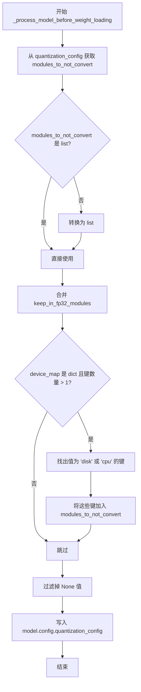

#### 带注释源码

```python
def _process_model_before_weight_loading(
    self,
    model: "ModelMixin",
    device_map,
    keep_in_fp32_modules: list[str] = [],
    **kwargs,
):
    # 1. 从量化配置中获取用户指定不转换的模块列表
    self.modules_to_not_convert = self.quantization_config.modules_to_not_convert

    # 2. 确保 modules_to_not_convert 是 list 类型，如果不是则包装为 list
    if not isinstance(self.modules_to_not_convert, list):
        self.modules_to_not_convert = [self.modules_to_not_convert]

    # 3. 将用户通过参数传入的保持 FP32 的模块也加入不转换列表
    self.modules_to_not_convert.extend(keep_in_fp32_modules)

    # 4. 检查设备映射，如果存在多设备配置（键数量 > 1），
    #    则将所有被分配到 'cpu' 或 'disk' 的模块加入不转换列表
    #    原因：这些模块被 offload 出内存，不在当前计算设备上，无法进行量化操作
    if isinstance(device_map, dict) and len(device_map.keys()) > 1:
        # 推导式筛选出设备为 'disk' 或 'cpu' 的模块键名
        keys_on_cpu = [key for key, value in device_map.items() if value in ["disk", "cpu"]]
        self.modules_to_not_convert.extend(keys_on_cpu)

    # 5. 清理列表，移除可能存在的 None 值
    #    注：与 transformers 库不同，diffusers 不总是固定保留某些模块（如 lm_head），
    #    因此需要根据配置动态清理
    self.modules_to_not_convert = [module for module in self.modules_to_not_convert if module is not None]

    # 6. 将量化配置对象写入模型的 config 中，供后续加载权重时使用或检查
    model.config.quantization_config = self.quantization_config
```


### `TorchAoHfQuantizer._process_model_after_weight_loading`

该方法是 `TorchAoHfQuantizer` 量化器类中的一个生命周期方法，用于在模型权重加载完成后对模型进行后处理。目前该实现是一个简单的占位符，直接返回传入的模型对象，未来可扩展用于执行量化后的模型验证、设备分配调整或其他后处理操作。

参数：

- `self`：类实例，表示当前的 `TorchAoHfQuantizer` 量化器对象
- `model`：`ModelMixin`，需要后处理的模型对象

返回值：`ModelMixin`，返回经过后处理（当前为直接返回原模型）的模型对象

#### 流程图

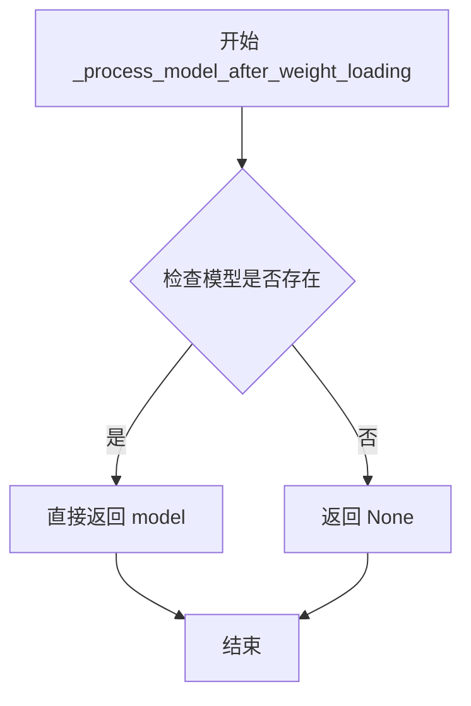

#### 带注释源码

```python
def _process_model_after_weight_loading(self, model: "ModelMixin"):
    """
    在模型权重加载完成后对模型进行后处理。
    
    该方法是量化器生命周期钩子的一部分，在 Diffusers 的模型加载流程中被调用。
    目前实现为一个简单的占位符，直接返回原始模型，不进行任何额外的处理。
    未来可以根据需要扩展此方法，例如：
    - 验证量化后的模型结构完整性
    - 调整模型的设备映射
    - 执行模型各层的精度检查
    - 清理临时变量或缓存
    
    参数:
        model: 已加载权重后的模型对象，类型为 ModelMixin
        
    返回:
        返回处理后的模型对象，当前实现直接返回输入的 model
    """
    return model
```


### `TorchAoHfQuantizer.is_serializable`

该方法用于检查 TorchAO 量化模型是否可序列化，通过验证安全序列化标志、huggingface_hub 版本要求以及模型配置中的 offload 状态来判断序列化可行性。

参数：

- `safe_serialization`：`bool | None`，可选参数，指示是否使用安全序列化模式

返回值：`bool`，返回 `True` 表示模型可序列化，返回 `False` 表示模型不可序列化

#### 流程图

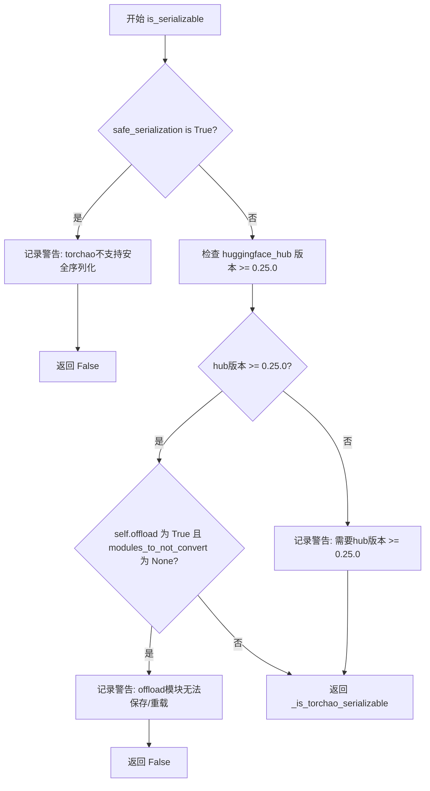

#### 带注释源码

```python
def is_serializable(self, safe_serialization=None):
    # TODO(aryan): needs to be tested
    # 检查是否启用了安全序列化模式
    if safe_serialization:
        logger.warning(
            "torchao quantized model does not support safe serialization, please set `safe_serialization` to False."
        )
        return False

    # 检查 huggingface_hub 版本是否 >= 0.25.0
    # 这是 torchao 量化模型可序列化所需的最少版本
    _is_torchao_serializable = version.parse(importlib.metadata.version("huggingface_hub")) >= version.parse(
        "0.25.0"
    )

    # 如果版本不满足要求，记录警告信息
    if not _is_torchao_serializable:
        logger.warning("torchao quantized model is only serializable after huggingface_hub >= 0.25.0 ")

    # 检查模型是否包含 offload 的模块且未指定不进行量化的模块
    # offload 到 CPU/Disk 的模块不会被量化，如果未指定 modules_to_not_convert，
    # 保存后无法正确重载这些模块
    if self.offload and self.quantization_config.modules_to_not_convert is None:
        logger.warning(
            "The model contains offloaded modules and these modules are not quantized. We don't recommend saving the model as we won't be able to reload them."
            "If you want to specify modules to not quantize, please specify modules_to_not_convert in the quantization_config."
        )
        return False

    # 返回序列化可行性状态
    return _is_torchao_serializable
```


### `TorchAoHfQuantizer.is_trainable`

该属性用于判断当前量化配置下的模型是否可训练。通过检查量化类型（quant_type）是否以"int8"开头来返回布尔值，只有int8量化类型支持训练。

参数：

- `self`：`TorchAoHfQuantizer` 实例本身，无需显式传递

返回值：`bool`，如果量化类型以"int8"开头则返回 `True`（表示模型可训练），否则返回 `False`

#### 流程图

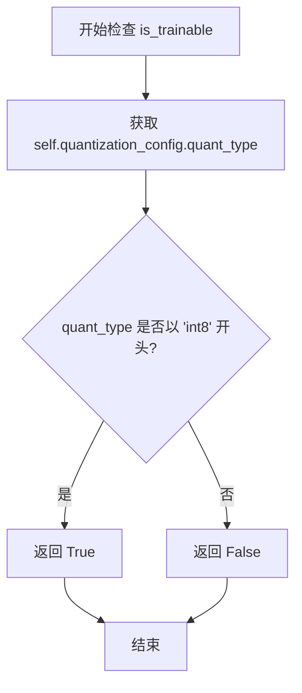

#### 带注释源码

```python
@property
def is_trainable(self):
    """
    属性：检查量化模型是否支持训练
    
    该属性决定了量化后的模型是否处于可训练状态。
    目前只有 int8 量化类型支持训练，其他量化类型（如 int4、uintx、float8 等）
    主要用于推理场景。
    
    返回值说明：
    - True: 模型可训练（适用于 int8 量化）
    - False: 模型不可训练（适用于 int4、uintx、float8 等量化类型）
    """
    # 检查 quantization_config 中的 quant_type 字段是否以 "int8" 开头
    # int8 量化保持权重量化但保留梯度计算能力，因此支持训练
    # 其他量化类型（如 int4_weight_only、uintx 等）主要用于推理，不支持训练
    return self.quantization_config.quant_type.startswith("int8")
```


### `TorchAoHfQuantizer.is_compileable`

该属性用于判断当前量化器是否支持 TorchCompile 编译功能。TorchAoHfQuantizer 作为 HuggingFace Diffusers 框架中针对 TorchAO 量化方法的量化器实现，支持对量化后的模型进行 torch.compile 编译优化。

参数：

- `self`：`TorchAoHfQuantizer` 类型，当前量化器实例本身

返回值：`bool`，返回 `True` 表示当前量化器支持编译功能，返回 `False` 则表示不支持。

#### 流程图

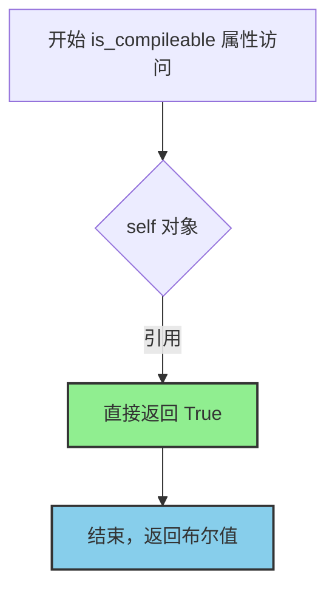

#### 带注释源码

```python
@property
def is_compileable(self) -> bool:
    """
    属性方法：检查当前量化器是否支持 torch.compile 编译功能。
    
    TorchAoHfQuantizer 实现了对 PyTorch AO (TorchAO) 量化方法的支持，
    而 TorchAO 量化后的模型可以与 torch.compile 兼容使用，从而获得
    进一步的性能提升。
    
    返回值:
        bool: 始终返回 True，表示当前量化器支持编译功能。
              这是因为 TorchAO 量化方法设计与 torch.compile 兼容，
              不存在已知的编译限制。
    """
    return True
```

#### 补充说明

该属性是 `DiffusersQuantizer` 基类接口的实现之一，用于 `accelerate` 库在加载量化模型时判断是否需要对模型进行编译优化。由于 TorchAO 量化框架的设计与 PyTorch 的 `torch.compile` 功能完全兼容，因此该属性直接返回 `True` 而无需进行额外的环境检查或条件判断。

## 关键组件


### TorchAoHfQuantizer

TorchAO 量化器的主类，继承自 DiffusersQuantizer，用于将 Diffusers 模型量化以使用 PyTorch AO 库，支持 int4/int8/uintx/float8 等多种量化类型。

### SUPPORTED_TORCH_DTYPES_FOR_QUANTIZATION

支持的量化张量数据类型集合，包括 torch.int8、torch.float8_e4m3fn、torch.float8_e5m2 以及 Torch 2.6+ 新增的 uint1-uint7 等类型。

### _update_torch_safe_globals

安全全局变量注册函数，将 NF4Tensor、UintxTensor、UintxAQTTensorImpl、UInt4Tensor、Float8AQTTensorImpl 等 TorchAO 张量类型添加到 torch 序列化安全列表，以支持加载包含这些自定义张量类型的检查点。

### fuzzy_match_size

正则匹配辅助函数，从配置名称（如 "4weight"、"8weight"）中提取数字位数，用于确定量化位宽。

### _quantization_type

获取权重量化类型的函数，返回 AffineQuantizedTensor 或 LinearActivationQuantizedTensor 的量化信息字符串。

### validate_environment

环境验证方法，检查 torchao 库可用性和版本要求（>= 0.7.0），同时处理 CPU/磁盘 offload 与预量化模型的兼容性检查。

### update_torch_dtype

数据类型更新方法，对于 int/uint 量化强制使用 bfloat16，以解决量化线性操作的 dtype 不匹配问题。

### adjust_target_dtype

目标数据类型调整方法，根据量化类型映射到正确的目标 dtype，包括 int8、INT4、uint1-uint7 等自定义类型。

### check_if_quantized_param

参数量化检查方法，判断指定参数是否应该被量化，排除了 modules_to_not_convert 中的模块和 offload 到 CPU 的权重。

### create_quantized_param

量化参数创建方法，对 nn.Linear 层进行量化处理，预量化模型直接加载权重，非预量化模型调用 quantize_ 执行实时量化。

### get_cuda_warm_up_factor

CUDA 预热内存因子计算方法，根据量化类型返回不同的分配比例（int4/uint 为 8，int8/float8 为 4），以正确估算量化权重的内存占用。

### _process_model_before_weight_loading

模型权重加载前处理方法，设置 modules_to_not_convert 列表并扩展包含 CPU/disk offload 的模块键。

### is_serializable

可序列化检查方法，验证 torchao 量化模型是否支持安全序列化（需要 huggingface_hub >= 0.25.0）。

### is_trainable / is_compileable

训练和编译属性，指示当前量化类型是否支持训练（仅 int8）和编译（均支持）。


## 问题及建议


### 已知问题

-   **try-except-finally 块使用不当**：在 `_update_torch_safe_globals()` 函数中，`finally` 块会无条件执行，导致即使 `try` 块中的导入失败，仍会尝试添加可能不完整的 `safe_globals` 列表，可能导致运行时错误
-   **版本检查逻辑不一致**：代码注释提到 `is_torchao_version(">=", "0.16.0")` 有问题，但实际使用的是 `is_torchao_version(">", "0.15.0")`，存在逻辑不一致和版本判断的潜在问题
-   **硬编码的内存调整因子**：在 `adjust_max_memory` 方法中，`0.9` 的系数被硬编码，没有任何配置或说明文档，魔法数字降低了代码可维护性
-   **fuzzy_match_size 函数正则表达式局限**：正则 `r"(\d)weight"` 只能匹配单个数字开头，可能无法处理如 "4bit_weight" 或 "weight_4" 等命名模式，覆盖场景有限
-   **TODO 标记表明测试不完整**：`is_serializable()` 方法带有 `# TODO(aryan): needs to be tested` 注释，表明该关键方法的测试覆盖不足
-   **quant_type 字符串匹配脆弱**：在 `adjust_target_dtype` 和 `get_cuda_warm_up_factor` 中使用 `startswith` 和 `fnmatch` 进行模式匹配，当 quant_type 格式不符合预期时会抛出不够友好的错误
-   **缺少输入参数校验**：部分方法如 `create_quantized_param` 和 `check_if_quantized_param` 缺少对输入参数（如 `param_value` 为 None 或 `model` 类型不正确）的有效性检查

### 优化建议

-   **重构安全全局变量加载逻辑**：将 `finally` 块中的 `add_safe_globals` 移入 `try` 块成功执行的分支，确保只有在成功构建安全全局列表后才进行注册
-   **提取版本常量为类或模块级别常量**：将 0.7.0、0.9.0、0.15.0、0.9.0 等版本号以及 0.9、4、8 等系数定义为常量或配置项，提升可维护性
-   **增强 fuzzy_match_size 函数的正则表达式**：使用更通用的正则如 `r"(\d+)"` 或支持多种命名约定的模式，或直接解析类的 `__name__` 属性获取尺寸信息
-   **完善错误处理与用户提示**：在 `adjust_target_dtype` 和 `get_cuda_warm_up_factor` 的异常处理中，提供更具体的错误信息和可能的解决方案建议
-   **补充单元测试**：特别是针对 `is_serializable()` 方法，增加边界条件和不同配置组合的测试用例
-   **添加参数校验装饰器或类型检查**：在关键公开方法入口处增加参数有效性校验，提前捕获不符合预期的输入

## 其它


### 设计目标与约束

**设计目标**：为 Diffusers 框架提供 TorchAO 量化支持，使得用户能够在不损失太多模型精度的情况下显著减少模型内存占用并提升推理性能。通过支持多种量化数据类型（int4、int8、uint1-7、float8 等），满足不同场景下的精度-性能权衡需求。

**约束条件**：
- 仅支持 PyTorch >= 2.5（对于预量化模型需要 >= 2.5）
- torchao >= 0.7.0
- 不支持 CPU/Disk offload 与预量化模型同时使用
- int4/int8/uintx 量化仅支持 bfloat16 作为基础数据类型
- 量化主要应用于 `nn.Linear` 层的权重

### 错误处理与异常设计

**ImportError**：当 torchao 库不可用时，在 `validate_environment` 中抛出明确的安装提示
**RuntimeError**：当 torchao 版本低于 0.7.0 或 PyTorch 版本低于 2.5.0（预量化场景）时抛出
**ValueError**：
- 当尝试使用 CPU/Disk offload 与预量化模型时
- 当无法推断合适的目标数据类型时
- 当 quant_type 不匹配任何支持的模式时

### 数据流与状态机

**加载流程**：
1. `validate_environment` → 检查依赖可用性和版本兼容性
2. `update_torch_dtype` → 确定最终的 torch_dtype
3. `adjust_target_dtype` → 根据 quant_type 选择目标数据类型
4. `adjust_max_memory` → 调整最大内存分配（乘以 0.9 系数）
5. `_process_model_before_weight_loading` → 预处理模型，配置 modules_to_not_convert
6. 权重加载过程中调用 `check_if_quantized_param` 判断是否需要量化
7. `create_quantized_param` → 执行实际量化操作
8. `_process_model_after_weight_loading` → 后处理模型

### 外部依赖与接口契约

**核心依赖**：
- `torch` >= 2.5.0（部分功能需要 2.6.0+）
- `torchao` >= 0.7.0
- `packaging`（版本解析）
- `transformers` 风格的 `DiffusersQuantizer` 基类
- `accelerate.utils.CustomDtype`（用于 int4 等自定义类型）

**接口契约**：
- 继承 `DiffusersQuantizer` 基类
- 实现抽象方法：`validate_environment`, `update_torch_dtype`, `adjust_target_dtype`, `adjust_max_memory`, `check_if_quantized_param`, `create_quantized_param`, `_process_model_before_weight_loading`, `_process_model_after_weight_loading`, `is_serializable`
- 属性：`requires_calibration` = False, `required_packages` = ["torchao"], `is_trainable`, `is_compileable`

### 安全性考虑

**Safe Serialization**：通过 `_update_torch_safe_globals` 将 TorchAO 自定义张量类型注册到 `torch.serialization.add_safe_globals`，确保序列化/反序列化安全。支持安全加载包含 torchao 量化张量的检查点。

**限制**：
- 预量化模型不支持 safe_serialization（`is_serializable` 中检测并警告）
- 需要 huggingface_hub >= 0.25.0 才能正确序列化 torchao 量化模型

### 性能优化建议

**CUDA 预热**：通过 `get_cuda_warm_up_factor` 为缓存分配器预热提供合适的内存系数，int4 使用系数 8，int8 使用系数 4，uint 类型使用系数 8，float8 使用系数 4。

**内存优化**：`adjust_max_memory` 将最大内存减少 10%（乘以 0.9），为量化元数据预留空间。

### 测试策略建议

- 验证不同 quant_type（int4, int8, uint4, float8 等）的量化流程
- 测试预量化模型的加载和推理
- 验证与 device_map 的兼容性（包括 CPU offload 场景）
- 测试序列化/反序列化 roundtrip
- 测试模型训练场景（仅 int8 可训练）
- 验证内存占用优化效果

### 版本兼容性矩阵

| 功能 | PyTorch | torchao | 备注 |
|------|---------|---------|------|
| int8/uint/float8 量化 | >= 2.5 | >= 0.7.0 | 基础支持 |
| uint1-7 支持 | >= 2.6 | >= 0.7.0 | PyTorch 2.6+ |
| AOBaseConfig 支持 | 任意 | > 0.9.0 | 新配置格式 |
| NF4Tensor | 任意 | 任意 | 需要正确导入 |

### 配置管理

**quantization_config** 应包含：
- `quant_type`：量化类型字符串（如 "int4_weight_only", "int8_dynamic", "uint4" 等）
- `quant_type_kwargs`：量化类型的额外参数（如 dtype）
- `modules_to_not_convert`：不进行量化的模块列表

### 潜在技术债务

1. **TODO(aryan)**：`is_serializable` 方法标注为 needs to be tested，实际测试覆盖不足
2. **TODO(aryan)**：可探索支持 PyTorch >= 2.2 的某些量化类型
3. **模糊匹配**：使用正则表达式从类名提取 size_digit（fuzzy_match_size），这种方式脆弱且依赖于命名约定
4. **uint 类型系数**：注释承认 uint 类型的内存系数是 best guess，需要更多实际使用验证


    