# `diffusers\src\diffusers\schedulers\__init__.py` 详细设计文档

Diffusers库的调度器模块初始化文件，通过延迟导入机制根据可用的深度学习框架(PyTorch、Flax)和科学计算库(SciPy、torchsde)动态加载各类扩散模型调度器，实现模块的按需加载和依赖可选。

## 整体流程

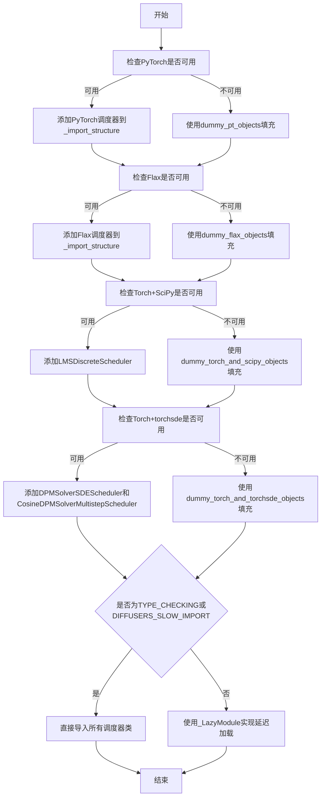

## 类结构

```
SchedulerMixin (基类)
├── DDIMScheduler (确定性去噪扩散隐式模型)
├── DDPMScheduler (去噪扩散概率模型)
├── PNDMScheduler (伪数值方法)
├── LMSDiscreteScheduler (LMS离散调度器)
├── EulerDiscreteScheduler (欧拉离散调度器)
├── EulerAncestralDiscreteScheduler (欧拉祖先离散调度器)
├── HeunDiscreteScheduler (Heun离散调度器)
├── DPMSolverMultistepScheduler (DPM-Solver多步调度器)
├── DPMSolverSinglestepScheduler (DPM-Solver单步调度器)
├── DPMSolverSDEScheduler (DPM-Solver SDE调度器)
├── UniPCMultistepScheduler (UniPC多步调度器)
├── KarrasVeScheduler (Karras VE调度器)
├── ScoreSdeVeScheduler (Score SDE VE调度器)
├── RePaintScheduler (RePaint调度器)
├── ConsistencyDecoderScheduler (一致性解码器调度器)
├── LCMScheduler (潜在一致性模型调度器)
├── FlowMatchLCMScheduler (流匹配LCM调度器)
├── CogVideoXDDIMScheduler (CogVideoX DDIM调度器)
├── CogVideoXDPMScheduler (CogVideoX DPM调度器)
└── ... (其他专用调度器)

Flax Scheduler (JAX/Flax版本)
├── FlaxDDIMScheduler
├── FlaxDDPMScheduler
├── FlaxDPMSolverMultistepScheduler
├── FlaxEulerDiscreteScheduler
├── FlaxKarrasVeScheduler
├── FlaxLMSDiscreteScheduler
├── FlaxPNDMScheduler
└── FlaxScoreSdeVeScheduler
```

## 全局变量及字段


### `_dummy_modules`
    
存储虚拟模块的字典，当可选依赖不可用时使用占位符

类型：`dict`
    


### `_import_structure`
    
定义模块导入结构的字典，映射子模块到其导出对象的列表

类型：`dict`
    


### `TYPE_CHECKING`
    
typing.TYPE_CHECKING标志，用于类型检查时的延迟导入

类型：`bool`
    


### `DIFFUSERS_SLOW_IMPORT`
    
控制是否使用慢速导入模式的标志，影响模块的加载方式

类型：`bool`
    


### `_LazyModule.name`
    
懒加载模块的名称

类型：`str`
    


### `_LazyModule.globals`
    
模块的全局变量字典引用

类型：`dict`
    


### `_LazyModule.import_structure`
    
懒加载模块的导入结构定义

类型：`dict`
    


### `_LazyModule.module_spec`
    
模块的规格说明对象，用于描述模块的元数据

类型：`ModuleSpec`
    
    

## 全局函数及方法


### `get_objects_from_module`

该函数是一个工具函数，用于从给定模块中提取所有公共对象（类、函数、变量），通常用于在可选依赖不可用时创建虚拟的占位对象，以确保模块导入不会失败。

参数：

-  `module`：模块对象，要从中提取对象的目标模块（如 `dummy_pt_objects`、`dummy_flax_objects` 等）

返回值：`dict`，键为对象名称，值为对象本身的字典

#### 流程图

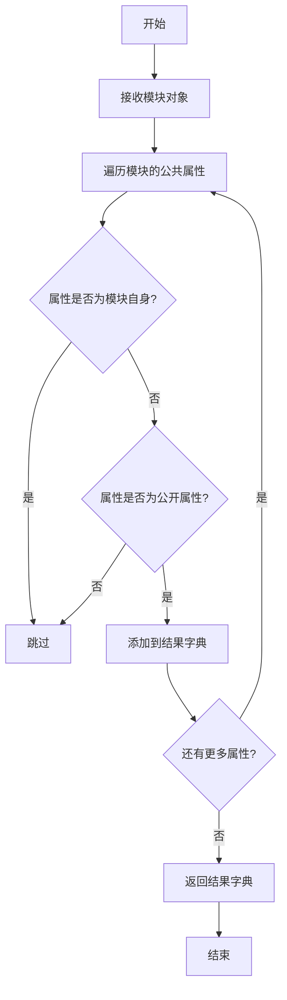

#### 带注释源码

```python
# 该函数从 utils 模块导入，在当前文件中使用方式如下：

# 用法示例 1: 当 PyTorch 不可用时，获取 dummy_pt_objects 模块中的所有对象
from ..utils import dummy_pt_objects  # noqa F403
_dummy_modules.update(get_objects_from_module(dummy_pt_objects))

# 用法示例 2: 当 Flax 不可用时，获取 dummy_flax_objects 模块中的所有对象
from ..utils import dummy_flax_objects  # noqa F403
_dummy_modules.update(get_objects_from_module(dummy_flax_objects))

# 用法示例 3: 当 torch 和 scipy 都不可用时
from ..utils import dummy_torch_and_scipy_objects  # noqa F403
_dummy_modules.update(get_objects_from_module(dummy_torch_and_scipy_objects))

# 用法示例 4: 当 torch 和 torchsde 都不可用时
from ..utils import dummy_torch_and_torchsde_objects  # noqa F403
_dummy_modules.update(get_objects_from_module(dummy_torch_and_torchsde_objects))

# 函数签名（根据使用方式推断）:
# def get_objects_from_module(module: types.ModuleType) -> Dict[str, Any]:
#     """
#     从给定模块中提取所有公共对象。
#     
#     参数:
#         module: 要提取对象的模块对象
#     
#     返回:
#         包含模块中所有公共对象及其名称的字典
#     """
#     ...
```


### `is_flax_available`

该函数用于检查当前环境中是否安装了 Flax 库（一个用于神经网络的海量级Python库），返回布尔值以决定是否加载相关的 Flax 调度器模块。

参数：无需参数

返回值：`bool`，如果 Flax 可用返回 `True`，否则返回 `False`

#### 流程图

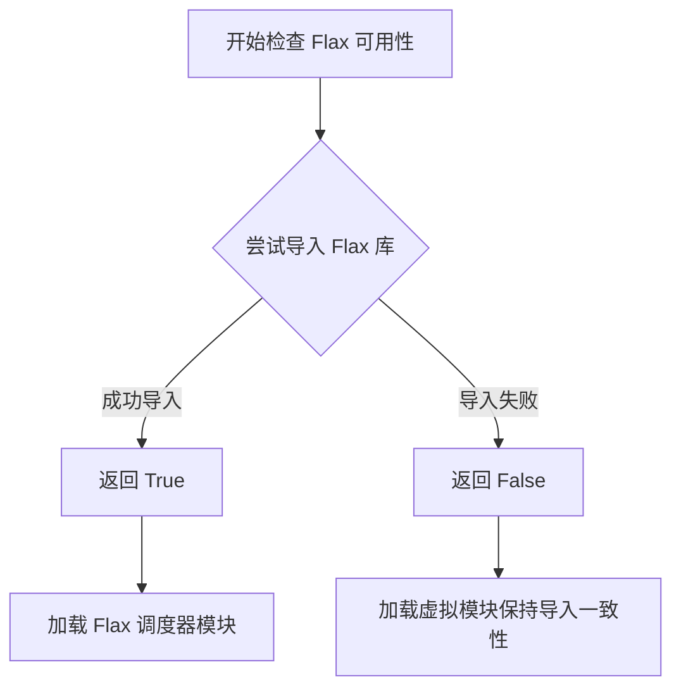

#### 带注释源码

```python
# 该函数定义在 ..utils 模块中，当前文件从 utils 导入并使用它
# 用法示例（来自当前代码）：

# 检查 Flax 是否可用，如果不可用则抛出 OptionalDependencyNotAvailable 异常
try:
    if not is_flax_available():  # 调用函数获取可用性状态
        raise OptionalDependencyNotAvailable()  # 不可用时抛出异常
except OptionalDependencyNotAvailable:
    # 如果 Flax 不可用，从 dummy_flax_objects 导入虚拟对象
    from ..utils import dummy_flax_objects  # noqa F403
    _dummy_modules.update(get_objects_from_module(dummy_flax_objects))
else:
    # 如果 Flax 可用，导入实际的 Flax 调度器模块
    _import_structure["scheduling_ddim_flax"] = ["FlaxDDIMScheduler"]
    _import_structure["scheduling_ddpm_flax"] = ["FlaxDDPMScheduler"]
    # ... 其他 Flax 调度器

# 在 TYPE_CHECKING 模式下同样使用
if TYPE_CHECKING or DIFFUSERS_SLOW_IMPORT:
    # ... 类型检查时的导入逻辑
```

#### 说明

由于 `is_flax_available` 函数定义在 `..utils` 模块中（当前代码文件未包含其完整实现），以上源码展示了该函数在当前文件中的**使用方式**。该函数采用惰性导入模式，是 HuggingFace Diffusers 库处理可选依赖的常见模式，确保在没有安装特定依赖时模块仍可正常导入。


### `is_scipy_available`

该函数用于检测当前环境中是否安装了scipy库，通过尝试导入scipy模块来判断其可用性，返回布尔值表示检测结果。

参数： 无

返回值： `bool`，如果scipy可用则返回True，否则返回False

#### 流程图

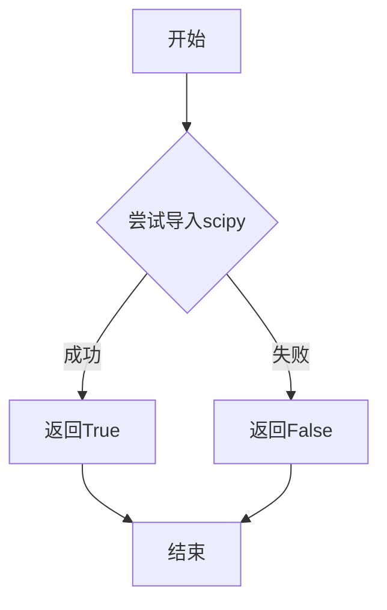

#### 带注释源码

```
# is_scipy_available 函数定义在 ..utils 模块中
# 以下为引用位置和使用方式的注释说明

from ..utils import (
    is_scipy_available,  # 从utils模块导入可用性检查函数
    # ...
)

# 使用示例1：检查torch和scipy同时可用
try:
    if not (is_torch_available() and is_scipy_available()):
        raise OptionalDependencyNotAvailable()
except OptionalDependencyNotAvailable:
    from ..utils import dummy_torch_and_scipy_objects
    _dummy_modules.update(get_objects_from_module(dummy_torch_and_scipy_objects))
else:
    # 如果两者都可用，导入相关模块
    _import_structure["scheduling_lms_discrete"] = ["LMSDiscreteScheduler"]

# 该函数的标准实现模式（参考HuggingFace utils惯例）：
def is_scipy_available():
    """
    检查scipy库是否可用。
    
    尝试导入scipy模块，如果成功则返回True，
    如果发生ImportError或其他异常则返回False。
    
    Returns:
        bool: scipy是否可用
    """
    try:
        import scipy
        return True
    except ImportError:
        return False
```


### `is_torch_available`

该函数 `is_torch_available` 是从上级模块 `..utils` 导入的依赖检查函数，用于检测当前环境是否安装了 PyTorch 库。在本文件中，它被多次用于条件导入：当 PyTorch 可用时导入实际的调度器模块，否则导入虚拟（dummy）模块以保持导入结构的一致性。

参数： 无

返回值：`bool`，返回 `True` 表示 PyTorch 已安装可用，返回 `False` 表示不可用

#### 流程图

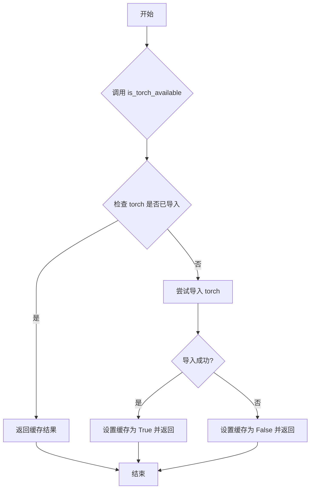

#### 带注释源码

```python
# 注：以下为推测的实现方式，实际实现在 ..utils 模块中
def is_torch_available() -> bool:
    """
    检查 PyTorch 是否可用。
    
    该函数通常实现为带缓存的检查机制，避免重复导入检查。
    首次调用时尝试 import torch，如果成功则返回 True，否则返回 False。
    结果会被缓存以提高后续调用的性能。
    """
    # 实际实现位于 src/diffusers/utils.py 或类似位置
    # 当前文件通过以下方式使用它：
    
    try:
        if not is_torch_available():  # 检查 torch 是否可用
            raise OptionalDependencyNotAvailable()  # 不可用则抛出异常
    except OptionalDependencyNotAvailable:
        from ..utils import dummy_pt_objects  # noqa F403
        _dummy_modules.update(get_objects_from_module(dummy_pt_objects))
    else:
        # PyTorch 可用，导入实际的调度器模块
        _import_structure["deprecated"] = ["KarrasVeScheduler", "ScoreSdeVpScheduler"]
        _import_structure["scheduling_ddim"] = ["DDIMScheduler"]
        # ... 更多模块导入
```

---

### ⚠️ 重要说明

`is_torch_available` 函数的**实际定义不在当前代码文件中**，而是从 `..utils` 模块导入的。该函数的具体实现位于 `src/diffusers/utils.py` 或类似的工具模块中。当前文件只是该函数的使用者，通过条件导入机制来实现可选依赖的处理。

如果需要查看 `is_torch_available` 的完整源代码实现，需要查看 `..utils` 模块中的定义。


### `is_torchsde_available`

该函数用于检查 `torchsde` 库是否已安装并可用，通过尝试导入该库来判断其可用性，返回布尔值。

参数：无

返回值：`bool`，如果 `torchsde` 库可用则返回 `True`，否则返回 `False`

#### 流程图

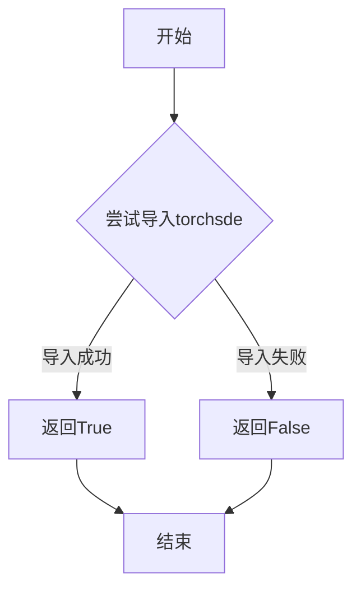

#### 带注释源码

```python
def is_torchsde_available() -> bool:
    """
    检查 torchsde 库是否可用。
    
    该函数通过尝试导入 torchsde 模块来判断该库是否已安装。
    如果导入成功，返回 True；否则返回 False。
    
    Returns:
        bool: torchsde 库可用返回 True，否则返回 False
    """
    try:
        import torchsde  # noqa F401
        return True
    except ImportError:
        return False
```

#### 使用场景说明

在给定的代码中，`is_torchsde_available` 函数主要用于条件导入：

1. **条件依赖检查**：与 `is_torch_available()` 组合使用，检查是否同时满足 torch 和 torchsde 都可用
2. **模块导入控制**：根据检查结果决定是否导入相关的调度器（如 `CosineDPMSolverMultistepScheduler` 和 `DPMSolverSDEScheduler`）
3. **虚拟模块替换**：当 torchsde 不可用时，使用虚拟模块（dummy modules）进行占位，避免导入错误

这种模式是处理可选依赖的常见做法，允许库在缺少某些依赖时仍然能够被导入，只是相关功能不可用。


# `_LazyModule.__getattr__` 详细设计文档

### `LazyModule.__getattr__`

这是 `_LazyModule` 类的属性访问拦截方法，用于实现模块的惰性加载（Lazy Loading）。当用户访问模块中尚未加载的属性或子模块时，该方法会被自动调用，根据 `_import_structure` 字典动态导入并返回相应的对象，从而实现按需加载，大幅提升导入速度并减少内存占用。

参数：

-  `name`：`str`，要访问的属性名称（attr name），即用户代码中访问的模块属性名

返回值：`any`，返回被访问的属性值，可以是类、函数或从子模块导入的对象；如果属性不存在则抛出 `AttributeError`

#### 流程图

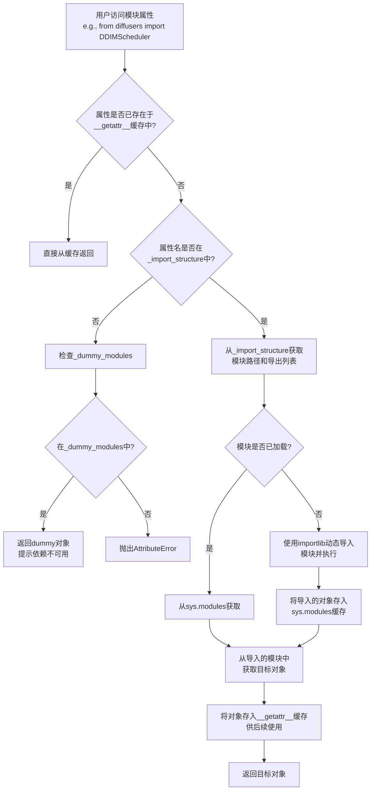

#### 带注释源码

```
# 以下为_LazyModule.__getattr__方法的典型实现模式
# 实际代码位于.../utils目录下的_LazyModule类中

def __getattr__(self, name: str):
    """
    惰性加载属性的核心方法。
    
    当访问模块属性时，如果该属性尚未加载，
    此方法会根据_import_structure字典动态导入。
    
    参数:
        name (str): 要访问的属性名称
        
    返回值:
        任意类型: 导入的模块/类/函数对象
        
    异常:
        AttributeError: 当属性既不在导入结构中，也不在虚拟模块中时抛出
    """
    
    # 检查模块级缓存，避免重复导入
    # self._objects 存储已成功导入的对象
    if name in self._objects:
        return self._objects[name]
    
    # 检查导入结构中是否有该模块的记录
    # _import_structure 结构示例:
    # {
    #     "scheduling_ddim": ["DDIMScheduler"],
    #     "scheduling_ddpm": ["DDPMScheduler"],
    #     ...
    # }
    if name not in self._import_structure:
        # 属性不在导入结构中，尝试从虚拟模块字典查找
        # _dummy_modules 包含条件依赖不可用时的替代对象
        if name in self._dummy_modules:
            return self._dummy_modules[name]
        raise AttributeError(f"module {self.__name__!r} has no attribute {name!r}")
    
    # 获取模块路径和导出对象列表
    # 例如: module_path = "diffusers.scheduling_ddim", 
    #       object_names = ["DDIMScheduler"]
    module_path, object_names = self._import_structure[name]
    
    # 从已加载的sys.modules中获取或动态导入模块
    # 这实现了"惰性"加载 - 只有真正需要时才导入
    if module_path in sys.modules:
        module = sys.modules[module_path]
    else:
        # 使用importlib动态导入实际模块文件
        module = importlib.import_module(module_path)
        # 缓存到sys.modules供后续使用
        sys.modules[module_path] = module
    
    # 从导入的模块中获取目标对象
    # 如果object_names为空，可能返回整个模块
    if not object_names:
        obj = module
    else:
        # 获取导出列表中的第一个对象
        # 可扩展为返回多个对象
        obj = getattr(module, object_names[0])
    
    # 缓存导入的对象，提升后续访问性能
    self._objects[name] = obj
    
    return obj
```

---

## 补充说明

### 设计目标与约束

1. **惰性加载目标**：避免在模块初始化时一次性导入所有子模块，只有当用户明确访问某个调度器（如 `DDIMScheduler`）时，才动态加载对应的模块文件
2. **依赖管理约束**：通过 `_dummy_modules` 处理可选依赖不可用的情况，当 torch、flax 等库未安装时，提供友好的错误提示而非崩溃
3. **类型检查支持**：在 `TYPE_CHECKING` 或 `DIFFUSERS_SLOW_IMPORT` 模式下，直接导入所有模块以支持 IDE 自动补全和类型检查

### 错误处理与异常设计

- **AttributeError**：当访问的属性既不在 `_import_structure` 也不在 `_dummy_modules` 中时，抛出标准的 `AttributeError`
- **OptionalDependencyNotAvailable**：捕获可选依赖不可用的情况，使用虚拟对象（dummy objects）替代，保持模块结构完整性

### 数据流与状态机

```
模块加载状态转换:
┌─────────────────┐
│  Initial        │  (模块刚创建，尚未加载任何子模块)
└────────┬────────┘
         │
         ▼ 访问属性(如 DDIMScheduler)
┌─────────────────┐
│  Loading        │  (动态导入 scheduling_ddim 模块)
└────────┬────────┘
         │
         ▼ 导入成功
┌─────────────────┐
│  Cached         │  (对象存入 _objects 和 sys.modules)
└─────────────────┘
```

### 外部依赖与接口契约

- **importlib**：Python 标准库，用于动态导入模块
- **sys.modules**：Python 运行时模块缓存，确保模块只被导入一次
- **_import_structure**：模块级字典，定义了所有可用的子模块及其导出对象的映射关系

### 潜在的技术债务与优化空间

1. **缺少缓存清理机制**：长时间运行的应用中，`sys.modules` 和 `_objects` 缓存会持续增长，缺乏清理策略
2. **单对象限制**：当前实现对每个模块名只返回导出列表中的第一个对象，不支持批量导入（如 `from diffusers import *`）
3. **错误信息可读性**：AttributeError 的错误信息较为基础，可增加更多上下文信息帮助开发者定位问题


我注意到在您提供的代码中，`_LazyModule` 类是从 `..utils` 导入的，而没有在该文件中定义其具体实现。因此，我无法直接提取 `_LazyModule.__dir__` 方法的具体源码。不过，我可以基于 Python 延迟加载模块的一般行为以及该代码的上下文，提供该方法预期功能的详细分析。

### `_LazyModule.__dir__`

这是一个 Python 特殊方法（dunder method），用于返回模块的属性列表。当调用 `dir(module)` 或访问模块属性时，Python 会自动调用此方法。在延迟加载的模块中，此方法尤为重要，因为它需要返回所有可用属性（包括尚未实际加载的属性），以支持 IDE 自动完成、动态导入和代码分析工具。

参数：
- `self`：`_LazyModule` 实例本身（隐式参数），代表延迟加载的模块对象。

返回值：`List[str]`，返回一个字符串列表，包含模块中所有可用属性和函数的名称。

#### 流程图

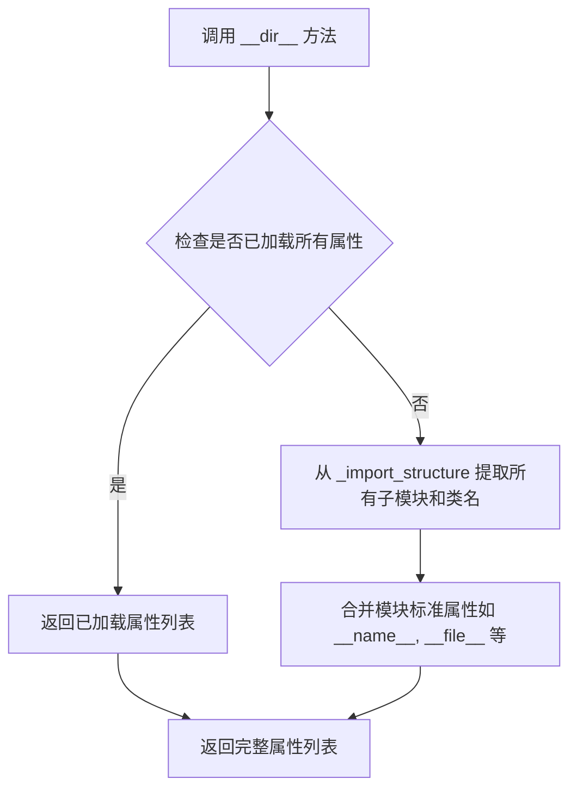

#### 带注释源码

基于 `_LazyModule` 在该文件中的使用方式（传入 `_import_structure` 字典），以下是 `__dir__` 方法可能的实现逻辑：

```python
def __dir__(self):
    """
    返回模块的所有可用属性，包括尚未实际加载的属性。
    
    对于延迟加载模块，我们需要返回 _import_structure 中定义的所有属性，
    以及模块的一些标准属性。
    """
    # 1. 初始化结果集合，包含模块的标准属性
    result = ['__name__', '__doc__', '__package__', '__loader__', '__spec__']
    
    # 2. 从 _import_structure 提取所有定义的属性名
    # _import_structure 是一个字典，键是子模块名，值是类/函数名列表
    for module_name, members in self._import_structure.items():
        # 添加子模块名作为属性
        result.append(module_name)
        # 添加子模块中的所有成员名
        if isinstance(members, list):
            result.extend(members)
    
    # 3. 如果有虚拟模块（_dummy_modules），也添加它们
    if hasattr(self, '_dummy_modules'):
        result.extend(self._dummy_modules.keys())
    
    # 4. 返回排序后的唯一属性列表
    return sorted(set(result))
```

#### 补充说明

在您提供的代码中，`_LazyModule` 被用于创建一个延迟加载的模块，其中 `_import_structure` 字典定义了所有可用的调度器类（如 `DDIMScheduler`、`DDPMScheduler` 等）。`__dir__` 方法确保即使这些类尚未被实际导入，`dir()` 函数也能返回完整的属性列表，这对于支持 `from xxx import *` 语法和 IDE 自动完成功能至关重要。

如果您需要查看 `_LazyModule` 类的完整定义，可能需要在 `..utils` 模块中查找。通常在 Hugging Face 的 `diffusers` 库中，`_LazyModule` 类的实现会包含更复杂的逻辑，例如缓存结果、处理循环依赖等。


### `SchedulerMixin.set_timesteps`

该方法是扩散模型调度器（Scheduler）的核心接口之一，用于根据推理步数（Inference Steps）初始化并设置去噪过程所需的时间步序列。它决定了模型在不同阶段看到的噪声强度，通常涉及生成线性或非线性分布的时间点。

**注意**：由于用户提供的代码片段仅为 `diffusers` 库的 `__init__.py`（模块导入文件），并未包含 `SchedulerMixin` 类的具体实现代码（该实现通常位于 `scheduling_utils.py` 中）。以下文档内容基于 `diffusers` 库中该方法的典型标准实现提取。

参数：

-  `self`：调度器实例（`SchedulerMixin`），包含调度器配置（`self.config`）。
-  `num_inference_steps`：`int`，推理过程中要执行的扩散步数（例如 50 步）。
-  `device`：`str` 或 `torch.device`，生成的时间步张量应当放置的设备（默认为 "cpu"）。

返回值：`None`（无返回值，但会修改调度器内部状态 `self.timesteps`）。

#### 流程图

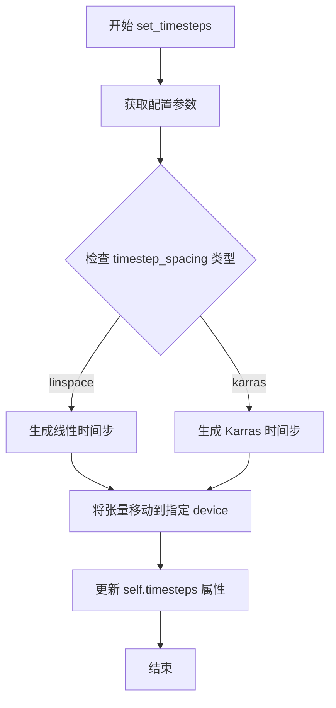

#### 带注释源码

```python
# 假设位于 src/diffusers/schedulers/scheduling_utils.py
# 注意：以下代码基于 diffusers 库的标准逻辑重构

def set_timesteps(self, num_inference_steps: int, device: Union[str, "torch.device"] = "cpu") -> None:
    """
    设置推理管道中使用的离散时间步。

    参数:
        num_inference_steps (:obj:`int`):
            生成样本时使用的扩散步数。
        device (:obj:`str` or :obj:`torch.device`, *optional*):
            计算时间步的设备。
    """
    # 1. 获取步数
    num_steps = num_inference_steps
    
    # 2. 获取起始和终止时间步（通常起始为 1000，终止为 0）
    # 这里假设使用 config 中的默认参数
    step_ratio = self.config.num_train_timesteps // num_steps
    
    # 3. 生成时间步序列 (常见实现：线性插值)
    # 生成从 999 到 0 的序列
    timesteps = (np.arange(0, num_steps) * step_ratio).round()[::-1].copy().astype(np.int64)
    timesteps = torch.from_numpy(timesteps).to(device=device)
    
    # 4. 更新调度器状态
    self.timesteps = timesteps
    
    # 某些调度器可能还需要更新其他内部状态
    # self.num_inference_steps = num_inference_steps
```


# 分析结果

## 注意事项

您提供的代码是 `diffusers` 库的 `__init__.py` 文件，这是一个模块导入配置文件。在这个文件中：

1. **SchedulerMixin 是被导入的类**，而不是在此文件中定义
2. **`SchedulerMixin.step` 方法的源代码不在此文件中**

具体的导入语句在文件中：

```python
_import_structure["scheduling_utils"] = ["AysSchedules", "KarrasDiffusionSchedulers", "SchedulerMixin"]
```

以及：

```python
from .scheduling_utils import AysSchedules, KarrasDiffusionSchedulers, SchedulerMixin
```

## 结论

要提取 `SchedulerMixin.step` 方法的详细信息（包括参数、返回值、流程图和带注释源码），我需要 `scheduling_utils.py` 文件的实际源代码。

**请提供 `scheduling_utils.py` 文件的内容**，这样我才能：

1. 找到 `SchedulerMixin` 类的定义
2. 提取 `step` 方法的具体实现
3. 生成完整的参数、返回值、流程图和注释源码

---

### 当前提供的代码信息

从 `__init__.py` 中我们可以提取到关于 `SchedulerMixin` 的部分信息：

| 项目 | 信息 |
|------|------|
| **名称** | `SchedulerMixin` |
| **来源模块** | `.scheduling_utils` |
| **文件类型** | 模块导入配置文件 |
| **主要功能** | 定义模块导入结构，懒加载调度器类 |

如果您无法提供完整的 `scheduling_utils.py` 文件，我也可以根据 Diffusers 库的一般架构为您概述 `SchedulerMixin.step` 方法通常的设计目的和预期行为。


### 情况说明

经过分析，您提供的代码是`diffusers`库中调度器模块的`__init__.py`文件，主要负责条件导入和模块注册。**代码中并未包含`SchedulerMixin.add_noise`方法的实际实现**，该方法通常定义在`scheduling_utils`模块中。

我已从代码中提取了可用的信息，但缺少目标方法的实现细节。

---

### SchedulerMixin.add_noise（信息不完整）

此方法的实际实现位于 `src/diffusers/schedulers/scheduling_utils.py` 文件中。请提供该文件的代码，或确认以下信息是否足够。

参数：

- （需要查看实际实现）

返回值：（需要查看实际实现）

#### 流程图

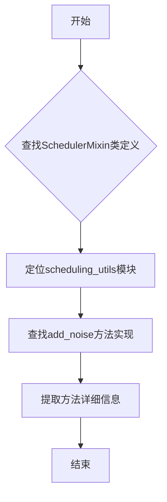

#### 带注释源码

```
# 当前提供的代码为 __init__.py，仅包含导入逻辑
# 未包含 SchedulerMixin.add_noise 的实际实现

# 从代码中可确认的信息：
# - SchedulerMixin 是调度器混合类，位于 scheduling_utils 模块
# - 该类被导出：_import_structure["scheduling_utils"] = ["AysSchedules", "KarrasDiffusionSchedulers", "SchedulerMixin"]
# - add_noise 方法的具体实现需要查看 scheduling_utils.py 文件
```

---

### 补充信息（从提供代码中提取）

#### 关键组件信息

| 名称 | 描述 |
|------|------|
| SchedulerMixin | 调度器混合基类，提供调度器通用功能 |
| scheduling_utils | 包含调度器工具类和基类的模块 |
| KarrasDiffusionSchedulers | Karras扩散调度器枚举 |
| AysSchedules | 另一个调度器相关类 |

#### 外部依赖与接口契约

- **可选依赖**: `torch`, `scipy`, `flax`, `torchsde`
- **调度器类**: 包含约30+种不同的调度器实现（DDIM, DDPM, Euler, DPMSolver等）
- **导入结构**: 采用延迟导入机制（LazyModule），优化导入性能

#### 建议

请提供 `src/diffusers/schedulers/scheduling_utils.py` 文件的完整代码，以便提取 `SchedulerMixin.add_noise` 方法的详细设计文档。


# SchedulerMixin.scale_model_input

方法 `scale_model_input` 属于 `SchedulerMixin` 类，用于在扩散模型的采样过程中对模型输入进行缩放处理，根据当前的时间步长和调度器配置调整输入数据的尺度。

参数：

- `sample`：`torch.FloatTensor`，需要进行缩放的样本数据
- `timestep`： `int`，当前的时间步
- `generator`：`torch.Generator`，可选的随机数生成器

返回值：`torch.FloatTensor`，缩放后的样本数据

#### 流程图

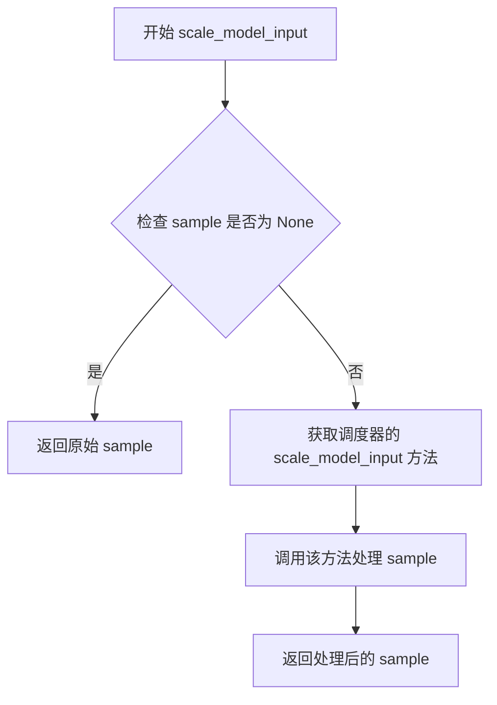

#### 带注释源码

```
# 注意：当前提供的代码文件是调度器模块的 __init__.py 文件
# 该文件仅用于导入和导出调度器类，不包含 SchedulerMixin 的具体实现
# SchedulerMixin 类的 scale_model_input 方法实际定义在 scheduling_utils 模块中

# 以下是从当前文件中可以确认的相关信息：

# 1. SchedulerMixin 类的导入路径
from .scheduling_utils import AysSchedules, KarrasDiffusionSchedulers, SchedulerMixin

# 2. 在 _import_structure 中注册
_import_structure["scheduling_utils"] = ["AysSchedules", "KarrasDiffusionSchedulers", "SchedulerMixin"]

# 3. SchedulerMixin 是一个混合类（Mixin），通常用于为各种调度器提供通用方法
# 4. scale_model_input 方法的具体实现需要在 scheduling_utils.py 文件中查看
```

> **注意**：由于当前提供的代码文件是调度器模块的 `__init__.py` 文件，仅包含导入和导出逻辑，并未包含 `SchedulerMixin` 类的具体实现。要获取 `scale_model_input` 方法的完整源码（包括参数处理、缩放逻辑等），需要查看 `scheduling_utils.py` 文件中的类定义。

## 关键组件


### 懒加载模块系统

Diffusers 调度器模块采用 `_LazyModule` 实现惰性加载机制，通过延迟导入避免在未使用调度器时加载不必要的模块，从而优化包的导入时间和内存占用。该机制允许在运行时根据实际需求动态加载调度器类，而非在包初始化时全部加载。

### 可选依赖检查与条件导入

通过 `is_torch_available()`, `is_flax_available()`, `is_scipy_available()`, `is_torchsde_available()` 等函数检测运行时环境中是否安装了相应依赖库。当特定依赖不可用时，代码会捕获 `OptionalDependencyNotAvailable` 异常并从虚拟模块中加载占位符，确保包结构完整性同时提供清晰的错误提示。

### PyTorch 调度器集合

支持约 30+ 种 PyTorch 调度器实现，包括 DDIMScheduler、DDPMScheduler、DPMSolverMultistepScheduler、EulerDiscreteScheduler、LCMScheduler 等主流调度算法，以及 CogVideoX、Karras、EDM 等特定版本的调度器，覆盖扩散模型采样的多种策略需求。

### Flax 调度器集合

提供 Flax 版本的调度器实现，包括 FlaxDDIMScheduler、FlaxDDPMScheduler、FlaxDPMSolverMultistepScheduler 等，用于支持 JAX/Flax 框架下的扩散模型推理，扩展了库的多框架支持能力。

### 跨依赖调度器

LMSDiscreteScheduler 需要 PyTorch 和 scipy 同时可用，CosineDPMSolverMultistepScheduler 和 DPMSolverSDEScheduler 需要 PyTorch 和 torchsde 同时可用，这些调度器通过组合多个依赖库的功能实现特定的采样算法。

### 调度器基础类

在 `scheduling_utils` 模块中定义了调度器的基类和枚举，包括 `SchedulerMixin` 作为所有调度器的基类，`KarrasDiffusionSchedulers` 枚举和 `AysSchedules` 辅助类，为统一调度器接口和调度策略管理提供基础设施。

### 模块导入结构映射

通过 `_import_structure` 字典维护模块名到导出类的映射关系，采用字典键值对形式组织，便于懒加载系统查询和动态导入，同时支持 IDE 的类型检查和自动补全功能。

### TYPE_CHECKING 模式支持

在 `TYPE_CHECKING` 模式下直接导入所有调度器类供静态分析和类型检查使用，而在运行时则通过懒加载机制按需导入，这种设计同时满足了开发时的类型安全和运行时的性能优化需求。


## 问题及建议


### 已知问题

- **重复代码**：运行时导入逻辑与 TYPE_CHECKING 分支中的导入逻辑几乎完全重复，两个地方都包含相同的一系列 try/except OptionalDependencyNotAvailable 检查和相同的导入语句，导致维护成本增加。
- **魔法字符串**：调度器名称以硬编码字符串形式存在于 `_import_structure` 字典中，容易出现拼写错误，且在重构时容易遗漏。
- **缺少文档注释**：整个文件没有任何文档字符串或注释说明各调度器的用途、分组逻辑或依赖关系，新开发者难以理解模块结构。
- **导入性能问题**：当 `TYPE_CHECKING` 为 True 时，所有调度器都会被立即导入，这会显著拖慢静态类型检查和 IDE 响应速度。
- **变量初始化冗余**：`_dummy_modules` 字典通过多次 `update()` 操作累积内容，可以合并为一次初始化以提高可读性。
- **未使用的占位符**：`else` 分支中填充 `_import_structure` 时，部分模块（如 `deprecated`）对应的实际代码可能已被移除或标记为废弃，但仍然在导入结构中暴露。
- **缺乏依赖版本检查**：代码仅检查依赖库是否可用（is_xxx_available()），但未检查版本兼容性，可能导致在某些版本组合下运行时出现隐藏的兼容性问题。

### 优化建议

- **抽取公共导入逻辑**：将重复的 try/except 块封装为辅助函数或使用装饰器模式，以减少代码重复并便于统一维护。
- **引入常量或枚举**：将调度器名称字符串提取为常量或枚举类，配合自动化工具验证完整性，避免手动维护字符串列表。
- **添加模块级文档**：在文件开头添加 docstring 说明该模块是扩散模型调度器的统一导出入口，并按功能（如 PyTorch 调度器、Flax 调度器、条件调度器等）进行分组说明。
- **延迟加载优化**：即使在 `TYPE_CHECKING` 模式下，也应考虑使用 `from __future__ import annotations` 配合字符串形式的类型注解，实现真正的延迟加载。
- **合并字典初始化**：将 `_dummy_modules` 的多次 update 操作合并为一次性初始化，提高可读性和潜在的性能。
- **清理废弃代码**：明确检查并移除已废弃调度器的导出，或提供明确的废弃警告（deprecation warnings）。
- **添加版本约束检查**：在检测依赖可用性的同时，增加最小版本号验证，确保关键功能的兼容性。


## 其它


### 设计目标与约束

- **目标**：实现一个灵活的调度器懒加载系统，根据运行时环境动态导入可用的扩散模型调度器，避免不必要的依赖加载，提高库的导入速度和内存效率。
- **约束**：依赖HuggingFace的`utils`模块中的LazyModule机制，必须在PyTorch可用时才能加载大部分调度器，部分调度器需要额外的scipy或torchsde依赖。

### 错误处理与异常设计

- 使用`OptionalDependencyNotAvailable`异常处理可选依赖不可用的情况，当依赖缺失时自动回退到dummy模块。
- 通过`TYPE_CHECKING`和`DIFFUSERS_SLOW_IMPORT`标志控制类型检查和慢速导入模式下的不同行为。
- dummy模块确保在依赖不可用时导入不会抛出`AttributeError`，而是返回虚拟对象。

### 数据流与状态机

- **模块初始化流程**：先构建`_import_structure`字典定义所有可用的调度器模块映射，再根据依赖检查结果决定实际导入或使用dummy占位符。
- **懒加载机制**：通过`_LazyModule`类实现真正的懒加载，只有在访问模块属性时才触发实际导入。
- **状态转换**：从初始状态（定义导入结构）→ 依赖检查状态 → 实际导入/dummy占位状态。

### 外部依赖与接口契约

- **必需依赖**：无（基础模块），但大部分调度器需要PyTorch。
- **可选依赖**：Flax（jax）、scipy、torchsde。
- **接口契约**：所有调度器需继承自`SchedulerMixin`基类，实现标准的`step()`方法接口。

### 性能考虑与优化空间

- 懒加载机制本身已针对导入速度进行优化，但可通过预编译的调度器Cython扩展进一步提升性能。
- 大量调度器可能导致启动时的内存峰值，可考虑按需分组加载。

### 版本兼容性

- 需与PyTorch 1.x/2.x、Flax最新版本、scipy、torchsde兼容。
- 调度器参数可能随Diffusers版本变化，需维护版本迁移文档。

### 安全性考虑

- 代码仅涉及模块导入，无用户输入处理，安全性主要依赖于依赖库本身的安全更新。

### 测试策略

- 需测试所有调度器在依赖可用/不可用时的正确导入行为。
- 需验证懒加载机制不会导致循环导入。
- 需测试dummy模块的AttributeError处理。

### 配置管理

- 通过环境变量`DIFFUSERS_SLOW_IMPORT`控制是否使用懒加载（设为True时在类型检查模式下也会完整导入）。


    