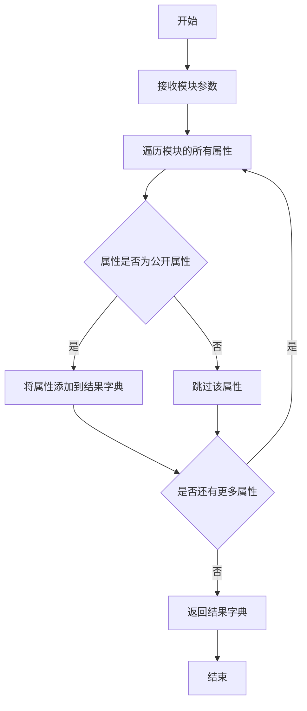
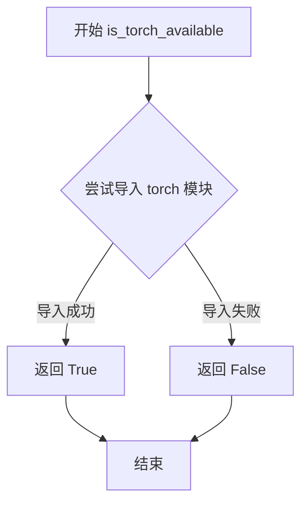
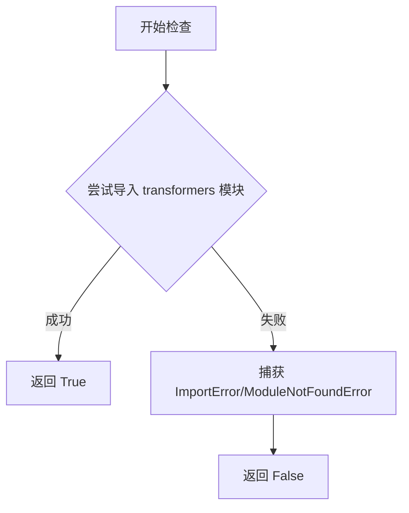

# `diffusers\src\diffusers\schedulers\deprecated\__init__.py` 详细设计文档

这是一个懒加载模块初始化文件，用于条件导入diffusers库中的调度器（schedulers），通过_LazyModule实现可选依赖项（PyTorch和transformers）的延迟加载，并处理OptionalDependencyNotAvailable异常情况。

## 整体流程

```mermaid
graph TD
    A[开始] --> B{是否为TYPE_CHECKING或DIFFUSERS_SLOW_IMPORT?}
    B -- 是 --> C{is_torch_available()?}
    C -- 否 --> D[导入dummy_pt_objects]
    C -- 是 --> E[导入KarrasVeScheduler和ScoreSdeVpScheduler]
    B -- 否 --> F[创建_LazyModule并注册到sys.modules]
    F --> G[遍历_dummy_objects并setattr到当前模块]
    D --> H[结束]
    E --> H
    G --> H
```

## 类结构

```
此文件为模块入口，不包含类定义
主要使用外部类：
_LazyModule (延迟加载模块类)
OptionalDependencyNotAvailable (可选依赖异常)
KarrasVeScheduler (Karras Ve调度器)
ScoreSdeVpScheduler (Score Sde Vp调度器)
```

## 全局变量及字段


### `_dummy_objects`
    
存储虚拟对象的字典，用于可选依赖不可用时提供替代对象

类型：`Dict[str, Any]`
    


### `_import_structure`
    
定义模块导入结构，映射子模块名称到其导出的类或函数名列表

类型：`Dict[str, List[str]]`
    


### `DIFFUSERS_SLOW_IMPORT`
    
控制是否使用慢速导入模式的标志，影响类型检查时的导入行为

类型：`bool`
    


### `__name__`
    
Python内置变量，存储当前模块的完全限定名称

类型：`str`
    


### `__file__`
    
Python内置变量，存储当前模块文件的绝对或相对路径

类型：`str`
    


### `__spec__`
    
Python内置变量，存储模块的导入规范，包含模块元数据信息

类型：`Optional[ModuleSpec]`
    


    

## 全局函数及方法


### `get_objects_from_module`

该函数是一个工具函数，用于从指定模块中提取所有可用的对象（变量、类、函数等），并将其作为字典返回。在扩散器库的导入结构设计中，它用于动态获取虚拟对象模块中的所有对象，以便在可选依赖不可用时进行延迟导入和模拟。

参数：

- `module`：`Module`，要从中提取对象的模块

返回值：`Dict[str, Any]`，返回模块中所有对象的字典，键为对象名称，值为对象本身

#### 流程图



#### 带注释源码

```python
# 注意：以下是根据代码使用方式推断的函数实现
# 实际实现位于 ...utils 模块中

def get_objects_from_module(module):
    """
    从给定模块中提取所有公开对象
    
    参数:
        module: 要提取对象的模块
        
    返回:
        包含模块中所有公开对象的字典
    """
    objects = {}
    # 遍历模块的所有属性
    for attr_name in dir(module):
        # 过滤掉私有属性（以_开头的属性）
        if not attr_name.startswith('_'):
            attr_value = getattr(module, attr_name)
            objects[attr_name] = attr_value
    return objects


# 在代码中的实际使用方式：
# _dummy_objects 是一个字典，用于存储虚拟/替代对象
# 当 torch 或 transformers 不可用时，使用此函数从 dummy_pt_objects 模块
# 获取虚拟对象，以便在代码中引用这些对象时不会抛出导入错误
_dummy_objects.update(get_objects_from_module(dummy_pt_objects))
```

---

### 补充信息

#### 1. 设计目标与约束

- **目标**：实现可选依赖的优雅降级，当 PyTorch 不可用时仍能导入模块结构
- **约束**：依赖于 `dir()` 和 `getattr()` 函数，需要模块中的对象是可访问的

#### 2. 在代码中的作用

该函数在当前文件中有两个主要用途：

1. **初始化虚拟对象**：`_dummy_objects.update(get_objects_from_module(dummy_pt_objects))` - 将虚拟对象模块中的所有对象添加到 `_dummy_objects` 字典中
2. **延迟导入准备**：配合 `_LazyModule` 实现条件导入，在运行时动态决定导入真实对象还是虚拟对象

#### 3. 外部依赖与接口契约

- **输入**：需要是一个有效的 Python 模块对象
- **输出**：返回字典，可直接用于 `dict.update()` 方法
- **依赖**：
  - `dummy_pt_objects`：虚拟对象模块，在 `OptionalDependencyNotAvailable` 异常时被导入
  - `OptionalDependencyNotAvailable`：异常类，用于标记可选依赖不可用


### `is_torch_available`

该函数是 `diffusers` 库中用于检查 PyTorch 是否可用的工具函数，通过尝试导入 `torch` 模块来判断环境是否安装了 PyTorch，返回布尔值以决定是否加载相关的 PyTorch 依赖模块。

参数：

- 无参数

返回值：`bool`，如果 PyTorch 可用返回 `True`，否则返回 `False`

#### 流程图



#### 带注释源码

```
# is_torch_available 函数的实现（在 ...utils 模块中定义）
# 此源码为推断实现，基于同类项目的常见模式

def is_torch_available() -> bool:
    """
    检查 PyTorch 是否在当前环境中可用。
    
    返回值:
        bool: 如果 torch 模块可以成功导入则返回 True，否则返回 False
    """
    try:
        import torch  # noqa: F401
        return True
    except ImportError:
        return False

# 在当前代码中的使用方式：
# 1. 条件检查：if not is_torch_available()
# 2. 与其他检查组合：is_transformers_available() and is_torch_available()
# 3. 用于决定是否导入可选依赖模块
```

#### 实际代码中的引用

```
# 在本文件中 is_torch_available 的使用场景：

# 场景1：组合检查两个依赖是否都可用
if not (is_transformers_available() and is_torch_available()):
    raise OptionalDependencyNotAvailable()

# 场景2：在 TYPE_CHECKING 块中检查单个依赖
if not is_torch_available():
    raise OptionalDependencyNotAvailable()

# 场景3：用于条件导入
# 如果 torch 可用，从当前包导入 KarrasVeScheduler 和 ScoreSdeVpScheduler
# 否则使用虚拟对象（_dummy_objects）
```

---

**注意**：由于 `is_torch_available` 是从 `...utils` 导入的外部函数，其完整源码定义不在当前文件内。上述源码是基于 `diffusers` 库常见实现模式的推断代码。实际实现通常位于 `src/diffusers/utils/__init__.py` 或类似的工具模块中，采用相同的 try-except 导入检查模式。


### `is_transformers_available`

该函数用于检查 `transformers` 库是否在当前环境中可用，通常通过尝试导入 `transformers` 模块来实现，返回布尔值。

参数：无需参数

返回值：`bool`，返回 `True` 表示 `transformers` 库可用，返回 `False` 表示不可用

#### 流程图



#### 带注释源码

```python
# 从上层utils模块导入is_transformers_available函数
# 该函数用于检测transformers库是否已安装且可用
from ...utils import (
    DIFFUSERS_SLOW_IMPORT,
    OptionalDependencyNotAvailable,
    _LazyModule,
    get_objects_from_module,
    is_torch_available,
    is_transformers_available,  # <-- 导入目标函数：检查transformers是否可用
)

# 初始化空的虚拟对象字典和导入结构
_dummy_objects = {}
_import_structure = {}

# 尝试导入：如果transformers和torch都不可用，则抛出OptionalDependencyNotAvailable
try:
    if not (is_transformers_available() and is_torch_available()):
        raise OptionalDependencyNotAvailable()
except OptionalDependencyNotAvailable:
    # 如果任一依赖不可用，导入虚拟对象用于延迟导入
    from ...utils import dummy_pt_objects  # noqa F403
    _dummy_objects.update(get_objects_from_module(dummy_pt_objects))
else:
    # 如果依赖都可用，定义实际的导入结构
    _import_structure["scheduling_karras_ve"] = ["KarrasVeScheduler"]
    _import_structure["scheduling_sde_vp"] = ["ScoreSdeVpScheduler"]

# TYPE_CHECKING或DIFFUSERS_SLOW_IMPORT模式下进行类型检查导入
if TYPE_CHECKING or DIFFUSERS_SLOW_IMPORT:
    try:
        if not is_torch_available():
            raise OptionalDependencyNotAvailable()
    except OptionalDependencyNotAvailable:
        from ...utils.dummy_pt_objects import *  # noqa F403
    else:
        from .scheduling_karras_ve import KarrasVeScheduler
        from .scheduling_sde_vp import ScoreSdeVpScheduler
else:
    # 运行时使用LazyModule进行延迟加载
    import sys
    sys.modules[__name__] = _LazyModule(
        __name__,
        globals()["__file__"],
        _import_structure,
        module_spec=__spec__,
    )
    # 将虚拟对象注入到当前模块
    for name, value in _dummy_objects.items():
        setattr(sys.modules[__name__], name, value)
```


### setattr (内置函数)

setattr 是 Python 的内置函数，用于动态设置对象的属性值。在此代码中，它被用于将虚拟对象（dummy objects）动态绑定到模块的命名空间。

参数：

- `obj`：`object`，目标对象，这里是 `sys.modules[__name__]`，表示当前模块对象
- `name`：`str`，要设置的属性名称，这里是 `_dummy_objects` 字典中的键（如 "KarrasVeScheduler"）
- `value`：任意类型，要设置的属性值，这里是 `_dummy_objects` 字典中对应的虚拟对象

返回值：`None`，setattr 没有返回值（返回 None）

#### 流程图

```mermaid
flowchart TD
    A[开始] --> B{_dummy_objects 是否有内容?}
    B -->|是| C[遍历 _dummy_objects 字典]
    B -->|否| D[结束]
    C --> E[获取键值对 name, value]
    F[调用 setattr<br/>obj=sys.modules[__name__<br/>name=name<br/>value=value] --> G{设置成功?}
    G -->|是| H[将虚拟对象绑定到模块属性]
    G -->|否| I[抛出 AttributeError]
    H --> C
    I --> J[异常处理]
    C --> D
```

#### 带注释源码

```python
# 遍历 _dummy_objects 字典中的所有虚拟对象
for name, value in _dummy_objects.items():
    # 使用 setattr 将虚拟对象动态绑定到当前模块
    # 参数说明：
    # - sys.modules[__name__]: 当前模块对象
    # - name: 虚拟对象的名称（字符串）
    # - value: 虚拟对象本身（用于在依赖不可用时替代真实类）
    setattr(sys.modules[__name__], name, value)
```

## 关键组件


### 延迟加载模块（Lazy Module）

使用`_LazyModule`实现模块的延迟加载机制，只有在实际需要时才加载具体模块，优化启动性能和避免循环依赖

### 可选依赖处理机制

通过`OptionalDependencyNotAvailable`异常和`dummy_pt_objects`虚拟对象实现优雅的可选依赖降级处理，确保在缺少torch或transformers时模块仍可导入

### 调度器组件 - KarrasVeScheduler

Karras方差保持（Karras Ve）调度器，用于扩散模型的噪声调度

### 调度器组件 - ScoreSdeVpScheduler

Score随机微分方程方差保持（Score SDE VP）调度器，结合SDE方法和方差保持技术的扩散模型调度器

### 依赖检查函数

`is_torch_available()`和`is_transformers_available()`分别检查torch和transformers库的可用性，作为模块加载的前提条件判断

### 导入结构字典

`_import_structure`字典定义模块的导入结构，映射子模块路径到可导出的类名列表，支持延迟导入机制

### 模块规范与虚拟对象

使用`__spec__`保持模块规范完整性，通过`_dummy_objects`和`get_objects_from_module`动态设置虚拟对象以维持API一致性


## 问题及建议


### 已知问题

- **异常处理逻辑重复**：在 `try-except` 块和 `TYPE_CHECKING` 块中重复了相同 `is_torch_available()` 和 `is_transformers_available()` 的检查逻辑，导致代码冗余
- **硬编码的导入结构**：`_import_structure` 字典中的调度器名称作为字符串字面量硬编码，新增调度器需要手动修改，增加维护成本且容易出错
- **全局变量缺乏封装**：`_dummy_objects` 和 `_import_structure` 作为模块级全局变量，缺乏访问控制，外部代码可能意外修改
- **静默失败机制**：当可选依赖不可用时，模块静默导入 dummy 对象，未向用户发出任何警告或提示，可能导致运行时行为与预期不符
- **类型注解不完整**：`_import_structure` 字典的具体类型注解缺失，`_dummy_objects` 的类型也不明确，影响代码可读性和 IDE 支持
- **导入路径耦合**：调度器的相对导入路径（`.scheduling_karras_ve`）与字符串键名耦合，如果重构文件结构需要同步修改多处

### 优化建议

- **提取依赖检查逻辑**：将依赖可用性检查封装为独立函数，避免在多处重复相同的条件判断
- **引入配置驱动机制**：使用配置文件或装饰器自动扫描并生成 `_import_structure`，减少手动维护工作
- **添加日志或警告**：在依赖不可用时记录警告日志，提醒开发者当前使用的功能为 mock 实现
- **完善类型注解**：为 `_import_structure` 和 `_dummy_objects` 添加明确的类型注解（`Dict[str, List[str]]` 等）
- **使用枚举或常量**：将调度器名称定义为常量或枚举，避免字符串字面量导致的拼写错误


## 其它


### 设计目标与约束

本模块采用懒加载机制，主要目标是在Diffusers库中动态导入可选依赖（PyTorch和Transformers）的调度器实现。设计约束包括：1）必须支持Python的类型检查（TYPE_CHECKING）；2）需要在依赖不可用时提供虚拟对象（dummy objects）以保持模块结构一致性；3）遵循Diffusers库的_lazy loading模式以优化导入性能。

### 错误处理与异常设计

本模块主要通过OptionalDependencyNotAvailable异常处理可选依赖的缺失。当is_transformers_available()或is_torch_available()返回False时，抛出OptionalDependencyNotAvailable并从dummy_pt_objects模块加载虚拟对象。异常处理采用try-except块，在DIFFUSERS_SLOW_IMPORT为True或TYPE_CHECKING模式下进行条件导入，确保在不同环境下都能正确处理依赖缺失情况。

### 数据流与状态机

模块的数据流主要分为两条路径：1）当依赖可用时，将实际模块路径（如"scheduling_karras_ve"）添加到_import_structure字典；2）当依赖不可用时，将虚拟对象添加到_dummy_objects字典。状态转换由is_transformers_available()和is_torch_available()的返回值决定，最终通过_LazyModule实现运行时动态加载。

### 外部依赖与接口契约

本模块依赖以下外部组件：1）diffusers.utils模块中的LazyModule、OptionalDependencyNotAvailable、get_objects_from_module等工具类；2）is_torch_available()和is_transformers_available()函数用于检测PyTorch和Transformers的可用性；3）dummy_pt_objects模块提供依赖缺失时的虚拟对象；4）scheduling_karras_ve和scheduling_sde_vp子模块（当依赖可用时）。接口契约规定导出的公共API为KarrasVeScheduler和ScoreSdeVpScheduler两个类。

### 性能考虑

本模块的性能优化主要体现在懒加载机制：1）只有在实际使用时才导入重型依赖（PyTorch和Transformers）；2）通过_import_structure字典预先注册模块结构，避免运行时频繁查询；3）_dummy_objects在依赖不可用时一次性设置，避免后续重复检查。模块初始化时间复杂度为O(n)，其中n为_import_structure中的模块数量。

### 版本兼容性

本模块设计支持Python 3.7+和Diffusers库0.x版本系列。TYPE_CHECKING分支确保静态类型检查工具（如mypy、pyright）能够正确识别类型信息。模块通过条件导入兼容PyTorch 1.x/2.x和Transformers 4.x系列版本。

### 配置说明

本模块无显式配置文件，依赖关系通过代码中的条件判断动态决定。主要配置项包括：DIFFUSERS_SLOW_IMPORT环境变量（控制是否启用完整导入模式）、TYPE_CHECKING常量（用于IDE类型检查）。这些配置通常由上层调用者或Diffusers库的统一入口设置。

    