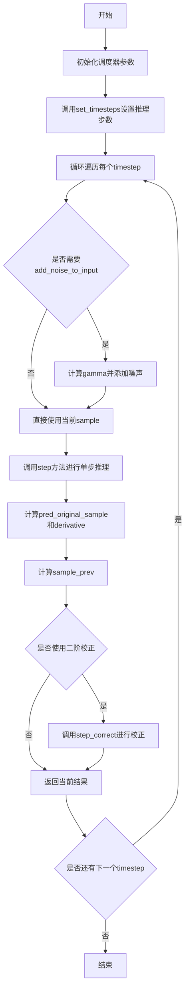
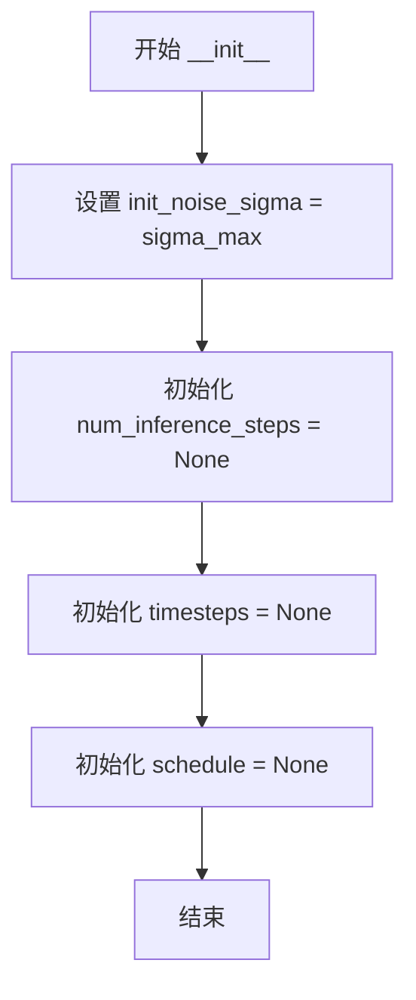
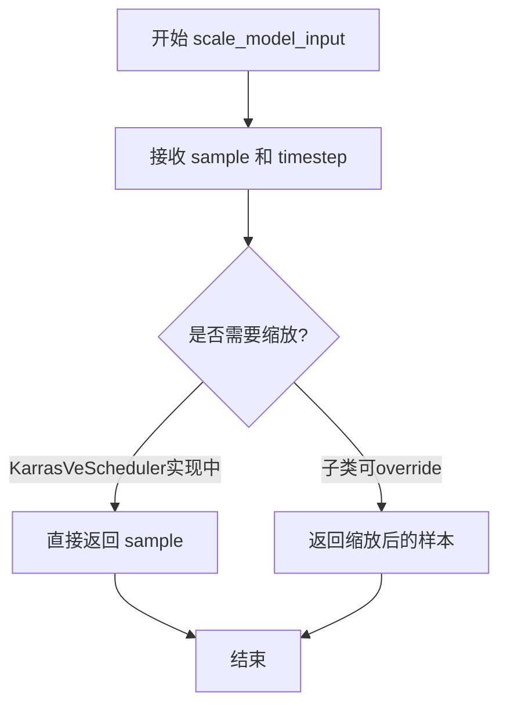
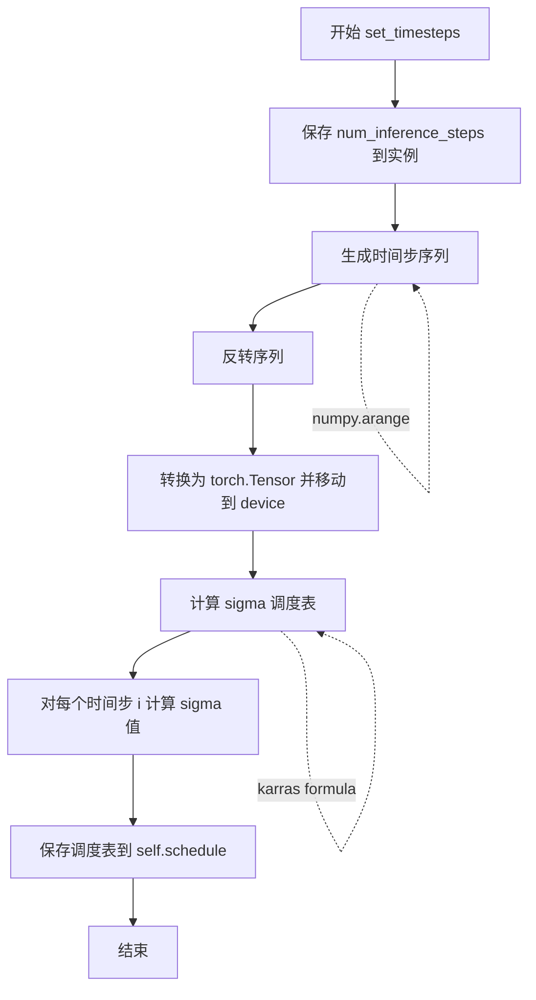
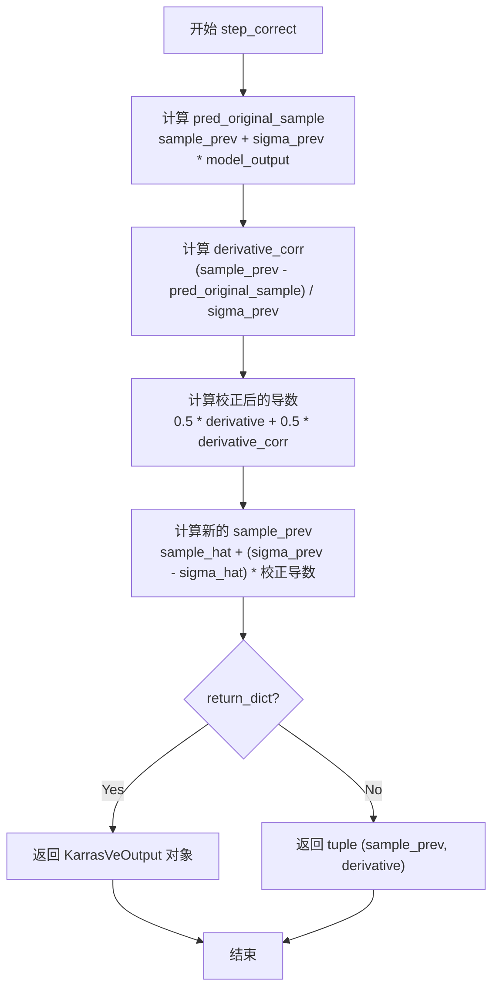
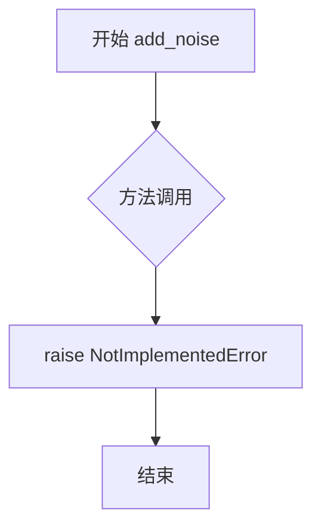

# `diffusers\src\diffusers\schedulers\deprecated\scheduling_karras_ve.py` 详细设计文档

这是一个Karras方差扩展(Variance Exploding)噪声调度器的实现，用于扩散模型的采样过程。该调度器通过SDE（随机微分方程）反向过程预测前一个时间步的样本，支持噪声churning技术来提高采样质量。

## 整体流程



## 类结构

```
BaseOutput (数据基类)
└── KarrasVeOutput (调度器输出数据类)
SchedulerMixin (调度器混入基类)
ConfigMixin (配置混入基类)
└── KarrasVeScheduler (Karras VE调度器实现)
```

## 全局变量及字段


### `sigma_min`
    
最小噪声幅度

类型：`float`
    


### `sigma_max`
    
最大噪声幅度

类型：`float`
    


### `s_noise`
    
额外噪声量，用于补偿采样过程中细节损失

类型：`float`
    


### `s_churn`
    
控制随机性整体水平的参数

类型：`float`
    


### `s_min`
    
sigma范围起始值，用于启用随机性

类型：`float`
    


### `s_max`
    
sigma范围结束值

类型：`float`
    


### `KarrasVeOutput.prev_sample`
    
计算出的前一个时间步的样本

类型：`torch.Tensor`
    


### `KarrasVeOutput.derivative`
    
预测原始图像样本的导数

类型：`torch.Tensor`
    


### `KarrasVeOutput.pred_original_sample`
    
去噪后的预测样本

类型：`torch.Tensor | None`
    


### `KarrasVeScheduler.order`
    
调度器的阶数

类型：`int`
    


### `KarrasVeScheduler.init_noise_sigma`
    
初始噪声分布的标准差

类型：`float`
    


### `KarrasVeScheduler.num_inference_steps`
    
推理步数

类型：`int`
    


### `KarrasVeScheduler.timesteps`
    
时间步数组

类型：`np.IntTensor`
    


### `KarrasVeScheduler.schedule`
    
sigma(t_i)调度表

类型：`torch.Tensor`
    
    

## 全局函数及方法


### KarrasVeScheduler.__init__

这是 KarrasVeScheduler 类的构造函数，用于初始化方差扩展（variance-expanding）模型的随机调度器。该方法设置噪声调度器的关键参数，包括噪声的最小/最大值、噪声乘数、随机性控制参数等，并初始化可设置的运行状态。

参数：

- `sigma_min`：`float`，默认值 0.02，最小噪声幅度
- `sigma_max`：`float`，默认值 100，最大噪声幅度
- `s_noise`：`float`，默认值 1.007，用于抵消采样过程中细节损失的额外噪声量，合理范围为 [1.000, 1.011]
- `s_churn`：`float`，默认值 80，控制整体随机性水平的参数，合理范围为 [0, 100]
- `s_min`：`float`，默认值 0.05，添加噪声的 sigma 范围起始值（启用随机性），合理范围为 [0, 10]
- `s_max`：`float`，默认值 50，添加噪声的 sigma 范围结束值，合理范围为 [0.2, 80]

返回值：`None`，构造函数不返回值

#### 流程图



#### 带注释源码

```python
@register_to_config
def __init__(
    self,
    sigma_min: float = 0.02,    # 最小噪声幅度，控制扩散过程中噪声的下限
    sigma_max: float = 100,    # 最大噪声幅度，控制扩散过程中噪声的上限
    s_noise: float = 1.007,    # 噪声乘数，用于在采样时注入额外噪声以保持细节
    s_churn: float = 80,       # 随机性强度参数，控制 Langevin-like churn 步骤的程度
    s_min: float = 0.05,       # 启用随机性的 sigma 下界，低于此值不添加噪声
    s_max: float = 50,         # 启用随机性的 sigma 上界，高于此值不添加噪声
):
    # 设置初始噪声分布的标准差
    # 这是扩散过程的起点，通常使用最大的 sigma 值
    self.init_noise_sigma = sigma_max

    # 以下是可设置的运行状态，在实际推理前需要通过 set_timesteps 方法初始化
    self.num_inference_steps: int = None  # 推理时的扩散步骤数
    self.timesteps: np.IntTensor = None    # 离散的时间步序列
    self.schedule: torch.Tensor = None    # 对应的 sigma(t_i) 值序列
```


### `KarrasVeScheduler.scale_model_input`

该方法确保与需要根据当前时间步缩放去噪模型输入的调度器之间的互操作性。在 KarrasVeScheduler 中，此方法直接返回输入样本，未进行任何实际缩放操作，这是一个占位符实现，允许子类在需要时进行自定义缩放处理。

参数：

- `sample`：`torch.Tensor`，输入样本
- `timestep`：`int`（可选），扩散链中的当前时间步

返回值：`torch.Tensor`，缩放后的输入样本

#### 流程图



#### 带注释源码

```python
def scale_model_input(self, sample: torch.Tensor, timestep: int = None) -> torch.Tensor:
    """
    Ensures interchangeability with schedulers that need to scale the denoising model input depending on the
    current timestep.
    # 确保与需要根据当前时间步缩放去噪模型输入的调度器之间的互操作性

    Args:
        sample (`torch.Tensor`):
            The input sample.
            # 输入样本
        timestep (`int`, *optional*):
            The current timestep in the diffusion chain.
            # 扩散链中的当前时间步

    Returns:
        `torch.Tensor`:
            A scaled input sample.
            # 缩放后的输入样本
    """
    # 在KarrasVeScheduler中，此方法直接返回原始样本，未做任何缩放处理
    # 这是一个占位符实现，为需要实际缩放功能的调度器提供接口一致性
    return sample
```


### `KarrasVeScheduler.set_timesteps`

该方法用于设置扩散链中使用的离散时间步，在推理前调用。它根据指定的推理步数生成时间步序列，并基于 Karras 方差扩展调度策略计算对应的 sigma 值调度表。

参数：

- `num_inference_steps`：`int`，扩散推理步数，即生成样本时使用的去噪迭代次数
- `device`：`str | torch.device`，时间步和调度表要移动到的目标设备，如果为 `None` 则不移动

返回值：`None`，该方法直接修改调度器内部状态，不返回任何值

#### 流程图



#### 带注释源码

```python
def set_timesteps(self, num_inference_steps: int, device: str | torch.device = None):
    """
    Sets the discrete timesteps used for the diffusion chain (to be run before inference).

    Args:
        num_inference_steps (`int`):
            The number of diffusion steps used when generating samples with a pre-trained model.
        device (`str` or `torch.device`, *optional*):
            The device to which the timesteps should be moved to. If `None`, the timesteps are not moved.
    """
    # 1. 保存推理步数到实例变量，供其他方法（如 add_noise_to_input）使用
    self.num_inference_steps = num_inference_steps
    
    # 2. 生成从 0 到 num_inference_steps-1 的时间步序列，然后反转得到 [N-1, N-2, ..., 0]
    #    这符合扩散模型的通常约定：从高噪声时间步开始，逐步降低噪声
    timesteps = np.arange(0, self.num_inference_steps)[::-1].copy()
    
    # 3. 将 numpy 数组转换为 PyTorch Tensor，并移动到指定设备
    self.timesteps = torch.from_numpy(timesteps).to(device)
    
    # 4. 根据 Karras 论文中的方差扩展调度策略计算 sigma 值
    #    公式: sigma_i^2 = sigma_max^2 * (sigma_min^2 / sigma_max^2)^(i / (N-1))
    #    这创建了从 sigma_max 到 sigma_min 的对数线性间隔序列
    schedule = [
        (
            self.config.sigma_max**2  # sigma_max^2
            * (self.config.sigma_min**2 / self.config.sigma_max**2) ** (i / (num_inference_steps - 1))
            # 指数衰减因子：(sigma_min^2 / sigma_max^2)^(i / (N-1))
        )
        for i in self.timesteps  # 对每个时间步计算对应的 sigma 值
    ]
    
    # 5. 将 schedule 列表转换为 PyTorch Tensor，指定 float32 类型和目标设备
    self.schedule = torch.tensor(schedule, dtype=torch.float32, device=device)
```


### `KarrasVeScheduler.add_noise_to_input`

该函数实现了一种显式的 Langevin 式"churn"步骤，根据 gamma_i >= 0 向样本添加噪声，将噪声水平从 sigma 提升到 sigma_hat。这是 Karras 方差扩展调度器的核心组件，用于在采样过程中引入受控的随机性。

参数：

- `sample`：`torch.Tensor`，输入样本
- `sigma`：`float`，当前噪声水平（sigma 值）
- `generator`：`torch.Generator | None`，可选的随机数生成器

返回值：`tuple[torch.Tensor, float]`，返回加噪后的样本 sample_hat 和更新后的噪声水平 sigma_hat

#### 流程图

```mermaid
flowchart TD
    A[开始 add_noise_to_input] --> B{检查 sigma 是否在 [s_min, s_max] 范围内}
    B -->|是| C[gamma = min(s_churn / num_inference_steps, 2^0.5 - 1)]
    B -->|否| D[gamma = 0]
    C --> E[生成随机噪声 eps ~ N(0, s_noise^2 * I)]
    D --> E
    E --> F[计算 sigma_hat = sigma + gamma * sigma]
    F --> G[计算 sample_hat = sample + sqrt(sigma_hat^2 - sigma^2) * eps]
    G --> H[返回 sample_hat 和 sigma_hat]
```

#### 带注释源码

```python
def add_noise_to_input(
    self, sample: torch.Tensor, sigma: float, generator: torch.Generator | None = None
) -> tuple[torch.Tensor, float]:
    """
    Explicit Langevin-like "churn" step of adding noise to the sample according to a `gamma_i ≥ 0` to reach a
    higher noise level `sigma_hat = sigma_i + gamma_i*sigma_i`.

    Args:
        sample (`torch.Tensor`):
            The input sample.
        sigma (`float`):
        generator (`torch.Generator`, *optional*):
            A random number generator.
    """
    # 根据 sigma 是否在配置的 [s_min, s_max] 范围内计算 gamma 值
    # gamma 控制随机性的程度，受 s_churn 和推理步数限制
    if self.config.s_min <= sigma <= self.config.s_config.s_max:
        gamma = min(self.config.s_churn / self.num_inference_steps, 2**0.5 - 1)
    else:
        gamma = 0

    # 从均值为0、标准差为 s_noise 的正态分布中采样噪声
    # 使用 randn_tensor 生成与 sample 相同形状的随机噪声
    eps = self.config.s_noise * randn_tensor(sample.shape, generator=generator).to(sample.device)
    
    # 计算提升后的噪声水平 sigma_hat
    sigma_hat = sigma + gamma * sigma
    
    # 根据 Karras 论文公式，将噪声添加到样本中
    # 使用 sigma_hat 和 sigma 的差值来控制噪声强度
    sample_hat = sample + ((sigma_hat**2 - sigma**2) ** 0.5 * eps)

    # 返回加噪后的样本和新的噪声水平
    return sample_hat, sigma_hat
```


### `KarrasVeScheduler.step`

该方法是 Karras 方差扩展调度器的核心步骤函数，通过逆转 SDE（随机微分方程）来预测前一个时间步的样本。它接收当前时间步的模型输出、噪声水平和样本，计算预测的原始图像样本、导数以及前一个时间步的样本，并根据参数决定返回字典还是元组形式的结果。

参数：

- `model_output`：`torch.Tensor`，学习到的扩散模型的直接输出，通常是预测的噪声
- `sigma_hat`：`float`，当前时间步的噪声水平（sigma）
- `sigma_prev`：`float`，前一个时间步的噪声水平
- `sample_hat`：`torch.Tensor`，当前时间步的样本（可能已添加噪声）
- `return_dict`：`bool`，可选参数，默认为 `True`，决定是否返回 `KarrasVeOutput` 字典还是元组

返回值：`KarrasVeOutput | tuple`，如果 `return_dict` 为 `True`，返回包含 `prev_sample`、`derivative` 和 `pred_original_sample` 的 `KarrasVeOutput` 对象；否则返回包含样本张量和导数的元组

#### 流程图

```mermaid
flowchart TD
    A[step 方法开始] --> B[计算 pred_original_sample<br/>sample_hat + sigma_hat * model_output]
    B --> C[计算 derivative<br/>(sample_hat - pred_original_sample) / sigma_hat]
    C --> D[计算 sample_prev<br/>sample_hat + (sigma_prev - sigma_hat) * derivative]
    D --> E{return_dict?}
    E -->|True| F[返回 KarrasVeOutput 对象<br/>prev_sample, derivative, pred_original_sample]
    E -->|False| G[返回 tuple<br/>(sample_prev, derivative)]
    F --> H[结束]
    G --> H
```

#### 带注释源码

```python
def step(
    self,
    model_output: torch.Tensor,
    sigma_hat: float,
    sigma_prev: float,
    sample_hat: torch.Tensor,
    return_dict: bool = True,
) -> KarrasVeOutput | tuple:
    """
    Predict the sample from the previous timestep by reversing the SDE. This function propagates the diffusion
    process from the learned model outputs (most often the predicted noise).

    Args:
        model_output (`torch.Tensor`):
            The direct output from learned diffusion model.
        sigma_hat (`float`):
        sigma_prev (`float`):
        sample_hat (`torch.Tensor`):
        return_dict (`bool`, *optional*, defaults to `True`):
            Whether or not to return a [`~schedulers.scheduling_karras_ve.KarrasVESchedulerOutput`] or `tuple`.

    Returns:
        [`~schedulers.scheduling_karras_ve.KarrasVESchedulerOutput`] or `tuple`:
            If return_dict is `True`, [`~schedulers.scheduling_karras_ve.KarrasVESchedulerOutput`] is returned,
            otherwise a tuple is returned where the first element is the sample tensor.

    """

    # 第一步：根据模型输出预测原始无噪声样本 x_0
    # 公式：x_0 = x_t + σ_t * ε_pred
    # 其中 model_output 是预测的噪声 ε_pred
    pred_original_sample = sample_hat + sigma_hat * model_output
    
    # 第二步：计算导数（用于下一步的积分）
    # 导数表示样本相对于 sigma 的变化率
    # 公式：d/dσ (x) = (x_t - x_0) / σ_t
    derivative = (sample_hat - pred_original_sample) / sigma_hat
    
    # 第三步：通过欧拉方法计算前一个时间步的样本 x_{t-1}
    # 公式：x_{t-1} = x_t + (σ_{t-1} - σ_t) * d/dσ (x)
    sample_prev = sample_hat + (sigma_prev - sigma_hat) * derivative

    # 根据 return_dict 参数决定返回格式
    if not return_dict:
        # 返回元组形式：(prev_sample, derivative)
        return (sample_prev, derivative)

    # 返回 KarrasVeOutput 数据类对象
    return KarrasVeOutput(
        prev_sample=sample_prev, 
        derivative=derivative, 
        pred_original_sample=pred_original_sample
    )
```


### KarrasVeScheduler.step_correct

该方法是 KarrasVeScheduler 类中的二阶校正步骤，用于在方差扩展（Variance Expanding）扩散模型的采样过程中对预测样本进行校正。它基于当前步骤的导数和模型输出计算校正后的导数，然后使用梯形积分法（0.5 * derivative + 0.5 * derivative_corr）来更新样本，从而提高采样精度。

参数：

- `self`：KarrasVeScheduler 实例本身
- `model_output`：`torch.Tensor`，来自学习到的扩散模型的直接输出（通常是预测的噪声）
- `sigma_hat`：`float`，当前时间步的噪声标准差
- `sigma_prev`：`float`，上一时间步的噪声标准差
- `sample_hat`：`torch.Tensor`，当前时间步经过噪声增加（churn）后的样本
- `sample_prev`：`torch.Tensor`，上一时间步的样本
- `derivative`：`torch.Tensor`，当前时间步计算的导数（d(sample)/d(sigma)）
- `return_dict`：`bool`，是否返回 KarrasVeOutput 对象，默认为 True

返回值：`KarrasVeOutput | tuple`，如果 return_dict 为 True 返回 KarrasVeOutput 对象，包含 prev_sample（更新后的样本）、derivative（当前导数）、pred_original_sample（预测的原始样本）；否则返回元组 (sample_prev, derivative)

#### 流程图



#### 带注释源码

```python
def step_correct(
    self,
    model_output: torch.Tensor,
    sigma_hat: float,
    sigma_prev: float,
    sample_hat: torch.Tensor,
    sample_prev: torch.Tensor,
    derivative: torch.Tensor,
    return_dict: bool = True,
) -> KarrasVeOutput | tuple:
    """
    Corrects the predicted sample based on the `model_output` of the network.

    This method performs a second-order correction to improve the sampling accuracy
    for Karras variance-expanding scheduler. It uses the trapezoidal integration
    method combining the derivative from the current step and the corrected derivative.

    Args:
        model_output (`torch.Tensor`):
            The direct output from learned diffusion model (predicted noise).
        sigma_hat (`float`):
            The current timestep's noise standard deviation (sigma).
        sigma_prev (`float`):
            The previous timestep's noise standard deviation.
        sample_hat (`torch.Tensor`):
            The current sample after the "churn" step (noise addition).
        sample_prev (`torch.Tensor`):
            The sample from the previous timestep.
        derivative (`torch.Tensor`):
            The derivative computed at the current timestep.
        return_dict (`bool`, *optional*, defaults to `True`):
            Whether or not to return a [`~schedulers.scheduling_karras_ve.KarrasVeOutput`] or `tuple`.

    Returns:
        `KarrasVeOutput` or `tuple`:
            If return_dict is `True`, returns a `KarrasVeOutput` containing:
                - prev_sample: The corrected sample for the previous timestep
                - derivative: The current derivative
                - pred_original_sample: The predicted original (denoised) sample
            Otherwise returns a tuple of (sample_prev, derivative).

    """
    # Step 1: Predict the original (denoised) sample using the model output
    # Formula: x_0 = x_t + sigma_t * epsilon
    # where epsilon is the predicted noise (model_output)
    pred_original_sample = sample_prev + sigma_prev * model_output
    
    # Step 2: Compute the corrected derivative at sigma_prev
    # This represents the slope d(x)/d(sigma) at the previous sigma value
    derivative_corr = (sample_prev - pred_original_sample) / sigma_prev
    
    # Step 3: Compute the corrected sample using trapezoidal integration
    # Combines current derivative and corrected derivative for better accuracy
    # Uses weighted average: 0.5 * current + 0.5 * corrected
    sample_prev = sample_hat + (sigma_prev - sigma_hat) * (0.5 * derivative + 0.5 * derivative_corr)

    # Step 4: Return the result based on return_dict flag
    if not return_dict:
        # Return as tuple for backward compatibility
        return (sample_prev, derivative)

    # Return as KarrasVeOutput dataclass for better readability
    return KarrasVeOutput(
        prev_sample=sample_prev, 
        derivative=derivative, 
        pred_original_sample=pred_original_sample
    )
```


### `KarrasVeScheduler.add_noise`

该方法用于在扩散模型的逆采样过程中向原始样本添加噪声，是实现 Karras 方差扩展调度器的关键步骤。然而，当前版本中此方法尚未实现，调用时会抛出 `NotImplementedError` 异常。

参数：

- `original_samples`：未指定类型，原采样数据，即需要添加噪声的原始图像或潜在表示
- `noise`：未指定类型，高斯噪声，用于添加到原始样本
- `timesteps`：未指定类型，扩散过程中的时间步，决定噪声的添加程度

返回值：`NotImplementedError`，当前版本未实现此方法

#### 流程图



#### 带注释源码

```python
def add_noise(self, original_samples, noise, timesteps):
    """
    向原始样本添加噪声。

    该方法是 KarrasVeScheduler 调度器的核心功能之一，用于在扩散模型的
    逆采样过程中根据给定的时间步将噪声添加到原始样本中。

    参数:
        original_samples: 原始样本张量，通常是图像或潜在表示
        noise: 要添加的高斯噪声张量
        timesteps: 时间步索引，用于确定噪声的强度

    返回:
        NotImplementedError: 该方法当前未实现

    注意:
        - 这是扩散模型采样流程中的关键步骤
        - 类似的噪声添加逻辑可在其他调度器如 DDIMScheduler、PNDMScheduler 中找到参考实现
        - 该方法需要根据 Karras 论文中的方差扩展策略实现
    """
    raise NotImplementedError()
```

---

**注意**：由于该方法未实现，以下是其他调度器中 `add_noise` 方法的典型实现逻辑供参考（以 `DDPMScheduler` 为例）：

```python
# 典型实现逻辑参考
def add_noise(self, original_samples, noise, timesteps):
    # 1. 获取给定时间步的平方根alpha_cumprod
    sqrt_alpha_prod = self.sqrta[timesteps]
    sqrt_one_minus_alpha_prod = self.sqrt_one_minus_alpha_prod[timesteps]

    # 2. 根据扩散公式添加噪声: x_t = sqrt(alpha_cumprod) * x_0 + sqrt(1 - alpha_cumprod) * epsilon
    noisy_samples = sqrt_alpha_prod * original_samples + sqrt_one_minus_alpha_prod * noise
    
    return noisy_samples
```

## 关键组件


### KarrasVeOutput

用于存储调度器step函数输出的数据结构，包含前一时刻的计算样本、导数、以及预测的原始样本

### KarrasVeScheduler

方差扩展（Variance Exploding）随机调度器实现，用于Karras VE扩散模型的噪声调度，包含sigma参数控制和churn噪声添加机制

### set_timesteps 方法

设置扩散链的离散时间步，生成从num_inference_steps-1到0的时间序列，并计算对应的sigma_schedule

### add_noise_to_input 方法

显式的Langevin风格"churn"步骤，根据gamma参数向样本添加噪声以达到更高的噪声水平sigma_hat

### step 方法

通过逆转随机微分方程（SDE）预测前一时刻的样本，基于模型输出的预测噪声计算导数并更新样本

### step_correct 方法

基于网络模型输出对预测样本进行校正，结合当前导数和校正后导数的加权平均来改进采样精度

### 关键参数

sigma_min/sigma_max（噪声幅度范围）、s_noise（额外噪声量）、s_churn（随机性控制参数）、s_min/s_max（噪声范围起止值）


## 问题及建议


### 已知问题

- **未实现的抽象方法**: `add_noise` 方法直接抛出 `NotImplementedError()`，这是 `SchedulerMixin` 基类要求的接口，导致该调度器无法用于训练场景
- **类型注解错误**: `self.timesteps: np.IntTensor` 使用了不存在的 numpy 类型 `np.IntTensor`，应为 `np.ndarray` 或 `np.int64`
- **参数文档缺失**: `step` 和 `step_correct` 方法中多个参数（sigma_hat、sigma_prev、sample_hat 等）缺少描述，只有 TODO 注释
- **返回值不一致错误**: `step_correct` 方法中返回的 `derivative` 应为 `derivative_corr`（修正后的导数），当前实现返回了旧的 derivative，逻辑错误
- **数值稳定性风险**: `add_noise_to_input` 中 `(sigma_hat**2 - sigma**2) ** 0.5` 在极端情况下可能因浮点精度产生负值导致 NaN
- **冗余计算**: `set_timesteps` 中 schedule 列表推导式每次都重新计算 sigma 值，未利用已生成的 timesteps 索引

### 优化建议

- 实现 `add_noise` 方法以支持训练阶段的噪声添加功能
- 修正类型注解为 `np.ndarray`，并统一使用 Python 3.10+ 的联合类型语法或 `Optional`/`Union`
- 补全所有公共方法的参数文档描述，移除 TODO 注释
- 修复 `step_correct` 的返回值，确保返回正确的 `derivative_corr`
- 添加数值稳定性保护，如使用 `max(sigma_hat**2 - sigma**2, 0) ** 0.5` 或 `torch.sqrt(F.relu(...))`
- 考虑将 schedule 计算优化为基于索引的向量化操作，减少循环开销
- 添加参数校验逻辑，确保 `sigma_min < sigma_max`、`s_min < s_max` 等约束成立
- 评估 `order = 2` 属性的实际用途，如未使用可移除以减少混淆


## 其它


### 设计目标与约束

本调度器实现Karras等人提出的方差扩展（Variance Expanding）采样算法，专门针对变分扩散模型进行优化。设计目标包括：1）提供可配置的噪声调度参数（sigma_min、sigma_max、s_noise、s_churn、s_min、s_max），支持不同模型的微调；2）实现2阶调度器（order=2），通过step和step_correct方法实现更精确的采样；3）遵循扩散库的统一接口规范（SchedulerMixin、ConfigMixin），确保与现有Diffusers库的兼容性。约束条件：仅支持连续时间噪声调度，不支持离散噪声调度；add_noise方法未实现（抛出NotImplementedError），仅用于推理不支持训练阶段的噪声添加。

### 错误处理与异常设计

代码中的错误处理机制较为有限，主要包括：1）NotImplementedError异常：add_noise方法明确抛出此异常，表明该调度器不支持训练阶段的噪声添加，这是设计决策而非缺陷；2）类型检查依赖：假设调用者传入正确类型的tensor和数值参数，未进行运行时类型验证；3）device处理：set_timesteps方法接受device参数但未进行显式验证，依赖PyTorch的隐式设备转换。改进建议：可在set_timesteps中添加num_inference_steps的正值校验；在step方法中添加sigma值的数值范围校验（sigma_hat > 0）；对tensor形状不匹配的情况添加明确的错误提示。

### 数据流与状态机

调度器的状态转换流程如下：1）初始化阶段（__init__）：设置sigma_min、sigma_max等配置参数，将init_noise_sigma设为sigma_max；2）准备阶段（set_timesteps）：根据num_inference_steps生成离散时间步timesteps数组（从num_inference_steps-1到0），计算对应的sigma schedule列表并转为torch.Tensor；3）推理阶段（step）：接收model_output、sigma_hat、sigma_prev、sample_hat，计算pred_original_sample = sample_hat + sigma_hat * model_output，计算导数derivative = (sample_hat - pred_original_sample) / sigma_hat，计算上一时刻样本sample_prev = sample_hat + (sigma_prev - sigma_hat) * derivative，返回KarrasVeOutput包含prev_sample、derivative、pred_original_sample；4）校正阶段（step_correct）：使用当前和前一步的导数进行加权平均，实现2阶精度提升。

### 外部依赖与接口契约

本模块依赖以下外部组件：1）torch和numpy：核心数值计算库；2）dataclasses.KarrasVeOutput：输出数据类，继承自BaseOutput；3）configuration_utils.ConfigMixin：配置混入类，提供注册和配置管理功能；4）configuration_utils.register_to_config装饰器：用于自动注册配置参数；5）utils.BaseOutput：基础输出类，定义输出数据结构；6）utils.torch_utils.randn_tensor：生成符合扩散模型需求的随机张量；7）scheduling_utils.SchedulerMixin：调度器混入类，定义调度器通用接口。接口契约：set_timesteps必须在推理前调用；step和step_correct的输入sigma值必须单调递增；sample_hat和model_output的形状必须一致；所有tensor应位于相同设备上。

### 性能考虑与优化空间

性能特点：1）调度器计算密集度较低，主要为向量运算和索引操作；2）schedule在set_timesteps中预先计算并缓存，避免重复计算；3）使用torch.tensor而非torch.from_tensor创建schedule，可能导致不必要的数据拷贝。优化建议：1）schedule可考虑使用torch.compile进行编译优化；2）step方法中的多次tensor运算可融合减少内存分配；3）对于大批量推理，可考虑将schedule移至GPU常量以加速；4）当前实现中derivatives在step和step_correct间传递，可考虑状态对象封装以提高代码清晰度。

### 并发与线程安全性

本调度器不是线程安全的：1）实例属性（num_inference_steps、timesteps、schedule）可被并发修改；2）无内部锁机制保护共享状态。使用约束：每个推理pipeline应使用独立的调度器实例；多线程环境下需自行实现线程局部存储（thread-local）或复制实例。当前实现符合单线程推理的典型使用场景。

### 版本兼容性说明

本代码基于Python 3.9+类型注解（使用str | torch.device、float | None等联合类型语法），要求Python 3.9及以上版本。使用torch.Tensor | None的Python 3.10+语法特性，需确认目标环境的Python版本。PyTorch版本建议1.8.0以上以支持完整的tensor操作。Diffusers库版本需0.10.0以上以支持ConfigMixin和SchedulerMixin的当前接口定义。

### 配置管理与序列化

配置通过@dataclass装饰器和register_to_config实现：1）所有__init__参数自动注册为配置项；2）支持to_dict()和from_dict()序列化；3）支持save_config()和from_pretrained()加载。配置参数sigma_min、sigma_max、s_noise、s_churn、s_min、s_max均提供默认值，建议通过预训练模型配置加载而非手动实例化。schedule和timesteps为运行时状态，不纳入配置序列化范围。

    