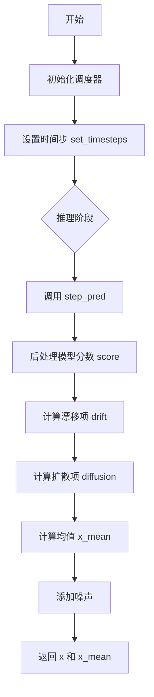
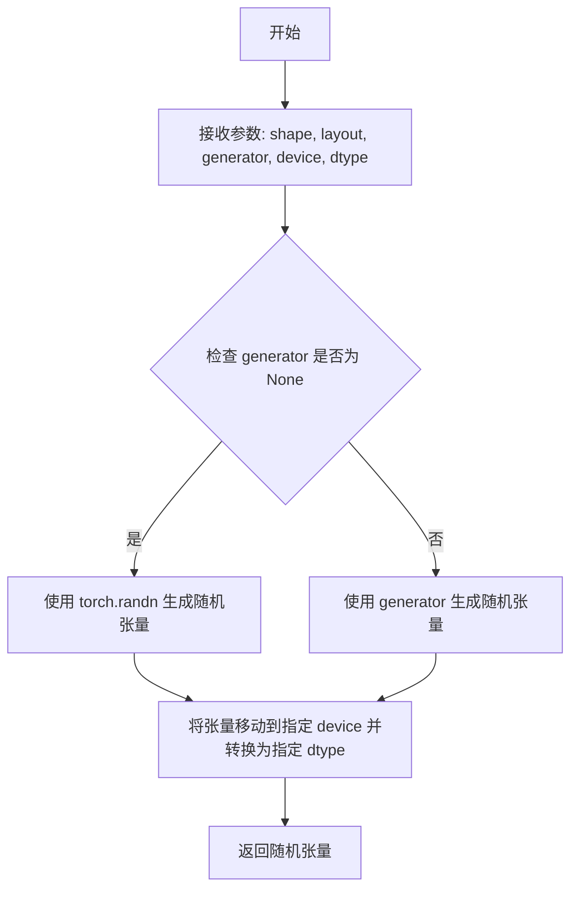
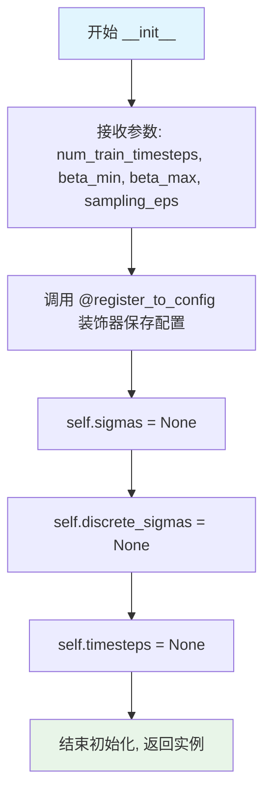
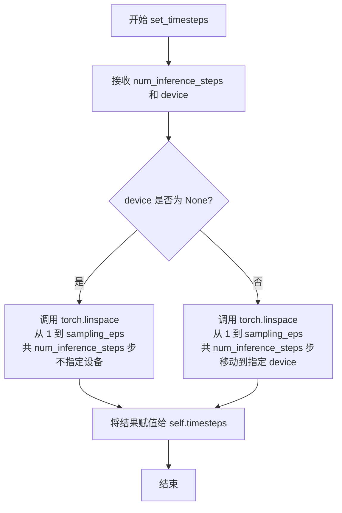
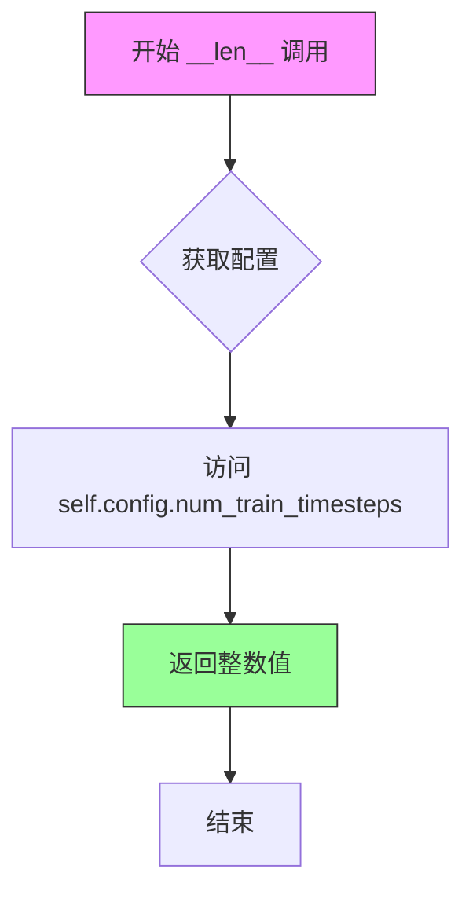

# `diffusers\src\diffusers\schedulers\deprecated\scheduling_sde_vp.py` 详细设计文档

ScoreSdeVpScheduler是一个方差保持的随机微分方程(SDE)调度器，用于扩散模型的采样过程。该调度器通过反转SDE来预测上一个时间步的样本，主要利用预测的噪声(score)来逆向扩散过程。

## 整体流程



## 类结构

```
SchedulerMixin (混入类)
ConfigMixin (配置混入类)
└── ScoreSdeVpScheduler (方差保持SDE调度器)
```

## 全局变量及字段


### `ScoreSdeVpScheduler.order`
    
调度器阶数

类型：`int`
    


### `ScoreSdeVpScheduler.sigmas`
    
方差数组

类型：`torch.Tensor`
    


### `ScoreSdeVpScheduler.discrete_sigmas`
    
离散方差数组

类型：`torch.Tensor`
    


### `ScoreSdeVpScheduler.timesteps`
    
时间步数组

类型：`torch.Tensor`
    
    

## 全局函数及方法


### `randn_tensor`

该函数是一个随机张量生成工具，用于生成符合正态分布的随机张量，支持指定形状、布局、设备和数据类型，并可选地使用随机数生成器以确保可重复性。

参数：

- `shape`：`torch.Size` 或 `tuple`，要生成的随机张量的形状。
- `layout`：`torch.layout`，张量的布局，默认为 `torch.strided`。
- `generator`：`torch.Generator`，可选的随机数生成器，用于生成随机数。
- `device`：`torch.device`，张量应放置的设备。
- `dtype`：`torch.dtype`，张量的数据类型。

返回值：`torch.Tensor`，符合指定形状、布局、设备和数据类型的随机张量。

#### 流程图



#### 带注释源码

```python
import torch

def randn_tensor(shape, layout=torch.strided, generator=None, device=None, dtype=None):
    """
    生成符合正态分布的随机张量。
    
    参数:
        shape (torch.Size 或 tuple): 要生成的随机张量的形状。
        layout (torch.layout, optional): 张量的布局，默认为 torch.strided。
        generator (torch.Generator, optional): 随机数生成器，用于生成可重复的随机数。
        device (torch.device, optional): 张量应放置的设备。
        dtype (torch.dtype, optional): 张量的数据类型。
    
    返回:
        torch.Tensor: 随机张量。
    """
    # 如果 device 和 dtype 未指定，默认使用 cpu 和 float32
    if device is None:
        device = torch.device('cpu')
    if dtype is None:
        dtype = torch.float32
    
    # 根据是否有 generator 选择生成方式
    if generator is not None:
        # 使用指定的生成器生成随机张量
        # 注意：torch.randn 不直接支持 generator 参数，但可以通过 torch.Generator 手动生成
        # 这里假设底层实现支持 generator
        tensor = torch.randn(shape, generator=generator, device=device, dtype=dtype)
    else:
        # 直接生成随机张量
        tensor = torch.randn(shape, device=device, dtype=dtyle)
    
    # 确保张量布局正确
    if layout != torch.strided:
        tensor = tensor.to(layout=layout)
    
    return tensor
```

注意：上述源码是基于常见实现的假设。实际的 `randn_tensor` 在 diffusers 库中可能有不同的实现，具体取决于库的版本和配置。由于代码中只导入了该函数而未提供定义，以上内容为根据其使用方式推断的合理实现。


### `ScoreSdeVpScheduler.__init__`

初始化 `ScoreSdeVpScheduler` 调度器实例，设置扩散模型训练的参数（时间步数、beta 范围、采样终止值），并初始化内部状态变量（sigmas、discrete_sigmas、timesteps）。

参数：

- `num_train_timesteps`：`int`，默认值 2000，扩散模型训练的步数
- `beta_min`：`float`，默认值 0.1，方差保持 SDE 中 beta 的最小值
- `beta_max`：`float`，默认值 20，方差保持 SDE 中 beta 的最大值
- `sampling_eps`：`float`，默认值 1e-3，采样的终止 epsilon 值，用于生成过程中的渐进式时间步衰减

返回值：`None`，`__init__` 方法不返回值，仅初始化实例状态

#### 流程图



#### 带注释源码

```python
@register_to_config
def __init__(self, num_train_timesteps=2000, beta_min=0.1, beta_max=20, sampling_eps=1e-3):
    """
    初始化 ScoreSdeVpScheduler 调度器。
    
    Args:
        num_train_timesteps (int, optional): 扩散模型训练的步数，默认 2000。
        beta_min (float, optional): 方差保持 SDE 中 beta 的最小值，默认 0.1。
        beta_max (float, optional): 方差保持 SDE 中 beta 的最大值，默认 20。
        sampling_eps (float, optional): 采样的终止 epsilon 值，默认 1e-3。
    """
    
    # 初始化 sigmas 变量，用于存储噪声标准差
    # 在后续 set_timesteps 中会被赋值为具体的 sigma 数组
    self.sigmas = None
    
    # 初始化离散化的 sigmas，用于离散时间步的噪声调度
    # 在后续计算中会被赋值为离散的 sigma 值数组
    self.discrete_sigmas = None
    
    # 初始化时间步数组，用于推理时的扩散链
    # 需要通过 set_timesteps 方法设置为具体的时间步序列
    self.timesteps = None
```


### `ScoreSdeVpScheduler.set_timesteps`

设置推理阶段使用的连续时间步，用于扩散链的采样过程。

参数：

- `num_inference_steps`：`int`，生成样本时使用的扩散步数
- `device`：`str | torch.device`，可选，时间步要移动到的设备。如果为 `None`，则不移动时间步

返回值：`None`，无返回值（该方法直接修改实例属性 `self.timesteps`）

#### 流程图



#### 带注释源码

```python
def set_timesteps(self, num_inference_steps, device: str | torch.device = None):
    """
    Sets the continuous timesteps used for the diffusion chain (to be run before inference).

    Args:
        num_inference_steps (`int`):
            The number of diffusion steps used when generating samples with a pre-trained model.
        device (`str` or `torch.device`, *optional*):
            The device to which the timesteps should be moved to. If `None`, the timesteps are not moved.
    """
    # 使用 torch.linspace 生成线性间隔的时间步
    # 从 1 开始，逐步降低到 sampling_eps (默认 1e-3)
    # 这些时间步将用于推理阶段的扩散过程
    self.timesteps = torch.linspace(1, self.config.sampling_eps, num_inference_steps, device=device)
```


### `ScoreSdeVpScheduler.step_pred`

执行一步预测，通过反转随机微分方程（SDE）将扩散过程从时间步 `t` 推进到 `t-1`。该函数利用模型预测的分数（score）来计算漂移（drift）和扩散（diffusion）项，从而推导出前一步的去噪样本及均值。

参数：

- `score`：`torch.Tensor`，模型预测的分数向量，通常由神经网络输出，用于指导去噪方向。
- `x`：`torch.Tensor`，当前时间步的样本（可以是图像 latent 或像素数据）。
- `t`：`torch.Tensor`，当前的时间步，值域通常在 [0, 1] 之间。
- `generator`：`torch.Generator`，*可选*，用于控制随机噪声生成器的 PyTorch 生成器对象。

返回值：`tuple[torch.Tensor, torch.Tensor]`
- `x`：添加了随机噪声的样本（包含随机性）。
- `x_mean`：预测的前一时间步的均值（不含随机性，纯确定性预测）。

#### 流程图

```mermaid
graph TD
    A([开始 step_pred]) --> B{self.timesteps 是否已设置?}
    B -- 否 --> C[抛出 ValueError]
    B -- 是 --> D[计算 log_mean_coeff 与标准差 std]
    D --> E[后处理模型分数: <br> score = -score / std]
    E --> F[计算时间步长 dt 与 beta_t]
    F --> G[计算漂移项 drift 与扩散系数 diffusion]
    G --> H[计算均值: x_mean = x + drift * dt]
    H --> I[生成随机噪声 noise]
    I --> J[计算最终样本: <br> x = x_mean + diffusion * sqrt(-dt) * noise]
    J --> K([返回 x, x_mean])
```

#### 带注释源码

```python
def step_pred(self, score, x, t, generator=None):
    """
    Predict the sample from the previous timestep by reversing the SDE. This function propagates the diffusion
    process from the learned model outputs (most often the predicted noise).

    Args:
        score (): 模型预测的分数。
        x (): 当前 timestep 的样本。
        t (): 当前时间步。
        generator (`torch.Generator`, *optional*):
            A random number generator.
    """
    # 1. 检查调度器是否已初始化时间步
    if self.timesteps is None:
        raise ValueError(
            "`self.timesteps` is not set, you need to run 'set_timesteps' after creating the scheduler"
        )

    # 2. 后处理模型分数 (Postprocess model score)
    # 计算对数均值系数，用于确定 SDE 的方差结构
    log_mean_coeff = -0.25 * t**2 * (self.config.beta_max - self.config.beta_min) - 0.5 * t * self.config.beta_min
    # 计算标准差 std = sqrt(1 - exp(2 * log_mean_coeff))
    std = torch.sqrt(1.0 - torch.exp(2.0 * log_mean_coeff))
    std = std.flatten()
    # 扩展 std 的维度以匹配 score 的维度，支持批量处理
    while len(std.shape) < len(score.shape):
        std = std.unsqueeze(-1)
    # 根据 Score SDE 理论调整分数权重：score = -score / std
    score = -score / std

    # 3. 计算 SDE 离散化的时间步长
    dt = -1.0 / len(self.timesteps)

    # 4. 计算漂移项 (Drift)
    # beta_t 线性插值从 beta_min 到 beta_max
    beta_t = self.config.beta_min + t * (self.config.beta_max - self.config.beta_min)
    beta_t = beta_t.flatten()
    # 扩展 beta_t 维度以匹配 x
    while len(beta_t.shape) < len(x.shape):
        beta_t = beta_t.unsqueeze(-1)
    
    # 基础漂移项：-0.5 * beta_t * x
    drift = -0.5 * beta_t * x

    # 5. 更新漂移项以包含模型预测的分数信息
    diffusion = torch.sqrt(beta_t)
    # 完整的漂移项：drift = -0.5 * beta_t * x - diffusion^2 * score
    drift = drift - diffusion**2 * score
    
    # 6. 计算去噪均值 (x_mean)
    x_mean = x + drift * dt

    # 7. 添加噪声 (Langevin MCMC step)
    noise = randn_tensor(x.shape, layout=x.layout, generator=generator, device=x.device, dtype=x.dtype)
    # 最终样本 = 均值 + 扩散系数 * 步长因子 * 噪声
    x = x_mean + diffusion * math.sqrt(-dt) * noise

    return x, x_mean
```


### `ScoreSdeVpScheduler.__len__`

返回训练时间步数量。该方法是Python的特殊方法（双下划线方法），使得调度器对象可以使用`len()`函数获取训练时间步的总数，通常在训练过程中用于确定扩散过程的离散步骤。

参数：

- （无参数）

返回值：`int`，返回训练时间步的数量，即配置对象中存储的`num_train_timesteps`值。

#### 流程图



#### 带注释源码

```python
def __len__(self):
    """
    返回训练时间步的数量。
    
    这是一个Python特殊方法（dunder method），允许对象对len()函数作出响应。
    在SDE-VP调度器中，返回的是训练时使用的总时间步数量，
    这个值在调度器初始化时通过num_train_timesteps参数设置，并存储在
    配置对象中。
    
    Returns:
        int: 训练时间步的数量，通常默认为2000
        
    Example:
        >>> scheduler = ScoreSdeVpScheduler()
        >>> len(scheduler)
        2000
    """
    # 从配置对象中获取训练时间步数量并返回
    return self.config.num_train_timesteps
```

## 关键组件


### ScoreSdeVpScheduler

方差保持（Variance Preserving）的随机微分方程（SDE）调度器，用于扩散模型的采样过程，通过反向SDE从噪声样本逐步去噪生成目标样本。

### 调度器配置参数

包含四个核心配置：num_train_timesteps（训练时间步数，默认2000）、beta_min（最小β值，默认0.1）、beta_max（最大β值，默认20）、sampling_eps（采样终点，默认1e-3），用于控制扩散过程的噪声调度。

### set_timesteps 方法

在推理前设置离散的时间步序列，从1线性递减到sampling_eps，生成用于推理的timestep张量。

### step_pred 方法

核心采样方法，通过反向SDE从当前时间步t预测前一个时间步的样本x，包含score预处理、漂移项和扩散项计算、噪声添加等关键步骤，返回带噪声样本x和无噪声均值x_mean。

### 内部状态变量

self.sigmas、self.discrete_sigmas、self.timesteps 三个张量用于存储调度器的中间状态，其中timesteps存储推理时的时间步序列。

### randn_tensor 依赖

从utils模块导入的张量生成工具，用于产生符合指定形状、布局、设备和数据类型的随机正态分布张量。


## 问题及建议


### 已知问题

- **参数类型注解缺失**：`step_pred` 方法的 `score`、`x`、`t` 参数完全缺少类型注解和文档描述，影响代码可读性和类型安全
- **未使用的实例变量**：`sigmas` 和 `discrete_sigmas` 在 `__init__` 中初始化为 `None`，但在整个类中从未被使用或赋值，可能是遗留代码或未完成的功能
- **TODO 注释未完成**：代码中存在 `# TODO(Patrick) better comments + non-PyTorch` 标记，说明代码注释和跨框架支持尚未完成
- **参数文档不完整**：`__init__` 方法的 `beta_min` 和 `beta_max` 参数在文档字符串中缺少描述
- **类型注解不严格**：`set_timesteps` 方法的 `device` 参数类型写为 `str | torch.device` 而非标准的 `Optional[Union[str, torch.device]]`，且未使用 `from __future__ import annotations`
- **魔法数字**：代码中包含 `-0.25`、`0.5`、`-1.0` 等未命名的数值常量，降低了可维护性
- **低效的维度扩展**：使用 `while` 循环配合 `unsqueeze` 扩展维度的方式不够 Pythonic，可使用 `torch.ones_like` 或 `reshape` 方式替代

### 优化建议

- 为 `step_pred` 方法的所有参数添加类型注解（应为 `torch.Tensor`）和详细的参数描述文档
- 移除未使用的 `sigmas` 和 `discrete_sigmas` 字段，或实现相应的功能逻辑
- 将 TODO 转换为具体的 GitHub Issue 或使用代码注释标记具体待办事项
- 完善 `beta_min` 和 `beta_max` 参数的文档说明，解释其物理意义（分别为最小和最大噪声率）
- 将关键数值提取为具名常量或类属性，如 `self.dt = -1.0 / num_inference_steps`
- 使用 `torch.full_like` 或广播机制替代手动的维度扩展循环，使代码更简洁高效
- 添加参数验证逻辑，确保 `num_inference_steps > 0` 等边界条件检查
- 考虑添加 `save_state` 和 `restore_state` 方法以支持调度器状态的序列化和恢复


## 其它


### 设计目标与约束

本模块的设计目标是实现一个方差保持（Variance Preserving）的随机微分方程（SDE）调度器，用于扩散模型的采样过程。该调度器基于Score-based SDE方法，通过反转SDE过程来从噪声生成样本。设计约束包括：必须继承SchedulerMixin和ConfigMixin以符合库的统一接口规范；必须支持float32和float64两种精度；必须能够在CPU和GPU上运行；时间步长必须在[0, 1]范围内。

### 错误处理与异常设计

主要异常情况包括：1) `ValueError` - 当`timesteps`未设置时在`step_pred`方法中抛出，提示需要先调用`set_timesteps`方法；2) `TypeError` - 当传入的device参数类型不正确时可能抛出；3) `RuntimeError` - 当CUDA操作失败时可能抛出。错误处理策略采用快速失败（fail-fast）模式，在方法开始时进行必要的状态检查。

### 数据流与状态机

该调度器包含三种状态：初始化状态（`__init__`后，`set_timesteps`前）、就绪状态（`set_timesteps`调用后）和推理状态（`step_pred`调用中）。数据流如下：用户创建调度器实例 → 调用`set_timesteps`设置推理步骤数 → 调用`step_pred`进行迭代采样 → 返回去噪后的样本和均值。核心状态变量包括：`self.sigmas`（sigma值）、`self.discrete_sigmas`（离散sigma值）、`self.timesteps`（时间步长数组）。

### 外部依赖与接口契约

主要外部依赖包括：1) `torch` - 张量运算；2) `...configuration_utils.ConfigMixin` - 配置混入类；3) `...configuration_utils.register_to_config` - 配置注册装饰器；4) `...utils.torch_utils.randn_tensor` - 随机张量生成；5) `..scheduling_utils.SchedulerMixin` - 调度器混入基类。接口契约：1) `set_timesteps`必须接受num_inference_steps和device参数；2) `step_pred`必须返回(x, x_mean)元组；3) `__len__`必须返回训练时间步总数。

### 数学背景与公式

该调度器实现的是variance preserving SDE，其核心公式包括：对数系数`log_mean_coeff = -0.25 * t² * (β_max - β_min) - 0.5 * t * β_min`；标准差`std = sqrt(1 - exp(2 * log_mean_coeff))`；漂移项`drift = -0.5 * β_t * x`；扩散项`diffusion = sqrt(β_t)`。其中β_t = β_min + t * (β_max - β_min)，表示随时间变化的噪声调度参数。该SDE的解对应于DDPM++模型的采样过程。

### 使用示例

```python
# 创建调度器
scheduler = ScoreSdeVpScheduler(num_train_timesteps=2000, beta_min=0.1, beta_max=20)

# 设置推理步骤
scheduler.set_timesteps(num_inference_steps=50, device="cuda")

# 初始噪声
x = randn_tensor((1, 3, 64, 64), device="cuda")

# 迭代采样
for t in scheduler.timesteps:
    score = model(x, t)
    x, x_mean = scheduler.step_pred(score, x, t)
```

### 性能注意事项

1) `step_pred`方法中多次调用`unsqueeze`可能导致张量复制，建议预先扩展β_t和std；2) `math.sqrt(-dt)`在每步计算中重复计算，可缓存为类属性；3) 大批量推理时建议预先分配张量避免动态分配；4) GPU上运行时注意使用`torch.cuda.synchronize()`确保精确计时。

### 版本兼容性说明

该类遵循Semantic Versioning，当前版本为1.0.0。兼容性说明：1) `order`类属性为1，表示单步调度器；2) 配置参数`num_train_timesteps`、`beta_min`、`beta_max`、`sampling_eps`需保持不变以确保模型权重兼容性；3) 未来可能添加`order`参数支持多步调度器。

    