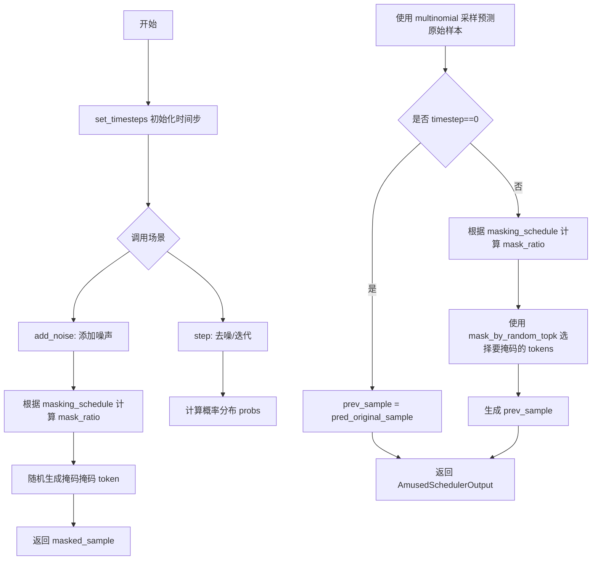
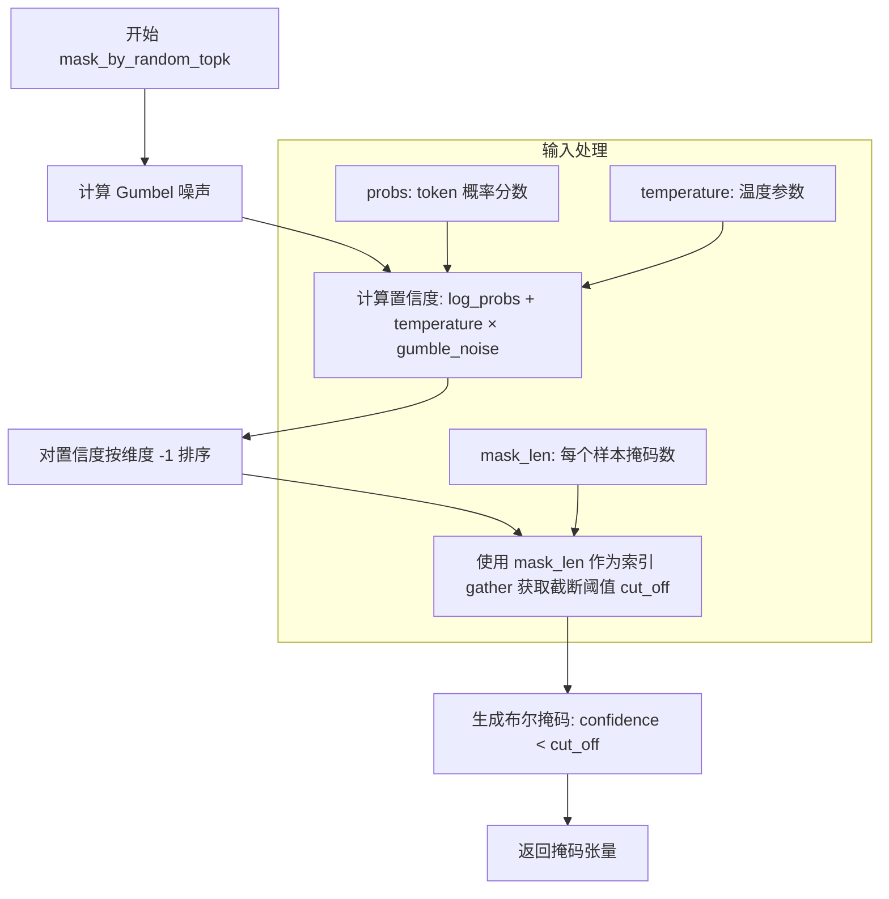
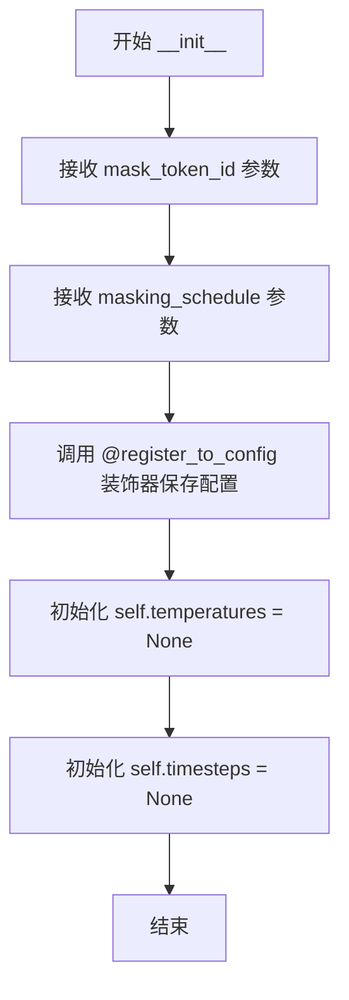

# `diffusers\src\diffusers\schedulers\scheduling_amused.py` 详细设计文档

这是一个用于 masked token generation 的调度器（Scheduler），用于 AmusedPipeline。它通过迭代地根据置信度分数 unmask tokens，支持 cosine 或 linear 掩码调度，与传统扩散调度器不同，它操作的是离散的 token IDs，适用于自回归和非自回归的 masked token 生成模型。

## 整体流程



## 类结构

```
BaseOutput (基础输出类)
├── AmusedSchedulerOutput (调度器输出数据类)
SchedulerMixin (调度器混合类)
ConfigMixin (配置混合类)
└── AmusedScheduler (主调度器类)
```

## 全局变量及字段


### `math`
    
Python标准数学库，提供数学运算函数如cos、sin等

类型：`module`
    


### `Literal`
    
类型提示，用于限制变量为特定的字符串字面量类型

类型：`typing.Literal`
    


### `torch`
    
PyTorch深度学习库，提供张量运算和神经网络功能

类型：`module`
    


### `ConfigMixin`
    
配置混合类，提供配置管理和保存加载功能

类型：`class`
    


### `register_to_config`
    
装饰器函数，用于将类的__init__参数注册为配置属性

类型：`function`
    


### `BaseOutput`
    
基础输出类，定义标准输出数据结构

类型：`class`
    


### `SchedulerMixin`
    
调度器混合类，提供调度器通用的加载保存等基础功能

类型：`class`
    


### `gumbel_noise`
    
全局函数，生成Gumbel分布噪声用于采样

类型：`function`
    


### `mask_by_random_topk`
    
全局函数，通过温度随机性选择最低置信度token进行掩码

类型：`function`
    


### `AmusedSchedulerOutput.prev_sample`
    
前一步计算的样本，包含token IDs用于去噪循环

类型：`torch.Tensor`
    


### `AmusedSchedulerOutput.pred_original_sample`
    
预测的完全去噪样本，基于当前时间步模型输出，可用于预览进度或引导

类型：`torch.Tensor | None`
    


### `AmusedScheduler.order`
    
调度器阶数，表示调度器的导数阶数用于多步求解

类型：`int`
    


### `AmusedScheduler.temperatures`
    
温度参数张量，控制掩码过程的随机性程度

类型：`torch.Tensor | None`
    


### `AmusedScheduler.timesteps`
    
时间步张量，存储推理过程中的时间步序列

类型：`torch.Tensor | None`
    


### `AmusedScheduler.mask_token_id`
    
掩码token的ID，用于在序列中表示被掩码的token

类型：`int`
    


### `AmusedScheduler.masking_schedule`
    
掩码调度类型，决定每个时间步掩码比例的计算方式

类型：`Literal['cosine', 'linear']`
    
    

## 全局函数及方法


### `gumbel_noise`

生成 Gumbel 噪声用于采样，通过对均匀分布的随机数进行对数变换得到 Gumbel 分布的噪声，广泛应用于掩码令牌生成中的随机采样策略。

参数：

- `t`：`torch.Tensor`，输入张量，用于匹配输出噪声的形状和数据类型
- `generator`：`torch.Generator | None`，可选的随机数生成器，用于确保采样结果可复现

返回值：`torch.Tensor`，与输入张量形状、数据类型和设备相同的 Gumbel 分布噪声

#### 流程图

```mermaid
flowchart TD
    A[开始] --> B{generator 是否存在}
    B -->|是| C[使用 generator.device]
    B -->|否| D[使用 t.device]
    C --> E[创建与 t 形状相同的零张量]
    D --> E
    E --> F[uniform_ 生成 0-1 均匀分布随机数]
    F --> G[clamp 限制最小值 1e-20 避免 log(0)]
    G --> H[外层 -log 计算 Gumbel 噪声]
    H --> I[内层 log 也需 clamp 避免数值问题]
    I --> J[返回 Gumbel 噪声张量]
```

#### 带注释源码

```
def gumbel_noise(t: torch.Tensor, generator: torch.Generator | None = None) -> torch.Tensor:
    """
    Generate Gumbel noise for sampling.

    Args:
        t (`torch.Tensor`):
            Input tensor to match the shape and dtype of the output noise.
        generator (`torch.Generator`, *optional*):
            A random number generator for reproducible sampling.

    Returns:
        `torch.Tensor`:
            Gumbel-distributed noise with the same shape, dtype, and device as the input tensor.
    """
    # 确定设备：如果提供了 generator，使用其设备；否则使用输入张量 t 的设备
    device = generator.device if generator is not None else t.device
    
    # 创建与输入张量 t 形状相同的零张量，并在指定设备上分配内存
    # 使用 uniform_ 在 [0, 1) 区间内填充均匀分布的随机数
    # generator 参数确保当需要时可复现采样结果
    noise = torch.zeros_like(t, device=device).uniform_(0, 1, generator=generator)
    
    # 将张量移动到输入张量 t 所在的设备（处理 generator 与 t 设备不一致的情况）
    noise = noise.to(t.device)
    
    # 应用 Gumbel 噪声公式：-log(-log(u))
    # 第一次 clamp(1e-20) 防止 log(0) 产生 -inf
    # 外层 -log(-log(noise)) 生成 Gumbel 分布
    # 第二次 clamp(1e-20) 防止外层 log 输入为 0
    return -torch.log((-torch.log(noise.clamp(1e-20))).clamp(1e-20))
```


### `mask_by_random_topk`

通过 top-k 最低置信度和温度随机性来掩码 tokens。该函数结合了对数概率与 Gumbel 噪声，通过温度参数控制随机性，然后根据每个样本指定的掩码数量选取最低置信度的 tokens 进行掩码。

参数：

- `mask_len`：`torch.Tensor`，表示批处理中每个样本需要掩码的 token 数量
- `probs`：`torch.Tensor`，每个 token 的概率分数，通常来自模型的 softmax 输出
- `temperature`：`float`，可选，默认值为 1.0，控制掩码随机性的温度参数，值越大随机性越强
- `generator`：`torch.Generator | None`，可选，用于可重复采样的随机数生成器

返回值：`torch.Tensor`，布尔类型掩码，True 表示对应位置的 token 需要被掩码

#### 流程图



#### 带注释源码

```python
def mask_by_random_topk(
    mask_len: torch.Tensor,
    probs: torch.Tensor,
    temperature: float = 1.0,
    generator: torch.Generator | None = None,
) -> torch.Tensor:
    """
    Mask tokens by selecting the top-k lowest confidence scores with temperature-based randomness.

    Args:
        mask_len (`torch.Tensor`):
            Number of tokens to mask per sample in the batch.
        probs (`torch.Tensor`):
            Probability scores for each token.
        temperature (`float`, *optional*, defaults to 1.0):
            Temperature parameter for controlling randomness in the masking process.
        generator (`torch.Generator`, *optional*):
            A random number generator for reproducible sampling.

    Returns:
        `torch.Tensor`:
            Boolean mask indicating which tokens should be masked.
    """
    # 第一步：生成 Gumbel 噪声并计算置信度
    # 使用 log(probs) 将概率转换为对数空间，加上温度缩放的 Gumbel 噪声
    # Gumbel-softmax 技巧：使得采样结果可微且具有随机性
    confidence = torch.log(probs.clamp(1e-20)) + temperature * gumbel_noise(probs, generator=generator)
    
    # 第二步：对置信度进行排序（升序）
    # sorted_confidence 的形状与 confidence 相同，但值已按最后一个维度升序排列
    sorted_confidence = torch.sort(confidence, dim=-1).values
    
    # 第三步：根据 mask_len 确定每个样本的截断阈值
    # 使用 gather 操作从排序后的置信度中选取第 mask_len 个位置的值作为阈值
    # mask_len 需要转换为 long 类型以作为索引使用
    cut_off = torch.gather(sorted_confidence, 1, mask_len.long())
    
    # 第四步：生成布尔掩码
    # 置信度低于截断阈值的 token 将被标记为需要掩码（True）
    # 这样选取的正是每个样本中置信度最低的 mask_len 个 token
    masking = confidence < cut_off
    
    # 返回布尔掩码，形状与 probs 相同
    return masking
```


### `AmusedScheduler.__init__`

这是 `AmusedScheduler` 类的初始化方法，用于设置掩码标记ID和掩码调度计划类型，并初始化温度和时间步长为 None，为后续的调度过程做好准备。

参数：

- `mask_token_id`：`int`，用于表示序列中掩码标记的 token ID
- `masking_schedule`：`Literal["cosine", "linear"]`，掩码调度计划类型，默认为 `"cosine"`，用于确定每个时间步的掩码比率

返回值：`None`，无显式返回值（`__init__` 方法不应返回值）

#### 流程图



#### 带注释源码

```python
@register_to_config
def __init__(
    self,
    mask_token_id: int,
    masking_schedule: Literal["cosine", "linear"] = "cosine",
):
    """
    初始化 AmusedScheduler。

    Args:
        mask_token_id (`int`):
            用于表示序列中掩码标记的 token ID。
        masking_schedule (`Literal["cosine", "linear"]`, *optional*, defaults to `"cosine"`):
            掩码调度计划类型，用于确定每个时间步的掩码比率。可以是 "cosine" 或 "linear"。
    """
    # 初始化温度张量为 None，将在 set_timesteps 时设置
    self.temperatures = None
    
    # 初始化时间步张量为 None，将在 set_timesteps 时设置
    self.timesteps = None
```


### `AmusedScheduler.set_timesteps`

该方法用于设置推理过程中的时间步（timesteps）和温度（temperatures）序列。它根据 `num_inference_steps` 生成从大到小的时间步序列，并根据 `temperature` 参数生成温度序列，支持固定温度和线性衰减温度两种模式。

参数：

- `num_inference_steps`：`int`，推理过程中需要执行的去噪/ unmask 步数
- `temperature`：`int | tuple[int, int] | list[int]`，温度参数。当为整数时，表示固定温度值（会从该值线性衰减到 0.01）；当为元组或列表时，表示温度的起始和结束值，方法会在给定范围内进行线性插值，默认为 `(2, 0)`
- `device`：`str | torch.device`，指定生成张量所在的设备，默认为 `None`

返回值：无（`None`），该方法直接修改实例属性 `self.timesteps` 和 `self.temperatures`

#### 流程图

```mermaid
flowchart TD
    A[开始 set_timesteps] --> B[生成时间步序列]
    B --> C{判断 temperature 类型}
    C -->|tuple 或 list| D[从 temperature[0] 线性插值到 temperature[1]]
    C -->|整数| E[从 temperature 线性衰减到 0.01]
    D --> F[生成 temperatures 张量]
    E --> F
    F --> G[结束]
    
    B --> B1[torch.arange 生成 0 到 num_inference_steps-1 的序列]
    B1 --> B2[flip 反转序列]
    
    F --> F1[self.timesteps 存储反转后的时间步]
    F1 --> F2[self.temperatures 存储生成的温度序列]
```

#### 带注释源码

```python
def set_timesteps(
    self,
    num_inference_steps: int,
    temperature: int | tuple[int, int] | list[int] = (2, 0),
    device: str | torch.device = None,
):
    # 生成时间步序列：从 0 到 num_inference_steps-1，然后 flip 反转
    # 例如 num_inference_steps=10 时，生成 [9, 8, 7, 6, 5, 4, 3, 2, 1, 0]
    self.timesteps = torch.arange(num_inference_steps, device=device).flip(0)

    # 根据 temperature 参数类型决定温度序列的生成方式
    if isinstance(temperature, (tuple, list)):
        # 温度为元组/列表时，表示起始温度和结束温度
        # 在 [temperature[0], temperature[1]] 范围内进行线性插值
        self.temperatures = torch.linspace(temperature[0], temperature[1], num_inference_steps, device=device)
    else:
        # 温度为单个整数时，从该值线性衰减到 0.01
        self.temperatures = torch.linspace(temperature, 0.01, num_inference_steps, device=device)
```


### AmusedScheduler.step

该方法是AmusedScheduler调度器的核心迭代方法，负责在去噪过程中根据模型输出和当前时间步逐步解蒙版（unmask）token。它通过softmax概率采样预测原始样本，并根据掩码调度计划（如cosine或linear）计算当前步的掩码比例，然后使用基于温度的随机top-k策略选择低置信度token进行掩码，最终返回解蒙版后的样本和预测的原始样本。

参数：

- `model_output`：`torch.Tensor`，模型的输出logits，形状为(batch_size, codebook_size, ...)或(batch_size, codebook_size, height, width)
- `timestep`：`int`，当前去噪迭代的时间步
- `sample`：`torch.LongTensor`，当前含有掩码token的样本，形状为(batch_size, seq_len)或(batch_size, height, width)
- `starting_mask_ratio`：`float`，起始掩码比例，默认为1.0，用于控制掩码调度的起始强度
- `generator`：`torch.Generator | None`，可选的随机数生成器，用于确保采样可复现
- `return_dict`：`bool`，默认为True，决定是否返回字典格式的输出

返回值：`AmusedSchedulerOutput | tuple`，返回解蒙版后的样本prev_sample和预测的原始样本pred_original_sample。如果return_dict为False，则返回元组形式的这两个值。

#### 流程图

```mermaid
flowchart TD
    A[开始 step 方法] --> B{检查 two_dim_input}
    B -->|是| C[reshape sample 和 model_output]
    B -->|否| D[跳过 reshape]
    C --> E[获取 unknown_map: sample == mask_token_id]
    D --> E
    E --> F[计算 probs = softmax(model_output, dim=-1)]
    F --> G[处理 generator 和 device]
    G --> H[从 probs 采样 pred_original_sample]
    H --> I[根据 unknown_map 更新 pred_original_sample]
    I --> J{timestep == 0?}
    J -->|是| K[prev_sample = pred_original_sample]
    J -->|否| L[计算 step_idx 和 ratio]
    L --> M[根据 masking_schedule 计算 mask_ratio]
    M --> N[mask_ratio = starting_mask_ratio * mask_ratio]
    N --> O[计算 mask_len]
    O --> P[限制 mask_len 不超过已掩码数量]
    P --> Q[确保至少掩码1个token]
    Q --> R[获取 selected_probs]
    R --> S[调用 mask_by_random_topk 生成 masking]
    S --> T[计算 prev_sample: 掩码低置信度token]
    K --> U{two_dim_input?}
    T --> U
    U -->|是| V[reshape prev_sample 和 pred_original_sample]
    U -->|否| W[跳过 reshape]
    V --> X{return_dict?}
    W --> X
    X -->|是| Y[返回 AmusedSchedulerOutput 对象]
    X -->|否| Z[返回元组 (prev_sample, pred_original_sample)]
```

#### 带注释源码

```python
def step(
    self,
    model_output: torch.Tensor,
    timestep: int,
    sample: torch.LongTensor,
    starting_mask_ratio: float = 1.0,
    generator: torch.Generator | None = None,
    return_dict: bool = True,
) -> AmusedSchedulerOutput | tuple:
    """
    Perform one denoising step for masked token generation.

    Args:
        model_output: Model's output logits for next token prediction.
        timestep: Current denoising timestep.
        sample: Current sample with masked tokens.
        starting_mask_ratio: Starting ratio for mask scheduling.
        generator: Optional random generator for reproducibility.
        return_dict: Whether to return a dictionary or tuple.

    Returns:
        The denoised sample and predicted original sample.
    """
    # 判断是否为二维输入（图像模式：batch_size, codebook_size, height, width）
    # 还是一维输入（序列模式：batch_size, seq_len）
    two_dim_input = sample.ndim == 3 and model_output.ndim == 4

    # 如果是二维输入，将sample和model_output从图像格式reshape为序列格式
    # sample: (batch_size, height, width) -> (batch_size, height*width)
    # model_output: (batch_size, codebook_size, height, width) -> (batch_size, height*width, codebook_size)
    if two_dim_input:
        batch_size, codebook_size, height, width = model_output.shape
        sample = sample.reshape(batch_size, height * width)
        model_output = model_output.reshape(batch_size, codebook_size, height * width).permute(0, 2, 1)

    # 创建unknown_map，标记哪些位置是masked的token（值为True表示该位置是mask）
    unknown_map = sample == self.config.mask_token_id

    # 对model_output在最后一个维度进行softmax，得到每个token的概率分布
    probs = model_output.softmax(dim=-1)

    # 获取设备信息
    device = probs.device
    # 如果提供了generator，将其设备上的概率转换为对应设备；否则使用原始probs
    probs_ = probs.to(generator.device) if generator is not None else probs
    # 处理CPU上的半精度问题：multinomial不支持CPU上的float16
    if probs_.device.type == "cpu" and probs_.dtype != torch.float32:
        probs_ = probs_.float()
    # 将概率reshape为二维：(batch_size * seq_len, codebook_size)便于multinomial采样
    probs_ = probs_.reshape(-1, probs.size(-1))
    # 从概率分布中采样一个token作为预测的原始样本
    pred_original_sample = torch.multinomial(probs_, 1, generator=generator).to(device=device)
    # 将采样结果reshape回原始形状：(batch_size, seq_len)
    pred_original_sample = pred_original_sample[:, 0].view(*probs.shape[:-1])
    # 对于原本不是mask的位置，保持原sample不变；对于mask位置，使用采样结果
    pred_original_sample = torch.where(unknown_map, pred_original_sample, sample)

    # 如果是第一个时间步，直接返回预测的原始样本（不需要进一步unmask）
    if timestep == 0:
        prev_sample = pred_original_sample
    else:
        # 获取当前timestep在timesteps数组中的索引
        seq_len = sample.shape[1]
        step_idx = (self.timesteps == timestep).nonzero()
        # 计算当前步的比例（0到1之间）
        ratio = (step_idx + 1) / len(self.timesteps)

        # 根据配置选择cosine或linear掩码调度
        if self.config.masking_schedule == "cosine":
            # cosine调度：使用cos函数使掩码比例随步数增加而减小
            mask_ratio = torch.cos(ratio * math.pi / 2)
        elif self.config.masking_schedule == "linear":
            # linear调度：线性减少掩码比例
            mask_ratio = 1 - ratio
        else:
            raise ValueError(f"unknown masking schedule {self.config.masking_schedule}")

        # 应用起始掩码比例缩放
        mask_ratio = starting_mask_ratio * mask_ratio

        # 计算需要掩码的token数量
        mask_len = (seq_len * mask_ratio).floor()
        # 限制掩码数量不超过当前已掩码的token数量减1（至少保留1个已掩码的token）
        mask_len = torch.min(unknown_map.sum(dim=-1, keepdim=True) - 1, mask_len)
        # 确保至少掩码1个token
        mask_len = torch.max(torch.tensor([1], device=model_output.device), mask_len)

        # 获取预测token在codebook中的概率值
        selected_probs = torch.gather(probs, -1, pred_original_sample[:, :, None])[:, :, 0]
        # 对于输入中原本就不是mask的位置，将其置信度设为最大值（不会被mask）
        selected_probs = torch.where(unknown_map, selected_probs, torch.finfo(selected_probs.dtype).max)

        # 使用mask_by_random_topk函数，根据概率和温度随机选择要掩码的token
        masking = mask_by_random_topk(mask_len, selected_probs, self.temperatures[step_idx], generator)

        # 根据masking结果更新prev_sample：低置信度token被mask，高置信度token保留
        prev_sample = torch.where(masking, self.config.mask_token_id, pred_original_sample)

    # 如果是二维输入，将一维序列reshape回二维图像格式
    if two_dim_input:
        prev_sample = prev_sample.reshape(batch_size, height, width)
        pred_original_sample = pred_original_sample.reshape(batch_size, height, width)

    # 根据return_dict决定返回格式
    if not return_dict:
        return (prev_sample, pred_original_sample)

    return AmusedSchedulerOutput(prev_sample, pred_original_sample)
```


### `AmusedScheduler.add_noise`

该方法用于向样本添加噪声，通过根据掩码调度计划随机掩码令牌来实现。它接收一个包含令牌ID的输入样本，并根据当前时间步计算掩码比例，然后随机选择令牌将其替换为掩码令牌ID。

参数：

- `sample`：`torch.LongTensor`，输入样本，包含要部分掩码的令牌ID
- `timesteps`：`int`，决定应用多少掩码的时间步，时间步越高，掩码越多
- `generator`：`torch.Generator | None`，可选的随机数生成器，用于可重现的掩码操作

返回值：`torch.LongTensor`，根据掩码调度计划将某些令牌替换为 `mask_token_id` 后的样本

#### 流程图

```mermaid
flowchart TD
    A[开始 add_noise] --> B[根据 timesteps 查找 step_idx]
    B --> C[计算 ratio = (step_idx + 1) / len(timesteps)]
    C --> D{检查 masking_schedule}
    D -->|cosine| E[计算 mask_ratio = cos(ratio * π / 2)]
    D -->|linear| F[计算 mask_ratio = 1 - ratio]
    D -->|其他| G[抛出 ValueError 异常]
    E --> H
    F --> H
    G --> Z[结束 - 抛出异常]
    H[生成随机掩码索引 mask_indices]
    H --> I[克隆 sample 得到 masked_sample]
    I --> J[将 mask_indices 对应位置替换为 mask_token_id]
    J --> K[返回 masked_sample]
```

#### 带注释源码

```python
def add_noise(
    self,
    sample: torch.LongTensor,
    timesteps: int,
    generator: torch.Generator | None = None,
) -> torch.LongTensor:
    """
    Add noise to a sample by randomly masking tokens according to the masking schedule.

    Args:
        sample (`torch.LongTensor`):
            The input sample containing token IDs to be partially masked.
        timesteps (`int`):
            The timestep that determines how much masking to apply. Higher timesteps result in more masking.
        generator (`torch.Generator`, *optional*):
            A random number generator for reproducible masking.

    Returns:
        `torch.LongTensor`:
            The sample with some tokens replaced by `mask_token_id` according to the masking schedule.
    """
    # 根据当前时间步在预定义的时间步列表中找到对应的索引
    step_idx = (self.timesteps == timesteps).nonzero()
    
    # 计算当前时间步在整个去噪过程中的进度比例
    # 分子加1是因为索引从0开始，需要转换为1-based
    ratio = (step_idx + 1) / len(self.timesteps)

    # 根据配置选择掩码调度方式计算掩码比例
    if self.config.masking_schedule == "cosine":
        # 余弦调度：使用余弦函数从0到π/2平滑过渡
        # 早期时间步掩码比例较高，后期逐渐降低
        mask_ratio = torch.cos(ratio * math.pi / 2)
    elif self.config.masking_schedule == "linear":
        # 线性调度：掩码比例随时间步线性减少
        mask_ratio = 1 - ratio
    else:
        # 不支持的调度方式，抛出异常
        raise ValueError(f"unknown masking schedule {self.config.masking_schedule}")

    # 生成与输入样本形状相同的随机数掩码
    # 根据掩码比例决定哪些位置应该被掩码
    mask_indices = (
        torch.rand(
            # 获取样本形状，设备优先使用generator的设备，否则使用sample的设备
            sample.shape, device=generator.device if generator is not None else sample.device, generator=generator
        ).to(sample.device)
        # 生成0-1之间的随机数，小于掩码比例的位置标记为True
        < mask_ratio
    )

    # 克隆输入样本以避免修改原始数据
    masked_sample = sample.clone()

    # 将随机选中位置的令牌替换为掩码令牌ID
    masked_sample[mask_indices] = self.config.mask_token_id

    # 返回添加噪声后的样本
    return masked_sample
```

## 关键组件


### Gumbel 噪声生成

生成 Gumbel 分布噪声，用于基于温度的随机采样过程，帮助在掩码标记选择中引入随机性。

### mask_by_random_topk 掩码策略

基于置信度分数和温度参数选择最低置信度标记进行掩码，使用 Gumbel 噪声和 top-k 机制实现随机化的标记掩码。

### AmusedSchedulerOutput 输出类

包含 prev_sample（前一时间步的样本）和 pred_original_sample（预测的完全去噪样本）的数据容器，用于调度器的步骤输出。

### AmusedScheduler 调度器

核心调度器类，实现掩码标记生成的时间步调度，支持 cosine 和 linear 两种掩码调度策略，处理离散 token IDs 而非连续像素值。

### 温度调度机制

在 set_timesteps 中实现温度参数从初始值线性衰减到 0.01，用于控制掩码选择的随机性程度。

### 2D/3D 输入适配

在 step 方法中自动检测并处理 3D 样本和 4D 模型输出的情况，将其reshape 为序列形式进行处理后再恢复原始形状。

### 反量化支持

通过 softmax 将模型输出的 logits 转换为概率分布，然后使用 multinomial 从概率分布中采样生成预测的原始样本（token IDs）。

### 掩码调度策略

支持 cosine 和 linear 两种掩码比例计算方法，根据当前时间步在总步数中的比例动态计算掩码比率。


## 问题及建议


### 已知问题

- **类型注解错误**：`timesteps` 字段声明为 `torch.Generator | None`，但实际存储的是 `torch.Tensor`（时间步序列），类型注解不正确。
- **温度参数类型不一致**：`set_timesteps` 方法中 `temperature` 参数类型注解为 `int | tuple[int, int] | list[int]`，但默认值是元组 `(2, 0)`，且在代码中会将其转换为 float 类型进行线性插值，存在类型安全隐患。
- **设备处理逻辑复杂且脆弱**：`step` 方法中手动处理 `generator` 设备与 `probs` 设备不一致的情况，逻辑分散且容易出错。
- **索引操作可能返回空张量**：`step` 和 `add_noise` 方法中使用 `(self.timesteps == timestep).nonzero()` 获取索引，当 timestep 不在 timesteps 中时会返回空张量，导致后续索引操作异常。
- **除零风险**：`add_noise` 方法中 `len(self.timesteps)` 可能在 `self.timesteps` 为空时导致除零错误，虽然 `set_timesteps` 通常会被先调用，但缺乏防御性检查。
- **魔法数字**：`1e-20` 在多处出现，应提取为常量以提高可维护性。
- **方法职责过载**：`step` 方法包含大量逻辑（超过80行），处理2D/1D输入转换、概率计算、掩码计算等多个职责，难以测试和维护。

### 优化建议

- **修正类型注解**：将 `temperatures` 和 `timesteps` 字段的类型修正为 `torch.Tensor`，并添加 `torch.device` 类型的 `device` 字段用于统一设备管理。
- **统一温度参数处理**：将 `temperature` 参数统一为 `float | tuple[float, float]`，并在方法开头进行类型验证和转换。
- **简化设备管理**：在 `__init__` 或 `set_timesteps` 中记录设备信息，避免在 `step` 方法中频繁检查 generator 设备。
- **添加防御性检查**：在 `step` 和 `add_noise` 方法开始时检查 `self.timesteps` 是否已初始化，或使用 `assert` 验证关键前置条件。
- **提取常量**：定义 `EPSILON = 1e-20` 常量替代多处硬编码的魔法数字。
- **拆分方法**：将 `step` 方法拆分为 `_prepare_inputs`、`_compute_mask_ratio`、`_apply_mask` 等私有方法，提高代码可读性和可测试性。
- **优化张量操作**：合并连续的 reshape 操作，减少中间张量创建以提升内存效率。

## 其它


### 设计目标与约束

本调度器旨在为离散标记生成任务提供高效的去噪机制，支持掩码标记（mask_token_id）的迭代式揭示。核心约束包括：1）仅支持整数类型的token ID张量处理；2）masking_schedule仅支持"cosine"和"linear"两种策略；3）温度参数必须为正数；4）mask_len不能超过当前未知标记数量减1。

### 错误处理与异常设计

代码包含以下错误处理机制：1）当masking_schedule为未知值时抛出ValueError；2）当generator设备为CPU且数据类型为半精度时自动转换为float32以支持multinomial操作；3）数值稳定性处理使用clamp(1e-20)防止log(0)和log(log(0))；4）mask_len最小值限制为1确保至少掩盖一个标记。

### 数据流与状态机

数据流遵循以下路径：初始全掩码样本 → 模型输出概率分布 → 采样预测原始样本 → 计算当前掩码比例 → 通过mask_by_random_topk选择低置信度标记 → 揭示选中的标记。状态转换由timesteps控制，从高步数向低步数flip(0)递减，每个步骤减少掩码比例。

### 外部依赖与接口契约

依赖项包括：1）torch库提供张量操作和随机数生成；2）dataclasses提供AmusedSchedulerOutput数据结构；3）typing提供类型注解；4）math提供三角函数；5）configuration_utils的ConfigMixin和register_to_config装饰器；6）utils的BaseOutput基类；7）scheduling_utils的SchedulerMixin基类。

### 配置参数详细说明

mask_token_id: int - 掩码标记的token ID值，用于标识序列中被掩盖的位置。masking_schedule: Literal["cosine", "linear"] - 掩码调度策略，cosine使用余弦曲线平滑减少掩码比例，linear使用线性递减。

### 典型使用场景

适用于图像生成（如token化的VQ-VAE离散表示）、文本生成（如离散扩散的标记预测）等需要离散token去噪的场景。常与AmusedPipeline配合使用，在推理过程中逐步揭示被掩码的token。

    