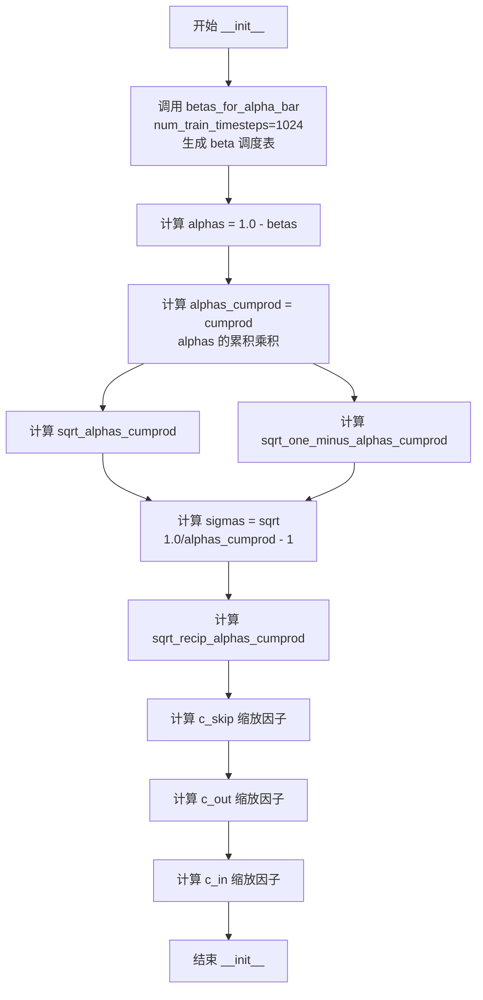

# `diffusers\src\diffusers\schedulers\scheduling_consistency_decoder.py` 详细设计文档

该模块实现了一个用于Stable Diffusion Pipeline中Consistency Decoder的调度器（Scheduler），通过管理alpha、sigma等扩散参数以及c_skip、c_out、c_in等缩放因子，来执行两步推理过程（直接跳跃到终点或添加噪声进行标准扩散步骤），从而将潜在表示解码为图像。

## 整体流程

```mermaid
graph TD
    A[__init__ 初始化] --> B[set_timesteps 设置推理步数]
    B --> C[推理循环开始]
    C --> D[scale_model_input 缩放输入]
    D --> E[step 执行单步去噪]
    E --> F{判断是否为最后一步}
    F -- 是 (最后一步) --> G[直接计算 x_0 (Consistency Jump)]
    F -- 否 (中间步) --> H[执行标准扩散逆过程添加噪声]
    G --> I[返回 prev_sample]
    H --> I
```

## 类结构

```
BaseOutput (基类)
├── ConsistencyDecoderSchedulerOutput (数据类)
SchedulerMixin (混入类)
ConfigMixin (混入类)
└── ConsistencyDecoderScheduler (主调度器类)
```

## 全局变量及字段


### `betas_for_alpha_bar`
    
创建beta调度表，根据给定的alpha_t_bar函数离散化，定义(1-beta)从t=[0,1]的累积乘积

类型：`function(num_diffusion_timesteps: int, max_beta: float, alpha_transform_type: Literal["cosine", "exp", "laplace"]) -> torch.Tensor`
    


### `ConsistencyDecoderSchedulerOutput.prev_sample`
    
上一步计算出的样本

类型：`torch.Tensor`
    


### `ConsistencyDecoderScheduler.order`
    
调度器的阶数

类型：`int`
    


### `ConsistencyDecoderScheduler.timesteps`
    
推理时的时间步张量

类型：`torch.Tensor`
    


### `ConsistencyDecoderScheduler.sqrt_alphas_cumprod`
    
alpha累积乘积的平方根

类型：`torch.Tensor`
    


### `ConsistencyDecoderScheduler.sqrt_one_minus_alphas_cumprod`
    
(1 - alpha累积乘积)的平方根

类型：`torch.Tensor`
    


### `ConsistencyDecoderScheduler.c_skip`
    
跳跃系数

类型：`torch.Tensor`
    


### `ConsistencyDecoderScheduler.c_out`
    
输出系数

类型：`torch.Tensor`
    


### `ConsistencyDecoderScheduler.c_in`
    
输入系数

类型：`torch.Tensor`
    
    

## 全局函数及方法


### `betas_for_alpha_bar`

该函数用于创建beta调度表，通过离散化给定的alpha_t_bar函数来生成一系列beta值。这个函数是扩散模型调度器的核心组成部分，定义了从t=0到t=1的扩散过程中(1-beta)的累积乘积。

参数：

- `num_diffusion_timesteps`：`int`，要生成的beta数量
- `max_beta`：`float`，默认值为`0.999`，使用的最大beta值，用于避免数值不稳定
- `alpha_transform_type`：`Literal["cosine", "exp", "laplace"]`，默认值为`"cosine"`，alpha_bar的噪声调度类型

返回值：`torch.Tensor`，调度器用于逐步模型输出的beta值

#### 流程图

```mermaid
flowchart TD
    A[开始 betas_for_alpha_bar] --> B{alpha_transform_type == 'cosine'}
    B -->|Yes| C[定义 cosine alpha_bar_fn]
    B -->|No| D{alpha_transform_type == 'laplace'}
    D -->|Yes| E[定义 laplace alpha_bar_fn]
    D -->|No| F{alpha_transform_type == 'exp'}
    F -->|Yes| G[定义 exp alpha_bar_fn]
    F -->|No| H[抛出 ValueError]
    C --> I[初始化空列表 betas]
    E --> I
    G --> I
    I --> J[遍历 i from 0 to num_diffusion_timesteps-1]
    J --> K[计算 t1 = i / num_diffusion_timesteps]
    J --> L[计算 t2 = (i + 1) / num_diffusion_timesteps]
    K --> M[计算 beta = min<br/>1 - alpha_bar_fn(t2) / alpha_bar_fn(t1)<br/>max_beta]
    L --> M
    M --> N[将 beta 添加到 betas 列表]
    N --> O{遍历完成?}
    O -->|No| J
    O -->|Yes| P[返回 torch.tensor<br/>(betas, dtype=torch.float32)]
    H --> Q[结束]
```

#### 带注释源码

```python
# 从 diffusers.schedulers.scheduling_ddpm 复制过来的函数
def betas_for_alpha_bar(
    num_diffusion_timesteps: int,  # 生成的beta数量
    max_beta: float = 0.999,       # beta的最大值上限，防止数值不稳定
    alpha_transform_type: Literal["cosine", "exp", "laplace"] = "cosine",  # alpha转换类型
) -> torch.Tensor:  # 返回beta调度表张量
    """
    Create a beta schedule that discretizes the given alpha_t_bar function, which defines the cumulative product of
    (1-beta) over time from t = [0,1].

    创建一个beta调度表，离散化给定的alpha_t_bar函数。
    该函数定义了从t = [0,1]的时间范围内(1-beta)的累积乘积。

    Contains a function alpha_bar that takes an argument t and transforms it to the cumulative product of (1-beta) up
    to that part of the diffusion process.
    
    包含一个alpha_bar函数，接受参数t并将其转换為扩散过程到该部分的(1-beta)的累积乘积。

    Args:
        num_diffusion_timesteps (`int`):
            The number of betas to produce.
            要生成的beta数量。
        max_beta (`float`, defaults to `0.999`):
            The maximum beta to use; use values lower than 1 to avoid numerical instability.
            使用的最大beta值；使用低于1的值以避免数值不稳定。
        alpha_transform_type (`str`, defaults to `"cosine"`):
            The type of noise schedule for `alpha_bar`. Choose from `cosine`, `exp`, or `laplace`.
            `alpha_bar`的噪声调度类型。可选值为`cosine`、`exp`或`laplace`。

    Returns:
        `torch.Tensor`:
            The betas used by the scheduler to step the model outputs.
            调度器用于逐步模型输出的beta值。
    """
    # 根据alpha_transform_type选择对应的alpha_bar_fn函数
    # cosine: 使用余弦函数进行平滑衰减，cos((t + 0.008) / 1.008 * math.pi / 2) ** 2
    if alpha_transform_type == "cosine":

        def alpha_bar_fn(t):
            # 余弦变换：从0到1的平滑过渡，添加0.008偏移以避免边界问题
            return math.cos((t + 0.008) / 1.008 * math.pi / 2) ** 2

    elif alpha_transform_type == "laplace":

        def alpha_bar_fn(t):
            # 拉普拉斯变换：基于信噪比(SNR)的变换
            # 计算lambda = -0.5 * sign(0.5 - t) * log(1 - 2*|0.5 - t| + 1e-6)
            lmb = -0.5 * math.copysign(1, 0.5 - t) * math.log(1 - 2 * math.fabs(0.5 - t) + 1e-6)
            # 计算信噪比 SNR = exp(lambda)
            snr = math.exp(lmb)
            # 返回 sqrt(SNR / (1 + SNR))
            return math.sqrt(snr / (1 + snr))

    elif alpha_transform_type == "exp":

        def alpha_bar_fn(t):
            # 指数变换：指数衰减 schedule
            return math.exp(t * -12.0)

    else:
        # 不支持的alpha_transform_type，抛出错误
        raise ValueError(f"Unsupported alpha_transform_type: {alpha_transform_type}")

    # 初始化beta列表
    betas = []
    # 遍历每个扩散时间步
    for i in range(num_diffusion_timesteps):
        # 计算当前时间步的起始点和终点（归一化到[0,1]区间）
        t1 = i / num_diffusion_timesteps
        t2 = (i + 1) / num_diffusion_timesteps
        # 计算beta值：1 - alpha_bar(t2) / alpha_bar(t1)
        # 使用min限制最大值不超过max_beta，防止数值不稳定
        betas.append(min(1 - alpha_bar_fn(t2) / alpha_bar_fn(t1), max_beta))
    
    # 将beta列表转换为PyTorch张量，使用float32类型
    return torch.tensor(betas, dtype=torch.float32)
```


### ConsistencyDecoderScheduler.__init__

这是 ConsistencyDecoderScheduler 类的构造函数，用于初始化一致性解码器调度器的所有内部参数，包括扩散过程的betas、alphas、累积乘积以及用于去噪计算的缩放因子（c_skip、c_out、c_in）。

参数：

- `num_train_timesteps`：`int`，可选，默认值为 `1024`。扩散过程训练的步数，用于生成beta调度表。
- `sigma_data`：`float`，可选，默认值为 `0.5`。数据分布的标准差，用于计算跳过和输出的缩放因子。

返回值：`None`，构造函数无返回值（Python中`__init__`方法自动返回`None`）。

#### 流程图



#### 带注释源码

```python
@register_to_config
def __init__(
    self,
    num_train_timesteps: int = 1024,
    sigma_data: float = 0.5,
) -> None:
    """
    初始化 ConsistencyDecoderScheduler 调度器。
    
    该方法根据给定的训练时间步数和 sigma_data 参数，
    预计算扩散过程中所需的各种张量，用于后续的去噪推理。
    
    Args:
        num_train_timesteps: 扩散模型训练的步数，默认1024
        sigma_data: 数据分布的标准差，用于计算缩放因子，默认0.5
    
    Returns:
        None (构造函数)
    """
    
    # 使用 alpha_bar 策略生成 beta 调度表
    # beta 决定了每一步扩散过程中添加到数据的噪声量
    betas = betas_for_alpha_bar(num_train_timesteps)
    
    # 计算 alphas: 1 - beta，表示每一步保留的信息比例
    alphas = 1.0 - betas
    
    # 计算累积乘积 alpha_cumprod
    # alpha_cumprod[t] = alpha[0] * alpha[1] * ... * alpha[t]
    # 表示从开始到时间步 t 的整体信息保留程度
    alphas_cumprod = torch.cumprod(alphas, dim=0)
    
    # 计算 sqrt(alpha_cumprod) 和 sqrt(1 - alpha_cumprod)
    # 用于后续的噪声采样和去噪计算
    self.sqrt_alphas_cumprod = torch.sqrt(alphas_cumprod)
    self.sqrt_one_minus_alphas_cumprod = torch.sqrt(1.0 - alphas_cumprod)
    
    # 计算 sigmas (噪声标准差)
    # sigma = sqrt(1/alpha_cumprod - 1)
    # 这是扩散过程逆过程的关键参数
    sigmas = torch.sqrt(1.0 / alphas_cumprod - 1)
    
    # 计算 1/sqrt(alpha_cumprod) 的平方根
    sqrt_recip_alphas_cumprod = torch.sqrt(1.0 / alphas_cumprod)
    
    # ===== 计算去噪缩放因子 =====
    # c_skip: 跳过因子，用于平衡原始样本和预测样本
    # 公式: c_skip = sqrt_recip_alphas_cumprod * sigma_data^2 / (sigma^2 + sigma_data^2)
    self.c_skip = sqrt_recip_alphas_cumprod * sigma_data**2 / (sigmas**2 + sigma_data**2)
    
    # c_out: 输出缩放因子，用于调整预测噪声的权重
    # 公式: c_out = sigma * sigma_data / sqrt(sigma^2 + sigma_data^2)
    self.c_out = sigmas * sigma_data / (sigmas**2 + sigma_data**2) ** 0.5
    
    # c_in: 输入缩放因子，用于调整输入样本的缩放
    # 公式: c_in = sqrt_recip_alphas_cumprod / sqrt(sigma^2 + sigma_data^2)
    self.c_in = sqrt_recip_alphas_cumprod / (sigmas**2 + sigma_data**2) ** 0.5
```


### `ConsistencyDecoderScheduler.set_timesteps`

设置推理过程中的时间步，并将调度器的预计算参数移动到指定设备。该方法强制要求推理步数为2，并使用固定的时间步张量 [1008, 512]。

参数：

- `num_inference_steps`：`int | None`，推理时的时间步数量，默认为 None，当前仅支持设置为 2
- `device`：`str | torch.device`，目标设备，用于将调度器的参数移动到指定设备

返回值：`None`，无返回值，该方法直接修改对象内部状态

#### 流程图

```mermaid
flowchart TD
    A[开始 set_timesteps] --> B{num_inference_steps == 2?}
    B -->|否| C[抛出 ValueError: 目前不支持超过2个推理步骤]
    B -->|是| D[设置 self.timesteps 为 tensor[1008, 512]]
    E[设备迁移] --> F[迁移 sqrt_alphas_cumprod]
    F --> G[迁移 sqrt_one_minus_alphas_cumprod]
    G --> H[迁移 c_skip]
    H --> I[迁移 c_out]
    I --> J[迁移 c_in]
    D --> E
    J --> K[结束]
```

#### 带注释源码

```python
def set_timesteps(
    self,
    num_inference_steps: int | None = None,
    device: str | torch.device = None,
):
    """
    设置推理过程中的时间步。

    该方法将调度器配置为使用固定的两步推理过程，这是 Consistency Decoder
    所要求的。方法同时将所有预计算的调度器参数移动到指定设备。

    参数:
        num_inference_steps: 推理步数，当前仅支持 2 步
        device: 目标设备，用于参数迁移
    """
    # 检查推理步数是否满足要求，Consistency Decoder 目前仅支持两步推理
    if num_inference_steps != 2:
        raise ValueError("Currently more than 2 inference steps are not supported.")

    # 设置固定的时间步张量 [1008, 512]
    # 这些值对应于训练时选择的特定时间点
    self.timesteps = torch.tensor([1008, 512], dtype=torch.long, device=device)
    
    # 将所有预计算的调度器参数迁移到目标设备
    # 这些参数在 __init__ 中计算，用于推理时的采样计算
    self.sqrt_alphas_cumprod = self.sqrt_alphas_cumprod.to(device)
    self.sqrt_one_minus_alphas_cumprod = self.sqrt_one_minus_alphas_cumprod.to(device)
    self.c_skip = self.c_skip.to(device)
    self.c_out = self.c_out.to(device)
    self.c_in = self.c_in.to(device)
```


### `ConsistencyDecoderScheduler.scale_model_input`

该方法确保与需要根据当前时间步缩放去噪模型输入的调度器 interchangeable。它接收一个输入样本和当前时间步，使用预计算的缩放因子 `c_in` 对样本进行线性变换，返回缩放后的样本供后续去噪步骤使用。

参数：

- `sample`：`torch.Tensor`，当前扩散过程中的输入样本（通常是潜在表示或图像）
- `timestep`：`int | None`，扩散链中的当前时间步，指定用于查找对应的缩放因子（可选）

返回值：`torch.Tensor`，经过缩放处理的输入样本，用于后续的去噪计算

#### 流程图

```mermaid
flowchart TD
    A[输入: sample, timestep] --> B{检查 timestep 是否为 None}
    B -->|是| C[使用默认值或报错]
    B -->|否| D[从 c_in 数组中索引对应 timestep 的缩放因子]
    D --> E[执行乘法运算: sample × c_in[timestep]]
    E --> F[返回缩放后的样本]
    
    style A fill:#e1f5fe
    style F fill:#e8f5e8
```

#### 带注释源码

```python
def scale_model_input(self, sample: torch.Tensor, timestep: int | None = None) -> torch.Tensor:
    """
    Ensures interchangeability with schedulers that need to scale the denoising model input depending on the
    current timestep.

    Args:
        sample (`torch.Tensor`):
            The input sample.
        timestep (`int`, *optional*):
            The current timestep in the diffusion chain.

    Returns:
        `torch.Tensor`:
            A scaled input sample.
    """
    # 使用预计算的缩放因子 c_in 对输入样本进行缩放
    # c_in 在 __init__ 中计算: sqrt_recip_alphas_cumprod / (sigmas**2 + sigma_data**2) ** 0.5
    # 这里的缩放是为了将输入调整到适合 consistency model 的格式
    return sample * self.c_in[timestep]
```


### ConsistencyDecoderScheduler.step

该方法是一致性解码器调度器的核心步骤函数，通过反转扩散过程来预测前一个时间步的样本。它利用预计算的缩放因子（c_skip、c_out、c_in）从模型输出中恢复原始样本，并在非最后时间步添加噪声以维持扩散过程的随机性。

参数：

- `model_output`：`torch.Tensor`，来自学习到的扩散模型的直接输出（通常为预测噪声）
- `timestep`：`float | torch.Tensor`，扩散链中的当前时间步
- `sample`：`torch.Tensor`，由扩散过程创建的当前样本实例（x_t）
- `generator`：`torch.Generator | None`，可选的随机数生成器，用于确保可重复性
- `return_dict`：`bool`，默认为 `True`，决定是否返回 `ConsistencyDecoderSchedulerOutput` 或元组

返回值：`ConsistencyDecoderSchedulerOutput | tuple`，返回前一个时间步的样本（prev_sample），如果 `return_dict` 为 `True` 则返回 `ConsistencyDecoderSchedulerOutput` 对象，否则返回包含样本张量的元组

#### 流程图

```mermaid
flowchart TD
    A[开始 step 方法] --> B[计算 x_0 = c_out[t] * model_output + c_skip[t] * sample]
    B --> C[查找 timestep 在 self.timesteps 中的索引 timestep_idx]
    C --> D{判断是否为最后一个时间步}
    D -->|是| E[prev_sample = x_0]
    D -->|否| F[生成随机噪声 noise]
    F --> G[计算 prev_sample = sqrt_alphas_cumprod[t+1] * x_0 + sqrt_one_minus_alphas_cumprod[t+1] * noise]
    E --> H{return_dict 为 True?}
    G --> H
    H -->|是| I[返回 ConsistencyDecoderSchedulerOutput(prev_sample=prev_sample)]
    H -->|否| J[返回元组 (prev_sample,)]
```

#### 带注释源码

```python
def step(
    self,
    model_output: torch.Tensor,        # 扩散模型预测的输出（通常是噪声或直接预测的x_0）
    timestep: float | torch.Tensor,     # 当前扩散时间步
    sample: torch.Tensor,               # 当前样本 x_t
    generator: torch.Generator | None = None,  # 可选的随机数生成器
    return_dict: bool = True,          # 是否返回字典格式
) -> ConsistencyDecoderSchedulerOutput | tuple:
    """
    通过反转SDE来预测前一个时间步的样本。此函数将扩散过程从学习模型输出（通常是预测噪声）向前推进。
    """
    # 使用预计算的缩放因子从模型输出重建原始样本 x_0
    # c_out: 输出缩放因子，控制模型输出对重建样本的贡献
    # c_skip: 跳过连接缩放因子，保留部分原始样本信息
    x_0 = self.c_out[timestep] * model_output + self.c_skip[timestep] * sample

    # 查找当前时间步在调度器时间步数组中的索引位置
    # self.timesteps 存储了调度器支持的时间步（当前实现为 [1008, 512]）
    timestep_idx = torch.where(self.timesteps == timestep)[0]

    # 判断当前是否为最后一个时间步
    if timestep_idx == len(self.timesteps) - 1:
        # 最后一步：直接返回重建的 x_0，无需添加噪声
        # 这是一致性模型的关键特性：直接输出最终结果
        prev_sample = x_0
    else:
        # 非最后一步：需要通过扩散过程反向传播
        # 从 x_0 加上噪声得到 x_{t-1}
        # 使用 randn_tensor 生成与 x_0 相同形状的随机噪声
        noise = randn_tensor(
            x_0.shape, 
            generator=generator, 
            dtype=x_0.dtype, 
            device=x_0.device
        )
        
        # 根据DDPM风格的采样公式计算前一个样本：
        # x_{t-1} = sqrt(α_{t-1}) * x_0 + sqrt(1-α_{t-1}) * noise
        # 其中索引 timestep_idx + 1 对应下一个更小的时间步
        prev_sample = (
            self.sqrt_alphas_cumprod[self.timesteps[timestep_idx + 1]].to(x_0.dtype) * x_0
            + self.sqrt_one_minus_alphas_cumprod[self.timesteps[timestep_idx + 1]].to(x_0.dtype) * noise
        )

    # 根据 return_dict 参数决定返回格式
    if not return_dict:
        # 返回元组格式，兼容旧版API
        return (prev_sample,)

    # 返回结构化输出对象，包含 prev_sample 供下一步使用
    return ConsistencyDecoderSchedulerOutput(prev_sample=prev_sample)
```


### ConsistencyDecoderScheduler.init_noise_sigma

返回初始噪声分布的标准差（Sigma）。该属性是只读的，通过获取调度器在推理阶段设置的时间步列表（`self.timesteps`）中的第一个时间步，并利用该时间步作为索引，从预计算的 `sqrt_one_minus_alphas_cumprod` 张量中查询对应的标准差值。这代表了扩散过程 $t=0$ 时的噪声水平。

参数：
- 无（此方法为属性，无需显式传入参数）

返回值：`torch.Tensor`，返回初始噪声分布的标准差值。

#### 流程图

```mermaid
graph TD
    A((开始)) --> B[获取首时间步索引]
    B --> C[查找对应Sigma值]
    C --> D((返回))<br/>torch.Tensor
    
    B -- self.timesteps[0] --> C
    C -- self.sqrt_one_minus_alphas_cumprod[index] --> D
```

#### 带注释源码

```python
@property
def init_noise_sigma(self) -> torch.Tensor:
    """
    Return the standard deviation of the initial noise distribution.

    Returns:
        `torch.Tensor`:
            The initial noise sigma value from the precomputed `sqrt_one_minus_alphas_cumprod` at the first
            timestep.
    """
    # 获取推理流程中的第一个时间步（通常是一个较大的整数值，如1008）
    # 并使用该时间步作为索引来查询预计算的 sigma 值
    return self.sqrt_one_minus_alphas_cumprod[self.timesteps[0]]
```


## 关键组件


### 张量索引与惰性加载

代码中通过 `self.timesteps` 作为索引来访问预计算的数组（如 `self.sqrt_alphas_cumprod`、`self.sqrt_one_minus_alphas_cumprod`、`self.c_skip`、`self.c_out`、`self.c_in`），实现了基于时间步的张量查询。惰性加载体现在 `set_timesteps` 方法中通过 `.to(device)` 将张量从 CPU 移动到目标设备，仅在实际需要时才进行设备迁移，避免了初始化时的资源浪费。

### 反量化支持

该调度器虽然没有直接的反量化逻辑，但 `step` 方法接收的 `model_output` 和 `sample` 参数设计为可处理任意精度（通过 `dtype=x_0.dtype` 和 `device=x_0.device` 确保噪声与样本的一致性），这为与量化模型配合使用时提供了间接支持——量化后的模型输出可直接用于调度器计算。

### 量化策略

调度器内部使用 `torch.float32` 存储预计算的系数（betas、alphas、缩放因子等），并在 `step` 方法中根据输入样本的 dtype 和 device 进行动态转换，确保与不同量化精度（如 fp16、bf16）的模型输出兼容。

### betas_for_alpha_bar 函数

该函数根据指定的 alpha 变换类型（cosine、exp、laplace）生成离散的 beta 调度表，用于定义扩散过程中的累积产品 (1-beta)。支持自定义时间步数和最大 beta 值以避免数值不稳定。

### ConsistencyDecoderSchedulerOutput 数据类

用于封装调度器 `step` 函数的输出，包含 `prev_sample`（上一时间步的计算样本），遵循扩散模型的标准输出格式。

### ConsistencyDecoderScheduler 类

核心调度器类，继承自 `SchedulerMixin` 和 `ConfigMixin`，实现了基于一致性模型的两步去噪过程。通过预计算的缩放因子（c_skip、c_out、c_in）将模型输出转换为最终样本，支持噪声注入和样本重建。

### set_timesteps 方法

设置推理时的时间步，当前实现固定为两步（[1008, 512]），并将所有预计算张量移至目标设备。该方法对时间步的硬编码限制体现了对一致性模型特定工作流的优化。

### step 方法

调度器的核心推理方法，根据模型输出、时间步和当前样本计算前一时间步的样本。实现了确定性生成（最后一步）和随机采样（中间步骤）的逻辑，支持可选的随机数生成器以保证可复现性。


## 问题及建议


### 已知问题

-   **硬编码的timesteps**: `set_timesteps`方法中将timesteps硬编码为`[1008, 512]`，缺乏灵活性，无法适应不同的推理步骤需求。
-   **类型注解与实际使用不匹配**: `step`方法中`timestep`参数类型为`float | torch.Tensor`，但实际使用时直接与`self.timesteps`进行比较，假设其为标量值，可能导致类型错误。
-   **设备管理不一致**: 在`__init__`中创建的张量未立即移至指定device，仅在`set_timesteps`时才转移，可能导致设备不一致问题。
-   **缺少设备验证**: `set_timesteps`方法未验证传入的`device`参数是否有效，也未检查`model_output`和`sample`的设备是否一致。
-   **魔法数字与硬编码值**: 默认的`num_train_timesteps=1024`和`sigma_data=0.5`缺乏配置灵活性，且`alpha_transform_type`仅支持三种固定类型。
-   **错误处理不足**: `step`方法中使用`torch.where(self.timesteps == timestep)[0]`时，若`timestep`不存在于`timesteps`中，会返回空tensor导致索引错误。
-   **未使用的参数**: `scale_model_input`方法接收`timestep`参数但未实际使用；`step`方法接收`generator`参数但未在所有分支中使用。
-   **数值精度问题**: `laplace`类型的`alpha_bar_fn`实现中存在`1e-6`的硬编码magic number，且计算逻辑较为复杂可能引入数值不稳定。

### 优化建议

-   **解耦timesteps配置**: 将`[1008, 512]`改为可配置的参数，或提供基于`num_inference_steps`动态生成timesteps的逻辑。
-   **统一设备管理**: 在`__init__`中接受`device`参数，或在所有方法调用前确保设备一致性，可考虑使用`torch.device`类型注解。
-   **增强类型注解**: 明确`timestep`参数应为`int`或`torch.Tensor`标量，并在方法文档中说明预期类型。
-   **完善错误处理**: 添加对`timestep`有效性的验证，检查其是否在预定义的timesteps范围内，并提供有意义的错误信息。
-   **移除未使用参数**: 若`scale_model_input`不需要`timestep`，可考虑移除该参数以保持API简洁。
-   **提取魔法数字**: 将`0.5`、`1024`、`1e-6`等数值提取为类常量或配置参数，提高可维护性。
-   **优化内存使用**: 考虑将部分计算密集的张量（如`sqrt_recip_alphas_cumprod`）改为延迟计算或使用property缓存。
-   **文档完善**: 为Laplace变换的实现添加数学背景说明，便于后续维护和理解。


## 其它


### 设计目标与约束

本代码的设计目标是实现一个用于一致性解码器（Consistency Decoder）的调度器（Scheduler），该调度器在Stable Diffusion流水线中将潜在表示（latent representations）解码为图像。其核心功能是利用一致性模型（Consistency Models）实现两步去噪过程，将噪声潜在向量逐步转换为清晰的图像输出。

设计约束包括：
- **推理步骤限制**：当前实现仅支持2个推理步骤（num_inference_steps必须等于2），不支持更多步骤
- **时间步固定**：推理时使用固定的时间步张量[1008, 512]
- **数据类型**：主要使用torch.float32类型处理张量
- **设备兼容性**：需要支持CPU和CUDA设备

### 错误处理与异常设计

代码中包含以下异常处理机制：

1. **alpha_transform_type验证**：当传入不支持的alpha_transform_type时，抛出ValueError异常，提示"Unsupported alpha_transform_type: {type}"

2. **推理步骤数验证**：在set_timesteps方法中，如果num_inference_steps不等于2，会抛出ValueError异常："Currently more than 2 inference steps are not supported."

3. **参数类型标注**：使用Python类型提示（typing模块）明确函数参数和返回值的类型，增强代码可读性和类型安全

4. **可选参数处理**：对于非必需的参数（如generator、return_dict），提供默认值None和True，提高API的灵活性

### 数据流与状态机

**数据流**：
1. **初始化阶段**：在__init__中，根据num_train_timesteps计算betas、alphas、alphas_cumprod，并预计算c_skip、c_out、c_in等调度参数
2. **设置时间步阶段**：set_timesteps方法将推理时间步设置为固定的[1008, 512]，并将所有预计算参数移动到指定设备
3. **去噪循环阶段**：在每个推理步骤中，step方法根据model_output和当前sample计算prev_sample

**状态转换**：
- **状态1**：初始化状态 - 创建调度器并预计算参数
- **状态2**：配置状态 - 设置推理时间步
- **状态3**：去噪状态 - 执行step方法进行迭代去噪
- **状态4**：终止状态 - 返回最终解码图像

### 外部依赖与接口契约

**主要依赖**：
- `math`：数学运算（cos、sin、log、sqrt等）
- `torch`：张量运算和神经网络基础操作
- `dataclasses.dataclass`：数据类装饰器
- `typing.Literal`：类型字面量支持
- `..configuration_utils.ConfigMixin`：配置混入类
- `..configuration_utils.register_to_config`：配置注册装饰器
- `..utils.BaseOutput`：基础输出类
- `..utils.randn_tensor`：随机张量生成工具
- `.scheduling_utils.SchedulerMixin`：调度器混入类

**接口契约**：
- ConsistencyDecoderScheduler类必须实现SchedulerMixin和ConfigMixin的接口
- step方法必须返回ConsistencyDecoderSchedulerOutput或tuple类型
- 所有张量操作应保持设备一致性

### 性能考虑

1. **预计算优化**：在初始化阶段预先计算所有可能的调度参数（c_skip、c_out、c_in等），避免在推理时重复计算

2. **内存效率**：使用torch.tensor存储一维参数，避免存储完整的二维矩阵

3. **设备迁移**：使用.to(device)方法确保张量在正确的设备上，支持GPU加速

4. **向量化操作**：使用torch.where等向量化操作替代Python循环，提高计算效率

### 兼容性考虑

1. **Python版本**：需要Python 3.8+（支持from __future__ import annotations和|联合类型提示）

2. **PyTorch版本**：需要PyTorch 1.0+（支持torch.Tensor类型注解）

3. **设备兼容性**：代码支持CPU和CUDA设备，通过device参数指定

4. **数据类型一致性**：在step方法中使用.to(x_0.dtype)确保不同张量间的数据类型一致

### 使用示例

```python
# 创建调度器实例
scheduler = ConsistencyDecoderScheduler(
    num_train_timesteps=1024,
    sigma_data=0.5
)

# 设置推理时间步（必须为2步）
scheduler.set_timesteps(num_inference_steps=2, device='cuda')

# 假设有模型输出和噪声样本
model_output = torch.randn(1, 3, 64, 64, device='cuda')
sample = torch.randn(1, 3, 64, 64, device='cuda')
timestep = scheduler.timesteps[0]

# 缩放输入
scaled_input = scheduler.scale_model_input(sample, timestep)

# 执行去噪步骤
output = scheduler.step(model_output, timestep, sample)
prev_sample = output.prev_sample
```

### 测试策略建议

1. **单元测试**：验证betas_for_alpha_bar函数对不同alpha_transform_type的输出正确性
2. **集成测试**：验证调度器在完整去噪流程中的行为
3. **边界测试**：测试设备迁移、数据类型转换等边界情况
4. **回归测试**：确保调度器输出与已知正确结果一致

### 配置参数说明

| 参数名称 | 类型 | 默认值 | 描述 |
|---------|------|--------|------|
| num_train_timesteps | int | 1024 | 训练时的扩散步数，决定beta schedule的粒度 |
| sigma_data | float | 0.5 | 数据分布的标准差，用于计算skip和output缩放因子 |
| alpha_transform_type | str | "cosine" | alpha_bar的变换类型，可选"cosine"、"exp"或"laplace" |
| max_beta | float | 0.999 | 最大beta值，用于避免数值不稳定 |


    