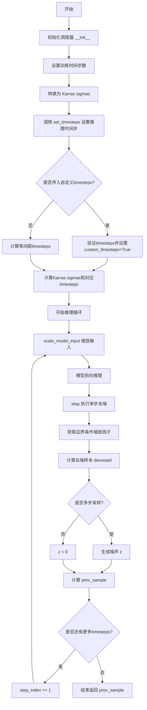
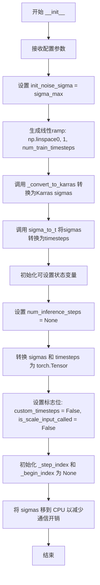
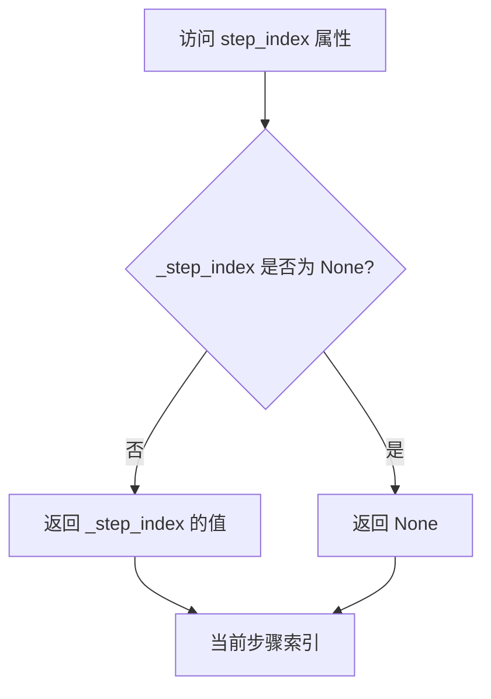
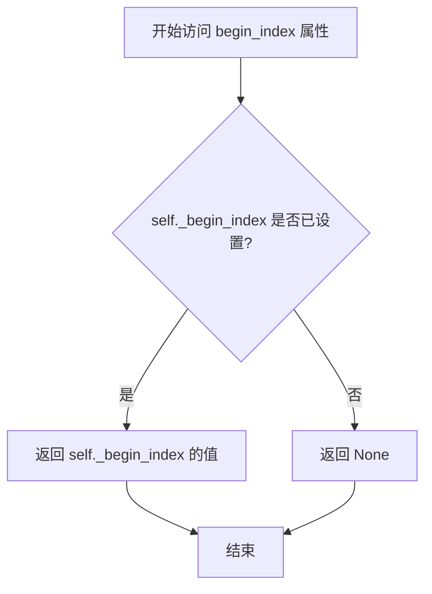
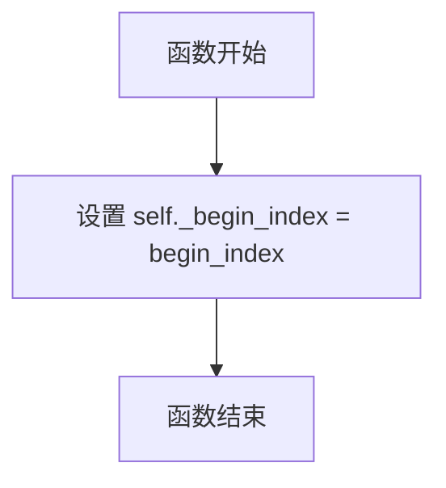
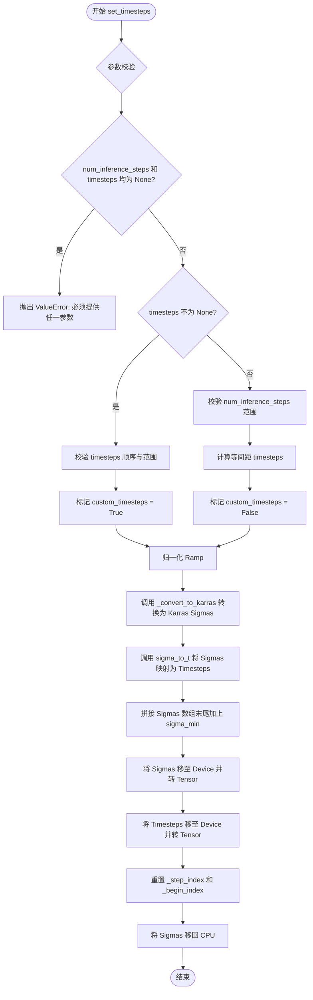
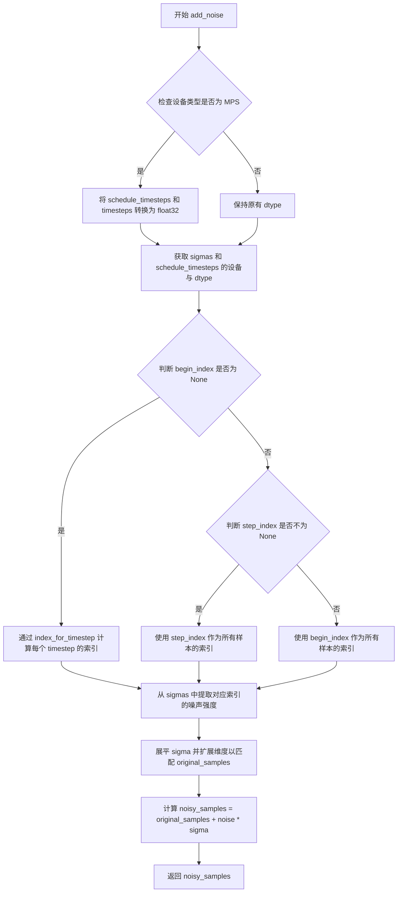
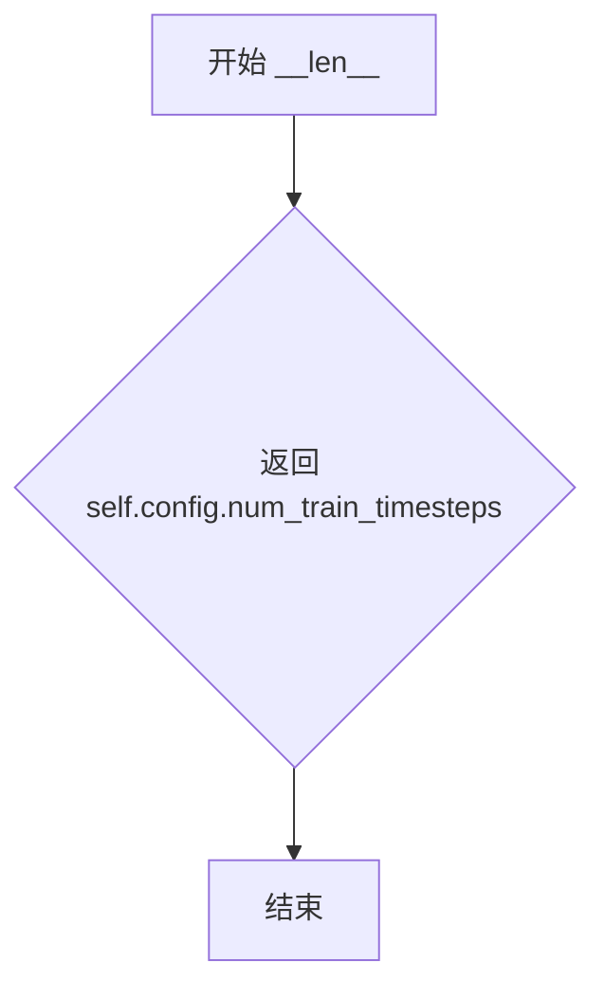

```mermaid
flowchart TD
    A[开始: sigma_to_t] --> B{输入 sigmas 是否为 numpy 数组?}
    B -->|否| C[使用 np.array 转换为 float64 类型]
    B -->|是| D[直接使用输入的 sigmas]
    C --> E[计算 timesteps = 1000 * 0.25 * np.log&#40;sigmas + 1e-44&#41;]
    D --> E
    E --> F[返回 timesteps 数组]
```

# `diffusers\src\diffusers\schedulers\scheduling_consistency_models.py` 详细设计文档

这是 Diffusers 库中的一致性模型（Consistency Model）随机迭代调度器实现，继承自 SchedulerMixin 和 ConfigMixin，用于多步和单步采样。该调度器实现了 EDM 论文中的 Karras sigma 调度策略，支持边界条件处理，能够在扩散过程中预测前一步的样本，是一致性模型生成的关键组件。

## 整体流程



## 类结构

```
SchedulerMixin (抽象基类)
└── CMStochasticIterativeScheduler
    └── CMStochasticIterativeSchedulerOutput (数据类)
```

## 全局变量及字段


### `logger`
    
模块级日志记录器，用于输出调度器相关日志信息

类型：`logging.Logger`
    


### `CMStochasticIterativeSchedulerOutput.prev_sample`
    
计算出的前一步去噪样本 (x_{t-1})，用于在去噪循环中作为下一个模型输入

类型：`torch.Tensor`
    


### `CMStochasticIterativeScheduler.order`
    
调度器的阶数，固定为1，表示单步调度

类型：`int`
    


### `CMStochasticIterativeScheduler.init_noise_sigma`
    
初始噪声分布的标准差，等于 sigma_max

类型：`float`
    


### `CMStochasticIterativeScheduler.num_inference_steps`
    
推理时使用的扩散步数

类型：`int`
    


### `CMStochasticIterativeScheduler.sigmas`
    
Karras sigma 调度数组，包含所有时间步的噪声水平

类型：`torch.Tensor`
    


### `CMStochasticIterativeScheduler.timesteps`
    
对应 sigmas 的时间步数组

类型：`torch.Tensor`
    


### `CMStochasticIterativeScheduler.custom_timesteps`
    
标志位，指示是否使用自定义时间步

类型：`bool`
    


### `CMStochasticIterativeScheduler.is_scale_input_called`
    
标志位，指示 scale_model_input 是否已被调用

类型：`bool`
    


### `CMStochasticIterativeScheduler._step_index`
    
当前推理步骤的索引

类型：`int`
    


### `CMStochasticIterativeScheduler._begin_index`
    
第一个时间步的索引，用于流水线中设置

类型：`int`
    
    

## 全局函数及方法


### CMStochasticIterativeScheduler.__init__

该方法是 `CMStochasticIterativeScheduler` 类的构造函数，用于初始化一致性模型的调度器。它接收训练步数、噪声范围、数据分布标准差等配置参数，通过注册配置、计算 Karras 噪声调度表并将结果转换为时间步，最后初始化推理所需的各类状态变量（如 sigmas、timesteps、step_index 等）。

参数：

- `num_train_timesteps`：`int`，训练时的扩散步数，默认40
- `sigma_min`：`float`，最小噪声水平，默认0.002
- `sigma_max`：`float`，最大噪声水平，默认80.0
- `sigma_data`：`float`，数据分布的标准差，默认0.5
- `s_noise`：`float`，额外噪声系数，默认1.0
- `rho`：`float`，Karras调度参数，默认7.0
- `clip_denoised`：`bool`，是否裁剪去噪输出到(-1,1)

返回值：`None`，无返回值（构造函数）

#### 流程图



#### 带注释源码

```python
@register_to_config
def __init__(
    self,
    num_train_timesteps: int = 40,      # 训练时的扩散步数
    sigma_min: float = 0.002,            # Karras噪声调度最小值
    sigma_max: float = 80.0,              # Karras噪声调度最大值
    sigma_data: float = 0.5,              # 数据分布标准差（EDM论文参数）
    s_noise: float = 1.0,                # 额外噪声系数
    rho: float = 7.0,                    # Karras调度器rho参数
    clip_denoised: bool = True,          # 是否裁剪去噪输出
) -> None:
    # 设置初始噪声分布的标准差（用于add_noise方法）
    self.init_noise_sigma = sigma_max

    # 生成0到1之间的线性间隔数组，作为Karras调度的输入
    ramp = np.linspace(0, 1, num_train_timesteps)
    
    # 使用Karras噪声调度将ramp转换为sigma值
    sigmas = self._convert_to_karras(ramp)
    
    # 将sigma值转换为对应的时间步（用于一致性模型输入）
    timesteps = self.sigma_to_t(sigmas)

    # ========== 可设置的推理相关状态变量 ==========
    
    # 推理步数（set_timesteps时设置）
    self.num_inference_steps = None
    
    # 将numpy数组转换为PyTorch张量并保存
    self.sigmas = torch.from_numpy(sigmas)
    self.timesteps = torch.from_numpy(timesteps)
    
    # 标志位：是否使用自定义时间步
    self.custom_timesteps = False
    
    # 标志位：是否已调用scale_model_input
    self.is_scale_input_called = False
    
    # 当前推理步索引（用于跟踪进度）
    self._step_index = None
    
    # 起始索引（用于流水线处理）
    self._begin_index = None
    
    # 将sigmas保留在CPU上以减少GPU/CPU通信开销
    # 注意：timesteps会根据device参数移动到对应设备
    self.sigmas = self.sigmas.to("cpu")
```


### `CMStochasticIterativeScheduler.step_index`

获取当前推理步骤索引的属性，用于在扩散模型的迭代采样过程中追踪当前处于第几步。

参数：此属性无参数

返回值：`int | None`，返回当前推理步骤的索引值，如果尚未初始化则返回 `None`

#### 流程图



#### 带注释源码

```python
@property
def step_index(self) -> int:
    """
    The index counter for current timestep. It will increase 1 after each scheduler step.

    Returns:
        `int` or `None`:
            The current step index, or `None` if not yet initialized.
    """
    # 返回私有属性 _step_index，该值在 _init_step_index 方法中被设置
    # 在调度器初始化时为 None，在 step 方法执行过程中会被更新
    return self._step_index
```

---

#### 上下文信息

**所属类**：`CMStochasticIterativeScheduler`

**相关私有属性**：
- `_step_index`：类型 `int | None`，存储当前推理步骤索引
- `_begin_index`：类型 `int | None`，用于设置起始索引

**相关方法**：
- `_init_step_index(timestep)`：初始化 `_step_index` 索引
- `set_begin_index(begin_index)`：设置起始索引
- `step(...)`：执行一步推理并递增 `_step_index`
- `set_timesteps(...)`：重置 `_step_index` 为 `None`

**关键组件**：
- `timesteps`：推理过程中的时间步序列
- `sigmas`：对应的噪声水平数组


### `CMStochasticIterativeScheduler.begin_index`

获取第一个时间步的索引。该属性返回调度器的起始索引，用于支持从管道的中间步骤开始采样。

参数：无

返回值：`int | None`，第一个时间步的索引，如果尚未设置（`None`）则返回 `None`

#### 流程图



#### 带注释源码

```python
@property
def begin_index(self) -> int:
    """
    The index for the first timestep. It should be set from pipeline with `set_begin_index` method.

    Returns:
        `int` or `None`:
            The begin index, or `None` if not yet set.
    """
    # 返回私有属性 _begin_index 的值
    # 该值通过 set_begin_index 方法从管道中设置
    # 如果尚未设置，则返回 None
    return self._begin_index
```


### `CMStochasticIterativeScheduler.set_begin_index`

设置调度器的开始索引，用于流水线推理前确定扩散过程从哪个时间步开始。

参数：

- `begin_index`：`int`，开始索引值，默认0

返回值：`None`，无返回值

#### 流程图



#### 带注释源码

```python
def set_begin_index(self, begin_index: int = 0) -> None:
    """
    Sets the begin index for the scheduler. This function should be run from pipeline before the inference.

    Args:
        begin_index (`int`, defaults to `0`):
            The begin index for the scheduler.
    """
    # 将传入的开始索引值赋值给实例变量 _begin_index
    # 该变量用于在流水线推理时指定从哪个时间步开始执行去噪过程
    self._begin_index = begin_index
```


### `CMStochasticIterativeScheduler.scale_model_input`

该方法根据当前时间步对应的 sigma 值和配置中的 sigma_data，对一致性模型的输入样本进行缩放，缩放因子为 `(sigma**2 + sigma_data**2) ** 0.5`，这是 EDM (Elucidating the Design Space of Diffusion-Based Generative Models) 论文中推荐的数据预处理方式，旨在使输入数据与噪声水平的尺度相匹配。

参数：

- `sample`：`torch.Tensor`，输入样本，待缩放的图像或潜在表示张量
- `timestep`：`float | torch.Tensor`，当前扩散链中的时间步，用于查找对应的 sigma 值

返回值：`torch.Tensor`，缩放后的输入样本

#### 流程图

```mermaid
flowchart TD
    A[开始 scale_model_input] --> B{step_index 是否为 None?}
    B -->|是| C[调用 _init_step_index 初始化步索引]
    B -->|否| D[继续执行]
    C --> E[从 self.sigmas 获取当前 sigma 值]
    D --> E
    E --> F[计算缩放因子: sqrt(sigma² + sigma_data²)]
    F --> G[sample = sample / 缩放因子]
    G --> H[设置 is_scale_input_called = True]
    H --> I[返回缩放后的 sample]
```

#### 带注释源码

```python
def scale_model_input(self, sample: torch.Tensor, timestep: float | torch.Tensor) -> torch.Tensor:
    """
    Scales the consistency model input by `(sigma**2 + sigma_data**2) ** 0.5`.

    根据 EDM 论文的建议，对输入样本进行缩放以匹配当前噪声水平。
    这种缩放方式可以确保模型输入与噪声分布具有一致的尺度。

    Args:
        sample (`torch.Tensor`):
            The input sample.
            输入样本，通常是噪声图像或潜在表示
        timestep (`float` or `torch.Tensor`):
            The current timestep in the diffusion chain.
            扩散链中的当前时间步，用于确定当前的噪声水平 sigma

    Returns:
        `torch.Tensor`:
            A scaled input sample.
            缩放后的输入样本，其尺度与当前 sigma 水平相匹配
    """
    # 检查步索引是否已初始化，若未初始化则根据 timestep 初始化
    # 这一步确保 scheduler 知道当前处于扩散过程的哪个步骤
    if self.step_index is None:
        self._init_step_index(timestep)

    # 从预定义的 sigma 数组中获取当前时间步对应的 sigma 值
    # sigma 表示当前噪声的标准差
    sigma = self.sigmas[self.step_index]

    # 根据 EDM 论文公式计算缩放因子: sqrt(sigma² + sigma_data²)
    # sigma_data 是数据分布的标准差（通常设为 0.5）
    # 这种缩放方式使得: sample_scaled * sigma ≈ 原数据 * sigma / sqrt(sigma² + sigma_data²)
    sample = sample / ((sigma**2 + self.config.sigma_data**2) ** 0.5)

    # 标记 scale_model_input 已被调用
    # 这是为了在后续 step() 方法中进行安全检查
    self.is_scale_input_called = True

    # 返回缩放后的样本，供后续去噪步骤使用
    return sample
```


### CMStochasticIterativeScheduler.sigma_to_t

将 Karras sigmas 转换为对应的时间步，用于一致性模型的输入。

参数：

- `sigmas`：`float | np.ndarray`，Karras sigma 值或数组

返回值：`np.ndarray`，转换后的时间步数组

#### 流程图



#### 带注释源码

```python
def sigma_to_t(self, sigmas: float | np.ndarray):
    """
    Gets scaled timesteps from the Karras sigmas for input to the consistency model.

    Args:
        sigmas (`float` or `np.ndarray`):
            A single Karras sigma or an array of Karras sigmas.

    Returns:
        `np.ndarray`:
            A scaled input timestep array.
    """
    # 如果输入不是 numpy 数组，则转换为 float64 类型的 numpy 数组
    # 以确保后续计算的数值精度和兼容性
    if not isinstance(sigmas, np.ndarray):
        sigmas = np.array(sigmas, dtype=np.float64)

    # 使用 EDM 论文中的公式将 sigma 转换为时间步
    # 公式: t = 1000 * 0.25 * log(sigma + 1e-44)
    # 1e-44 用于防止 log(0) 的数值不稳定
    timesteps = 1000 * 0.25 * np.log(sigmas + 1e-44)

    # 返回转换后的时间步数组
    return timesteps
```


### `CMStochasticIterativeScheduler.set_timesteps`

该方法负责为推理阶段设置时间步（timesteps）和噪声强度（sigmas）调度。它根据传入的推理步数或自定义时间步列表，计算并生成符合 Karras 分布的 sigma 序列和对应的时间步张量，同时处理设备转换和调度器状态的初始化。

参数：

- `num_inference_steps`：`int | None`，推理扩散步数，指定生成图像所需的去噪步数。
- `device`：`str | torch.device`，目标设备，指定生成的张量应放置在的计算设备（如 'cuda', 'cpu'）。
- `timesteps`：`list[int] | None`，自定义时间步列表，允许用户跳过等间距调度，传入任意递减的时间点序列。

返回值：`None`，无返回值。该方法直接修改调度器对象的内部状态（`self.timesteps`, `self.sigmas` 等），不返回任何数据。

#### 流程图



#### 带注释源码

```python
def set_timesteps(
    self,
    num_inference_steps: int | None = None,
    device: str | torch.device = None,
    timesteps: list[int] | None = None,
):
    """
    设置用于扩散链的时间步（在推理前运行）。

    Args:
        num_inference_steps (`int`, *optional*):
            使用预训练模型生成样本时使用的扩散步数。
        device (`str` or `torch.device`, *optional*):
            时间步应移动到的设备。如果为 `None`，则不移动时间步。
        timesteps (`list[int]`, *optional*):
            用于支持任意时间步间隔的自定义时间步。如果为 `None`，则使用默认的等间距策略。
            如果传入 `timesteps`，则 `num_inference_steps` 必须为 `None`。
    """
    # 1. 参数校验：必须二选一，不能同时为空或同时有值
    if num_inference_steps is None and timesteps is None:
        raise ValueError("Exactly one of `num_inference_steps` or `timesteps` must be supplied.")

    if num_inference_steps is not None and timesteps is not None:
        raise ValueError("Can only pass one of `num_inference_steps` or `timesteps`.")

    # 2. 处理自定义时间步逻辑
    if timesteps is not None:
        # 校验：timesteps 必须是严格递减的
        for i in range(1, len(timesteps)):
            if timesteps[i] >= timesteps[i - 1]:
                raise ValueError("`timesteps` must be in descending order.")

        # 校验：起始点不能超过训练步数
        if timesteps[0] >= self.config.num_train_timesteps:
            raise ValueError(
                f"`timesteps` must start before `self.config.train_timesteps`: {self.config.num_train_timesteps}."
            )

        timesteps = np.array(timesteps, dtype=np.int64)
        self.custom_timesteps = True
    else:
        # 3. 处理等间距时间步逻辑
        if num_inference_steps > self.config.num_train_timesteps:
            raise ValueError(
                f"`num_inference_steps`: {num_inference_steps} cannot be larger than `self.config.train_timesteps`:"
                f" {self.config.num_train_timesteps} as the unet model trained with this scheduler can only handle"
                f" maximal {self.config.num_train_timesteps} timesteps."
            )

        self.num_inference_steps = num_inference_steps

        # 计算步长间隔，并生成降序的时间步数组
        step_ratio = self.config.num_train_timesteps // self.num_inference_steps
        timesteps = (np.arange(0, num_inference_steps) * step_ratio).round()[::-1].copy().astype(np.int64)
        self.custom_timesteps = False

    # 4. 核心转换逻辑：将时间步转换为 Karras Sigmas
    # 参考: https://github.com/openai/consistency_models/blob/main/cm/karras_diffusion.py#L675
    num_train_timesteps = self.config.num_train_timesteps
    ramp = timesteps[::-1].copy() # 反转数组并归一化到 0-1
    ramp = ramp / (num_train_timesteps - 1)
    
    # 使用 Karras 公式转换
    sigmas = self._convert_to_karras(ramp)
    # 将 sigma 转换回对应的时间步 t
    timesteps = self.sigma_to_t(sigmas)

    # 5. 处理 Sigmas 数组
    # 在末尾添加最小的 sigma 值 (sigma_min)
    sigmas = np.concatenate([sigmas, [self.config.sigma_min]]).astype(np.float32)
    self.sigmas = torch.from_numpy(sigmas).to(device=device)

    # 6. 处理 Timesteps 数组
    # MPS 设备不支持 float64，强制转换为 float32
    if str(device).startswith("mps"):
        self.timesteps = torch.from_numpy(timesteps).to(device, dtype=torch.float32)
    else:
        self.timesteps = torch.from_numpy(timesteps).to(device=device)

    # 7. 重置调度器状态
    self._step_index = None
    self._begin_index = None
    # 将 sigmas 移回 CPU 以减少后续推理时的设备间通信开销
    self.sigmas = self.sigmas.to("cpu")
```


### CMStochasticIterativeScheduler._convert_to_karras

该方法根据EDM论文（Elucidating the Design Space of Diffusion-Based Generative Models）构建Karras噪声调度曲线，通过将0到1之间的线性插值数组转换为非线性的sigma值序列，实现从sigma_min到sigma_max的平滑过渡。

参数：

- `self`：`CMStochasticIterativeScheduler`类的实例
- `ramp`：`np.ndarray`，0到1之间的线性插值数组，用于在sigma_min和sigma_max之间进行插值

返回值：`np.ndarray`，Karras sigma调度数组

#### 流程图

```mermaid
flowchart TD
    A[开始] --> B[获取配置参数]
    B --> C[sigma_min = self.config.sigma_min]
    B --> D[sigma_max = self.config.sigma_max]
    B --> E[rho = self.config.rho]
    C --> F[计算min_inv_rho = sigma_min^(1/rho)]
    D --> G[计算max_inv_rho = sigma_max^(1/rho)]
    E --> H[计算sigmas = (max_inv_rho + ramp × (min_inv_rho - max_inv_rho))^rho]
    F --> H
    G --> H
    H --> I[返回sigmas数组]
    I --> J[结束]
```

#### 带注释源码

```python
def _convert_to_karras(self, ramp: np.ndarray) -> np.ndarray:
    """
    Construct the noise schedule as proposed in [Elucidating the Design Space of Diffusion-Based Generative
    Models](https://huggingface.co/papers/2206.00364).

    Args:
        ramp (`np.ndarray`):
            A ramp array of values between 0 and 1 used to interpolate between sigma_min and sigma_max.

    Returns:
        `np.ndarray`:
            The Karras sigma schedule array.
    """
    # 从配置中获取噪声调度器的最小和最大sigma值
    sigma_min: float = self.config.sigma_min
    sigma_max: float = self.config.sigma_max

    # 获取用于Karras调度的rho参数，控制sigma变换的非线性程度
    rho = self.config.rho
    
    # 计算sigma_min和sigma_max的rho次根的倒数
    # 这是Karras噪声调度的核心公式
    min_inv_rho = sigma_min ** (1 / rho)
    max_inv_rho = sigma_max ** (1 / rho)
    
    # 使用线性插值ramp在min_inv_rho和max_inv_rho之间进行插值
    # 然后对结果进行rho次幂运算，得到最终的sigma值序列
    # 这个公式确保了sigma值在低噪声区域有更细粒度的采样
    sigmas = (max_inv_rho + ramp * (min_inv_rho - max_inv_rho)) ** rho
    
    # 返回计算得到的Karras sigma调度数组
    return sigmas
```


### `CMStochasticIterativeScheduler.get_scalings`

计算一致性模型输出的缩放因子c_skip和c_out，该方法基于EDM论文中的参数化方式，根据当前sigma值和sigma_data配置计算两个缩放因子，用于对输入样本和模型输出进行加权组合。

参数：

- `sigma`：`torch.Tensor`，当前sigma值

返回值：`tuple[torch.Tensor, torch.Tensor]`，包含c_skip（输入样本的缩放因子）和c_out（模型输出的缩放因子）

#### 流程图

```mermaid
flowchart TD
    A[开始 get_scalings] --> B[获取 sigma_data 配置]
    B --> C[计算 c_skip = sigma_data² / (sigma² + sigma_data²)]
    D[计算 c_out = sigma × sigma_data / √(sigma² + sigma_data²)]
    C --> E[返回 (c_skip, c_out) 元组]
    D --> E
```

#### 带注释源码

```python
def get_scalings(self, sigma: torch.Tensor) -> tuple[torch.Tensor, torch.Tensor]:
    """
    Computes the scaling factors for the consistency model output.

    Args:
        sigma (`torch.Tensor`):
            The current sigma value in the noise schedule.

    Returns:
        `tuple[torch.Tensor, torch.Tensor]`:
            A tuple containing `c_skip` (scaling for the input sample) and `c_out` (scaling for the model output).
    """
    # 从配置中获取数据分布的标准差 sigma_data
    sigma_data = self.config.sigma_data

    # 计算 c_skip: 用于对输入样本进行缩放
    # 公式来源: EDM论文 Appendix C
    # c_skip = sigma_data^2 / (sigma^2 + sigma_data^2)
    c_skip = sigma_data**2 / (sigma**2 + sigma_data**2)
    
    # 计算 c_out: 用于对模型输出进行缩放
    # 公式来源: EDM论文 Appendix C
    # c_out = sigma * sigma_data / sqrt(sigma^2 + sigma_data^2)
    c_out = sigma * sigma_data / (sigma**2 + sigma_data**2) ** 0.5
    
    # 返回缩放因子元组
    return c_skip, c_out
```


### `CMStochasticIterativeScheduler.get_scalings_for_boundary_condition`

获取边界条件使用的缩放因子。该方法实现了Consistency Models论文（Appendix C）中规定的参数化方式，通过对sigma进行偏移计算来强制执行边界条件，其中epsilon被设置为sigma_min。

参数：

- `sigma`：`torch.Tensor`，当前sigma值

返回值：`tuple[torch.Tensor, torch.Tensor]`，包含两个元素的元组——第一个元素是`c_skip`（对当前样本的权重），第二个元素是`c_out`（对一致性模型输出的权重）

#### 流程图

```mermaid
flowchart TD
    A[开始] --> B[获取sigma_min从配置]
    B --> C[获取sigma_data从配置]
    C --> D[计算c_skip]
    D --> E[计算c_out]
    E --> F[返回tuple[c_skip, c_out]]
```

#### 带注释源码

```python
def get_scalings_for_boundary_condition(self, sigma: torch.Tensor) -> tuple[torch.Tensor, torch.Tensor]:
    """
    Gets the scalings used in the consistency model parameterization (from Appendix C of the
    [paper](https://huggingface.co/papers/2303.01469)) to enforce boundary condition.

    > [!TIP] > `epsilon` in the equations for `c_skip` and `c_out` is set to `sigma_min`.

    Args:
        sigma (`torch.Tensor`):
            The current sigma in the Karras sigma schedule.

    Returns:
        `tuple[torch.Tensor, torch.Tensor]`:
            A two-element tuple where `c_skip` (which weights the current sample) is the first element and `c_out`
            (which weights the consistency model output) is the second element.
    """
    # 从配置中获取最小sigma值（用于边界条件中的epsilon）
    sigma_min = self.config.sigma_min
    # 从配置中获取数据分布的标准差（EDM论文中的sigma_data）
    sigma_data = self.config.sigma_data

    # 计算c_skip：对输入样本的缩放因子
    # 使用偏移后的sigma (sigma - sigma_min) 来强制边界条件
    c_skip = sigma_data**2 / ((sigma - sigma_min) ** 2 + sigma_data**2)
    
    # 计算c_out：对模型输出的缩放因子
    # 使用偏移量 (sigma - sigma_min) 乘以sigma_data，再除以sigma与sigma_data平方和的平方根
    c_out = (sigma - sigma_min) * sigma_data / (sigma**2 + sigma_data**2) ** 0.5
    
    # 返回两个缩放因子元组
    return c_skip, c_out
```


### `CMStochasticIterativeScheduler.index_for_timestep`

在时间步调度中查找给定时间步的索引，用于确定当前时间步在调度序列中的位置。

参数：

-  `self`：`CMStochasticIterativeScheduler`，调度器实例本身
-  `timestep`：`float | torch.Tensor`，要查找的时间步值
-  `schedule_timesteps`：`torch.Tensor | None`，时间步调度表，默认为 `None`，使用 `self.timesteps`

返回值：`int`，给定时间步在调度序列中的索引。对于多步采样的第一步，如果存在多个匹配项，则返回第二个索引，以避免在调度中间启动时跳过 sigma 值。

#### 流程图

```mermaid
flowchart TD
    A[开始 index_for_timestep] --> B{schedule_timesteps 是否为 None?}
    B -->|是| C[使用 self.timesteps 作为调度表]
    B -->|否| D[使用传入的 schedule_timesteps]
    C --> E[在 schedule_timesteps 中查找与 timestep 匹配的所有索引]
    D --> E
    E --> F[获取所有匹配索引]
    F --> G{匹配索引数量 > 1?}
    G -->|是| H[pos = 1]
    G -->|否| I[pos = 0]
    H --> J[返回 indices[pos].item]
    I --> J
    K[结束]
```

#### 带注释源码

```python
def index_for_timestep(
    self, timestep: float | torch.Tensor, schedule_timesteps: torch.Tensor | None = None
) -> int:
    """
    Find the index of a given timestep in the timestep schedule.

    Args:
        timestep (`float` or `torch.Tensor`):
            The timestep value to find in the schedule.
        schedule_timesteps (`torch.Tensor`, *optional*):
            The timestep schedule to search in. If `None`, uses `self.timesteps`.

    Returns:
        `int`:
            The index of the timestep in the schedule. For the very first step, returns the second index if
            multiple matches exist to avoid skipping a sigma when starting mid-schedule (e.g., for image-to-image).
    """
    # 如果未提供 schedule_timesteps，则使用调度器默认的时间步列表
    if schedule_timesteps is None:
        schedule_timesteps = self.timesteps

    # 使用非零元素查找获取所有与给定 timestep 匹配的位置索引
    # 返回一个二维张量，每行是一个匹配项的索引坐标
    indices = (schedule_timesteps == timestep).nonzero()

    # 对于**非常**第一步采用的 sigma 索引始终是第二个索引（如果只有 1 个则使用最后一个索引）
    # 这样可以确保在去噪调度中间启动时（例如图像到图像）不会意外跳过 sigma
    # 这是因为在某些场景下（例如 img2img），起始时间步可能在调度表中出现多次
    pos = 1 if len(indices) > 1 else 0

    # 将选定索引位置的标量值提取为 Python int 并返回
    return indices[pos].item()
```


### `CMStochasticIterativeScheduler._init_step_index`

基于给定时间步初始化步骤索引，用于在调度器中定位当前执行到的步骤位置。

参数：

-  `timestep`：`float | torch.Tensor`，当前时间步

返回值：`None`，无返回值，直接修改内部状态 `_step_index`

#### 流程图

```mermaid
flowchart TD
    A[开始 _init_step_index] --> B{self._begin_index is None?}
    B -->|是| C{isinstance(timestep, torch.Tensor)?}
    C -->|是| D[timestep = timestep.to<br/>self.timesteps.device]
    C -->|否| E[跳过设备转换]
    D --> F[self._step_index =<br/>self.index_for_timestep<br/>timestep]
    B -->|否| G[self._step_index =<br/>self._begin_index]
    F --> H[结束]
    G --> H
```

#### 带注释源码

```python
def _init_step_index(self, timestep: float | torch.Tensor) -> None:
    """
    Initialize the step index for the scheduler based on the given timestep.

    Args:
        timestep (`float` or `torch.Tensor`):
            The current timestep to initialize the step index from.
    """
    # 检查是否需要从timestep计算索引
    # 当begin_index未设置时，需要通过timestep查找对应的步骤索引
    if self.begin_index is None:
        # 如果timestep是Tensor，需要确保其设备与self.timesteps一致
        # 以便进行后续的索引匹配操作
        if isinstance(timestep, torch.Tensor):
            timestep = timestep.to(self.timesteps.device)
        
        # 调用index_for_timestep方法在timesteps列表中查找
        # 对应的索引位置
        self._step_index = self.index_for_timestep(timestep)
    else:
        # 如果begin_index已设置，直接使用该值作为步骤索引
        # 这种方式适用于pipeline明确指定起始步骤的场景
        self._step_index = self._begin_index
```


### CMStochasticIterativeScheduler.step

该方法是CMStochasticIterativeScheduler类的核心推理方法，通过反向随机微分方程（SDE）从当前时间步预测前一个时间步的样本。它利用一致性模型的边界条件缩放因子对模型输出进行去噪处理，并结合随机噪声生成前一步的样本。

参数：

- `model_output`：`torch.Tensor`，模型输出（预测噪声）
- `timestep`：`float | torch.Tensor`，当前时间步
- `sample`：`torch.Tensor`，当前样本
- `generator`：`torch.Generator | None`，随机数生成器
- `return_dict`：`bool`，是否返回字典格式

返回值：`CMStochasticIterativeSchedulerOutput | tuple`，如果return_dict为True返回CMStochasticIterativeSchedulerOutput对象，否则返回(prev_sample,)元组

#### 流程图

```mermaid
flowchart TD
    A[step方法开始] --> B{检查timestep类型}
    B -->|整数类型| C[抛出ValueError]
    B -->|非整数| D{检查is_scale_input_called}
    D -->|False| E[发出警告日志]
    D -->|True| F[获取sigma和sigma_next]
    F --> G[调用get_scalings_for_boundary_condition获取c_skip和c_out]
    G --> H[计算denoised: c_out * model_output + c_skip * sample]
    H --> I{检查clip_denoised}
    I -->|True| J[denoised.clamp到-1到1]
    I -->|False| K[保持denoised不变]
    J --> L
    K --> L{检查timesteps长度}
    L -->|大于1| M[生成随机噪声z]
    L -->|等于1| N[z设为全零]
    M --> O
    N --> O[计算sigma_hat]
    O --> P[计算prev_sample: denoised + z * sqrt(sigma_hat² - sigma_min²)]
    P --> Q[step_index加1]
    Q --> R{return_dict}
    R -->|True| S[返回CMStochasticIterativeSchedulerOutput]
    R -->|False| T[返回tuple: (prev_sample,)]
    S --> U[结束]
    T --> U
```

#### 带注释源码

```python
def step(
    self,
    model_output: torch.Tensor,
    timestep: float | torch.Tensor,
    sample: torch.Tensor,
    generator: torch.Generator | None = None,
    return_dict: bool = True,
) -> CMStochasticIterativeSchedulerOutput | tuple:
    """
    Predict the sample from the previous timestep by reversing the SDE. This function propagates the diffusion
    process from the learned model outputs (most often the predicted noise).

    Args:
        model_output (`torch.Tensor`):
            The direct output from the learned diffusion model.
        timestep (`float` or `torch.Tensor`):
            The current timestep in the diffusion chain.
        sample (`torch.Tensor`):
            A current instance of a sample created by the diffusion process.
        generator (`torch.Generator`, *optional*):
            A random number generator.
        return_dict (`bool`, defaults to `True`):
            Whether or not to return a
            [`~schedulers.scheduling_consistency_models.CMStochasticIterativeSchedulerOutput`] or `tuple`.

    Returns:
        [`~schedulers.scheduling_consistency_models.CMStochasticIterativeSchedulerOutput`] or `tuple`:
            If return_dict is `True`,
            [`~schedulers.scheduling_consistency_models.CMStochasticIterativeSchedulerOutput`] is returned,
            otherwise a tuple is returned where the first element is the sample tensor.
    """

    # 检查timestep是否为整数索引类型，不支持直接从enumerate(timesteps)获取的整数索引
    if isinstance(timestep, (int, torch.IntTensor, torch.LongTensor)):
        raise ValueError(
            (
                "Passing integer indices (e.g. from `enumerate(timesteps)`) as timesteps to"
                f" `{self.__class__}.step()` is not supported. Make sure to pass"
                " one of the `scheduler.timesteps` as a timestep."
            ),
        )

    # 警告用户如果未调用scale_model_input，可能导致去噪不正确
    if not self.is_scale_input_called:
        logger.warning(
            "The `scale_model_input` function should be called before `step` to ensure correct denoising. "
            "See `StableDiffusionPipeline` for a usage example."
        )

    # 从配置中获取sigma的最小和最大边界值
    sigma_min = self.config.sigma_min
    sigma_max = self.config.sigma_max

    # 如果step_index未初始化，则根据timestep初始化它
    if self.step_index is None:
        self._init_step_index(timestep)

    # 获取当前步骤的sigma值（对应于当前时间步的噪声水平）
    sigma = self.sigmas[self.step_index]
    # 获取下一步的sigma值，用于计算前一个样本
    if self.step_index + 1 < self.config.num_train_timesteps:
        sigma_next = self.sigmas[self.step_index + 1]
    else:
        # 如果已经是最后一个训练时间步，将sigma_next设置为sigma_min
        sigma_next = self.sigmas[-1]

    # 获取边界条件的缩放因子，用于一致性模型的去噪
    c_skip, c_out = self.get_scalings_for_boundary_condition(sigma)

    # 1. 使用边界条件对模型输出进行去噪
    # 公式: denoised = c_out * model_output + c_skip * sample
    denoised = c_out * model_output + c_skip * sample
    # 可选地裁剪去噪后的结果到[-1, 1]范围
    if self.config.clip_denoised:
        denoised = denoised.clamp(-1, 1)

    # 2. 采样噪声 z ~ N(0, s_noise^2 * I)
    # 对于单步采样，不使用噪声
    if len(self.timesteps) > 1:
        # 使用randn_tensor生成与模型输出相同形状的随机噪声
        noise = randn_tensor(
            model_output.shape,
            dtype=model_output.dtype,
            device=model_output.device,
            generator=generator,
        )
    else:
        # 单步采样时使用零噪声
        noise = torch.zeros_like(model_output)
    # 将噪声乘以s_noise配置因子
    z = noise * self.config.s_noise

    # 对sigma_next进行裁剪，确保在合理范围内
    sigma_hat = sigma_next.clamp(min=sigma_min, max=sigma_max)

    # 3. 返回带噪声的样本
    # 公式: prev_sample = denoised + z * sqrt(sigma_hat^2 - sigma_min^2)
    # tau = sigma_hat, eps = sigma_min
    prev_sample = denoised + z * (sigma_hat**2 - sigma_min**2) ** 0.5

    # 完成一步后，将step_index增加1
    self._step_index += 1

    # 根据return_dict决定返回格式
    if not return_dict:
        return (prev_sample,)

    return CMStochasticIterativeSchedulerOutput(prev_sample=prev_sample)
```


### `CMStochasticIterativeScheduler.add_noise`

该方法根据噪声调度计划，在指定时间步将噪声添加到原始样本中，实现扩散模型的前向扩散过程。

参数：

- `self`：`CMStochasticIterativeScheduler` 实例本身
- `original_samples`：`torch.Tensor`，原始样本，即需要添加噪声的干净样本
- `noise`：`torch.Tensor`，噪声张量，要添加到原始样本的噪声
- `timesteps`：`torch.Tensor`，时间步张量，指定在哪些时间步添加噪声，用于从调度中确定噪声水平

返回值：`torch.Tensor`，添加噪声后的样本，噪声已根据时间步调度进行缩放

#### 流程图



#### 带注释源码

```python
def add_noise(
    self,
    original_samples: torch.Tensor,
    noise: torch.Tensor,
    timesteps: torch.Tensor,
) -> torch.Tensor:
    """
    Add noise to the original samples according to the noise schedule at the specified timesteps.

    Args:
        original_samples (`torch.Tensor`):
            The original samples to which noise will be added.
        noise (`torch.Tensor`):
            The noise tensor to add to the original samples.
        timesteps (`torch.Tensor`):
            The timesteps at which to add noise, determining the noise level from the schedule.

    Returns:
        `torch.Tensor`:
            The noisy samples with added noise scaled according to the timestep schedule.
    """
    # 确保 sigmas 与 original_samples 在同一设备且数据类型一致
    sigmas = self.sigmas.to(device=original_samples.device, dtype=original_samples.dtype)
    
    # MPS 设备不支持 float64，需转换为 float32
    if original_samples.device.type == "mps" and torch.is_floating_point(timesteps):
        # mps does not support float64
        schedule_timesteps = self.timesteps.to(original_samples.device, dtype=torch.float32)
        timesteps = timesteps.to(original_samples.device, dtype=torch.float32)
    else:
        schedule_timesteps = self.timesteps.to(original_samples.device)
        timesteps = timesteps.to(original_samples.device)

    # self.begin_index 为 None 时，表示调度器用于训练或 pipeline 未实现 set_begin_index
    if self.begin_index is None:
        # 为每个 timestep 查找对应的调度索引
        step_indices = [self.index_for_timestep(t, schedule_timesteps) for t in timesteps]
    elif self.step_index is not None:
        # add_noise 在第一次去噪步骤后调用（用于 inpainting）
        step_indices = [self.step_index] * timesteps.shape[0]
    else:
        # add_noise 在第一次去噪步骤前调用，用于创建初始 latent（img2img）
        step_indices = [self.begin_index] * timesteps.shape[0]

    # 从 sigmas 数组中获取对应 step_indices 的噪声强度值
    sigma = sigmas[step_indices].flatten()
    
    # 扩展 sigma 的维度以匹配 original_samples 的形状（支持批量处理）
    while len(sigma.shape) < len(original_samples.shape):
        sigma = sigma.unsqueeze(-1)

    # 根据公式添加噪声：noisy_samples = original_samples + noise * sigma
    noisy_samples = original_samples + noise * sigma
    return noisy_samples
```


### `CMStochasticIterativeScheduler.__len__`

返回训练时间步数量。

参数：

- （无参数，仅包含隐式参数 `self`）

返回值：`int`，返回调度器配置的训练时间步数量。

#### 流程图



#### 带注释源码

```python
def __len__(self) -> int:
    """
    返回训练时间步的数量。

    Returns:
        `int`:
            调度器配置的训练时间步数量。
    """
    # 从配置对象中获取训练时间步数量并返回
    # 该值在初始化时通过 num_train_timesteps 参数设置，默认值为 40
    return self.config.num_train_timesteps
```

## 关键组件


### 张量索引与惰性加载

该调度器使用惰性加载策略管理张量设备分配。`self.sigmas`和`self.timesteps`默认存储在CPU设备以减少CPU/GPU通信开销，仅在实际使用时通过`.to(device=device)`移动到目标设备。步进索引（`_step_index`和`_begin_index`）采用惰性初始化模式，在首次调用`step`或`scale_model_input`时才进行初始化，支持从管道中间开始采样的场景。

### Karras_sigma调度策略

该调度器实现了基于EDM论文的Karras噪声调度策略。核心参数包括`sigma_min`（默认0.002）、`sigma_max`（默认80.0）、`sigma_data`（默认0.5）和`rho`（默认7.0）。`_convert_to_karras`方法通过非线性插值构建sigma schedule，支持多步和单步采样模式。`sigma_to_t`方法将sigma值转换为timestep格式。

### 边界条件缩放因子

调度器实现了专门用于边界条件处理的缩放因子计算。`get_scalings_for_boundary_condition`方法根据Appendix C中的公式计算c_skip和c_out权重，用于在sigma接近sigma_min时确保边界条件的正确性。该方法在`step`函数中被调用以对模型输出进行去噪处理。

### 步进索引管理

调度器通过`step_index`和`begin_index`属性管理当前采样的位置。`_init_step_index`方法根据给定timestep查找对应的索引，`index_for_timestep`方法实现了精确匹配逻辑。为避免在图像到图像任务中跳过sigma值，初始步进索引固定为第二个位置（当存在多个匹配时）。

### 噪声注入机制

`add_noise`方法实现了前向扩散过程，根据timestep schedule向原始样本添加噪声。该方法支持训练场景（`begin_index`为None）和推理场景（通过`set_begin_index`设置起始位置）的噪声添加。对于MPS设备进行了特殊处理，将float64转换为float32以兼容硬件限制。

### 模型输出去噪与采样

`step`方法实现了反向扩散过程的核心逻辑。通过边界条件缩放因子对模型输出进行处理，应用可选的clamp操作限制输出范围，然后根据s_noise参数添加随机噪声。对于单步采样场景（`len(self.timesteps) <= 1`），噪声被置零以保持确定性。

### 设备兼容性处理

调度器在多个位置处理了不同设备间的兼容性问题。MPS设备不支持float64类型，因此在`set_timesteps`和`add_noise`方法中将timesteps显式转换为float32。同时确保sigmas和timesteps与输入样本的设备和数据类型一致。


## 问题及建议


### 已知问题

-   **硬编码设备管理**：在 `__init__` 和 `set_timesteps` 方法中硬编码 `.to("cpu")`，可能导致设备管理不一致和潜在的性能问题，特别是在 CUDA 环境下重复传输数据
-   **未使用的参数**：`step` 方法中 `generator` 参数被传入但未在采样逻辑中使用（仅在生成噪声时可用，但单步采样时被忽略），文档说明不完整
-   **魔法数字与硬编码值**：`sigma_to_t` 方法中的 `1000 * 0.25` 和 `1e-44` 等数值缺乏明确含义，增加了维护难度
-   **重复代码**：`index_for_timestep` 和 `_init_step_index` 方法标注为"Copied from"，存在代码重复问题，违反了 DRY 原则
-   **类型注解混用**：同时使用了 Python 3.10+ 的联合类型注解（如 `float | torch.Tensor`）和旧版 `Optional` 注解，降低了兼容性
-   **状态管理复杂性**：`_step_index` 和 `_begin_index` 的条件判断逻辑复杂，容易在异常流程下导致状态不一致
-   **设备转换开销**：`add_noise` 方法中每次调用都执行设备转换操作，在批量处理时可能影响性能

### 优化建议

-   **重构设备管理**：使用设备标志或上下文管理器统一处理 CPU/GPU 数据传输，避免硬编码
-   **补充文档**：为 `generator` 参数添加使用说明，明确其在不同采样模式下的行为
-   **提取常量**：将魔法数字提取为类常量或配置参数，添加有意义的命名和注释
-   **消除重复代码**：将公共方法提取到基类或混入类中，通过继承或组合复用逻辑
-   **统一类型注解**：根据项目 Python 版本要求，统一使用 `Optional` 或联合类型注解
-   **简化状态管理**：使用枚举或状态机模式清晰定义调度器的不同状态
-   **缓存设备信息**：在类初始化时缓存设备信息，减少运行时设备转换
-   **添加输入验证**：在 `step` 方法中增加对 `model_output` 和 `sample` 形状兼容性的检查


## 其它


### 设计目标与约束

本调度器实现一致性模型（Consistency Models）的多步和单步采样，遵循EDM论文中定义的Karras sigma调度策略。设计目标是提供一个高效、可配置的扩散过程逆向调度器，支持自定义时间步调度和边界条件处理。核心约束包括：训练时间步数默认40步，sigma范围[0.002, 80.0]，仅支持一阶采样（order=1），且时间步必须按降序排列。

### 错误处理与异常设计

本调度器包含多层次错误处理机制。在`set_timesteps`方法中：必须且仅能指定`num_inference_steps`或`timesteps`其中之一；自定义`timesteps`必须满足降序排列且起始值小于训练时间步数；`num_inference_steps`不能超过训练时间步数。在`step`方法中：不支持传入整数索引作为timestep；必须先调用`scale_model_input`否则产生警告；通过`_step_index`和`_begin_index`防止重复或遗漏步骤。所有验证错误均抛出`ValueError`并携带描述性错误信息。

### 数据流与状态机

调度器状态转换遵循以下流程：初始化时设置sigmas和timesteps数组；每次调用`step`前需调用`scale_model_input`获取当前sigma值；`step`方法根据`step_index`获取当前和下一时刻的sigma，计算边界条件缩放因子c_skip和c_out，对模型输出去噪并添加噪声生成上一时刻样本，最后递增`step_index`。状态机包含三种状态：未初始化（`_step_index=None`）、运行中（`_step_index`有效且未达到最后一步）、完成（`step_index`超出范围）。`add_noise`方法实现逆向过程，根据timesteps向样本添加指定强度的噪声。

### 外部依赖与接口契约

本类依赖以下外部组件：`SchedulerMixin`提供通用调度器接口（保存/加载）；`ConfigMixin`+`register_to_config`装饰器实现配置注册与序列化；`BaseOutput`作为输出数据结构基类；`randn_tensor`工具函数生成符合形状的随机张量；`logging`模块记录运行时警告。公开接口契约：`scale_model_input`必须先于`step`调用；`set_timesteps`应在推理前调用；`step`返回`CMStochasticIterativeSchedulerOutput`包含prev_sample字段；`add_noise`用于训练阶段或图像到图像任务。所有张量操作需保持设备（cpu/cuda/mps）和数据类型一致。

### 数学基础与算法原理

本调度器基于EDM（Elucidating the Design Space of Diffusion-Based Generative Models）论文实现。核心算法：Karras sigma调度通过`rho`参数将线性ramp映射到非线性sigma空间；sigma_to_t将sigma转换为时间步t=1000*0.25*log(sigma+1e-44)；边界条件缩放因子c_skip和c_out参考一致性模型论文（附录C），用于在sigma接近sigma_min时维持数值稳定性。采样公式：prev_sample = denoised + z * sqrt(sigma_hat² - sigma_min²)，其中denoised = c_out * model_output + c_skip * sample。

### 配置参数详解

所有配置参数通过`@register_to_config`装饰器注册：num_train_timesteps（默认40）定义训练时的扩散步数；sigma_min（默认0.002）和sigma_max（默认80.0）定义噪声幅度范围；sigma_data（默认0.5）定义数据分布标准差用于缩放计算；s_noise（默认1.0）控制额外噪声强度以补偿细节损失；rho（默认7.0）控制Karras调度的曲率；clip_denoised（默认True）是否将去噪结果裁剪到[-1,1]区间。

### 设备兼容性与内存优化

调度器针对多设备进行优化：sigmas默认存储在CPU以减少CPU/GPU通信开销；MPS设备不支持float64因此转换为float32；`add_noise`方法在执行前将sigmas和timesteps移动到与original_samples相同的设备和数据类型。当使用MPS时需特别注意时间步张量的类型转换以避免运行时错误。

### 与其他调度器的差异

相比EulerDiscreteScheduler和DPMSolverMultistepScheduler，本调度器专注于一致性模型采样。主要差异：使用边界条件缩放（get_scalings_for_boundary_condition）而非标准EDM缩放；在sigma接近sigma_min时使用特殊处理避免数值不稳定；支持one-step采样（len(self.timesteps)==1时跳过噪声添加）；继承自SchedulerMixin和ConfigMixin而非直接实现完整接口。

### 使用示例与典型场景

典型推理流程：1) 创建调度器实例；2) 调用set_timesteps设置推理步数；3) 在去噪循环中：先调用scale_model_input缩放输入，再调用step获取上一步样本；4) 循环直到达到目标时间步。典型训练场景：调用add_noise向干净样本添加噪声用于训练一致性模型。图像到图像任务：可使用set_begin_index从中间步骤开始采样。


    