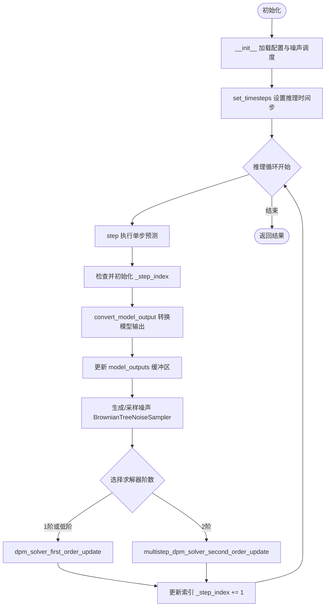
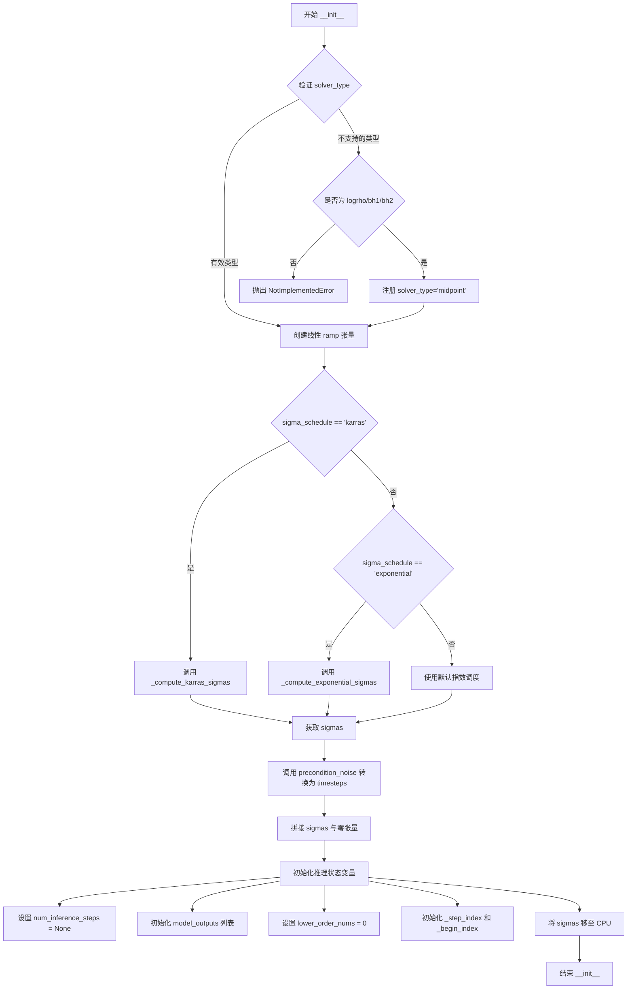
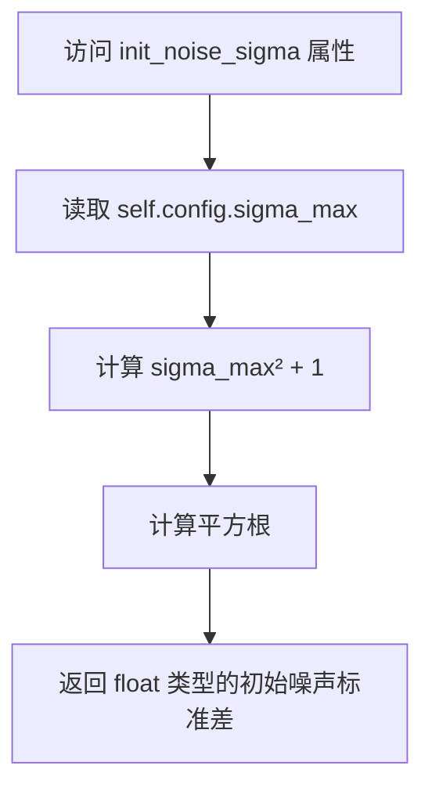
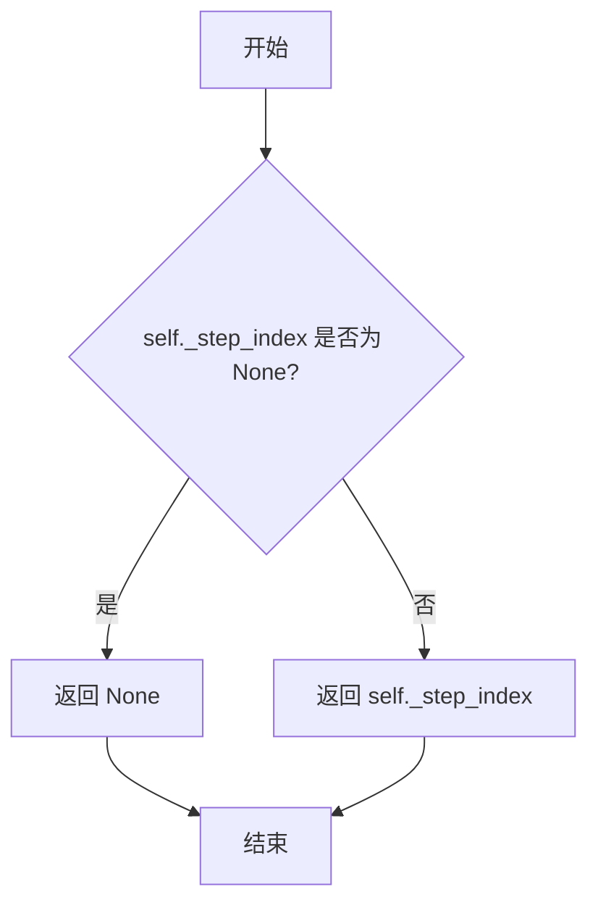
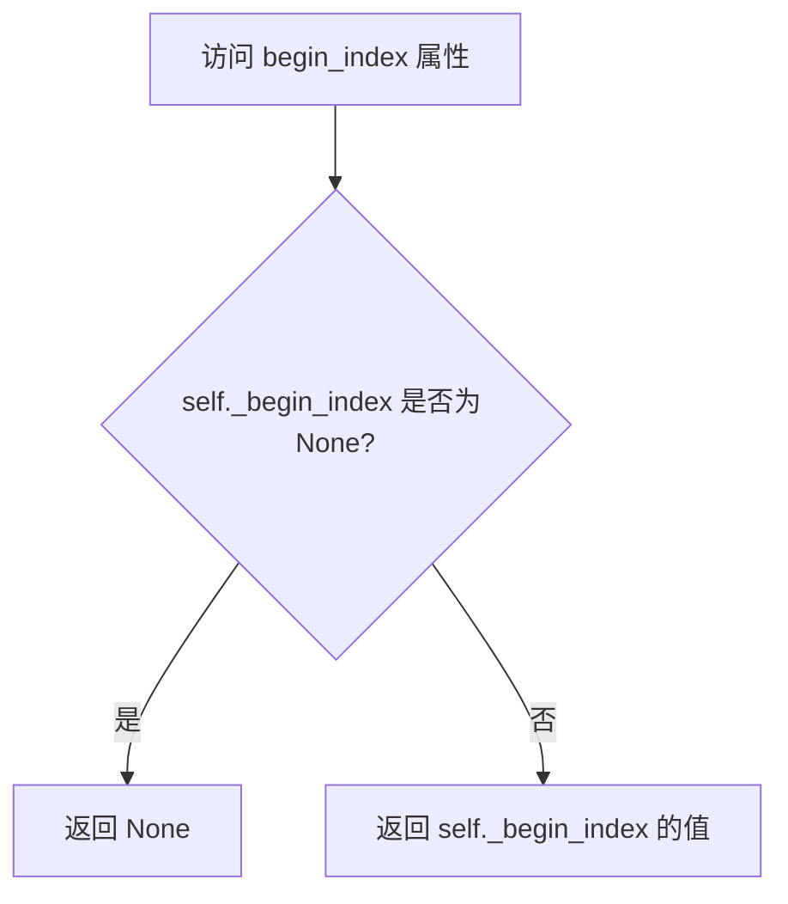
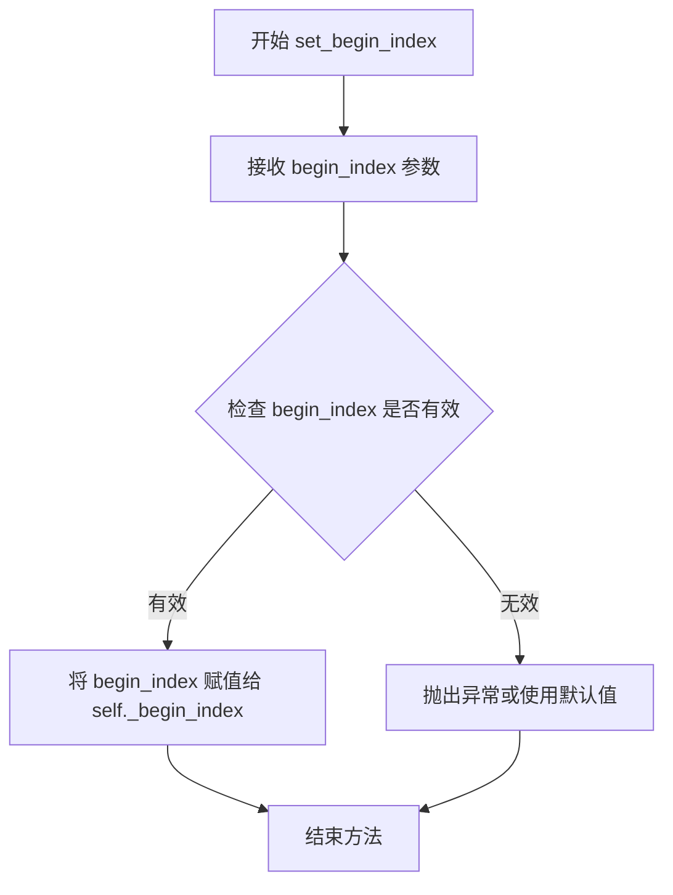
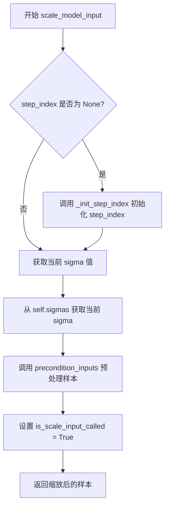
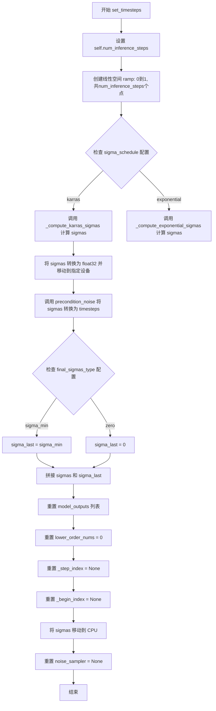
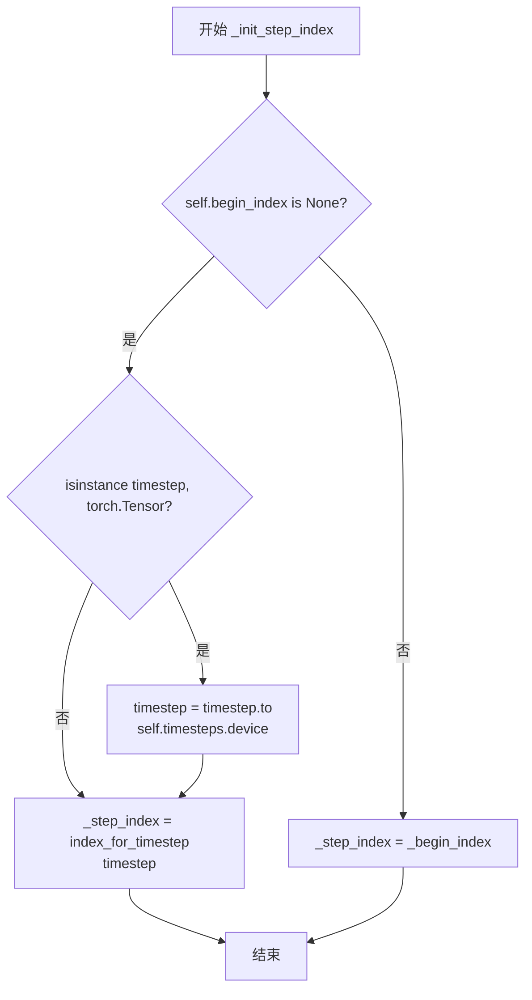

# `diffusers\src\diffusers\schedulers\scheduling_cosine_dpmsolver_multistep.py` 详细设计文档

这是一个实现了 DPM-Solver 多步求解器变体的扩散调度器，结合了余弦噪声调度（Cosine Schedule）与 EDM 预处理（Preconditioning），主要用于 Stable Audio Open 等生成模型的逆扩散采样过程，通过多阶求解器逐步从噪声中恢复出目标样本。

## 整体流程



## 类结构

```
CosineDPMSolverMultistepScheduler (核心调度器类)
├── SchedulerMixin (调度器抽象基类，提供通用加载/保存方法)
└── ConfigMixin (配置抽象基类，提供配置注册与访问方法)
```

## 全局变量及字段


### `CosineDPMSolverMultistepScheduler.sigma_min`
    
最小噪声水平，配置参数，用于设置sigma调度范围的最小值

类型：`float`
    


### `CosineDPMSolverMultistepScheduler.sigma_max`
    
最大噪声水平，配置参数，用于设置sigma调度范围的最大值

类型：`float`
    


### `CosineDPMSolverMultistepScheduler.sigma_data`
    
数据分布标准差，EDM公式中的sigma_data参数，用于计算c_skip和c_out

类型：`float`
    


### `CosineDPMSolverMultistepScheduler.sigma_schedule`
    
噪声调度策略，可选'exponential'或'karras'，决定如何生成sigma序列

类型：`str`
    


### `CosineDPMSolverMultistepScheduler.num_train_timesteps`
    
训练时的总时间步数，默认1000，扩散模型训练时的时间步数量

类型：`int`
    


### `CosineDPMSolverMultistepScheduler.solver_order`
    
DPMSolver阶数，支持1或2阶求解，推荐使用2阶以获得更好的采样质量

类型：`int`
    


### `CosineDPMSolverMultistepScheduler.prediction_type`
    
预测类型，可选'epsilon'、'sample'或'v_prediction'，决定模型预测的目标

类型：`str`
    


### `CosineDPMSolverMultistepScheduler.rho`
    
Karras噪声调度公式中的rho参数，用于控制sigma_schedule为'karras'时的调度曲线形状

类型：`float`
    


### `CosineDPMSolverMultistepScheduler.solver_type`
    
求解器类型，可选'midpoint'或'heun'，决定二阶求解器的数值计算方式

类型：`str`
    


### `CosineDPMSolverMultistepScheduler.lower_order_final`
    
是否在最后几步使用低阶求解，用于在少于15步推理时提高数值稳定性

类型：`bool`
    


### `CosineDPMSolverMultistepScheduler.euler_at_final`
    
是否在最后一步使用欧拉法，是数值稳定性和细节丰富度之间的权衡

类型：`bool`
    


### `CosineDPMSolverMultistepScheduler.final_sigmas_type`
    
最终sigma值类型，可选'zero'或'sigma_min'，决定采样结束时sigma的值

类型：`str`
    


### `CosineDPMSolverMultistepScheduler.timesteps`
    
预处理后的时间步张量，通过precondition_noise将sigma转换为对应的timestep表示

类型：`torch.Tensor`
    


### `CosineDPMSolverMultistepScheduler.sigmas`
    
对应的噪声水平sigma张量，包含从sigma_max到最终sigma值的完整调度序列

类型：`torch.Tensor`
    


### `CosineDPMSolverMultistepScheduler.num_inference_steps`
    
推理时的时间步数量，在set_timesteps方法中设置，控制采样时的去噪步数

类型：`int`
    


### `CosineDPMSolverMultistepScheduler.model_outputs`
    
保存历史模型输出用于多步求解，列表长度为solver_order，存储最近solver_order步的模型输出

类型：`list`
    


### `CosineDPMSolverMultistepScheduler.lower_order_nums`
    
当前已使用的低阶求解次数，用于跟踪在多步求解过程中使用了多少次低阶近似

类型：`int`
    


### `CosineDPMSolverMultistepScheduler._step_index`
    
当前推理步骤的索引，指向当前正在执行的去噪步骤

类型：`int`
    


### `CosineDPMSolverMultistepScheduler._begin_index`
    
推理起始索引，用于图像修复等场景，可以从中间步骤开始推理

类型：`int`
    


### `CosineDPMSolverMultistepScheduler.noise_sampler`
    
布朗树噪声采样器，用于SDE变体的随机噪声生成，在step方法中初始化

类型：`BrownianTreeNoiseSampler`
    


### `CosineDPMSolverMultistepScheduler.order`
    
类属性，当前调度器阶数，默认为1，用于兼容旧版接口

类型：`int`
    


### `CosineDPMSolverMultistepScheduler._compatibles`
    
类属性，兼容的调度器列表，用于调度器兼容性检查

类型：`list`
    
    

## 全局函数及方法


### `CosineDPMSolverMultistepScheduler.__init__`

该构造函数是 `CosineDPMSolverMultistepScheduler` 类的初始化方法，负责配置扩散模型调度器的各种参数，包括噪声调度参数、求解器配置和预测类型，并初始化内部状态以支持多步DPM-Solver算法的运行。

参数：

- `sigma_min`：`float`，默认值 `0.3`，噪声调度中的最小噪声幅度，对应Stable Audio Open论文中的设置
- `sigma_max`：`float`，默认值 `500`，噪声调度中的最大噪声幅度，对应Stable Audio Open论文中的设置
- `sigma_data`：`float`，默认值 `1.0`，数据分布的标准差，用于EDM公式计算
- `sigma_schedule`：`Literal["exponential", "karras"]`，默认值 `"exponential"`，Sigma调度类型，可选指数调度或Karras调度
- `num_train_timesteps`：`int`，默认值 `1000`，扩散模型训练的步骤数
- `solver_order`：`int`，默认值 `2`，DPMSolver的阶数，支持1阶或2阶求解器
- `prediction_type`：`Literal["epsilon", "sample", "v_prediction"]`，默认值 `"v_prediction"`，预测类型，决定模型预测的内容
- `rho`：`float`，默认值 `7.0`，Karras sigma调度公式中的参数
- `solver_type`：`Literal["midpoint", "heun"]`，默认值 `"midpoint"`，二阶求解器类型，影响采样质量
- `lower_order_final`：`bool`，默认值 `True`，是否在推理步数少于15时使用低阶求解器以增强稳定性
- `euler_at_final`：`bool`，默认值 `False`，是否在最后一步使用欧拉方法
- `final_sigmas_type`：`Literal["zero", "sigma_min"]`，默认值 `"zero"`，最终sigma值的类型

返回值：`None`，构造函数无返回值

#### 流程图



#### 带注释源码

```python
@register_to_config
def __init__(
    self,
    sigma_min: float = 0.3,
    sigma_max: float = 500,
    sigma_data: float = 1.0,
    sigma_schedule: Literal["exponential", "karras"] = "exponential",
    num_train_timesteps: int = 1000,
    solver_order: int = 2,
    prediction_type: Literal["epsilon", "sample", "v_prediction"] = "v_prediction",
    rho: float = 7.0,
    solver_type: Literal["midpoint", "heun"] = "midpoint",
    lower_order_final: bool = True,
    euler_at_final: bool = False,
    final_sigmas_type: Literal["zero", "sigma_min"] = "zero",
) -> None:
    # 验证 solver_type 参数的有效性
    # 如果是不支持的旧版类型（logrho, bh1, bh2），自动映射到 midpoint
    if solver_type not in ["midpoint", "heun"]:
        if solver_type in ["logrho", "bh1", "bh2"]:
            self.register_to_config(solver_type="midpoint")
        else:
            raise NotImplementedError(f"{solver_type} is not implemented for {self.__class__}")

    # 创建从0到1的线性间隔张量，用于后续sigma调度计算
    # ramp 用于在最小和最大sigma之间进行插值
    ramp = torch.linspace(0, 1, num_train_timesteps)
    
    # 根据 sigma_schedule 配置选择计算sigma的方式
    # Karras调度来自Karras et al. 2022论文，采用对数空间的线性插值
    # Exponential调度采用指数形式，适合大多数扩散模型
    if sigma_schedule == "karras":
        sigmas = self._compute_karras_sigmas(ramp)
    elif sigma_schedule == "exponential":
        sigmas = self._compute_exponential_sigmas(ramp)

    # 将sigma值转换为对应的时间步表示
    # 使用 atan(sigma) / pi * 2 进行预处理，符合EDM公式
    self.timesteps = self.precondition_noise(sigmas)

    # 将计算得到的sigmas与零张量拼接
    # 末尾的零sigma用于表示扩散过程的最终状态（纯数据）
    self.sigmas = torch.cat([sigmas, torch.zeros(1, device=sigmas.device)])

    # 初始化可设置的推理状态变量
    # 这些变量将在 set_timesteps 和 step 方法中被更新
    self.num_inference_steps = None  # 推理时使用的步数
    self.model_outputs = [None] * solver_order  # 保存历史模型输出用于多步求解
    self.lower_order_nums = 0  # 低阶求解器已使用次数
    self._step_index = None  # 当前推理步骤索引
    self._begin_index = None  # 推理起始索引
    
    # 将sigmas移至CPU以减少频繁的CPU/GPU通信开销
    # 这是出于性能优化的考虑
    self.sigmas = self.sigmas.to("cpu")
```


### `CosineDPMSolverMultistepScheduler.init_noise_sigma`

该属性用于获取扩散模型采样的初始噪声标准差。它根据配置文件中的 `sigma_max` 值计算初始噪声水平，返回值为 $\sqrt{\sigma_{max}^2 + 1}$，这是 EDM (Elucidating the Design Space of Diffusion Models) 公式中标准的初始噪声定义。

参数： 无（该方法为属性，只包含隐式参数 `self`）

返回值：`float`，返回初始噪声 sigma 值，计算公式为 `sqrt(sigma_max^2 + 1)`。

#### 流程图



#### 带注释源码

```python
@property
def init_noise_sigma(self) -> float:
    """
    The standard deviation of the initial noise distribution.

    Returns:
        `float`:
            The initial noise sigma value computed as `sqrt(sigma_max^2 + 1)`.
    """
    # 计算初始噪声标准差：sqrt(sigma_max² + 1)
    # 这是 EDM 论文中定义的标准初始化方式
    # sigma_max 来自配置文件，默认值为 500
    return (self.config.sigma_max**2 + 1) ** 0.5
```


### `CosineDPMSolverMultistepScheduler.step_index`

该属性是 `CosineDPMSolverMultistepScheduler` 调度器类中的一个只读属性，用于获取当前推理步的索引计数器。该索引在每次调度器 step 操作后会自动增加 1，如果尚未初始化则返回 `None`。

参数： 无（该属性不需要额外参数，`self` 为隐式参数）

返回值：`int | None`，返回当前推理步索引，如果尚未初始化则返回 `None`

#### 流程图



#### 带注释源码

```python
@property
def step_index(self) -> int:
    """
    The index counter for current timestep. It will increase 1 after each scheduler step.

    Returns:
        `int` or `None`:
            The current step index, or `None` if not yet initialized.
    """
    return self._step_index
```

---

#### 补充说明

| 项目 | 描述 |
|------|------|
| **属性类型** | 只读属性（Read-only Property） |
| **内部变量** | `_step_index`：`int | None`，调度器的内部步索引计数器 |
| **初始化时机** | 在 `_init_step_index()` 方法中被赋值，通常在第一次调用 `step()` 方法时初始化 |
| **更新时机** | 在 `step()` 方法结束时通过 `self._step_index += 1` 更新 |
| **用途** | 用于跟踪扩散模型推理过程中的当前步数，以便正确访问 `self.sigmas` 等数组 |
| **相关属性** | `begin_index`：起始索引，用于支持从 pipeline 中设置起始位置 |


### `CosineDPMSolverMultistepScheduler.begin_index`

该属性用于获取调度器的第一个时间步索引。它是一个只读属性，返回当前设置的起始索引值，如果尚未通过 `set_begin_index` 方法设置，则返回 `None`。

参数：无需参数（仅包含隐式参数 `self`）

返回值：`int` 或 `None`，表示调度器的起始索引，如果尚未设置则返回 `None`

#### 流程图



#### 带注释源码

```python
@property
def begin_index(self) -> int:
    """
    The index for the first timestep. It should be set from pipeline with `set_begin_index` method.

    Returns:
        `int` or `None`:
            The begin index, or `None` if not yet set.
    """
    return self._begin_index
```


### `CosineDPMSolverMultistepScheduler.set_begin_index`

设置调度器的起始索引，用于在推理前从管道中调用，以便正确地从指定的timestep开始采样。

参数：

- `begin_index`：`int`，默认值 `0`，调度器的起始索引，用于指定从哪个时间步开始推理。

返回值：`None`，无返回值。该方法仅修改内部状态 `_begin_index`。

#### 流程图



#### 带注释源码

```python
def set_begin_index(self, begin_index: int = 0) -> None:
    """
    设置调度器的起始索引。此方法应在推理前从管道中调用。

    参数:
        begin_index (`int`, 默认为 `0`):
            调度器的起始索引。
    """
    # 将传入的 begin_index 参数赋值给实例变量 _begin_index
    # 该变量用于记录推理过程的起始时间步索引
    # 在后续的 step 方法和 add_noise 方法中会使用此值来确定
    # 当前的推理进度和噪声添加的起始点
    self._begin_index = begin_index
```


### `CosineDPMSolverMultistepScheduler.precondition_inputs`

该方法负责对扩散模型的输入样本进行预处理（Preconditioning）。根据 EDM（Elucidating the Design Space of Diffusion Models）公式，它通过计算条件因子 $c_{in}$（即 $1 / \sqrt{\sigma^2 + \sigma_{data}^2}$）并将其应用于输入样本，从而在不同的噪声水平下对输入进行归一化处理，确保模型能够正确预测噪声或数据。

参数：

- `sample`：`torch.Tensor`，需要进行预处理的输入样本张量（通常为潜在表征或图像）。
- `sigma`：`float | torch.Tensor`，当前扩散过程的噪声水平（Sigma值）。

返回值：`torch.Tensor`，经过缩放处理后的样本张量。

#### 流程图

```mermaid
flowchart TD
    A([开始预处理]) --> B{调用 _get_conditioning_c_in}
    B --> C[计算 c_in = 1 / sqrt(sigma^2 + sigma_data^2)]
    C --> D[计算 scaled_sample = sample * c_in]
    D --> E([返回 scaled_sample])
```

#### 带注释源码

```python
def precondition_inputs(self, sample: torch.Tensor, sigma: float | torch.Tensor) -> torch.Tensor:
    """
    Precondition the input sample by scaling it according to the EDM formulation.

    Args:
        sample (`torch.Tensor`):
            The input sample tensor to precondition.
        sigma (`float` or `torch.Tensor`):
            The current sigma (noise level) value.

    Returns:
        `torch.Tensor`:
            The scaled input sample.
    """
    # 1. 获取当前噪声水平对应的 EDM 输入缩放因子 c_in
    # 公式: c_in = 1 / sqrt(sigma^2 + sigma_data^2)
    # 这确保了输入数据的方差在不同噪声水平下保持相对稳定
    c_in = self._get_conditioning_c_in(sigma)
    
    # 2. 对输入样本进行缩放
    scaled_sample = sample * c_in
    
    # 3. 返回预处理后的样本
    return scaled_sample
```


### `CosineDPMSolverMultistepScheduler.precondition_noise`

噪声预处理，将 sigma（噪声水平）转换为归一化的时间步表示形式。该方法通过 arctan 函数将 sigma 值映射到 [0, 1] 范围内，用于与扩散模型的输出进行匹配。

参数：

- `sigma`：`float | torch.Tensor`，要预处理的 sigma（噪声水平）值

返回值：`torch.Tensor`，计算得到的预处理噪声值，公式为 `atan(sigma) / pi * 2`

#### 流程图

```mermaid
flowchart TD
    A[开始: precondition_noise] --> B{sigma 是否为 torch.Tensor?}
    B -->|否| C[将 sigma 转换为 torch.tensor([sigma])]
    B -->|是| D[保持原值]
    C --> E[应用 atan 变换: sigma.atan()]
    D --> E
    E --> F[计算返回值: sigma.atan / math.pi * 2]
    F --> G[返回预处理后的 tensor]
```

#### 带注释源码

```python
def precondition_noise(self, sigma: float | torch.Tensor) -> torch.Tensor:
    """
    Precondition the noise level by computing a normalized timestep representation.

    Args:
        sigma (`float` or `torch.Tensor`):
            The sigma (noise level) value to precondition.

    Returns:
        `torch.Tensor`:
            The preconditioned noise value computed as `atan(sigma) / pi * 2`.
    """
    # 如果 sigma 不是 torch.Tensor，则将其转换为 tensor
    # 这是为了确保后续的 atan 操作可以在 tensor 上执行
    if not isinstance(sigma, torch.Tensor):
        sigma = torch.tensor([sigma])

    # 使用 atan 函数将 sigma 映射到 [0, 1] 区间
    # 公式: atan(sigma) / π * 2
    # 当 sigma = 0 时，返回值为 0
    # 当 sigma → ∞ 时，返回值趋近于 1
    return sigma.atan() / math.pi * 2
```


### `CosineDPMSolverMultistepScheduler.precondition_outputs`

该方法根据 EDM（Elucidating the Design Space of Diffusion Models）公式对模型输出进行预处理，通过计算 skip 连接系数（c_skip）和输出缩放系数（c_out）来转换模型输出，最终得到去噪样本。

参数：

- `self`：`CosineDPMSolverMultistepScheduler`，调度器实例，包含了配置信息如 `sigma_data` 和 `prediction_type`
- `sample`：`torch.Tensor`，输入样本张量，即当前扩散过程中的样本
- `model_output`：`torch.Tensor`，来自学习扩散模型的直接输出（预测的噪声或速度）
- `sigma`：`float | torch.Tensor`，当前噪声水平值，表示扩散过程的当前时间步

返回值：`torch.Tensor`，通过组合 skip 连接和输出缩放计算得到的去噪样本

#### 流程图

```mermaid
flowchart TD
    A[开始: precondition_outputs] --> B[获取sigma_data配置]
    B --> C[计算c_skip系数<br/>c_skip = sigma_data² / (sigma² + sigma_data²)]
    D{判断prediction_type} -->|epsilon| E[计算c_out系数<br/>c_out = σ × σ_data / √(σ² + σ_data²)]
    D -->|v_prediction| F[计算c_out系数<br/>c_out = -σ × σ_data / √(σ² + σ_data²)]
    D -->|其他| G[抛出ValueError异常]
    E --> H[计算去噪样本<br/>denoised = c_skip × sample + c_out × model_output]
    F --> H
    G --> I[结束: 抛出异常]
    H --> J[返回: 去噪样本]
```

#### 带注释源码

```python
def precondition_outputs(
    self,
    sample: torch.Tensor,
    model_output: torch.Tensor,
    sigma: float | torch.Tensor,
) -> torch.Tensor:
    """
    Precondition the model outputs according to the EDM formulation.

    Args:
        sample (`torch.Tensor`):
            The input sample tensor.
        model_output (`torch.Tensor`):
            The direct output from the learned diffusion model.
        sigma (`float` or `torch.Tensor`):
            The current sigma (noise level) value.

    Returns:
        `torch.Tensor`:
            The denoised sample computed by combining the skip connection and output scaling.
    """
    # 从配置中获取数据分布的标准差 sigma_data
    sigma_data = self.config.sigma_data
    
    # 计算 skip 连接系数 c_skip：用于保留原始样本信息的权重
    # EDM 公式: c_skip = σ_data² / (σ² + σ_data²)
    c_skip = sigma_data**2 / (sigma**2 + sigma_data**2)

    # 根据预测类型计算输出缩放系数 c_out
    if self.config.prediction_type == "epsilon":
        # 对于噪声预测 (epsilon prediction)
        # EDM 公式: c_out = σ × σ_data / √(σ² + σ_data²)
        c_out = sigma * sigma_data / (sigma**2 + sigma_data**2) ** 0.5
    elif self.config.prediction_type == "v_prediction":
        # 对于速度预测 (velocity prediction)
        # EDM 公式: c_out = -σ × σ_data / √(σ² + σ_data²)
        # 注意：v_prediction 使用负号
        c_out = -sigma * sigma_data / (sigma**2 + sigma_data**2) ** 0.5
    else:
        # 不支持的预测类型，抛出异常
        raise ValueError(f"Prediction type {self.config.prediction_type} is not supported.")

    # 计算去噪样本：结合原始样本和模型输出
    # EDM 公式: x₀ = c_skip × x_t + c_out × ε_θ(x_t, σ)
    denoised = c_skip * sample + c_out * model_output

    # 返回预处理后的去噪样本
    return denoised
```


### `CosineDPMSolverMultistepScheduler.scale_model_input`

缩放去噪模型输入以匹配Euler算法，确保与需要根据当前时间步缩放去噪模型输入的调度器可互换。

参数：

- `sample`：`torch.Tensor`，输入样本张量
- `timestep`：`float | torch.Tensor`，扩散链中的当前时间步

返回值：`torch.Tensor`，缩放后的输入样本

#### 流程图



#### 带注释源码

```python
def scale_model_input(self, sample: torch.Tensor, timestep: float | torch.Tensor) -> torch.Tensor:
    """
    Scale the denoising model input to match the Euler algorithm. Ensures interchangeability with schedulers that
    need to scale the denoising model input depending on the current timestep.

    Args:
        sample (`torch.Tensor`):
            The input sample tensor.
        timestep (`float` or `torch.Tensor`):
            The current timestep in the diffusion chain.

    Returns:
        `torch.Tensor`:
            A scaled input sample.
    """
    # 如果 step_index 未初始化，则根据当前 timestep 初始化 step_index
    # 这确保了调度器能够正确追踪当前处于扩散过程的哪个时间步
    if self.step_index is None:
        self._init_step_index(timestep)

    # 获取当前时间步对应的 sigma 值（噪声水平）
    # sigma 表示扩散过程中的噪声强度，用于调节样本的缩放
    sigma = self.sigmas[self.step_index]
    
    # 调用 precondition_inputs 对输入样本进行预处理和缩放
    # 这是 EDM 公式中的关键步骤，将样本与噪声水平相匹配
    sample = self.precondition_inputs(sample, sigma)

    # 设置标志位，表示 scale_model_input 已被调用
    # 这在某些调度器中用于跟踪状态或执行特定逻辑
    self.is_scale_input_called = True
    
    # 返回经过缩放处理的输入样本
    return sample
```


### `CosineDPMSolverMultistepScheduler.set_timesteps`

设置用于扩散链的离散时间步（在推理前运行）。该方法根据指定的推理步骤数量生成时间步序列，并计算相应的 sigma 值（噪声水平），同时初始化调度器的内部状态。

参数：

- `num_inference_steps`：`int | None`，用于生成样本的扩散步数（推理步骤数）
- `device`：`str | torch.device | None`，时间步要移动到的设备。如果为 `None`，则不移动时间步

返回值：`None`，此方法没有返回值

#### 流程图



#### 带注释源码

```python
def set_timesteps(self, num_inference_steps: int | None = None, device: str | torch.device | None = None) -> None:
    """
    Sets the discrete timesteps used for the diffusion chain (to be run before inference).

    Args:
        num_inference_steps (`int`, *optional*):
            The number of diffusion steps used when generating samples with a pre-trained model.
        device (`str` or `torch.device`, *optional*):
            The device to which the timesteps should be moved to. If `None`, the timesteps are not moved.
    """

    # 1. 设置推理步骤数量
    self.num_inference_steps = num_inference_steps

    # 2. 创建从0到1的线性空间，用于插值
    ramp = torch.linspace(0, 1, self.num_inference_steps)
    
    # 3. 根据配置选择 sigma 调度方式（karras 或 exponential）
    if self.config.sigma_schedule == "karras":
        # 使用 Karras 等人(2022)的噪声调度
        sigmas = self._compute_karras_sigmas(ramp)
    elif self.config.sigma_schedule == "exponential":
        # 使用指数噪声调度
        sigmas = self._compute_exponential_sigmas(ramp)

    # 4. 将 sigmas 转换为 float32 并移动到指定设备
    sigmas = sigmas.to(dtype=torch.float32, device=device)
    
    # 5. 使用 precondition_noise 将 sigma 转换为 timestep（归一化）
    self.timesteps = self.precondition_noise(sigmas)

    # 6. 确定最终的 sigma 值（最后一个 sigma）
    if self.config.final_sigmas_type == "sigma_min":
        # 使用配置中的最小 sigma 值
        sigma_last = self.config.sigma_min
    elif self.config.final_sigmas_type == "zero":
        # 设置最终 sigma 为 0
        sigma_last = 0
    else:
        raise ValueError(
            f"`final_sigmas_type` must be one of 'zero', or 'sigma_min', but got {self.config.final_sigmas_type}"
        )

    # 7. 将计算出的 sigmas 与最终的 sigma_last 拼接
    # 拼接后形状为 [num_inference_steps + 1]
    self.sigmas = torch.cat([sigmas, torch.tensor([sigma_last], dtype=torch.float32, device=device)])

    # 8. 重置模型输出列表，长度为 solver_order（用于多步 DPMSolver）
    self.model_outputs = [
        None,
    ] * self.config.solver_order
    
    # 9. 重置低阶 solver 计数
    self.lower_order_nums = 0

    # 10. 重置步索引（为允许重复时间步的调度器添加索引计数器）
    self._step_index = None
    self._begin_index = None
    
    # 11. 将 sigmas 移动到 CPU 以避免过多的 CPU/GPU 通信
    self.sigmas = self.sigmas.to("cpu")

    # 12. 如果使用了噪声采样器，重新初始化为 None
    # 这确保在新的推理过程中会重新创建噪声采样器
    self.noise_sampler = None
```


### `CosineDPMSolverMultistepScheduler._compute_karras_sigmas`

该方法根据 Karras 等人 (2022) 提出的噪声调度算法，将归一化的时间步（0 到 1 的 `ramp`）映射到符合特定分布的噪声水平（sigma）序列。它使用指数 `rho` 来控制噪声在低分辨率和高分辨率阶段的分布密度，常用于 EDM (Elucidating the Design Space of Diffusion Models) 采样方案中。

参数：

-  `self`：`CosineDPMSolverMultistepScheduler`，调度器实例本身。
-  `ramp`：`torch.Tensor`，一个值在 [0, 1] 范围内的张量，表示插值位置（例如训练或推理的步数进度）。
-  `sigma_min`：`float | None`，最小 sigma 值。如果为 `None`，则使用 `self.config.sigma_min`。
-  `sigma_max`：`float | None`，最大 sigma 值。如果为 `None`，则使用 `self.config.sigma_max`。

返回值：`torch.Tensor`，计算得出的 Karras sigma 调度序列。

#### 流程图

```mermaid
graph TD
    A[Start _compute_karras_sigmas] --> B{sigma_min is None?}
    B -- Yes --> C[sigma_min = self.config.sigma_min]
    B -- No --> D[sigma_min = param sigma_min]
    D --> E{sigma_max is None?}
    E -- Yes --> F[sigma_max = self.config.sigma_max]
    E -- No --> G[sigma_max = param sigma_max]
    G --> H[rho = self.config.rho]
    H --> I[min_inv_rho = sigma_min \*\* (1 / rho)]
    I --> J[max_inv_rho = sigma_max \*\* (1 / rho)]
    J --> K[interpolated = max_inv_rho + ramp * (min_inv_rho - max_inv_rho)]
    K --> L[sigmas = interpolated \*\* rho]
    L --> M[Return sigmas]
```

#### 带注释源码

```python
def _compute_karras_sigmas(
    self,
    ramp: torch.Tensor,
    sigma_min: float | None = None,
    sigma_max: float | None = None,
) -> torch.Tensor:
    """
    Construct the noise schedule of [Karras et al. (2022)](https://huggingface.co/papers/2206.00364).

    Args:
        ramp (`torch.Tensor`):
            A tensor of values in [0, 1] representing the interpolation positions.
        sigma_min (`float`, *optional*):
            Minimum sigma value. If `None`, uses `self.config.sigma_min`.
        sigma_max (`float`, *optional*):
            Maximum sigma value. If `None`, uses `self.config.sigma_max`.

    Returns:
        `torch.Tensor`:
            The computed Karras sigma schedule.
    """
    # 如果未指定 sigma_min，则使用配置中的默认值 (默认为 0.3)
    sigma_min = sigma_min or self.config.sigma_min
    # 如果未指定 sigma_max，则使用配置中的默认值 (默认为 500)
    sigma_max = sigma_max or self.config.sigma_max

    # 获取配置中的 rho 参数，用于控制噪声分布的曲率
    rho = self.config.rho
    
    # 计算 rho 的倒数次幂，即 sigma^(1/rho)
    min_inv_rho = sigma_min ** (1 / rho)
    max_inv_rho = sigma_max ** (1 / rho)
    
    # 在 max_inv_rho 和 min_inv_rho 之间进行线性插值
    # 插值公式: max_inv_rho + ramp * (min_inv_rho - max_inv_rho)
    # 这里 ramp 是 [0, 1] 的张量
    sigmas = (max_inv_rho + ramp * (min_inv_rho - max_inv_rho)) ** rho
    
    # 最后将结果提升回原来的幂次，得到最终的 sigma 序列
    return sigmas
```


### `CosineDPMSolverMultistepScheduler._compute_exponential_sigmas`

该方法用于计算指数噪声调度（Exponential Sigma Schedule），根据输入的线性插值位置生成从 sigma_max 到 sigma_min 的指数衰减序列。该实现参考了 k-diffusion 库，是扩散模型推理中生成噪声调度的关键组件。

参数：

- `ramp`：`torch.Tensor`，表示插值位置的张量，值域在 [0, 1] 范围内
- `sigma_min`：`float | None`，最小 sigma 值，若为 None 则使用配置中的 `self.config.sigma_min`
- `sigma_max`：`float | None`，最大 sigma 值，若为 None 则使用配置中的 `self.config.sigma_max`

返回值：`torch.Tensor`，计算得到的指数 sigma 调度序列

#### 流程图

```mermaid
flowchart TD
    A[开始] --> B{sigma_min 为 None?}
    B -->|是| C[使用 self.config.sigma_min]
    B -->|否| D[使用传入的 sigma_min]
    C --> E{sigma_max 为 None?}
    D --> E
    E -->|是| F[使用 self.config.sigma_max]
    E -->|否| G[使用传入的 sigma_max]
    F --> H[计算 log 空间线性间隔: torch.linspace]
    G --> H
    H --> I[对每个值取指数: .exp()]
    I --> J[翻转顺序: .flip]
    J --> K[返回 sigmas 张量]
```

#### 带注释源码

```python
def _compute_exponential_sigmas(
    self,
    ramp: torch.Tensor,
    sigma_min: float | None = None,
    sigma_max: float | None = None,
) -> torch.Tensor:
    """
    Compute the exponential sigma schedule. Implementation closely follows k-diffusion:
    https://github.com/crowsonkb/k-diffusion/blob/6ab5146d4a5ef63901326489f31f1d8e7dd36b48/k_diffusion/sampling.py#L26

    Args:
        ramp (`torch.Tensor`):
            A tensor of values representing the interpolation positions.
        sigma_min (`float`, *optional*):
            Minimum sigma value. If `None`, uses `self.config.sigma_min`.
        sigma_max (`float`, *optional*):
            Maximum sigma value. If `None`, uses `self.config.sigma_max`.

    Returns:
        `torch.Tensor`:
            The computed exponential sigma schedule.
    """
    # 如果未指定 sigma_min，则使用配置中的默认值 0.3
    sigma_min = sigma_min or self.config.sigma_min
    # 如果未指定 sigma_max，则使用配置中的默认值 500
    sigma_max = sigma_max or self.config.sigma_max
    # 在对数空间中创建线性间隔，然后取指数得到指数分布的 sigma 值
    # 使用 flip(0) 将顺序从低到高翻转为从高到低
    sigmas = torch.linspace(math.log(sigma_min), math.log(sigma_max), len(ramp)).exp().flip(0)
    return sigmas
```


### `CosineDPMSolverMultistepScheduler._sigma_to_t`

该方法是调度器中的核心映射逻辑之一，负责将扩散模型中的噪声水平（Sigma）通过查找表和对数空间插值的方式，逆向映射回对应的离散时间步索引（t），以便于调度器进行多步迭代求解。

参数：

- `sigma`：`np.ndarray`，要转换的噪声水平值（Sigma），可以是单个值或数组。
- `log_sigmas`：`np.ndarray`，训练过程中预设的噪声水平表（Log-Sigma），用于作为插值的基准参考。

返回值：`np.ndarray`，转换后对应的归一化时间步索引（范围通常在 [0, num_timesteps] 之间）。

#### 流程图

```mermaid
graph TD
    A[开始: 输入 sigma, log_sigmas] --> B[计算 log_sigma: np.log(max(sigma, 1e-10))]
    B --> C[计算距离矩阵: dists = log_sigma - log_sigmas]
    C --> D[确定下界索引 low_idx: cumsum(dists >= 0).argmax, 并 clip]
    D --> E[确定上界索引: high_idx = low_idx + 1]
    E --> F[获取插值边界值: low = log_sigmas[low_idx], high = log_sigmas[high_idx]]
    F --> G[计算权重 w: (low - log_sigma) / (low - high)]
    G --> H[限制权重范围: w = clip(w, 0, 1)]
    H --> I[线性插值计算 t: t = (1 - w) * low_idx + w * high_idx]
    I --> J[reshape 输出: t.reshape(sigma.shape)]
    J --> K[结束: 返回 t]
```

#### 带注释源码

```python
# Copied from diffusers.schedulers.scheduling_euler_discrete.EulerDiscreteScheduler._sigma_to_t
def _sigma_to_t(self, sigma: np.ndarray, log_sigmas: np.ndarray) -> np.ndarray:
    """
    将 sigma 值通过插值转换为对应的时间步值。

    参数:
        sigma (np.ndarray):
            要转换为时间步的 sigma 值。
        log_sigmas (np.ndarray):
            用于插值的 sigma 对数表。

    返回值:
        np.ndarray:
            与输入 sigma 对应的插值时间步值。
    """
    # 1. 获取 log sigma (防止 log(0))
    log_sigma = np.log(np.maximum(sigma, 1e-10))

    # 2. 计算当前 log_sigma 与 log_sigmas 表中每个值的距离
    #    结果是一个矩阵，形状为 (len(log_sigmas), len(sigma))
    dists = log_sigma - log_sigmas[:, np.newaxis]

    # 3. 找到距离矩阵中第一个非负值所在的索引，即为当前 sigma 在表中的下界位置
    #    cumsum + argmax 等价于找到第一个满足 dists >= 0 的索引
    low_idx = np.cumsum((dists >= 0), axis=0).argmax(axis=0).clip(max=log_sigmas.shape[0] - 2)
    
    # 4. 上界就是下界 + 1
    high_idx = low_idx + 1

    # 5. 提取上下界对应的 log_sigma 值
    low = log_sigmas[low_idx]
    high = log_sigmas[high_idx]

    # 6. 计算插值权重 w
    #    这是一个线性插值因子，衡量 sigma 更接近 low 还是 high
    w = (low - log_sigma) / (low - high)
    
    # 7. 将权重限制在 [0, 1] 之间，防止边界外的值导致插值越界
    w = np.clip(w, 0, 1)

    # 8. 将权重应用到索引上，计算出最终的时间步 t
    #    如果 w=0, t=low_idx; 如果 w=1, t=high_idx
    t = (1 - w) * low_idx + w * high_idx
    
    # 9. 调整输出形状以匹配输入 sigma 的形状
    t = t.reshape(sigma.shape)
    return t
```


### `CosineDPMSolverMultistepScheduler._sigma_to_alpha_sigma_t`

将 sigma（噪声水平）转换为 alpha_t 和 sigma_t 值，用于扩散过程。由于输入在进入 UNet 之前已经进行了预处理（pre-scaled），所以 alpha_t 始终为 1，sigma_t 直接返回输入的 sigma 值。

参数：

- `sigma`：`torch.Tensor`，当前的 sigma（噪声水平）值

返回值：`tuple[torch.Tensor, torch.Tensor]`，包含 alpha_t（由于输入已预处理，始终为 1）和 sigma_t（与输入 sigma 相同）的元组

#### 流程图

```mermaid
flowchart TD
    A[开始] --> B[输入 sigma]
    B --> C{sigma 类型检查}
    C -->|非 Tensor| D[转换为 Tensor]
    C -->|已是 Tensor| E[直接使用]
    D --> E
    E --> F[alpha_t = torch.tensor(1)<br/># 输入已预处理, alpha_t = 1]
    F --> G[sigma_t = sigma<br/># 直接返回输入的 sigma]
    G --> H[返回 (alpha_t, sigma_t)]
    H --> I[结束]
```

#### 带注释源码

```python
def _sigma_to_alpha_sigma_t(self, sigma: torch.Tensor) -> tuple[torch.Tensor, torch.Tensor]:
    """
    Convert sigma to alpha and sigma_t values for the diffusion process.

    Args:
        sigma (`torch.Tensor`):
            The sigma (noise level) value.

    Returns:
        `tuple[torch.Tensor, torch.Tensor]`:
            A tuple containing `alpha_t` (always 1 since inputs are pre-scaled) and `sigma_t` (same as input
            sigma).
    """
    # 创建 alpha_t 张量，值为 1
    # 原因：输入在进入 UNet 之前已经进行了预处理（precondition_inputs），
    # 所以在 DPMSolver 的计算中，alpha_t 等于 1
    alpha_t = torch.tensor(1)  # Inputs are pre-scaled before going into unet, so alpha_t = 1
    
    # sigma_t 直接使用输入的 sigma 值
    # 这是因为 sigma 已经是当前时间步的噪声水平
    sigma_t = sigma

    # 返回 alpha_t 和 sigma_t 的元组
    # alpha_t: 用于 DPMSolver 中的 lambda_t = log(alpha_t) - log(sigma_t) 计算
    # sigma_t: 当前时间步的噪声水平
    return alpha_t, sigma_t
```


### `CosineDPMSolverMultistepScheduler.convert_model_output`

该方法将扩散模型的原始输出转换为 DPMSolver/DPMSolver++ 算法所需的格式。通过 EDM 公式的预处理，将模型输出（可能是噪声预测、速度预测或样本预测）转换为预测的干净样本（x0），以供后续的求解器步骤使用。

参数：

- `model_output`：`torch.Tensor`，扩散模型的直接输出（预测的噪声、速度或样本）
- `sample`：`torch.Tensor`，当前扩散过程中创建的样本实例

返回值：`torch.Tensor`，转换后的模型输出（预测的干净样本 x0）

#### 流程图

```mermaid
flowchart TD
    A[开始: convert_model_output] --> B[获取当前step的sigma值]
    B --> C[调用 precondition_outputs 方法]
    C --> D{预测类型判断}
    D -->|epsilon| E[计算 c_out = σ × σ_data / √(σ² + σ_data²)]
    D -->|v_prediction| F[计算 c_out = -σ × σ_data / √(σ² + σ_data²)]
    E --> G[计算 c_skip = σ_data² / (σ² + σ_data²)]
    F --> G
    G --> H[计算 denoised = c_skip × sample + c_out × model_output]
    H --> I[返回 x0_pred 预测的干净样本]
```

#### 带注释源码

```
def convert_model_output(
    self,
    model_output: torch.Tensor,
    sample: torch.Tensor = None,
) -> torch.Tensor:
    """
    将模型输出转换为 DPMSolver/DPMSolver++ 算法所需的对应类型。
    DPM-Solver 用于离散化噪声预测模型的积分，DPM-Solver++ 用于离散化数据预测模型的积分。

    Args:
        model_output (torch.Tensor): 来自学习到的扩散模型的直接输出
        sample (torch.Tensor): 扩散过程中创建的当前样本实例

    Returns:
        torch.Tensor: 转换后的模型输出
    """
    # 获取当前推理步骤的 sigma（噪声水平）值
    sigma = self.sigmas[self.step_index]
    
    # 使用 EDM 公式预处理输出，将模型输出转换为预测的干净样本 x0
    # 内部逻辑：
    # 1. 计算 c_skip = σ_data² / (σ² + σ_data²) - 跳跃连接系数
    # 2. 根据 prediction_type 计算 c_out 缩放系数
    # 3. 计算 denoised = c_skip * sample + c_out * model_output
    x0_pred = self.precondition_outputs(sample, model_output, sigma)

    # 返回预测的干净样本（x0），供 DPMSolver 求解器使用
    return x0_pred
```


### `CosineDPMSolverMultistepScheduler.dpm_solver_first_order_update`

该方法实现了一阶DPMSolver（等效于DDIM）的单步更新逻辑，通过结合当前样本、模型预测输出和噪声，按照DPM-Solver算法的一阶公式计算前一个时间步的去噪样本。

参数：

- `model_output`：`torch.Tensor`，由学习到的扩散模型直接输出的预测值（可为噪声预测、样本预测或v预测，取决于prediction_type配置）
- `sample`：`torch.Tensor`，当前扩散过程中创建的样本实例，即当前时间步的带噪样本x_t
- `noise`：`torch.Tensor | None`，用于SDE-DPMSolver++公式的噪声项，当solver_type为"midpoint"或"heun"时需要提供

返回值：`torch.Tensor`，前一个时间步（t-1）的样本张量x_{t-1}

#### 流程图

```mermaid
flowchart TD
    A[开始: dpm_solver_first_order_update] --> B[获取sigma值]
    B --> C[sigma_t = sigmas[step_index + 1]<br/>sigma_s = sigmas[step_index]]
    C --> D[转换为alpha和sigma_t]
    D --> E[调用 _sigma_to_alpha_sigma_t]
    E --> F[计算lambda_t和lambda_s]
    F --> G[h = lambda_t - lambda_s]
    G --> H[断言noise不为None]
    H --> I[计算三个分量]
    I --> J[第一项: sigma_t/sigma_s \* exp(-h) \* sample]
    I --> K[第二项: alpha_t \* (1 - exp(-2h)) \* model_output]
    I --> L[第三项: sigma_t \* sqrt(1 - exp(-2h)) \* noise]
    J --> M[x_t = 第一项 + 第二项 + 第三项]
    K --> M
    L --> M
    M --> N[返回x_t]
```

#### 带注释源码

```python
def dpm_solver_first_order_update(
    self,
    model_output: torch.Tensor,
    sample: torch.Tensor = None,
    noise: torch.Tensor | None = None,
) -> torch.Tensor:
    """
    One step for the first-order DPMSolver (equivalent to DDIM).
    实现一阶DPMSolver的单步更新（等效于DDIM算法）

    Args:
        model_output (torch.Tensor): 来自学习扩散模型的直接输出
        sample (torch.Tensor): 当前扩散过程创建的样本实例
        noise (torch.Tensor | None): SDE-DPMSolver++公式所需的噪声项

    Returns:
        torch.Tensor: 前一个时间步的样本张量
    """
    # 第一步：获取目标sigma和源sigma
    # sigma_t: 目标时间步的sigma值（t-1步）
    # sigma_s: 源时间步的sigma值（当前t步）
    sigma_t, sigma_s = (
        self.sigmas[self.step_index + 1],
        self.sigmas[self.step_index],
    )
    
    # 第二步：将sigma转换为alpha_t和sigma_t
    # EDM公式中需要alpha_t作为缩放因子，由于输入已经过预处理，alpha_t恒为1
    alpha_t, sigma_t = self._sigma_to_alpha_sigma_t(sigma_t)
    alpha_s, sigma_s = self._sigma_to_alpha_sigma_t(sigma_s)
    
    # 第三步：计算log-snr (log signal-to-noise ratio)
    # lambda = log(alpha) - log(sigma) = log(alpha/sigma)
    # 这是DPM-Solver使用的替代时间变量
    lambda_t = torch.log(alpha_t) - torch.log(sigma_t)
    lambda_s = torch.log(alpha_s) - torch.log(sigma_s)

    # 第四步：计算时间步长h
    # h表示lambda在两个时间步之间的差值
    h = lambda_t - lambda_s
    
    # 断言确保噪声项不为空（SDE版本需要噪声）
    assert noise is not None
    
    # 第五步：应用DPM-Solver一阶更新公式
    # 该公式基于DPM-Solver论文中的Eq. (12)，等价于DDIM采样
    # x_{t-1} = (sigma_t/sigma_s * exp(-h)) * x_t 
    #          + (alpha_t * (1 - exp(-2h))) * model_output
    #          + sigma_t * sqrt(1 - exp(-2h)) * noise
    x_t = (
        # 第一项：样本的缩放分量（保持样本结构的衰减）
        (sigma_t / sigma_s * torch.exp(-h)) * sample
        # 第二项：模型输出的校正分量（从噪声中恢复信号）
        + (alpha_t * (1 - torch.exp(-2.0 * h))) * model_output
        # 第三项：噪声注入分量（SDE随机性来源）
        + sigma_t * torch.sqrt(1.0 - torch.exp(-2 * h)) * noise
    )

    return x_t
```


### `CosineDPMSolverMultistepScheduler.multistep_dpm_solver_second_order_update`

该方法是二阶多步DPMSolver的单步更新实现，通过利用当前时刻和前一时刻的模型输出来计算更精确的降噪样本。它结合了SDE（随机微分方程）和ODE（常微分方程）的求解技术，支持中点法和Heun两种二阶求解器。

参数：

- `model_output_list`：`list[torch.Tensor]`，包含当前时刻和前一时刻的模型输出列表，用于构建高阶求解器
- `sample`：`torch.Tensor`，当前扩散过程中生成的样本实例
- `noise`：`torch.Tensor | None`，用于SDE求解的噪声样本

返回值：`torch.Tensor`，返回前一时间步的样本张量

#### 流程图

```mermaid
flowchart TD
    A[开始: multistep_dpm_solver_second_order_update] --> B[获取sigma值]
    B --> C[sigma_t = sigmas[step_index + 1]]
    C --> D[sigma_s0 = sigmas[step_index]]
    D --> E[sigma_s1 = sigmas[step_index - 1]]
    E --> F[计算alpha和sigma_t]
    F --> G[计算lambda_t, lambda_s0, lambda_s1]
    G --> H[获取模型输出 m0, m1]
    H --> I[计算步长 h 和 h_0]
    I --> J[计算缩放因子 r0]
    J --> K[计算导数估计 D0, D1]
    K --> L{判断solver_type}
    L -->|midpoint| M[使用中点法公式计算x_t]
    L -->|heun| N[使用Heun法公式计算x_t]
    M --> O[返回x_t]
    N --> O
```

#### 带注释源码

```python
def multistep_dpm_solver_second_order_update(
    self,
    model_output_list: list[torch.Tensor],
    sample: torch.Tensor = None,
    noise: torch.Tensor | None = None,
) -> torch.Tensor:
    """
    One step for the second-order multistep DPMSolver.

    Args:
        model_output_list (`list[torch.Tensor]`):
            The direct outputs from learned diffusion model at current and latter timesteps.
        sample (`torch.Tensor`):
            A current instance of a sample created by the diffusion process.

    Returns:
        `torch.Tensor`:
            The sample tensor at the previous timestep.
    """
    # 获取当前步及前两步的sigma值（噪声水平）
    sigma_t, sigma_s0, sigma_s1 = (
        self.sigmas[self.step_index + 1],  # 目标sigma（下一时间步）
        self.sigmas[self.step_index],       # 当前sigma
        self.sigmas[self.step_index - 1],   # 上一sigma
    )

    # 将sigma转换为alpha和sigma_t（alpha_t始终为1，因为输入已预缩放）
    alpha_t, sigma_t = self._sigma_to_alpha_sigma_t(sigma_t)
    alpha_s0, sigma_s0 = self._sigma_to_alpha_sigma_t(sigma_s0)
    alpha_s1, sigma_s1 = self._sigma_to_alpha_sigma_t(sigma_s1)

    # 计算log-sigma差（lambda值），用于标准化时间步
    lambda_t = torch.log(alpha_t) - torch.log(sigma_t)
    lambda_s0 = torch.log(alpha_s0) - torch.log(sigma_s0)
    lambda_s1 = torch.log(alpha_s1) - torch.log(sigma_s1)

    # 获取当前和前一时刻的模型输出
    m0, m1 = model_output_list[-1], model_output_list[-2]

    # 计算步长和初始步长
    h, h_0 = lambda_t - lambda_s0, lambda_s0 - lambda_s1
    # 计算缩放因子r0，用于调整二阶项
    r0 = h_0 / h
    # D0: 当前时刻的导数
    # D1: 二阶导数估计（通过线性外推获得）
    D0, D1 = m0, (1.0 / r0) * (m0 - m1)

    # sde-dpmsolver++: 确保噪声不为空
    assert noise is not None
    if self.config.solver_type == "midpoint":
        # 中点法：使用中点规则估计二阶项
        x_t = (
            (sigma_t / sigma_s0 * torch.exp(-h)) * sample           # 样本衰减项
            + (alpha_t * (1 - torch.exp(-2.0 * h))) * D0             # 一阶导数项
            + 0.5 * (alpha_t * (1 - torch.exp(-2.0 * h))) * D1       # 二阶导数项（系数0.5）
            + sigma_t * torch.sqrt(1.0 - torch.exp(-2 * h)) * noise  # 噪声项
        )
    elif self.config.solver_type == "heun":
        # Heun法：使用改进的Euler方法
        x_t = (
            (sigma_t / sigma_s0 * torch.exp(-h)) * sample
            + (alpha_t * (1 - torch.exp(-2.0 * h))) * D0
            # Heun法的二阶项使用不同的系数公式
            + (alpha_t * ((1.0 - torch.exp(-2.0 * h)) / (-2.0 * h) + 1.0)) * D1
            + sigma_t * torch.sqrt(1.0 - torch.exp(-2 * h)) * noise
        )

    return x_t
```


### `CosineDPMSolverMultistepScheduler.index_for_timestep`

该方法用于在调度序列中查找给定时间步的索引位置。它通过匹配时间步值来确定其在调度计划中的位置，并处理了从调度中间开始去噪的特殊情况（如图像到图像任务），确保不会意外跳过任何 sigma 值。

参数：

- `timestep`：`int | torch.Tensor`，需要查找索引的时间步
- `schedule_timesteps`：`torch.Tensor | None`，要搜索的时间步调度序列，如果为 `None` 则使用 `self.timesteps`

返回值：`int`，时间步在调度序列中的索引位置

#### 流程图

```mermaid
flowchart TD
    A[开始 index_for_timestep] --> B{schedule_timesteps 是否为 None?}
    B -->|是| C[使用 self.timesteps]
    B -->|否| D[使用传入的 schedule_timesteps]
    C --> E[在 schedule_timesteps 中查找等于 timestep 的位置]
    D --> E
    E --> F[index_candidates = nonzeros]
    F --> G{index_candidates 长度 == 0?}
    G -->|是| H[step_index = len(timesteps) - 1]
    G -->|否| I{index_candidates 长度 > 1?}
    I -->|是| J[step_index = index_candidates[1].item]
    I -->|否| K[step_index = index_candidates[0].item]
    H --> L[返回 step_index]
    J --> L
    K --> L
```

#### 带注释源码

```python
def index_for_timestep(
    self,
    timestep: int | torch.Tensor,
    schedule_timesteps: torch.Tensor | None = None,
) -> int:
    """
    Find the index for a given timestep in the schedule.

    Args:
        timestep (`int` or `torch.Tensor`):
            The timestep for which to find the index.
        schedule_timesteps (`torch.Tensor`, *optional*):
            The timestep schedule to search in. If `None`, uses `self.timesteps`.

    Returns:
        `int`:
            The index of the timestep in the schedule.
    """
    # 如果未提供 schedule_timesteps，则使用默认的 self.timesteps
    if schedule_timesteps is None:
        schedule_timesteps = self.timesteps

    # 查找与给定 timestep 相等的索引位置（返回满足条件的索引张量）
    index_candidates = (schedule_timesteps == timestep).nonzero()

    # 如果没有找到匹配项，返回最后一个索引（即最大时间步）
    if len(index_candidates) == 0:
        step_index = len(self.timesteps) - 1
    # The sigma index that is taken for the **very** first `step`
    # is always the second index (or the last index if there is only 1)
    # This way we can ensure we don't accidentally skip a sigma in
    # case we start in the middle of the denoising schedule (e.g. for image-to-image)
    # 如果找到多个匹配项，返回第二个索引（避免在图像到图像场景中跳过 sigma）
    elif len(index_candidates) > 1:
        step_index = index_candidates[1].item()
    # 否则返回第一个匹配的索引
    else:
        step_index = index_candidates[0].item()

    return step_index
```


### `CosineDPMSolverMultistepScheduler._init_step_index`

初始化调度器的 step_index 计数器，根据当前时间步确定采样过程中的当前步骤索引。

参数：

- `timestep`：`int | torch.Tensor`，当前的时间步，用于初始化步骤索引

返回值：`None`，无返回值（该方法仅初始化内部状态）

#### 流程图



#### 带注释源码

```python
def _init_step_index(self, timestep: int | torch.Tensor) -> None:
    """
    Initialize the step_index counter for the scheduler.

    Args:
        timestep (`int` or `torch.Tensor`):
            The current timestep for which to initialize the step index.
    """

    # 检查 begin_index 是否已设置
    # 如果未设置，则需要根据 timestep 计算 step_index
    if self.begin_index is None:
        # 如果 timestep 是 torch.Tensor，确保其设备与 self.timesteps 一致
        if isinstance(timestep, torch.Tensor):
            timestep = timestep.to(self.timesteps.device)
        
        # 通过 index_for_timestep 方法查找对应的时间步索引
        self._step_index = self.index_for_timestep(timestep)
    else:
        # 如果 begin_index 已设置，直接使用该值作为 step_index
        # 这通常用于管道中需要从特定起始点开始的情况
        self._step_index = self._begin_index
```


### CosineDPMSolverMultistepScheduler.step

执行一次去噪迭代的核心方法。该方法接收当前时间步的模型输出、当前样本和时间步，利用多步 DPMSolver 算法（支持一阶和二阶）计算前一个时间步的去噪样本（prev_sample）。方法内部处理了模型输出的预处理、求解器阶数的自适应调整（低阶求解器用于提高最后几步的数值稳定性）以及布朗树噪声的采样。

参数：
-  `model_output`：`torch.Tensor`，模型直接输出的预测结果（可能是噪声、样本或 v-prediction，取决于 prediction_type）。
-  `timestep`：`int | torch.Tensor`，扩散链中的当前离散时间步。
-  `sample`：`torch.Tensor`，扩散过程产生的当前样本（x_t）。
-  `generator`：`torch.Generator | None`，可选的随机数生成器，用于噪声采样。
-  `return_dict`：`bool`，默认为 `True`。决定是否返回 `SchedulerOutput` 对象。

返回值：`SchedulerOutput | tuple`，如果 `return_dict` 为 `True`，返回一个包含去噪样本 `prev_sample` 的 `SchedulerOutput` 对象；否则返回包含样本张量的元组。

#### 流程图

```mermaid
flowchart TD
    A([Start step]) --> B{num_inference_steps\nis None?}
    B -- Yes --> C[抛出 ValueError]
    B -- No --> D[Init step_index]
    D --> E[Calc lower_order flags\nfor stability]
    E --> F[convert_model_output\n(precondition)]
    F --> G[Update model_outputs\nbuffer history]
    G --> H{noise_sampler\nis None?}
    H -- Yes --> I[Init BrownianTreeNoiseSampler]
    H -- No --> J[Get Noise]
    I --> J
    J --> K{Solver Order == 1\nor lower_order_final?}
    K -- Yes --> L[dpm_solver_first_order_update\n(DDIM style)]
    K -- No --> M[multistep_dpm_solver_second_order_update\n(2nd order)]
    L --> N[Increment lower_order_nums]
    M --> N
    N --> O[Increment _step_index]
    O --> P{return_dict?}
    P -- Yes --> Q[Return SchedulerOutput]
    P -- No --> R[Return Tuple]
    Q --> S([End])
    R --> S
```

#### 带注释源码

```python
def step(
    self,
    model_output: torch.Tensor,
    timestep: int | torch.Tensor,
    sample: torch.Tensor,
    generator: torch.Generator | None = None,
    return_dict: bool = True,
) -> SchedulerOutput | tuple:
    """
    Predict the sample from the previous timestep by reversing the SDE. This function propagates the sample with
    the multistep DPMSolver.

    Args:
        model_output (`torch.Tensor`):
            The direct output from learned diffusion model.
        timestep (`int` or `torch.Tensor`):
            The current discrete timestep in the diffusion chain.
        sample (`torch.Tensor`):
            A current instance of a sample created by the diffusion process.
        generator (`torch.Generator`, *optional*):
            A random number generator.
        return_dict (`bool`, defaults to `True`):
            Whether or not to return a [`~schedulers.scheduling_utils.SchedulerOutput`] or `tuple`.

    Returns:
        [`~schedulers.scheduling_utils.SchedulerOutput`] or `tuple`:
            If return_dict is `True`, [`~schedulers.scheduling_utils.SchedulerOutput`] is returned, otherwise a
            tuple is returned where the first element is the sample tensor.
    """
    # 1. 检查是否已设置推理步数
    if self.num_inference_steps is None:
        raise ValueError(
            "Number of inference steps is 'None', you need to run 'set_timesteps' after creating the scheduler"
        )

    # 2. 初始化步索引
    if self.step_index is None:
        self._init_step_index(timestep)

    # 3. 判断是否使用低阶求解器（用于小步数下的数值稳定性）
    # 如果是最后一步，或者是配置了 lower_order_final 且步数少于15，或者 final_sigmas_type 为 zero
    lower_order_final = (self.step_index == len(self.timesteps) - 1) and (
        self.config.euler_at_final
        or (self.config.lower_order_final and len(self.timesteps) < 15)
        or self.config.final_sigmas_type == "zero"
    )
    # 如果是倒数第二步，且步数少于15
    lower_order_second = (
        (self.step_index == len(self.timesteps) - 2) and self.config.lower_order_final and len(self.timesteps) < 15
    )

    # 4. 转换模型输出为 x0_pred (denoised sample)
    model_output = self.convert_model_output(model_output, sample=sample)
    
    # 5. 更新模型输出的历史缓冲区（用于多步求解器）
    for i in range(self.config.solver_order - 1):
        self.model_outputs[i] = self.model_outputs[i + 1]
    self.model_outputs[-1] = model_output

    # 6. 初始化或获取噪声采样器 (用于 SDE 求解器)
    if self.noise_sampler is None:
        seed = None
        if generator is not None:
            seed = (
                [g.initial_seed() for g in generator] if isinstance(generator, list) else generator.initial_seed()
            )
        self.noise_sampler = BrownianTreeNoiseSampler(
            model_output,
            sigma_min=self.config.sigma_min,
            sigma_max=self.config.sigma_max,
            seed=seed,
        )
    # 获取当前步和下一步的噪声
    noise = self.noise_sampler(self.sigmas[self.step_index], self.sigmas[self.step_index + 1]).to(
        model_output.device
    )

    # 7. 根据求解器阶数选择具体的更新公式
    if self.config.solver_order == 1 or self.lower_order_nums < 1 or lower_order_final:
        # 一阶求解器 (DDIM)
        prev_sample = self.dpm_solver_first_order_update(model_output, sample=sample, noise=noise)
    elif self.config.solver_order == 2 or self.lower_order_nums < 2 or lower_order_second:
        # 二阶多步求解器
        prev_sample = self.multistep_dpm_solver_second_order_update(self.model_outputs, sample=sample, noise=noise)

    # 8. 更新低阶求解器使用计数
    if self.lower_order_nums < self.config.solver_order:
        self.lower_order_nums += 1

    # 9. 更新步索引，准备下一次迭代
    self._step_index += 1

    # 10. 返回结果
    if not return_dict:
        return (prev_sample,)

    return SchedulerOutput(prev_sample=prev_sample)
```


### `CosineDPMSolverMultistepScheduler.add_noise`

向原始样本添加噪声，根据指定的 timesteps 从噪声调度表中获取相应的噪声水平进行混合。此方法主要用于训练阶段的数据预处理或推理阶段（如 img2img、inpainting）的初始噪声生成。

参数：

- `self`：`CosineDPMSolverMultistepScheduler`，调度器实例，隐式参数
- `original_samples`：`torch.Tensor`，原始样本张量，待添加噪声的输入数据
- `noise`：`torch.Tensor`，噪声张量，要添加到原始样本的噪声
- `timesteps`：`torch.Tensor`，时间步张量，指定在哪些时间步添加噪声，用于从调度表中确定噪声强度

返回值：`torch.Tensor`，添加噪声后的样本张量，其形状与 original_samples 相同

#### 流程图

```mermaid
flowchart TD
    A[开始 add_noise] --> B[将 sigmas 复制到 original_samples 的设备和数据类型]
    B --> C{检查设备类型是否为 mps 且 timesteps 为浮点数}
    C -->|是| D[将 schedule_timesteps 和 timesteps 转换为 float32]
    C -->|否| E[将 schedule_timesteps 和 timesteps 转换到原始样本设备]
    D --> F
    E --> F[计算 step_indices]
    F --> G{判断 begin_index 是否为 None}
    G -->|是| H[使用 index_for_timestep 计算每个 timestep 的索引]
    G -->|否| I{判断 step_index 是否不为 None}
    I -->|是| J[使用 step_index 作为索引用于 inpainting]
    I -->|否| K[使用 begin_index 作为索引用于 img2img]
    H --> L[从 sigmas 中提取对应索引的噪声强度]
    J --> L
    K --> L
    L --> M[将 sigma flatten 并扩展维度以匹配原始样本形状]
    M --> N[计算 noisy_samples = original_samples + noise * sigma]
    N --> O[返回 noisy_samples]
```

#### 带注释源码

```python
def add_noise(
    self,
    original_samples: torch.Tensor,
    noise: torch.Tensor,
    timesteps: torch.Tensor,
) -> torch.Tensor:
    """
    Add noise to the original samples according to the noise schedule at the specified timesteps.

    Args:
        original_samples (`torch.Tensor`):
            The original samples to which noise will be added.
        noise (`torch.Tensor`):
            The noise tensor to add to the original samples.
        timesteps (`torch.Tensor`):
            The timesteps at which to add noise, determining the noise level from the schedule.

    Returns:
        `torch.Tensor`:
            The noisy samples with added noise scaled according to the timestep schedule.
    """
    # Step 1: 确保 sigmas 与 original_samples 在同一设备且数据类型一致
    sigmas = self.sigmas.to(device=original_samples.device, dtype=original_samples.dtype)
    
    # Step 2: 处理 MPS 设备的特殊兼容性（不支持 float64）
    if original_samples.device.type == "mps" and torch.is_floating_point(timesteps):
        # mps does not support float64
        schedule_timesteps = self.timesteps.to(original_samples.device, dtype=torch.float32)
        timesteps = timesteps.to(original_samples.device, dtype=torch.float32)
    else:
        schedule_timesteps = self.timesteps.to(original_samples.device)
        timesteps = timesteps.to(original_samples.device)

    # Step 3: 根据调度器状态确定 step_indices
    # self.begin_index is None when scheduler is used for training, or pipeline does not implement set_begin_index
    if self.begin_index is None:
        # 训练模式：为每个 timestep 查找对应的索引
        step_indices = [self.index_for_timestep(t, schedule_timesteps) for t in timesteps]
    elif self.step_index is not None:
        # add_noise is called after first denoising step (for inpainting)
        # inpainting 模式：使用当前 step_index
        step_indices = [self.step_index] * timesteps.shape[0]
    else:
        # add noise is called before first denoising step to create initial latent(img2img)
        # img2img 模式：使用 begin_index
        step_indices = [self.begin_index] * timesteps.shape[0]

    # Step 4: 获取对应的噪声强度 sigma 并调整维度
    sigma = sigmas[step_indices].flatten()
    while len(sigma.shape) < len(original_samples.shape):
        sigma = sigma.unsqueeze(-1)

    # Step 5: 计算加噪样本并返回
    noisy_samples = original_samples + noise * sigma
    return noisy_samples
```


### `CosineDPMSolverMultistepScheduler._get_conditioning_c_in`

该方法用于计算 EDM (Elucidating the Design Space of Diffusion Models) 公式中的输入条件因子 $c_{in}$。它根据当前的噪声水平 ($\sigma$) 和数据分布的标准差 ($\sigma_{data}$) 计算缩放因子，以对输入样本进行预处理，确保模型输入在不同噪声水平下保持一致的数值范围。

参数：

-  `sigma`：`float | torch.Tensor`，当前扩散过程的噪声水平（Sigma 值）。

返回值：`float | torch.Tensor`，计算得到的输入条件因子 $c_{in}$，计算公式为 $c_{in} = \frac{1}{\sqrt{\sigma^2 + \sigma_{data}^2}}$。

#### 流程图

```mermaid
flowchart TD
    A[Start _get_conditioning_c_in] --> B[Input: sigma]
    B --> C[Get sigma_data from config]
    C --> D[Calculate c_in = 1 / sqrt(sigma^2 + sigma_data^2)]
    D --> E[Output: c_in]
    E --> F[End]
```

#### 带注释源码

```python
def _get_conditioning_c_in(self, sigma: float | torch.Tensor) -> float | torch.Tensor:
    """
    Compute the input conditioning factor for the EDM formulation.

    Args:
        sigma (`float` or `torch.Tensor`):
            The current sigma (noise level) value.

    Returns:
        `float` or `torch.Tensor`:
            The input conditioning factor `c_in`.
    """
    # 获取配置中的数据标准差 sigma_data
    sigma_data = self.config.sigma_data
    
    # 根据 EDM 公式计算输入缩放因子: c_in = 1 / sqrt(sigma^2 + sigma_data^2)
    c_in = 1 / ((sigma**2 + sigma_data**2) ** 0.5)
    
    return c_in
```


### `CosineDPMSolverMultistepScheduler.__len__`

返回训练时间步总数。该方法是 Python 的特殊方法（dunder method），使得 scheduler 对象可以像序列一样使用 `len()` 函数获取配置的训练时间步数量。

参数：

- `self`：`CosineDPMSolverMultistepScheduler`，隐式参数，指向当前 scheduler 实例本身

返回值：`int`，返回配置的训练时间步总数（即 `self.config.num_train_timesteps`）

#### 流程图

```mermaid
flowchart TD
    A[开始 __len__ 调用] --> B{获取 self.config.num_train_timesteps}
    B --> C[返回训练时间步数量]
    C --> D[结束]
```

#### 带注释源码

```python
def __len__(self) -> int:
    """
    Returns the number of training timesteps.

    Returns:
        `int`:
            The number of training timesteps configured for the scheduler.
    """
    # 返回配置中定义的训练时间步数量
    # 该值在 scheduler 初始化时通过 num_train_timesteps 参数设置（默认值为 1000）
    return self.config.num_train_timesteps
```

## 关键组件


### 张量索引与惰性加载

通过 `self._step_index` 索引 `self.sigmas` 数组来获取当前噪声级别，并在 `step()` 方法中动态更新索引，实现去噪采样过程中的时间步进。

### 反量化支持 (EDM Formulation)

使用 EDM 公式进行输入和输出的预处理，包括 `precondition_inputs()` 缩放输入样本，`precondition_outputs()` 计算去噪样本，以及 `_get_conditioning_c_in()` 计算条件因子。

### 量化策略 (Sigma Schedule)

支持两种 sigma 调度策略：指数调度 (`_compute_exponential_sigmas`) 和 Karras 调度 (`_compute_karras_sigmas`)，通过 `sigma_schedule` 配置参数选择。

### 多步 DPMSolver 求解器

实现了一阶 (`dpm_solver_first_order_update`) 和二阶 (`multistep_dpm_solver_second_order_update`) 求解器，支持 midpoint 和 heun 两种求解器类型，提供高精度去噪采样。

### 布朗树噪声采样器

集成 `BrownianTreeNoiseSampler` 用于在 SDE 变体中生成时间依赖的噪声，提高采样质量。

### 模型输出转换

`convert_model_output()` 方法将扩散模型的输出转换为 DPMSolver 所需的数据预测格式，支持 epsilon、sample 和 v_prediction 三种预测类型。

### 噪声添加机制

`add_noise()` 方法根据时间步调度将噪声添加到原始样本中，支持图像到图像的扩散过程。

### 数值稳定性优化

通过 `lower_order_final` 和 `lower_order_second` 参数在最终步骤使用低阶求解器，确保小步数采样时的数值稳定性。

### 时间步管理

`set_timesteps()` 设置推理时的离散时间步，`_sigma_to_t()` 将 sigma 值转换为对应的时间步索引，实现灵活的采样控制。


## 问题及建议


### 已知问题

- **类型注解与实际使用不一致**：`convert_model_output`、`dpm_solver_first_order_update`、`multistep_dpm_solver_second_order_update` 等方法的 `sample` 参数默认为 `None`，但在方法内部直接使用而未进行空值检查，可能导致运行时错误
- **缺少属性初始化**：`is_scale_input_called` 属性在 `scale_model_input` 中被赋值，但类定义中未声明此属性
- **设备管理硬编码**：多处使用 `.to("cpu")` 硬编码设备，缺乏灵活性，应从配置或初始化参数获取设备信息
- **重复代码模式**：`__init__` 和 `set_timesteps` 中 sigma _schedule 计算逻辑重复，可提取为私有方法
- **噪声采样器延迟初始化**：`noise_sampler` 在 `step` 方法中首次调用时才初始化，可能导致首次推理性能开销
- **类型转换开销**：多次调用 `torch.tensor()` 创建张量，如 `_sigma_to_alpha_sigma_t` 中每次创建新的 `alpha_t = torch.tensor(1)`，可预先计算或缓存

### 优化建议

- 添加 `sample` 参数的空值检查或使用必填参数设计，提高 API 安全性
- 在类 `__init__` 中显式声明 `self.is_scale_input_called = False` 初始化所有实例属性
- 将设备参数化，从初始化参数或全局配置获取设备，避免硬编码
- 提取 `_compute_sigmas` 公共方法，减少 `__init__` 和 `set_timesteps` 的重复代码
- 考虑在 `set_timesteps` 末尾或首次 `step` 调用前预初始化 `noise_sampler`，分散计算开销
- 缓存 `alpha_t = 1` 的计算结果，或在类初始化时创建常量张量避免重复创建

## 其它


### 设计目标与约束

本调度器实现基于DPM-Solver多步求解器，结合余弦噪声调度(cosine schedule)，用于音频扩散模型的采样过程。主要设计目标包括：
1. **高效采样**：通过多步求解器减少推理步骤数，同时保持高质量输出
2. **数值稳定性**：通过Karras或指数sigma调度确保数值稳定性
3. **兼容性**：支持epsilon、sample、v_prediction三种预测类型
4. **灵活性**：支持自定义solver_order(1或2)、solver_type(midpoint或heun)
5. **音频优化**：针对Stable Audio Open进行了专门优化，sigma_min=0.3, sigma_max=500

### 错误处理与异常设计

**输入验证**：
- `solver_type`参数必须在["midpoint", "heun"]中，若传入其他值但属于["logrho", "bh1", "bh2"]则自动降级为midpoint，否则抛出`NotImplementedError`
- `prediction_type`必须在["epsilon", "sample", "v_prediction"]中，否则在`precondition_outputs`中抛出`ValueError`
- `final_sigmas_type`必须是["zero", "sigma_min"]之一，否则抛出`ValueError`
- `num_inference_steps`不能为None，必须在`step`方法调用前通过`set_timesteps`设置

**状态检查**：
- `step_index`和`begin_index`属性返回None表示未初始化
- `num_inference_steps`为None时拒绝执行step操作，抛出`ValueError`

**设备兼容性**：
- MPS设备不支持float64，调度器自动转换为float32
- sigmas和timesteps自动转换为与original_samples相同的设备和数据类型

### 数据流与状态机

**状态变量**：
- `_step_index`：当前推理步骤索引，每次step后递增1
- `_begin_index`：起始索引，用于pipeline设置
- `model_outputs`：保存最近solver_order个模型输出列表
- `lower_order_nums`：当前使用的低阶求解器数量(0, 1, 2)
- `num_inference_steps`：推理总步数
- `timesteps`：预处理后的时间步张量
- `sigmas`：噪声标准差调度

**状态转换流程**：
1. 初始化阶段：`__init__` → 设置训练时间步 → 创建sigmas和timesteps
2. 推理准备阶段：`set_timesteps` → 计算推理用sigmas → 重置状态变量
3. 推理循环阶段：`scale_model_input` → `step` → 更新model_outputs和step_index
4. 添加噪声阶段：`add_noise` → 根据timesteps查找对应sigma → 混合噪声

**条件分支**：
- `lower_order_final`：当最后一步且步数<15时使用一阶求解器
- `lower_order_second`：当倒数第二步且步数<15时使用二阶求解器
- 噪声采样器：首次step时初始化BrownianTreeNoiseSampler

### 外部依赖与接口契约

**继承的基类**：
- `SchedulerMixin`：提供通用调度器接口(load/save等)
- `ConfigMixin`：支持配置注册和装饰器模式

**依赖模块**：
- `scheduling_dpmsolver_sde.BrownianTreeNoiseSampler`：SDE噪声采样器
- `scheduling_utils.SchedulerOutput`：输出封装类
- `configuration_utils.ConfigMixin, register_to_config`：配置管理
- `numpy`：数组操作
- `torch`：张量计算

**外部调用者**：
- 扩散pipeline调用`set_timesteps`初始化
- 每次迭代调用`scale_model_input`和`step`
- 训练时调用`add_noise`添加噪声

**接口契约**：
- `step`方法返回`SchedulerOutput(prev_sample)`或tuple，取决于`return_dict`参数
- `set_timesteps`接收num_inference_steps和可选device参数
- 所有公开方法必须支持torch.Tensor和float类型的timestep/sigma参数

### 性能考虑

**内存优化**：
- sigmas存储在CPU以减少GPU/CPU通信
- model_outputs列表预分配为solver_order长度
- 推理完成后不再保留中间状态

**计算优化**：
- 使用向量化操作替代循环
- 指数运算使用torch.exp而非numpy
- 条件判断在推理前完成，避免循环中分支预测失败
- 噪声采样器缓存，避免重复初始化

**已知性能瓶颈**：
- 当步数<15时启用lower_order_final可能导致迭代次数增加
- 每步都进行noise_sampler初始化检查

### 兼容性考虑

**框架兼容性**：
- 支持PyTorch 2.0+张量操作
- 支持MPS设备(Apple Silicon)
- 兼容Python 3.8+

**版本兼容性**：
- `_compatibles = []`表示未声明兼容其他调度器版本
- 与Diffusers库其他调度器接口保持一致

**配置兼容性**：
- 使用`@register_to_config`装饰器支持配置序列化/反序列化
- 支持`from_pretrained`和`save_pretrained`标准方法

### 测试策略建议

**单元测试**：
- 各配置组合的初始化测试
- sigma调度计算正确性验证(指数/Karras)
- 预测类型转换正确性验证
- 边界条件测试(步数=1, 步数=1000)

**集成测试**：
- 与UNet模型的实际推理流程测试
- 与pipeline的完整采样循环测试
- 噪声添加与采样过程的可逆性测试

**数值稳定性测试**：
- 不同solver_type的结果对比
- 极端sigma值情况下的数值精度测试

### 配置管理

**配置参数**：
- 训练相关：num_train_timesteps, sigma_min, sigma_max, sigma_data
- 求解器相关：solver_order, solver_type, prediction_type, rho
- 优化相关：lower_order_final, euler_at_final, final_sigmas_type
- 调度相关：sigma_schedule(exponential/karras)

**默认值**：
- 采用Stable Audio Open论文推荐值作为默认(sigma_min=0.3, sigma_max=500)
- 推荐solver_order=2和midpoint求解器

### 使用示例

```python
# 基本使用
scheduler = CosineDPMSolverMultistepScheduler(
    num_train_timesteps=1000,
    sigma_min=0.3,
    sigma_max=500,
    solver_order=2
)

# 推理设置
scheduler.set_timesteps(num_inference_steps=50, device="cuda")

# 采样循环
for i, t in enumerate(scheduler.timesteps):
    sample = scheduler.scale_model_input(sample, t)
    model_output = model(sample, t)
    sample = scheduler.step(model_output, t, sample).prev_sample
```


    