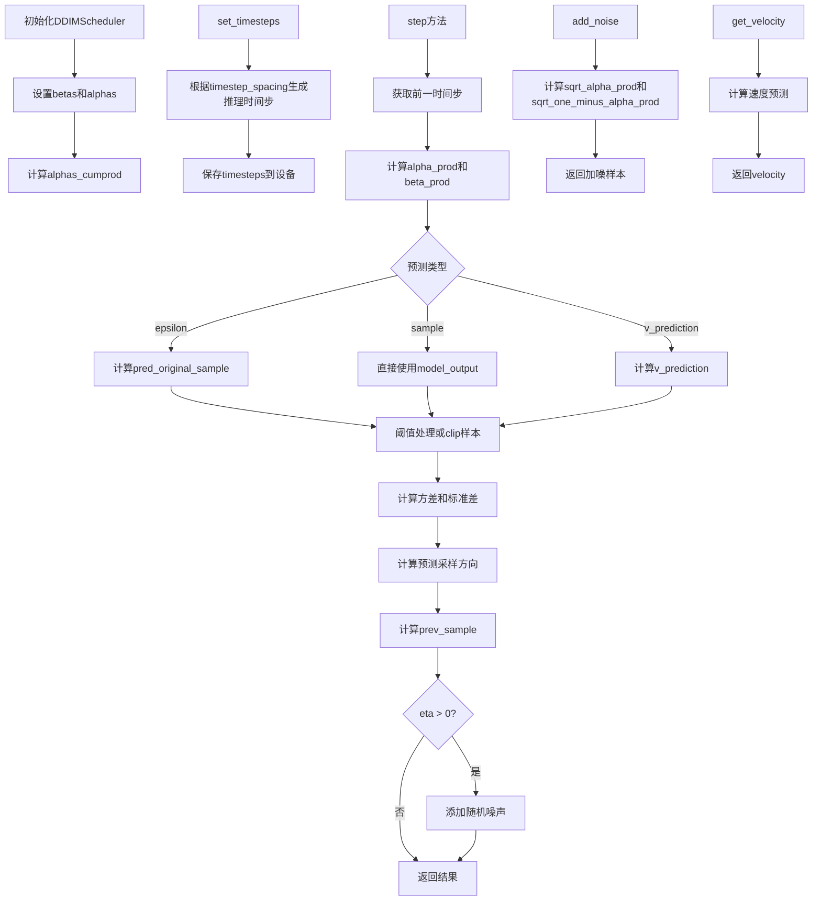
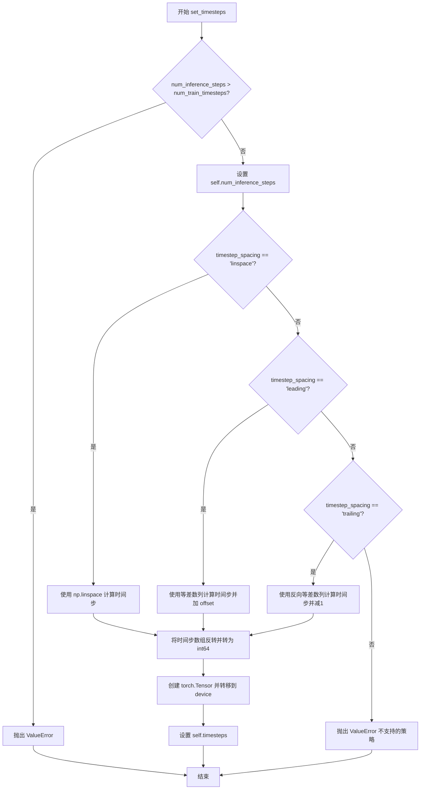
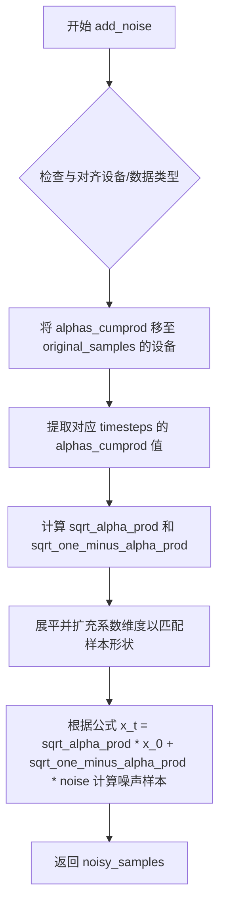
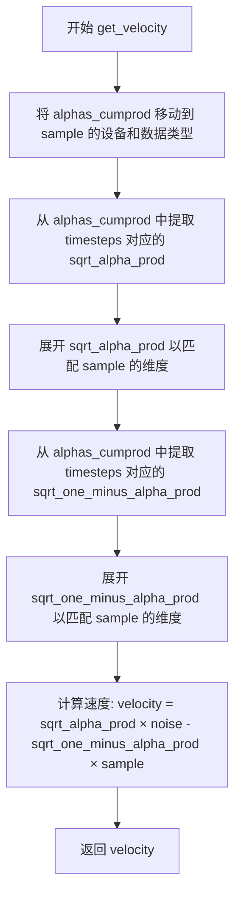
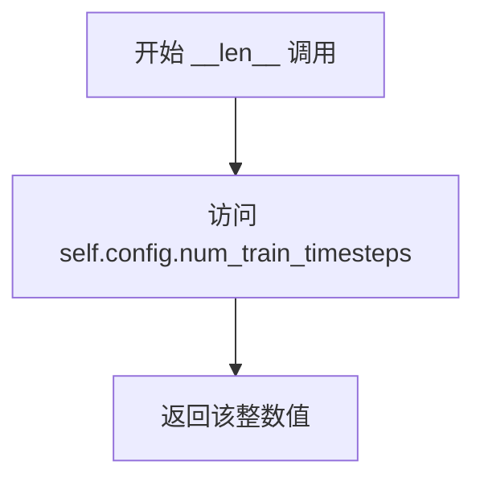

# `diffusers\src\diffusers\schedulers\scheduling_ddim.py` 详细设计文档

DDIMScheduler实现了Denoising Diffusion Implicit Models (DDIM)调度算法，用于扩散模型的噪声调度和样本生成。该调度器支持多种beta调度策略、预测类型（epsilon/sample/v_prediction）、动态阈值处理，并提供前向加噪和逆向去噪功能，是扩散模型推理过程中的核心组件。

## 整体流程



## 类结构

```
SchedulerMixin (混入类)
├── ConfigMixin (混入类)
└── DDIMScheduler
    └── DDIMSchedulerOutput (数据类)
```

## 全局变量及字段


### `betas_for_alpha_bar`
    
创建离散的beta调度表，通过alpha_bar函数生成beta序列

类型：`function`
    


### `rescale_zero_terminal_snr`
    
重新调整beta值以实现零终端信噪比

类型：`function`
    


### `DDIMSchedulerOutput.prev_sample`
    
前一个时间步的计算样本(x_{t-1})

类型：`torch.Tensor`
    


### `DDIMSchedulerOutput.pred_original_sample`
    
预测的原始去噪样本(x_0)

类型：`torch.Tensor | None`
    


### `DDIMScheduler.betas`
    
Beta调度参数

类型：`torch.Tensor`
    


### `DDIMScheduler.alphas`
    
Alpha参数(1-betas)

类型：`torch.Tensor`
    


### `DDIMScheduler.alphas_cumprod`
    
Alpha累积乘积

类型：`torch.Tensor`
    


### `DDIMScheduler.final_alpha_cumprod`
    
最终alpha累积乘积

类型：`torch.Tensor`
    


### `DDIMScheduler.init_noise_sigma`
    
初始噪声标准差

类型：`float`
    


### `DDIMScheduler.num_inference_steps`
    
推理步骤数

类型：`int | None`
    


### `DDIMScheduler.timesteps`
    
时间步序列

类型：`torch.Tensor`
    


### `DDIMScheduler.config`
    
配置参数(来自register_to_config)

类型：`Any`
    


### `DDIMScheduler._compatibles`
    
兼容的调度器列表

类型：`list`
    


### `DDIMScheduler.order`
    
调度器阶数

类型：`int`
    
    

## 全局函数及方法


### `betas_for_alpha_bar`

该函数用于创建 beta 调度表，通过离散化给定的 alpha_t_bar 函数来生成扩散过程中的 beta 序列。该函数定义了一个 alpha_bar 函数，接受参数 t 并将其转换为扩散过程中 (1-beta) 的累积乘积。

参数：

- `num_diffusion_timesteps`：`int`，要生成的 beta 数量
- `max_beta`：`float`，默认为 0.999，最大 beta 值，用于避免数值不稳定
- `alpha_transform_type`：`Literal["cosine", "exp", "laplace"]`，默认为 "cosine"，alpha_bar 的噪声调度类型

返回值：`torch.Tensor`，调度器用于逐步处理模型输出的 beta 值

#### 流程图

```mermaid
flowchart TD
    A[Start] --> B{alpha_transform_type == 'cosine'?}
    B -->|Yes| C[定义 alpha_bar_fn: cos²((t + 0.008)/1.008 * π/2)]
    B -->|No| D{alpha_transform_type == 'laplace'?}
    D -->|Yes| E[定义 alpha_bar_fn: Laplace 变换]
    D -->|No| F{alpha_transform_type == 'exp'?}
    F -->|Yes| G[定义 alpha_bar_fn: exp(t * -12.0)]
    F -->|No| H[抛出 ValueError]
    C --> I[初始化空 betas 列表]
    E --> I
    G --> I
    H --> I
    I --> J[循环 i 从 0 到 num_diffusion_timesteps-1]
    J --> K[计算 t1 = i / num_diffusion_timesteps]
    K --> L[计算 t2 = (i + 1) / num_diffusion_timesteps]
    L --> M[计算 beta = min(1 - alpha_bar_fn(t2) / alpha_bar_fn(t1), max_beta)]
    M --> N[将 beta 添加到 betas 列表]
    N --> O{还有更多时间步?}
    O -->|是| J
    O -->|否| P[返回 torch.tensor(betas, dtype=torch.float32)]
```

#### 带注释源码

```python
def betas_for_alpha_bar(
    num_diffusion_timesteps: int,
    max_beta: float = 0.999,
    alpha_transform_type: Literal["cosine", "exp", "laplace"] = "cosine",
) -> torch.Tensor:
    """
    Create a beta schedule that discretizes the given alpha_t_bar function, which defines the cumulative product of
    (1-beta) over time from t = [0,1].

    Contains a function alpha_bar that takes an argument t and transforms it to the cumulative product of (1-beta) up
    to that part of the diffusion process.

    Args:
        num_diffusion_timesteps (`int`):
            The number of betas to produce.
        max_beta (`float`, defaults to `0.999`):
            The maximum beta to use; use values lower than 1 to avoid numerical instability.
        alpha_transform_type (`str`, defaults to `"cosine"`):
            The type of noise schedule for `alpha_bar`. Choose from `cosine`, `exp`, or `laplace`.

    Returns:
        `torch.Tensor`:
            The betas used by the scheduler to step the model outputs.
    """
    # 根据 alpha_transform_type 选择对应的 alpha_bar 函数
    # cosine: 使用余弦平方函数，smooth 的衰减曲线
    if alpha_transform_type == "cosine":

        def alpha_bar_fn(t):
            return math.cos((t + 0.008) / 1.008 * math.pi / 2) ** 2

    # laplace: 使用拉普拉斯分布变换，产生更尖锐的噪声调度
    elif alpha_transform_type == "laplace":

        def alpha_bar_fn(t):
            lmb = -0.5 * math.copysign(1, 0.5 - t) * math.log(1 - 2 * math.fabs(0.5 - t) + 1e-6)
            snr = math.exp(lmb)
            return math.sqrt(snr / (1 + snr))

    # exp: 指数衰减调度
    elif alpha_transform_type == "exp":

        def alpha_bar_fn(t):
            return math.exp(t * -12.0)

    else:
        raise ValueError(f"Unsupported alpha_transform_type: {alpha_transform_type}")

    # 初始化 beta 列表
    betas = []
    # 遍历每个扩散时间步，计算对应的 beta 值
    for i in range(num_diffusion_timesteps):
        t1 = i / num_diffusion_timesteps  # 当前时间步的归一化值
        t2 = (i + 1) / num_diffusion_timesteps  # 下一个时间步的归一化值
        # 计算 beta: 1 - α(t+1)/α(t)，并限制最大值
        betas.append(min(1 - alpha_bar_fn(t2) / alpha_bar_fn(t1), max_beta))
    
    # 返回 float32 类型的 tensor
    return torch.tensor(betas, dtype=torch.float32)
```


### `rescale_zero_terminal_snr`

该函数实现了一种基于论文 https://huggingface.co/papers/2305.08891 (Algorithm 1) 的beta值重新缩放技术，用于使扩散调度器具有零终端信噪比（SNR），从而使模型能够生成非常明亮或非常暗的样本，而不是限制在中等亮度的样本。

参数：

- `betas`：`torch.Tensor`，调度器初始化时使用的beta值张量

返回值：`torch.Tensor`，经过零终端SNR重新缩放后的beta值

#### 流程图

```mermaid
flowchart TD
    A[开始: 输入 betas] --> B[计算 alphas = 1.0 - betas]
    B --> C[计算累积乘积 alphas_cumprod = cumprod(alphas)]
    C --> D[计算平方根 alphas_bar_sqrt = sqrt(alphas_cumprod)]
    D --> E[保存旧值: alphas_bar_sqrt_0 和 alphas_bar_sqrt_T]
    E --> F[移动使得最后时间步为零: alphas_bar_sqrt -= alphas_bar_sqrt_T]
    F --> G[缩放第一个时间步: alphas_bar_sqrt *= alphas_bar_sqrt_0 / (alphas_bar_sqrt_0 - alphas_bar_sqrt_T)]
    G --> H[恢复平方: alphas_bar = alphas_bar_sqrt²]
    H --> I[恢复累积乘积: alphas = alphas_bar[1:] / alphas_bar[:-1]]
    I --> J[拼接首元素: alphas = cat[alphas_bar[0:1], alphas]]
    J --> K[计算新的betas: betas = 1 - alphas]
    K --> L[返回重新缩放的 betas]
```

#### 带注释源码

```python
def rescale_zero_terminal_snr(betas: torch.Tensor) -> torch.Tensor:
    """
    Rescales betas to have zero terminal SNR Based on https://huggingface.co/papers/2305.08891 (Algorithm 1)

    Args:
        betas (`torch.Tensor`):
            The betas that the scheduler is being initialized with.

    Returns:
        `torch.Tensor`:
            Rescaled betas with zero terminal SNR.
    """
    # 第一步：将betas转换为alphas（扩散过程中的噪声参数）
    # alpha = 1 - beta，表示保留率
    alphas = 1.0 - betas
    
    # 第二步：计算累积乘积alphas_cumprod
    # 这是从时间步0到当前时间步的所有alpha的累积乘积
    # 公式：ᾱ_t = ∏_{i=0}^{t} α_i
    alphas_cumprod = torch.cumprod(alphas, dim=0)
    
    # 第三步：取平方根，得到alphas_bar的平方根值
    # 这用于后续的数值计算和SNR调整
    alphas_bar_sqrt = alphas_cumprod.sqrt()

    # 第四步：保存旧值用于后续的缩放计算
    # alphas_bar_sqrt_0 是第一个时间步的平方根值（初始值）
    alphas_bar_sqrt_0 = alphas_bar_sqrt[0].clone()
    # alphas_bar_sqrt_T 是最后一个时间步的平方根值（终端值）
    alphas_bar_sqrt_T = alphas_bar_sqrt[-1].clone()

    # 第五步：平移处理，使最后时间步的SNR为零
    # 通过减去最后一个时间步的值，使终端的alpha_bar变为0
    # 这确保了终端信噪比为0
    alphas_bar_sqrt -= alphas_bar_sqrt_T

    # 第六步：缩放处理，使第一个时间步恢复到旧值
    # 应用线性变换：乘以 old_0 / (old_0 - new_T)
    # 这保持了初始时间步的SNR不变
    alphas_bar_sqrt *= alphas_bar_sqrt_0 / (alphas_bar_sqrt_0 - alphas_bar_sqrt_T)

    # 第七步：将alphas_bar_sqrt转换回alphas_bar（恢复平方）
    alphas_bar = alphas_bar_sqrt**2  # Revert sqrt

    # 第八步：从alphas_bar恢复alphas（逆转累积乘积）
    # alphas[i] = alphas_bar[i] / alphas_bar[i-1]
    alphas = alphas_bar[1:] / alphas_bar[:-1]  # Revert cumprod
    
    # 补充第一个时间步的alpha值
    # 使用alphas_bar[0]作为第一个alpha
    alphas = torch.cat([alphas_bar[0:1], alphas])
    
    # 第九步：从alphas计算新的betas
    # beta = 1 - alpha
    betas = 1 - alphas

    return betas
```


### `DDIMScheduler.__init__`

该方法是 `DDIMScheduler` 类的构造函数，负责初始化扩散调度器的核心参数。它根据传入的贝塔（beta）调度策略生成噪声调度表，计算累积 alpha 值，并设置推理所需的默认时间步。

参数：

- `num_train_timesteps`：`int`，默认为 1000。模型训练时使用的扩散总步数。
- `beta_start`：`float`，默认为 0.0001。推理时 beta 调度曲线的起始值。
- `beta_end`：`float`，默认为 0.02。推理时 beta 调度曲线的结束值。
- `beta_schedule`：`str`，默认为 "linear"。贝塔调度策略，可选 "linear", "scaled_linear", "squaredcos_cap_v2"。
- `trained_betas`：`np.ndarray | list[float] | None`，默认为 None。直接传入的贝塔值数组，若提供则忽略 beta_start/end/schedule。
- `clip_sample`：`bool`，默认为 True。是否对预测样本进行裁剪以保证数值稳定性。
- `set_alpha_to_one`：`bool`，默认为 True。是否为最后一步将前一个 alpha 乘积固定为 1。
- `steps_offset`：`int`，默认为 0。推理步数的偏移量，某些模型族需要此参数。
- `prediction_type`：`Literal["epsilon", "sample", "v_prediction"]`，默认为 "epsilon"。调度器函数的预测类型，决定模型是预测噪声、原始样本还是 v-prediction。
- `thresholding`：`bool`，默认为 False。是否使用“动态阈值化”方法（仅适用于像素空间扩散）。
- `dynamic_thresholding_ratio`：`float`，默认为 0.995。动态阈值化方法的分位比率。
- `clip_sample_range`：`float`，默认为 1.0。样本裁剪的最大幅度，仅在 clip_sample=True 时生效。
- `sample_max_value`：`float`，默认为 1.0。动态阈值化方法的阈值，仅在 thresholding=True 时生效。
- `timestep_spacing`：`Literal["leading", "trailing", "linspace"]`，默认为 "leading"。时间步的缩放方式。
- `rescale_betas_zero_snr`：`bool`，默认为 False。是否重新缩放贝塔以实现零终端信噪比（SNR）。

返回值：`None`，无返回值（构造函数）。

#### 流程图

```mermaid
graph TD
    A([开始 __init__]) --> B{trained_betas 是否存在?}
    B -- 是 --> C[直接使用 trained_betas 初始化 self.betas]
    B -- 否 --> D{beta_schedule 类型?}
    D -- linear --> E[使用 torch.linspace 生成 betas]
    D -- scaled_linear --> F[使用 sqrt(linspace) 平方生成 betas]
    D -- squaredcos_cap_v2 --> G[调用 betas_for_alpha_bar 生成 betas]
    D -- 其他 --> H[抛出 NotImplementedError]
    C --> I{rescale_betas_zero_snr?}
    E --> I
    F --> I
    G --> I
    I -- 是 --> J[调用 rescale_zero_terminal_snr 调整 betas]
    I -- 否 --> K[计算 self.alphas = 1.0 - self.betas]
    J --> K
    K --> L[计算 self.alphas_cumprod = cumprod(self.alphas)]
    L --> M{set_alpha_to_one?}
    M -- 是 --> N[self.final_alpha_cumprod = 1.0]
    M -- 否 --> O[self.final_alpha_cumprod = alphas_cumprod[0]]
    N --> P[self.init_noise_sigma = 1.0]
    O --> P
    P --> Q[self.num_inference_steps = None]
    Q --> R[初始化 self.timesteps (反向时间步)]
    R --> Z([结束])
```

#### 带注释源码

```python
    @register_to_config
    def __init__(
        self,
        num_train_timesteps: int = 1000,
        beta_start: float = 0.0001,
        beta_end: float = 0.02,
        beta_schedule: str = "linear",
        trained_betas: np.ndarray | list[float] | None = None,
        clip_sample: bool = True,
        set_alpha_to_one: bool = True,
        steps_offset: int = 0,
        prediction_type: Literal["epsilon", "sample", "v_prediction"] = "epsilon",
        thresholding: bool = False,
        dynamic_thresholding_ratio: float = 0.995,
        clip_sample_range: float = 1.0,
        sample_max_value: float = 1.0,
        timestep_spacing: Literal["leading", "trailing", "linspace"] = "leading",
        rescale_betas_zero_snr: bool = False,
    ):
        # 1. 初始化 Betas (噪声调度表)
        if trained_betas is not None:
            # 如果直接提供了 betas，则直接使用
            self.betas = torch.tensor(trained_betas, dtype=torch.float32)
        elif beta_schedule == "linear":
            # 线性调度：从 beta_start 线性增加到 beta_end
            self.betas = torch.linspace(beta_start, beta_end, num_train_timesteps, dtype=torch.float32)
        elif beta_schedule == "scaled_linear":
            # 缩放线性调度：常用于潜在扩散模型 (LDM)
            self.betas = torch.linspace(beta_start**0.5, beta_end**0.5, num_train_timesteps, dtype=torch.float32) ** 2
        elif beta_schedule == "squaredcos_cap_v2":
            # 余弦调度 (Glide cosine)
            self.betas = betas_for_alpha_bar(num_train_timesteps)
        else:
            raise NotImplementedError(f"{beta_schedule} is not implemented for {self.__class__}")

        # 2. 可选：重新缩放 Betas 以实现零终端 SNR
        if rescale_betas_zero_snr:
            self.betas = rescale_zero_terminal_snr(self.betas)

        # 3. 计算 Alphas (1 - beta) 和累积积
        self.alphas = 1.0 - self.betas
        self.alphas_cumprod = torch.cumprod(self.alphas, dim=0)

        # 4. 设置 final_alpha_cumprod
        # 在 DDIM 的最后一步，没有前一个 alpha_cumprod。
        # 如果 set_alpha_to_one 为真，则设为 1，否则使用第 0 步的 alpha_cumprod。
        self.final_alpha_cumprod = torch.tensor(1.0) if set_alpha_to_one else self.alphas_cumprod[0]

        # 5. 初始噪声分布的标准差
        self.init_noise_sigma = 1.0

        # 6. 设置可变的推理参数
        self.num_inference_steps = None  # 推理步数，在 set_timesteps 时设置
        # 默认的时间步：从 num_train_timesteps-1 递减到 0
        self.timesteps = torch.from_numpy(np.arange(0, num_train_timesteps)[::-1].copy().astype(np.int64))
```


### `DDIMScheduler.scale_model_input`

确保与需要根据当前时间步缩放去噪模型输入的调度器之间的互操作性。该方法为调度器提供了一个标准接口，用于在需要时对输入进行缩放处理。

参数：

- `self`：隐式参数，DDIMScheduler 实例自身
- `sample`：`torch.Tensor`，当前扩散过程中的输入样本
- `timestep`：`int | None`，可选参数，当前扩散链中的时间步

返回值：`torch.Tensor`，返回未经缩放的输入样本（该调度器当前不执行实际缩放）

#### 流程图

```mermaid
flowchart TD
    A[开始 scale_model_input] --> B{检查输入参数}
    B --> C[接收 sample: torch.Tensor]
    B --> D[接收 timestep: int | None]
    C --> E[直接返回原始 sample]
    D --> E
    E --> F[返回 torch.Tensor]
```

#### 带注释源码

```python
def scale_model_input(self, sample: torch.Tensor, timestep: int = None) -> torch.Tensor:
    """
    Ensures interchangeability with schedulers that need to scale the denoising model input depending on the
    current timestep.

    Args:
        sample (`torch.Tensor`):
            The input sample.
        timestep (`int`, *optional*):
            The current timestep in the diffusion chain.

    Returns:
        `torch.Tensor`:
            A scaled input sample.
    """
    # 该方法的设计目的是为不同类型的调度器提供统一的接口
    # 对于需要根据时间步缩放输入的调度器（如某些变体），可以在此处实现具体的缩放逻辑
    # DDIMScheduler 当前直接返回原始样本，不做任何变换
    return sample
```


### `DDIMScheduler._get_variance`

该方法用于计算 DDIM 调度器在给定扩散步骤中添加噪声的方差。根据 DDIM/DDPM 文献中的定义，通过累积的 alpha 和 beta 乘积来计算方差。

参数：

- `timestep`：`int`，当前扩散过程中的时间步
- `prev_timestep`：`int`，扩散过程中的前一个时间步。如果为负数，则使用 `final_alpha_cumprod`

返回值：`torch.Tensor`，当前时间步的方差值

#### 流程图

```mermaid
flowchart TD
    A[开始] --> B[获取 alpha_prod_t = alphas_cumprod[timestep]]
    B --> C{prev_timestep >= 0?}
    C -->|是| D[alpha_prod_t_prev = alphas_cumprod[prev_timestep]]
    C -->|否| E[alpha_prod_t_prev = final_alpha_cumprod]
    D --> F[计算 beta_prod_t = 1 - alpha_prod_t]
    E --> F
    F --> G[计算 beta_prod_t_prev = 1 - alpha_prod_t_prev]
    G --> H[计算 variance = (beta_prod_t_prev / beta_prod_t) * (1 - alpha_prod_t / alpha_prod_t_prev)]
    H --> I[返回 variance]
```

#### 带注释源码

```python
def _get_variance(self, timestep: int, prev_timestep: int) -> torch.Tensor:
    """
    Computes the variance of the noise added at a given diffusion step.

    For a given `timestep` and its previous step, this method calculates the variance as defined in DDIM/DDPM
    literature:
        var_t = (beta_prod_t_prev / beta_prod_t) * (1 - alpha_prod_t / alpha_prod_t_prev)
    where alpha_prod and beta_prod are cumulative products of alphas and betas, respectively.

    Args:
        timestep (`int`):
            The current timestep in the diffusion process.
        prev_timestep (`int`):
            The previous timestep in the diffusion process. If negative, uses `final_alpha_cumprod`.

    Returns:
        `torch.Tensor`:
            The variance for the current timestep.
    """
    # 获取当前时间步的 alpha 累积乘积
    alpha_prod_t = self.alphas_cumprod[timestep]
    
    # 获取前一个时间步的 alpha 累积乘积
    # 如果 prev_timestep 为负数（例如 -1），则使用最终 alpha 累积乘积
    alpha_prod_t_prev = self.alphas_cumprod[prev_timestep] if prev_timestep >= 0 else self.final_alpha_cumprod
    
    # 计算 beta 累积乘积（1 - alpha）
    beta_prod_t = 1 - alpha_prod_t
    beta_prod_t_prev = 1 - alpha_prod_t_prev

    # 根据 DDIM 论文公式计算方差
    # var_t = (beta_prod_t_prev / beta_prod_t) * (1 - alpha_prod_t / alpha_prod_t_prev)
    variance = (beta_prod_t_prev / beta_prod_t) * (1 - alpha_prod_t / alpha_prod_t_prev)

    return variance
```


### `DDIMScheduler._threshold_sample`

对预测样本应用动态阈值（dynamic thresholding），通过计算样本绝对值的分位数来确定阈值 s，然后将样本限制在 [-s, s] 范围内并除以 s，以防止像素饱和并提升生成质量。

参数：

- `self`：`DDIMScheduler` 实例，调度器自身
- `sample`：`torch.Tensor`，待阈化的预测样本（通常为预测的原始样本 x_0）

返回值：`torch.Tensor`，经过动态阈值处理后的样本

#### 流程图

```mermaid
flowchart TD
    A[开始: 输入 sample] --> B[保存原始数据类型 dtype]
    B --> C{ dtype 是 float32/float64?}
    C -->|否| D[转换为 float32 避免 CPU half 精度问题]
    C -->|是| E
    D --> E
    E[获取 batch_size, channels, 剩余维度] --> F[展平样本为 2D: batch_size x (channels * prod)]
    F --> G[计算绝对值 abs_sample]
    G --> H[计算分位数阈值 s: quantileabs_sample, dynamic_thresholding_ratio]
    H --> I[限制 s 范围: min=1, max=sample_max_value]
    I --> J[扩展 s 维度为 batch_size x 1]
    J --> K[阈值化: clamp sample 到 -s, s 范围并除以 s]
    K --> L[恢复原始形状]
    L --> M[恢复原始数据类型]
    M --> N[返回阈化后的样本]
```

#### 带注释源码

```python
def _threshold_sample(self, sample: torch.Tensor) -> torch.Tensor:
    """
    Apply dynamic thresholding to the predicted sample.

    "Dynamic thresholding: At each sampling step we set s to a certain percentile absolute pixel value in xt0 (the
    prediction of x_0 at timestep t), and if s > 1, then we threshold xt0 to the range [-s, s] and then divide by
    s. Dynamic thresholding pushes saturated pixels (those near -1 and 1) inwards, thereby actively preventing
    pixels from saturation at each step. We find that dynamic thresholding results in significantly better
    photorealism as well as better image-text alignment, especially when using very large guidance weights."

    https://huggingface.co/papers/2205.11487

    Args:
        sample (`torch.Tensor`):
            The predicted sample to be thresholded.

    Returns:
        `torch.Tensor`:
            The thresholded sample.
    """
    # 保存原始数据类型，以便最后恢复
    dtype = sample.dtype
    # 解包样本形状: batch_size, channels, 以及剩余的空间维度(如 height, width)
    batch_size, channels, *remaining_dims = sample.shape

    # 如果数据类型不是 float32 或 float64，则需要向上转型
    # 因为 quantile 计算和 clamp 操作在 CPU half 精度上未实现
    if dtype not in (torch.float32, torch.float64):
        sample = sample.float()  # upcast for quantile calculation, and clamp not implemented for cpu half

    # 展平样本以便沿着每个图像进行分位数计算
    # 从 [batch, channels, H, W] 变为 [batch, channels * H * W]
    sample = sample.reshape(batch_size, channels * np.prod(remaining_dims))

    # 计算绝对值: "a certain percentile absolute pixel value"
    abs_sample = sample.abs()

    # 计算阈值 s: 使用 dynamic_thresholding_ratio 分位数
    # 例如 ratio=0.995 表示取每个样本第 99.5 百分位的绝对值
    s = torch.quantile(abs_sample, self.config.dynamic_thresholding_ratio, dim=1)

    # 限制 s 的范围: 最小值为 1 (等同于标准 clip 到 [-1,1])
    # 最大值为 sample_max_value，防止过度阈值化
    s = torch.clamp(
        s, min=1, max=self.config.sample_max_value
    )  # When clamped to min=1, equivalent to standard clipping to [-1, 1]

    # 扩展 s 的维度为 [batch_size, 1]，以便沿着 dim=0 广播
    s = s.unsqueeze(1)  # (batch_size, 1) because clamp will broadcast along dim=0

    # 执行动态阈值化: 将样本限制在 [-s, s] 范围内，然后除以 s
    # 这会将饱和像素 (接近 -1 和 1) 推向内侧
    sample = torch.clamp(sample, -s, s) / s  # "we threshold xt0 to the range [-s, s] and then divide by s"

    # 恢复原始形状: [batch, channels * H * W] -> [batch, channels, H, W]
    sample = sample.reshape(batch_size, channels, *remaining_dims)

    # 恢复原始数据类型
    sample = sample.to(dtype)

    return sample
```


### DDIMScheduler.set_timesteps

该方法根据推理步数和配置的时间间隔策略，设置离散的时间步序列，用于扩散模型的推理过程。它计算并生成从高到低的时间步数组，并将其转移到指定设备上。

参数：

- `num_inference_steps`：`int`，推理过程中使用的扩散步数，即生成样本时模型需要迭代的次数
- `device`：`str | torch.device`，可选参数，用于存放时间步张量的设备（如 "cuda" 或 "cpu"）

返回值：`None`，该方法直接修改调度器的内部状态，不返回任何值

#### 流程图



#### 带注释源码

```
def set_timesteps(self, num_inference_steps: int, device: str | torch.device = None):
    """
    Sets the discrete timesteps used for the diffusion chain (to be run before inference).

    Args:
        num_inference_steps (`int`):
            The number of diffusion steps used when generating samples with a pre-trained model.
        device (`str | torch.device`, *optional*):
            The device to use for the timesteps.

    Raises:
        ValueError: If `num_inference_steps` is larger than `self.config.num_train_timesteps`.
    """

    # 验证推理步数不超过训练时的时间步总数
    if num_inference_steps > self.config.num_train_timesteps:
        raise ValueError(
            f"`num_inference_steps`: {num_inference_steps} cannot be larger than `self.config.train_timesteps`:"
            f" {self.config.num_train_timesteps} as the unet model trained with this scheduler can only handle"
            f" maximal {self.config.num_train_timesteps} timesteps."
        )

    # 保存推理步数到实例变量
    self.num_inference_steps = num_inference_steps

    # 根据时间步间隔策略计算时间步序列
    # 参考 https://huggingface.co/papers/2305.08891 表2
    if self.config.timestep_spacing == "linspace":
        # 线性间隔策略：在 [0, num_train_timesteps-1] 范围内均匀选择 num_inference_steps 个点
        timesteps = (
            np.linspace(0, self.config.num_train_timesteps - 1, num_inference_steps)
            .round()[::-1]  # 四舍五入后反转，从高到低排列
            .copy()
            .astype(np.int64)
        )
    elif self.config.timestep_spacing == "leading":
        # 前导间隔策略：创建等差数列然后反转
        step_ratio = self.config.num_train_timesteps // self.num_inference_steps
        # 乘以比例创建整数时间步，避免 num_inference_step 是3的幂次时的问题
        timesteps = (np.arange(0, num_inference_steps) * step_ratio).round()[::-1].copy().astype(np.int64)
        timesteps += self.config.steps_offset  # 添加偏移量
    elif self.config.timestep_spacing == "trailing":
        # 尾随间隔策略：从后向前创建等差数列
        step_ratio = self.config.num_train_timesteps / self.num_inference_steps
        # 乘以比例创建整数时间步
        timesteps = np.round(np.arange(self.config.num_train_timesteps, 0, -step_ratio)).astype(np.int64)
        timesteps -= 1  # 减1调整
    else:
        raise ValueError(
            f"{self.config.timestep_spacing} is not supported. Please make sure to choose one of 'leading' or 'trailing'."
        )

    # 将 numpy 数组转换为 PyTorch 张量并移动到指定设备
    self.timesteps = torch.from_numpy(timesteps).to(device)
```


### `DDIMScheduler.step`

该函数执行 DDIM 调度器的单步推理，通过逆转扩散过程从当前时间步预测前一个时间步的样本。它基于模型输出（通常是预测的噪声）计算原始样本、方差和采样方向，最终返回去噪后的样本。

参数：

- `model_output`：`torch.Tensor`，来自已学习扩散模型的直接输出
- `timestep`：`int`，扩散链中的当前离散时间步
- `sample`：`torch.Tensor`，由扩散过程生成的当前样本实例
- `eta`：`float`（可选，默认值 0.0），扩散步骤中添加噪声的权重。值为 0 对应 DDIM（确定性），1 对应 DDPM（完全随机）
- `use_clipped_model_output`：`bool`（可选，默认值 False），如果为 True，则从裁剪后的预测原始样本计算"修正"的 model_output
- `generator`：`torch.Generator`（可选），用于可重复采样的随机数生成器
- `variance_noise`：`torch.Tensor`（可选），直接提供方差本身的噪声，作为生成器的替代方案
- `return_dict`：`bool`（可选，默认值 True），是否返回 `DDIMSchedulerOutput` 或元组

返回值：`DDIMSchedulerOutput | tuple`，如果 return_dict 为 True，返回 DDIMSchedulerOutput，否则返回元组，其中第一个元素是样本张量

#### 流程图

```mermaid
flowchart TD
    A[step 方法开始] --> B{num_inference_steps 是否为 None?}
    B -->|是| C[抛出 ValueError: 需要先运行 set_timesteps]
    B -->|否| D[计算 prev_timestep = timestep - num_train_timesteps // num_inference_steps]
    
    D --> E[获取 alpha_prod_t 和 alpha_prod_t_prev]
    E --> F[计算 beta_prod_t = 1 - alpha_prod_t]
    
    F --> G{prediction_type 类型?}
    G -->|epsilon| H[pred_original_sample = (sample - sqrt(beta_prod_t) * model_output) / sqrt(alpha_prod_t)]
    G -->|sample| I[pred_original_sample = model_output]
    G -->|v_prediction| J[pred_original_sample = sqrt(alpha_prod_t) * sample - sqrt(beta_prod_t) * model_output]
    
    H --> K[是否启用 thresholding?]
    I --> K
    J --> K
    
    K -->|是| L[调用 _threshold_sample 裁剪 pred_original_sample]
    K -->|否| M{是否启用 clip_sample?}
    L --> N
    M -->|是| O[clamp pred_original_sample 到 [-clip_sample_range, clip_sample_range]]
    M -->|否| N
    
    O --> N[计算方差 variance 和 std_dev_t = eta * sqrt(variance)]
    N --> P{use_clipped_model_output?}
    P -->|是| Q[重新计算 pred_epsilon]
    P -->|否| R
    
    Q --> R[计算 pred_sample_direction = sqrt(1 - alpha_prod_t_prev - std_dev_t²) * pred_epsilon]
    R --> S[计算 prev_sample = sqrt(alpha_prod_t_prev) * pred_original_sample + pred_sample_direction]
    
    S --> T{eta > 0?}
    T -->|否| U{return_dict?}
    T -->|是| V{variance_noise 和 generator 都非空?}
    V -->|是| W[抛出 ValueError: 不能同时指定两者]
    V -->|否| X{variance_noise 为空?}
    
    X -->|是| Y[使用 randn_tensor 生成 variance_noise]
    X -->|否| Z[variance = std_dev_t * variance_noise]
    Y --> Z
    
    Z --> AA[prev_sample = prev_sample + variance]
    AA --> U
    
    U -->|是| BB[返回 DDIMSchedulerOutput]
    U -->|否| CC[返回元组 (prev_sample, pred_original_sample)]
    
    BB --> DD[step 方法结束]
    CC --> DD
```

#### 带注释源码

```python
def step(
    self,
    model_output: torch.Tensor,      # 扩散模型的输出（预测噪声/样本/v_prediction）
    timestep: int,                    # 当前扩散链中的离散时间步
    sample: torch.Tensor,             # 当前由扩散过程生成的样本
    eta: float = 0.0,                 # 噪声权重：0=确定性DDIM，1=完全随机DDPM
    use_clipped_model_output: bool = False,  # 是否使用裁剪后的预测原始样本重新计算
    generator: torch.Generator | None = None,  # 可重复采样的随机数生成器
    variance_noise: torch.Tensor | None = None,  # 直接提供方差噪声的替代方式
    return_dict: bool = True,        # 是否返回 DDIMSchedulerOutput 或元组
) -> DDIMSchedulerOutput | tuple:
    """
    通过逆转 SDE 从前一个时间步预测样本。此函数从学习到的模型输出（通常是预测噪声）推进扩散过程。
    """
    # 1. 检查是否已设置推理步骤数
    if self.num_inference_steps is None:
        raise ValueError(
            "Number of inference steps is 'None', you need to run 'set_timesteps' after creating the scheduler"
        )

    # 2. 获取前一个时间步 (t-1)
    prev_timestep = timestep - self.config.num_train_timesteps // self.num_inference_steps

    # 3. 计算 alpha 和 beta 累积乘积
    alpha_prod_t = self.alphas_cumprod[timestep]  # α_t 累积乘积
    # 如果 prev_timestep < 0，则使用 final_alpha_cumprod
    alpha_prod_t_prev = self.alphas_cumprod[prev_timestep] if prev_timestep >= 0 else self.final_alpha_cumprod
    beta_prod_t = 1 - alpha_prod_t  # β_t 累积乘积

    # 4. 根据 prediction_type 计算预测的原始样本 (x_0)
    if self.config.prediction_type == "epsilon":
        # 公式 (12): x_0 = (x_t - sqrt(β_t) * ε_t) / sqrt(α_t)
        pred_original_sample = (sample - beta_prod_t ** (0.5) * model_output) / alpha_prod_t ** (0.5)
        pred_epsilon = model_output  # 预测的噪声
    elif self.config.prediction_type == "sample":
        pred_original_sample = model_output  # 直接预测样本
        # 反推噪声: ε_t = (x_t - sqrt(α_t) * x_0) / sqrt(β_t)
        pred_epsilon = (sample - alpha_prod_t ** (0.5) * pred_original_sample) / beta_prod_t ** (0.5)
    elif self.config.prediction_type == "v_prediction":
        # v_prediction: v = sqrt(α_t) * ε_t - sqrt(β_t) * x_t
        pred_original_sample = (alpha_prod_t**0.5) * sample - (beta_prod_t**0.5) * model_output
        pred_epsilon = (alpha_prod_t**0.5) * model_output + (beta_prod_t**0.5) * sample
    else:
        raise ValueError(
            f"prediction_type given as {self.config.prediction_type} must be one of `epsilon`, `sample`, or"
            " `v_prediction`"
        )

    # 5. 对预测的原始样本进行裁剪或阈值处理
    if self.config.thresholding:
        # 动态阈值处理
        pred_original_sample = self._threshold_sample(pred_original_sample)
    elif self.config.clip_sample:
        # 简单裁剪到 [-clip_sample_range, clip_sample_range]
        pred_original_sample = pred_original_sample.clamp(
            -self.config.clip_sample_range, self.config.clip_sample_range
        )

    # 6. 计算方差 σ_t (公式 16)
    # σ_t = sqrt((1 - α_{t-1})/(1 - α_t)) * sqrt(1 - α_t/α_{t-1})
    variance = self._get_variance(timestep, prev_timestep)
    std_dev_t = eta * variance ** (0.5)  # 标准差

    if use_clipped_model_output:
        # 从裁剪后的 x_0 重新推导 pred_epsilon
        pred_epsilon = (sample - alpha_prod_t ** (0.5) * pred_original_sample) / beta_prod_t ** (0.5)

    # 7. 计算指向 x_t 的方向 (公式 12)
    pred_sample_direction = (1 - alpha_prod_t_prev - std_dev_t**2) ** (0.5) * pred_epsilon

    # 8. 计算不含随机噪声的 x_{t-1} (公式 12)
    prev_sample = alpha_prod_t_prev ** (0.5) * pred_original_sample + pred_sample_direction

    # 9. 如果 eta > 0，添加随机噪声
    if eta > 0:
        # 检查参数冲突
        if variance_noise is not None and generator is not None:
            raise ValueError(
                "Cannot pass both generator and variance_noise. Please make sure that either `generator` or"
                " `variance_noise` stays `None`."
            )

        # 生成方差噪声
        if variance_noise is None:
            variance_noise = randn_tensor(
                model_output.shape, generator=generator, device=model_output.device, dtype=model_output.dtype
            )
        variance = std_dev_t * variance_noise

        # 添加噪声到样本
        prev_sample = prev_sample + variance

    # 10. 根据 return_dict 返回结果
    if not return_dict:
        return (
            prev_sample,
            pred_original_sample,
        )

    return DDIMSchedulerOutput(prev_sample=prev_sample, pred_original_sample=pred_original_sample)
```


### `DDIMScheduler.add_noise`

向原始样本添加噪声，根据特定时间步的累积alpha值模拟前向扩散过程（Forward Diffusion Process）。

参数：

- `original_samples`：`torch.Tensor`，需要添加噪声的原始样本。
- `noise`：`torch.Tensor`，要添加到样本中的噪声。
- `timesteps`：`torch.IntTensor`，表示每个样本噪声水平的时间步。

返回值：`torch.Tensor`，添加噪声后的样本。

#### 流程图



#### 带注释源码

```python
def add_noise(
    self,
    original_samples: torch.Tensor,
    noise: torch.Tensor,
    timesteps: torch.IntTensor,
) -> torch.Tensor:
    """
    Add noise to the original samples according to the noise magnitude at each timestep (this is the forward
    diffusion process).

    Args:
        original_samples (`torch.Tensor`):
            The original samples to which noise will be added.
        noise (`torch.Tensor`):
            The noise to add to the samples.
        timesteps (`torch.IntTensor`):
            The timesteps indicating the noise level for each sample.

    Returns:
        `torch.Tensor`:
            The noisy samples.
    """
    # 确保 alphas_cumprod 与 original_samples 在同一设备上且数据类型一致
    # 将 self.alphas_cumprod 移动到设备上，以避免后续 add_noise 调用时重复的 CPU 到 GPU 数据移动
    self.alphas_cumprod = self.alphas_cumprod.to(device=original_samples.device)
    alphas_cumprod = self.alphas_cumprod.to(dtype=original_samples.dtype)
    timesteps = timesteps.to(original_samples.device)

    # 获取对应时间步的 alpha 累积乘积的平方根 (sqrt(α̅_t))
    sqrt_alpha_prod = alphas_cumprod[timesteps] ** 0.5
    # 展平以便后续广播
    sqrt_alpha_prod = sqrt_alpha_prod.flatten()
    # 扩充维度直到系数维度与原始样本维度匹配（例如从 [B] 扩展到 [B, 1, 1, 1]）
    while len(sqrt_alpha_prod.shape) < len(original_samples.shape):
        sqrt_alpha_prod = sqrt_alpha_prod.unsqueeze(-1)

    # 获取对应时间步的 (1 - alpha 累积乘积) 的平方根 (sqrt(1 - α̅_t))
    sqrt_one_minus_alpha_prod = (1 - alphas_cumprod[timesteps]) ** 0.5
    sqrt_one_minus_alpha_prod = sqrt_one_minus_alpha_prod.flatten()
    while len(sqrt_one_minus_alpha_prod.shape) < len(original_samples.shape):
        sqrt_one_minus_alpha_prod = sqrt_one_minus_alpha_prod.unsqueeze(-1)

    # 执行前向扩散公式：x_t = sqrt(α̅_t) * x_0 + sqrt(1 - α̅_t) * ε
    noisy_samples = sqrt_alpha_prod * original_samples + sqrt_one_minus_alpha_prod * noise
    return noisy_samples
```


### `DDIMScheduler.get_velocity`

根据采样和噪声计算速度预测，用于基于速度的扩散模型。

参数：

- `sample`：`torch.Tensor`，输入采样
- `noise`：`torch.Tensor`，噪声张量
- `timesteps`：`torch.IntTensor`，用于速度计算的时间步

返回值：`torch.Tensor`，计算得到的速度

#### 流程图



#### 带注释源码

```python
def get_velocity(self, sample: torch.Tensor, noise: torch.Tensor, timesteps: torch.IntTensor) -> torch.Tensor:
    """
    Compute the velocity prediction from the sample and noise according to the velocity formula.

    Args:
        sample (`torch.Tensor`):
            The input sample.
        noise (`torch.Tensor`):
            The noise tensor.
        timesteps (`torch.IntTensor`):
            The timesteps for velocity computation.

    Returns:
        `torch.Tensor`:
            The computed velocity.
    """
    # 确保 alphas_cumprod 与 sample 具有相同的设备和数据类型
    # 避免冗余的 CPU 到 GPU 数据移动
    self.alphas_cumprod = self.alphas_cumprod.to(device=sample.device)
    alphas_cumprod = self.alphas_cumprod.to(dtype=sample.dtype)
    timesteps = timesteps.to(sample.device)

    # 获取对应时间步的 alpha 累积乘积的平方根
    sqrt_alpha_prod = alphas_cumprod[timesteps] ** 0.5
    # 展平以便后续广播操作
    sqrt_alpha_prod = sqrt_alpha_prod.flatten()
    # 扩展维度以匹配 sample 的形状
    while len(sqrt_alpha_prod.shape) < len(sample.shape):
        sqrt_alpha_prod = sqrt_alpha_prod.unsqueeze(-1)

    # 获取对应时间步的 (1 - alpha 累积乘积) 的平方根
    sqrt_one_minus_alpha_prod = (1 - alphas_cumprod[timesteps]) ** 0.5
    sqrt_one_minus_alpha_prod = sqrt_one_minus_alpha_prod.flatten()
    while len(sqrt_one_minus_alpha_prod.shape) < len(sample.shape):
        sqrt_one_minus_alpha_prod = sqrt_one_minus_alpha_prod.unsqueeze(-1)

    # 根据速度公式计算速度
    # velocity = √α_t * noise - √(1-α_t) * sample
    velocity = sqrt_alpha_prod * noise - sqrt_one_minus_alpha_prod * sample
    return velocity
```


### `DDIMScheduler.__len__`

该方法是Python的特殊方法`__len__`的实现，返回DDIMScheduler配置中定义的训练时间步总数，使得调度器对象可以支持`len()`操作来查询其包含的时间步长度。

参数：无（除了隐式的`self`参数）

返回值：`int`，返回调度器配置中设置的训练时间步数量（即`num_train_timesteps`），默认值为1000。

#### 流程图



#### 带注释源码

```python
def __len__(self) -> int:
    """
    返回调度器训练时使用的时间步总数。
    
    该方法使得调度器对象支持Python内置的len()函数，
    用户可以通过len(scheduler)获取调度器配置的时间步长度。
    
    Returns:
        int: 训练时间步的数量，通常为1000或其他在初始化时设置的值。
    """
    return self.config.num_train_timesteps
```

## 关键组件


### 张量索引与参数缓存

在 `DDIMScheduler` 类中，核心参数通过张量索引进行访问。`self.alphas_cumprod` 在初始化时通过 `torch.cumprod` 计算并缓存，后续通过 `self.alphas_cumprod[timestep]` 和 `self.alphas_cumprod[prev_timestep]` 进行直接索引访问，实现 O(1) 时间复杂度的参数查询，避免了重复计算。

### 动态阈值处理

`_threshold_sample` 方法实现了动态阈值策略。该方法通过计算预测样本在批次维度上的分位数（默认为 99.5%），将饱和像素（接近 -1 和 1 的值）向内推移，有效防止像素在每一步采样时饱和，显著提升图像真实感和文本对齐质量。

### 量化策略与类型转换

代码在 `_threshold_sample` 方法中处理了量化相关场景：当输入张量类型不是 float32 或 float64 时，会进行类型提升以支持分位数计算。类似地，在 `add_noise` 和 `get_velocity` 方法中，通过 `to(dtype=original_samples.dtype)` 确保 alphas_cumprod 与输入样本的数据类型一致，避免精度损失。

### Beta 调度策略

`betas_for_alpha_bar` 函数支持三种 alpha 变换类型：cosine、exp 和 laplace。Cosine 策略使用余弦函数生成平滑的噪声调度曲线；Laplace 策略基于拉普拉斯分布构建 SNR；Exponential 策略使用指数衰减函数。不同策略适用于不同的扩散模型架构和生成质量需求。

### 零终端 SNR 重缩放

`rescale_zero_terminal_snr` 函数实现了基于 Algorithm 1 的零终端 SNR 重缩放。该方法通过平移和缩放操作，使最后一个时间步的信号噪声比为零，从而允许模型生成非常明亮或非常暗的样本，而非限制在中等亮度范围内。

### 预测类型支持

`step` 方法支持三种预测类型：epsilon（预测噪声）、sample（直接预测样本）和 v_prediction（速度预测）。通过 `prediction_type` 配置选择不同的预测公式，实现与不同训练目标的扩散模型的兼容性。

### 时间步间距策略

`set_timesteps` 方法实现了三种时间步间距策略：linspace（均匀分布）、leading（前端密集）和 trailing（后端密集）。这些策略直接影响采样路径和生成质量，参照了 Common Diffusion Noise Schedules and Sample Steps are Flawed 论文的分析。

### 方差计算与随机性控制

`_get_variance` 方法根据 DDIM/DDPM 论文公式计算给定扩散步骤的方差。在 `step` 方法中通过 `eta` 参数控制噪声权重：eta=0 对应确定性 DDIM 采样，eta=1 对应完全随机的 DDPM 采样，支持在生成多样性和速度之间进行权衡。


## 问题及建议


### 已知问题

-   **类型标注不完整**: `beta_schedule` 参数接受字符串但未使用 `Literal` 类型限制合法值；`trained_betas` 类型标注为 `np.ndarray | list[float]` 但实际接收多种形式
-   **设备管理不一致**: `add_noise` 和 `get_velocity` 方法中每次调用都将 `alphas_cumprod` 移到目标设备，造成重复的 CPU-GPU 数据移动，应在初始化或 `set_timesteps` 时统一处理
-   **代码重复**: `add_noise` 和 `get_velocity` 方法中计算 `sqrt_alpha_prod` 和 `sqrt_one_minus_alpha_prod` 的逻辑完全相同，违反了 DRY 原则
-   **边界条件处理缺失**: `set_timesteps` 方法未处理 `num_inference_steps <= 0` 的非法输入
-   **魔法数字**: `betas_for_alpha_bar` 函数中存在硬编码的常数 `0.008`、`1.008`、`-12.0`，缺乏注释说明其物理含义
-   **变量命名与配置不一致**: 类的 `betas`、`alphas`、`alphas_cumprod` 等直接实例变量与 `self.config` 中的属性存在冗余，且某些地方使用 `self.betas` 而其他地方使用 `self.config.betas` 会导致不一致
-   **条件分支冗余**: `step` 方法中当 `use_clipped_model_output=True` 时重新计算 `pred_epsilon`，但实际效果与原始值相同
-   **张量类型转换开销**: `_threshold_sample` 方法对非 float32/64 类型进行上采样转换，引入额外计算开销

### 优化建议

-   **统一设备管理**: 在 `set_timesteps` 时一次性将 `alphas_cumprod` 移至目标设备，避免在 `add_noise` 和 `get_velocity` 中重复执行
-   **提取公共逻辑**: 将 `sqrt_alpha_prod` 和 `sqrt_one_minus_alpha_prod` 的计算抽取为私有方法 `_get_sqrt_alpha_prod` 和 `_get_sqrt_one_minus_alpha_prod`
-   **完善类型标注**: 使用 `Literal` 类型限制 `beta_schedule` 参数的合法值范围；为 `trained_betas` 参数添加更严格的类型约束
-   **添加边界检查**: 在 `set_timesteps` 开头添加 `num_inference_steps > 0` 的验证
-   **消除代码冗余**: 移除 `step` 方法中 `use_clipped_model_output=True` 分支中重复的 `pred_epsilon` 计算
-   **统一变量访问**: 考虑将 `betas`、`alphas` 等变量只存储在 `config` 中，或提供统一的访问接口
-   **优化类型转换**: 考虑在 `_threshold_sample` 中缓存上采样后的类型，或在类初始化时统一张量精度


## 其它


### 设计目标与约束

本代码实现DDIM（Denoising Diffusion Implicit Models）调度器，核心目标是提供一种比传统DDPM更高效、更灵活的扩散模型采样方法。设计约束包括：支持多种噪声调度策略（linear、scaled_linear、squaredcos_cap_v2）、支持三种预测类型（epsilon、sample、v_prediction）、支持动态阈值化和样本裁剪以确保数值稳定性、支持零终端SNR重缩放以增强生成样本的亮度范围、支持多种时间步间隔策略（linspace、leading、trailing）。

### 错误处理与异常设计

代码中的错误处理主要包括：1）beta_schedule不支持时抛出NotImplementedError；2）num_inference_steps超过训练时间步时抛出ValueError；3）timestep_spacing不支持时抛出ValueError；4）prediction_type不支持时抛出ValueError；5）同时传递generator和variance_noise时抛出ValueError；6）未设置推理步数时抛出ValueError。异常设计采用快速失败策略，在参数校验阶段尽早暴露问题，避免运行时错误。

### 数据流与状态机

DDIMScheduler的数据流遵循以下状态机：初始化状态（__init__）→ 配置时间步状态（set_timesteps）→ 推理采样状态（step）→ 返回结果。核心状态转换：1）创建调度器实例并初始化betas、alphas、alphas_cumprod；2）调用set_timesteps设置推理时间步；3）循环调用step方法进行去噪采样；4）每次step根据当前timestep和model_output计算prev_sample和pred_original_sample。状态转换由num_inference_steps和timesteps控制。

### 外部依赖与接口契约

本模块依赖以下外部组件：1）configuration_utils.ConfigMixin和register_to_config装饰器用于配置管理；2）BaseOutput作为输出基类；3）randn_tensor工具函数用于生成随机张量；4）KarrasDiffusionSchedulers枚举用于兼容性检查。接口契约：step方法接收model_output（模型预测）、timestep（当前时间步）、sample（当前样本）、eta（噪声权重）等参数，返回DDIMSchedulerOutput包含prev_sample和pred_original_sample。add_noise方法执行前向扩散过程，get_velocity方法计算速度预测。

### 版本兼容性说明

本代码声明与KarrasDiffusionSchedulers枚举中的所有调度器兼容，通过_compatibles类变量定义。_compatibles = [e.name for e in KarrasDiffusionSchedulers]使得DDIMScheduler可以与其他基于Karras的调度器共享配置。代码还从DDPMScheduler复制了部分方法实现（_threshold_sample、add_noise、get_velocity），确保与DDPM系列调度器的一致性。

### 性能考量与优化空间

性能关键点：1）alphas_cumprod的设备转换在add_noise和get_velocity中每次调用都执行，存在冗余；2）sqrt_alpha_prod和sqrt_one_minus_alpha_prod的unsqueeze操作在循环中重复执行；3）阈值计算使用quantile操作开销较大。优化方向：1）缓存设备转换后的alphas_cumprod；2）预计算并缓存广播后的系数张量；3）考虑将thresholding设计为可选特性以提升默认性能。

### 配置参数详解

核心配置参数：num_train_timesteps（训练时间步数，默认1000）、beta_start和beta_end（beta范围）、beta_schedule（beta调度策略）、clip_sample和clip_sample_range（样本裁剪参数）、set_alpha_to_one（最终alpha累积值设置）、steps_offset（推理步数偏移）、prediction_type（预测类型）、thresholding和dynamic_thresholding_ratio（动态阈值化）、timestep_spacing（时间步间隔策略）、rescale_betas_zero_snr（零终端SNR重缩放）。这些参数共同决定了扩散过程的采样行为和输出质量。

    