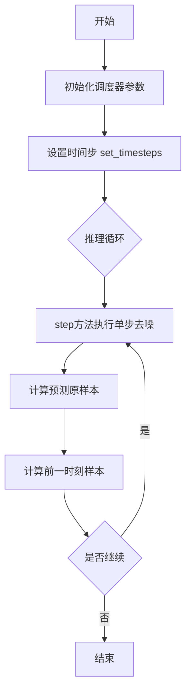
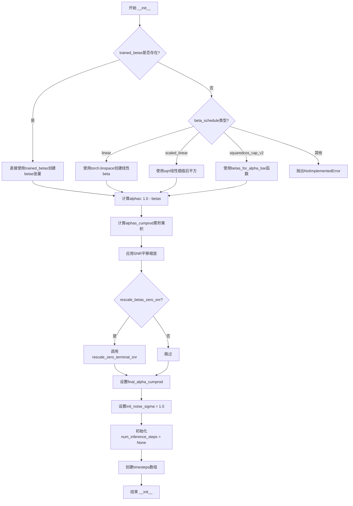
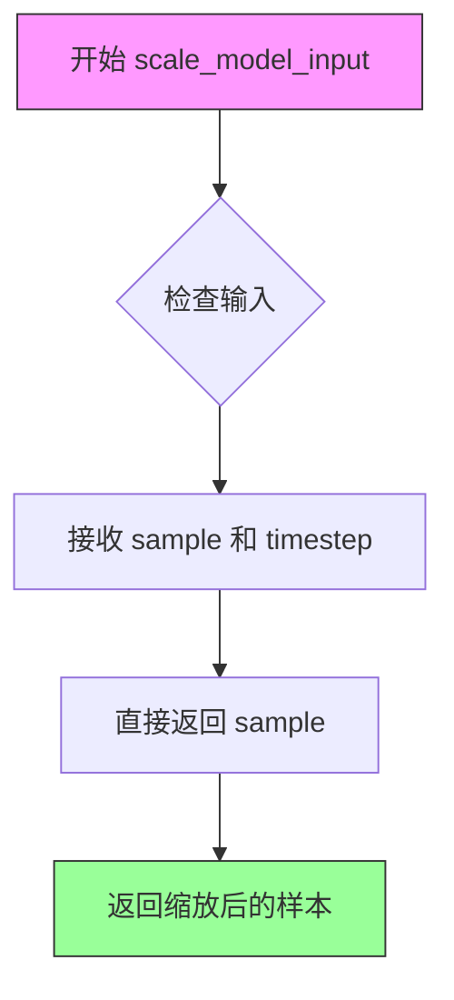
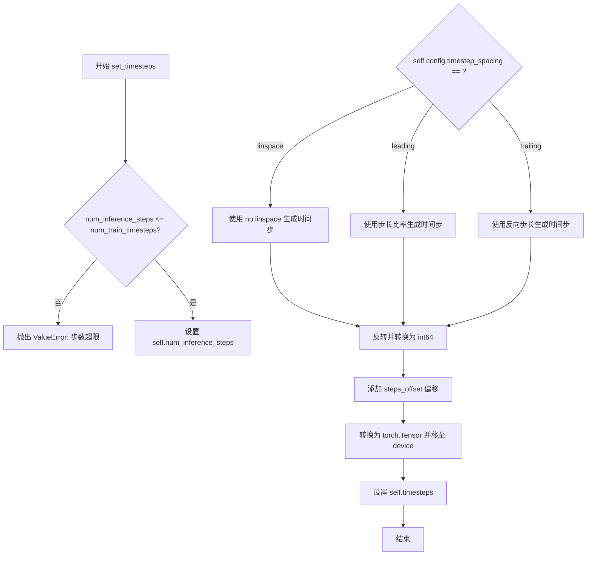
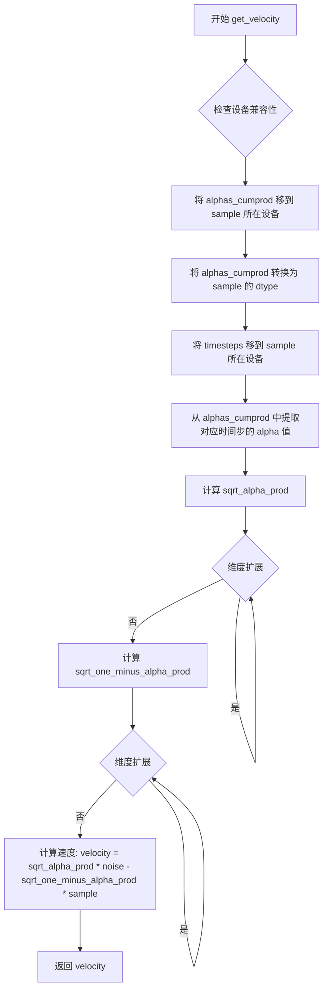
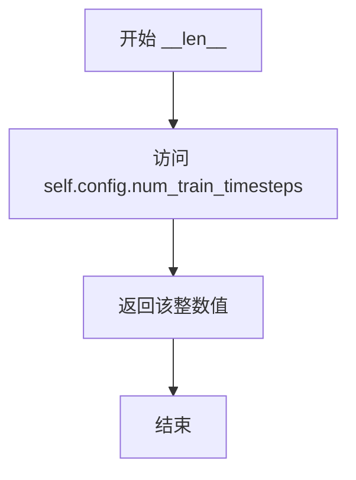

# `diffusers\src\diffusers\schedulers\scheduling_ddim_cogvideox.py` 详细设计文档

CogVideoX-DDIM调度器实现，用于视频扩散模型的推理过程，通过逆扩散过程逐步去噪生成样本，支持多种噪声调度策略和预测类型

## 整体流程



## 类结构

```
DDIMSchedulerOutput (数据类)
CogVideoXDDIMScheduler (主调度器类)
    ├── 继承: SchedulerMixin, ConfigMixin
```

## 全局变量及字段


### `betas_for_alpha_bar`
    
创建离散的beta调度表，根据给定的alpha_t_bar函数生成beta序列

类型：`function`
    


### `rescale_zero_terminal_snr`
    
根据Algorithm 1重新缩放beta值以实现零终端SNR

类型：`function`
    


### `DDIMSchedulerOutput`
    
调度器step函数的输出类，包含前一步样本和预测的原样本

类型：`dataclass`
    


### `CogVideoXDDIMScheduler`
    
CogVideoX的DDIM调度器实现，扩展了去噪扩散概率模型的非马尔可夫引导程序

类型：`class`
    


### `DDIMSchedulerOutput.prev_sample`
    
前一步计算出的样本(x_{t-1})，用作下一步模型输入

类型：`torch.Tensor`
    


### `DDIMSchedulerOutput.pred_original_sample`
    
基于当前时间步模型输出预测的去噪样本(x_0)，可用于预览进度或引导

类型：`torch.Tensor | None`
    


### `CogVideoXDDIMScheduler.betas`
    
Beta值序列，控制扩散过程中的噪声添加

类型：`torch.Tensor`
    


### `CogVideoXDDIMScheduler.alphas`
    
Alpha值序列，通过1-beta计算得到

类型：`torch.Tensor`
    


### `CogVideoXDDIMScheduler.alphas_cumprod`
    
累积Alpha值，乘积形式的Alpha序列

类型：`torch.Tensor`
    


### `CogVideoXDDIMScheduler.final_alpha_cumprod`
    
最终累积Alpha值，用于最后一步

类型：`torch.Tensor`
    


### `CogVideoXDDIMScheduler.init_noise_sigma`
    
初始噪声标准差，默认为1.0

类型：`float`
    


### `CogVideoXDDIMScheduler.num_inference_steps`
    
推理步数，在set_timesteps后设置

类型：`int | None`
    


### `CogVideoXDDIMScheduler.timesteps`
    
时间步张量，存储扩散链中的离散时间步

类型：`torch.Tensor`
    


### `CogVideoXDDIMScheduler._compatibles`
    
兼容的调度器列表，包含所有KarrasDiffusionSchedulers调度器名称

类型：`list`
    


### `CogVideoXDDIMScheduler.order`
    
调度器阶数，DDIM为1阶调度器

类型：`int`
    
    

## 全局函数及方法


### `betas_for_alpha_bar`

该函数用于创建Beta调度表，通过离散化给定的alpha_t_bar函数来生成扩散过程中的Beta值序列。它定义了累积乘积(1-beta)随时间变化的函数，支持三种alpha变换类型（cosine、exp、laplace），并确保生成的Beta值不超过指定的最大值以避免数值不稳定。

参数：

- `num_diffusion_timesteps`：`int`，要生成的Beta数量，即扩散时间步的数量
- `max_beta`：`float`，默认为0.999，允许的最大Beta值，使用小于1的值以避免数值不稳定
- `alpha_transform_type`：`Literal["cosine", "exp", "laplace"]`，默认为"cosine"，Alpha_bar函数的噪声调度类型，可选"cosine"（余弦）、"exp"（指数）或"laplace"（拉普拉斯）

返回值：`torch.Tensor`，调度器用于逐步处理模型输出的Beta值张量

#### 流程图

```mermaid
flowchart TD
    A[开始] --> B{alpha_transform_type == 'cosine'?}
    B -->|Yes| C[定义alpha_bar_fn: cos²((t+0.008)/1.008 * π/2)]
    B -->|No| D{alpha_transform_type == 'laplace'?}
    D -->|Yes| E[定义alpha_bar_fn: 拉普拉斯分布]
    D -->|No| F{alpha_transform_type == 'exp'?}
    F -->|Yes| G[定义alpha_bar_fn: exp(t * -12.0)]
    F -->|No| H[抛出ValueError: 不支持的类型]
    
    C --> I[初始化空betas列表]
    E --> I
    G --> I
    
    I --> J[循环 i 从 0 到 num_diffusion_timesteps-1]
    J --> K[计算 t1 = i / num_diffusion_timesteps]
    J --> L[计算 t2 = (i + 1) / num_diffusion_timesteps]
    K --> M[计算 beta = min(1 - alpha_bar_fn(t2) / alpha_bar_fn(t1), max_beta)]
    L --> M
    M --> N[将beta添加到betas列表]
    N --> O{循环结束?}
    O -->|No| J
    O -->|Yes| P[将betas列表转换为torch.Tensor]
    P --> Q[返回Beta张量]
    
    H --> R[结束 - 抛出异常]
```

#### 带注释源码

```python
# Copied from diffusers.schedulers.scheduling_ddpm.betas_for_alpha_bar
def betas_for_alpha_bar(
    num_diffusion_timesteps: int,
    max_beta: float = 0.999,
    alpha_transform_type: Literal["cosine", "exp", "laplace"] = "cosine",
) -> torch.Tensor:
    """
    Create a beta schedule that discretizes the given alpha_t_bar function, which defines the cumulative product of
    (1-beta) over time from t = [0,1].

    Contains a function alpha_bar that takes an argument t and transforms it to the cumulative product of (1-beta) up
    to that part of the diffusion process.

    Args:
        num_diffusion_timesteps (`int`):
            The number of betas to produce.
        max_beta (`float`, defaults to `0.999`):
            The maximum beta to use; use values lower than 1 to avoid numerical instability.
        alpha_transform_type (`str`, defaults to `"cosine"`):
            The type of noise schedule for `alpha_bar`. Choose from `cosine`, `exp`, or `laplace`.

    Returns:
        `torch.Tensor`:
            The betas used by the scheduler to step the model outputs.
    """
    # 根据alpha_transform_type选择不同的alpha_bar变换函数
    if alpha_transform_type == "cosine":
        # 余弦变换：使用余弦平方函数平滑地调整alpha值
        # 公式：cos²((t+0.008)/1.008 * π/2)，偏移量0.008用于避免t=0时的边界问题
        def alpha_bar_fn(t):
            return math.cos((t + 0.008) / 1.008 * math.pi / 2) ** 2

    elif alpha_transform_type == "laplace":
        # 拉普拉斯变换：基于拉普拉斯分布的噪声调度
        # 使用信噪比(SNR)的平方根形式
        def alpha_bar_fn(t):
            # 计算拉普拉斯分布的lambda参数
            lmb = -0.5 * math.copysign(1, 0.5 - t) * math.log(1 - 2 * math.fabs(0.5 - t) + 1e-6)
            # 计算信噪比
            snr = math.exp(lmb)
            # 返回基于SNR的alpha值
            return math.sqrt(snr / (1 + snr))

    elif alpha_transform_type == "exp":
        # 指数变换：指数衰减的噪声调度
        # 使用负指数函数，-12.0是衰减速率
        def alpha_bar_fn(t):
            return math.exp(t * -12.0)

    else:
        # 不支持的变换类型，抛出异常
        raise ValueError(f"Unsupported alpha_transform_type: {alpha_transform_type}")

    # 初始化beta列表用于存储生成的beta值
    betas = []
    # 遍历每个扩散时间步，计算对应的beta值
    for i in range(num_diffusion_timesteps):
        # 计算当前时间步的起始点t1和终点t2（归一化到[0,1]区间）
        t1 = i / num_diffusion_timesteps
        t2 = (i + 1) / num_diffusion_timesteps
        # 通过离散化公式计算beta：1 - alpha_bar(t2) / alpha_bar(t1)
        # 使用max_beta限制最大beta值以避免数值不稳定
        betas.append(min(1 - alpha_bar_fn(t2) / alpha_bar_fn(t1), max_beta))
    
    # 将beta列表转换为PyTorch浮点张量并返回
    return torch.tensor(betas, dtype=torch.float32)
```


### `rescale_zero_terminal_snr`

该函数用于重新调整 Alpha 累积乘积，使扩散调度器具有零终端 SNR（Signal-to-Noise Ratio，信噪比）。这是基于 Algorithm 1 的实现，旨在使模型能够生成非常明亮或非常暗的样本，而不是限制在中等亮度的样本。

参数：

- `alphas_cumprod`：`torch.Tensor`，Alpha 累积乘积张量，调度器初始化时使用的 Alpha 累积值

返回值：`torch.Tensor`，经过零终端 SNR 调整后的 Alpha 累积值

#### 流程图

```mermaid
flowchart TD
    A[开始: 输入 alphas_cumprod] --> B[计算平方根: alphas_bar_sqrt = alphas_cumprod.sqrt]
    B --> C[保存原始值: alphas_bar_sqrt_0 = alphas_bar_sqrt[0]]
    C --> D[保存终端值: alphas_bar_sqrt_T = alphas_bar_sqrt[-1]]
    D --> E[平移操作: alphas_bar_sqrt -= alphas_bar_sqrt_T]
    E --> F[缩放操作: alphas_bar_sqrt *= alphas_bar_sqrt_0 / (alphas_bar_sqrt_0 - alphas_bar_sqrt_T)]
    F --> G[恢复平方: alphas_bar = alphas_bar_sqrt ** 2]
    G --> H[返回结果]
```

#### 带注释源码

```python
def rescale_zero_terminal_snr(alphas_cumprod: torch.Tensor) -> torch.Tensor:
    """
    Rescales betas to have zero terminal SNR Based on (Algorithm 1)[https://huggingface.co/papers/2305.08891]

    Args:
        alphas_cumprod (`torch.Tensor`):
            The alphas cumulative products that the scheduler is being initialized with.

    Returns:
        `torch.Tensor`: rescaled betas with zero terminal SNR
    """

    # 步骤1: 对 alphas_cumprod 开平方根，得到 alpha_bar 的平方根形式
    alphas_bar_sqrt = alphas_cumprod.sqrt()

    # 步骤2: 保存原始值，用于后续缩放操作
    # 保存第一个时间步的 alpha_bar_sqrt 值
    alphas_bar_sqrt_0 = alphas_bar_sqrt[0].clone()
    # 保存最后一个时间步的 alpha_bar_sqrt 值（即终端值）
    alphas_bar_sqrt_T = alphas_bar_sqrt[-1].clone()

    # 步骤3: 平移操作 - 将最后的时间步移动到零
    # 这确保了终端 SNR 为零（当 alpha_bar_sqrt_T = 0 时，alphas_bar[-1] = 0）
    alphas_bar_sqrt -= alphas_bar_sqrt_T

    # 步骤4: 缩放操作 - 将第一个时间步恢复到原始值
    # 通过缩放因子调整，使第一个时间步保持原来的值
    alphas_bar_sqrt *= alphas_bar_sqrt_0 / (alphas_bar_sqrt_0 - alphas_bar_sqrt_T)

    # 步骤5: 将平方根恢复为原始的 alpha_bar 值
    alphas_bar = alphas_bar_sqrt ** 2  # Revert sqrt

    # 返回调整后的 alphas_cumprod（实际上在这里返回的是 alphas_bar）
    return alphas_bar
```


### CogVideoXDDIMScheduler.__init__

CogVideoXDDIMScheduler类的__init__方法是一个扩散模型调度器的初始化函数，用于配置DDIM（Denoising Diffusion Implicit Models）采样过程中所需的参数，包括beta调度、alpha计算、SNR调整等核心扩散参数。

参数：

- `num_train_timesteps`：`int`，训练时的扩散步数，默认为1000
- `beta_start`：`float`，beta调度起始值，默认为0.00085
- `beta_end`：`float`，beta调度结束值，默认为0.0120
- `beta_schedule`：`Literal["linear", "scaled_linear", "squaredcos_cap_v2"]`，beta调度策略，默认为"scaled_linear"
- `traried_betas`：`np.ndarray | list[float] | None`，直接传入的beta数组，默认为None
- `clip_sample`：`bool`，是否截断采样样本，默认为True
- `set_alpha_to_one`：`bool`，最终alpha值是否设为1，默认为True
- `steps_offset`：`int`，推理步数偏移量，默认为0
- `prediction_type`：`Literal["epsilon", "sample", "v_prediction"]`，预测类型，默认为"epsilon"
- `clip_sample_range`：`float`，样本截断范围，默认为1.0
- `sample_max_value`：`float`，样本最大值，默认为1.0
- `timestep_spacing`：`Literal["linspace", "leading", "trailing"]`，时间步间隔策略，默认为"leading"
- `rescale_betas_zero_snr`：`bool`，是否重新调整beta以实现零终端SNR，默认为False
- `snr_shift_scale`：`float`，SNR平移缩放因子，默认为3.0

返回值：`None`，该方法为初始化方法，不返回任何值

#### 流程图



#### 关键组件信息

| 组件名称 | 一句话描述 |
|---------|-----------|
| betas | 扩散过程中的beta值序列，控制每步的噪声添加量 |
| alphas | 由betas计算得出的alpha值（1-beta），控制每步的信号保留量 |
| alphas_cumprod | alpha的累积乘积，用于计算更长时间尺度的衰减 |
| final_alpha_cumprod | 最终时间步的alpha累积乘积值 |
| init_noise_sigma | 初始噪声的标准差，固定为1.0 |
| num_inference_steps | 推理时使用的扩散步数，初始化时为None |
| timesteps | 包含所有推理时间步的张量 |

#### 潜在的技术债务或优化空间

1. **重复计算**：alphas_cumprod的设备转移和数据类型转换在add_noise和get_velocity方法中重复执行，可以考虑在初始化时确保设备一致性
2. **硬编码的SNR移位**：snr_shift_scale的默认值3.0是硬编码的，可能对不同模型不适用
3. **类型提示不完整**：部分参数如trained_betas的类型使用了Python 3.10+的联合类型语法，可能影响兼容性
4. **Magic Number**：代码中存在一些魔数如0.008、1.008等，可以提取为常量提高可读性

#### 带注释源码

```python
@register_to_config
def __init__(
    self,
    num_train_timesteps: int = 1000,  # 扩散模型训练时的总步数
    beta_start: float = 0.00085,       # beta调度曲线起始值
    beta_end: float = 0.0120,          # beta调度曲线结束值
    beta_schedule: Literal["linear", "scaled_linear", "squaredcos_cap_v2"] = "scaled_linear",
    trained_betas: np.ndarray | list[float] | None = None,  # 可直接传入预训练的beta序列
    clip_sample: bool = True,          # 是否对预测样本进行截断
    set_alpha_to_one: bool = True,     # 最终步是否将alpha设为1
    steps_offset: int = 0,              # 推理步数的偏移量
    prediction_type: Literal["epsilon", "sample", "v_prediction"] = "epsilon",
    clip_sample_range: float = 1.0,     # 截断范围
    sample_max_value: float = 1.0,     # 样本最大值
    timestep_spacing: Literal["linspace", "leading", "trailing"] = "leading",
    rescale_betas_zero_snr: bool = False,  # 是否重调整beta以实现零终端SNR
    snr_shift_scale: float = 3.0,      # SNR平移缩放因子
):
    # 根据传入的trained_betas或beta_schedule计算betas
    if trained_betas is not None:
        # 如果直接传入betas，直接使用
        self.betas = torch.tensor(trained_betas, dtype=torch.float32)
    elif beta_schedule == "linear":
        # 线性beta调度：从beta_start线性增加到beta_end
        self.betas = torch.linspace(beta_start, beta_end, num_train_timesteps, dtype=torch.float32)
    elif beta_schedule == "scaled_linear":
        # 缩放线性调度：先对beta_start和beta_end开根号，进行线性插值后再平方
        # 这种调度特别适合潜在扩散模型
        self.betas = (
            torch.linspace(
                beta_start**0.5,
                beta_end**0.5,
                num_train_timesteps,
                dtype=torch.float64,
            )
            ** 2
        )
    elif beta_schedule == "squaredcos_cap_v2":
        # 余弦调度：使用alpha_bar函数生成的beta序列
        self.betas = betas_for_alpha_bar(num_train_timesteps)
    else:
        raise NotImplementedError(f"{beta_schedule} is not implemented for {self.__class__}")

    # 计算alphas = 1 - betas
    self.alphas = 1.0 - self.betas
    # 计算alpha的累积乘积，用于多步扩散
    self.alphas_cumprod = torch.cumprod(self.alphas, dim=0)

    # 修改：对SNR进行移位调整（遵循SD3的做法）
    # 公式：alphas_cumprod = alphas_cumprod / (snr_shift_scale + (1 - snr_shift_scale) * alphas_cumprod)
    self.alphas_cumprod = self.alphas_cumprod / (snr_shift_scale + (1 - snr_shift_scale) * self.alphas_cumprod)

    # 如果需要重调整beta以实现零终端SNR
    if rescale_betas_zero_snr:
        self.alphas_cumprod = rescale_zero_terminal_snr(self.alphas_cumprod)

    # 在DDIM中，我们需要查看前一个alpha_cumprod
    # 对于最终步，没有前一个alpha_cumprod（因为已经达到0）
    # set_alpha_to_one决定是简单地设为1还是使用第0步的alpha值
    self.final_alpha_cumprod = torch.tensor(1.0) if set_alpha_to_one else self.alphas_cumprod[0]

    # 初始噪声分布的标准差
    self.init_noise_sigma = 1.0

    # 可设置的推理参数
    self.num_inference_steps = None  # 推理步数，稍后通过set_timesteps设置
    # 创建倒序的时间步数组：[num_train_timesteps-1, num_train_timesteps-2, ..., 0]
    self.timesteps = torch.from_numpy(np.arange(0, num_train_timesteps)[::-1].copy().astype(np.int64))
```


### `CogVideoXDDIMScheduler._get_variance`

该方法用于计算DDIM调度器在给定时间步的方差值，基于当前时间步和前一个时间步的alpha累积乘积（alphas_cumprod）计算得出。这是DDIM采样算法中方差计算的核心公式，用于确定每一步的噪声标准差。

参数：

- `self`：`CogVideoXDDIMScheduler`，隐式的实例引用
- `timestep`：`int`，当前扩散时间步索引
- `prev_timestep`：`int`，前一个扩散时间步索引，当值小于0时使用final_alpha_cumprod

返回值：`torch.Tensor`，计算得到的方差值

#### 流程图

```mermaid
flowchart TD
    A[开始 _get_variance] --> B[获取 alpha_prod_t = alphas_cumprod[timestep]]
    B --> C{prev_timestep >= 0?}
    C -->|是| D[alpha_prod_t_prev = alphas_cumprod[prev_timestep]]
    C -->|否| E[alpha_prod_t_prev = final_alpha_cumprod]
    D --> F[计算 beta_prod_t = 1 - alpha_prod_t]
    E --> F
    F --> G[计算 beta_prod_t_prev = 1 - alpha_prod_t_prev]
    G --> H[计算 variance = (beta_prod_t_prev / beta_prod_t) * (1 - alpha_prod_t / alpha_prod_t_prev)]
    H --> I[返回 variance]
```

#### 带注释源码

```python
def _get_variance(self, timestep: int, prev_timestep: int) -> torch.Tensor:
    """
    计算DDIM调度器的方差值。
    
    基于DDIM论文中的公式计算给定时间步的方差，用于采样过程中的噪声标准差计算。
    
    Args:
        timestep: 当前扩散时间步的索引
        prev_timestep: 前一个时间步的索引，如果为负数则使用最终的alpha累积乘积
    
    Returns:
        torch.Tensor: 计算得到的方差值
    """
    # 获取当前时间步t的alpha累积乘积
    alpha_prod_t = self.alphas_cumprod[timestep]
    
    # 获取前一时间步t-1的alpha累积乘积
    # 如果prev_timestep < 0，说明已经到达最终步骤，使用final_alpha_cumprod（通常为1.0）
    alpha_prod_t_prev = self.alphas_cumprod[prev_timestep] if prev_timestep >= 0 else self.final_alpha_cumprod
    
    # 计算当前时间步和前一时间步的beta累积乘积（1 - alpha）
    beta_prod_t = 1 - alpha_prod_t
    beta_prod_t_prev = 1 - alpha_prod_t_prev
    
    # 计算方差公式：DDIM论文公式(16)中的sigma_t^2
    # variance = (β(t-1) / β(t)) * (1 - α(t) / α(t-1))
    variance = (beta_prod_t_prev / beta_prod_t) * (1 - alpha_prod_t / alpha_prod_t_prev)
    
    return variance
```


### `CogVideoXDDIMScheduler.scale_model_input`

确保与需要根据当前时间步缩放去噪模型输入的调度器可互换。

参数：

- `sample`：`torch.Tensor`，输入样本
- `timestep`：`int`（可选），扩散链中的当前时间步

返回值：`torch.Tensor`，缩放后的输入样本

#### 流程图



#### 带注释源码

```python
def scale_model_input(self, sample: torch.Tensor, timestep: int = None) -> torch.Tensor:
    """
    Ensures interchangeability with schedulers that need to scale the denoising model input depending on the
    current timestep.

    Args:
        sample (`torch.Tensor`):
            The input sample.
        timestep (`int`, *optional*):
            The current timestep in the diffusion chain.

    Returns:
        `torch.Tensor`:
            A scaled input sample.
    """
    # 该方法在 CogVideoXDDIMScheduler 中是一个空实现
    # 直接返回原始样本，不进行任何缩放操作
    # 这样的设计是为了保持与其他调度器的接口一致性
    # 某些调度器可能需要根据 timestep 对输入进行缩放（例如，在某些噪声调度中）
    # 但 DDIM 调度器本身不需要这种缩放
    return sample
```


### `CogVideoXDDIMScheduler.set_timesteps`

设置离散时间步，用于扩散链的推理过程。该方法根据配置的时间步间隔策略（linspace、leading或trailing）计算推理时的时间步序列，并将其存储在调度器的`timesteps`属性中。

参数：

- `num_inference_steps`：`int`，推理时使用的扩散步数，决定生成样本时的时间步总数
- `device`：`str | torch.device | None`，可选参数，指定时间步张量存放的设备（CPU或CUDA）

返回值：`None`，该方法直接修改调度器内部状态，不返回任何值

#### 流程图



#### 带注释源码

```python
def set_timesteps(
    self,
    num_inference_steps: int,
    device: str | torch.device | None = None,
) -> None:
    """
    Sets the discrete timesteps used for the diffusion chain (to be run before inference).

    Args:
        num_inference_steps (`int`):
            The number of diffusion steps used when generating samples with a pre-trained model.
    """

    # Step 1: 验证推理步数不超过训练步数
    # 因为模型只在训练时的时间步数范围内训练过
    if num_inference_steps > self.config.num_train_timesteps:
        raise ValueError(
            f"`num_inference_steps`: {num_inference_steps} cannot be larger than `self.config.train_timesteps`:"
            f" {self.config.num_train_timesteps} as the unet model trained with this scheduler can only handle"
            f" maximal {self.config.num_train_timesteps} timesteps."
        )

    # Step 2: 记录推理步数
    self.num_inference_steps = num_inference_steps

    # Step 3: 根据时间步间隔策略生成时间步序列
    # "linspace", "leading", "trailing" 对应于 https://huggingface.co/papers/2305.08891 论文中的表2
    if self.config.timestep_spacing == "linspace":
        # linspace策略：在[0, num_train_timesteps-1]范围内均匀分布
        timesteps = (
            np.linspace(0, self.config.num_train_timesteps - 1, num_inference_steps)
            .round()[::-1]  # 反转顺序，从大到小
            .copy()
            .astype(np.int64)
        )
    elif self.config.timestep_spacing == "leading":
        # leading策略：时间步均匀分布，起始步与训练步对齐
        step_ratio = self.config.num_train_timesteps // self.num_inference_steps
        # 通过乘以比率创建整数时间步
        # 转换为int以避免当num_inference_step是3的幂次时出现问题
        timesteps = (np.arange(0, num_inference_steps) * step_ratio).round()[::-1].copy().astype(np.int64)
        # 添加偏移量，适用于某些模型系列
        timesteps += self.config.steps_offset
    elif self.config.timestep_spacing == "trailing":
        # trailing策略：时间步均匀分布，末尾步与训练步对齐
        step_ratio = self.config.num_train_timesteps / self.num_inference_steps
        # 通过乘以比率创建整数时间步
        timesteps = np.round(np.arange(self.config.num_train_timesteps, 0, -step_ratio)).astype(np.int64)
        timesteps -= 1
    else:
        raise ValueError(
            f"{self.config.timestep_spacing} is not supported. Please make sure to choose one of 'leading' or 'trailing'."
        )

    # Step 4: 将numpy数组转换为PyTorch张量并移至指定设备
    self.timesteps = torch.from_numpy(timesteps).to(device)
```


### `CogVideoXDDIMScheduler.step`

该函数是 DDIM（Denoising Diffusion Implicit Models）调度器的核心推理方法，通过逆向随机微分方程（SDE）基于当前时间步的模型输出来预测前一个时间步的样本，实现图像/视频的去噪扩散过程。

参数：

- `model_output`：`torch.Tensor`，学习到的扩散模型的直接输出（如预测的噪声）
- `timestep`：`int`，扩散链中的当前离散时间步
- `sample`：`torch.Tensor`，扩散过程生成的当前样本实例
- `eta`：`float` = 0.0，扩散步骤中添加噪声的权重（0.0 为确定性采样）
- `use_clipped_model_output`：`bool` = False，是否使用裁剪后的模型输出进行修正
- `generator`：`torch.Generator | None` = None，随机数生成器，用于可复现的噪声生成
- `variance_noise`：`torch.Tensor | None` = None，直接提供的方差噪声，替代通过 generator 生成
- `return_dict`：`bool` = True，是否返回字典格式的结果

返回值：`DDIMSchedulerOutput | tuple`，返回前一个时间步的样本和预测的原始样本，或包含这些值的元组

#### 流程图

```mermaid
flowchart TD
    A[step 方法开始] --> B{检查 num_inference_steps}
    B -->|为 None| C[抛出 ValueError: 需要先运行 set_timesteps]
    B -->|不为 None| D[计算 prev_timestep = timestep - num_train_timesteps // num_inference_steps]
    D --> E[获取 alpha_prod_t 和 alpha_prod_t_prev]
    E --> F[计算 beta_prod_t = 1 - alpha_prod_t]
    F --> G{根据 prediction_type 计算 pred_original_sample}
    G -->|epsilon| H[pred_original_sample = (sample - sqrt(beta_prod_t) * model_output) / sqrt(alpha_prod_t)]
    G -->|sample| I[pred_original_sample = model_output]
    G -->|v_prediction| J[pred_original_sample = sqrt(alpha_prod_t) * sample - sqrt(beta_prod_t) * model_output]
    H --> K[计算系数 a_t 和 b_t]
    I --> K
    J --> K
    K --> L[prev_sample = a_t * sample + b_t * pred_original_sample]
    L --> M{return_dict}
    M -->|True| N[返回 DDIMSchedulerOutput 对象]
    M -->|False| O[返回 tuple prev_sample, pred_original_sample]
```

#### 带注释源码

```python
def step(
    self,
    model_output: torch.Tensor,
    timestep: int,
    sample: torch.Tensor,
    eta: float = 0.0,
    use_clipped_model_output: bool = False,
    generator: torch.Generator | None = None,
    variance_noise: torch.Tensor | None = None,
    return_dict: bool = True,
) -> DDIMSchedulerOutput | tuple:
    """
    Predict the sample from the previous timestep by reversing the SDE. This function propagates the diffusion
    process from the learned model outputs (most often the predicted noise).

    Args:
        model_output (`torch.Tensor`): The direct output from learned diffusion model.
        timestep (`int`): The current discrete timestep in the diffusion chain.
        sample (`torch.Tensor`): A current instance of a sample created by the diffusion process.
        eta (`float`): The weight of noise for added noise in diffusion step.
        use_clipped_model_output (`bool`, defaults to `False`):
            If `True`, computes "corrected" `model_output` from the clipped predicted original sample. Necessary
            because predicted original sample is clipped to [-1, 1] when `self.config.clip_sample` is `True`. If no
            clipping has happened, "corrected" `model_output` would coincide with the one provided as input and
            `use_clipped_model_output` has no effect.
        generator (`torch.Generator`, *optional*): A random number generator.
        variance_noise (`torch.Tensor`):
            Alternative to generating noise with `generator` by directly providing the noise for the variance
            itself. Useful for methods such as [`CycleDiffusion`].
        return_dict (`bool`, *optional*, defaults to `True`):
            Whether or not to return a [`~schedulers.scheduling_ddim.DDIMSchedulerOutput`] or `tuple`.

    Returns:
        [`~schedulers.scheduling_ddim.DDIMSchedulerOutput`] or `tuple`:
            If return_dict is `True`, [`~schedulers.scheduling_ddim.DDIMSchedulerOutput`] is returned, otherwise a
            tuple is returned where the first element is the sample tensor.
    """
    # 检查推理步数是否已设置，未设置则抛出异常
    if self.num_inference_steps is None:
        raise ValueError(
            "Number of inference steps is 'None', you need to run 'set_timesteps' after creating the scheduler"
        )

    # 参考 DDIM 论文 https://huggingface.co/papers/2010.02502 中的公式 (12) 和 (16)
    # 符号说明：
    # pred_noise_t -> e_theta(x_t, t) 预测噪声
    # pred_original_sample -> f_theta(x_t, t) 或 x_0 预测原始样本
    # std_dev_t -> sigma_t 标准差
    # eta -> η ETA参数
    # pred_sample_direction -> 指向 x_t 的方向
    # pred_prev_sample -> x_t-1 前一个样本

    # 1. 获取前一个时间步 (= t-1)
    # 计算前一个时间步的索引
    prev_timestep = timestep - self.config.num_train_timesteps // self.num_inference_steps

    # 2. 计算 alpha 和 beta 值
    # alpha_prod_t: 累积 alpha 乘积（当前时间步）
    alpha_prod_t = self.alphas_cumprod[timestep]
    # alpha_prod_t_prev: 累积 alpha 乘积（前一个时间步）
    # 如果 prev_timestep < 0，则使用最终 alpha 累积值
    alpha_prod_t_prev = self.alphas_cumprod[prev_timestep] if prev_timestep >= 0 else self.final_alpha_cumprod

    # beta_prod_t: 1 - alpha_prod_t
    beta_prod_t = 1 - alpha_prod_t

    # 3. 从预测的噪声计算预测的原始样本（公式12）
    # 也称为 "predicted x_0"
    if self.config.prediction_type == "epsilon":
        # epsilon 预测：x_0 = (x_t - sqrt(β_t) * ε) / sqrt(α_t)
        pred_original_sample = (sample - beta_prod_t ** (0.5) * model_output) / alpha_prod_t ** (0.5)
    elif self.config.prediction_type == "sample":
        # sample 预测：直接输出模型预测的样本
        pred_original_sample = model_output
    elif self.config.prediction_type == "v_prediction":
        # v-prediction：x_0 = sqrt(α_t) * x_t - sqrt(β_t) * v
        pred_original_sample = (alpha_prod_t**0.5) * sample - (beta_prod_t**0.5) * model_output
    else:
        raise ValueError(
            f"prediction_type given as {self.config.prediction_type} must be one of `epsilon`, `sample`, or"
            " `v_prediction`"
        )

    # 4. 计算前向系数 a_t 和 b_t（用于计算前一个样本）
    # a_t = sqrt((1 - α_{t-1}) / (1 - α_t))
    a_t = ((1 - alpha_prod_t_prev) / (1 - alpha_prod_t)) ** 0.5
    # b_t = sqrt(α_{t-1}) - sqrt(α_t) * a_t
    b_t = alpha_prod_t_prev**0.5 - alpha_prod_t**0.5 * a_t

    # 5. 计算前一个时间步的样本
    # x_{t-1} = a_t * x_t + b_t * x_0
    prev_sample = a_t * sample + b_t * pred_original_sample

    # 6. 根据 return_dict 返回结果
    if not return_dict:
        return (
            prev_sample,
            pred_original_sample,
        )

    # 返回 DDIMSchedulerOutput 对象，包含 prev_sample 和 pred_original_sample
    return DDIMSchedulerOutput(prev_sample=prev_sample, pred_original_sample=pred_original_sample)
```


### `CogVideoXDDIMScheduler.add_noise`

向原始样本添加噪声，根据每个时间步的噪声幅度进行前向扩散过程。该方法实现了扩散模型的前向噪声添加过程，通过计算累积alpha乘积的平方根来控制噪声的混合比例。

参数：

- `original_samples`：`torch.Tensor`，要添加噪声的原始样本张量
- `noise`：`torch.Tensor`，要添加到样本中的噪声张量
- `timesteps`：`torch.IntTensor`，表示每个样本噪声水平的时间步

返回值：`torch.Tensor`，添加噪声后的样本

#### 流程图

```mermaid
flowchart TD
    A[开始 add_noise] --> B{检查设备兼容性}
    B --> C[将 alphas_cumprod 移动到 original_samples 的设备]
    C --> D[将 alphas_cumprod 转换为 original_samples 的数据类型]
    D --> E[将 timesteps 移动到 original_samples 的设备]
    E --> F[从 alphas_cumprod[timesteps] 计算 sqrt_alpha_prod]
    F --> G[展开并扩展 sqrt_alpha_prod 以匹配 original_samples 的形状]
    H[从 1 - alphas_cumprod[timesteps] 计算 sqrt_one_minus_alpha_prod]
    G --> I{形状扩展循环}
    H --> I
    I --> J[计算 noisy_samples = sqrt_alpha_prod × original_samples + sqrt_one_minus_alpha_prod × noise]
    J --> K[返回 noisy_samples]
```

#### 带注释源码

```python
def add_noise(
    self,
    original_samples: torch.Tensor,
    noise: torch.Tensor,
    timesteps: torch.IntTensor,
) -> torch.Tensor:
    """
    向原始样本添加噪声，根据每个时间步的噪声幅度进行前向扩散过程。

    Args:
        original_samples (`torch.Tensor`):
            要添加噪声的原始样本。
        noise (`torch.Tensor`):
            要添加到样本中的噪声。
        timesteps (`torch.IntTensor`):
            表示每个样本噪声水平的时间步。

    Returns:
        `torch.Tensor`:
            添加噪声后的样本。
    """
    # 确保 alphas_cumprod 和 timestep 与 original_samples 具有相同的设备和数据类型
    # 将 self.alphas_cumprod 移动到设备上，以避免后续 add_noise 调用时重复的 CPU 到 GPU 数据移动
    self.alphas_cumprod = self.alphas_cumprod.to(device=original_samples.device)
    alphas_cumprod = self.alphas_cumprod.to(dtype=original_samples.dtype)
    timesteps = timesteps.to(original_samples.device)

    # 计算 alpha 累积乘积的平方根 (sqrt(alpha_prod_t))
    sqrt_alpha_prod = alphas_cumprod[timesteps] ** 0.5
    # 展平以便后续广播操作
    sqrt_alpha_prod = sqrt_alpha_prod.flatten()
    # 扩展维度以匹配 original_samples 的形状，支持多维张量
    while len(sqrt_alpha_prod.shape) < len(original_samples.shape):
        sqrt_alpha_prod = sqrt_alpha_prod.unsqueeze(-1)

    # 计算 (1 - alpha 累积乘积) 的平方根，用于噪声项
    sqrt_one_minus_alpha_prod = (1 - alphas_cumprod[timesteps]) ** 0.5
    sqrt_one_minus_alpha_prod = sqrt_one_minus_alpha_prod.flatten()
    # 扩展维度以匹配 original_samples 的形状
    while len(sqrt_one_minus_alpha_prod.shape) < len(original_samples.shape):
        sqrt_one_minus_alpha_prod = sqrt_one_minus_alpha_prod.unsqueeze(-1)

    # 前向扩散公式: x_t = sqrt(alpha_prod_t) * x_0 + sqrt(1 - alpha_prod_t) * epsilon
    noisy_samples = sqrt_alpha_prod * original_samples + sqrt_one_minus_alpha_prod * noise
    return noisy_samples
```


### CogVideoXDDIMScheduler.get_velocity

该方法根据扩散模型的速度公式，从样本和噪声张量计算速度预测。这是DDIM调度器中用于推理或训练过程中计算速度的关键方法。

参数：

- `sample`：`torch.Tensor`，输入样本，即当前扩散过程中的有噪声样本
- `noise`：`torch.Tensor`，噪声张量，通常是添加到样本中的噪声
- `timesteps`：`torch.IntTensor`，时间步张量，表示当前扩散过程的时间步

返回值：`torch.Tensor`，计算得到的速度张量，用于后续的扩散过程

#### 流程图



#### 带注释源码

```python
def get_velocity(self, sample: torch.Tensor, noise: torch.Tensor, timesteps: torch.IntTensor) -> torch.Tensor:
    """
    Compute the velocity prediction from the sample and noise according to the velocity formula.

    Args:
        sample (`torch.Tensor`):
            The input sample.
        noise (`torch.Tensor`):
            The noise tensor.
        timesteps (`torch.IntTensor`):
            The timesteps for velocity computation.

    Returns:
        `torch.Tensor`:
            The computed velocity.
    """
    # 确保 alphas_cumprod 和 timestep 与 sample 在同一设备上
    # 移动 self.alphas_cumprod 到 sample 所在的设备，避免冗余的 CPU 到 GPU 数据移动
    self.alphas_cumprod = self.alphas_cumprod.to(device=sample.device)
    # 将 alphas_cumprod 转换为与 sample 相同的数据类型
    alphas_cumprod = self.alphas_cumprod.to(dtype=sample.dtype)
    # 将 timesteps 移到 sample 所在的设备
    timesteps = timesteps.to(sample.device)

    # 根据时间步从 alphas_cumprod 中提取对应的 alpha 值，然后开平方得到 sqrt_alpha_prod
    sqrt_alpha_prod = alphas_cumprod[timesteps] ** 0.5
    # 展平 sqrt_alpha_prod 以便后续维度扩展
    sqrt_alpha_prod = sqrt_alpha_prod.flatten()
    # 扩展 sqrt_alpha_prod 的维度直到其维度数与 sample 相同
    # 这是为了支持批量处理不同维度的样本
    while len(sqrt_alpha_prod.shape) < len(sample.shape):
        sqrt_alpha_prod = sqrt_alpha_prod.unsqueeze(-1)

    # 计算 (1 - alphas_cumprod[timesteps]) 的平方根，得到 sqrt_one_minus_alpha_prod
    sqrt_one_minus_alpha_prod = (1 - alphas_cumprod[timesteps]) ** 0.5
    # 展平 sqrt_one_minus_alpha_prod
    sqrt_one_minus_alpha_prod = sqrt_one_minus_alpha_prod.flatten()
    # 扩展 sqrt_one_minus_alpha_prod 的维度直到其维度数与 sample 相同
    while len(sqrt_one_minus_alpha_prod.shape) < len(sample.shape):
        sqrt_one_minus_alpha_prod = sqrt_one_minus_alpha_prod.unsqueeze(-1)

    # 根据速度公式计算速度: v = sqrt(α_t) * ε - sqrt(1-α_t) * x_t
    # 这是扩散过程中速度预测的标准公式
    velocity = sqrt_alpha_prod * noise - sqrt_one_minus_alpha_prod * sample
    return velocity
```


### `CogVideoXDDIMScheduler.__len__`

返回调度器配置中定义的训练时间步数量，使调度器实例可以直接使用 Python 的 `len()` 函数获取时间步总数。

参数：无（隐式参数 `self` 不计入）

返回值：`int`，返回配置的训练时间步数量（即 `num_train_timesteps`）

#### 流程图



#### 带注释源码

```python
def __len__(self) -> int:
    """
    返回调度器的训练时间步数量。
    
    这是一个魔术方法，使调度器实例可以通过 len(scheduler) 的方式
    获取配置中定义的训练时间步总数。
    
    Returns:
        int: 配置中定义的训练时间步数量 (num_train_timesteps)
    """
    return self.config.num_train_timesteps
```

## 关键组件


### DDIMSchedulerOutput

用于调度器 `step` 函数输出的数据类，包含上一步计算出的样本 `prev_sample` 和预测的去噪样本 `pred_original_sample`。

### betas_for_alpha_bar

根据给定的 alpha_t_bar 函数创建离散的 beta 调度表，支持 cosine、exp 和 laplace 三种噪声调度类型，用于生成扩散过程的时间步长序列。

### rescale_zero_terminal_snr

根据论文算法将 beta 值重新缩放以实现零终端 SNR（信号噪声比），使模型能够生成极亮和极暗的样本，而非限制在中等亮度范围内。

### CogVideoXDDIMScheduler

核心调度器类，实现 DDIM（Denoising Diffusion Implicit Models）扩散过程。主要特性包括：多种 beta 调度策略（linear、scaled_linear、squaredcos_cap_v2）、SNR 偏移缩放、零终端 SNR 重缩放、三种时间步间隔策略（linspace、leading、trailing）、三种预测类型支持（epsilon、sample、v_prediction）、动态阈值处理。

### 张量索引机制

在 `step` 方法中通过 `self.alphas_cumprod[timestep]` 和 `self.alphas_cumprod[prev_timestep]` 进行张量索引访问，实现对累积 alpha 值的动态查询以计算方差和预测样本。

### SNR 偏移缩放

在初始化时通过 `self.alphas_cumprod = self.alphas_cumprod / (snr_shift_scale + (1 - snr_shift_scale) * self.alphas_cumprod)` 实现 SNR 偏移调整，用于改善视频生成质量。

### 时间步生成策略

`set_timesteps` 方法支持三种时间步间隔策略：linspace（均匀分布）、leading（从头开始按步长生成）、trailing（从尾开始按步长生成），实现灵活的去噪推理控制。

### 噪声注入机制

`add_noise` 方法实现前向扩散过程，根据各时间步的噪声水平将噪声添加到原始样本中，支持批量处理不同时间步的噪声添加。

### 速度预测

`get_velocity` 方法实现速度预测功能，根据样本、噪声和时间步计算速度向量，支持基于速度的扩散模型推理。


## 问题及建议


### 已知问题

-   **重复代码（DRY原则违反）**：`add_noise` 和 `get_velocity` 方法中存在大量重复的张量形状处理逻辑（sqrt_alpha_prod 和 sqrt_one_minus_alpha_prod 的广播计算），这些代码可以提取为私有辅助方法以提高可维护性。
-   **设备/数据类型迁移开销**：`add_noise` 和 `get_velocity` 方法在每次调用时都将 `alphas_cumprod` 移动到输入样本的设备和数据类型，这会导致不必要的CPU-GPU数据迁移性能开销，应在初始化时确保张量在正确设备上。
-   **硬编码的魔法数字**：`betas_for_alpha_bar` 函数中的 `(t + 0.008) / 1.008` 以及 `alpha_bar_fn(t)` 中的 `-12.0` 等数值缺乏注释说明来源和原理，降低了代码可读性。
-   **不一致的变量命名**：内部变量如 `a_t`, `b_t` 缺乏描述性命名，应使用更清晰的数学术语（如 `std_dev`, `coefficient` 等）来提高代码可读性。
-   **类型注解不完整**：`step` 方法中 `timestep` 参数为 `int` 类型，但 `timesteps` 内部存储为 `torch.IntTensor`，存在类型不一致的潜在风险。
-   **API语义不一致**：`scale_model_input` 方法在文档中描述为"根据当前时间步缩放去噪模型输入"，但实际实现为直接返回输入样本，这可能造成使用者的困惑。
-   **边界条件依赖外部保证**：`_get_variance` 方法假设 `prev_timestep >= 0` 的情况由调用者保证，而非在方法内部进行自保护检查。
-   **未使用的变量**：`step` 方法中被注释掉的 `pred_epsilon` 变量表明可能存在遗留代码或未完成的功能实现。

### 优化建议

-   将 `add_noise` 和 `get_velocity` 中重复的张量广播逻辑提取为 `_compute_alpha_products` 或类似的私有辅助方法。
-   在 `__init__` 方法中添加设备迁移逻辑，或提供显式的 `to(device)` 方法供外部调用，确保 `alphas_cumprod` 在正确设备上。
-   为所有魔法数字添加详细注释，说明其数学意义、来源论文或经验值。
-   重构内部变量命名，使用更具描述性的名称（如将 `a_t` 改为 `std_dev_ratio`，`b_t` 改为 `mean_shift`）。
-   完善 `scale_model_input` 的实现或更新其文档说明，使其与实际行为一致。
-   在 `_get_variance` 方法中添加 `prev_timestep` 的边界检查，并在 `step` 方法中移除被注释的未使用变量。
-   考虑使用 `@torch.jit.script` 或其他PyTorch JIT优化来加速频繁调用的核心计算路径。


## 其它


### 设计目标与约束

本调度器实现了DDIM（Denoising Diffusion Implicit Models）采样算法，专门为CogVideoX视频生成模型设计。核心目标是提供快速、高质量的扩散模型采样过程，支持非马尔可夫引导（non-Markovian guidance），能够在较少的采样步骤下生成高质量的视频帧。设计约束包括：必须与diffusers库的SchedulerMixin和ConfigMixin兼容；支持多种beta调度策略（linear、scaled_linear、squaredcos_cap_v2）；支持三种预测类型（epsilon、sample、v_prediction）；必须处理zero terminal SNR的场景。

### 错误处理与异常设计

调度器实现了多层次错误处理机制。在`set_timesteps`方法中，验证`num_inference_steps`不超过训练时间步数，超出时抛出`ValueError`并提示具体限制。在beta调度策略初始化时，对不支持的策略抛出`NotImplementedError`。在`step`方法中，首先检查`num_inference_steps`是否为None，若为None则抛出`ValueError`提示需要先调用`set_timesteps`。对于不支持的`prediction_type`和`timestep_spacing`，分别抛出详细的`ValueError`说明支持的值。所有异常都包含有意义的错误信息，帮助开发者快速定位问题。

### 数据流与状态机

DDIM调度器的工作流程遵循扩散模型的逆向过程。初始化阶段：根据配置计算betas、alphas和alphas_cumprod；应用SNR shift和zero SNR rescaling（可选）。设置时间步阶段（set_timesteps）：根据spacing策略（linspace/leading/trailing）生成推理用的时间步序列。采样阶段（step）：接收模型输出（预测噪声）和当前时间步，计算前一时间步的样本；支持eta参数控制噪声权重（eta=0为确定性采样，eta=1为完全随机采样）。状态转移遵循：t → t-1 → t-2 → ... → 0的单向流程，每个时间步的状态包括当前sample、预测的原始样本（x_0）和方差。

### 外部依赖与接口契约

本模块依赖以下外部组件：torch和numpy用于数值计算；dataclasses用于数据类定义；typing用于类型提示；math提供数学函数。内部依赖包括：configuration_utils模块的ConfigMixin和register_to_config装饰器用于配置管理；utils模块的BaseOutput作为输出基类；scheduling_utils模块的KarrasDiffusionSchedulers枚举和SchedulerMixin基类。接口契约要求：model_output必须是与sample形状相同的torch.Tensor；timestep必须是整数；sample必须是torch.Tensor；set_timesteps必须在step之前调用；所有张量操作需保持设备（device）和数据类型（dtype）一致。

### 配置参数详解

调度器包含17个配置参数。num_train_timesteps指定训练时的扩散步数，默认1000。beta_start和beta_end定义beta线性范围的起止值。beta_schedule选择噪声调度策略。trained_betas允许直接传入beta数组绕过自动计算。clip_sample和clip_sample_range控制样本裁剪以保证数值稳定。set_alpha_to_one决定最终时间步的alpha处理方式。steps_offset用于某些模型家族的偏移需求。prediction_type选择预测目标（噪声/样本/v预测）。thresholding和dynamic_thresholding_ratio、sample_max_value组合实现动态阈值。timestep_spacing控制时间步缩放方式。rescale_betas_zero_snr启用零终端SNR重缩放。snr_shift_scale实现SD3风格的SNR偏移。

### 数学原理与公式

DDIM的核心公式实现于step方法中。采样公式：x_{t-1} = a_t * x_t + b_t * x_0，其中a_t = sqrt((1-α_{t-1})/(1-α_t))，b_t = sqrt(α_{t-1}) - sqrt(α_t) * a_t。从噪声重建原始样本（epsilon预测）：x_0 = (x_t - sqrt(1-α_t)*ε_t) / sqrt(α_t)。v_prediction模式：x_0 = sqrt(α_t)*x_t - sqrt(1-α_t)*v。方差计算：σ²_t = (β_{t-1}/β_t) * (1 - α_t/α_{t-1})。SNR（Signal-to-Noise Ratio）定义为α_t/(1-α_t)，SNR shift通过α'_t = α_t / (s + (1-s)*α_t)实现，其中s为snr_shift_scale。

### 使用示例与调用流程

典型的使用流程如下：首先实例化调度器并配置参数，然后调用set_timesteps设置推理步数，接着在去噪循环中反复调用step方法。示例代码结构：
```python
scheduler = CogVideoXDDIMScheduler(num_train_timesteps=1000, timestep_spacing="leading")
scheduler.set_timesteps(num_inference_steps=50, device="cuda")
for i, t in enumerate(scheduler.timesteps):
    model_output = model(sample, t)
    sample = scheduler.step(model_output, t, sample, eta=0.0).prev_sample
```
add_noise方法用于前向扩散过程，get_velocity方法用于计算速度场（适用于Rectified Flow等新型扩散模型）。

### 性能考虑与优化空间

当前实现存在以下性能优化机会：alphas_cumprod在每次add_noise和get_velocity调用时都执行to(device)和to(dtype)操作，造成潜在的性能开销，建议在set_timesteps时一次性完成设备转换。step方法中大量使用索引访问alphas_cumprod，可以考虑预计算相关值以减少重复计算。sqrt_alpha_prod和sqrt_one_minus_alpha_prod的unsqueeze操作在每个时间步重复执行，可以预先计算并缓存。betas_for_alpha_bar函数在循环中创建列表后转换为tensor，可以直接使用torch.tensor优化。当前实现为order=1的调度器，未来可扩展支持DDIM的多步版本（order>1）以提高采样效率。

### 版本兼容性与迁移指南

本调度器继承自diffusers库的DDIMScheduler并针对CogVideoX做了适配。主要兼容性考量：_compatibles列表包含所有KarrasDiffusionSchedulers枚举值，确保调度器可互换使用。snr_shift_scale参数实现了SD3风格的SNR偏移，与标准DDIM行为略有不同。rescale_betas_zero_snr参数参考了Common Diffusion Noise Schedules论文的实现。从旧版本迁移时需注意：确保在step之前调用set_timesteps；prediction_type默认为epsilon；timestep_spacing默认为leading以匹配原版行为；若使用v_prediction需确保模型支持该预测类型。

    