# `diffusers\src\diffusers\schedulers\scheduling_ddim_flax.py` 详细设计文档

Flax实现的DDIM（Denoising Diffusion Implicit Models）调度器，用于扩散模型的推理过程，通过非马尔可夫引导扩展去噪程序，支持epsilon、sample和v_prediction三种预测类型，提供噪声调度、样本生成和时间步管理功能。

## 整体流程

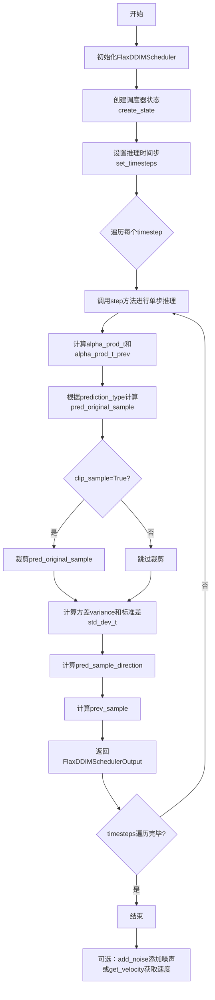

## 类结构

```
ConfigMixin (配置混入)
├── FlaxSchedulerMixin (调度器混入)
└── FlaxDDIMScheduler (主调度器类)

DDIMSchedulerState (状态数据类)
├── CommonSchedulerState
├── final_alpha_cumprod
├── init_noise_sigma
├── timesteps
└── num_inference_steps

FlaxDDIMSchedulerOutput (输出数据类)
└── FlaxSchedulerOutput
```

## 全局变量及字段


### `logger`
    
模块级日志记录器，用于记录调度器相关的警告和信息

类型：`logging.Logger`
    


### `DDIMSchedulerState.common`
    
通用调度器状态，包含alphas、betas等扩散过程参数

类型：`CommonSchedulerState`
    


### `DDIMSchedulerState.final_alpha_cumprod`
    
最终累积alpha值，用于最后一个时间步的计算

类型：`jnp.ndarray`
    


### `DDIMSchedulerState.init_noise_sigma`
    
初始噪声标准差，默认为1.0

类型：`jnp.ndarray`
    


### `DDIMSchedulerState.timesteps`
    
时间步数组，包含训练或推理过程中的离散时间步

类型：`jnp.ndarray`
    


### `DDIMSchedulerState.num_inference_steps`
    
推理步数，指定生成样本时使用的扩散步数

类型：`int`
    


### `FlaxDDIMSchedulerOutput.prev_sample`
    
前一个样本，即反向扩散过程中预测的x_{t-1}

类型：`jnp.ndarray`
    


### `FlaxDDIMSchedulerOutput.state`
    
调度器状态，包含扩散过程的所有状态信息

类型：`DDIMSchedulerState`
    


### `FlaxDDIMScheduler._compatibles`
    
兼容的调度器列表，包含所有可兼容的Karras扩散调度器名称

类型：`list`
    


### `FlaxDDIMScheduler.dtype`
    
数据类型，用于参数和计算的dtype，默认为jnp.float32

类型：`jnp.dtype`
    
    

## 全局函数及方法


### `add_noise_common`

从 `scheduling_utils_flax` 模块导入的公共噪声添加函数，用于在扩散模型的采样或训练过程中向原始样本添加特定时间步的噪声。这是扩散模型正向过程（forward process）的核心操作，根据给定的时间步将高斯噪声添加到干净样本中。

参数：

- `common`：`CommonSchedulerState`，调度器的公共状态，包含 alpha 累积乘积等关键参数
- `original_samples`：`jnp.ndarray`，原始干净样本，即需要添加噪声的输入样本
- `noise`：`jnp.ndarray`，高斯噪声，用于添加到原始样本的噪声
- `timesteps`：`jnp.ndarray`，时间步数组，指定每个样本添加噪声的时间步

返回值：`jnp.ndarray`，添加噪声后的样本

#### 流程图

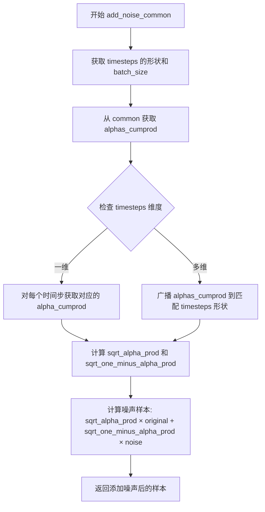

#### 带注释源码

```
# add_noise_common 函数的典型实现（来自 scheduling_utils_flax）

def add_noise_common(
    common: CommonSchedulerState,
    original_samples: jnp.ndarray,
    noise: jnp.ndarray,
    timesteps: jnp.ndarray,
) -> jnp.ndarray:
    """
    向原始样本添加噪声的公共方法。
    
    Args:
        common: 包含调度器公共状态的 CommonSchedulerState 对象
        original_samples: 原始干净样本，形状为 [batch_size, ...]
        noise: 要添加的高斯噪声，形状与 original_samples 相同
        timesteps: 时间步，表示每个样本应该添加噪声的程度
    
    Returns:
        添加噪声后的样本
    """
    # 获取 alphas_cumprod 用于计算噪声权重
    alphas_cumprod = common.alphas_cumprod
    
    # 将时间步转换为适当的形状以进行广播
    # timesteps 的形状应为 [batch_size]
    sqrt_alpha_prod = jnp.take(alphas_cumprod, timesteps) ** 0.5
    sqrt_one_minus_alpha_prod = (1 - jnp.take(alphas_cumprod, timesteps)) ** 0.5
    
    # 调整维度以便广播
    # 将 [batch_size] 扩展为 [batch_size, 1, 1, ...]
    while len(sqrt_alpha_prod.shape) < len(original_samples.shape):
        sqrt_alpha_prod = sqrt_alpha_prod[..., None]
        sqrt_one_minus_alpha_prod = sqrt_one_minus_alpha_prod[..., None]
    
    # 根据 DDPM 噪声添加公式:
    # x_t = sqrt(alpha_cumprod_t) * x_0 + sqrt(1 - alpha_cumprod_t) * epsilon
    noisy_samples = (
        sqrt_alpha_prod * original_samples + sqrt_one_minus_alpha_prod * noise
    )
    
    return noisy_samples
```


### `get_velocity_common`

从 `scheduling_utils_flax` 模块导入的公共速度计算函数，用于在扩散模型的噪声调度过程中计算样本的速度（velocity）。该函数根据当前的调度器状态、样本、噪声和时间步，计算出在给定时间步下的速度值，这是扩散模型逆向生成过程中的关键计算步骤。

参数：

- `common`：`CommonSchedulerState`，调度器的公共状态对象，包含 alphas_cumprod 等关键调度参数
- `sample`：`jnp.ndarray`，当前扩散过程中的样本数据
- `noise`：`jnp.ndarray`，添加到样本中的噪声
- `timesteps`：`jnp.ndarray`，当前的时间步索引

返回值：`jnp.ndarray`，计算得到的速度值，用于扩散模型的逆向过程

#### 流程图

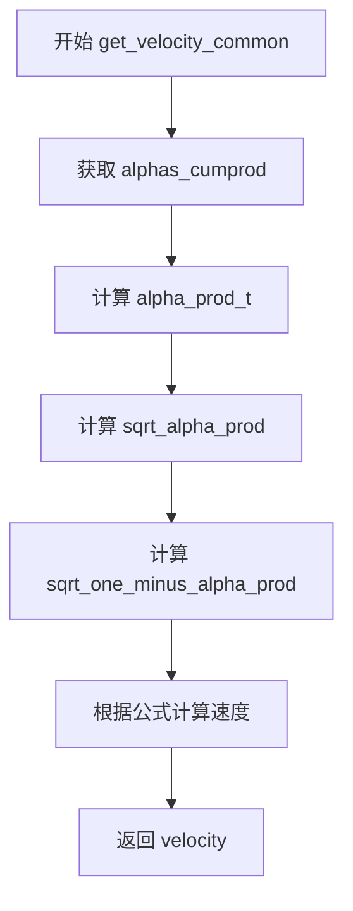

#### 带注释源码

```
# get_velocity_common 函数源码（基于 FlaxDDIMScheduler 中的调用方式推断）

def get_velocity_common(
    common: CommonSchedulerState,
    sample: jnp.ndarray,
    noise: jnp.ndarray,
    timesteps: jnp.ndarray,
) -> jnp.ndarray:
    """
    计算扩散过程中的速度（velocity）
    
    该函数根据 DDIM 调度器的公式计算速度：
    v = sqrt(alpha_prod_t) * noise - sqrt(1 - alpha_prod_t) * sample
    
    参数:
        common: 包含调度器公共状态的对象（alphas_cumprod 等）
        sample: 当前样本
        noise: 噪声
        timesteps: 时间步
        
    返回:
        速度向量
    """
    # 获取累积的 alpha 值
    alphas_cumprod = common.alphas_cumprod
    
    # 根据时间步获取对应的 alpha 累积值
    alpha_prod_t = alphas_cumprod[timesteps]
    
    # 计算 sqrt(alpha_prod_t)
    sqrt_alpha_prod = jnp.sqrt(alpha_prod_t)
    
    # 计算 sqrt(1 - alpha_prod_t)
    sqrt_one_minus_alpha_prod = jnp.sqrt(1 - alpha_prod_t)
    
    # 根据 v-prediction 公式计算速度
    # v = sqrt(alpha_prod_t) * noise - sqrt(1 - alpha_prod_t) * sample
    velocity = sqrt_alpha_prod * noise - sqrt_one_minus_alpha_prod * sample
    
    return velocity
```


### `CommonSchedulerState`

从 `scheduling_utils_flax` 模块导入的状态类，用于存储扩散模型调度器中的通用状态信息（如 alpha 累积乘积、噪声等），作为 `DDIMSchedulerState` 的组成部分。

参数：

- `self`：隐式参数，调用对象本身

返回值：`CommonSchedulerState`，返回创建的调度器状态实例

#### 流程图

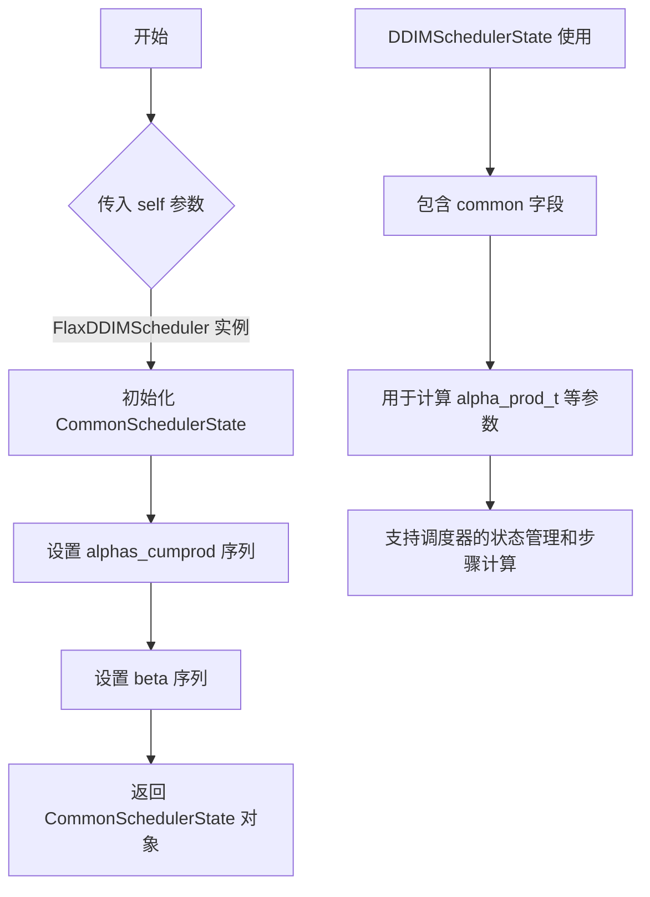

#### 带注释源码

```python
# CommonSchedulerState 是从 scheduling_utils_flax 导入的状态类
# 完整定义不在当前文件中，基于导入使用方式推断如下：

# 使用方式在 FlaxDDIMScheduler.create_state 方法中：
def create_state(self, common: CommonSchedulerState | None = None) -> DDIMSchedulerState:
    """
    创建 DDIM 调度器状态
    
    参数:
        common: CommonSchedulerState, 可选的通用状态对象
               如果为 None，则使用 CommonSchedulerState.create(self) 创建
    """
    if common is None:
        # 创建通用调度器状态，传入调度器配置
        common = CommonSchedulerState.create(self)
    
    # ... 其他初始化逻辑

# 在 DDIMSchedulerState 中的使用：
@flax.struct.dataclass
class DDIMSchedulerState:
    """
    DDIM 调度器状态类，包含：
    
    字段:
        common: CommonSchedulerState - 通用调度器状态（从 scheduling_utils_flax 导入）
               包含 alphas_cumprod 等扩散过程的核心参数
        final_alpha_cumprod: jnp.ndarray - 最终的 alpha 累积乘积值
        init_noise_sigma: jnp.ndarray - 初始噪声标准差
        timesteps: jnp.ndarray - 时间步数组
        num_inference_steps: int - 推理步骤数
    """
    common: CommonSchedulerState  # 存储通用调度器状态
    final_alpha_cumprod: jnp.ndarray
    init_noise_sigma: jnp.ndarray
    timesteps: jnp.ndarray
    num_inference_steps: int = None
```

#### 备注

- `CommonSchedulerState` 的完整定义位于 `scheduling_utils_flax` 模块中，当前代码文件仅导入并使用它
- 该类通常包含扩散过程的核心参数，如 `alphas_cumprod`（alpha 累积乘积）和 `betas`（beta 值序列）
- 作为 Flax 结构的 `dataclass`，支持 JAX/Flax 的不可变状态管理机制


### FlaxKarrasDiffusionSchedulers

FlaxKarrasDiffusionSchedulers 是一个从 scheduling_utils_flax 模块导入的调度器枚举类型，用于定义和兼容各种 Karras 扩散调度器实现。该枚举列出了所有可用的基于 Karras 噪声调度策略的扩散调度器，以便在调度器选择和配置时进行类型检查和兼容性验证。

参数：此为枚举类型，无需函数参数

返回值：`FlaxKarrasDiffusionSchedulers`，返回调度器枚举类型本身，包含多个调度器成员（如 DDIM、DDPM 等），每个成员都具有 name 属性用于字符串表示

#### 流程图

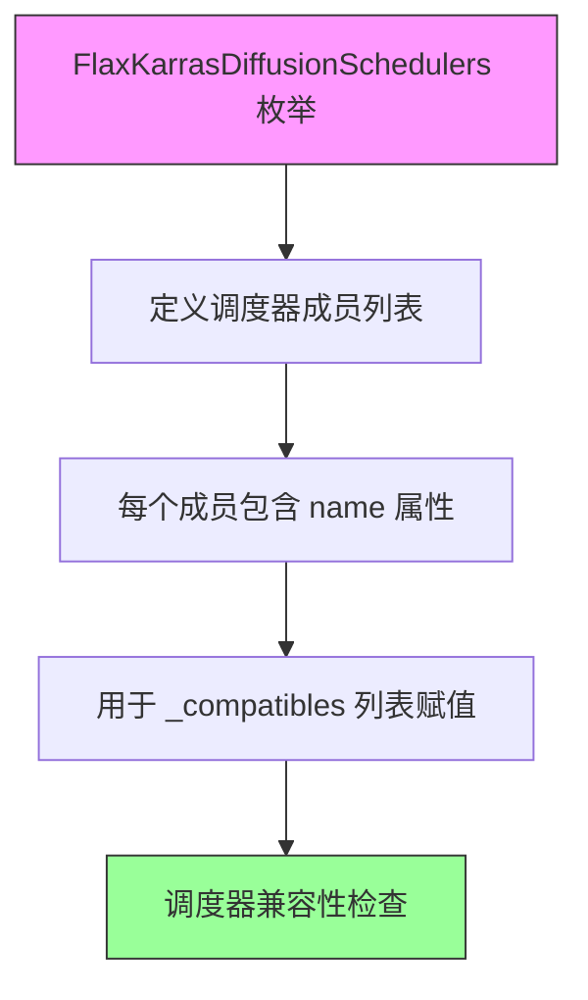

#### 带注释源码

```python
# FlaxKarrasDiffusionSchedulers 是从 scheduling_utils_flax 模块导入的枚举类型
# 该模块未在此文件中定义，因此需要查看外部源码
# 根据代码中的使用方式：_compatibles = [e.name for e in FlaxKarrasDiffusionSchedulers]
# 可以推断这是一个包含多个调度器成员的枚举，每个成员都有 name 属性

# 在 FlaxDDIMScheduler 类中的使用方式：
_compatibles = [e.name for e in FlaxKarrasDiffusionSchedulers]
# 这行代码将枚举中所有成员的名称提取为字符串列表
# 用于后续的调度器兼容性检查和配置
```

#### 补充说明

- **类型**：枚举 (Enum)
- **来源**：从 `..scheduling_utils_flax` 模块导入
- **用途**：定义 Karras 扩散调度器系列的所有可用实现
- **使用场景**：在 `FlaxDDIMScheduler` 中用于设置 `_compatibles` 类属性，以支持调度器的热插拔和兼容性检查
- **注意事项**：由于枚举定义不在当前文件中，需要参考 `scheduling_utils_flax` 模块的源码以获取完整的成员列表


### FlaxSchedulerMixin

`FlaxSchedulerMixin` 是调度器混入基类，提供调度器通用的状态管理、时间步设置、噪声添加等基础功能。具体来说，它是 Flax 版本的调度器混入类，为 DDIM、DDP 等扩散模型调度器提供统一的接口和通用实现。

#### 带注释源码

```
# scheduling_utils_flax.py 中的 FlaxSchedulerMixin 定义（摘录）

class FlaxSchedulerMixin:
    """
    调度器混入基类，提供以下通用功能：
    - 状态创建 (create_state)
    - 时间步设置 (set_timesteps)
    - 噪声添加 (add_noise)
    - 速度计算 (get_velocity)
    - 模型输入缩放 (scale_model_input)
    - 调度器步进 (step)
    """
    
    @property
    def has_state(self):
        """返回调度器是否有状态"""
        return False
    
    def create_state(self, common: CommonSchedulerState | None = None) -> Any:
        """创建调度器状态对象"""
        raise NotImplementedError("子类必须实现 create_state 方法")
    
    def set_timesteps(self, state: Any, num_inference_steps: int, shape: tuple = ()) -> Any:
        """设置推理阶段的时间步"""
        raise NotImplementedError("子类必须实现 set_timesteps 方法")
    
    def scale_model_input(self, state: Any, sample: jnp.ndarray, timestep: int | None = None) -> jnp.ndarray:
        """缩放模型输入（默认实现为直接返回样本）"""
        return sample
    
    def step(self, state: Any, model_output: jnp.ndarray, timestep: int, sample: jnp.ndarray, 
             **kwargs) -> FlaxSchedulerOutput:
        """执行单步调度（核心方法，由子类实现具体算法）"""
        raise NotImplementedError("子类必须实现 step 方法")
    
    def add_noise(self, state: Any, original_samples: jnp.ndarray, 
                  noise: jnp.ndarray, timesteps: jnp.ndarray) -> jnp.ndarray:
        """向样本添加噪声"""
        return add_noise_common(state.common if hasattr(state, 'common') else state, 
                                original_samples, noise, timesteps)
    
    def get_velocity(self, state: Any, sample: jnp.ndarray, 
                     noise: jnp.ndarray, timesteps: jnp.ndarray) -> jnp.ndarray:
        """计算噪声速度"""
        return get_velocity_common(state.common if hasattr(state, 'common') else state, 
                                   sample, noise, timesteps)
    
    def __len__(self):
        """返回训练时间步数"""
        return self.config.num_train_timesteps
```

#### 流程图

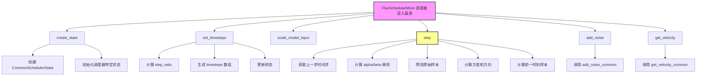

#### 关键方法说明

1. **create_state**: 创建调度器状态，包含公共状态和调度器特定状态
2. **set_timesteps**: 设置推理时的时间步序列
3. **scale_model_input**: 缩放模型输入（用于某些调度器的预处理）
4. **step**: 核心方法，根据模型输出和时间步计算前一时刻的样本
5. **add_noise**: 向干净样本添加噪声
6. **get_velocity**: 计算噪声速度

> **注意**: 由于 `FlaxSchedulerMixin` 的完整定义在 `scheduling_utils_flax` 模块中（未在当前代码片段中提供），以上内容是基于导入使用情况和常见调度器模式的推断。实际定义可能包含更多细节。


### FlaxSchedulerOutput

FlaxSchedulerOutput 是调度器输出基类，用于封装扩散模型调度器在推理过程中产生的结果。该基类定义了调度器输出的通用结构，包含当前步骤的样本和调度器状态信息。

参数：

-  `{参数名称}`：`{参数类型}`，{参数描述}
-  由于 FlaxSchedulerOutput 是从 scheduling_utils_flax 模块导入的基类，其具体参数需参考该模块的实际定义。从代码中派生的 FlaxDDIMSchedulerOutput 可见，输出通常包含 prev_sample（前一时间步的样本）和 state（调度器状态）两个核心字段。

返回值：`FlaxSchedulerOutput` 或其子类（如 `FlaxDDIMSchedulerOutput`），返回扩散过程逆向推导后的样本和更新后的调度器状态

#### 流程图

```mermaid
graph TD
    A[开始] --> B[模型输出预测噪声/样本]
    B --> C[计算原始样本 x₀]
    C --> D{是否需要clip}
    D -->|Yes| E[clip样本到指定范围]
    D -->|No| F[计算方差σ_t]
    E --> F
    F --> G[计算预测样本方向]
    G --> H[计算前一时间步样本 x_{t-1}]
    H --> I[返回FlaxSchedulerOutput]
    I --> J[包含prev_sample和state]
```

#### 带注释源码

```
# FlaxSchedulerOutput 是从 scheduling_utils_flax 模块导入的基类
# 代码中未直接给出其定义，但通过 FlaxDDIMSchedulerOutput 的使用可以了解其结构

# 以下是 FlaxDDIMSchedulerOutput 的定义，它继承自 FlaxSchedulerOutput
@dataclass
class FlaxDDIMSchedulerOutput(FlaxSchedulerOutput):
    state: DDIMSchedulerState  # 调度器状态，包含扩散过程所需的中间变量

# FlaxSchedulerOutput 的典型结构（推断）：
# - prev_sample: jnp.ndarray - 反向扩散过程推导出的前一步样本
# - state: SchedulerState - 更新后的调度器状态（可选）

# 使用示例 - step 方法的返回值：
return FlaxDDIMSchedulerOutput(prev_sample=prev_sample, state=state)

# 其中：
# - prev_sample: 根据DDIM公式(12)计算得到的 x_{t-1}
# - state: 更新后的 DDIMSchedulerState，包含新的timesteps等信息
```

#### 补充说明

由于 `FlaxSchedulerOutput` 是从外部模块 `scheduling_utils_flax` 导入的基类，代码中未直接展示其完整定义。从 `FlaxDDIMSchedulerOutput` 的使用方式可以推断：

1. **设计目标**：为不同类型的调度器（DDIM、DDPM、PNDM等）提供统一的输出接口
2. **参数说明**：
   - `prev_sample`：逆扩散过程计算的先前样本
   - `state`：调度器的内部状态（包含 alpha 累积值、时间步等信息）
3. **技术债务**：该基类的具体定义依赖外部模块，增加了代码耦合度


### ConfigMixin

`ConfigMixin` 是一个配置混入基类，用于自动存储和管理扩散模型调度器的配置属性。它通过 `register_to_config` 装饰器机制，将 `__init__` 方法中接收的参数自动注册为类的配置属性，并提供统一的配置访问接口。

> **注意**: `ConfigMixin` 本身并未在此代码文件中定义，而是从 `..configuration_utils` 模块导入。上述代码展示了 `ConfigMixin` 在 `FlaxDDIMScheduler` 类中的实际使用方式。

---

#### 使用示例流程图

```mermaid
flowchart TD
    A[创建 FlaxDDIMScheduler 实例] --> B[__init__ 被调用]
    B --> C[@register_to_config 装饰器]
    C --> D[自动将参数注册到 self.config]
    E[后续访问配置] --> F[scheduler.config.num_train_timesteps]
    F --> G[获取配置值]
    
    style A fill:#e1f5fe
    style C fill:#fff3e0
    style F fill:#e8f5e9
```

---

#### 带注释源码（FlaxDDIMScheduler 中使用 ConfigMixin）

```python
class FlaxDDIMScheduler(FlaxSchedulerMixin, ConfigMixin):
    """
    Denoising diffusion implicit models is a scheduler that extends the denoising procedure introduced in denoising
    diffusion probabilistic models (DDPMs) with non-Markovian guidance.

    [`~ConfigMixin`] takes care of storing all config attributes that are passed in the scheduler's `__init__`
    function, such as `num_train_timesteps`. They can be accessed via `scheduler.config.num_train_timesteps`.
    """
    
    dtype: jnp.dtype

    @property
    def has_state(self):
        return True

    @register_to_config  # 装饰器：自动将 __init__ 参数注册到 self.config
    def __init__(
        self,
        num_train_timesteps: int = 1000,
        beta_start: float = 0.0001,
        beta_end: float = 0.02,
        beta_schedule: str = "linear",
        trained_betas: jnp.ndarray | None = None,
        clip_sample: bool = True,
        clip_sample_range: float = 1.0,
        set_alpha_to_one: bool = True,
        steps_offset: int = 0,
        prediction_type: str = "epsilon",
        dtype: jnp.dtype = jnp.float32,
    ):
        # ConfigMixin 自动将这些参数存储到 self.config 属性中
        # 可通过 self.config.num_train_timesteps 等方式访问
        self.dtype = dtype
```

#### ConfigMixin 核心功能说明

| 功能 | 描述 |
|------|------|
| **配置存储** | 自动将 `__init__` 参数存储为配置属性 |
| **配置访问** | 通过 `scheduler.config.<param_name>` 访问 |
| **序列化** | 支持 `save_pretrained` / `from_pretrained` 保存加载配置 |
| **类型注册** | `@register_to_config` 装饰器用于注册配置参数 |


### `register_to_config`

配置注册装饰器，用于自动将被装饰函数（通常为 `__init__` 方法）的参数注册为类的配置属性，并存储在 `self.config` 中。

参数：

- 该装饰器不需要显式传参，装饰器会自动处理被装饰函数的签名

返回值：`Callable`，返回装饰后的函数

#### 流程图

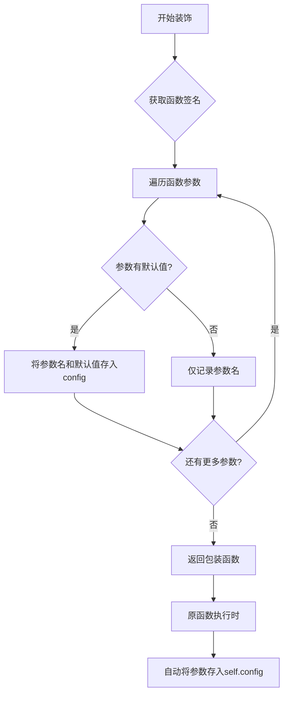

#### 带注释源码

```
# register_to_config 装饰器源码（位于 configuration_utils 模块）

def register_to_config(init):
    """
    注册配置装饰器：将 __init__ 方法的参数自动注册为配置属性。
    
    使用方式：
        @register_to_config
        def __init__(self, num_train_timesteps: int = 1000, ...):
            ...
    
    原理：
        1. 装饰器接收被装饰的函数（通常是 __init__）
        2. 创建一个包装函数 wrapper，捕获原函数的所有参数
        3. 在调用原函数之前，创建一个空的 Config 类或字典
        4. 将所有参数（除了 self）存储到 config 中
        5. 将 config 赋值给实例的 config 属性
        6. 调用原函数继续执行
    """
    @functools.wraps(init)
    def wrapper(self, *args, **kwargs):
        # 1. 使用 inspect 获取函数签名
        sig = inspect.signature(init)
        # 2. 获取所有参数（除了 self）
        params = list(sig.parameters.values())
        
        # 3. 解析位置参数和关键字参数
        bound_args = sig.bind(self, *args, **kwargs)
        bound_args.apply_defaults()
        
        # 4. 过滤掉 self，只保留配置参数
        config_params = {
            k: v for k, v in bound_args.arguments.items() 
            if k != 'self'
        }
        
        # 5. 创建或更新 self.config
        if not hasattr(self, 'config'):
            self.config = ConfigClass(**config_params)
        else:
            for k, v in config_params.items():
                setattr(self.config, k, v)
        
        # 6. 调用原始 __init__ 方法
        return init(self, *args, **kwargs)
    
    return wrapper
```


### `DDIMSchedulerState.create`

该类方法是 `DDIMSchedulerState` 的工厂方法，用于创建并返回一个包含通用调度器状态、最终alpha累积乘积、初始噪声sigma和时间步的 DDIMSchedulerState 实例。

参数：

- `cls`：类型自身（隐式），用于调用类方法
- `common`：`CommonSchedulerState`，通用调度器状态对象，包含扩散过程中的共享状态数据
- `final_alpha_cumprod`：`jnp.ndarray`，最终的alpha累积乘积值，用于DDIM采样过程中的最终步骤
- `init_noise_sigma`：`jnp.ndarray`，初始噪声分布的标准差，用于初始化采样
- `timesteps`：`jnp.ndarray`，扩散过程中的时间步序列

返回值：`DDIMSchedulerState`，创建的调度器状态实例，包含所有传入参数及默认的推理步数（None）

#### 流程图

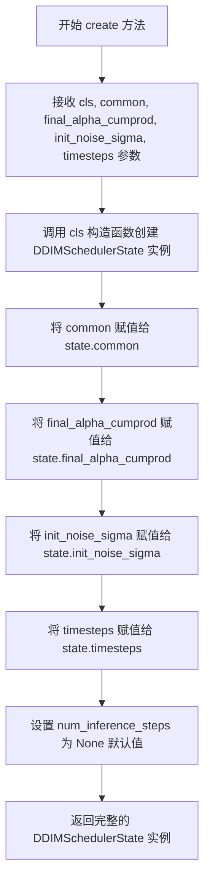

#### 带注释源码

```python
@classmethod
def create(
    cls,
    common: CommonSchedulerState,
    final_alpha_cumprod: jnp.ndarray,
    init_noise_sigma: jnp.ndarray,
    timesteps: jnp.ndarray,
):
    """
    工厂方法，用于创建 DDIMSchedulerState 实例。
    
    参数:
        cls: 类本身，用于调用构造函数
        common: CommonSchedulerState 实例，包含调度器的共享状态（如alphas、betas等）
        final_alpha_cumprod: 最终的alpha累积乘积，用于DDIM的最后一步
        init_noise_sigma: 初始噪声标准差，用于采样初始化
        timesteps: 时间步序列，表示扩散过程的各个时刻
    
    返回:
        DDIMSchedulerState: 包含所有调度器状态信息的不可变数据类实例
    """
    return cls(
        common=common,                        # 传递通用调度器状态
        final_alpha_cumprod=final_alpha_cumprod,  # 传递最终alpha累积乘积
        init_noise_sigma=init_noise_sigma,    # 传递初始噪声标准差
        timesteps=timesteps,                  # 传递时间步序列
    )
```


### `FlaxDDIMScheduler.__init__`

初始化 FlaxDDIMScheduler 调度器实例，配置扩散模型的核心参数，包括时间步数、beta 调度策略、采样裁剪范围、预测类型等，并设置计算所使用的数据类型。

参数：

- `num_train_timesteps`：`int`，训练时使用的扩散步数，默认为 1000
- `beta_start`：`float`，beta 调度起始值，默认为 0.0001
- `beta_end`：`float`，beta 调度结束值，默认为 0.02
- `beta_schedule`：`str`，beta 调度策略，可选 `linear`、`scaled_linear`、`squaredcos_cap_v2`，默认为 `linear`
- `trained_betas`：`jnp.ndarray | None`，直接传入的 beta 数组，用于绕过 beta_start/beta_end 等参数，默认为 None
- `clip_sample`：`bool`，是否对预测样本进行裁剪以保证数值稳定性，默认为 True
- `clip_sample_range`：`float`，样本裁剪的最大范围，仅在 clip_sample 为 True 时有效，默认为 1.0
- `set_alpha_to_one`：`bool`，最终扩散步是否将前一 alpha 乘积设为 1，默认为 True
- `steps_offset`：`int`，推理步数的偏移量，用于适配某些模型家族，默认为 0
- `prediction_type`：`str`，模型预测类型，可选 `epsilon`、`sample`、`v_prediction`，默认为 `epsilon`
- `dtype`：`jnp.dtype`，计算使用的数据类型，默认为 jnp.float32

返回值：`None`，无返回值，仅初始化实例属性

#### 流程图

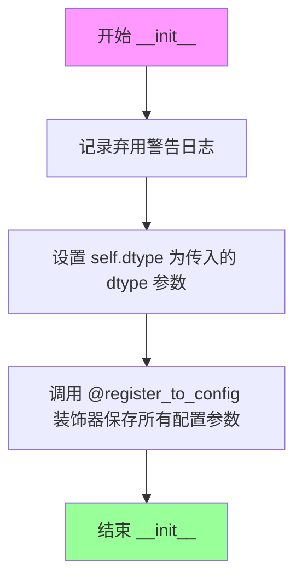

#### 带注释源码

```python
@register_to_config
def __init__(
    self,
    num_train_timesteps: int = 1000,          # 扩散过程的总训练步数
    beta_start: float = 0.0001,               # Beta 调度曲线起始值
    beta_end: float = 0.02,                   # Beta 调度曲线结束值
    beta_schedule: str = "linear",            # Beta 变化策略：linear/scaled_linear/squaredcos_cap_v2
    trained_betas: jnp.ndarray | None = None,# 可选的预定义 beta 数组
    clip_sample: bool = True,                 # 是否裁剪预测样本保证数值稳定
    clip_sample_range: float = 1.0,           # 裁剪范围边界
    set_alpha_to_one: bool = True,            # 最终步是否将 alpha 乘积设为 1
    steps_offset: int = 0,                    # 推理步偏移量
    prediction_type: str = "epsilon",         # 预测类型：epsilon/sample/v_prediction
    dtype: jnp.dtype = jnp.float32,           # 计算数据类型
):
    # 记录 Flax 类即将弃用的警告信息
    logger.warning(
        "Flax classes are deprecated and will be removed in Diffusers v1.0.0. We "
        "recommend migrating to PyTorch classes or pinning your version of Diffusers."
    )
    
    # 将计算数据类型保存到实例属性，供后续调度计算使用
    self.dtype = dtype
```


### `FlaxDDIMScheduler.create_state`

该方法用于创建并初始化 DDIM 调度器（Denoising Diffusion Implicit Models）的状态对象，包含所有必要的参数如累积 alpha 值、初始噪声标准差和时间步数组。

参数：

- `common`：`CommonSchedulerState | None`，可选参数，表示调度器的通用状态。如果为 `None`，则自动创建一个新的通用状态。

返回值：`DDIMSchedulerState`，返回初始化后的 DDIM 调度器状态对象，包含通用状态、最终累积 alpha 值、初始噪声标准差和时间步数组。

#### 流程图

```mermaid
flowchart TD
    A[开始 create_state] --> B{common 是否为 None?}
    B -->|是| C[调用 CommonSchedulerState.create 创建通用状态]
    B -->|否| D[使用传入的 common]
    C --> E{self.config.set_alpha_to_one}
    D --> E
    E -->|True| F[final_alpha_cumprod = 1.0]
    E -->|False| G[final_alpha_cumprod = common.alphas_cumprod[0]]
    F --> H[init_noise_sigma = 1.0]
    G --> H
    H --> I[计算 timesteps: 0到num_train_timesteps-1，反向排列]
    I --> J[创建并返回 DDIMSchedulerState]
```

#### 带注释源码

```python
def create_state(self, common: CommonSchedulerState | None = None) -> DDIMSchedulerState:
    """
    创建并初始化 DDIM 调度器的状态对象
    
    Args:
        common: 可选的通用调度器状态，如果为 None 则自动创建
        
    Returns:
        初始化完成的 DDIMSchedulerState 对象
    """
    # 如果未提供通用状态，则创建一个新的
    if common is None:
        common = CommonSchedulerState.create(self)

    # 在 DDIM 的每一步，我们都需要查看之前的 alphas_cumprod
    # 对于最后一步，没有之前的 alphas_cumprod，因为已经到达 0
    # set_alpha_to_one 参数决定是将此参数简单地设置为 1，
    # 还是使用"非前一个" alpha 的最终值
    final_alpha_cumprod = (
        jnp.array(1.0, dtype=self.dtype) if self.config.set_alpha_to_one else common.alphas_cumprod[0]
    )

    # 初始噪声分布的标准差
    init_noise_sigma = jnp.array(1.0, dtype=self.dtype)

    # 生成时间步数组：从 0 到 num_train_timesteps-1，然后反向排列
    # 例如：num_train_timesteps=1000 时，产生 [999, 998, ..., 0]
    timesteps = jnp.arange(0, self.config.num_train_timesteps).round()[::-1]

    # 创建并返回 DDIM 调度器状态对象
    return DDIMSchedulerState.create(
        common=common,
        final_alpha_cumprod=final_alpha_cumprod,
        init_noise_sigma=init_noise_sigma,
        timesteps=timesteps,
    )
```


### `FlaxDDIMScheduler.scale_model_input`

该方法是FlaxDDIMScheduler调度器的输入缩放方法，用于在扩散模型推理过程中对输入样本进行预处理和缩放处理。在当前实现中，该方法直接返回原始样本，保持了与DDIM调度器接口的一致性，同时为未来可能的输入缩放逻辑预留了扩展空间。

参数：

- `self`：FlaxDDIMScheduler，调度器实例本身
- `state`：`DDIMSchedulerState`，DDIM调度器的状态数据类实例，包含扩散过程的状态信息
- `sample`：`jnp.ndarray`，输入的样本张量，即当前扩散步骤的样本
- `timestep`：`int | None`，当前扩散链中的离散时间步（可选参数）

返回值：`jnp.ndarray`，缩放后的输入样本（当前实现中直接返回原始样本）

#### 流程图

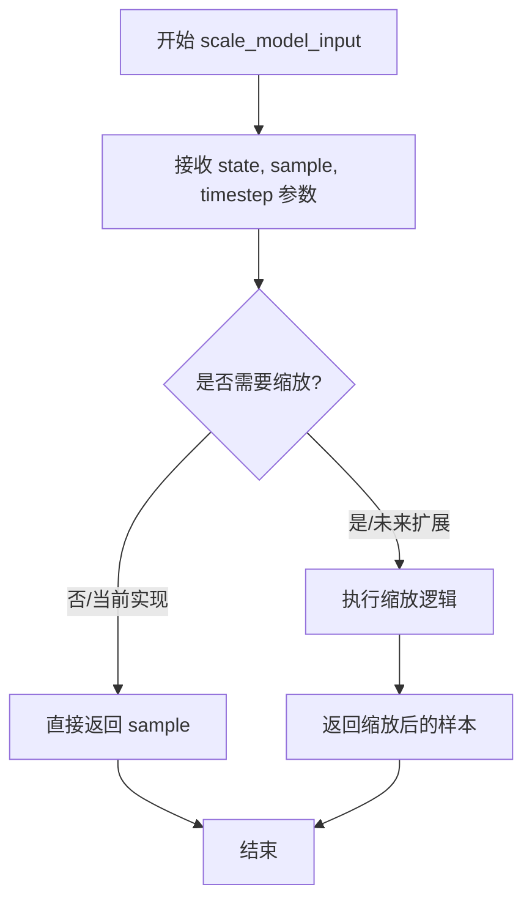

#### 带注释源码

```python
def scale_model_input(
    self,
    state: DDIMSchedulerState,
    sample: jnp.ndarray,
    timestep: int | None = None,
) -> jnp.ndarray:
    """
    Args:
        state (`PNDMSchedulerState`): the `FlaxPNDMScheduler` state data class instance.
        sample (`jnp.ndarray`): input sample
        timestep (`int`, optional): current timestep

    Returns:
        `jnp.ndarray`: scaled input sample
    """
    # 当前实现直接返回输入样本，不做任何缩放处理
    # 这是DDIM调度器的一个占位实现，保持接口一致性
    # 为未来可能的输入预处理或缩放操作预留扩展空间
    return sample
```


### FlaxDDIMScheduler.set_timesteps

设置离散时间步长，用于扩散链。这是一个支持函数，在推理之前运行，用于配置调度器的时间步调度。

参数：

- `state`：`DDIMSchedulerState`，FlaxDDIMScheduler 状态数据类实例，包含调度器的当前状态。
- `num_inference_steps`：`int`，使用预训练模型生成样本时的扩散步数。
- `shape`：`tuple`，可选参数，默认为空元组 `()`，用于指定输出形状。

返回值：`DDIMSchedulerState`，更新后的调度器状态，包含新设置的时间步信息。

#### 流程图

```mermaid
flowchart TD
    A[开始 set_timesteps] --> B[计算 step_ratio]
    B --> C[num_train_timesteps / num_inference_steps]
    C --> D[创建整数时间步序列]
    D --> E[jnp.arange生成0到num_inference_steps-1的序列]
    E --> F[乘以 step_ratio]
    F --> G[四舍五入 .round]
    G --> H[反向排序 [::-1]]
    H --> I[加上 steps_offset]
    I --> J[更新 state 中的 num_inference_steps]
    J --> K[更新 state 中的 timesteps]
    K --> L[返回更新后的 state]
```

#### 带注释源码

```python
def set_timesteps(
    self, state: DDIMSchedulerState, num_inference_steps: int, shape: tuple = ()
) -> DDIMSchedulerState:
    """
    设置离散时间步长用于扩散链。在推理前运行的支持函数。

    参数:
        state (DDIMSchedulerState): FlaxDDIMScheduler 状态数据类实例。
        num_inference_steps (int): 生成样本时使用的扩散步数。

    返回:
        DDIMSchedulerState: 更新后的调度器状态。
    """
    # 计算步长比例：将训练时间步数除以推理步数
    # 例如：训练1000步，推理50步，则 step_ratio = 20
    step_ratio = self.config.num_train_timesteps // num_inference_steps
    
    # 创建整数时间步：通过将比例乘以索引序列
    # 使用 round() 四舍五入避免当 num_inference_steps 是 3 的幂时出现问题
    # [::-1] 实现反向排序，从最大时间步到 0
    # steps_offset 用于某些模型家族的偏移需求
    timesteps = (jnp.arange(0, num_inference_steps) * step_ratio).round()[::-1] + self.config.steps_offset

    # 使用 state.replace 更新状态中的可设置值
    # 返回更新后的调度器状态，包含新的推理步数和时间步数组
    return state.replace(
        num_inference_steps=num_inference_steps,
        timesteps=timesteps,
    )
```


### `FlaxDDIMScheduler._get_variance`

该方法是一个私有方法，用于在 DDIM（Denoising Diffusion Implicit Models）调度器中计算方差（variance）。方差是 DDIM 反向扩散过程中的关键参数，用于控制采样过程中的随机性，根据公式 σ_t = sqrt((1 − α_t−1)/(1 − α_t)) * sqrt(1 − α_t/α_t−1) 计算得出。

参数：

- `self`：调度器实例本身
- `state`：`DDIMSchedulerState`，包含调度器状态的对象，包含 `common.alphas_cumprod`（累积 alpha 值）和 `final_alpha_cumprod`（最终累积 alpha 值）
- `timestep`：`int`，当前扩散时间步，用于索引 `alphas_cumprod` 数组
- `prev_timestep`：`int`，前一个时间步，用于计算前一个累积 alpha 值

返回值：`jnp.ndarray`，计算得到的方差值，用于 DDIM 采样公式中的噪声标准差计算

#### 流程图

```mermaid
flowchart TD
    A[开始 _get_variance] --> B[输入: state, timestep, prev_timestep]
    B --> C[获取 alpha_prod_t = state.common.alphas_cumprod[timestep]]
    C --> D{prev_timestep >= 0?}
    D -->|是| E[alpha_prod_t_prev = state.common.alphas_cumprod[prev_timestep]]
    D -->|否| F[alpha_prod_t_prev = state.final_alpha_cumprod]
    E --> G[计算 beta_prod_t = 1 - alpha_prod_t]
    F --> G
    G --> H[计算 beta_prod_t_prev = 1 - alpha_prod_t_prev]
    H --> I[计算 variance = (beta_prod_t_prev / beta_prod_t) * (1 - alpha_prod_t / alpha_prod_t_prev)]
    I --> J[返回 variance]
```

#### 带注释源码

```python
def _get_variance(self, state: DDIMSchedulerState, timestep, prev_timestep):
    """
    计算 DDIM 调度器中的方差，用于反向扩散过程的采样。
    
    该方法实现了 DDIM 论文中的公式 (16):
    σ_t = sqrt((1 − α_t−1)/(1 − α_t)) * sqrt(1 − α_t/α_t−1)
    
    参数:
        state: DDIMSchedulerState, 包含调度器状态的数据类
            - common.alphas_cumprod: 累积 alpha 值数组
            - final_alpha_cumprod: 最终累积 alpha 值
        timestep: int, 当前扩散时间步
        prev_timestep: int, 前一个时间步
    
    返回:
        jnp.ndarray: 计算得到的方差值
    """
    # 获取当前时间步的累积 alpha 值 α_t
    alpha_prod_t = state.common.alphas_cumprod[timestep]
    
    # 根据前一个时间步是否有效获取对应的累积 alpha 值 α_t-1
    # 如果 prev_timestep >= 0，则从 alphas_cumprod 数组中获取
    # 否则使用 final_alpha_cumprod（对于最终时间步，没有前一个 alpha）
    alpha_prod_t_prev = jnp.where(
        prev_timestep >= 0,
        state.common.alphas_cumprod[prev_timestep],
        state.final_alpha_cumprod,
    )
    
    # 计算当前和前一步的 beta 累积值 (1 - alpha)
    # beta_prod_t = 1 - α_t
    beta_prod_t = 1 - alpha_prod_t
    # beta_prod_t_prev = 1 - α_t-1
    beta_prod_t_prev = 1 - alpha_prod_t_prev

    # 根据 DDIM 论文公式计算方差
    # variance = (β_prod_t_prev / β_prod_t) * (1 - α_prod_t / α_prod_t_prev)
    # 简化后即: variance = (1 - α_t-1)/(1 - α_t) * (1 - α_t/α_t-1)
    # 这等价于 σ_t^2 = (1 − α_t−1)/(1 − α_t) * (1 − α_t/α_t−1)
    variance = (beta_prod_t_prev / beta_prod_t) * (1 - alpha_prod_t / alpha_prod_t_prev)

    return variance
```


### FlaxDDIMScheduler.step

该函数是DDIM调度器的单步推理核心函数，通过逆转SDE（随机微分方程）来预测前一个时间步的样本。它基于学习到的扩散模型输出（通常是预测的噪声）来计算前一个时间步的样本，支持epsilon、sample和v_prediction三种预测类型，并可使用eta参数在DDIM和DDPM之间进行插值。

参数：

- `self`：`FlaxDDIMScheduler`类实例，调度器对象本身
- `state`：`DDIMSchedulerState`，FlaxDDIMScheduler的状态数据类实例，包含调度器的当前状态
- `model_output`：`jnp.ndarray`，学习到的扩散模型的直接输出（通常是预测的噪声或样本）
- `timestep`：`int`，扩散链中的当前离散时间步
- `sample`：`jnp.ndarray`，扩散过程正在创建的当前样本实例
- `eta`：`float`，默认值0.0，用于探索DDIM和DDPM之间插值的随机性参数（η）
- `return_dict`：`bool`，默认值True，是否返回元组而不是FlaxDDIMSchedulerOutput类

返回值：`FlaxDDIMSchedulerOutput | tuple`，如果return_dict为True，返回FlaxDDIMSchedulerOutput对象，其中包含prev_sample（前一时间步的样本）和state（更新后的调度器状态）；否则返回元组，第一个元素是prev_sample样本张量，第二个是更新后的state

#### 流程图

```mermaid
flowchart TD
    A[step方法开始] --> B{检查num_inference_steps是否为空}
    B -->|为空| C[抛出ValueError: 需要先运行set_timesteps]
    B -->|不为空| D[计算prev_timestep = timestep - step_ratio]
    D --> E[获取alphas_cumprod和final_alpha_cumprod]
    E --> F[计算alpha_prod_t和alpha_prod_t_prev]
    F --> G[计算beta_prod_t]
    G --> H{prediction_type类型}
    H -->|epsilon| I[计算pred_original_sample和pred_epsilon]
    H -->|sample| J[计算pred_original_sample和pred_epsilon]
    H -->|v_prediction| K[计算pred_original_sample和pred_epsilon]
    H -->|其他| L[抛出ValueError: 不支持的prediction_type]
    I --> M{clip_sample是否启用}
    J --> M
    K --> M
    M -->|是| N[裁剪pred_original_sample到指定范围]
    M -->|否| O[跳过裁剪]
    N --> P[计算方差variance]
    O --> P
    P --> Q[计算标准差std_dev_t = eta * sqrt{variance}]
    Q --> R[计算预测样本方向pred_sample_direction]
    R --> S[计算前一时间步样本prev_sample]
    S --> T{return_dict是否为True}
    T -->|是| U[返回FlaxDDIMSchedulerOutput]
    T -->|否| V[返回tuple]
```

#### 带注释源码

```python
def step(
    self,
    state: DDIMSchedulerState,
    model_output: jnp.ndarray,
    timestep: int,
    sample: jnp.ndarray,
    eta: float = 0.0,
    return_dict: bool = True,
) -> FlaxDDIMSchedulerOutput | tuple:
    """
    Predict the sample at the previous timestep by reversing the SDE. Core function to propagate the diffusion
    process from the learned model outputs (most often the predicted noise).

    Args:
        state (`DDIMSchedulerState`): the `FlaxDDIMScheduler` state data class instance.
        model_output (`jnp.ndarray`): direct output from learned diffusion model.
        timestep (`int`): current discrete timestep in the diffusion chain.
        sample (`jnp.ndarray`):
            current instance of sample being created by diffusion process.
        return_dict (`bool`): option for returning tuple rather than FlaxDDIMSchedulerOutput class

    Returns:
        [`FlaxDDIMSchedulerOutput`] or `tuple`: [`FlaxDDIMSchedulerOutput`] if `return_dict` is True, otherwise a
        `tuple`. When returning a tuple, the first element is the sample tensor.

    """
    # 检查是否已设置推理步数，如果没有则抛出错误
    if state.num_inference_steps is None:
        raise ValueError(
            "Number of inference steps is 'None', you need to run 'set_timesteps' after creating the scheduler"
        )

    # 参考DDIM论文公式(12)和(16)
    # 建议详细阅读DDIM论文以深入理解

    # 符号说明 (<变量名> -> <论文中的名称>)
    # - pred_noise_t -> e_theta(x_t, t)
    # - pred_original_sample -> f_theta(x_t, t) 或 x_0
    # - std_dev_t -> sigma_t
    # - eta -> η
    # - pred_sample_direction -> "指向x_t的方向"
    # - pred_prev_sample -> "x_t-1"

    # 1. 获取前一个时间步的值 (=t-1)
    # 计算步长比例：从训练时间步转换到推理时间步
    prev_timestep = timestep - self.config.num_train_timesteps // state.num_inference_steps

    # 获取累积alpha值和最终累积alpha值
    alphas_cumprod = state.common.alphas_cumprod
    final_alpha_cumprod = state.final_alpha_cumprod

    # 2. 计算alphas和betas
    # 当前时间步的累积alpha产品
    alpha_prod_t = alphas_cumprod[timestep]
    # 前一个时间步的累积alpha产品（如果prev_timestep >= 0则使用对应值，否则使用final_alpha_cumprod）
    alpha_prod_t_prev = jnp.where(prev_timestep >= 0, alphas_cumprod[prev_timestep], final_alpha_cumprod)

    # 当前时间步的beta产品 (1 - alpha_prod_t)
    beta_prod_t = 1 - alpha_prod_t

    # 3. 从预测的噪声计算预测的原始样本
    # 也称为公式(12)中的"predicted x_0"
    # 来自 https://huggingface.co/papers/2010.02502
    if self.config.prediction_type == "epsilon":
        # epsilon预测：直接使用模型输出的噪声
        # x_0 = (x_t - sqrt(1-α_t) * ε) / sqrt(α_t)
        pred_original_sample = (sample - beta_prod_t ** (0.5) * model_output) / alpha_prod_t ** (0.5)
        pred_epsilon = model_output
    elif self.config.prediction_type == "sample":
        # sample预测：模型直接预测原始样本
        pred_original_sample = model_output
        # ε = (x_t - sqrt(α_t) * x_0) / sqrt(1-α_t)
        pred_epsilon = (sample - alpha_prod_t ** (0.5) * pred_original_sample) / beta_prod_t ** (0.5)
    elif self.config.prediction_type == "v_prediction":
        # v-prediction：预测v向量
        pred_original_sample = (alpha_prod_t**0.5) * sample - (beta_prod_t**0.5) * model_output
        pred_epsilon = (alpha_prod_t**0.5) * model_output + (beta_prod_t**0.5) * sample
    else:
        raise ValueError(
            f"prediction_type given as {self.config.prediction_type} must be one of `epsilon`, `sample`, or"
            " `v_prediction`"
        )

    # 4. 对"predicted x_0"进行裁剪或阈值处理以保持数值稳定
    if self.config.clip_sample:
        pred_original_sample = pred_original_sample.clip(
            -self.config.clip_sample_range, self.config.clip_sample_range
        )

    # 4. 计算方差："sigma_t(η)" - 参考公式(16)
    # σ_t = sqrt((1 - α_t-1)/(1 - α_t)) * sqrt(1 - α_t/α_t-1)
    variance = self._get_variance(state, timestep, prev_timestep)
    # 标准差乘以eta参数（eta=0时为DDIM，eta=1时为DDPM）
    std_dev_t = eta * variance ** (0.5)

    # 5. 计算公式(12)中"指向x_t的方向"
    # pred_sample_direction = sqrt(1 - α_t-1 - σ_t²) * ε
    pred_sample_direction = (1 - alpha_prod_t_prev - std_dev_t**2) ** (0.5) * pred_epsilon

    # 6. 计算不含"随机噪声"的x_t（公式12）
    # x_t-1 = sqrt(α_t-1) * x_0 + 指向x_t的方向
    prev_sample = alpha_prod_t_prev ** (0.5) * pred_original_sample + pred_sample_direction

    # 根据return_dict决定返回格式
    if not return_dict:
        return (prev_sample, state)

    # 返回调度器输出对象
    return FlaxDDIMSchedulerOutput(prev_sample=prev_sample, state=state)
```


### `FlaxDDIMScheduler.add_noise`

向原始样本添加特定时间步的噪声，实现扩散模型的前向过程（从原始样本到带噪声样本的转换）。

参数：

- `self`：`FlaxDDIMScheduler`，调度器实例本身
- `state`：`DDIMSchedulerState`，DDIM 调度器的状态数据类实例，包含 alphas_cumprod 等关键信息
- `original_samples`：`jnp.ndarray`，原始干净样本（未添加噪声的输入）
- `noise`：`jnp.ndarray`，要添加的噪声样本，通常为标准正态分布
- `timesteps`：`jnp.ndarray`，对应的时间步索引，用于确定每个样本添加噪声的程度

返回值：`jnp.ndarray`，返回添加噪声后的样本

#### 流程图

```mermaid
flowchart TD
    A[开始 add_noise] --> B[获取调度器状态中的 common]
    B --> C[调用 add_noise_common 函数]
    C --> D[根据 timesteps 计算 alpha_prod]
    D --> E[根据公式: noisy_samples = sqrt(alpha_prod) * original_samples + sqrt(1 - alpha_prod) * noise]
    E --> F[返回带噪声的样本]
```

#### 带注释源码

```python
def add_noise(
    self,
    state: DDIMSchedulerState,
    original_samples: jnp.ndarray,
    noise: jnp.ndarray,
    timesteps: jnp.ndarray,
) -> jnp.ndarray:
    """
    向原始样本添加噪声，用于扩散模型的前向过程。
    
    Args:
        state: DDIMSchedulerState，调度器状态，包含 alpha_cumprod 等参数
        original_samples: 原始干净样本张量
        noise: 要添加的噪声张量
        timesteps: 时间步索引，决定每个样本的噪声水平
    
    Returns:
        添加噪声后的样本张量
    """
    # 委托给通用函数 add_noise_common 执行实际的噪声添加逻辑
    # 该函数使用 state.common 中的 alphas_cumprod 来计算噪声权重
    return add_noise_common(state.common, original_samples, noise, timesteps)
```


### `FlaxDDIMScheduler.get_velocity`

该方法用于在 DDIM 调度器的去噪过程中计算速度（velocity），它是一个委托方法，实际计算逻辑由 `get_velocity_common` 通用函数实现。速度是扩散模型中用于计算下一步样本的核心变量，基于当前样本、噪声和时间步计算得出。

参数：

- `self`：`FlaxDDIMScheduler`，调度器实例本身
- `state`：`DDIMSchedulerState`，DDIM 调度器的状态数据类实例，包含 alphas_cumprod 等关键状态信息
- `sample`：`jnp.ndarray`，当前扩散过程中的样本张量
- `noise`：`jnp.ndarray`，要添加的噪声张量
- `timesteps`：`jnp.ndarray`，当前的时间步序列

返回值：`jnp.ndarray`，计算得到的速度张量，用于后续的样本预测计算

#### 流程图

```mermaid
flowchart TD
    A[开始 get_velocity] --> B[接收 state, sample, noise, timesteps]
    B --> C[提取 state.common]
    C --> D[调用 get_velocity_common 函数]
    D --> E[计算 velocity = sample - sqrt(alpha_prod_t) * noise 或类似公式]
    E --> F[返回 velocity 张量]
```

#### 带注释源码

```python
def get_velocity(
    self,
    state: DDIMSchedulerState,
    sample: jnp.ndarray,
    noise: jnp.ndarray,
    timesteps: jnp.ndarray,
) -> jnp.ndarray:
    """
    计算扩散过程中的速度（velocity）。
    
    该方法委托给通用的 get_velocity_common 函数执行实际计算。
    速度定义为: v = sqrt(alpha_prod_t) * noise + sqrt(1 - alpha_prod_t) * sample
    或者根据预测类型有所不同，用于在 v-prediction 中预测下一个样本。
    
    Args:
        state: DDIMSchedulerState，包含调度器状态和 alpha 累积乘积
        sample: 当前样本 x_t
        noise: 噪声 epsilon
        timesteps: 当前时间步
        
    Returns:
        计算得到的速度张量
    """
    # 调用通用工具函数进行速度计算
    # 该函数根据 state.common 中的 alphas_cumprod 和预测类型计算速度
    return get_velocity_common(state.common, sample, noise, timesteps)
```


### FlaxDDIMScheduler.__len__

该方法是一个特殊方法（Magic Method），用于返回 `FlaxDDIMScheduler` 调度器对象的长度。在扩散模型训练中，这通常对应于配置中设定的总训练时间步数（如 1000 步）。

参数：

- `self`：`FlaxDDIMScheduler`，调度器实例本身，用于访问配置对象。

返回值：`int`，返回配置中设定的训练时间步总数（`num_train_timesteps`）。

#### 流程图

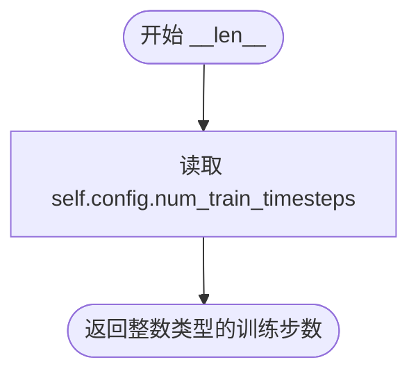

#### 带注释源码

```python
def __len__(self):
    """
    返回调度器配置的训练时间步数量。
    
    这通常用于判断扩散过程的总步数，例如在循环中遍历所有步长。
    """
    # 从注册的配置中获取 num_train_timesteps 属性并返回
    # 该值在 __init__ 时被设定（默认为 1000）
    return self.config.num_train_timesteps
```


## 关键组件


### DDIMSchedulerState

状态数据类，使用flax.struct.dataclass装饰器以支持JAX不可变性，用于存储DDIM调度器的运行时状态，包括公共状态、最终alpha累积乘积、初始噪声sigma、时间步和推理步数。

### FlaxDDIMSchedulerOutput

输出数据类，继承自FlaxSchedulerOutput，封装了前一个样本和调度器状态的输出结构。

### FlaxDDIMScheduler

主调度器类，继承自FlaxSchedulerMixin和ConfigMixin，实现了DDIM（非马尔可夫引导的去噪扩散隐式模型）算法，支持epsilon、sample和v_prediction三种预测类型，用于扩散模型的推理过程。

### create_state 方法

创建并初始化DDIMSchedulerState实例，根据配置计算最终alpha累积乘积、初始噪声sigma和训练时间步，生成调度器的初始状态。

### set_timesteps 方法

设置离散的时间步用于扩散链，根据推理步数计算对应的时间步序列，支持步骤偏移配置，返回更新后的状态。

### step 方法

核心函数，通过逆转SDE（随机微分方程）预测前一个时间步的样本，实现DDIM采样逻辑，包含alpha/beta计算、原始样本预测、方差计算、样本方向计算等步骤，支持eta参数控制随机性。

### _get_variance 方法

内部方法，根据当前时间步和前一时间步计算DDIM公式中的方差项，用于确定采样过程中的噪声标准差。

### add_noise 方法

添加噪声的公共接口，调用add_noise_common函数实现，用于扩散过程的前向传播。

### get_velocity 方法

获取速度的公共接口，调用get_velocity_common函数实现，用于某些扩散变体。


## 问题及建议


### 已知问题

-   **废弃的Flax支持**：代码中包含警告提示Flax类已被废弃将在Diffusers v1.0.0中移除，但代码仍在使用，存在技术债务
-   **类型提示错误**：`num_inference_steps: int = None`应该是`int | None = None`，类型提示与默认值不匹配
-   **文档与实现不一致**：`scale_model_input`方法的文档描述返回"scaled input sample"但实际直接返回原始sample，未做任何缩放处理
-   **未使用的参数**：`set_timesteps`方法接收`shape`参数但完全未使用
-   **错误信息错误**：`step`方法中的错误信息提到"PNDMSchedulerState"但应该是"DDIMSchedulerState"
-   **矛盾的功能支持**：注释声称"v-prediction is not supported for this scheduler"但代码中包含v_prediction的完整处理逻辑
-   **硬编码重复**：`jnp.array(1.0, dtype=self.dtype)`在多处重复定义，可以提取为常量或方法

### 优化建议

-   **使用jnp.sqrt替代幂运算**：将`**(0.5)`替换为`jnp.sqrt()`以提高计算效率和可读性
-   **添加参数验证**：在`__init__`中验证`beta_start < beta_end`、`num_train_timesteps > 0`等约束条件
-   **删除未使用的shape参数**：如果`set_timesteps`不需要shape参数，应从方法签名中移除
-   **提取公共计算逻辑**：将`step`方法中重复的alpha_prod_t相关计算提取为辅助方法
-   **统一错误消息**：修正错误信息中的类名引用
-   **完善文档**：为`__len__`方法添加文档说明，为`scale_model_input`方法补充实际实现或修正文档描述
-   **考虑使用frozen dataclass**：DDIMSchedulerState使用@flax.struct.dataclass但可以进一步配置为frozen以提高不可变性保证

## 其它


### 设计目标与约束

本模块实现了DDIM（Denoising Diffusion Implicit Models）调度器，用于扩散模型的推理过程。其核心目标是通过非马尔可夫引导方式扩展去噪程序，实现更高效的去噪推理。设计约束包括：仅支持epsilon和sample预测类型（不支持v-prediction），依赖Flax框架和JAX进行计算，必须通过`set_timesteps`方法设置推理步数后才能执行`step`方法。

### 错误处理与异常设计

代码中的错误处理主要包括：1）`step`方法中检查`num_inference_steps`是否为None，若为None则抛出ValueError，提示需要先运行`set_timesteps`；2）`step`方法中对`prediction_type`进行验证，仅支持`epsilon`、`sample`和`v_prediction`三种类型，不符合时抛出ValueError；3）使用JAX的`jnp.where`处理边界条件（如prev_timestep小于0的情况），避免显式的条件分支。

### 数据流与状态机

DDIM调度器的状态转换遵循以下流程：初始化 → 创建状态(create_state) → 设置时间步(set_timesteps) → 迭代去噪(step)。状态转换图：
```
[初始化] → [create_state] → [set_timesteps] → [step] → [step] → ... → [完成]
     ↓           ↓              ↓              ↓
  加载配置    生成timesteps   设置推理步数    逐步去噪
```
每次`step`调用都会根据当前timestep和model_output计算prev_sample，并返回更新后的state供下一次迭代使用。

### 外部依赖与接口契约

本模块依赖以下外部组件：1）`flax.struct.dataclass`用于创建不可变状态类；2）`jax.numpy`（jnp）用于数值计算；3）`configuration_utils.ConfigMixin`和`register_to_config`装饰器用于配置管理；4）`scheduling_utils_flax`模块中的`CommonSchedulerState`、`add_noise_common`和`get_velocity_common`用于共享的调度器功能。接口契约要求：调用`step`前必须先调用`set_timesteps`，`model_output`必须与`sample`形状一致，`timestep`必须在有效范围内。

### 配置管理

本调度器通过`@register_to_config`装饰器实现配置管理，支持以下可配置参数：`num_train_timesteps`（训练时间步数，默认1000）、`beta_start`和`beta_end`（beta范围）、`beta_schedule`（beta调度策略，可选linear/scaled_linear/squaredcos_cap_v2）、`trained_betas`（自定义beta数组）、`clip_sample`和`clip_sample_range`（样本裁剪）、`set_alpha_to_one`（是否将最终alpha设为1）、`steps_offset`（推理步数偏移）、`prediction_type`（预测类型）、`dtype`（计算数据类型）。

### 测试策略建议

建议添加以下测试用例：1）验证`set_timesteps`正确生成递减的时间步序列；2）验证`step`方法在epsilon预测模式下的输出正确性；3）验证`step`方法在sample预测模式下的输出正确性；4）验证clip_sample功能是否正常工作；5）验证eta参数对随机性的影响（eta=0为确定性，eta>0引入随机性）；6）验证边界条件处理（如timestep=0时的行为）；7）验证与PyTorch实现的输出一致性。

### 性能优化建议

当前实现存在以下优化空间：1）`step`方法中多次使用`alpha_prod_t ** (0.5)`，可预先计算`sqrt_alpha_prod_t`和`sqrt_beta_prod_t`减少重复计算；2）`_get_variance`方法在每次`step`调用时都会被调用，可考虑将其结果缓存；3）对于大批量推理场景，可使用JAX的`pmap`或`pjit`进行并行化；4）当前使用Python条件分支（jnp.where），可进一步优化为纯函数式写法以提升JAX编译效率。

### 版本兼容性与迁移指南

代码中包含deprecation警告："Flax classes are deprecated and will be removed in Diffusers v1.0.0. We recommend migrating to PyTorch classes or pinning your version of Diffusers."建议用户：1）尽快迁移到PyTorch实现的DDIMScheduler；2）如需继续使用Flax版本，锁定Diffusers版本在v1.0.0之前；3）迁移时应保持相同的配置参数和调用接口，仅将JAX张量替换为PyTorch张量。

### 安全性与权限管理

本代码不涉及用户数据处理或敏感信息，主要安全性考虑在于：1）模型输出（model_output）的来源需要信任，不应接受不可信来源的输入；2）`clip_sample_range`参数可防止数值溢出攻击；3）建议在生产环境中对输入张量形状进行验证。

### 并发与线程安全

由于Flax/JAX采用函数式编程模型，调度器状态（DDIMSchedulerState）被设计为不可变（通过`@flax.struct.dataclass`），天然支持并发访问。多个线程可以并发创建独立的state实例进行推理，但同一个state实例不应在多线程间共享修改。

### 文档与注释规范

代码中包含了较为完善的文档字符串，但以下方面可改进：1）`_get_variance`方法缺少文档字符串；2）可添加更多数学公式引用说明各参数的物理意义；3）建议添加使用示例代码片段；4）可添加与DDPM等其他调度器的对比说明。

### 代码风格与命名约定

代码遵循以下约定：1）使用Python类型提示（type hints）；2）方法命名遵循PEP8小写加下划线风格；3）类名使用CapWords风格；4）常量使用全大写；5）文档字符串遵循Google风格。整体与HuggingFace Diffusers项目风格保持一致。


    