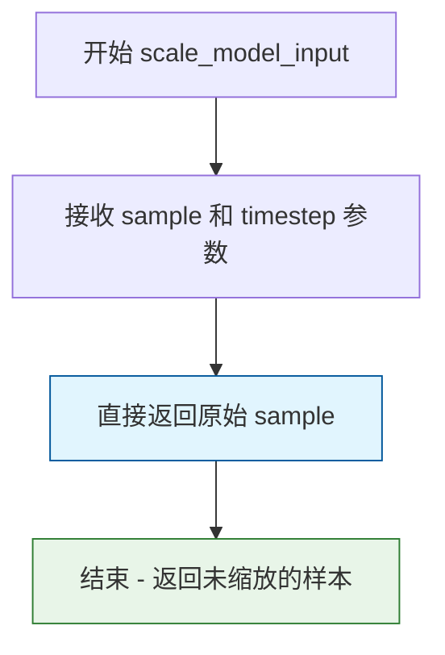
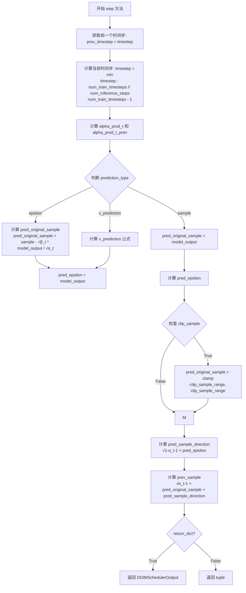
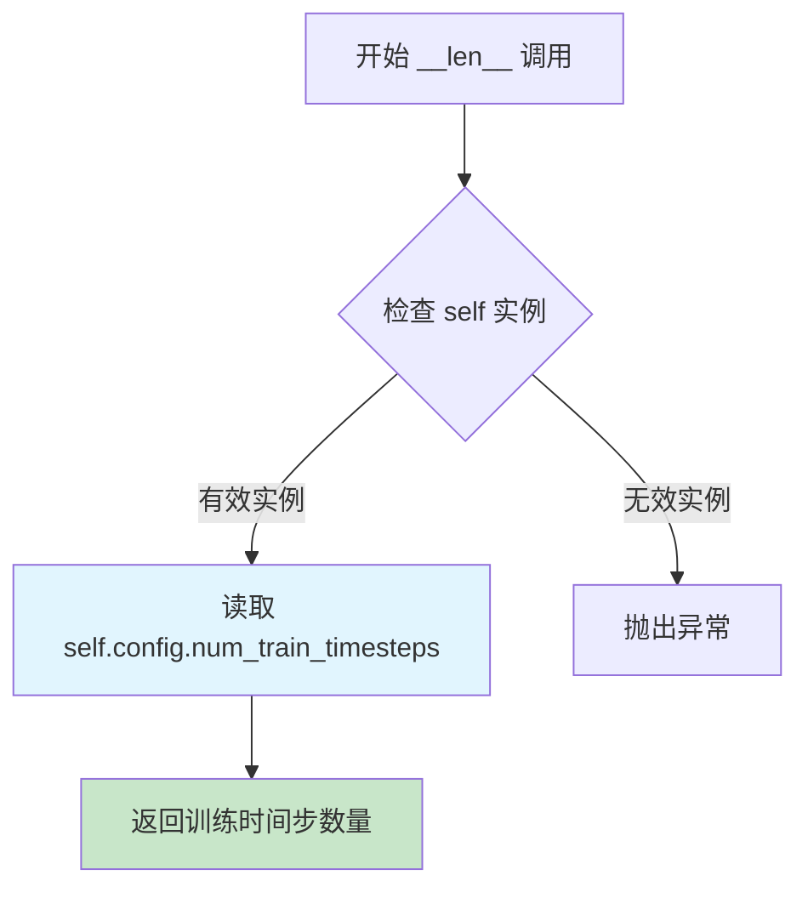

# `diffusers\src\diffusers\schedulers\scheduling_ddim_inverse.py` 详细设计文档

DDIMInverseScheduler是DDIM（去噪扩散隐式模型）的逆调度器，用于将扩散过程反转以从生成的样本重建原始样本。该调度器继承自SchedulerMixin和ConfigMixin，实现了离散时间步的设置和单步反向推理功能，常用于图像到图像转换、可控生成等任务。

## 整体流程

```mermaid
graph TD
    A[初始化DDIMInverseScheduler] --> B[设置betas和alphas]
    B --> C[调用set_timesteps设置推理时间步]
    C --> D[调用step进行反向推理]
    D --> E{获取前一时间步}
    E --> F[计算alpha_prod_t和beta_prod_t]
    F --> G[根据prediction_type计算pred_original_sample]
    G --> H[Clip pred_original_sample]
    H --> I[计算pred_sample_direction]
    I --> J[计算prev_sample即x_{t-1}]
    J --> K[返回DDIMSchedulerOutput]
```

## 类结构

```
DDIMSchedulerOutput (数据类)
└── DDIMInverseScheduler (调度器类)
    ├── 继承: SchedulerMixin, ConfigMixin
    └── 方法: __init__, scale_model_input, set_timesteps, step, __len__
```

## 全局变量及字段


### `betas_for_alpha_bar`
    
创建离散化的beta调度表，基于给定的alpha_t_bar函数

类型：`function`
    


### `rescale_zero_terminal_snr`
    
重缩放betas以实现零终端SNR

类型：`function`
    


### `DDIMInverseScheduler.num_train_timesteps`
    
训练时的扩散步数，默认1000

类型：`int`
    


### `DDIMInverseScheduler.beta_start`
    
Beta起始值，默认0.0001

类型：`float`
    


### `DDIMInverseScheduler.beta_end`
    
Beta结束值，默认0.02

类型：`float`
    


### `DDIMInverseScheduler.beta_schedule`
    
Beta调度策略

类型：`Literal[linear, scaled_linear, squaredcos_cap_v2]`
    


### `DDIMInverseScheduler.trained_betas`
    
直接传入的betas数组

类型：`np.ndarray | list[float] | None`
    


### `DDIMInverseScheduler.clip_sample`
    
是否裁剪样本

类型：`bool`
    


### `DDIMInverseScheduler.clip_sample_range`
    
裁剪范围

类型：`float`
    


### `DDIMInverseScheduler.set_alpha_to_one`
    
是否将alpha设为1

类型：`bool`
    


### `DDIMInverseScheduler.steps_offset`
    
推理步数偏移

类型：`int`
    


### `DDIMInverseScheduler.prediction_type`
    
预测类型

类型：`Literal[epsilon, sample, v_prediction]`
    


### `DDIMInverseScheduler.timestep_spacing`
    
时间步间隔策略

类型：`Literal[leading, trailing]`
    


### `DDIMInverseScheduler.rescale_betas_zero_snr`
    
是否重缩放betas为零终端SNR

类型：`bool`
    


### `DDIMSchedulerOutput.prev_sample`
    
反向推理得到的上一时间步样本x_{t-1}

类型：`torch.Tensor`
    


### `DDIMSchedulerOutput.pred_original_sample`
    
预测的原始样本x_0

类型：`torch.Tensor | None`
    


### `DDIMInverseScheduler.order`
    
调度器阶数

类型：`int`
    


### `DDIMInverseScheduler.ignore_for_config`
    
配置中忽略的字段

类型：`list`
    


### `DDIMInverseScheduler._deprecated_kwargs`
    
已弃用的关键字参数

类型：`list`
    


### `DDIMInverseScheduler.betas`
    
Beta schedule数组

类型：`torch.Tensor`
    


### `DDIMInverseScheduler.alphas`
    
Alpha值数组

类型：`torch.Tensor`
    


### `DDIMInverseScheduler.alphas_cumprod`
    
Alpha累积乘积

类型：`torch.Tensor`
    


### `DDIMInverseScheduler.initial_alpha_cumprod`
    
初始alpha累积乘积

类型：`torch.Tensor`
    


### `DDIMInverseScheduler.init_noise_sigma`
    
初始噪声标准差

类型：`float`
    


### `DDIMInverseScheduler.num_inference_steps`
    
推理步数

类型：`int | None`
    


### `DDIMInverseScheduler.timesteps`
    
时间步张量

类型：`torch.Tensor`
    
    

## 全局函数及方法


### `betas_for_alpha_bar`

该函数根据指定的alpha变换类型（cosine、exp或laplace）生成离散的beta调度表，通过对alpha_bar函数进行数值积分来实现。alpha_bar函数定义了扩散过程中(1-beta)的累积乘积随时间t（从0到1）的变化。

参数：

- `num_diffusion_timesteps`：`int`，要生成的beta数量，定义了扩散时间步的总数
- `max_beta`：`float`，默认为`0.999`，最大beta值，用于避免数值不稳定
- `alpha_transform_type`：`Literal["cosine", "exp", "laplace"]`，默认为`"cosine"`，alpha_bar函数的噪声调度类型，可选cosine、exp或laplace

返回值：`torch.Tensor`，返回形状为`(num_diffusion_timesteps,)`的beta张量，供调度器在推理过程中逐步处理模型输出

#### 流程图

```mermaid
flowchart TD
    A[开始] --> B{alpha_transform_type == 'cosine'}
    B -->|Yes| C[定义cosine类型的alpha_bar_fn]
    B -->|No| D{alpha_transform_type == 'laplace'}
    D -->|Yes| E[定义laplace类型的alpha_bar_fn]
    D -->|No| F{alpha_transform_type == 'exp'}
    F -->|Yes| G[定义exp类型的alpha_bar_fn]
    F -->|No| H[抛出ValueError异常]
    
    C --> I[初始化空列表betas]
    E --> I
    G --> I
    
    I --> J[循环 i 从 0 到 num_diffusion_timesteps-1]
    J --> K[计算t1 = i / num_diffusion_timesteps]
    J --> L[计算t2 = (i + 1) / num_diffusion_timesteps]
    K --> M[计算beta = min1 - alpha_bar_fn(t2) / alpha_bar_fn(t1), max_beta]
    L --> M
    M --> N[将beta添加到betas列表]
    N --> O{是否还有更多时间步?}
    O -->|Yes| J
    O -->|No| P[将betas列表转换为torch.Tensor并指定dtype为float32]
    P --> Q[返回beta张量]
```

#### 带注释源码

```python
def betas_for_alpha_bar(
    num_diffusion_timesteps: int,
    max_beta: float = 0.999,
    alpha_transform_type: Literal["cosine", "exp", "laplace"] = "cosine",
) -> torch.Tensor:
    """
    Create a beta schedule that discretizes the given alpha_t_bar function, which defines the cumulative product of
    (1-beta) over time from t = [0,1].

    Contains a function alpha_bar that takes an argument t and transforms it to the cumulative product of (1-beta) up
    to that part of the diffusion process.

    Args:
        num_diffusion_timesteps (`int`):
            The number of betas to produce.
        max_beta (`float`, defaults to `0.999`):
            The maximum beta to use; use values lower than 1 to avoid numerical instability.
        alpha_transform_type (`str`, defaults to `"cosine"`):
            The type of noise schedule for `alpha_bar`. Choose from `cosine`, `exp`, or `laplace`.

    Returns:
        `torch.Tensor`:
            The betas used by the scheduler to step the model outputs.
    """
    # 根据alpha_transform_type选择并定义相应的alpha_bar_fn函数
    # alpha_bar函数计算累积乘积 (1-beta) 在给定时间t的值
    
    if alpha_transform_type == "cosine":
        # Cosine调度：使用余弦平方函数生成平滑的alpha衰减曲线
        # 公式：alpha_bar(t) = cos^2((t + 0.008) / 1.008 * π / 2)
        # 偏移量0.008用于避免t=0时的边界效应
        
        def alpha_bar_fn(t):
            return math.cos((t + 0.008) / 1.008 * math.pi / 2) ** 2

    elif alpha_transform_type == "laplace":
        # Laplace调度：使用拉普拉斯分布的噪声调度
        # 通过计算lambda和SNR来实现
        
        def alpha_bar_fn(t):
            # 计算拉普拉斯分布参数lambda
            lmb = -0.5 * math.copysign(1, 0.5 - t) * math.log(1 - 2 * math.fabs(0.5 - t) + 1e-6)
            # 计算信号噪声比(SNR)
            snr = math.exp(lmb)
            # 返回标准化的SNR值
            return math.sqrt(snr / (1 + snr))

    elif alpha_transform_type == "exp":
        # 指数调度：使用指数衰减函数
        # alpha_bar(t) = exp(t * -12.0)
        # 负指数斜率-12.0决定了衰减速度
        
        def alpha_bar_fn(t):
            return math.exp(t * -12.0)

    else:
        # 如果传入不支持的alpha_transform_type，抛出ValueError异常
        raise ValueError(f"Unsupported alpha_transform_type: {alpha_transform_type}")

    # 初始化空列表来存储每个时间步的beta值
    betas = []
    
    # 遍历所有扩散时间步，通过数值积分的方式计算离散的beta值
    # 在每个区间[t1, t2]上，beta = 1 - alpha_bar(t2) / alpha_bar(t1)
    # 这种离散化方法保证了累积乘积与连续alpha_bar函数一致
    for i in range(num_diffusion_timesteps):
        # t1和t2分别表示当前区间的前后两个时间点（归一化到[0,1]范围）
        t1 = i / num_diffusion_timesteps
        t2 = (i + 1) / num_diffusion_timesteps
        
        # 计算beta值：1 - (alpha_bar在t2的值 / alpha_bar在t1的值)
        # 使用min函数确保beta不超过max_beta，避免数值不稳定
        betas.append(min(1 - alpha_bar_fn(t2) / alpha_bar_fn(t1), max_beta))
    
    # 将beta列表转换为PyTorch张量，使用float32数据类型
    return torch.tensor(betas, dtype=torch.float32)
```


### `rescale_zero_terminal_snr`

该函数用于将输入的 beta 序列重缩放为零终端信噪比（Zero Terminal SNR），基于论文 https://huggingface.co/papers/2305.08891 (Algorithm 1) 的算法实现。这有助于模型生成极亮或极暗的样本，而不是限制在中等亮度范围内。

参数：

- `betas`：`torch.Tensor`，输入的 beta 调度序列，描述每一步的噪声方差

返回值：`torch.Tensor`，重缩放后的 beta 序列，具有零终端 SNR

#### 流程图

```mermaid
flowchart TD
    A[开始: 输入 betas] --> B[计算 alphas = 1 - betas]
    B --> C[计算累积乘积 alphas_cumprod]
    C --> D[计算 alphas_bar_sqrt = sqrtalphas_cumprod]
    D --> E[保存初始值: alphas_bar_sqrt_0 和 alphas_bar_sqrt_T]
    E --> F[移位操作: alphas_bar_sqrt -= alphas_bar_sqrt_T]
    F --> G[缩放操作: alphas_bar_sqrt *= alphas_bar_sqrt_0 / (alphas_bar_sqrt_0 - alphas_bar_sqrt_T)]
    G --> H[还原平方: alphas_bar = alphas_bar_sqrt ** 2]
    H --> I[还原累积乘积: alphas = alphas_bar[1:] / alphas_bar[:-1]]
    I --> J[拼接首元素: alphas = concat[alphas_bar[0:1], alphas]]
    J --> K[计算 betas: betas = 1 - alphas]
    K --> L[返回: 重缩放后的 betas]
```

#### 带注释源码

```python
def rescale_zero_terminal_snr(betas: torch.Tensor) -> torch.Tensor:
    """
    Rescales betas to have zero terminal SNR Based on https://huggingface.co/papers/2305.08891 (Algorithm 1)

    Args:
        betas (`torch.Tensor`):
            The betas that the scheduler is being initialized with.

    Returns:
        `torch.Tensor`:
            Rescaled betas with zero terminal SNR.
    """
    # 步骤1: 将 betas 转换为 alphas (1 - beta)
    alphas = 1.0 - betas
    
    # 步骤2: 计算累积乘积 alphas_cumprod = alpha_0 * alpha_1 * ... * alpha_t
    alphas_cumprod = torch.cumprod(alphas, dim=0)
    
    # 步骤3: 取平方根得到 alphas_bar_sqrt (即 sqrt(累积乘积))
    alphas_bar_sqrt = alphas_cumprod.sqrt()

    # 保存原始的首尾值用于后续缩放
    alphas_bar_sqrt_0 = alphas_bar_sqrt[0].clone()  # 初始时间步的 sqrt(累积乘积)
    alphas_bar_sqrt_T = alphas_bar_sqrt[-1].clone()  # 最终时间步的 sqrt(累积乘积)

    # 步骤4: 移位操作 - 让最后时间步的值为零
    # 这确保了终端 SNR 为零
    alphas_bar_sqrt -= alphas_bar_sqrt_T

    # 步骤5: 缩放操作 - 恢复初始时间步的值到原始大小
    # 通过乘以比例因子保持初始 SNR 不变
    alphas_bar_sqrt *= alphas_bar_sqrt_0 / (alphas_bar_sqrt_0 - alphas_bar_sqrt_T)

    # 步骤6: 从 sqrt 形式还原到原始形式
    alphas_bar = alphas_bar_sqrt ** 2

    # 步骤7: 通过相邻元素比值还原 alphas
    # alphas[t] = alphas_bar[t] / alphas_bar[t-1]
    alphas = alphas_bar[1:] / alphas_bar[:-1]
    
    # 步骤8: 拼接上第一个时间步的 alpha 值
    alphas = torch.cat([alphas_bar[0:1], alphas])
    
    # 步骤9: 最终计算 betas = 1 - alphas
    betas = 1 - alphas

    return betas
```


### `DDIMInverseScheduler.__init__`

该方法是 `DDIMInverseScheduler` 类的构造函数，负责初始化扩散逆调度器的所有配置参数和内部状态，包括 beta 调度、alpha 累积乘积、噪声sigma等核心参数，为后续的反向扩散过程提供必要的参数基础。

参数：

- `num_train_timesteps`：`int`，默认值 1000，扩散模型训练的步数
- `beta_start`：`float`，默认值 0.0001，beta 调度起始值
- `beta_end`：`float`，默认值 0.02，beta 调度结束值
- `beta_schedule`：`Literal["linear", "scaled_linear", "squaredcos_cap_v2"]`，默认值 "linear"，beta 调度策略，可选线性、缩放线性或余弦平方
- `trained_betas`：`np.ndarray | list[float] | None`，默认值 None，直接传入的 beta 值数组
- `clip_sample`：`bool`，默认值 True，是否对预测样本进行裁剪
- `set_alpha_to_one`：`bool`，默认值 True，是否将初始 alpha 累积乘积设为1
- `steps_offset`：`int`，默认值 0，推理步数的偏移量
- `prediction_type`：`Literal["epsilon", "sample", "v_prediction"]`，默认值 "epsilon"，预测类型
- `clip_sample_range`：`float`，默认值 1.0，样本裁剪的范围
- `timestep_spacing`：`Literal["leading", "trailing"]`，默认值 "leading"，时间步间隔策略
- `rescale_betas_zero_snr`：`bool`，默认值 False，是否重新缩放 beta 以实现零终端 SNR
- `**kwargs`：可变关键字参数，用于向后兼容

返回值：`None`，构造函数无返回值

#### 流程图

```mermaid
flowchart TD
    A[__init__ 开始] --> B{set_alpha_to_zero 在 kwargs 中?}
    B -->|是| C[发出警告并转换为 set_alpha_to_one]
    B -->|否| D{trained_betas 不为空?}
    D -->|是| E[直接使用 trained_betas 创建 betas 张量]
    D -->|否| F{beta_schedule == 'linear'?}
    F -->|是| G[使用 torch.linspace 创建线性 betas]
    F -->|否| H{beta_schedule == 'scaled_linear'?}
    H -->|是| I[使用缩放线性方法创建 betas]
    H -->|否| J{beta_schedule == 'squaredcos_cap_v2'?}
    J -->|是| K[调用 betas_for_alpha_bar 创建 betas]
    J -->|否| L[抛出 NotImplementedError]
    K --> M{rescale_betas_zero_snr?}
    E --> M
    G --> M
    I --> M
    M -->|是| N[调用 rescale_zero_terminal_snr 重新缩放 betas]
    M -->|否| O[计算 alphas = 1 - betas]
    N --> O
    O --> P[计算 alphas_cumprod 累积乘积]
    P --> Q{set_alpha_to_one 为 true?]
    Q -->|是| R[initial_alpha_cumprod = 1.0]
    Q -->|否| S[initial_alpha_cumprod = alphas_cumprod[0]]
    R --> T[设置 init_noise_sigma = 1.0]
    S --> T
    T --> U[初始化 num_inference_steps = None]
    U --> V[创建 timesteps 数组]
    V --> W[__init__ 结束]
    L --> X[抛出异常]
```

#### 带注释源码

```python
@register_to_config
def __init__(
    self,
    num_train_timesteps: int = 1000,                    # 扩散模型训练的步数，默认1000
    beta_start: float = 0.0001,                         # beta起始值，默认0.0001
    beta_end: float = 0.02,                             # beta结束值，默认0.02
    beta_schedule: Literal["linear", "scaled_linear", "squaredcos_cap_v2"] = "linear",  # beta调度策略
    trained_betas: np.ndarray | list[float] | None = None,  # 直接传入的beta数组
    clip_sample: bool = True,                           # 是否裁剪样本，默认True
    set_alpha_to_one: bool = True,                      # 是否将初始alpha设为1
    steps_offset: int = 0,                              # 推理步数偏移量
    prediction_type: Literal["epsilon", "sample", "v_prediction"] = "epsilon",  # 预测类型
    clip_sample_range: float = 1.0,                    # 裁剪范围
    timestep_spacing: Literal["leading", "trailing"] = "leading",  # 时间步间隔策略
    rescale_betas_zero_snr: bool = False,               # 是否重新缩放beta为零终端SNR
    **kwargs,                                           # 向后兼容的可变参数
):
    # 处理已废弃的参数 set_alpha_to_zero，转换为 set_alpha_to_one
    if kwargs.get("set_alpha_to_zero", None) is not None:
        deprecation_message = (
            "The `set_alpha_to_zero` argument is deprecated. Please use `set_alpha_to_one` instead."
        )
        deprecate("set_alpha_to_zero", "1.0.0", deprecation_message, standard_warn=False)
        set_alpha_to_one = kwargs["set_alpha_to_zero"]
    
    # 根据不同的 beta 调度策略初始化 betas
    if trained_betas is not None:
        # 直接使用传入的 trained_betas 创建张量
        self.betas = torch.tensor(trained_betas, dtype=torch.float32)
    elif beta_schedule == "linear":
        # 线性调度：从 beta_start 线性增加到 beta_end
        self.betas = torch.linspace(beta_start, beta_end, num_train_timesteps, dtype=torch.float32)
    elif beta_schedule == "scaled_linear":
        # 缩放线性调度：先计算平方根，再线性插值，最后平方
        # 这种调度对潜在扩散模型特别适用
        self.betas = (
            torch.linspace(
                beta_start**0.5,
                beta_end**0.5,
                num_train_timesteps,
                dtype=torch.float32,
            )
            ** 2
        )
    elif beta_schedule == "squaredcos_cap_v2":
        # 余弦平方调度（Glide cosine schedule）
        self.betas = betas_for_alpha_bar(num_train_timesteps)
    else:
        raise NotImplementedError(f"{beta_schedule} is not implemented for {self.__class__}")

    # 如果设置了 rescale_betas_zero_snr，则重新缩放 beta 以实现零终端 SNR
    # 这允许模型生成非常亮或非常暗的样本
    if rescale_betas_zero_snr:
        self.betas = rescale_zero_terminal_snr(self.betas)

    # 计算 alphas 和 alphas_cumprod
    self.alphas = 1.0 - self.betas                                    # alpha = 1 - beta
    self.alphas_cumprod = torch.cumprod(self.alphas, dim=0)           # 累积乘积

    # 初始化 alpha_cumprod：对于 DDIM 逆调度，我们需要查看下一个 alpha_cumprod
    # 对于初始步骤，没有当前的 alpha_cumprod，索引会越界
    # set_alpha_to_one 决定是将此参数简单地设为一，还是使用训练时的初始 alpha
    # 如果为 True，self.step() 只输出预测的噪声
    self.initial_alpha_cumprod = torch.tensor(1.0) if set_alpha_to_one else self.alphas_cumprod[0]

    # 初始噪声分布的标准差
    self.init_noise_sigma = 1.0

    # 可设置的推理参数
    self.num_inference_steps = None      # 推理步数（稍后设置）
    self.timesteps = torch.from_numpy(np.arange(0, num_train_timesteps).copy().astype(np.int64))  # 时间步数组
```


### `DDIMInverseScheduler.scale_model_input`

该方法确保与需要根据当前时间步调整去噪模型输入的调度器保持可互换性，直接返回原始样本而不进行任何缩放操作。

参数：

- `sample`：`torch.Tensor`，当前扩散过程中生成的样本输入
- `timestep`：`int | None`，扩散链中的当前离散时间步（可选）

返回值：`torch.Tensor`，返回未缩放的输入样本

#### 流程图



#### 带注释源码

```python
def scale_model_input(self, sample: torch.Tensor, timestep: int | None = None) -> torch.Tensor:
    """
    Ensures interchangeability with schedulers that need to scale the denoising model input depending on the
    current timestep.

    Args:
        sample (`torch.Tensor`):
            The input sample.
        timestep (`int`, *optional*):
            The current timestep in the diffusion chain.

    Returns:
        `torch.Tensor`:
            A scaled input sample.
    """
    # 直接返回输入样本，未进行任何缩放处理
    # 这是因为DDIM逆向调度器不需要像其他调度器那样根据时间步调整输入
    return sample
```

#### 备注

此方法是调度器接口实现的一部分，提供与其它需要缩放输入的调度器（如 DDPM、DPM-Solver 等）的互操作性。当前实现为无操作（no-op），因为 DDIM 调度器在逆向过程中不需要对输入进行时间步相关的缩放调整。


### `DDIMInverseScheduler.set_timesteps`

该方法用于设置扩散链中使用的离散时间步，在推理前调用。它根据配置的 `timestep_spacing` 策略（"leading" 或 "trailing"）计算推理时的时间步序列，并将结果存储在 `self.timesteps` 中。

参数：

- `num_inference_steps`：`int`，生成样本时使用的扩散步数
- `device`：`str | torch.device | None`，时间步张量要移动到的目标设备

返回值：`None`，该方法直接修改实例属性，不返回任何值

#### 流程图

```mermaid
flowchart TD
    A[开始 set_timesteps] --> B{num_inference_steps <= num_train_timesteps?}
    B -->|否| C[抛出 ValueError]
    B -->|是| D[设置 self.num_inference_steps]
    D --> E{timestep_spacing == 'leading'?}
    E -->|是| F[计算 step_ratio = num_train_timesteps // num_inference_steps]
    F --> G[计算 timesteps = np.arange(0, num_inference_steps) * step_ratio]
    G --> H[round + copy + astype(np.int64)]
    H --> I[加上 steps_offset]
    E -->|否| J{timestep_spacing == 'trailing'?}
    J -->|是| K[计算 step_ratio = num_train_timesteps / num_inference_steps]
    K --> L[计算 timesteps = np.arange(num_train_timesteps, 0, -step_ratio)]
    L --> M[反转数组]
    M --> N[round + astype(np.int64)]
    N --> O[减去 1]
    J -->|否| P[抛出 ValueError]
    I --> Q[转换为 torch.Tensor 并移动到 device]
    O --> Q
    Q --> R[设置 self.timesteps]
    R --> S[结束]
    C --> S
    P --> S
```

#### 带注释源码

```python
def set_timesteps(
    self,
    num_inference_steps: int,
    device: str | torch.device | None = None,
) -> None:
    """
    Sets the discrete timesteps used for the diffusion chain (to be run before inference).

    Args:
        num_inference_steps (`int`):
            The number of diffusion steps used when generating samples with a pre-trained model.
    """

    # 检查推理步数是否超过训练步数，如果是则抛出异常
    if num_inference_steps > self.config.num_train_timesteps:
        raise ValueError(
            f"`num_inference_steps`: {num_inference_steps} cannot be larger than `self.config.train_timesteps`:"
            f" {self.config.num_train_timesteps} as the unet model trained with this scheduler can only handle"
            f" maximal {self.config.num_train_timesteps} timesteps."
        )

    # 保存推理步数到实例属性
    self.num_inference_steps = num_inference_steps

    # 根据 timestep_spacing 策略计算时间步
    # "leading" 和 "trailing" 对应于 https://huggingface.co/papers/2305.08891 的表2
    if self.config.timestep_spacing == "leading":
        # 计算步长比率（整数除法）
        step_ratio = self.config.num_train_timesteps // self.num_inference_steps
        # 通过乘以比率创建整数时间步
        # 转换为 int 以避免当 num_inference_steps 是 3 的幂次时出现问题
        timesteps = (np.arange(0, num_inference_steps) * step_ratio).round().copy().astype(np.int64)
        # 加上步数偏移量
        timesteps += self.config.steps_offset
    elif self.config.timestep_spacing == "trailing":
        # 计算步长比率（浮点数除法）
        step_ratio = self.config.num_train_timesteps / self.num_inference_steps
        # 通过乘以比率创建整数时间步
        # 转换为 int 以避免当 num_inference_steps 是 3 的幂次时出现问题
        timesteps = np.round(np.arange(self.config.num_train_timesteps, 0, -step_ratio)[::-1]).astype(np.int64)
        # 减去 1 以调整索引
        timesteps -= 1
    else:
        raise ValueError(
            f"{self.config.timestep_spacing} is not supported. Please make sure to choose one of 'leading' or 'trailing'."
        )

    # 将 numpy 数组转换为 PyTorch 张量并移动到指定设备
    self.timesteps = torch.from_numpy(timesteps).to(device)
```


### `DDIMInverseScheduler.step`

该方法是DDIM逆向调度器的核心步骤函数，通过反转扩散过程来预测前一个时间步的样本。它接收模型输出（预测噪声）、当前时间步和样本，然后基于DDIM逆向公式计算前一个时间步的样本和预测的原始样本。

参数：

- `model_output`：`torch.Tensor`，学习到的扩散模型的直接输出（通常是预测的噪声）
- `timestep`：`int`，扩散链中的当前离散时间步
- `sample`：`torch.Tensor`，扩散过程创建的当前样本实例
- `return_dict`：`bool`，是否返回`DDIMSchedulerOutput`或`tuple`（默认为`True`）

返回值：`DDIMSchedulerOutput | tuple`，如果`return_dict`为`True`返回`DDIMSchedulerOutput`对象，否则返回元组（第一个元素是样本张量）

#### 流程图



#### 带注释源码

```python
def step(
    self,
    model_output: torch.Tensor,
    timestep: int,
    sample: torch.Tensor,
    return_dict: bool = True,
) -> DDIMSchedulerOutput | tuple:
    """
    通过反转SDE来预测前一个时间步的样本。此函数将扩散过程从学习到的模型输出（通常是预测的噪声）向前传播。

    Args:
        model_output (`torch.Tensor`): 学习到的扩散模型的直接输出。
        timestep (`int`): 扩散链中的当前离散时间步。
        sample (`torch.Tensor`): 由扩散过程创建的当前样本实例。
        return_dict (`bool`, *optional*, defaults to `True`): 是否返回 [`~schedulers.scheduling_ddim_inverse.DDIMInverseSchedulerOutput`] 或 `tuple`。

    Returns:
        [`~schedulers.scheduling_ddim_inverse.DDIMInverseSchedulerOutput`] 或 `tuple`: 如果 return_dict 为 `True`，返回 [`~schedulers.scheduling_ddim_inverse.DDIMSchedulerOutput`]，否则返回元组，其中第一个元素是样本张量。
    """
    # 1. 获取前一个时间步值 (=t+1)
    # 保存原始时间步作为前一个时间步
    prev_timestep = timestep
    # 计算当前时间步（逆向过程）
    timestep = min(
        timestep - self.config.num_train_timesteps // self.num_inference_steps,
        self.config.num_train_timesteps - 1,
    )

    # 2. 计算 alphas, betas
    # 改变原始实现以精确匹配噪声水平以获得类似的正向过程
    # 获取当前时间步的累积 alpha 值
    alpha_prod_t = self.alphas_cumprod[timestep] if timestep >= 0 else self.initial_alpha_cumprod
    # 获取前一个时间步的累积 alpha 值
    alpha_prod_t_prev = self.alphas_cumprod[prev_timestep]

    # 计算 beta 累积乘积
    beta_prod_t = 1 - alpha_prod_t

    # 3. 从预测的噪声计算预测的原始样本
    # 也称为 "predicted x_0"，来自公式 (12) https://huggingface.co/papers/2010.02502
    if self.config.prediction_type == "epsilon":
        # epsilon 预测：从噪声重建原始样本
        pred_original_sample = (sample - beta_prod_t ** (0.5) * model_output) / alpha_prod_t ** (0.5)
        pred_epsilon = model_output
    elif self.config.prediction_type == "sample":
        # sample 预测：直接使用模型输出作为原始样本
        pred_original_sample = model_output
        pred_epsilon = (sample - alpha_prod_t ** (0.5) * pred_original_sample) / beta_prod_t ** (0.5)
    elif self.config.prediction_type == "v_prediction":
        # v-prediction：来自 Imagen Video 论文
        pred_original_sample = (alpha_prod_t**0.5) * sample - (beta_prod_t**0.5) * model_output
        pred_epsilon = (alpha_prod_t**0.5) * model_output + (beta_prod_t**0.5) * sample
    else:
        raise ValueError(
            f"prediction_type given as {self.config.prediction_type} must be one of `epsilon`, `sample`, or"
            " `v_prediction`"
        )

    # 4. 剪辑或阈值 "predicted x_0"
    # 用于数值稳定性
    if self.config.clip_sample:
        pred_original_sample = pred_original_sample.clamp(
            -self.config.clip_sample_range, self.config.clip_sample_range
        )

    # 5. 计算指向 x_t 的"方向"
    # 公式 (12) from https://huggingface.co/papers/2010.02502
    pred_sample_direction = (1 - alpha_prod_t_prev) ** (0.5) * pred_epsilon

    # 6. 计算 x_t 不含"随机噪声"
    # 公式 (12) from https://huggingface.co/papers/2010.02502
    # 这是确定性逆向过程（DDIM与DDPM的区别在于无随机性）
    prev_sample = alpha_prod_t_prev ** (0.5) * pred_original_sample + pred_sample_direction

    # 根据 return_dict 返回结果
    if not return_dict:
        return (prev_sample, pred_original_sample)
    return DDIMSchedulerOutput(prev_sample=prev_sample, pred_original_sample=pred_original_sample)
```


### `DDIMInverseScheduler.__len__`

这是一个魔术方法（Magic Method），实现了 Python 的 `len()` 协议，使调度器实例可以直接通过 `len()` 函数获取其配置的训练时间步数量，从而与 Python 的标准接口保持一致。

参数：

- `self`：`DDIMInverseScheduler`，隐式参数，表示调度器实例本身

返回值：`int`，返回配置中定义的训练时间步数量（即 `num_train_timesteps`），用于表示该调度器管理的扩散过程的总步数。

#### 流程图



#### 带注释源码

```python
def __len__(self) -> int:
    """
    返回调度器配置的训练时间步数量。
    
    该方法实现了 Python 的 len() 协议，使得调度器实例可以直接通过
    len(scheduler) 的方式获取扩散过程的总步数。这与其他 Python 容器
    和可迭代对象的接口保持一致，方便在代码中统一处理。
    
    Returns:
        int: 配置中定义的训练时间步数量 (num_train_timesteps)。
             默认值为 1000，表示标准的扩散模型训练步数。
    """
    return self.config.num_train_timesteps
```

## 关键组件


### DDIMInverseScheduler

DDIM逆向调度器类，继承自SchedulerMixin和ConfigMixin，用于实现扩散模型的逆向过程（从噪声图像恢复到原始图像）。与标准DDIMScheduler相反，它通过反转扩散过程来执行图像到图像的任务。

### DDIMSchedulerOutput

输出数据类，包含prev_sample（前一步的样本）和pred_original_sample（预测的原始样本）。用于封装scheduler step方法的返回值，提供结构化的推理结果。

### betas_for_alpha_bar

Beta调度生成函数，支持三种alpha变换类型（cosine、exp、laplace）。通过离散化给定的alpha_bar函数来生成beta序列，是扩散模型噪声调度的核心组件。

### rescale_zero_terminal_snr

零终端信噪比重缩放函数，基于论文2305.08891的算法1实现。通过重新缩放beta值使终端SNR为零，从而支持生成极亮或极暗的样本。

### step方法

核心推理步骤方法，实现逆向SDE传播。根据预测类型（epsilon/sample/v_prediction）计算前一步的样本，支持样本裁剪以保证数值稳定性。

### set_timesteps方法

设置离散时间步方法，支持"leading"和"trailing"两种间距策略。根据num_inference_steps和timestep_spacing配置生成推理时的时间步序列。

### alphas_cumprod

累积Alpha值张量，存储每个时间步的alpha累积乘积。是计算逆向过程的关键变量，用于推导样本的演变。

### prediction_type

预测类型支持组件，允许三种预测模式：epsilon（预测噪声）、sample（直接预测样本）、v_prediction（v参数预测）。不同预测类型对应不同的公式计算方式。

### timestep_spacing

时间步间距策略组件，控制推理时如何对训练时间步进行采样。"leading"策略从高时间步开始，"trailing"策略从低时间步开始，影响生成质量。

### rescale_betas_zero_snr

零SNR重缩放配置项，决定是否启用终端SNR为零的beta重缩放。启用后可生成更宽亮度范围的样本，与offset_noise技术相关。


## 问题及建议


### 已知问题

-   **类型注解兼容性**：`trained_betas: np.ndarray | list[float] | None` 使用了 Python 3.10+ 的类型联合语法（`|`），如果项目需要支持更低版本 Python 会导致兼容性问题
-   **代码冗余**：大量代码通过 "Copied from" 注释从其他调度器复制而来（如 `betas_for_alpha_bar`、`rescale_zero_terminal_snr`、`scale_model_input`），违反 DRY 原则，增加维护成本
-   **数值稳定性风险**：`step` 方法中使用 `** (0.5)` 进行开方运算，在极端情况下（如 alpha_prod_t 接近 0）可能导致数值不稳定，建议使用 `torch.sqrt()` 替代
-   **边界条件处理**：在 `step` 方法中 `beta_prod_t ** (0.5)` 和 `alpha_prod_t ** (0.5)` 的计算未对接近 0 的值进行保护，可能导致除零或 NaN 问题
-   **状态同步问题**：若在未调用 `set_timesteps` 的情况下直接调用 `step`，`self.num_inference_steps` 为 `None`，会导致运行时错误
-   **未使用的变量**：`DDIMInverseScheduler` 类中定义了 `_deprecated_kwargs = ["set_alpha_to_zero"]`，但该列表仅用于注释，未实际用于处理弃用参数
-   **性能优化缺失**：每次调用 `step` 都重新计算 `alpha_prod_t`、`beta_prod_t`、`alpha_prod_t_prev` 等中间值，可预计算并缓存以提升性能
-   **文档不完整**：类缺少 `__call__` 方法说明，而其他调度器通常提供此方法用于批量处理

### 优化建议

-   **提取公共逻辑**：将 `betas_for_alpha_bar` 和 `rescale_zero_terminal_snr` 等通用函数移至共享模块，避免代码重复
-   **数值计算优化**：将 `** 0.5` 替换为 `torch.sqrt()`，并添加数值稳定性检查（如检查 alpha_prod_t 是否接近 0）
-   **添加初始化验证**：在 `__init__` 或 `step` 方法中添加状态检查，确保 `num_inference_steps` 已正确设置
-   **完善类型注解**：使用 `from __future__ import annotations` 或改为 `Optional[List[float]]` 以支持更多 Python 版本
-   **性能优化**：在 `set_timesteps` 中预计算并缓存 `alphas_cumprod` 的相关值，减少 `step` 方法中的重复计算
-   **增强文档**：补充类的工作原理、典型使用场景以及与 `DDIMScheduler` 的关系说明

## 其它


### 设计目标与约束

本代码实现DDIMInverseScheduler（逆向调度器），核心目标是将DDIMScheduler的推理过程反转，用于图像生成的反向过程（即从噪声恢复图像）。主要设计约束包括：1）必须继承SchedulerMixin和ConfigMixin以保持与diffusers库的一致性；2）支持三种预测类型（epsilon、sample、v_prediction）；3）支持多种beta调度策略（linear、scaled_linear、squaredcos_cap_v2）；4）保持与DDIMScheduler的API兼容性。

### 错误处理与异常设计

代码中的错误处理主要通过以下方式实现：1）ValueError异常用于非法参数值（如不支持的beta_schedule或timestep_spacing）；2）NotImplementedError用于未实现的调度策略；3）参数验证在set_timesteps方法中进行，检查num_inference_steps不超过num_train_timesteps；4）使用deprecate函数处理已废弃参数set_alpha_to_zero；5）clip_sample参数提供数值稳定性保护。

### 数据流与状态机

DDIMInverseScheduler的状态转换遵循以下流程：初始化阶段设置betas、alphas、alphas_cumprod等参数；set_timesteps阶段计算离散时间步；step阶段执行逆向扩散过程。关键状态变量包括：timesteps（当前时间步序列）、num_inference_steps（推理步数）、alphas_cumprod（累积alpha值）。数据流从model_output（模型预测）经过pred_original_sample计算、clipping处理，最终输出prev_sample（前一时刻样本）。

### 外部依赖与接口契约

本模块依赖以下外部组件：1）diffusers.configuration_utils中的ConfigMixin和register_to_config装饰器；2）diffusers.schedulers.scheduling_utils中的SchedulerMixin；3）diffusers.utils中的BaseOutput和deprecate；4）numpy和torch用于数值计算。接口契约要求：model_output必须为torch.Tensor；timestep为整数；sample为图像张量；set_timesteps必须在step之前调用。

### 性能考虑与优化建议

当前实现的主要性能考量：1）betas和alphas在初始化时预计算，避免重复计算；2）使用torch张量操作保持GPU兼容性；3）alphas_cumprod使用cumprod一次性计算。潜在优化方向：1）可考虑添加缓存机制存储中间计算结果；2）对于大批量推理可预先分配张量；3）可添加torch.cuda.amp支持混合精度计算；4）可实现__slots__减少内存开销。

### 安全性考虑

代码安全性主要体现在：1）clip_sample_range参数防止数值溢出；2）输入参数类型检查；3）beta值限制在max_beta（默认0.999）以内防止数值不稳定。暂无涉及敏感数据处理或用户输入验证的安全问题。

### 兼容性考虑

本调度器与以下组件兼容：1）diffusers库0.30.0+版本；2）支持CUDA和CPU设备；3）支持PyTorch 2.0+的torch.float32和torch.float16数据类型。需要注意的是：1）prediction_type必须与训练时一致；2）timestep_spacing参数影响采样质量，建议使用"leading"；3）rescale_betas_zero_snr与某些模型不兼容。

### 测试策略

建议的测试覆盖：1）单元测试验证各预测类型的数学正确性；2）集成测试验证与UNet模型的端到端流程；3）数值稳定性测试验证不同beta_schedule下的输出；4）边界条件测试（如num_inference_steps=1、clip_sample=False等）；5）反向过程结果应与正向DDIMScheduler互补。

### 使用示例

```python
from diffusers import DDIMInverseScheduler, UNet2DModel
import torch

# 初始化调度器和模型
scheduler = DDIMInverseScheduler(num_train_timesteps=1000)
model = UNet2DModel.from_pretrained("model_path")

# 设置推理步数
scheduler.set_timesteps(num_inference_steps=50)

# 逆向推理
sample = torch.randn(1, 3, 64, 64)
for t in scheduler.timesteps:
    with torch.no_grad():
        model_output = model(sample, t).sample
    sample = scheduler.step(model_output, t, sample).prev_sample
```

### 参考文献与资料

1. DDIM论文: "Denoising Diffusion Implicit Models" (https://huggingface.co/papers/2010.02502)
2. 扩散噪声调度: "Common Diffusion Noise Schedules and Sample Steps are Flawed" (https://huggingface.co/papers/2305.08891)
3. 零终端SNR: "Spectrally Gradual Noise Scheduling"相关研究
4. 原始实现参考: https://github.com/pesser/pytorch_diffusion 和 https://github.com/hojonathanho/diffusion

### 版本历史与变更记录

当前版本基于diffusers库的标准调度器结构开发。关键变更包括：1）实现step方法的逆向计算逻辑；2）添加对多种预测类型的支持；3）集成rescale_zero_terminal_snr功能；4）保持与DDIMScheduler的API兼容性以便在DiffusionPipeline中替换使用。


    