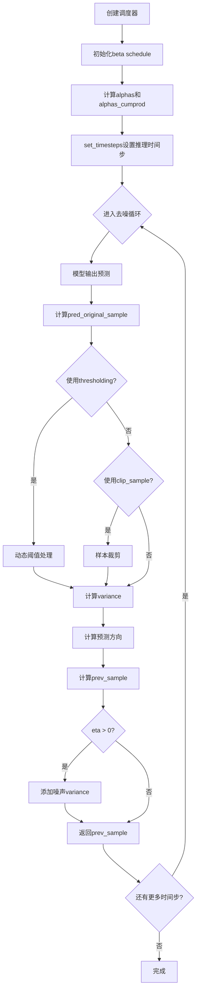
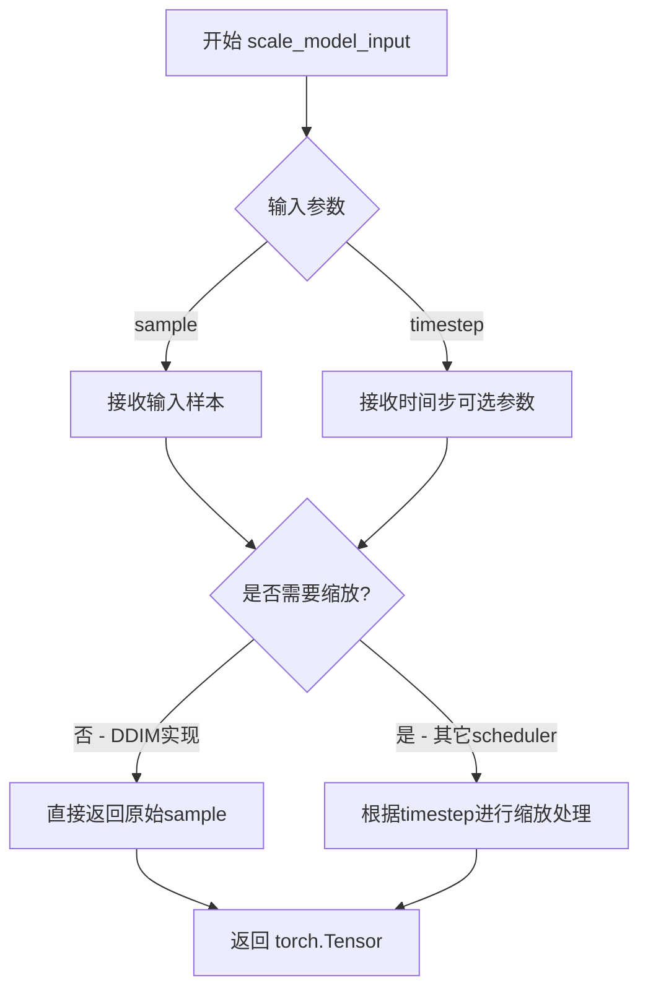
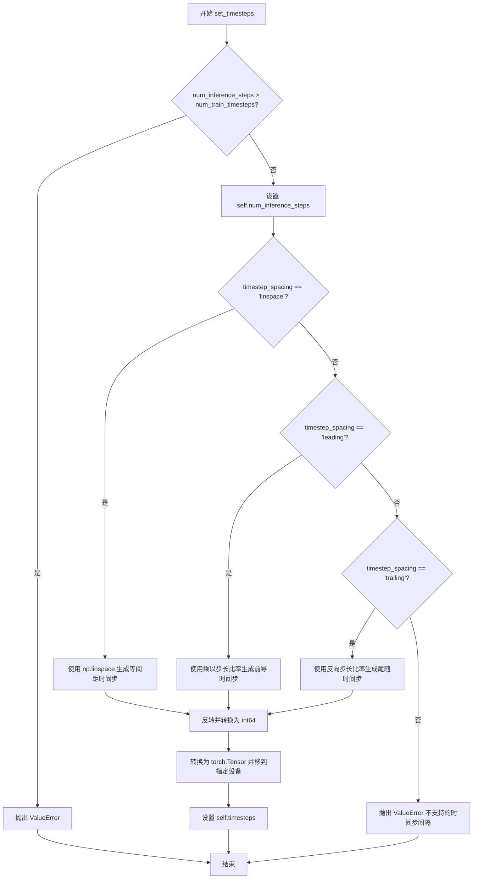
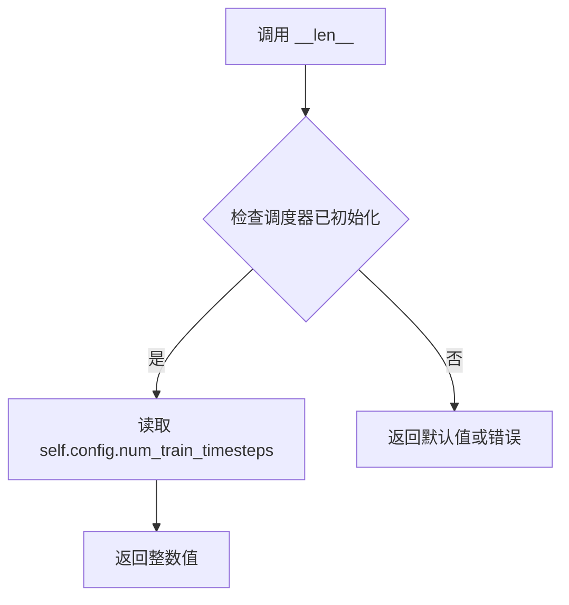

# `diffusers\src\diffusers\schedulers\scheduling_ddim_parallel.py` 详细设计文档

DDIM Parallel Scheduler是Diffusers库中的一个调度器，扩展了DDIM（Denoising Diffusion Implicit Models）算法以支持并行采样。该调度器实现了非马尔可夫guidance的去噪过程，能够通过batch处理多个时间步来实现高效的并行推理，同时保持与标准DDIM相同的噪声预测和样本生成逻辑。

## 整体流程



## 类结构

```
SchedulerMixin (mixin基类)
└── DDIMParallelScheduler (主调度器类)
    └── DDIMParallelSchedulerOutput (输出数据类)
```

## 全局变量及字段


### `num_train_timesteps`
    
训练模型的扩散步数

类型：`int`
    


### `beta_start`
    
beta调度起始值

类型：`float`
    


### `beta_end`
    
beta调度结束值

类型：`float`
    


### `beta_schedule`
    
beta调度策略，可选linear、scaled_linear、squaredcos_cap_v2

类型：`str`
    


### `trained_betas`
    
直接传入的beta数组，用于绕过beta_schedule

类型：`np.ndarray | list[float] | None`
    


### `clip_sample`
    
是否对预测样本进行裁剪以保证数值稳定性

类型：`bool`
    


### `clip_sample_range`
    
样本裁剪的最大范围

类型：`float`
    


### `set_alpha_to_one`
    
最终步是否将前一个alpha乘积设为1

类型：`bool`
    


### `steps_offset`
    
推理步数的偏移量

类型：`int`
    


### `prediction_type`
    
调度器预测类型：epsilon预测噪声、sample直接预测样本、v_prediction速度预测

类型：`Literal["epsilon", "sample", "v_prediction"]`
    


### `thresholding`
    
是否使用动态阈值方法

类型：`bool`
    


### `dynamic_thresholding_ratio`
    
动态阈值方法的分位数比率

类型：`float`
    


### `sample_max_value`
    
动态阈值方法的最大阈值

类型：`float`
    


### `timestep_spacing`
    
时间步的缩放方式

类型：`Literal["leading", "trailing", "linspace"]`
    


### `rescale_betas_zero_snr`
    
是否重缩放beta以实现零终端信噪比

类型：`bool`
    


### `DDIMParallelSchedulerOutput.prev_sample`
    
前一个时间步的计算样本

类型：`torch.Tensor`
    


### `DDIMParallelSchedulerOutput.pred_original_sample`
    
预测的原始去噪样本

类型：`torch.Tensor | None`
    


### `DDIMParallelScheduler.betas`
    
beta调度参数张量

类型：`torch.Tensor`
    


### `DDIMParallelScheduler.alphas`
    
alpha参数张量 (1 - betas)

类型：`torch.Tensor`
    


### `DDIMParallelScheduler.alphas_cumprod`
    
累积alpha产品张量

类型：`torch.Tensor`
    


### `DDIMParallelScheduler.final_alpha_cumprod`
    
最终累积alpha值

类型：`torch.Tensor`
    


### `DDIMParallelScheduler.init_noise_sigma`
    
初始噪声标准差

类型：`float`
    


### `DDIMParallelScheduler.num_inference_steps`
    
推理步数

类型：`int | None`
    


### `DDIMParallelScheduler.timesteps`
    
时间步张量

类型：`torch.Tensor`
    


### `DDIMParallelScheduler._compatibles`
    
兼容的调度器列表

类型：`list`
    


### `DDIMParallelScheduler.order`
    
调度器阶数

类型：`int`
    


### `DDIMParallelScheduler._is_ode_scheduler`
    
是否为ODE调度器

类型：`bool`
    
    

## 全局函数及方法


### `betas_for_alpha_bar`

该函数用于创建 beta 调度表，通过离散化给定的 alpha_t_bar 函数来生成一系列 beta 值。这个函数定义了扩散过程中 (1-beta) 的累积乘积，支持三种 alpha 变换类型（cosine、exp、laplace），用于控制噪声调度曲线。

参数：

- `num_diffusion_timesteps`：`int`，要生成的 beta 数量，即扩散时间步的总数
- `max_beta`：`float`，默认值 `0.999`，使用的最大 beta 值，用于避免数值不稳定
- `alpha_transform_type`：`Literal["cosine", "exp", "laplace"]`，默认值 `"cosine"`，alpha_bar 的噪声调度类型

返回值：`torch.Tensor`，调度器用于逐步模型输出的 betas 张量

#### 流程图

```mermaid
flowchart TD
    A[开始 betas_for_alpha_bar] --> B{alpha_transform_type == "cosine"?}
    B -->|Yes| C[定义 cosine alpha_bar_fn]
    B -->|No| D{alpha_transform_type == "laplace"?}
    D -->|Yes| E[定义 laplace alpha_bar_fn]
    D -->|No| F{alpha_transform_type == "exp"?}
    F -->|Yes| G[定义 exp alpha_bar_fn]
    F -->|No| H[raise ValueError 不支持的类型]
    C --> I[初始化空 betas 列表]
    E --> I
    G --> I
    I --> J[循环 i 从 0 到 num_diffusion_timesteps-1]
    J --> K[计算 t1 = i / num_diffusion_timesteps]
    J --> L[计算 t2 = (i + 1) / num_diffusion_timesteps]
    K --> M[计算 beta_i = min(1 - alpha_bar_fn(t2) / alpha_bar_fn(t1), max_beta)]
    L --> M
    M --> N[将 beta_i 添加到 betas 列表]
    N --> O{还有下一个 i?}
    O -->|Yes| J
    O -->|No| P[返回 torch.tensor(betas, dtype=torch.float32)]
    H --> Q[结束]
```

#### 带注释源码

```python
# Copied from diffusers.schedulers.scheduling_ddpm.betas_for_alpha_bar
def betas_for_alpha_bar(
    num_diffusion_timesteps: int,
    max_beta: float = 0.999,
    alpha_transform_type: Literal["cosine", "exp", "laplace"] = "cosine",
) -> torch.Tensor:
    """
    Create a beta schedule that discretizes the given alpha_t_bar function, which defines the cumulative product of
    (1-beta) over time from t = [0,1].

    Contains a function alpha_bar that takes an argument t and transforms it to the cumulative product of (1-beta) up
    to that part of the diffusion process.

    Args:
        num_diffusion_timesteps (`int`):
            The number of betas to produce.
        max_beta (`float`, defaults to `0.999`):
            The maximum beta to use; use values lower than 1 to avoid numerical instability.
        alpha_transform_type (`str`, defaults to `"cosine"`):
            The type of noise schedule for `alpha_bar`. Choose from `cosine`, `exp`, or `laplace`.

    Returns:
        `torch.Tensor`:
            The betas used by the scheduler to step the model outputs.
    """
    # 根据 alpha_transform_type 选择对应的 alpha_bar 函数
    # cosine 调度：使用余弦函数生成平滑的噪声调度曲线
    if alpha_transform_type == "cosine":

        def alpha_bar_fn(t):
            # 余弦调度：cos((t + 0.008) / 1.008 * pi / 2)^2
            # 添加偏移 0.008/1.008 是为了避免 t=0 时的问题
            return math.cos((t + 0.008) / 1.008 * math.pi / 2) ** 2

    # laplace 调度：使用拉普拉斯分布相关的公式
    elif alpha_transform_type == "laplace":

        def alpha_bar_fn(t):
            # 计算 lambda：基于 t 与 0.5 的距离的对数变换
            lmb = -0.5 * math.copysign(1, 0.5 - t) * math.log(1 - 2 * math.fabs(0.5 - t) + 1e-6)
            # 计算信噪比 SNR
            snr = math.exp(lmb)
            # 返回 sqrt(snr / (1 + snr))
            return math.sqrt(snr / (1 + snr))

    # exp 调度：使用指数衰减函数
    elif alpha_transform_type == "exp":

        def alpha_bar_fn(t):
            # 指数调度：exp(t * -12.0)
            return math.exp(t * -12.0)

    else:
        # 如果传入不支持的类型，抛出 ValueError
        raise ValueError(f"Unsupported alpha_transform_type: {alpha_transform_type}")

    # 初始化空列表存储 betas
    betas = []
    # 遍历每个扩散时间步
    for i in range(num_diffusion_timesteps):
        # 计算当前时间步和下一个时间步的归一化值 t1 和 t2
        t1 = i / num_diffusion_timesteps
        t2 = (i + 1) / num_diffusion_timesteps
        # 计算 beta 值：通过 alpha_bar 函数的比值得到
        # beta = 1 - alpha_bar(t2) / alpha_bar(t1)
        # 并使用 max_beta 限制最大 beta 值以避免数值不稳定
        betas.append(min(1 - alpha_bar_fn(t2) / alpha_bar_fn(t1), max_beta))
    
    # 将 betas 列表转换为 PyTorch float32 张量并返回
    return torch.tensor(betas, dtype=torch.float32)
```


### `rescale_zero_terminal_snr`

该函数用于将beta调度重缩放为零终端SNR（Signal-to-Noise Ratio），基于论文 https://huggingface.co/papers/2305.08891 (Algorithm 1)。通过调整beta值，使得扩散过程在最后时间步的信号噪声比为0，从而允许模型生成更亮或更暗的样本，而不是限制在中等亮度范围内。

参数：

- `betas`：`torch.Tensor`，scheduler初始化时使用的beta值序列

返回值：`torch.Tensor`，重缩放后具有零终端SNR的beta值

#### 流程图

```mermaid
flowchart TD
    A[开始: 输入betas] --> B[计算alphas = 1 - betas]
    B --> C[计算累积乘积 alphas_cumprod]
    C --> D[计算平方根 alphas_bar_sqrt]
    D --> E[保存初始值 alphas_bar_sqrt_0 和最终值 alphas_bar_sqrt_T]
    E --> F[平移操作: alphas_bar_sqrt -= alphas_bar_sqrt_T]
    F --> G[缩放操作: alphas_bar_sqrt *= alphas_bar_sqrt_0 / (alphas_bar_sqrt_0 - alphas_bar_sqrt_T)]
    G --> H[还原平方: alphas_bar = alphas_bar_sqrt ** 2]
    H --> I[还原累积乘积: alphas = alphas_bar[1:] / alphas_bar[:-1]]
    I --> J[拼接首元素: alphas = torch.cat([alphas_bar[0:1], alphas])]
    J --> K[计算最终betas: betas = 1 - alphas]
    K --> L[返回重缩放后的betas]
```

#### 带注释源码

```python
def rescale_zero_terminal_snr(betas: torch.Tensor) -> torch.Tensor:
    """
    Rescales betas to have zero terminal SNR Based on https://huggingface.co/papers/2305.08891 (Algorithm 1)

    Args:
        betas (`torch.Tensor`):
            The betas that the scheduler is being initialized with.

    Returns:
        `torch.Tensor`:
            Rescaled betas with zero terminal SNR.
    """
    # 将betas转换为alphas (α_t = 1 - β_t)
    alphas = 1.0 - betas
    
    # 计算累积乘积 (ᾱ_t = ∏ᵢ₌₀ᵗ αᵢ)
    alphas_cumprod = torch.cumprod(alphas, dim=0)
    
    # 取平方根得到 ᾱ_t^(1/2)
    alphas_bar_sqrt = alphas_cumprod.sqrt()

    # 保存初始和最终值用于后续缩放
    alphas_bar_sqrt_0 = alphas_bar_sqrt[0].clone()  # 第一个时间步的值
    alphas_bar_sqrt_T = alphas_bar_sqrt[-1].clone() # 最后一个时间步的值

    # 平移操作: 减去最终值，使最后时间步的SNR为0
    # 这确保了 x_T 趋向于纯噪声
    alphas_bar_sqrt -= alphas_bar_sqrt_T

    # 缩放操作: 调整第一个时间步恢复到原始值
    # 保持第一个时间步的信号强度不变
    alphas_bar_sqrt *= alphas_bar_sqrt_0 / (alphas_bar_sqrt_0 - alphas_bar_sqrt_T)

    # 将 alphas_bar_sqrt 转换回 alphas_bar (平方)
    alphas_bar = alphas_bar_sqrt**2  # 还原平方

    # 通过相邻比值还原累积乘积得到各时刻的 alpha
    alphas = alphas_bar[1:] / alphas_bar[:-1]  # α_t = ᾱ_t / ᾱ_{t-1}
    
    # 在开头添加 ᾱ_0 作为第一个alpha值
    alphas = torch.cat([alphas_bar[0:1], alphas])
    
    # 最后转换回 betas
    betas = 1 - alphas

    return betas
```


### `DDIMParallelScheduler.__init__`

该方法是 `DDIMParallelScheduler` 类的构造函数，负责初始化去噪扩散隐式模型（DDIM）调度器的核心参数，包括beta调度、alpha累积乘积、时间步长配置等，为扩散模型的推理和采样过程准备必要的数学参数。

参数：

- `num_train_timesteps`：`int`，训练时的扩散步数，默认为1000
- `beta_start`：`float`，beta调度起始值，默认为0.0001
- `beta_end`：`float`，beta调度结束值，默认为0.02
- `beta_schedule`：`str`，beta调度策略，可选"linear"、"scaled_linear"或"squaredcos_cap_v2"，默认为"linear"
- `trained_betas`：`np.ndarray | list[float] | None`，可选直接传入的beta数组，默认为None
- `clip_sample`：`bool`，是否对预测样本进行裁剪以保证数值稳定性，默认为True
- `set_alpha_to_one`：`bool`，最终步的alpha累积乘积是否设为1，默认为True
- `steps_offset`：`int`，推理步数的偏移量，默认为0
- `prediction_type`：`Literal["epsilon", "sample", "v_prediction"]`，预测类型，默认为"epsilon"
- `thresholding`：`bool`，是否使用动态阈值方法，默认为False
- `dynamic_thresholding_ratio`：`float`，动态阈值比率，默认为0.995
- `clip_sample_range`：`float`，样本裁剪范围，默认为1.0
- `sample_max_value`：`float`，动态阈值最大阈值，默认为1.0
- `timestep_spacing`：`Literal["leading", "trailing", "linspace"]`，时间步长间隔策略，默认为"leading"
- `rescale_betas_zero_snr`：`bool`，是否重新缩放beta以实现零终端信噪比，默认为False

返回值：`None`（`__init__`方法不返回任何值）

#### 流程图

```mermaid
flowchart TD
    A[开始 __init__] --> B{是否传入trained_betas?}
    B -->|是| C[直接使用trained_betas创建betas张量]
    B -->|否| D{beta_schedule类型?}
    D -->|linear| E[使用torch.linspace生成线性betas]
    D -->|scaled_linear| F[使用sqrt后线性插值再平方]
    D -->|squaredcos_cap_v2| G[使用betas_for_alpha_bar函数]
    D -->|其他| H[抛出NotImplementedError]
    C --> I
    E --> I
    F --> I
    G --> I
    H --> I[结束]
    
    I{是否rescale_betas_zero_snr?} -->|是| J[调用rescale_zero_terminal_snr重缩放betas]
    I -->|否| K
    
    J --> K
    K[计算alphas = 1 - betas] --> L[计算alphas_cumprod累积乘积]
    L --> M{set_alpha_to_one?}
    M -->|是| N[final_alpha_cumprod = 1.0]
    M -->|否| O[final_alpha_cumprod = alphas_cumprod[0]]
    N --> P[设置init_noise_sigma = 1.0]
    O --> P
    P --> Q[初始化num_inference_steps = None]
    Q --> R[生成timesteps数组并反转]
    R --> S[结束 __init__]
```

#### 带注释源码

```python
@register_to_config
# Copied from diffusers.schedulers.scheduling_ddim.DDIMScheduler.__init__
def __init__(
    self,
    num_train_timesteps: int = 1000,
    beta_start: float = 0.0001,
    beta_end: float = 0.02,
    beta_schedule: str = "linear",
    trained_betas: np.ndarray | list[float] | None = None,
    clip_sample: bool = True,
    set_alpha_to_one: bool = True,
    steps_offset: int = 0,
    prediction_type: Literal["epsilon", "sample", "v_prediction"] = "epsilon",
    thresholding: bool = False,
    dynamic_thresholding_ratio: float = 0.995,
    clip_sample_range: float = 1.0,
    sample_max_value: float = 1.0,
    timestep_spacing: Literal["leading", "trailing", "linspace"] = "leading",
    rescale_betas_zero_snr: bool = False,
):
    """
    初始化DDIMParallelScheduler调度器
    
    参数:
        num_train_timesteps: 训练时的扩散步数
        beta_start: beta起始值
        beta_end: beta结束值
        beta_schedule: beta调度策略
        trained_betas: 可选的自定义beta数组
        clip_sample: 是否裁剪样本
        set_alpha_to_one: 最终步是否使用alpha=1
        steps_offset: 步数偏移
        prediction_type: 预测类型
        thresholding: 是否动态阈值
        dynamic_thresholding_ratio: 动态阈值比率
        clip_sample_range: 裁剪范围
        sample_max_value: 样本最大值
        timestep_spacing: 时间步间隔策略
        rescale_betas_zero_snr: 是否重缩放为零信噪比
    """
    
    # 根据传入的trained_betas或beta_schedule生成betas
    if trained_betas is not None:
        # 直接使用传入的betas数组
        self.betas = torch.tensor(trained_betas, dtype=torch.float32)
    elif beta_schedule == "linear":
        # 线性调度: 从beta_start到beta_end均匀分布
        self.betas = torch.linspace(beta_start, beta_end, num_train_timesteps, dtype=torch.float32)
    elif beta_schedule == "scaled_linear":
        # 缩放线性调度: 先在sqrt空间线性插值再平方
        # 特定于潜在扩散模型
        self.betas = torch.linspace(beta_start**0.5, beta_end**0.5, num_train_timesteps, dtype=torch.float32) ** 2
    elif beta_schedule == "squaredcos_cap_v2":
        # Glide余弦调度
        self.betas = betas_for_alpha_bar(num_train_timesteps)
    else:
        raise NotImplementedError(f"{beta_schedule} is not implemented for {self.__class__}")

    # 如果需要zero SNR重缩放
    if rescale_betas_zero_snr:
        self.betas = rescale_zero_terminal_snr(self.betas)

    # 计算alpha值: alpha = 1 - beta
    self.alphas = 1.0 - self.betas
    # 计算累积alpha乘积，用于DDIM采样
    self.alphas_cumprod = torch.cumprod(self.alphas, dim=0)

    # 在DDIM的每一步，我们查看前一个alphas_cumprod
    # 对于最终步，没有前一个alphas_cumprod（因为已经达到0）
    # set_alpha_to_one决定是将此参数简单设为1还是使用"非前一个"的alpha值
    self.final_alpha_cumprod = torch.tensor(1.0) if set_alpha_to_one else self.alphas_cumprod[0]

    # 初始噪声分布的标准差
    self.init_noise_sigma = 1.0

    # 可设置的推理参数
    self.num_inference_steps = None
    # 生成倒序的时间步数组 [num_train_timesteps-1, num_train_timesteps-2, ..., 0]
    self.timesteps = torch.from_numpy(np.arange(0, num_train_timesteps)[::-1].copy().astype(np.int64))
```


### `DDIMParallelScheduler.scale_model_input`

该方法确保与需要根据当前时间步缩放去噪模型输入的调度器（scheduler）的互操作性，直接返回未修改的输入样本。

参数：

- `sample`：`torch.Tensor`，当前正在被去噪的输入样本
- `timestep`：`int | None`，扩散链中的当前时间步（可选）

返回值：`torch.Tensor`，缩放后的输入样本（在此实现中直接返回原始样本）

#### 流程图



#### 带注释源码

```python
def scale_model_input(self, sample: torch.Tensor, timestep: int | None = None) -> torch.Tensor:
    """
    Ensures interchangeability with schedulers that need to scale the denoising model input depending on the
    current timestep.

    此方法是调度器接口的一部分，确保不同调度器之间的兼容性。
    某些调度器（如 DDPM）可能需要根据当前时间步对输入进行缩放，
    但 DDIM 调度器不需要这种处理。

    Args:
        sample (`torch.Tensor`):
            The input sample.
            当前正在被去噪的输入样本张量
        timestep (`int`, *optional*):
            The current timestep in the diffusion chain.
            扩散链中的当前时间步，用于其他需要缩放的调度器

    Returns:
        `torch.Tensor`:
            A scaled input sample.
            返回处理后的样本，在当前实现中直接返回输入的原始样本
    """
    # 直接返回输入样本，不做任何修改
    # 这是因为 DDIM 调度器不需要根据时间步缩放输入
    # 该方法的存在是为了保持与需要缩放的调度器（如 DDPM）的接口一致性
    return sample
```


### DDIMParallelScheduler._get_variance

该函数用于计算DDIM调度器在给定时间步的方差值，基于DDIM论文中的公式(16)计算非马尔可夫过程中的方差参数。

参数：

- `self`：调度器实例，包含alpha、beta累积乘积等预计算参数
- `timestep`：`int`，当前扩散过程中的时间步索引
- `prev_timestep`：`int | None`，前一个时间步索引，默认为None（会自动计算）

返回值：`torch.Tensor`，计算得到的方差值，用于后续噪声添加和样本生成

#### 流程图

```mermaid
flowchart TD
    A[开始 _get_variance] --> B{prev_timestep是否为None}
    B -->|是| C[计算 prev_timestep = timestep - num_train_timesteps // num_inference_steps]
    B -->|否| D[使用传入的 prev_timestep]
    C --> E[获取 alpha_prod_t = alphas_cumprod[timestep]]
    D --> E
    E --> F{prev_timestep >= 0?}
    F -->|是| G[alpha_prod_t_prev = alphas_cumprod[prev_timestep]]
    F -->|否| H[alpha_prod_t_prev = final_alpha_cumprod]
    G --> I[计算 beta_prod_t = 1 - alpha_prod_t]
    H --> I
    I --> J[计算 beta_prod_t_prev = 1 - alpha_prod_t_prev]
    J --> K[计算方差 variance = (beta_prod_t_prev / beta_prod_t) * (1 - alpha_prod_t / alpha_prod_t_prev)]
    K --> L[返回 variance]
```

#### 带注释源码

```python
def _get_variance(self, timestep: int, prev_timestep: int | None = None) -> torch.Tensor:
    """
    计算DDIM调度器在给定时间步的方差值
    
    基于DDIM论文公式(16): σ_t = sqrt((1 − α_t−1)/(1 − α_t)) * sqrt(1 − α_t/α_t−1)
    
    参数:
        timestep: 当前时间步索引
        prev_timestep: 前一个时间步索引，若为None则自动计算
    
    返回:
        方差值张量
    """
    # 如果未指定前一个时间步，则根据推理步数自动计算
    # prev_timestep = timestep - (总训练步数 / 推理步数)
    if prev_timestep is None:
        prev_timestep = timestep - self.config.num_train_timesteps // self.num_inference_steps

    # 获取当前时间步的alpha累积乘积 α_t
    alpha_prod_t = self.alphas_cumprod[timestep]
    
    # 获取前一个时间步的alpha累积乘积 α_{t-1}
    # 如果prev_timestep < 0（已到达扩散起点），则使用final_alpha_cumprod
    alpha_prod_t_prev = self.alphas_cumprod[prev_timestep] if prev_timestep >= 0 else self.final_alpha_cumprod
    
    # 计算对应的beta累积乘积 β_t = 1 - α_t
    beta_prod_t = 1 - alpha_prod_t
    beta_prod_t_prev = 1 - alpha_prod_t_prev

    # 根据DDIM论文公式计算方差
    # variance = (β_{t-1} / β_t) * (1 - α_t / α_{t-1})
    variance = (beta_prod_t_prev / beta_prod_t) * (1 - alpha_prod_t / alpha_prod_t_prev)

    return variance
```


### DDIMParallelScheduler._batch_get_variance

这是一个用于批量计算DDIM调度器中方差的内部方法，它是单步版本`_get_variance`的向量化实现，用于支持并行采样。该方法根据当前时间步和前一时间步的累积alpha产品计算方差值。

参数：

- `self`：DDIMParallelScheduler实例，调度器对象本身
- `t`：`torch.Tensor`，当前时间步的张量，形状为(batch_size,)或(batch_size, 1)，包含当前扩散过程的时间步索引
- `prev_t`：`torch.Tensor`，前一时间步的张量，形状与t相同，包含前一时间步的索引

返回值：`torch.Tensor`，计算得到的方差值，形状与输入张量相同，用于后续计算噪声标准差

#### 流程图

```mermaid
flowchart TD
    A[开始] --> B[获取alpha_prod_t]
    B --> C[获取alpha_prod_t_prev并裁剪负值]
    C --> D[将负时间步的alpha设为1.0]
    D --> E[计算beta_prod_t和beta_prod_t_prev]
    E --> F[计算方差公式]
    F --> G[返回方差张量]
    
    B1[self.alphas_cumprod[t]] --> B
    C1[torch.clip prev_t min=0] --> C
    C2[prev_t < 0设为1.0] --> D
    E1[1 - alpha_prod_t] --> E
    E2[1 - alpha_prod_t_prev] --> E
    F1[beta_prod_t_prev / beta_prod_t] --> F
    F2[1 - alpha_prod_t / alpha_prod_t_prev] --> F
```

#### 带注释源码

```python
def _batch_get_variance(self, t: torch.Tensor, prev_t: torch.Tensor) -> torch.Tensor:
    """
    批量计算DDIM调度器的方差值。
    
    该方法是单步_get_variance的向量化版本，用于并行处理多个时间步。
    基于DDIM论文中的公式(16)计算方差：σ_t = sqrt((1-α_{t-1})/(1-α_t)) * sqrt(1-α_t/α_{t-1})
    
    Args:
        t: 当前时间步的张量，形状为(batch_size,)或(batch_size, 1)
        prev_t: 前一时间步的张量，形状与t相同
    
    Returns:
        方差张量，形状与输入相同
    """
    # 获取当前时间步对应的累积alpha产品
    # alphas_cumprod存储了从时间步0到当前的所有alpha的累积乘积
    alpha_prod_t = self.alphas_cumprod[t]
    
    # 获取前一时间步的累积alpha产品，使用clip确保索引不为负
    # 这对应于公式中的α_{t-1}
    alpha_prod_t_prev = self.alphas_cumprod[torch.clip(prev_t, min=0)]
    
    # 处理边界情况：当prev_t为负时（即已经是第一步），
    # 将alpha_prod_t_prev设为1.0，这对应于α_0=1的情况
    alpha_prod_t_prev[prev_t < 0] = torch.tensor(1.0)
    
    # 计算beta产品，beta = 1 - alpha
    # 这对应于扩散过程中的噪声方差参数
    beta_prod_t = 1 - alpha_prod_t
    beta_prod_t_prev = 1 - alpha_prod_t_prev
    
    # 计算方差：基于DDIM论文公式(16)
    # variance = (β_{t-1} / β_t) * (1 - α_t / α_{t-1})
    # 这个公式确保了方差的正确缩放
    variance = (beta_prod_t_prev / beta_prod_t) * (1 - alpha_prod_t / alpha_prod_t_prev)
    
    return variance
```


### `DDIMParallelScheduler._threshold_sample`

应用动态阈值处理（Dynamic Thresholding）到预测样本，该方法源自 Imagen 论文，通过对每个采样步骤中的像素值进行动态阈值划分，有效防止像素饱和，显著提升图像的真实感和文本对齐效果。

参数：

- `sample`：`torch.Tensor`，需要应用动态阈值处理的预测样本（predicted sample）

返回值：`torch.Tensor`，经过动态阈值处理后的样本

#### 流程图

```mermaid
flowchart TD
    A[开始] --> B[获取样本数据类型和形状]
    B --> C{数据类型是否为 float32 或 float64?}
    C -->|是| D[保持原数据类型]
    C -->|否| E[转换为 float32 以便计算分位数]
    E --> D
    D --> F[展平样本: batch_size × (channels × 像素总数)]
    F --> G[计算绝对值样本 abs_sample]
    G --> H[计算动态阈值 s: 按 dynamic_thresholding_ratio 计算分位数]
    H --> I[clamp 阈值 s: 范围 [1, sample_max_value]]
    I --> J[unsqueeze s 以便广播操作]
    J --> K[阈值处理: clamp sample 到 [-s, s] 范围]
    K --> L[归一化: sample / s]
    L --> M[恢复原始形状]
    M --> N[恢复原始数据类型]
    N --> O[返回处理后的样本]
```

#### 带注释源码

```
def _threshold_sample(self, sample: torch.Tensor) -> torch.Tensor:
    """
    Apply dynamic thresholding to the predicted sample.

    "Dynamic thresholding: At each sampling step we set s to a certain percentile 
    absolute pixel value in xt0 (the prediction of x_0 at timestep t), and if s > 1, 
    then we threshold xt0 to the range [-s, s] and then divide by s. Dynamic thresholding 
    pushes saturated pixels (those near -1 and 1) inwards, thereby actively preventing 
    pixels from saturation at each step. We find that dynamic thresholding results in 
    significantly better photorealism as well as better image-text alignment, especially 
    when using very large guidance weights."

    https://huggingface.co/papers/2205.11487

    Args:
        sample (`torch.Tensor`):
            The predicted sample to be thresholded.

    Returns:
        `torch.Tensor`:
            The thresholded sample.
    """
    # 保存原始数据类型，用于后续恢复
    dtype = sample.dtype
    # 获取样本的形状信息: batch_size, channels, 以及剩余维度
    batch_size, channels, *remaining_dims = sample.shape

    # 如果数据类型不是 float32 或 float64，需要进行类型转换
    # 原因：torch.quantile 和 torch.clamp 在 CPU 上对 half precision 支持不完整
    if dtype not in (torch.float32, torch.float64):
        sample = sample.float()  # upcast for quantile calculation, and clamp not implemented for cpu half

    # 将样本展平以便沿每个图像进行分位数计算
    # 从 (batch, C, H, W) 转换为 (batch, C*H*W)
    sample = sample.reshape(batch_size, channels * np.prod(remaining_dims))

    # 计算绝对值样本，用于确定动态阈值
    abs_sample = sample.abs()  # "a certain percentile absolute pixel value"

    # 计算动态阈值 s：取绝对值的 dynamic_thresholding_ratio 百分位数
    # 默认值为 0.995，与 Imagen 论文一致
    s = torch.quantile(abs_sample, self.config.dynamic_thresholding_ratio, dim=1)
    
    # 对阈值 s 进行限制：
    # - 最小值 1：相当于标准 clip 到 [-1, 1]
    # - 最大值 sample_max_value：防止过度阈值化
    s = torch.clamp(
        s, min=1, max=self.config.sample_max_value
    )  # When clamped to min=1, equivalent to standard clipping to [-1, 1]
    
    # 调整维度以便进行广播操作：(batch_size,) -> (batch_size, 1)
    s = s.unsqueeze(1)  # (batch_size, 1) because clamp will broadcast along dim=0
    
    # 执行动态阈值处理：
    # 1. 将样本限制在 [-s, s] 范围内
    # 2. 除以 s 进行归一化，使输出范围回到 [-1, 1]
    sample = torch.clamp(sample, -s, s) / s  # "we threshold xt0 to the range [-s, s] and then divide by s"

    # 恢复原始形状
    sample = sample.reshape(batch_size, channels, *remaining_dims)
    # 恢复原始数据类型
    sample = sample.to(dtype)

    return sample
```


### `DDIMParallelScheduler.set_timesteps`

该方法用于设置扩散链中使用的离散时间步，是在推理之前调用的核心初始化方法。它根据配置的时间步间隔策略（linspace、leading或trailing）计算并生成推理时的时间步序列，并将其转换为PyTorch张量存储在调度器中。

参数：

- `num_inference_steps`：`int`，生成样本时使用的扩散步骤数量
- `device`：`str | torch.device`，可选，用于时间步的设备

返回值：`None`，该方法直接修改调度器内部状态，不返回任何值

#### 流程图



#### 带注释源码

```python
def set_timesteps(self, num_inference_steps: int, device: str | torch.device = None) -> None:
    """
    Sets the discrete timesteps used for the diffusion chain (to be run before inference).

    Args:
        num_inference_steps (`int`):
            The number of diffusion steps used when generating samples with a pre-trained model.
        device (`str | torch.device`, *optional*):
            The device to use for the timesteps.

    Raises:
        ValueError: If `num_inference_steps` is larger than `self.config.num_train_timesteps`.
    """
    # 验证推理步骤数不超过训练时的总时间步数
    if num_inference_steps > self.config.num_train_timesteps:
        raise ValueError(
            f"`num_inference_steps`: {num_inference_steps} cannot be larger than `self.config.train_timesteps`:"
            f" {self.config.num_train_timesteps} as the unet model trained with this scheduler can only handle"
            f" maximal {self.config.num_train_timesteps} timesteps."
        )

    # 保存推理步骤数到调度器实例
    self.num_inference_steps = num_inference_steps

    # 根据时间步间隔策略生成不同的时间步序列
    # "linspace", "leading", "trailing" 对应于 https://huggingface.co/papers/2305.08891 的表2
    if self.config.timestep_spacing == "linspace":
        # 等间距策略：在 [0, num_train_timesteps-1] 范围内均匀采样
        timesteps = (
            np.linspace(0, self.config.num_train_timesteps - 1, num_inference_steps)
            .round()[::-1]  # 反转顺序，从大到小
            .copy()
            .astype(np.int64)
        )
    elif self.config.timestep_spacing == "leading":
        # 前导策略：步长为整数的倍数，从大时间步开始
        step_ratio = self.config.num_train_timesteps // num_inference_steps
        # 创建整数时间步：通过乘以比率并四舍五入
        # 转换为int以避免当num_inference_step是3的幂时出现问题
        timesteps = (np.arange(0, num_inference_steps) * step_ratio).round()[::-1].copy().astype(np.int64)
        timesteps += self.config.steps_offset  # 添加偏移量
    elif self.config.timestep_spacing == "trailing":
        # 尾随策略：从最大时间步开始，使用小数步长递减
        step_ratio = self.config.num_train_timesteps / num_inference_steps
        # 创建整数时间步：通过乘以比率并四舍五入
        # 转换为int以避免当num_inference_step是3的幂时出现问题
        timesteps = np.round(np.arange(self.config.num_train_timesteps, 0, -step_ratio)).astype(np.int64)
        timesteps -= 1
    else:
        raise ValueError(
            f"{self.config.timestep_spacing} is not supported. Please make sure to choose one of 'leading' or 'trailing'."
        )

    # 将numpy数组转换为PyTorch张量并移到指定设备
    self.timesteps = torch.from_numpy(timesteps).to(device)
```


### `DDIMParallelScheduler.step`

该方法是 DDIM（去噪扩散隐式模型）并行调度器的核心函数，通过反转随机微分方程（SDE）来预测前一个时间步的样本。它基于当前时间步的模型输出（通常是预测噪声）计算前一个时间步的样本，支持 epsilon、sample 和 v_prediction 三种预测类型，并可选地添加噪声以实现随机采样。

参数：

-  `model_output`：`torch.Tensor`，来自学习扩散模型的直接输出（预测噪声/样本/v值）
-  `timestep`：`int`，扩散链中的当前离散时间步
-  `sample`：`torch.Tensor`，扩散过程正在创建的当前样本实例
-  `eta`：`float`，扩散步骤中添加的噪声权重（默认0.0）
-  `use_clipped_model_output`：`bool`，是否使用剪切后的预测原始样本来重新计算预测噪声（默认False）
-  `generator`：`torch.Generator | None`，随机数生成器（默认None）
-  `variance_noise`：`torch.Tensor | None`，直接提供的方差噪声，用于替代generator生成的噪声（默认None）
-  `return_dict`：`bool`，是否返回DDIMParallelSchedulerOutput类而不是元组（默认True）

返回值：`DDIMParallelSchedulerOutput | tuple`，返回包含`prev_sample`（前一步样本）和`pred_original_sample`（预测的原始干净样本）的输出对象，或包含样本张量的元组

#### 流程图

```mermaid
flowchart TD
    A[step方法开始] --> B{num_inference_steps是否设置?}
    B -->|否| C[抛出ValueError: 需要先调用set_timesteps]
    B -->|是| D[计算prev_timestep = timestep - 步长]
    
    D --> E[获取alpha_prod_t和alpha_prod_t_prev]
    E --> F[计算beta_prod_t]
    
    F --> G{预测类型是什么?}
    G -->|epsilon| H[计算pred_original_sample和pred_epsilon]
    G -->|sample| I[直接使用model_output作为pred_original_sample]
    G -->|v_prediction| J[根据v_prediction公式计算]
    
    H --> K{是否启用thresholding?}
    I --> K
    J --> K
    K -->|是| L[调用_threshold_sample剪切pred_original_sample]
    K -->|否| M{是否启用clip_sample?}
    L --> N
    M -->|是| N[clamp pred_original_sample到[-clip_sample_range, clip_sample_range]]
    M -->|否| N
    
    N --> O[计算variance和std_dev_t]
    O --> P{use_clipped_model_output为True?}
    P -->|是| Q[重新计算pred_epsilon]
    P -->|否| R
    
    Q --> R[计算pred_sample_direction方向向量]
    R --> S[计算无噪声的prev_sample]
    
    S --> T{eta > 0?}
    T -->|否| U{return_dict为True?}
    T -->|是| V{是否同时传入generator和variance_noise?}
    V -->|是| W[抛出ValueError: 不能同时传入]
    V -->|否| X{提供variance_noise?}
    X -->|是| Y[使用提供的variance_noise]
    X -->|否| Z[使用randn_tensor生成噪声]
    Y --> AA[计算variance = std_dev_t * variance_noise]
    Z --> AA
    
    AA --> AB[prev_sample = prev_sample + variance]
    AB --> U
    
    U -->|是| AC[返回DDIMParallelSchedulerOutput对象]
    U -->|否| AD[返回tuple: prev_sample, pred_original_sample]
```

#### 带注释源码

```python
def step(
    self,
    model_output: torch.Tensor,          # 扩散模型的输出（预测噪声/样本/v值）
    timestep: int,                       # 当前时间步
    sample: torch.Tensor,                # 当前样本x_t
    eta: float = 0.0,                    # 噪声权重，0为确定性采样
    use_clipped_model_output: bool = False,  # 是否使用剪切后的x0重新计算噪声
    generator: torch.Generator | None = None,  # 随机数生成器
    variance_noise: torch.Tensor | None = None,  # 预定义的方差噪声
    return_dict: bool = True,            # 是否返回对象或元组
) -> DDIMParallelSchedulerOutput | tuple:
    """
    通过反转SDE预测前一个时间步的样本。核心函数，用于从学习到的模型输出（通常是预测噪声）
    推进扩散过程。
    
    参考DDIM论文公式(12)和(16): https://huggingface.co/papers/2010.02502
    
    符号说明:
    - pred_noise_t / e_theta(x_t, t): 预测噪声
    - pred_original_sample / f_theta(x_t, t) / x_0: 预测原始样本
    - std_dev_t / sigma_t: 标准差
    - eta / η: 噪声权重
    - pred_sample_direction: 指向x_t的方向
    - pred_prev_sample / x_t-1: 前一步样本
    """
    
    # 步骤1: 检查是否已设置推理步数
    if self.num_inference_steps is None:
        raise ValueError(
            "Number of inference steps is 'None', you need to run 'set_timesteps' after creating the scheduler"
        )

    # 步骤2: 计算前一个时间步
    # prev_timestep = t - (T/N)，其中T为训练总步数，N为推理步数
    prev_timestep = timestep - self.config.num_train_timesteps // self.num_inference_steps

    # 步骤3: 计算alpha和beta累积乘积
    alpha_prod_t = self.alphas_cumprod[timestep]           # α_t = ∏(1-β_i)
    # 如果prev_timestep >= 0，使用对应索引的累积积；否则使用final_alpha_cumprod（即1）
    alpha_prod_t_prev = self.alphas_cumprod[prev_timestep] if prev_timestep >= 0 else self.final_alpha_cumprod
    
    beta_prod_t = 1 - alpha_prod_t                         # β_t = 1 - α_t

    # 步骤4: 从预测噪声计算预测原始样本x_0
    # 根据prediction_type选择不同的计算方式
    if self.config.prediction_type == "epsilon":
        # 公式(12): x_0 = (x_t - √β_t * ε_t) / √α_t
        pred_original_sample = (sample - beta_prod_t ** (0.5) * model_output) / alpha_prod_t ** (0.5)
        pred_epsilon = model_output  # 预测的噪声就是model_output
    elif self.config.prediction_type == "sample":
        # 直接预测原始样本
        pred_original_sample = model_output
        # 反推噪声: ε_t = (x_t - √α_t * x_0) / √β_t
        pred_epsilon = (sample - alpha_prod_t ** (0.5) * pred_original_sample) / beta_prod_t ** (0.5)
    elif self.config.prediction_type == "v_prediction":
        # v-prediction: 预测速度向量
        # x_0 = √α_t * x_t - √β_t * v_t
        pred_original_sample = (alpha_prod_t**0.5) * sample - (beta_prod_t**0.5) * model_output
        # v_t = √α_t * ε_t - √β_t * x_t
        pred_epsilon = (alpha_prod_t**0.5) * model_output + (beta_prod_t**0.5) * sample
    else:
        raise ValueError(
            f"prediction_type given as {self.config.prediction_type} must be one of `epsilon`, `sample`, or"
            " `v_prediction`"
        )

    # 步骤5: 对预测的原始样本进行剪切或阈值处理
    if self.config.thresholding:
        # 动态阈值处理（Imagen论文）
        pred_original_sample = self._threshold_sample(pred_original_sample)
    elif self.config.clip_sample:
        # 固定范围剪切
        pred_original_sample = pred_original_sample.clamp(
            -self.config.clip_sample_range, self.config.clip_sample_range
        )

    # 步骤6: 计算方差σ_t(η)
    # 公式(16): σ_t = √((1-α_{t-1})/(1-α_t)) * √(1-α_t/α_{t-1})
    variance = self._get_variance(timestep, prev_timestep)
    std_dev_t = eta * variance ** (0.5)  # η * σ_t

    # 如果使用剪切后的x0，需要重新计算预测噪声
    if use_clipped_model_output:
        # 在Glide中，pred_epsilon始终从剪切的x_0重新导出
        pred_epsilon = (sample - alpha_prod_t ** (0.5) * pred_original_sample) / beta_prod_t ** (0.5)

    # 步骤7: 计算指向x_t的方向向量
    # 公式(12): √(1-α_{t-1}-σ_t^2) * ε_t
    pred_sample_direction = (1 - alpha_prod_t_prev - std_dev_t**2) ** (0.5) * pred_epsilon

    # 步骤8: 计算不含随机噪声的前一步样本
    # 公式(12): x_{t-1} = √α_{t-1} * x_0 + 方向向量
    prev_sample = alpha_prod_t_prev ** (0.5) * pred_original_sample + pred_sample_direction

    # 步骤9: 如果eta>0，添加随机噪声
    if eta > 0:
        # 检查参数冲突
        if variance_noise is not None and generator is not None:
            raise ValueError(
                "Cannot pass both generator and variance_noise. Please make sure that either `generator` or"
                " `variance_noise` stays `None`."
            )

        # 生成或使用提供的方差噪声
        if variance_noise is None:
            variance_noise = randn_tensor(
                model_output.shape,
                generator=generator,
                device=model_output.device,
                dtype=model_output.dtype,
            )
        
        # 添加噪声: x_{t-1} = x_{t-1} + σ_t * ε
        variance = std_dev_t * variance_noise
        prev_sample = prev_sample + variance

    # 步骤10: 返回结果
    if not return_dict:
        return (
            prev_sample,
            pred_original_sample,
        )

    return DDIMParallelSchedulerOutput(prev_sample=prev_sample, pred_original_sample=pred_original_sample)
```


### `DDIMParallelScheduler.batch_step_no_noise`

该函数是 `step` 方法的批处理版本，用于能够一次性对多个样本/时间步进行反向 SDE 计算。同时，该函数不会向预测样本添加噪声，这对于需要预采样噪声的并行采样管道是必需的。

参数：

- `self`：`DDIMParallelScheduler`，调度器实例
- `model_output`：`torch.Tensor`，来自已学习扩散模型的直接输出（预测噪声）
- `timesteps`：`torch.Tensor`，扩散链中的当前离散时间步（整数张量列表）
- `sample`：`torch.Tensor`，扩散过程正在创建的当前样本实例
- `eta`：`float`，扩散步骤中添加噪声的噪声权重（默认 0.0）
- `use_clipped_model_output`：`bool`，如果为 True，则从裁剪后的预测原始样本计算"校正的"model_output

返回值：`torch.Tensor`，上一时间步的样本张量

#### 流程图

```mermaid
flowchart TD
    A[开始 batch_step_no_noise] --> B{num_inference_steps 是否为 None?}
    B -->|是| C[抛出 ValueError: 需要先运行 set_timesteps]
    B -->|否| D{eta == 0.0?}
    D -->|否| E[断言失败 - 并行采样要求 eta=0]
    D -->|是| F[计算 prev_t = timesteps - num_train_timesteps // num_inference_steps]
    F --> G[调整 timesteps 和 prev_t 的维度以匹配 model_output]
    G --> H[将 alphas_cumprod 和 final_alpha_cumprod 移动到 model_output 设备]
    H --> I[计算 alpha_prod_t 和 alpha_prod_t_prev]
    I --> J[计算 beta_prod_t = 1 - alpha_prod_t]
    J --> K{prediction_type ==?}
    K -->|epsilon| L[计算 pred_original_sample = (sample - sqrt(beta_prod_t) * model_output) / sqrt(alpha_prod_t)]
    K -->|sample| M[pred_original_sample = model_output]
    K -->|v_prediction| N[pred_original_sample = sqrt(alpha_prod_t) * sample - sqrt(beta_prod_t) * model_output]
    L --> O
    M --> O
    N --> O{是否启用 thresholding?}
    O -->|是| P[调用 _threshold_sample 动态阈值处理]
    O -->|否| Q{是否启用 clip_sample?}
    P --> R
    Q -->|是| R[clamp pred_original_sample 到 [-clip_sample_range, clip_sample_range]]
    Q -->|否| R
    R --> S[计算 variance 使用 _batch_get_variance]
    S --> T[计算 std_dev_t = eta * sqrt(variance)]
    T --> U{use_clipped_model_output?}
    U -->|是| V[重新计算 pred_epsilon]
    U -->|否| W
    V --> W[计算 pred_sample_direction = sqrt(1 - alpha_prod_t_prev - std_dev_t²) * pred_epsilon]
    W --> X[计算 prev_sample = sqrt(alpha_prod_t_prev) * pred_original_sample + pred_sample_direction]
    X --> Y[返回 prev_sample]
```

#### 带注释源码

```python
def batch_step_no_noise(
    self,
    model_output: torch.Tensor,
    timesteps: torch.Tensor,
    sample: torch.Tensor,
    eta: float = 0.0,
    use_clipped_model_output: bool = False,
) -> torch.Tensor:
    """
    Batched version of the `step` function, to be able to reverse the SDE for multiple samples/timesteps at once.
    Also, does not add any noise to the predicted sample, which is necessary for parallel sampling where the noise
    is pre-sampled by the pipeline.

    Predict the sample at the previous timestep by reversing the SDE. Core function to propagate the diffusion
    process from the learned model outputs (most often the predicted noise).

    Args:
        model_output (`torch.Tensor`): direct output from learned diffusion model.
        timesteps (`torch.Tensor`):
            current discrete timesteps in the diffusion chain. This is now a list of integers.
        sample (`torch.Tensor`):
            current instance of sample being created by diffusion process.
        eta (`float`): weight of noise for added noise in diffusion step.
        use_clipped_model_output (`bool`): if `True`, compute "corrected" `model_output` from the clipped
            predicted original sample. Necessary because predicted original sample is clipped to [-1, 1] when
            `self.config.clip_sample` is `True`. If no clipping has happened, "corrected" `model_output` would
            coincide with the one provided as input and `use_clipped_model_output` will have not effect.

    Returns:
        `torch.Tensor`: sample tensor at previous timestep.

    """
    # 检查是否已设置推理步数
    if self.num_inference_steps is None:
        raise ValueError(
            "Number of inference steps is 'None', you need to run 'set_timesteps' after creating the scheduler"
        )

    # 并行采样要求 eta 必须为 0.0，不添加任何噪声
    assert eta == 0.0

    # 参考 DDIM 论文公式 (12) 和 (16) https://huggingface.co/papers/2010.02502
    # 符号说明:
    # - pred_noise_t -> e_theta(x_t, t) 预测噪声
    # - pred_original_sample -> f_theta(x_t, t) 或 x_0 预测原始样本
    # - std_dev_t -> sigma_t 标准差
    # - eta -> η
    # - pred_sample_direction -> 指向 x_t 的方向
    # - pred_prev_sample -> x_t-1

    # 1. 获取上一步的值 (=t-1)
    t = timesteps
    prev_t = t - self.config.num_train_timesteps // self.num_inference_steps

    # 调整维度以支持广播操作
    t = t.view(-1, *([1] * (model_output.ndim - 1)))
    prev_t = prev_t.view(-1, *([1] * (model_output.ndim - 1)))

    # 2. 计算 alphas 和 betas
    # 确保计算设备一致
    self.alphas_cumprod = self.alphas_cumprod.to(model_output.device)
    self.final_alpha_cumprod = self.final_alpha_cumprod.to(model_output.device)
    
    # 获取当前时间步和前一时间步的 alpha 累积乘积
    alpha_prod_t = self.alphas_cumprod[t]
    alpha_prod_t_prev = self.alphas_cumprod[torch.clip(prev_t, min=0)]
    # 处理最后一步（prev_t < 0）的情况
    alpha_prod_t_prev[prev_t < 0] = torch.tensor(1.0)

    # beta_prod_t = 1 - alpha_prod_t
    beta_prod_t = 1 - alpha_prod_t

    # 3. 从预测噪声计算预测原始样本 (predicted x_0)
    # 对应 DDIM 论文公式 (12) https://huggingface.co/papers/2010.02502
    if self.config.prediction_type == "epsilon":
        # epsilon 预测: x_0 = (x_t - sqrt(1-α_t) * ε) / sqrt(α_t)
        pred_original_sample = (sample - beta_prod_t ** (0.5) * model_output) / alpha_prod_t ** (0.5)
        pred_epsilon = model_output
    elif self.config.prediction_type == "sample":
        # sample 预测: 直接使用模型输出作为 x_0
        pred_original_sample = model_output
        pred_epsilon = (sample - alpha_prod_t ** (0.5) * pred_original_sample) / beta_prod_t ** (0.5)
    elif self.config.prediction_type == "v_prediction":
        # v-prediction: 速度预测
        pred_original_sample = (alpha_prod_t**0.5) * sample - (beta_prod_t**0.5) * model_output
        pred_epsilon = (alpha_prod_t**0.5) * model_output + (beta_prod_t**0.5) * sample
    else:
        raise ValueError(
            f"prediction_type given as {self.config.prediction_type} must be one of `epsilon`, `sample`, or"
            " `v_prediction`"
        )

    # 4. 对预测的 x_0 进行裁剪或阈值处理
    if self.config.thresholding:
        # 动态阈值处理 (Imagen 方法)
        pred_original_sample = self._threshold_sample(pred_original_sample)
    elif self.config.clip_sample:
        # 静态裁剪
        pred_original_sample = pred_original_sample.clamp(
            -self.config.clip_sample_range, self.config.clip_sample_range
        )

    # 5. 计算方差: "sigma_t(η)" - DDIM 论文公式 (16)
    # σ_t = sqrt((1 − α_t−1)/(1 − α_t)) * sqrt(1 − α_t/α_t−1)
    variance = self._batch_get_variance(t, prev_t).to(model_output.device).view(*alpha_prod_t_prev.shape)
    std_dev_t = eta * variance ** (0.5)

    if use_clipped_model_output:
        # 从裁剪后的 x_0 重新推导 pred_epsilon
        pred_epsilon = (sample - alpha_prod_t ** (0.5) * pred_original_sample) / beta_prod_t ** (0.5)

    # 6. 计算"指向 x_t 的方向" - DDIM 论文公式 (12)
    pred_sample_direction = (1 - alpha_prod_t_prev - std_dev_t**2) ** (0.5) * pred_epsilon

    # 7. 计算不含随机噪声的 x_t - DDIM 论文公式 (12)
    prev_sample = alpha_prod_t_prev ** (0.5) * pred_original_sample + pred_sample_direction

    return prev_sample
```


### `DDIMParallelScheduler.add_noise`

该方法实现了DDIM并行调度器的噪声添加功能，即前向扩散过程。它根据给定的时间步，从原始样本中按指定噪声级别添加高斯噪声，模拟扩散模型的前向传播过程。

参数：

- `original_samples`：`torch.Tensor`，需要添加噪声的原始样本张量
- `noise`：`torch.Tensor`，要添加到样本中的高斯噪声张量
- `timesteps`：`torch.IntTensor`，表示每个样本噪声级别的时间步张量

返回值：`torch.Tensor`，返回添加噪声后的样本张量

#### 流程图

```mermaid
flowchart TD
    A[开始 add_noise] --> B[确保 alphas_cumprod 与 original_samples 设备一致]
    B --> C[将 alphas_cumprod 移动到 original_samples 设备]
    C --> D[将 alphas_cumprod 转换为 original_samples 的数据类型]
    D --> E[将 timesteps 移动到 original_samples 设备]
    E --> F[计算 sqrt_alpha_prod = alphas_cumprod[timesteps] ** 0.5]
    F --> G[展开 sqrt_alpha_prod 维度以匹配 original_samples]
    G --> H[计算 sqrt_one_minus_alpha_prod = (1 - alphas_cumprod[timesteps]) ** 0.5]
    H --> I[展开 sqrt_one_minus_alpha_prod 维度]
    I --> J[计算 noisy_samples = sqrt_alpha_prod × original_samples + sqrt_one_minus_alpha_prod × noise]
    J --> K[返回 noisy_samples]
```

#### 带注释源码

```python
def add_noise(
    self,
    original_samples: torch.Tensor,
    noise: torch.Tensor,
    timesteps: torch.IntTensor,
) -> torch.Tensor:
    """
    Add noise to the original samples according to the noise magnitude at each timestep (this is the forward
    diffusion process).

    Args:
        original_samples (`torch.Tensor`):
            The original samples to which noise will be added.
        noise (`torch.Tensor`):
            The noise to add to the samples.
        timesteps (`torch.IntTensor`):
            The timesteps indicating the noise level for each sample.

    Returns:
        `torch.Tensor`:
            The noisy samples.
    """
    # 确保 alphas_cumprod 和 timestep 与 original_samples 具有相同的设备和数据类型
    # 将 self.alphas_cumprod 移动到设备上，以避免后续 add_noise 调用时出现冗余的 CPU 到 GPU 数据移动
    self.alphas_cumprod = self.alphas_cumprod.to(device=original_samples.device)
    alphas_cumprod = self.alphas_cumprod.to(dtype=original_samples.dtype)
    timesteps = timesteps.to(original_samples.device)

    # 计算当前时间步对应的 alpha 累积乘积的平方根
    sqrt_alpha_prod = alphas_cumprod[timesteps] ** 0.5
    # 展平以便于后续广播操作
    sqrt_alpha_prod = sqrt_alpha_prod.flatten()
    # 扩展维度直到与 original_samples 的维度匹配（支持批量和多维数据）
    while len(sqrt_alpha_prod.shape) < len(original_samples.shape):
        sqrt_alpha_prod = sqrt_alpha_prod.unsqueeze(-1)

    # 计算 (1 - alpha) 的累积乘积的平方根，对应噪声系数
    sqrt_one_minus_alpha_prod = (1 - alphas_cumprod[timesteps]) ** 0.5
    sqrt_one_minus_alpha_prod = sqrt_one_minus_alpha_prod.flatten()
    while len(sqrt_one_minus_alpha_prod.shape) < len(original_samples.shape):
        sqrt_one_minus_alpha_prod = sqrt_one_minus_alpha_prod.unsqueeze(-1)

    # 根据 DDIM 前向扩散公式合成噪声样本：
    # x_t = sqrt(alpha_cumprod_t) * x_0 + sqrt(1 - alpha_cumprod_t) * noise
    noisy_samples = sqrt_alpha_prod * original_samples + sqrt_one_minus_alpha_prod * noise
    return noisy_samples
```


### `DDIMParallelScheduler.get_velocity`

计算速度预测（velocity prediction），即根据当前样本、噪声和时间步计算扩散过程中的速度值。该方法遵循 v-prediction 公式，用于预测从噪声到样本的演变速度。

参数：

- `sample`：`torch.Tensor`，当前扩散过程中的样本张量
- `noise`：`torch.Tensor`，添加到样本中的噪声张量
- `timesteps`：`torch.IntTensor`，表示当前时间步的整数张量，用于索引累积 alpha 值

返回值：`torch.Tensor`，计算得到的速度张量

#### 流程图

```mermaid
flowchart TD
    A[开始 get_velocity] --> B[将 alphas_cumprod 移动到 sample 设备]
    B --> C[将 alphas_cumprod 转换为 sample 数据类型]
    C --> D[将 timesteps 移动到 sample 设备]
    D --> E[计算 sqrt_alpha_prod = alphas_cumprod[timesteps] 的平方根]
    E --> F[展开 sqrt_alpha_prod 并扩展维度以匹配 sample 形状]
    F --> G[计算 sqrt_one_minus_alpha_prod = 1 - alphas_cumprod[timesteps] 的平方根]
    G --> H[展开 sqrt_one_minus_alpha_prod 并扩展维度]
    H --> I[计算 velocity = sqrt_alpha_prod × noise - sqrt_one_minus_alpha_prod × sample]
    I --> J[返回 velocity 张量]
```

#### 带注释源码

```python
def get_velocity(self, sample: torch.Tensor, noise: torch.Tensor, timesteps: torch.IntTensor) -> torch.Tensor:
    """
    Compute the velocity prediction from the sample and noise according to the velocity formula.

    Args:
        sample (`torch.Tensor`):
            The input sample.
        noise (`torch.Tensor`):
            The noise tensor.
        timesteps (`torch.IntTensor`):
            The timesteps for velocity computation.

    Returns:
        `torch.Tensor`:
            The computed velocity.
    """
    # 确保 alphas_cumprod 与 sample 在同一设备上，避免 CPU-GPU 数据传输开销
    self.alphas_cumprod = self.alphas_cumprod.to(device=sample.device)
    # 转换数据类型以匹配 sample 的数据类型（避免类型不匹配）
    alphas_cumprod = self.alphas_cumprod.to(dtype=sample.dtype)
    # 确保 timesteps 在同一设备上
    timesteps = timesteps.to(sample.device)

    # 获取对应时间步的 alpha 累积值的平方根
    sqrt_alpha_prod = alphas_cumprod[timesteps] ** 0.5
    # 展平以便后续广播操作
    sqrt_alpha_prod = sqrt_alpha_prod.flatten()
    # 扩展维度直到与 sample 的维度数匹配（支持批量处理）
    while len(sqrt_alpha_prod.shape) < len(sample.shape):
        sqrt_alpha_prod = sqrt_alpha_prod.unsqueeze(-1)

    # 计算 (1 - alpha_cumprod) 的平方根
    sqrt_one_minus_alpha_prod = (1 - alphas_cumprod[timesteps]) ** 0.5
    sqrt_one_minus_alpha_prod = sqrt_one_minus_alpha_prod.flatten()
    # 同样扩展维度以匹配 sample 形状
    while len(sqrt_one_minus_alpha_prod.shape) < len(sample.shape):
        sqrt_one_minus_alpha_prod = sqrt_one_minus_alpha_prod.unsqueeze(-1)

    # 根据速度公式计算：v = sqrt(ᾱₜ) × ε - sqrt(1 - ᾱₜ) × xₜ
    # 这是 v-prediction 类型的预测方式
    velocity = sqrt_alpha_prod * noise - sqrt_one_minus_alpha_prod * sample
    return velocity
```


### `DDIMParallelScheduler.__len__`

返回调度器在训练时使用的扩散步骤数量，使得调度器可以被用在 Python 的 `len()` 函数中以获取训练时间步的总数。

参数： 无

返回值：`int`，返回模型训练时使用的扩散步骤数量（即 `num_train_timesteps`），该值在调度器初始化时通过配置设置。

#### 流程图



#### 带注释源码

```python
def __len__(self) -> int:
    """
    返回调度器的训练时间步总数。
    
    该方法实现了 Python 的魔术方法 __len__，使得调度器对象可以直接使用 len() 函数获取训练时间步数量。
    这在需要知道调度器能够处理的最大时间步数时非常有用，例如在可视化进度条或计算迭代次数时。
    
    Returns:
        int: 训练时使用的扩散步骤数量，对应配置中的 num_train_timesteps 参数。
    """
    return self.config.num_train_timesteps
```

## 关键组件


### 张量索引与形状操作

代码中通过张量索引和形状变换实现批量处理。`batch_step_no_noise` 方法使用 `t.view(-1, *([1] * (model_output.ndim - 1)))` 将时间步 reshape 为与模型输出兼容的形状，支持批量推理。此外，`_batch_get_variance` 使用 `torch.clip` 处理边界情况，实现对多个时间步的批量方差计算。

### 惰性加载与设备迁移

采用惰性加载模式优化内存和计算效率。在 `batch_step_no_noise`、`add_noise` 和 `get_velocity` 方法中，`alphas_cumprod` 仅在首次需要时通过 `self.alphas_cumprod.to(model_output.device)` 迁移到目标设备，避免初始化时的冗余 CPU-GPU 数据传输。`final_alpha_cumprod` 也采用相同模式，按需迁移。

### 数据类型转换与数值稳定性

代码处理多种数据类型以确保数值稳定性。`_threshold_sample` 方法在执行分位数计算前将张量提升到 float32/float64，避免 CPU half 精度不支持 clamp 操作。`add_noise` 和 `get_velocity` 使用 `.to(dtype=original_samples.dtype)` 确保 alpha 值与输入样本类型一致，防止混合精度计算问题。

### 动态阈值处理

`_threshold_sample` 实现了 Imagen 论文中的动态阈值方法。通过计算绝对值的分位数 (默认 95%) 并使用 clamp 限制范围，将饱和像素向内推送，防止生成图像出现过饱和或截断问题。该方法仅在 `thresholding=True` 时启用。

### Beta 调度与重参数化

提供多种 beta 调度策略：`linear`、`scaled_linear`、`squaredcos_cap_v2`。`rescale_zero_terminal_snr` 函数实现零终端 SNR 重参数化，使模型能生成极亮或极暗的样本。此外支持自定义 `trained_betas` 直接传入。

### 预测类型支持

支持三种预测类型：`epsilon` (预测噪声)、`sample` (直接预测样本)、`v_prediction` (速度预测)。`step` 和 `batch_step_no_noise` 方法根据 `self.config.prediction_type` 选择对应公式计算原始样本和噪声。

### 噪声添加与速度计算

`add_noise` 实现前向扩散过程，根据时间步计算噪声幅度。`get_velocity` 根据速度公式计算速度预测值，用于流匹配等新型扩散方法。两个方法都通过展平+unsqueeze 机制支持任意维度的输入张量。


## 问题及建议


### 已知问题

-   **代码重复**: `step` 和 `batch_step_no_noise` 方法中存在大量重复的计算逻辑（预测原始样本、clipping/thresholding、方差计算等），违反了DRY原则。
-   **类型注解不一致**: 使用了 `torch.IntTensor`（已弃用），应统一使用 `torch.Tensor`。
-   **设备迁移冗余**: `batch_step_no_noise`、`add_noise`、`get_velocity` 方法中重复进行设备迁移操作（`to(device)`、`to(dtype)`），缺乏统一的设备管理机制。
-   **返回值类型不一致**: `step` 方法返回 `DDIMParallelSchedulerOutput | tuple`，而 `batch_step_no_noise` 仅返回 `torch.Tensor`，接口设计不统一。
-   **参数处理不一致**: `batch_step_no_noise` 忽略 `variance_noise` 参数，而 `step` 方法支持该参数。
-   **类型注解兼容性**: 使用 `|` 语法（如 `torch.Tensor | None`）要求 Python 3.10+，需确认项目最低Python版本要求。
-   **断言代替错误提示**: `batch_step_no_noise` 中使用 `assert eta == 0.0` 而非显式 `raise ValueError`，调试信息不明确。
-   **numba兼容性风险**: `betas_for_alpha_bar` 中 `laplace` 分支使用 `math.copysign` 和复杂数学函数，可能在JIT编译场景下存在性能或兼容性问题。

### 优化建议

-   **抽取公共方法**: 将 `step` 和 `batch_step_no_noise` 中的共享计算逻辑（如预测原始样本、clipping/thresholding）提取为私有辅助方法，减少代码重复。
-   **统一设备管理**: 在类中维护设备属性，初始化或在 `set_timesteps` 时统一处理设备迁移，避免在每个方法中重复调用 `.to()`。
-   **统一接口设计**: 考虑让 `batch_step_no_noise` 返回 `DDIMParallelSchedulerOutput` 或创建新的输出类，以保持API一致性。
-   **添加类型检查**: 将 `assert eta == 0.0` 改为 `if eta != 0.0: raise ValueError(...)`，提供清晰的错误信息。
-   **添加文档注释**: 为 `_batch_get_variance` 和 `batch_step_no_noise` 等缺少文档的方法添加详细的参数和返回值说明。
-   **优化张量操作**: 考虑使用 `torch.full_like` 或 `torch.where` 替代显式循环和条件判断，提升向量化程度。

## 其它


### 设计目标与约束

本调度器实现DDIM（Denoising Diffusion Implicit Models）并行调度器，核心目标是将扩散模型的推理过程从串行改为并行执行，以提高生成效率。设计约束包括：1）仅支持DDIM采样策略，不支持DDPM等需要逐步加噪的马尔可夫链方法；2）必须与diffusers库的SchedulerMixin和ConfigMixin兼容；3）beta调度必须预先定义，不支持运行时动态调整；4）对于并行采样，eta必须为0且不添加噪声。

### 错误处理与异常设计

本代码涉及多种错误处理场景。**ValueError**在以下情况抛出：1）num_inference_steps超过num_train_timesteps时；2）beta_schedule不支持时；3）prediction_type不合法时；4）同时传入generator和variance_noise时；5）timestep_spacing参数不合法时。**NotImplementedError**在beta_schedule为不支持的调度类型时抛出。所有数值计算均使用float32张量，避免float16导致的数值不稳定问题。

### 数据流与状态机

调度器状态转换遵循以下流程：初始化状态（__init__）→设置推理步数（set_timesteps）→迭代推理（step/batch_step_no_noise）。核心状态变量包括：self.timesteps存储推理时间步序列；self.num_inference_steps记录推理步数；self.alphas_cumprod存储累积alpha值。数据流从model_output（预测噪声）经过pred_original_sample（预测原始样本）计算，再经clipping/thresholding处理，最后结合方差生成prev_sample（上一时间步样本）。batch_step_no_noise专门用于并行推理场景，省略噪声添加步骤。

### 外部依赖与接口契约

本模块依赖以下外部组件：1）torch库进行张量运算；2）numpy进行数组操作；3）math库进行数学函数计算；4）dataclasses提供配置数据类；5）typing提供类型标注。接口契约方面：本调度器实现SchedulerMixin（提供save_pretrained/load_pretrained方法）和ConfigMixin（提供配置属性存储）两个接口；step方法返回DDIMParallelSchedulerOutput或tuple；set_timesteps方法需要预先调用；所有张量方法需保证device和dtype一致性。

### 数学基础与公式

本调度器基于DDIM论文实现，关键公式包括：1）公式(12)计算前向样本：x_{t-1}=sqrt(alpha_prod_t_prev)*pred_original_sample+sqrt(1-alpha_prod_t_prev-std_dev_t^2)*epsilon；2）公式(16)计算方差：σ_t=sqrt((1-α_{t-1})/(1-α_t))*sqrt(1-α_t/α_{t-1})；3）三种预测类型：epsilon预测噪声、sample直接预测样本、v_prediction预测速度向量。alpha_transform_type支持cosine、exp、laplace三种噪声调度策略。

### 配置参数详解

核心配置参数说明：num_train_timesteps定义训练时的总时间步数（默认1000）；beta_start和beta_end定义线性beta调度范围；beta_schedule选择调度策略（linear/scaled_linear/squaredcos_cap_v2）；clip_sample启用样本裁剪保证数值稳定；set_alpha_to_one决定最终步的alpha_cumprod值；prediction_type选择预测目标类型；thresholding启用动态阈值处理；timestep_spacing决定时间步间隔策略（leading/trailing/linspace）；rescale_betas_zero_snr启用终端SNR重缩放。

### 并行采样特性

本调度器相比标准DDIMScheduler增加了batch_step_no_noise方法，支持批量并行推理。关键特性：1）接受timesteps作为张量而非单个整数；2）不添加随机噪声，适用于预采样噪声的并行管道；3）使用_batch_get_variance进行批量方差计算；4）要求eta=0以确保确定性采样。该方法适用于ParaDiGMS等并行扩散模型系统。

### 性能注意事项

性能优化点：1）scale_model_input默认直接返回sample，无需变换；2）add_noise和get_velocity中使用flatten和unsqueeze避免不必要的reshape操作；3）alphas_cumprod在add_noise中提前移动到目标设备避免频繁CPU-GPU数据传输；4）_threshold_sample在非float32/64类型时进行向上转换以支持quantile计算。潜在瓶颈：动态阈值计算中quantile操作在大batch_size时计算密集。
</think>
    