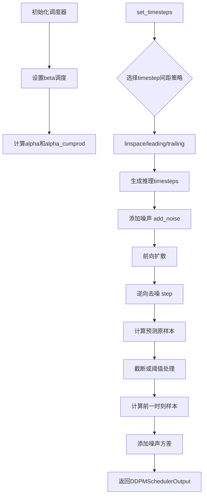
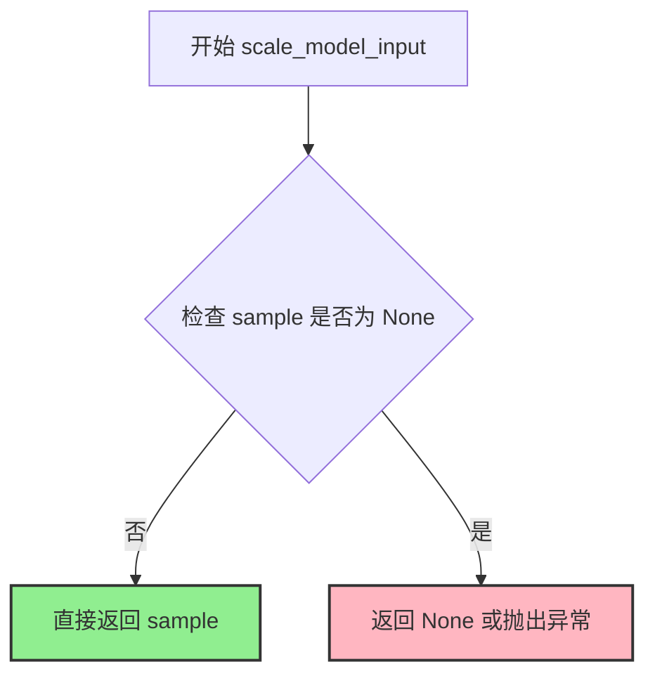
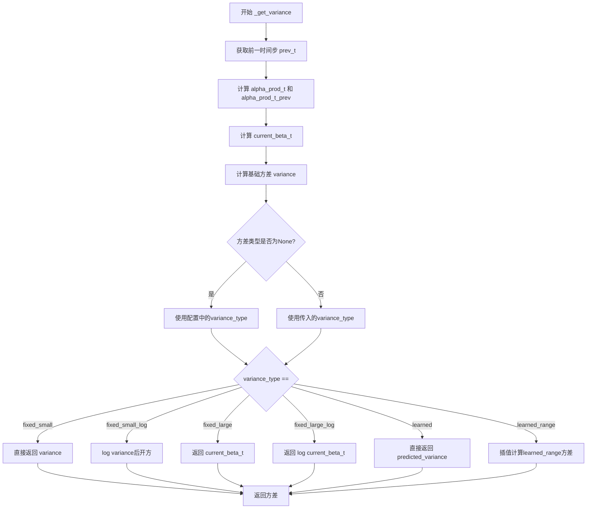
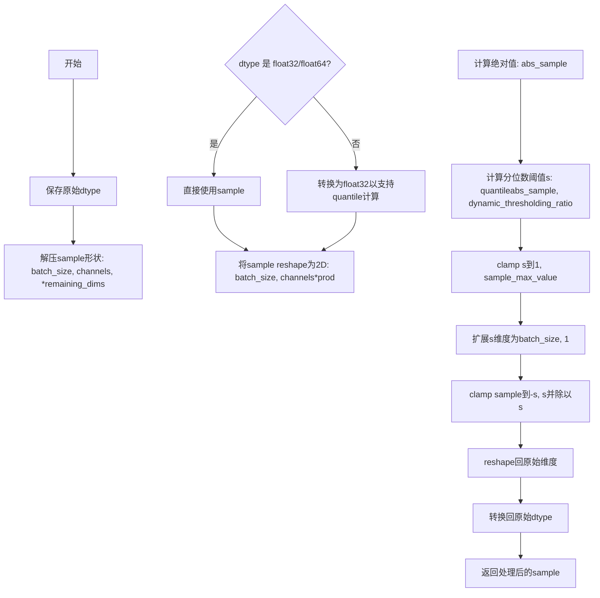
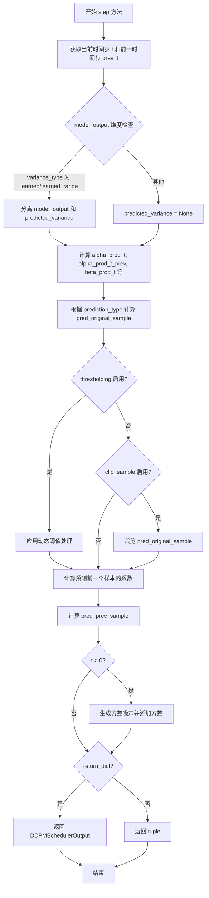
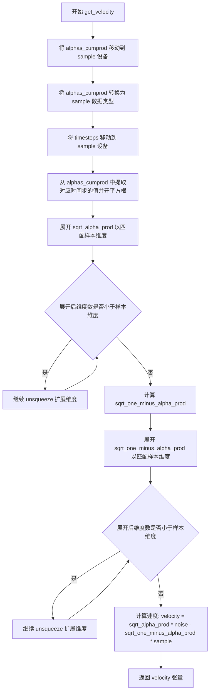
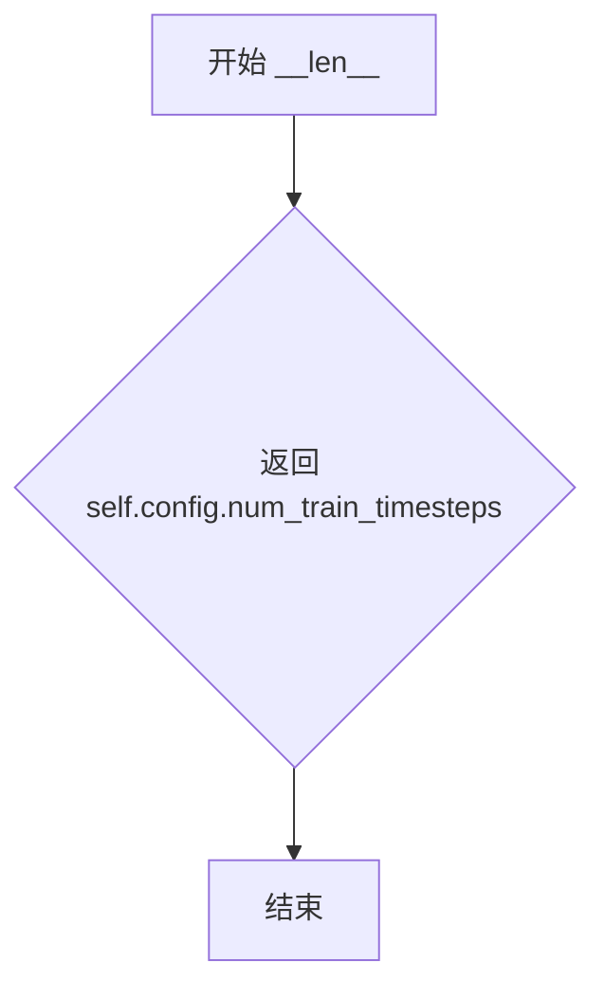

# `diffusers\src\diffusers\schedulers\scheduling_ddpm.py` 详细设计文档

DDPMScheduler 是一个基于去噪扩散概率模型(DDPM)的调度器实现了噪声调度、采样步数设置、前向扩散过程添加噪声、逆向去噪过程预测样本等功能，支持多种噪声调度策略和预测类型。

## 整体流程



## 类结构

```
SchedulerMixin (混入基类)
├── ConfigMixin (配置混入)
└── DDPMScheduler (DDPM调度器)
    └── DDPMSchedulerOutput (输出数据类)
```

## 全局变量及字段


### `_compatibles`
    
Compatible schedulers list from KarrasDiffusionSchedulers enum

类型：`list[str]`
    


### `order`
    
Order of the scheduler, set to 1 for DDPM

类型：`int`
    


### `DDPMSchedulerOutput.prev_sample`
    
上一步计算得到的样本

类型：`torch.Tensor`
    


### `DDPMSchedulerOutput.pred_original_sample`
    
预测的原始干净样本

类型：`torch.Tensor | None`
    


### `DDPMScheduler.betas`
    
beta调度序列

类型：`torch.Tensor`
    


### `DDPMScheduler.alphas`
    
alpha值 (1-beta)

类型：`torch.Tensor`
    


### `DDPMScheduler.alphas_cumprod`
    
alpha累积乘积

类型：`torch.Tensor`
    


### `DDPMScheduler.one`
    
常量1.0张量

类型：`torch.Tensor`
    


### `DDPMScheduler.init_noise_sigma`
    
初始噪声标准差

类型：`float`
    


### `DDPMScheduler.custom_timesteps`
    
是否使用自定义timestep

类型：`bool`
    


### `DDPMScheduler.num_inference_steps`
    
推理步数

类型：`int | None`
    


### `DDPMScheduler.timesteps`
    
timesteps序列

类型：`torch.Tensor`
    


### `DDPMScheduler.variance_type`
    
方差类型

类型：`str`
    
    

## 全局函数及方法


### `betas_for_alpha_bar`

该函数用于创建beta调度表，将给定的alpha_t_bar函数离散化。alpha_t_bar定义了扩散过程中从t=[0,1]的(1-beta)的累积乘积。根据指定的alpha_transform_type类型（cosine、exp或laplace），计算相应的alpha_bar函数，并在每个时间步计算对应的beta值，确保不超过max_beta以避免数值不稳定。

参数：

- `num_diffusion_timesteps`：`int`，要生成的beta数量
- `max_beta`：`float`，默认为`0.999`，使用的最大beta值以避免数值不稳定
- `alpha_transform_type`：`Literal["cosine", "exp", "laplace"]`，默认为`"cosine"`，alpha_bar的噪声调度类型

返回值：`torch.Tensor`，调度器用于逐步模型输出的beta值

#### 流程图

```mermaid
flowchart TD
    A[开始 betas_for_alpha_bar] --> B{alpha_transform_type == 'cosine'?}
    B -->|Yes| C[定义 alpha_bar_fn: cos²((t+0.008)/1.008 * π/2)]
    B -->|No| D{alpha_transform_type == 'laplace'?}
    D -->|Yes| E[定义 alpha_bar_fn: Laplace变换]
    D -->|No| F{alpha_transform_type == 'exp'?}
    F -->|Yes| G[定义 alpha_bar_fn: exp(-12.0*t)]
    F -->|No| H[抛出 ValueError: 不支持的类型]
    
    C --> I[初始化空列表 betas]
    E --> I
    G --> I
    
    I --> J[循环 i 从 0 到 num_diffusion_timesteps-1]
    J --> K[计算 t1 = i / num_diffusion_timesteps]
    J --> L[计算 t2 = (i + 1) / num_diffusion_timesteps]
    K --> M[计算 beta_i = min(1 - alpha_bar_fn(t2) / alpha_bar_fn(t1), max_beta)]
    L --> M
    M --> N[添加 beta_i 到 betas 列表]
    N --> O{还有更多时间步?}
    O -->|Yes| J
    O -->|No| P[返回 torch.tensor(betas, dtype=torch.float32)]
```

#### 带注释源码

```python
def betas_for_alpha_bar(
    num_diffusion_timesteps: int,
    max_beta: float = 0.999,
    alpha_transform_type: Literal["cosine", "exp", "laplace"] = "cosine",
) -> torch.Tensor:
    """
    Create a beta schedule that discretizes the given alpha_t_bar function, which defines the cumulative product of
    (1-beta) over time from t = [0,1].

    Contains a function alpha_bar that takes an argument t and transforms it to the cumulative product of (1-beta) up
    to that part of the diffusion process.

    Args:
        num_diffusion_timesteps (`int`):
            The number of betas to produce.
        max_beta (`float`, defaults to `0.999`):
            The maximum beta to use; use values lower than 1 to avoid numerical instability.
        alpha_transform_type (`str`, defaults to `"cosine"`):
            The type of noise schedule for `alpha_bar`. Choose from `cosine`, `exp`, or `laplace`.

    Returns:
        `torch.Tensor`:
            The betas used by the scheduler to step the model outputs.
    """
    # 根据alpha_transform_type选择对应的alpha_bar函数
    if alpha_transform_type == "cosine":
        # cosine调度：使用余弦函数的平方来创建平滑的噪声调度
        def alpha_bar_fn(t):
            return math.cos((t + 0.008) / 1.008 * math.pi / 2) ** 2

    elif alpha_transform_type == "laplace":
        # laplace调度：使用拉普拉斯分布的逆函数
        def alpha_bar_fn(t):
            # 计算lambda参数 - 使用copysign确保符号正确
            lmb = -0.5 * math.copysign(1, 0.5 - t) * math.log(1 - 2 * math.fabs(0.5 - t) + 1e-6)
            # 计算信号噪声比(SNR)
            snr = math.exp(lmb)
            # 返回sqrt(snr / (1 + snr))
            return math.sqrt(snr / (1 + snr))

    elif alpha_transform_type == "exp":
        # 指数调度：使用指数衰减函数
        def alpha_bar_fn(t):
            return math.exp(t * -12.0)

    else:
        # 如果传入了不支持的类型，抛出错误
        raise ValueError(f"Unsupported alpha_transform_type: {alpha_transform_type}")

    # 初始化betas列表用于存储计算得到的beta值
    betas = []
    # 遍历每个扩散时间步
    for i in range(num_diffusion_timesteps):
        # 计算当前时间步的起始点t1和结束点t2
        t1 = i / num_diffusion_timesteps
        t2 = (i + 1) / num_diffusion_timesteps
        
        # 计算beta值：通过alpha_bar函数的比值来离散化
        # beta = 1 - alpha_bar(t2) / alpha_bar(t1)
        # 并使用max_beta限制最大beta值以避免数值不稳定
        betas.append(min(1 - alpha_bar_fn(t2) / alpha_bar_fn(t1), max_beta))
    
    # 将betas列表转换为PyTorch张量并返回
    return torch.tensor(betas, dtype=torch.float32)
```


### `rescale_zero_terminal_snr`

该函数用于重新缩放扩散调度器中的beta值，使其具有零终端信噪比（SNR）。基于论文https://huggingface.co/papers/2305.08891 (Algorithm 1)实现，通过数学变换将beta值进行调整，确保最后一个时间步的信噪比为0，从而支持模型生成非常明亮或非常暗的样本，而不是限制在中等亮度的样本。

参数：

- `betas`：`torch.Tensor`，调度器初始化时的beta值序列

返回值：`torch.Tensor`，具有零终端SNR的重新缩放后的beta值

#### 流程图

```mermaid
flowchart TD
    A[开始: 输入 betas] --> B[计算 alphas = 1 - betas]
    B --> C[计算累积乘积 alphas_cumprod]
    C --> D[计算 alphas_bar_sqrt = sqrt(alphas_cumprod)]
    D --> E[保存原始值: alphas_bar_sqrt_0 和 alphas_bar_sqrt_T]
    E --> F[移位操作: alphas_bar_sqrt -= alphas_bar_sqrt_T]
    F --> G[缩放操作: alphas_bar_sqrt *= alphas_bar_sqrt_0 / (alphas_bar_sqrt_0 - alphas_bar_sqrt_T)]
    G --> H[反转平方: alphas_bar = alphas_bar_sqrt²]
    H --> I[反转累积乘积: alphas = alphas_bar[1:] / alphas_bar[:-1]]
    I --> J[拼接: alphas = concat(alphas_bar[0:1], alphas)]
    J --> K[计算 betas = 1 - alphas]
    K --> L[返回: 重新缩放后的 betas]
```

#### 带注释源码

```python
# Copied from diffusers.schedulers.scheduling_ddim.rescale_zero_terminal_snr
def rescale_zero_terminal_snr(betas: torch.Tensor) -> torch.Tensor:
    """
    Rescales betas to have zero terminal SNR Based on https://huggingface.co/papers/2305.08891 (Algorithm 1)

    Args:
        betas (`torch.Tensor`):
            The betas that the scheduler is being initialized with.

    Returns:
        `torch.Tensor`:
            Rescaled betas with zero terminal SNR.
    """
    # 将betas转换为alphas（α_t = 1 - β_t）
    # alphas 代表每一步的噪声保留率
    alphas = 1.0 - betas
    
    # 计算累积乘积 α_bar_t = ∏_{i=1}^{t} α_i
    # 这是论文中定义的累积噪声保留率
    alphas_cumprod = torch.cumprod(alphas, dim=0)
    
    # 取平方根得到 α_bar_t^(1/2)
    # 这是用于后续计算的中间变量
    alphas_bar_sqrt = alphas_cumprod.sqrt()

    # 保存原始值用于后续缩放恢复
    # alphas_bar_sqrt_0: 第一个时间步的α_bar^(1/2)值
    # alphas_bar_sqrt_T: 最后一个时间步的α_bar^(1/2)值（即终端SNR相关）
    alphas_bar_sqrt_0 = alphas_bar_sqrt[0].clone()
    alphas_bar_sqrt_T = alphas_bar_sqrt[-1].clone()

    # 移位操作：将最后一步设为零
    # 这样确保终端信噪比为0
    alphas_bar_sqrt -= alphas_bar_sqrt_T

    # 缩放操作：将第一步恢复到原始值
    # 通过线性变换确保缩放前后的起始点一致
    alphas_bar_sqrt *= alphas_bar_sqrt_0 / (alphas_bar_sqrt_0 - alphas_bar_sqrt_T)

    # 将alphas_bar_sqrt转换回alphas_bar（平方操作）
    alphas_bar = alphas_bar_sqrt**2  # Revert sqrt
    
    # 通过相邻元素比值反转累积乘积
    # α_t = α_bar_t / α_bar_{t-1}
    alphas = alphas_bar[1:] / alphas_bar[:-1]  # Revert cumprod
    
    # 重新添加第一个时间步的alpha值
    # 使用α_bar_0作为α_0的近似
    alphas = torch.cat([alphas_bar[0:1], alphas])
    
    # 最终转换回betas：β_t = 1 - α_t
    betas = 1 - alphas

    return betas
```


### DDPMScheduler.__init__

该方法是 DDPMScheduler 类的构造函数，负责初始化扩散模型调度器的所有配置参数，包括beta调度、方差类型、采样策略等，并预先计算alphas和betas等关键变量，为后续的扩散过程提供必要的参数支持。

参数：

- `self`：隐式参数，表示DDPMScheduler类的实例本身
- `num_train_timesteps`：`int`，训练时的扩散步数，默认为1000
- `beta_start`：`float`，beta调度起始值，默认为0.0001
- `beta_end`：`float`，beta调度结束值，默认为0.02
- `beta_schedule`：`Literal["linear", "scaled_linear", "squaredcos_cap_v2", "sigmoid"]`，beta调度策略，默认为"linear"
- `traated_betas`：`np.ndarray | list[float] | None`，可选的直接传入的betas数组，默认为None
- `variance_type`：`Literal["fixed_small", "fixed_small_log", "fixed_large", "fixed_large_log", "learned", "learned_range"]`，方差类型，默认为"fixed_small"
- `clip_sample`：`bool`，是否对预测样本进行裁剪，默认为True
- `prediction_type`：`Literal["epsilon", "sample", "v_prediction"]`，预测类型，默认为"epsilon"
- `thresholding`：`bool`，是否使用动态阈值，默认为False
- `dynamic_thresholding_ratio`：`float`，动态阈值比例，默认为0.995
- `clip_sample_range`：`float`，样本裁剪范围，默认为1.0
- `sample_max_value`：`float`，样本最大值，默认为1.0
- `timestep_spacing`：`Literal["linspace", "leading", "trailing"]`，时间步间距策略，默认为"leading"
- `steps_offset`：`int`，推理步数偏移量，默认为0
- `rescale_betas_zero_snr`：`bool`，是否重缩放betas为零终端SNR，默认为False

返回值：`None`，构造函数不返回任何值

#### 流程图

```mermaid
flowchart TD
    A[开始 __init__] --> B{trained_betas 是否为 None?}
    B -->|否| C[直接使用 trained_betas 创建 betas 张量]
    B -->|是| D{beta_schedule 类型?}
    D -->|linear| E[使用 torch.linspace 创建 betas]
    D -->|scaled_linear| F[使用 sqrt 后平方创建 betas]
    D -->|squaredcos_cap_v2| G[使用 betas_for_alpha_bar 创建 betas]
    D -->|laplace| H[使用 betas_for_alpha_bar alpha_transform_type=laplace]
    D -->|sigmoid| I[使用 sigmoid 函数创建 betas]
    C --> J
    E --> J
    F --> J
    G --> J
    H --> J
    I --> J
    J{rescale_betas_zero_snr?}
    J -->|是| K[调用 rescale_zero_terminal_snr 重缩放 betas]
    J -->|否| L
    K --> L
    L[计算 alphas = 1.0 - betas]
    M[计算 alphas_cumprod = torch.cumprod]
    N[设置 one = torch.tensor(1.0)]
    O[设置 init_noise_sigma = 1.0]
    P[初始化 custom_timesteps = False]
    Q[初始化 num_inference_steps = None]
    R[设置 timesteps 数组]
    S[设置 variance_type]
    T[结束 __init__]
```

#### 带注释源码

```python
@register_to_config
def __init__(
    self,
    num_train_timesteps: int = 1000,
    beta_start: float = 0.0001,
    beta_end: float = 0.02,
    beta_schedule: Literal["linear", "scaled_linear", "squaredcos_cap_v2", "sigmoid"] = "linear",
    trained_betas: np.ndarray | list[float] | None = None,
    variance_type: Literal[
        "fixed_small",
        "fixed_small_log",
        "fixed_large",
        "fixed_large_log",
        "learned",
        "learned_range",
    ] = "fixed_small",
    clip_sample: bool = True,
    prediction_type: Literal["epsilon", "sample", "v_prediction"] = "epsilon",
    thresholding: bool = False,
    dynamic_thresholding_ratio: float = 0.995,
    clip_sample_range: float = 1.0,
    sample_max_value: float = 1.0,
    timestep_spacing: Literal["linspace", "leading", "trailing"] = "leading",
    steps_offset: int = 0,
    rescale_betas_zero_snr: bool = False,
):
    # 如果直接提供了 betas，则使用提供的 betas
    if trained_betas is not None:
        self.betas = torch.tensor(trained_betas, dtype=torch.float32)
    # 根据 beta_schedule 选择不同的调度策略
    elif beta_schedule == "linear":
        # 线性调度：从 beta_start 线性增加到 beta_end
        self.betas = torch.linspace(beta_start, beta_end, num_train_timesteps, dtype=torch.float32)
    elif beta_schedule == "scaled_linear":
        # 缩放线性调度，用于潜在扩散模型
        # 先在 sqrt 空间线性插值，再平方
        self.betas = (
            torch.linspace(
                beta_start**0.5,
                beta_end**0.5,
                num_train_timesteps,
                dtype=torch.float32,
            )
            ** 2
        )
    elif beta_schedule == "squaredcos_cap_v2":
        # Glide 余弦调度
        self.betas = betas_for_alpha_bar(num_train_timesteps)
    elif beta_schedule == "laplace":
        # 拉普拉斯调度
        self.betas = betas_for_alpha_bar(num_train_timesteps, alpha_transform_type="laplace")
    elif beta_schedule == "sigmoid":
        # GeoDiff sigmoid 调度
        betas = torch.linspace(-6, 6, num_train_timesteps)
        self.betas = torch.sigmoid(betas) * (beta_end - beta_start) + beta_start
    else:
        raise NotImplementedError(f"{beta_schedule} is not implemented for {self.__class__}")

    # 如果需要重缩放为零终端 SNR
    if rescale_betas_zero_snr:
        self.betas = rescale_zero_terminal_snr(self.betas)

    # 计算 alphas：1 - betas
    self.alphas = 1.0 - self.betas
    # 计算累积乘积 alphas_cumprod
    self.alphas_cumprod = torch.cumprod(self.alphas, dim=0)
    # 创建一个值为1的张量，用于边界条件处理
    self.one = torch.tensor(1.0)

    # 初始噪声分布的标准差
    self.init_noise_sigma = 1.0

    # 可设置的值
    self.custom_timesteps = False  # 是否使用自定义时间步
    self.num_inference_steps = None  # 推理步数
    # 创建时间步数组：从 num_train_timesteps-1 到 0 降序排列
    self.timesteps = torch.from_numpy(np.arange(0, num_train_timesteps)[::-1].copy())

    # 设置方差类型
    self.variance_type = variance_type
```


### `DDPMScheduler.scale_model_input`

该方法用于确保与其他需要根据当前时间步对去噪模型输入进行缩放的调度器的接口兼容性。在 DDPMScheduler 中，此方法直接返回原始样本而不进行任何缩放操作，这是一个占位实现，为保持调度器接口一致性而设计。

参数：

- `sample`：`torch.Tensor`，输入的样本张量
- `timestep`：`int | None`，扩散链中的当前时间步（可选）

返回值：`torch.Tensor`，缩放后的输入样本（在此实现中直接返回原始样本）

#### 流程图



#### 带注释源码

```python
def scale_model_input(self, sample: torch.Tensor, timestep: int | None = None) -> torch.Tensor:
    """
    Ensures interchangeability with schedulers that need to scale the denoising model input depending on the
    current timestep.

    该方法的主要目的是为不同的调度器提供统一的接口。在某些调度器（如 DDIMScheduler）中，
    需要根据当前时间步对输入进行缩放（例如乘以某个系数），以确保去噪过程的一致性。
    而在 DDPMScheduler 中，此操作被简化处理。

    Args:
        sample (`torch.Tensor`):
            The input sample. 输入的样本张量，通常是噪声样本或去噪过程中的中间结果
        timestep (`int`, *optional*):
            The current timestep in the diffusion chain. 扩散链中的当前时间步，
            虽然此参数在当前实现中未被使用，但保留此参数以保持接口兼容性

    Returns:
        `torch.Tensor`:
            A scaled input sample. 返回缩放后的样本。
            在当前实现中，由于 DDPMScheduler 不需要对输入进行缩放，
            因此直接返回原始的 sample 参数
    """
    # 直接返回输入样本，不进行任何处理
    # 这是因为 DDPMScheduler 的采样过程不需要对模型输入进行缩放
    # 其他调度器（如 DDIMScheduler）可能会根据 timestep 计算缩放系数
    return sample
```


### `DDPMScheduler.set_timesteps`

该方法用于设置扩散链中使用的离散时间步（在推理之前运行），支持自定义时间步或根据推理步数自动生成时间步序列，并可根据配置的间隔策略（linspace/leading/trailing）进行时间步缩放。

参数：

- `self`：`DDPMScheduler`，调度器实例本身
- `num_inference_steps`：`int | None`，生成样本时使用的扩散步数，如果使用此参数则 `timesteps` 必须为 `None`
- `device`：`str | torch.device | None`，时间步要移动到的设备，如果为 `None` 则不移动
- `timesteps`：`list[int] | None`，自定义时间步列表，用于支持任意间隔的时间步，如果为 `None` 则使用默认的等间距策略

返回值：`None`，该方法直接修改调度器实例的内部状态，不返回值

#### 流程图

```mermaid
flowchart TD
    A[开始 set_timesteps] --> B{num_inference_steps 和 timesteps 都非空?}
    B -->|是| C[抛出 ValueError]
    B -->|否| D{timesteps 非空?}
    D -->|是| E[验证 timesteps 降序]
    E --> F{timesteps[0] >= num_train_timesteps?}
    F -->|是| G[抛出 ValueError]
    F -->|否| H[转换为 numpy 数组]
    H --> I[设置 custom_timesteps = True]
    I --> Z[转到设置 timesteps]
    D -->|否| J{num_inference_steps > num_train_timesteps?}
    J -->|是| K[抛出 ValueError]
    J -->|否| L[设置 num_inference_steps]
    L --> M[设置 custom_timesteps = False]
    M --> N{timestep_spacing 类型?}
    N -->|linspace| O[使用 np.linspace 生成时间步]
    N -->|leading| P[使用等间距乘以步长生成]
    N -->|trailing| Q[使用反向等间距生成]
    N -->|其他| R[抛出 ValueError]
    O --> Z
    P --> Z
    Q --> Z
    Z[将 timesteps 转为 Tensor 并移到 device] --> END[结束]
```

#### 带注释源码

```
def set_timesteps(
    self,
    num_inference_steps: int = None,
    device: str | torch.device = None,
    timesteps: list[int] | None = None,
):
    """
    Sets the discrete timesteps used for the diffusion chain (to be run before inference).

    Args:
        num_inference_steps (`int`, *optional*):
            The number of diffusion steps used when generating samples with a pre-trained model. If used,
            `timesteps` must be `None`.
        device (`str` or `torch.device`, *optional*):
            The device to which the timesteps should be moved to. If `None`, the timesteps are not moved.
        timesteps (`list[int]`, *optional*):
            Custom timesteps used to support arbitrary spacing between timesteps. If `None`, then the default
            timestep spacing strategy of equal spacing between timesteps is used. If `timesteps` is passed,
            `num_inference_steps` must be `None`.

    """
    # 参数互斥检查：num_inference_steps 和 timesteps 不能同时传递
    if num_inference_steps is not None and timesteps is not None:
        raise ValueError("Can only pass one of `num_inference_steps` or `custom_timesteps`.")

    # 处理自定义时间步的情况
    if timesteps is not None:
        # 验证时间步必须按降序排列
        for i in range(1, len(timesteps)):
            if timesteps[i] >= timesteps[i - 1]:
                raise ValueError("`custom_timesteps` must be in descending order.")

        # 验证第一个时间步不能超过训练时间步总数
        if timesteps[0] >= self.config.num_train_timesteps:
            raise ValueError(
                f"`timesteps` must start before `self.config.train_timesteps`: {self.config.num_train_timesteps}."
            )

        # 转换为 numpy 数组并标记使用自定义时间步
        timesteps = np.array(timesteps, dtype=np.int64)
        self.custom_timesteps = True
    else:
        # 处理自动生成时间步的情况
        # 验证推理步数不能超过训练步数
        if num_inference_steps > self.config.num_train_timesteps:
            raise ValueError(
                f"`num_inference_steps`: {num_inference_steps} cannot be larger than `self.config.train_timesteps`:"
                f" {self.config.num_train_timesteps} as the unet model trained with this scheduler can only handle"
                f" maximal {self.config.num_train_timesteps} timesteps."
            )

        self.num_inference_steps = num_inference_steps
        self.custom_timesteps = False

        # 根据配置的间隔策略生成时间步
        # "linspace", "leading", "trailing" 对应 Common Diffusion Noise Schedules and Sample Steps are Flawed 论文表2
        if self.config.timestep_spacing == "linspace":
            # 等间距策略：从 0 到 num_train_timesteps-1 均匀分布，然后翻转
            timesteps = (
                np.linspace(0, self.config.num_train_timesteps - 1, num_inference_steps)
                .round()[::-1]
                .copy()
                .astype(np.int64)
            )
        elif self.config.timestep_spacing == "leading":
            # 前导策略：步长为整除结果，时间步从大到小排列，加上偏移
            step_ratio = self.config.num_train_timesteps // self.num_inference_steps
            # 创建整数时间步：乘以步长后取整
            # 转换为 int 以避免当 num_inference_steps 是 3 的幂时出现问题
            timesteps = (np.arange(0, num_inference_steps) * step_ratio).round()[::-1].copy().astype(np.int64)
            timesteps += self.config.steps_offset
        elif self.config.timestep_spacing == "trailing":
            # 尾随策略：从 num_train_timesteps 开始向下生成
            step_ratio = self.config.num_train_timesteps / self.num_inference_steps
            # 创建整数时间步：乘以步长后取整
            # 转换为 int 以避免当 num_inference_steps 是 3 的幂时出现问题
            timesteps = np.round(np.arange(self.config.num_train_timesteps, 0, -step_ratio)).astype(np.int64)
            timesteps -= 1
        else:
            raise ValueError(
                f"{self.config.timestep_spacing} is not supported. Please make sure to choose one of 'linspace', 'leading' or 'trailing'."
            )

    # 将时间步转换为 PyTorch Tensor 并移动到指定设备
    self.timesteps = torch.from_numpy(timesteps).to(device)
```


### `DDPMScheduler._get_variance`

该方法根据指定的方差类型计算给定时间步的方差值，是DDPMScheduler在反向扩散过程中计算噪声方差的关键步骤。

参数：

- `self`：隐式参数，DDPMScheduler类的实例，包含alphas_cumprod等预计算的扩散参数
- `t`：`int`，当前时间步（timestep）
- `predicted_variance`：`torch.Tensor | None`，模型预测的方差，仅当`variance_type`为"learned"或"learned_range"时使用
- `variance_type`：`Literal["fixed_small", "fixed_small_log", "fixed_large", "fixed_large_log", "learned", "learned_range"] | None`，方差计算类型，如果为None则使用scheduler配置中的variance_type

返回值：`torch.Tensor`，计算得到的方差值

#### 流程图



#### 带注释源码

```python
def _get_variance(
    self,
    t: int,
    predicted_variance: torch.Tensor | None = None,
    variance_type: Literal[
        "fixed_small",
        "fixed_small_log",
        "fixed_large",
        "fixed_large_log",
        "learned",
        "learned_range",
    ]
    | None = None,
) -> torch.Tensor:
    """
    Compute the variance for a given timestep according to the specified variance type.

    Args:
        t (`int`):
            The current timestep.
        predicted_variance (`torch.Tensor`, *optional*):
            The predicted variance from the model. Used only when `variance_type` is `"learned"` or
            `"learned_range"`.
        variance_type (`"fixed_small"`, `"fixed_small_log"`, `"fixed_large"`, `"fixed_large_log"`, `"learned"`, or `"learned_range"`, *optional*):
            The type of variance to compute. If `None`, uses the variance type specified in the scheduler
            configuration.

    Returns:
        `torch.Tensor`:
            The computed variance.
    """
    # 获取前一时间步，用于计算alpha_prod_t_prev
    prev_t = self.previous_timestep(t)

    # 获取累积alpha值（从0到t的累积乘积）
    alpha_prod_t = self.alphas_cumprod[t]
    # 如果prev_t >= 0，获取前一时间步的累积alpha值；否则使用self.one（即1.0）
    alpha_prod_t_prev = self.alphas_cumprod[prev_t] if prev_t >= 0 else self.one
    # 计算当前时间步的beta值（1 - alpha_prod_t / alpha_prod_t_prev）
    current_beta_t = 1 - alpha_prod_t / alpha_prod_t_prev

    # 对于 t > 0，计算预测方差 βt（参考DDPM论文公式6和7）
    # 从预测的前一样本分布中采样：x_{t-1} ~ N(pred_prev_sample, variance)
    # 即向pred_sample添加方差
    # 公式：variance = (1 - α_{t-1}) / (1 - α_t) * β_t
    variance = (1 - alpha_prod_t_prev) / (1 - alpha_prod_t) * current_beta_t

    # 对方差取对数，为防止对数为0，添加最小值限制
    variance = torch.clamp(variance, min=1e-20)

    # 如果未指定variance_type，则使用配置中的默认值
    if variance_type is None:
        variance_type = self.config.variance_type

    # 根据variance_type处理方差（这些hack可能是为了训练稳定性）
    # fixed_small：直接返回计算的方差（无操作）
    if variance_type == "fixed_small":
        variance = variance
    # fixed_small_log：用于rl-diffuser，对方差取对数后再开方
    elif variance_type == "fixed_small_log":
        variance = torch.log(variance)
        variance = torch.exp(0.5 * variance)
    # fixed_large：直接使用current_beta_t作为方差
    elif variance_type == "fixed_large":
        variance = current_beta_t
    # fixed_large_log：Glide max_log版本，取对数
    elif variance_type == "fixed_large_log":
        # Glide max_log
        variance = torch.log(current_beta_t)
    # learned：直接返回模型预测的方差
    elif variance_type == "learned":
        return predicted_variance
    # learned_range：在variance和current_beta_t的对数空间进行插值
    elif variance_type == "learned_range":
        min_log = torch.log(variance)
        max_log = torch.log(current_beta_t)
        # 将predicted_variance从[-1,1]映射到[0,1]进行插值
        frac = (predicted_variance + 1) / 2
        variance = frac * max_log + (1 - frac) * min_log

    return variance
```


### `DDPMScheduler._threshold_sample`

对预测样本应用动态阈值处理（Dynamic Thresholding）。该方法根据当前批次样本的绝对值分位数计算动态阈值s，当s>1时将样本限制在[-s, s]范围内并除以s，以防止像素饱和并提升生成图像的真实感和文本对齐效果。

参数：

- `sample`：`torch.Tensor`，需要被阈值处理的预测样本张量

返回值：`torch.Tensor`，经过阈值处理后的样本张量

#### 流程图



#### 带注释源码

```python
def _threshold_sample(self, sample: torch.Tensor) -> torch.Tensor:
    """
    Apply dynamic thresholding to the predicted sample.

    "Dynamic thresholding: At each sampling step we set s to a certain percentile absolute pixel value in xt0 (the
    prediction of x_0 at timestep t), and if s > 1, then we threshold xt0 to the range [-s, s] and then divide by
    s. Dynamic thresholding pushes saturated pixels (those near -1 and 1) inwards, thereby actively preventing
    pixels from saturation at each step. We find that dynamic thresholding results in significantly better
    photorealism as well as better image-text alignment, especially when using very large guidance weights."

    https://huggingface.co/papers/2205.11487

    Args:
        sample (`torch.Tensor`):
            The predicted sample to be thresholded.

    Returns:
        `torch.Tensor`:
            The thresholded sample.
    """
    # 保存原始数据类型，以便最后恢复
    dtype = sample.dtype
    # 解包样本形状：batch_size, channels, 以及其余维度
    batch_size, channels, *remaining_dims = sample.shape

    # 如果数据类型不是float32或float64，则需要转换为float32
    # 原因：quantile计算需要浮点数类型，且cpu half类型不支持clamp操作
    if dtype not in (torch.float32, torch.float64):
        sample = sample.float()  # upcast for quantile calculation, and clamp not implemented for cpu half

    # 将样本reshape为2D张量，以便沿每个图像进行分位数计算
    # 从 (batch, channels, H, W) 变为 (batch, channels*H*W)
    sample = sample.reshape(batch_size, channels * np.prod(remaining_dims))

    # 计算绝对值样本："a certain percentile absolute pixel value"
    abs_sample = sample.abs()

    # 计算动态阈值s：取abs_sample的dynamic_thresholding_ratio分位数
    # dynamic_thresholding_ratio默认值为0.995
    s = torch.quantile(abs_sample, self.config.dynamic_thresholding_ratio, dim=1)
    
    # 将s限制在[1, sample_max_value]范围内
    # 当min=1时，等价于标准的clip到[-1, 1]
    s = torch.clamp(
        s, min=1, max=self.config.sample_max_value
    )  # When clamped to min=1, equivalent to standard clipping to [-1, 1]
    
    # 扩展s的维度为(batch_size, 1)，以便在dim=0上广播
    s = s.unsqueeze(1)  # (batch_size, 1) because clamp will broadcast along dim=0
    
    # 对样本进行阈值处理："we threshold xt0 to the range [-s, s] and then divide by s"
    sample = torch.clamp(sample, -s, s) / s

    # 将样本reshape回原始形状：(batch, channels, H, W)
    sample = sample.reshape(batch_size, channels, *remaining_dims)
    
    # 转换回原始数据类型
    sample = sample.to(dtype)

    return sample
```


### `DDPMScheduler.step`

该方法是DDPMScheduler的核心方法，负责通过反转随机微分方程（SDE）来预测上一个时间步的样本。它根据学习到的扩散模型输出（通常是预测的噪声）推进扩散过程，执行去噪推理步骤，计算原始样本预测值，并根据DDPM算法公式计算前一个样本，同时可选择添加噪声以保持随机性。

参数：

- `model_output`：`torch.Tensor`，学习到的扩散模型的直接输出（通常是预测的噪声）
- `timestep`：`int`，扩散链中的当前离散时间步
- `sample`：`torch.Tensor`，扩散过程创建的当前样本实例
- `generator`：`torch.Generator | None`，可选的随机数生成器，用于可重现的采样
- `return_dict`：`bool`，默认为`True`，是否返回`DDPMSchedulerOutput`或元组

返回值：`DDPMSchedulerOutput | tuple`，如果`return_dict`为`True`返回`DDPMSchedulerOutput`对象，否则返回元组（包含前一个样本和预测的原始样本）

#### 流程图



#### 带注释源码

```python
def step(
    self,
    model_output: torch.Tensor,
    timestep: int,
    sample: torch.Tensor,
    generator: torch.Generator | None = None,
    return_dict: bool = True,
) -> DDPMSchedulerOutput | tuple:
    """
    Predict the sample from the previous timestep by reversing the SDE. This function propagates the diffusion
    process from the learned model outputs (most often the predicted noise).

    Args:
        model_output (`torch.Tensor`):
            The direct output from learned diffusion model.
        timestep (`int`):
            The current discrete timestep in the diffusion chain.
        sample (`torch.Tensor`):
            A current instance of a sample created by the diffusion process.
        generator (`torch.Generator`, *optional*):
            A random number generator.
        return_dict (`bool`, defaults to `True`):
            Whether or not to return a [`~schedulers.scheduling_ddpm.DDPMSchedulerOutput`] or `tuple`.

    Returns:
        [`~schedulers.scheduling_ddpm.DDPMSchedulerOutput`] or `tuple`:
            If return_dict is `True`, [`~schedulers.scheduling_ddpm.DDPMSchedulerOutput`] is returned, otherwise a
            tuple is returned where the first element is the sample tensor.
    """
    t = timestep  # 当前时间步

    # 计算前一时间步
    prev_t = self.previous_timestep(t)

    # 1. 处理预测方差（当使用 learned 或 learned_range 方差类型时）
    # 如果模型输出是预测方差的两倍，则将其拆分
    if model_output.shape[1] == sample.shape[1] * 2 and self.variance_type in [
        "learned",
        "learned_range",
    ]:
        model_output, predicted_variance = torch.split(model_output, sample.shape[1], dim=1)
    else:
        predicted_variance = None

    # 2. 计算 alpha 和 beta 值
    # alpha_prod_t: 累积 alpha 乘积
    alpha_prod_t = self.alphas_cumprod[t]
    # alpha_prod_t_prev: 前一时间步的累积 alpha 乘积（如果存在）
    alpha_prod_t_prev = self.alphas_cumprod[prev_t] if prev_t >= 0 else self.one
    # beta_prod_t: 累积 beta 乘积
    beta_prod_t = 1 - alpha_prod_t
    beta_prod_t_prev = 1 - alpha_prod_t_prev
    # 当前时间步的 alpha 和 beta
    current_alpha_t = alpha_prod_t / alpha_prod_t_prev
    current_beta_t = 1 - current_alpha_t

    # 3. 根据预测类型计算原始样本 x_0
    # 这是公式 (15) 的变体，来自 https://huggingface.co/papers/2006.11239
    if self.config.prediction_type == "epsilon":
        # epsilon 预测：预测噪声
        # x_0 = (x_t - sqrt(beta_t) * epsilon) / sqrt(alpha_t)
        pred_original_sample = (sample - beta_prod_t ** (0.5) * model_output) / alpha_prod_t ** (0.5)
    elif self.config.prediction_type == "sample":
        # sample 预测：直接预测样本
        pred_original_sample = model_output
    elif self.config.prediction_type == "v_prediction":
        # v-prediction：速度预测
        # x_0 = sqrt(alpha_t) * x_t - sqrt(beta_t) * v
        pred_original_sample = (alpha_prod_t**0.5) * sample - (beta_prod_t**0.5) * model_output
    else:
        raise ValueError(
            f"prediction_type given as {self.config.prediction_type} must be one of `epsilon`, `sample` or"
            " `v_prediction`  for the DDPMScheduler."
        )

    # 4. 对预测的 x_0 进行裁剪或阈值处理
    if self.config.thresholding:
        # 动态阈值处理：将饱和像素向内推，防止像素在每步饱和
        pred_original_sample = self._threshold_sample(pred_original_sample)
    elif self.config.clip_sample:
        # 标准裁剪：将预测样本裁剪到指定范围
        pred_original_sample = pred_original_sample.clamp(
            -self.config.clip_sample_range, self.config.clip_sample_range
        )

    # 5. 计算预测原始样本和当前样本的系数
    # 来自公式 (7) from https://huggingface.co/papers/2006.11239
    pred_original_sample_coeff = (alpha_prod_t_prev ** (0.5) * current_beta_t) / beta_prod_t
    current_sample_coeff = current_alpha_t ** (0.5) * beta_prod_t_prev / beta_prod_t

    # 6. 计算预测的前一个样本 µ_t
    # 使用系数对预测的 x_0 和当前样本 x_t 进行加权求和
    pred_prev_sample = pred_original_sample_coeff * pred_original_sample + current_sample_coeff * sample

    # 7. 添加噪声（随机采样步骤）
    variance = 0
    if t > 0:
        device = model_output.device
        # 生成与模型输出形状相同的随机噪声
        variance_noise = randn_tensor(
            model_output.shape,
            generator=generator,
            device=device,
            dtype=model_output.dtype,
        )
        
        # 根据方差类型计算方差并添加噪声
        if self.variance_type == "fixed_small_log":
            # 对数空间的固定小方差
            variance = self._get_variance(t, predicted_variance=predicted_variance) * variance_noise
        elif self.variance_type == "learned_range":
            # 学习范围内的方差，需要指数运算
            variance = self._get_variance(t, predicted_variance=predicted_variance)
            variance = torch.exp(0.5 * variance) * variance_noise
        else:
            # 其他方差类型：标准计算
            variance = (self._get_variance(t, predicted_variance=predicted_variance) ** 0.5) * variance_noise

    # 将方差加到预测的前一个样本上
    pred_prev_sample = pred_prev_sample + variance

    # 8. 返回结果
    if not return_dict:
        return (
            pred_prev_sample,
            pred_original_sample,
        )

    return DDPMSchedulerOutput(prev_sample=pred_prev_sample, pred_original_sample=pred_original_sample)
```


### `DDPMScheduler.add_noise`

该函数实现了扩散模型的前向过程（forward diffusion process），根据给定的时间步将噪声添加到原始样本中。这是DDPM训练阶段的核心操作，通过公式 $x_t = \sqrt{\bar{\alpha}_t}x_0 + \sqrt{1-\bar{\alpha}_t}\epsilon$ 计算带噪样本。

参数：

- `self`：`DDPMScheduler`，调度器实例
- `original_samples`：`torch.Tensor`，原始干净样本
- `noise`：`torch.Tensor`，要添加的噪声
- `timesteps`：`torch.IntTensor`，时间步索引，指示每个样本的噪声水平

返回值：`torch.Tensor`，添加噪声后的样本

#### 流程图

```mermaid
flowchart TD
    A[开始 add_noise] --> B[将 alphas_cumprod 移到 original_samples 的设备]
    C[将 alphas_cumprod 转换为 original_samples 的 dtype]
    D[将 timesteps 移到 original_samples 的设备]
    
    B --> C
    C --> D
    D --> E[计算 sqrt_alpha_prod = alphas_cumprod[timesteps] ** 0.5]
    E --> F[展开并扩展 sqrt_alpha_prod 维度以匹配 original_samples]
    F --> G[计算 sqrt_one_minus_alpha_prod = (1 - alphas_cumprod[timesteps]) ** 0.5]
    G --> H[展开并扩展 sqrt_one_minus_alpha_prod 维度]
    H --> I[计算 noisy_samples = sqrt_alpha_prod * original_samples + sqrt_one_minus_alpha_prod * noise]
    I --> J[返回 noisy_samples]
```

#### 带注释源码

```python
def add_noise(
    self,
    original_samples: torch.Tensor,
    noise: torch.Tensor,
    timesteps: torch.IntTensor,
) -> torch.Tensor:
    """
    Add noise to the original samples according to the noise magnitude at each timestep (this is the forward
    diffusion process).

    Args:
        original_samples (`torch.Tensor`):
            The original samples to which noise will be added.
        noise (`torch.Tensor`):
            The noise to add to the samples.
        timesteps (`torch.IntTensor`):
            The timesteps indicating the noise level for each sample.

    Returns:
        `torch.Tensor`:
            The noisy samples.
    """
    # 确保 alphas_cumprod 和 timestep 与 original_samples 在同一设备上
    # 将 self.alphas_cumprod 移动到设备上，避免后续 add_noise 调用时重复的 CPU 到 GPU 数据移动
    self.alphas_cumprod = self.alphas_cumprod.to(device=original_samples.device)
    alphas_cumprod = self.alphas_cumprod.to(dtype=original_samples.dtype)
    timesteps = timesteps.to(original_samples.device)

    # 计算 sqrt(alpha_cumprod)，即公式中的 sqrt(bar_alpha_t)
    sqrt_alpha_prod = alphas_cumprod[timesteps] ** 0.5
    # 展平以便后续广播操作
    sqrt_alpha_prod = sqrt_alpha_prod.flatten()
    # 扩展维度以匹配 original_samples 的形状（支持批量处理）
    while len(sqrt_alpha_prod.shape) < len(original_samples.shape):
        sqrt_alpha_prod = sqrt_alpha_prod.unsqueeze(-1)

    # 计算 sqrt(1 - alpha_cumprod)，即公式中的 sqrt(1 - bar_alpha_t)
    sqrt_one_minus_alpha_prod = (1 - alphas_cumprod[timesteps]) ** 0.5
    sqrt_one_minus_alpha_prod = sqrt_one_minus_alpha_prod.flatten()
    # 扩展维度以匹配 original_samples 的形状
    while len(sqrt_one_minus_alpha_prod.shape) < len(original_samples.shape):
        sqrt_one_minus_alpha_prod = sqrt_one_minus_alpha_prod.unsqueeze(-1)

    # 计算带噪样本: x_t = sqrt(alpha_cumprod) * x_0 + sqrt(1 - alpha_cumprod) * noise
    noisy_samples = sqrt_alpha_prod * original_samples + sqrt_one_minus_alpha_prod * noise
    return noisy_samples
```


### `DDPMScheduler.get_velocity`

该方法用于根据扩散过程中的速度公式，从样本、噪声和时间步计算速度预测值。这是扩散模型推理过程中用于预测数据流向的关键方法。

参数：

- `self`：`DDPMScheduler` 类实例，隐式参数，调度器本身
- `sample`：`torch.Tensor`，输入样本，即当前 diffusion 过程中的样本
- `noise`：`torch.Tensor`，噪声张量，通常是标准高斯噪声
- `timesteps`：`torch.IntTensor`，用于速度计算的时间步索引

返回值：`torch.Tensor`，计算得到的速度向量

#### 流程图



#### 带注释源码

```python
def get_velocity(self, sample: torch.Tensor, noise: torch.Tensor, timesteps: torch.IntTensor) -> torch.Tensor:
    """
    Compute the velocity prediction from the sample and noise according to the velocity formula.

    Args:
        sample (`torch.Tensor`):
            The input sample.
        noise (`torch.Tensor`):
            The noise tensor.
        timesteps (`torch.IntTensor`):
            The timesteps for velocity computation.

    Returns:
        `torch.Tensor`:
            The computed velocity.
    """
    # 确保 alphas_cumprod 与 sample 在同一设备上，避免重复的 CPU 到 GPU 数据移动
    self.alphas_cumprod = self.alphas_cumprod.to(device=sample.device)
    # 确保 alphas_cumprod 与 sample 数据类型一致，以避免类型不匹配
    alphas_cumprod = self.alphas_cumprod.to(dtype=sample.dtype)
    # 将 timesteps 移动到 sample 所在的设备
    timesteps = timesteps.to(sample.device)

    # 根据时间步从累积 alpha 值中提取对应的平方根值
    sqrt_alpha_prod = alphas_cumprod[timesteps] ** 0.5
    # 展平以便后续广播操作
    sqrt_alpha_prod = sqrt_alpha_prod.flatten()
    # 扩展维度以匹配 sample 的形状（支持批量和多余维度）
    while len(sqrt_alpha_prod.shape) < len(sample.shape):
        sqrt_alpha_prod = sqrt_alpha_prod.unsqueeze(-1)

    # 计算 (1 - alpha_cumprod) 的平方根
    sqrt_one_minus_alpha_prod = (1 - alphas_cumprod[timesteps]) ** 0.5
    sqrt_one_minus_alpha_prod = sqrt_one_minus_alpha_prod.flatten()
    # 扩展维度以匹配 sample 的形状
    while len(sqrt_one_minus_alpha_prod.shape) < len(sample.shape):
        sqrt_one_minus_alpha_prod = sqrt_one_minus_alpha_prod.unsqueeze(-1)

    # 根据速度公式计算速度: v = sqrt(αₜ) * ε - sqrt(1-αₜ) * xₜ
    # 这是扩散过程中噪声和样本的线性组合
    velocity = sqrt_alpha_prod * noise - sqrt_one_minus_alpha_prod * sample
    return velocity
```


### `DDPMScheduler.__len__`

该方法实现了 Python 的魔术方法 `__len__`，用于返回 DDPMScheduler 调度器配置中定义的训练时间步总数，使得调度器对象可以通过 `len()` 函数获取其管理的扩散过程的时间步数量。

参数：无（该方法为 Python 特殊方法，仅接收隐式参数 `self`）

返回值：`int`，返回调度器配置中设定的训练时间步数量（即 `num_train_timesteps`），默认为 1000。

#### 流程图



#### 带注释源码

```python
def __len__(self) -> int:
    """
    返回调度器的训练时间步总数。
    
    该方法实现了 Python 的魔术方法，使得调度器对象可以直接使用 len() 函数获取
    其管理的扩散过程的时间步数量。这是 Python 语言惯例，允许对象像容器一样被查询长度。
    
    Returns:
        int: 训练时间步的数量，通常等于 config.num_train_timesteps
    """
    return self.config.num_train_timesteps
```


### `DDPMScheduler.previous_timestep`

该方法用于在扩散链中计算当前时间步的前一个时间步。如果调度器使用了自定义时间步或推理步骤数，则通过查找时间步数组来确定前一个时间步；否则直接返回当前时间步减一的值。

参数：

- `timestep`：`int`，当前的时间步

返回值：`int | torch.Tensor`，前一个时间步（当使用自定义时间步时返回 `torch.Tensor`，否则返回 `int`）

#### 流程图

```mermaid
flowchart TD
    A[开始] --> B{是否有自定义时间步<br/>或推理步骤数?}
    B -->|是| C[查找timestep在timesteps数组中的索引]
    C --> D{索引是否为<br/>timesteps最后一个?}
    D -->|是| E[prev_t = torch.tensor(-1)]
    D -->|否| F[prev_t = timesteps[index + 1]]
    B -->|否| G[prev_t = timestep - 1]
    E --> H[返回 prev_t]
    F --> H
    G --> H
```

#### 带注释源码

```python
def previous_timestep(self, timestep: int) -> int | torch.Tensor:
    """
    Compute the previous timestep in the diffusion chain.

    Args:
        timestep (`int`):
            The current timestep.

    Returns:
        `int` or `torch.Tensor`:
            The previous timestep.
    """
    # 检查是否使用了自定义时间步或设置了推理步骤数
    if self.custom_timesteps or self.num_inference_steps:
        # 在时间步数组中查找当前时间步的索引
        index = (self.timesteps == timestep).nonzero(as_tuple=True)[0][0]
        # 判断当前索引是否为数组最后一个元素
        if index == self.timesteps.shape[0] - 1:
            # 如果是最后一个时间步，返回 -1 表示扩散链的起点
            prev_t = torch.tensor(-1)
        else:
            # 否则返回数组中下一个时间步
            prev_t = self.timesteps[index + 1]
    else:
        # 默认情况下，直接计算前一个时间步（减1）
        prev_t = timestep - 1
    return prev_t
```

## 关键组件


### DDPMScheduler

DDPMScheduler是扩散模型的去噪调度器，实现了DDPM（Denoising Diffusion Probabilistic Models）算法，通过学习预测噪声并在反向扩散过程中逐步去除噪声来生成样本。

### DDPMSchedulerOutput

输出数据类，包含去噪步骤的计算结果：`prev_sample`（上一步的去噪样本）和`pred_original_sample`（预测的原始干净样本）。

### betas_for_alpha_bar函数

根据指定的alpha变换类型（cosine/exp/laplace）生成离散的beta调度表，用于定义扩散过程中的噪声累积。

### rescale_zero_terminal_snr函数

根据论文2305.08891的算法1，将beta重新调整为零终端SNR（信噪比），使模型能够生成极亮或极暗的样本。

### Beta调度策略

支持多种beta调度方式：linear（线性）、scaled_linear（缩放线性）、squaredcos_cap_v2（余弦）、sigmoid和laplace，用于控制扩散过程中的噪声添加速率。

### set_timesteps方法

设置推理时使用的离散时间步，支持自定义时间步和三种间隔策略（linspace/leading/trailing），实现灵活的推理控制。

### step方法

执行单步去噪操作，根据模型输出的噪声预测计算上一步的样本，是扩散模型推理的核心方法。

### add_noise方法

实现前向扩散过程，根据给定的时间步将噪声添加到原始样本中。

### get_velocity方法

根据样本和噪声计算速度预测，用于基于速度的扩散模型（VDM）。

### _get_variance方法

根据指定的方差类型（fixed_small/fixed_large/learned/learned_range等）计算当前时间步的方差值。

### _threshold_sample方法

实现动态阈值处理方法，根据样本的像素百分位数自动调整阈值，防止像素饱和并提高生成质量。


## 问题及建议


### 已知问题

- **冗余代码**：`_get_variance` 方法中存在 `variance = variance` 的无意义赋值（第287行），这是明显的代码冗余或未完成的逻辑。
- **重复代码**：`add_noise` 和 `get_velocity` 方法包含大量重复的设备转移、dtype转换和形状调整逻辑，可提取为私有方法以提高可维护性。
- **硬编码参数**：`betas_for_alpha_bar` 函数中指数变换使用了硬编码的 `-12.0`，缺乏灵活性，无法通过参数配置。
- **魔法字符串**：大量使用字符串字面量（如 `"fixed_small"`、`"epsilon"` 等）作为 `variance_type` 和 `prediction_type`，容易导致拼写错误且缺乏类型安全。
- **内存预分配**：在 `__init__` 中一次性创建完整的 `betas`、`alphas`、`alphas_cumprod` 张量，即使这些值在某些场景下可能不会被使用。
- **设备转移开销**：`_threshold_sample` 和 `add_noise` 方法中频繁进行 `to(device)` 和 `to(dtype)` 操作，可能在循环中造成性能瓶颈。
- **类型不一致**：`set_timesteps` 方法允许 `num_inference_steps` 为 `None`，但没有对这种情况进行完整处理，可能导致后续调用时出现意外行为。

### 优化建议

- **提取公共方法**：将 `add_noise` 和 `get_velocity` 中的公共逻辑提取为私有方法（如 `_prepare_alpha_cumprod`），减少代码重复。
- **使用枚举或常量类**：定义 `VarianceType` 和 `PredictionType` 枚举类替代字符串字面量，提高类型安全性和可读性。
- **延迟计算**：对于 `alphas_cumprod` 等可延迟计算的属性，考虑使用 `@property` 装饰器进行惰性求值，减少内存占用。
- **修复冗余代码**：移除 `_get_variance` 中的 `variance = variance` 无效赋值。
- **参数化配置**：将 `betas_for_alpha_bar` 中的硬编码 `-12.0` 提取为可配置参数。
- **优化设备转移**：在调度器初始化时记录目标设备，避免在每次 `step` 或 `add_noise` 调用时重复转移。

## 其它


### 设计目标与约束

**设计目标：**
- 实现Denoising Diffusion Probabilistic Models (DDPM) 的噪声调度器，支持前向扩散过程（添加噪声）和反向去噪过程（采样）
- 提供多种beta调度策略（linear, scaled_linear, squaredcos_cap_v2, sigmoid, laplace）
- 支持多种预测类型：epsilon（噪声预测）、sample（直接预测样本）、v_prediction（速度预测）
- 兼容HuggingFace Diffusers库的SchedulerMixin和ConfigMixin接口

**约束：**
- 仅支持PyTorch张量操作
- 需要与Diffusers库的其他组件（如UNet、VAE）配合使用
- 数值稳定性限制：beta值最大为0.999，避免数值不稳定
- 时间步长必须为非负整数，且推理步数不能超过训练步数

### 错误处理与异常设计

**参数验证异常：**
- `beta_schedule`不支持时抛出`NotImplementedError`
- `num_inference_steps > num_train_timesteps`时抛出`ValueError`
- `timesteps`未按降序排列时抛出`ValueError`
- `timesteps[0] >= num_train_timesteps`时抛出`ValueError`
- 同时传递`num_inference_steps`和`timesteps`时抛出`ValueError`
- `prediction_type`不支持时抛出`ValueError`

**数值稳定性处理：**
- 方差计算中使用`torch.clamp(variance, min=1e-20)`防止对数运算出现0
- 动态阈值计算中对非float32/64类型进行升精度处理
- 支持梯度裁剪和动态阈值处理防止数值溢出

### 数据流与状态机

**状态变量：**
- `timesteps`: 当前推理时间步序列（降序）
- `num_inference_steps`: 推理时的总步数
- `custom_timesteps`: 是否使用自定义时间步
- `alphas_cumprod`: 累积alpha值，用于噪声调度

**主要流程：**
1. 初始化阶段：设置beta schedule，计算alphas和alphas_cumprod
2. 配置阶段：调用`set_timesteps()`设置推理时间步
3. 推理阶段：循环调用`step()`进行去噪
4. 前向扩散：调用`add_noise()`添加噪声

### 外部依赖与接口契约

**依赖库：**
- `torch`: 张量运算
- `numpy`: 数组操作
- `math`: 数学函数
- `diffusers.configuration_utils.ConfigMixin`: 配置混入
- `diffusers.scheduling_utils.SchedulerMixin`: 调度器混入
- `diffusers.utils.BaseOutput`: 输出基类
- `diffusers.utils.torch_utils.randn_tensor`: 张量生成

**接口契约：**
- `step()`方法必须返回`DDPMSchedulerOutput`或元组
- `scale_model_input()`必须返回与输入形状相同的张量
- `add_noise()`和`get_velocity()`返回与original_samples形状相同的张量
- 所有时间相关索引必须在有效范围内

### 性能考虑

**优化点：**
- 使用`torch.cumprod`一次性计算累积乘积，避免循环
- 缓存`alphas_cumprod`到设备以避免CPU-GPU数据传输
- 使用原地操作减少内存分配
- 支持自定义`timesteps`实现灵活的时间步间距

**内存管理：**
- 大批量处理时注意`alphas_cumprod`的设备转换
- 方差噪声使用`randn_tensor`按需生成

### 并发与线程安全

- 调度器本身为无状态设计（除缓存的alphas），线程安全
- 多线程共享调度器实例时需注意`alphas_cumprod`的设备可能不一致
- 建议每个线程/进程创建独立的调度器实例

### 配置管理

**可配置参数：**
- `num_train_timesteps`: 训练时间步数（默认1000）
- `beta_start/end`: Beta范围
- `beta_schedule`: 调度策略
- `variance_type`: 方差类型（6种）
- `clip_sample/sample_range`: 裁剪范围
- `prediction_type`: 预测类型
- `thresholding/dynamic_thresholding_ratio/sample_max_value`: 动态阈值
- `timestep_spacing`: 时间步间距策略
- `steps_offset`: 步数偏移
- `rescale_betas_zero_snr`: 是否重缩放至零终端SNR

### 版本兼容性

- 使用Python 3.8+的类型注解（`|`联合类型）
- 兼容PyTorch 1.9+的`torch.no_grad`
- 与Diffusers 0.x系列兼容
- `_compatibles`列出兼容的KarrasDiffusionSchedulers

### 测试策略建议

- 参数边界值测试（beta边界、timestep边界）
- 不同beta_schedule的数值正确性验证
- prediction_type各种模式的输出验证
- 方差类型的采样稳定性测试
- 动态阈值与裁剪的对比测试

### 扩展点与插件机制

- 支持自定义`trained_betas`直接传入
- `variance_type`可扩展支持更多方差计算策略
- `_get_variance()`和`_threshold_sample()`可被子类重写
- 支持通过`timesteps`参数实现任意时间步调度

### 安全性考虑

- 无用户输入直接执行代码的风险
- 张量形状检查防止索引越界
- 数值裁剪防止NaN/Inf传播

### 监控与日志

- 异常信息包含详细的参数上下文
- 支持通过`return_dict`控制输出格式便于调试


    