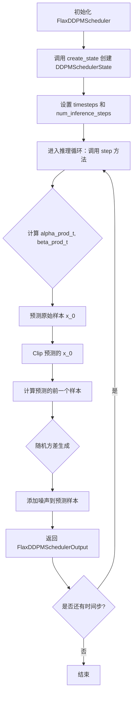
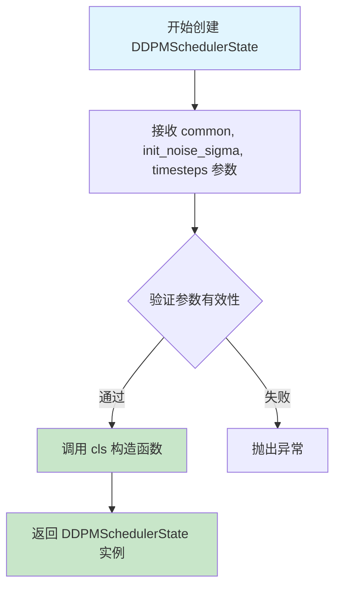
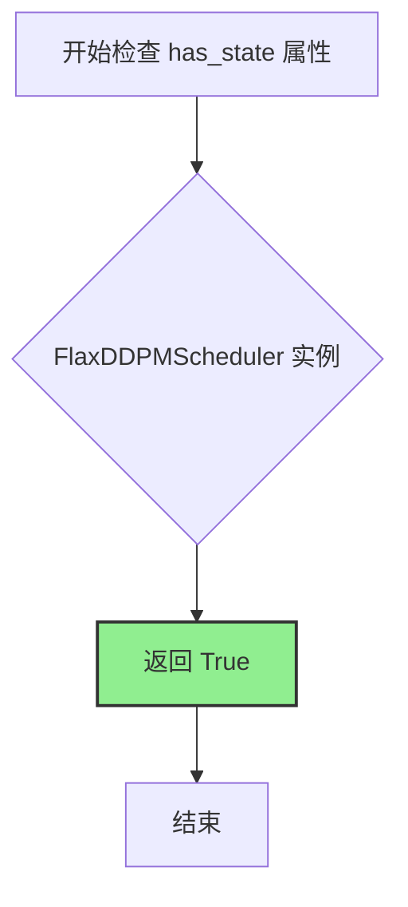
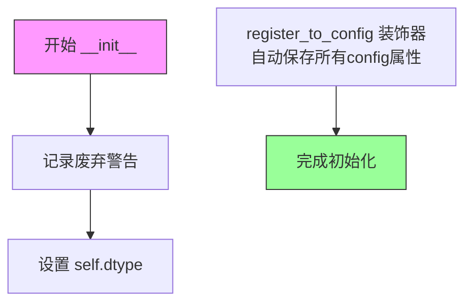
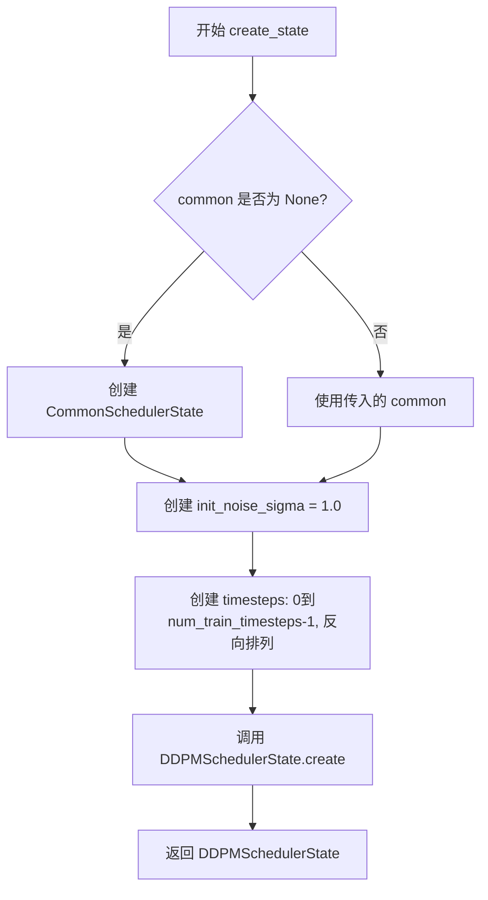
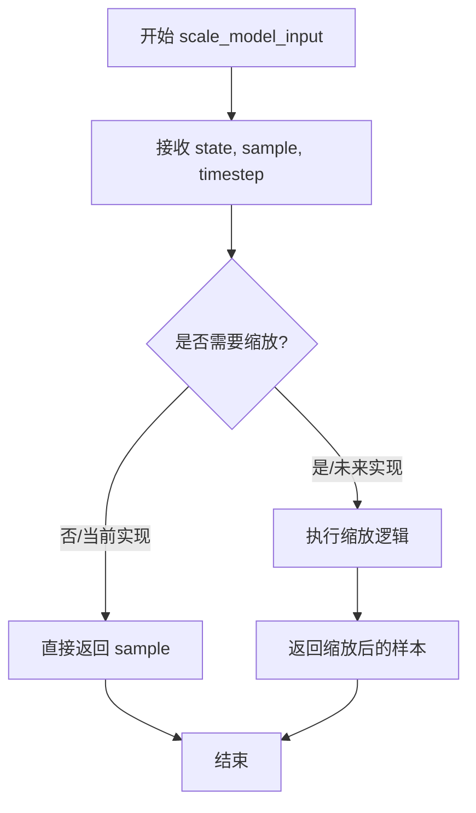
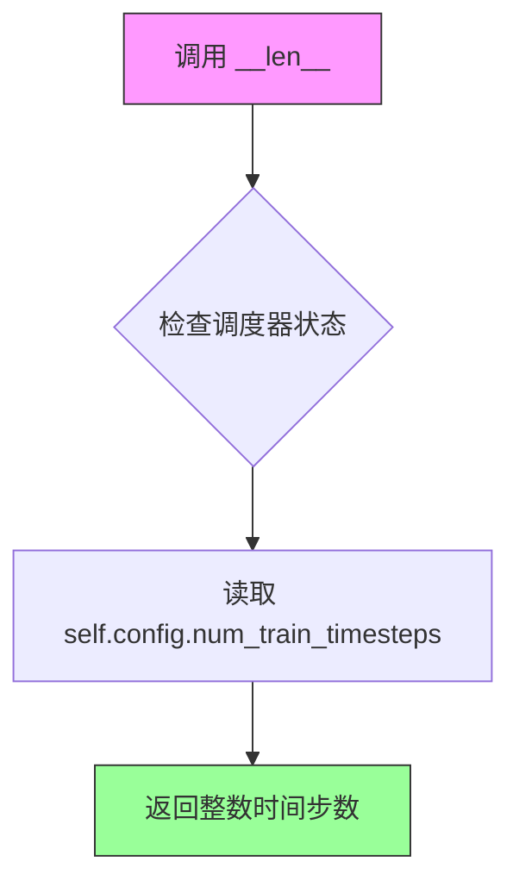

# `diffusers\src\diffusers\schedulers\scheduling_ddpm_flax.py` 详细设计文档

Flax实现的Denoising Diffusion Probabilistic Models (DDPM)调度器，用于扩散模型的噪声调度和采样过程，支持多种方差类型和预测类型的配置。

## 整体流程



## 类结构

```
ConfigMixin (配置混入基类)
├── FlaxSchedulerMixin (调度器混入基类)
│   └── FlaxDDPMScheduler (DDPM调度器实现)
CommonSchedulerState (通用调度器状态)
├── DDPMSchedulerState (DDPM特定调度器状态)
FlaxSchedulerOutput (调度器输出基类)
└── FlaxDDPMSchedulerOutput (DDPM调度器输出)
```

## 全局变量及字段


### `logger`
    
模块级日志记录器，用于记录调度器运行时的警告和信息

类型：`logging.Logger`
    


### `DDPMSchedulerState.common`
    
通用调度器状态，包含扩散过程的累积alpha和beta值

类型：`CommonSchedulerState`
    


### `DDPMSchedulerState.init_noise_sigma`
    
初始噪声标准差，用于初始化扩散链

类型：`jnp.ndarray`
    


### `DDPMSchedulerState.timesteps`
    
时间步数组，存储扩散过程中的离散时间步

类型：`jnp.ndarray`
    


### `DDPMSchedulerState.num_inference_steps`
    
推理步数，指定生成样本时使用的扩散步数

类型：`int`
    


### `DDPMSchedulerState.create`
    
类方法，创建并返回DDPMSchedulerState实例

类型：`classmethod`
    


### `FlaxDDPMSchedulerOutput.state`
    
DDPM调度器状态，包含当前扩散过程的完整状态信息

类型：`DDPMSchedulerState`
    


### `FlaxDDPMScheduler._compatibles`
    
兼容的调度器列表，包含所有可兼容的Karras扩散调度器名称

类型：`list`
    


### `FlaxDDPMScheduler.dtype`
    
计算数据类型，指定参数和计算时使用的数据精度

类型：`jnp.dtype`
    
    

## 全局函数及方法


### DDPMSchedulerState.create

该方法是 DDPMSchedulerState 类的工厂方法，用于根据提供的公共调度器状态、初始噪声 sigma 值和时间步数组创建并返回一个新的 DDPMSchedulerState 实例。这是 DDPM（去噪扩散概率模型）调度器状态对象的构造函数。

参数：

- `cls`：类型：`DDPMSchedulerState`（类本身），表示类方法被调用的类
- `common`：类型：`CommonSchedulerState`，包含调度器的公共状态信息，如 alpha 和 beta 值
- `init_noise_sigma`：类型：`jnp.ndarray`，初始噪声分布的标准差，用于扩散过程的起点
- `timesteps`：类型：`jnp.ndarray`，扩散过程中使用的时间步数组，定义了噪声添加的调度

返回值：`DDPMSchedulerState`，返回新创建的调度器状态实例，包含给定的公共状态、初始噪声 sigma 和时间步

#### 流程图



#### 带注释源码

```python
@classmethod
def create(
    cls,
    common: CommonSchedulerState,
    init_noise_sigma: jnp.ndarray,
    timesteps: jnp.ndarray,
):
    """
    类方法：创建并返回 DDPMSchedulerState 实例
    
    参数:
        cls: 类本身（由 @classmethod 自动传入）
        common: CommonSchedulerState 对象，包含调度器的公共状态（如累积 alpha 值）
        init_noise_sigma: jnp.ndarray，初始噪声的标准差
        timesteps: jnp.ndarray，扩散过程的时间步序列
    
    返回:
        DDPMSchedulerState: 新创建的调度器状态实例
    """
    # 使用提供的参数构造并返回 DDPMSchedulerState 实例
    # 注意：num_inference_steps 未在此处设置，将使用默认值 None
    return cls(common=common, init_noise_sigma=init_noise_sigma, timesteps=timesteps)
```


### FlaxDDPMScheduler.has_state

该属性用于判断调度器是否具有内部状态。在 FlaxDDPMScheduler 中，由于需要维护 DDPMSchedulerState 来跟踪扩散过程的中间状态（如时间步、噪声样本等），因此返回 True。

参数：

- 无（属性方法，只有隐式的 `self` 参数）

返回值：`bool`，返回调度器是否具有状态，这里固定返回 `True`，表示该调度器维护了内部状态。

#### 流程图



#### 带注释源码

```python
@property
def has_state(self):
    """
    属性方法：返回调度器是否具有内部状态
    
    该属性用于检查调度器是否维护了内部状态。对于 FlaxDDPMScheduler，
    它需要维护 DDPMSchedulerState 来跟踪扩散过程的中间状态，
    因此始终返回 True。
    
    Returns:
        bool: 始终返回 True，表示调度器具有可用的内部状态
              用于与其它调度器（如 FlaxDDIMScheduler）进行区分，
              某些调度器可能不需要维护复杂的状态
    """
    return True
```


### FlaxDDPMScheduler.__init__

初始化FlaxDDPMScheduler调度器配置，设置扩散模型的训练时间步数、beta参数、调度策略、方差类型、采样裁剪和预测类型等核心参数。

参数：

- `num_train_timesteps`：`int`，训练过程中使用的扩散步骤数量，默认为1000
- `beta_start`：`float`，推理时beta的起始值，默认为0.0001
- `beta_end`：`float`，beta的最终值，默认为0.02
- `beta_schedule`：`str`，beta调度策略，可选值为`linear`、`scaled_linear`或`squaredcos_cap_v2`，默认为`linear`
- `trained_betas`：`jnp.ndarray | None`，可选参数，用于直接传入beta数组以绕过beta_start、beta_end等参数，默认为None
- `variance_type`：`str`，添加噪声时裁剪方差的方式，可选值为`fixed_small`、`fixed_small_log`、`fixed_large`、`fixed_large_log`、`learned`或`learned_range`，默认为`fixed_small`
- `clip_sample`：`bool`，是否将预测样本裁剪到[-1, 1]范围以保证数值稳定性，默认为True
- `prediction_type`：`str`，模型预测类型，可选值为`epsilon`（预测噪声）或`sample`（预测样本），默认为`epsilon`
- `dtype`：`jnp.dtype`，参数和计算使用的数据类型，默认为jnp.float32

返回值：`None`，无返回值（__init__方法）

#### 流程图



#### 带注释源码

```python
@register_to_config
def __init__(
    self,
    num_train_timesteps: int = 1000,          # 扩散训练步数，默认1000
    beta_start: float = 0.0001,               # beta起始值
    beta_end: float = 0.02,                   # beta结束值
    beta_schedule: str = "linear",           # beta调度策略：linear/scaled_linear/squaredcos_cap_v2
    trained_betas: jnp.ndarray | None = None, # 可选：直接传入的beta数组
    variance_type: str = "fixed_small",       # 方差类型：fixed_small/fixed_small_log/fixed_large/fixed_large_log/learned/learned_range
    clip_sample: bool = True,                 # 是否裁剪样本到[-1, 1]
    prediction_type: str = "epsilon",         # 预测类型：epsilon（噪声）或sample（样本）
    dtype: jnp.dtype = jnp.float32,           # JAX计算数据类型
):
    """
    初始化DDPMScheduler配置
    
    该方法继承自ConfigMixin并使用@register_to_config装饰器，
    所有参数会自动存储在scheduler.config属性中供后续访问。
    """
    # 记录Flax类已废弃的警告信息
    logger.warning(
        "Flax classes are deprecated and will be removed in Diffusers v1.0.0. We "
        "recommend migrating to PyTorch classes or pinning your version of Diffusers."
    )
    
    # 设置实例的dtype属性，用于后续计算
    self.dtype = dtype
```


### `FlaxDDPMScheduler.create_state`

创建DDPM调度器的状态对象，初始化噪声标准差和时间步，用于扩散模型的采样过程。

参数：

- `self`：`FlaxDDPMScheduler`，FlaxDDPMScheduler类的实例，隐含参数
- `common`：`CommonSchedulerState | None`，可选的通用调度器状态，如果为None则自动创建

返回值：`DDPMSchedulerState`，包含通用调度器状态、初始噪声标准差和时间步的调度器状态对象

#### 流程图



#### 带注释源码

```python
def create_state(self, common: CommonSchedulerState | None = None) -> DDPMSchedulerState:
    """
    创建并返回 DDPMSchedulerState 对象，初始化扩散调度器所需的状态信息。
    
    Args:
        common: 可选的 CommonSchedulerState 对象，如果为 None 则自动创建
        
    Returns:
        包含初始化状态的 DDPMSchedulerState 对象
    """
    # 如果未提供 common 状态，则使用调度器配置创建默认的通用状态
    if common is None:
        common = CommonSchedulerState.create(self)

    # 初始噪声分布的标准差，用于反向扩散过程的起始点
    # 设置为 1.0，使用调度器的 dtype 进行计算
    init_noise_sigma = jnp.array(1.0, dtype=self.dtype)

    # 创建训练时间步数组：从 0 到 num_train_timesteps-1
    # 使用 round() 确保精确的整数步，然后 [::-1] 反向排列从大到小
    timesteps = jnp.arange(0, self.config.num_train_timesteps).round()[::-1]

    # 构建并返回包含所有初始化信息的调度器状态对象
    return DDPMSchedulerState.create(
        common=common,               # 通用调度器状态（alpha、beta等累积乘积）
        init_noise_sigma=init_noise_sigma,  # 初始噪声标准差
        timesteps=timesteps,          # 扩散过程的时间步序列
    )
```


### `FlaxDDPMScheduler.scale_model_input`

该方法用于在扩散模型推理过程中对模型输入进行缩放处理，目前实现为直接返回输入样本（占位符实现）。

参数：

- `self`：`FlaxDDPMScheduler` 实例本身
- `state`：`DDPMSchedulerState`，DDPM 调度器的状态数据类实例，包含调度器的当前状态信息
- `sample`：`jnp.ndarray`，输入的样本数据，即需要进行缩放处理的样本
- `timestep`：`int | None`，当前扩散过程中的时间步，可选参数

返回值：`jnp.ndarray`，缩放（处理）后的输入样本

#### 流程图



#### 带注释源码

```python
def scale_model_input(
    self,
    state: DDPMSchedulerState,
    sample: jnp.ndarray,
    timestep: int | None = None,
) -> jnp.ndarray:
    """
    Args:
        state (`PNDMSchedulerState`): the `FlaxPNDMScheduler` state data class instance.
        sample (`jnp.ndarray`): input sample
        timestep (`int`, optional): current timestep

    Returns:
        `jnp.ndarray`: scaled input sample
    """
    # 当前实现为占位符，直接返回输入样本
    # 在其他调度器（如 DDIMScheduler）中，这里可能包含
    # 基于时间步的样本缩放逻辑，例如：
    # - 根据 sigma 值缩放噪声样本
    # - 应用动态阈值处理
    # - 根据调度器配置进行样本归一化
    return sample
```


### `FlaxDDPMScheduler.set_timesteps`

设置离散时间步，用于扩散链推理。Supporting function to be run before inference.

参数：

- `self`：`FlaxDDPMScheduler`，FlaxDDPMScheduler 实例本身
- `state`：`DDPMSchedulerState`，FlaxDDPMScheduler 状态数据类实例
- `num_inference_steps`：`int`，生成样本时使用的扩散推理步数
- `shape`：`tuple`，可选，输出形状，默认为空元组 `()`

返回值：`DDPMSchedulerState`，返回更新后的调度器状态，包含设置好的时间步

#### 流程图

```mermaid
flowchart TD
    A[开始 set_timesteps] --> B[计算步长比率: step_ratio = num_train_timesteps // num_inference_steps]
    B --> C[生成整数时间步: timesteps = (jnp.arange(0, num_inference_steps) * step_ratio).round]
    C --> D[反转时间步顺序: timesteps[::-1]]
    D --> E[返回更新后的状态: state.replace]
    E --> F[包含 num_inference_steps 和 timesteps]
    F --> G[结束]
```

#### 带注释源码

```python
def set_timesteps(
    self, state: DDPMSchedulerState, num_inference_steps: int, shape: tuple = ()
) -> DDPMSchedulerState:
    """
    Sets the discrete timesteps used for the diffusion chain. Supporting function to be run before inference.

    Args:
        state (`DDIMSchedulerState`):
            the `FlaxDDPMScheduler` state data class instance.
        num_inference_steps (`int`):
            the number of diffusion steps used when generating samples with a pre-trained model.
    """

    # 计算步长比率：将训练时间步总数除以推理步数
    # 例如：num_train_timesteps=1000, num_inference_steps=50 -> step_ratio=20
    step_ratio = self.config.num_train_timesteps // num_inference_steps
    
    # 创建整数时间步：通过将步长比率乘以推理步数索引
    # 使用 round() 避免当 num_inference_step 是 3 的幂次时出现的问题
    # 例如：num_inference_steps=50, step_ratio=20
    # -> jnp.arange(0, 50) * 20 = [0, 20, 40, 60, ..., 980]
    # -> .round() = [0, 20, 40, 60, ..., 980]
    # -> [::-1] 反转 = [980, 960, ..., 0]
    timesteps = (jnp.arange(0, num_inference_steps) * step_ratio).round()[::-1]

    # 使用 state.replace 更新状态，返回新的 DDPMSchedulerState
    # 更新 num_inference_steps 和 timesteps
    return state.replace(
        num_inference_steps=num_inference_steps,
        timesteps=timesteps,
    )
```


### `FlaxDDPMScheduler._get_variance`

该方法根据 Denoising Diffusion Probabilistic Models (DDPM) 论文中的公式 (6) 和 (7) 计算扩散过程中的方差值，支持多种方差类型（fixed_small、fixed_small_log、fixed_large、fixed_large_log、learned、learned_range），用于在反向扩散过程中添加噪声。

参数：

- `self`：隐含的类实例引用
- `state`：`DDPMSchedulerState`，DDPMScheduler 状态数据类实例，包含公共调度器状态信息
- `t`：当前时间步（int 类型），表示扩散过程中的当前时间步索引
- `predicted_variance`：`jnp.ndarray` | None，可选参数，预测的方差值，当 variance_type 为 "learned" 或 "learned_range" 时使用
- `variance_type`：str | None，可选参数，方差类型，用于指定如何计算方差，默认为配置中的 variance_type

返回值：`jnp.ndarray`，计算得到的方差值，用于反向扩散过程中的噪声添加

#### 流程图

```mermaid
flowchart TD
    A[开始 _get_variance] --> B[获取 alpha_prod_t]
    B --> C[获取 alpha_prod_t_prev]
    C --> D[计算基础方差 variance]
    D --> E{variance_type 是否为 None?}
    E -->|是| F[使用 self.config.variance_type]
    E -->|否| G[使用传入的 variance_type]
    F --> H{根据 variance_type 处理方差}
    G --> H
    H --> I{"variance_type == 'fixed_small'?"}
    I -->|是| J[裁剪方差最小值到 1e-20]
    I -->|否| K{"variance_type == 'fixed_small_log'?"}
    K -->|是| L[取对数并裁剪]
    K -->|否| M{"variance_type == 'fixed_large'?"}
    M -->|是| N[使用 betas[t] 作为方差]
    M -->|否| O{"variance_type == 'fixed_large_log'?"}
    O -->|是| P[取对数使用 betas[t]]
    O -->|否| Q{"variance_type == 'learned'?"}
    Q -->|是| R[返回 predicted_variance]
    Q -->|否| S{"variance_type == 'learned_range'?"}
    S -->|是| T[在 min_log 和 max_log 之间插值]
    S -->|否| U[返回计算后的 variance]
    J --> U
    L --> U
    N --> U
    P --> U
    T --> U
    U --> V[返回最终方差值]
```

#### 带注释源码

```python
def _get_variance(self, state: DDPMSchedulerState, t, predicted_variance=None, variance_type=None):
    """
    计算给定时间步的方差值，用于 DDPM 采样过程中的噪声添加。
    
    参数:
        state: DDPMScheduler 状态实例，包含公共调度器状态
        t: 当前时间步索引
        predicted_variance: 预测的方差（用于 learned 或 learned_range 类型）
        variance_type: 方差计算类型，默认使用配置中的类型
    
    返回:
        方差值 (jnp.ndarray)
    """
    # 获取当前时间步 t 的累积 alpha 值
    alpha_prod_t = state.common.alphas_cumprod[t]
    
    # 获取前一时间步的累积 alpha 值
    # 如果 t > 0，使用 alphas_cumprod[t-1]，否则使用 1.0（扩散起点）
    alpha_prod_t_prev = jnp.where(t > 0, state.common.alphas_cumprod[t - 1], jnp.array(1.0, dtype=self.dtype))

    # 对于 t > 0，根据论文公式 (6) 和 (7) 计算预测方差 βt
    # 公式: variance = (1 - αₜ₋₁) / (1 - αₜ) * βₜ
    # 其中 βₜ = 1 - αₜ / αₜ₋₁
    variance = (1 - alpha_prod_t_prev) / (1 - alpha_prod_t) * state.common.betas[t]

    # 如果未指定 variance_type，则使用配置中的类型
    if variance_type is None:
        variance_type = self.config.variance_type

    # 根据不同的方差类型进行处理（这些处理可能是为了训练稳定性）
    if variance_type == "fixed_small":
        # 裁剪方差最小值，避免数值过小导致的问题
        variance = jnp.clip(variance, a_min=1e-20)
    # 用于 rl-diffuser (https://huggingface.co/papers/2205.09991)
    elif variance_type == "fixed_small_log":
        # 使用对数形式的方差
        variance = jnp.log(jnp.clip(variance, a_min=1e-20))
    elif variance_type == "fixed_large":
        # 直接使用 beta 值作为方差
        variance = state.common.betas[t]
    elif variance_type == "fixed_large_log":
        # Glide max_log 策略
        variance = jnp.log(state.common.betas[t])
    elif variance_type == "learned":
        # 直接返回模型预测的方差
        return predicted_variance
    elif variance_type == "learned_range":
        # 在预测方差范围内进行插值
        min_log = variance  # 最小对数方差
        max_log = state.common.betas[t]  # 最大对数方差
        # 将预测方差归一化到 [0, 1] 范围
        frac = (predicted_variance + 1) / 2
        # 根据归一化后的预测值在 min_log 和 max_log 之间插值
        variance = frac * max_log + (1 - frac) * min_log

    return variance
```


### `FlaxDDPMScheduler.step`

执行DDPM（去噪扩散概率模型）逆向过程的单步推理，通过从学习到的扩散模型输出（通常是预测的噪声）反向推导出前一个时间步的样本，实现从噪声到清晰样本的迭代生成过程。

参数：

- `self`：`FlaxDDPMScheduler`，调度器实例本身
- `state`：`DDPMSchedulerState`，DDPM调度器的状态数据类实例，包含扩散过程的状态信息
- `model_output`：`jnp.ndarray`，学习到的扩散模型的直接输出（预测的噪声或样本）
- `timestep`：`int`，扩散链中当前离散时间步
- `sample`：`jnp.ndarray`，扩散过程正在生成的当前样本实例
- `key`：`jax.Array | None`，用于随机数生成的PRNG密钥，默认为None（使用key(0)）
- `return_dict`：`bool`，是否返回FlaxDDPMSchedulerOutput类，默认为True

返回值：`FlaxDDPMSchedulerOutput | tuple`，当return_dict为True时返回FlaxDDPMSchedulerOutput对象，包含prev_sample和state；否则返回元组，第一个元素是样本张量

#### 流程图

```mermaid
flowchart TD
    A[开始 step 方法] --> B{key 是否为 None?}
    B -->|是| C[key = jax.random.key(0)]
    B -->|否| D[key 保持不变]
    C --> E{判断 model_output 形状和 variance_type}
    D --> E
    E --> F{模型输出是否包含预测方差?}
    F -->|是| G[分割 model_output 和 predicted_variance]
    F -->|否| H[predicted_variance = None]
    G --> I[计算 alpha_prod_t 和 alpha_prod_t_prev]
    H --> I
    I --> J[计算 beta_prod_t 和 beta_prod_t_prev]
    J --> K{根据 prediction_type 计算 pred_original_sample}
    K -->|epsilon| L[使用公式计算 x₀]
    K -->|sample| M[pred_original_sample = model_output]
    K -->|v_prediction| N[使用 v-prediction 公式]
    L --> O{clip_sample 是否为 True?}
    M --> O
    N --> O
    O -->|是| P[限制 pred_original_sample 在 [-1, 1] 范围内]
    O -->|否| Q[保持 pred_original_sample 不变]
    P --> R[计算预测系数]
    Q --> R
    R --> S[计算 pred_prev_sample]
    S --> T{当前时间步 t > 0?}
    T -->|是| U[生成随机方差噪声]
    T -->|否| V[方差为 0]
    U --> W[将方差加到 pred_prev_sample]
    V --> X[pred_prev_sample 保持不变]
    W --> Y{return_dict 是否为 True?}
    X --> Y
    Y -->|是| Z[返回 FlaxDDPMSchedulerOutput]
    Y -->|否| AA[返回 tuple]
    Z --> BB[结束]
    AA --> BB
```

#### 带注释源码

```python
def step(
    self,
    state: DDPMSchedulerState,
    model_output: jnp.ndarray,
    timestep: int,
    sample: jnp.ndarray,
    key: jax.Array | None = None,
    return_dict: bool = True,
) -> FlaxDDPMSchedulerOutput | tuple:
    """
    通过逆向SDE预测上一个时间步的样本。从学习到的扩散模型输出（通常是预测的噪声）
    反向推导以推进扩散过程的核心函数。
    
    参数:
        state: FlaxDDPMScheduler状态数据类实例
        model_output: 学习到的扩散模型的直接输出
        timestep: 扩散链中当前离散时间步
        sample: 扩散过程正在创建的当前样本实例
        key: PRNG密钥
        return_dict: 是否返回tuple而不是FlaxDDPMSchedulerOutput类
        
    返回:
        FlaxDDPMSchedulerOutput或tuple: 如果return_dict为True返回FlaxDDPMSchedulerOutput，
        否则返回tuple，第一个元素是样本张量
    """
    t = timestep  # 当前时间步

    # 如果没有提供密钥，则使用默认密钥(0)用于随机数生成
    if key is None:
        key = jax.random.key(0)

    # 处理包含预测方差的模型输出（用于learned或learned_range方差类型）
    # 如果输出宽度是样本宽度的两倍，则分割出预测方差
    if (
        len(model_output.shape) > 1
        and model_output.shape[1] == sample.shape[1] * 2
        and self.config.variance_type in ["learned", "learned_range"]
    ):
        model_output, predicted_variance = jnp.split(model_output, sample.shape[1], axis=1)
    else:
        predicted_variance = None

    # 步骤1: 计算alpha和beta值
    # alpha_prod_t是累积alpha值，alpha_prod_t_prev是前一时间步的累积alpha值
    alpha_prod_t = state.common.alphas_cumprod[t]
    # 如果t>0使用累积alpha，否则使用1.0（序列开始时）
    alpha_prod_t_prev = jnp.where(t > 0, state.common.alphas_cumprod[t - 1], jnp.array(1.0, dtype=self.dtype))
    # beta_prod是1减去alpha_prod
    beta_prod_t = 1 - alpha_prod_t
    beta_prod_t_prev = 1 - alpha_prod_t_prev

    # 步骤2: 从预测噪声计算原始样本（公式15中的"预测x_0"）
    # 根据prediction_type选择不同的计算方式
    if self.config.prediction_type == "epsilon":
        # 标准epsilon预测：x_0 = (x_t - sqrt(beta_t) * epsilon) / sqrt(alpha_t)
        pred_original_sample = (sample - beta_prod_t ** (0.5) * model_output) / alpha_prod_t ** (0.5)
    elif self.config.prediction_type == "sample":
        # 直接预测样本
        pred_original_sample = model_output
    elif self.config.prediction_type == "v_prediction":
        # v-prediction: x_0 = sqrt(alpha_t) * x_t - sqrt(beta_t) * v
        pred_original_sample = (alpha_prod_t**0.5) * sample - (beta_prod_t**0.5) * model_output
    else:
        raise ValueError(
            f"prediction_type given as {self.config.prediction_type} must be one of `epsilon`, `sample` "
            " for the FlaxDDPMScheduler."
        )

    # 步骤3: 限制"预测x_0"在合理范围内（数值稳定性）
    if self.config.clip_sample:
        pred_original_sample = jnp.clip(pred_original_sample, -1, 1)

    # 步骤4: 计算pred_original_sample和当前样本x_t的系数
    # 公式(7)中的系数计算
    pred_original_sample_coeff = (alpha_prod_t_prev ** (0.5) * state.common.betas[t]) / beta_prod_t
    current_sample_coeff = state.common.alphas[t] ** (0.5) * beta_prod_t_prev / beta_prod_t

    # 步骤5: 计算预测的前一个样本µ_t（公式7）
    pred_prev_sample = pred_original_sample_coeff * pred_original_sample + current_sample_coeff * sample

    # 步骤6: 添加噪声（随机采样）
    def random_variance():
        """生成随机方差噪声"""
        split_key = jax.random.split(key, num=1)[0]
        noise = jax.random.normal(split_key, shape=model_output.shape, dtype=self.dtype)
        return (self._get_variance(state, t, predicted_variance=predicted_variance) ** 0.5) * noise

    # 只有在t>0时才添加噪声（t=0是最终结果，不需要噪声）
    variance = jnp.where(t > 0, random_variance(), jnp.zeros(model_output.shape, dtype=self.dtype))

    # 将方差加到预测的前一个样本
    pred_prev_sample = pred_prev_sample + variance

    # 根据return_dict返回结果
    if not return_dict:
        return (pred_prev_sample, state)

    return FlaxDDPMSchedulerOutput(prev_sample=pred_prev_sample, state=state)
```

---

#### 关键组件信息

| 组件名称 | 一句话描述 |
|---------|-----------|
| `DDPMSchedulerState` | 存储DDPM调度器的状态，包括累积alpha值、时间步和噪声sigma |
| `FlaxDDPMSchedulerOutput` | 包含前一个样本和更新后状态的输出数据类 |
| `alpha_prod_t` | 当前时间步的累积alpha值，用于计算去噪系数 |
| `beta_prod_t` | 当前时间步的累积beta值（1-alpha_prod_t） |
| `pred_original_sample` | 从预测噪声重构的原始样本（x_0） |
| `variance` | 添加到样本的随机噪声，用于采样多样性 |

#### 潜在技术债务或优化空间

1. **硬编码的默认值**: `key = jax.random.key(0)` 是硬编码的默认值，在多次调用时可能不是最佳实践
2. **条件分支优化**: `variance_type` 的多个 `if-elif` 分支可以考虑使用字典映射来优化
3. **函数式随机性**: `_get_variance` 方法内部定义的 `random_variance` 函数每次调用都会创建，建议预计算
4. **类型提示不一致**: 部分地方使用了 `|` 联合类型语法，部分地方使用了 `Optional[]`，建议统一
5. **缺少日志记录**: 关键计算节点缺少调试日志，不利于生产环境问题追踪

#### 其它项目

**设计目标与约束**:
- 实现DDPM论文中的逆向扩散过程
- 支持多种预测类型（epsilon, sample, v-prediction）
- 支持多种方差类型（fixed_small, fixed_large, learned等）
- 提供数值稳定性（clip_sample限制在[-1,1]）

**错误处理与异常设计**:
- `prediction_type` 不支持 `v-prediction` 会抛出 `ValueError`
- `variance_type` 为 `learned` 时直接返回 `predicted_variance`
- 当 `t=0` 时方差设为零，避免在最终步骤添加噪声

**数据流与状态机**:
- 状态从 `DDPMSchedulerState` 中读取累积alpha和beta值
- 输出新的样本和更新后的状态
- 状态中的 `timesteps` 数组存储推理时的时间步序列

**外部依赖与接口契约**:
- 依赖 `jax` 和 `jax.numpy` 进行数值计算
- 依赖 `flax.struct.dataclass` 进行不可变状态管理
- 与 `CommonSchedulerState` 共享累积alpha/beta计算逻辑


### `FlaxDDPMScheduler.add_noise`

向原始样本添加噪声，生成带噪样本。该方法是DDPM（去噪扩散概率模型）调度器的核心功能之一，用于在训练或推理过程中根据给定的时间步将噪声混合到干净样本中。

参数：

- `self`：`FlaxDDPMScheduler`，调度器实例本身（隐含参数）
- `state`：`DDPMSchedulerState`，DDPM调度器的状态数据类实例，包含调度器的状态信息（如累积的alpha值等）
- `original_samples`：`jnp.ndarray`，原始干净样本，通常是图像或潜在表示
- `noise`：`jnp.ndarray`，要添加到样本中的噪声，通常是高斯噪声
- `timesteps`：`jnp.ndarray`，当前的时间步，用于确定添加噪声的比例

返回值：`jnp.ndarray`，添加噪声后的样本张量

#### 流程图

```mermaid
flowchart TD
    A[开始 add_noise] --> B[接收调度器状态、原始样本、噪声和时间步]
    B --> C[提取 state.common 中的累积alpha值]
    C --> D[调用 add_noise_common 函数]
    D --> E[根据时间步计算对应的时间步索引]
    E --> F[根据累积alpha值计算缩放因子]
    F --> G[公式: noisy_samples = sqrt(alpha_cumprod_t) * original_samples + sqrt(1 - alpha_cumprod_t) * noise]
    G --> H[返回加噪后的样本]
```

#### 带注释源码

```python
def add_noise(
    self,
    state: DDPMSchedulerState,
    original_samples: jnp.ndarray,
    noise: jnp.ndarray,
    timesteps: jnp.ndarray,
) -> jnp.ndarray:
    """
    向原始样本添加噪声，生成带噪样本。
    
    该方法实现了扩散过程中前向噪声添加过程，根据给定的时间步t，
    将原始样本x_0转换为带噪样本x_t。
    
    公式: x_t = sqrt(α_cumprod[t]) * x_0 + sqrt(1 - α_cumprod[t]) * ε
    
    Args:
        state: DDPMSchedulerState实例，包含调度器的公共状态
        original_samples: 原始干净样本 (x_0)
        noise: 要添加的高斯噪声 (ε)
        timesteps: 当前扩散过程中的时间步
    
    Returns:
        添加噪声后的样本 (x_t)
    """
    # 委托给通用的add_noise_common函数执行实际计算
    # state.common 包含调度器的公共状态（如累积alpha值等）
    return add_noise_common(state.common, original_samples, noise, timesteps)
```


### `FlaxDDPMScheduler.get_velocity`

获取扩散过程中的速度（velocity），用于在给定时间步下根据原始样本、噪声和时间步计算速度向量。

参数：

- `self`：`FlaxDDPMScheduler`，调度器实例本身
- `state`：`DDPMSchedulerState`，DDPM调度器的状态数据类实例，包含扩散过程的公共状态信息
- `sample`：`jnp.ndarray`，当前扩散过程中的样本张量
- `noise`：`jnp.ndarray`，添加到样本中的噪声张量
- `timesteps`：`jnp.ndarray`，当前扩散过程的时间步数组

返回值：`jnp.ndarray`，计算得到的速度向量张量

#### 流程图

```mermaid
flowchart TD
    A[开始 get_velocity] --> B[输入: state, sample, noise, timesteps]
    B --> C{调用 get_velocity_common}
    C --> D[获取 state.common 公共状态]
    D --> E[计算速度: v = αₜ√(1-α̅ₜ)sample - √(1-αₜ)α̅ₜ noise]
    E --> F[返回速度张量]
    F --> G[结束]
    
    style A fill:#f9f,color:#333
    style F fill:#9f9,color:#333
    style G fill:#9f9,color:#333
```

#### 带注释源码

```
def get_velocity(
    self,
    state: DDPMSchedulerState,
    sample: jnp.ndarray,
    noise: jnp.ndarray,
    timesteps: jnp.ndarray,
) -> jnp.ndarray:
    """
    获取扩散过程中的速度向量。
    
    速度是DDPM扩散过程中用于表示样本从原始状态演变到噪声状态的变化率。
    在DDPM中，速度 v 可以通过以下公式计算:
    v = sqrt(alpha_cumprod) * noise - sqrt(1 - alpha_cumprod) * sample
    
    参数:
        state: 调度器状态，包含累积alpha值等公共状态信息
        sample: 当前样本张量
        noise: 噪声张量
        timesteps: 当前时间步
        
    返回:
        速度向量张量，用于后续的噪声预测和样本重建
    """
    # 调用通用工具函数计算速度，该函数封装了DDPM速度计算的标准逻辑
    return get_velocity_common(state.common, sample, noise, timesteps)
```


### `FlaxDDPMScheduler.__len__`

该方法返回 DDPM 调度器配置的训练时间步总数，用于支持 Python 的 `len()` 内置函数操作，使调度器可以像序列一样查询其长度。

参数：

- 无（除隐含的 `self` 参数）

返回值：`int`，返回训练时间步的数量（即 `num_train_timesteps`），通常默认为 1000。

#### 流程图



#### 带注释源码

```python
def __len__(self):
    """
    返回调度器配置的训练时间步总数。
    
    此方法实现了 Python 的魔术方法 __len__，使得可以调用 len(scheduler)
    来获取调度器的时间步数量。在 DDPM 扩散模型中，这通常对应于训练时
    使用的时间步总数（默认 1000 步）。
    
    Returns:
        int: 配置的训练时间步数量，即 num_train_timesteps 值
    """
    return self.config.num_train_timesteps
```

## 关键组件


### DDPMSchedulerState
保存DDPM调度器运行时的状态数据，包括公共状态、初始噪声sigma、时间步和推理步数等可设置值。

### FlaxDDPMSchedulerOutput
继承自FlaxSchedulerOutput的数据类，用于封装调度器输出结果，包含前一个样本和更新后的状态。

### FlaxDDPMScheduler
DDPM扩散模型调度器的Flax实现类，核心功能是通过逆转扩散过程从预测噪声推导上一时间步的样本，支持多种beta调度策略和方差类型。

### create_state方法
创建并初始化DDPMSchedulerState实例，生成标准差为1.0的初始噪声分布和时间步数组。

### set_timesteps方法
设置离散的时间步用于扩散链，根据推理步数计算对应的时间步序列，支持按比例生成整数时间步。

### _get_variance方法
根据方差类型计算扩散过程中的方差值，支持fixed_small、fixed_small_log、fixed_large、fixed_large_log、learned和learned_range等多种方差计算策略。

### step方法
核心采样函数，通过逆转SDE（随机微分方程）预测上一时间步的样本，包含计算alphas和betas、推导原始样本、计算系数、添加随机噪声等关键步骤。

### add_noise方法
向原始样本添加噪声的公共接口，调用add_noise_common函数实现。

### get_velocity方法
计算噪声速度的公共接口，调用get_velocity_common函数实现。

### 张量索引与惰性加载
使用jnp数组进行高效的惰性计算，通过jnp.where实现条件索引，避免不必要的数据复制。

### 预测类型支持
支持epsilon、sample和v_prediction三种预测类型的计算，根据config.prediction_type选择对应的原始样本推导公式。

### 方差类型与噪声策略
实现多种方差策略用于添加噪声，包括固定小方差、固定大方差、可学习方差和可学习范围方差，满足不同训练和采样需求。


## 问题及建议


### 已知问题

-   **过时的Flax实现**：代码包含弃用警告，说明Flax类将在Diffusers v1.0.0中移除，但仍在维护过时的实现，这与项目迁移到PyTorch的战略方向不一致
-   **类型注解不完整**：`scale_model_input`方法中`timestep`参数声明了类型但未在方法体内使用，造成代码冗余和混淆
-   **魔法数字**：多处使用硬编码数值如`1e-20`（方差裁剪）、`0`（默认随机密钥）、`-1`和`1`（样本裁剪），缺乏常量定义
-   **函数重复定义**：`random_variance`函数在`step`方法内部定义，每次调用都会创建新函数对象，增加内存开销
-   **边界检查缺失**：未对`timestep`参数进行负值或超出范围的验证，可能导致运行时错误或难以追踪的NaN问题
-   **文档不完整**：`set_timesteps`方法的docstring缺少返回值描述，`_get_variance`方法完全缺少文档说明

### 优化建议

-   **移除或迁移Flax代码**：根据项目路线图，考虑完全移除Flax实现或将其移至单独的兼容包，避免维护重复代码
-   **提取常量定义**：将魔法数字提取为类级别常量或配置文件，如`EPSILON = 1e-20`、`DEFAULT_PRNG_KEY = 0`、`CLIP_RANGE = (-1, 1)`
-   **优化函数定义**：将`random_variance`提取为类方法或模块级函数，避免在每次推理时重复创建
-   **增强输入验证**：在`step`和`set_timesteps`方法中添加参数验证逻辑，确保`timestep`在有效范围内
-   **完善文档**：补充所有方法的完整docstring，特别是参数说明和返回值描述，提高API可读性
-   **重构方差计算**：将`_get_variance`方法中的条件分支逻辑提取为独立的策略模式或查找表，提高可维护性


## 其它


### 设计目标与约束

**设计目标**：实现Denoising Diffusion Probabilistic Models (DDPM) 调度器的Flax/JAX版本，用于扩散模型的逆向过程采样，将噪声逐步去噪为样本。

**约束条件**：
- 仅支持JAX/Flax框架，需支持JIT编译
- 需与HuggingFace Diffusers库的ConfigMixin和SchedulerMixin兼容
- prediction_type仅支持`epsilon`和`sample`，不支持`v_prediction`
- variance_type必须为预设值之一：`fixed_small`、`fixed_small_log`、`fixed_large`、`fixed_large_log`、`learned`、`learned_range`
- 必须在FlaxDDPMSchedulerOutput中返回状态和前一个样本

### 错误处理与异常设计

**参数校验**：
- `prediction_type`必须为`epsilon`或`sample`，否则抛出`ValueError`异常，提示"prediction_type given as {value} must be one of `epsilon`, `sample` for the FlaxDDPMScheduler"
- `variance_type`为`learned`或`learned_range`时，模型输出必须包含预测方差（形状为sample.shape[1]的2倍）

**运行时错误处理**：
- 当t=0时（起始时间步），variance设为0，不添加噪声
- 使用`jnp.where`进行条件分支，避免显式if-else导致的控制流问题
- 数值稳定性处理：variance_type为`fixed_small`时裁剪最小值到1e-20，sample预测值裁剪到[-1, 1]

### 数据流与状态机

**状态定义**：
- `DDPMSchedulerState`包含：common（通用状态）、init_noise_sigma（初始噪声标准差）、timesteps（时间步序列）、num_inference_steps（推理步数）

**状态转换流程**：
```
create_state() -> set_timesteps() -> [step()循环] -> 完成采样
```

**核心数据流**：
1. 初始化：create_state()生成初始状态和噪声sigma
2. 配置：set_timesteps()设置推理时的时间步序列
3. 迭代：step()函数每步接收(model_output, timestep, sample)，输出(prev_sample, state)
4. 噪声添加：step()内部根据variance_type计算方差并添加随机噪声

### 外部依赖与接口契约

**直接依赖**：
- `flax.struct.dataclass`：用于创建不可变数据结构
- `jax` / `jax.numpy`：数值计算后端
- `configuration_utils.ConfigMixin`：配置保存与加载
- `configuration_utils.register_to_config`：配置属性装饰器
- `utils.logging`：日志记录
- `scheduling_utils_flax`：通用调度器工具函数（add_noise_common、get_velocity_common、CommonSchedulerState等）

**与CommonSchedulerState的契约**：
- 必须包含alphas、betas、alphas_cumprod等预计算值
- 通过state.common访问这些值

**兼容调度器**：
- FlaxKarrasDiffusionSchedulers中列出的所有调度器

### 版本兼容性说明

**废弃警告**：
- 构造函数__init__中输出deprecation warning，提示Flax类将在Diffusers v1.0.0移除
- 建议迁移到PyTorch版本或固定Diffusers版本

**兼容配置**：
- `_compatibles`类属性列出兼容的调度器名称，用于模型加载时的调度器匹配

### 数值稳定性处理

**clip_sample=True时**：
- pred_original_sample裁剪到[-1, 1]范围

**variance计算处理**：
- fixed_small：裁剪variance最小值到1e-20
- fixed_small_log：对数域处理
- fixed_large/fixed_large_log：使用原始betas
- learned/learned_range：从模型输出中学习方差

### 关键算法引用

**DDPM核心公式**：
- 公式(7)：计算前一样本均值
- 公式(15)：从预测噪声恢复原始样本
- 添加噪声：x_{t-1} ~ N(pred_prev_sample, variance)

    