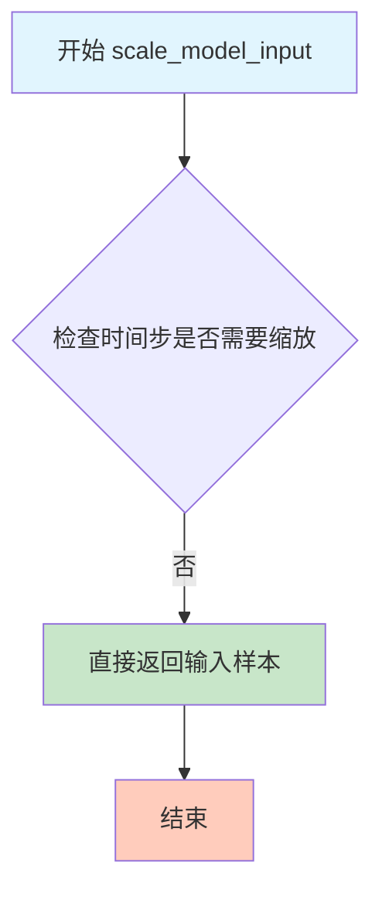
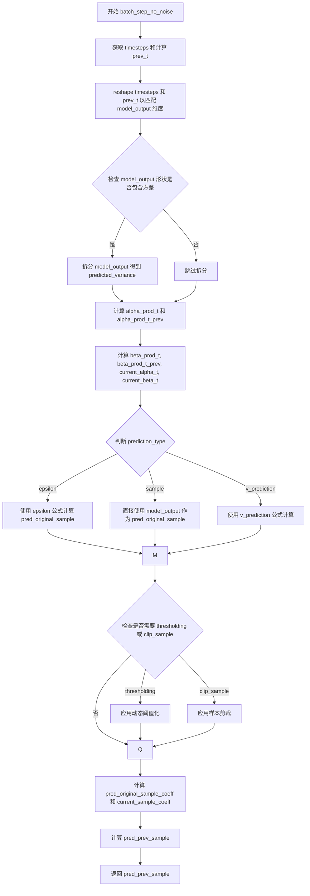
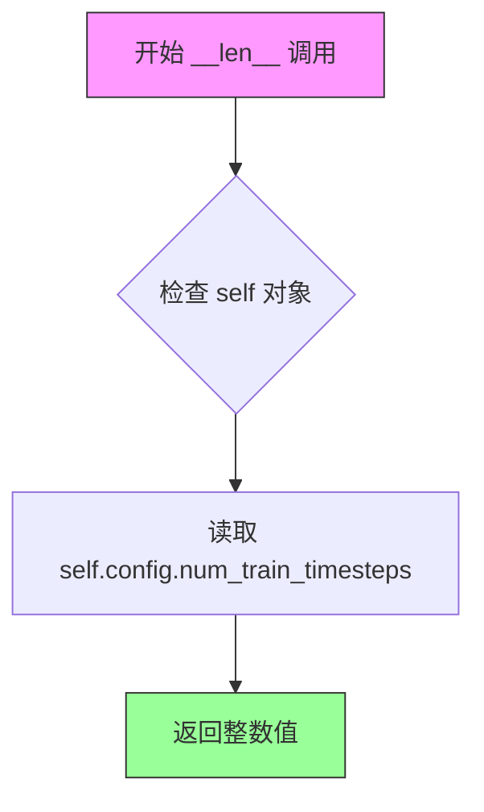

# `diffusers\src\diffusers\schedulers\scheduling_ddpm_parallel.py` 详细设计文档

DDPMParallelScheduler是一个去噪扩散概率模型(DDPM)的调度器实现，继承自SchedulerMixin和ConfigMixin，提供扩散模型的采样、逆向过程推理功能，支持多种噪声调度策略(linear/scaled_linear/squaredcos_cap_v2/sigmoid/laplace)、预测类型(epsilon/sample/v_prediction)、动态阈值处理、零终端SNR调整等特性，并通过批处理接口支持并行采样。

## 整体流程

```mermaid
graph TD
    A[开始] --> B[初始化调度器]
    B --> C[调用set_timesteps设置推理时间步]
    C --> D[循环遍历每个时间步]
    D --> E{调用step方法}
    E --> F[计算alpha/beta乘积]
    E --> G[预测原始样本x_0]
    E --> H[Clip或Threshold处理]
    E --> I[计算系数和预测前一步样本]
    E --> J[添加噪声产生前一步样本]
    J --> K{是否还有时间步?}
    K -- 是 --> D
    K -- 否 --> L[结束]

subgraph 批处理流程
    M[调用batch_step_no_noise] --> N[批量计算alpha/beta]
    N --> O[批量预测原始样本]
    O --> P[批量Clip/Threshold]
    P --> Q[批量计算前一步样本]
    Q --> R[返回批量样本]
        
```

## 类结构

```
BaseOutput (utils模块)
└── DDPMParallelSchedulerOutput (数据类)

SchedulerMixin (调度器混入基类)
└── DDPMParallelScheduler (主调度器类)

ConfigMixin (配置混入基类)
└── DDPMParallelScheduler
```

## 全局变量及字段


### `betas_for_alpha_bar`
    
Create a beta schedule that discretizes the given alpha_t_bar function

类型：`function`
    


### `rescale_zero_terminal_snr`
    
Rescales betas to have zero terminal SNR

类型：`function`
    


### `DDPMParallelSchedulerOutput.prev_sample`
    
前一步计算得到的样本

类型：`torch.Tensor`
    


### `DDPMParallelSchedulerOutput.pred_original_sample`
    
预测的原始去噪样本x_0

类型：`torch.Tensor | None`
    


### `DDPMParallelScheduler.betas`
    
beta调度表

类型：`torch.Tensor`
    


### `DDPMParallelScheduler.alphas`
    
alpha值(1-beta)

类型：`torch.Tensor`
    


### `DDPMParallelScheduler.alphas_cumprod`
    
累积alpha乘积

类型：`torch.Tensor`
    


### `DDPMParallelScheduler.one`
    
常量1.0张量

类型：`torch.Tensor`
    


### `DDPMParallelScheduler.init_noise_sigma`
    
初始噪声标准差

类型：`float`
    


### `DDPMParallelScheduler.custom_timesteps`
    
是否使用自定义时间步

类型：`bool`
    


### `DDPMParallelScheduler.num_inference_steps`
    
推理步数

类型：`int | None`
    


### `DDPMParallelScheduler.timesteps`
    
时间步张量

类型：`torch.Tensor`
    


### `DDPMParallelScheduler.variance_type`
    
方差类型

类型：`str`
    


### `DDPMParallelScheduler._compatibles`
    
兼容的调度器列表

类型：`list`
    


### `DDPMParallelScheduler.order`
    
调度器阶数

类型：`int`
    


### `DDPMParallelScheduler._is_ode_scheduler`
    
是否为ODE调度器

类型：`bool`
    
    

## 全局函数及方法


### `betas_for_alpha_bar`

创建beta调度表，该函数通过离散化给定的alpha_t_bar函数来生成beta序列，支持cosine、exp和laplace三种alpha变换类型，用于扩散模型的噪声调度。

参数：

- `num_diffusion_timesteps`：`int`，要生成的beta数量，决定了扩散过程的时间步总数
- `max_beta`：`float`，默认为`0.999`，最大beta值，用于避免数值不稳定性
- `alpha_transform_type`：`Literal["cosine", "exp", "laplace"]`，默认为`"cosine"`，指定alpha_bar的噪声调度类型

返回值：`torch.Tensor`，返回调度器使用的beta值张量，用于逐步处理模型输出

#### 流程图

```mermaid
flowchart TD
    A[开始 betas_for_alpha_bar] --> B{alpha_transform_type == 'cosine'?}
    B -->|Yes| C[定义 cosine alpha_bar_fn]
    B -->|No| D{alpha_transform_type == 'laplace'?}
    D -->|Yes| E[定义 laplace alpha_bar_fn]
    D -->|No| F{alpha_transform_type == 'exp'?}
    F -->|Yes| G[定义 exp alpha_bar_fn]
    F -->|No| H[raise ValueError 不支持的类型]
    C --> I[初始化空列表 betas]
    E --> I
    G --> I
    I --> J[遍历 i 从 0 到 num_diffusion_timesteps-1]
    J --> K[计算 t1 = i / num_diffusion_timesteps]
    J --> L[计算 t2 = (i + 1) / num_diffusion_timesteps]
    K --> M[计算 beta = min1 - alpha_bar_fn(t2) / alpha_bar_fn(t1), max_beta]
    L --> M
    M --> N[将 beta 添加到 betas 列表]
    N --> O{是否遍历完成?}
    O -->|No| J
    O -->|Yes| P[返回 torch.tensorbetas, dtype=torch.float32]
    P --> Q[结束]
```

#### 带注释源码

```python
def betas_for_alpha_bar(
    num_diffusion_timesteps: int,
    max_beta: float = 0.999,
    alpha_transform_type: Literal["cosine", "exp", "laplace"] = "cosine",
) -> torch.Tensor:
    """
    Create a beta schedule that discretizes the given alpha_t_bar function, which defines the cumulative product of
    (1-beta) over time from t = [0,1].

    Contains a function alpha_bar that takes an argument t and transforms it to the cumulative product of (1-beta) up
    to that part of the diffusion process.

    Args:
        num_diffusion_timesteps (`int`):
            The number of betas to produce.
        max_beta (`float`, defaults to `0.999`):
            The maximum beta to use; use values lower than 1 to avoid numerical instability.
        alpha_transform_type (`str`, defaults to `"cosine"`):
            The type of noise schedule for `alpha_bar`. Choose from `cosine`, `exp`, or `laplace`.

    Returns:
        `torch.Tensor`:
            The betas used by the scheduler to step the model outputs.
    """
    # 根据alpha_transform_type选择对应的alpha_bar函数
    # cosine变换：使用余弦函数创建平滑的噪声调度
    if alpha_transform_type == "cosine":

        def alpha_bar_fn(t):
            # 余弦调度：cos((t + 0.008) / 1.008 * pi / 2)^2
            # 添加0.008偏移以避免t=0时的问题
            return math.cos((t + 0.008) / 1.008 * math.pi / 2) ** 2

    # laplace变换：使用拉普拉斯分布相关的计算
    elif alpha_transform_type == "laplace":

        def alpha_bar_fn(t):
            # 计算lambda：基于t与0.5的距离的对数变换
            lmb = -0.5 * math.copysign(1, 0.5 - t) * math.log(1 - 2 * math.fabs(0.5 - t) + 1e-6)
            # 计算信号噪声比(SNR)
            snr = math.exp(lmb)
            # 返回sqrt(snr / (1 + snr))
            return math.sqrt(snr / (1 + snr))

    # 指数变换：使用指数衰减函数
    elif alpha_transform_type == "exp":

        def alpha_bar_fn(t):
            # 指数调度：exp(t * -12.0)
            return math.exp(t * -12.0)

    # 如果传入不支持的类型，抛出异常
    else:
        raise ValueError(f"Unsupported alpha_transform_type: {alpha_transform_type}")

    # 初始化beta列表
    betas = []
    # 遍历每个时间步，离散化alpha_bar函数
    for i in range(num_diffusion_timesteps):
        # t1表示当前时间步的归一化位置
        t1 = i / num_diffusion_timesteps
        # t2表示下一个时间步的归一化位置
        t2 = (i + 1) / num_diffusion_timesteps
        # 计算beta：1 - alpha_bar(t2) / alpha_bar(t1)
        # 使用max_beta限制最大值以避免数值不稳定
        betas.append(min(1 - alpha_bar_fn(t2) / alpha_bar_fn(t1), max_beta))
    
    # 将beta列表转换为PyTorch浮点张量返回
    return torch.tensor(betas, dtype=torch.float32)
```


### `rescale_zero_terminal_snr`

该函数用于重新调整beta值，使得扩散调度器具有零终端信噪比（Zero Terminal SNR）。基于 https://huggingface.co/papers/2305.08891 (Algorithm 1) 实现，通过对beta值进行线性变换，使其最后一个时间步的SNR为零，从而允许模型生成非常明亮或非常暗的样本，而不是限制在中等亮度的样本。

参数：

- `betas`：`torch.Tensor`，调度器初始化时使用的beta值张量

返回值：`torch.Tensor`，重新调整后具有零终端信噪比的beta值

#### 流程图

```mermaid
flowchart TD
    A[输入: betas] --> B[计算 alphas = 1.0 - betas]
    B --> C[计算累积乘积 alphas_cumprod]
    C --> D[计算平方根 alphas_bar_sqrt]
    D --> E[保存初始值 alphas_bar_sqrt_0]
    E --> F[保存最终值 alphas_bar_sqrt_T]
    F --> G[偏移: alphas_bar_sqrt -= alphas_bar_sqrt_T]
    G --> H[缩放: alphas_bar_sqrt *= alphas_bar_sqrt_0 / alphas_bar_sqrt_0 - alphas_bar_sqrt_T]
    H --> I[还原平方: alphas_bar = alphas_bar_sqrt ** 2]
    I --> J[还原累积乘积: alphas = alphas_bar[1:] / alphas_bar[:-1]]
    J --> K[拼接: alphas = torch.cat[alphas_bar[0:1], alphas]]
    K --> L[计算betas: betas = 1 - alphas]
    L --> M[输出: 重新调整后的betas]
```

#### 带注释源码

```python
def rescale_zero_terminal_snr(betas):
    """
    Rescales betas to have zero terminal SNR Based on https://huggingface.co/papers/2305.08891 (Algorithm 1)

    Args:
        betas (`torch.Tensor`):
            The betas that the scheduler is being initialized with.

    Returns:
        `torch.Tensor`:
            Rescaled betas with zero terminal SNR.
    """
    # 将betas转换为alphas (1 - beta)
    alphas = 1.0 - betas
    
    # 计算累积乘积 alpha_cumprod = alpha_0 * alpha_1 * ... * alpha_t
    alphas_cumprod = torch.cumprod(alphas, dim=0)
    
    # 计算累积乘积的平方根
    alphas_bar_sqrt = alphas_cumprod.sqrt()

    # 保存初始值（第一个时间步）
    alphas_bar_sqrt_0 = alphas_bar_sqrt[0].clone()
    
    # 保存最终值（最后一个时间步）
    alphas_bar_sqrt_T = alphas_bar_sqrt[-1].clone()

    # 偏移：使最后一个时间步为零
    # 这一步确保终端信噪比为0
    alphas_bar_sqrt -= alphas_bar_sqrt_T

    # 缩放：使第一个时间步恢复到原来的值
    # 保持起始信噪比不变，同时将终端信噪比设为0
    alphas_bar_sqrt *= alphas_bar_sqrt_0 / (alphas_bar_sqrt_0 - alphas_bar_sqrt_T)

    # 将 alphas_bar_sqrt 转换回 betas
    alphas_bar = alphas_bar_sqrt ** 2  # 还原平方根操作
    
    # 还原累积乘积操作: alpha_t = alpha_bar_t / alpha_bar_{t-1}
    alphas = alphas_bar[1:] / alphas_bar[:-1]
    
    # 拼接第一个时间步的alpha值
    alphas = torch.cat([alphas_bar[0:1], alphas])
    
    # 从alpha计算beta: beta = 1 - alpha
    betas = 1 - alphas

    return betas
```


### `DDPMParallelScheduler.__init__`

这是 DDPM 并行调度器的初始化方法，用于配置扩散模型的时间步调度、噪声参数、采样策略等核心参数。

参数：

- `num_train_timesteps`：`int`，defaults to 1000，训练过程中的扩散步数
- `beta_start`：`float`，defaults to 0.0001，beta 调度起始值
- `beta_end`：`float`，defaults to 0.02，beta 调度结束值
- `beta_schedule`：`Literal["linear", "scaled_linear", "squaredcos_cap_v2", "sigmoid"]`，defaults to "linear"，beta 噪声调度策略
- `trained_betas`：`np.ndarray | list[float] | None`，可选的预训练 beta 值数组
- `variance_type`：`Literal["fixed_small", "fixed_small_log", "fixed_large", "fixed_large_log", "learned", "learned_range"]`，defaults to "fixed_small"，预测方差类型
- `clip_sample`：`bool`，defaults to True，是否对预测样本进行裁剪以保证数值稳定
- `prediction_type`：`Literal["epsilon", "sample", "v_prediction"]`，defaults to "epsilon"，调度器预测类型
- `thresholding`：`bool`，defaults to False，是否使用动态阈值方法
- `dynamic_thresholding_ratio`：`float`，defaults to 0.995，动态阈值比例
- `clip_sample_range`：`float`，defaults to 1.0，样本裁剪范围
- `sample_max_value`：`float`，defaults to 1.0，动态阈值最大值
- `timestep_spacing`：`Literal["linspace", "leading", "trailing"]`，defaults to "leading"，时间步缩放策略
- `steps_offset`：`int`，defaults to 0，推理步数偏移量
- `rescale_betas_zero_snr`：`bool`，defaults to False，是否重缩放 beta 以实现零终端信噪比

返回值：`None`，构造函数无返回值

#### 流程图

```mermaid
flowchart TD
    A[开始 __init__] --> B{trained_betas 是否为 None?}
    B -->|Yes| C[使用 trained_betas 创建 betas 张量]
    B -->|No| D{beta_schedule 类型}
    D -->|linear| E[torch.linspace 创建线性 betas]
    D -->|scaled_linear| F[torch.linspace 平方根后平方]
    D -->|squaredcos_cap_v2| G[调用 betas_for_alpha_bar]
    D -->|laplace| H[调用 betas_for_alpha_bar laplace]
    D -->|sigmoid| I[torch.sigmoid 创建 sigmoid betas]
    D -->|其他| J[抛出 NotImplementedError]
    E --> K{rescale_betas_zero_snr?}
    F --> K
    G --> K
    H --> K
    I --> K
    C --> K
    K -->|Yes| L[调用 rescale_zero_terminal_snr]
    K -->|No| M
    L --> M
    M[计算 alphas 和 alphas_cumprod] --> N[设置 one = torch.tensor(1.0)]
    N --> O[设置 init_noise_sigma = 1.0]
    O --> P[设置 custom_timesteps = False]
    P --> Q[设置 num_inference_steps = None]
    Q --> R[创建 timesteps 数组]
    R --> S[设置 variance_type]
    S --> T[结束]
```

#### 带注释源码

```python
@register_to_config
# Copied from diffusers.schedulers.scheduling_ddpm.DDPMScheduler.__init__
def __init__(
    self,
    num_train_timesteps: int = 1000,
    beta_start: float = 0.0001,
    beta_end: float = 0.02,
    beta_schedule: Literal["linear", "scaled_linear", "squaredcos_cap_v2", "sigmoid"] = "linear",
    trained_betas: np.ndarray | list[float] | None = None,
    variance_type: Literal[
        "fixed_small",
        "fixed_small_log",
        "fixed_large",
        "fixed_large_log",
        "learned",
        "learned_range",
    ] = "fixed_small",
    clip_sample: bool = True,
    prediction_type: Literal["epsilon", "sample", "v_prediction"] = "epsilon",
    thresholding: bool = False,
    dynamic_thresholding_ratio: float = 0.995,
    clip_sample_range: float = 1.0,
    sample_max_value: float = 1.0,
    timestep_spacing: Literal["linspace", "leading", "trailing"] = "leading",
    steps_offset: int = 0,
    rescale_betas_zero_snr: bool = False,
):
    # 如果提供了预训练的 betas，直接使用
    if trained_betas is not None:
        self.betas = torch.tensor(trained_betas, dtype=torch.float32)
    # 根据 beta_schedule 选择不同的 beta 生成策略
    elif beta_schedule == "linear":
        # 线性调度：从 beta_start 线性插值到 beta_end
        self.betas = torch.linspace(beta_start, beta_end, num_train_timesteps, dtype=torch.float32)
    elif beta_schedule == "scaled_linear":
        # 缩放线性调度：专用于潜在扩散模型
        self.betas = (
            torch.linspace(
                beta_start**0.5,
                beta_end**0.5,
                num_train_timesteps,
                dtype=torch.float32,
            )
            ** 2
        )
    elif beta_schedule == "squaredcos_cap_v2":
        # Glide 余弦调度
        self.betas = betas_for_alpha_bar(num_train_timesteps)
    elif beta_schedule == "laplace":
        # 拉普拉斯调度
        self.betas = betas_for_alpha_bar(num_train_timesteps, alpha_transform_type="laplace")
    elif beta_schedule == "sigmoid":
        # GeoDiff sigmoid 调度
        betas = torch.linspace(-6, 6, num_train_timesteps)
        self.betas = torch.sigmoid(betas) * (beta_end - beta_start) + beta_start
    else:
        raise NotImplementedError(f"{beta_schedule} is not implemented for {self.__class__}")

    # 如果需要，重缩放 betas 以实现零终端信噪比
    if rescale_betas_zero_snr:
        self.betas = rescale_zero_terminal_snr(self.betas)

    # 计算 alpha 值（1 - beta）和累积乘积
    self.alphas = 1.0 - self.betas
    self.alphas_cumprod = torch.cumprod(self.alphas, dim=0)
    self.one = torch.tensor(1.0)

    # 初始噪声分布的标准差
    self.init_noise_sigma = 1.0

    # 可设置的值
    self.custom_timesteps = False  # 是否使用自定义时间步
    self.num_inference_steps = None  # 推理步数
    # 创建默认时间步：从 num_train_timesteps-1 到 0 倒序排列
    self.timesteps = torch.from_numpy(np.arange(0, num_train_timesteps)[::-1].copy())

    self.variance_type = variance_type  # 方差类型
```


### DDPMParallelScheduler.scale_model_input

该方法是DDPMParallelScheduler调度器的输入缩放函数，旨在确保与需要根据当前时间步缩放去噪模型输入的调度器互换使用。在DDPM调度器中，此方法直接返回原始样本，不做任何处理，因为DDPM算法本身不需要对输入进行时间步相关的缩放。

参数：

- `self`：DDPMParallelScheduler实例，隐式参数，调度器对象本身
- `sample`：`torch.Tensor`，输入样本，即当前在扩散链中正在处理的样本
- `timestep`：`int | None`，扩散链中的当前时间步，DDPM调度器中此参数未被使用

返回值：`torch.Tensor`，返回缩放后的输入样本，在DDPM实现中直接返回原始样本

#### 流程图



#### 带注释源码

```python
def scale_model_input(self, sample: torch.Tensor, timestep: int | None = None) -> torch.Tensor:
    """
    Ensures interchangeability with schedulers that need to scale the denoising model input depending on the
    current timestep.

    此方法确保与其他需要根据时间步缩放输入的调度器（如DDIM、PNDM等）保持接口一致性。
    DDPM算法本身不需要缩放输入，因此直接返回原始样本。

    Args:
        sample (`torch.Tensor`):
            The input sample. 输入样本，通常是噪声样本或去噪过程中的中间结果
        timestep (`int`, *optional*):
            The current timestep in the diffusion chain. 扩散链中的当前时间步，
            在DDPM调度器中此参数未被使用

    Returns:
        `torch.Tensor`:
            A scaled input sample. 缩放后的输入样本，在DDPM中即原始样本的副本
    """
    # 直接返回输入样本，不进行任何缩放操作
    # 这是因为DDPM调度器的扩散过程不需要像其他调度器那样
    # 根据时间步对输入进行缩放（例如乘以alpha_cumprod的平方根）
    return sample
```


### DDPMParallelScheduler.set_timesteps

设置扩散链中使用的离散时间步（推理前运行）。该方法根据传入的参数计算并生成推理时使用的时间步序列，支持自定义时间步或自动生成等间距/领先/ trailing 方式的时间步。

参数：

- `num_inference_steps`：`int`，可选，用于生成样本的扩散步骤数。如果使用，则 `timesteps` 必须为 `None`。
- `device`：`str | torch.device`，可选，时间步应移动到的设备。如果为 `None`，时间步不会被移动。
- `timesteps`：`list[int]`，可选，用于支持任意时间步间隔的自定义时间步。如果为 `None`，则使用默认的等间距策略。如果传入 `timesteps`，则 `num_inference_steps` 必须为 `None`。

返回值：`None`，无返回值（时间步通过 `self.timesteps` 属性存储）。

#### 流程图

```mermaid
flowchart TD
    A[开始 set_timesteps] --> B{检查参数合法性}
    B --> C{num_inference_steps 和<br/>timesteps 是否同时非空?}
    C -->|是| D[抛出 ValueError]
    C -->|否| E{timesteps 是否非空?}
    
    E -->|是| F[验证 timesteps 顺序<br/>必须为降序]
    F --> G{验证第一个时间步 <<br/>config.num_train_timesteps?}
    G -->|否| H[抛出 ValueError]
    G -->|是| I[转换为 int64 numpy 数组]
    I --> J[设置 self.custom_timesteps = True]
    J --> K[跳转到 设置时间步到设备]
    
    E -->|否| L[验证 num_inference_steps <=<br/>config.num_train_timesteps]
    L --> M{验证失败?}
    M -->|是| N[抛出 ValueError]
    M -->|否| O[设置 num_inference_steps]
    O --> P[设置 self.custom_timesteps = False]
    P --> Q{根据 timestep_spacing<br/>计算时间步}
    
    Q --> R{timestep_spacing ==<br/>linspace?}
    R -->|是| S[使用 np.linspace 生成时间步<br/>[0, num_train_timesteps-1]<br/>反转并取整]
    R -->|否| T{timestep_spacing ==<br/>leading?}
    
    T -->|是| U[计算步长比率<br/>num_train_timesteps // num_inference_steps<br/>生成时间步并偏移]
    T -->|否| V{timestep_spacing ==<br/>trailing?}
    
    V -->|是| W[计算步长比率<br/>num_train_timesteps / num_inference_steps<br/>从大到小生成时间步]
    V -->|否| X[抛出 ValueError<br/>不支持的 spacing 类型]
    
    S --> Y[设置 self.timesteps]
    U --> Y
    W --> Y
    
    Y --> K[torch.from_numpy 转换<br/>并移动到 device]
    K --> Z[结束]
```

#### 带注释源码

```
def set_timesteps(
    self,
    num_inference_steps: int = None,
    device: str | torch.device = None,
    timesteps: list[int] | None = None,
):
    """
    设置扩散链中使用的离散时间步（推理前运行）。

    Args:
        num_inference_steps (int, optional): 
            使用预训练模型生成样本时的扩散步骤数。如果使用此参数，
            则timesteps必须为None。
        device (str or torch.device, optional): 
            时间步应移动到的设备。如果为None，则不移动时间步。
        timesteps (list[int], optional): 
            用于支持任意间隔的自定义时间步。如果为None，
            则使用默认的等间距策略。传入timesteps时，
            num_inference_steps必须为None。
    """
    # === 参数合法性检查 ===
    # 不能同时指定 num_inference_steps 和 timesteps
    if num_inference_steps is not None and timesteps is not None:
        raise ValueError("Can only pass one of `num_inference_steps` or `custom_timesteps`.")

    # === 处理自定义时间步 ===
    if timesteps is not None:
        # 验证时间步必须是降序排列
        for i in range(1, len(timesteps)):
            if timesteps[i] >= timesteps[i - 1]:
                raise ValueError("`custom_timesteps` must be in descending order.")

        # 验证第一个时间步在训练时间步范围内
        if timesteps[0] >= self.config.num_train_timesteps:
            raise ValueError(
                f"`timesteps` must start before `self.config.train_timesteps`: {self.config.num_train_timesteps}."
            )

        # 转换为 numpy int64 数组
        timesteps = np.array(timesteps, dtype=np.int64)
        
        # 标记使用自定义时间步
        self.custom_timesteps = True
    else:
        # === 处理自动生成时间步 ===
        # 验证推理步骤数不超过训练时间步数
        if num_inference_steps > self.config.num_train_timesteps:
            raise ValueError(
                f"`num_inference_steps`: {num_inference_steps} cannot be larger than `self.config.train_timesteps`:"
                f" {self.config.num_train_timesteps} as the unet model trained with this scheduler can only handle"
                f" maximal {self.config.num_train_timesteps} timesteps."
            )

        self.num_inference_steps = num_inference_steps
        self.custom_timesteps = False

        # 根据 timestep_spacing 策略生成时间步
        # 对应 Common Diffusion Noise Schedules and Sample Steps are Flawed 论文表2
        if self.config.timestep_spacing == "linspace":
            # 等间距策略：从 0 到 num_train_timesteps-1 均分，反转
            timesteps = (
                np.linspace(0, self.config.num_train_timesteps - 1, num_inference_steps)
                .round()[::-1]  # 反转顺序
                .copy()
                .astype(np.int64)
            )
        elif self.config.timestep_spacing == "leading":
            # 领先策略：步长为整数除法，创建递减时间步
            step_ratio = self.config.num_train_timesteps // self.num_inference_steps
            # 通过乘以比率创建整数时间步
            # 转换为int避免num_inference_steps为3的幂次时出现问题
            timesteps = (np.arange(0, num_inference_steps) * step_ratio).round()[::-1].copy().astype(np.int64)
            timesteps += self.config.steps_offset  # 添加偏移量
        elif self.config.timestep_spacing == "trailing":
            # trailing策略：从大到小生成时间步
            step_ratio = self.config.num_train_timesteps / self.num_inference_steps
            # 通过乘以比率创建整数时间步
            timesteps = np.round(np.arange(self.config.num_train_timesteps, 0, -step_ratio)).astype(np.int64)
            timesteps -= 1
        else:
            raise ValueError(
                f"{self.config.timestep_spacing} is not supported. Please make sure to choose one of 'linspace', 'leading' or 'trailing'."
            )

    # === 最终设置 ===
    # 转换为 PyTorch 张量并移动到指定设备
    self.timesteps = torch.from_numpy(timesteps).to(device)
```


### `DDPMParallelScheduler._get_variance`

该方法用于根据指定的方差类型计算给定时间步的方差值。它基于DDPM论文中的公式(6)和(7)计算基础方差，并根据配置对方差进行不同的处理（固定小值、对数变换、学习到的方差等）。

参数：

- `self`：`DDPMParallelScheduler`实例，隐式参数
- `t`：`int`，当前时间步
- `predicted_variance`：`torch.Tensor | None`，模型预测的方差，仅当`variance_type`为`"learned"`或`"learned_range"`时使用
- `variance_type`：`"fixed_small" | "fixed_small_log" | "fixed_large" | "fixed_large_log" | "learned" | "learned_range" | None`，要计算的方差类型。如果为`None`，则使用调度器配置中指定的方差类型

返回值：`torch.Tensor`，计算得到的方差值

#### 流程图

```mermaid
flowchart TD
    A[Start _get_variance] --> B[prev_t = self.previous_timestep(t)]
    B --> C[获取 alpha_prod_t 和 alpha_prod_t_prev]
    C --> D[计算 current_beta_t]
    D --> E[根据公式计算基础 variance]
    E --> F[variance = torch.clamp variance, min=1e-20]
    F --> G{variance_type is None?}
    G -->|Yes| H[variance_type = self.config.variance_type]
    G -->|No| I
    H --> I{variance_type?}
    I --> J[fixed_small: 返回 variance]
    I --> K[fixed_small_log: log后 exp0.5]
    I --> L[fixed_large: 返回 current_beta_t]
    I --> M[fixed_large_log: 返回 logcurrent_beta_t]
    I --> N[learned: 返回 predicted_variance]
    I --> O[learned_range: 在 log范围内插值]
```

#### 带注释源码

```python
def _get_variance(
    self,
    t: int,
    predicted_variance: torch.Tensor | None = None,
    variance_type: Literal[
        "fixed_small",
        "fixed_small_log",
        "fixed_large",
        "fixed_large_log",
        "learned",
        "learned_range",
    ]
    | None = None,
) -> torch.Tensor:
    """
    Compute the variance for a given timestep according to the specified variance type.

    Args:
        t (`int`):
            The current timestep.
        predicted_variance (`torch.Tensor`, *optional*):
            The predicted variance from the model. Used only when `variance_type` is `"learned"` or
            `"learned_range"`.
        variance_type (`"fixed_small"`, `"fixed_small_log"`, `"fixed_large"`, `"fixed_large_log"`, `"learned"`, or `"learned_range"`, *optional*):
            The type of variance to compute. If `None`, uses the variance type specified in the scheduler
            configuration.

    Returns:
        `torch.Tensor`:
            The computed variance.
    """
    # 步骤1: 获取前一个时间步
    prev_t = self.previous_timestep(t)

    # 步骤2: 获取累积 alpha 值
    alpha_prod_t = self.alphas_cumprod[t]
    # 如果前一个时间步有效则使用其累积 alpha，否则使用 1.0
    alpha_prod_t_prev = self.alphas_cumprod[prev_t] if prev_t >= 0 else self.one
    
    # 步骤3: 计算当前时间步的 beta 值
    current_beta_t = 1 - alpha_prod_t / alpha_prod_t_prev

    # 步骤4: 根据 DDPM 论文公式(6)和(7)计算基础方差
    # x_{t-1} ~ N(pred_prev_sample, variance) 即向预测样本添加方差
    variance = (1 - alpha_prod_t_prev) / (1 - alpha_prod_t) * current_beta_t

    # 步骤5: 由于需要取对数， clamp 防止方差为 0
    variance = torch.clamp(variance, min=1e-20)

    # 步骤6: 如果未指定方差类型，则使用配置中的类型
    if variance_type is None:
        variance_type = self.config.variance_type

    # 步骤7: 根据方差类型进行不同处理（这些 hacks 可能是为了训练稳定性）
    if variance_type == "fixed_small":
        # 直接返回计算的方差
        variance = variance
    # 用于 rl-diffuser https://huggingface.co/papers/2205.09991
    elif variance_type == "fixed_small_log":
        # 对方差取对数后再开平方根（等价于 exp(0.5 * log(variance))）
        variance = torch.log(variance)
        variance = torch.exp(0.5 * variance)
    elif variance_type == "fixed_large":
        # 使用完整的 beta 值作为方差
        variance = current_beta_t
    elif variance_type == "fixed_large_log":
        # Glide max_log 策略，直接取 beta 的对数
        variance = torch.log(current_beta_t)
    elif variance_type == "learned":
        # 直接返回模型预测的方差
        return predicted_variance
    elif variance_type == "learned_range":
        # 在 logvariance 和 logbeta 之间进行插值
        min_log = torch.log(variance)
        max_log = torch.log(current_beta_t)
        # 将预测方差从 [-1,1] 映射到 [0,1]
        frac = (predicted_variance + 1) / 2
        # 根据 frac 在 min_log 和 max_log 之间加权
        variance = frac * max_log + (1 - frac) * min_log

    return variance
```


### DDPMParallelScheduler._threshold_sample

应用动态阈值处理到预测样本，根据动态阈值算法（源自 Imagen 论文）将饱和像素向内推送，以防止像素饱和并提升图像真实感和文本-图像对齐。

参数：

- `sample`：`torch.Tensor`，待进行阈值处理的预测样本

返回值：`torch.Tensor`，经过阈值处理后的样本

#### 流程图

```mermaid
flowchart TD
    A[开始: 输入 sample] --> B{判断 dtype 是否为 float32/float64}
    B -->|否| C[转换为 float 类型以支持分位数计算]
    B -->|是| D[保持原 dtype]
    C --> E[展平 sample 为 2D 张量]
    D --> E
    E --> F[计算绝对值 abs_sample]
    F --> G[沿 dim=1 计算分位数得到阈值 s]
    G --> H{判断 s 是否在 [1, sample_max_value] 范围内}
    H -->|是| I[保持 s 不变]
    H -->|否| J[clamp s 到有效范围]
    I --> K
    J --> K
    K[将 s 扩展为 (batch_size, 1) 形状] --> L[clamp sample 到 [-s, s] 范围并除以 s]
    L --> M[恢复原始形状 batch_size, channels, *remaining_dims]
    M --> N[转换回原始 dtype]
    N --> O[返回阈值处理后的 sample]
```

#### 带注释源码

```python
def _threshold_sample(self, sample: torch.Tensor) -> torch.Tensor:
    """
    Apply dynamic thresholding to the predicted sample.

    "Dynamic thresholding: At each sampling step we set s to a certain percentile absolute pixel value in xt0 (the
    prediction of x_0 at timestep t), and if s > 1, then we threshold xt0 to the range [-s, s] and then divide by
    s. Dynamic thresholding pushes saturated pixels (those near -1 and 1) inwards, thereby actively preventing
    pixels from saturation at each step. We find that dynamic thresholding results in significantly better
    photorealism as well as better image-text alignment, especially when using very large guidance weights."

    https://huggingface.co/papers/2205.11487

    Args:
        sample (`torch.Tensor`):
            The predicted sample to be thresholded.

    Returns:
        `torch.Tensor`:
            The thresholded sample.
    """
    # 保存原始数据类型，以便最后恢复
    dtype = sample.dtype
    # 获取样本的形状信息：批量大小、通道数、剩余维度
    batch_size, channels, *remaining_dims = sample.shape

    # 如果数据类型不是 float32 或 float64，需要进行类型提升
    # 因为分位数计算和 clamp 操作在 CPU half precision 上未实现
    if dtype not in (torch.float32, torch.float64):
        sample = sample.float()  # upcast for quantile calculation, and clamp not implemented for cpu half

    # 展平样本以沿每个图像进行分位数计算
    # 将 (batch_size, channels, H, W) 转换为 (batch_size, channels*H*W)
    sample = sample.reshape(batch_size, channels * np.prod(remaining_dims))

    # 计算绝对值样本："a certain percentile absolute pixel value"
    abs_sample = sample.abs()

    # 根据 dynamic_thresholding_ratio 计算分位数阈值 s
    # 默认值为 0.995，即取第 99.5 百分位的绝对值作为阈值
    s = torch.quantile(abs_sample, self.config.dynamic_thresholding_ratio, dim=1)
    # 限制 s 的范围在 [1, sample_max_value] 之间
    # 当最小值 clamp 到 1 时，等价于标准的 [-1, 1] 裁剪
    s = torch.clamp(
        s, min=1, max=self.config.sample_max_value
    )  # When clamped to min=1, equivalent to standard clipping to [-1, 1]
    # 扩展 s 的维度为 (batch_size, 1)，以便沿 dim=0 进行广播
    s = s.unsqueeze(1)  # (batch_size, 1) because clamp will broadcast along dim=0
    # 应用动态阈值：将样本限制在 [-s, s] 范围内，然后除以 s 进行归一化
    sample = torch.clamp(sample, -s, s) / s  # "we threshold xt0 to the range [-s, s] and then divide by s"

    # 恢复原始形状
    sample = sample.reshape(batch_size, channels, *remaining_dims)
    # 转换回原始数据类型
    sample = sample.to(dtype)

    return sample
```


### DDPMParallelScheduler.step

该函数是DDPM并行调度器的核心步骤函数，通过逆转随机微分方程(SDE)来预测前一个时间步的样本。它接收当前时间步的模型输出（预测噪声）和带噪样本，计算并返回去噪后的样本和预测的原始样本，是扩散模型推理过程中实现迭代去噪的关键方法。

参数：

- `model_output`：`torch.Tensor`，直接从学习到的扩散模型输出的预测噪声（或样本）
- `timestep`：`int`，扩散链中的当前离散时间步
- `sample`：`torch.Tensor`，当前扩散过程中正在创建的样本实例
- `generator`：`torch.Generator | None`，可选的随机数生成器，用于可控的噪声生成
- `return_dict`：`bool`，是否返回DDPMParallelSchedulerOutput类而非元组

返回值：`DDPMParallelSchedulerOutput | tuple`，当return_dict为True时返回DDPMParallelSchedulerOutput对象，包含prev_sample（前一时间步的计算样本）和pred_original_sample（预测的原始干净样本）；否则返回元组，第一个元素为样本张量。

#### 流程图

```mermaid
flowchart TD
    A[开始 step 函数] --> B[获取当前时间步 t 和前一时间步 prev_t]
    B --> C{模型输出形状是否为样本形状的2倍<br/>且方差类型为learned或learned_range?}
    C -->|是| D[拆分模型输出获取预测方差]
    C -->|否| E[设置 predicted_variance = None]
    D --> F
    E --> F
    F[计算 alpha_prod_t, alpha_prod_t_prev<br/>beta_prod_t, beta_prod_t_prev<br/>current_alpha_t, current_beta_t]
    F --> G{预测类型 prediction_type?}
    G -->|epsilon| H[使用公式计算 pred_original_sample<br/>x₀ = (xₜ - √βₜ * ε) / √αₜ]
    G -->|sample| I[pred_original_sample = model_output]
    G -->|v_prediction| J[pred_original_sample = √αₜ * xₜ - √βₜ * v]
    H --> K
    I --> K
    J --> K
    K{是否启用阈值处理 thresholding?}
    K -->|是| L[调用 _threshold_sample 动态阈值处理]
    K -->|否| M{是否启用样本裁剪 clip_sample?}
    L --> N
    M -->|是| O[clamp 裁剪 pred_original_sample]
    M -->|否| N
    O --> N
    N[计算系数<br/>pred_original_sample_coeff 和 current_sample_coeff]
    N --> P[计算预测的前一样本 µₜ<br/>pred_prev_sample = coeff1 * x₀ + coeff2 * xₜ]
    P --> Q{当前时间步 t > 0?}
    Q -->|否| R[设置 variance = 0]
    Q -->|是| S[生成随机噪声 variance_noise]
    S --> T{variance_type 类型?}
    T -->|fixed_small_log| U[计算方差并取对数半次方]
    T -->|learned_range| V[计算方差并使用预测方差混合]
    T -->|其他| W[计算方差的平方根]
    U --> X
    V --> X
    W --> X
    X[将噪声添加到预测样本<br/>pred_prev_sample += variance]
    R --> Y
    X --> Y
    Y{return_dict = True?}
    Y -->|是| Z[返回 DDPMParallelSchedulerOutput 对象]
    Y -->|否| AA[返回 tuple 元组]
    Z --> BB[结束]
    AA --> BB
```

#### 带注释源码

```python
def step(
    self,
    model_output: torch.Tensor,
    timestep: int,
    sample: torch.Tensor,
    generator: torch.Generator | None = None,
    return_dict: bool = True,
) -> DDPMParallelSchedulerOutput | tuple:
    """
    通过逆转SDE预测前一个时间步的样本。这是将扩散过程从学习到的模型输出（最常见的是预测噪声）传播的核心函数。

    Args:
        model_output (torch.Tensor): 直接从学习到的扩散模型输出
        timestep (int): 扩散链中的当前离散时间步
        sample (torch.Tensor): 扩散过程当前创建的样本实例
        generator (torch.Generator, optional): 随机数生成器
        return_dict (bool): 返回tuple而非DDPMParallelSchedulerOutput类的选项

    Returns:
        DDPMParallelSchedulerOutput 或 tuple: 当return_dict为True时返回DDPMParallelSchedulerOutput，否则返回tuple
    """
    t = timestep  # 当前时间步

    # 计算前一时间步
    prev_t = self.previous_timestep(t)

    # 如果模型输出包含预测的方差（learned或learned_range类型），则拆分输出
    # 模型输出形状为 [batch, channels*2, ...] 时表示包含方差预测
    if model_output.shape[1] == sample.shape[1] * 2 and self.variance_type in [
        "learned",
        "learned_range",
    ]:
        # 在通道维度拆分：前半部分为预测噪声，后半部分为预测方差
        model_output, predicted_variance = torch.split(model_output, sample.shape[1], dim=1)
    else:
        predicted_variance = None

    # ========== 步骤1: 计算alpha和beta值 ==========
    # alpha_prod_t: 累积产品 αₜ = ∏(1-βᵢ)
    alpha_prod_t = self.alphas_cumprod[t]
    # alpha_prod_t_prev: 前一个时间步的累积alpha值
    alpha_prod_t_prev = self.alphas_cumprod[prev_t] if prev_t >= 0 else self.one
    # beta_prod_t: 1 - alpha_prod_t，即βₜ
    beta_prod_t = 1 - alpha_prod_t
    beta_prod_t_prev = 1 - alpha_prod_t_prev
    # 当前时间步的alpha和beta
    current_alpha_t = alpha_prod_t / alpha_prod_t_prev
    current_beta_t = 1 - current_alpha_t

    # ========== 步骤2: 从预测噪声计算原始样本 x₀ ==========
    # 这是DDPM论文公式(15)的变形
    if self.config.prediction_type == "epsilon":
        # epsilon预测：x₀ = (xₜ - √βₜ * ε) / √αₜ
        pred_original_sample = (sample - beta_prod_t ** (0.5) * model_output) / alpha_prod_t ** (0.5)
    elif self.config.prediction_type == "sample":
        # 样本预测：直接使用模型输出作为x₀
        pred_original_sample = model_output
    elif self.config.prediction_type == "v_prediction":
        # v预测：x₀ = √αₜ * xₜ - √βₜ * v
        pred_original_sample = (alpha_prod_t**0.5) * sample - (beta_prod_t**0.5) * model_output
    else:
        raise ValueError(
            f"prediction_type given as {self.config.prediction_type} must be one of `epsilon`, `sample` or"
            " `v_prediction`  for the DDPMScheduler."
        )

    # ========== 步骤3: 对预测的x₀进行裁剪或阈值处理 ==========
    # 动态阈值处理：用于提高生成质量，防止像素饱和
    if self.config.thresholding:
        pred_original_sample = self._threshold_sample(pred_original_sample)
    # 标准裁剪：限制x₀在[-clip_sample_range, clip_sample_range]范围内
    elif self.config.clip_sample:
        pred_original_sample = pred_original_sample.clamp(
            -self.config.clip_sample_range, self.config.clip_sample_range
        )

    # ========== 步骤4: 计算x₀和xₜ的系数 ==========
    # 对应DDPM论文公式(7)中的系数
    pred_original_sample_coeff = (alpha_prod_t_prev ** (0.5) * current_beta_t) / beta_prod_t
    current_sample_coeff = current_alpha_t ** (0.5) * beta_prod_t_prev / beta_prod_t

    # ========== 步骤5: 计算预测的前一样本 µₜ ==========
    # 使用公式: xₜ₋₁ = coeff1 * x₀ + coeff2 * xₜ
    pred_prev_sample = pred_original_sample_coeff * pred_original_sample + current_sample_coeff * sample

    # ========== 步骤6: 添加噪声 ==========
    variance = 0
    if t > 0:
        device = model_output.device
        # 生成与模型输出形状相同的随机噪声
        variance_noise = randn_tensor(
            model_output.shape,
            generator=generator,
            device=device,
            dtype=model_output.dtype,
        )
        # 根据方差类型以不同方式添加噪声
        if self.variance_type == "fixed_small_log":
            # 对数域的小方差
            variance = self._get_variance(t, predicted_variance=predicted_variance) * variance_noise
        elif self.variance_type == "learned_range":
            # 学习到的范围方差，在对数空间混合
            variance = self._get_variance(t, predicted_variance=predicted_variance)
            variance = torch.exp(0.5 * variance) * variance_noise
        else:
            # 标准方差添加
            variance = (self._get_variance(t, predicted_variance=predicted_variance) ** 0.5) * variance_noise

    # 将方差噪声添加到预测的前一样本
    pred_prev_sample = pred_prev_sample + variance

    # ========== 返回结果 ==========
    if not return_dict:
        return (
            pred_prev_sample,
            pred_original_sample,
        )

    return DDPMParallelSchedulerOutput(prev_sample=pred_prev_sample, pred_original_sample=pred_original_sample)
```


### `DDPMParallelScheduler.batch_step_no_noise`

该方法是 `step` 函数的批量版本，允许一次性为多个样本/时间步反转随机微分方程（SDE）。此外，该方法不会向预测样本添加任何噪声，这对于并行采样至关重要，因为噪声由管道预先采样。其核心功能是通过已学习的扩散模型输出预测前一时间步的样本。

参数：

- `model_output`：`torch.Tensor`，直接来自学习到的扩散模型的输出
- `timesteps`：`torch.Tensor`，当前扩散链中的离散时间步，这是一个整数张量
- `sample`：`torch.Tensor`，扩散过程正在创建的当前样本实例

返回值：`torch.Tensor`，上一时间步的样本张量

#### 流程图



#### 带注释源码

```python
def batch_step_no_noise(
    self,
    model_output: torch.Tensor,
    timesteps: torch.Tensor,
    sample: torch.Tensor,
) -> torch.Tensor:
    """
    Batched version of the `step` function, to be able to reverse the SDE for multiple samples/timesteps at once.
    Also, does not add any noise to the predicted sample, which is necessary for parallel sampling where the noise
    is pre-sampled by the pipeline.

    Predict the sample at the previous timestep by reversing the SDE. Core function to propagate the diffusion
    process from the learned model outputs (most often the predicted noise).

    Args:
        model_output (`torch.Tensor`): direct output from learned diffusion model.
        timesteps (`torch.Tensor`):
            Current discrete timesteps in the diffusion chain. This is a tensor of integers.
        sample (`torch.Tensor`):
            current instance of sample being created by diffusion process.

    Returns:
        `torch.Tensor`: sample tensor at previous timestep.
    """
    # 获取当前时间步
    t = timesteps
    
    # 计算推理步数，如果没有设置则使用训练步数
    num_inference_steps = self.num_inference_steps if self.num_inference_steps else self.config.num_train_timesteps
    
    # 计算前一时间步：通过当前时间步减去步长
    prev_t = t - self.config.num_train_timesteps // num_inference_steps

    # 将时间步 reshape 为 (batch_size, 1, 1, ...) 以便广播操作
    t = t.view(-1, *([1] * (model_output.ndim - 1)))
    prev_t = prev_t.view(-1, *([1] * (model_output.ndim - 1)))

    # 如果 model_output 包含预测方差且方差类型为 learned 或 learned_range，则拆分
    if model_output.shape[1] == sample.shape[1] * 2 and self.variance_type in [
        "learned",
        "learned_range",
    ]:
        model_output, predicted_variance = torch.split(model_output, sample.shape[1], dim=1)
    else:
        pass  # 不做任何操作

    # 1. 计算 alphas 和 betas
    # 确保 alphas_cumprod 在正确的设备上
    self.alphas_cumprod = self.alphas_cumprod.to(model_output.device)
    
    # 获取当前时间步的累积 alpha 乘积
    alpha_prod_t = self.alphas_cumprod[t]
    
    # 获取前一时间步的累积 alpha 乘积，使用 clip 确保索引不小于 0
    alpha_prod_t_prev = self.alphas_cumprod[torch.clip(prev_t, min=0)]
    
    # 对于负时间步（索引 < 0），设置为 1.0
    alpha_prod_t_prev[prev_t < 0] = torch.tensor(1.0)

    # 计算 beta 乘积
    beta_prod_t = 1 - alpha_prod_t
    beta_prod_t_prev = 1 - alpha_prod_t_prev
    
    # 计算当前时间步的 alpha 和 beta
    current_alpha_t = alpha_prod_t / alpha_prod_t_prev
    current_beta_t = 1 - current_alpha_t

    # 2. 从预测噪声计算预测的原始样本（也称为 "predicted x_0"）
    # 公式 (15) 来自 https://huggingface.co/papers/2006.11239
    if self.config.prediction_type == "epsilon":
        # epsilon 预测：x_0 = (x_t - sqrt(1-α_t) * ε) / sqrt(α_t)
        pred_original_sample = (sample - beta_prod_t ** (0.5) * model_output) / alpha_prod_t ** (0.5)
    elif self.config.prediction_type == "sample":
        # sample 预测：直接使用模型输出作为 x_0
        pred_original_sample = model_output
    elif self.config.prediction_type == "v_prediction":
        # v-prediction：x_0 = sqrt(α_t) * x_t - sqrt(1-α_t) * v
        pred_original_sample = (alpha_prod_t**0.5) * sample - (beta_prod_t**0.5) * model_output
    else:
        raise ValueError(
            f"prediction_type given as {self.config.prediction_type} must be one of `epsilon`, `sample` or"
            " `v_prediction`  for the DDPMParallelScheduler."
        )

    # 3. 剪裁或阈值化 "predicted x_0"
    if self.config.thresholding:
        # 应用动态阈值化
        pred_original_sample = self._threshold_sample(pred_original_sample)
    elif self.config.clip_sample:
        # 应用样本剪裁到指定范围
        pred_original_sample = pred_original_sample.clamp(
            -self.config.clip_sample_range, self.config.clip_sample_range
        )

    # 4. 计算 pred_original_sample x_0 和当前样本 x_t 的系数
    # 公式 (7) 来自 https://huggingface.co/papers/2006.11239
    pred_original_sample_coeff = (alpha_prod_t_prev ** (0.5) * current_beta_t) / beta_prod_t
    current_sample_coeff = current_alpha_t ** (0.5) * beta_prod_t_prev / beta_prod_t

    # 5. 计算预测的先前样本 µ_t
    # 公式 (7) 来自 https://huggingface.co/papers/2006.11239
    pred_prev_sample = pred_original_sample_coeff * pred_original_sample + current_sample_coeff * sample

    # 注意：这里不添加噪声，这与 step 方法不同
    # 这是为了支持并行采样，其中噪声由管道预先采样
    
    return pred_prev_sample
```


### `DDPMParallelScheduler.add_noise`

为原始样本添加噪声，模拟扩散过程的前向传播。该方法根据每个样本对应的时间步，从累积乘积的 alpha 值计算噪声系数，然后将噪声按特定比例混合到原始样本中。

参数：

- `original_samples`：`torch.Tensor`，需要进行噪声处理的原始样本张量
- `noise`：`torch.Tensor`，要添加的噪声张量
- `timesteps`：`torch.IntTensor`，表示每个样本噪声等级的时间步张量

返回值：`torch.Tensor`，添加噪声后的样本张量

#### 流程图

```mermaid
flowchart TD
    A[开始 add_noise] --> B[将 alphas_cumprod 移动到 original_samples 的设备和数据类型]
    B --> C[将 timesteps 移动到 original_samples 的设备]
    C --> D[从 alphas_cumprod 中提取对应 timesteps 的值并开平方根得到 sqrt_alpha_prod]
    D --> E[将 sqrt_alpha_prod 展平并扩展维度以匹配 original_samples 的形状]
    E --> F[计算 sqrt_one_minus_alpha_prod = sqrt(1 - alphas_cumprod[timesteps])]
    F --> G[将 sqrt_one_minus_alpha_prod 展平并扩展维度]
    G --> H[计算 noisy_samples = sqrt_alpha_prod * original_samples + sqrt_one_minus_alpha_prod * noise]
    H --> I[返回 noisy_samples]
```

#### 带注释源码

```python
def add_noise(
    self,
    original_samples: torch.Tensor,
    noise: torch.Tensor,
    timesteps: torch.IntTensor,
) -> torch.Tensor:
    """
    Add noise to the original samples according to the noise magnitude at each timestep (this is the forward
    diffusion process).

    Args:
        original_samples (`torch.Tensor`):
            The original samples to which noise will be added.
        noise (`torch.Tensor`):
            The noise to add to the samples.
        timesteps (`torch.IntTensor`):
            The timesteps indicating the noise level for each sample.

    Returns:
        `torch.Tensor`:
            The noisy samples.
    """
    # 步骤1: 确保 alphas_cumprod 与 original_samples 在同一设备上且数据类型一致
    # 将 self.alphas_cumprod 移动到设备上，避免后续重复的 CPU 到 GPU 数据移动
    self.alphas_cumprod = self.alphas_cumprod.to(device=original_samples.device)
    alphas_cumprod = self.alphas_cumprod.to(dtype=original_samples.dtype)
    timesteps = timesteps.to(original_samples.device)

    # 步骤2: 计算 alpha 累积乘积的平方根
    # 从 alphas_cumprod 中根据 timesteps 索引对应的值，然后开平方根得到 sqrt(alpha_prod_t)
    sqrt_alpha_prod = alphas_cumprod[timesteps] ** 0.5
    # 展平以便后续广播操作
    sqrt_alpha_prod = sqrt_alpha_prod.flatten()
    # 扩展维度以匹配 original_samples 的形状，支持批量处理
    while len(sqrt_alpha_prod.shape) < len(original_samples.shape):
        sqrt_alpha_prod = sqrt_alpha_prod.unsqueeze(-1)

    # 步骤3: 计算 (1 - alpha) 累积乘积的平方根
    # 这代表噪声的系数
    sqrt_one_minus_alpha_prod = (1 - alphas_cumprod[timesteps]) ** 0.5
    sqrt_one_minus_alpha_prod = sqrt_one_minus_alpha_prod.flatten()
    # 扩展维度以匹配 original_samples 的形状
    while len(sqrt_one_minus_alpha_prod.shape) < len(original_samples.shape):
        sqrt_one_minus_alpha_prod = sqrt_one_minus_alpha_prod.unsqueeze(-1)

    # 步骤4: 计算加噪后的样本
    # 遵循前向扩散公式: x_t = sqrt(alpha_prod_t) * x_0 + sqrt(1 - alpha_prod_t) * epsilon
    noisy_samples = sqrt_alpha_prod * original_samples + sqrt_one_minus_alpha_prod * noise
    return noisy_samples
```


### `DDPMParallelScheduler.get_velocity`

根据样本和噪声计算速度预测，用于扩散模型的去噪过程。该方法遵循速度公式，将样本和噪声组合生成速度张量。

参数：

- `sample`：`torch.Tensor`，输入的当前样本（通常是噪声样本）
- `noise`：`torch.Tensor`，噪声张量
- `timesteps`：`torch.IntTensor`，用于速度计算的时间步

返回值：`torch.Tensor`，计算得到的速度张量

#### 流程图

```mermaid
flowchart TD
    A[开始 get_velocity] --> B[将 alphas_cumprod 移动到 sample 设备]
    B --> C[将 alphas_cumprod 转换为 sample 数据类型]
    C --> D[将 timesteps 移动到 sample 设备]
    D --> E[计算 sqrt_alpha_prod = alphas_cumprod[timesteps] ** 0.5]
    E --> F[展开 sqrt_alpha_prod]
    F --> G{len sqrt_alpha_prod < len sample?}
    G -->|Yes| H[unsqueeze 扩展维度]
    H --> G
    G -->|No| I[计算 sqrt_one_minus_alpha_prod]
    I --> J[展开 sqrt_one_minus_alpha_prod]
    J --> K{len sqrt_one_minus_alpha_prod < len sample?}
    K -->|Yes| L[unsqueeze 扩展维度]
    L --> K
    K -->|No| M[计算 velocity = sqrt_alpha_prod * noise - sqrt_one_minus_alpha_prod * sample]
    M --> N[返回 velocity]
```

#### 带注释源码

```python
def get_velocity(
    self, 
    sample: torch.Tensor, 
    noise: torch.Tensor, 
    timesteps: torch.IntTensor
) -> torch.Tensor:
    """
    Compute the velocity prediction from the sample and noise according to the velocity formula.

    Args:
        sample (`torch.Tensor`):
            The input sample.
        noise (`torch.Tensor`):
            The noise tensor.
        timesteps (`torch.IntTensor`):
            The timesteps for velocity computation.

    Returns:
        `torch.Tensor`:
            The computed velocity.
    """
    # 确保 alphas_cumprod 与 sample 在同一设备上，避免冗余的 CPU 到 GPU 数据移动
    self.alphas_cumprod = self.alphas_cumprod.to(device=sample.device)
    # 确保 alphas_cumprod 的数据类型与 sample 一致
    alphas_cumprod = self.alphas_cumprod.to(dtype=sample.dtype)
    # 将 timesteps 移动到 sample 所在的设备
    timesteps = timesteps.to(sample.device)

    # 获取对应时间步的 alpha 累积乘积的平方根
    sqrt_alpha_prod = alphas_cumprod[timesteps] ** 0.5
    # 展平以便后续广播操作
    sqrt_alpha_prod = sqrt_alpha_prod.flatten()
    # 扩展维度以匹配 sample 的形状（支持多维张量）
    while len(sqrt_alpha_prod.shape) < len(sample.shape):
        sqrt_alpha_prod = sqrt_alpha_prod.unsqueeze(-1)

    # 计算 (1 - alpha_cumprod) 的平方根
    sqrt_one_minus_alpha_prod = (1 - alphas_cumprod[timesteps]) ** 0.5
    sqrt_one_minus_alpha_prod = sqrt_one_minus_alpha_prod.flatten()
    # 扩展维度以匹配 sample 的形状
    while len(sqrt_one_minus_alpha_prod.shape) < len(sample.shape):
        sqrt_one_minus_alpha_prod = sqrt_one_minus_alpha_prod.unsqueeze(-1)

    # 根据速度公式计算速度：v = √α * noise - √(1-α) * sample
    velocity = sqrt_alpha_prod * noise - sqrt_one_minus_alpha_prod * sample
    return velocity
```


### `DDPMParallelScheduler.__len__`

返回调度器配置中定义的训练时间步数长度，使调度器对象可以直接使用 `len()` 函数获取其管理的扩散过程的总步数。

参数：

- 无（该方法为 Python 魔术方法，仅使用隐式参数 `self`）

返回值：`int`，返回调度器配置的训练时间步数（`self.config.num_train_timesteps`），即扩散过程的总步数，默认为 1000。

#### 流程图



#### 带注释源码

```python
def __len__(self):
    """
    返回调度器管理的扩散过程的总步数。
    
    该方法实现了 Python 的魔术方法 __len__，使得可以直接使用 len(scheduler)
    来获取调度器配置的训练时间步数。这在需要确定扩散链长度时非常有用，
    例如在循环遍历所有时间步或计算进度时。
    
    Returns:
        int: 训练时间步数，通常为 1000（默认值），表示扩散模型训练时
             使用的时间步总数。这个值在调度器初始化时通过 num_train_timesteps
             参数设置，并存储在配置中。
    """
    return self.config.num_train_timesteps
```

#### 备注

该方法是 Python 标准库中 `__len__` 魔术方法的具体实现，使 `DDPMParallelScheduler` 对象支持内置的 `len()` 函数。这是 Python 的鸭子类型特性体现，任何具有 `__len__` 方法的对象都可以使用 `len()` 函数获取其"长度"。在扩散模型调度器中，这个长度代表完整的扩散过程所需的离散时间步总数。


### `DDPMParallelScheduler.previous_timestep`

该方法用于在扩散链中计算当前时间步的前一个时间步。它支持两种模式：一种是使用自定义时间步或推理步数时，通过查找时间步数组来确定前一个时间步；另一种是使用默认模式，直接返回当前时间步减一的值。

参数：

- `timestep`：`int`，当前的时间步

返回值：`int | torch.Tensor`，前一个时间步。当使用自定义时间步且当前时间步是最后一个时，返回 `-1`（以张量形式）；否则返回对应的时间步值。

#### 流程图

```mermaid
flowchart TD
    A[开始: previous_timestep] --> B{self.custom_timesteps 或 self.num_inference_steps 是否存在?}
    B -->|是| C[在 self.timesteps 中查找 timestep 的索引]
    C --> D{index == self.timesteps.shape[0] - 1?}
    D -->|是| E[prev_t = torch.tensor(-1)]
    D -->|否| F[prev_t = self.timesteps[index + 1]]
    B -->|否| G[prev_t = timestep - 1]
    E --> H[返回 prev_t]
    F --> H
    G --> H
```

#### 带注释源码

```python
def previous_timestep(self, timestep: int) -> int | torch.Tensor:
    """
    Compute the previous timestep in the diffusion chain.

    Args:
        timestep (`int`):
            The current timestep.

    Returns:
        `int` or `torch.Tensor`:
            The previous timestep.
    """
    # 检查是否使用自定义时间步或设置了推理步数
    if self.custom_timesteps or self.num_inference_steps:
        # 在预定义的时间步数组中查找当前时间步的索引
        index = (self.timesteps == timestep).nonzero(as_tuple=True)[0][0]
        
        # 如果当前时间步是序列中的最后一个
        if index == self.timesteps.shape[0] - 1:
            # 返回 -1 表示扩散过程结束（用于边界条件处理）
            prev_t = torch.tensor(-1)
        else:
            # 返回下一个时间步（注意：时间步是降序的，所以 index + 1 是前一个更小的时间步）
            prev_t = self.timesteps[index + 1]
    else:
        # 默认模式：简单地将当前时间步减一
        prev_t = timestep - 1
    
    return prev_t
```

## 关键组件


### DDPMParallelSchedulerOutput

调度器step函数的输出数据类，包含去噪后的样本和预测的原始样本，用于跟踪扩散模型的推理过程。

### betas_for_alpha_bar

根据指定的alpha转换类型（cosine、exp或laplace）生成beta调度表的函数，用于离散化累积乘积(1-beta)的时间表，是扩散模型噪声调度的核心组件。

### rescale_zero_terminal_snr

将beta重新缩放以实现零终端信噪比的函数，基于论文2305..08891的算法1，用于使模型能够生成非常明亮或非常暗的样本。

### DDPMParallelScheduler

扩散模型的核心调度器类，实现了DDPM算法的并行采样版本，支持多种噪声调度策略、预测类型和方差计算方式，能够在推理阶段从噪声样本逐步去噪生成目标样本。

### Beta调度策略

支持linear、scaled_linear、squaredcos_cap_v2、sigmoid和laplace等多种beta调度方式，用于控制扩散过程中的噪声添加速率。

### Variance类型处理

支持fixed_small、fixed_small_log、fixed_large、fixed_large_log、learned和learned_range等多种方差计算策略，用于在去噪过程中添加适当规模的噪声。

### set_timesteps

设置离散时间步的函数，支持linspace、leading和trailing三种时间步间距策略，用于控制推理时的去噪步数和时间间隔。

### _get_variance

根据指定方差类型计算给定时间步方差的内部方法，是调度器计算噪声规模的关键组件。

### _threshold_sample

实现动态阈值处理的函数，根据Imagen论文的方法对预测样本进行阈值限制，防止像素饱和并提升图像质量。

### step

调度器的主推理函数，通过逆转SDE（随机微分方程）从模型输出的噪声预测样本，预测前一时间步的样本，是扩散模型去噪生成的核心步骤。

### batch_step_no_noise

支持批量处理的推理函数，用于并行采样场景，提前对多个样本和时间步进行去噪计算，无需添加额外噪声。

### add_noise

实现前向扩散过程的函数，根据各时间步的噪声幅度将噪声添加到原始样本中，是训练阶段或采样初始化时使用的核心方法。

### get_velocity

根据样本和噪声计算速度预测的函数，用于基于速度的扩散模型预测任务。

### previous_timestep

计算扩散链中前一时间步的辅助函数，支持自定义时间步和推理步数的场景。


## 问题及建议


### 已知问题

- **重复代码逻辑**：`step` 方法和 `batch_step_no_noise` 方法中存在大量重复的计算逻辑（alpha/beta计算、pred_original_sample计算等），违反了DRY原则
- **无意义赋值**：在 `_get_variance` 方法中存在 `variance = variance` 这样的冗余代码
- **类型注解错误**：`set_timesteps` 方法中 `num_inference_steps: int = None` 应该是 `num_inference_steps: int | None = None`
- **缺失的类型注解**：部分方法参数缺少类型注解，如 `batch_step_no_noise` 中的 `timesteps` 参数
- **硬编码设备转移**：`batch_step_no_noise` 方法中直接修改 `self.alphas_cumprod` 的设备，可能导致状态不一致
- **不清晰的注释**：存在如 "hacks - were probably added for training stability" 这样的模糊注释
- **数值稳定性处理不完善**：在 `rescale_zero_terminal_snr` 函数中，除法操作未检查分母是否为零
- **文档缺失**：关键方法如 `batch_step_no_noise` 缺少详细的返回值描述

### 优化建议

- **提取公共逻辑**：将 `step` 和 `batch_step_no_noise` 中的共享计算逻辑抽取为私有方法，如 `_compute_alpha_beta`、`_compute_pred_original_sample` 等
- **修复类型注解**：更正 `num_inference_steps` 的类型注解为 `int | None`
- **添加类型注解**：为所有方法参数添加完整的类型注解
- **改进错误处理**：在除法操作前添加数值稳定性检查，防止除零错误
- **优化设备管理**：使用 `to()` 方法时创建副本而非直接修改原始状态，或使用属性访问器
- **添加单元测试**：为边界条件（如 t=0、t=num_train_timesteps-1）添加测试用例
- **移除冗余代码**：删除 `variance = variance` 这类无意义赋值
- **完善文档**：为所有公开方法添加完整的文档字符串，包括返回值描述

## 其它


### 设计目标与约束

本调度器实现DDPM（Denoising Diffusion Probabilistic Model）算法的并行采样版本，主要目标是提供与标准DDPM调度器兼容但支持并行推理的调度能力。设计约束包括：必须继承SchedulerMixin和ConfigMixin以保持与diffusers库的兼容性；支持多种beta调度策略（linear、scaled_linear、squaredcos_cap_v2、sigmoid、laplace）；支持三种预测类型（epsilon、sample、v_prediction）；必须支持动态阈值化和样本裁剪以保证数值稳定性。

### 错误处理与异常设计

调度器在多个位置进行错误检查：在set_timesteps方法中验证timesteps必须为降序且起始值小于训练步数；在beta_schedule参数不匹配时抛出NotImplementedError；在prediction_type不支持时抛出ValueError；在同时传递num_inference_steps和timesteps时抛出ValueError。异常处理设计遵循快速失败原则，在推理早期捕获配置错误。

### 数据流与状态机

调度器核心状态转换遵循DDPM逆向扩散过程：初始状态为噪声样本x_T，经过num_inference_steps次迭代逐步降噪至x_0。每次step调用接收当前时刻t的模型输出，计算前一时刻样本x_{t-1}，状态变量包括alphas_cumprod（累积alpha值）、betas（方差调度）、timesteps（时间步序列）和自定义的custom_timesteps标志。

### 外部依赖与接口契约

本模块依赖以下外部组件：torch库提供张量运算；numpy库提供数组操作；dataclasses提供配置数据类；configuration_utils中的ConfigMixin和register_to_config装饰器用于配置管理；utils中的BaseOutput和randn_tensor用于基础工具函数。调度器必须与遵循diffusers库标准的UNet模型输出配合使用，期望model_output为四维张量（batch_size, channels, height, width）。

### 配置参数详细说明

num_train_timesteps控制训练时使用的扩散步数，默认1000；beta_start和beta_end定义线性beta调度的起始和结束值；beta_schedule选择具体的调度策略；trained_betas允许直接传递预定义的beta数组；variance_type决定添加噪声的方差计算方式；clip_sample和clip_sample_range控制样本裁剪范围；thresholding和dynamic_thresholding_ratio实现动态阈值化；prediction_type指定模型预测的类型；timestep_spacing控制推理时时间步的分布策略；rescale_betas_zero_snr启用终端SNR重缩放。

### 性能考虑与优化空间

batch_step_no_noise方法实现了批处理版本的单步推理，避免了循环中的Python开销。调度器在add_noise和get_velocity方法中将alphas_cumprod移至目标设备以减少CPU-GPU数据传输。潜在优化方向包括：使用torch.compile加速核心计算；将张量操作融合以减少内存分配；支持梯度禁用以加速推理；缓存常用的张量运算结果。

### 线程安全与并发说明

本调度器实例不设计为线程安全，同一实例不应在多个线程中并发调用step方法。每次推理流程应创建独立的调度器实例。如需并行处理多个样本，应创建多个调度器实例或使用进程级并行。

### 使用示例与典型工作流

典型工作流包括：创建调度器实例并配置参数；调用set_timesteps设置推理步数；在扩散循环中调用step方法获取前一时刻样本；或使用batch_step_no_noise进行并行采样。示例代码展示了一个完整的降噪循环：scheduler = DDPMParallelScheduler.from_pretrained(path); scheduler.set_timesteps(50); sample = noise; for t in scheduler.timesteps: sample = scheduler.step(model_output, t, sample).prev_sample。

### 版本兼容性与迁移指南

本调度器设计与diffusers 0.19.0+版本兼容。从DDPM调度器迁移时，主要变化在于新增了batch_step_no_noise方法支持并行采样，以及timestep_spacing参数的引入。建议迁移时验证预测类型与模型训练时的设置一致，并注意variance_type参数对采样结果的影响。

### 参考文献与理论基础

本实现基于以下学术论文：DDPM原始论文（https://huggingface.co/papers/2006.11239）定义了扩散模型的数学框架；DDIM论文（https://huggingface.co/papers/2010.02502）提供了加速采样思路；Imagen论文（https://huggingface.co/papers/2205.11487）引入了动态阈值化技术；Common Diffusion Noise Schedules论文（https://huggingface.co/papers/2305.08891）分析了时间步调度策略的影响。


    