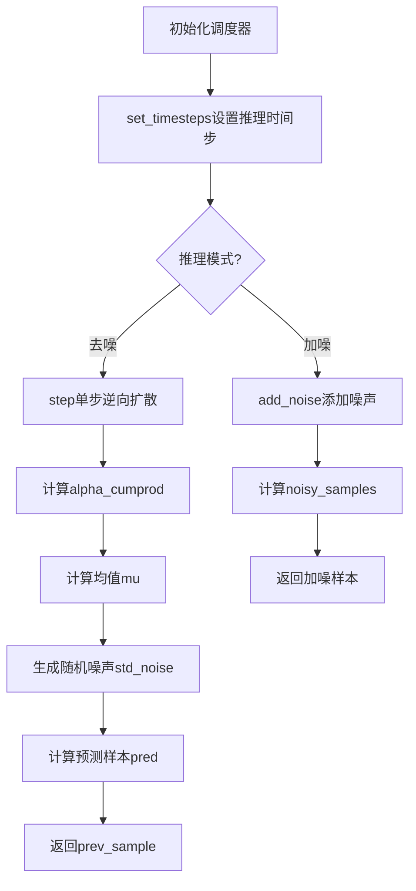
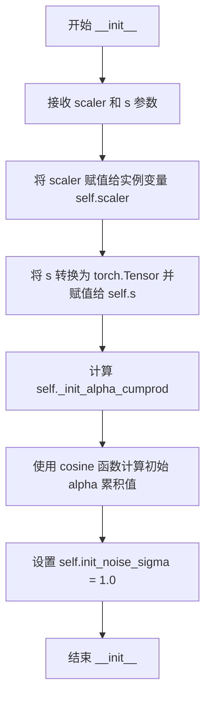
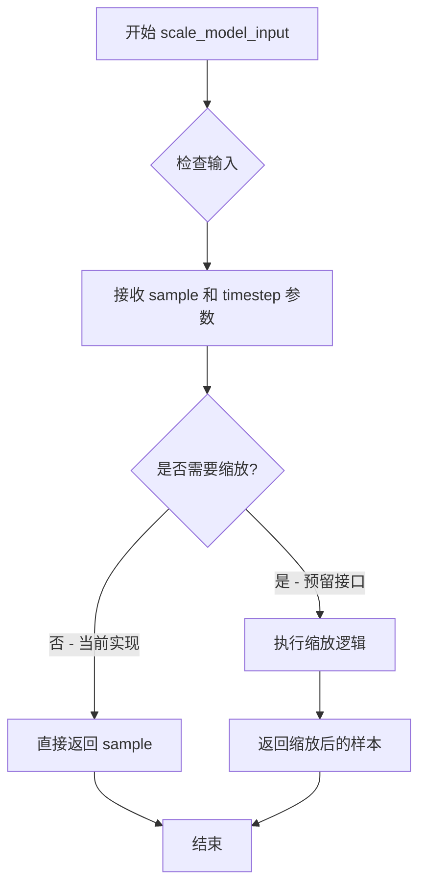
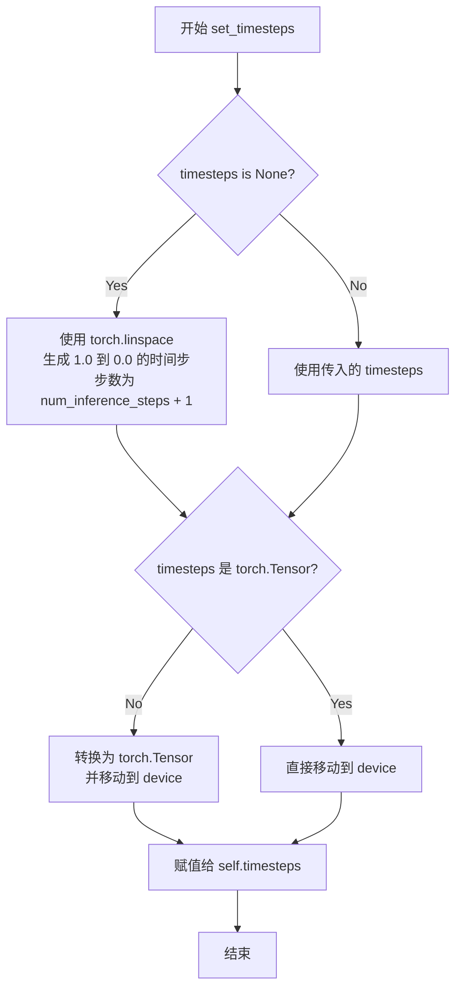
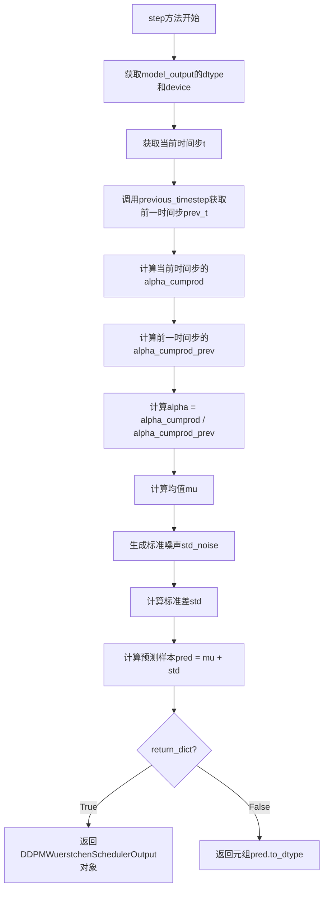
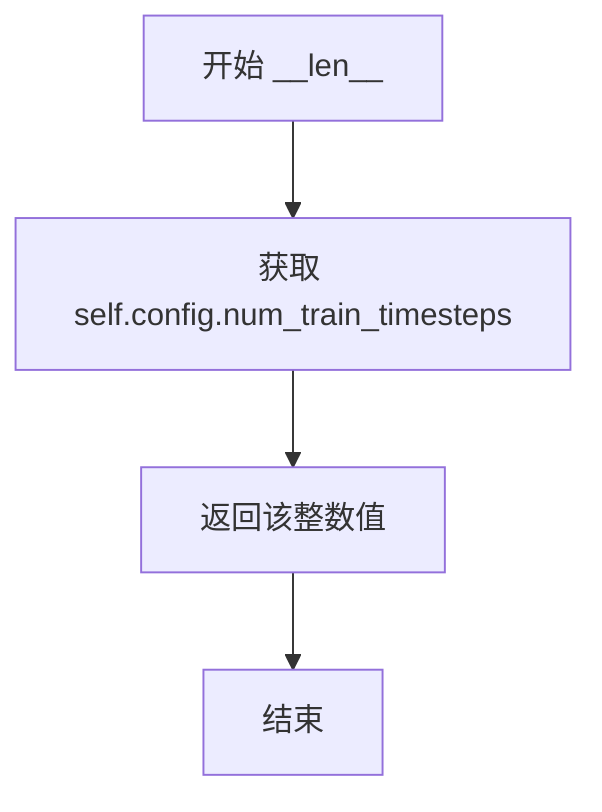

# `diffusers\src\diffusers\schedulers\scheduling_ddpm_wuerstchen.py` 详细设计文档

这是Wuerstchen扩散模型的DDPM调度器实现，核心功能是通过逆向扩散过程（Reverse SDE）从噪声样本逐步去噪生成图像，支持设置离散时间步、添加噪声和单步去噪推理。

## 整体流程



## 类结构

```
SchedulerMixin (混入类)
├── DDPMWuerstchenScheduler
ConfigMixin (混入类)
├── DDPMWuerstchenScheduler
DDPMWuerstchenSchedulerOutput (数据类)
└── 用于step函数返回
```

## 全局变量及字段


### `scaler`
    
缩放器参数，控制时间变换

类型：`float`
    


### `s`
    
s参数张量

类型：`torch.Tensor`
    


### `_init_alpha_cumprod`
    
初始alpha累积值

类型：`torch.Tensor`
    


### `init_noise_sigma`
    
初始噪声标准差

类型：`float`
    


### `timesteps`
    
离散时间步序列

类型：`torch.Tensor`
    


### `DDPMWuerstchenSchedulerOutput.prev_sample`
    
前一步计算的样本

类型：`torch.Tensor`
    
    

## 全局函数及方法


### `betas_for_alpha_bar`

创建beta调度表，将给定的alpha_t_bar函数进行离散化。该函数定义了从t = [0,1]开始的(1-beta)的累积乘积，通过alpha_bar函数接受参数t并转换到扩散过程中该部分的(1-beta)的累积乘积。

参数：

- `num_diffusion_timesteps`：`int`，要生成的beta数量
- `max_beta`：`float`，使用的最大beta值，默认为0.999，用于防止奇异性
- `alpha_transform_type`：`str`，alpha_bar的噪声调度类型，可选"cosine"或"exp"，默认为"cosine"

返回值：`torch.Tensor`（torch.float32），调度器用于逐步模型输出的beta值数组

#### 流程图

```mermaid
flowchart TD
    A[开始 betas_for_alpha_bar] --> B{alpha_transform_type == 'cosine'?}
    B -->|Yes| C[定义 alpha_bar_fn = cos²((t+0.008)/1.008 * π/2)]
    B -->|No| D{alpha_transform_type == 'exp'?}
    D -->|Yes| E[定义 alpha_bar_fn = exp(t * -12.0)]
    D -->|No| F[抛出 ValueError 异常]
    C --> G[初始化空列表 betas]
    E --> G
    G --> H[循环 i 从 0 到 num_diffusion_timesteps-1]
    H --> I[计算 t1 = i / num_diffusion_timesteps]
    H --> J[计算 t2 = (i+1) / num_diffusion_timesteps]
    I --> K[计算 beta = min(1 - alpha_bar_fn(t2) / alpha_bar_fn(t1), max_beta)]
    J --> K
    K --> L[将 beta 添加到 betas 列表]
    L --> M{还有更多时间步?}
    M -->|Yes| H
    M -->|No| N[将 betas 列表转换为 torch.Tensor float32]
    N --> O[返回 tensor]
```

#### 带注释源码

```python
def betas_for_alpha_bar(
    num_diffusion_timesteps,
    max_beta=0.999,
    alpha_transform_type="cosine",
):
    """
    Create a beta schedule that discretizes the given alpha_t_bar function, which defines the cumulative product of
    (1-beta) over time from t = [0,1].

    Contains a function alpha_bar that takes an argument t and transforms it to the cumulative product of (1-beta) up
    to that part of the diffusion process.


    Args:
        num_diffusion_timesteps (`int`): the number of betas to produce.
        max_beta (`float`): the maximum beta to use; use values lower than 1 to
                     prevent singularities.
        alpha_transform_type (`str`, *optional*, default to `cosine`): the type of noise schedule for alpha_bar.
                     Choose from `cosine` or `exp`

    Returns:
        betas (`np.ndarray`): the betas used by the scheduler to step the model outputs
    """
    # 根据 alpha_transform_type 选择不同的 alpha_bar 函数
    # cosine 变换：使用余弦平方函数，提供更平滑的噪声调度
    if alpha_transform_type == "cosine":

        def alpha_bar_fn(t):
            return math.cos((t + 0.008) / 1.008 * math.pi / 2) ** 2

    # exp 变换：使用指数衰减函数
    elif alpha_transform_type == "exp":

        def alpha_bar_fn(t):
            return math.exp(t * -12.0)

    # 不支持的变换类型，抛出错误
    else:
        raise ValueError(f"Unsupported alpha_transform_type: {alpha_transform_type}")

    # 初始化 beta 列表
    betas = []
    # 遍历每个扩散时间步，计算对应的 beta 值
    for i in range(num_diffusion_timesteps):
        # 计算当前时间步的起始和结束位置（归一化到 [0, 1] 区间）
        t1 = i / num_diffusion_timesteps
        t2 = (i + 1) / num_diffusion_timesteps
        # 计算 beta：1 - alpha_bar(t2) / alpha_bar(t1)
        # 使用 min 确保 beta 不超过 max_beta，防止奇异性
        betas.append(min(1 - alpha_bar_fn(t2) / alpha_bar_fn(t1), max_beta))
    
    # 将 beta 列表转换为 PyTorch float32 张量并返回
    return torch.tensor(betas, dtype=torch.float32)
```


### `DDPMWuerstchenScheduler.__init__`

DDPMWuerstchenScheduler类的初始化方法，负责配置扩散模型调度器的核心参数，包括缩放因子scaler、时间步长参数s，并计算初始的alpha累积产物，同时设置初始噪声标准差。

参数：

- `self`：隐式参数，DDPMWuerstchenScheduler类的实例
- `scaler`：`float`，缩放因子，用于调整时间步长的非线性变换，默认为1.0
- `s`：`float`，时间步长偏移参数，用于调整cosine调度器的起始点，默认为0.008

返回值：无（`None`），该方法为构造函数，不返回任何值，仅初始化对象状态

#### 流程图



#### 带注释源码

```python
@register_to_config
def __init__(
    self,
    scaler: float = 1.0,
    s: float = 0.008,
):
    # 将传入的 scaler 参数存储为实例变量，用于后续调整时间步长的非线性变换
    self.scaler = scaler
    
    # 将 s 参数转换为 PyTorch 张量并存储
    # s 是用于调整 cosine 调度器起始点的偏移参数
    self.s = torch.tensor([s])
    
    # 计算初始的 alpha 累积产物
    # 使用 cosine 函数: cos(s / (1 + s) * π / 2)²
    # 这是 Wuerstchen 调度器的核心参数，用于归一化 alpha_cumprod
    self._init_alpha_cumprod = torch.cos(self.s / (1 + self.s) * torch.pi * 0.5) ** 2

    # standard deviation of the initial noise distribution
    # 设置初始噪声分布的标准差为 1.0
    # 这是扩散模型在 t=0 时的噪声标准差
    self.init_noise_sigma = 1.0
```


### `DDPMWuerstchenScheduler._alpha_cumprod`

该方法用于计算扩散模型中给定时间步的累积 alpha 值（alpha_cumprod），它是扩散过程的核心参数之一，根据调度器的 scaler 参数对时间步进行非线性变换，并结合 Wuerstchen 调度器的特殊公式计算得到。

参数：

- `t`：`torch.Tensor`，当前时间步，通常为归一化的值（0-1 之间）
- `device`：`torch.device`，计算设备，用于将张量移动到指定设备（如 CPU 或 CUDA）

返回值：`torch.Tensor`，计算得到的累积 alpha 值，范围被限制在 [0.0001, 0.9999] 之间

#### 流程图

```mermaid
graph TD
    A[开始 _alpha_cumprod] --> B{scaler > 1?}
    B -->|是| C[t = 1 - (1 - t) ** scaler]
    B -->|否| D{scaler < 1?}
    D -->|是| E[t = t ** scaler]
    D -->|否| F[t 保持不变]
    C --> G[计算 alpha_cumprod]
    E --> G
    F --> G
    G --> H[alpha_cumprod = cos((t + s) / (1 + s) * π/2)² / _init_alpha_cumprod]
    H --> I[clamp 限制到 0.0001, 0.9999]
    I --> J[返回 alpha_cumprod]
```

#### 带注释源码

```python
def _alpha_cumprod(self, t, device):
    """
    计算给定时间步的累积 alpha 值（alpha_cumprod）。
    
    该方法实现了 Wuerstchen 调度器的核心公式，根据 scaler 参数
    对时间步进行非线性变换，然后计算累积乘积 alpha。
    
    参数:
        t: torch.Tensor - 当前时间步，归一化值
        device: torch.device - 计算设备
    
    返回:
        torch.Tensor - 累积 alpha 值，已限制在 [0.0001, 0.9999]
    """
    # 根据 scaler 对时间步进行非线性变换
    # scaler > 1: 使用凸函数变换，使后期扩散更慢
    if self.scaler > 1:
        t = 1 - (1 - t) ** self.scaler
    # scaler < 1: 使用凹函数变换，使前期扩散更慢
    elif self.scaler < 1:
        t = t**self.scaler
    # scaler == 1: 不做变换，使用线性进度
    
    # 使用 Wuerstchen 调度器公式计算 alpha_cumprod
    # 公式: alpha_cumprod = cos((t + s) / (1 + s) * π/2)² / init_alpha_cumprod
    alpha_cumprod = torch.cos(
        (t + self.s.to(device)) / (1 + self.s.to(device)) * torch.pi * 0.5
    ) ** 2 / self._init_alpha_cumprod.to(device)
    
    # 限制 alpha_cumprod 的范围，防止数值不稳定
    # 避免极端值导致计算问题
    return alpha_cumprod.clamp(0.0001, 0.9999)
```


### `DDPMWuerstchenScheduler.scale_model_input`

确保与其他需要根据当前时间步缩放去噪模型输入的调度器的可互换性。在DDPMWuerstchenScheduler中，该函数直接返回输入样本，不进行实际缩放操作，作为接口一致性保留。

参数：

- `self`：类的实例方法隐含参数
- `sample`：`torch.Tensor`，输入样本
- `timestep`：`int`，可选，当前时间步

返回值：`torch.Tensor`，缩放后的输入样本（在本实现中即为原始输入样本）

#### 流程图



#### 带注释源码

```python
def scale_model_input(self, sample: torch.Tensor, timestep: int = None) -> torch.Tensor:
    """
    Ensures interchangeability with schedulers that need to scale the denoising model input depending on the
    current timestep.

    Args:
        sample (`torch.Tensor`): input sample
        timestep (`int`, optional): current timestep

    Returns:
        `torch.Tensor`: scaled input sample
    """
    # 直接返回原始样本，不做任何处理
    # 这是因为DDPMWuerstchenScheduler不需要像其他调度器那样根据时间步缩放输入
    return sample
```


### `DDPMWuerstchenScheduler.set_timesteps`

设置扩散链中使用的离散时间步长。该方法在推理前运行，用于初始化扩散过程的时间步序列。支持两种方式：指定推理步数自动生成时间步，或直接传入自定义时间步列表。

参数：

- `num_inference_steps`：`int = None`，使用预训练模型生成样本时的扩散步数。如果传入此参数，则`timesteps`必须为`None`。
- `timesteps`：`list[int] | None = None`，可选的自定义时间步列表。如果传入此参数，则`num_inference_steps`必须为`None`。
- `device`：`str | torch.device = None`，时间步要移动到的设备。

返回值：`None`，无返回值。该方法直接修改实例属性`self.timesteps`。

#### 流程图



#### 带注释源码

```python
def set_timesteps(
    self,
    num_inference_steps: int = None,
    timesteps: list[int] | None = None,
    device: str | torch.device = None,
):
    """
    设置扩散链中使用的离散时间步长。推理前运行的辅助函数。

    参数:
        num_inference_steps (int):
            使用预训练模型生成样本时的扩散步数。如果传入此参数，则timesteps必须为None。
        timesteps (list[int] | None):
            可选的自定义时间步列表。如果传入此参数，则num_inference_steps必须为None。
        device (str | torch.device, optional):
            时间步要移动到的设备。
    """
    # 如果未传入自定义时间步，则根据推理步数生成线性间隔的时间步
    # 从 1.0 递减到 0.0，共 num_inference_steps + 1 个点（包含端点）
    if timesteps is None:
        timesteps = torch.linspace(1.0, 0.0, num_inference_steps + 1, device=device)
    
    # 确保 timesteps 是 torch.Tensor 类型，以便后续操作
    # 如果已经是 Tensor，直接移动到指定设备
    if not isinstance(timesteps, torch.Tensor):
        timesteps = torch.Tensor(timesteps).to(device)
    
    # 将最终的时间步序列存储到实例属性，供其他方法使用
    self.timesteps = timesteps
```


### DDPMWuerstchenScheduler.step

该方法是DDPM（去噪扩散概率模型）调度器的核心步骤函数，通过逆转扩散过程（SDE）并基于学习到的模型输出（通常为预测噪声）来预测前一个时间步的样本。这是扩散模型推理阶段的关键环节，负责从噪声样本逐步去噪直至生成最终样本。

参数：

- `model_output`：`torch.Tensor`，直接来自学习到的扩散模型的输出（通常为预测噪声）
- `timestep`：`int`，扩散链中的当前离散时间步
- `sample`：`torch.Tensor`，当前由扩散过程创建的样本实例
- `generator`：随机数生成器，用于可重复的采样
- `return_dict`：`bool`，选择返回元组还是DDPMWuerstchenSchedulerOutput类

返回值：`DDPMWuerstchenSchedulerOutput | tuple`，如果`return_dict`为True，则返回`DDPMWuerstchenSchedulerOutput`（包含`prev_sample`）；否则返回元组，第一个元素是样本张量。

#### 流程图



#### 带注释源码

```python
def step(
    self,
    model_output: torch.Tensor,
    timestep: int,
    sample: torch.Tensor,
    generator=None,
    return_dict: bool = True,
) -> DDPMWuerstchenSchedulerOutput | tuple:
    """
    Predict the sample at the previous timestep by reversing the SDE. Core function to propagate the diffusion
    process from the learned model outputs (most often the predicted noise).

    Args:
        model_output (`torch.Tensor`): direct output from learned diffusion model.
        timestep (`int`): current discrete timestep in the diffusion chain.
        sample (`torch.Tensor`):
            current instance of sample being created by diffusion process.
        generator: random number generator.
        return_dict (`bool`): option for returning tuple rather than DDPMWuerstchenSchedulerOutput class

    Returns:
        [`DDPMWuerstchenSchedulerOutput`] or `tuple`: [`DDPMWuerstchenSchedulerOutput`] if `return_dict` is True,
        otherwise a `tuple`. When returning a tuple, the first element is the sample tensor.

    """
    # 获取模型输出的数据类型和设备信息，用于后续保持一致
    dtype = model_output.dtype
    device = model_output.device
    # 当前时间步
    t = timestep

    # 获取前一时间步prev_t
    prev_t = self.previous_timestep(t)

    # 计算当前时间步的累积 alpha 值，并调整形状以适配sample的batch维度
    alpha_cumprod = self._alpha_cumprod(t, device).view(t.size(0), *[1 for _ in sample.shape[1:]])
    # 计算前一时间步的累积 alpha 值
    alpha_cumprod_prev = self._alpha_cumprod(prev_t, device).view(prev_t.size(0), *[1 for _ in sample.shape[1:]])
    # 计算当前时间步的alpha值（相邻时间步累积alpha的比值）
    alpha = alpha_cumprod / alpha_cumprod_prev

    # 计算均值mu：基于DDPM公式逆向推算
    # mu = (1/alpha) * (sample - (1-alpha) * model_output / sqrt(1-alpha_cumprod))
    mu = (1.0 / alpha).sqrt() * (sample - (1 - alpha) * model_output / (1 - alpha_cumprod).sqrt())

    # 生成标准高斯噪声，用于添加到预测样本中（保持随机性）
    std_noise = randn_tensor(mu.shape, generator=generator, device=model_output.device, dtype=model_output.dtype)
    # 计算标准差std：控制添加到样本中的噪声量
    std = ((1 - alpha) * (1.0 - alpha_cumprod_prev) / (1.0 - alpha_cumprod)).sqrt() * std_noise
    
    # 计算最终预测的前一时间步样本pred
    # 当prev_t != 0时添加噪声，当prev_t == 0时（最后一步）不加噪声
    pred = mu + std * (prev_t != 0).float().view(prev_t.size(0), *[1 for _ in sample.shape[1:]])

    # 根据return_dict决定返回格式
    if not return_dict:
        return (pred.to(dtype),)

    # 返回包含前一时间步样本的输出对象
    return DDPMWuerstchenSchedulerOutput(prev_sample=pred.to(dtype))
```


### DDPMWuerstchenScheduler.add_noise

该方法实现了DDPM扩散模型中的前向加噪过程（forward diffusion process），根据给定的时间步将噪声添加到原始样本中。这是扩散模型训练时对数据进行预处理的核心理论基础。

参数：

- `self`：`DDPMWuerstchenScheduler`，调度器实例
- `original_samples`：`torch.Tensor`，原始未加噪的样本张量，形状为(batch_size, num_channels, height, width)
- `noise`：`torch.Tensor`，要添加的高斯噪声张量，形状与original_samples相同
- `timesteps`：`torch.Tensor`，当前的时间步张量，用于确定每个样本的噪声水平

返回值：`torch.Tensor`，加噪后的样本张量，形状与original_samples相同

#### 流程图

```mermaid
flowchart TD
    A[开始 add_noise] --> B[获取原始样本的设备device和dtype]
    B --> C[调用_alpha_cumprod计算累积乘积alpha值]
    C --> D[将alpha_cumprod reshape为与原始样本广播兼容的形状]
    E[计算加噪样本: noisy_samples = sqrt(alpha_cumprod) * original + sqrt(1 - alpha_cumprod) * noise]
    D --> E
    E --> F[将结果转换为原始dtype并返回]
```

#### 带注释源码

```python
def add_noise(
    self,
    original_samples: torch.Tensor,
    noise: torch.Tensor,
    timesteps: torch.Tensor,
) -> torch.Tensor:
    """
    在给定时间步向原始样本添加噪声，实现DDPM前向扩散过程。
    
    使用扩散过程的闭式解：
    x_t = sqrt(alpha_cumprod) * x_0 + sqrt(1 - alpha_cumprod) * epsilon
    
    其中：
    - x_t 是加噪后的样本
    - x_0 是原始样本 (original_samples)
    - epsilon 是噪声 (noise)
    - alpha_cumprod 是累积alpha值
    """
    # 获取原始样本所在的设备和数据类型
    device = original_samples.device
    dtype = original_samples.dtype
    
    # 计算在给定时间步t下的累积alpha值
    # alpha_cumprod表示从开始到时间t的(1-beta)的累积乘积
    alpha_cumprod = self._alpha_cumprod(timesteps, device=device).view(
        timesteps.size(0), *[1 for _ in original_samples.shape[1:]]
    )
    # view操作将alpha_cumprod从(batch_size,)扩展为(batch_size, 1, 1, ...)
    # 以便与原始样本的(batch_size, C, H, W)形状进行广播运算
    
    # 应用DDPM加噪公式
    noisy_samples = alpha_cumprod.sqrt() * original_samples + (1 - alpha_cumprod).sqrt() * noise
    
    # 确保输出类型与输入一致，然后返回
    return noisy_samples.to(dtype=dtype)
```


### `DDPMWuerstchenScheduler.__len__`

该方法实现了 Python 的魔术方法 `__len__`，允许对调度器对象使用 `len()` 函数，返回调度器配置中定义的训练时间步总数，用于确定扩散模型训练过程中所需的总迭代次数。

参数：无需显式参数（self 为隐含参数）

返回值：`int`，返回调度器的训练时间步数（num_train_timesteps），即扩散过程中使用的总离散时间步数。

#### 流程图



#### 带注释源码

```python
def __len__(self):
    """
    返回调度器训练时使用的时间步总数。
    
    该方法实现了 Python 的特殊方法 __len__，使得可以使用 len(scheduler) 
    来获取调度器配置中定义的扩散过程总时间步数。这个值通常在配置中
    指定，用于控制扩散模型训练和推理过程中的迭代次数。
    
    Returns:
        int: 训练时间步总数，存储在配置对象的 num_train_timesteps 属性中
    """
    return self.config.num_train_timesteps
```


### DDPMWuerstchenScheduler.previous_timestep

该方法用于在扩散模型的去噪过程中，根据当前时间步获取前一个时间步（timestep）。它通过在预定义的 `timesteps` 张量中查找与当前时间步最接近的索引，然后返回该索引位置加一处的值，以实现时间步的逐步递减。

参数：

- `timestep`：`torch.Tensor`，当前扩散链中的时间步，通常是一个包含单个时间步值的张量

返回值：`torch.Tensor`，返回前一个时间步的张量，其形状与输入的 `timestep` 相同

#### 流程图

```mermaid
flowchart TD
    A[开始: 输入当前timestep] --> B[提取timestep的第一个元素<br/>timestep[0]]
    B --> C[计算差值绝对值<br/>self.timesteps - timestep[0]]
    C --> D[寻找最小差值索引<br/>abs().argmin()]
    D --> E[获取前一时间步索引<br/>index + 1]
    E --> F[扩展为张量<br/>timesteps[index + 1][None].expand]
    F --> G[返回前一时间步张量]
```

#### 带注释源码

```python
def previous_timestep(self, timestep):
    """
    获取扩散链中当前时间步的前一个时间步。
    
    Args:
        timestep: 当前的时间步，类型为torch.Tensor
        
    Returns:
        torch.Tensor: 前一个时间步的张量
    """
    # 第一步：计算预定义时间步列表与当前时间步的绝对差值
    # self.timesteps 是从 set_timesteps 方法设置的时间步序列
    # timestep[0] 提取张量中的第一个标量值作为比较基准
    index = (self.timesteps - timestep[0]).abs().argmin().item()
    
    # 第二步：通过找到的索引获取下一个时间步
    # index + 1 表示向前移动一个时间步
    # [None] 扩展维度以适应批量处理
    # expand(timestep.shape[0]) 复制到与输入相同的批量大小
    prev_t = self.timesteps[index + 1][None].expand(timestep.shape[0])
    
    # 返回前一个时间步的张量
    return prev_t
```

## 关键组件


### 张量索引与形状操作

在`step`方法中，通过`.view()`和广播机制实现张量形状的动态适配，将标量时间步扩展为与样本形状兼容的张量，以便进行逐元素运算。

### 反量化支持

代码中的`dtype`处理体现了对不同数据类型的支持，通过在`step`和`add_noise`方法中保存原始`model_output`的dtype，并在返回前转换为该dtype，确保量化模型的输出能够正确反量化。

### Alpha累积乘积计算

`_alpha_cumprod`方法实现了基于scaler参数的非线性时间变换，支持cosine方式的alpha累积乘积计算，这是扩散模型的核心数学基础。

### 噪声调度策略

`betas_for_alpha_bar`函数生成了离散的beta调度，支持cosine和exp两种alpha变换类型，为扩散过程提供不同的噪声注入策略。

### 调度器初始化与配置

通过`ConfigMixin`和`@register_to_config`装饰器实现配置的存储和访问，包含scaler和s参数，用于控制扩散过程的时间变换。

### 推理时间步设置

`set_timesteps`方法支持自定义时间步序列，允许从完整时间步中选取特定的时间点进行推理采样。

### 噪声注入与样本生成

`add_noise`方法实现了标准的扩散前向过程，通过alpha累积乘积线性组合原始样本和噪声，生成带噪样本。

### 逆向扩散步骤

`step`方法实现了DDPM的逆向采样过程，通过预测的噪声计算均值和方差，逐步去噪至原始样本。

### 随机数生成器支持

在`step`方法中集成`randn_tensor`支持外部随机数生成器，确保扩散过程的可重复性。

### 惰性时间步查询

`previous_timestep`方法通过argmin操作动态查找当前时间步的前一个时间点，支持非均匀时间步间隔。


## 问题及建议


### 已知问题

- `betas_for_alpha_bar`函数定义后未被任何代码调用，属于冗余代码
- `__len__`方法返回`self.config.num_train_timesteps`，但该配置属性在`__init__`中未被初始化或设置，可能导致运行时错误
- `previous_timestep`方法使用`argmin`进行线性查找时间复杂度为O(n)，且索引访问未做边界检查（当timestep等于timesteps[0]时index+1会越界）
- 类文档字符串中`scaler`和`s`参数的描述仅为占位符"...."，未提供实际功能说明
- `step`方法接收`generator`参数但未正确使用，生成的`std_noise`未传入generator控制
- `add_noise`方法缺少完整的文档字符串描述
- `set_timesteps`方法的`timesteps`参数类型注解为`list[int] | None`，但实际接收标量列表时会进行张量转换，逻辑不够严谨
- `_alpha_cumprod`方法每次调用都执行`self.s.to(device)`，在循环推理场景下会产生设备传输开销，应预先缓存
- `step`方法中`prev_t != 0`的布尔检查可能产生非预期行为，当timestep为非零值但不是最后一个时逻辑不明确

### 优化建议

- 删除未使用的`betas_for_alpha_bar`函数以减少代码冗余
- 在`__init__`中初始化`num_train_timesteps`配置属性，或修改`__len__`方法返回合理的默认值
- 使用字典或二分查找优化`timesteps`查询性能，并添加边界检查防止越界
- 补充完善类文档字符串中参数的真实描述信息
- 确保`generator`参数在噪声生成过程中正确传递和使用
- 为所有公共方法添加完整规范的文档字符串
- 在`_alpha_cumprod`中预先计算并缓存`self._init_alpha_cumprod.to(device)`避免重复设备传输
- 明确`step`方法中时间步判断逻辑，考虑使用显式的时间步索引而非隐式比较
- 统一代码风格，添加类型注解覆盖所有参数
- 添加输入验证逻辑，检查`num_inference_steps`等关键参数的合法性


## 其它


### 设计目标与约束

本调度器实现DDPM（Denoising Diffusion Probabilistic Model）调度算法，用于Wuerstchen架构的扩散模型采样过程。设计目标包括：1）提供与diffusers库调度器接口的兼容性，通过ConfigMixin和SchedulerMixin实现配置管理和预训练模型加载/保存功能；2）支持cosine和exponential两种alpha转换类型；3）通过scaler参数支持对时间表的非线性缩放；4）实现标准DDPM采样和噪声添加的核心功能。约束条件包括：依赖PyTorch张量运算，不支持JIT编译优化，scaler参数需大于0。

### 错误处理与异常设计

1. alpha_transform_type参数验证：在betas_for_alpha_bar函数中，当传入不支持的alpha_transform_type时，抛出ValueError异常，提示"Unsupported alpha_transform_type: {type}"。2. 数值范围限制：在_alpha_cumprod方法中，使用clamp(0.0001, 0.9999)限制alpha_cumprod的输出范围，防止数值不稳定。3. 参数类型检查：set_timesteps方法中检查timesteps是否为torch.Tensor类型，若不是则进行转换。4. 返回值验证：step方法根据return_dict参数决定返回格式，确保返回类型一致性。

### 数据流与状态机

调度器状态转换流程：1）初始化状态（__init__）：设置scaler、s参数，计算init_noise_sigma=1.0和_init_alpha_cumprod；2）配置状态（set_timesteps）：接收num_inference_steps或timesteps列表，生成线性时间表并存储在self.timesteps；3）推理状态（循环step）：对于每个timestep，调用step方法根据model_output计算前一时刻的sample；4）完成状态：当timestep序列遍历完毕，输出最终sample。在step方法内部，使用alpha_cumprod、alpha_cumprod_prev计算当前和前一时刻的累积乘积，然后计算均值mu和标准差std，最后结合随机噪声生成预测样本。

### 外部依赖与接口契约

核心依赖包括：1）torch：所有张量运算的基础；2）dataclasses.dataclass：DDPMWuerstchenSchedulerOutput数据类定义；3）configuration_utils.ConfigMixin和register_to_config装饰器：实现配置属性自动注册和存储；4）utils.BaseOutput：调度器输出的基类；5）utils.torch_utils.randn_tensor：生成符合扩散模型要求的随机张量；6）scheduling_utils.SchedulerMixin：提供save_pretrained和from_pretrained方法。接口契约要求：1）sample和model_output需为4D张量(batch_size, num_channels, height, width)；2）timestep需为整数或1D张量；3）step方法返回DDPMWuerstchenSchedulerOutput或tuple(pred_sample,)。

### 性能考虑

1. 张量批量操作：所有计算均使用向量化操作，避免Python循环；2. 视图操作：在step和add_noise中使用view方法扩展维度而非复制数据；3. 设备管理：通过.to(device)确保张量在正确设备上运行；4. 惰性计算：_alpha_cumprod方法在每次调用时计算而非预计算。潜在优化空间：1）可缓存alpha_cumprod值避免重复计算；2）可使用torch.compile加速推理；3）可实现混合精度计算支持。

### 并发/线程安全性

本调度器非线程安全：1）成员变量self.timesteps在推理过程中可能被并发修改；2）self.s为tensor类型，跨线程访问需谨慎。设计建议：1）多线程场景下每个线程应创建独立的调度器实例；2）不应在推理过程中修改调度器配置参数；3）建议使用threading.Lock保护共享调度器实例的访问。

### 配置管理

配置通过@dataclass装饰器和@register_to_config装饰器管理：1）配置类自动收集__init__方法中带有类型标注的参数；2）scaler（float，默认1.0）：控制时间表的缩放因子；3）s（float，默认0.008）：Wuerstchen架构特有参数，用于alpha_cumprod计算；4）num_train_timesteps：训练时间步数（从基类SchedulerMixin继承）。配置保存和加载通过SchedulerMixin.save_pretrained和from_pretrained方法实现，支持将调度器配置序列化为JSON文件。

### 版本兼容性

1）Python版本：建议Python 3.8+；2）PyTorch版本：最低1.9.0，推荐2.0+以获得更好性能；3）语法兼容性：代码中使用Python 3.10+的类型提示语法（list[int] | None），需确保Python版本支持或安装typing_extensions；4）diffusers库版本：需0.23.0以上版本以支持SchedulerMixin和ConfigMixin的最新API；5）torch函数兼容性：argmin方法在torch 1.9+可用，expand方法需注意返回视图而非拷贝。

### 测试策略

建议测试用例包括：1）单元测试：验证betas_for_alpha_bar生成的beta值范围正确；验证_alpha_cumprod输出在有效范围内；验证set_timesteps生成的timesteps序列正确；2）集成测试：使用简单模型验证完整采样流程；验证add_noise生成的噪声样本统计特性符合预期；3）数值稳定性测试：极端scaler值（如0.1、10.0）下的数值稳定性；4）接口兼容性测试：验证与diffusers库其他调度器的接口一致性；5）回归测试：确保更新后输出结果与历史版本一致。

### 使用示例

```python
from diffusers import DDPMWuerstchenScheduler
import torch

# 初始化调度器
scheduler = DDPMWuerstchenScheduler(scaler=1.0, s=0.008)

# 设置推理时间步
scheduler.set_timesteps(num_inference_steps=50, device="cuda")

# 模拟扩散采样过程
sample = torch.randn(1, 4, 64, 64, device="cuda")
model_output = torch.randn(1, 4, 64, 64, device="cuda")

for t in scheduler.timesteps:
    # 获取当前时刻
    timestep = torch.tensor([t], device="cuda")
    
    # 调度器步进
    output = scheduler.step(model_output, timestep, sample)
    sample = output.prev_sample
    
# 添加噪声（训练或数据增强）
noise = torch.randn(1, 4, 64, 64, device="cuda")
timesteps = torch.tensor([100], device="cuda")
noisy_samples = scheduler.add_noise(sample, noise, timesteps)
```

    