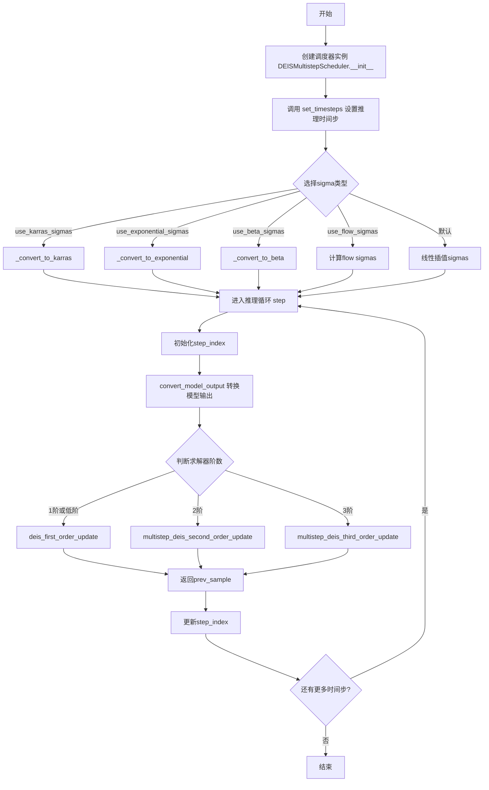
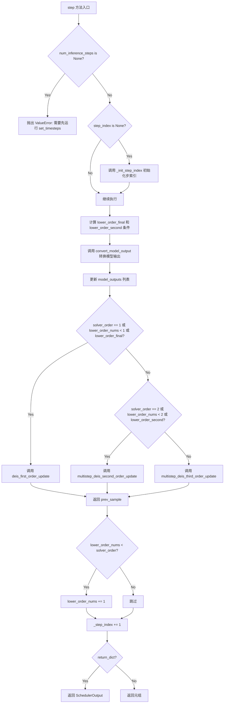
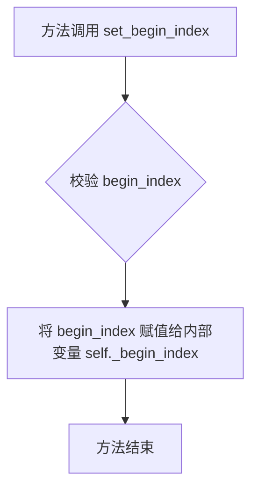
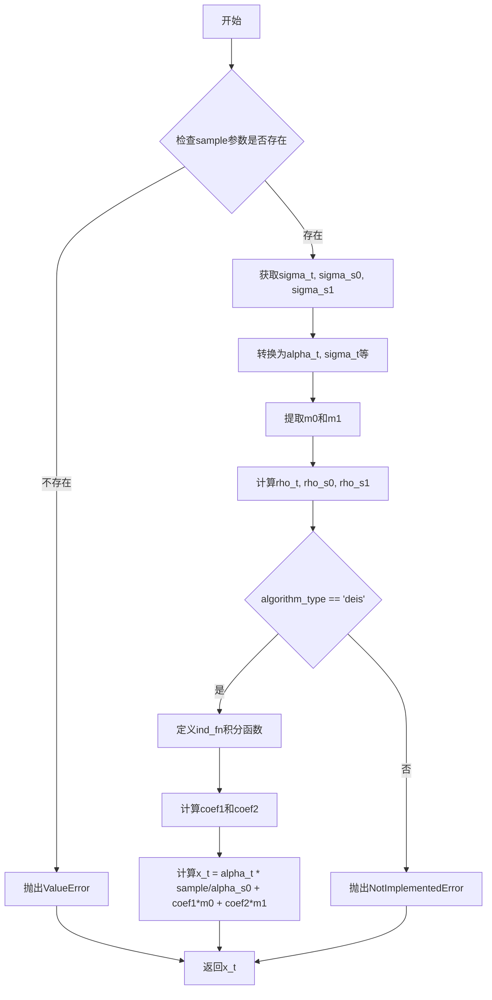
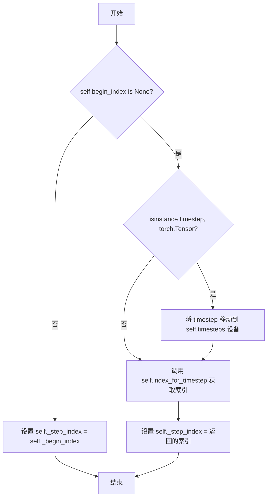
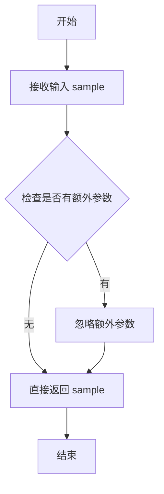
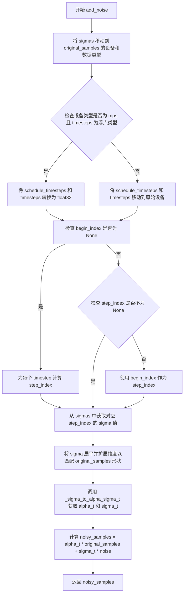

# `diffusers\src\diffusers\schedulers\scheduling_deis_multistep.py` 详细设计文档

DEISMultistepScheduler是一个基于扩散指数积分求解器(DEIS)的高阶快速求解器，用于扩散常微分方程(ODE)的采样。该调度器继承自SchedulerMixin和ConfigMixin，实现了多种噪声调度策略(包括Karras、指数、Beta和Flow sigma)，支持动态阈值处理和多阶求解器(1-3阶)，主要用于扩散模型的推理采样过程。

## 整体流程



## 类结构

```
SchedulerMixin (抽象基类)
├── ConfigMixin (配置Mixin)
└── DEISMultistepScheduler (主调度器类)
```

## 全局变量及字段


### `betas_for_alpha_bar`
    
Create a beta schedule that discretizes the given alpha_t_bar function, which defines the cumulative product of (1-beta) over time from t = [0,1]

类型：`function`
    


### `scipy`
    
scipy.stats module for beta distribution when use_beta_sigmas is enabled

类型：`module (conditional)`
    


### `np`
    
NumPy module for numerical operations

类型：`module`
    


### `torch`
    
PyTorch module for tensor operations

类型：`module`
    


### `DEISMultistepScheduler.betas`
    
Beta值序列，用于定义扩散过程的噪声schedule

类型：`torch.Tensor`
    


### `DEISMultistepScheduler.alphas`
    
1 - betas，表示信号保留比例

类型：`torch.Tensor`
    


### `DEISMultistepScheduler.alphas_cumprod`
    
累积乘积的alphas，用于计算alpha_t和sigma_t

类型：`torch.Tensor`
    


### `DEISMultistepScheduler.alpha_t`
    
当前时间步的alpha值

类型：`torch.Tensor`
    


### `DEISMultistepScheduler.sigma_t`
    
当前时间步的sigma值

类型：`torch.Tensor`
    


### `DEISMultistepScheduler.lambda_t`
    
log(alpha_t) - log(sigma_t)，用于DEIS计算

类型：`torch.Tensor`
    


### `DEISMultistepScheduler.sigmas`
    
噪声标准差序列

类型：`torch.Tensor`
    


### `DEISMultistepScheduler.init_noise_sigma`
    
初始噪声分布的标准差，默认为1.0

类型：`float`
    


### `DEISMultistepScheduler.num_inference_steps`
    
推理步骤数

类型：`int`
    


### `DEISMultistepScheduler.timesteps`
    
时间步序列

类型：`torch.Tensor`
    


### `DEISMultistepScheduler.model_outputs`
    
存储历史模型输出，用于多步求解器

类型：`list`
    


### `DEISMultistepScheduler.lower_order_nums`
    
低阶求解器使用计数

类型：`int`
    


### `DEISMultistepScheduler._step_index`
    
当前推理步骤索引

类型：`int`
    


### `DEISMultistepScheduler._begin_index`
    
起始索引，用于pipeline控制

类型：`int`
    


### `DEISMultistepScheduler.order`
    
求解器阶数，默认为1

类型：`int`
    


### `DEISMultistepScheduler._compatibles`
    
兼容的KarrasDiffusionSchedulers枚举名称列表

类型：`list`
    
    

## 全局函数及方法


### `betas_for_alpha_bar`

该函数用于创建离散的beta调度表，通过定义累积乘积函数 alpha_bar 来实现对扩散过程噪声调度的精确控制。支持三种alpha变换类型（cosine、exp、laplace），并通过最小化alpha变化率与最大beta值的比较来生成beta序列。

参数：

- `num_diffusion_timesteps`：`int`，要生成的beta总数量，即扩散时间步数
- `max_beta`：`float`，默认为 `0.999`，beta值的上限，用于避免数值不稳定
- `alpha_transform_type`：`Literal["cosine", "exp", "laplace"]`，默认为 `"cosine"`，alpha_bar函数的噪声调度类型

返回值：`torch.Tensor`，返回用于调度器逐步模型输出的beta值张量，dtype为float32

#### 流程图

```mermaid
flowchart TD
    A[开始 betas_for_alpha_bar] --> B{alpha_transform_type == 'cosine'}
    B -->|Yes| C[定义 cosine alpha_bar_fn]
    B -->|No| D{alpha_transform_type == 'laplace'}
    D -->|Yes| E[定义 laplace alpha_bar_fn]
    D -->|No| F{alpha_transform_type == 'exp'}
    F -->|Yes| G[定义 exp alpha_bar_fn]
    F -->|No| H[raise ValueError 不支持的类型]
    C --> I[初始化空列表 betas]
    E --> I
    G --> I
    I --> J[循环 i 从 0 到 num_diffusion_timesteps-1]
    J --> K[计算 t1 = i / num_diffusion_timesteps]
    J --> L[计算 t2 = (i + 1) / num_diffusion_timesteps]
    K --> M[计算 beta = min1 - alpha_bar_fn(t2) / alpha_bar_fn(t1), max_beta]
    L --> M
    M --> N[将 beta 添加到 betas 列表]
    N --> O{循环是否结束}
    O -->|No| J
    O -->|Yes| P[返回 torch.tensorbetas, dtype=torch.float32]
```

#### 带注释源码

```python
def betas_for_alpha_bar(
    num_diffusion_timesteps: int,
    max_beta: float = 0.999,
    alpha_transform_type: Literal["cosine", "exp", "laplace"] = "cosine",
) -> torch.Tensor:
    """
    Create a beta schedule that discretizes the given alpha_t_bar function, which defines the cumulative product of
    (1-beta) over time from t = [0,1].

    Contains a function alpha_bar that takes an argument t and transforms it to the cumulative product of (1-beta) up
    to that part of the diffusion process.

    Args:
        num_diffusion_timesteps (`int`):
            The number of betas to produce.
        max_beta (`float`, defaults to `0.999`):
            The maximum beta to use; use values lower than 1 to avoid numerical instability.
        alpha_transform_type (`str`, defaults to `"cosine"`):
            The type of noise schedule for `alpha_bar`. Choose from `cosine`, `exp`, or `laplace`.

    Returns:
        `torch.Tensor`:
            The betas used by the scheduler to step the model outputs.
    """
    # 根据alpha_transform_type选择对应的alpha_bar函数
    # cosine: 使用余弦函数实现平滑的噪声调度
    if alpha_transform_type == "cosine":

        def alpha_bar_fn(t):
            # 余弦变换：使用偏移量0.008/1.008进行平滑处理
            # t范围[0,1]，经过变换后接近标准的cosine曲线
            return math.cos((t + 0.008) / 1.008 * math.pi / 2) ** 2

    # laplace: 使用拉普拉斯分布相关的变换
    elif alpha_transform_type == "laplace":

        def alpha_bar_fn(t):
            # 计算拉普拉斯分布的lambda参数
            # 使用copysign和fabs处理t在0.5两侧的情况
            lmb = -0.5 * math.copysign(1, 0.5 - t) * math.log(1 - 2 * math.fabs(0.5 - t) + 1e-6)
            # 计算信噪比SNR
            snr = math.exp(lmb)
            # 返回归一化后的sqrt(snr / (1 + snr))
            return math.sqrt(snr / (1 + snr))

    # exp: 使用指数衰减函数
    elif alpha_transform_type == "exp":

        def alpha_bar_fn(t):
            # 指数衰减：t * -12.0 表示快速衰减
            return math.exp(t * -12.0)

    # 如果传入不支持的类型，抛出ValueError
    else:
        raise ValueError(f"Unsupported alpha_transform_type: {alpha_transform_type}")

    # 初始化betas列表用于存储计算得到的beta值
    betas = []
    # 遍历每个扩散时间步
    for i in range(num_diffusion_timesteps):
        # t1表示当前时间步的归一化位置 [0, 1)
        t1 = i / num_diffusion_timesteps
        # t2表示下一个时间步的归一化位置 (0, 1]
        t2 = (i + 1) / num_diffusion_timesteps
        # 计算beta值：1 - alpha_bar(t2) / alpha_bar(t1)
        # 并与max_beta比较取最小值，防止数值不稳定
        betas.append(min(1 - alpha_bar_fn(t2) / alpha_bar_fn(t1), max_beta))
    
    # 将betas列表转换为PyTorch张量，使用float32类型
    return torch.tensor(betas, dtype=torch.float32)
```


### `DEISMultistepScheduler.__init__`

这是 DEISMultistepScheduler 类的初始化方法，负责配置扩散 ODE 求解器的所有参数、生成噪声调度（beta/alpha 值）并初始化推理所需的状态变量。

参数：

- `num_train_timesteps`：`int`，默认值 `1000`，训练时的扩散步数。
- `beta_start`：`float`，默认值 `0.0001`，beta 调度起始值。
- `beta_end`：`float`，默认值 `0.02`，beta 调度结束值。
- `beta_schedule`：`Literal["linear", "scaled_linear", "squaredcos_cap_v2"]`，默认值 `"linear"`，beta 噪声调度策略。
- `traied_betas`：`np.ndarray | list[float] | None`，默认值 `None`，直接传入的 beta 值数组。
- `solver_order`：`int`，默认值 `2`，DEIS 求解器阶数（1/2/3）。
- `prediction_type`：`Literal["epsilon", "sample", "v_prediction", "flow_prediction"]`，默认值 `"epsilon"`，模型预测类型。
- `thresholding`：`bool`，默认值 `False`，是否启用动态阈值处理。
- `dynamic_thresholding_ratio`：`float`，默认值 `0.995`，动态阈值比例。
- `sample_max_value`：`float`，默认值 `1.0`，动态阈值最大像素值。
- `algorithm_type`：`Literal["deis"]`，默认值 `"deis"`，算法类型。
- `solver_type`：`Literal["logrho"]`，默认值 `"logrho"`，求解器类型。
- `lower_order_final`：`bool`，默认值 `True`，最终步骤是否降阶。
- `use_karras_sigmas`：`bool`，默认值 `False`，是否使用 Karras sigmas。
- `use_exponential_sigmas`：`bool`，默认值 `False`，是否使用指数 sigmas。
- `use_beta_sigmas`：`bool`，默认值 `False`，是否使用 beta sigmas。
- `use_flow_sigmas`：`bool`，默认值 `False`，是否使用流 sigmas。
- `flow_shift`：`float`，默认值 `1.0`，流偏移参数。
- `timestep_spacing`：`Literal["linspace", "leading", "trailing"]`，默认值 `"linspace"`，时间步间距策略。
- `steps_offset`：`int`，默认值 `0`，推理步数偏移量。
- `use_dynamic_shifting`：`bool`，默认值 `False`，是否使用动态偏移。
- `time_shift_type`：`Literal["exponential"]`，默认值 `"exponential"`，时间偏移类型。

返回值：`None`，无返回值（该方法仅初始化对象状态）。

#### 流程图

```mermaid
flowchart TD
    A[开始 __init__] --> B{检查 beta_sigmas 依赖}
    B -->|use_beta_sigmas 且 scipy 不可用| C[raise ImportError]
    B --> D{检查 sigmas 配置冲突}
    D -->|多个 sigmas 选项同时启用| E[raise ValueError]
    D --> F[根据 trained_betas 或 beta_schedule 计算 betas]
    F --> G[计算 alphas = 1.0 - betas]
    G --> H[计算 alphas_cumprod = cumprod(alphas)]
    H --> I[计算 alpha_t, sigma_t, lambda_t, sigmas]
    I --> J[设置 init_noise_sigma = 1.0]
    J --> K{验证 algorithm_type}
    K -->|非法| L[raise NotImplementedError]
    K -->|合法| M[注册到 config]
    M --> N{验证 solver_type}
    N -->|非法| O[raise NotImplementedError]
    N -->|合法| P[注册到 config]
    P --> Q[初始化 num_inference_steps = None]
    Q --> R[生成 timesteps 数组]
    R --> S[初始化 model_outputs 列表]
    S --> T[初始化 lower_order_nums = 0]
    T --> U[初始化 _step_index, _begin_index]
    U --> V[将 sigmas 移到 CPU]
    V --> Z[结束 __init__]
```

#### 带注释源码

```python
@register_to_config
def __init__(
    self,
    num_train_timesteps: int = 1000,
    beta_start: float = 0.0001,
    beta_end: float = 0.02,
    beta_schedule: Literal["linear", "scaled_linear", "squaredcos_cap_v2"] = "linear",
    trained_betas: np.ndarray | list[float] | None = None,
    solver_order: int = 2,
    prediction_type: Literal["epsilon", "sample", "v_prediction", "flow_prediction"] = "epsilon",
    thresholding: bool = False,
    dynamic_thresholding_ratio: float = 0.995,
    sample_max_value: float = 1.0,
    algorithm_type: Literal["deis"] = "deis",
    solver_type: Literal["logrho"] = "logrho",
    lower_order_final: bool = True,
    use_karras_sigmas: bool = False,
    use_exponential_sigmas: bool = False,
    use_beta_sigmas: bool = False,
    use_flow_sigmas: bool = False,
    flow_shift: float = 1.0,
    timestep_spacing: Literal["linspace", "leading", "trailing"] = "linspace",
    steps_offset: int = 0,
    use_dynamic_shifting: bool = False,
    time_shift_type: Literal["exponential"] = "exponential",
) -> None:
    # 检查 scipy 依赖：使用 beta_sigmas 时必须安装 scipy
    if self.config.use_beta_sigmas and not is_scipy_available():
        raise ImportError("Make sure to install scipy if you want to use beta sigmas.")
    
    # 检查冲突：只能启用一种 sigmas 策略
    if (
        sum(
            [
                self.config.use_beta_sigmas,
                self.config.use_exponential_sigmas,
                self.config.use_karras_sigmas,
            ]
        )
        > 1
    ):
        raise ValueError(
            "Only one of `config.use_beta_sigmas`, `config.use_exponential_sigmas`, `config.use_karras_sigmas` can be used."
        )
    
    # 根据配置生成 betas 序列
    if trained_betas is not None:
        # 直接使用传入的 betas 数组
        self.betas = torch.tensor(trained_betas, dtype=torch.float32)
    elif beta_schedule == "linear":
        # 线性调度：beta 从 start 到 end 线性增长
        self.betas = torch.linspace(beta_start, beta_end, num_train_timesteps, dtype=torch.float32)
    elif beta_schedule == "scaled_linear":
        # 缩放线性调度：先线性增长 sqrt(beta)，再平方（适用于 latent 扩散模型）
        self.betas = (
            torch.linspace(
                beta_start**0.5,
                beta_end**0.5,
                num_train_timesteps,
                dtype=torch.float32,
            )
            ** 2
        )
    elif beta_schedule == "squaredcos_cap_v2":
        # 余弦调度（Glide Cosine）
        self.betas = betas_for_alpha_bar(num_train_timesteps)
    else:
        raise NotImplementedError(f"{beta_schedule} is not implemented for {self.__class__}")

    # 计算 alpha 相关变量：alpha = 1 - beta
    self.alphas = 1.0 - self.betas
    # 累积乘积：alpha_cumprod[t] = prod(alphas[0:t])
    self.alphas_cumprod = torch.cumprod(self.alphas, dim=0)
    # 当前时间步的 alpha 和 sigma（VP 噪声调度）
    self.alpha_t = torch.sqrt(self.alphas_cumprod)
    self.sigma_t = torch.sqrt(1 - self.alphas_cumprod)
    # log-snr：lambda = log(alpha) - log(sigma)
    self.lambda_t = torch.log(self.alpha_t) - torch.log(self.sigma_t)
    # sigmas：sigma = sqrt((1 - alpha_cumprod) / alpha_cumprod)
    self.sigmas = ((1 - self.alphas_cumprod) / self.alphas_cumprod) ** 0.5

    # 初始噪声分布的标准差
    self.init_noise_sigma = 1.0

    # DEIS 特有设置：验证算法类型
    if algorithm_type not in ["deis"]:
        if algorithm_type in ["dpmsolver", "dpmsolver++"]:
            # 兼容旧的 DPMSolver 配置
            self.register_to_config(algorithm_type="deis")
        else:
            raise NotImplementedError(f"{algorithm_type} is not implemented for {self.__class__}")

    # 验证求解器类型
    if solver_type not in ["logrho"]:
        if solver_type in ["midpoint", "heun", "bh1", "bh2"]:
            self.register_to_config(solver_type="logrho")
        else:
            raise NotImplementedError(f"solver type {solver_type} is not implemented for {self.__class__}")

    # 可设置的推理状态变量
    self.num_inference_steps = None
    # 生成完整的时间步序列（从 T-1 到 0，用于训练阶段）
    timesteps = np.linspace(0, num_train_timesteps - 1, num_train_timesteps, dtype=np.float32)[::-1].copy()
    self.timesteps = torch.from_numpy(timesteps)
    # 模型输出缓冲区（保存 solver_order 个历史输出）
    self.model_outputs = [None] * solver_order
    # 记录低阶求解器使用次数
    self.lower_order_nums = 0
    # 推理步骤索引
    self._step_index = None
    self._begin_index = None
    # 将 sigmas 保留在 CPU 以减少 GPU/CPU 通信开销
    self.sigmas = self.sigmas.to("cpu")
```


### DEISMultistepScheduler.step

该方法是 DEIS（Diffusion Exponential Integration Solver）多步调度器的核心步骤函数，通过逆向扩散随机微分方程（SDE）预测上一个时间步的样本。它根据配置的执行阶数（solver_order）选择合适的一阶、二阶或三阶DEIS更新算法来计算前一个样本，并维护模型输出历史以实现多步预测。

参数：

- `model_output`：`torch.Tensor`，模型直接输出的预测值（可以是噪声、样本、v预测或流预测，取决于prediction_type配置）
- `timestep`：`int | torch.Tensor`，扩散链中的当前离散时间步
- `sample`：`torch.Tensor`，由扩散过程创建的当前样本实例
- `return_dict`：`bool`，默认为`True`，决定是否返回`SchedulerOutput`对象或元组

返回值：`SchedulerOutput | tuple`，若`return_dict`为`True`则返回`SchedulerOutput`（包含`prev_sample`字段），否则返回元组（第一个元素为样本张量）

#### 流程图



#### 带注释源码

```python
def step(
    self,
    model_output: torch.Tensor,
    timestep: int | torch.Tensor,
    sample: torch.Tensor,
    return_dict: bool = True,
) -> SchedulerOutput | tuple:
    """
    Predict the sample from the previous timestep by reversing the SDE. This function propagates the sample with
    the multistep DEIS.

    Args:
        model_output (`torch.Tensor`):
            The direct output from learned diffusion model.
        timestep (`int` or `torch.Tensor`):
            The current discrete timestep in the diffusion chain.
        sample (`torch.Tensor`):
            A current instance of a sample created by the diffusion process.
        return_dict (`bool`, defaults to `True`):
            Whether or not to return a [`~schedulers.scheduling_utils.SchedulerOutput`] or `tuple`.

    Returns:
        [`~schedulers.scheduling_utils.SchedulerOutput`] or `tuple`:
            If return_dict is `True`, [`~schedulers.scheduling_utils.SchedulerOutput`] is returned, otherwise a
            tuple is returned where the first element is the sample tensor.
    """
    # 检查是否已设置推理步数，未设置则抛出错误
    if self.num_inference_steps is None:
        raise ValueError(
            "Number of inference steps is 'None', you need to run 'set_timesteps' after creating the scheduler"
        )

    # 初始化步索引（如果尚未初始化）
    if self.step_index is None:
        self._init_step_index(timestep)

    # 确定是否使用低阶求解器的条件
    # 当步数少于15且为最后几步时，使用低阶以提高稳定性
    lower_order_final = (
        (self.step_index == len(self.timesteps) - 1) and self.config.lower_order_final and len(self.timesteps) < 15
    )
    lower_order_second = (
        (self.step_index == len(self.timesteps) - 2) and self.config.lower_order_final and len(self.timesteps) < 15
    )

    # 将模型输出转换为DEIS所需的格式（根据prediction_type）
    model_output = self.convert_model_output(model_output, sample=sample)
    
    # 更新模型输出历史列表，移出最旧的输出，添加最新的输出
    for i in range(self.config.solver_order - 1):
        self.model_outputs[i] = self.model_outputs[i + 1]
    self.model_outputs[-1] = model_output

    # 根据求解器阶数和当前状态选择合适的更新方法
    if self.config.solver_order == 1 or self.lower_order_nums < 1 or lower_order_final:
        # 一阶更新（等价于DDIM）
        prev_sample = self.deis_first_order_update(model_output, sample=sample)
    elif self.config.solver_order == 2 or self.lower_order_nums < 2 or lower_order_second:
        # 二阶多步DEIS更新
        prev_sample = self.multistep_deis_second_order_update(self.model_outputs, sample=sample)
    else:
        # 三阶多步DEIS更新
        prev_sample = self.multistep_deis_third_order_update(self.model_outputs, sample=sample)

    # 增加低阶求解器使用计数（在开始几步使用低阶以提高稳定性）
    if self.lower_order_nums < self.config.solver_order:
        self.lower_order_nums += 1

    # 完成后将步索引加1
    self._step_index += 1

    # 根据return_dict决定返回格式
    if not return_dict:
        return (prev_sample,)

    return SchedulerOutput(prev_sample=prev_sample)
```


### `DEISMultistepScheduler.set_timesteps`

设置扩散链中使用的离散时间步（在推理前运行）。该方法根据配置的时间步间隔策略（linspace/leading/trailing）生成时间步序列，并根据是否启用Karras、指数、β或FlowSigma等不同噪声调度方式计算对应的sigma值，最后将时间步和sigma转换为PyTorch张量存储在调度器中。

参数：

- `num_inference_steps`：`int`，使用预训练模型生成样本时的扩散步骤数
- `device`：`str | torch.device`，时间步要移动到的设备，如果为`None`则不移动
- `mu`：`float | None`，动态偏移的mu参数，仅当`use_dynamic_shifting=True`且`time_shift_type="exponential"`时使用

返回值：`None`，该方法直接修改调度器状态，无返回值

#### 流程图

```mermaid
flowchart TD
    A[开始 set_timesteps] --> B{mu is not None?}
    B -->|Yes| C[验证动态偏移配置<br/>设置 flow_shift = exp(mu)]
    B -->|No| D{step_spacing == 'linspace'?}
    
    D -->|Yes| E[计算线性间隔时间步<br/>np.linspace(0, num_train_timesteps-1, num_inference_steps+1)]
    D -->|No| F{step_spacing == 'leading'?}
    
    F -->|Yes| G[计算leading时间步<br/>step_ratio = num_train_timesteps // (num_inference_steps+1)]
    F -->|No| H{step_spacing == 'trailing'?}
    
    H -->|Yes| I[计算trailing时间步<br/>step_ratio = num_train_timesteps / num_inference_steps]
    H -->|No| J[抛出ValueError]
    
    E --> K[初始化基础sigmas数组]
    G --> K
    I --> K
    
    K --> L{启用Karras Sigmas?}
    L -->|Yes| M[翻转sigmas<br/>调用_convert_to_karras]
    L -->|No| N{启用Exponential Sigmas?}
    
    N -->|Yes| O[翻转sigmas<br/>调用_convert_to_exponential]
    N -->|No| P{启用Beta Sigmas?}
    
    P -->|Yes| Q[翻转sigmas<br/>调用_convert_to_beta]
    P -->|No| R{启用Flow Sigmas?}
    
    R -->|Yes| S[计算flow方式sigmas<br/>应用flow_shift变换]
    R -->|No| T[默认方式<br/>np.interp插值]
    
    M --> U[sigma_to_t转换]
    O --> U
    Q --> U
    S --> V[转换为torch.Tensor]
    T --> V
    
    U --> V
    
    V --> W[更新self.sigmas<br/>更新self.timesteps<br/>重置model_outputs和计数器]
    W --> X[结束]
```

#### 带注释源码

```
def set_timesteps(self, num_inference_steps: int, device: str | torch.device = None, mu: float | None = None):
    """
    Sets the discrete timesteps used for the diffusion chain (to be run before inference).

    Args:
        num_inference_steps (`int`):
            The number of diffusion steps used when generating samples with a pre-trained model.
        device (`str` or `torch.device`, *optional*):
            The device to which the timesteps should be moved to. If `None`, the timesteps are not moved.
        mu (`float`, *optional*):
            The mu parameter for dynamic shifting. Only used when `use_dynamic_shifting=True` and
            `time_shift_type="exponential"`.
    """
    # 如果提供了mu参数，则更新flow_shift配置（用于动态时间偏移）
    if mu is not None:
        # 验证配置：必须启用动态偏移且类型为指数
        assert self.config.use_dynamic_shifting and self.config.time_shift_type == "exponential"
        # 根据mu设置flow_shift值
        self.config.flow_shift = np.exp(mu)
    
    # 根据timestep_spacing策略计算时间步序列
    # "linspace", "leading", "trailing" 对应于 https://huggingface.co/papers/2305.08891 的表2
    if self.config.timestep_spacing == "linspace":
        # 线性间隔：从0到num_train_timesteps-1均匀分布
        timesteps = (
            np.linspace(0, self.config.num_train_timesteps - 1, num_inference_steps + 1)
            .round()[::-1][:-1]  # 反转并移除最后一个（保留推理步骤）
            .copy()
            .astype(np.int64)
        )
    elif self.config.timestep_spacing == "leading":
        # Leading间隔：步长均匀，适用于多步推理
        step_ratio = self.config.num_train_timesteps // (num_inference_steps + 1)
        timesteps = (np.arange(0, num_inference_steps + 1) * step_ratio).round()[::-1][:-1].copy().astype(np.int64)
        timesteps += self.config.steps_offset  # 添加偏移量
    elif self.config.timestep_spacing == "trailing":
        # Trailing间隔：从高到低反向
        step_ratio = self.config.num_train_timesteps / num_inference_steps
        timesteps = np.arange(self.config.num_train_timesteps, 0, -step_ratio).round().copy().astype(np.int64)
        timesteps -= 1
    else:
        raise ValueError(
            f"{self.config.timestep_spacing} is not supported. Please make sure to choose one of 'linspace', 'leading' or 'trailing'."
        )

    # 计算基础sigma值（噪声标准差）
    sigmas = np.array(((1 - self.alphas_cumprod) / self.alphas_cumprod) ** 0.5)
    log_sigmas = np.log(sigmas)
    
    # 根据配置选择不同的sigma计算策略
    if self.config.use_karras_sigmas:
        # Karras噪声调度（Elucidating the Design Space论文）
        sigmas = np.flip(sigmas).copy()  # 反转顺序
        sigmas = self._convert_to_karras(in_sigmas=sigmas, num_inference_steps=num_inference_steps)
        # 将sigma转换为对应的时间步
        timesteps = np.array([self._sigma_to_t(sigma, log_sigmas) for sigma in sigmas]).round()
        # 追加最后一个sigma值以保持数组长度一致
        sigmas = np.concatenate([sigmas, sigmas[-1:]]).astype(np.float32)
    elif self.config.use_exponential_sigmas:
        # 指数噪声调度
        sigmas = np.flip(sigmas).copy()
        sigmas = self._convert_to_exponential(in_sigmas=sigmas, num_inference_steps=num_inference_steps)
        timesteps = np.array([self._sigma_to_t(sigma, log_sigmas) for sigma in sigmas])
        sigmas = np.concatenate([sigmas, sigmas[-1:]]).astype(np.float32)
    elif self.config.use_beta_sigmas:
        # Beta噪声调度（Beta Sampling is All You Need论文）
        sigmas = np.flip(sigmas).copy()
        sigmas = self._convert_to_beta(in_sigmas=sigmas, num_inference_steps=num_inference_steps)
        timesteps = np.array([self._sigma_to_t(sigma, log_sigmas) for sigma in sigmas])
        sigmas = np.concatenate([sigmas, sigmas[-1:]]).astype(np.float32)
    elif self.config.use_flow_sigmas:
        # Flow Sigmas（用于流式扩散模型）
        alphas = np.linspace(1, 1 / self.config.num_train_timesteps, num_inference_steps + 1)
        sigmas = 1.0 - alphas
        sigmas = np.flip(self.config.flow_shift * sigmas / (1 + (self.config.flow_shift - 1) * sigmas))[:-1].copy()
        timesteps = (sigmas * self.config.num_train_timesteps).copy()
        sigmas = np.concatenate([sigmas, sigmas[-1:]]).astype(np.float32)
    else:
        # 默认方式：使用线性插值
        sigmas = np.interp(timesteps, np.arange(0, len(sigmas)), sigmas)
        sigma_last = ((1 - self.alphas_cumprod[0]) / self.alphas_cumprod[0]) ** 0.5
        sigmas = np.concatenate([sigmas, [sigma_last]]).astype(np.float32)

    # 将numpy数组转换为PyTorch张量
    self.sigmas = torch.from_numpy(sigmas)
    self.timesteps = torch.from_numpy(timesteps).to(device=device, dtype=torch.int64)

    # 设置推理步骤数
    self.num_inference_steps = len(timesteps)

    # 重置模型输出缓冲区（根据solver_order大小）
    self.model_outputs = [
        None,
    ] * self.config.solver_order
    # 重置低级近似计数器
    self.lower_order_nums = 0

    # 重置调度器索引（用于支持重复时间步的调度器）
    self._step_index = None
    self._begin_index = None
    # 将sigmas保留在CPU以减少CPU/GPU通信开销
    self.sigmas = self.sigmas.to("cpu")
```


### `DEISMultistepScheduler.set_begin_index`

该方法用于设置调度器的起始索引，通常在推理前由pipeline调用，以确保从指定的时间步开始进行去噪过程。

参数：

- `begin_index`：`int`，默认值 `0`，表示调度器的起始索引，用于控制在推理时从哪个时间步开始执行去噪过程。

返回值：`None`，该方法不返回任何值，仅修改对象内部状态。

#### 流程图



#### 带注释源码

```python
def set_begin_index(self, begin_index: int = 0) -> None:
    """
    Sets the begin index for the scheduler. This function should be run from pipeline before the inference.

    Args:
        begin_index (`int`, defaults to `0`):
            The begin index for the scheduler.
    """
    # 将传入的 begin_index 参数赋值给实例变量 _begin_index
    # 该变量用于记录调度器的起始索引，在推理过程中确定初始时间步的位置
    self._begin_index = begin_index
```


### `DEISMultistepScheduler.convert_model_output`

该方法负责将扩散模型的原始输出转换为 DEIS 算法所需的标准格式，包括根据预测类型（epsilon/sample/v_prediction/flow_prediction）执行去噪目标计算、应用动态阈值处理，并返回适合 DEIS 求解器的噪声预测值。

参数：

- `model_output`：`torch.Tensor`，扩散模型的直接输出
- `*args`：可变位置参数，用于接收已弃用的 `timestep` 参数
- `sample`：`torch.Tensor`，当前扩散过程中生成的样本
- `**kwargs`：可变关键字参数，用于接收已弃用的 `timestep` 参数

返回值：`torch.Tensor`，转换后的模型输出

#### 流程图

```mermaid
flowchart TD
    A[开始 convert_model_output] --> B{检查 sample 参数}
    B -->|sample 为 None| C{args 长度 > 1}
    C -->|是| D[从 args[1] 获取 sample]
    C -->|否| E[抛出 ValueError]
    B -->|sample 不为 None| F{检查 timestep 参数}
    F -->|timestep 不为 None| G[调用 deprecate 警告]
    F -->|timestep 为 None| H[继续执行]
    G --> H
    H --> I[获取当前 sigma: self.sigmas[self.step_index]]
    I --> J[调用 _sigma_to_alpha_sigma_t 获取 alpha_t 和 sigma_t]
    J --> K{根据 prediction_type 计算 x0_pred}
    K -->|epsilon| L[x0_pred = (sample - sigma_t * model_output) / alpha_t]
    K -->|sample| M[x0_pred = model_output]
    K -->|v_prediction| N[x0_pred = alpha_t * sample - sigma_t * model_output]
    K -->|flow_prediction| O[x0_pred = sample - sigma_t * model_output]
    K -->|其他| P[抛出 ValueError]
    L --> Q{检查 thresholding}
    M --> Q
    N --> Q
    O --> Q
    Q -->|启用| R[调用 _threshold_sample 对 x0_pred 阈值处理]
    Q -->|未启用| S{检查 algorithm_type}
    R --> S
    S -->|deis| T[返回 (sample - alpha_t * x0_pred) / sigma_t]
    S -->|其他| U[抛出 NotImplementedError]
    T --> V[结束]
    E --> V
    P --> V
    U --> V
```

#### 带注释源码

```python
def convert_model_output(
    self,
    model_output: torch.Tensor,
    *args,
    sample: torch.Tensor = None,
    **kwargs,
) -> torch.Tensor:
    """
    Convert the model output to the corresponding type the DEIS algorithm needs.

    Args:
        model_output (`torch.Tensor`):
            The direct output from the learned diffusion model.
        timestep (`int`):
            The current discrete timestep in the diffusion chain.
        sample (`torch.Tensor`):
            A current instance of a sample created by the diffusion process.

    Returns:
        `torch.Tensor`:
            The converted model output.
    """
    # 从可变参数或关键字参数中获取已弃用的 timestep 参数
    timestep = args[0] if len(args) > 0 else kwargs.pop("timestep", None)
    
    # 检查 sample 参数是否提供，若未提供尝试从 args 中获取，否则抛出异常
    if sample is None:
        if len(args) > 1:
            sample = args[1]
        else:
            raise ValueError("missing `sample` as a required keyword argument")
    
    # 如果传入了 timestep 参数，发出弃用警告（现已通过内部计数器 self.step_index 处理）
    if timestep is not None:
        deprecate(
            "timesteps",
            "1.0.0",
            "Passing `timesteps` is deprecated and has no effect as model output conversion is now handled via an internal counter `self.step_index`",
        )

    # 获取当前时间步的 sigma 值
    sigma = self.sigmas[self.step_index]
    # 将 sigma 转换为对应的 alpha_t 和 sigma_t
    alpha_t, sigma_t = self._sigma_to_alpha_sigma_t(sigma)
    
    # 根据预测类型将模型输出转换为 x0 预测
    if self.config.prediction_type == "epsilon":
        # epsilon 预测：从噪声预测还原原始样本 x0
        x0_pred = (sample - sigma_t * model_output) / alpha_t
    elif self.config.prediction_type == "sample":
        # sample 预测：直接使用模型输出作为 x0
        x0_pred = model_output
    elif self.config.prediction_type == "v_prediction":
        # v_prediction：使用速度预测公式还原 x0
        x0_pred = alpha_t * sample - sigma_t * model_output
    elif self.config.prediction_type == "flow_prediction":
        # flow_prediction：流匹配预测
        sigma_t = self.sigmas[self.step_index]  # 重新获取 sigma（代码冗余）
        x0_pred = sample - sigma_t * model_output
    else:
        raise ValueError(
            f"prediction_type given as {self.config.prediction_type} must be one of `epsilon`, `sample`, "
            "`v_prediction`, or `flow_prediction` for the DEISMultistepScheduler."
        )

    # 如果启用了动态阈值处理，则对 x0_pred 进行阈值处理
    if self.config.thresholding:
        x0_pred = self._threshold_sample(x0_pred)

    # 根据算法类型返回转换后的模型输出（DEIS 算法需要噪声形式）
    if self.config.algorithm_type == "deis":
        return (sample - alpha_t * x0_pred) / sigma_t
    else:
        raise NotImplementedError("only support log-rho multistep deis now")
```


### `DEISMultistepScheduler.deis_first_order_update`

执行 DEIS（Diffusion Exponential Integrator Sampling）一阶更新步骤，用于从当前采样时刻推进到前一个时刻。该方法等价于 DDIM（Denoising Diffusion Implicit Models）的一阶采样，通过 log-rho 变量空间的指数积分器实现采样过程的加速。

参数：

- `model_output`：`torch.Tensor`，来自已学习扩散模型的直接输出（预测噪声、样本或 v-prediction，取决于配置）
- `sample`：`torch.Tensor`，当前扩散过程中生成的样本实例
- `timestep`（已废弃）：`int`，当前离散时间步，现已通过内部计数器 `self.step_index` 管理
- `prev_timestep`（已废弃）：`int`，前一个离散时间步，现已通过内部计数器 `self.step_index` 管理

返回值：`torch.Tensor`，前一个时间步的样本张量

#### 流程图

```mermaid
flowchart TD
    A[开始 deis_first_order_update] --> B{检查 sample 是否存在}
    B -->|不存在| C[从 args 或 kwargs 获取 sample]
    B -->|存在| D[获取当前 sigma_t 和前一 sigma_s]
    C --> D
    D --> E[调用 _sigma_to_alpha_sigma_t 转换 sigma]
    E --> F[计算 lambda_t 和 lambda_s]
    F --> G[计算步长 h = lambda_t - lambda_s]
    G --> H{algorithm_type == 'deis'}
    H -->|是| I[计算 x_t = (α_t/α_s)·sample - σ_t·(exp(h)-1)·model_output]
    H -->|否| J[抛出 NotImplementedError]
    I --> K[返回 x_t]
    J --> K
```

#### 带注释源码

```python
def deis_first_order_update(
    self,
    model_output: torch.Tensor,
    *args,
    sample: torch.Tensor = None,
    **kwargs,
) -> torch.Tensor:
    """
    One step for the first-order DEIS (equivalent to DDIM).
    执行一阶 DEIS 更新（等价于 DDIM）

    Args:
        model_output (torch.Tensor): 来自学习到的扩散模型的直接输出
        timestep (int): 当前离散时间步（已废弃）
        prev_timestep (int): 前一个离散时间步（已废弃）
        sample (torch.Tensor): 扩散过程中创建的当前样本实例

    Returns:
        torch.Tensor: 前一个时间步的样本张量
    """
    # 从位置参数或关键字参数中提取已废弃的 timestep 和 prev_timestep 参数
    # 这些参数现在通过内部计数器 self.step_index 管理，此处仅用于兼容性检查
    timestep = args[0] if len(args) > 0 else kwargs.pop("timestep", None)
    prev_timestep = args[1] if len(args) > 1 else kwargs.pop("prev_timestep", None)
    
    # 确保 sample 参数存在，如果未提供则尝试从位置参数中获取
    if sample is None:
        if len(args) > 2:
            sample = args[2]
        else:
            raise ValueError("missing `sample` as a required keyword argument")
    
    # 废弃警告：如果传入了已废弃的 timestep 参数，发出警告
    if timestep is not None:
        deprecate(
            "timesteps",
            "1.0.0",
            "Passing `timesteps` is deprecated and has no effect as model output conversion is now handled via an internal counter `self.step_index`",
        )

    # 废弃警告：如果传入了已废弃的 prev_timestep 参数，发出警告
    if prev_timestep is not None:
        deprecate(
            "prev_timestep",
            "1.0.0",
            "Passing `prev_timestep` is deprecated and has no effect as model output conversion is now handled via an internal counter `self.step_index`",
        )

    # 获取当前时间步和前一时间步的 sigma 值
    # step_index + 1 对应目标时间步（prev_timestep），step_index 对应当前时间步
    sigma_t, sigma_s = (
        self.sigmas[self.step_index + 1],  # 目标时间步的 sigma
        self.sigmas[self.step_index],       # 当前时间步的 sigma
    )
    
    # 将 sigma 转换为 alpha_t 和 sigma_t（用于噪声调度）
    alpha_t, sigma_t = self._sigma_to_alpha_sigma_t(sigma_t)
    alpha_s, sigma_s = self._sigma_to_alpha_sigma_t(sigma_s)
    
    # 计算 log-snr (lambda): lambda = log(alpha) - log(sigma)
    # 这是 DEIS 方法的核心变量，用于在 log-rho 空间进行插值
    lambda_t = torch.log(alpha_t) - torch.log(sigma_t)
    lambda_s = torch.log(alpha_s) - torch.log(sigma_s)

    # 计算时间步之间的差值 h
    h = lambda_t - lambda_s
    
    # 根据 algorithm_type 执行对应的更新公式
    if self.config.algorithm_type == "deis":
        # DEIS 一阶更新公式：
        # x_t = (α_t/α_s) * sample - σ_t * (exp(h) - 1) * model_output
        # 这等价于 DDIM 的一阶更新，但使用了 log-rho 空间的指数积分
        x_t = (alpha_t / alpha_s) * sample - (sigma_t * (torch.exp(h) - 1.0)) * model_output
    else:
        raise NotImplementedError("only support log-rho multistep deis now")
    
    # 返回前一个时间步的样本
    return x_t
```


### `DEISMultistepScheduler.multistep_deis_second_order_update`

该方法是 DEISMultistepScheduler 调度器的核心方法之一，实现二阶多步 DEIS（Diffusion Exponential Integration Solver）算法，用于根据当前和之前的模型输出计算前一个时间步的样本，是扩散模型推理过程中进行去噪采样的关键步骤。

参数：

- `model_output_list`：`list[torch.Tensor]`，来自学习扩散模型在当前及之前时间步的直接输出列表，通常包含当前时刻和前一时刻的模型预测
- `sample`：`torch.Tensor`，当前扩散过程中生成的样本实例
- `timestep_list`（已弃用）：`any`，已弃用的参数，现在通过内部计数器 `self.step_index` 处理
- `prev_timestep`（已弃用）：`any`，已弃用的参数，现在通过内部计数器 `self.step_index` 处理

返回值：`torch.Tensor`，前一个时间步的样本张量

#### 流程图



#### 带注释源码

```python
def multistep_deis_second_order_update(
    self,
    model_output_list: list[torch.Tensor],
    *args,
    sample: torch.Tensor = None,
    **kwargs,
) -> torch.Tensor:
    """
    执行二阶多步DEIS算法的一步更新。
    
    参数:
        model_output_list: 包含当前和之前时间步模型输出的列表
        sample: 当前扩散过程生成的样本
    返回:
        前一个时间步的样本张量
    """
    # 处理已弃用的位置参数和关键字参数
    timestep_list = args[0] if len(args) > 0 else kwargs.pop("timestep_list", None)
    prev_timestep = args[1] if len(args) > 1 else kwargs.pop("prev_timestep", None)
    
    # 验证sample参数是否存在
    if sample is None:
        if len(args) > 2:
            sample = args[2]
        else:
            raise ValueError("missing `sample` as a required keyword argument")
    
    # 对已弃用参数发出警告
    if timestep_list is not None:
        deprecate(
            "timestep_list",
            "1.0.0",
            "Passing `timestep_list` is deprecated...",
        )

    if prev_timestep is not None:
        deprecate(
            "prev_timestep",
            "1.0.0",
            "Passing `prev_timestep` is deprecated...",
        )

    # 从sigma schedule中获取当前及之前的时间步sigma值
    sigma_t, sigma_s0, sigma_s1 = (
        self.sigmas[self.step_index + 1],  # 下一步的sigma
        self.sigmas[self.step_index],       # 当前sigma
        self.sigmas[self.step_index - 1],   # 上一步的sigma
    )

    # 将sigma转换为alpha和sigma (用于计算)
    alpha_t, sigma_t = self._sigma_to_alpha_sigma_t(sigma_t)
    alpha_s0, sigma_s0 = self._sigma_to_alpha_sigma_t(sigma_s0)
    alpha_s1, sigma_s1 = self._sigma_to_alpha_sigma_t(sigma_s1)

    # 获取当前和上一步的模型输出
    m0, m1 = model_output_list[-1], model_output_list[-2]

    # 计算rho值 = sigma / alpha (DEIS算法的核心)
    rho_t, rho_s0, rho_s1 = (
        sigma_t / alpha_t,
        sigma_s0 / alpha_s0,
        sigma_s1 / alpha_s1,
    )

    if self.config.algorithm_type == "deis":
        # 定义积分函数: 计算DEIS系数
        def ind_fn(t, b, c):
            # Integrate[(log(t) - log(c)) / (log(b) - log(c)), {t}]
            return t * (-np.log(c) + np.log(t) - 1) / (np.log(b) - np.log(c))

        # 计算两个系数 (利用积分函数进行插值)
        coef1 = ind_fn(rho_t, rho_s0, rho_s1) - ind_fn(rho_s0, rho_s0, rho_s1)
        coef2 = ind_fn(rho_t, rho_s1, rho_s0) - ind_fn(rho_s0, rho_s1, rho_s0)

        # 计算更新后的样本
        x_t = alpha_t * (sample / alpha_s0 + coef1 * m0 + coef2 * m1)
        return x_t
    else:
        raise NotImplementedError("only support log-rho multistep deis now")
```


### DEISMultistepScheduler.multistep_deis_third_order_update

执行三阶DEIS（Diffusion Exponential Integration Solver）多步更新的核心方法，用于基于当前和历史模型输出计算前一个时间步的样本。

参数：

- `self`：DEISMultistepScheduler实例，隐式参数
- `model_output_list`：`list[torch.Tensor]`，来自学习扩散模型在当前及之前时间步的直接输出列表
- `sample`：`torch.Tensor`，当前扩散过程中生成的样本实例
- `*args`：可变位置参数，用于向后兼容（已弃用）
- `**kwargs`：可变关键字参数，用于向后兼容（已弃用）

返回值：`torch.Tensor`，前一个时间步的样本张量

#### 流程图

```mermaid
flowchart TD
    A[开始 multistep_deis_third_order_update] --> B{检查 sample 参数}
    B -->|sample 为 None| C[从 args 获取 sample]
    C -->|获取失败| D[抛出 ValueError]
    B -->|sample 存在| E[弃用检查 timestep_list 和 prev_timestep]
    E --> F[获取 sigma_t, sigma_s0, sigma_s1, sigma_s2]
    F --> G[转换为 alpha 和 sigma]
    G --> H[提取 model_output: m0, m1, m2]
    H --> I[计算 rho_t, rho_s0, rho_s1, rho_s2]
    I --> J[定义 ind_fn 积分函数]
    J --> K[计算系数 coef1, coef2, coef3]
    K --> L[计算 x_t = alpha_t * (sample/alpha_s0 + coef1*m0 + coef2*m1 + coef3*m2)]
    L --> M[返回 x_t]
```

#### 带注释源码

```python
def multistep_deis_third_order_update(
    self,
    model_output_list: list[torch.Tensor],
    *args,
    sample: torch.Tensor = None,
    **kwargs,
) -> torch.Tensor:
    """
    One step for the third-order multistep DEIS.

    Args:
        model_output_list (`list[torch.Tensor]`):
            The direct outputs from learned diffusion model at current and latter timesteps.
        sample (`torch.Tensor`):
            A current instance of a sample created by diffusion process.

    Returns:
        `torch.Tensor`:
            The sample tensor at the previous timestep.
    """
    # 从兼容参数中提取 timestep_list（已弃用）
    timestep_list = args[0] if len(args) > 0 else kwargs.pop("timestep_list", None)
    # 从兼容参数中提取 prev_timestep（已弃用）
    prev_timestep = args[1] if len(args) > 1 else kwargs.pop("prev_timestep", None)
    
    # 检查 sample 是否提供，优先从位置参数获取
    if sample is None:
        if len(args) > 2:
            sample = args[2]
        else:
            raise ValueError("missing `sample` as a required keyword argument")
    
    # 弃用警告：timestep_list 参数已弃用
    if timestep_list is not None:
        deprecate(
            "timestep_list",
            "1.0.0",
            "Passing `timestep_list` is deprecated and has no effect as model output conversion is now handled via an internal counter `self.step_index`",
        )

    # 弃用警告：prev_timestep 参数已弃用
    if prev_timestep is not None:
        deprecate(
            "prev_timestep",
            "1.0.0",
            "Passing `prev_timestep` is deprecated and has no effect as model output conversion is now handled via an internal counter `self.step_index`",
        )

    # 获取当前及之前三个时间步的 sigma 值
    # sigma_t: 目标时间步, sigma_s0: 当前时间步, sigma_s1/s2: 历史时间步
    sigma_t, sigma_s0, sigma_s1, sigma_s2 = (
        self.sigmas[self.step_index + 1],
        self.sigmas[self.step_index],
        self.sigmas[self.step_index - 1],
        self.sigmas[self.step_index - 2],
    )

    # 将 sigma 转换为 alpha_t 和 sigma_t（VP 类型的噪声调度）
    alpha_t, sigma_t = self._sigma_to_alpha_sigma_t(sigma_t)
    alpha_s0, sigma_s0 = self._sigma_to_alpha_sigma_t(sigma_s0)
    alpha_s1, sigma_s1 = self._sigma_to_alpha_sigma_t(sigma_s1)
    alpha_s2, sigma_s2 = self._sigma_to_alpha_sigma_t(sigma_s2)

    # 从模型输出列表中提取最近三个输出
    # m0: 当前输出, m1: 上一步输出, m2: 上上步输出
    m0, m1, m2 = model_output_list[-1], model_output_list[-2], model_output_list[-3]

    # 计算 rho 值（sigma/alpha 的比率）
    rho_t, rho_s0, rho_s1, rho_s2 = (
        sigma_t / alpha_t,
        sigma_s0 / alpha_s0,
        sigma_s1 / alpha_s1,
        sigma_s2 / alpha_s2,
    )

    # 仅支持 DEIS 算法类型
    if self.config.algorithm_type == "deis":
        # 定义积分函数 ind_fn，用于计算 DEIS 系数
        # 该函数实现三阶多项式积分近似
        def ind_fn(t, b, c, d):
            # Integrate[(log(t) - log(c))(log(t) - log(d)) / (log(b) - log(c))(log(b) - log(d)), {t}]
            numerator = t * (
                np.log(c) * (np.log(d) - np.log(t) + 1)
                - np.log(d) * np.log(t)
                + np.log(d)
                + np.log(t) ** 2
                - 2 * np.log(t)
                + 2
            )
            denominator = (np.log(b) - np.log(c)) * (np.log(b) - np.log(d))
            return numerator / denominator

        # 计算三个 DEIS 系数
        # coef1 对应当前时间步的权重
        coef1 = ind_fn(rho_t, rho_s0, rho_s1, rho_s2) - ind_fn(rho_s0, rho_s0, rho_s1, rho_s2)
        # coef2 对应前一步的权重
        coef2 = ind_fn(rho_t, rho_s1, rho_s2, rho_s0) - ind_fn(rho_s0, rho_s1, rho_s2, rho_s0)
        # coef3 对应前两步的权重
        coef3 = ind_fn(rho_t, rho_s2, rho_s0, rho_s1) - ind_fn(rho_s0, rho_s2, rho_s0, rho_s1)

        # 计算前一个时间步的样本
        # 使用三阶多项式外推公式
        x_t = alpha_t * (sample / alpha_s0 + coef1 * m0 + coef2 * m1 + coef3 * m2)

        return x_t
    else:
        raise NotImplementedError("only support log-rho multistep deis now")
```


### `DEISMultistepScheduler._threshold_sample`

该方法实现了动态阈值处理（dynamic thresholding）技术，用于对扩散模型的预测样本进行后处理。它通过计算样本绝对值的指定分位数来确定动态阈值 s，然后将样本限制在 [-s, s] 范围内并除以 s，以防止像素饱和并提高生成图像的逼真度和文本-图像对齐度。

参数：

- `sample`：`torch.Tensor`，需要进行阈值处理的预测样本（通常是 x0 预测）

返回值：`torch.Tensor`，经过动态阈值处理后的样本

#### 流程图

```mermaid
graph TD
    A[开始] --> B[保存原始数据类型]
    B --> C{数据类型是否为float32/float64?}
    C -->|是| D[继续]
    C -->|否| E[转换为float32]
    E --> D
    D --> F[Reshape样本为2D: batch_size x (channels × remaining_dims)]
    F --> G[计算绝对值abs_sample]
    G --> H[计算分位数阈值s<br/>torch.quantile abs_sample]
    H --> I[Clamp阈值s<br/>min=1, max=sample_max_value]
    I --> J[Unsqueeze s为(batch_size, 1)]
    J --> K[应用阈值: clamp sample到[-s, s]并除以s]
    K --> L[Reshape回原始形状]
    L --> M[转换回原始数据类型]
    M --> N[返回处理后的样本]
```

#### 带注释源码

```python
def _threshold_sample(self, sample: torch.Tensor) -> torch.Tensor:
    """
    Apply dynamic thresholding to the predicted sample.

    "Dynamic thresholding: At each sampling step we set s to a certain percentile absolute pixel value in xt0 (the
    prediction of x_0 at timestep t), and if s > 1, then we threshold xt0 to the range [-s, s] and then divide by
    s. Dynamic thresholding pushes saturated pixels (those near -1 and 1) inwards, thereby actively preventing
    pixels from saturation at each step. We find that dynamic thresholding results in significantly better
    photorealism as well as better image-text alignment, especially when using very large guidance weights."

    https://huggingface.co/papers/2205.11487

    Args:
        sample (`torch.Tensor`):
            The predicted sample to be thresholded.

    Returns:
        `torch.Tensor`:
            The thresholded sample.
    """
    # 保存原始数据类型，以便最后恢复
    dtype = sample.dtype
    # 解包样本形状: batch_size, channels, 以及剩余维度
    batch_size, channels, *remaining_dims = sample.shape

    # 如果数据类型不是float32或float64，则需要转换
    # 原因：torch.quantile计算和torch.clamp在CPU上不支持float16
    if dtype not in (torch.float32, torch.float64):
        sample = sample.float()  # upcast for quantile calculation, and clamp not implemented for cpu half

    # 将样本reshape为2D张量: (batch_size, channels × h × w)
    # 这样可以对每张图像独立计算分位数
    sample = sample.reshape(batch_size, channels * np.prod(remaining_dims))

    # 计算绝对值，用于确定分位数阈值
    abs_sample = sample.abs()  # "a certain percentile absolute pixel value"

    # 计算动态阈值s：取abs_sample在dynamic_thresholding_ratio百分位的值
    s = torch.quantile(abs_sample, self.config.dynamic_thresholding_ratio, dim=1)
    # 对阈值s进行clamp限制在[1, sample_max_value]范围内
    # 当min=1时，等价于标准的[-1, 1]裁剪
    s = torch.clamp(
        s, min=1, max=self.config.sample_max_value
    )  # When clamped to min=1, equivalent to standard clipping to [-1, 1]
    # 将s reshape为(batch_size, 1)以便沿dim=0进行广播
    s = s.unsqueeze(1)  # (batch_size, 1) because clamp will broadcast along dim=0
    # 应用动态阈值：将样本限制在[-s, s]范围内，然后除以s进行归一化
    sample = torch.clamp(sample, -s, s) / s  # "we threshold xt0 to the range [-s, s] and then divide by s"

    # 恢复原始形状 (batch_size, channels, h, w, ...)
    sample = sample.reshape(batch_size, channels, *remaining_dims)
    # 恢复原始数据类型
    sample = sample.to(dtype)

    return sample
```


### `DEISMultistepScheduler._sigma_to_t`

将 sigma 值通过插值转换为对应的时间步值。该方法通过计算 sigma 的对数值，在对数 sigma 调度表中寻找相邻的索引，并使用线性插值计算对应的时间步。

参数：

- `self`：`DEISMultistepScheduler`，调度器实例
- `sigma`：`np.ndarray`，要转换为时间步的 sigma 值
- `log_sigmas`：`np.ndarray`，用于插值的 sigma 调度表的对数值

返回值：`np.ndarray`，与输入 sigma 对应的时间步值

#### 流程图

```mermaid
flowchart TD
    A[开始: _sigma_to_t] --> B[计算 log_sigma = log max sigma, 1e-10]
    B --> C[计算分布: dists = log_sigma - log_sigmas]
    C --> D[计算 low_idx: 找到第一个 dists >= 0 的位置]
    D --> E[计算 high_idx = low_idx + 1]
    E --> F[获取 low = log_sigmas[low_idx], high = log_sigmas[high_idx]]
    F --> G[计算插值权重: w = low - log_sigma / low - high]
    G --> H[限制权重: w = clip w to 0, 1]
    H --> I[计算时间步: t = 1-w * low_idx + w * high_idx]
    I --> J[重塑输出: t = t.reshape sigma.shape]
    J --> K[返回: t]
```

#### 带注释源码

```python
def _sigma_to_t(self, sigma: np.ndarray, log_sigmas: np.ndarray) -> np.ndarray:
    """
    Convert sigma values to corresponding timestep values through interpolation.

    Args:
        sigma (`np.ndarray`):
            The sigma value(s) to convert to timestep(s).
        log_sigmas (`np.ndarray`):
            The logarithm of the sigma schedule used for interpolation.

    Returns:
        `np.ndarray`:
            The interpolated timestep value(s) corresponding to the input sigma(s).
    """
    # 获取 sigma 的对数值，使用 max(..., 1e-10) 防止 log(0)
    log_sigma = np.log(np.maximum(sigma, 1e-10))

    # 计算与所有 log_sigmas 的差值，形成分布矩阵
    # 结果形状: (len(log_sigmas), len(sigma))
    dists = log_sigma - log_sigmas[:, np.newaxis]

    # 找到每个 sigma 在 log_sigmas 中的下界索引
    # np.cumsum((dists >= 0), axis=0) 将 >=0 的位置累积求和
    # argmax(axis=0) 找到第一个 True 值的索引（即下界位置）
    # clip 确保索引不超过 log_sigmas 长度-2（留空间给 high_idx）
    low_idx = np.cumsum((dists >= 0), axis=0).argmax(axis=0).clip(max=log_sigmas.shape[0] - 2)
    high_idx = low_idx + 1  # 上界索引 = 下界索引 + 1

    # 获取对应的上下界 log_sigma 值
    low = log_sigmas[low_idx]
    high = log_sigmas[high_idx]

    # 计算线性插值权重 w
    # w = (low - log_sigma) / (low - high)
    w = (low - log_sigma) / (low - high)
    # 将权重限制在 [0, 1] 范围内
    w = np.clip(w, 0, 1)

    # 使用线性插值计算对应的时间步
    # t = (1 - w) * low_idx + w * high_idx
    t = (1 - w) * low_idx + w * high_idx
    # 重塑输出以匹配输入 sigma 的形状
    t = t.reshape(sigma.shape)
    return t
```


### `DEISMultistepScheduler._sigma_to_alpha_sigma_t`

将 sigma 值转换为对应的 alpha_t 和 sigma_t 值，用于扩散调度器中的噪声调度计算。

参数：

- `self`：`DEISMultistepScheduler`，调度器实例，持有配置参数 `use_flow_sigmas`
- `sigma`：`torch.Tensor`，要转换的 sigma 值（噪声标准差）

返回值：`tuple[torch.Tensor, torch.Tensor]`，包含 (alpha_t, sigma_t) 的元组，其中 alpha_t 是缩放因子，sigma_t 是缩放后的噪声标准差

#### 流程图

```mermaid
flowchart TD
    A[输入: sigma] --> B{检查 config.use_flow_sigmas?}
    B -->|True| C[使用流模型公式]
    B -->|False| D[使用标准VP公式]
    C --> E[alpha_t = 1 - sigma]
    E --> F[sigma_t = sigma]
    D --> G[alpha_t = 1 / sqrt(sigma² + 1)]
    G --> H[sigma_t = sigma * alpha_t]
    F --> I[返回: (alpha_t, sigma_t)]
    H --> I
```

#### 带注释源码

```python
# Copied from diffusers.schedulers.scheduling_dpmsolver_multistep.DPMSolverMultistepScheduler._sigma_to_alpha_sigma_t
def _sigma_to_alpha_sigma_t(self, sigma: torch.Tensor) -> tuple[torch.Tensor, torch.Tensor]:
    """
    Convert sigma values to alpha_t and sigma_t values.

    Args:
        sigma (`torch.Tensor`):
            The sigma value(s) to convert.

    Returns:
        `tuple[torch.Tensor, torch.Tensor]`:
            A tuple containing (alpha_t, sigma_t) values.
    """
    # 检查是否使用流模型sigmas配置
    if self.config.use_flow_sigmas:
        # 流模型公式：alpha_t = 1 - sigma, sigma_t = sigma
        # 这对应于流式扩散模型的噪声调度
        alpha_t = 1 - sigma
        sigma_t = sigma
    else:
        # 标准VP (Variance Preserving) 噪声调度公式
        # alpha_t = 1 / sqrt(sigma² + 1) 保持方差
        # 这是扩散模型中最常用的噪声调度方式
        alpha_t = 1 / ((sigma**2 + 1) ** 0.5)
        sigma_t = sigma * alpha_t

    return alpha_t, sigma_t
```


### `DEISMultistepScheduler._convert_to_karras`

将输入的 sigma 值转换为 Karras 噪声调度序列，该方法基于论文"Elucidating the Design Space of Diffusion-Based Generative Models"中提出的方法，通过特定的指数插值策略生成噪声调度。

参数：

- `self`：类的实例，包含配置信息。
- `in_sigmas`：`torch.Tensor`，输入的 sigma 值数组，用于转换为 Karras 噪声调度。
- `num_inference_steps`：`int`，推理步数，用于生成噪声调度序列的长度。

返回值：`torch.Tensor`，转换后的 Karras 噪声调度 sigma 值序列。

#### 流程图

```mermaid
flowchart TD
    A[开始 _convert_to_karras] --> B{检查 config.sigma_min}
    B -->|存在| C[sigma_min = config.sigma_min]
    B -->|不存在| D[sigma_min = None]
    C --> E{检查 config.sigma_max}
    D --> E
    E -->|存在| F[sigma_max = config.sigma_max]
    E -->|不存在| G[sigma_max = None]
    F --> H{sigma_min 为 None?}
    G --> H
    H -->|是| I[sigma_min = in_sigmas[-1].item]
    H -->|否| J[保留当前 sigma_min]
    I --> K{sigma_max 为 None?}
    J --> K
    K -->|是| L[sigma_max = in_sigmas[0].item]
    K -->|否| M[保留当前 sigma_max]
    L --> N[设置 rho = 7.0]
    M --> N
    N --> O[生成线性间隔 ramp: 0到1, 共num_inference_steps个点]
    O --> P[计算 min_inv_rho = sigma_min ^ (1/rho)]
    P --> Q[计算 max_inv_rho = sigma_max ^ (1/rho)]
    Q --> R[计算 sigmas = (max_inv_rho + ramp * (min_inv_rho - max_inv_rho)) ^ rho]
    R --> S[返回转换后的 sigmas]
```

#### 带注释源码

```python
def _convert_to_karras(self, in_sigmas: torch.Tensor, num_inference_steps: int) -> torch.Tensor:
    """
    Construct the noise schedule as proposed in [Elucidating the Design Space of Diffusion-Based Generative
    Models](https://huggingface.co/papers/2206.00364).

    Args:
        in_sigmas (`torch.Tensor`):
            The input sigma values to be converted.
        num_inference_steps (`int`):
            The number of inference steps to generate the noise schedule for.

    Returns:
        `torch.Tensor`:
            The converted sigma values following the Karras noise schedule.
    """

    # Hack to make sure that other schedulers which copy this function don't break
    # TODO: Add this logic to the other schedulers
    # 检查配置中是否存在 sigma_min 属性，如果存在则使用配置值，否则设为 None
    if hasattr(self.config, "sigma_min"):
        sigma_min = self.config.sigma_min
    else:
        sigma_min = None

    # 检查配置中是否存在 sigma_max 属性，如果存在则使用配置值，否则设为 None
    if hasattr(self.config, "sigma_max"):
        sigma_max = self.config.sigma_max
    else:
        sigma_max = None

    # 如果 sigma_min 为 None，则使用输入 sigmas 中的最后一个值（最小 sigma）
    sigma_min = sigma_min if sigma_min is not None else in_sigmas[-1].item()
    # 如果 sigma_max 为 None，则使用输入 sigmas 中的第一个值（最大 sigma）
    sigma_max = sigma_max if sigma_max is not None else in_sigmas[0].item()

    # rho 是 Karras 论文中使用的参数，值为 7.0
    rho = 7.0  # 7.0 is the value used in the paper
    # 生成从 0 到 1 的线性间隔数组，用于插值
    ramp = np.linspace(0, 1, num_inference_steps)
    # 计算逆 rho 变换的最小值和最大值
    min_inv_rho = sigma_min ** (1 / rho)
    max_inv_rho = sigma_max ** (1 / rho)
    # 使用 Karras 公式计算转换后的 sigma 值：
    # sigma(t) = (max_inv_rho + t * (min_inv_rho - max_inv_rho)) ^ rho
    # 其中 t 从 0 到 1 线性变化
    sigmas = (max_inv_rho + ramp * (min_inv_rho - max_inv_rho)) ** rho
    return sigmas
```


### `DEISMultistepScheduler._convert_to_exponential`

将输入的 sigma 值转换为指数噪声调度（exponential noise schedule），用于在扩散模型的采样过程中生成非线性的 sigma 序列。

参数：

- `self`：`DEISMultistepScheduler`，调度器实例本身
- `in_sigmas`：`torch.Tensor`，输入的 sigma 值，通常是基础噪声调度中的 sigma 序列
- `num_inference_steps`：`int`，推理步骤数，用于生成转换后的 sigma 序列长度

返回值：`torch.Tensor`，转换后的 sigma 值，遵循指数衰减/增长调度

#### 流程图

```mermaid
flowchart TD
    A[开始] --> B{检查 config 是否有 sigma_min}
    B -->|是| C[使用 config.sigma_min]
    B -->|否| D[设为 None]
    C --> E{检查 config 是否有 sigma_max}
    D --> E
    E -->|是| F[使用 config.sigma_max]
    E -->|否| G[设为 None]
    F --> H{sigma_min 为 None?}
    G --> H
    H -->|是| I[使用 in_sigmas[-1].item()]
    H -->|否| J[使用 config.sigma_min]
    I --> K{sigma_max 为 None?}
    J --> K
    K -->|是| L[使用 in_sigmas[0].item()]
    K -->|否| M[使用 config.sigma_max]
    L --> N[计算指数 sigma 序列]
    M --> N
    N --> O[返回 sigmas]
```

#### 带注释源码

```python
def _convert_to_exponential(self, in_sigmas: torch.Tensor, num_inference_steps: int) -> torch.Tensor:
    """
    Construct an exponential noise schedule.

    Args:
        in_sigmas (`torch.Tensor`):
            The input sigma values to be converted.
        num_inference_steps (`int`):
            The number of inference steps to generate the noise schedule for.

    Returns:
        `torch.Tensor`:
            The converted sigma values following an exponential schedule.
    """

    # Hack to make sure that other schedulers which copy this function don't break
    # TODO: Add this logic to the other schedulers
    # 检查调度器配置中是否存在 sigma_min 属性
    if hasattr(self.config, "sigma_min"):
        sigma_min = self.config.sigma_min
    else:
        sigma_min = None

    # 检查调度器配置中是否存在 sigma_max 属性
    if hasattr(self.config, "sigma_max"):
        sigma_max = self.config.sigma_max
    else:
        sigma_max = None

    # 如果 sigma_min 为 None，则使用输入 sigmas 中的最小值（最后一个元素）
    sigma_min = sigma_min if sigma_min is not None else in_sigmas[-1].item()
    # 如果 sigma_max 为 None，则使用输入 sigmas 中的最大值（第一个元素）
    sigma_max = sigma_max if sigma_max is not None else in_sigmas[0].item()

    # 使用指数间隔生成 sigma 序列：在 sigma_max 和 sigma_min 之间进行对数空间的线性插值，
    # 然后再取指数得到最终的 sigma 值，从而实现指数衰减/增长的噪声调度
    sigmas = np.exp(np.linspace(math.log(sigma_max), math.log(sigma_min), num_inference_steps))
    return sigmas
```


### DEISMultistepScheduler._convert_to_beta

该方法用于根据 Beta 分布构建噪声调度表（noise schedule），将输入的 sigma 值转换为基于 Beta 分布的新 sigma 序列，实现论文 "Beta Sampling is All You Need" 中提出的噪声调度策略。

参数：

- `self`：`DEISMultistepScheduler`，调度器实例
- `in_sigmas`：`torch.Tensor`，输入的 sigma 值序列，待转换的原始噪声调度
- `num_inference_steps`：`int`，推理步数，生成噪声调度表的目标步数
- `alpha`：`float`，可选参数，默认为 `0.6`，Beta 分布的 alpha 参数，控制噪声调度曲线的形状
- `beta`：`float`，可选参数，默认为 `0.6`，Beta 分布的 beta 参数，控制噪声调度曲线的形状

返回值：`torch.Tensor`，转换后的 sigma 值序列，遵循 Beta 分布噪声调度

#### 流程图

```mermaid
flowchart TD
    A[开始 _convert_to_beta] --> B{config.sigma_min 是否存在}
    B -->|是| C[sigma_min = config.sigma_min]
    B -->|否| D[sigma_min = None]
    D --> G
    C --> G{config.sigma_max 是否存在}
    G -->|是| H[sigma_max = config.sigma_max]
    G -->|否| I[sigma_max = None]
    I --> J
    H --> J{sigma_min is not None}
    J -->|是| K[sigma_min = sigma_min]
    J -->|否| L[sigma_min = in_sigmas[-1].item]
    K --> M
    L --> M{sigma_max is not None}
    M -->|是| N[sigma_max = sigma_max]
    M -->|否| O[sigma_max = in_sigmas[0].item]
    O --> P
    N --> P[生成时间点序列]
    P --> Q[1 - np.linspace<br/>(0, 1, num_inference_steps)]
    Q --> R[对每个时间点调用 scipy.stats.beta.ppf]
    R --> S[映射到 sigma 范围]
    S --> T[sigma_min + ppf * (sigma_max - sigma_min)]
    T --> U[转换为 numpy 数组]
    U --> V[返回转换后的 sigmas]
```

#### 带注释源码

```python
def _convert_to_beta(
    self, in_sigmas: torch.Tensor, num_inference_steps: int, alpha: float = 0.6, beta: float = 0.6
) -> torch.Tensor:
    """
    Construct a beta noise schedule as proposed in [Beta Sampling is All You
    Need](https://huggingface.co/papers/2407.12173).

    Args:
        in_sigmas (`torch.Tensor`):
            The input sigma values to be converted.
        num_inference_steps (`int`):
            The number of inference steps to generate the noise schedule for.
        alpha (`float`, *optional*, defaults to `0.6`):
            The alpha parameter for the beta distribution.
        beta (`float`, *optional*, defaults to `0.6`):
            The beta parameter for the beta distribution.

    Returns:
        `torch.Tensor`:
            The converted sigma values following a beta distribution schedule.
    """

    # 检查配置中是否存在 sigma_min，若不存在则设为 None
    # 这是为了兼容性，确保其他调度器复制此函数时不会出错
    if hasattr(self.config, "sigma_min"):
        sigma_min = self.config.sigma_min
    else:
        sigma_min = None

    # 检查配置中是否存在 sigma_max，若不存在则设为 None
    if hasattr(self.config, "sigma_max"):
        sigma_max = self.config.sigma_max
    else:
        sigma_max = None

    # 如果 sigma_min 为 None，则使用输入 sigma 序列的最后一个值（最小sigma）
    sigma_min = sigma_min if sigma_min is not None else in_sigmas[-1].item()
    # 如果 sigma_max 为 None，则使用输入 sigma 序列的第一个值（最大sigma）
    sigma_max = sigma_max if sigma_max is not None else in_sigmas[0].item()

    # 使用 Beta 分布的概率点函数 (PPF) 生成 sigma 值
    # 1. 生成从 0 到 1 的线性空间时间点
    # 2. 使用 1 - linspace 使时间点从高到低（对应噪声从大到小）
    # 3. 对每个时间点调用 Beta 分布的 PPF 得到对应的百分位数
    # 4. 将百分位数映射到 [sigma_min, sigma_max] 范围
    sigmas = np.array(
        [
            sigma_min + (ppf * (sigma_max - sigma_min))
            for ppf in [
                scipy.stats.beta.ppf(timestep, alpha, beta)
                for timestep in 1 - np.linspace(0, 1, num_inference_steps)
            ]
        ]
    )
    return sigmas
```


### `DEISMultistepScheduler.index_for_timestep`

该方法用于在调度器的时间步序列中查找给定时间步对应的索引位置。当调度器用于图像到图像（img2img）等场景从中间开始去噪时，它会特殊处理以确保不会意外跳过 sigma 值。

参数：

- `timestep`：`int | torch.Tensor`，需要查找索引的时间步
- `schedule_timesteps`：`torch.Tensor | None`，可选的时间步调度序列，如果为 `None` 则使用 `self.timesteps`

返回值：`int`，时间步在调度序列中的索引位置

#### 流程图

```mermaid
flowchart TD
    A[开始 index_for_timestep] --> B{schedule_timesteps是否为None?}
    B -->|是| C[使用 self.timesteps]
    B -->|否| D[使用传入的 schedule_timesteps]
    C --> E[在 schedule_timesteps 中查找等于 timestep 的位置]
    D --> E
    E --> F[获取 index_candidates]
    F --> G{index_candidates 长度是否等于 0?}
    G -->|是| H[返回 len(self.timesteps) - 1]
    G -->|否| I{index_candidates 长度是否大于 1?}
    I -->|是| J[返回 index_candidates[1].item()]
    I -->|否| K[返回 index_candidates[0].item()]
    H --> L[结束]
    J --> L
    K --> L
```

#### 带注释源码

```python
def index_for_timestep(
    self,
    timestep: int | torch.Tensor,
    schedule_timesteps: torch.Tensor | None = None,
) -> int:
    """
    Find the index for a given timestep in the schedule.

    Args:
        timestep (`int` or `torch.Tensor`):
            The timestep for which to find the index.
        schedule_timesteps (`torch.Tensor`, *optional*):
            The timestep schedule to search in. If `None`, uses `self.timesteps`.

    Returns:
        `int`:
            The index of the timestep in the schedule.
    """
    # 如果未提供 schedule_timesteps，则使用调度器自身的时间步序列
    if schedule_timesteps is None:
        schedule_timesteps = self.timesteps

    # 查找与给定时间步匹配的所有索引位置
    # 返回一个二维张量，每行包含匹配位置的索引
    index_candidates = (schedule_timesteps == timestep).nonzero()

    # 如果没有找到匹配的时间步，返回序列中最后一个索引
    # 这是一个fallback机制，用于处理边界情况
    if len(index_candidates) == 0:
        step_index = len(self.timesteps) - 1
    # The sigma index that is taken for the **very** first `step`
    # is always the second index (or the last index if there is only 1)
    # This way we can ensure we don't accidentally skip a sigma in
    # case we start in the middle of the denoising schedule (e.g. for image-to-image)
    # 如果找到多个匹配位置（例如存在重复的时间步），
    # 选择第二个索引以确保在图像到图像等场景下不会跳过 sigma 值
    elif len(index_candidates) > 1:
        step_index = index_candidates[1].item()
    # 只有单个匹配位置时，直接返回该位置
    else:
        step_index = index_candidates[0].item()

    return step_index
```


### `DEISMultistepScheduler._init_step_index`

该方法用于初始化调度器的步进索引计数器，根据当前时间步确定采样过程中应从哪个时间步开始执行。

参数：

- `timestep`：`int | torch.Tensor`，当前的时间步，用于初始化步进索引

返回值：`None`，无返回值（该方法直接修改内部状态 `_step_index`）

#### 流程图



#### 带注释源码

```python
# Copied from diffusers.schedulers.scheduling_dpmsolver_multistep.DPMSolverMultistepScheduler._init_step_index
def _init_step_index(self, timestep: int | torch.Tensor) -> None:
    """
    Initialize the step_index counter for the scheduler.

    Args:
        timestep (`int` or `torch.Tensor`):
            The current timestep for which to initialize the step index.
    """

    # 检查调度器的起始索引是否已设置
    if self.begin_index is None:
        # 如果 timestep 是 PyTorch Tensor，确保它与 self.timesteps 在同一设备上
        if isinstance(timestep, torch.Tensor):
            timestep = timestep.to(self.timesteps.device)
        
        # 通过 index_for_timestep 方法查找当前时间步在调度计划中的索引
        self._step_index = self.index_for_timestep(timestep)
    else:
        # 如果已设置起始索引（通常由 pipeline 调用 set_begin_index 设置），
        # 则直接使用该起始索引
        self._step_index = self._begin_index
```


### `DEISMultistepScheduler.scale_model_input`

该方法是DEIS多步调度器的一个缩放模型输入的接口方法，旨在确保与其他需要根据当前时间步缩放去噪模型输入的调度器的互换性。在此实现中，该方法直接返回输入样本，不进行任何缩放操作。

参数：

- `self`：隐式参数，DEISMultistepScheduler的实例
- `sample`：`torch.Tensor`，输入样本
- `*args`：可变位置参数，用于与其他调度器接口保持兼容性
- `**kwargs`：可变关键字参数，用于与其他调度器接口保持兼容性

返回值：`torch.Tensor`，返回缩放后的输入样本（本实现中直接返回原始样本）

#### 流程图



#### 带注释源码

```python
def scale_model_input(self, sample: torch.Tensor, *args, **kwargs) -> torch.Tensor:
    """
    Ensures interchangeability with schedulers that need to scale the denoising model input depending on the
    current timestep.

    Args:
        sample (`torch.Tensor`):
            The input sample.

    Returns:
        `torch.Tensor`:
            A scaled input sample.
    """
    # 直接返回输入样本，不进行任何缩放操作
    # 这与其他需要根据当前时间步进行缩放的调度器（如EulerDiscreteScheduler）不同
    return sample
```


### `DEISMultistepScheduler.add_noise`

该函数用于根据噪声调度表在指定的时间步将噪声添加到原始样本中，是扩散模型训练过程中的关键步骤，用于生成带噪样本。

参数：

- `self`：`DEISMultistepScheduler`，调度器实例自身
- `original_samples`：`torch.Tensor`，无噪声的原始样本
- `noise`：`torch.Tensor`，要添加的噪声
- `timesteps`：`torch.IntTensor`，需要添加噪声的时间步

返回值：`torch.Tensor`，添加噪声后的样本

#### 流程图



#### 带注释源码

```python
def add_noise(
    self,
    original_samples: torch.Tensor,
    noise: torch.Tensor,
    timesteps: torch.IntTensor,
) -> torch.Tensor:
    """
    Add noise to the original samples according to the noise schedule at the specified timesteps.

    Args:
        original_samples (`torch.Tensor`):
            The original samples without noise.
        noise (`torch.Tensor`):
            The noise to add to the samples.
        timesteps (`torch.IntTensor`):
            The timesteps at which to add noise to the samples.

    Returns:
        `torch.Tensor`:
            The noisy samples.
    """
    # 确保 sigmas 和 timesteps 与 original_samples 具有相同的设备和数据类型
    sigmas = self.sigmas.to(device=original_samples.device, dtype=original_samples.dtype)
    
    # MPS 设备特殊处理：MPS 不支持 float64
    if original_samples.device.type == "mps" and torch.is_floating_point(timesteps):
        schedule_timesteps = self.timesteps.to(original_samples.device, dtype=torch.float32)
        timesteps = timesteps.to(original_samples.device, dtype=torch.float32)
    else:
        schedule_timesteps = self.timesteps.to(original_samples.device)
        timesteps = timesteps.to(original_samples.device)

    # begin_index 为 None 时表示调度器用于训练或 pipeline 未实现 set_begin_index
    if self.begin_index is None:
        # 为每个 timestep 计算对应的 step_index
        step_indices = [self.index_for_timestep(t, schedule_timesteps) for t in timesteps]
    elif self.step_index is not None:
        # add_noise 在第一次去噪步骤后调用（用于 inpainting）
        step_indices = [self.step_index] * timesteps.shape[0]
    else:
        # add_noise 在第一次去噪步骤之前调用以创建初始潜在变量（img2img）
        step_indices = [self.begin_index] * timesteps.shape[0]

    # 获取对应时间步的 sigma 值
    sigma = sigmas[step_indices].flatten()
    
    # 扩展 sigma 的维度以匹配 original_samples 的形状
    while len(sigma.shape) < len(original_samples.shape):
        sigma = sigma.unsqueeze(-1)

    # 将 sigma 转换为 alpha_t 和 sigma_t
    alpha_t, sigma_t = self._sigma_to_alpha_sigma_t(sigma)
    
    # 根据扩散过程公式添加噪声: x_t = alpha_t * x_0 + sigma_t * epsilon
    noisy_samples = alpha_t * original_samples + sigma_t * noise
    return noisy_samples
```


### `DEISMultistepScheduler.__len__`

该方法实现了 Python 的魔术方法 `__len__`，允许用户通过标准的 `len()` 函数查询当前调度器配置的总训练时间步数（`num_train_timesteps`）。它充当了配置对象中 `num_train_timesteps` 参数的直接访问器，使得调度器在语义上表现为一个可迭代的长度对象。

参数：

- `self`：隐式参数，指向调度器实例本身。

返回值：`int`，返回模型训练时所使用的扩散步骤总数（`num_train_timesteps`）。

#### 流程图

```mermaid
flowchart TD
    A[调用 len(scheduler) 或 scheduler.__len__] --> B{读取实例配置}
    B --> C[获取 self.config.num_train_timesteps]
    C --> D[返回整数类型的步数]
```

#### 带注释源码

```python
def __len__(self) -> int:
    """
    返回调度器配置的训练时间步总数。
    
    这个方法允许 Python 的内置 len() 函数作用于调度器实例，
    返回在初始化时设定的扩散过程的总步数（通常是 1000）。
    """
    return self.config.num_train_timesteps
```

#### 逻辑分析与设计细节

1.  **设计目标与约束**：
    *   **接口统一性**：遵循 Python 数据模型（Data Model），使得调度器对象与列表、字典等原生容器一样可以使用 `len()`，增强了库的易用性和 Python 风格的代码编写。
    *   **配置耦合**：该方法强依赖于 `@register_to_config` 装饰器将构造函数参数注册到 `self.config` 中。如果没有该装饰器或配置缺失，此方法将抛出 `AttributeError`。

2.  **错误处理与异常设计**：
    *   由于 `__init__` 方法中的 `num_train_timesteps` 参数有默认值（`1000`），因此在正常实例化流程中，不会出现配置项缺失导致的错误。
    *   如果 `self.config` 对象本身未正确初始化（例如在多继承初始化顺序错误时），调用此方法会触发 Python 原生的属性访问错误。

3.  **数据流与状态机**：
    *   此方法不涉及状态机状态的改变（`step_index` 等），仅作为静态配置信息的只读查询接口。

4.  **技术债务与优化**：
    *   **当前状态**：该实现非常简洁高效，没有明显的性能开销或逻辑错误。
    *   **潜在优化**：无。作为一个简单的属性读取器（Accessor），在 Python 层级已经是最优实现。


### `DEISMultistepScheduler.step_index`

该属性是 `DEISMultistepScheduler` 调度器的当前时间步索引计数器，用于跟踪扩散过程中的执行进度。每次调用 `step()` 方法后，该索引会自动增加 1，以便调度器能够正确访问 `sigmas` 和 `model_outputs` 数组中的对应元素。

参数： 无（属性 getter 不接受参数）

返回值：`int`，当前时间步索引值，表示扩散链中当前所处的步骤位置。

#### 流程图

```mermaid
flowchart TD
    A[访问 step_index 属性] --> B{检查 _step_index 是否存在}
    B -->|是| C[返回 _step_index 值]
    B -->|否| D[返回 None]
    
    C --> E[获取当前推理步骤索引]
    D --> F[表示尚未初始化或刚创建调度器]
    
    style C fill:#e1f5fe
    style D fill:#ffebee
```

#### 带注释源码

```python
@property
def step_index(self) -> int:
    """
    The index counter for current timestep. It will increase 1 after each scheduler step.
    """
    return self._step_index
```

**源码解析：**

- `@property` 装饰器：将此方法转换为属性，允许通过 `scheduler.step_index` 而非 `scheduler.step_index()` 访问
- `self: DEISMultistepScheduler`：所属类实例的隐式参数
- 返回类型 `-> int`：明确返回值为整数类型
- `self._step_index`：私有实例变量，在 `__init__` 方法中初始化为 `None`，在 `_init_step_index()` 方法中被赋值，在 `step()` 方法中每次执行后递增 1
- 该属性为只读属性，没有对应的 setter，只能通过调度器的内部逻辑进行修改


### `DEISMultistepScheduler.begin_index`

获取调度器的第一个时间步索引。该属性返回内部属性 `_begin_index` 的值，用于指示扩散过程开始的时间步索引。

参数： 无（这是一个属性 getter，不接受参数）

返回值： `int`，第一个时间步的索引值

#### 流程图

```mermaid
flowchart TD
    A[开始] --> B{检查 begin_index 属性}
    B --> C[返回 self._begin_index]
    C --> D[结束]
```

#### 带注释源码

```python
@property
def begin_index(self) -> int:
    """
    The index for the first timestep. It should be set from pipeline with `set_begin_index` method.
    """
    return self._begin_index
```

**说明**：这是一个 Python 属性（property），用于读取私有属性 `_begin_index` 的值。该索引表示扩散采样过程中第一个时间步的位置。在使用管道（pipeline）进行推理时，应通过 `set_begin_index` 方法来设置此值。如果未设置，该值可能为 `None`。

## 关键组件


### 张量索引与惰性加载

在DEISMultistepScheduler中，sigmas张量被故意移动到CPU以减少GPU/CPU之间的通信开销。调度器使用_step_index内部计数器来追踪当前的反演步骤，并通过self.sigmas[self.step_index]进行惰性索引访问，避免一次性加载所有数据到GPU。这种设计在多步反演过程中能有效降低内存带宽压力。

### 反量化支持

DEISMultistepScheduler实现了动态阈值处理（dynamic thresholding）作为反量化机制。_threshold_sample方法将预测的样本x0限制在根据当前批次计算的特定百分位数范围内（由dynamic_thresholding_ratio参数控制），然后除以该阈值。这种技术将饱和像素（接近-1和1的像素）向内推送，有效防止像素在每一步饱和，从而显著提升图像的真实感和文本对齐质量。

### 量化策略

调度器支持多种sigma量化策略以适应不同的扩散模型需求：Karras sigmas采用Elucidating the Design Space论文中的方法生成噪声调度；Exponential sigmas使用指数间隔的sigma值；Beta sigmas基于Beta Sampling is All You Need论文实现；Flow sigmas为流式模型设计。每种策略都对应独立的转换方法（_convert_to_karras、_convert_to_exponential、_convert_to_beta），并通过use_dynamic_shifting支持动态时间偏移。


## 问题及建议


### 已知问题

-   **冗余的参数处理方式**：`convert_model_output`、`deis_first_order_update`、`multistep_deis_second_order_update` 等方法使用 `*args` 和 `**kwargs` 混合接收参数，但内部通过 `args[0]`、`args[1]` 等方式提取，API 不清晰且容易出错。
-   **重复代码模式**：`_convert_to_karras`、`_convert_to_exponential`、`_convert_to_beta` 三个方法中都有完全相同的 sigma_min/sigma_max 处理逻辑（第 345-360 行附近），违反 DRY 原则。
-   **硬编码数值**：`rho = 7.0` 在 `_convert_to_karras` 方法中是硬编码的魔法数字（第 343 行），应提取为配置参数。
-   **重复计算**：在 `convert_model_output` 方法中，第 464 行 `sigma_t = self.sigmas[self.step_index]` 被重复计算——第 462 行已经通过 `_sigma_to_alpha_sigma_t` 获取了 sigma_t。
-   **不完整的 beta schedule 实现**：仅支持 `linear`、`scaled_linear`、`squaredcos_cap_v2` 三种 beta schedule，其他常见类型如 `cosine` 只通过 `betas_for_alpha_bar` 间接支持。
-   **CPU/GPU 通信开销**：`self.sigmas` 多次在 CPU 和 GPU 之间移动（第 230、282、331 行），影响性能。
-   **类型注解缺失**：多个方法如 `multistep_deis_second_order_update` 的参数 `timestep_list`、`prev_timestep` 缺少类型注解。
-   **数值稳定性风险**：`_sigma_to_t` 方法中使用 `np.log(np.maximum(sigma, 1e-10))` 防止 log(0)，但 1e-10 可能不足以覆盖所有数值范围。
-   **未使用的配置参数**：`algorithm_type` 只支持 `"deis"`，但仍然接受并存储其他值然后转换；类似地 `solver_type` 也有类似问题。
-   **错误信息不够精确**：第 221 行 `raise NotImplementedError(f"{beta_schedule} is not implemented for {self.__class__}")` 中的 `self.__class__` 返回的是类对象而非类名字符串。

### 优化建议

-   **重构参数接收方式**：将使用 `*args` 的方法改为明确的 keyword-only 参数，提高 API 可读性和类型检查能力。
-   **提取公共逻辑**：将三个转换方法中的 sigma_min/sigma_max 处理逻辑抽取为私有辅助方法 `_get_sigma_bounds`。
-   **配置化硬编码值**：将 `rho = 7.0` 等数值提取为 `__init__` 参数或类常量。
-   **优化设备管理**：在 `__init__` 中确定设备后，尽量减少 `self.sigmas` 的设备转换，或使用 `torch.device` 缓存。
-   **添加类型注解**：为所有方法参数和返回值添加完整的类型注解。
-   **改进数值稳定性**：考虑使用更高精度的epsilon值（如 1e-15）或使用 `torch.finfo` 动态获取。
-   **简化配置验证**：对于只支持单一值的 `algorithm_type` 和 `solver_type`，直接使用常量而非动态验证。
-   **使用 `__class__.__name__`**：修复错误信息中的类名获取方式。
-   **缓存中间计算结果**：如 `alpha_t`、`sigma_t` 在同一方法中多次使用时，可考虑缓存。
-   **添加 JIT 优化提示**：对于计算密集的方法，可考虑添加 `@torch.jit.export` 或使用 `@torch.jit.script` 编译。


## 其它


### 设计目标与约束

本调度器的设计目标是实现高效的扩散常微分方程（ODE）求解器，通过高阶DEIS算法加速采样过程，同时保持生成质量。核心约束包括：仅支持DEIS算法类型和logrho求解器类型；solver_order限制为1、2或3；beta_schedule仅支持linear、scaled_linear和squaredcos_cap_v2；所有sigma转换方法（karras、exponential、beta、flow）互斥，仅能启用其中一种。

### 错误处理与异常设计

调度器在初始化和运行时包含多层次错误处理。初始化阶段检测：scipy可用性（当use_beta_sigmas为True时）、sigma类型互斥约束、beta_schedule支持合法性、algorithm_type和solver_type合法性。运行时阶段检测：set_timesteps调用前置条件（num_inference_steps必须非None）、模型输出类型合法性（仅支持epsilon/sample/v_prediction/flow_prediction）、参数缺失时抛出ValueError。弃用警告通过deprecate函数处理timestep相关参数的传递。

### 数据流与状态机

调度器状态转换遵循扩散采样流程：初始化→set_timesteps→循环调用step。关键状态变量包括：_step_index（当前步骤索引）、_begin_index（起始索引）、model_outputs（历史模型输出列表，长度为solver_order）、lower_order_nums（低阶求解器使用计数）、timesteps（离散时间步序列）、sigmas（噪声标准差序列）。每步step()执行流程：初始化step_index→选择求解器阶数→convert_model_output转换输出→更新model_outputs历史→调用对应阶数更新函数→更新lower_order_nums和_step_index。

### 外部依赖与接口契约

外部依赖包括：numpy（数值计算）、torch（张量运算）、scipy.stats（beta分布，仅use_beta_sigmas时必需）、diffusers库内部模块（configuration_utils的ConfigMixin和register_to_config、utils的deprecate和is_scipy_available、scheduling_utils的KarrasDiffusionSchedulers和SchedulerMixin和SchedulerOutput）。接口契约：SchedulerMixin要求实现set_timesteps、step、scale_model_input、add_noise、__len__方法；ConfigMixin通过装饰器@register_to_config实现配置序列化；step方法返回SchedulerOutput(prev_sample)或tuple。

### 配置参数详解

核心配置参数分为五类：扩散过程参数（num_train_timesteps、beta_start、beta_end、beta_schedule、trained_betas）；求解器参数（solver_order、algorithm_type、solver_type、lower_order_final）；预测与阈值参数（prediction_type、thresholding、dynamic_thresholding_ratio、sample_max_value）；sigma调度参数（use_karras_sigmas、use_exponential_sigmas、use_beta_sigmas、use_flow_sigmas、flow_shift）；时间步参数（timestep_spacing、steps_offset、use_dynamic_shifting、time_shift_type）。各参数相互关联，如use_dynamic_shifting与time_shift_type配合、flow_shift仅在flow模型中生效。

### 性能考虑与优化空间

性能优化点包括：sigmas存储在CPU以减少CPU/GPU通信（self.sigmas.to("cpu")）；模型输出历史使用固定长度列表避免动态分配；_threshold_sample中对非float32/64类型进行向上转型以支持quantile计算。潜在优化方向：numpy操作可考虑迁移至torch以减少设备转换；ind_fn在multistep_deis_second_order_update和multistep_deis_third_order_update中重复定义，可提取为类方法或模块级函数；部分sigma转换方法逻辑重复，可通过模板方法模式重构。

### 兼容性信息

调度器通过_compatibles类变量声明与KarrasDiffusionSchedulers枚举中所有调度器兼容。_prediction_type支持v_prediction和flow_prediction以兼容新兴扩散模型架构。timestep_spacing参数实现对原生diffusers调度器的兼容性。代码中多处Copied from注释表明从其他调度器（DDPM、DPMSolverMultistep、EulerDiscrete等）复制的方法，确保接口行为一致。

### 数学原理说明

DEIS调度器基于指数积分求解扩散ODE。核心思想：将噪声预测转换为log-rho空间的积分求解。关键公式：lambda_t = log(alpha_t) - log(sigma_t)表示log-SNR；rho_t = sigma_t / alpha_t表示信噪比密度；高阶更新通过ind_fn积分函数计算系数，实现对扩散过程的更高阶近似。一阶等价于DDIM，二阶和三阶分别使用不同的积分系数实现更快速的收敛。

### 使用示例与典型调用流程

典型调用流程：1）实例化调度器DEISMultistepScheduler(config)；2）设置推理步数set_timesteps(num_inference_steps=20, device="cuda")；3）准备初始噪声sample和timestep；4）循环调用step方法：for t in reversed(timesteps): sample = scheduler.step(model_output, t, sample).prev_sample。Guidance采样建议使用solver_order=2，无条件采样建议使用solver_order=3。

    