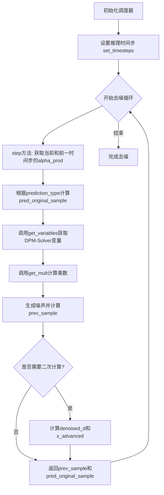
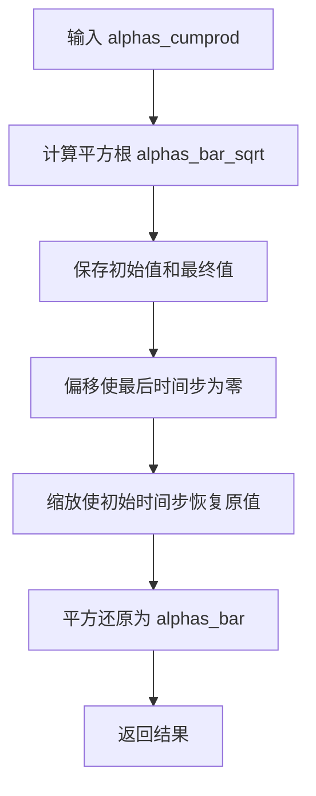
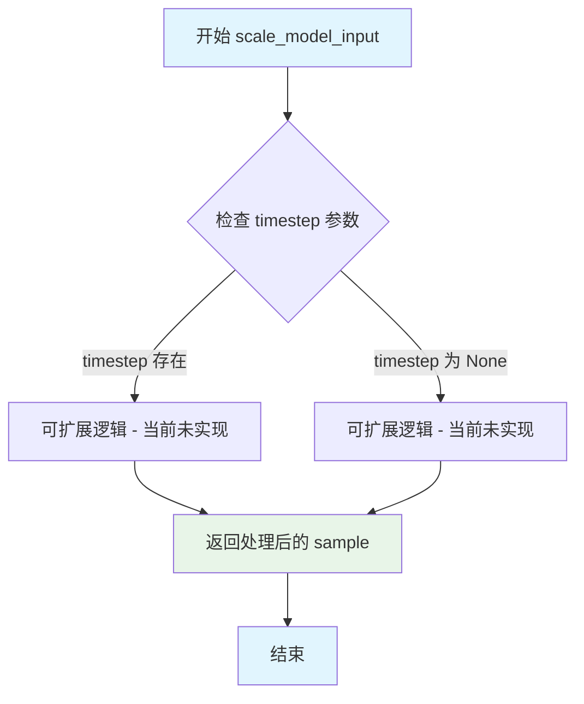
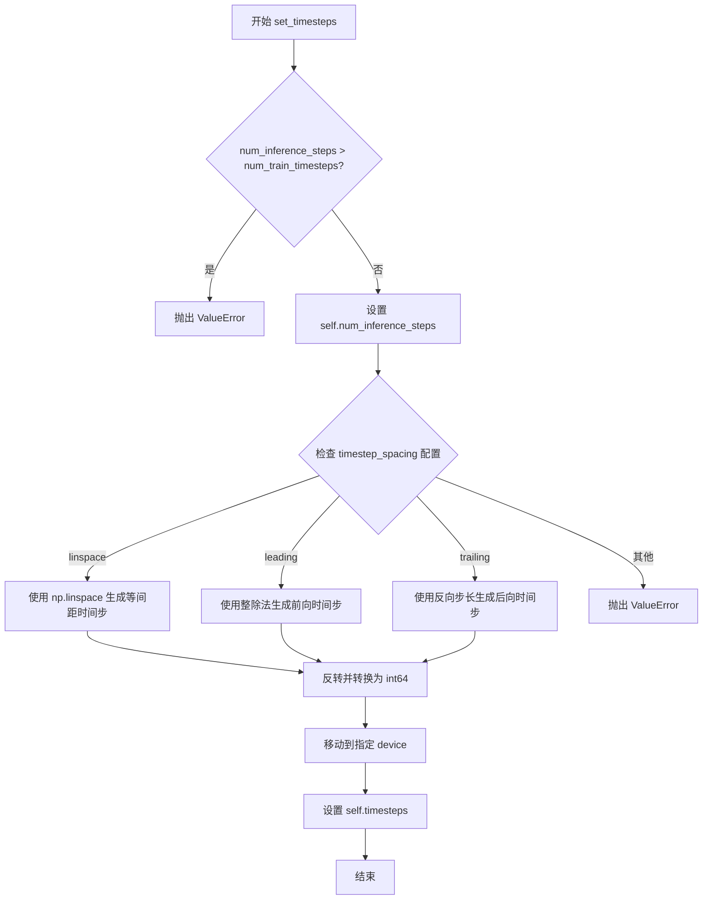
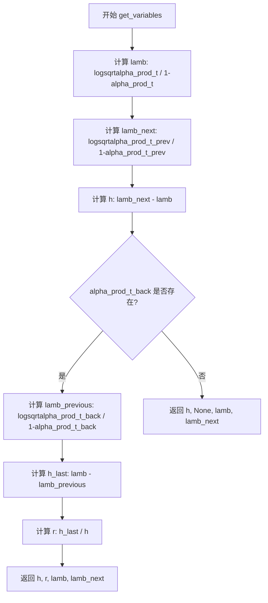
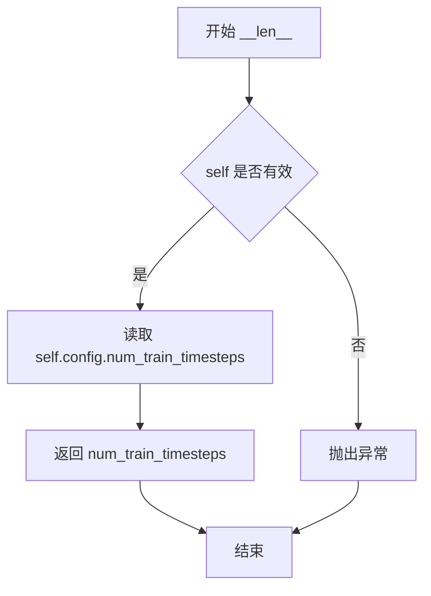

# `diffusers\src\diffusers\schedulers\scheduling_dpm_cogvideox.py` 详细设计文档

CogVideoXDPMScheduler是一个基于DDIM的扩散模型调度器，实现了非马尔可夫去噪过程，支持DPM-Solver++ (2M)算法，用于视频生成模型的去噪推理。该调度器继承自SchedulerMixin和ConfigMixin，提供了完整的噪声调度、时间步管理、样本预测和速度计算功能。

## 整体流程



## 类结构

```
DDIMSchedulerOutput (数据类)
└── CogVideoXDPMScheduler (主调度器类)
    ├── 继承: SchedulerMixin, ConfigMixin
    └── 方法列表:
        ├── __init__
        ├── _get_variance
        ├── scale_model_input
        ├── set_timesteps
        ├── get_variables
        ├── get_mult
        ├── step
        ├── add_noise
        ├── get_velocity
        └── __len__
```

## 全局变量及字段


### `num_diffusion_timesteps`
    
生成beta序列的扩散时间步数量

类型：`int`
    


### `max_beta`
    
beta值的上限，用于避免数值不稳定

类型：`float`
    


### `alpha_transform_type`
    
alpha_bar变换类型，决定噪声调度曲线的形状

类型：`Literal["cosine", "exp", "laplace"]`
    


### `alphas_cumprod`
    
累积alpha值序列，用于扩散过程的计算

类型：`torch.Tensor`
    


### `DDIMSchedulerOutput.prev_sample`
    
前一步计算出的样本

类型：`torch.Tensor`
    


### `DDIMSchedulerOutput.pred_original_sample`
    
预测的原始干净样本

类型：`torch.Tensor | None`
    


### `CogVideoXDPMScheduler.betas`
    
beta调度序列，控制每步的噪声添加量

类型：`torch.Tensor`
    


### `CogVideoXDPMScheduler.alphas`
    
alpha值序列 (1 - betas)

类型：`torch.Tensor`
    


### `CogVideoXDPMScheduler.alphas_cumprod`
    
累积alpha产品序列

类型：`torch.Tensor`
    


### `CogVideoXDPMScheduler.final_alpha_cumprod`
    
最终累积alpha值，用于最后一步

类型：`torch.Tensor`
    


### `CogVideoXDPMScheduler.init_noise_sigma`
    
初始噪声标准差

类型：`float`
    


### `CogVideoXDPMScheduler.num_inference_steps`
    
推理时的扩散步数

类型：`int | None`
    


### `CogVideoXDPMScheduler.timesteps`
    
时间步张量，存储扩散链中的离散时间步

类型：`torch.Tensor`
    


### `CogVideoXDPMScheduler._compatibles`
    
兼容的调度器列表

类型：`list`
    


### `CogVideoXDPMScheduler.order`
    
调度器阶数，用于多步预测

类型：`int`
    
    

## 全局函数及方法


### `betas_for_alpha_bar`

该函数用于创建 beta 调度表，通过离散化给定的 alpha_t_bar 函数来生成 beta 序列。alpha_t_bar 定义了扩散过程中 (1-beta) 的累积乘积随时间 t∈[0,1] 的变化。

参数：

- `num_diffusion_timesteps`：`int`，要生成的 beta 数量
- `max_beta`：`float`，默认为 `0.999`，使用的最大 beta 值；使用低于 1 的值以避免数值不稳定
- `alpha_transform_type`：`Literal["cosine", "exp", "laplace"]`，默认为 `"cosine"`，alpha_bar 的噪声调度类型，可选 `cosine`、`exp` 或 `laplace`

返回值：`torch.Tensor`，调度器用于逐步处理模型输出的 beta 值

#### 流程图

```mermaid
flowchart TD
    A[开始 betas_for_alpha_bar] --> B{alpha_transform_type == 'cosine'}
    B -->|Yes| C[定义 alpha_bar_fn: cos²((t+0.008)/1.008 * π/2)]
    B -->|No| D{alpha_transform_type == 'laplace'}
    D -->|Yes| E[定义 alpha_bar_fn: 拉普拉斯噪声公式]
    D -->|No| F{alpha_transform_type == 'exp'}
    F -->|Yes| G[定义 alpha_bar_fn: exp(-12.0*t)]
    F -->|No| H[抛出 ValueError: 不支持的 alpha_transform_type]
    C --> I[初始化空列表 betas]
    E --> I
    G --> I
    I --> J[循环 i 从 0 到 num_diffusion_timesteps-1]
    J --> K[计算 t1 = i / num_diffusion_timesteps]
    K --> L[计算 t2 = (i + 1) / num_diffusion_timesteps]
    L --> M[计算 beta = min(1 - alpha_bar_fn(t2)/alpha_bar_fn(t1), max_beta)]
    M --> N[将 beta 添加到 betas 列表]
    N --> O{是否还有下一个 i?}
    O -->|Yes| J
    O -->|No| P[返回 torch.tensor(betas, dtype=torch.float32)]
```

#### 带注释源码

```python
# Copied from diffusers.schedulers.scheduling_ddpm.betas_for_alpha_bar
def betas_for_alpha_bar(
    num_diffusion_timesteps: int,
    max_beta: float = 0.999,
    alpha_transform_type: Literal["cosine", "exp", "laplace"] = "cosine",
) -> torch.Tensor:
    """
    Create a beta schedule that discretizes the given alpha_t_bar function, which defines the cumulative product of
    (1-beta) over time from t = [0,1].

    Contains a function alpha_bar that takes an argument t and transforms it to the cumulative product of (1-beta) up
    to that part of the diffusion process.

    Args:
        num_diffusion_timesteps (`int`):
            The number of betas to produce.
        max_beta (`float`, defaults to `0.999`):
            The maximum beta to use; use values lower than 1 to avoid numerical instability.
        alpha_transform_type (`str`, defaults to `"cosine"`):
            The type of noise schedule for `alpha_bar`. Choose from `cosine`, `exp`, or `laplace`.

    Returns:
        `torch.Tensor`:
            The betas used by the scheduler to step the model outputs.
    """
    # 根据 alpha_transform_type 选择不同的 alpha_bar 函数
    if alpha_transform_type == "cosine":
        # 余弦调度：使用余弦函数的平方来平滑地衰减 alpha_bar
        def alpha_bar_fn(t):
            return math.cos((t + 0.008) / 1.008 * math.pi / 2) ** 2

    elif alpha_transform_type == "laplace":
        # 拉普拉斯调度：基于拉普拉斯分布的噪声调度
        def alpha_bar_fn(t):
            # 计算 lambda 参数：使用对数变换来处理对称性
            lmb = -0.5 * math.copysign(1, 0.5 - t) * math.log(1 - 2 * math.fabs(0.5 - t) + 1e-6)
            # 计算信噪比 (SNR)
            snr = math.exp(lmb)
            # 返回 sqrt(snr / (1 + snr))
            return math.sqrt(snr / (1 + snr))

    elif alpha_transform_type == "exp":
        # 指数调度：使用指数衰减函数
        def alpha_bar_fn(t):
            return math.exp(t * -12.0)

    else:
        # 如果传入了不支持的 alpha_transform_type，抛出错误
        raise ValueError(f"Unsupported alpha_transform_type: {alpha_transform_type}")

    # 初始化空列表用于存储生成的 beta 值
    betas = []
    # 遍历每个扩散时间步
    for i in range(num_diffusion_timesteps):
        # 计算当前时间步的起始点和结束点（归一化到 [0, 1] 区间）
        t1 = i / num_diffusion_timesteps
        t2 = (i + 1) / num_diffusion_timesteps
        # 计算 beta 值：1 - alpha_bar(t2) / alpha_bar(t1)
        # 并使用 max_beta 进行截断以避免数值不稳定
        betas.append(min(1 - alpha_bar_fn(t2) / alpha_bar_fn(t1), max_beta))
    
    # 将 beta 列表转换为 PyTorch 张量并返回
    return torch.tensor(betas, dtype=torch.float32)
```


### `rescale_zero_terminal_snr`

该函数用于将累积alpha值重缩放为零终端信噪比（Zero Terminal SNR），基于论文 https://h参数：

- `alphas_cumprod`：`torch.Tensor`，累积alpha值（alpha的累积乘积），通常表示 diffusion 过程中的 alpha 乘积序列。

返回值：`torch.Tensor`，重缩放后的alpha累积值，具有零终端信噪特性。

#### 流程图



#### 带注释源码

```python
def rescale_zero_terminal_snr(alphas_cumprod):
    """
    Rescales betas to have zero terminal SNR
    Based on https://huggingface.co/papers/2305.08891 (Algorithm 1)

    Args:
        alphas_cumprod (`torch.Tensor`):
            累积alpha值，diffusion调度器初始化时使用

    Returns:
        `torch.Tensor`: 具有零终端SNR的重缩放alpha值
    """

    # 计算累积alpha值的平方根
    alphas_bar_sqrt = alphas_cumprod.sqrt()

    # 保存旧值（初始和最终时间步）
    alphas_bar_sqrt_0 = alphas_bar_sqrt[0].clone()   # 初始时间步的平方根值
    alphas_bar_sqrt_T = alphas_bar_sqrt[-1].clone()  # 最终时间步的平方根值

    # 偏移，使最后时间步为零
    alphas_bar_sqrt -= alphas_bar_sqrt_T

    # 缩放，使初始时间步恢复为旧值
    alphas_bar_sqrt *= alphas_bar_sqrt_0 / (alphas_bar_sqrt_0 - alphas_bar_sqrt_T)

    # 将 alphas_bar_sqrt 转换回 alpha 值（还原平方）
    alphas_bar = alphas_bar_sqrt**2  # 还原平方根

    return alphas_bar
```


### `CogVideoXDPMScheduler.__init__`

该方法是 `CogVideoXDPMScheduler` 类的构造函数，用于初始化扩散调度器的核心参数，包括beta调度、alpha累积乘积计算、SNR调整以及噪声相关配置，为视频扩散模型的推理过程准备必要的调度参数。

参数：

- `num_train_timesteps`：`int`，扩散模型训练的步数，默认为1000
- `beta_start`：`float`，beta调度起始值，默认为0.00085
- `beta_end`：`float`，beta调度结束值，默认为0.0120
- `beta_schedule`：`Literal["linear", "scaled_linear", "squaredcos_cap_v2"]`，beta调度策略类型，默认为"scaled_linear"
- `trained_betas`：`np.ndarray | list[float] | None`，直接传入的beta数组，若不为None则忽略beta_start和beta_end
- `clip_sample`：`bool`，是否对预测样本进行裁剪以保证数值稳定性，默认为True
- `set_alpha_to_one`：`bool`，最终步骤是否将前一个alpha乘积设为1，默认为True
- `steps_offset`：`int`，推理步数的偏移量，默认为0
- `prediction_type`：`Literal["epsilon", "sample", "v_prediction"]`，调度器预测类型，决定如何从模型输出计算原始样本，默认为"epsilon"
- `clip_sample_range`：`float`，样本裁剪的最大范围，仅当clip_sample为True时有效，默认为1.0
- `sample_max_value`：`float`，动态阈值裁剪的最大值，仅当thresholding为True时有效，默认为1.0
- `timestep_spacing`：`Literal["leading", "linspace", "trailing"]`，时间步的缩放方式，默认为"leading"
- `rescale_betas_zero_snr`：`bool`，是否重新缩放beta以实现零终端SNR，默认为False
- `snr_shift_scale`：`float`，SNR偏移缩放因子，用于调整SNR分布，默认为3.0

返回值：`None`，该方法为构造函数，不返回任何值

#### 流程图

```mermaid
flowchart TD
    A[开始 __init__] --> B{trained_betas是否为空?}
    B -->|是| C{beta_schedule类型}
    B -->|否| D[直接使用trained_betas创建betas]
    C -->|linear| E[torch.linspace创建线性betas]
    C -->|scaled_linear| F[torch.linspace创建平方根后平方]
    C -->|squaredcos_cap_v2| G[调用betas_for_alpha_bar]
    C -->|其他| H[抛出NotImplementedError]
    D --> I[计算alphas = 1 - betas]
    E --> I
    F --> I
    G --> I
    I --> J[计算alphas_cumprod = cumprod(alphas)]
    J --> K{是否应用SNR偏移?}
    K -->|是| L[alphas_cumprod = alphas_cumprod / (snr_shift_scale + (1 - snr_shift_scale) * alphas_cumprod)]
    K -->|否| M{是否rescale_betas_zero_snr?}
    L --> M
    M -->|是| N[调用rescale_zero_terminal_snr]
    M -->|否| O[设置final_alpha_cumprod]
    N --> O
    O --> P[设置init_noise_sigma = 1.0]
    P --> Q[初始化num_inference_steps = None]
    Q --> R[创建timesteps数组]
    R --> S[结束 __init__]
```

#### 带注释源码

```python
@register_to_config
def __init__(
    self,
    num_train_timesteps: int = 1000,
    beta_start: float = 0.00085,
    beta_end: float = 0.0120,
    beta_schedule: Literal["linear", "scaled_linear", "squaredcos_cap_v2"] = "scaled_linear",
    trained_betas: np.ndarray | list[float] | None = None,
    clip_sample: bool = True,
    set_alpha_to_one: bool = True,
    steps_offset: int = 0,
    prediction_type: Literal["epsilon", "sample", "v_prediction"] = "epsilon",
    clip_sample_range: float = 1.0,
    sample_max_value: float = 1.0,
    timestep_spacing: Literal["leading", "linspace", "trailing"] = "leading",
    rescale_betas_zero_snr: bool = False,
    snr_shift_scale: float = 3.0,
):
    """
    初始化DPM-Solver++调度器参数
    
    参数:
        num_train_timesteps: 扩散模型训练的总体步数
        beta_start: 线性beta调度的起始beta值
        beta_end: 线性beta调度的结束beta值
        beta_schedule: beta值的调度策略
        trained_betas: 可选的预定义beta数组
        clip_sample: 是否裁剪预测样本
        set_alpha_to_one: 最终步是否使用alpha=1
        steps_offset: 推理步数的偏移量
        prediction_type: 预测类型 epsilon/sample/v_prediction
        clip_sample_range: 裁剪范围
        sample_max_value: 动态阈值最大value
        timestep_spacing: 时间步分布策略
        rescale_betas_zero_snr: 是否重置beta为零SNR
        snr_shift_scale: SNR偏移缩放因子
    """
    
    # 根据传入的trained_betas或beta_schedule生成betas
    if trained_betas is not None:
        # 直接使用传入的beta数组
        self.betas = torch.tensor(trained_betas, dtype=torch.float32)
    elif beta_schedule == "linear":
        # 线性beta调度
        self.betas = torch.linspace(beta_start, beta_end, num_train_timesteps, dtype=torch.float32)
    elif beta_schedule == "scaled_linear":
        # 针对潜在扩散模型的特定调度（先平方根再平方）
        self.betas = (
            torch.linspace(
                beta_start**0.5,
                beta_end**0.5,
                num_train_timesteps,
                dtype=torch.float64,
            )
            ** 2
        )
    elif beta_schedule == "squaredcos_cap_v2":
        # Glide余弦调度
        self.betas = betas_for_alpha_bar(num_train_timesteps)
    else:
        raise NotImplementedError(f"{beta_schedule} is not implemented for {self.__class__}")

    # 计算alphas: 1 - beta
    self.alphas = 1.0 - self.betas
    
    # 计算累积乘积 alpha_prod = cumprod(alphas)
    self.alphas_cumprod = torch.cumprod(self.alphas, dim=0)

    # SNR偏移调整（遵循SD3）
    # 通过除以 (snr_shift_scale + (1 - snr_shift_scale) * alphas_cumprod) 来调整SNR分布
    self.alphas_cumprod = self.alphas_cumprod / (snr_shift_scale + (1 - snr_shift_scale) * self.alphas_cumprod)

    # 如果需要，重置betas以实现零终端SNR
    if rescale_betas_zero_snr:
        self.alphas_cumprod = rescale_zero_terminal_snr(self.alphas_cumprod)

    # 设置最终alpha累积乘积
    # 在DDIM中，我们需要查看前一个alphas_cumprod
    # 对于最终步，没有前一个alphas_cumprod
    # set_alpha_to_one决定是设置为1还是使用第0步的alpha
    self.final_alpha_cumprod = torch.tensor(1.0) if set_alpha_to_one else self.alphas_cumprod[0]

    # 初始噪声分布的标准差
    self.init_noise_sigma = 1.0

    # 可设置的推理参数
    self.num_inference_steps = None
    # 创建反向时间步数组 [num_train_timesteps-1, num_train_timesteps-2, ..., 0]
    self.timesteps = torch.from_numpy(np.arange(0, num_train_timesteps)[::-1].copy().astype(np.int64))
```


### `CogVideoXDPMScheduler._get_variance`

该方法用于计算扩散调度器在给定时间步和前一时间步之间的方差（variance），基于 alpha 累积乘积（alphas_cumprod）计算 DPM 求解器所需的方差值。

参数：

- `self`：`CogVideoXDPMScheduler`，调度器实例本身
- `timestep`：`int`，当前扩散推理的时间步索引
- `prev_timestep`：`int`，前一个时间步索引，如果为 -1 则表示最后一步

返回值：`torch.Tensor`，计算得到的方差值，用于 DPM-Solver++ 采样过程中的噪声调度

#### 流程图

```mermaid
flowchart TD
    A[开始 _get_variance] --> B[获取 alpha_prod_t = alphas_cumprod[timestep]]
    B --> C{prev_timestep >= 0?}
    C -->|Yes| D[alpha_prod_t_prev = alphas_cumprod[prev_timestep]]
    C -->|No| E[alpha_prod_t_prev = final_alpha_cumprod]
    D --> F[beta_prod_t = 1 - alpha_prod_t]
    E --> F
    F --> G[beta_prod_t_prev = 1 - alpha_prod_t_prev]
    G --> H[计算 variance = (beta_prod_t_prev / beta_prod_t) * (1 - alpha_prod_t / alpha_prod_t_prev)]
    H --> I[返回 variance]
    I --> J[结束]
```

#### 带注释源码

```python
def _get_variance(self, timestep, prev_timestep):
    """
    计算给定时间步和前一时间步之间的方差。
    
    该方法基于 DDIM/DDPM 论文中的方差公式计算，用于 DPM-Solver++ 等高阶求解器。
    方差计算公式来源于扩散过程中的均值和方差推导。
    
    参数:
        timestep: 当前时间步索引，用于获取对应的 alpha 累积乘积
        prev_timestep: 前一个时间步索引；如果为 -1，则使用 final_alpha_cumprod
    
    返回:
        方差值，用于后续采样步骤中的噪声调度
    """
    # 获取当前时间步 t 的累积 alpha 乘积 alpha_prod_t
    # alphas_cumprod 表示 alpha 的累积乘积: alpha_prod_t = alpha_1 * alpha_2 * ... * alpha_t
    alpha_prod_t = self.alphas_cumprod[timestep]
    
    # 获取前一时间步 t-1 的累积 alpha 乘积
    # 如果 prev_timestep >= 0，从 alphas_cumprod 数组中获取对应值
    # 否则（prev_timestep == -1 表示最后一步），使用 final_alpha_cumprod（通常为 1.0）
    alpha_prod_t_prev = self.alphas_cumprod[prev_timestep] if prev_timestep >= 0 else self.final_alpha_cumprod
    
    # 计算当前时间步的 beta 累积乘积 beta_prod_t = 1 - alpha_prod_t
    # 这是 DDIM 论文中推导的关键变量
    beta_prod_t = 1 - alpha_prod_t
    
    # 计算前一时间步的 beta 累积乘积
    beta_prod_t_prev = 1 - alpha_prod_t_prev
    
    # 计算方差公式：(beta_prod_t_prev / beta_prod_t) * (1 - alpha_prod_t / alpha_prod_t_prev)
    # 该公式来源于 DDIM 论文中的方差推导，确保采样过程的方差与前向扩散过程一致
    variance = (beta_prod_t_prev / beta_prod_t) * (1 - alpha_prod_t / alpha_prod_t_prev)
    
    # 返回计算得到的方差值
    return variance
```


### CogVideoXDPMScheduler.scale_model_input

确保与需要根据当前时间步长缩放去噪模型输入的调度器之间的互操作性。该方法是一个接口方法，当前实现仅返回原始样本不做任何修改，为未来可能的调度器扩展提供兼容性支持。

参数：

- `self`：`CogVideoXDPMScheduler` 实例本身，隐式参数
- `sample`：`torch.Tensor`，当前 diffusion 过程中的输入样本
- `timestep`：`int | None`，扩散链中的当前离散时间步，可选参数

返回值：`torch.Tensor`，经过缩放处理后的输入样本（当前实现直接返回原样本）

#### 流程图



#### 带注释源码

```python
def scale_model_input(self, sample: torch.Tensor, timestep: int | None = None) -> torch.Tensor:
    """
    Ensures interchangeability with schedulers that need to scale the denoising model input depending on the
    current timestep.

    Args:
        sample (`torch.Tensor`):
            The input sample.
        timestep (`int`, *optional*):
            The current timestep in the diffusion chain.

    Returns:
        `torch.Tensor`:
            A scaled input sample.
    """
    # 当前实现仅为占位符，直接返回输入样本
    # 此方法为调度器接口的一部分，用于支持需要根据时间步调整输入的调度器
    # 例如某些调度器可能需要根据 timestep 对输入进行归一化或缩放
    return sample
```


### `CogVideoXDPMScheduler.set_timesteps`

设置扩散链中使用的离散时间步（在推理之前运行）。

参数：

-  `self`：`CogVideoXDPMScheduler` 实例，调度器本身
-  `num_inference_steps`：`int`，使用预训练模型生成样本时使用的扩散步数
-  `device`：`str | torch.device | None`，时间步要移动到的设备。如果为 `None`（默认值），则时间步不会被移动

返回值：`None`，该方法直接修改 `self.timesteps` 和 `self.num_inference_steps` 属性

#### 流程图



#### 带注释源码

```
def set_timesteps(
    self,
    num_inference_steps: int,
    device: str | torch.device | None = None,
):
    """
    设置扩散链中使用的离散时间步（在推理之前运行）。

    Args:
        num_inference_steps (`int`):
            使用预训练模型生成样本时使用的扩散步数。
        device (`str` or `torch.device`, *optional*):
            时间步要移动到的设备。如果为 `None`（默认值），则时间步不会被移动。
    """

    # 验证推理步数不超过训练步数
    if num_inference_steps > self.config.num_train_timesteps:
        raise ValueError(
            f"`num_inference_steps`: {num_inference_steps} cannot be larger than `self.config.train_timesteps`:"
            f" {self.config.num_train_timesteps} as the unet model trained with this scheduler can only handle"
            f" maximal {self.config.num_train_timesteps} timesteps."
        )

    # 保存推理步数
    self.num_inference_steps = num_inference_steps

    # 根据 timestep_spacing 配置选择不同的时间步生成策略
    # "linspace", "leading", "trailing" 对应于 https://huggingface.co/papers/2305.08891 表2
    if self.config.timestep_spacing == "linspace":
        # linspace 策略：线性等间距分布
        timesteps = (
            np.linspace(0, self.config.num_train_timesteps - 1, num_inference_steps)
            .round()[::-1]  # 反转顺序
            .copy()
            .astype(np.int64)
        )
    elif self.config.timestep_spacing == "leading":
        # leading 策略：从高时间步开始，步长均匀
        step_ratio = self.config.num_train_timesteps // self.num_inference_steps
        # 通过乘以比例创建整数时间步
        # 转换为 int 以避免当 num_inference_step 是 3 的幂时出现问题
        timesteps = (np.arange(0, num_inference_steps) * step_ratio).round()[::-1].copy().astype(np.int64)
        timesteps += self.config.steps_offset  # 添加偏移量
    elif self.config.timestep_spacing == "trailing":
        # trailing 策略：从 0 开始向后走
        step_ratio = self.config.num_train_timesteps / self.num_inference_steps
        # 通过乘以比例创建整数时间步
        # 转换为 int 以避免当 num_inference_step 是 3 的幂时出现问题
        timesteps = np.round(np.arange(self.config.num_train_timesteps, 0, -step_ratio)).astype(np.int64)
        timesteps -= 1  # 调整索引
    else:
        raise ValueError(
            f"{self.config.timestep_spacing} is not supported. Please make sure to choose one of 'leading' or 'trailing'."
        )

    # 将时间步转换为 PyTorch 张量并移动到指定设备
    self.timesteps = torch.from_numpy(timesteps).to(device)
```


### CogVideoXDPMScheduler.get_variables

该方法用于计算 DPM-Solver++ (2M) 算法中使用的变量，包括对数信噪比（log-SNR）及其差值。这些变量是 DPM-Solver++ 多步求解器的核心计算组成部分，用于在扩散模型的推理过程中计算样本预测的系数。

参数：

- `self`：`CogVideoXDPMScheduler`，调度器实例自身
- `alpha_prod_t`：`torch.Tensor`，当前时间步的累积 alpha 乘积
- `alpha_prod_t_prev`：`torch.Tensor`，前一个时间步的累积 alpha 乘积
- `alpha_prod_t_back`：`torch.Tensor | None`，可选，前一个时间步之前的累积 alpha 乘积（即 t-2 步）

返回值：`tuple[torch.Tensor, torch.Tensor, torch.Tensor, torch.Tensor]`，包含变量 `h`（对数 SNR 差值）、`r`（对数 SNR 差值比率）、`lamb`（当前对数 SNR）、`lamb_next`（前一步对数 SNR）的元组

#### 流程图



#### 带注释源码

```python
def get_variables(
    self,
    alpha_prod_t: torch.Tensor,
    alpha_prod_t_prev: torch.Tensor,
    alpha_prod_t_back: torch.Tensor | None = None,
) -> tuple[torch.Tensor, torch.Tensor, torch.Tensor, torch.Tensor]:
    """
    Compute the variables used for DPM-Solver++ (2M) referencing the original implementation.

    Args:
        alpha_prod_t (`torch.Tensor`):
            The cumulative product of alphas at the current timestep.
        alpha_prod_t_prev (`torch.Tensor`):
            The cumulative product of alphas at the previous timestep.
        alpha_prod_t_back (`torch.Tensor`, *optional*):
            The cumulative product of alphas at the timestep before the previous timestep.

    Returns:
        `tuple`:
            A tuple containing the variables `h`, `r`, `lamb`, `lamb_next`.
    """
    # 计算当前时间步的对数信噪比 (log-SNR)
    # lamb = log(sqrt(alpha_prod_t / (1 - alpha_prod_t)))
    lamb = ((alpha_prod_t / (1 - alpha_prod_t)) ** 0.5).log()
    
    # 计算前一个时间步的对数信噪比
    lamb_next = ((alpha_prod_t_prev / (1 - alpha_prod_t_prev)) ** 0.5).log()
    
    # 计算两个时间步之间的对数 SNR 差值 (步长)
    h = lamb_next - lamb

    # 如果存在前一个时间步之前的 alpha 乘积 (用于多步求解器)
    if alpha_prod_t_back is not None:
        # 计算更早时间步的对数 SNR
        lamb_previous = ((alpha_prod_t_back / (1 - alpha_prod_t_back)) ** 0.5).log()
        
        # 计算上一个时间步的步长
        h_last = lamb - lamb_previous
        
        # 计算步长比率 r，用于 DPM-Solver++ 的系数计算
        r = h_last / h
        
        # 返回完整的变量元组: h, r, lamb, lamb_next
        return h, r, lamb, lamb_next
    else:
        # 如果没有更早的时间步，返回 r 为 None
        return h, None, lamb, lamb_next
```


### `CogVideoXDPMScheduler.get_mult`

该方法用于计算 DPM-Solver++ 中的乘数，用于根据当前和之前的累积 alpha 值以及 log-SNR 差异来计算前一个样本和预测的原始样本的系数。这是扩散模型推理过程中反向扩散步骤的关键计算组件。

参数：

- `self`：`CogVideoXDPMScheduler`，调度器实例本身
- `h`：`torch.Tensor`，log-SNR 差值（lambda_next - lambda）
- `r`：`torch.Tensor`，log-SNR 差值的比率
- `alpha_prod_t`：`torch.Tensor`，当前时间步的累积 alpha 乘积
- `alpha_prod_t_prev`：`torch.Tensor`，前一个时间步的累积 alpha 乘积
- `alpha_prod_t_back`：`torch.Tensor | None`，前一个时间步之前的累积 alpha 乘积（可选）

返回值：`tuple[torch.Tensor, torch.Tensor] | tuple[torch.Tensor, torch.Tensor, torch.Tensor, torch.Tensor]`，返回 2 个或 4 个乘数张量，取决于是否提供了 `alpha_prod_t_back`

#### 流程图

```mermaid
flowchart TD
    A[开始 get_mult] --> B[计算 mult1]
    B --> C[计算 mult2]
    C --> D{alpha_prod_t_back 是否为 None?}
    
    D -->|是| E[返回 mult1, mult2]
    D -->|否| F[计算 mult3 = 1 + 1/(2*r)]
    F --> G[计算 mult4 = 1/(2*r)]
    G --> H[返回 mult1, mult2, mult3, mult4]
    
    E --> I[结束]
    H --> I
```

#### 带注释源码

```python
def get_mult(
    self,
    h: torch.Tensor,
    r: torch.Tensor,
    alpha_prod_t: torch.Tensor,
    alpha_prod_t_prev: torch.Tensor,
    alpha_prod_t_back: torch.Tensor | None = None,
) -> tuple[torch.Tensor, torch.Tensor] | tuple[torch.Tensor, torch.Tensor, torch.Tensor, torch.Tensor]:
    """
    Compute the multipliers for the previous sample and the predicted original sample.

    Args:
        h (`torch.Tensor`):
            The log-SNR difference.
        r (`torch.Tensor`):
            The ratio of log-SNR differences.
        alpha_prod_t (`torch.Tensor`):
            The cumulative product of alphas at the current timestep.
        alpha_prod_t_prev (`torch.Tensor`):
            The cumulative product of alphas at the previous timestep.
        alpha_prod_t_back (`torch.Tensor`, *optional*):
            The cumulative product of alphas at the timestep before the previous timestep.

    Returns:
        `tuple`:
            A tuple containing the multipliers.
    """
    # 计算 mult1: 用于样本和原始预测样本的主要系数
    # 公式: ((1 - alpha_prod_t_prev) / (1 - alpha_prod_t))^0.5 * exp(-h)
    mult1 = ((1 - alpha_prod_t_prev) / (1 - alpha_prod_t)) ** 0.5 * (-h).exp()
    
    # 计算 mult2: 用于原始预测样本的第二个系数
    # 公式: (exp(-2h) - 1) * sqrt(alpha_prod_t_prev)
    mult2 = (-2 * h).expm1() * alpha_prod_t_prev**0.5

    # 如果提供了 alpha_prod_t_back，则使用 2M 模式（两步预测）
    if alpha_prod_t_back is not None:
        # 计算 mult3: 用于去噪方向的系数
        mult3 = 1 + 1 / (2 * r)
        # 计算 mult4: 用于旧原始预测样本的系数
        mult4 = 1 / (2 * r)
        return mult1, mult2, mult3, mult4
    else:
        # 否则使用 1M 模式（单步预测）
        return mult1, mult2
```


### CogVideoXDPMScheduler.step

预测前一个时间步的样本，通过逆转SDE（随机微分方程）实现。该函数传播学习到的模型输出（通常是预测的噪声），利用DPM-Solver++ (2M)算法进行采样，是CogVideoX视频扩散模型的核心推理步骤。

参数：

- `self`：`CogVideoXDPMScheduler`，调度器实例本身
- `model_output`：`torch.Tensor`，学习到的扩散模型的直接输出（预测噪声）
- `old_pred_original_sample`：`torch.Tensor`，前一个时间步预测的原始样本（x_0）
- `timestep`：`int`，扩散链中的当前离散时间步
- `timestep_back`：`int`，需要回看的时间步（用于DPM-Solver多步预测）
- `sample`：`torch.Tensor`，扩散过程生成的当前样本实例
- `eta`：`float`，扩散步骤中添加噪声的权重（默认0.0）
- `use_clipped_model_output`：`bool`，是否使用裁剪后的预测原始样本来修正模型输出
- `generator`：`torch.Generator | None`，随机数生成器，用于复现结果
- `variance_noise`：`torch.Tensor | None`，方差的替代噪声，用于CycleDiffusion等方法
- `return_dict`：`bool`，是否返回DDIMSchedulerOutput对象而非元组

返回值：`DDIMSchedulerOutput | tuple`，返回(prev_sample, pred_original_sample)元组或DDIMSchedulerOutput对象，包含去噪后的样本和预测的原始样本

#### 流程图

```mermaid
flowchart TD
    A[step方法开始] --> B{num_inference_steps已设置?}
    B -->|否| C[抛出ValueError:需先运行set_timesteps]
    B -->|是| D[计算prev_timestep<br/>t-1]
    D --> E[获取alpha_prod_t<br/>alpha_prod_t_prev<br/>alpha_prod_t_back]
    E --> F[计算beta_prod_t<br/>1 - alpha_prod_t]
    F --> G{prediction_type类型?}
    G -->|epsilon| H[pred_original_sample<br/>= (sample - √β_t × model_output) / √α_t]
    G -->|sample| I[pred_original_sample = model_output]
    G -->|v_prediction| J[pred_original_sample<br/>= √α_t × sample - √β_t × model_output]
    H --> K[调用get_variables获取h, r, lamb, lamb_next]
    I --> K
    J --> K
    K --> L[调用get_mult获取mult系数]
    L --> M[计算mult_noise系数]
    M --> N[生成随机噪声noise]
    N --> O[计算基础prev_sample]
    O --> P{old_pred_original_sample存在<br/>且prev_timestep >= 0?}
    P -->|否| Q[返回prev_sample和pred_original_sample]
    P -->|是| R[计算denoised_d<br/>使用多步校正]
    R --> S[生成新的噪声noise2]
    S --> T[计算x_advanced和更新prev_sample]
    T --> U{return_dict为True?}
    U -->|是| V[返回DDIMSchedulerOutput对象]
    U -->|否| W[返回tuple元组]
    Q --> U
```

#### 带注释源码

```python
def step(
    self,
    model_output: torch.Tensor,
    old_pred_original_sample: torch.Tensor,
    timestep: int,
    timestep_back: int,
    sample: torch.Tensor,
    eta: float = 0.0,
    use_clipped_model_output: bool = False,
    generator: torch.Generator | None = None,
    variance_noise: torch.Tensor | None = None,
    return_dict: bool = False,
) -> DDIMSchedulerOutput | tuple:
    """
    Predict the sample from the previous timestep by reversing the SDE. This function propagates the diffusion
    process from the learned model outputs (most often the predicted noise).

    Args:
        model_output (`torch.Tensor`):
            The direct output from learned diffusion model.
        old_pred_original_sample (`torch.Tensor`):
            The predicted original sample from the previous timestep.
        timestep (`int`):
            The current discrete timestep in the diffusion chain.
        timestep_back (`int`):
            The timestep to look back to.
        sample (`torch.Tensor`):
            A current instance of a sample created by the diffusion process.
        eta (`float`):
            The weight of noise for added noise in diffusion step.
        use_clipped_model_output (`bool`, defaults to `False`):
            If `True`, computes "corrected" `model_output` from the clipped predicted original sample. Necessary
            because predicted original sample is clipped to [-1, 1] when `self.config.clip_sample` is `True`. If no
            clipping has happened, "corrected" `model_output` would coincide with the one provided as input and
            `use_clipped_model_output` has no effect.
        generator (`torch.Generator`, *optional*):
            A random number generator.
        variance_noise (`torch.Tensor`):
            Alternative to generating noise with `generator` by directly providing the noise for the variance
            itself. Useful for methods such as [`CycleDiffusion`].
        return_dict (`bool`, *optional*, defaults to `True`):
            Whether or not to return a [`~schedulers.scheduling_ddim.DDIMSchedulerOutput`] or `tuple`.

    Returns:
        [`~schedulers.scheduling_ddim.DDIMSchedulerOutput`] or `tuple`:
            If return_dict is `True`, [`~schedulers.scheduling_ddim.DDIMSchedulerOutput`] is returned, otherwise a
            tuple is returned where the first element is the sample tensor.

    """
    # 检查是否已设置推理步数，这是执行去噪步骤的前提条件
    if self.num_inference_steps is None:
        raise ValueError(
            "Number of inference steps is 'None', you need to run 'set_timesteps' after creating the scheduler"
        )

    # 参考DDIM论文 https://huggingface.co/papers/2010.02502 中的公式(12)和(16)
    # 符号说明：
    # - pred_noise_t -> e_theta(x_t, t) 预测噪声
    # - pred_original_sample -> f_theta(x_t, t) or x_0 预测原始样本
    # - std_dev_t -> sigma_t 标准差
    # - eta -> η eta参数
    # - pred_sample_direction -> "direction pointing to x_t" 预测样本方向
    # - pred_prev_sample -> "x_t-1" 前一个样本

    # 1. 获取前一个时间步值 (=t-1)
    # 计算当前时间步在推理过程中的前一步
    prev_timestep = timestep - self.config.num_train_timesteps // self.num_inference_steps

    # 2. 计算alphas和betas
    # 获取当前时间步的累积alpha值
    alpha_prod_t = self.alphas_cumprod[timestep]
    # 获取前一个时间步的累积alpha值，如果是第一步则使用final_alpha_cumprod
    alpha_prod_t_prev = self.alphas_cumprod[prev_timestep] if prev_timestep >= 0 else self.final_alpha_cumprod
    # 获取回看时间步的累积alpha值（DPM-Solver多步需要）
    alpha_prod_t_back = self.alphas_cumprod[timestep_back] if timestep_back is not None else None

    # 当前时间步的beta乘积
    beta_prod_t = 1 - alpha_prod_t

    # 3. 从预测噪声计算预测原始样本（公式12中的x_0）
    # 根据prediction_type选择不同的计算方式
    if self.config.prediction_type == "epsilon":
        # epsilon预测：x_0 = (x_t - √β_t * ε_t) / √α_t
        pred_original_sample = (sample - beta_prod_t ** (0.5) * model_output) / alpha_prod_t ** (0.5)
        # pred_epsilon = model_output
    elif self.config.prediction_type == "sample":
        # sample预测：直接使用模型输出作为原始样本
        pred_original_sample = model_output
        # pred_epsilon = (sample - alpha_prod_t ** (0.5) * pred_original_sample) / beta_prod_t ** (0.5)
    elif self.config.prediction_type == "v_prediction":
        # v-prediction：来自Imagen Video论文
        pred_original_sample = (alpha_prod_t**0.5) * sample - (beta_prod_t**0.5) * model_output
        # pred_epsilon = (alpha_prod_t**0.5) * model_output + (beta_prod_t**0.5) * sample
    else:
        raise ValueError(
            f"prediction_type given as {self.config.prediction_type} must be one of `epsilon`, `sample`, or"
            " `v_prediction`"
        )

    # 4. 使用DPM-Solver++ (2M)算法计算变量
    # 获取log-SNR相关的变量h, r, lamb, lamb_next
    h, r, lamb, lamb_next = self.get_variables(alpha_prod_t, alpha_prod_t_prev, alpha_prod_t_back)
    # 获取预测系数mult
    mult = list(self.get_mult(h, r, alpha_prod_t, alpha_prod_t_prev, alpha_prod_t_back))
    # 计算噪声系数
    mult_noise = (1 - alpha_prod_t_prev) ** 0.5 * (1 - (-2 * h).exp()) ** 0.5

    # 5. 生成随机噪声
    noise = randn_tensor(sample.shape, generator=generator, device=sample.device, dtype=sample.dtype)
    
    # 6. 计算基础的前一个样本（单步预测）
    # 公式：x_{t-1} = mult[0] * x_t - mult[1] * x_0 + mult_noise * noise
    prev_sample = mult[0] * sample - mult[1] * pred_original_sample + mult_noise * noise

    # 7. 判断是否需要进行多步校正（DPM-Solver++ 2M）
    # 如果没有前一个预测的原始样本或已经是最后一步，直接返回
    if old_pred_original_sample is None or prev_timestep < 0:
        # Save a network evaluation if all noise levels are 0 or on the first step
        return prev_sample, pred_original_sample
    else:
        # 8. 执行多步校正（使用两步预测提高精度）
        # 计算去噪方向denoised_d
        denoised_d = mult[2] * pred_original_sample - mult[3] * old_pred_original_sample
        
        # 生成新的噪声用于多步预测
        noise = randn_tensor(
            sample.shape,
            generator=generator,
            device=sample.device,
            dtype=sample.dtype,
        )
        
        # 计算高级样本x_advanced（多步预测结果）
        x_advanced = mult[0] * sample - mult[1] * denoised_d + mult_noise * noise

        # 更新prev_sample为多步预测结果
        prev_sample = x_advanced

    # 9. 根据return_dict返回结果
    if not return_dict:
        return (prev_sample, pred_original_sample)

    # 返回DDIMSchedulerOutput对象，包含prev_sample和pred_original_sample
    return DDIMSchedulerOutput(prev_sample=prev_sample, pred_original_sample=pred_original_sample)
```


### CogVideoXDPMScheduler.add_noise

该方法是CogVideoXDPMScheduler调度器的核心功能之一，实现了扩散模型的前向过程（forward diffusion process）。它根据给定的时间步（timesteps）计算噪声系数，将高斯噪声按指定强度添加到原始样本中，生成带噪样本。这是扩散模型训练和推理过程中必不可少的步骤。

参数：

- `self`：`CogVideoXDPMScheduler`，调度器实例，包含累积alpha值等参数
- `original_samples`：`torch.Tensor`，原始样本张量，通常是图像或潜在表示
- `noise`：`torch.Tensor`，要添加的高斯噪声张量
- `timesteps`：`torch.IntTensor`，整型时间步张量，指定每个样本的噪声水平

返回值：`torch.Tensor`，添加噪声后的样本张量

#### 流程图

```mermaid
flowchart TD
    A[开始 add_noise] --> B[确保 alphas_cumprod 设备与类型匹配]
    B --> C[将 timesteps 移到正确设备]
    C --> D[计算 sqrt_alpha_prod = alphas_cumprod[timesteps] ** 0.5]
    D --> E[展平并扩展 sqrt_alpha_prod 维度]
    F[计算 sqrt_one_minus_alpha_prod = (1 - alphas_cumprod[timesteps]) ** 0.5] --> G[展平并扩展维度]
    E --> H[计算 noisy_samples = sqrt_alpha_prod * original_samples + sqrt_one_minus_alpha_prod * noise]
    G --> H
    H --> I[返回 noisy_samples]
```

#### 带注释源码

```python
def add_noise(
    self,
    original_samples: torch.Tensor,  # 原始样本张量
    noise: torch.Tensor,             # 要添加的高斯噪声
    timesteps: torch.IntTensor,      # 时间步张量，指定噪声水平
) -> torch.Tensor:
    """
    Add noise to the original samples according to the noise magnitude at each timestep (this is the forward
    diffusion process).

    Args:
        original_samples (`torch.Tensor`):
            The original samples to which noise will be added.
        noise (`torch.Tensor`):
            The noise to add to the samples.
        timesteps (`torch.IntTensor`):
            The timesteps indicating the noise level for each sample.

    Returns:
        `torch.Tensor`:
            The noisy samples.
    """
    # 确保 alphas_cumprod 和 timestep 与 original_samples 在同一设备上
    # 并具有相同的数据类型，避免后续调用时重复的 CPU-GPU 数据移动
    self.alphas_cumprod = self.alphas_cumprod.to(device=original_samples.device)
    alphas_cumprod = self.alphas_cumprod.to(dtype=original_samples.dtype)
    timesteps = timesteps.to(original_samples.device)

    # 从累积 alpha 值中提取当前时间步对应的 alpha 值并开方
    sqrt_alpha_prod = alphas_cumprod[timesteps] ** 0.5
    sqrt_alpha_prod = sqrt_alpha_prod.flatten()
    # 扩展维度以匹配原始样本的形状（支持批处理）
    while len(sqrt_alpha_prod.shape) < len(original_samples.shape):
        sqrt_alpha_prod = sqrt_alpha_prod.unsqueeze(-1)

    # 计算 (1 - alpha) 的平方根，用于噪声项
    sqrt_one_minus_alpha_prod = (1 - alphas_cumprod[timesteps]) ** 0.5
    sqrt_one_minus_alpha_prod = sqrt_one_minus_alpha_prod.flatten()
    # 扩展维度以匹配原始样本的形状
    while len(sqrt_one_minus_alpha_prod.shape) < len(original_samples.shape):
        sqrt_one_minus_alpha_prod = sqrt_one_minus_alpha_prod.unsqueeze(-1)

    # 前向扩散公式：x_t = sqrt(alpha_t) * x_0 + sqrt(1 - alpha_t) * epsilon
    noisy_samples = sqrt_alpha_prod * original_samples + sqrt_one_minus_alpha_prod * noise
    return noisy_samples
```


### CogVideoXDPMScheduler.get_velocity

该方法用于在扩散模型的逆向过程中计算速度预测（velocity），即根据当前样本、噪声和时间步来计算速度张量。这是 DPM-Solver++ 2M 调度器的核心组件，用于多步采样时的速度预测。

参数：

- `sample`：`torch.Tensor`，输入的当前样本
- `noise`：`torch.Tensor`，噪声张量
- `timesteps`：`torch.IntTensor`，用于速度计算的时间步

返回值：`torch.Tensor`，计算得到的速度预测值

#### 流程图

```mermaid
flowchart TD
    A[输入: sample, noise, timesteps] --> B[将 alphas_cumprod 移动到 sample 设备]
    B --> C[将 alphas_cumprod 转换为 sample 数据类型]
    C --> D[将 timesteps 移动到 sample 设备]
    D --> E[获取 sqrt_alpha_prod: alphas_cumprod[timesteps] 的平方根]
    E --> F[展平并扩展 sqrt_alpha_prod 维度以匹配 sample 形状]
    F --> G[获取 sqrt_one_minus_alpha_prod: 1 - alphas_cumprod[timesteps] 的平方根]
    G --> H[展平并扩展 sqrt_one_minus_alpha_prod 维度]
    H --> I[计算速度: sqrt_alpha_prod * noise - sqrt_one_minus_alpha_prod * sample]
    I --> J[返回 velocity]
```

#### 带注释源码

```
def get_velocity(self, sample: torch.Tensor, noise: torch.Tensor, timesteps: torch.IntTensor) -> torch.Tensor:
    """
    Compute the velocity prediction from the sample and noise according to the velocity formula.

    Args:
        sample (`torch.Tensor`):
            The input sample.
        noise (`torch.Tensor`):
            The noise tensor.
        timesteps (`torch.IntTensor`):
            The timesteps for velocity computation.

    Returns:
        `torch.Tensor`:
            The computed velocity.
    """
    # 确保 alphas_cumprod 与 sample 在同一设备上，避免 CPU 到 GPU 的数据传输
    self.alphas_cumprod = self.alphas_cumprod.to(device=sample.device)
    # 确保 alphas_cumprod 与 sample 数据类型一致
    alphas_cumprod = self.alphas_cumprod.to(dtype=sample.dtype)
    # 确保 timesteps 与 sample 在同一设备上
    timesteps = timesteps.to(sample.device)

    # 计算 alpha 的平方根: sqrt(alpha_prod_t)
    sqrt_alpha_prod = alphas_cumprod[timesteps] ** 0.5
    # 展平以便后续维度扩展
    sqrt_alpha_prod = sqrt_alpha_prod.flatten()
    # 扩展维度以匹配 sample 的形状（支持批量处理）
    while len(sqrt_alpha_prod.shape) < len(sample.shape):
        sqrt_alpha_prod = sqrt_alpha_prod.unsqueeze(-1)

    # 计算 (1 - alpha) 的平方根: sqrt(1 - alpha_prod_t)
    sqrt_one_minus_alpha_prod = (1 - alphas_cumprod[timesteps]) ** 0.5
    sqrt_one_minus_alpha_prod = sqrt_one_minus_alpha_prod.flatten()
    while len(sqrt_one_minus_alpha_prod.shape) < len(sample.shape):
        sqrt_one_minus_alpha_prod = sqrt_one_minus_alpha_prod.unsqueeze(-1)

    # 根据速度公式计算: v = sqrt(alpha_prod_t) * noise - sqrt(1 - alpha_prod_t) * sample
    velocity = sqrt_alpha_prod * noise - sqrt_one_minus_alpha_prod * sample
    return velocity
```


### `CogVideoXDPMScheduler.__len__`

该方法返回调度器配置中定义的训练时间步总数，使得调度器实例可以直接通过 `len()` 函数获取其训练时间步数量。

参数：

-  `self`：`CogVideoXDPMScheduler`，调度器实例本身，用于访问配置属性

返回值：`int`，返回配置中定义的训练时间步数量（即 `num_train_timesteps`）

#### 流程图



#### 带注释源码

```python
def __len__(self) -> int:
    """
    返回调度器配置中定义的训练时间步总数。
    
    该特殊方法（dunder method）使得调度器实例可以直接通过 Python 内置的
    len() 函数获取其训练时间步数量，便于与标准库函数和迭代器协议兼容。
    
    Returns:
        int: 配置中定义的训练时间步数量，通常默认为 1000。
    """
    return self.config.num_train_timesteps
```

## 关键组件


### 张量索引与惰性加载

在CogVideoXDPMScheduler中，通过`alphas_cumprod[timestep]`和`alphas_cumprod[prev_timestep]`等张量索引方式按需获取特定时间步的累积alpha值，而非一次性预计算所有值。这种惰性加载方式减少了内存占用，同时支持动态timestep访问。

### 反量化支持

通过`prediction_type`参数支持三种预测类型：`epsilon`（预测噪声）、`sample`（直接预测噪声样本）和`v_prediction`（v扩散预测）。`step`方法中实现了这三种预测类型到原始样本的转换逻辑，支持不同扩散模型的输出格式。

### 量化策略

实现了基于SNR的量化调度策略，包括：`snr_shift_scale`参数用于SNR偏移（默认3.0），`rescale_betas_zero_snr`参数用于将beta重新缩放至零终端SNR，以及通过`rescale_zero_terminal_snr`函数实现的零终端SNR算法。

### DPM-Solver++ (2M) 求解器

在`get_variables`和`get_mult`方法中实现了DPM-Solver++的多步求解算法，支持2M（2阶多步）采样策略，通过计算log-SNR差值h和比率r来预测前一时间步的样本。

### 时间步间隔策略

`set_timesteps`方法支持三种timestep_spacing策略：`leading`（领先间隔）、`linspace`（线性间隔）和`trailing`（尾随间隔），根据论文2305.08891的建议实现不同的时间步采样方式。

### 噪声调度表生成

`betas_for_alpha_bar`函数支持三种alpha变换类型：cosine（余弦）、exp（指数）和laplace（拉普拉斯），用于生成不同的beta调度曲线，满足不同扩散模型的训练需求。

### 动态阈值处理

通过`thresholding`、`dynamic_thresholding_ratio`和`sample_max_value`参数支持动态阈值处理，用于防止采样过程中数值不稳定（主要适用于像素空间扩散模型）。

### 前向扩散与速度计算

`add_noise`方法实现了前向扩散过程（向原始样本添加噪声），`get_velocity`方法实现了速度预测功能，两者共同支持扩散模型的正向和逆向过程。


## 问题及建议


### 已知问题

- **类型注解兼容性**：使用了 `int | None` 和 `torch.Tensor | None` 等 Python 3.10+ 联合类型语法，但未添加 `from __future__ import annotations`，可能导致与旧版本 Python 不兼容
- **重复计算逻辑**：`add_noise` 和 `get_velocity` 方法中存在大量重复的 alpha 乘积计算代码，违反 DRY 原则
- **`step` 方法过于复杂**：单个方法包含过多逻辑（100+ 行），包含多个局部变量和计算步骤，难以维护和测试
- **魔法数字和字符串**：多处使用硬编码值（如 `0.008`, `1.008`, `-12.0`, `"leading"` 等），应提取为常量或配置参数
- **注释掉的代码**：存在已注释掉的代码（如 `pred_epsilon` 相关行），应清理以提高代码可读性
- **变量命名不清晰**：如 `mult` 作为列表使用单数形式命名，`timestep_back` 参数类型标注为 `int` 但实际可能为 `None`，存在类型不一致
- **设备/数据类型转换冗余**：`add_noise` 和 `get_velocity` 中每次调用都执行 `.to(device)` 和 `.to(dtype)`，可以在初始化时确保设备一致以减少开销
- **文档缺失**：部分方法（如 `_get_variance`）缺少详细的参数和返回值文档说明
- **返回值类型不一致**：`step` 方法在某些分支返回 `tuple`（两个元素），其他分支返回 `DDIMSchedulerOutput` 对象

### 优化建议

- 添加 `from __future__ import annotations` 以支持联合类型语法
- 提取重复的 alpha 乘积计算逻辑为私有辅助方法（如 `_compute_sqrt_alphas`）
- 重构 `step` 方法，将计算逻辑拆分为多个私有方法（如 `_compute_pred_original_sample`, `_compute_mults` 等）
- 将硬编码值提取为类常量或配置项
- 清理所有注释掉的代码
- 统一 `step` 方法的返回值类型，始终返回 `DDIMSchedulerOutput` 对象
- 为 `_get_variance` 等方法补充完整的文档字符串
- 在类初始化时验证 `timestep_back` 参数的有效性，避免传入无效值

## 其它


### 设计目标与约束

本调度器的设计目标是实现DPM-Solver++ (2M)求解算法，用于CogVideoX视频扩散模型的去噪推理过程。核心约束包括：1) 必须支持多种预测类型（epsilon/sample/v_prediction）；2) 支持可配置的beta调度策略（linear/scaled_linear/squaredcos_cap_v2）；3) 支持SNR调整和零终端SNR重缩放；4) 必须与KarrasDiffusionSchedulers兼容；5) 支持动态阈值处理和样本裁剪。

### 错误处理与异常设计

1. **参数校验异常**：当`num_inference_steps`大于`num_train_timesteps`时抛出`ValueError`；当`beta_schedule`不支持时抛出`NotImplementedError`；当`prediction_type`不合法时抛出`ValueError`；当`timestep_spacing`不支持时抛出`ValueError`
2. **运行时异常**：当未调用`set_timesteps`就调用`step`时抛出`ValueError("Number of inference steps is 'None'")`
3. **设备兼容性**：通过`.to(device=...)`和`.to(dtype=...)`确保alphas_cumprod与输入样本设备/数据类型一致，避免CPU-GPU数据传输错误

### 数据流与状态机

调度器状态转换流程：
1. **初始化状态**：`__init__`中计算betas、alphas、alphas_cumprod，设置`num_inference_steps=None`
2. **配置状态**：`set_timesteps`设置推理步数，生成timesteps数组
3. **推理状态**：循环调用`step`方法，从高 timestep 向低 timestep 逐步去噪
4. **完成状态**：当`prev_timestep < 0`时完成最后一步推理，返回最终样本

核心数据流向：model_output → pred_original_sample → prev_sample → 下一轮迭代输入

### 外部依赖与接口契约

1. **上游依赖**：
   - `ConfigMixin, register_to_config`：配置注册与序列化
   - `SchedulerMixin`：调度器通用接口（加载/保存）
   - `BaseOutput`：输出基类
   - `randn_tensor`：张量随机噪声生成工具
   - `KarrasDiffusionSchedulers`：调度器枚举兼容性检查

2. **下游接口**：
   - `step()`：接收model_output、sample、timestep，返回DDIMSchedulerOutput或tuple
   - `add_noise()`：前向扩散过程
   - `get_velocity()`：速度预测

### 配置参数详解

| 参数名 | 类型 | 默认值 | 描述 |
|--------|------|--------|------|
| num_train_timesteps | int | 1000 | 训练时的扩散步数 |
| beta_start | float | 0.00085 | beta起始值 |
| beta_end | float | 0.0120 | beta结束值 |
| beta_schedule | str | "scaled_linear" | beta调度策略 |
| clip_sample | bool | True | 是否裁剪预测样本 |
| clip_sample_range | float | 1.0 | 裁剪范围 |
| prediction_type | str | "epsilon" | 预测类型 |
| timestep_spacing | str | "leading" | 时间步间隔策略 |
| rescale_betas_zero_snr | bool | False | 是否重缩放至零终端SNR |
| snr_shift_scale | float | 3.0 | SNR偏移缩放因子 |

### 调度算法原理

本调度器实现DDIM去噪过程，结合DPM-Solver++ (2M)算法：
1. **DDIM核心公式**：基于公式(12)和(16)推导逆向扩散过程
2. **DPM-Solver++**：通过log-SNR变量计算多步求解器系数
3. **2M求解器**：利用当前时刻和前一时刻的预测样本进行线性组合预测
4. **SNR调整**：通过`alphas_cumprod = alphas_cumprod / (snr_shift_scale + (1 - snr_shift_scale) * alphas_cumprod)`实现SNR偏移

### 与其他调度器的兼容性

1. **继承兼容性**：通过`_compatibles = [e.name for e in KarrasDiffusionSchedulers]`支持调度器注册与切换
2. **接口兼容性**：实现`SchedulerMixin`标准接口（set_timesteps、step、add_noise等）
3. **配置兼容性**：通过`@register_to_config`装饰器支持配置序列化与反序列化

### 使用示例

```python
# 创建调度器
scheduler = CogVideoXDPMScheduler(
    num_train_timesteps=1000,
    beta_schedule="scaled_linear",
    prediction_type="epsilon"
)

# 设置推理步数
scheduler.set_timesteps(num_inference_steps=50, device="cuda")

# 推理循环
for i, t in enumerate(scheduler.timesteps):
    model_output = model(sample, t)
    sample, pred_original_sample = scheduler.step(
        model_output=model_output,
        old_pred_original_sample=prev_pred_original,
        timestep=t.item(),
        timestep_back=timesteps[i+1].item() if i+1 < len(timesteps) else None,
        sample=sample
    )
```

    