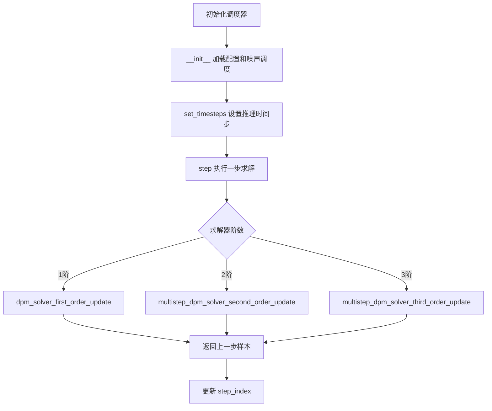
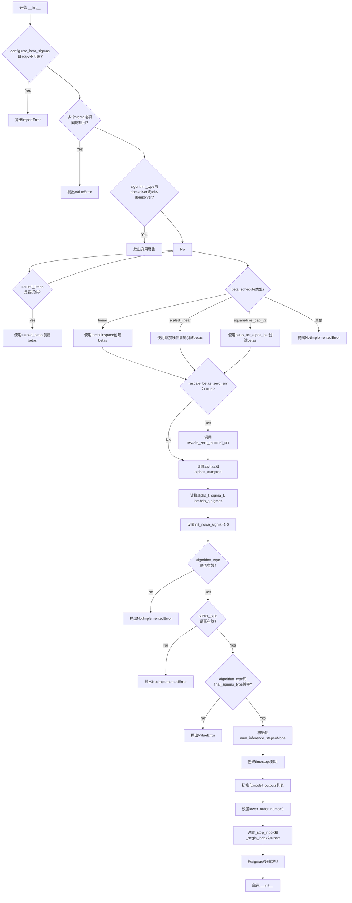
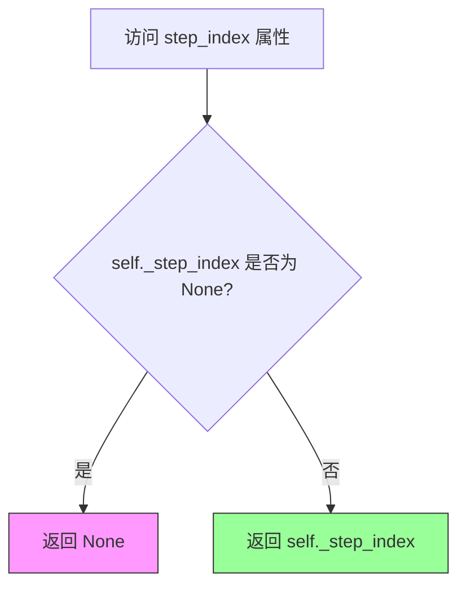
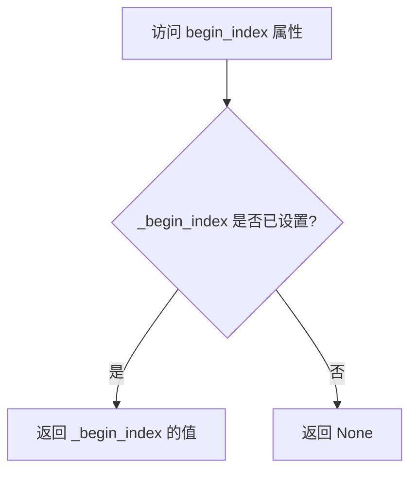
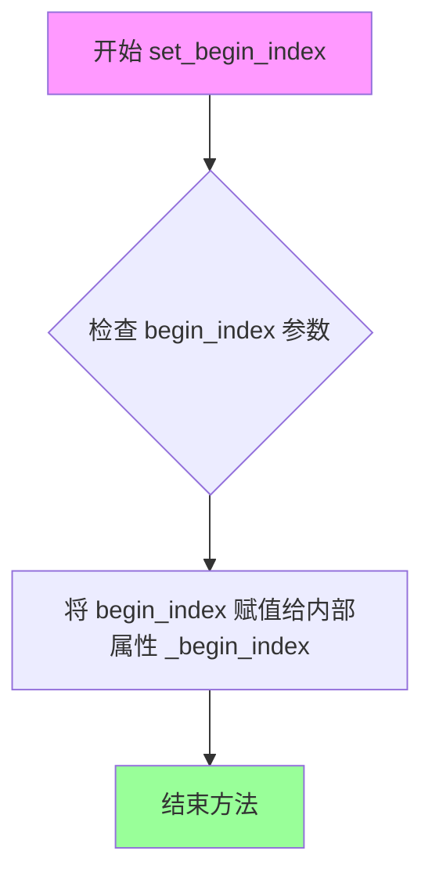
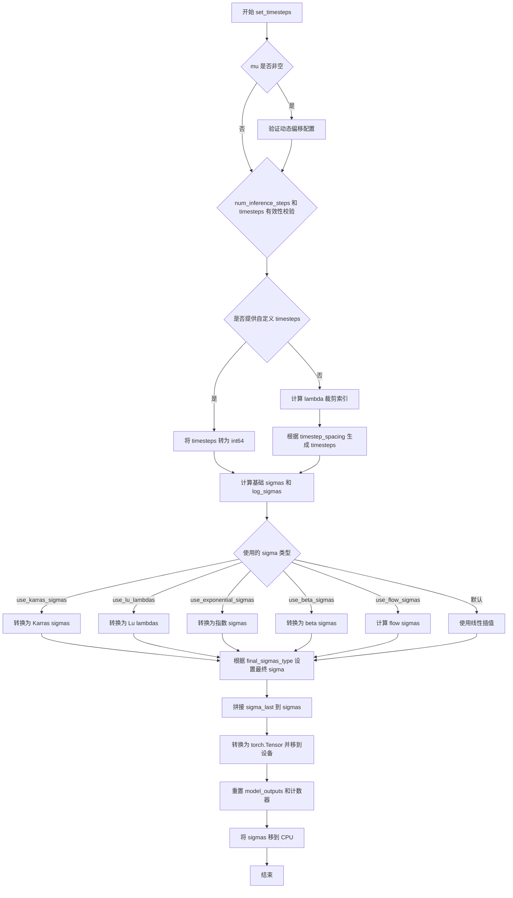
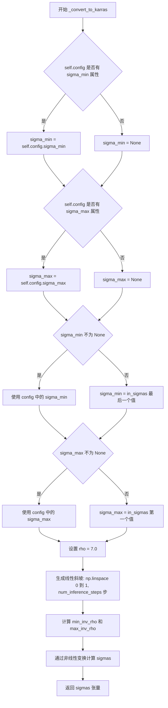
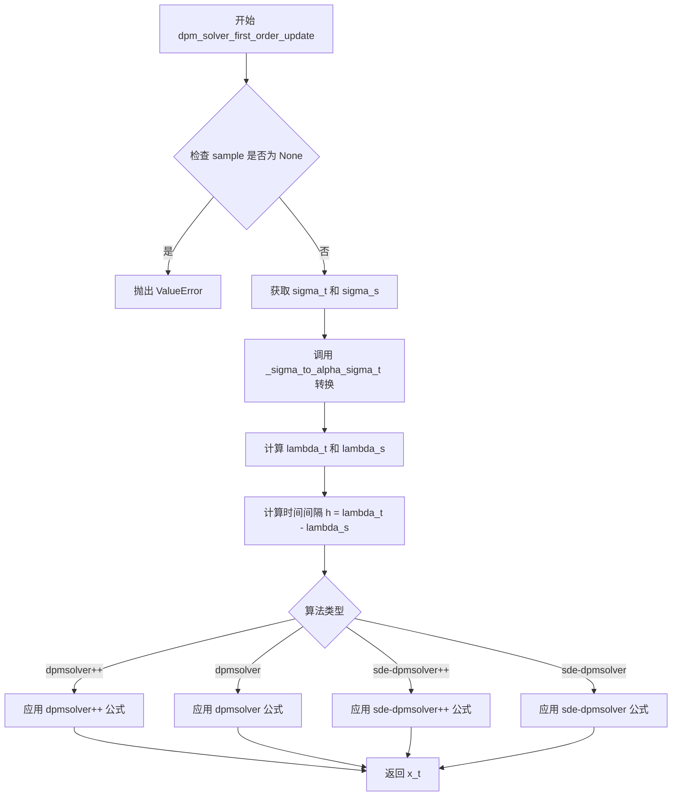
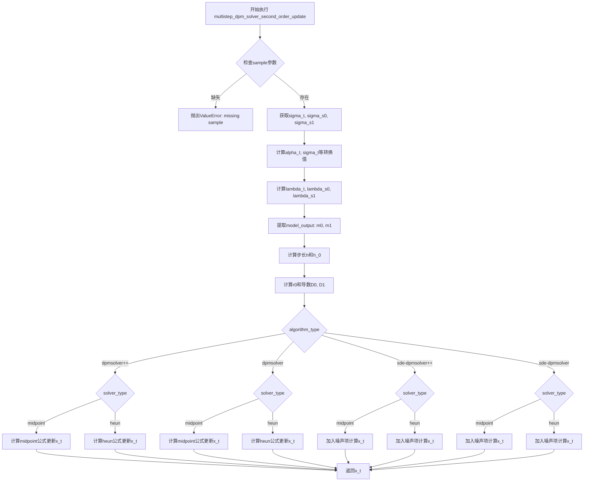
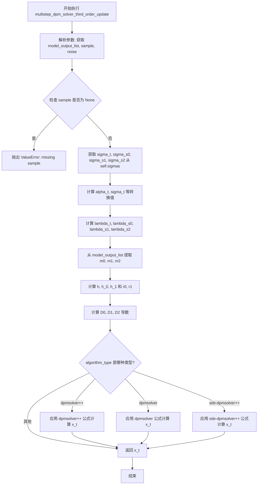

# `diffusers\src\diffusers\schedulers\scheduling_dpmsolver_multistep.py` 详细设计文档

DPMSolverMultistepScheduler 是一个用于扩散模型的高阶求解器（DPMSolver），专门设计用于快速求解扩散 ODE。它支持多种算法变体（dpmsolver/dpmsolver++/sde-dpmsolver/sde-dpmsolver++），可实现 1-3 阶的多步更新，并通过 Karras sigmas、exponential sigmas、beta sigmas 等多种噪声调度策略优化采样质量和速度。

## 整体流程



## 类结构

```
DPMSolverMultistepScheduler (主调度器类)
├── 全局函数
│   ├── betas_for_alpha_bar
│   └── rescale_zero_terminal_snr
└── 继承关系
    ├── SchedulerMixin
    └── ConfigMixin
```

## 全局变量及字段


### `betas_for_alpha_bar`
    
创建beta调度表，根据alpha_bar函数离散化生成beta序列

类型：`function`
    


### `rescale_zero_terminal_snr`
    
重新调整betas以具有零终端SNR，基于论文2305.08891

类型：`function`
    


### `is_scipy_available`
    
检查scipy库是否可用的辅助函数

类型：`function`
    


### `DPMSolverMultistepScheduler.num_train_timesteps`
    
训练时的扩散步数

类型：`int`
    


### `DPMSolverMultistepScheduler.beta_start`
    
起始beta值

类型：`float`
    


### `DPMSolverMultistepScheduler.beta_end`
    
结束beta值

类型：`float`
    


### `DPMSolverMultistepScheduler.beta_schedule`
    
beta调度策略

类型：`str`
    


### `DPMSolverMultistepScheduler.trained_betas`
    
直接传递的betas数组

类型：`np.ndarray`
    


### `DPMSolverMultistepScheduler.solver_order`
    
求解器阶数(1/2/3)

类型：`int`
    


### `DPMSolverMultistepScheduler.prediction_type`
    
预测类型(epsilon/sample/v_prediction/flow_prediction)

类型：`str`
    


### `DPMSolverMultistepScheduler.thresholding`
    
是否启用动态阈值

类型：`bool`
    


### `DPMSolverMultistepScheduler.dynamic_thresholding_ratio`
    
动态阈值比例

类型：`float`
    


### `DPMSolverMultistepScheduler.sample_max_value`
    
动态阈值最大值

类型：`float`
    


### `DPMSolverMultistepScheduler.algorithm_type`
    
算法类型(dpmsolver/dpmsolver++/sde-dpmsolver/sde-dpmsolver++)

类型：`str`
    


### `DPMSolverMultistepScheduler.solver_type`
    
求解器类型(midpoint/heun)

类型：`str`
    


### `DPMSolverMultistepScheduler.lower_order_final`
    
最终步是否使用低阶求解器

类型：`bool`
    


### `DPMSolverMultistepScheduler.euler_at_final`
    
最终步是否使用欧拉法

类型：`bool`
    


### `DPMSolverMultistepScheduler.use_karras_sigmas`
    
是否使用Karras sigmas

类型：`bool`
    


### `DPMSolverMultistepScheduler.use_exponential_sigmas`
    
是否使用指数sigmas

类型：`bool`
    


### `DPMSolverMultistepScheduler.use_beta_sigmas`
    
是否使用beta sigmas

类型：`bool`
    


### `DPMSolverMultistepScheduler.use_lu_lambdas`
    
是否使用Lu lambdas

类型：`bool`
    


### `DPMSolverMultistepScheduler.use_flow_sigmas`
    
是否使用flow sigmas

类型：`bool`
    


### `DPMSolverMultistepScheduler.flow_shift`
    
flow时间步偏移

类型：`float`
    


### `DPMSolverMultistepScheduler.final_sigmas_type`
    
最终sigma类型(zero/sigma_min)

类型：`str`
    


### `DPMSolverMultistepScheduler.lambda_min_clipped`
    
lambda最小裁剪值

类型：`float`
    


### `DPMSolverMultistepScheduler.variance_type`
    
方差类型(learned/learned_range)

类型：`str`
    


### `DPMSolverMultistepScheduler.timestep_spacing`
    
时间步间隔策略(linspace/leading/trailing)

类型：`str`
    


### `DPMSolverMultistepScheduler.steps_offset`
    
推理步偏移

类型：`int`
    


### `DPMSolverMultistepScheduler.rescale_betas_zero_snr`
    
是否重新调整betas为零终端SNR

类型：`bool`
    


### `DPMSolverMultistepScheduler.use_dynamic_shifting`
    
是否使用动态偏移

类型：`bool`
    


### `DPMSolverMultistepScheduler.time_shift_type`
    
时间偏移类型

类型：`str`
    


### `DPMSolverMultistepScheduler.betas`
    
beta值序列

类型：`torch.Tensor`
    


### `DPMSolverMultistepScheduler.alphas`
    
alpha值序列

类型：`torch.Tensor`
    


### `DPMSolverMultistepScheduler.alphas_cumprod`
    
累积alpha乘积

类型：`torch.Tensor`
    


### `DPMSolverMultistepScheduler.alpha_t`
    
当前alpha值

类型：`torch.Tensor`
    


### `DPMSolverMultistepScheduler.sigma_t`
    
当前sigma值

类型：`torch.Tensor`
    


### `DPMSolverMultistepScheduler.lambda_t`
    
当前log-SNR值

类型：`torch.Tensor`
    


### `DPMSolverMultistepScheduler.sigmas`
    
sigma序列

类型：`torch.Tensor`
    


### `DPMSolverMultistepScheduler.init_noise_sigma`
    
初始噪声标准差

类型：`float`
    


### `DPMSolverMultistepScheduler.num_inference_steps`
    
推理步数

类型：`int`
    


### `DPMSolverMultistepScheduler.timesteps`
    
时间步序列

类型：`torch.Tensor`
    


### `DPMSolverMultistepScheduler.model_outputs`
    
模型输出历史列表

类型：`list`
    


### `DPMSolverMultistepScheduler.lower_order_nums`
    
低阶求解器使用计数

类型：`int`
    


### `DPMSolverMultistepScheduler._step_index`
    
当前步索引

类型：`int`
    


### `DPMSolverMultistepScheduler._begin_index`
    
起始索引

类型：`int`
    
    

## 全局函数及方法


### `betas_for_alpha_bar`

该函数是一个全局工具函数，用于创建离散的 beta 调度表。它通过定义 alpha_bar 函数（表示扩散过程中 (1-beta) 的累积乘积），并对给定的时间步长进行离散化处理。函数支持三种 alpha 变换类型：cosine（余弦）、exp（指数）和 laplace（拉普拉斯），用户可以通过参数选择所需的噪声调度方式。

**参数：**

- `num_diffusion_timesteps`：`int`，要生成的 beta 值的数量，即扩散过程的时间步总数
- `max_beta`：`float`，默认为 `0.999`，最大 beta 上限，用于避免数值不稳定
- `alpha_transform_type`：`Literal["cosine", "exp", "laplace"]`，默认为 `"cosine"`，噪声调度的类型

**返回值：** `torch.Tensor`，返回计算得到的 beta 调度表，用于调度器逐步模型输出

#### 流程图

```mermaid
flowchart TD
    A[开始] --> B{alpha_transform_type == 'cosine'}
    B -->|是| C[定义 cosine alpha_bar_fn]
    B -->|否| D{alpha_transform_type == 'laplace'}
    D -->|是| E[定义 laplace alpha_bar_fn]
    D -->|否| F{alpha_transform_type == 'exp'}
    F -->|是| G[定义 exp alpha_bar_fn]
    F -->|否| H[抛出 ValueError]
    C --> I[初始化空 betas 列表]
    E --> I
    G --> I
    I --> J[遍历 i 从 0 到 num_diffusion_timesteps-1]
    J --> K[计算 t1 = i / num_diffusion_timesteps]
    K --> L[计算 t2 = (i + 1) / num_diffusion_timesteps]
    L --> M[计算 beta_i = min(1 - alpha_bar_fn(t2) / alpha_bar_fn(t1), max_beta)]
    M --> N[将 beta_i 添加到 betas 列表]
    N --> O{还有未处理的时间步?}
    O -->|是| J
    O -->|否| P[将 betas 列表转换为 torch.Tensor]
    P --> Q[返回结果]
    H --> R[结束 - 抛出异常]
```

#### 带注释源码

```python
# 从 diffusers.schedulers.scheduling_ddpm 复制过来的函数
def betas_for_alpha_bar(
    num_diffusion_timesteps: int,
    max_beta: float = 0.999,
    alpha_transform_type: Literal["cosine", "exp", "laplace"] = "cosine",
) -> torch.Tensor:
    """
    Create a beta schedule that discretizes the given alpha_t_bar function, which defines the cumulative product of
    (1-beta) over time from t = [0,1].

    Contains a function alpha_bar that takes an argument t and transforms it to the cumulative product of (1-beta) up
    to that part of the diffusion process.

    Args:
        num_diffusion_timesteps (`int`):
            The number of betas to produce.
        max_beta (`float`, defaults to `0.999`):
            The maximum beta to use; use values lower than 1 to avoid numerical instability.
        alpha_transform_type (`str`, defaults to `"cosine"`):
            The type of noise schedule for `alpha_bar`. Choose from `cosine`, `exp`, or `laplace`.

    Returns:
        `torch.Tensor`:
            The betas used by the scheduler to step the model outputs.
    """
    # 根据 alpha_transform_type 选择对应的 alpha_bar 函数
    # cosine 变换：使用余弦函数平方作为 alpha_bar
    if alpha_transform_type == "cosine":

        def alpha_bar_fn(t):
            # 使用改进的余弦调度，添加微小偏移 0.008/1.008 以避免 t=0 时的问题
            return math.cos((t + 0.008) / 1.008 * math.pi / 2) ** 2

    # laplace 变换：基于拉普拉斯分布的噪声调度
    elif alpha_transform_type == "laplace":

        def alpha_bar_fn(t):
            # 计算 lambda 参数：-0.5 * sign(0.5 - t) * log(1 - 2*|0.5 - t| + 1e-6)
            lmb = -0.5 * math.copysign(1, 0.5 - t) * math.log(1 - 2 * math.fabs(0.5 - t) + 1e-6)
            # 计算信噪比 SNR = exp(lambda)
            snr = math.exp(lmb)
            # alpha_bar = sqrt(snr / (1 + snr))
            return math.sqrt(snr / (1 + snr))

    # exp 变换：指数衰减的噪声调度
    elif alpha_transform_type == "exp":

        def alpha_bar_fn(t):
            # 使用指数衰减：alpha_bar = exp(-12 * t)
            return math.exp(t * -12.0)

    # 不支持的变换类型，抛出 ValueError
    else:
        raise ValueError(f"Unsupported alpha_transform_type: {alpha_transform_type}")

    # 初始化空的 beta 列表
    betas = []
    # 遍历每个扩散时间步，计算对应的 beta 值
    for i in range(num_diffusion_timesteps):
        # t1 和 t2 表示相邻两个时间步的归一化位置 [0, 1]
        t1 = i / num_diffusion_timesteps
        t2 = (i + 1) / num_diffusion_timesteps
        # 计算 beta：1 - alpha_bar(t2) / alpha_bar(t1)
        # 使用 min(..., max_beta) 确保 beta 不超过最大 beta 值
        betas.append(min(1 - alpha_bar_fn(t2) / alpha_bar_fn(t1), max_beta))
    
    # 将 beta 列表转换为 float32 类型的 PyTorch 张量并返回
    return torch.tensor(betas, dtype=torch.float32)
```


### `rescale_zero_terminal_snr`

该函数用于重新缩放扩散调度器中的 beta 值，使其终端信噪比（SNR）为零。这一操作基于论文 2305.08891 中的算法 1，旨在使模型能够生成非常明亮或非常暗的样本，而不是限制在中等亮度的样本。

参数：

- `betas`：`torch.Tensor`，调度器初始化时使用的 beta 值张量

返回值：`torch.Tensor`，经过重新缩放后终端 SNR 为零的 beta 值

#### 流程图

```mermaid
flowchart TD
    A[开始: 输入 betas] --> B[计算 alphas = 1.0 - betas]
    B --> C[计算 alphas_cumprod = cumprod alphas]
    C --> D[计算 alphas_bar_sqrt = sqrt alphas_cumprod]
    D --> E[保存初始值: alphas_bar_sqrt_0 和 alphas_bar_sqrt_T]
    E --> F[移位操作: alphas_bar_sqrt -= alphas_bar_sqrt_T]
    F --> G[缩放操作: alphas_bar_sqrt *= alphas_bar_sqrt_0 / alphas_bar_sqrt_0 - alphas_bar_sqrt_T]
    G --> H[逆平方: alphas_bar = alphas_bar_sqrt ** 2]
    H --> I[逆累积乘积: alphas = alphas_bar[1:] / alphas_bar[:-1]]
    I --> J[拼接: alphas = concat[alphas_bar[0:1], alphas]]
    J --> K[计算 betas: betas = 1 - alphas]
    K --> L[返回: 重新缩放后的 betas]
```

#### 带注释源码

```python
# Copied from diffusers.schedulers.scheduling_ddim.rescale_zero_terminal_snr
def rescale_zero_terminal_snr(betas):
    """
    Rescales betas to have zero terminal SNR Based on https://huggingface.co/papers/2305.08891 (Algorithm 1)

    Args:
        betas (`torch.Tensor`):
            The betas that the scheduler is being initialized with.

    Returns:
        `torch.Tensor`:
            Rescaled betas with zero terminal SNR.
    """
    # Step 1: 将 betas 转换为 alphas
    # alpha = 1 - beta，表示每一步的存活概率
    alphas = 1.0 - betas
    
    # Step 2: 计算累积乘积 alphas_cumprod
    # 这表示从 t=0 到当前时刻的 (1-beta) 的累积乘积
    alphas_cumprod = torch.cumprod(alphas, dim=0)
    
    # Step 3: 计算累积乘积的平方根
    # alphas_bar_sqrt 用于后续的线性变换
    alphas_bar_sqrt = alphas_cumprod.sqrt()

    # Step 4: 保存初始值和最终值
    # alphas_bar_sqrt_0: 第一个时间步的平方根值
    # alphas_bar_sqrt_T: 最后一个时间步的平方根值（终端 SNR 相关）
    alphas_bar_sqrt_0 = alphas_bar_sqrt[0].clone()
    alphas_bar_sqrt_T = alphas_bar_sqrt[-1].clone()

    # Step 5: 移位操作
    # 将最后的时间步移至零，确保终端 SNR 为零
    alphas_bar_sqrt -= alphas_bar_sqrt_T

    # Step 6: 缩放操作
    # 调整第一个时间步回到原始值，保持整体缩放一致性
    alphas_bar_sqrt *= alphas_bar_sqrt_0 / (alphas_bar_sqrt_0 - alphas_bar_sqrt_T)

    # Step 7: 逆平方操作
    # 恢复 alphas_bar 值
    alphas_bar = alphas_bar_sqrt**2  # Revert sqrt

    # Step 8: 逆累积乘积操作
    # 从 alphas_bar 恢复出 alphas
    alphas = alphas_bar[1:] / alphas_bar[:-1]  # Revert cumprod
    
    # Step 9: 拼接操作
    # 保持数组长度一致，将第一个元素添加到开头
    alphas = torch.cat([alphas_bar[0:1], alphas])
    
    # Step 10: 计算新的 betas
    # beta = 1 - alpha
    betas = 1 - alphas

    return betas
```


### DPMSolverMultistepScheduler.__init__

该方法是`DPMSolverMultistepScheduler`类的初始化方法，负责配置扩散模型求解器的各项参数，包括噪声调度（beta调度）、算法类型、求解器阶数、预测类型等，并初始化相关的内部状态变量。

参数：

- `num_train_timesteps`：`int`，默认值1000，扩散模型训练的步数
- `beta_start`：`float`，默认值0.0001，推理时beta的起始值
- `beta_end`：`float`，默认值0.02，推理时beta的结束值
- `beta_schedule`：`str`，默认值"linear"，beta调度策略，可选"linear"、"scaled_linear"或"squaredcos_cap_v2"
- `traated_betas`：`np.ndarray | list[float] | None`，默认值None，直接传递的beta数组，用于绕过beta_start和beta_end
- `solver_order`：`int`，默认值2，DPMSolver的阶数，可为1、2或3
- `prediction_type`：`Literal["epsilon", "sample", "v_prediction", "flow_prediction"]`，默认值"epsilon"，调度器函数的预测类型
- `thresholding`：`bool`，默认值False，是否使用动态阈值方法
- `dynamic_thresholding_ratio`：`float`，默认值0.995，动态阈值方法的比率
- `sample_max_value`：`float`，默认值1.0，动态阈值的阈值值
- `algorithm_type`：`Literal["dpmsolver", "dpmsolver++", "sde-dpmsolver", "sde-dpmsolver++"]`，默认值"dpmsolver++"，求解器算法类型
- `solver_type`：`Literal["midpoint", "heun"]`，默认值"midpoint"，二阶求解器的求解器类型
- `lower_order_final`：`bool`，默认值True，是否在最后步骤使用低阶求解器
- `euler_at_final`：`bool`，默认值False，是否在最后一步使用欧拉法
- `use_karras_sigmas`：`bool`，默认值False，是否使用Karras sigmas
- `use_exponential_sigmas`：`bool`，默认值False，是否使用指数sigmas
- `use_beta_sigmas`：`bool`，默认值False，是否使用beta sigmas
- `use_lu_lambdas`：`bool`，默认值False，是否使用Lu的uniform-logSNR
- `use_flow_sigmas`：`bool`，默认值False，是否使用flow sigmas
- `flow_shift`：`float`，默认值1.0，flow matching的时间步调度偏移值
- `final_sigmas_type`：`Literal["zero", "sigma_min"]`，默认值"zero"，采样过程中噪声计划的最终sigma值
- `lambda_min_clipped`：`float`，默认值-inf，lambda(t)最小值的裁剪阈值
- `variance_type`：`Literal["learned", "learned_range"] | None`，默认值None，扩散模型预测的方差类型
- `timestep_spacing`：`Literal["linspace", "leading", "trailing"]`，默认值"linspace"，时间步的缩放方式
- `steps_offset`：`int`，默认值0，推理步骤的偏移量
- `rescale_betas_zero_snr`：`bool`，默认值False，是否重新缩放beta以具有零终端SNR
- `use_dynamic_shifting`：`bool`，默认值False，是否使用动态时间偏移
- `time_shift_type`：`Literal["exponential"]`，默认值"exponential"，动态偏移的类型

返回值：`None`，该方法为构造函数，不返回任何值

#### 流程图



#### 带注释源码

```python
@register_to_config
def __init__(
    self,
    num_train_timesteps: int = 1000,                # 扩散训练的步数
    beta_start: float = 0.0001,                     # beta起始值
    beta_end: float = 0.02,                         # beta结束值
    beta_schedule: str = "linear",                  # beta调度策略
    trained_betas: np.ndarray | list[float] | None = None,  # 直接传递的beta数组
    solver_order: int = 2,                          # DPMSolver阶数
    prediction_type: Literal["epsilon", "sample", "v_prediction", "flow_prediction"] = "epsilon",  # 预测类型
    thresholding: bool = False,                     # 是否启用动态阈值
    dynamic_thresholding_ratio: float = 0.995,     # 动态阈值比率
    sample_max_value: float = 1.0,                 # 样本最大值
    algorithm_type: Literal["dpmsolver", "dpmsolver++", "sde-dpmsolver", "sde-dpmsolver++"] = "dpmsolver++",  # 算法类型
    solver_type: Literal["midpoint", "heun"] = "midpoint",  # 求解器类型
    lower_order_final: bool = True,                 # 最终步骤使用低阶求解器
    euler_at_final: bool = False,                  # 最终步骤使用欧拉法
    use_karras_sigmas: bool = False,                # 使用Karras sigmas
    use_exponential_sigmas: bool = False,          # 使用指数sigmas
    use_beta_sigmas: bool = False,                  # 使用beta sigmas
    use_lu_lambdas: bool = False,                   # 使用Lu lambdas
    use_flow_sigmas: bool = False,                  # 使用flow sigmas
    flow_shift: float = 1.0,                       # flow偏移量
    final_sigmas_type: Literal["zero", "sigma_min"] = "zero",  # 最终sigma类型
    lambda_min_clipped: float = -float("inf"),    # lambda最小裁剪值
    variance_type: Literal["learned", "learned_range"] | None = None,  # 方差类型
    timestep_spacing: Literal["linspace", "leading", "trailing"] = "linspace",  # 时间步间距
    steps_offset: int = 0,                          # 步骤偏移
    rescale_betas_zero_snr: bool = False,           # 重新缩放beta为零SNR
    use_dynamic_shifting: bool = False,            # 动态偏移
    time_shift_type: Literal["exponential"] = "exponential",  # 时间偏移类型
):
    # 检查beta sigmas依赖
    if self.config.use_beta_sigmas and not is_scipy_available():
        raise ImportError("Make sure to install scipy if you want to use beta sigmas.")
    
    # 检查多个sigma选项不能同时启用
    if (
        sum(
            [
                self.config.use_beta_sigmas,
                self.config.use_exponential_sigmas,
                self.config.use_karras_sigmas,
            ]
        )
        > 1
    ):
        raise ValueError(
            "Only one of `config.use_beta_sigmas`, `config.use_exponential_sigmas`, `config.use_karras_sigmas` can be used."
        )
    
    # 对弃用的algorithm_type发出警告
    if algorithm_type in ["dpmsolver", "sde-dpmsolver"]:
        deprecation_message = f"algorithm_type {algorithm_type} is deprecated and will be removed in a future version. Choose from `dpmsolver++` or `sde-dpmsolver++` instead"
        deprecate(
            "algorithm_types dpmsolver and sde-dpmsolver",
            "1.0.0",
            deprecation_message,
        )

    # 根据参数创建betas
    if trained_betas is not None:
        self.betas = torch.tensor(trained_betas, dtype=torch.float32)
    elif beta_schedule == "linear":
        # 线性beta调度
        self.betas = torch.linspace(beta_start, beta_end, num_train_timesteps, dtype=torch.float32)
    elif beta_schedule == "scaled_linear":
        # 针对潜在扩散模型的特定调度
        self.betas = (
            torch.linspace(
                beta_start**0.5,
                beta_end**0.5,
                num_train_timesteps,
                dtype=torch.float32,
            )
            ** 2
        )
    elif beta_schedule == "squaredcos_cap_v2":
        # Glide余弦调度
        self.betas = betas_for_alpha_bar(num_train_timesteps)
    else:
        raise NotImplementedError(f"{beta_schedule} is not implemented for {self.__class__}")

    # 如果需要，重新缩放beta为零终端SNR
    if rescale_betas_zero_snr:
        self.betas = rescale_zero_terminal_snr(self.betas)

    # 计算alphas和累积乘积
    self.alphas = 1.0 - self.betas
    self.alphas_cumprod = torch.cumprod(self.alphas, dim=0)

    # 处理零终端SNR的特殊情况
    if rescale_betas_zero_snr:
        # 接近0但不为0，使第一个sigma不是无穷大
        # FP16最小的正子normal在这里效果很好
        self.alphas_cumprod[-1] = 2**-24

    # 目前仅支持VP类型噪声调度
    self.alpha_t = torch.sqrt(self.alphas_cumprod)
    self.sigma_t = torch.sqrt(1 - self.alphas_cumprod)
    self.lambda_t = torch.log(self.alpha_t) - torch.log(self.sigma_t)
    self.sigmas = ((1 - self.alphas_cumprod) / self.alphas_cumprod) ** 0.5

    # 初始噪声分布的标准差
    self.init_noise_sigma = 1.0

    # DPM-Solver的设置
    if algorithm_type not in [
        "dpmsolver",
        "dpmsolver++",
        "sde-dpmsolver",
        "sde-dpmsolver++",
    ]:
        if algorithm_type == "deis":
            self.register_to_config(algorithm_type="dpmsolver++")
        else:
            raise NotImplementedError(f"{algorithm_type} is not implemented for {self.__class__}")

    if solver_type not in ["midpoint", "heun"]:
        if solver_type in ["logrho", "bh1", "bh2"]:
            self.register_to_config(solver_type="midpoint")
        else:
            raise NotImplementedError(f"{solver_type} is not implemented for {self.__class__}")

    # 检查algorithm_type和final_sigmas_type的兼容性
    if algorithm_type not in ["dpmsolver++", "sde-dpmsolver++"] and final_sigmas_type == "zero":
        raise ValueError(
            f"`final_sigmas_type` {final_sigmas_type} is not supported for `algorithm_type` {algorithm_type}. Please choose `sigma_min` instead."
        )

    # 可设置的值
    self.num_inference_steps = None
    # 创建时间步数组，从num_train_timesteps-1到0
    timesteps = np.linspace(0, num_train_timesteps - 1, num_train_timesteps, dtype=np.float32)[::-1].copy()
    self.timesteps = torch.from_numpy(timesteps)
    # 初始化模型输出列表，长度为solver_order
    self.model_outputs = [None] * solver_order
    self.lower_order_nums = 0
    self._step_index = None
    self._begin_index = None
    # 将sigmas移到CPU以避免过多的CPU/GPU通信
    self.sigmas = self.sigmas.to("cpu")
```


### `DPMSolverMultistepScheduler.step_index`

获取当前时间步的索引计数器。该属性返回内部变量 `_step_index`，该计数器在每次调度器执行 step 方法后增加 1，用于追踪扩散模型推理过程中的当前步骤。

参数：无（此为属性，不接受参数）

返回值：`int | None`，返回当前时间步的索引。如果调度器尚未执行 step 方法（即尚未初始化），则返回 `None`。

#### 流程图



#### 带注释源码

```python
@property
def step_index(self):
    """
    The index counter for current timestep. It will increase 1 after each scheduler step.
    """
    return self._step_index
```

**说明：**

- 这是一个只读属性（read-only property），通过 `@property` 装饰器实现
- `self._step_index` 是类的私有实例变量，在 `__init__` 方法中初始化为 `None`
- 该索引在 `set_timesteps` 方法中会被重置为 `None`，在 `step` 方法中通过 `_init_step_index` 初始化，并在每次 `step` 执行完成后自动递增
- 用于在多步 DPMSolver 算法中追踪当前所处的时间步位置，以便正确访问 `self.sigmas`、`self.model_outputs` 等与步骤相关的数组


### `DPMSolverMultistepScheduler.begin_index`

该属性是 `DPMSolverMultistepScheduler` 调度器的只读属性，用于获取第一个时间步的索引。该索引应通过 `set_begin_index` 方法从管道中设置，用于控制调度器从哪个时间步开始推理。

参数：

- （无参数，这是一个属性 getter）

返回值：`int | None`，返回第一个时间步的索引。如果未设置，则返回 `None`。

#### 流程图



#### 带注释源码

```python
@property
def begin_index(self):
    """
    The index for the first timestep. It should be set from pipeline with `set_begin_index` method.
    """
    return self._begin_index
```

#### 说明

- **属性类型**：这是一个 Python `@property` 装饰器定义的只读属性
- **内部变量**：该属性返回内部变量 `self._begin_index` 的值
- **初始化**：`self._begin_index` 在 `__init__` 方法中初始化为 `None`
- **设置方式**：通过 `set_begin_index` 方法设置该值，通常由 pipeline 在推理前调用
- **用途**：用于支持图像到图像（img2img）等场景，允许调度器从中间时间步开始去噪


### `DPMSolverMultistepScheduler.set_begin_index`

该方法用于设置调度器（Scheduler）的起始索引（begin index），通常在推理前由 pipeline 调用，以确保调度器从指定的起始时间步开始执行去噪过程。

参数：

- `begin_index`：`int`，默认值为 `0`，表示调度器的起始索引，用于控制在 diffusion 链中从哪个时间步开始推理。

返回值：`None`，该方法无返回值，仅执行属性赋值操作。

#### 流程图



#### 带注释源码

```python
def set_begin_index(self, begin_index: int = 0):
    """
    Sets the begin index for the scheduler. This function should be run from pipeline before the inference.

    Args:
        begin_index (`int`, defaults to `0`):
            The begin index for the scheduler.
    """
    # 将传入的 begin_index 参数赋值给实例的私有属性 _begin_index
    # 该属性用于跟踪调度器的起始位置，通常在图像到图像的推理中非常重要
    # 它允许从非零时间步开始去噪过程，而不是从完整的扩散链起点开始
    self._begin_index = begin_index
```


### `DPMSolverMultistepScheduler.set_timesteps`

该方法用于在推理前设置离散的时间步（timesteps）和对应的噪声强度（sigmas），以控制扩散模型的采样过程。它支持多种时间步间隔策略（如 linspace、leading、trailing），并可配合 Karras sigmas、指数 sigmas、Lu lambdas、beta sigmas 或 flow sigmas 等高级噪声调度方案。

参数：

- `num_inference_steps`：`int | None`，生成样本时使用的扩散步数。如果为 `None`，则必须提供 `timesteps`。
- `device`：`str | torch.device | None`，时间步要迁移到的设备。如果为 `None`，则不迁移。
- `mu`：`float | None`，动态时间偏移参数，仅在 `use_dynamic_shifting=True` 且 `time_shift_type="exponential"` 时生效。
- `timesteps`：`list[int] | None`，自定义时间步列表，用于支持任意时间步调度。如果提供此参数，`num_inference_steps` 和 `sigmas` 必须为 `None`，且忽略 `timestep_spacing` 属性。

返回值：`None`，该方法直接修改调度器的内部状态（`self.timesteps`、`self.sigmas` 等），不返回任何值。

#### 流程图



#### 带注释源码

```python
def set_timesteps(
    self,
    num_inference_steps: int = None,
    device: str | torch.device = None,
    mu: float | None = None,
    timesteps: list[int] | None = None,
):
    """
    Sets the discrete timesteps used for the diffusion chain (to be run before inference).

    Args:
        num_inference_steps (`int`, *optional*):
            The number of diffusion steps used when generating samples with a pre-trained model.
        device (`str` or `torch.device`, *optional*):
            The device to which the timesteps should be moved to. If `None`, the timesteps are not moved.
        timesteps (`list[int]`, *optional*):
            Custom timesteps used to support arbitrary timesteps schedule. If `None`, timesteps will be generated
            based on the `timestep_spacing` attribute. If `timesteps` is passed, `num_inference_steps` and `sigmas`
            must be `None`, and `timestep_spacing` attribute will be ignored.
    """
    # 如果提供了 mu 参数，则更新 flow_shift 配置
    # 仅当启用动态偏移且时间偏移类型为指数型时才允许
    if mu is not None:
        assert self.config.use_dynamic_shifting and self.config.time_shift_type == "exponential"
        self.config.flow_shift = np.exp(mu)
    
    # 参数互斥性校验：必须提供 num_inference_steps 或 timesteps 之一
    if num_inference_steps is None and timesteps is None:
        raise ValueError("Must pass exactly one of `num_inference_steps` or `timesteps`.")
    # 参数互斥性校验：不能同时提供两者
    if num_inference_steps is not None and timesteps is not None:
        raise ValueError("Can only pass one of `num_inference_steps` or `custom_timesteps`.")
    
    # 与特定 sigma 配置不兼容的校验
    if timesteps is not None and self.config.use_karras_sigmas:
        raise ValueError("Cannot use `timesteps` with `config.use_karras_sigmas = True`")
    if timesteps is not None and self.config.use_lu_lambdas:
        raise ValueError("Cannot use `timesteps` with `config.use_lu_lambdas = True`")
    if timesteps is not None and self.config.use_exponential_sigmas:
        raise ValueError("Cannot set `timesteps` with `config.use_exponential_sigmas = True`.")
    if timesteps is not None and self.config.use_beta_sigmas:
        raise ValueError("Cannot set `timesteps` with `config.use_beta_sigmas = True`.")

    # 处理自定义 timesteps
    if timesteps is not None:
        timesteps = np.array(timesteps).astype(np.int64)
    else:
        # 数值稳定性保护：对 lambda(t) 最小值进行裁剪
        # 这对 cosine (squaredcos_cap_v2) 噪声调度至关重要
        clipped_idx = torch.searchsorted(torch.flip(self.lambda_t, [0]), self.config.lambda_min_clipped)
        last_timestep = ((self.config.num_train_timesteps - clipped_idx).numpy()).item()

        # 根据 timestep_spacing 属性生成时间步
        # "linspace", "leading", "trailing" 对应 Common Diffusion Noise Schedules 论文的 Table 2
        if self.config.timestep_spacing == "linspace":
            # 等间距分布，从最大时间步到 0
            timesteps = (
                np.linspace(0, last_timestep - 1, num_inference_steps + 1)
                .round()[::-1][:-1]  # 反转并移除最后一个（值为0的）
                .copy()
                .astype(np.int64)
            )
        elif self.config.timestep_spacing == "leading":
            # 步长均匀划分，最后几步更密集
            step_ratio = last_timestep // (num_inference_steps + 1)
            timesteps = (
                (np.arange(0, num_inference_steps + 1) * step_ratio).round()[::-1][:-1].copy().astype(np.int64)
            )
            timesteps += self.config.steps_offset  # 添加偏移量
        elif self.config.timestep_spacing == "trailing":
            # 步长均匀划分，前几步更密集
            step_ratio = self.config.num_train_timesteps / num_inference_steps
            timesteps = np.arange(last_timestep, 0, -step_ratio).round().copy().astype(np.int64)
            timesteps -= 1
        else:
            raise ValueError(
                f"{self.config.timestep_spacing} is not supported. Please make sure to choose one of 'linspace', 'leading' or 'trailing'."
            )

    # 计算基础 sigmas：基于累积乘积 alpha_cumprod
    sigmas = np.array(((1 - self.alphas_cumprod) / self.alphas_cumprod) ** 0.5)
    log_sigmas = np.log(sigmas)

    # 根据配置选择不同的 sigma 转换策略
    if self.config.use_karras_sigmas:
        # Karras 噪声调度：使用论文 Elucidating the Design Space 的方法
        sigmas = np.flip(sigmas).copy()
        sigmas = self._convert_to_karras(in_sigmas=sigmas, num_inference_steps=num_inference_steps)
        # 通过 sigma 到 timestep 的映射转换
        timesteps = np.array([self._sigma_to_t(sigma, log_sigmas) for sigma in sigmas])
        if self.config.beta_schedule != "squaredcos_cap_v2":
            timesteps = timesteps.round()
    elif self.config.use_lu_lambdas:
        # Lu 的 DPM-Solver 提出的 uniform-logSNR 调度
        lambdas = np.flip(log_sigmas.copy())
        lambdas = self._convert_to_lu(in_lambdas=lambdas, num_inference_steps=num_inference_steps)
        sigmas = np.exp(lambdas)
        timesteps = np.array([self._sigma_to_t(sigma, log_sigmas) for sigma in sigmas])
        if self.config.beta_schedule != "squaredcos_cap_v2":
            timesteps = timesteps.round()
    elif self.config.use_exponential_sigmas:
        # 指数 sigma 调度
        sigmas = np.flip(sigmas).copy()
        sigmas = self._convert_to_exponential(in_sigmas=sigmas, num_inference_steps=num_inference_steps)
        timesteps = np.array([self._sigma_to_t(sigma, log_sigmas) for sigma in sigmas])
    elif self.config.use_beta_sigmas:
        # Beta 分布调度：基于论文 Beta Sampling is All You Need
        sigmas = np.flip(sigmas).copy()
        sigmas = self._convert_to_beta(in_sigmas=sigmas, num_inference_steps=num_inference_steps)
        timesteps = np.array([self._sigma_to_t(sigma, log_sigmas) for sigma in sigmas])
    elif self.config.use_flow_sigmas:
        # Flow matching 的 sigma 调度
        alphas = np.linspace(1, 1 / self.config.num_train_timesteps, num_inference_steps + 1)
        sigmas = 1.0 - alphas
        sigmas = np.flip(self.config.flow_shift * sigmas / (1 + (self.config.flow_shift - 1) * sigmas))[:-1].copy()
        timesteps = (sigmas * self.config.num_train_timesteps).copy()
    else:
        # 默认：线性插值
        sigmas = np.interp(timesteps, np.arange(0, len(sigmas)), sigmas)

    # 根据 final_sigmas_type 设置最终 sigma 值
    if self.config.final_sigmas_type == "sigma_min":
        # 使用训练时最后一个 sigma
        sigma_last = ((1 - self.alphas_cumprod[0]) / self.alphas_cumprod[0]) ** 0.5
    elif self.config.final_sigmas_type == "zero":
        # 最终 sigma 设为 0
        sigma_last = 0
    else:
        raise ValueError(
            f"`final_sigmas_type` must be one of 'zero', or 'sigma_min', but got {self.config.final_sigmas_type}"
        )

    # 拼接最终的 sigma（包括最后一个sigma值）
    sigmas = np.concatenate([sigmas, [sigma_last]]).astype(np.float32)

    # 转换为 torch.Tensor 并移至指定设备
    self.sigmas = torch.from_numpy(sigmas)
    self.timesteps = torch.from_numpy(timesteps).to(device=device, dtype=torch.int64)

    # 更新推理步数
    self.num_inference_steps = len(timesteps)

    # 重置模型输出缓冲区（用于多步求解器）
    self.model_outputs = [
        None,
    ] * self.config.solver_order
    self.lower_order_nums = 0

    # 重置调度器索引计数器
    self._step_index = None
    self._begin_index = None
    # 将 sigmas 保留在 CPU 以减少 CPU/GPU 通信开销
    self.sigmas = self.sigmas.to("cpu")
```


### `DPMSolverMultistepScheduler._threshold_sample`

对预测样本应用动态阈值处理（Dynamic Thresholding），通过计算样本绝对值的分位数来确定动态阈值，将饱和像素（接近-1和1的值）向内推送，防止像素在每一步采样时饱和，从而提升图像的真实感和文本-图像对齐度。

参数：

- `sample`：`torch.Tensor`，需要被阈值处理的预测样本

返回值：`torch.Tensor`，阈值处理后的样本

#### 流程图

```mermaid
flowchart TD
    A[开始: 输入 sample] --> B{判断 dtype 是否为 float32/float64}
    B -->|否| C[转换为 float32 避免半精度问题]
    B -->|是| D[保持原 dtype]
    C --> E[将样本 reshape 为 batch_size x (channels × spatial_dims)]
    D --> E
    E --> F[计算绝对值 abs_sample]
    G[计算分位数 s = quantile abs_sample]
    F --> G
    G --> H[clamp s 到 [1, sample_max_value]]
    H --> I[unsqueeze s 为 (batch_size, 1) 用于广播]
    I --> J[clamp 样本到 [-s, s] 并除以 s]
    J --> K[reshape 回原始空间维度]
    K --> L[转换回原始 dtype]
    L --> M[返回阈值处理后的样本]
```

#### 带注释源码

```python
def _threshold_sample(self, sample: torch.Tensor) -> torch.Tensor:
    """
    Apply dynamic thresholding to the predicted sample.

    "Dynamic thresholding: At each sampling step we set s to a certain percentile absolute pixel value in xt0 (the
    prediction of x_0 at timestep t), and if s > 1, then we threshold xt0 to the range [-s, s] and then divide by
    s. Dynamic thresholding pushes saturated pixels (those near -1 and 1) inwards, thereby actively preventing
    pixels from saturation at each step. We find that dynamic thresholding results in significantly better
    photorealism as well as better image-text alignment, especially when using very large guidance weights."

    https://huggingface.co/papers/2205.11487

    Args:
        sample (`torch.Tensor`):
            The predicted sample to be thresholded.

    Returns:
        `torch.Tensor`:
            The thresholded sample.
    """
    # 保存原始数据类型，以便最后恢复
    dtype = sample.dtype
    # 解构样本形状：batch_size, channels, 剩余维度（如 height, width）
    batch_size, channels, *remaining_dims = sample.shape

    # 如果不是 float32 或 float64，需要提升精度进行分位数计算
    # 因为 CPU 半精度不支持 clamp 操作
    if dtype not in (torch.float32, torch.float64):
        sample = sample.float()  # upcast for quantile calculation, and clamp not implemented for cpu half

    # 展平样本以便沿每个图像独立计算分位数
    # 从 (batch, channels, h, w) 变为 (batch, channels*h*w)
    sample = sample.reshape(batch_size, channels * np.prod(remaining_dims))

    # 计算绝对值，用于确定"某个百分比的绝对像素值"
    abs_sample = sample.abs()  # "a certain percentile absolute pixel value"

    # 计算指定比例（dynamic_thresholding_ratio，如 0.995）的分位数作为动态阈值 s
    # dim=1 表示沿图像维度计算每个 batch 独立的阈值
    s = torch.quantile(abs_sample, self.config.dynamic_thresholding_ratio, dim=1)
    
    # 将阈值 s 限制在 [1, sample_max_value] 范围内
    # 当 min=1 时，等价于标准 clip 到 [-1, 1]
    s = torch.clamp(
        s, min=1, max=self.config.sample_max_value
    )  # When clamped to min=1, equivalent to standard clipping to [-1, 1]
    
    # 扩展 s 的维度为 (batch_size, 1) 以便沿 dim=0 进行广播
    s = s.unsqueeze(1)  # (batch_size, 1) because clamp will broadcast along dim=0
    
    # 将样本限制在 [-s, s] 范围内，然后除以 s 进行归一化
    # 这实现了"将 xt0 阈值化到 [-s, s] 范围，然后除以 s"
    sample = torch.clamp(sample, -s, s) / s  # "we threshold xt0 to the range [-s, s] and then divide by s"

    # 恢复原始空间维度
    sample = sample.reshape(batch_size, channels, *remaining_dims)
    
    # 转换回原始数据类型
    sample = sample.to(dtype)

    return sample
```


### `DPMSolverMultistepScheduler._sigma_to_t`

将sigma值通过插值转换为对应的时间步（timestep）值。该函数在sigma值与预计算的对数sigma调度表之间进行插值，以找到对应的离散时间步。

参数：

- `sigma`：`np.ndarray`，要转换的sigma值（噪声标准差）
- `log_sigmas`：`np.ndarray`，用于插值的对数sigma调度表

返回值：`np.ndarray`，与输入sigma对应的插值时间步值

#### 流程图

```mermaid
flowchart TD
    A[开始: _sigma_to_t] --> B[计算log_sigma: np.lognp.maximumsigma, 1e-10]
    B --> C[计算距离: dists = log_sigma - log_sigmas[:, np.newaxis]]
    C --> D[计算low_idx: cumsumdists>=0的argmax并clip]
    D --> E[计算high_idx = low_idx + 1]
    E --> F[获取low和high的对数sigma值]
    F --> G[计算插值权重: w = low - log_sigma / low - high]
    G --> H[clip w到0-1范围]
    H --> I[计算时间步: t = 1-w * low_idx + w * high_idx]
    I --> J[reshape t以匹配sigma形状]
    J --> K[返回t]
```

#### 带注释源码

```python
def _sigma_to_t(self, sigma: np.ndarray, log_sigmas: np.ndarray) -> np.ndarray:
    """
    Convert sigma values to corresponding timestep values through interpolation.

    Args:
        sigma (`np.ndarray`):
            The sigma value(s) to convert to timestep(s).
        log_sigmas (`np.ndarray`):
            The logarithm of the sigma schedule used for interpolation.

    Returns:
        `np.ndarray`:
            The interpolated timestep value(s) corresponding to the input sigma(s).
    """
    # Step 1: 计算输入sigma的对数，使用1e-10作为最小值防止log(0)
    log_sigma = np.log(np.maximum(sigma, 1e-10))

    # Step 2: 计算log_sigma与log_sigmas调度表中每个值的距离
    # 结果形状: (len(log_sigmas), len(sigma))
    dists = log_sigma - log_sigmas[:, np.newaxis]

    # Step 3: 找到每个sigma在log_sigmas中的位置
    # cumsum(...>=0)创建累积布尔数组，argmax找到第一个True的索引
    # clip确保索引不超出范围（最多到倒数第二个）
    low_idx = np.cumsum((dists >= 0), axis=0).argmax(axis=0).clip(max=log_sigmas.shape[0] - 2)
    
    # Step 4: high_idx是low_idx的下一个索引
    high_idx = low_idx + 1

    # Step 5: 获取相邻两个对数sigma值用于插值
    low = log_sigmas[low_idx]
    high = log_sigmas[high_idx]

    # Step 6: 计算线性插值权重w
    # w=0表示接近low_idx，w=1表示接近high_idx
    w = (low - log_sigma) / (low - high)
    
    # Step 7: 将权重限制在[0,1]范围内，确保插值有效
    w = np.clip(w, 0, 1)

    # Step 8: 根据权重计算对应的时间步索引
    # 使用线性插值公式: t = (1-w)*low_idx + w*high_idx
    t = (1 - w) * low_idx + w * high_idx
    
    # Step 9: 调整输出形状以匹配输入sigma的形状
    t = t.reshape(sigma.shape)
    
    # Step 10: 返回插值得到的时间步
    return t
```


### `DPMSolverMultistepScheduler._sigma_to_alpha_sigma_t`

将 sigma 值转换为对应的 alpha_t 和 sigma_t 值，用于扩散调度器中的噪声调度计算。

参数：

- `self`：`DPMSolverMultistepScheduler`，调度器实例
- `sigma`：`torch.Tensor`，要转换的 sigma 值（噪声标准差）

返回值：`tuple[torch.Tensor, torch.Tensor]`，包含 (alpha_t, sigma_t) 的元组，其中 alpha_t 是缩放因子，sigma_t 是调整后的噪声标准差

#### 流程图

```mermaid
flowchart TD
    A[开始: _sigma_to_alpha_sigma_t] --> B{检查 use_flow_sigmas 配置}
    B -->|True| C[计算: alpha_t = 1 - sigma]
    C --> D[计算: sigma_t = sigma]
    B -->|False| E[计算: alpha_t = 1 / sqrt(sigma² + 1)]
    E --> F[计算: sigma_t = sigma * alpha_t]
    D --> G[返回: (alpha_t, sigma_t)]
    F --> G
```

#### 带注释源码

```python
def _sigma_to_alpha_sigma_t(self, sigma: torch.Tensor) -> tuple[torch.Tensor, torch.Tensor]:
    """
    将 sigma 值转换为 alpha_t 和 sigma_t 值。

    Args:
        sigma (`torch.Tensor`):
            要转换的 sigma 值。

    Returns:
        `tuple[torch.Tensor, torch.Tensor]`:
            包含 (alpha_t, sigma_t) 值的元组。
    """
    # 判断是否使用 flow sigmas 模式（流匹配模式）
    if self.config.use_flow_sigmas:
        # 在流匹配模式下：alpha_t = 1 - sigma, sigma_t = sigma
        # 这是一种简化的线性映射关系
        alpha_t = 1 - sigma
        sigma_t = sigma
    else:
        # 标准扩散模式：使用 VP (Variance Preserving) 噪声调度
        # alpha_t = 1 / sqrt(sigma^2 + 1)，确保 alpha_t^2 + sigma_t^2 = 1
        # 这是保持方差的关键公式，保证加噪后的图像保持相同的方差
        alpha_t = 1 / ((sigma**2 + 1) ** 0.5)
        # sigma_t = sigma * alpha_t，确保乘积关系正确
        sigma_t = sigma * alpha_t

    # 返回 (alpha_t, sigma_t) 元组，用于后续的噪声调度计算
    return alpha_t, sigma_t
```


### `DPMSolverMultistepScheduler._convert_to_karras`

该方法用于构建基于 Karras 噪声调度算法的 sigma 值序列，通过非线性插值将输入的 sigma 值转换为符合 Karras 论文中提出的噪声调度方案。

参数：

- `self`：隐式参数，指向 `DPMSolverMultistepScheduler` 实例。
- `in_sigmas`：`torch.Tensor`，输入的 sigma 值序列，通常是扩散过程中的噪声标准差。
- `num_inference_steps`：`int`，推理过程中的步数，用于生成噪声调度。

返回值：`torch.Tensor`，转换后的 Karras 噪声调度 sigma 值序列。

#### 流程图



#### 带注释源码

```python
def _convert_to_karras(self, in_sigmas: torch.Tensor, num_inference_steps) -> torch.Tensor:
    """
    Construct the noise schedule as proposed in [Elucidating the Design Space of Diffusion-Based Generative
    Models](https://huggingface.co/papers/2206.00364).

    Args:
        in_sigmas (`torch.Tensor`):
            The input sigma values to be converted.
        num_inference_steps (`int`):
            The number of inference steps to generate the noise schedule for.

    Returns:
        `torch.Tensor`:
            The converted sigma values following the Karras noise schedule.
    """

    # Hack to make sure that other schedulers which copy this function don't break
    # TODO: Add this logic to the other schedulers
    # 检查配置对象是否定义了 sigma_min 属性（某些调度器可能有）
    if hasattr(self.config, "sigma_min"):
        sigma_min = self.config.sigma_min
    else:
        sigma_min = None

    # 检查配置对象是否定义了 sigma_max 属性
    if hasattr(self.config, "sigma_max"):
        sigma_max = self.config.sigma_max
    else:
        sigma_max = None

    # 如果 config 中没有定义，则使用输入 sigma 的边界值
    # in_sigmas 通常是从大到小排列的（高噪声到低噪声）
    sigma_min = sigma_min if sigma_min is not None else in_sigmas[-1].item()
    sigma_max = sigma_max if sigma_max is not None else in_sigmas[0].item()

    # Karras 论文中推荐使用的 rho 值，控制非线性程度
    rho = 7.0  # 7.0 is the value used in the paper
    
    # 生成从 0 到 1 的线性斜坡数组，用于插值
    ramp = np.linspace(0, 1, num_inference_steps)
    
    # 计算逆 rho 变换后的边界值
    min_inv_rho = sigma_min ** (1 / rho)
    max_inv_rho = sigma_max ** (1 / rho)
    
    # 使用 Karras 噪声调度的核心公式进行非线性插值
    # sigmas(i) = (max_inv_rho + ramp(i) * (min_inv_rho - max_inv_rho)) ^ rho
    # 这会在低 sigma 区域产生更密的采样点，符合 Karras 的建议
    sigmas = (max_inv_rho + ramp * (min_inv_rho - max_inv_rho)) ** rho
    
    return sigmas
```


### `DPMSolverMultistepScheduler._convert_to_lu`

该函数根据 Lu 等人提出的 DPM-Solver 论文，将输入的 lambda 值转换为遵循 Lu 噪声调度表的 lambda 序列，用于扩散模型的采样过程。

参数：

- `self`：隐式参数，指向 `DPMSolverMultistepScheduler` 类的实例。
- `in_lambdas`：`torch.Tensor`，输入的 lambda（log-SNR）值序列，通常来自训练阶段生成的噪声调度表。
- `num_inference_steps`：`int`，推理时所需的步数，用于生成目标长度的噪声调度表。

返回值：`torch.Tensor`，转换后的 lambda 值序列，遵循 Lu 噪声调度表，长度为 `num_inference_steps`。

#### 流程图

```mermaid
graph TD
    A[开始] --> B[获取 lambda_min: in_lambdas 最后一个元素]
    B --> C[获取 lambda_max: in_lambdas 第一个元素]
    C --> D[设置 rho = 1.0]
    D --> E[生成 ramp 数组: 0到1的等间距数组, 共 num_inference_steps 个点]
    E --> F[计算 min_inv_rho = lambda_min ** (1 / rho)]
    F --> G[计算 max_inv_rho = lambda_max ** (1 / rho)]
    G --> H[计算 lambdas = (max_inv_rho + ramp * (min_inv_rho - max_inv_rho)) ** rho]
    H --> I[返回转换后的 lambdas 张量]
```

#### 带注释源码

```python
def _convert_to_lu(self, in_lambdas: torch.Tensor, num_inference_steps: int) -> torch.Tensor:
    """
    Construct the noise schedule as proposed in [DPM-Solver: A Fast ODE Solver for Diffusion Probabilistic Model
    Sampling in Around 10 Steps](https://huggingface.co/papers/2206.00927) by Lu et al. (2022).

    Args:
        in_lambdas (`torch.Tensor`):
            The input lambda values to be converted.
        num_inference_steps (`int`):
            The number of inference steps to generate the noise schedule for.

    Returns:
        `torch.Tensor`:
            The converted lambda values following the Lu noise schedule.
    """

    # 从输入的 lambda 序列中提取最小和最大值
    # in_lambdas 通常是从高噪声到低噪声排列，所以最后一个是 lambda_min，第一个是 lambda_max
    lambda_min: float = in_lambdas[-1].item()  # 最小 lambda 值（高噪声端）
    lambda_max: float = in_lambdas[0].item()   # 最大 lambda 值（低噪声端）

    # 设置 rho 参数为 1.0，这是论文中推荐的值
    rho = 1.0  # 1.0 is the value used in the paper
    
    # 生成从 0 到 1 的等间距数组，用于在最小和最大 lambda 之间进行插值
    ramp = np.linspace(0, 1, num_inference_steps)
    
    # 计算逆 rho 变换后的最小值和最大值
    # 当 rho = 1.0 时，min_inv_rho = lambda_min，max_inv_rho = lambda_max
    min_inv_rho = lambda_min ** (1 / rho)
    max_inv_rho = lambda_max ** (1 / rho)
    
    # 使用线性插值和幂变换生成目标 lambda 序列
    # 这创建了一个均匀分布在 log-SNR 空间中的调度表
    lambdas = (max_inv_rho + ramp * (min_inv_rho - max_inv_rho)) ** rho
    
    # 返回转换后的 lambda 调度表
    return lambdas
```


### `DPMSolverMultistepScheduler._convert_to_exponential`

该方法用于构造指数噪声调度（exponential noise schedule），将输入的sigma值转换为遵循指数分布的噪声调度序列，主要用于DPM-Solver调度器在推理过程中确定噪声水平的步长。

参数：

- `self`：`DPMSolverMultistepScheduler`，调度器实例本身
- `in_sigmas`：`torch.Tensor`，输入的sigma值序列，通常是原始噪声调度中的sigma值
- `num_inference_steps`：`int`，推理步数，用于生成噪声调度的步数

返回值：`torch.Tensor`，返回遵循指数调度的新sigma值序列

#### 流程图

```mermaid
flowchart TD
    A[开始] --> B{检查config是否有sigma_min属性}
    B -->|是| C[sigma_min = self.config.sigma_min]
    B -->|否| D[sigma_min = None]
    C --> E{检查config是否有sigma_max属性}
    D --> E
    E -->|是| F[sigma_max = self.config.sigma_max]
    E -->|否| G[sigma_max = None]
    F --> H{sigma_min是否为None}
    G --> H
    H -->|是| I[sigma_min = in_sigmas[-1].item]
    H -->|否| J[保留sigma_min值]
    I --> K{sigma_max是否为None}
    J --> K
    K -->|是| L[sigma_max = in_sigmas[0].item]
    K -->|否| M[保留sigma_max值]
    L --> N[使用np.linspace生成对数空间插值]
    M --> N
    N --> O[np.exp转换为指数值]
    O --> P[返回sigmas张量]
```

#### 带注释源码

```python
def _convert_to_exponential(self, in_sigmas: torch.Tensor, num_inference_steps: int) -> torch.Tensor:
    """
    Construct an exponential noise schedule.

    Args:
        in_sigmas (`torch.Tensor`):
            The input sigma values to be converted.
        num_inference_steps (`int`):
            The number of inference steps to generate the noise schedule for.

    Returns:
        `torch.Tensor`:
            The converted sigma values following an exponential schedule.
    """

    # Hack to make sure that other schedulers which copy this function don't break
    # TODO: Add this logic to the other schedulers
    # 检查config是否有sigma_min属性，如果有则获取，否则设为None
    if hasattr(self.config, "sigma_min"):
        sigma_min = self.config.sigma_min
    else:
        sigma_min = None

    # 检查config是否有sigma_max属性，如果有则获取，否则设为None
    if hasattr(self.config, "sigma_max"):
        sigma_max = self.config.sigma_max
    else:
        sigma_max = None

    # 如果sigma_min为None，则使用输入sigmas的最后一个值（最小sigma）
    sigma_min = sigma_min if sigma_min is not None else in_sigmas[-1].item()
    # 如果sigma_max为None，则使用输入sigmas的第一个值（最大sigma）
    sigma_max = sigma_max if sigma_max is not None else in_sigmas[0].item()

    # 在对数空间中生成线性插值，然后取指数得到指数分布的sigma值
    # 这样可以确保sigma值在指数尺度上均匀分布
    sigmas = np.exp(np.linspace(math.log(sigma_max), math.log(sigma_min), num_inference_steps))
    return sigmas
```


### `DPMSolverMultistepScheduler._convert_to_beta`

该方法用于构建基于Beta分布的噪声调度表（noise schedule），根据论文"Beta Sampling is All You Need"中的方法，将输入的sigma值转换为遵循Beta分布的sigma序列，用于扩散模型的采样过程。

参数：

- `self`：`DPMSolverMultistepScheduler`，调度器实例本身
- `in_sigmas`：`torch.Tensor`，输入的sigma值序列，通常为训练时定义的sigma schedule
- `num_inference_steps`：`int`，推理步数，用于生成推理过程中的噪声调度表
- `alpha`：`float`，可选参数，默认值为 `0.6`，Beta分布的alpha参数，控制噪声调度曲线的形状
- `beta`：`float`，可选参数，默认值为 `0.6`，Beta分布的beta参数，控制噪声调度曲线的形状

返回值：`torch.Tensor`，转换后的sigma值序列，遵循Beta分布调度

#### 流程图

```mermaid
flowchart TD
    A[开始 _convert_to_beta] --> B{检查 config.sigma_min 是否存在}
    B -->|是| C[sigma_min = config.sigma_min]
    B -->|否| D[sigma_min = None]
    C --> E{检查 config.sigma_max 是否存在}
    D --> E
    E -->|是| F[sigma_max = config.sigma_max]
    E -->|否| G[sigma_max = None]
    F --> H{sigma_min 为 None}
    G --> H
    H -->|是| I[sigma_min = in_sigmas 最后一个元素]
    H -->|否| J{sigma_max 为 None}
    J -->|是| K[sigma_max = in_sigmas 第一个元素]
    J -->|否| L[生成线性间隔时间点]
    I --> L
    K --> L
    L --> M[使用 scipy.stats.beta.ppf 计算逆Beta分布]
    M --> N[将 PPF 值映射到 [sigma_min, sigma_max] 范围]
    N --> O[返回转换后的 sigmas 张量]
```

#### 带注释源码

```python
def _convert_to_beta(
    self, in_sigmas: torch.Tensor, num_inference_steps: int, alpha: float = 0.6, beta: float = 0.6
) -> torch.Tensor:
    """
    Construct a beta noise schedule as proposed in [Beta Sampling is All You
    Need](https://huggingface.co/papers/2407.12173).

    Args:
        in_sigmas (`torch.Tensor`):
            The input sigma values to be converted.
        num_inference_steps (`int`):
            The number of inference steps to generate the noise schedule for.
        alpha (`float`, *optional*, defaults to `0.6`):
            The alpha parameter for the beta distribution.
        beta (`float`, *optional*, defaults to `0.6`):
            The beta parameter for the beta distribution.

    Returns:
        `torch.Tensor`:
            The converted sigma values following a beta distribution schedule.
    """

    # Hack to make sure that other schedulers which copy this function don't break
    # TODO: Add this logic to the other schedulers
    # 检查配置中是否存在 sigma_min 属性，若存在则读取，否则设为 None
    if hasattr(self.config, "sigma_min"):
        sigma_min = self.config.sigma_min
    else:
        sigma_min = None

    # 检查配置中是否存在 sigma_max 属性，若存在则读取，否则设为 None
    if hasattr(self.config, "sigma_max"):
        sigma_max = self.config.sigma_max
    else:
        sigma_max = None

    # 如果 sigma_min 为 None，则使用输入 sigmas 的最后一个元素（最小的 sigma 值）
    sigma_min = sigma_min if sigma_min is not None else in_sigmas[-1].item()
    # 如果 sigma_max 为 None，则使用输入 sigmas 的第一个元素（最大的 sigma 值）
    sigma_max = sigma_max if sigma_max is not None else in_sigmas[0].item()

    # 使用 Beta 分布的逆累积分布函数（PPF）生成 sigma 调度表
    # 1 - np.linspace(0, 1, num_inference_steps) 生成从 1 到 0 的线性间隔
    # scipy.stats.beta.ppf 计算这些概率对应的 Beta 分布分位数
    # 然后将分数值映射到 [sigma_min, sigma_max] 范围内
    sigmas = np.array(
        [
            sigma_min + (ppf * (sigma_max - sigma_min))
            for ppf in [
                scipy.stats.beta.ppf(timestep, alpha, beta)
                for timestep in 1 - np.linspace(0, 1, num_inference_steps)
            ]
        ]
    )
    return sigmas
```


### `DPMSolverMultistepScheduler.convert_model_output`

该方法将扩散模型的原始输出转换为DPMSolver或DPMSolver++算法所需的数据预测形式或噪声预测形式，支持epsilon预测、样本预测、v预测和flow预测四种预测类型，并根据配置的算法类型（dpmsolver/dpmsolver++/sde-dpmsolver/sde-dpmsolver++）执行相应的数学变换。

参数：

- `model_output`：`torch.Tensor`，直接来自学习到的扩散模型的原始输出
- `sample`：`torch.Tensor | None`，当前由扩散过程创建的样本实例（必须提供）
- `*args`：可变位置参数，用于向后兼容（已废弃）
- `**kwargs`：可变关键字参数，用于向后兼容

返回值：`torch.Tensor`，转换后的模型输出（对于dpmsolver++返回x0_pred，对于dpmsolver返回epsilon）

#### 流程图

```mermaid
flowchart TD
    A[开始] --> B{algorithm_type in<br/>dpmsolver++ or sde-dpmsolver++?}
    B -->|Yes| C{prediction_type?}
    B -->|No| D{algorithm_type in<br/>dpmsolver or sde-dpmsolver?}
    
    C -->|epsilon| E[提取sigma和alpha_t<br/>计算x0_pred = (sample - sigma_t * model_output) / alpha_t]
    C -->|sample| F[x0_pred = model_output]
    C -->|v_prediction| G[提取sigma和alpha_t<br/>计算x0_pred = alpha_t * sample - sigma_t * model_output]
    C -->|flow_prediction| H[提取sigma_t<br/>计算x0_pred = sample - sigma_t * model_output]
    
    E --> I{thresholding enabled?}
    F --> I
    G --> I
    H --> I
    
    I -->|Yes| J[调用_threshold_sample<br/>对x0_pred进行动态阈值处理]
    I -->|No| K[返回x0_pred]
    J --> K
    
    D --> L{prediction_type?}
    
    L -->|epsilon| M{方差类型为<br/>learned或learned_range?}
    M -->|Yes| N[epsilon = model_output[:, :3]]
    M -->|No| O[epsilon = model_output]
    N --> P
    O --> P
    
    L -->|sample| Q[提取sigma和alpha_t<br/>计算epsilon = (sample - alpha_t * model_output) / sigma_t]
    Q --> P
    
    L -->|v_prediction| R[提取sigma和alpha_t<br/>计算epsilon = alpha_t * model_output + sigma_t * sample]
    R --> P
    
    P --> S{thresholding enabled?}
    S -->|Yes| T[计算x0_pred并阈值处理<br/>重新计算epsilon]
    S -->|No| U[返回epsilon]
    T --> U
    
    K --> V[结束]
    U --> V
```

#### 带注释源码

```python
def convert_model_output(
    self,
    model_output: torch.Tensor,
    *args,
    sample: torch.Tensor | None = None,
    **kwargs,
) -> torch.Tensor:
    """
    将模型输出转换为DPMSolver/DPMSolver++算法所需的相应类型。
    DPM-Solver设计用于离散化噪声预测模型的积分，
    而DPM-Solver++设计用于离散化数据预测模型的积分。

    > [!TIP]
    > 算法和模型类型是解耦的。您可以将DPMSolver或DPMSolver++用于
    > 噪声预测和数据预测模型。

    参数:
        model_output (`torch.Tensor`):
            直接来自学习到的扩散模型的输出。
        sample (`torch.Tensor`, *可选*):
            扩散过程创建的当前样本实例。

    返回值:
        `torch.Tensor`:
            转换后的模型输出。
    """
    # 从args或kwargs中提取timestep参数（已废弃）
    timestep = args[0] if len(args) > 0 else kwargs.pop("timestep", None)
    
    # 如果sample为None，尝试从args中获取，否则抛出错误
    if sample is None:
        if len(args) > 1:
            sample = args[1]
        else:
            raise ValueError("missing `sample` as a required keyword argument")
    
    # 检查timestep参数并发出废弃警告
    if timestep is not None:
        deprecate(
            "timesteps",
            "1.0.0",
            "Passing `timesteps` is deprecated and has no effect as model output conversion is now handled via an internal counter `self.step_index`",
        )

    # DPM-Solver++需要离散化数据预测模型的积分
    if self.config.algorithm_type in ["dpmsolver++", "sde-dpmsolver++"]:
        # 根据预测类型进行不同的转换
        if self.config.prediction_type == "epsilon":
            # DPM-Solver和DPMSolver++只需要"mean"输出
            # 如果模型预测方差，则只取前3个通道（rgb）
            if self.config.variance_type in ["learned", "learned_range"]:
                model_output = model_output[:, :3]
            
            # 获取当前step的sigma值
            sigma = self.sigmas[self.step_index]
            # 将sigma转换为alpha_t和sigma_t
            alpha_t, sigma_t = self._sigma_to_alpha_sigma_t(sigma)
            # 根据epsilon预测计算x0（干净图像）预测
            x0_pred = (sample - sigma_t * model_output) / alpha_t
            
        elif self.config.prediction_type == "sample":
            # 直接使用模型输出作为x0预测
            x0_pred = model_output
            
        elif self.config.prediction_type == "v_prediction":
            # 从速度预测转换到x0预测
            # v = alpha_t * epsilon - sigma_t * noise
            # 逆推: x0 = alpha_t * sample - sigma_t * v
            sigma = self.sigmas[self.step_index]
            alpha_t, sigma_t = self._sigma_to_alpha_sigma_t(sigma)
            x0_pred = alpha_t * sample - sigma_t * model_output
            
        elif self.config.prediction_type == "flow_prediction":
            # 流匹配预测：x0 = sample - sigma_t * model_output
            sigma_t = self.sigmas[self.step_index]
            x0_pred = sample - sigma_t * model_output
            
        else:
            raise ValueError(
                f"prediction_type given as {self.config.prediction_type} must be one of `epsilon`, `sample`, "
                "`v_prediction`, or `flow_prediction` for the DPMSolverMultistepScheduler."
            )

        # 如果启用了动态阈值处理
        if self.config.thresholding:
            x0_pred = self._threshold_sample(x0_pred)

        return x0_pred

    # DPM-Solver需要离散化噪声预测模型的积分
    elif self.config.algorithm_type in ["dpmsolver", "sde-dpmsolver"]:
        if self.config.prediction_type == "epsilon":
            # DPM-Solver和DPMSolver++只需要"mean"输出
            # 如果模型预测方差，则只取前3个通道
            if self.config.variance_type in ["learned", "learned_range"]:
                epsilon = model_output[:, :3]
            else:
                epsilon = model_output
                
        elif self.config.prediction_type == "sample":
            # 从样本预测转换到噪声预测
            sigma = self.sigmas[self.step_index]
            alpha_t, sigma_t = self._sigma_to_alpha_sigma_t(sigma)
            # 逆推: epsilon = (sample - alpha_t * x0) / sigma_t
            epsilon = (sample - alpha_t * model_output) / sigma_t
            
        elif self.config.prediction_type == "v_prediction":
            # 从速度预测转换到噪声预测
            # v = alpha_t * epsilon - sigma_t * noise
            # epsilon = alpha_t * v / sigma_t + noise
            sigma = self.sigmas[self.step_index]
            alpha_t, sigma_t = self._sigma_to_alpha_sigma_t(sigma)
            epsilon = alpha_t * model_output + sigma_t * sample
            
        else:
            raise ValueError(
                f"prediction_type given as {self.config.prediction_type} must be one of `epsilon`, `sample`, or"
                " `v_prediction` for the DPMSolverMultistepScheduler."
            )

        # 如果启用了动态阈值处理
        if self.config.thresholding:
            sigma = self.sigmas[self.step_index]
            alpha_t, sigma_t = self._sigma_to_alpha_sigma_t(sigma)
            # 先计算x0预测
            x0_pred = (sample - sigma_t * epsilon) / alpha_t
            # 对x0进行阈值处理
            x0_pred = self._threshold_sample(x0_pred)
            # 用处理后的x0重新计算epsilon
            epsilon = (sample - alpha_t * x0_pred) / sigma_t

        return epsilon
```


### `DPMSolverMultistepScheduler.dpm_solver_first_order_update`

执行 DPMSolver 一阶更新（相当于 DDIM），根据当前模型输出和采样样本计算前一个时间步的样本。该方法支持多种算法类型（dpmsolver++、dpmsolver、sde-dpmsolver++、sde-dpmsolver），通过指数化的时间间隔参数 h 和噪声计划来更新样本。

参数：

- `self`：`DPMSolverMultistepScheduler`，调度器实例，隐式参数
- `model_output`：`torch.Tensor`，学习到的扩散模型的直接输出（噪声预测或数据预测）
- `sample`：`torch.Tensor | None`，当前扩散过程创建的样本实例
- `noise`：`torch.Tensor | None`，噪声张量，仅在 SDE 变体算法中使用
- `timestep`：（已废弃）通过 `*args` 或 `**kwargs` 传递的时间步参数
- `prev_timestep`：（已废弃）通过 `*args` 或 `**kwargs` 传递的前一个时间步参数

返回值：`torch.Tensor`，前一个时间步的样本张量

#### 流程图



#### 带注释源码

```python
def dpm_solver_first_order_update(
    self,
    model_output: torch.Tensor,
    *args,
    sample: torch.Tensor | None = None,
    noise: torch.Tensor | None = None,
    **kwargs,
) -> torch.Tensor:
    """
    One step for the first-order DPMSolver (equivalent to DDIM).

    Args:
        model_output (`torch.Tensor`):
            The direct output from the learned diffusion model.
        sample (`torch.Tensor`, *optional*):
            A current instance of a sample created by the diffusion process.
        noise (`torch.Tensor`, *optional`):
            The noise tensor.

    Returns:
        `torch.Tensor`:
            The sample tensor at the previous timestep.
    """
    # 从 args 或 kwargs 中提取已废弃的 timestep 和 prev_timestep 参数
    # 这些参数现在通过内部计数器 self.step_index 处理
    timestep = args[0] if len(args) > 0 else kwargs.pop("timestep", None)
    prev_timestep = args[1] if len(args) > 1 else kwargs.pop("prev_timestep", None)
    
    # 如果 sample 未通过关键字参数提供，尝试从位置参数获取
    if sample is None:
        if len(args) > 2:
            sample = args[2]
        else:
            raise ValueError("missing `sample` as a required keyword argument")
    
    # 对已废弃的参数发出警告
    if timestep is not None:
        deprecate(
            "timesteps",
            "1.0.0",
            "Passing `timesteps` is deprecated and has no effect as model output conversion is now handled via an internal counter `self.step_index`",
        )

    if prev_timestep is not None:
        deprecate(
            "prev_timestep",
            "1.0.0",
            "Passing `prev_timestep` is deprecated and has no effect as model output conversion is now handled via an internal counter `self.step_index`",
        )

    # 从噪声计划中获取当前和前一步的 sigma 值
    # sigma_s 是当前时间步的噪声标准差，sigma_t 是前一步的
    sigma_t, sigma_s = (
        self.sigmas[self.step_index + 1],  # 目标时间步的 sigma
        self.sigmas[self.step_index],       # 当前时间步的 sigma
    )
    
    # 将 sigma 值转换为对应的 alpha_t 和 sigma_t
    # alpha_t 表示累积乘积的平方根，sigma_t 表示噪声标准差
    alpha_t, sigma_t = self._sigma_to_alpha_sigma_t(sigma_t)
    alpha_s, sigma_s = self._sigma_to_alpha_sigma_t(sigma_s)
    
    # 计算 log-SNR (lambda)，即 alpha 和 sigma 对数差的差异
    # lambda 是 DPMSolver 使用的无量纲时间变量
    lambda_t = torch.log(alpha_t) - torch.log(sigma_t)
    lambda_s = torch.log(alpha_s) - torch.log(sigma_s)

    # 计算时间步之间的间隔 h
    h = lambda_t - lambda_s
    
    # 根据配置的算法类型应用不同的更新公式
    if self.config.algorithm_type == "dpmsolver++":
        # DPMSolver++ 使用数据预测模型
        # 公式: x_t = (σ_t/σ_s) * x_s - α_t * (exp(-h) - 1) * model_output
        x_t = (sigma_t / sigma_s) * sample - (alpha_t * (torch.exp(-h) - 1.0)) * model_output
    elif self.config.algorithm_type == "dpmsolver":
        # 原始 DPMSolver 使用噪声预测模型
        # 公式: x_t = (α_t/α_s) * x_s - σ_t * (exp(h) - 1) * model_output
        x_t = (alpha_t / alpha_s) * sample - (sigma_t * (torch.exp(h) - 1.0)) * model_output
    elif self.config.algorithm_type == "sde-dpmsolver++":
        # SDE 版本的 DPMSolver++，需要噪声输入
        assert noise is not None
        x_t = (
            (sigma_t / sigma_s * torch.exp(-h)) * sample
            + (alpha_t * (1 - torch.exp(-2.0 * h))) * model_output
            + sigma_t * torch.sqrt(1.0 - torch.exp(-2 * h)) * noise
        )
    elif self.config.algorithm_type == "sde-dpmsolver":
        # SDE 版本的 DPMSolver，需要噪声输入
        assert noise is not None
        x_t = (
            (alpha_t / alpha_s) * sample
            - 2.0 * (sigma_t * (torch.exp(h) - 1.0)) * model_output
            + sigma_t * torch.sqrt(torch.exp(2 * h) - 1.0) * noise
        )
    
    return x_t
```


### `DPMSolverMultistepScheduler.multistep_dpm_solver_second_order_update`

该函数是DPMSolver多步求解器的二阶更新方法，用于根据当前及之前时间步的模型输出来计算前一个时间步的样本，是DPMSolver二阶算法的核心实现，支持dpmsolver++、dpmsolver、sde-dpmsolver++和sde-dpmsolver四种算法类型，并提供midpoint和heun两种求解器类型。

参数：

- `model_output_list`：`list[torch.Tensor]`，来自学习到的扩散模型在当前及后续时间步的直接输出列表
- `sample`：`torch.Tensor | None`，由扩散过程创建的当前样本实例
- `noise`：`torch.Tensor | None`，噪声张量（仅在SDE类型算法中使用）
- `timestep_list`：`list[int] | None`（已废弃），时间步列表
- `prev_timestep`：`int | None`（已废弃），前一个时间步

返回值：`torch.Tensor`，前一个时间步的样本张量

#### 流程图



#### 带注释源码

```python
def multistep_dpm_solver_second_order_update(
    self,
    model_output_list: list[torch.Tensor],
    *args,
    sample: torch.Tensor | None = None,
    noise: torch.Tensor | None = None,
    **kwargs,
) -> torch.Tensor:
    """
    One step for the second-order multistep DPMSolver.
    二阶多步DPMSolver的单步更新方法

    Args:
        model_output_list (`list[torch.Tensor]`):
            The direct outputs from learned diffusion model at current and latter timesteps.
            来自学习到的扩散模型在当前及后续时间步的直接输出列表
        sample (`torch.Tensor`, *optional`):
            A current instance of a sample created by the diffusion process.
            由扩散过程创建的当前样本实例

    Returns:
        `torch.Tensor`:
            The sample tensor at the previous timestep.
            前一个时间步的样本张量
    """
    # 从args或kwargs中获取已废弃的timestep_list参数（用于向后兼容）
    timestep_list = args[0] if len(args) > 0 else kwargs.pop("timestep_list", None)
    prev_timestep = args[1] if len(args) > 1 else kwargs.pop("prev_timestep", None)
    
    # 检查sample参数是否提供，这是必需的
    if sample is None:
        if len(args) > 2:
            sample = args[2]
        else:
            raise ValueError("missing `sample` as a required keyword argument")
    
    # 处理已废弃的参数并发出警告
    if timestep_list is not None:
        deprecate(
            "timestep_list",
            "1.0.0",
            "Passing `timestep_list` is deprecated and has no effect as model output conversion is now handled via an internal counter `self.step_index`",
        )

    if prev_timestep is not None:
        deprecate(
            "prev_timestep",
            "1.0.0",
            "Passing `prev_timestep` is deprecated and has no effect as model output conversion is now handled via an internal counter `self.step_index`",
        )

    # 获取三个关键时间步的sigma值：当前步、下一步、上一步
    sigma_t, sigma_s0, sigma_s1 = (
        self.sigmas[self.step_index + 1],  # t时刻的sigma
        self.sigmas[self.step_index],        # s0时刻的sigma（当前）
        self.sigmas[self.step_index - 1],    # s1时刻的sigma（之前）
    )

    # 将sigma转换为alpha和sigma_t对
    alpha_t, sigma_t = self._sigma_to_alpha_sigma_t(sigma_t)
    alpha_s0, sigma_s0 = self._sigma_to_alpha_sigma_t(sigma_s0)
    alpha_s1, sigma_s1 = self._sigma_to_alpha_sigma_t(sigma_s1)

    # 计算log-SNR (lambda)
    lambda_t = torch.log(alpha_t) - torch.log(sigma_t)
    lambda_s0 = torch.log(alpha_s0) - torch.log(sigma_s0)
    lambda_s1 = torch.log(alpha_s1) - torch.log(sigma_s1)

    # 获取模型输出：m0是最近输出，m1是前一次输出
    m0, m1 = model_output_list[-1], model_output_list[-2]

    # 计算步长h（lambda差值）
    h, h_0 = lambda_t - lambda_s0, lambda_s0 - lambda_s1
    # 计算导数比率r0
    r0 = h_0 / h
    # 计算一阶和二阶导数近似D0和D1
    D0, D1 = m0, (1.0 / r0) * (m0 - m1)
    
    # 根据算法类型和求解器类型选择对应的更新公式
    if self.config.algorithm_type == "dpmsolver++":
        # DPMSolver++算法 - 数据预测类型
        # 参考 https://huggingface.co/papers/2211.01095
        if self.config.solver_type == "midpoint":
            # 中点法求解器
            x_t = (
                (sigma_t / sigma_s0) * sample                                    # 样本缩放
                - (alpha_t * (torch.exp(-h) - 1.0)) * D0                          # 一阶项
                - 0.5 * (alpha_t * (torch.exp(-h) - 1.0)) * D1                    # 二阶项（系数0.5）
            )
        elif self.config.solver_type == "heun":
            # Heun方法求解器
            x_t = (
                (sigma_t / sigma_s0) * sample
                - (alpha_t * (torch.exp(-h) - 1.0)) * D0
                + (alpha_t * ((torch.exp(-h) - 1.0) / h + 1.0)) * D1              # 二阶项（不同系数）
            )
            
    elif self.config.algorithm_type == "dpmsolver":
        # DPMSolver算法 - 噪声预测类型
        # 参考 https://huggingface.co/papers/2206.00927
        if self.config.solver_type == "midpoint":
            x_t = (
                (alpha_t / alpha_s0) * sample
                - (sigma_t * (torch.exp(h) - 1.0)) * D0
                - 0.5 * (sigma_t * (torch.exp(h) - 1.0)) * D1
            )
        elif self.config.solver_type == "heun":
            x_t = (
                (alpha_t / alpha_s0) * sample
                - (sigma_t * (torch.exp(h) - 1.0)) * D0
                - (sigma_t * ((torch.exp(h) - 1.0) / h - 1.0)) * D1
            )
            
    elif self.config.algorithm_type == "sde-dpmsolver++":
        # SDE版本的DPMSolver++算法
        assert noise is not None  # SDE算法需要噪声
        if self.config.solver_type == "midpoint":
            x_t = (
                (sigma_t / sigma_s0 * torch.exp(-h)) * sample
                + (alpha_t * (1 - torch.exp(-2.0 * h))) * D0
                + 0.5 * (alpha_t * (1 - torch.exp(-2.0 * h))) * D1
                + sigma_t * torch.sqrt(1.0 - torch.exp(-2 * h)) * noise  # 添加噪声项
            )
        elif self.config.solver_type == "heun":
            x_t = (
                (sigma_t / sigma_s0 * torch.exp(-h)) * sample
                + (alpha_t * (1 - torch.exp(-2.0 * h))) * D0
                + (alpha_t * ((1.0 - torch.exp(-2.0 * h)) / (-2.0 * h) + 1.0)) * D1
                + sigma_t * torch.sqrt(1.0 - torch.exp(-2 * h)) * noise
            )
            
    elif self.config.algorithm_type == "sde-dpmsolver":
        # SDE版本的DPMSolver算法
        assert noise is not None
        if self.config.solver_type == "midpoint":
            x_t = (
                (alpha_t / alpha_s0) * sample
                - 2.0 * (sigma_t * (torch.exp(h) - 1.0)) * D0
                - (sigma_t * (torch.exp(h) - 1.0)) * D1
                + sigma_t * torch.sqrt(torch.exp(2 * h) - 1.0) * noise
            )
        elif self.config.solver_type == "heun":
            x_t = (
                (alpha_t / alpha_s0) * sample
                - 2.0 * (sigma_t * (torch.exp(h) - 1.0)) * D0
                - 2.0 * (sigma_t * ((torch.exp(h) - 1.0) / h - 1.0)) * D1
                + sigma_t * torch.sqrt(torch.exp(2 * h) - 1.0) * noise
            )
            
    return x_t
```


### `DPMSolverMultistepScheduler.multistep_dpm_solver_third_order_update`

该方法是DPMSolverMultistepScheduler调度器的三阶多步DPM-Solver更新函数，用于在扩散模型的推理过程中，根据当前及之前时间步的模型输出计算前一个时间步的样本。

参数：

- `self`：类的实例本身，包含调度器的配置和状态
- `model_output_list`：`list[torch.Tensor]`，从学习到的扩散模型在当前及后续时间步的直接输出列表，通常包含三个元素（当前、前一、前二时间步的输出）
- `sample`：`torch.Tensor | None`，由扩散过程生成的当前样本实例
- `noise`：`torch.Tensor | None`，噪声张量，用于SDE类型的求解器

返回值：`torch.Tensor`，前一个时间步的样本张量

#### 流程图



#### 带注释源码

```python
def multistep_dpm_solver_third_order_update(
    self,
    model_output_list: list[torch.Tensor],
    *args,
    sample: torch.Tensor | None = None,
    noise: torch.Tensor | None = None,
    **kwargs,
) -> torch.Tensor:
    """
    One step for the third-order multistep DPMSolver.

    Args:
        model_output_list (`list[torch.Tensor]`):
            The direct outputs from learned diffusion model at current and latter timesteps.
        sample (`torch.Tensor`, *optional`):
            A current instance of a sample created by diffusion process.
        noise (`torch.Tensor`, *optional`):
            The noise tensor.

    Returns:
        `torch.Tensor`:
            The sample tensor at the previous timestep.
    """

    # 从位置参数或关键字参数获取 timestep_list（已弃用）
    timestep_list = args[0] if len(args) > 0 else kwargs.pop("timestep_list", None)
    # 从位置参数或关键字参数获取 prev_timestep（已弃用）
    prev_timestep = args[1] if len(args) > 1 else kwargs.pop("prev_timestep", None)
    
    # 如果 sample 为 None，尝试从 args 获取，否则抛出错误
    if sample is None:
        if len(args) > 2:
            sample = args[2]
        else:
            raise ValueError("missing `sample` as a required keyword argument")
    
    # 对已弃用的 timestep_list 参数发出警告
    if timestep_list is not None:
        deprecate(
            "timestep_list",
            "1.0.0",
            "Passing `timestep_list` is deprecated and has no effect as model output conversion is now handled via an internal counter `self.step_index`",
        )

    # 对已弃用的 prev_timestep 参数发出警告
    if prev_timestep is not None:
        deprecate(
            "prev_timestep",
            "1.0.0",
            "Passing `prev_timestep` is deprecated and has no effect as model output conversion is now handled via an internal counter `self.step_index`",
        )

    # 获取当前及之前三个时间步的 sigma 值
    sigma_t, sigma_s0, sigma_s1, sigma_s2 = (
        self.sigmas[self.step_index + 1],  # 当前时间步之后的 sigma
        self.sigmas[self.step_index],       # 当前时间步的 sigma
        self.sigmas[self.step_index - 1],  # 前一个时间步的 sigma
        self.sigmas[self.step_index - 2],  # 前两个时间步的 sigma
    )

    # 将 sigma 转换为 alpha 和 sigma（alpha_t, sigma_t 格式）
    alpha_t, sigma_t = self._sigma_to_alpha_sigma_t(sigma_t)
    alpha_s0, sigma_s0 = self._sigma_to_alpha_sigma_t(sigma_s0)
    alpha_s1, sigma_s1 = self._sigma_to_alpha_sigma_t(sigma_s1)
    alpha_s2, sigma_s2 = self._sigma_to_alpha_sigma_t(sigma_s2)

    # 计算 log-SNR (lambda)
    lambda_t = torch.log(alpha_t) - torch.log(sigma_t)
    lambda_s0 = torch.log(alpha_s0) - torch.log(sigma_s0)
    lambda_s1 = torch.log(alpha_s1) - torch.log(sigma_s1)
    lambda_s2 = torch.log(alpha_s2) - torch.log(sigma_s2)

    # 获取模型输出的导数估计
    m0, m1, m2 = model_output_list[-1], model_output_list[-2], model_output_list[-3]

    # 计算步长和比率
    h, h_0, h_1 = lambda_t - lambda_s0, lambda_s0 - lambda_s1, lambda_s1 - lambda_s2
    r0, r1 = h_0 / h, h_1 / h
    
    # 计算零阶导数
    D0 = m0
    # 计算一阶导数的两种估计并组合
    D1_0, D1_1 = (1.0 / r0) * (m0 - m1), (1.0 / r1) * (m1 - m2)
    D1 = D1_0 + (r0 / (r0 + r1)) * (D1_0 - D1_1)
    # 计算二阶导数
    D2 = (1.0 / (r0 + r1)) * (D1_0 - D1_1)

    # 根据算法类型应用不同的更新公式
    if self.config.algorithm_type == "dpmsolver++":
        # See https://huggingface.co/papers/2206.00927 for detailed derivations
        x_t = (
            (sigma_t / sigma_s0) * sample
            - (alpha_t * (torch.exp(-h) - 1.0)) * D0
            + (alpha_t * ((torch.exp(-h) - 1.0) / h + 1.0)) * D1
            - (alpha_t * ((torch.exp(-h) - 1.0 + h) / h**2 - 0.5)) * D2
        )
    elif self.config.algorithm_type == "dpmsolver":
        # See https://huggingface.co/papers/2206.00927 for detailed derivations
        x_t = (
            (alpha_t / alpha_s0) * sample
            - (sigma_t * (torch.exp(h) - 1.0)) * D0
            - (sigma_t * ((torch.exp(h) - 1.0) / h - 1.0)) * D1
            - (sigma_t * ((torch.exp(h) - 1.0 - h) / h**2 - 0.5)) * D2
        )
    elif self.config.algorithm_type == "sde-dpmsolver++":
        assert noise is not None
        x_t = (
            (sigma_t / sigma_s0 * torch.exp(-h)) * sample
            + (alpha_t * (1.0 - torch.exp(-2.0 * h))) * D0
            + (alpha_t * ((1.0 - torch.exp(-2.0 * h)) / (-2.0 * h) + 1.0)) * D1
            + (alpha_t * ((1.0 - torch.exp(-2.0 * h) - 2.0 * h) / (2.0 * h) ** 2 - 0.5)) * D2
            + sigma_t * torch.sqrt(1.0 - torch.exp(-2 * h)) * noise
        )
    # 注意：sde-dpmsolver 类型在此方法中未实现
    return x_t
```


### `DPMSolverMultistepScheduler.index_for_timestep`

在扩散模型调度器中，根据给定的时间步（timestep）查找其在调度时间步序列中的索引位置。该方法支持自定义的时间步调度，并在找不到精确匹配时返回最后一个索引，特别处理了图像到图像（image-to-image）场景下可能出现的重复时间步问题。

参数：

- `self`：`DPMSolverMultistepScheduler`，调度器实例本身
- `timestep`：`int | torch.Tensor`，要查找索引的时间步，可以是整数或张量形式
- `schedule_timesteps`：`torch.Tensor | None`，可选参数，指定要搜索的时间步调度序列。如果为 `None`，则使用 `self.timesteps`

返回值：`int`，返回给定时间步在调度序列中的索引位置

#### 流程图

```mermaid
flowchart TD
    A[开始 index_for_timestep] --> B{schedule_timesteps 是否为 None}
    B -->|是| C[使用 self.timesteps]
    B -->|否| D[使用传入的 schedule_timesteps]
    C --> E[在 schedule_timesteps 中查找等于 timestep 的位置]
    D --> E
    E --> F[获取候选索引 index_candidates]
    F --> G{候选索引数量 == 0}
    G -->|是| H[返回最后一个索引 len self.timesteps 减去 1]
    G -->|否| I{候选索引数量 > 1}
    I -->|是| J[返回第二个候选索引 index_candidates[1].item]
    I -->|否| K[返回第一个候选索引 index_candidates[0].item]
    H --> L[返回 step_index]
    J --> L
    K --> L
    L --> M[结束]
    
    style G fill:#f9f,stroke:#333
    style I fill:#9f9,stroke:#333
```

#### 带注释源码

```python
def index_for_timestep(
    self,
    timestep: int | torch.Tensor,
    schedule_timesteps: torch.Tensor | None = None,
) -> int:
    """
    Find the index for a given timestep in the schedule.

    Args:
        timestep (`int` or `torch.Tensor`):
            The timestep for which to find the index.
        schedule_timesteps (`torch.Tensor`, *optional`):
            The timestep schedule to search in. If `None`, uses `self.timesteps`.

    Returns:
        `int`:
            The index of the timestep in the schedule.
    """
    # 如果未提供自定义的时间步调度，则使用调度器默认的 timesteps
    if schedule_timesteps is None:
        schedule_timesteps = self.timesteps

    # 使用 nonzero() 查找 schedule_timesteps 中等于 timestep 的所有位置索引
    # 返回的是一个二维张量，每行包含满足条件的索引
    index_candidates = (schedule_timesteps == timestep).nonzero()

    # 如果没有找到任何匹配的时间步
    if len(index_candidates) == 0:
        # 返回调度序列中最后一个索引（fallback 逻辑）
        step_index = len(self.timesteps) - 1
    
    # 如果找到多个匹配的时间步（例如在 image-to-image 场景中可能出现重复）
    # The sigma index that is taken for the **very** first `step`
    # is always the second index (or the last index if there is only 1)
    # This way we can ensure we don't accidentally skip a sigma in
    # case we start in the middle of the denoising schedule (e.g. for image-to-image)
    elif len(index_candidates) > 1:
        # 选择第二个索引，确保不会意外跳过中间的 sigma 值
        step_index = index_candidates[1].item()
    
    # 如果只找到一个匹配的时间步
    else:
        # 直接返回该索引
        step_index = index_candidates[0].item()

    return step_index
```


### `DPMSolverMultistepScheduler._init_step_index`

该方法用于初始化调度器的步骤索引计数器，根据当前的时间步确定采样过程中所处的步骤位置，为后续的扩散模型采样提供索引支持。

参数：

- `timestep`：`int | torch.Tensor`，当前的时间步，用于初始化步骤索引。可以是整数或 PyTorch 张量形式。

返回值：`None`，该方法无返回值，通过直接修改实例属性 `_step_index` 来更新状态。

#### 流程图

```mermaid
flowchart TD
    A[开始 _init_step_index] --> B{self.begin_index 是否为 None}
    B -->|是| C{ timestep 是否为 torch.Tensor}
    C -->|是| D[将 timestep 移动到与 self.timesteps 相同的设备]
    C -->|否| E[保持 timestep 不变]
    D --> F[调用 index_for_timestep 获取 step_index]
    E --> F
    F --> G[设置 self._step_index]
    B -->|否| H[直接使用 self._begin_index]
    H --> G
    G --> I[结束]
```

#### 带注释源码

```python
def _init_step_index(self, timestep: int | torch.Tensor) -> None:
    """
    Initialize the step_index counter for the scheduler.

    Args:
        timestep (`int` or `torch.Tensor`):
            The current timestep for which to initialize the step index.
    """

    # 检查 begin_index 是否已设置（用于 pipeline 场景）
    if self.begin_index is None:
        # 如果 timestep 是 PyTorch 张量，确保它与 self.timesteps 在同一设备上
        if isinstance(timestep, torch.Tensor):
            timestep = timestep.to(self.timesteps.device)
        
        # 通过 index_for_timestep 方法查找当前时间步在调度计划中的索引位置
        self._step_index = self.index_for_timestep(timestep)
    else:
        # 如果 begin_index 已设置（pipeline 场景），直接使用预设的起始索引
        self._step_index = self._begin_index
```


### `DPMSolverMultistepScheduler.step`

预测样本从当前时间步到前一个时间步，通过多步DPMSolver逆转随机微分方程（SDE）来传播样本。

参数：

- `model_output`：`torch.Tensor`，学习到的扩散模型的直接输出
- `timestep`：`int | torch.Tensor`，扩散链中的当前离散时间步
- `sample`：`torch.Tensor`，扩散过程创建的当前样本实例
- `generator`：`torch.Generator | None`，随机数生成器
- `variance_noise`：`torch.Tensor | None`，直接提供方差噪声的替代方案，用于[`LEDits++`]等方法
- `return_dict`：`bool`，默认为`True`，是否返回[`~schedulers.scheduling_utils.SchedulerOutput`]或元组

返回值：`SchedulerOutput | tuple`，如果`return_dict`为`True`，返回`SchedulerOutput`，否则返回元组，其中第一个元素是样本张量

#### 流程图

```mermaid
flowchart TD
    A[step 方法开始] --> B{num_inference_steps 是否为 None}
    B -->|是| C[抛出 ValueError: 需要先运行 set_timesteps]
    B -->|否| D{step_index 是否为 None}
    D -->|是| E[调用 _init_step_index 初始化 step_index]
    D -->|否| F[继续]
    E --> F
    
    F --> G[计算 lower_order_final]
    G --> H[计算 lower_order_second]
    H --> I[调用 convert_model_output 转换模型输出]
    
    I --> J[更新 model_outputs 列表]
    J --> K{algorithm_type 是 sde-dpmsolver 或 sde-dpmsolver++}
    
    K -->|是 且 variance_noise 为 None| L[使用 generator 生成噪声]
    K -->|是 且 variance_noise 不为 None| M[使用 variance_noise]
    K -->|否| N[设置 noise 为 None]
    
    L --> O
    M --> O
    N --> O
    
    O --> P{solver_order == 1 或 lower_order_nums < 1 或 lower_order_final}
    P -->|是| Q[调用 dpm_solver_first_order_update]
    P -->|否| R{solver_order == 2 或 lower_order_nums < 2 或 lower_order_second}
    
    R -->|是| S[调用 multistep_dpm_solver_second_order_update]
    R -->|否| T[调用 multistep_dpm_solver_third_order_update]
    
    Q --> U
    S --> U
    T --> U
    
    U --> V[lower_order_nums 是否小于 solver_order]
    V -->|是| W[lower_order_nums += 1]
    V -->|否| X
    W --> X
    
    X --> Y[将 sample 转换回预期 dtype]
    Y --> Z[_step_index += 1]
    
    Z --> AA{return_dict}
    AA -->|是| AB[返回 SchedulerOutput]
    AA -->|否| AC[返回 tuple: (prev_sample,)]
```

#### 带注释源码

```python
def step(
    self,
    model_output: torch.Tensor,
    timestep: int | torch.Tensor,
    sample: torch.Tensor,
    generator: torch.Generator | None = None,
    variance_noise: torch.Tensor | None = None,
    return_dict: bool = True,
) -> SchedulerOutput | tuple:
    """
    Predict the sample from the previous timestep by reversing the SDE. This function propagates the sample with
    the multistep DPMSolver.

    Args:
        model_output (`torch.Tensor`):
            The direct output from the learned diffusion model.
        timestep (`int` or `torch.Tensor`):
            The current discrete timestep in the diffusion chain.
        sample (`torch.Tensor`):
            A current instance of a sample created by the diffusion process.
        generator (`torch.Generator`, *optional*):
            A random number generator.
        variance_noise (`torch.Tensor`, *optional*):
            Alternative to generating noise with `generator` by directly providing the noise for the variance
            itself. Useful for methods such as [`Ledits++`].
        return_dict (`bool`, defaults to `True`):
            Whether or not to return a [`~schedulers.scheduling_utils.SchedulerOutput`] or `tuple`.

    Returns:
        [`~schedulers.scheduling_utils.SchedulerOutput`] or `tuple`:
            If `return_dict` is `True`, [`~schedulers.scheduling_utils.SchedulerOutput`] is returned, otherwise a
            tuple is returned where the first element is the sample tensor.

    """
    # 检查是否已设置推理步数，若未设置则抛出错误
    if self.num_inference_steps is None:
        raise ValueError(
            "Number of inference steps is 'None', you need to run 'set_timesteps' after creating the scheduler"
        )

    # 如果 step_index 未初始化，则根据当前 timestep 初始化
    if self.step_index is None:
        self._init_step_index(timestep)

    # Determine if lower-order final step should be used for numerical stability
    # 用于数值稳定性的较低阶最终步判断
    lower_order_final = (self.step_index == len(self.timesteps) - 1) and (
        self.config.euler_at_final
        or (self.config.lower_order_final and len(self.timesteps) < 15)
        or self.config.final_sigmas_type == "zero"
    )
    # 判断是否使用二阶较低阶
    lower_order_second = (
        (self.step_index == len(self.timesteps) - 2) and self.config.lower_order_final and len(self.timesteps) < 15
    )

    # 将模型输出转换为 DPMSolver/DPMSolver++ 算法所需的格式
    model_output = self.convert_model_output(model_output, sample=sample)
    
    # 更新 model_outputs 列表，移除最旧的输出，添加新的输出
    for i in range(self.config.solver_order - 1):
        self.model_outputs[i] = self.model_outputs[i + 1]
    self.model_outputs[-1] = model_output

    # 将 sample 转换为 float32 以提高计算精度
    sample = sample.to(torch.float32)
    
    # 为 SDE 类型的算法生成噪声
    if self.config.algorithm_type in ["sde-dpmsolver", "sde-dpmsolver++"] and variance_noise is None:
        noise = randn_tensor(
            model_output.shape,
            generator=generator,
            device=model_output.device,
            dtype=torch.float32,
        )
    elif self.config.algorithm_type in ["sde-dpmsolver", "sde-dpmsolver++"]:
        noise = variance_noise.to(device=model_output.device, dtype=torch.float32)
    else:
        noise = None

    # 根据 solver_order 和当前状态选择合适的一阶/二阶/三阶更新方法
    if self.config.solver_order == 1 or self.lower_order_nums < 1 or lower_order_final:
        # 一阶 DPMSolver 更新（等价于 DDIM）
        prev_sample = self.dpm_solver_first_order_update(model_output, sample=sample, noise=noise)
    elif self.config.solver_order == 2 or self.lower_order_nums < 2 or lower_order_second:
        # 二阶多步 DPMSolver 更新
        prev_sample = self.multistep_dpm_solver_second_order_update(self.model_outputs, sample=sample, noise=noise)
    else:
        # 三阶多步 DPMSolver 更新
        prev_sample = self.multistep_dpm_solver_third_order_update(self.model_outputs, sample=sample, noise=noise)

    # 如果还未达到完整阶数，增加 lower_order_nums
    if self.lower_order_nums < self.config.solver_order:
        self.lower_order_nums += 1

    # 将 prev_sample 转换回原始数据类型
    prev_sample = prev_sample.to(model_output.dtype)

    # 完成后将 step_index 增加一
    self._step_index += 1

    # 根据 return_dict 返回结果
    if not return_dict:
        return (prev_sample,)

    return SchedulerOutput(prev_sample=prev_sample)
```


### `DPMSolverMultistepScheduler.scale_model_input`

该方法确保与需要根据当前时间步缩放去噪模型输入的调度器保持互换性。对于DPMSolverMultistepScheduler，由于其算法不需要对输入进行缩放，因此直接返回原始样本。

参数：

- `sample`：`torch.Tensor`，输入的样本张量
- `*args`：`tuple`，为保持接口兼容性而接受的可选位置参数
- `**kwargs`：`dict`，为保持接口兼容性而接受的可选关键字参数

返回值：`torch.Tensor`，返回与输入相同的样本张量（未经缩放）

#### 流程图

```mermaid
flowchart TD
    A[开始 scale_model_input] --> B{检查参数}
    B --> C[直接返回输入的 sample]
    C --> D[结束函数]
    
    style A fill:#f9f,color:#000
    style C fill:#9f9,color:#000
    style D fill:#f9f,color:#000
```

#### 带注释源码

```python
def scale_model_input(self, sample: torch.Tensor, *args, **kwargs) -> torch.Tensor:
    """
    Ensures interchangeability with schedulers that need to scale the denoising model 
    input depending on the current timestep.
    
    此方法的存在是为了与其他调度器（如EulerDiscreteScheduler）保持接口兼容性。
    这些调度器可能需要根据当前时间步对输入进行缩放（例如乘以sigma值）。
    然而，DPMSolverMultistepScheduler 的算法设计不需要这种缩放操作，
    因此该方法直接返回原始输入样本，不进行任何处理。

    Args:
        sample (`torch.Tensor`):
            The input sample.
            输入的样本张量，通常是去噪过程中的当前状态

    Returns:
        `torch.Tensor`:
            A scaled input sample.
            返回与输入相同的样本张量。在当前实现中，未经缩放，
            但为了满足SchedulerMixin接口契约而保留此方法
    """
    # 直接返回输入样本，不做任何修改
    # 这是因为DPMSolver算法本身不依赖于对输入进行缩放
    return sample
```


### `DPMSolverMultistepScheduler.add_noise`

该方法用于在扩散模型的训练或推理过程中，根据噪声调度表在指定的时间步将噪声添加到原始样本中。它是扩散过程前向处理的核心函数，支持图像到图像（img2img）和图像修复（inpainting）等场景。

参数：

- `self`：`DPMSolverMultistepScheduler` 实例，调度器对象本身
- `original_samples`：`torch.Tensor`，原始的干净样本（无噪声）
- `noise`：`torch.Tensor`，要添加的噪声张量
- `timesteps`：`torch.IntTensor`，用于指定在哪些时间步添加噪声

返回值：`torch.Tensor`，添加噪声后的样本

#### 流程图

```mermaid
flowchart TD
    A[开始 add_noise] --> B[将 sigmas 移动到 original_samples 的设备和数据类型]
    B --> C{设备是 MPS 且 timesteps 是浮点型?}
    C -->|是| D[将 schedule_timesteps 和 timesteps 转换为 float32]
    C -->|否| E[将 schedule_timesteps 和 timesteps 移到对应设备]
    D --> F
    E --> F
    F{begin_index 是否为 None?}
    F -->|是| G[使用 index_for_timestep 计算每个 timestep 的索引]
    F -->|否| H{step_index 是否不为 None?}
    H -->|是| I[使用 step_index 作为索引 - 适用于 inpainting]
    H -->|否| J[使用 begin_index 作为索引 - 适用于 img2img]
    G --> K[获取对应索引的 sigma 值]
    I --> K
    J --> K
    K --> L[调整 sigma 维度以匹配 original_samples 形状]
    L --> M[调用 _sigma_to_alpha_sigma_t 获取 alpha_t 和 sigma_t]
    M --> N[计算 noisy_samples = alpha_t * original_samples + sigma_t * noise]
    N --> O[返回 noisy_samples]
```

#### 带注释源码

```python
def add_noise(
    self,
    original_samples: torch.Tensor,
    noise: torch.Tensor,
    timesteps: torch.IntTensor,
) -> torch.Tensor:
    """
    Add noise to the original samples according to the noise schedule at the specified timesteps.

    Args:
        original_samples (`torch.Tensor`):
            The original samples without noise.
        noise (`torch.Tensor`):
            The noise to add to the samples.
        timesteps (`torch.IntTensor`):
            The timesteps at which to add noise to the samples.

    Returns:
        `torch.Tensor`:
            The noisy samples.
    """
    # 确保 sigmas 与 original_samples 在同一设备且数据类型一致
    sigmas = self.sigmas.to(device=original_samples.device, dtype=original_samples.dtype)
    
    # 处理 MPS 设备特殊情况（MPS 不支持 float64）
    if original_samples.device.type == "mps" and torch.is_floating_point(timesteps):
        # mps does not support float64
        schedule_timesteps = self.timesteps.to(original_samples.device, dtype=torch.float32)
        timesteps = timesteps.to(original_samples.device, dtype=torch.float32)
    else:
        schedule_timesteps = self.timesteps.to(original_samples.device)
        timesteps = timesteps.to(original_samples.device)

    # 根据调度器的状态确定步索引
    # begin_index 为 None 时用于训练或不支持 set_begin_index 的 pipeline
    if self.begin_index is None:
        # 遍历每个 timestep 计算其在调度表中的索引
        step_indices = [self.index_for_timestep(t, schedule_timesteps) for t in timesteps]
    elif self.step_index is not None:
        # add_noise 在第一次去噪步骤后调用（用于 inpainting）
        step_indices = [self.step_index] * timesteps.shape[0]
    else:
        # add_noise 在第一次去噪步骤前调用，用于创建初始潜在变量（img2img）
        step_indices = [self.begin_index] * timesteps.shape[0]

    # 获取对应时间步的 sigma 值
    sigma = sigmas[step_indices].flatten()
    
    # 扩展 sigma 维度以匹配 original_samples 的形状
    while len(sigma.shape) < len(original_samples.shape):
        sigma = sigma.unsqueeze(-1)

    # 将 sigma 转换为 alpha_t 和 sigma_t
    alpha_t, sigma_t = self._sigma_to_alpha_sigma_t(sigma)
    
    # 根据扩散过程公式计算加噪样本: x_t = alpha_t * x_0 + sigma_t * epsilon
    noisy_samples = alpha_t * original_samples + sigma_t * noise
    return noisy_samples
```


### `DPMSolverMultistepScheduler.__len__`

这是一个特殊方法（dunder method），用于返回调度器的训练时间步数量，使调度器对象支持 `len()` 函数操作。

参数：

- 该方法无显式参数（`self` 为隐式参数，表示调度器实例本身）

返回值：`int`，返回调度器配置的训练时间步数量（即 `num_train_timesteps`），通常为 1000。

#### 流程图

```mermaid
flowchart TD
    A[调用 len(scheduler)] --> B[执行 __len__ 方法]
    B --> C[读取 self.config.num_train_timesteps]
    C --> D[返回训练时间步数量]
```

#### 带注释源码

```python
def __len__(self):
    """
    返回调度器的训练时间步数量。
    
    这是一个特殊方法（dunder method），使得调度器对象可以支持 len() 函数。
    返回值通常为 1000，表示扩散模型训练时使用的时间步总数。
    
    Returns:
        int: 训练时间步数量，对应配置中的 num_train_timesteps 参数。
    """
    return self.config.num_train_timesteps
```

## 关键组件


### DPMSolverMultistepScheduler

DPM-Solver（多步扩散概率模型求解器）调度器核心类，继承自SchedulerMixin和ConfigMixin，用于实现高阶扩散ODE求解器，支持dpmsolver、dpmsolver++、sde-dpmsolver和sde-dpmsolver++算法，提供噪声调度、时间步设置、模型输出转换和样本预测功能。

### betas_for_alpha_bar

根据alpha_bar函数生成beta调度表的函数，支持cosine、exp和laplace三种alpha变换类型，用于创建离散的beta值序列以驱动扩散过程。

### rescale_zero_terminal_snr

重新缩放beta值以实现零终端信噪比（SNR）的函数，基于论文2305.08891的算法1，通过调整alphas_bar_sqrt使最后时间步的SNR为零，从而生成更亮或更暗的样本。

### _threshold_sample

动态阈值处理函数，对预测样本应用动态阈值方法，通过计算给定百分比的绝对像素值并将其用于缩放和裁剪，防止像素饱和并提高图像真实感。

### _sigma_to_t

将sigma值通过插值转换为对应时间步值的函数，利用对数sigma分布进行线性插值，实现sigma空间到时间空间的映射。

### _sigma_to_alpha_sigma_t

将sigma值转换为alpha_t和sigma_t的函数，根据use_flow_sigmas配置选择流匹配方式或标准扩散方式计算。

### _convert_to_karras

构建Karras噪声调度的函数，基于论文2206.00364提出的方法，使用幂函数映射生成sigmas序列，控制噪声衰减速率。

### _convert_to_lu

构建Lu的DPM-Solver噪声调度的函数，使用均匀对数SNR（lambda）生成sigmas序列，实现更稳定的采样过程。

### _convert_to_exponential

构建指数噪声调度的函数，使用对数线性插值在sigma空间中生成指数衰减的sigmas序列。

### _convert_to_beta

构建Beta分布噪声调度的函数，基于论文2407.12173，使用Beta分布的百分位点函数生成sigmas，实现自适应的噪声采样。

### convert_model_output

模型输出转换函数，根据prediction_type（epsilon/sample/v_prediction/flow_prediction）将扩散模型的输出转换为DPMSolver所需的数据预测形式或噪声预测形式。

### dpm_solver_first_order_update

一阶DPMSolver更新函数（等价于DDIM），实现单步采样更新，根据algorithm_type计算前一时间步的样本。

### multistep_dpm_solver_second_order_update

二阶多步DPMSolver更新函数，支持midpoint和heun两种求解器类型，使用当前和前一个时间步的模型输出进行二阶近似计算。

### multistep_dpm_solver_third_order_update

三阶多步DPMSolver更新函数，使用三个历史时间步的模型输出进行三阶近似，提供更高的采样精度。

### step

主采样步骤函数，综合调用模型输出转换、求解器更新和噪声处理，根据solver_order和lower_order配置选择合适的求解器进行样本预测。

### set_timesteps

设置离散时间步的函数，支持自定义时间步和多种timestep_spacing策略（linspace/leading/trailing），并根据配置转换sigma格式。

### add_noise

向原始样本添加噪声的函数，根据时间步和噪声调度表计算alpha_t和sigma_t，实现前向扩散过程。

### scale_model_input

模型输入缩放函数，当前实现为直接返回输入样本，为需要缩放的调度器提供接口。


## 问题及建议


### 已知问题

-   **代码重复问题**：`convert_model_output` 方法中存在大量重复逻辑，针对不同 `prediction_type`（epsilon、sample、v_prediction、flow_prediction）的处理方式高度相似，可通过提取公共逻辑进行重构。
-   **废弃参数处理复杂**：大量使用 `deprecate` 处理废弃的 `timestep`、`prev_timestep`、`timestep_list` 参数传递方式，这些兼容性代码增加了维护负担且已标记废弃。
-   **Magic Numbers 缺乏解释**：多处使用硬编码数值如 `rho = 7.0`、`rho = 1.0`、`2**-24`（FP16 最小正次正规数），缺乏注释说明其数学意义或来源。
-   **设备转换冗余**：在 `set_timesteps` 和 `__init__` 中先将 `sigmas` 移至 CPU（`self.sigmas.to("cpu")`），后续又在 `step` 等方法中移回设备，这种往返转换带来不必要的 CPU/GPU 通信开销。
-   **方法职责过于庞大**：`set_timesteps` 方法包含超过 150 行代码和大量条件分支，混合了多种 sigma 转换策略（karras、lu_lambdas、exponential、beta、flow），难以阅读和维护。
- **类型检查延迟**：在 `convert_model_output` 等方法中运行时才检查 `sample` 和 `timestep` 参数是否缺失，而非在方法签名中明确要求，导致错误信息不够清晰。
- **数值稳定性隐患**：在 `_sigma_to_t` 方法中使用 `np.log(np.maximum(sigma, 1e-10))` 防止 log(0)，但阈值 `1e-10` 是硬编码，未与配置中的 `lambda_min_clipped` 保持一致。

### 优化建议

-   **抽象公共逻辑**：将 `convert_model_output` 中针对不同 `prediction_type` 的处理抽象为独立的辅助方法，减少代码重复。
-   **移除废弃代码**：在后续主版本中移除对废弃参数 `timestep`、`prev_timestep`、`timestep_list` 的兼容性处理，简化代码。
-   **提取配置常量**：将硬编码的 magic numbers 提取为类常量或配置参数，并添加文档注释说明其数学意义。
-   **优化设备管理**：在初始化时确定设备并在类生命周期内保持一致，避免在 CPU 和 GPU 间频繁移动 tensor。
-   **拆分 `set_timesteps`**：将该方法拆分为多个私有方法，每个方法负责一种 sigma 转换策略，提高可读性。
-   **改进参数验证**：使用 Python 的类型提示和必需参数机制，在方法签名中明确标注必需参数，避免运行时错误。
-   **统一数值稳定性阈值**：将 `1e-10` 等数值稳定性阈值提取为类属性或配置参数，与 `lambda_min_clipped` 保持语义一致。
</think>

## 其它


### 设计目标与约束

本调度器旨在为扩散概率模型（DPM）提供快速、高阶的求解器，以实现高效的图像生成。主要设计目标包括：1）支持1-3阶的多步DPM-Solver算法；2）兼容多种预测类型（epsilon、sample、v_prediction、flow_prediction）；3）支持多种噪声调度策略（linear、scaled_linear、squaredcos_cap_v2）；4）支持Karras、exponential、beta、LU等高级噪声调度方法；5）提供动态阈值功能以提升生成质量。约束条件包括：必须与Diffusers库的SchedulerMixin和ConfigMixin兼容；算法类型必须为dpmsolver++或sde-dpmsolver++（已废弃旧版本）；最终sigma类型需与算法类型匹配。

### 错误处理与异常设计

调度器在多个关键点进行错误检查：1）初始化时检查scipy可用性（使用beta sigmas时必需）；2）检查多个sigma选项的互斥性（use_beta_sigmas、use_exponential_sigmas、use_karras_sigmas只能启用一个）；3）检查algorithm_type与final_sigmas_type的兼容性；4）在set_timesteps中验证参数组合有效性；5）convert_model_output中验证prediction_type合法性；6）step方法中检查是否已调用set_timesteps。异常处理采用ValueError、NotImplementedError和ImportError，明确的错误信息指导用户正确使用。

### 数据流与状态机

调度器核心状态转换流程：1）初始化阶段（__init__）：计算betas、alphas、alphas_cumprod、sigmas等基础噪声参数；2）配置阶段（set_timesteps）：根据num_inference_steps生成推理用timesteps和对应的sigmas序列；3）推理阶段（step）：接收model_output和当前sample，通过convert_model_output转换输出类型，根据solver_order选择对应阶数的更新函数（first_order/second_order/third_order），输出prev_sample；4）状态维护：通过_step_index追踪当前步数，model_outputs列表存储历史模型输出用于高阶求解。

### 外部依赖与接口契约

主要外部依赖：1）torch和numpy提供张量运算；2）scipy.stats（可选）用于beta分布采样；3）diffusers.utils模块提供配置管理（ConfigMixin、register_to_config）、工具函数（deprecate、is_scipy_available、randn_tensor）和类型定义（SchedulerMixin、SchedulerOutput）。接口契约：1）SchedulerMixin要求实现set_timesteps、step、scale_model_input、add_noise、__len__方法；2）ConfigMixin提供配置注册和序列化能力；3）step方法返回SchedulerOutput或tuple(prev_sample,)；4）所有方法需支持torch.device和dtype参数。

### 性能考虑

性能优化点：1）sigmas存储在CPU以减少CPU/GPU通信；2）sample在计算前转换为float32以提高精度，计算后转回原dtype；3）lower_order_final和lower_order_second标志用于小步数推理时的数值稳定性优化；4）model_outputs使用固定长度列表避免动态分配。潜在性能瓶颈：1）多次torch.log和torch.exp运算；2）高阶求解器中的复杂矩阵运算；3）动态阈值计算中的quantile操作。

### 安全性考虑

代码遵循Apache 2.0许可证。安全措施包括：1）beta值限制在max_beta（默认0.999）以下防止数值不稳定；2）lambda_min_clipped参数防止cosine噪声调度下的数值溢出；3）动态阈值防止像素饱和；4）timestep索引边界检查防止越界访问。

### 版本历史和兼容性

兼容性列表：_compatibles包含KarrasDiffusionSchedulers的所有枚举成员。废弃警告：algorithm_type的"dpmsolver"和"sde-dpmsolver"已废弃，建议使用"dpmsolver++"和"sde-dpmsolver++"。参数变迁：timestep_list和prev_timestep参数已废弃，改用内部计数器self.step_index。

### 使用示例

```python
from diffusers import DPMPScheduler
scheduler = DPMPScheduler.from_pretrained("runwayml/stable-diffusion-v1-5")
scheduler.set_timesteps(50)
for t in scheduler.timesteps:
    sample = sample.step(model_output, t, sample)
```

### 配置参数详细说明

num_train_timesteps: 训练时的扩散步数，默认1000；beta_start/end: Beta值范围，控制噪声添加速度；solver_order: 求解器阶数（1-3），影响采样质量和速度；prediction_type: 模型预测类型，决定如何解释模型输出；algorithm_type: 算法变体（dpmsolver++/sde-dpmsolver++）；solver_type: 二阶求解器类型（midpoint/heun）；thresholding: 是否启用动态阈值；use_karras_sigmas: 使用Karras噪声调度。

    