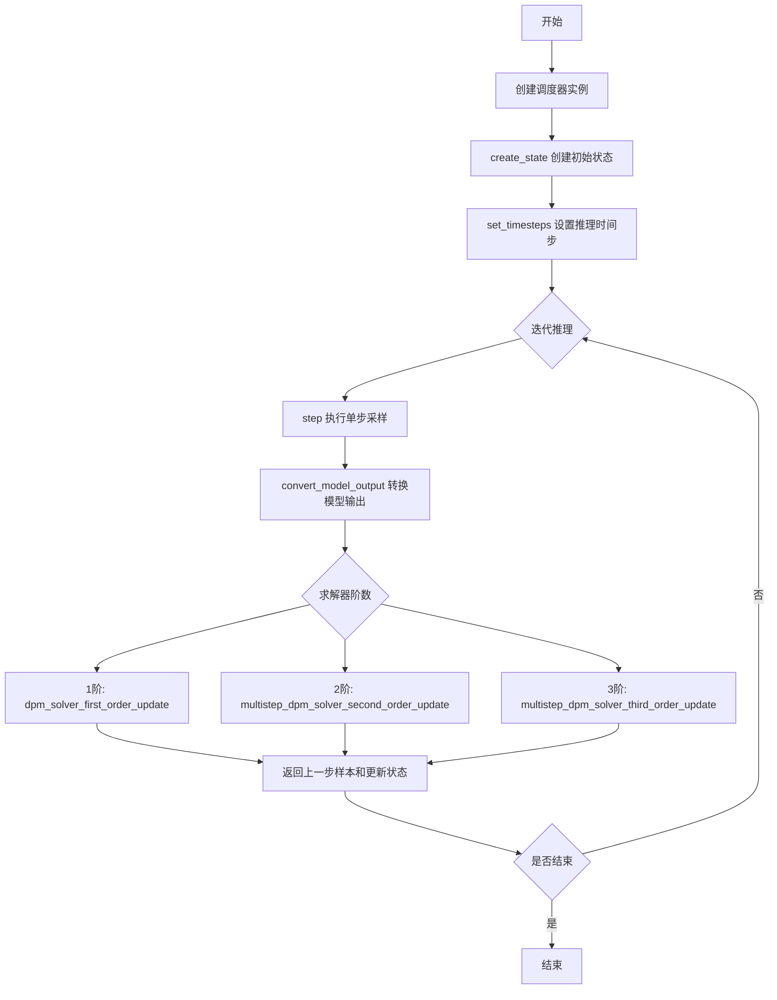
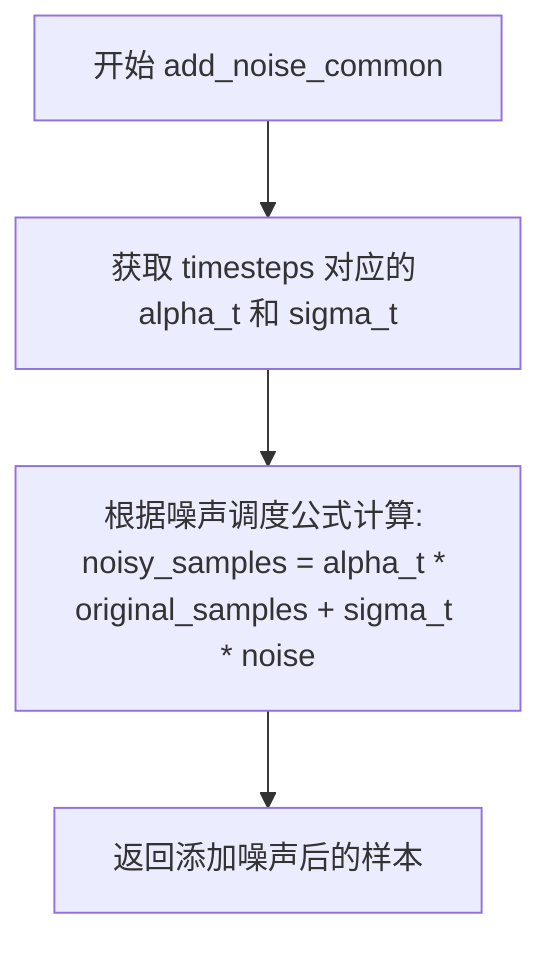
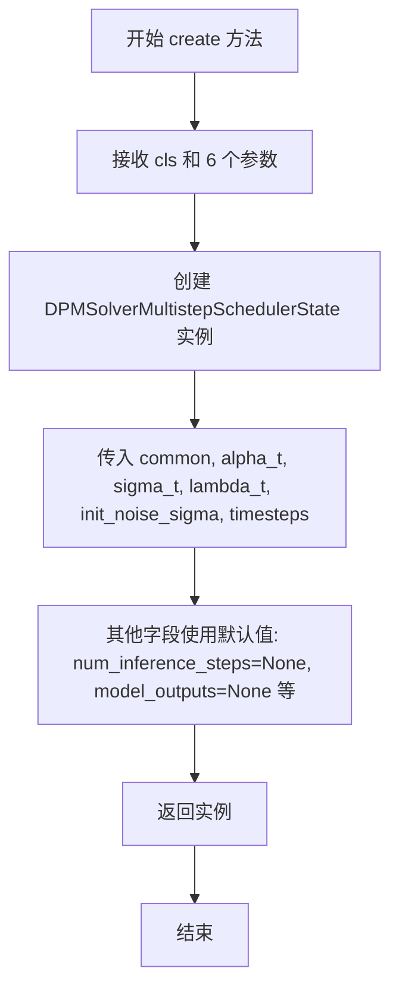
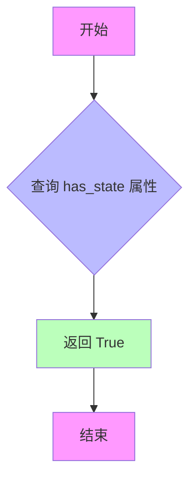
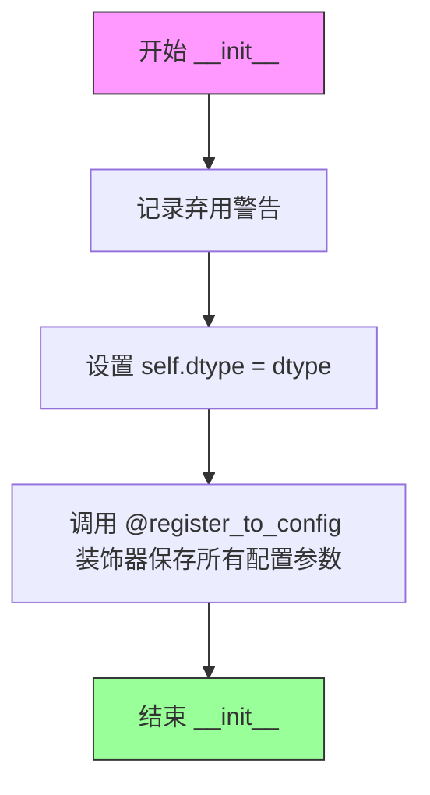
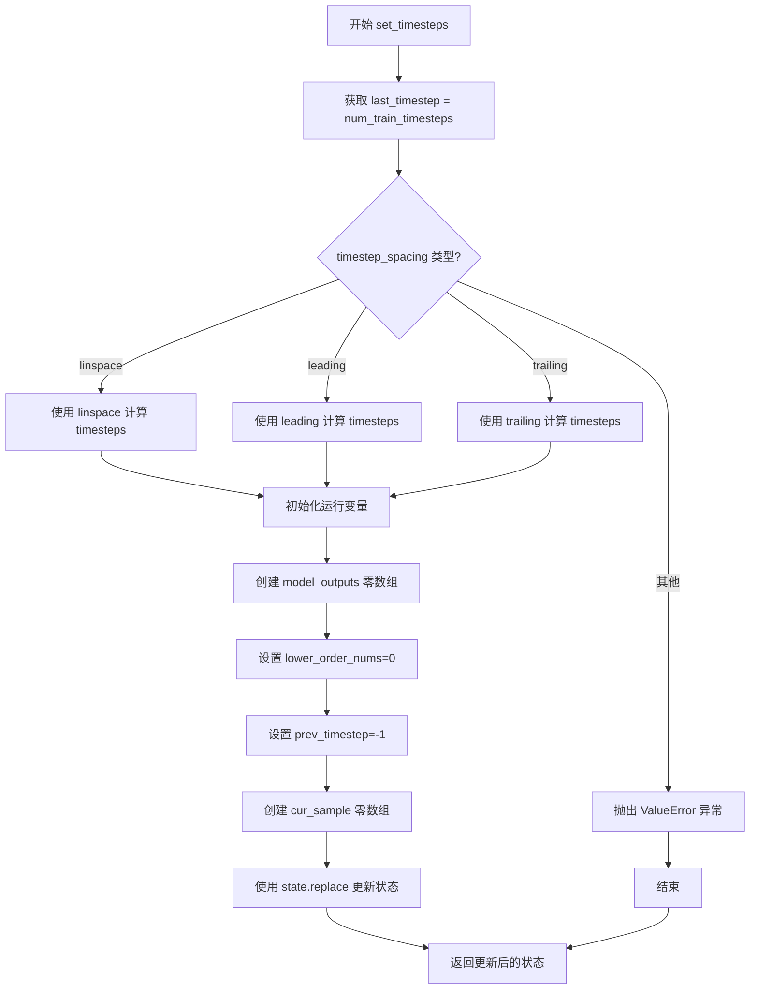
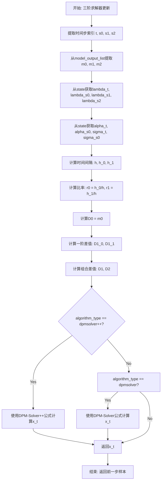
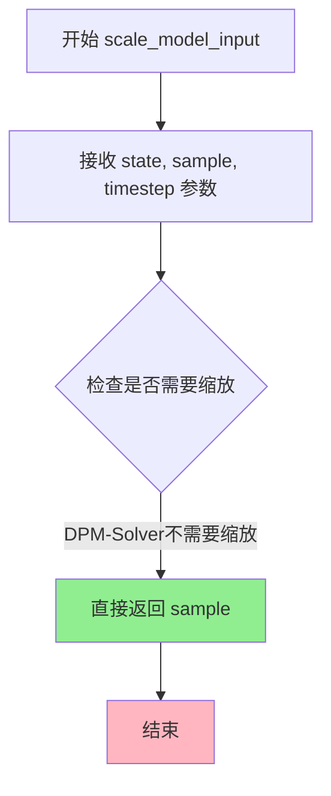

# `diffusers\src\diffusers\schedulers\scheduling_dpmsolver_multistep_flax.py` 详细设计文档

Flax实现的DPM-Solver和DPM-Solver++多步调度器，用于扩散模型的快速高阶求解采样，支持1/2/3阶求解器，可在大约10-20步内生成高质量样本。

## 整体流程



## 类结构

```
Object
├── DPMSolverMultistepSchedulerState (Flax数据类)
├── FlaxDPMSolverMultistepSchedulerOutput (数据类)
└── FlaxDPMSolverMultistepScheduler (主调度器类)
    └── 继承: FlaxSchedulerMixin, ConfigMixin
```

## 全局变量及字段


### `logger`
    
模块日志记录器，用于记录调度器的警告和信息

类型：`logging.Logger`
    


### `DPMSolverMultistepSchedulerState.common`
    
公共调度器状态，包含扩散过程的基本参数

类型：`CommonSchedulerState`
    


### `DPMSolverMultistepSchedulerState.alpha_t`
    
Alpha值序列，表示累积产品Alpha的平方根

类型：`jnp.ndarray`
    


### `DPMSolverMultistepSchedulerState.sigma_t`
    
Sigma值序列，表示噪声标准的平方根

类型：`jnp.ndarray`
    


### `DPMSolverMultistepSchedulerState.lambda_t`
    
Lambda值序列，表示对数Alpha与对数Sigma的差值

类型：`jnp.ndarray`
    


### `DPMSolverMultistepSchedulerState.init_noise_sigma`
    
初始噪声标准差，用于初始化扩散过程

类型：`jnp.ndarray`
    


### `DPMSolverMultistepSchedulerState.timesteps`
    
时间步数组，包含推理时使用的时间步序列

类型：`jnp.ndarray`
    


### `DPMSolverMultistepSchedulerState.num_inference_steps`
    
推理步数，生成样本所需的迭代次数

类型：`int`
    


### `DPMSolverMultistepSchedulerState.model_outputs`
    
模型输出历史，存储最近solver_order个模型预测输出

类型：`jnp.ndarray`
    


### `DPMSolverMultistepSchedulerState.lower_order_nums`
    
低阶计数器，用于跟踪当前使用的求解器阶数

类型：`jnp.int32`
    


### `DPMSolverMultistepSchedulerState.prev_timestep`
    
前一个时间步，记录推理过程中的前一个时间步索引

类型：`jnp.int32`
    


### `DPMSolverMultistepSchedulerState.cur_sample`
    
当前样本，当前迭代中的样本张量

类型：`jnp.ndarray`
    


### `FlaxDPMSolverMultistepSchedulerOutput.prev_sample`
    
上一步样本，返回的推理前一个时间步的样本

类型：`jnp.ndarray`
    


### `FlaxDPMSolverMultistepSchedulerOutput.state`
    
调度器状态，包含更新后的调度器状态对象

类型：`DPMSolverMultistepSchedulerState`
    


### `FlaxDPMSolverMultistepScheduler._compatibles`
    
兼容的调度器列表，列出支持的Karras调度器类型

类型：`list`
    


### `FlaxDPMSolverMultistepScheduler.dtype`
    
数据类型，用于参数和计算的JAX数据类型

类型：`jnp.dtype`
    


### `FlaxDPMSolverMultistepScheduler.config`
    
配置对象，通过register_to_config装饰器注入的调度器配置

类型：`Dataclass`
    
    

## 全局函数及方法


# add_noise_common 函数提取结果

### add_noise_common

通用添加噪声函数，用于在扩散模型的采样或训练过程中向原始样本添加噪声。该函数是调度器的核心组件，负责实现噪声调度逻辑。

参数：

-  `state`：`CommonSchedulerState`，调度器的公共状态对象，包含噪声调度相关的参数（如 alpha、sigma 等）
-  `original_samples`：`jnp.ndarray`，原始样本数据，即需要添加噪声的干净样本
-  `noise`：`jnp.ndarray`，噪声样本，用于添加到原始样本中
-  `timesteps`：`jnp.ndarray`，时间步数组，指定在哪些时间步添加噪声

返回值：`jnp.ndarray`，添加噪声后的样本

#### 流程图



#### 带注释源码

**注意**：该函数的源代码未包含在提供的代码文件中。以下是从调度器的 `add_noise` 方法中对该函数的调用方式推断得出的函数签名和用途：

```python
# 从 FlaxDPMSolverMultistepScheduler.add_noise 方法中的调用
def add_noise(
    self,
    state: DPMSolverMultistepSchedulerState,
    original_samples: jnp.ndarray,
    noise: jnp.ndarray,
    timesteps: jnp.ndarray,
) -> jnp.ndarray:
    """
    添加噪声到原始样本的入口方法
    内部调用 add_noise_common 函数执行实际的噪声添加逻辑
    """
    # 从完整状态中提取公共调度器状态
    # 将参数传递给通用的 add_noise_common 函数
    return add_noise_common(state.common, original_samples, noise, timesteps)
```

```python
# 推断的 add_noise_common 函数签名（源代码未在此文件中）
def add_noise_common(
    state: CommonSchedulerState,      # 公共调度器状态
    original_samples: jnp.ndarray,    # 原始干净样本
    noise: jnp.ndarray,               # 要添加的噪声
    timesteps: jnp.ndarray,           # 时间步
) -> jnp.ndarray:
    """
    通用噪声添加函数。
    根据给定的时间步，使用噪声调度参数（alpha、sigma）将噪声混合到原始样本中。
    
    典型实现逻辑（基于扩散模型标准公式）：
    1. 根据 timesteps 索引获取对应的 alpha_cumprod 和 sigma 值
    2. 计算：noisy_sample = sqrt(alpha_cumprod) * original_sample + sqrt(1 - alpha_cumprod) * noise
    3. 返回添加噪声后的样本
    """
    # 具体实现取决于 CommonSchedulerState 的结构和噪声调度类型
    pass
```

---

### 补充说明

由于 `add_noise_common` 函数的实际源代码位于 `scheduling_utils_flax` 模块中（未在当前代码文件内提供），以上信息是基于：

1. 导入语句 `from .scheduling_utils_flax import add_noise_common`
2. 在 `FlaxDPMSolverMultistepScheduler.add_noise` 方法中的调用方式
3. 扩散模型的标准噪声添加公式

推断得出。如需获取完整的函数实现源码，建议查阅 `scheduling_utils_flax.py` 文件。


### `DPMSolverMultistepSchedulerState.create`

这是一个类方法，用于创建 `DPMSolverMultistepSchedulerState` 类的实例，初始化 DPM-Solver 多步调度器的核心状态参数。该方法接受调度器所需的关键数组和参数，并返回一个包含这些初始化状态的数据类实例。

参数：

- `cls`：类本身（class），调用该类方法时自动传入，表示 `DPMSolverMultistepSchedulerState` 类
- `common`：`CommonSchedulerState`，包含调度器的通用状态信息，如噪声计划（beta 调度）等
- `alpha_t`：`jnp.ndarray`，累积 alpha 值的平方根数组，用于 DPM-Solver 的计算
- `sigma_t`：`jnp.ndarray`，累积 sigma 值（1 - alpha_cumprod）的平方根数组
- `lambda_t`：`jnp.ndarray`，log(alpha_t) - log(sigma_t) 数组，表示 log-snr 值
- `init_noise_sigma`：`jnp.ndarray`，初始噪声的标准差，用于采样起点
- `timesteps`：`jnp.ndarray`，离散的时间步数组，用于扩散链的逐步采样

返回值：`DPMSolverMultistepSchedulerState`，返回新创建的调度器状态实例，包含传入的初始化参数，其他可选字段（如 `num_inference_steps`、`model_outputs`、`lower_order_nums`、`prev_timestep`、`cur_sample`）使用默认值 `None`

#### 流程图



#### 带注释源码

```python
@classmethod
def create(
    cls,  # 类本身，调用时自动传入
    common: CommonSchedulerState,  # 通用调度器状态，包含噪声计划等
    alpha_t: jnp.ndarray,  # 累积 alpha 值的平方根
    sigma_t: jnp.ndarray,  # 累积 sigma 值（1 - alpha_cumprod）的平方根
    lambda_t: jnp.ndarray,  # log-snr 值，log(alpha_t) - log(sigma_t)
    init_noise_sigma: jnp.ndarray,  # 初始噪声标准差
    timesteps: jnp.ndarray,  # 离散时间步数组
):
    """
    类方法：创建 DPMSolverMultistepSchedulerState 实例
    
    该方法用于初始化 DPM-Solver 多步调度器的核心状态。
    使用 @classmethod 装饰器，使其可以通过类名直接调用而不需要先创建实例。
    
    参数:
        cls: DPMSolverMultistepSchedulerState 类本身
        common: 通用调度器状态对象
        alpha_t: alpha 值的平方根数组
        sigma_t: sigma 值的平方根数组  
        lambda_t: log-snr 数组
        init_noise_sigma: 初始噪声标准差
        timesteps: 时间步数组
    
    返回:
        DPMSolverMultistepSchedulerState: 包含所有初始化状态的新实例
    """
    return cls(
        common=common,  # 传入通用状态
        alpha_t=alpha_t,  # 传入 alpha 数组
        sigma_t=sigma_t,  # 传入 sigma 数组
        lambda_t=lambda_t,  # 传入 lambda 数组
        init_noise_sigma=init_noise_sigma,  # 传入初始噪声标准差
        timesteps=timesteps,  # 传入时间步数组
    )
    # 注意：num_inference_steps, model_outputs, lower_order_nums, 
    # prev_timestep, cur_sample 等字段使用默认值 None
```


### `FlaxDPMSolverMultistepScheduler.has_state`

该属性用于返回调度器是否具有状态。在 DPM-Solver 多步调度器中，由于需要维护模型输出历史和中间状态，因此始终返回 `True`。

参数：

- （无参数）

返回值：`bool`，返回调度器是否具有状态。在该实现中始终返回 `True`，表示该调度器需要维护状态。

#### 流程图



#### 带注释源码

```python
@property
def has_state(self):
    """
    属性方法：返回调度器是否具有状态
    
    DPM-Solver 多步调度器需要维护状态，包括：
    - model_outputs: 模型输出历史列表
    - lower_order_nums: 当前使用的低阶求解器阶数
    - prev_timestep: 前一个时间步
    - cur_sample: 当前样本
    
    Returns:
        bool: 始终返回 True，表示该调度器需要维护状态
    """
    return True
```


### `FlaxDPMSolverMultistepScheduler.__init__`

初始化 DPM-Solver（多步求解器）调度器，用于扩散模型的快速高质量采样。该调度器支持 DPM-Solver 和 DPM-Solver++ 算法，可配置求解器阶数、预测类型、动态阈值处理等高级功能。

参数：

- `num_train_timesteps`：`int`，扩散过程用于训练模型的步数，默认为 1000
- `beta_start`：`float`，推理的起始 beta 值，默认为 0.0001
- `beta_end`：`float`，最终的 beta 值，默认为 0.02
- `beta_schedule`：`str`，beta 调度策略，可选 `linear`、`scaled_linear` 或 `squaredcos_cap_v2`，默认为 `linear`
- `trained_betas`：`jnp.ndarray | None`，可选参数，直接传递给构造函数的 beta 数组，用于绕过 `beta_start`、`beta_end` 等参数
- `solver_order`：`int`，DPM-Solver 的阶数，可选 1、2 或 3，默认为 2
- `prediction_type`：`str`，模型预测类型，可选 `epsilon`（噪声预测）、`sample`（数据预测）或 `v_prediction`（v-预测），默认为 `epsilon`
- `thresholding`：`bool`，是否使用动态阈值处理方法（Imagen 引入），默认为 False
- `dynamic_thresholding_ratio`：`float`，动态阈值处理方法的比率，默认为 0.995
- `sample_max_value`：`float`，动态阈值处理的阈值，仅在 `thresholding=True` 和 `algorithm_type="dpmsolver++"` 时有效，默认为 1.0
- `algorithm_type`：`str`，求解器算法类型，可选 `dpmsolver` 或 `dpmsolver++`，默认为 `dpmsolver++`
- `solver_type`：`str`，二阶求解器的求解器类型，可选 `midpoint` 或 `heun`，默认为 `midpoint`
- `lower_order_final`：`bool`，是否在最后步骤使用低阶求解器，仅在少于 15 个推理步骤时有效，默认为 True
- `timestep_spacing`：`str`，时间步的缩放方式，可选 `linspace`、`leading` 或 `trailing`，默认为 `linspace`
- `dtype`：`jnp.dtype`，参数和计算使用的数据类型，默认为 `jnp.float32`

返回值：无（`None`），`__init__` 方法用于初始化实例属性，不返回任何值

#### 流程图



#### 带注释源码

```python
@register_to_config
def __init__(
    self,
    num_train_timesteps: int = 1000,           # 扩散训练的总步数
    beta_start: float = 0.0001,               # beta 调度起始值
    beta_end: float = 0.02,                   # beta 调度结束值
    beta_schedule: str = "linear",            # beta 调度策略
    trained_betas: jnp.ndarray | None = None,# 直接指定的 beta 数组
    solver_order: int = 2,                   # DPM-Solver 阶数 (1/2/3)
    prediction_type: str = "epsilon",        # 模型预测类型
    thresholding: bool = False,              # 是否启用动态阈值处理
    dynamic_thresholding_ratio: float = 0.995, # 动态阈值比率
    sample_max_value: float = 1.0,           # 动态阈值最大值
    algorithm_type: str = "dpmsolver++",     # 算法类型 (dpmsolver/dpmsolver++)
    solver_type: str = "midpoint",           # 求解器类型 (midpoint/heun)
    lower_order_final: bool = True,          # 最终步骤使用低阶求解器
    timestep_spacing: str = "linspace",      # 时间步间隔策略
    dtype: jnp.dtype = jnp.float32,          # JAX 数据类型
):
    """
    初始化 DPM-Solver 多步调度器
    
    该方法配置扩散模型求解器的所有参数。DPM-Solver 是一种快速高阶求解器，
    只需 20 步即可生成高质量样本，10 步也能得到不错的结果。
    
    Args:
        num_train_timesteps: 扩散训练的总步数
        beta_start: beta 曲线的起始值
        beta_end: beta 曲线的结束值
        beta_schedule: beta 调度策略
        trained_betas: 可选的预定义 beta 数组
        solver_order: 求解器阶数，建议引导采样用 2，无条件采样用 3
        prediction_type: 模型预测类型 (epsilon/sample/v_prediction)
        thresholding: 是否使用动态阈值处理 (适用于像素空间扩散模型)
        dynamic_thresholding_ratio: 动态阈值比率
        sample_max_value: 动态阈值最大值
        algorithm_type: 算法类型 (dpmsolver 或 dpmsolver++)
        solver_type: 二阶求解器类型 (midpoint 或 heun)
        lower_order_final: 是否在最后步骤使用低阶求解器
        timestep_spacing: 时间步缩放方式
        dtype: 计算使用的数据类型
    """
    # 记录弃用警告，Flax 类将在 Diffusers v1.0.0 中移除
    logger.warning(
        "Flax classes are deprecated and will be removed in Diffusers v1.0.0. We "
        "recommend migrating to PyTorch classes or pinning your version of Diffusers."
    )
    
    # 设置实例的数据类型属性
    self.dtype = dtype
    
    # @register_to_config 装饰器会自动将所有参数存储到 self.config 中
    # 通过 ConfigMixin 可以通过 scheduler.config.num_train_timesteps 访问这些配置
```


### `FlaxDPMSolverMultistepScheduler.create_state`

该方法用于创建 DPM-Solver 多步调度器的状态对象。它初始化调度器所需的关键参数，包括 alpha_t、sigma_t、lambda_t 时间表、初始噪声标准差以及训练时间步，并返回包含所有必要信息的 `DPMSolverMultistepSchedulerState` 实例。

参数：

- `common`：`CommonSchedulerState | None`，可选的公共调度器状态对象。如果为 `None`，则使用 `CommonSchedulerState.create(self)` 自动创建。

返回值：`DPMSolverMultistepSchedulerState`，返回初始化后的 DPM-Solver 多步调度器状态对象，包含 alpha、sigma、lambda 时间表以及时间步等关键数据。

#### 流程图

```mermaid
flowchart TD
    A[开始 create_state] --> B{common 是否为 None?}
    B -- 是 --> C[调用 CommonSchedulerState.create 创建公共状态]
    B -- 否 --> D[使用传入的 common]
    C --> E[计算 alpha_t = sqrt(alphas_cumprod)]
    D --> E
    E --> F[计算 sigma_t = sqrt(1 - alphas_cumprod)]
    F --> G[计算 lambda_t = log(alpha_t) - log(sigma_t)]
    G --> H{algorithm_type 是否有效?}
    H -- 否 --> I[抛出 NotImplementedError]
    H -- 是 --> J{solver_type 是否有效?}
    J -- 否 --> K[抛出 NotImplementedError]
    J -- 是 --> L[设置 init_noise_sigma = 1.0]
    L --> M[生成 timesteps 数组]
    M --> N[调用 DPMSolverMultistepSchedulerState.create]
    N --> O[返回状态对象]
    I --> P[结束]
    K --> P
```

#### 带注释源码

```python
def create_state(self, common: CommonSchedulerState | None = None) -> DPMSolverMultistepSchedulerState:
    """
    创建并初始化 DPM-Solver 多步调度器的状态对象。
    
    该方法负责初始化扩散调度过程所需的所有关键参数，包括：
    - 噪声调度的时间表 (alpha_t, sigma_t, lambda_t)
    - 初始噪声标准差
    - 训练时间步序列
    """
    
    # 如果未提供公共状态，则从调度器配置创建
    if common is None:
        common = CommonSchedulerState.create(self)

    # =========================================================
    # 目前仅支持 VP (Variance Preserving) 类型的噪声调度
    # 计算 alpha_t: 累积产物 alpha 的平方根
    # =========================================================
    alpha_t = jnp.sqrt(common.alphas_cumprod)
    
    # =========================================================
    # 计算 sigma_t: 1 - 累积产物 alpha 的平方根
    # 代表每个时间步的噪声标准差
    # =========================================================
    sigma_t = jnp.sqrt(1 - common.alphas_cumprod)
    
    # =========================================================
    # 计算 lambda_t: 对数信噪比 (log-SNR)
    # lambda = log(alpha) - log(sigma) = log(alpha/sigma)
    # 这是 DPM-Solver 算法的核心变量
    # =========================================================
    lambda_t = jnp.log(alpha_t) - jnp.log(sigma_t)

    # =========================================================
    # DPM-Solver 设置验证
    # 检查 algorithm_type 是否为支持的类型
    # 目前支持: "dpmsolver" 和 "dpmsolver++"
    # =========================================================
    if self.config.algorithm_type not in ["dpmsolver", "dpmsolver++"]:
        raise NotImplementedError(f"{self.config.algorithm_type} is not implemented for {self.__class__}")
    
    # =========================================================
    # 检查 solver_type 是否为支持的类型
    # 目前支持: "midpoint" (中点法) 和 "heun" (Heun 方法)
    # =========================================================
    if self.config.solver_type not in ["midpoint", "heun"]:
        raise NotImplementedError(f"{self.config.solver_type} is not implemented for {self.__class__}")

    # =========================================================
    # 初始噪声分布的标准差
    # 设置为 1.0，表示标准高斯噪声
    # =========================================================
    init_noise_sigma = jnp.array(1.0, dtype=self.dtype)

    # =========================================================
    # 生成训练时间步序列
    # 从 0 到 num_train_timesteps-1，然后反向
    # 例如: num_train_timesteps=1000 时生成 [999, 998, ..., 0]
    # =========================================================
    timesteps = jnp.arange(0, self.config.num_train_timesteps).round()[::-1]

    # =========================================================
    # 创建并返回 DPM-Solver 调度器状态对象
    # 包含所有初始化后的参数供后续推理使用
    # =========================================================
    return DPMSolverMultistepSchedulerState.create(
        common=common,
        alpha_t=alpha_t,
        sigma_t=sigma_t,
        lambda_t=lambda_t,
        init_noise_sigma=init_noise_sigma,
        timesteps=timesteps,
    )
```


### `FlaxDPMSolverMultistepScheduler.set_timesteps`

该方法用于在推理前设置扩散链的离散时间步，支持三种时间步间隔策略（linspace、leading、trailing），并初始化求解器所需的运行状态。

参数：

- `self`：`FlaxDPMSolverMultistepScheduler`，调度器实例本身
- `state`：`DPMSolverMultistepSchedulerState`，FlaxDPMSolverMultistepScheduler 状态数据类实例
- `num_inference_steps`：`int`，使用预训练模型生成样本时的扩散步数
- `shape`：`tuple`，要生成的样本形状

返回值：`DPMSolverMultistepSchedulerState`，更新后的调度器状态，包含设置的时间步和初始化变量

#### 流程图



#### 带注释源码

```python
def set_timesteps(
    self,
    state: DPMSolverMultistepSchedulerState,
    num_inference_steps: int,
    shape: tuple,
) -> DPMSolverMultistepSchedulerState:
    """
    Sets the discrete timesteps used for the diffusion chain. Supporting function to be run before inference.

    Args:
        state (`DPMSolverMultistepSchedulerState`):
            the `FlaxDPMSolverMultistepScheduler` state data class instance.
        num_inference_steps (`int`):
            the number of diffusion steps used when generating samples with a pre-trained model.
        shape (`tuple`):
            the shape of the samples to be generated.
    """
    # 获取训练时的总时间步数作为最后时间步
    last_timestep = self.config.num_train_timesteps
    
    # 根据 timestep_spacing 配置选择不同的时间步生成策略
    if self.config.timestep_spacing == "linspace":
        # 线性间隔策略：在 [0, last_timestep-1] 范围内均匀分布时间步
        timesteps = (
            jnp.linspace(0, last_timestep - 1, num_inference_steps + 1).round()[::-1][:-1].astype(jnp.int32)
        )
    elif self.config.timestep_spacing == "leading":
        # 前导间隔策略：创建整数时间步，乘以比例因子避免步数为3的幂次时的问题
        step_ratio = last_timestep // (num_inference_steps + 1)
        timesteps = (
            (jnp.arange(0, num_inference_steps + 1) * step_ratio).round()[::-1][:-1].copy().astype(jnp.int32)
        )
        timesteps += self.config.steps_offset
    elif self.config.timestep_spacing == "trailing":
        # 尾随间隔策略：从 last_timestep 开始递减
        step_ratio = self.config.num_train_timesteps / num_inference_steps
        timesteps = jnp.arange(last_timestep, 0, -step_ratio).round().copy().astype(jnp.int32)
        timesteps -= 1
    else:
        # 不支持的间隔策略，抛出异常
        raise ValueError(
            f"{self.config.timestep_spacing} is not supported. Please make sure to choose one of 'linspace', 'leading' or 'trailing'."
        )

    # ==================== 初始化运行变量 ====================
    
    # 初始化模型输出数组，形状为 (solver_order,) + shape，用于存储历史预测
    model_outputs = jnp.zeros((self.config.solver_order,) + shape, dtype=self.dtype)
    
    # 初始化低阶求解器使用计数
    lower_order_nums = jnp.int32(0)
    
    # 初始化前一时间步为 -1（表示无前一步）
    prev_timestep = jnp.int32(-1)
    
    # 初始化当前样本为零数组
    cur_sample = jnp.zeros(shape, dtype=self.dtype)

    # 使用 state.replace 更新状态并返回
    return state.replace(
        num_inference_steps=num_inference_steps,  # 记录推理步数
        timesteps=timesteps,                        # 设置生成的时间步序列
        model_outputs=model_outputs,                # 重置模型输出历史
        lower_order_nums=lower_order_nums,         # 重置低阶计数
        prev_timestep=prev_timestep,                 # 重置前一时间步
        cur_sample=cur_sample,                      # 重置当前样本
    )
```


### `FlaxDPMSolverMultistepScheduler.convert_model_output`

将模型输出转换为相应类型，以匹配 DPM-Solver 或 DPM-Solver++ 算法的需求。DPM-Solver 设计用于离散化噪声预测模型的积分，而 DPM-Solver++ 设计用于离散化数据预测模型的积分。

参数：

- `self`：隐式参数，调度器实例
- `state`：`DPMSolverMultistepSchedulerState`，FlaxDPMSolverMultistepScheduler 状态数据类实例
- `model_output`：`jnp.ndarray`，学习扩散模型的直接输出
- `timestep`：`int`，扩散链中的当前离散时间步
- `sample`：`jnp.ndarray`，扩散过程正在创建的当前样本实例

返回值：`jnp.ndarray`，转换后的模型输出

#### 流程图

```mermaid
flowchart TD
    A[开始 convert_model_output] --> B{algorithm_type == 'dpmsolver++'?}
    B -->|Yes| C{prediction_type == 'epsilon'?}
    B -->|No| M{prediction_type == 'epsilon'?}
    
    C -->|Yes| D[计算 x0_pred = (sample - sigma_t * model_output) / alpha_t]
    C -->|No| E{prediction_type == 'sample'?}
    D --> K
    E -->|Yes| F[x0_pred = model_output]
    E -->|No| G{prediction_type == 'v_prediction'?}
    F --> K
    G -->|Yes| H[计算 x0_pred = alpha_t * sample - sigma_t * model_output]
    H --> K
    
    M -->|Yes| N[返回 model_output]
    M -->|No| O{prediction_type == 'sample'?}
    N --> Z
    O -->|Yes| P[计算 epsilon = (sample - alpha_t * model_output) / sigma_t]
    O -->|No| Q{prediction_type == 'v_prediction'?}
    P --> Z
    Q -->|Yes| R[计算 epsilon = alpha_t * model_output + sigma_t * sample]
    R --> Z
    
    K{thresholding == True?}
    K -->|Yes| L[动态阈值处理: 使用百分位数计算 dynamic_max_val]
    K -->|No| S[返回 x0_pred]
    L --> T[x0_pred = clip(x0_pred, -dynamic_max_val, dynamic_max_val) / dynamic_max_val]
    T --> S
    
    S --> Z[结束]
    Z --> 
    
    L_1[抛出 ValueError: prediction_type 无效]
    E -->|No| L_1
    G -->|No| L_1
    Q -->|No| L_1
```

#### 带注释源码

```python
def convert_model_output(
    self,
    state: DPMSolverMultistepSchedulerState,
    model_output: jnp.ndarray,
    timestep: int,
    sample: jnp.ndarray,
) -> jnp.ndarray:
    """
    Convert the model output to the corresponding type that the algorithm (DPM-Solver / DPM-Solver++) needs.

    DPM-Solver is designed to discretize an integral of the noise prediction model, and DPM-Solver++ is designed to
    discretize an integral of the data prediction model. So we need to first convert the model output to the
    corresponding type to match the algorithm.

    Note that the algorithm type and the model type is decoupled. That is to say, we can use either DPM-Solver or
    DPM-Solver++ for both noise prediction model and data prediction model.

    Args:
        model_output (`jnp.ndarray`): direct output from learned diffusion model.
        timestep (`int`): current discrete timestep in the diffusion chain.
        sample (`jnp.ndarray`):
            current instance of sample being created by diffusion process.

    Returns:
        `jnp.ndarray`: the converted model output.
    """
    # DPM-Solver++ needs to solve an integral of the data prediction model.
    if self.config.algorithm_type == "dpmsolver++":
        # 根据预测类型进行不同的转换
        if self.config.prediction_type == "epsilon":
            # epsilon 预测：反推原始数据 x0
            alpha_t, sigma_t = state.alpha_t[timestep], state.sigma_t[timestep]
            x0_pred = (sample - sigma_t * model_output) / alpha_t
        elif self.config.prediction_type == "sample":
            # sample 预测：直接使用模型输出作为 x0
            x0_pred = model_output
        elif self.config.prediction_type == "v_prediction":
            # v-prediction：转换为 x0
            alpha_t, sigma_t = state.alpha_t[timestep], state.sigma_t[timestep]
            x0_pred = alpha_t * sample - sigma_t * model_output
        else:
            raise ValueError(
                f"prediction_type given as {self.config.prediction_type} must be one of `epsilon`, `sample`, "
                " or `v_prediction` for the FlaxDPMSolverMultistepScheduler."
            )

        # 动态阈值处理（来自 Imagen 论文）
        if self.config.thresholding:
            # Dynamic thresholding in https://huggingface.co/papers/2205.11487
            # 计算动态最大值
            dynamic_max_val = jnp.percentile(
                jnp.abs(x0_pred),
                self.config.dynamic_thresholding_ratio,
                axis=tuple(range(1, x0_pred.ndim)),
            )
            # 确保动态最大值不低于 sample_max_value
            dynamic_max_val = jnp.maximum(
                dynamic_max_val,
                self.config.sample_max_value * jnp.ones_like(dynamic_max_val),
            )
            # 归一化 x0_pred 到 [-1, 1] 范围
            x0_pred = jnp.clip(x0_pred, -dynamic_max_val, dynamic_max_val) / dynamic_max_val
        return x0_pred
    
    # DPM-Solver needs to solve an integral of the noise prediction model.
    elif self.config.algorithm_type == "dpmsolver":
        if self.config.prediction_type == "epsilon":
            # epsilon 预测：直接返回噪声
            return model_output
        elif self.config.prediction_type == "sample":
            # sample 预测：反推噪声 epsilon
            alpha_t, sigma_t = state.alpha_t[timestep], state.sigma_t[timestep]
            epsilon = (sample - alpha_t * model_output) / sigma_t
            return epsilon
        elif self.config.prediction_type == "v_prediction":
            # v-prediction：转换为噪声 epsilon
            alpha_t, sigma_t = state.alpha_t[timestep], state.sigma_t[timestep]
            epsilon = alpha_t * model_output + sigma_t * sample
            return epsilon
        else:
            raise ValueError(
                f"prediction_type given as {self.config.prediction_type} must be one of `epsilon`, `sample`, "
                " or `v_prediction` for the FlaxDPMSolverMultistepScheduler."
            )
```


### `FlaxDPMSolverMultistepScheduler.dpm_solver_first_order_update`

一阶DPM-Solver（等价于DDIM）的一步更新方法，用于根据当前时间步的模型输出计算前一个时间步的样本。该方法实现了DPM-Solver论文中描述的一阶求解器更新公式，支持两种算法类型（dpmsolver和dpmsolver++）。

参数：

- `self`：类的实例，包含调度器配置
- `state`：`DPMSolverMultistepSchedulerState`，DPM-Solver多步调度器的状态数据类实例，包含alpha_t、sigma_t、lambda_t等调度参数
- `model_output`：`jnp.ndarray`，直接从学习到的扩散模型输出的结果（可能是噪声预测、数据预测或v-prediction）
- `timestep`：`int`，扩散链中的当前离散时间步（对应s0）
- `prev_timestep`：`int`，扩散链中的前一个离散时间步（对应t）
- `sample`：`jnp.ndarray`，当前正在由扩散过程创建的样本实例

返回值：`jnp.ndarray`，前一个时间步的样本张量

#### 流程图

```mermaid
flowchart TD
    A[开始: dpm_solver_first_order_update] --> B[提取时间步参数]
    B --> C[从state中获取lambda_t, lambda_s]
    C --> D[从state中获取alpha_t, alpha_s]
    D --> E[从state中获取sigma_t, sigma_s]
    E --> F[计算步长 h = lambda_t - lambda_s]
    F --> G{判断算法类型}
    G -->|dpmsolver++| H[使用dpmsolver++公式]
    G -->|dpmsolver| I[使用dpmsolver公式]
    H --> J[x_t = (sigma_t/sigma_s) * sample - alpha_t * (exp(-h) - 1) * m0]
    I --> K[x_t = (alpha_t/alpha_s) * sample - sigma_t * (exp(h) - 1) * m0]
    J --> L[返回x_t]
    K --> L
```

#### 带注释源码

```python
def dpm_solver_first_order_update(
    self,
    state: DPMSolverMultistepSchedulerState,
    model_output: jnp.ndarray,
    timestep: int,
    prev_timestep: int,
    sample: jnp.ndarray,
) -> jnp.ndarray:
    """
    One step for the first-order DPM-Solver (equivalent to DDIM).

    See https://huggingface.co/papers/2206.00927 for the detailed derivation.

    Args:
        model_output (`jnp.ndarray`): direct output from learned diffusion model.
        timestep (`int`): current discrete timestep in the diffusion chain.
        prev_timestep (`int`): previous discrete timestep in the diffusion chain.
        sample (`jnp.ndarray`):
            current instance of sample being created by diffusion process.

    Returns:
        `jnp.ndarray`: the sample tensor at the previous timestep.
    """
    # t是前一个时间步，s0是当前时间步
    t, s0 = prev_timestep, timestep
    # m0是模型输出（已经过convert_model_output转换）
    m0 = model_output
    
    # 从调度器状态中获取log-snr (lambda) 值
    # lambda = log(alpha) - log(sigma)
    lambda_t, lambda_s = state.lambda_t[t], state.lambda_t[s0]
    
    # 获取缩放因子 alpha 和 sigma
    alpha_t, alpha_s = state.alpha_t[t], state.alpha_t[s0]
    sigma_t, sigma_s = state.sigma_t[t], state.sigma_t[s0]
    
    # 计算时间步之间的对数信噪比差值（步长）
    h = lambda_t - lambda_s
    
    # 根据算法类型应用不同的更新公式
    # DPM-Solver++ 使用数据预测公式
    if self.config.algorithm_type == "dpmsolver++":
        # dpmsolver++公式：从当前样本x_s0预测前一个样本x_t
        # 基于指数衰减的对数信噪比差
        x_t = (sigma_t / sigma_s) * sample - (alpha_t * (jnp.exp(-h) - 1.0)) * m0
    # DPM-Solver 使用噪声预测公式
    elif self.config.algorithm_type == "dpmsolver":
        # dpmsolver公式：从当前样本x_s0预测前一个样本x_t
        # 基于指数增长的对数信噪比差
        x_t = (alpha_t / alpha_s) * sample - (sigma_t * (jnp.exp(h) - 1.0)) * m0
    
    # 返回前一个时间步的样本
    return x_t
```


### `FlaxDPMSolverMultistepScheduler.multistep_dpm_solver_second_order_update`

执行二阶多步DPM-Solver的单步更新，根据当前和历史的模型输出及时间步信息，结合DPM-Solver++或DPM-Solver算法，计算扩散过程在上一时间步的样本。

参数：

- `self`：`FlaxDPMSolverMultistepScheduler`实例，调度器对象本身
- `state`：`DPMSolverMultistepSchedulerState`，DPM-Solver多步调度器的状态数据类实例，包含alpha_t、sigma_t、lambda_t等预计算值
- `model_output_list`：`jnp.ndarray`，当前及之前时间步学习到的扩散模型的直接输出列表（通常为预测噪声或数据）
- `timestep_list`：`list[int]`（实际为`jnp.ndarray`），当前及之前离散时间步列表，用于多步求解
- `prev_timestep`：`int`，扩散链中的前一个离散时间步
- `sample`：`jnp.ndarray`，扩散过程中当前正在创建的样本实例

返回值：`jnp.ndarray`，前一个时间步的样本张量

#### 流程图

```mermaid
flowchart TD
    A[开始: multistep_dpm_solver_second_order_update] --> B[提取时间步和模型输出]
    B --> B1[t = prev_timestep, s0 = timestep_list[-1], s1 = timestep_list[-2]]
    B --> B2[m0 = model_output_list[-1], m1 = model_output_list[-2]]
    
    B --> C[获取调度器状态参数]
    C --> C1[lambda_t, lambda_s0, lambda_s1]
    C --> C2[alpha_t, alpha_s0]
    C --> C3[sigma_t, sigma_s0]
    
    C --> D[计算步长和导数]
    D --> D1[h = lambda_t - lambda_s0]
    D --> D2[h_0 = lambda_s0 - lambda_s1]
    D --> D3[r0 = h_0 / h]
    D --> D4[D0 = m0]
    D --> D5[D1 = (1.0 / r0) * (m0 - m1)]
    
    D --> E{algorithm_type?}
    
    E -->|dpmsolver++| F[数据预测模型积分]
    E -->|dpmsolver| G[噪声预测模型积分]
    
    F --> F1{solver_type?}
    G --> G1{solver_type?}
    
    F1 -->|midpoint| F2[应用DPM-Solver++中点公式]
    F1 -->|heun| F3[应用DPM-Solver++ Heun公式]
    G1 -->|midpoint| G2[应用DPM-Solver中点公式]
    G1 -->|heun| G3[应用DPM-Solver Heun公式]
    
    F2 --> H[计算x_t]
    F3 --> H
    G2 --> H
    G3 --> H
    
    H --> I[返回x_t: 前一时间步的样本]
```

#### 带注释源码

```python
def multistep_dpm_solver_second_order_update(
    self,
    state: DPMSolverMultistepSchedulerState,
    model_output_list: jnp.ndarray,
    timestep_list: list[int],
    prev_timestep: int,
    sample: jnp.ndarray,
) -> jnp.ndarray:
    """
    One step for the second-order multistep DPM-Solver.

    Args:
        model_output_list (`list[jnp.ndarray]`):
            direct outputs from learned diffusion model at current and latter timesteps.
        timestep (`int`): current and latter discrete timestep in the diffusion chain.
        prev_timestep (`int`): previous discrete timestep in the diffusion chain.
        sample (`jnp.ndarray`):
            current instance of sample being created by diffusion process.

    Returns:
        `jnp.ndarray`: the sample tensor at the previous timestep.
    """
    # ========== 步骤1: 提取时间步索引 ==========
    # t: 当前目标时间步（prev_timestep，即要求解的"之前"的时间步）
    # s0: 最近的历史时间步
    # s1: 次近的历史时间步
    t, s0, s1 = prev_timestep, timestep_list[-1], timestep_list[-2]
    
    # ========== 步骤2: 提取模型输出 ==========
    # m0: 最近时间步的模型输出（预测的噪声或数据）
    # m1: 次近时间步的模型输出
    m0, m1 = model_output_list[-1], model_output_list[-2]
    
    # ========== 步骤3: 获取调度器预计算的状态参数 ==========
    # lambda_t, lambda_s0, lambda_s1: 对数信噪比（log-SNR）
    # alpha_t, alpha_s0: 缩放因子
    # sigma_t, sigma_s0: 噪声标准差
    lambda_t, lambda_s0, lambda_s1 = (
        state.lambda_t[t],
        state.lambda_t[s0],
        state.lambda_t[s1],
    )
    alpha_t, alpha_s0 = state.alpha_t[t], state.alpha_t[s0]
    sigma_t, sigma_s0 = state.sigma_t[t], state.sigma_t[s0]
    
    # ========== 步骤4: 计算步长和导数近似 ==========
    # h: 当前步的log-SNR差值
    # h_0: 前一步的log-SNR差值
    # r0: 步长比值，用于龙格-库塔风格的外推
    h, h_0 = lambda_t - lambda_s0, lambda_s0 - lambda_s1
    r0 = h_0 / h
    
    # D0: 零阶导数（当前模型输出）
    # D1: 一阶导数近似（使用线性外推估计）
    D0, D1 = m0, (1.0 / r0) * (m0 - m1)
    
    # ========== 步骤5: 根据算法类型和求解器类型计算更新 ==========
    # DPM-Solver++: 求解数据预测模型的积分（用于++版本）
    # DPM-Solver: 求解噪声预测模型的积分（用于原始版本）
    if self.config.algorithm_type == "dpmsolver++":
        # See https://huggingface.co/papers/2211.01095 for detailed derivations
        
        # 中点法（midpoint）：使用一阶导数的简单平均
        if self.config.solver_type == "midpoint":
            x_t = (
                (sigma_t / sigma_s0) * sample           # 样本的缩放项
                - (alpha_t * (jnp.exp(-h) - 1.0)) * D0  # 主要更新项（D0）
                - 0.5 * (alpha_t * (jnp.exp(-h) - 1.0)) * D1  # 校正项（D1的一半）
            )
        # Heun法：使用更精确的导数估计
        elif self.config.solver_type == "heun":
            x_t = (
                (sigma_t / sigma_s0) * sample
                - (alpha_t * (jnp.exp(-h) - 1.0)) * D0
                + (alpha_t * ((jnp.exp(-h) - 1.0) / h + 1.0)) * D1  # 使用加权导数
            )
    
    # DPM-Solver（原始版本）
    elif self.config.algorithm_type == "dpmsolver":
        # See https://huggingface.co/papers/2206.00927 for detailed derivations
        
        if self.config.solver_type == "midpoint":
            x_t = (
                (alpha_t / alpha_s0) * sample           # 样本的缩放项
                - (sigma_t * (jnp.exp(h) - 1.0)) * D0    # 主要更新项
                - 0.5 * (sigma_t * (jnp.exp(h) - 1.0)) * D1  # 校正项
            )
        elif self.config.solver_type == "heun":
            x_t = (
                (alpha_t / alpha_s0) * sample
                - (sigma_t * (jnp.exp(h) - 1.0)) * D0
                - (sigma_t * ((jnp.exp(h) - 1.0) / h - 1.0)) * D1  # Heun校正项
            )
    
    # ========== 步骤6: 返回前一个时间步的样本 ==========
    return x_t
```


### `FlaxDPMSolverMultistepScheduler.multistep_dpm_solver_third_order_update`

执行三阶多步DPM-Solver的单步更新，基于当前及前两个时间步的模型输出来计算前一个时间步的样本。该方法实现了DPM-Solver++和DPM-Solver两种算法的三阶求解公式，通过线性外推和指数加权组合三个模型输出以获得更高精度的采样结果。

参数：

- `self`：隐式参数，FlaxDPMSolverMultistepScheduler调度器实例
- `state`：`DPMSolverMultistepSchedulerState`，DPM-Solver多步调度器的状态数据类实例，包含alpha_t、sigma_t、lambda_t等调度参数
- `model_output_list`：`jnp.ndarray`，从学习扩散模型在当前及前两个时间步的直接输出列表，形状为(solver_order, ...)的滚动缓冲区
- `timestep_list`：`list[int]`，包含当前及前两个离散时间步的列表，用于计算时间步间隔
- `prev_timestep`：`int`，扩散链中当前时间步的前一个离散时间步
- `sample`：`jnp.ndarray`，扩散过程正在创建的当前样本实例

返回值：`jnp.ndarray`，前一个时间步的样本张量

#### 流程图



#### 带注释源码

```python
def multistep_dpm_solver_third_order_update(
    self,
    state: DPMSolverMultistepSchedulerState,
    model_output_list: jnp.ndarray,
    timestep_list: list[int],
    prev_timestep: int,
    sample: jnp.ndarray,
) -> jnp.ndarray:
    """
    One step for the third-order multistep DPM-Solver.

    Args:
        model_output_list (`list[jnp.ndarray]`):
            direct outputs from learned diffusion model at current and latter timesteps.
        timestep (`int`): current and latter discrete timestep in the diffusion chain.
        prev_timestep (`int`): previous discrete timestep in the diffusion chain.
        sample (`jnp.ndarray`):
            current instance of sample being created by diffusion process.

    Returns:
        `jnp.ndarray`: the sample tensor at the previous timestep.
    """
    # ========== 步骤1: 提取时间步索引 ==========
    # t: 当前目标时间步（前一个时间步）
    # s0, s1, s2: 用于三阶近似的三个历史时间步（从最新到最旧）
    t, s0, s1, s2 = (
        prev_timestep,
        timestep_list[-1],
        timestep_list[-2],
        timestep_list[-3],
    )
    
    # ========== 步骤2: 提取模型输出 ==========
    # m0: 当前时间步的模型输出（最新）
    # m1: 前一个时间步的模型输出
    # m2: 前两个时间步的模型输出（最旧）
    m0, m1, m2 = model_output_list[-1], model_output_list[-2], model_output_list[-3]
    
    # ========== 步骤3: 提取log-snr (lambda) 值 ==========
    # lambda_t: 目标时间步的log-snr
    # lambda_s0, lambda_s1, lambda_s2: 三个历史时间步的log-snr
    lambda_t, lambda_s0, lambda_s1, lambda_s2 = (
        state.lambda_t[t],
        state.lambda_t[s0],
        state.lambda_t[s1],
        state.lambda_t[s2],
    )
    
    # ========== 步骤4: 提取缩放因子 ==========
    # alpha_t/s0: 信号缩放因子, sigma_t/s0: 噪声缩放因子
    alpha_t, alpha_s0 = state.alpha_t[t], state.alpha_t[s0]
    sigma_t, sigma_s0 = state.sigma_t[t], state.sigma_t[s0]
    
    # ========== 步骤5: 计算时间步间隔 ==========
    # h: 总间隔 (t - s0)
    # h_0: 第一个子间隔 (s0 - s1)
    # h_1: 第二个子间隔 (s1 - s2)
    h, h_0, h_1 = lambda_t - lambda_s0, lambda_s0 - lambda_s1, lambda_s1 - lambda_s2
    
    # ========== 步骤6: 计算比率因子 ==========
    # r0, r1: 用于线性外推的权重比率
    r0, r1 = h_0 / h, h_1 / h
    
    # ========== 步骤7: 计算导数近似 ==========
    # D0: 零阶导数（当前模型输出）
    D0 = m0
    
    # D1_0, D1_1: 一阶导数的两种近似（通过差分）
    # D1: 组合一阶导数（带权重）
    # D2: 二阶导数近似
    D1_0, D1_1 = (1.0 / r0) * (m0 - m1), (1.0 / r1) * (m1 - m2)
    D1 = D1_0 + (r0 / (r0 + r1)) * (D1_0 - D1_1)
    D2 = (1.0 / (r0 + r1)) * (D1_0 - D1_1)
    
    # ========== 步骤8: 根据算法类型计算更新 ==========
    if self.config.algorithm_type == "dpmsolver++":
        # DPM-Solver++ 使用数据预测模型
        # See https://huggingface.co/papers/2211.01095 for detailed derivations
        # 公式: x_t = (σ_t/σ_s0)*x_s0 - α_t*(exp(-h)-1)*D0 + α_t*((exp(-h)-1)/h+1)*D1 - α_t*((exp(-h)-1+h)/h²-0.5)*D2
        x_t = (
            (sigma_t / sigma_s0) * sample
            - (alpha_t * (jnp.exp(-h) - 1.0)) * D0
            + (alpha_t * ((jnp.exp(-h) - 1.0) / h + 1.0)) * D1
            - (alpha_t * ((jnp.exp(-h) - 1.0 + h) / h**2 - 0.5)) * D2
        )
    elif self.config.algorithm_type == "dpmsolver":
        # DPM-Solver 使用噪声预测模型
        # See https://huggingface.co/papers/2206.00927 for detailed derivations
        # 公式: x_t = (α_t/α_s0)*x_s0 - σ_t*(exp(h)-1)*D0 - σ_t*((exp(h)-1)/h-1)*D1 - σ_t*((exp(h)-1-h)/h²-0.5)*D2
        x_t = (
            (alpha_t / alpha_s0) * sample
            - (sigma_t * (jnp.exp(h) - 1.0)) * D0
            - (sigma_t * ((jnp.exp(h) - 1.0) / h - 1.0)) * D1
            - (sigma_t * ((jnp.exp(h) - 1.0 - h) / h**2 - 0.5)) * D2
        )
    
    return x_t
```


### FlaxDPMSolverMultistepScheduler.step

该函数是 DPM-Solver 调度器的核心推理步骤函数，通过当前模型输出（通常为预测噪声）预测前一时间步的样本，实现扩散过程的反向传播。支持一阶、二阶和三阶 DPM-Solver 算法，并根据配置动态选择低阶或高阶求解器。

参数：

- `state`：`DPMSolverMultistepSchedulerState`，DPM-Solver 多步调度器的状态数据类实例，包含模型输出列表、时间步等运行状态。
- `model_output`：`jnp.ndarray`，学习到的扩散模型的直接输出（噪声预测值或数据预测值）。
- `timestep`：`int`，扩散链中的当前离散时间步。
- `sample`：`jnp.ndarray`，扩散过程当前正在生成的样本实例。
- `return_dict`：`bool`，默认为 `True`，控制返回方式是 `FlaxDPMSolverMultistepSchedulerOutput` 类还是元组。

返回值：`FlaxDPMSolverMultistepSchedulerOutput | tuple`，当 `return_dict` 为 `True` 时返回 `FlaxDPMSolverMultistepSchedulerOutput` 对象，包含前一时间步的样本和更新后的调度器状态；否则返回元组 `(prev_sample, state)`。

#### 流程图

```mermaid
flowchart TD
    A[step 函数开始] --> B{state.num_inference_steps is None?}
    B -->|是| C[抛出 ValueError: 需要先运行 set_timesteps]
    B -->|否| D[查找当前时间步索引 step_index]
    D --> E[计算前一时间步 prev_timestep]
    E --> F[convert_model_output: 转换模型输出]
    F --> G[更新 model_outputs 队列]
    G --> H[更新 state: model_outputs, prev_timestep, cur_sample]
    H --> I[执行 step_1: 一阶求解器更新]
    I --> J{配置 solver_order == 1?}
    J -->|是| K[使用 step_1_output 作为 prev_sample]
    J -->|否| L[执行 step_2 和 step_3: 二阶/三阶更新]
    L --> M{是否满足低阶最终步骤条件?}
    M -->|是| N[根据 lower_order_nums 选择低阶或高阶]
    M -->|否| O[根据 lower_order_nums 选择一阶或高阶]
    N --> K
    O --> K
    K --> P[更新 lower_order_nums 计数器]
    P --> Q{return_dict?}
    Q -->|是| R[返回 FlaxDPMSolverMultistepSchedulerOutput]
    Q -->|否| S[返回 tuple: (prev_sample, state)]
    R --> T[结束]
    S --> T
```

#### 带注释源码

```python
def step(
    self,
    state: DPMSolverMultistepSchedulerState,
    model_output: jnp.ndarray,
    timestep: int,
    sample: jnp.ndarray,
    return_dict: bool = True,
) -> FlaxDPMSolverMultistepSchedulerOutput | tuple:
    """
    通过 DPM-Solver 预测前一时间步的样本。核心函数，用于根据学习到的模型输出（通常是预测噪声）
    推进扩散过程。

    Args:
        state (DPMSolverMultistepSchedulerState): FlaxDPMSolverMultistepScheduler 状态数据类实例。
        model_output (jnp.ndarray): 学习到的扩散模型的直接输出。
        timestep (int): 扩散链中的当前离散时间步。
        sample (jnp.ndarray): 扩散过程中创建的当前样本实例。
        return_dict (bool): 是否返回 FlaxDPMSolverMultistepSchedulerOutput 类而不是元组。

    Returns:
        FlaxDPMSolverMultistepSchedulerOutput 或 tuple: 当 return_dict 为 True 时返回
        FlaxDPMSolverMultistepSchedulerOutput，否则返回元组。返回元组时第一个元素是样本张量。
    """
    # 检查是否已设置推理步数
    if state.num_inference_steps is None:
        raise ValueError(
            "Number of inference steps is 'None', you need to run 'set_timesteps' after creating the scheduler"
        )

    # 查找当前时间步在 timesteps 数组中的索引
    (step_index,) = jnp.where(state.timesteps == timestep, size=1)
    step_index = step_index[0]

    # 计算前一时间步：如果是最后一步，则设为0；否则取下一个时间步
    prev_timestep = jax.lax.select(
        step_index == len(state.timesteps) - 1, 
        0, 
        state.timesteps[step_index + 1]
    )

    # 将模型输出转换为算法需要的格式（噪声预测或数据预测）
    model_output = self.convert_model_output(state, model_output, timestep, sample)

    # 将新的模型输出添加到队列（滚动数组），丢弃最旧的输出
    model_outputs_new = jnp.roll(state.model_outputs, -1, axis=0)
    model_outputs_new = model_outputs_new.at[-1].set(model_output)
    
    # 更新调度器状态
    state = state.replace(
        model_outputs=model_outputs_new,
        prev_timestep=prev_timestep,
        cur_sample=sample,
    )

    # 定义一阶求解器更新函数（等价于 DDIM）
    def step_1(state: DPMSolverMultistepSchedulerState) -> jnp.ndarray:
        return self.dpm_solver_first_order_update(
            state,
            state.model_outputs[-1],          # 最新的模型输出
            state.timesteps[step_index],      # 当前时间步
            state.prev_timestep,               # 前一时间步
            state.cur_sample,                  # 当前样本
        )

    # 定义二阶和三阶求解器更新函数
    def step_23(state: DPMSolverMultistepSchedulerState) -> jnp.ndarray:
        # 二阶求解器更新
        def step_2(state: DPMSolverMultistepSchedulerState) -> jnp.ndarray:
            timestep_list = jnp.array([
                state.timesteps[step_index - 1], 
                state.timesteps[step_index]
            ])
            return self.multistep_dpm_solver_second_order_update(
                state,
                state.model_outputs,
                timestep_list,
                state.prev_timestep,
                state.cur_sample,
            )

        # 三阶求解器更新
        def step_3(state: DPMSolverMultistepSchedulerState) -> jnp.ndarray:
            timestep_list = jnp.array([
                state.timesteps[step_index - 2],
                state.timesteps[step_index - 1],
                state.timesteps[step_index],
            ])
            return self.multistep_dpm_solver_third_order_update(
                state,
                state.model_outputs,
                timestep_list,
                state.prev_timestep,
                state.cur_sample,
            )

        step_2_output = step_2(state)
        step_3_output = step_3(state)

        # 根据配置选择二阶或三阶求解器
        if self.config.solver_order == 2:
            return step_2_output
        # 对于少于15步的推理，使用低阶最终步骤优化
        elif self.config.lower_order_final and len(state.timesteps) < 15:
            return jax.lax.select(
                state.lower_order_nums < 2,               # 如果低于二阶，使用二阶
                step_2_output,
                jax.lax.select(
                    step_index == len(state.timesteps) - 2, # 倒数第二步使用二阶
                    step_2_output,
                    step_3_output,                          # 否则使用三阶
                ),
            )
        else:
            return jax.lax.select(
                state.lower_order_nums < 2,
                step_2_output,
                step_3_output,
            )

    # 执行一阶求解器更新
    step_1_output = step_1(state)
    # 执行二阶/三阶求解器更新
    step_23_output = step_23(state)

    # 根据配置和当前状态选择最终的求解器阶数
    if self.config.solver_order == 1:
        prev_sample = step_1_output
    # 对于少量推理步骤（<15），使用低阶最终步骤策略
    elif self.config.lower_order_final and len(state.timesteps) < 15:
        prev_sample = jax.lax.select(
            state.lower_order_nums < 1,                     # 首次迭代使用一阶
            step_1_output,
            jax.lax.select(
                step_index == len(state.timesteps) - 1,    # 最后一步使用一阶
                step_1_output,
                step_23_output,                             # 其他步骤使用高阶
            ),
        )
    else:
        prev_sample = jax.lax.select(
            state.lower_order_nums < 1,
            step_1_output,
            step_23_output,
        )

    # 更新低阶计数器，记录已使用低阶求解器的次数
    state = state.replace(
        lower_order_nums=jnp.minimum(state.lower_order_nums + 1, self.config.solver_order),
    )

    # 根据 return_dict 参数返回结果
    if not return_dict:
        return (prev_sample, state)

    return FlaxDPMSolverMultistepSchedulerOutput(prev_sample=prev_sample, state=state)
```


### `FlaxDPMSolverMultistepScheduler.scale_model_input`

该方法是DPM-Solver调度器的缩放模型输入接口，旨在为需要根据当前时间步缩放去噪模型输入的调度器提供互换性。在DPM-Solver的实现中，该方法直接返回原始样本，因为DPM-Solver算法本身不需要对输入进行缩放。

参数：

- `self`：`FlaxDPMSolverMultistepScheduler`实例，调度器本身
- `state`：`DPMSolverMultistepSchedulerState`，FlaxDPMSolverMultistepScheduler的状态数据类实例
- `sample`：`jnp.ndarray`，输入样本
- `timestep`：`int | None`，可选的当前时间步

返回值：`jnp.ndarray`，缩放后的输入样本（在本实现中直接返回原始样本）

#### 流程图



#### 带注释源码

```python
def scale_model_input(
    self,
    state: DPMSolverMultistepSchedulerState,
    sample: jnp.ndarray,
    timestep: int | None = None,
) -> jnp.ndarray:
    """
    Ensures interchangeability with schedulers that need to scale the denoising model input depending on the
    current timestep.

    Args:
        state (`DPMSolverMultistepSchedulerState`):
            the `FlaxDPMSolverMultistepScheduler` state data class instance.
        sample (`jnp.ndarray`): input sample
        timestep (`int`, optional): current timestep

    Returns:
        `jnp.ndarray`: scaled input sample
    """
    # DPM-Solver算法不需要对输入进行缩放，直接返回原始样本
    # 这是DPM-Solver与其他调度器（如DDIM）的一个重要区别
    return sample
```


### `FlaxDPMSolverMultistepScheduler.add_noise`

该方法用于在扩散模型的训练或推理过程中向原始样本添加噪声。它接收原始样本、噪声和时间步，然后调用通用的 `add_noise_common` 函数来执行实际的噪声添加操作。这是扩散模型采样流程中的关键步骤，用于在不同时间步生成带噪声的样本。

参数：

- `self`：隐式参数，指向 `FlaxDPMSolverMultistepScheduler` 类的实例
- `state`：`DPMSolverMultistepSchedulerState` 类型，调度器的状态对象，包含调度器的配置和运行状态信息
- `original_samples`：`jnp.ndarray` 类型，要添加噪声的原始样本数据
- `noise`：`jnp.ndarray` 类型，要添加到原始样本的噪声数据
- `timesteps`：`jnp.ndarray` 类型，用于确定噪声添加强度的时间步数组

返回值：`jnp.ndarray`，添加噪声后的样本张量

#### 流程图

```mermaid
graph TD
    A[开始 add_noise] --> B[接收参数: state, original_samples, noise, timesteps]
    B --> C[从 state 中提取 common 状态]
    C --> D[调用 add_noise_common 函数]
    D --> E[传入参数: state.common, original_samples, noise, timesteps]
    E --> F[在 add_noise_common 中计算: noisy_samples = sqrt(alpha_cumprod) * original_samples + sqrt(1 - alpha_cumprod) * noise]
    F --> G[返回添加噪声后的样本 noisy_samples]
    G --> H[结束 add_noise 并返回结果]
```

#### 带注释源码

```python
def add_noise(
    self,
    state: DPMSolverMultistepSchedulerState,
    original_samples: jnp.ndarray,
    noise: jnp.ndarray,
    timesteps: jnp.ndarray,
) -> jnp.ndarray:
    """
    向原始样本添加噪声，用于扩散模型的训练或推理过程。
    
    Args:
        state: 调度器的状态对象，包含调度器的通用状态信息
        original_samples: 要添加噪声的原始样本张量
        noise: 要添加的噪声张量
        timesteps: 时间步数组，用于确定每个样本的噪声强度
    
    Returns:
        添加噪声后的样本张量
    """
    # 调用通用的噪声添加函数，传入调度器的通用状态和必要参数
    # add_noise_common 函数会根据 timesteps 从 common.alphas_cumprod 中
    # 获取对应的累积 alpha 值，然后按照扩散过程的噪声公式进行计算：
    # noisy_sample = sqrt(alpha_cumprod) * original_sample + sqrt(1 - alpha_cumprod) * noise
    return add_noise_common(state.common, original_samples, noise, timesteps)
```


### `FlaxDPMSolverMultistepScheduler.__len__`

该方法是 Python 的特殊方法（dunder method），用于实现类的长度（元素数量）功能。当对调度器实例使用 `len()` 函数时，会返回配置中定义的训练时间步总数，从而允许外部代码方便地查询调度器所支持的训练步数。

参数：

- `self`：`FlaxDPMSolverMultistepScheduler` 实例，隐式参数，无需显式传入

返回值：`int`，返回调度器配置中定义的训练时间步数（`num_train_timesteps`），表示扩散模型训练过程中所使用的时间步总数。

#### 流程图

```mermaid
flowchart TD
    A[开始] --> B[外部调用 len(scheduler 实例)]
    B --> C[执行 __len__ 方法]
    C --> D[读取 self.config.num_train_timesteps]
    D --> E[返回整数类型的训练时间步数]
    E --> F[结束]
```

#### 带注释源码

```
def __len__(self):
    """
    返回调度器的训练时间步数。
    
    该方法是 Python 特殊方法 __len__ 的实现，使得可以通过内置 len() 函数
    获取调度器对象的长度。在扩散模型调度器中，长度即代表训练时使用的时间步
    总数（例如 1000 步），这反映了模型在训练过程中采用的离散化时间步范围。
    
    Returns:
        int: 训练时间步的数量，对应于调度器配置中的 num_train_timesteps 属性。
             默认值为 1000，表示典型的 DDPM 训练配置。
    """
    return self.config.num_train_timesteps
```

## 关键组件


### 张量索引 (Tensor Indexing)

在 `convert_model_output`、`dpm_solver_first_order_update`、`multistep_dpm_solver_second_order_update` 和 `multistep_dpm_solver_third_order_update` 方法中，通过 `state.alpha_t[timestep]`、`state.sigma_t[timestep]`、`state.lambda_t[timestep]` 等方式从预计算的数组中按时间步索引获取对应的标量值，实现高效的张量查找而无需重新计算。

### 惰性加载 (Lazy Loading via Flax Struct)

使用 `@flax.struct.dataclass` 装饰 `DPMSolverMultistepSchedulerState` 类，使得状态对象不可变且支持惰性复制（copy-on-write），在调度器状态更新时仅复制修改的字段，优化内存使用。

### 反量化支持 (Dequantization Support)

`convert_model_output` 方法支持三种预测类型的转换：`epsilon`（噪声预测）、`sample`（数据预测）、`v_prediction`（v-prediction），通过数学公式将模型输出转换为算法所需的格式，实现不同量化策略的反量化。

### 量化策略 (Quantization Strategy)

`algorithm_type` 参数支持 `"dpmsolver"` 和 `"dpmsolver++"` 两种算法，分别对应噪声预测模型和数据预测模型的积分离散化；`solver_order` 参数控制求解器阶数（1/2/3阶）；`solver_type` 参数支持 `"midpoint"` 和 `"heun"` 两种二阶求解器实现。

### 动态阈值化 (Dynamic Thresholding)

当 `thresholding=True` 且 `algorithm_type="dpmsolver++"` 时，使用 `jnp.percentile` 计算动态阈值，对预测数据 `x0_pred` 进行裁剪，防止像素值溢出，该方法源自Imagen论文。

### 多步时间间隔策略 (Multi-step Timestep Spacing)

`set_timesteps` 方法支持三种时间步间隔策略：`"linspace"`（均匀分布）、`"leading"`（领先策略）、`"trailing"`（尾随策略），通过 `timestep_spacing` 参数配置，解决常见扩散噪声调度的时间步缺陷问题。


## 问题及建议


### 已知问题

-   **整体弃用风险**：代码中已包含弃用警告（`Flax classes are deprecated and will be removed in Diffusers v1.0.0`），整个 Flax 实现将在 v1.0.0 中被移除，这是重大的技术债务。
-   **类型注解不一致**：混用了 Python 3.10+ 的 `|` 联合类型语法（如 `jnp.ndarray | None`）和旧语法，且部分方法参数和返回值缺少类型注解（如 `step` 方法的返回类型在某些分支未明确标注）。
-   **状态字段默认值问题**：`DPMSolverMultistepSchedulerState` 中 `num_inference_steps: int = None` 和 `lower_order_nums: jnp.int32 | None = None` 使用 `None` 作为默认值，但在 JAX 不可变数据结构中可能引起混淆或序列化问题。
- **函数重定义开销**：`step` 方法内部定义了嵌套函数 `step_1`、`step_2`、`step_3`，每次调用 `step` 都会重新创建这些函数对象，增加内存开销和延迟。
- **数值稳定性风险**：`lambda_t = jnp.log(alpha_t) - jnp.log(sigma_t)` 在 `sigma_t` 接近 0 时可能产生数值不稳定；指数运算 `jnp.exp(h)` 在大 timestep 差值时可能溢出。
- **索引访问越界风险**：`step` 方法中使用 `state.timesteps[step_index + 1]` 和 `timestep_list[-1]`、`timestep_list[-2]` 等索引访问，未对边界条件进行充分校验（如 `step_index == len(state.timesteps) - 1` 的处理逻辑复杂且易出错）。
- **代码重复**：`convert_model_output` 方法中针对不同 `algorithm_type` 和 `prediction_type` 的分支有大量重复逻辑，可通过提取公共函数优化。
- **文档不完整**：`add_noise` 方法缺少文档字符串，且 `scale_model_input` 的 `timestep` 参数标注为可选但实际未被使用。

### 优化建议

-   **移除或替换 Flax 实现**：考虑迁移到 PyTorch 实现，或将其标记为仅维护模式，不再投入新功能开发。
-   **统一类型注解**：使用统一的类型注解风格，为所有方法补充完整的类型签名，并使用 `Optional` 而非 `| None` 以保持兼容性。
- **提取嵌套函数**：将 `step` 中的嵌套函数提升为类的私有方法，避免重复创建函数对象。
- **增强数值稳定性**：在 `create_state` 和计算过程中添加数值裁剪或使用 `jnp.clip` 防止 `sigma_t` 接近零；考虑使用 `jnp.exp` 的安全版本或在指数运算前进行范围检查。
- **简化边界逻辑**：使用更显式的条件判断或预计算索引，避免复杂的嵌套 `jax.lax.select` 调用。
- **消除重复代码**：在 `convert_model_output` 中提取 alpha_t 和 sigma_t 的获取逻辑为公共代码分支。
- **完善文档**：为 `add_noise` 等缺失文档的方法补充说明，并清理未使用的参数。

## 其它


### 设计目标与约束

本调度器的设计目标是实现DPM-Solver（及DPM-Solver++）快速高阶求解器，用于扩散ODEs的快速采样。核心约束包括：1）仅支持VP型噪声调度（alpha_t和sigma_t的VP参数化）；2）仅支持solver_order为1、2、3；3）algorithm_type仅支持"dpmsolver"和"dpmsolver++"；4）solver_type仅支持"midpoint"和"heun"；5）dynamic thresholding仅适用于像素空间扩散模型，不适用于潜在空间模型（如stable-diffusion）；6）lower_order_final技巧仅在推理步骤小于15时有效。

### 错误处理与异常设计

本模块采用以下错误处理机制：1）NotImplementedError：用于未实现的algorithm_type和solver_type；2）ValueError：用于不支持的prediction_type和不支持的timestep_spacing；3）ValueError：用于未运行set_timesteps就调用step的情况；4）运行时警告：Flax类已在Diffusers v1.0.0中弃用，建议迁移至PyTorch。异常信息均包含上下文提示，便于开发者定位问题。

### 数据流与状态机

调度器状态转换如下：1）初始化阶段：create_state创建DPMSolverMultistepSchedulerState，包含alpha_t、sigma_t、lambda_t等参数；2）配置阶段：set_timesteps设置推理步数，初始化model_outputs、lower_order_nums等运行值；3）推理阶段：step函数执行单步推理，根据solver_order选择一阶、二阶或三阶更新策略；4）状态更新：每步更新model_outputs队列（滚动数组）、prev_timestep、cur_sample和lower_order_nums。状态机遵循DPM-Solver论文中的多步策略，使用历史model_output_list进行高阶近似。

### 外部依赖与接口契约

本模块依赖以下外部组件：1）flax.struct.dataclass：用于创建不可变的调度器状态；2）jax和jax.numpy：用于数值计算和自动微分；3）configuration_utils.ConfigMixin：配置混合类，负责存储和加载配置属性；4）scheduling_utils_flax中的CommonSchedulerState、FlaxSchedulerMixin、FlaxSchedulerOutput和add_noise_common。接口契约包括：create_state返回DPMSolverMultistepSchedulerState实例；set_timesteps接收state、num_inference_steps和shape，返回更新后的state；step接收state、model_output、timestep、sample和return_dict，返回FlaxDPMSolverMultistepSchedulerOutput或tuple。

### 并发与线程安全性

由于Flax/JAX采用函数式编程模型，调度器状态（DPMSolverMultistepSchedulerState）使用@flax.struct.dataclass装饰器确保不可变性。每次状态更新都通过state.replace()创建新状态，而非原地修改。jax.lax.select用于条件选择，确保在JAX变换下的正确性。调度器本身不维护可变状态，具备天然的线程安全性。

### 性能考虑与优化空间

性能关键点：1）model_outputs使用jnp.zeros预分配并通过jnp.roll和.at操作更新，避免频繁内存分配；2）lambda_t、alpha_t、sigma_t在create_state中预计算，避免重复计算；3）step函数中的条件分支使用jax.lax.select而非Python if，确保JIT编译兼容性。优化空间：1）可使用jax.jit对dpm_solver_first_order_update等核心函数进行显式JIT编译提示；2）对于极端推理步数（如steps<5），可考虑专门的快速路径；3）可添加缓存机制避免重复的指数运算。

### 版本兼容性

本实现与以下版本兼容：1）JAX：支持jax 0.4.x及以上版本；2）Flax：支持flax 0.6.x及以上版本；3）Diffusers：设计用于Diffusers库调度器框架。兼容性说明：Flax调度器已在Diffusers v1.0.0中标记为弃用，建议使用PyTorch实现；代码中使用|jnp.ndarray|语法（Python 3.10+联合类型），需要确保Python版本支持。

### 测试策略建议

建议测试覆盖：1）单元测试：验证create_state、set_timesteps、convert_model_output等核心方法的正确性；2）集成测试：与实际扩散模型集成，验证采样质量；3）数值精度测试：与PyTorch版本对比，验证JAX实现的数值一致性；4）边界测试：测试steps=1、steps<15、solver_order=3等边界情况；5）阈值测试：验证dynamic thresholding在epsilon、sample、v-prediction三种预测类型下的行为。

### 典型使用场景

典型工作流：1）加载预训练扩散模型；2）实例化FlaxDPMSolverMultistepScheduler并配置参数（如solver_order=2、algorithm_type="dpmsolver++"）；3）调用create_state创建调度器状态；4）调用set_timesteps设置推理步数（如num_inference_steps=20）；5）循环调用step进行采样：for t in tqdm(scheduler.timesteps): sample = model(sample, t)；6）获取最终采样结果。推荐配置：引导采样使用solver_order=2，无条件采样使用solver_order=3，小步数采样（<15步）启用lower_order_final=True。

### 配置参数详解

关键配置参数：1）num_train_timesteps：训练时的总时间步数，默认1000；2）beta_start/beta_end：beta调度起始和结束值；3）solver_order：求解器阶数（1/2/3），影响采样质量和速度权衡；4）prediction_type：模型预测类型（epsilon/sample/v-prediction）；5）algorithm_type：算法类型（dpmsolver/dpmsolver++），决定积分形式；6）solver_type：二阶求解器类型（midpoint/heun），影响小步数采样质量；7）thresholding与dynamic_thresholding_ratio：动态阈值控制，仅适用于像素空间模型；8）timestep_spacing：时间步间隔策略（linspace/leading/trailing），影响采样噪声分布。

    