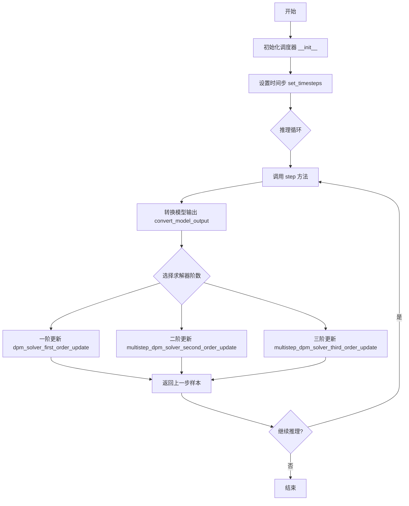
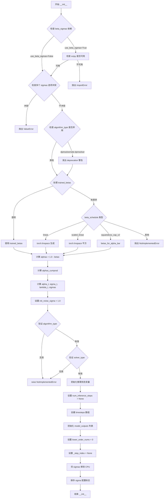
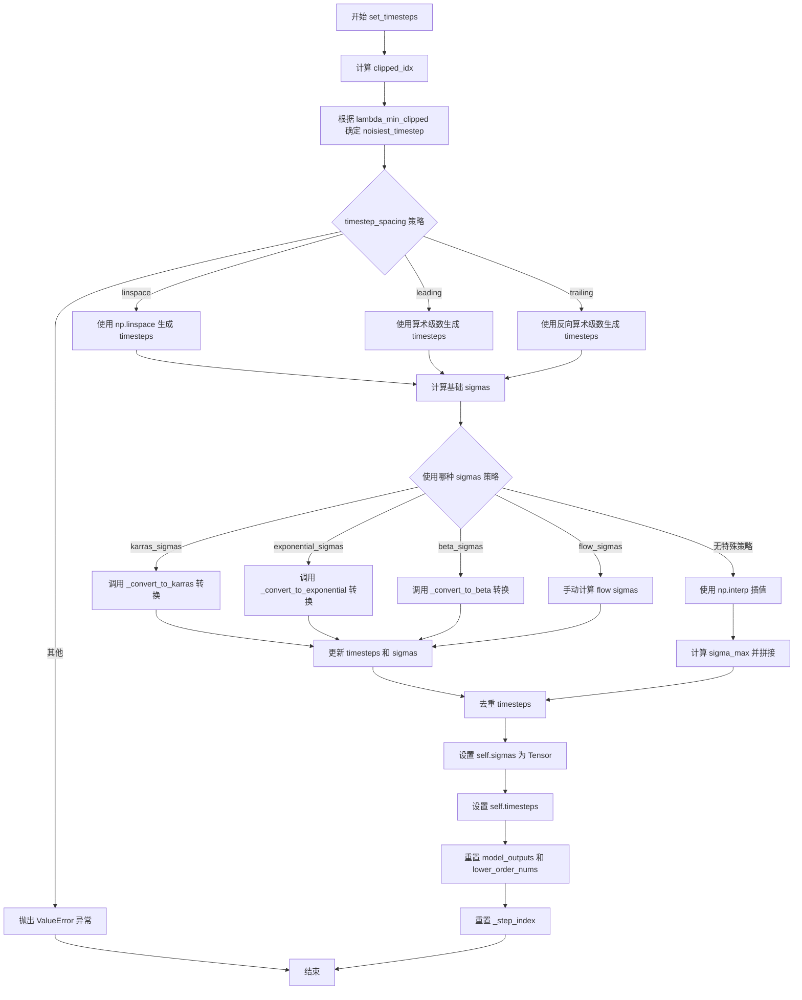
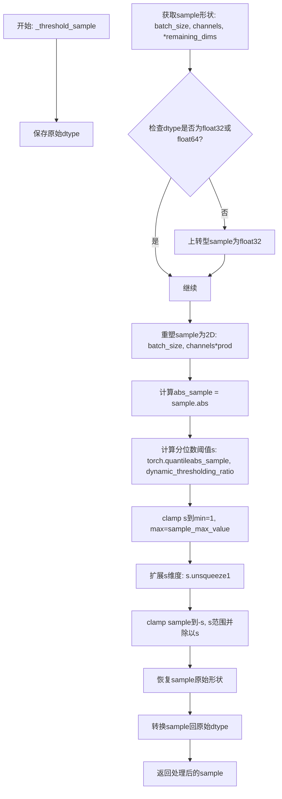
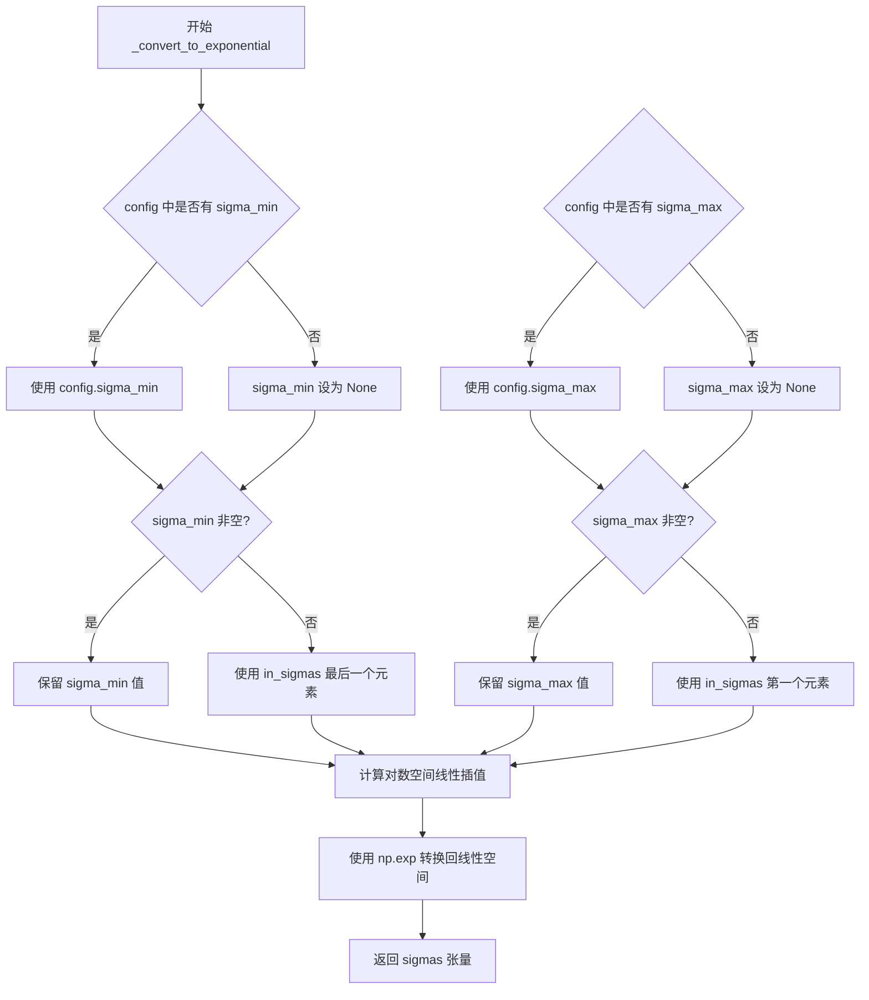
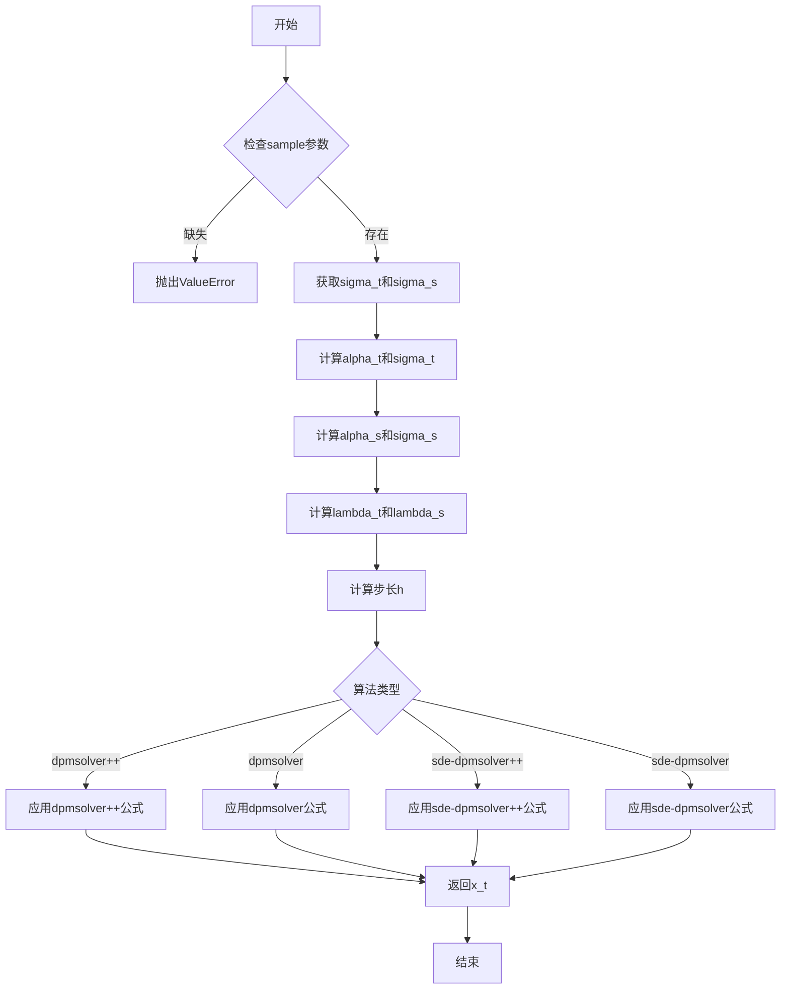
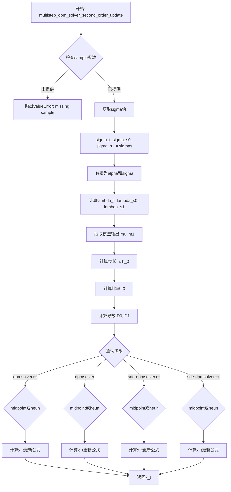
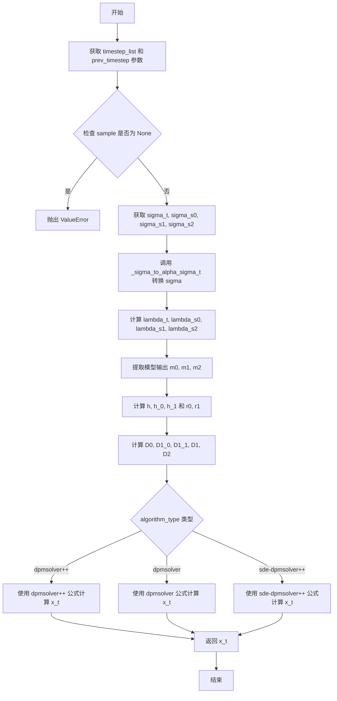
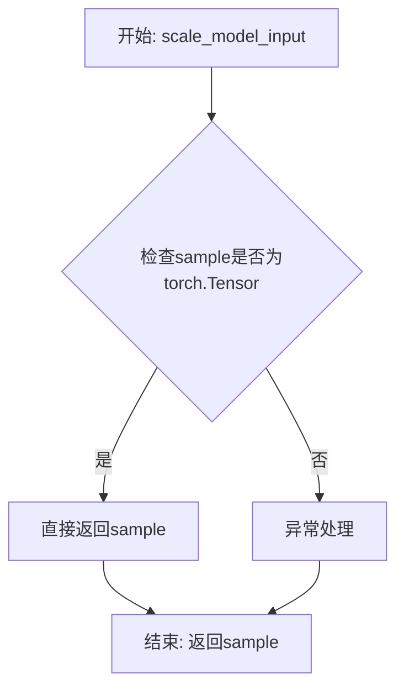
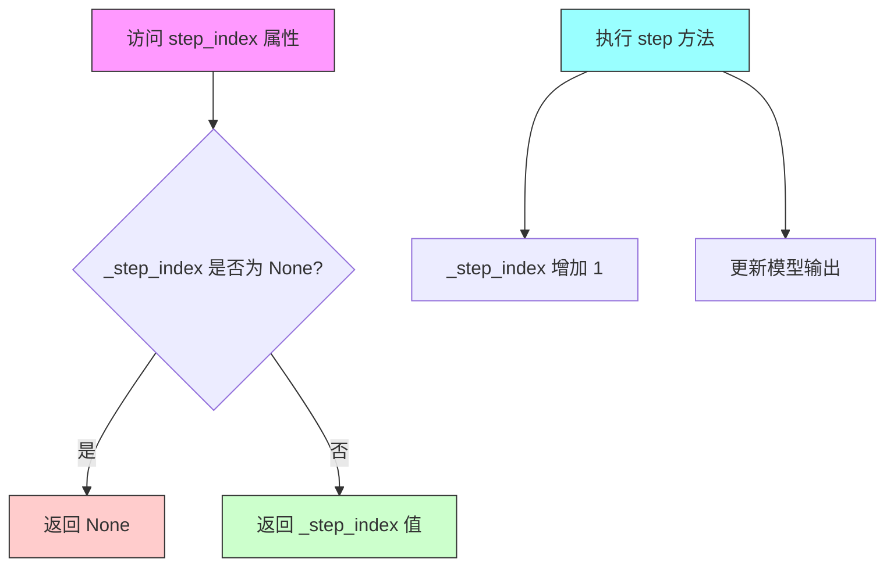

# `diffusers\src\diffusers\schedulers\scheduling_dpmsolver_multistep_inverse.py` 详细设计文档

DPMSolverMultistepInverseScheduler是DPM-Solver多步逆调度器，用于扩散模型的逆向采样过程。该调度器继承自SchedulerMixin和ConfigMixin，实现了多种DPM-Solver算法（dpmsolver/dpmsolver++/sde-dpmsolver/sde-dpmsolver++），支持一阶、二阶和三阶求解器，能够将噪声预测转换为数据预测，实现高效的去噪采样。

## 整体流程



## 类结构

```
SchedulerMixin (抽象基类)
├── ConfigMixin (配置混合类)
└── DPMSolverMultistepInverseScheduler
    ├── betas_for_alpha_bar (全局函数)
    ├── _threshold_sample
    ├── _sigma_to_t
    ├── _sigma_to_alpha_sigma_t
    ├── _convert_to_karras
    ├── _convert_to_exponential
    ├── _convert_to_beta
    ├── convert_model_output
    ├── dpm_solver_first_order_update
    ├── multistep_dpm_solver_second_order_update
    ├── multistep_dpm_solver_third_order_update
    ├── _init_step_index
    ├── step
    ├── scale_model_input
    ├── add_noise
    └── __len__
```

## 全局变量及字段


### `is_scipy_available`
    
检查scipy是否可用的函数

类型：`Callable[[], bool]`
    


### `math`
    
Python数学库模块

类型：`module`
    


### `np`
    
NumPy数值计算库模块

类型：`module`
    


### `torch`
    
PyTorch深度学习库模块

类型：`module`
    


### `Literal`
    
类型字面量用于类型提示

类型：`typing._SpecialForm`
    


### `ConfigMixin`
    
配置混合类,提供配置管理功能

类型：`class`
    


### `register_to_config`
    
配置注册装饰器,将类属性注册到配置中

类型：`function`
    


### `deprecate`
    
弃用警告函数,提示功能将在未来版本移除

类型：`function`
    


### `randn_tensor`
    
随机张量生成函数,用于生成高斯噪声张量

类型：`function`
    


### `KarrasDiffusionSchedulers`
    
Karras扩散调度器枚举类

类型：`enum`
    


### `SchedulerMixin`
    
调度器混合类,提供调度器通用接口

类型：`class`
    


### `SchedulerOutput`
    
调度器输出类,封装调度器返回结果

类型：`class`
    


### `scipy.stats`
    
SciPy统计模块,用于概率分布计算(条件导入)

类型：`module`
    


### `betas_for_alpha_bar`
    
根据alpha_bar函数生成beta调度序列的函数

类型：`function`
    


### `DPMSolverMultistepInverseScheduler.betas`
    
beta调度值序列,控制扩散过程中的噪声添加

类型：`torch.Tensor`
    


### `DPMSolverMultistepInverseScheduler.alphas`
    
alpha值序列 (1 - betas),用于计算累积乘积

类型：`torch.Tensor`
    


### `DPMSolverMultistepInverseScheduler.alphas_cumprod`
    
累积alpha乘积,表示从开始到当前的alpha累积效果

类型：`torch.Tensor`
    


### `DPMSolverMultistepInverseScheduler.alpha_t`
    
当前时刻alpha的平方根值

类型：`torch.Tensor`
    


### `DPMSolverMultistepInverseScheduler.sigma_t`
    
当前时刻sigma的平方根值

类型：`torch.Tensor`
    


### `DPMSolverMultistepInverseScheduler.lambda_t`
    
log(alpha_t) - log(sigma_t),用于DPM-Solver计算

类型：`torch.Tensor`
    


### `DPMSolverMultistepInverseScheduler.sigmas`
    
sigma值序列,表示各时间步的噪声水平

类型：`torch.Tensor`
    


### `DPMSolverMultistepInverseScheduler.init_noise_sigma`
    
初始噪声标准差,默认为1.0

类型：`float`
    


### `DPMSolverMultistepInverseScheduler.num_inference_steps`
    
推理步骤数,采样过程中的迭代次数

类型：`int`
    


### `DPMSolverMultistepInverseScheduler.timesteps`
    
时间步序列,定义扩散过程的离散时间点

类型：`torch.Tensor`
    


### `DPMSolverMultistepInverseScheduler.model_outputs`
    
模型输出列表,存储历史时间步的模型预测结果

类型：`list[torch.Tensor]`
    


### `DPMSolverMultistepInverseScheduler.lower_order_nums`
    
低阶求解器使用计数,追踪降阶求解器的使用次数

类型：`int`
    


### `DPMSolverMultistepInverseScheduler._step_index`
    
当前步骤索引,记录采样过程中的当前位置

类型：`int`
    


### `DPMSolverMultistepInverseScheduler.use_karras_sigmas`
    
是否使用Karras sigmas噪声调度策略

类型：`bool`
    


### `DPMSolverMultistepInverseScheduler.use_exponential_sigmas`
    
是否使用指数sigmas噪声调度策略

类型：`bool`
    


### `DPMSolverMultistepInverseScheduler.use_beta_sigmas`
    
是否使用beta分布sigmas噪声调度策略

类型：`bool`
    


### `DPMSolverMultistepInverseScheduler.order`
    
调度器阶数,指定使用的DPM-Solver阶数(1/2/3)

类型：`int`
    


### `DPMSolverMultistepInverseScheduler._compatibles`
    
兼容的调度器列表,记录可兼容的其他调度器名称

类型：`list[str]`
    
    

## 全局函数及方法


### `betas_for_alpha_bar`

创建beta调度表函数，离散化给定的alpha_t_bar函数，该函数定义了从t=[0,1]开始的(1-beta)的累积乘积。支持三种alpha变换类型（cosine、exp、laplace），通过数值积分方式计算每个时间步的beta值。

参数：

- `num_diffusion_timesteps`：`int`，要生成的beta数量
- `max_beta`：`float`，默认值0.999，最大beta值，用于避免数值不稳定
- `alpha_transform_type`：`Literal["cosine", "exp", "laplace"]`，默认值"cosine"，alpha_bar的噪声调度类型

返回值：`torch.Tensor`，调度器用于逐步模型输出的beta值

#### 流程图

```mermaid
flowchart TD
    A[开始] --> B{alpha_transform_type == 'cosine'?}
    B -->|Yes| C[定义cosine类型的alpha_bar_fn]
    B -->|No| D{alpha_transform_type == 'laplace'?}
    D -->|Yes| E[定义laplace类型的alpha_bar_fn]
    D -->|No| F{alpha_transform_type == 'exp'?}
    F -->|Yes| G[定义exp类型的alpha_bar_fn]
    F -->|No| H[抛出ValueError unsupported type]
    C --> I[初始化空betas列表]
    E --> I
    G --> I
    I --> J[遍历i从0到num_diffusion_timesteps-1]
    J --> K[计算t1 = i / num_diffusion_timesteps]
    K --> L[计算t2 = (i + 1) / num_diffusion_timesteps]
    L --> M[计算beta = min<br/>1 - alpha_bar_fn(t2) / alpha_bar_fn(t1)<br/>, max_beta]
    M --> N[追加到betas列表]
    N --> O{i < num_diffusion_timesteps - 1?}
    O -->|Yes| J
    O -->|No| P[转换为torch.Tensor返回]
    P --> Q[结束]
    H --> Q
```

#### 带注释源码

```python
# 从diffusers.schedulers.scheduling_ddpm.betas_for_alpha_bar复制
def betas_for_alpha_bar(
    num_diffusion_timesteps: int,
    max_beta: float = 0.999,
    alpha_transform_type: Literal["cosine", "exp", "laplace"] = "cosine",
) -> torch.Tensor:
    """
    Create a beta schedule that discretizes the given alpha_t_bar function, which defines the cumulative product of
    (1-beta) over time from t = [0,1].

    Contains a function alpha_bar that takes an argument t and transforms it to the cumulative product of (1-beta) up
    to that part of the diffusion process.

    Args:
        num_diffusion_timesteps (`int`):
            The number of betas to produce.
        max_beta (`float`, defaults to `0.999`):
            The maximum beta to use; use values lower than 1 to avoid numerical instability.
        alpha_transform_type (`str`, defaults to `"cosine"`):
            The type of noise schedule for `alpha_bar`. Choose from `cosine`, `exp`, or `laplace`.

    Returns:
        `torch.Tensor`:
            The betas used by the scheduler to step the model outputs.
    """
    # 根据alpha_transform_type选择不同的alpha_bar_fn函数
    if alpha_transform_type == "cosine":
        # cosine变换：使用余弦函数的平方
        def alpha_bar_fn(t):
            return math.cos((t + 0.008) / 1.008 * math.pi / 2) ** 2

    elif alpha_transform_type == "laplace":
        # laplace变换：使用拉普拉斯分布相关的计算
        def alpha_bar_fn(t):
            # 计算lambda参数
            lmb = -0.5 * math.copysign(1, 0.5 - t) * math.log(1 - 2 * math.fabs(0.5 - t) + 1e-6)
            # 计算信噪比
            snr = math.exp(lmb)
            # 返回sqrt(snr / (1 + snr))
            return math.sqrt(snr / (1 + snr))

    elif alpha_transform_type == "exp":
        # 指数变换：使用指数衰减函数
        def alpha_bar_fn(t):
            return math.exp(t * -12.0)

    else:
        raise ValueError(f"Unsupported alpha_transform_type: {alpha_transform_type}")

    # 初始化betas列表
    betas = []
    # 遍历每个扩散时间步
    for i in range(num_diffusion_timesteps):
        # 计算当前时间步和下一个时间步的归一化值
        t1 = i / num_diffusion_timesteps
        t2 = (i + 1) / num_diffusion_timesteps
        # 根据alpha_bar函数计算beta值，并限制最大值
        betas.append(min(1 - alpha_bar_fn(t2) / alpha_bar_fn(t1), max_beta))
    # 转换为torch.Tensor并返回float32类型
    return torch.tensor(betas, dtype=torch.float32)
```


### DPMSolverMultistepInverseScheduler.__init__

该方法是 `DPMSolverMultistepInverseScheduler` 类的构造函数，用于初始化反向扩散调度器的所有配置参数、噪声调度表（betas、alphas、sigmas等）以及DPM-Solver所需的状态变量。

参数：

- `num_train_timesteps`：`int`，默认为1000，扩散模型训练的步数
- `beta_start`：`float`，默认为0.0001，推理时起始的beta值
- `beta_end`：`float`，默认为0.02，推理时最终的beta值
- `beta_schedule`：`Literal["linear", "scaled_linear", "squaredcos_cap_v2"]`，默认为"linear"，beta调度策略
- `trained_betas`：`np.ndarray | list[float] | None`，可选的直接传入的betas数组
- `solver_order`：`int`，默认为2，DPM-Solver的阶数（1、2或3）
- `prediction_type`：`Literal["epsilon", "sample", "v_prediction", "flow_prediction"]`，默认为"epsilon"，调度器函数的预测类型
- `thresholding`：`bool`，默认为False，是否使用动态阈值方法
- `dynamic_thresholding_ratio`：`float`，默认为0.995，动态阈值方法的比率
- `sample_max_value`：`float`，默认为1.0，动态阈值的阈值
- `algorithm_type`：`Literal["dpmsolver", "dpmsolver++", "sde-dpmsolver", "sde-dpmsolver++"]`，默认为"dpmsolver++"，求解器算法类型
- `solver_type`：`Literal["midpoint", "heun"]`，默认为"midpoint"，二阶求解器类型
- `lower_order_final`：`bool`，默认为True，是否在最后几步使用低阶求解器
- `euler_at_final`：`bool`，默认为False，最后一步是否使用欧拉法
- `use_karras_sigmas`：`bool`，默认为False，是否使用Karras sigmas
- `use_exponential_sigmas`：`bool`，默认为False，是否使用指数sigmas
- `use_beta_sigmas`：`bool`，默认为False，是否使用beta sigmas
- `use_flow_sigmas`：`bool`，默认为False，是否使用flow sigmas
- `flow_shift`：`float`，默认为1.0，flow shift因子
- `lambda_min_clipped`：`float`，默认为`-inf`，lambda(t)的最小裁剪值
- `variance_type`：`Literal["learned", "learned_range"] | None`，方差预测类型
- `timestep_spacing`：`Literal["linspace", "leading", "trailing"]`，默认为"linspace"，时间步缩放方式
- `steps_offset`：`int`，默认为0，推理步数偏移量

返回值：无（`None`），构造函数不返回值

#### 流程图



#### 带注释源码

```
@register_to_config
def __init__(
    self,
    num_train_timesteps: int = 1000,  # 扩散训练的总步数，默认1000
    beta_start: float = 0.0001,       # beta起始值，默认0.0001
    beta_end: float = 0.02,           # beta结束值，默认0.02
    beta_schedule: Literal["linear", "scaled_linear", "squaredcos_cap_v2"] = "linear",  # beta调度策略
    trained_betas: np.ndarray | list[float] | None = None,  # 可选的预定义betas数组
    solver_order: int = 2,            # DPM-Solver阶数（1/2/3），默认2
    prediction_type: Literal["epsilon", "sample", "v_prediction", "flow_prediction"] = "epsilon",  # 预测类型
    thresholding: bool = False,        # 是否启用动态阈值
    dynamic_thresholding_ratio: float = 0.995,  # 动态阈值比率
    sample_max_value: float = 1.0,     # 样本最大值（阈值）
    algorithm_type: Literal["dpmsolver", "dpmsolver++", "sde-dpmsolver", "sde-dpmsolver++"] = "dpmsolver++",  # 算法类型
    solver_type: Literal["midpoint", "heun"] = "midpoint",  # 求解器类型
    lower_order_final: bool = True,    # 最后阶段使用低阶求解器
    euler_at_final: bool = False,      # 最后阶段使用欧拉法
    use_karras_sigmas: bool = False,   # 使用Karras噪声调度
    use_exponential_sigmas: bool = False,  # 使用指数噪声调度
    use_beta_sigmas: bool = False,     # 使用Beta噪声调度
    use_flow_sigmas: bool = False,     # 使用Flow噪声调度
    flow_shift: float = 1.0,           # Flow shift因子
    lambda_min_clipped: float = -float("inf"),  # lambda最小裁剪值
    variance_type: Literal["learned", "learned_range"] | None = None,  # 方差预测类型
    timestep_spacing: Literal["linspace", "leading", "trailing"] = "linspace",  # 时间步间隔策略
    steps_offset: int = 0,             # 步数偏移量
):
    # 如果使用beta sigmas，检查scipy是否可用（beta分布需要scipy）
    if self.config.use_beta_sigmas and not is_scipy_available():
        raise ImportError("Make sure to install scipy if you want to use beta sigmas.")
    
    # 检查多个sigma选项不能同时启用（互斥）
    if (
        sum(
            [
                self.config.use_beta_sigmas,
                self.config.use_exponential_sigmas,
                self.config.use_karras_sigmas,
            ]
        )
        > 1
    ):
        raise ValueError(
            "Only one of `config.use_beta_sigmas`, `config.use_exponential_sigmas`, `config.use_karras_sigmas` can be used."
        )
    
    # 对弃用的algorithm_type发出警告
    if algorithm_type in ["dpmsolver", "sde-dpmsolver"]:
        deprecation_message = f"algorithm_type {algorithm_type} is deprecated and will be removed in a future version. Choose from `dpmsolver++` or `sde-dpmsolver++` instead"
        deprecate(
            "algorithm_types dpmsolver and sde-dpmsolver",
            "1.0.0",
            deprecation_message,
        )

    # 根据配置生成betas（噪声调度）
    if trained_betas is not None:
        # 直接使用提供的betas
        self.betas = torch.tensor(trained_betas, dtype=torch.float32)
    elif beta_schedule == "linear":
        # 线性beta调度：从beta_start到beta_end均匀分布
        self.betas = torch.linspace(beta_start, beta_end, num_train_timesteps, dtype=torch.float32)
    elif beta_schedule == "scaled_linear":
        # 缩放线性调度：先在线性空间生成，再平方（适合latent扩散模型）
        self.betas = (
            torch.linspace(
                beta_start**0.5,
                beta_end**0.5,
                num_train_timesteps,
                dtype=torch.float32,
            )
            ** 2
        )
    elif beta_schedule == "squaredcos_cap_v2":
        # 余弦调度（Glide cosine schedule）
        self.betas = betas_for_alpha_bar(num_train_timesteps)
    else:
        raise NotImplementedError(f"{beta_schedule} is not implemented for {self.__class__}")

    # 计算alphas（1 - beta）
    self.alphas = 1.0 - self.betas
    # 计算累积乘积alpha_cumprod（用于DDPM等方法）
    self.alphas_cumprod = torch.cumprod(self.alphas, dim=0)
    # 目前只支持VP类型的噪声调度
    self.alpha_t = torch.sqrt(self.alphas_cumprod)  # alpha_t = sqrt(alpha_cumprod)
    self.sigma_t = torch.sqrt(1 - self.alphas_cumprod)  # sigma_t = sqrt(1 - alpha_cumprod)
    # lambda_t = log(alpha_t) - log(sigma_t)，用于DPM-Solver计算
    self.lambda_t = torch.log(self.alpha_t) - torch.log(self.sigma_t)
    # sigmas用于采样和噪声添加
    self.sigmas = ((1 - self.alphas_cumprod) / self.alphas_cumprod) ** 0.5

    # 初始噪声分布的标准差
    self.init_noise_sigma = 1.0

    # DPM-Solver的设置验证
    if algorithm_type not in [
        "dpmsolver",
        "dpmsolver++",
        "sde-dpmsolver",
        "sde-dpmsolver++",
    ]:
        if algorithm_type == "deis":
            # 将deis类型映射到dpmsolver++
            self.register_to_config(algorithm_type="dpmsolver++")
        else:
            raise NotImplementedError(f"{algorithm_type} is not implemented for {self.__class__}")

    if solver_type not in ["midpoint", "heun"]:
        if solver_type in ["logrho", "bh1", "bh2"]:
            # 将其他类型映射到midpoint
            self.register_to_config(solver_type="midpoint")
        else:
            raise NotImplementedError(f"{solver_type} is not implemented for {self.__class__}")

    # 可设置的推理参数
    self.num_inference_steps = None  # 推理步数（运行时设置）
    # 生成均匀分布的时间步
    timesteps = np.linspace(0, num_train_timesteps - 1, num_train_timesteps, dtype=np.float32).copy()
    self.timesteps = torch.from_numpy(timesteps)
    
    # 模型输出缓存，用于多步DPM-Solver（存储solver_order数量的历史输出）
    self.model_outputs = [None] * solver_order
    self.lower_order_nums = 0  # 低阶求解器使用计数
    self._step_index = None  # 当前步索引
    
    # sigmas移到CPU以减少CPU/GPU通信开销
    self.sigmas = self.sigmas.to("cpu")
    
    # 保存sigma类型配置标志
    self.use_karras_sigmas = use_karras_sigmas
    self.use_exponential_sigmas = use_exponential_sigmas
    self.use_beta_sigmas = use_beta_sigmas
```


### `DPMSolverMultistepInverseScheduler.set_timesteps`

该方法用于设置离散的时间步长，用于扩散链的推理过程。它根据配置的时间间隔策略（linspace、leading或trailing）生成时间步序列，并可选择使用Karras、指数、β或Flow sigmas来调整噪声调度。

参数：

- `num_inference_steps`：`int | None`，用于生成样本的扩散推理步数
- `device`：`str | torch.device | None`，时间步要移动到的设备。如果为`None`，则不移动

返回值：`None`，该方法直接修改调度器的内部状态，不返回任何值

#### 流程图



#### 带注释源码

```python
def set_timesteps(
    self,
    num_inference_steps: int | None = None,
    device: str | torch.device | None = None,
):
    """
    设置用于扩散链的离散时间步（在推理前运行）。

    参数:
        num_inference_steps (`int`):
            使用预训练模型生成样本时使用的扩散步数。
        device (`str` 或 `torch.device`, *可选*):
            时间步要移动到的设备。如果为 `None`，则不移动时间步。
    """
    # 为了数值稳定性，裁剪所有 lambda(t) 的最小值。
    # 这对于余弦（squaredcos_cap_v2）噪声调度至关重要。
    # 使用 searchsorted 找到 lambda_t 中大于等于 lambda_min_clipped 的位置
    clipped_idx = torch.searchsorted(torch.flip(self.lambda_t, [0]), self.config.lambda_min_clipped).item()
    # 计算最噪声的时间步索引
    self.noisiest_timestep = self.config.num_train_timesteps - 1 - clipped_idx

    # 根据 timestep_spacing 策略生成时间步
    # "linspace", "leading", "trailing" 对应于 https://huggingface.co/papers/2305.08891 的表2
    if self.config.timestep_spacing == "linspace":
        # 均匀分布的时间步
        timesteps = (
            np.linspace(0, self.noisiest_timestep, num_inference_steps + 1).round()[:-1].copy().astype(np.int64)
        )
    elif self.config.timestep_spacing == "leading":
        # 领头策略：步长较大在前
        step_ratio = (self.noisiest_timestep + 1) // (num_inference_steps + 1)
        # 通过乘以比例创建整数时间步
        # 转换为 int 以避免 num_inference_step 是3的幂时出现问题
        timesteps = (np.arange(0, num_inference_steps + 1) * step_ratio).round()[:-1].copy().astype(np.int64)
        timesteps += self.config.steps_offset
    elif self.config.timestep_spacing == "trailing":
        # 末尾策略：步长较大在后
        step_ratio = self.config.num_train_timesteps / num_inference_steps
        # 通过乘以比例创建整数时间步
        timesteps = np.arange(self.noisiest_timestep + 1, 0, -step_ratio).round()[::-1].copy().astype(np.int64)
        timesteps -= 1
    else:
        raise ValueError(
            f"{self.config.timestep_spacing} 不支持。请确保选择 'linspace', 'leading' 或 'trailing' 之一。"
        )

    # 计算基础 sigmas（噪声标准差）
    sigmas = np.array(((1 - self.alphas_cumprod) / self.alphas_cumprod) ** 0.5)
    log_sigmas = np.log(sigmas)

    # 根据配置选择不同的 sigma 转换策略
    if self.config.use_karras_sigmas:
        # 使用 Karras 噪声调度（基于 Elucidating the Design Space 论文）
        sigmas = self._convert_to_karras(in_sigmas=sigmas, num_inference_steps=num_inference_steps)
        # 将 sigma 转换回时间步
        timesteps = np.array([self._sigma_to_t(sigma, log_sigmas) for sigma in sigmas]).round()
        timesteps = timesteps.copy().astype(np.int64)
        sigmas = np.concatenate([sigmas, sigmas[-1:]]).astype(np.float32)
    elif self.config.use_exponential_sigmas:
        # 使用指数噪声调度
        sigmas = self._convert_to_exponential(in_sigmas=sigmas, num_inference_steps=num_inference_steps)
        timesteps = np.array([self._sigma_to_t(sigma, log_sigmas) for sigma in sigmas])
        sigmas = np.concatenate([sigmas, sigmas[-1:]]).astype(np.float32)
    elif self.config.use_beta_sigmas:
        # 使用 Beta 分布噪声调度（基于 Beta Sampling is All You Need 论文）
        sigmas = self._convert_to_beta(in_sigmas=sigmas, num_inference_steps=num_inference_steps)
        timesteps = np.array([self._sigma_to_t(sigma, log_sigmas) for sigma in sigmas])
        sigmas = np.concatenate([sigmas, sigmas[-1:]]).astype(np.float32)
    elif self.config.use_flow_sigmas:
        # 使用 Flow sigmas
        alphas = np.linspace(1, 1 / self.config.num_train_timesteps, num_inference_steps + 1)
        sigmas = 1.0 - alphas
        sigmas = np.flip(self.config.flow_shift * sigmas / (1 + (self.config.flow_shift - 1) * sigmas))[:-1].copy()
        timesteps = (sigmas * self.config.num_train_timesteps).copy()
        sigmas = np.concatenate([sigmas, sigmas[-1:]]).astype(np.float32)
    else:
        # 默认：使用线性插值
        sigmas = np.interp(timesteps, np.arange(0, len(sigmas)), sigmas)
        sigma_max = (
            (1 - self.alphas_cumprod[self.noisiest_timestep]) / self.alphas_cumprod[self.noisiest_timestep]
        ) ** 0.5
        sigmas = np.concatenate([sigmas, [sigma_max]]).astype(np.float32)

    # 转换为 PyTorch Tensor
    self.sigmas = torch.from_numpy(sigmas)

    # 当 num_inference_steps == num_train_timesteps 时，timesteps 可能有重复
    # 使用 np.unique 去重
    _, unique_indices = np.unique(timesteps, return_index=True)
    timesteps = timesteps[np.sort(unique_indices)]

    # 设置最终的时间步
    self.timesteps = torch.from_numpy(timesteps).to(device=device, dtype=torch.int64)

    # 更新推理步数
    self.num_inference_steps = len(timesteps)

    # 重置模型输出缓冲区（用于多步求解器）
    self.model_outputs = [
        None,
    ] * self.config.solver_order
    self.lower_order_nums = 0

    # 添加一个索引计数器，允许重复时间步的调度器使用
    self._step_index = None
    # 将 sigmas 移到 CPU 以减少 CPU/GPU 通信开销
    self.sigmas = self.sigmas.to("cpu")
```


### `DPMSolverMultistepInverseScheduler._threshold_sample`

对预测样本应用动态阈值处理（Dynamic Thresholding）。该方法通过计算样本绝对值的分位数来确定动态阈值 s，然后将样本限制在 [-s, s] 范围内并除以 s，以防止像素饱和并提高图像质量。

参数：

- `sample`：`torch.Tensor`，需要进行动态阈值处理的预测样本

返回值：`torch.Tensor`，经过阈值处理后的样本

#### 流程图



#### 带注释源码

```
def _threshold_sample(self, sample: torch.Tensor) -> torch.Tensor:
    """
    Apply dynamic thresholding to the predicted sample.

    "Dynamic thresholding: At each sampling step we set s to a certain percentile absolute pixel value in xt0 (the
    prediction of x_0 at timestep t), and if s > 1, then we threshold xt0 to the range [-s, s] and then divide by
    s. Dynamic thresholding pushes saturated pixels (those near -1 and 1) inwards, thereby actively preventing
    pixels from saturation at each step. We find that dynamic thresholding results in significantly better
    photorealism as well as better image-text alignment, especially when using very large guidance weights."

    https://huggingface.co/papers/2205.11487

    Args:
        sample (`torch.Tensor`):
            The predicted sample to be thresholded.

    Returns:
        `torch.Tensor`:
            The thresholded sample.
    """
    dtype = sample.dtype  # 保存原始数据类型，用于后续恢复
    batch_size, channels, *remaining_dims = sample.shape  # 解构样本形状

    # 如果数据类型不是float32或float64，需要上转型
    # 因为quantile计算和clamp操作在CPU half精度上未实现
    if dtype not in (torch.float32, torch.float64):
        sample = sample.float()  # upcast for quantile calculation, and clamp not implemented for cpu half

    # 将样本重塑为2D张量，以便沿每个图像维度进行分位数计算
    # Flatten sample for doing quantile calculation along each image
    sample = sample.reshape(batch_size, channels * np.prod(remaining_dims))

    abs_sample = sample.abs()  # 计算绝对值: "a certain percentile absolute pixel value"

    # 根据dynamic_thresholding_ratio计算阈值s（分位数）
    s = torch.quantile(abs_sample, self.config.dynamic_thresholding_ratio, dim=1)
    
    # 将s限制在[1, sample_max_value]范围内
    # 当clamp到min=1时，等同于标准clip到[-1, 1]
    s = torch.clamp(
        s, min=1, max=self.config.sample_max_value
    )  # When clamped to min=1, equivalent to standard clipping to [-1, 1]
    
    # 扩展s的维度为(batch_size, 1)，以便沿dim=0进行广播
    s = s.unsqueeze(1)  # (batch_size, 1) because clamp will broadcast along dim=0
    
    # 将样本限制在[-s, s]范围内，然后除以s
    # "we threshold xt0 to the range [-s, s] and then divide by s"
    sample = torch.clamp(sample, -s, s) / s

    # 恢复样本的原始形状
    sample = sample.reshape(batch_size, channels, *remaining_dims)
    
    # 转换回原始数据类型
    sample = sample.to(dtype)

    return sample
```


### `DPMSolverMultistepInverseScheduler._sigma_to_t`

该方法通过插值将 sigma 值转换为对应的时间步索引值。它利用对数 sigma 值的分布，通过查找相邻索引并计算加权插值来实现从噪声水平到离散时间步的映射，是连接 Karras、指数、Beta 等不同噪声调度方式与离散时间步的关键转换函数。

参数：

- `self`：类实例指针，包含调度器的配置和状态
- `sigma`：`np.ndarray`，要转换的 sigma 噪声水平值，可以是单个值或数组
- `log_sigmas`：`np.ndarray`，用于插值的对数 sigma 调度表，即 log(sigma) 的预计算序列

返回值：`np.ndarray`，转换后对应的时间步索引值，与输入 sigma 形状相同

#### 流程图

```mermaid
flowchart TD
    A[开始: _sigma_to_t] --> B[计算 log_sigma = log maxsigma, 1e-10]
    B --> C[计算分布差: dists = log_sigma - log_sigmas[:, np.newaxis]]
    C --> D[查找低索引: low_idx = cumsumdists>=0.argmax0.clipmax]
    D --> E[计算高索引: high_idx = low_idx + 1]
    E --> F[获取边界值: low = log_sigmas[low_idx], high = log_sigmas[high_idx]]
    F --> G[计算权重: w = low - log_sigma / low - high]
    G --> H[裁剪权重: w = clipw, 0, 1]
    H --> I[计算时间步: t = 1-w * low_idx + w * high_idx]
    I --> J[reshape结果: t = t.reshape sigma.shape]
    J --> K[返回: t]
```

#### 带注释源码

```python
# Copied from diffusers.schedulers.scheduling_euler_discrete.EulerDiscreteScheduler._sigma_to_t
def _sigma_to_t(self, sigma: np.ndarray, log_sigmas: np.ndarray) -> np.ndarray:
    """
    Convert sigma values to corresponding timestep values through interpolation.

    Args:
        sigma (`np.ndarray`):
            The sigma value(s) to convert to timestep(s).
        log_sigmas (`np.ndarray`):
            The logarithm of the sigma schedule used for interpolation.

    Returns:
        `np.ndarray`:
            The interpolated timestep value(s) corresponding to the input sigma(s).
    """
    # 将 sigma 转换为对数形式，同时避免 log(0) 导致的数值问题
    # 使用 1e-10 作为最小值保证数值稳定性
    log_sigma = np.log(np.maximum(sigma, 1e-10))

    # 计算输入 log_sigma 与调度表中每个 log_sigmas 的差值
    # 结果形状: (len(log_sigmas), len(sigma)) 用于后续批量查找
    dists = log_sigma - log_sigmas[:, np.newaxis]

    # 找到第一个大于等于 0 的位置作为低索引
    # cumsum 将布尔值转为累计和，argmax 找到第一个 True(值为1)的位置
    # clip 确保索引不会超出范围（保留最后一个区间用于插值）
    low_idx = np.cumsum((dists >= 0), axis=0).argmax(axis=0).clip(max=log_sigmas.shape[0] - 2)
    
    # 高索引总是低索引的下一个，用于线性插值
    high_idx = low_idx + 1

    # 获取对应索引处的对数 sigma 边界值
    low = log_sigmas[low_idx]
    high = log_sigmas[high_idx]

    # 计算线性插值权重 w
    # 当 log_sigma 接近 low 时 w 接近 0，接近 high 时 w 接近 1
    w = (low - log_sigma) / (low - high)
    
    # 将权重裁剪到 [0, 1] 区间，防止边界外的值
    w = np.clip(w, 0, 1)

    # 根据权重计算对应的时间步索引
    # 这实际上是 log 空间中的线性插值转换为离散索引
    t = (1 - w) * low_idx + w * high_idx
    
    # 调整输出形状以匹配输入 sigma 的形状
    t = t.reshape(sigma.shape)
    
    return t
```


### `DPMSolverMultistepInverseScheduler._sigma_to_alpha_sigma_t`

该方法是一个私有辅助函数，用于将扩散过程中的噪声水平（Sigma）转换为对应的缩放因子（Alpha_t）和实际噪声标准差（Sigma_t）。它根据配置支持两种噪声调度模式：标准方差保持（VP）模式（基于 $1/\sqrt{1+\sigma^2}$ 公式）和线性流（Linear Flow）模式。

参数：

- `self`：调度器实例，包含配置 `self.config`。
- `sigma`：`torch.Tensor`，当前时间步的噪声水平值（sigma）。

返回值：`tuple[torch.Tensor, torch.Tensor]`，包含一个元组 `(alpha_t, sigma_t)`：
- `alpha_t` (`torch.Tensor`)：信号缩放因子。
- `sigma_t` (`torch.Tensor`)：缩放后的噪声标准差。

#### 流程图

```mermaid
graph TD
    A([Start]) --> B[Input: sigma]
    B --> C{config.use_flow_sigmas?}
    C -- True (Linear Flow) --> D[alpha_t = 1 - sigma]
    D --> E[sigma_t = sigma]
    C -- False (Standard VP) --> F[alpha_t = 1 / sqrt(sigma^2 + 1)]
    F --> G[sigma_t = sigma * alpha_t]
    E --> H[Return (alpha_t, sigma_t)]
    G --> H
```

#### 带注释源码

```python
def _sigma_to_alpha_sigma_t(self, sigma: torch.Tensor) -> tuple[torch.Tensor, torch.Tensor]:
    """
    将 sigma 值转换为 alpha_t 和 sigma_t 值。

    参数:
        sigma (`torch.Tensor`):
            要转换的 sigma 值。

    返回值:
        `tuple[torch.Tensor, torch.Tensor]`:
            包含 (alpha_t, sigma_t) 的元组。
    """
    # 检查是否使用线性流（Linear Flow）sigmas
    if self.config.use_flow_sigmas:
        # 线性流模式下，alpha_t 和 sigma_t 成简单的线性关系
        # alpha_t = 1 - sigma, sigma_t = sigma
        alpha_t = 1 - sigma
        sigma_t = sigma
    else:
        # 标准方差保持 (Variance Preserving) 模式
        # 基于公式: alpha_t = 1 / sqrt(1 + sigma^2)
        # 这确保了 x_t = alpha_t * x_0 + sigma_t * epsilon 的方差在每一步保持为1
        alpha_t = 1 / ((sigma**2 + 1) ** 0.5)
        sigma_t = sigma * alpha_t

    return alpha_t, sigma_t
```


### `DPMSolverMultistepInverseScheduler._convert_to_karras`

该函数负责将标准的线性 sigma 噪声调度转换为基于 Karras 论文（Elucidating the Design Space of Diffusion-Based Generative Models）提出的非线性噪声调度。它通过计算 sigma 的倒数在指定的指数 rho（默认 7.0）下进行线性插值，从而生成更加优化的推理步骤分布，以提升扩散模型的采样质量。

参数：

-  `self`：类的实例，包含调度器配置（`config`）和当前状态。
-  `in_sigmas`：`torch.Tensor`，输入的 sigma 值序列（通常来自 `alphas_cumprod` 的线性计算）。
-  `num_inference_steps`：`int`，生成噪声调度表所需的推理步数。

返回值：`torch.Tensor`，转换后的 Karras 风格 sigma 值序列。

#### 流程图

```mermaid
flowchart TD
    A[Start: _convert_to_karras] --> B{Config has sigma_min?}
    B -->|Yes| C[sigma_min = self.config.sigma_min]
    B -->|No| D[sigma_min = in_sigmas[-1].item()]
    E{Config has sigma_max?}
    E -->|Yes| F[sigma_max = self.config.sigma_max]
    E -->|No| G[sigma_max = in_sigmas[0].item()]
    C --> H[Set rho = 7.0]
    D --> H
    F --> H
    G --> H
    H --> I[ramp = np.linspace(0, 1, num_inference_steps)]
    I --> J[min_inv_rho = sigma_min ** (1 / rho)]
    J --> K[max_inv_rho = sigma_max ** (1 / rho)]
    K --> L[sigmas = (max_inv_rho + ramp * (min_inv_rho - max_inv_rho)) ** rho]
    L --> M[Return sigmas]
```

#### 带注释源码

```python
def _convert_to_karras(self, in_sigmas: torch.Tensor, num_inference_steps: int) -> torch.Tensor:
    """
    Construct the noise schedule as proposed in [Elucidating the Design Space of Diffusion-Based Generative
    Models](https://huggingface.co/papers/2206.00364).

    Args:
        in_sigmas (`torch.Tensor`):
            The input sigma values to be converted.
        num_inference_steps (`int`):
            The number of inference steps to generate the noise schedule for.

    Returns:
        `torch.Tensor`:
            The converted sigma values following the Karras noise schedule.
    """

    # Hack to make sure that other schedulers which copy this function don't break
    # 检查配置中是否显式指定了最小/最大 sigma 值。
    # 这是一个兼容性处理，确保从其他调度器（如 EulerDiscreteScheduler）复制过来的代码
    # 即使配置结构不同也不会立即崩溃，虽然这里的具体逻辑可能略显冗余。
    if hasattr(self.config, "sigma_min"):
        sigma_min = self.config.sigma_min
    else:
        sigma_min = None

    if hasattr(self.config, "sigma_max"):
        sigma_max = self.config.sigma_max
    else:
        sigma_max = None

    # 如果配置未指定，则从输入的 sigmas 中推断：
    # sigma_min 对应推理过程结束时的噪声（即 in_sigmas 的最后一个值，通常最大）
    # sigma_max 对应推理过程开始时的噪声（即 in_sigmas 的第一个值，通常最小）
    sigma_min = sigma_min if sigma_min is not None else in_sigmas[-1].item()
    sigma_max = sigma_max if sigma_max is not None else in_sigmas[0].item()

    # Karras 论文中推荐的超参数 rho，控制噪声调度曲线的形状
    rho = 7.0  # 7.0 is the value used in the paper
    
    # 生成从 0 到 1 的线性步进数组
    ramp = np.linspace(0, 1, num_inference_steps)
    
    # 计算逆 rho 域下的最小和最大值
    min_inv_rho = sigma_min ** (1 / rho)
    max_inv_rho = sigma_max ** (1 / rho)
    
    # 在逆 rho 域进行线性插值，然后再变换回 sigma 域
    # 这产生了非线性的 sigma 步长，使得在低噪声区域（细节生成阶段）有更多的步骤
    sigmas = (max_inv_rho + ramp * (min_inv_rho - max_inv_rho)) ** rho
    return sigmas
```


### `DPMSolverMultistepInverseScheduler._convert_to_exponential`

该方法用于构建指数噪声调度（Exponential Noise Schedule），通过在对数空间中进行线性插值，将输入的sigma值转换为遵循指数分布的噪声调度序列。

参数：

- `self`：`DPMSolverMultistepInverseScheduler`，调度器实例本身
- `in_sigmas`：`torch.Tensor`，输入的sigma值，用于确定噪声调度的范围
- `num_inference_steps`：`int`，生成噪声调度所需的推理步数

返回值：`torch.Tensor`，遵循指数调度规律的转换后sigma值序列

#### 流程图



#### 带注释源码

```python
def _convert_to_exponential(self, in_sigmas: torch.Tensor, num_inference_steps: int) -> torch.Tensor:
    """
    构建指数噪声调度（Exponential Noise Schedule）。
    
    该方法通过对数空间线性插值的方式，将输入的sigma值转换为
    遵循指数分布规律的噪声调度序列。
    
    Args:
        in_sigmas (torch.Tensor): 
            输入的sigma值，用于确定噪声调度的范围边界。
            通常为训练时生成的sigma序列。
        num_inference_steps (int): 
            生成噪声调度所需的推理步数，
            决定了输出sigma序列的长度。
    
    Returns:
        torch.Tensor: 
            遵循指数调度规律的转换后sigma值序列，
            长度为 num_inference_steps。
    """
    
    # ---------------------------------------------------------
    # 处理 sigma_min 的默认值
    # ---------------------------------------------------------
    # 这是一个兼容性hack，确保其他调度器复制此函数时不会出错
    # TODO: 将此逻辑添加到其他调度器中
    if hasattr(self.config, "sigma_min"):
        # 如果配置中指定了sigma_min，则使用配置值
        sigma_min = self.config.sigma_min
    else:
        sigma_min = None
    
    # 如果配置中指定了sigma_max，则使用配置值
    if hasattr(self.config, "sigma_max"):
        sigma_max = self.config.sigma_max
    else:
        sigma_max = None
    
    # 确定最终的 sigma_min 值
    # 优先级：配置值 > in_sigmas 的边界值
    sigma_min = sigma_min if sigma_min is not None else in_sigmas[-1].item()
    # in_sigmas[-1] 通常是sigma序列中的最小值（噪声最大）
    sigma_max = sigma_max if sigma_max is not None else in_sigmas[0].item()
    # in_sigmas[0] 通常是sigma序列中的最大值（噪声最小）
    
    # ---------------------------------------------------------
    # 在对数空间进行线性插值，然后转换回线性空间
    # ---------------------------------------------------------
    # 步骤1: np.linspace(math.log(sigma_max), math.log(sigma_min), num_inference_steps)
    #        在对数空间 [log(sigma_max), log(sigma_min)] 之间生成 num_inference_steps 个等间距点
    # 步骤2: np.exp(...) 将对数值转换回线性空间，得到指数分布的sigma值
    #        由于对数空间是线性插值，转换后呈现指数分布
    sigmas = np.exp(np.linspace(math.log(sigma_max), math.log(sigma_min), num_inference_steps))
    
    return sigmas
```


### `DPMSolverMultistepInverseScheduler._convert_to_beta`

该方法用于根据 Beta 分布构建噪声调度表（Beta noise schedule），作为 DPMSolver 的sigma值转换方法。该方法基于论文 "Beta Sampling is All You Need" 的提议，通过 Beta 分布的百分位点函数（ppf）将输入的 sigma 值转换为符合 Beta 分布特性的噪声调度序列。

参数：

- `self`：`DPMSolverMultistepInverseScheduler`，调度器实例本身
- `in_sigmas`：`torch.Tensor`，输入的 sigma 值，用于生成噪声调度表
- `num_inference_steps`：`int`，推理步数，用于生成噪声调度的步数
- `alpha`：`float`，Beta 分布的 alpha 参数，默认值为 0.6
- `beta`：`float`，Beta 分布的 beta 参数，默认值为 0.6

返回值：`torch.Tensor`，遵循 Beta 分布噪声调度的转换后 sigma 值

#### 流程图

```mermaid
flowchart TD
    A[开始 _convert_to_beta] --> B{检查 config.sigma_min}
    B -->|存在| C[使用 config.sigma_min]
    B -->|不存在| D[使用 in_sigmas 最后一个值]
    C --> E{检查 config.sigma_max}
    D --> E
    E -->|存在| F[使用 config.sigma_max]
    E -->|不存在| G[使用 in_sigmas 第一个值]
    F --> H[生成线性间隔 timestep 0到1]
    G --> H
    H --> I[1 - timestep 翻转]
    I --> J[对每个 timestep 调用 beta.ppf]
    J --> K[映射到 [sigma_min, sigma_max] 范围]
    K --> L[转换为 numpy 数组]
    L --> M[返回 sigmas]
```

#### 带注释源码

```python
def _convert_to_beta(
    self, in_sigmas: torch.Tensor, num_inference_steps: int, alpha: float = 0.6, beta: float = 0.6
) -> torch.Tensor:
    """
    Construct a beta noise schedule as proposed in [Beta Sampling is All You
    Need](https://huggingface.co/papers/2407.12173).

    Args:
        in_sigmas (`torch.Tensor`):
            The input sigma values to be converted.
        num_inference_steps (`int`):
            The number of inference steps to generate the noise schedule for.
        alpha (`float`, *optional*, defaults to `0.6`):
            The alpha parameter for the beta distribution.
        beta (`float`, *optional*, defaults to `0.6`):
            The beta parameter for the beta distribution.

    Returns:
        `torch.Tensor`:
            The converted sigma values following a beta distribution schedule.
    """

    # 检查配置中是否存在 sigma_min 属性，用于兼容其他调度器
    if hasattr(self.config, "sigma_min"):
        sigma_min = self.config.sigma_min
    else:
        sigma_min = None

    # 检查配置中是否存在 sigma_max 属性，用于兼容其他调度器
    if hasattr(self.config, "sigma_max"):
        sigma_max = self.config.sigma_max
    else:
        sigma_max = None

    # 如果配置中未指定，则使用输入 sigmas 的边界值作为默认
    sigma_min = sigma_min if sigma_min is not None else in_sigmas[-1].item()
    sigma_max = sigma_max if sigma_max is not None else in_sigmas[0].item()

    # 使用 Beta 分布的百分位点函数（ppf）生成噪声调度
    # 1. 生成从 0 到 1 的线性间隔
    # 2. 用 1 减去每个值，实现时间反转
    # 3. 对每个时间点计算 Beta 分布的 ppf
    # 4. 将结果映射到 [sigma_min, sigma_max] 范围内
    sigmas = np.array(
        [
            sigma_min + (ppf * (sigma_max - sigma_min))
            for ppf in [
                scipy.stats.beta.ppf(timestep, alpha, beta)
                for timestep in 1 - np.linspace(0, 1, num_inference_steps)
            ]
        ]
    )
    return sigmas
```


### `DPMSolverMultistepInverseScheduler.convert_model_output`

将扩散模型的原始输出转换为 DPMSolver/DPMSolver++ 算法所需的数据格式。该方法根据配置的算法类型（`dpmsolver++` / `sde-dpmsolver++` 为数据预测模型，`dpmsolver` / `sde-dpmsolver` 为噪声预测模型）和预测类型（`epsilon`、`sample`、`v_prediction`、`flow_prediction`）执行相应的数学变换，同时支持动态阈值处理以提升数值稳定性。

#### 参数

- `model_output`：`torch.Tensor`，扩散模型直接输出的张量（可为噪声预测、数据预测或 v 预测）
- `sample`：`torch.Tensor | None`，扩散过程中生成的当前样本（必需参数）
- `*args`：可变位置参数，用于向后兼容传递 `timestep`
- `**kwargs`：可变关键字参数，用于向后兼容传递 `timestep`

#### 返回值

`torch.Tensor`，转换后的模型输出——对于 `dpmsolver++` / `sde-dpmsolver++` 算法返回预测的原始数据 `x0_pred`，对于 `dpmsolver` / `sde-dpmsolver` 算法返回预测的噪声 `epsilon`

#### 流程图

```mermaid
flowchart TD
    A[开始 convert_model_output] --> B{从 args/kwargs 获取 timestep}
    B --> C{检查 sample 是否为 None}
    C -->|是| D[从 args 获取 sample]
    D --> E{再次检查 sample}
    E -->|仍为 None| F[抛出 ValueError: 缺少 sample 参数]
    E -->|有值| G{algorithm_type 是 dpmsolver++ 或 sde-dpmsolver++?}
    C -->|否| G
    
    G -->|是| H{prediction_type == epsilon?}
    H -->|是| I{方差类型是 learned/learned_range?}
    I -->|是| J[model_output = model_output[:, :3]]
    I -->|否| K[获取当前 sigma]
    K --> L[计算 alpha_t, sigma_t]
    L --> M[x0_pred = (sample - sigma_t * model_output) / alpha_t]
    I -->|否| M
    
    H -->|否| N{prediction_type == sample?}
    N -->|是| O[x0_pred = model_output]
    N -->|否| P{prediction_type == v_prediction?}
    P -->|是| Q[计算 alpha_t, sigma_t]
    Q --> R[x0_pred = alpha_t * sample - sigma_t * model_output]
    P -->|否| S{prediction_type == flow_prediction?}
    S -->|是| T[x0_pred = sample - sigma_t * model_output]
    S -->|否| U[抛出 ValueError: 不支持的 prediction_type]
    
    M --> V{thresholding 启用?}
    O --> V
    R --> V
    T --> V
    V -->|是| W[x0_pred = _threshold_sample(x0_pred)]
    V -->|否| X[返回 x0_pred]
    W --> X
    
    G -->|否| Y{prediction_type == epsilon?}
    Y -->|是| Z{方差类型是 learned/learned_range?}
    Z -->|是| AA[epsilon = model_output[:, :3]]
    Z -->|否| AB[epsilon = model_output]
    Y -->|否| AC{prediction_type == sample?}
    AC -->|是| AD[计算 alpha_t, sigma_t]
    AD --> AE[epsilon = (sample - alpha_t * model_output) / sigma_t]
    AC -->|否| AF{prediction_type == v_prediction?}
    AF -->|是| AG[计算 alpha_t, sigma_t]
    AG --> AH[epsilon = alpha_t * model_output + sigma_t * sample]
    AF -->|否| U
    
    AB --> AI{thresholding 启用?}
    AA --> AI
    AE --> AI
    AH --> AI
    
    AI -->|是| AJ[计算 alpha_t, sigma_t]
    AJ --> AK[x0_pred = (sample - sigma_t * epsilon) / alpha_t]
    AK --> AL[x0_pred = _threshold_sample(x0_pred)]
    AL --> AM[epsilon = (sample - alpha_t * x0_pred) / sigma_t]
    AM --> AN[返回 epsilon]
    
    AI -->|否| AN
```

#### 带注释源码

```python
def convert_model_output(
    self,
    model_output: torch.Tensor,
    *args,
    sample: torch.Tensor | None = None,
    **kwargs,
) -> torch.Tensor:
    """
    Convert the model output to the corresponding type the DPMSolver/DPMSolver++ algorithm needs. DPM-Solver is
    designed to discretize an integral of the noise prediction model, and DPM-Solver++ is designed to discretize an
    integral of the data prediction model.

    > [!TIP] > The algorithm and model type are decoupled. You can use either DPMSolver or DPMSolver++ for both
    noise > prediction and data prediction models.

    Args:
        model_output (`torch.Tensor`):
            The direct output from the learned diffusion model.
        sample (`torch.Tensor`, *optional*):
            A current instance of a sample created by the diffusion process.

    Returns:
        `torch.Tensor`:
            The converted model output.
    """
    # 从可变位置参数或关键字参数中获取 timestep（已废弃，仅用于向后兼容）
    timestep = args[0] if len(args) > 0 else kwargs.pop("timestep", None)
    
    # 如果 sample 为 None，尝试从 args 中获取，否则抛出错误
    if sample is None:
        if len(args) > 1:
            sample = args[1]
        else:
            raise ValueError("missing `sample` as a required keyword argument")
    
    # 如果传递了 timestep，发出废弃警告
    if timestep is not None:
        deprecate(
            "timesteps",
            "1.0.0",
            "Passing `timesteps` is deprecated and has no effect as model output conversion is now handled via an internal counter `self.step_index`",
        )

    # ========== DPMSolver++ / SDE-DPMSolver++ 分支：求解数据预测模型的积分 ==========
    if self.config.algorithm_type in ["dpmsolver++", "sde-dpmsolver++"]:
        # epsilon 预测：模型输出为噪声，需要反推原始数据 x0
        if self.config.prediction_type == "epsilon":
            # DPM-Solver and DPM-Solver++ only need the "mean" output.
            # 如果模型预测方差（learned/learned_range），只取前3通道作为均值输出
            if self.config.variance_type in ["learned", "learned_range"]:
                model_output = model_output[:, :3]
            
            # 获取当前 step 的 sigma 值，并转换为 alpha_t 和 sigma_t
            sigma = self.sigmas[self.step_index]
            alpha_t, sigma_t = self._sigma_to_alpha_sigma_t(sigma)
            
            # 根据 epsilon 预测公式反推 x0: x0 = (xt - sigma_t * epsilon) / alpha_t
            x0_pred = (sample - sigma_t * model_output) / alpha_t
        
        # sample 预测：模型直接输出原始数据
        elif self.config.prediction_type == "sample":
            x0_pred = model_output
        
        # v_prediction：模型输出为 v = alpha_t * epsilon - sigma_t * x0
        elif self.config.prediction_type == "v_prediction":
            sigma = self.sigmas[self.step_index]
            alpha_t, sigma_t = self._sigma_to_alpha_sigma_t(sigma)
            # 反推 x0: x0 = alpha_t * xt - sigma_t * v
            x0_pred = alpha_t * sample - sigma_t * model_output
        
        # flow_prediction：流模型预测
        elif self.config.prediction_type == "flow_prediction":
            sigma_t = self.sigmas[self.step_index]
            # x0 = xt - sigma_t * v_flow
            x0_pred = sample - sigma_t * model_output
        else:
            raise ValueError(
                f"prediction_type given as {self.config.prediction_type} must be one of `epsilon`, `sample`, "
                "`v_prediction`, or `flow_prediction` for the DPMSolverMultistepScheduler."
            )

        # 如果启用动态阈值处理，对 x0_pred 进行阈值限制
        if self.config.thresholding:
            x0_pred = self._threshold_sample(x0_pred)

        return x0_pred

    # ========== DPMSolver / SDE-DPMSolver 分支：求解噪声预测模型的积分 ==========
    elif self.config.algorithm_type in ["dpmsolver", "sde-dpmsolver"]:
        # epsilon 预测：模型直接输出噪声
        if self.config.prediction_type == "epsilon":
            # DPM-Solver and DPM-Solver++ only need the "mean" output.
            # 如果模型预测方差，只取前3通道
            if self.config.variance_type in ["learned", "learned_range"]:
                epsilon = model_output[:, :3]
            else:
                epsilon = model_output
        
        # sample 预测：模型输出原始数据，需要反推噪声
        elif self.config.prediction_type == "sample":
            sigma = self.sigmas[self.step_index]
            alpha_t, sigma_t = self._sigma_to_alpha_sigma_t(sigma)
            # epsilon = (xt - alpha_t * x0) / sigma_t
            epsilon = (sample - alpha_t * model_output) / sigma_t
        
        # v_prediction：模型输出 v，需要反推噪声
        elif self.config.prediction_type == "v_prediction":
            sigma = self.sigmas[self.step_index]
            alpha_t, sigma_t = self._sigma_to_alpha_sigma_t(sigma)
            # epsilon = alpha_t * v + sigma_t * x0
            epsilon = alpha_t * model_output + sigma_t * sample
        else:
            raise ValueError(
                f"prediction_type given as {self.config.prediction_type} must be one of `epsilon`, `sample`, or"
                " `v_prediction` for the DPMSolverMultistepScheduler."
            )

        # 如果启用阈值处理，需要先计算 x0_pred 进行阈值处理，再反推 epsilon
        if self.config.thresholding:
            sigma = self.sigmas[self.step_index]
            alpha_t, sigma_t = self._sigma_to_alpha_sigma_t(sigma)
            # 先计算 x0 进行阈值处理
            x0_pred = (sample - sigma_t * epsilon) / alpha_t
            x0_pred = self._threshold_sample(x0_pred)
            # 用阈值处理后的 x0 重新计算 epsilon
            epsilon = (sample - alpha_t * x0_pred) / sigma_t

        return epsilon
```


### `DPMSolverMultistepInverseScheduler.dpm_solver_first_order_update`

实现DPMSolver一阶更新算法（相当于DDIM单步更新），根据当前模型输出和样本计算上一时间步的样本值，支持多种算法变体（dpmsolver++、dpmsolver、sde-dpmsolver++、sde-dpmsolver）。

参数：

- `model_output`：`torch.Tensor`，学习到的扩散模型的直接输出
- `sample`：`torch.Tensor | None`，扩散过程中生成的当前样本实例
- `noise`：`torch.Tensor | None`，噪声张量（仅用于SDE变体算法）
- `timestep`（通过 `*args` 或 `**kwargs` 传递）：已弃用参数
- `prev_timestep`（通过 `*args` 或 `**kwargs` 传递）：已弃用参数

返回值：`torch.Tensor`，上一时间步的样本张量

#### 流程图



#### 带注释源码

```python
def dpm_solver_first_order_update(
    self,
    model_output: torch.Tensor,
    *args,
    sample: torch.Tensor | None = None,
    noise: torch.Tensor | None = None,
    **kwargs,
) -> torch.Tensor:
    """
    One step for the first-order DPMSolver (equivalent to DDIM).
    一阶DPMSolver的一步更新（等价于DDIM）
    
    Args:
        model_output (torch.Tensor): 直接来自学习到的扩散模型的输出
        sample (torch.Tensor, optional): 扩散过程中创建的当前样本实例
        noise (torch.Tensor, optional): 噪声张量
    
    Returns:
        torch.Tensor: 上一时间步的样本张量
    """
    # 处理已弃用的timestep参数
    timestep = args[0] if len(args) > 0 else kwargs.pop("timestep", None)
    prev_timestep = args[1] if len(args) > 1 else kwargs.pop("prev_timestep", None)
    
    # 确保sample参数存在
    if sample is None:
        if len(args) > 2:
            sample = args[2]
        else:
            raise ValueError("missing `sample` as a required keyword argument")
    
    # 对已弃用的参数发出警告
    if timestep is not None:
        deprecate(
            "timesteps",
            "1.0.0",
            "Passing `timesteps` is deprecated and has no effect as model output conversion is now handled via an internal counter `self.step_index`",
        )

    if prev_timestep is not None:
        deprecate(
            "prev_timestep",
            "1.0.0",
            "Passing `prev_timestep` is deprecated and has no effect as model output conversion is now handled via an internal counter `self.step_index`",
        )

    # 获取当前和上一步的sigma值
    sigma_t, sigma_s = (
        self.sigmas[self.step_index + 1],  # 目标时间步的sigma
        self.sigmas[self.step_index],        # 当前时间步的sigma
    )
    
    # 将sigma转换为alpha和sigma（VP噪声调度）
    alpha_t, sigma_t = self._sigma_to_alpha_sigma_t(sigma_t)
    alpha_s, sigma_s = self._sigma_to_alpha_sigma_t(sigma_s)
    
    # 计算对数信噪比lambda
    lambda_t = torch.log(alpha_t) - torch.log(sigma_t)
    lambda_s = torch.log(alpha_s) - torch.log(sigma_s)

    # 计算步长h（lambda的差值）
    h = lambda_t - lambda_s
    
    # 根据算法类型执行不同的更新公式
    if self.config.algorithm_type == "dpmsolver++":
        # DPMSolver++ 使用数据预测模型
        # 公式: x_t = (σ_t/σ_s) * x_s - α_t * (exp(-h) - 1) * model_output
        x_t = (sigma_t / sigma_s) * sample - (alpha_t * (torch.exp(-h) - 1.0)) * model_output
        
    elif self.config.algorithm_type == "dpmsolver":
        # DPMSolver 使用噪声预测模型
        # 公式: x_t = (α_t/α_s) * x_s - σ_t * (exp(h) - 1) * model_output
        x_t = (alpha_t / alpha_s) * sample - (sigma_t * (torch.exp(h) - 1.0)) * model_output
        
    elif self.config.algorithm_type == "sde-dpmsolver++":
        # SDE版本的DPMSolver++（需要噪声）
        assert noise is not None
        x_t = (
            (sigma_t / sigma_s * torch.exp(-h)) * sample
            + (alpha_t * (1 - torch.exp(-2.0 * h))) * model_output
            + sigma_t * torch.sqrt(1.0 - torch.exp(-2 * h)) * noise
        )
        
    elif self.config.algorithm_type == "sde-dpmsolver":
        # SDE版本的DPMSolver（需要噪声）
        assert noise is not None
        x_t = (
            (alpha_t / alpha_s) * sample
            - 2.0 * (sigma_t * (torch.exp(h) - 1.0)) * model_output
            + sigma_t * torch.sqrt(torch.exp(2 * h) - 1.0) * noise
        )
    
    return x_t
```


### `DPMSolverMultistepInverseScheduler.multistep_dpm_solver_second_order_update`

该方法是DPMSolver多步求解器的二阶更新实现，用于在扩散模型的逆向采样过程中，基于当前及之前时间步的模型输出，计算前一个时间步的样本。它是二阶求解器的核心实现，支持dpmsolver++、dpmsolver、sde-dpmsolver++和sde-dpmsolver++四种算法变体，以及midpoint和heun两种求解器类型。

参数：

- `model_output_list`：`list[torch.Tensor]`，模型在当前及之前时间步的直接输出列表
- `sample`：`torch.Tensor | None`，当前扩散过程中生成的样本（可选）
- `noise`：`torch.Tensor | None`，噪声张量，用于SDE变体算法（可选）
- `timestep_list`：（已废弃）时间步列表，现在通过内部计数器`self.step_index`处理
- `prev_timestep`：（已废弃）前一个时间步，现在通过内部计数器`self.step_index`处理

返回值：`torch.Tensor`，前一个时间步的样本张量

#### 流程图



#### 带注释源码

```python
def multistep_dpm_solver_second_order_update(
    self,
    model_output_list: list[torch.Tensor],
    *args,
    sample: torch.Tensor | None = None,
    noise: torch.Tensor | None = None,
    **kwargs,
) -> torch.Tensor:
    """
    二阶多步DPMSolver的单步更新。

    Args:
        model_output_list (`list[torch.Tensor]`):
            来自学习扩散模型在当前及后续时间步的直接输出。
        sample (`torch.Tensor`, *optional*):
            扩散过程中创建的当前样本实例。

    Returns:
        `torch.Tensor`:
            前一个时间步的样本张量。
    """
    # 从位置参数或关键字参数获取已废弃的timestep_list参数
    timestep_list = args[0] if len(args) > 0 else kwargs.pop("timestep_list", None)
    # 从位置参数或关键字参数获取已废弃的prev_timestep参数
    prev_timestep = args[1] if len(args) > 1 else kwargs.pop("prev_timestep", None)
    
    # 如果sample为None，尝试从位置参数获取，否则抛出错误
    if sample is None:
        if len(args) > 2:
            sample = args[2]
        else:
            raise ValueError("missing `sample` as a required keyword argument")
    
    # 如果提供了timestep_list，发出废弃警告
    if timestep_list is not None:
        deprecate(
            "timestep_list",
            "1.0.0",
            "Passing `timestep_list` is deprecated and has no effect as model output conversion is now handled via an internal counter `self.step_index`",
        )

    # 如果提供了prev_timestep，发出废弃警告
    if prev_timestep is not None:
        deprecate(
            "prev_timestep",
            "1.0.0",
            "Passing `prev_timestep` is deprecated and has no effect as model output conversion is now handled via an internal counter `self.step_index`",
        )

    # 获取当前及之前时间步的sigma值
    sigma_t, sigma_s0, sigma_s1 = (
        self.sigmas[self.step_index + 1],  # 当前时间步的sigma
        self.sigmas[self.step_index],       # 上一个时间步的sigma
        self.sigmas[self.step_index - 1],   # 上上 个时间步的sigma
    )

    # 将sigma转换为alpha和sigma_t
    alpha_t, sigma_t = self._sigma_to_alpha_sigma_t(sigma_t)
    alpha_s0, sigma_s0 = self._sigma_to_alpha_sigma_t(sigma_s0)
    alpha_s1, sigma_s1 = self._sigma_to_alpha_sigma_t(sigma_s1)

    # 计算lambda值（对数域的信噪比）
    lambda_t = torch.log(alpha_t) - torch.log(sigma_t)
    lambda_s0 = torch.log(alpha_s0) - torch.log(sigma_s0)
    lambda_s1 = torch.log(alpha_s1) - torch.log(sigma_s1)

    # 获取模型输出（当前和上一个时间步）
    m0, m1 = model_output_list[-1], model_output_list[-2]

    # 计算步长间隔
    h, h_0 = lambda_t - lambda_s0, lambda_s0 - lambda_s1
    # 计算比率r0，用于外推
    r0 = h_0 / h
    # 计算导数D0和D1（使用一阶泰勒展开的外推）
    D0, D1 = m0, (1.0 / r0) * (m0 - m1)
    
    # 根据算法类型和求解器类型执行不同的更新公式
    if self.config.algorithm_type == "dpmsolver++":
        # 参考 https://huggingface.co/papers/2211.01095 的详细推导
        if self.config.solver_type == "midpoint":
            x_t = (
                (sigma_t / sigma_s0) * sample
                - (alpha_t * (torch.exp(-h) - 1.0)) * D0
                - 0.5 * (alpha_t * (torch.exp(-h) - 1.0)) * D1
            )
        elif self.config.solver_type == "heun":
            x_t = (
                (sigma_t / sigma_s0) * sample
                - (alpha_t * (torch.exp(-h) - 1.0)) * D0
                + (alpha_t * ((torch.exp(-h) - 1.0) / h + 1.0)) * D1
            )
    elif self.config.algorithm_type == "dpmsolver":
        # 参考 https://huggingface.co/papers/2206.00927 的详细推导
        if self.config.solver_type == "midpoint":
            x_t = (
                (alpha_t / alpha_s0) * sample
                - (sigma_t * (torch.exp(h) - 1.0)) * D0
                - 0.5 * (sigma_t * (torch.exp(h) - 1.0)) * D1
            )
        elif self.config.solver_type == "heun":
            x_t = (
                (alpha_t / alpha_s0) * sample
                - (sigma_t * (torch.exp(h) - 1.0)) * D0
                - (sigma_t * ((torch.exp(h) - 1.0) / h - 1.0)) * D1
            )
    elif self.config.algorithm_type == "sde-dpmsolver++":
        # 需要噪声参数
        assert noise is not None
        if self.config.solver_type == "midpoint":
            x_t = (
                (sigma_t / sigma_s0 * torch.exp(-h)) * sample
                + (alpha_t * (1 - torch.exp(-2.0 * h))) * D0
                + 0.5 * (alpha_t * (1 - torch.exp(-2.0 * h))) * D1
                + sigma_t * torch.sqrt(1.0 - torch.exp(-2 * h)) * noise
            )
        elif self.config.solver_type == "heun":
            x_t = (
                (sigma_t / sigma_s0 * torch.exp(-h)) * sample
                + (alpha_t * (1 - torch.exp(-2.0 * h))) * D0
                + (alpha_t * ((1.0 - torch.exp(-2.0 * h)) / (-2.0 * h) + 1.0)) * D1
                + sigma_t * torch.sqrt(1.0 - torch.exp(-2 * h)) * noise
            )
    elif self.config.algorithm_type == "sde-dpmsolver":
        # 需要噪声参数
        assert noise is not None
        if self.config.solver_type == "midpoint":
            x_t = (
                (alpha_t / alpha_s0) * sample
                - 2.0 * (sigma_t * (torch.exp(h) - 1.0)) * D0
                - (sigma_t * (torch.exp(h) - 1.0)) * D1
                + sigma_t * torch.sqrt(torch.exp(2 * h) - 1.0) * noise
            )
        elif self.config.solver_type == "heun":
            x_t = (
                (alpha_t / alpha_s0) * sample
                - 2.0 * (sigma_t * (torch.exp(h) - 1.0)) * D0
                - 2.0 * (sigma_t * ((torch.exp(h) - 1.0) / h - 1.0)) * D1
                + sigma_t * torch.sqrt(torch.exp(2 * h) - 1.0) * noise
            )
    return x_t
```


### `DPMSolverMultistepInverseScheduler.multistep_dpm_solver_third_order_update`

该方法是 DPMSolverMultistepInverseScheduler 类的三阶多步 DPMSolver 更新函数，用于在扩散过程的一次步骤中基于当前及之前的时间步模型输出计算前一时间步的样本张量。

参数：

-  `self`：类实例（隐式参数）
-  `model_output_list`：`list[torch.Tensor]`，来自学习到的扩散模型在当前及后续时间步的直接输出列表
-  `sample`：`torch.Tensor | None`，扩散过程中创建的当前样本实例
-  `noise`：`torch.Tensor | None`，噪声张量（仅在 SDE 类型的算法中使用）

返回值：`torch.Tensor`，前一时间步的样本张量

#### 流程图



#### 带注释源码

```python
def multistep_dpm_solver_third_order_update(
    self,
    model_output_list: list[torch.Tensor],
    *args,
    sample: torch.Tensor | None = None,
    noise: torch.Tensor | None = None,
    **kwargs,
) -> torch.Tensor:
    """
    One step for the third-order multistep DPMSolver.

    Args:
        model_output_list (`list[torch.Tensor]`):
            The direct outputs from learned diffusion model at current and latter timesteps.
        sample (`torch.Tensor`, *optional*):
            A current instance of a sample created by diffusion process.
        noise (`torch.Tensor`, *optional*):
            The noise tensor.

    Returns:
        `torch.Tensor`:
            The sample tensor at the previous timestep.
    """

    # 从 args 或 kwargs 中获取已弃用的 timestep_list 参数
    timestep_list = args[0] if len(args) > 0 else kwargs.pop("timestep_list", None)
    # 从 args 或 kwargs 中获取已弃用的 prev_timestep 参数
    prev_timestep = args[1] if len(args) > 1 else kwargs.pop("prev_timestep", None)
    
    # 检查 sample 参数是否为 None，如果是则抛出 ValueError
    if sample is None:
        if len(args) > 2:
            sample = args[2]
        else:
            raise ValueError("missing `sample` as a required keyword argument")
    
    # 对已弃用的 timestep_list 参数发出警告
    if timestep_list is not None:
        deprecate(
            "timestep_list",
            "1.0.0",
            "Passing `timestep_list` is deprecated and has no effect as model output conversion is now handled via an internal counter `self.step_index`",
        )

    # 对已弃用的 prev_timestep 参数发出警告
    if prev_timestep is not None:
        deprecate(
            "prev_timestep",
            "1.0.0",
            "Passing `prev_timestep` is deprecated and has no effect as model output conversion is now handled via an internal counter `self.step_index`",
        )

    # 从 sigmas 列表中获取当前及之前三个时间步的 sigma 值
    sigma_t, sigma_s0, sigma_s1, sigma_s2 = (
        self.sigmas[self.step_index + 1],  # 当前时间步的 sigma
        self.sigmas[self.step_index],       # 前一个时间步的 sigma
        self.sigmas[self.step_index - 1],   # 前两个时间步的 sigma
        self.sigmas[self.step_index - 2],   # 前三个时间步的 sigma
    )

    # 将 sigma 值转换为 alpha_t 和 sigma_t
    alpha_t, sigma_t = self._sigma_to_alpha_sigma_t(sigma_t)
    alpha_s0, sigma_s0 = self._sigma_to_alpha_sigma_t(sigma_s0)
    alpha_s1, sigma_s1 = self._sigma_to_alpha_sigma_t(sigma_s1)
    alpha_s2, sigma_s2 = self._sigma_to_alpha_sigma_t(sigma_s2)

    # 计算对数信噪比 lambda = log(alpha) - log(sigma)
    lambda_t = torch.log(alpha_t) - torch.log(sigma_t)
    lambda_s0 = torch.log(alpha_s0) - torch.log(sigma_s0)
    lambda_s1 = torch.log(alpha_s1) - torch.log(sigma_s1)
    lambda_s2 = torch.log(alpha_s2) - torch.log(sigma_s2)

    # 从模型输出列表中提取最近三个时间步的模型输出
    m0, m1, m2 = model_output_list[-1], model_output_list[-2], model_output_list[-3]

    # 计算相邻时间步之间的 lambda 差值（步长）
    h, h_0, h_1 = lambda_t - lambda_s0, lambda_s0 - lambda_s1, lambda_s1 - lambda_s2
    # 计算步长比值
    r0, r1 = h_0 / h, h_1 / h
    
    # D0 是当前时间步的模型输出
    D0 = m0
    # D1_0 和 D1_1 分别是相邻时间步模型输出的一阶差分
    D1_0, D1_1 = (1.0 / r0) * (m0 - m1), (1.0 / r1) * (m1 - m2)
    # D1 是 D1_0 和 D1_1 的加权组合
    D1 = D1_0 + (r0 / (r0 + r1)) * (D1_0 - D1_1)
    # D2 是二阶差分
    D2 = (1.0 / (r0 + r1)) * (D1_0 - D1_1)

    # 根据算法类型选择不同的更新公式
    if self.config.algorithm_type == "dpmsolver++":
        # 使用 DPMSolver++ 算法的三阶更新公式
        # 参见 https://huggingface.co/papers/2206.00927 的详细推导
        x_t = (
            (sigma_t / sigma_s0) * sample
            - (alpha_t * (torch.exp(-h) - 1.0)) * D0
            + (alpha_t * ((torch.exp(-h) - 1.0) / h + 1.0)) * D1
            - (alpha_t * ((torch.exp(-h) - 1.0 + h) / h**2 - 0.5)) * D2
        )
    elif self.config.algorithm_type == "dpmsolver":
        # 使用 DPMSolver 算法的三阶更新公式
        # 参见 https://huggingface.co/papers/2206.00927 的详细推导
        x_t = (
            (alpha_t / alpha_s0) * sample
            - (sigma_t * (torch.exp(h) - 1.0)) * D0
            - (sigma_t * ((torch.exp(h) - 1.0) / h - 1.0)) * D1
            - (sigma_t * ((torch.exp(h) - 1.0 - h) / h**2 - 0.5)) * D2
        )
    elif self.config.algorithm_type == "sde-dpmsolver++":
        # 使用 SDE-DPMSolver++ 算法的三阶更新公式
        # 需要提供 noise 参数
        assert noise is not None
        x_t = (
            (sigma_t / sigma_s0 * torch.exp(-h)) * sample
            + (alpha_t * (1.0 - torch.exp(-2.0 * h))) * D0
            + (alpha_t * ((1.0 - torch.exp(-2.0 * h)) / (-2.0 * h) + 1.0)) * D1
            + (alpha_t * ((1.0 - torch.exp(-2.0 * h) - 2.0 * h) / (2.0 * h) ** 2 - 0.5)) * D2
            + sigma_t * torch.sqrt(1.0 - torch.exp(-2 * h)) * noise
        )
    return x_t
```


### `DPMSolverMultistepInverseScheduler._init_step_index`

该方法根据给定的时间步（timestep）初始化调度器的内部步骤索引计数器，通过在调度器的时间步数组中查找对应的位置，并处理时间步未找到或存在重复时间步等边界情况。

参数：

- `timestep`：`int | torch.Tensor`，当前扩散过程的离散时间步，可以是整数或张量形式

返回值：`None`，该方法不返回任何值，而是直接修改实例的 `_step_index` 属性

#### 流程图

```mermaid
graph TD
    A[开始 _init_step_index] --> B{ timestep 是否为 Tensor?}
    B -->|是| C[将 timestep 移动到与 self.timesteps 相同的设备]
    B -->|否| D[继续下一步]
    C --> D
    D --> E[在 self.timesteps 中查找等于 timestep 的索引]
    E --> F{匹配的索引数量}
    F -->|0 个| G[设置 step_index = len - 1]
    F -->|大于 1 个| H[设置 step_index = index_candidates[1]]
    F -->|1 个| I[设置 step_index = index_candidates[0]]
    G --> J[将 step_index 赋值给 self._step_index]
    H --> J
    I --> J
    J --> K[结束]
```

#### 带注释源码

```
def _init_step_index(self, timestep: int | torch.Tensor):
    """
    根据给定的时间步初始化内部步骤索引。
    
    该方法确保在去噪调度中间开始时（例如图像到图像的扩散）不会意外跳过 sigma 值。
    对于**第一次** step，始终使用第二个索引（如果只有一个索引则使用最后一个），
    这样可以确保从去噪计划中间开始时不会跳过 sigma。
    
    参数:
        timestep: 当前离散时间步，可以是 int 或 torch.Tensor 类型
    """
    # 如果 timestep 是 Tensor，确保它与 self.timesteps 在同一设备上
    if isinstance(timestep, torch.Tensor):
        timestep = timestep.to(self.timesteps.device)

    # 查找所有与给定 timestep 匹配的索引
    index_candidates = (self.timesteps == timestep).nonzero()

    # 如果没有找到匹配的时间步，使用最后一个时间步的索引
    # 这是一种安全机制，防止提供的时间步超出范围
    if len(index_candidates) == 0:
        step_index = len(self.timesteps) - 1
    
    # 如果找到多个匹配项（可能由于时间步间隔设置导致重复），
    # 选择第二个索引以确保不会意外跳过第一个 sigma
    # 这是为了处理从去噪计划中间开始的情况（如图像到图像）
    elif len(index_candidates) > 1:
        step_index = index_candidates[1].item()
    
    # 只有一个匹配项，直接使用该索引
    else:
        step_index = index_candidates[0].item()

    # 将计算出的步骤索引存储到实例变量中
    self._step_index = step_index
```


### `DPMSolverMultistepInverseScheduler.step`

该方法是 DPMSolverMultistepInverseScheduler 类的核心推理方法，通过逆转扩散过程（反向 SDE）来预测上一个时间步的样本。它使用多步 DPMSolver 算法逐步从噪声样本恢复出原始样本，是扩散模型逆向推理的关键步骤。

参数：

- `model_output`：`torch.Tensor`，来自训练好的扩散模型的直接输出（预测的噪声、样本或 v-prediction）
- `timestep`：`int | torch.Tensor`，扩散链中的当前离散时间步
- `sample`：`torch.Tensor`，由扩散过程创建的当前样本实例
- `generator`：`torch.Generator | None`，可选的随机数生成器，用于生成噪声
- `variance_noise`：`torch.Tensor | None`，可选的方差噪声，直接提供而非通过 generator 生成
- `return_dict`：`bool`，是否返回 `SchedulerOutput` 对象，默认为 True

返回值：`SchedulerOutput | tuple`，如果 `return_dict` 为 True，返回包含 `prev_sample` 的 `SchedulerOutput` 对象；否则返回元组，第一个元素是预测的样本张量

#### 流程图

```mermaid
flowchart TD
    A[开始 step 方法] --> B{num_inference_steps 是否为 None?}
    B -->|是| C[抛出 ValueError: 需要先运行 set_timesteps]
    B -->|否| D{step_index 是否为 None?}
    D -->|是| E[调用 _init_step_index 初始化 step_index]
    D -->|否| F[继续]
    E --> F
    
    F --> G[计算 lower_order_final 标志]
    G --> H[计算 lower_order_second 标志]
    H --> I[调用 convert_model_output 转换模型输出]
    I --> J[更新 model_outputs 列表]
    J --> K{algorithm_type 是否为 SDE 类型?}
    K -->|是| L{是否提供 variance_noise?}
    K -->|否| N[设置 noise 为 None]
    L -->|是| M[使用 variance_noise]
    L -->|否| O[使用 randn_tensor 生成噪声]
    M --> P
    O --> P
    
    N --> P
    
    P --> Q{判断使用哪个求解器]
    Q -->|solver_order==1 或 lower_order_final| R[调用 dpm_solver_first_order_update]
    Q -->|solver_order==2 或 lower_order_second| S[调用 multistep_dpm_solver_second_order_update]
    Q -->|其他情况| T[调用 multistep_dpm_solver_third_order_update]
    
    R --> U
    S --> U
    T --> U
    
    U[lower_order_nums 计数增加] --> V[_step_index 增加 1]
    V --> W{return_dict 为 True?}
    W -->|是| X[返回 SchedulerOutput]
    W -->|否| Y[返回元组]
    X --> Z[结束]
    Y --> Z
```

#### 带注释源码

```python
def step(
    self,
    model_output: torch.Tensor,
    timestep: int | torch.Tensor,
    sample: torch.Tensor,
    generator: torch.Generator | None = None,
    variance_noise: torch.Tensor | None = None,
    return_dict: bool = True,
) -> SchedulerOutput | tuple:
    """
    Predict the sample from the previous timestep by reversing the SDE. This function propagates the sample with
    the multistep DPMSolver.

    Args:
        model_output (`torch.Tensor`):
            The direct output from learned diffusion model.
        timestep (`int`):
            The current discrete timestep in the diffusion chain.
        sample (`torch.Tensor`):
            A current instance of a sample created by the diffusion process.
        generator (`torch.Generator`, *optional*):
            A random number generator.
        variance_noise (`torch.Tensor`):
            Alternative to generating noise with `generator` by directly providing the noise for the variance
            itself. Useful for methods such as [`CycleDiffusion`].
        return_dict (`bool`):
            Whether or not to return a [`~schedulers.scheduling_utils.SchedulerOutput`] or `tuple`.

    Returns:
        [`~schedulers.scheduling_utils.SchedulerOutput`] or `tuple`:
            If return_dict is `True`, [`~schedulers.scheduling_utils.SchedulerOutput`] is returned, otherwise a
            tuple is returned where the first element is the sample tensor.

    """
    # 检查是否已设置推理步数
    if self.num_inference_steps is None:
        raise ValueError(
            "Number of inference steps is 'None', you need to run 'set_timesteps' after creating the scheduler"
        )

    # 如果 step_index 未初始化，则根据当前 timestep 初始化
    if self.step_index is None:
        self._init_step_index(timestep)

    # 为提高少量推理步骤的数值稳定性
    # 判断是否在最后一步使用低阶求解器
    lower_order_final = (self.step_index == len(self.timesteps) - 1) and (
        self.config.euler_at_final or (self.config.lower_order_final and len(self.timesteps) < 15)
    )
    lower_order_second = (
        (self.step_index == len(self.timesteps) - 2) and self.config.lower_order_final and len(self.timesteps) < 15
    )

    # 将模型输出转换为算法需要的格式（epsilon、sample 或 v_prediction）
    model_output = self.convert_model_output(model_output, sample=sample)
    
    # 更新模型输出历史记录，用于多步求解器
    for i in range(self.config.solver_order - 1):
        self.model_outputs[i] = self.model_outputs[i + 1]
    self.model_outputs[-1] = model_output

    # 根据算法类型决定是否需要噪声
    # SDE 类型的算法需要额外的噪声
    if self.config.algorithm_type in ["sde-dpmsolver", "sde-dpmsolver++"] and variance_noise is None:
        # 使用 randn_tensor 生成噪声，兼容 generator
        noise = randn_tensor(
            model_output.shape,
            generator=generator,
            device=model_output.device,
            dtype=model_output.dtype,
        )
    elif self.config.algorithm_type in ["sde-dpmsolver", "sde-dpmsolver++"]:
        # 使用直接提供的方差噪声
        noise = variance_noise
    else:
        # 非 SDE 算法不需要噪声
        noise = None

    # 根据求解器阶数和当前状态选择合适的更新方法
    if self.config.solver_order == 1 or self.lower_order_nums < 1 or lower_order_final:
        # 一阶求解器（等价于 DDIM）
        prev_sample = self.dpm_solver_first_order_update(model_output, sample=sample, noise=noise)
    elif self.config.solver_order == 2 or self.lower_order_nums < 2 or lower_order_second:
        # 二阶多步求解器
        prev_sample = self.multistep_dpm_solver_second_order_update(self.model_outputs, sample=sample, noise=noise)
    else:
        # 三阶多步求解器
        prev_sample = self.multistep_dpm_solver_third_order_update(self.model_outputs, sample=sample)

    # 记录低阶求解器使用次数
    if self.lower_order_nums < self.config.solver_order:
        self.lower_order_nums += 1

    # 完成时将 step index 增加 1
    self._step_index += 1

    # 根据 return_dict 返回结果
    if not return_dict:
        return (prev_sample,)

    return SchedulerOutput(prev_sample=prev_sample)
```


### `DPMSolverMultistepInverseScheduler.scale_model_input`

该方法是调度器的接口方法，用于根据当前时间步对去噪模型输入进行缩放，确保与其他调度器的互操作性。在 DPMSolverMultistepInverseScheduler 中，这是一个最小化实现，直接返回输入样本，未执行任何实际缩放操作。

参数：

- `sample`：`torch.Tensor`，当前扩散过程中生成的样本输入
- `*args`：可变位置参数（保留用于兼容性，未使用）
- `**kwargs`：可变关键字参数（保留用于兼容性，未使用）

返回值：`torch.Tensor`，缩放后的样本（在本实现中原样返回）

#### 流程图



#### 带注释源码

```python
def scale_model_input(self, sample: torch.Tensor, *args, **kwargs) -> torch.Tensor:
    """
    Ensures interchangeability with schedulers that need to scale the denoising model input depending on the
    current timestep.

    Args:
        sample (`torch.Tensor`):
            The input sample.

    Returns:
        `torch.Tensor`:
            A scaled input sample.
    """
    # 直接返回输入样本，未进行任何缩放
    # 这是DPMSolver调度器的占位实现
    # 其他调度器（如EulerDiscreteScheduler）会在这里实现实际的缩放逻辑
    return sample
```


### `DPMSolverMultistepInverseScheduler.add_noise`

该方法用于向原始干净样本添加噪声，基于调度器的sigma值和给定的时间步。它根据时间步查找对应的sigma值，然后使用DDPM的前向扩散公式计算噪声样本。

参数：

- `original_samples`：`torch.Tensor`，要添加噪声的原始干净样本
- `noise`：`torch.Tensor`，要添加的噪声张量
- `timesteps`：`torch.IntTensor`，要添加噪声的时间步

返回值：`torch.Tensor`，添加噪声后的样本

#### 流程图

```mermaid
flowchart TD
    A[开始 add_noise] --> B[获取 sigmas 并转换到 original_samples 的设备和数据类型]
    B --> C{设备是 MPS 且 timesteps 是浮点数?}
    C -->|是| D[MPS 不支持 float64, 转换 schedule_timesteps 和 timesteps 为 float32]
    C -->|否| E[将 schedule_timesteps 和 timesteps 转换到对应设备]
    D --> F[遍历每个 timestep]
    E --> F
    F --> G[在 schedule_timesteps 中查找匹配的时间步索引]
    G --> H{找到的候选索引数量?}
    H -->|0| I[使用最后一个索引 len-1]
    H -->|大于1| J[使用第二个索引 [1]]
    H -->|1| K[使用第一个索引 [0]]
    I --> L[将 step_index 添加到列表]
    J --> L
    K --> L
    L --> M{所有 timesteps 遍历完成?}
    M -->|否| F
    M -->|是| N[从 sigmas 中获取对应索引的 sigma 值并展平]
    N --> O[扩展 sigma 维度以匹配 original_samples 的形状]
    O --> P[调用 _sigma_to_alpha_sigma_t 获取 alpha_t 和 sigma_t]
    P --> Q[计算 noisy_samples = alpha_t * original_samples + sigma_t * noise]
    Q --> R[返回 noisy_samples]
```

#### 带注释源码

```python
def add_noise(
    self,
    original_samples: torch.Tensor,
    noise: torch.Tensor,
    timesteps: torch.IntTensor,
) -> torch.Tensor:
    """
    Add noise to the clean `original_samples` using the scheduler's equivalent function.

    Args:
        original_samples (`torch.Tensor`):
            The original samples to add noise to.
        noise (`torch.Tensor`):
            The noise tensor.
        timesteps (`torch.IntTensor`):
            The timesteps at which to add noise.

    Returns:
        `torch.Tensor`:
            The noisy samples.
    """
    # 1. 确保 sigmas 和 timesteps 与 original_samples 在同一设备上且数据类型一致
    sigmas = self.sigmas.to(device=original_samples.device, dtype=original_samples.dtype)
    
    # 2. 处理 MPS (Apple Silicon) 设备的特殊兼容性问题
    # MPS 不支持 float64 类型，需要转换为 float32
    if original_samples.device.type == "mps" and torch.is_floating_point(timesteps):
        schedule_timesteps = self.timesteps.to(original_samples.device, dtype=torch.float32)
        timesteps = timesteps.to(original_samples.device, dtype=torch.float32)
    else:
        schedule_timesteps = self.timesteps.to(original_samples.device)
        timesteps = timesteps.to(original_samples.device)

    # 3. 遍历每个时间步，查找对应的 step_index
    step_indices = []
    for timestep in timesteps:
        # 在调度器的时间步序列中查找当前时间步的索引
        index_candidates = (schedule_timesteps == timestep).nonzero()
        
        if len(index_candidates) == 0:
            # 如果没找到匹配，使用最后一个索引（最粗糙的时间步）
            step_index = len(schedule_timesteps) - 1
        elif len(index_candidates) > 1:
            # 如果有多个候选，使用第二个索引（避免意外跳过 sigma）
            step_index = index_candidates[1].item()
        else:
            # 只有一个候选，使用第一个索引
            step_index = index_candidates[0].item()
        
        step_indices.append(step_index)

    # 4. 根据索引获取对应的 sigma 值并展平
    sigma = sigmas[step_indices].flatten()
    
    # 5. 扩展 sigma 的维度以匹配 original_samples 的形状
    # 确保可以进行广播运算
    while len(sigma.shape) < len(original_samples.shape):
        sigma = sigma.unsqueeze(-1)

    # 6. 将 sigma 转换为 alpha_t 和 sigma_t
    # alpha_t 表示当前时间步的噪声缩放因子（信号部分）
    # sigma_t 表示当前时间步的噪声缩放因子（噪声部分）
    alpha_t, sigma_t = self._sigma_to_alpha_sigma_t(sigma)
    
    # 7. 使用 DDPM 前向扩散公式添加噪声
    # x_t = alpha_t * x_0 + sigma_t * epsilon
    noisy_samples = alpha_t * original_samples + sigma_t * noise
    
    return noisy_samples
```


### `DPMSolverMultistepInverseScheduler.__len__`

返回 DPMSolverMultistepInverseScheduler 调度器配置中定义的训练时间步总数，用于使调度器对象支持 Python 的 `len()` 函数。

参数：
- 无显式参数（`self` 为隐式参数，表示调度器实例本身）

返回值：`int`，返回训练时间步的数量，即 `self.config.num_train_timesteps` 的值

#### 流程图

```mermaid
flowchart TD
    A[调用 len(scheduler)] --> B{scheduler 对象}
    B --> C[执行 __len__ 方法]
    C --> D[读取 self.config.num_train_timesteps]
    D --> E[返回训练时间步总数]
    
    style A fill:#f9f,stroke:#333
    style E fill:#9f9,stroke:#333
```

#### 带注释源码

```python
def __len__(self) -> int:
    """
    返回调度器配置中定义的训练时间步总数。
    
    该方法使 DPMSolverMultistepInverseScheduler 对象可以支持 Python 内置的 len() 函数，
    方便获取调度器在训练时使用的时间步数量。通常这个值在调度器初始化时设置为 1000（默认值），
    对应于标准扩散模型的训练过程。
    
    Returns:
        int: 训练时间步的数量，即 self.config.num_train_timesteps 的值
    """
    return self.config.num_train_timesteps
```


### `DPMSolverMultistepInverseScheduler.step_index`

该属性是 `DPMSolverMultistepInverseScheduler` 调度器的步进索引计数器，用于追踪当前在扩散链中的位置。它在每次 scheduler step 执行后会自动增加 1，返回当前时间步的索引值。

参数：无（这是一个属性 getter，无参数）

返回值：`int | None`，当前时间步的索引计数器。如果尚未执行任何 step，则返回 `None`。

#### 流程图



#### 带注释源码

```python
@property
def step_index(self):
    """
    The index counter for current timestep. It will increase 1 after each scheduler step.
    """
    # 返回内部维护的 _step_index 私有属性
    # 该属性在 set_timesteps 时初始化为 None
    # 在每次调用 step() 方法时通过 _init_step_index() 初始化
    # 之后在 step() 方法末尾通过 self._step_index += 1 自动递增
    return self._step_index
```

#### 相关上下文信息

- **内部变量**：`_step_index` (类型: `int | None`)，私有属性，用于存储当前步进索引
- **初始化时机**：在 `set_timesteps()` 方法中被初始化为 `None`，在 `step()` 方法首次调用时通过 `_init_step_index()` 方法设置具体值
- **更新时机**：在 `step()` 方法末尾通过 `self._step_index += 1` 自动递增
- **用途**：用于在 `convert_model_output()`、`dpm_solver_first_order_update()` 等方法中获取当前的 sigma 值和进行模型输出的转换

## 关键组件


### DPMSolverMultistepInverseScheduler

扩散模型的反向调度器，基于DPMSolver算法实现多步反向扩散过程，支持多种噪声调度策略（Karras、指数、Beta）和预测类型（epsilon、sample、v_prediction、flow_prediction）。

### betas_for_alpha_bar

全局函数，根据alpha变换类型（cosine、exp、laplace）生成离散的beta调度表，用于定义扩散过程中的噪声累积。

### 噪声调度转换器

包含三种sigma调度策略转换方法：_convert_to_karras实现Karras噪声调度，_convert_to_exponential实现指数噪声调度，_convert_to_beta实现Beta分布噪声调度。支持自定义sigma_min和sigma_max参数。

### 张量索引与惰性加载

通过to("cpu")将sigmas保留在CPU以减少CPU/GPU通信，使用np.linspace和torch.from_numpy进行惰性张量转换，step_index计数器管理时间步索引避免重复计算。

### 模型输出转换器

convert_model_output方法根据prediction_type和algorithm_type将模型输出转换为DPMSolver所需格式，支持epsilon、sample、v_prediction和flow_prediction四种预测类型，并处理learned和learned_range方差类型。

### 多阶DPM-Solver更新器

包含三个核心更新方法：dpm_solver_first_order_update实现一阶更新（等价于DDIM），multistep_dpm_solver_second_order_update实现二阶多步更新，multistep_dpm_solver_third_order_update实现三阶多步更新。支持midpoint和heun两种求解器类型。

### 动态阈值处理

_threshold_sample方法实现动态阈值技术，通过计算给定百分位数的绝对像素值来防止像素饱和，将饱和像素推向内部以提高图像真实感和文本对齐度。

### Sigma到时间步转换

_sigma_to_t方法通过插值将sigma值转换为对应的时间步，支持对数sigma空间的线性插值，处理边界条件确保数值稳定性。

### 主step方法

step方法是调度器的核心入口，执行单步反向扩散，根据solver_order和lower_order_final标志选择合适的更新策略，处理SDE变体的噪声生成，并返回SchedulerOutput或元组。


## 问题及建议


### 已知问题

-   **代码重复严重**：大量方法直接从其他调度器复制（如 `_threshold_sample`, `_sigma_to_t`, `_convert_to_karras` 等），且注释明确标注 "Copied from"，表明代码复用机制不完善，导致维护成本增加。
-   **类职责不清晰**：`DPMSolverMultistepInverseScheduler` 名称表示"逆调度器"，但实际实现与正向调度器 `DPMSolverMultistepScheduler` 几乎相同，仅是运行方向相反。类设计缺乏明确的逆采样逻辑说明。
-   **魔法数值缺乏解释**：多处硬编码数值如 `rho = 7.0`、`alpha = 0.6`、`beta = 0.6`、`sigma_min = 1e-10` 等未提供配置参数或详细注释，影响可读性。
-   **参数校验不足**：构造函数中未对 `solver_order` 是否在 [1, 2, 3] 范围内进行校验；`num_inference_steps` 为 0 或负数时未做处理。
-   **设备管理不一致**：在多处将 `sigmas` 移至 CPU (`self.sigmas.to("cpu")`)，但其他张量保持在原设备，可能导致潜在的设备不匹配问题。
-   **API 设计冗余**：部分方法（如 `convert_model_output`、`dpm_solver_first_order_update`）同时接受位置参数和关键字参数，导致调用方式混乱，且对已废弃参数（`timestep`、`prev_timestep`）仍做处理。
-   **嵌套条件复杂**：`step` 方法和 `set_timesteps` 方法中包含多层嵌套的条件判断（如 `algorithm_type` + `prediction_type` + `variance_type` 组合），难以扩展新算法。
-   **SDE 噪声断言**：`sde-dpmsolver` 和 `sde-dpmsolver++` 分支中使用 `assert noise is not None`，使用断言处理业务逻辑不够健壮，应抛出明确异常。

### 优化建议

-   **提取公共调度器基类**：将 `DPMSolverMultistepScheduler` 和 `DPMSolverMultistepInverseScheduler` 的公共逻辑抽取到基类，减少代码复制。
-   **完善参数校验**：在 `__init__` 和 `set_timesteps` 中添加 `solver_order` 范围检查、`num_inference_steps` 正值校验等。
-   **统一设备管理**：使用统一的设备上下文管理器或设计 device-aware 的张量操作，避免手动 CPU/GPU 切换。
-   **消除魔法数值**：将硬编码数值提取为类属性或配置参数，并添加文档说明其数学意义。
-   **简化条件逻辑**：使用策略模式或字典映射替代多层 `if-elif` 判断，提高可扩展性。
-   **移除废弃参数处理**：在 major version 升级时清理对 `timestep`、`prev_timestep` 等废弃参数的处理逻辑。
-   **改用显式异常**：将 `assert` 替换为 `raise ValueError` 或 `raise TypeError`，提供更友好的错误信息。

## 其它


### 设计目标与约束

本调度器实现DPMSolver（Diffusion Probabilistic Model Solver）的逆调度逻辑，用于在扩散模型的推理阶段从噪声样本逐步恢复出原始样本。核心设计目标包括：支持一阶、二阶、三阶求解器以平衡计算效率与采样质量；兼容多种预测类型（epsilon、sample、v_prediction、flow_prediction）；提供多种sigma调度策略（Karras、exponential、beta、flow）以适应不同扩散模型架构。约束条件包括：仅支持VP型噪声调度；要求num_inference_steps≥1；solver_order必须在1-3范围内；当使用beta_sigmas时必须安装scipy库。

### 错误处理与异常设计

调度器在初始化阶段进行多项校验：检测beta_sigmas依赖的scipy是否可用；验证use_beta_sigmas、use_exponential_sigmas、use_karras_sigmas三者不能同时为True；检查algorithm_type和solver_type的合法性并对已废弃类型发出deprecation警告。在set_timesteps方法中验证timestep_spacing参数仅支持"linspace"、"leading"、"trailing"三种值。运行时错误包括：未调用set_timesteps直接调用step会抛出ValueError；step_index为None时自动调用_init_step_index进行初始化；convert_model_output对缺失sample参数抛出ValueError。弃用处理通过deprecate函数统一管理，支持在后续版本中移除旧API。

### 数据流与状态机

调度器状态转换遵循有限状态机模型：初始状态（UNINITIALIZED）下所有可设置值（num_inference_steps、timesteps、sigmas等）均为None或默认值；调用set_timesteps后进入配置状态（CONFIGURED），完成timesteps数组生成、sigma调度转换、model_outputs列表初始化；每调用一次step方法推进到下一状态（STEP_IN_PROGRESS→STEP_COMPLETED），更新step_index计数器、存储model_output到历史缓冲区、根据solver_order选择对应阶数的更新算法。状态转换受num_inference_steps和solver_order约束，确保推理过程的确定性。

### 外部依赖与接口契约

主要依赖包括：torch提供张量运算与自动求导；numpy用于数值数组操作；scipy.stats仅在使用beta_sigmas时必需；内部依赖configuration_utils模块的ConfigMixin和register_to_config装饰器实现配置管理，utils模块的deprecate和randn_tensor工具函数。接口契约规定：scheduler必须实现SchedulerMixin协议（set_timesteps、step、scale_model_input、add_noise等方法）；ConfigMixin要求所有配置参数通过__init__声明并自动序列化；step方法接受model_output、timestep、sample必选参数及generator、variance_noise、return_dict可选参数，返回SchedulerOutput对象或(prev_sample,)元组；timestep类型支持int或torch.Tensor。

### 性能考虑与基准

关键性能优化点包括：sigmas张量默认存储于CPU以减少GPU/CPU通信开销；model_outputs使用预分配列表而非动态扩展；timesteps去重处理避免重复计算。对于少于15步的推理，lower_order_final和lower_order_second标志自动启用低阶求解器以提升数值稳定性。solver_type选择建议：midpoint适合大多数场景，heun在少量步骤时可能获得更好细节但计算成本相同。典型性能基准为50步推理耗时约为单次前向传播的3-5倍。

### 安全性考量

本调度器为纯计算组件，不涉及模型权重加载或网络通信。潜在安全风险包括：动态阈值化（thresholding）涉及百分位数计算，输入sample异常大时可能引发数值溢出，建议在调用前进行预处理；beta分布的逆函数（ppf）对极端参数值敏感，需确保alpha和beta参数在(0,1)范围内。噪声生成使用torch.Generator时需确保随机种子管理的安全性。

### 使用示例与最佳实践

典型推理流程：首先实例化调度器并配置参数（如solver_order=2、algorithm_type="dpmsolver++"），然后调用set_timesteps(num_inference_steps=50)初始化推理步数，接着在循环中调用step方法逐步去噪。对于-guided sampling推荐使用solver_order=2配合dpmsolver++，unconditional sampling可使用solver_order=3。图像生成场景下建议启用use_karras_sigmas=True以获得更平滑的噪声调度。复杂场景如CycleDiffusion可通过variance_noise参数注入自定义噪声实现风格迁移。

### 配置参数详解

核心参数包括：num_train_timesteps定义训练时的扩散步数（默认1000），beta_start和beta_end控制线性beta调度范围，solver_order指定求解器阶数（1-3），prediction_type选择模型输出类型，algorithm_type选择求解算法（dpmsolver++为推荐默认值），solver_type选择二阶求解器实现方式（midpoint/heun）。sigma调度参数：use_karras_sigmas启用Karras噪声调度，use_exponential_sigmas启用指数调度，use_beta_sigmas启用beta分布调度，use_flow_sigmas启用流匹配调度。数值稳定性参数：lambda_min_clipped防止cosine调度下溢，thresholding和dynamic_thresholding_ratio实现动态阈值化，euler_at_final和lower_order_final控制最终步骤的数值行为。

### 版本历史与兼容性

本类继承自DPMSolverMultistepScheduler的逆调度版本（Inverse），_compatibles列表声明了与KarrasDiffusionSchedulers枚举中所有调度器的兼容性。废弃的algorithm_type（dpmsolver、sde-dpmsolver）在v1.0.0版本中将被移除，建议迁移至dpmsolver++或sde-dpmsolver++。timestep_list和prev_timestep参数已弃用，改用内部计数器self.step_index管理。配置系统支持向后兼容：旧版本保存的config.json可通过register_to_config自动加载并补全缺失参数。

### 测试策略

单元测试应覆盖：初始化各种beta_schedule（linear、scaled_linear、squaredcos_cap_v2）的正确性；set_timesteps对不同timestep_spacing（linspace、leading、trailing）的输出验证；step方法在各种solver_order和algorithm_type组合下的数值正确性；thresholding功能的边界条件处理。集成测试应验证：与UNet2DModel或UNetMotionModel的联调；多步推理的完整去噪流程；不同随机种子下的结果可复现性。性能测试应记录：不同num_inference_steps下的推理耗时；solver_order对质量与速度的权衡曲线。


    