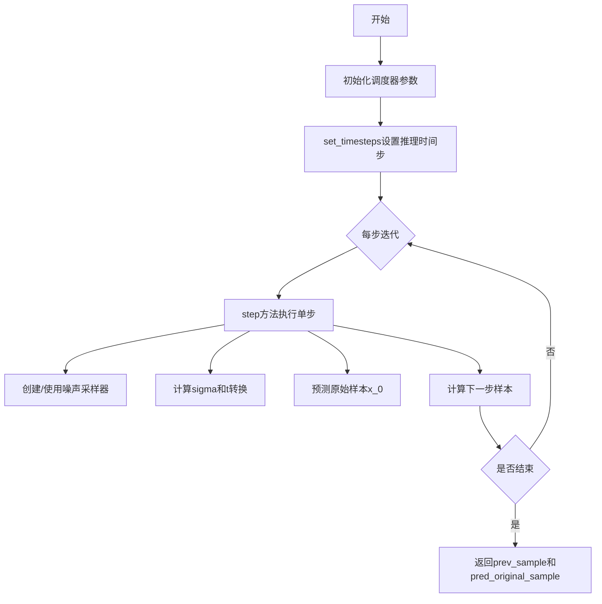
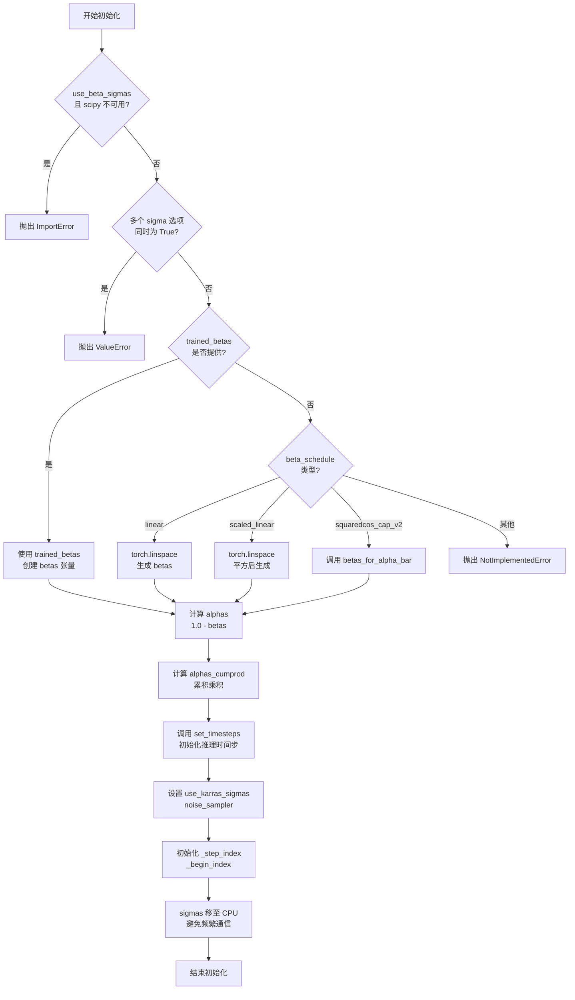
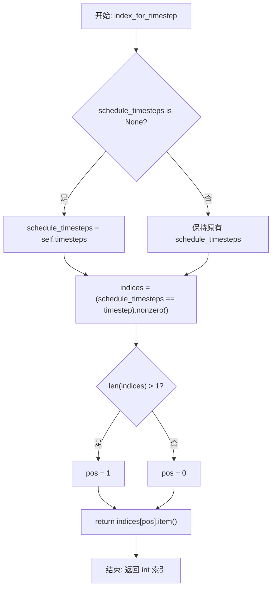
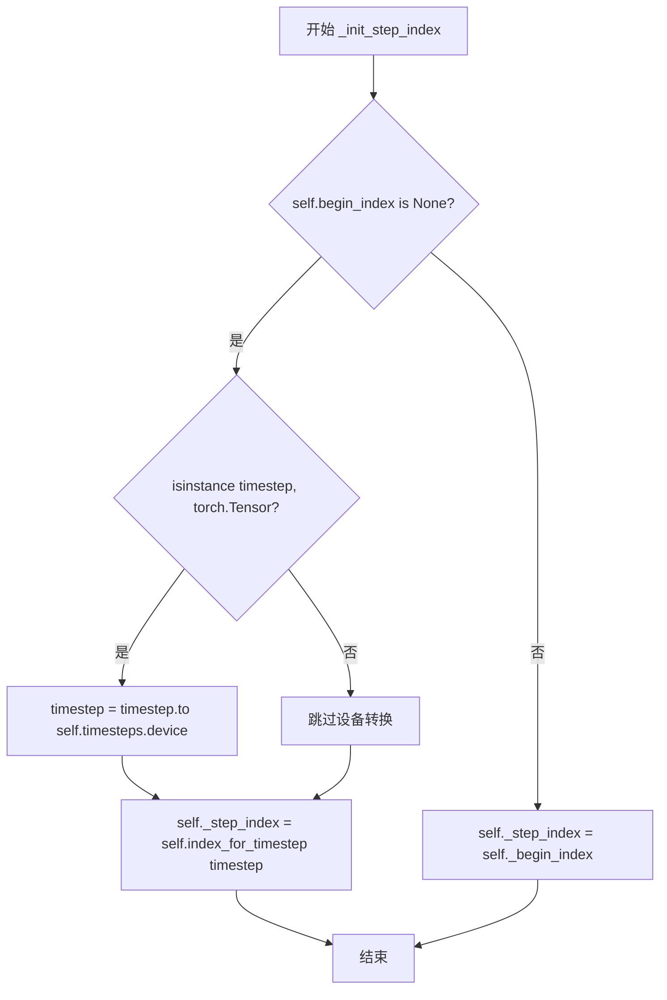
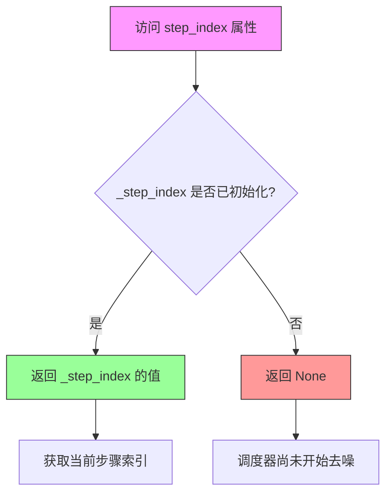
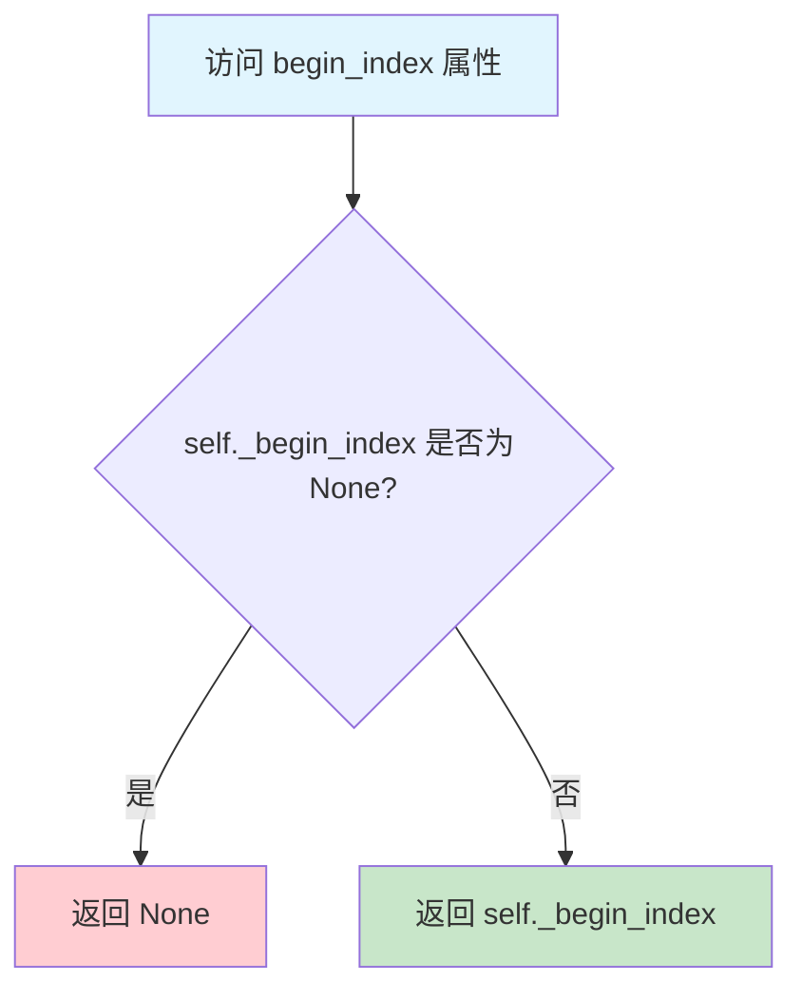
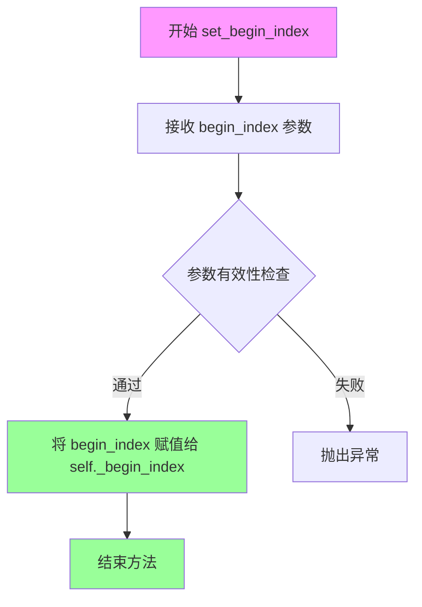
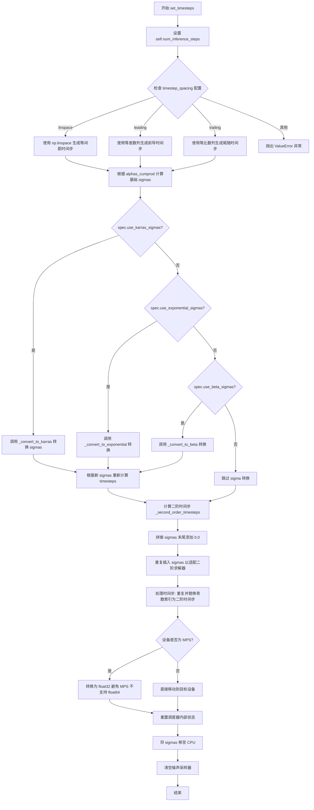
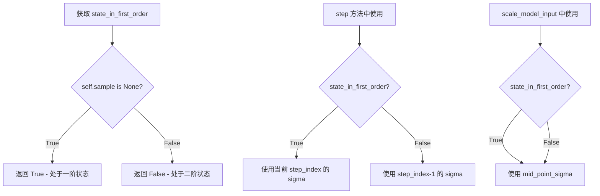

# `diffusers\src\diffusers\schedulers\scheduling_dpmsolver_sde.py` 详细设计文档

DPMSolverSDEScheduler是一个基于随机微分方程(SDE)的扩散模型采样调度器，实现了Elucidating the Design Space of Diffusion-Based Generative Models论文中的随机采样器，支持多种噪声调度策略(Karras、Exponential、Beta)和预测类型(epsilon、v_prediction)，通过布朗树噪声采样器进行噪声管理。

## 整体流程



## 类结构

```
BaseOutput (基类)
├── DPMSolverSDESchedulerOutput (数据类输出)
├── BatchedBrownianTree (布朗树批处理包装)
├── BrownianTreeNoiseSampler (噪声采样器)
└── DPMSolverSDEScheduler (主调度器类)
    ├── SchedulerMixin (混入类)
    └── ConfigMixin (配置混入类)
```

## 全局变量及字段


### `_compatibles`
    
兼容的调度器列表，存储所有可兼容的KarrasDiffusionSchedulers枚举名称

类型：`List[str]`
    


### `order`
    
调度器阶数，DPMSolverSDE使用二阶方法

类型：`int`
    


### `DPMSolverSDESchedulerOutput.prev_sample`
    
上一步计算出的样本(x_{t-1})，作为下一轮去噪循环的模型输入

类型：`torch.Tensor`
    


### `DPMSolverSDESchedulerOutput.pred_original_sample`
    
预测的原始去噪样本(x_0)，基于当前时间步的模型输出，可用于预览进度或引导

类型：`torch.Tensor | None`
    


### `BatchedBrownianTree.x`
    
用于确定形状和设备的张量，作为批处理布朗树的输入基准

类型：`torch.Tensor`
    


### `BatchedBrownianTree.t0`
    
起始时间，定义布朗Interval的起始边界

类型：`float`
    


### `BatchedBrownianTree.t1`
    
结束时间，定义布朗Interval的结束边界

类型：`float`
    


### `BatchedBrownianTree.sign`
    
时间排序符号，记录原始t0和t1的排序结果(1.0或-1.0)

类型：`float`
    


### `BatchedBrownianTree.batched`
    
是否批处理，标识是否为批量样本生成噪声

类型：`bool`
    


### `BatchedBrownianTree.trees`
    
布朗区间列表，存储每个批次的torchsde.BrownianInterval对象

类型：`List[BrownianInterval]`
    


### `BrownianTreeNoiseSampler.transform`
    
sigma转换函数，将sigma值映射到采样器的内部时间步

类型：`Callable[[float], float]`
    


### `BrownianTreeNoiseSampler.tree`
    
批处理布朗树，用于生成依赖于样本的噪声

类型：`BatchedBrownianTree`
    


### `DPMSolverSDEScheduler.betas`
    
beta值序列，扩散过程中的beta参数序列

类型：`torch.Tensor`
    


### `DPMSolverSDEScheduler.alphas`
    
alpha值序列，由1-beta计算得到的alpha参数序列

类型：`torch.Tensor`
    


### `DPMSolverSDEScheduler.alphas_cumprod`
    
累积alpha值，alpha的累积乘积用于计算信噪比

类型：`torch.Tensor`
    


### `DPMSolverSDEScheduler.sigmas`
    
sigma值序列，对应扩散过程的标准差/噪声水平

类型：`torch.Tensor`
    


### `DPMSolverSDEScheduler.timesteps`
    
时间步序列，用于去噪推理的离散时间步

类型：`torch.Tensor`
    


### `DPMSolverSDEScheduler.num_inference_steps`
    
推理步数，生成样本时使用的扩散步数

类型：`int`
    


### `DPMSolverSDEScheduler.noise_sampler`
    
噪声采样器，基于布朗树的自适应噪声采样器

类型：`BrownianTreeNoiseSampler | None`
    


### `DPMSolverSDEScheduler.noise_sampler_seed`
    
噪声采样器种子，用于复现噪声采样的随机种子

类型：`int | None`
    


### `DPMSolverSDEScheduler._step_index`
    
当前步骤索引，记录当前在时间步序列中的位置

类型：`int | None`
    


### `DPMSolverSDEScheduler._begin_index`
    
起始索引，用于流水线中设置推理起始位置

类型：`int | None`
    


### `DPMSolverSDEScheduler.sample`
    
当前样本状态，存储用于二阶步骤计算的中间样本

类型：`torch.Tensor | None`
    


### `DPMSolverSDEScheduler.mid_point_sigma`
    
中点sigma值，二阶求解器中使用的中间sigma值

类型：`torch.Tensor | None`
    


### `DPMSolverSDEScheduler.use_karras_sigmas`
    
是否使用Karras sigmas，标识是否采用Karras噪声调度策略

类型：`bool`
    
    

## 全局函数及方法


### `betas_for_alpha_bar`

该函数根据指定的 `alpha_transform_type` 创建 alpha_bar 函数，并通过对连续时间进行离散化生成 beta 调度序列。它通过计算相邻时间步的 alpha_bar 比值来确定每个时间步的 beta 值，同时确保 beta 值不超过设定的最大阈值，以避免数值不稳定。

参数：

- `num_diffusion_timesteps`：`int`，要生成的 beta 数量，即扩散时间步的总数
- `max_beta`：`float`，默认为 `0.999`，允许的最大 beta 值，用于防止数值不稳定
- `alpha_transform_type`：`Literal["cosine", "exp", "laplace"]`，默认为 `"cosine"`，alpha_bar 的噪声调度类型

返回值：`torch.Tensor`，返回调度器用于逐步处理模型输出的 beta 值序列

#### 流程图

```mermaid
flowchart TD
    A[开始 betas_for_alpha_bar] --> B{alpha_transform_type == 'cosine'?}
    B -->|Yes| C[定义 alpha_bar_fn = cos²((t+0.008)/1.008 * π/2)]
    B -->|No| D{alpha_transform_type == 'laplace'?}
    D -->|Yes| E[定义 alpha_bar_fn 使用 laplace 公式]
    D -->|No| F{alpha_transform_type == 'exp'?}
    F -->|Yes| G[定义 alpha_bar_fn = exp(t * -12.0)]
    F -->|No| H[raise ValueError]
    C --> I[初始化空列表 betas]
    E --> I
    G --> I
    I --> J[循环 i from 0 to num_diffusion_timesteps-1]
    J --> K[计算 t1 = i / num_diffusion_timesteps]
    J --> L[计算 t2 = (i + 1) / num_diffusion_timesteps]
    K --> M[计算 beta_i = 1 - alpha_bar_fn(t2) / alpha_bar_fn(t1)]
    L --> M
    M --> N[beta_i = min(beta_i, max_beta)]
    N --> O[将 beta_i 添加到 betas 列表]
    O --> P{还有更多时间步?}
    P -->|Yes| J
    P -->|No| Q[返回 torch.tensor(betas, dtype=torch.float32)]
    Q --> R[结束]
```

#### 带注释源码

```python
def betas_for_alpha_bar(
    num_diffusion_timesteps: int,
    max_beta: float = 0.999,
    alpha_transform_type: Literal["cosine", "exp", "laplace"] = "cosine",
) -> torch.Tensor:
    """
    Create a beta schedule that discretizes the given alpha_t_bar function, which defines the cumulative product of
    (1-beta) over time from t = [0,1].

    Contains a function alpha_bar that takes an argument t and transforms it to the cumulative product of (1-beta) up
    to that part of the diffusion process.

    Args:
        num_diffusion_timesteps (`int`):
            The number of betas to produce.
        max_beta (`float`, defaults to `0.999`):
            The maximum beta to use; use values lower than 1 to avoid numerical instability.
        alpha_transform_type (`str`, defaults to `"cosine"`):
            The type of noise schedule for `alpha_bar`. Choose from `cosine`, `exp`, or `laplace`.

    Returns:
        `torch.Tensor`:
            The betas used by the scheduler to step the model outputs.
    """
    # 根据 alpha_transform_type 选择并定义 alpha_bar 函数
    if alpha_transform_type == "cosine":
        # 余弦调度：使用余弦函数的平方来定义 alpha_bar
        # 这是一种常用的平滑调度方式，有助于在扩散过程中保持平衡
        def alpha_bar_fn(t):
            return math.cos((t + 0.008) / 1.008 * math.pi / 2) ** 2

    elif alpha_transform_type == "laplace":
        # 拉普拉斯调度：使用拉普拉斯分布的逆函数来定义 alpha_bar
        # 这种方式可以提供更尖锐的噪声调度
        def alpha_bar_fn(t):
            lmb = -0.5 * math.copysign(1, 0.5 - t) * math.log(1 - 2 * math.fabs(0.5 - t) + 1e-6)
            snr = math.exp(lmb)
            return math.sqrt(snr / (1 + snr))

    elif alpha_transform_type == "exp":
        # 指数调度：使用指数衰减函数来定义 alpha_bar
        # 提供快速的噪声衰减
        def alpha_bar_fn(t):
            return math.exp(t * -12.0)

    else:
        raise ValueError(f"Unsupported alpha_transform_type: {alpha_transform_type}")

    # 初始化 beta 列表
    betas = []
    # 遍历每个扩散时间步，计算对应的 beta 值
    for i in range(num_diffusion_timesteps):
        # 计算当前时间步和下一个时间步的归一化时间值 [0, 1]
        t1 = i / num_diffusion_timesteps
        t2 = (i + 1) / num_diffusion_timesteps
        
        # 通过 alpha_bar 函数计算 beta：
        # beta = 1 - alpha_bar(t+1) / alpha_bar(t)
        # 这是通过离散化连续 alpha_bar 函数来推导 beta 的标准方法
        betas.append(min(1 - alpha_bar_fn(t2) / alpha_bar_fn(t1), max_beta))
    
    # 将 beta 列表转换为 PyTorch float32 张量返回
    return torch.tensor(betas, dtype=torch.float32)
```


### `BatchedBrownianTree.sort`

该静态方法接收两个浮点数参数，按升序排列后返回排序后的两个值以及一个符号标记（1.0 表示未交换，-1.0 表示交换过）。此方法用于确保时间区间的一致性，便于后续布朗树计算的符号处理。

参数：

- `a`：`float`，第一个待排序的浮点数值
- `b`：`float`，第二个待排序的浮点数值

返回值：`Tuple[float, float, float]`，返回包含最小值、最大值和符号标记的三元组；若 `a < b` 则返回 `(a, b, 1.0)`，否则返回 `(b, a, -1.0)`

#### 流程图

```mermaid
flowchart TD
    A[开始 sort 方法] --> B{a < b?}
    B -->|是| C[返回 (a, b, 1.0)]
    B -->|否| D[返回 (b, a, -1.0)]
    C --> E[结束]
    D --> E
```

#### 带注释源码

```python
@staticmethod
def sort(a: float, b: float) -> Tuple[float, float, float]:
    """
    Sorts two float values and returns them along with a sign indicating if they were swapped.

    Args:
        a (`float`):
            The first value.
        b (`float`):
            The second value.

    Returns:
        `Tuple[float, float, float]`:
            A tuple containing the sorted values (min, max) and a sign (1.0 if a < b, -1.0 otherwise).
    """
    # 如果 a 小于 b，保持原顺序并返回正符号 1.0
    # 否则交换顺序并返回负符号 -1.0
    return (a, b, 1.0) if a < b else (b, a, -1.0)
```


### `BatchedBrownianTree.__call__`

获取给定时间范围内的噪声样本。

参数：

- `t0`：`float`，起始时间点
- `t1`：`float`，结束时间点

返回值：`torch.Tensor`，从布朗Interval树中采样的噪声张量，形状为 `(batch_size, ...)` 如果 `batched=True`，否则为单样本张量

#### 流程图

```mermaid
flowchart TD
    A[__call__ t0, t1] --> B[调用 sort 方法排序 t0 和 t1]
    B --> C[获取排序后的 t0, t1 和 sign]
    D[遍历 self.trees 列表] --> E[对每个 tree 调用 tree(t0, t1) 获取噪声]
    E --> F[使用 torch.stack 将所有噪声堆叠成张量]
    F --> G[乘以 self.sign * sign 进行符号校正]
    G --> H{batched 是否为 True?}
    H -->|True| I[返回完整张量 w]
    H -->|False| J[返回 w[0] 即第一个元素]
```

#### 带注释源码

```python
def __call__(self, t0: float, t1: float) -> torch.Tensor:
    """
    获取给定时间范围内的噪声样本。
    
    Args:
        t0: 起始时间点
        t1: 结束时间点
    
    Returns:
        从布朗Interval树中采样的噪声张量
    """
    # 对 t0 和 t1 进行排序，确保 t0 <= t1，并获取排序符号
    t0, t1, sign = self.sort(t0, t1)
    
    # 遍历所有布朗Interval树，对每个树在 [t0, t1] 范围内采样噪声
    # 并使用 torch.stack 将所有采样结果堆叠成一个张量
    w = torch.stack([tree(t0, t1) for tree in self.trees]) * (self.sign * sign)
    
    # 如果是批处理模式，返回完整张量；否则返回第一个元素（单样本情况）
    return w if self.batched else w[0]
```


### `BrownianTreeNoiseSampler.__call__`

该方法是布朗夫噪声采样器的调用接口，接收当前和下一步的sigma值，将其转换为内部时间步后查询布朗夫树获取噪声样本，并除以时间步差值的平方根进行缩放，以满足扩散模型的噪声采样需求。

参数：

- `sigma`：`float`，当前扩散时间步的sigma值（噪声水平）
- `sigma_next`：`float`，下一步的sigma值（目标噪声水平）

返回值：`torch.Tensor`，经过缩放的噪声样本张量，形状与输入张量相同

#### 流程图

```mermaid
flowchart TD
    A[开始: __call__] --> B[接收sigma和sigma_next]
    B --> C{transform函数转换}
    C --> D["t0 = transform(sigma)"]
    C --> E["t1 = transform(sigma_next)"]
    D --> F[调用self.tree获取噪声]
    E --> F
    F --> G[计算缩放因子: sqrt/abs(t1 - t0)]
    G --> H[返回 noise / scale]
    H --> I[结束]
    
    style A fill:#e1f5fe
    style I fill:#e1f5fe
    style F fill:#fff3e0
    style G fill:#fff3e0
```

#### 带注释源码

```python
def __call__(self, sigma: float, sigma_next: float) -> torch.Tensor:
    """
    获取噪声样本，用于扩散模型的去噪过程。
    
    该方法将sigma值转换为内部时间步表示，查询布朗夫树获取噪声，
    并根据时间步间隔进行缩放以确保正确的噪声分布。
    
    Args:
        sigma: 当前时间步的sigma值（噪声水平）
        sigma_next: 下一个时间步的sigma值
    
    Returns:
        缩放后的噪声样本张量，形状与构造时传入的x张量相同
    """
    # 使用transform函数将sigma值转换为内部时间步表示
    # transform函数可以是恒等映射或对数变换等，取决于扩散模型的具体实现
    t0, t1 = self.transform(torch.as_tensor(sigma)), self.transform(torch.as_tensor(sigma_next))
    
    # 调用BatchedBrownianTree获取噪声样本
    # BatchedBrownianTree内部维护多个布朗夫树（批处理模式）或单个树（单样本模式）
    # tree(t0, t1)返回从时间t0到t1的布朗运动增量
    noise = self.tree(t0, t1)
    
    # 计算缩放因子：时间步间隔的绝对值的平方根
    # 这是因为布朗运动的方差与时间间隔成正比，需要按sqrt(Δt)缩放
    # 以确保噪声的方差与扩散过程的随机性要求一致
    scale = (t1 - t0).abs().sqrt()
    
    # 返回缩放后的噪声样本
    return noise / scale
```


### `DPMSolverSDEScheduler.__init__`

初始化 DPMSolverSDEScheduler 调度器，用于实现基于 SDE 的扩散模型采样方法。该方法根据配置的 beta 调度方案计算噪声调度参数，并初始化推理所需的时间步和噪声采样器。

参数：

- `num_train_timesteps`：`int`，训练时的扩散步数，默认为 1000
- `beta_start`：`float`，Beta 调度起始值，默认为 0.00085
- `beta_end`：`float`，Beta 调度结束值，默认为 0.012
- `beta_schedule`：`Literal["linear", "scaled_linear", "squaredcos_cap_v2"]`，Beta 调度策略，默认为 "linear"
- `trarained_betas`：`np.ndarray | list[float] | None`，直接传入的 beta 值数组，默认为 None
- `prediction_type`：`Literal["epsilon", "sample", "v_prediction"]`，预测类型，默认为 "epsilon"
- `use_karras_sigmas`：`bool`，是否使用 Karras sigmas，默认为 False
- `use_exponential_sigmas`：`bool`，是否使用指数 sigmas，默认为 False
- `use_beta_sigmas`：`bool`，是否使用 beta sigmas，默认为 False
- `noise_sampler_seed`：`int | None`，噪声采样器随机种子，默认为 None
- `timestep_spacing`：`Literal["linspace", "leading", "trailing"]`，时间步间隔策略，默认为 "linspace"
- `steps_offset`：`int`，推理步数偏移量，默认为 0

返回值：`None`，初始化后的调度器对象

#### 流程图



#### 带注释源码

```python
@register_to_config
def __init__(
    self,
    num_train_timesteps: int = 1000,
    beta_start: float = 0.00085,  # sensible defaults
    beta_end: float = 0.012,
    beta_schedule: Literal["linear", "scaled_linear", "squaredcos_cap_v2"] = "linear",
    trained_betas: np.ndarray | list[float] | None = None,
    prediction_type: Literal["epsilon", "sample", "v_prediction"] = "epsilon",
    use_karras_sigmas: bool = False,
    use_exponential_sigmas: bool = False,
    use_beta_sigmas: bool = False,
    noise_sampler_seed: int | None = None,
    timestep_spacing: Literal["linspace", "leading", "trailing"] = "linspace",
    steps_offset: int = 0,
):
    # 检查 beta sigmas 依赖：需要 scipy 库
    if self.config.use_beta_sigmas and not is_scipy_available():
        raise ImportError("Make sure to install scipy if you want to use beta sigmas.")
    
    # 检查互斥配置：只能选择一种 sigma 计算方式
    if (
        sum(
            [
                self.config.use_beta_sigmas,
                self.config.use_exponential_sigmas,
                self.config.use_karras_sigmas,
            ]
        )
        > 1
    ):
        raise ValueError(
            "Only one of `config.use_beta_sigmas`, `config.use_exponential_sigmas`, `config.use_karras_sigmas` can be used."
        )
    
    # 根据配置计算 betas（噪声调度参数）
    if trained_betas is not None:
        # 直接使用传入的 betas 数组
        self.betas = torch.tensor(trained_betas, dtype=torch.float32)
    elif beta_schedule == "linear":
        # 线性调度：从 beta_start 线性插值到 beta_end
        self.betas = torch.linspace(beta_start, beta_end, num_train_timesteps, dtype=torch.float32)
    elif beta_schedule == "scaled_linear":
        # 缩放线性调度：适用于 latent diffusion model
        self.betas = (
            torch.linspace(
                beta_start**0.5,
                beta_end**0.5,
                num_train_timesteps,
                dtype=torch.float32,
            )
            ** 2
        )
    elif beta_schedule == "squaredcos_cap_v2":
        # Glide cosine 调度：使用 alpha_bar 函数生成 betas
        self.betas = betas_for_alpha_bar(num_train_timesteps)
    else:
        raise NotImplementedError(f"{beta_schedule} is not implemented for {self.__class__}")

    # 计算 alpha 值（1 - beta）和累积乘积
    self.alphas = 1.0 - self.betas
    self.alphas_cumprod = torch.cumprod(self.alphas, dim=0)

    # 设置推理时间步（初始化调度器的核心步骤）
    self.set_timesteps(num_train_timesteps, None, num_train_timesteps)
    
    # 保存配置选项
    self.use_karras_sigmas = use_karras_sigmas
    self.noise_sampler = None  # 延迟初始化噪声采样器
    self.noise_sampler_seed = noise_sampler_seed
    self._step_index = None  # 当前步索引
    self._begin_index = None  # 起始索引
    
    # 将 sigmas 移至 CPU 避免频繁的 GPU/CPU 通信
    self.sigmas = self.sigmas.to("cpu")
```


### `DPMSolverSDEScheduler.index_for_timestep`

在扩散调度器中，根据给定的时间步（timestep）在时间步调度序列（schedule_timesteps）中查找对应的索引位置。该方法特别处理了从调度中间开始的情况，确保在图像到图像等场景下不会意外跳过sigma值。

参数：

- `self`：类实例本身
- `timestep`：`float | torch.Tensor`，要查找的时间步值，可以是单个浮点数或张量
- `schedule_timesteps`：`torch.Tensor | None`，可选参数，要搜索的时间步调度序列。如果为 `None`，则使用 `self.timesteps`

返回值：`int`，时间步在调度序列中的索引位置。对于第一步，如果存在多个匹配项，则返回第二个索引（如果只有一个匹配项则返回第一个索引），以避免在从调度中间开始时意外跳过sigma值

#### 流程图



#### 带注释源码

```python
def index_for_timestep(
    self, timestep: float | torch.Tensor, schedule_timesteps: torch.Tensor | None = None
) -> int:
    """
    Find the index of a given timestep in the timestep schedule.

    Args:
        timestep (`float` or `torch.Tensor`):
            The timestep value to find in the schedule.
        schedule_timesteps (`torch.Tensor`, *optional*):
            The timestep schedule to search in. If `None`, uses `self.timesteps`.

    Returns:
        `int`:
            The index of the timestep in the schedule. For the very first step, returns the second index if
            multiple matches exist to avoid skipping a sigma when starting mid-schedule (e.g., for image-to-image).
    """
    # 如果未提供 schedule_timesteps，则使用默认的 self.timesteps
    if schedule_timesteps is None:
        schedule_timesteps = self.timesteps

    # 使用 nonzero() 查找与给定 timestep 匹配的所有索引位置
    # 这会返回一个二维张量，每行是一个匹配项的索引
    indices = (schedule_timesteps == timestep).nonzero()

    # The sigma index that is taken for the **very** first `step`
    # is always the second index (or the last index if there is only 1)
    # This way we can ensure we don't accidentally skip a sigma in
    # case we start in the middle of the denoising schedule (e.g. for image-to-image)
    # 如果存在多个匹配项（通常在二阶调度器中会出现），选择第二个索引
    # 这样可以确保在从调度中间开始时不会跳过 sigma 值
    pos = 1 if len(indices) > 1 else 0

    # 将选定的索引转换为 Python 标量并返回
    return indices[pos].item()
```


### `DPMSolverSDEScheduler._init_step_index`

该方法用于根据给定的时间步（timestep）初始化调度器的步骤索引（step_index）。它首先检查是否已经设置了起始索引（begin_index），如果没有，则将时间步转换到正确的设备上，然后通过调用 `index_for_timestep` 方法来计算当前的步骤索引；如果已设置起始索引，则直接使用该值作为当前步骤索引。

参数：

- `timestep`：`float | torch.Tensor`，当前的时间步，用于初始化步骤索引

返回值：`None`，该方法不返回任何值，仅初始化内部状态 `_step_index`

#### 流程图



#### 带注释源码

```python
def _init_step_index(self, timestep: float | torch.Tensor) -> None:
    """
    Initialize the step index for the scheduler based on the given timestep.

    Args:
        timestep (`float` or `torch.Tensor`):
            The current timestep to initialize the step index from.
    """
    # 检查是否已经设置了起始索引（begin_index）
    if self.begin_index is None:
        # 如果 timestep 是 torch.Tensor 类型，确保它与 self.timesteps 在同一设备上
        if isinstance(timestep, torch.Tensor):
            timestep = timestep.to(self.timesteps.device)
        
        # 通过调用 index_for_timestep 方法计算当前时间步在调度计划中的索引
        self._step_index = self.index_for_timestep(timestep)
    else:
        # 如果已经设置了起始索引（用于某些特殊场景如图像到图像的推理），
        # 直接使用预定义的起始索引作为当前步骤索引
        self._step_index = self._begin_index
```


### `DPMSolverSDEScheduler.init_noise_sigma`

该属性用于获取扩散模型在推理开始时的初始噪声标准差（sigma）。它根据时间步间隔配置（timestep_spacing）采用不同的计算策略：当使用"linspace"或"trailing"时间步间隔时，直接返回sigma序列的最大值；否则使用公式计算与信号方差相关的噪声标准差。

参数：

- `self`：`DPMSolverSDEScheduler`，隐式参数，调度器实例本身

返回值：`torch.Tensor`，初始噪声分布的标准差，用于在推理开始时对输入样本进行噪声化

#### 流程图

```mermaid
flowchart TD
    A[开始] --> B{self.config.timestep_spacing<br/>in ['linspace', 'trailing']?}
    B -->|Yes| C[返回 self.sigmas.max]
    B -->|No| D[返回 (self.sigmas.max() ** 2 + 1) ** 0.5]
    C --> E[结束]
    D --> E
```

#### 带注释源码

```python
@property
def init_noise_sigma(self) -> torch.Tensor:
    """
    获取初始噪声标准差（sigma）。
    
    根据扩散模型的设计，初始噪声的标准差决定了推理开始时
    添加到干净样本上的噪声强度。该属性根据配置的时间步间隔
    策略采用不同的计算方式。
    """
    # 初始噪声分布的标准差
    # 当使用linspace或trailing时间步间隔时，直接返回sigma序列的最大值
    # 这是因为这些间隔方式下，sigma_max已经包含了正确的噪声水平
    if self.config.timestep_spacing in ["linspace", "trailing"]:
        return self.sigmas.max()

    # 对于其他时间步间隔（如leading），使用以下公式计算：
    # sqrt(sigma_max^2 + 1)
    # 这是基于扩散过程从x_0到x_t的缩放变换：
    # x_t = x_0 * sqrt(alpha_cumprod_t) + noise * sqrt(1 - alpha_cumprod_t)
    # 当alpha_cumprod很小时，sqrt(1 - alpha_cumprod) ≈ sqrt(1) = 1
    # 因此噪声标准差近似为sqrt(sigma_max^2 + 1)
    return (self.sigmas.max() ** 2 + 1) ** 0.5
```


### `DPMSolverSDEScheduler.step_index` (property)

该属性用于获取调度器在去噪过程中的当前步骤索引。每次调用 `step()` 方法后，该索引会自动增加 1。如果尚未初始化（例如在第一次调用 `step()` 之前），则返回 `None`。

参数：

- （无参数，除了隐式的 `self`）

返回值：`Union[int, None]`，返回当前的时间步索引，如果尚未初始化则返回 `None`

#### 流程图



#### 带注释源码

```python
@property
def step_index(self) -> Union[int, None]:
    """
    The index counter for current timestep. It will increase 1 after each scheduler step.
    """
    # 返回内部维护的 _step_index 变量
    # 该变量在 _init_step_index 方法中被初始化
    # 在每次 step() 方法执行结束后自动递增
    return self._step_index
```


### `DPMSolverSDEScheduler.begin_index`

这是一个只读属性，用于获取调度器的起始索引（begin_index）。该索引表示扩散采样过程中的第一个时间步索引，通常在流水线（pipeline）中通过 `set_begin_index` 方法进行设置。当 `begin_index` 被设置后，调度器将从此索引开始执行去噪步骤，而不是从时间步序列的起始位置开始。

参数：无需参数（`self` 为隐式参数）

返回值：`Union[int, None]`，返回调度器的起始索引。如果未设置，则返回 `None`。

#### 流程图



#### 带注释源码

```python
@property
def begin_index(self) -> Union[int, None]:
    """
    The index for the first timestep. It should be set from pipeline with `set_begin_index` method.
    """
    return self._begin_index
```

**源码解析：**

- `@property` 装饰器：将 `begin_index` 方法转换为只读属性，使其可以通过 `scheduler.begin_index` 的方式访问，而不需要调用方法。
- `self._begin_index`：类内部的私有属性，用于存储起始索引值。该值通过 `set_begin_index` 方法进行设置。
- 返回类型 `Union[int, None]`：表示返回值可以是整数（有效的索引）或 `None`（未设置时的默认值）。
- 文档字符串：说明该属性的作用是获取第一个时间步的索引，并提示应通过流水线的 `set_begin_index` 方法进行设置。


### `DPMSolverSDEScheduler.set_begin_index`

设置调度器的起始索引。该方法应在推理前从 pipeline 调用，用于指定从哪个时间步开始进行去噪操作。

参数：

-  `begin_index`：`int`，默认值 `0`，调度器的起始索引，用于控制从哪个时间步开始推理。

返回值：`None`，无返回值，仅修改对象内部状态。

#### 流程图



#### 带注释源码

```python
def set_begin_index(self, begin_index: int = 0) -> None:
    """
    设置调度器的起始索引。此方法应在推理前通过 pipeline 调用。
    
    Args:
        begin_index (int, optional): 调度器的起始索引，默认为 0。
            用于控制从哪个时间步开始执行去噪过程。
    """
    # 将传入的 begin_index 参数直接赋值给实例变量 _begin_index
    # 该变量会在 _init_step_index 方法中被使用
    # 当 begin_index 不为 None 时，step_index 将被设置为 begin_index
    # 这允许从特定的中途时间步开始采样（如 image-to-image 任务）
    self._begin_index = begin_index
```


### `DPMSolverSDEScheduler.scale_model_input`

该方法根据当前时间步动态缩放去噪模型的输入样本，确保与其他需要根据时间步调整输入的调度器的互操作性。它通过获取当前时间步对应的sigma值，并使用公式 `sample / sqrt(sigma^2 + 1)` 对输入进行缩放，以适配扩散模型的噪声预测。

参数：

- `self`：`DPMSolverSDEScheduler` 实例，调度器对象本身
- `sample`：`torch.Tensor`，输入的样本张量，通常是带噪声的图像或潜在表示
- `timestep`：`float | torch.Tensor`，扩散链中的当前时间步，用于确定缩放因子

返回值：`torch.Tensor`，缩放后的输入样本

#### 流程图

```mermaid
flowchart TD
    A[开始 scale_model_input] --> B{step_index 是否为 None?}
    B -->|是| C[调用 _init_step_index 初始化 step_index]
    B -->|否| D[继续执行]
    C --> D
    D --> E[获取当前 step_index 对应的 sigma 值]
    E --> F{当前状态是否为第一阶?}
    F -->|是| G[sigma_input = sigma]
    F -->|否| H[sigma_input = mid_point_sigma]
    G --> I[计算缩放因子: sqrt(sigma_input^2 + 1)]
    H --> I
    I --> J[sample = sample / 缩放因子]
    J --> K[返回缩放后的 sample]
```

#### 带注释源码

```python
def scale_model_input(
    self,
    sample: torch.Tensor,
    timestep: float | torch.Tensor,
) -> torch.Tensor:
    """
    确保与需要根据当前时间步缩放去噪模型输入的调度器之间的互操作性。

    Args:
        sample (`torch.Tensor`):
            输入样本。
        timestep (`int`, *optional*):
            扩散链中的当前时间步。

    Returns:
        `torch.Tensor`:
            缩放后的输入样本。
    """
    # 如果 step_index 尚未初始化，则根据当前 timestep 初始化它
    # 这确保了在第一次调用时能够正确获取 sigma 值
    if self.step_index is None:
        self._init_step_index(timestep)

    # 获取当前时间步对应的 sigma 值（噪声标准差）
    sigma = self.sigmas[self.step_index]
    
    # 确定用于缩放的 sigma_input：
    # - 如果处于第一阶状态（首次迭代），使用当前的 sigma
    # - 如果处于二阶状态（中间步骤），使用中点 sigma 以保持一致性
    sigma_input = sigma if self.state_in_first_order else self.mid_point_sigma
    
    # 根据扩散模型的 v-prediction 或噪声预测公式进行缩放
    # 公式来源：x = (x - sigma * epsilon) / sqrt(sigma^2 + 1)
    # 这确保了输入样本被正确地归一化到与模型预测相同的尺度
    sample = sample / ((sigma_input**2 + 1) ** 0.5)
    
    # 返回缩放后的样本，可直接用于模型的去噪预测
    return sample
```


### `DPMSolverSDEScheduler.set_timesteps`

设置离散时间步，用于扩散链（在推理前运行）。该方法根据配置的 `timestep_spacing` 策略生成推理时的时间步序列，并计算相应的 sigma 值，同时处理二阶求解器所需的时间步扩展。

参数：

- `num_inference_steps`：`int`，生成样本时使用的扩散推理步数
- `device`：`str | torch.device`，时间步要移动到的目标设备。如果为 `None`，则不移动
- `num_train_timesteps`：`int | None`，训练时的时间步总数。如果为 `None`，则使用配置中的默认值

返回值：`None`，该方法直接修改调度器的内部状态

#### 流程图



#### 带注释源码

```python
def set_timesteps(
    self,
    num_inference_steps: int,
    device: str | torch.device = None,
    num_train_timesteps: int | None = None,
) -> None:
    """
    设置用于扩散链的离散时间步（在推理前运行）。

    参数:
        num_inference_steps (int):
            使用预训练模型生成样本时使用的扩散步数。
        device (str 或 torch.device, 可选):
            时间步要移动到的设备。如果为 None，则不移动时间步。
        num_train_timesteps (int, 可选):
            训练时间步数。如果为 None，则使用 self.config.num_train_timesteps。
    """
    # 保存推理步数
    self.num_inference_steps = num_inference_steps

    # 如果未指定训练时间步数，则使用配置中的默认值
    num_train_timesteps = num_train_timesteps or self.config.num_train_timesteps

    # 根据 timestep_spacing 策略生成时间步序列
    # "linspace", "leading", "trailing" 对应表 2 中的注释
    if self.config.timestep_spacing == "linspace":
        # 等间距策略：从 num_train_timesteps-1 到 0
        timesteps = np.linspace(0, num_train_timesteps - 1, num_inference_steps, dtype=float)[::-1].copy()
    elif self.config.timestep_spacing == "leading":
        # 前导策略：创建整数时间步，通过乘以比例并取整
        step_ratio = num_train_timesteps // self.num_inference_steps
        timesteps = (np.arange(0, num_inference_steps) * step_ratio).round()[::-1].copy().astype(float)
        timesteps += self.config.steps_offset  # 添加偏移量
    elif self.config.timestep_spacing == "trailing":
        # 尾随策略：从 num_train_timesteps 向下到 0
        step_ratio = num_train_timesteps / self.num_inference_steps
        timesteps = (np.arange(num_train_timesteps, 0, -step_ratio)).round().copy().astype(float)
        timesteps -= 1
    else:
        raise ValueError(
            f"{self.config.timestep_spacing} 不支持。请选择 'linspace', 'leading' 或 'trailing'。"
        )

    # 根据累积 alpha 产品计算基础 sigma 值
    # sigma = sqrt((1 - alphas_cumprod) / alphas_cumprod)
    sigmas = np.array(((1 - self.alphas_cumprod) / self.alphas_cumprod) ** 0.5)
    log_sigmas = np.log(sigmas)  # 预计算对数 sigma 以提高效率
    
    # 将 sigma 插值到生成的时间步位置
    sigmas = np.interp(timesteps, np.arange(0, len(sigmas)), sigmas)

    # 根据配置选择不同的 sigma 转换策略
    if self.config.use_karras_sigmas:
        # 使用 Karras 噪声调度（来自 Elucidating the Design Space 论文）
        sigmas = self._convert_to_karras(in_sigmas=sigmas)
        # 根据转换后的 sigma 重新计算时间步
        timesteps = np.array([self._sigma_to_t(sigma, log_sigmas) for sigma in sigmas])
    elif self.config.use_exponential_sigmas:
        # 使用指数噪声调度
        sigmas = self._convert_to_exponential(in_sigmas=sigmas, num_inference_steps=num_inference_steps)
        timesteps = np.array([self._sigma_to_t(sigma, log_sigmas) for sigma in sigmas])
    elif self.config.use_beta_sigmas:
        # 使用 Beta 分布噪声调度（来自 Beta Sampling is All You Need 论文）
        sigmas = self._convert_to_beta(in_sigmas=sigmas, num_inference_steps=num_inference_steps)
        timesteps = np.array([self._sigma_to_t(sigma, log_sigmas) for sigma in sigmas])

    # 计算二阶求解器所需的中点时间步
    second_order_timesteps = self._second_order_timesteps(sigmas, log_sigmas)

    # 处理 sigma 数组：末尾添加 0.0 表示最终无噪声状态
    sigmas = np.concatenate([sigmas, [0.0]]).astype(np.float32)
    sigmas = torch.from_numpy(sigmas).to(device=device)
    
    # 重复 sigma 以适配二阶求解器（每步需要两个 sigma 值）
    # 格式：[sigma_0, sigma_1, sigma_1, sigma_2, sigma_2, ..., sigma_n, 0]
    self.sigmas = torch.cat([sigmas[:1], sigmas[1:-1].repeat_interleave(2), sigmas[-1:]])

    # 同样处理时间步数组
    timesteps = torch.from_numpy(timesteps)
    second_order_timesteps = torch.from_numpy(second_order_timesteps)
    timesteps = torch.cat([timesteps[:1], timesteps[1:].repeat_interleave(2)])
    # 将奇数位置替换为二阶时间步
    timesteps[1::2] = second_order_timesteps

    # 处理 MPS 设备不支持 float64 的问题
    if str(device).startswith("mps"):
        self.timesteps = timesteps.to(device, dtype=torch.float32)
    else:
        self.timesteps = timesteps.to(device=device)

    # 重置求解器内部状态
    self.sample = None           # 清空上一步样本
    self.mid_point_sigma = None # 清空中点 sigma
    
    self._step_index = None      # 重置步进索引
    self._begin_index = None    # 重置起始索引
    self.sigmas = self.sigmas.to("cpu")  # 将 sigma 移至 CPU 以减少 CPU/GPU 通信
    self.noise_sampler = None   # 清空噪声采样器（将在首次 step 时重新创建）
```


### `DPMSolverSDEScheduler._second_order_timesteps`

该方法用于计算 DPMSolverSDEScheduler 的二阶时间步，通过在相邻 sigma 值之间进行中点插值来生成用于二阶求解器的时间步序列。这是实现多步 DPM-Solver 中二阶步骤的关键方法。

参数：

- `self`：DPMSolverSDEScheduler 实例本身
- `sigmas`：`np.ndarray`，噪声调度中的 sigma 值数组，表示扩散过程中的噪声标准差
- `log_sigmas`：`np.ndarray`，sigma 值的自然对数数组，用于时间步的插值计算

返回值：`np.ndarray`，返回计算出的二阶时间步数组

#### 流程图

```mermaid
flowchart TD
    A[开始 _second_order_timesteps] --> B[定义 sigma_fn: t -> exp(-t)]
    B --> C[定义 t_fn: sigma -> -log(sigma)]
    C --> D[设置中点比例 midpoint_ratio = 0.5]
    D --> E[将 sigmas 转换为时间 t = t_fn(sigmas)]
    E --> F[计算相邻时间步的差值 delta_time = np.diff(t)]
    F --> G[计算中点时间 t_proposed = t[:-1] + delta_time * 0.5]
    G --> H[将中点时间转换为中点 sigma: sig_proposed = sigma_fn(t_proposed)]
    H --> I[遍历 sig_proposed, 调用 _sigma_to_t 转换为时间步]
    I --> J[将结果封装为 numpy 数组]
    J --> K[返回二阶时间步数组]
```

#### 带注释源码

```python
def _second_order_timesteps(self, sigmas: np.ndarray, log_sigmas: np.ndarray) -> np.ndarray:
    """
    计算二阶时间步，用于 DPM-Solver 的二阶求解器。
    
    该方法通过在相邻 sigma 值之间进行中点插值来生成二阶时间步。
    二阶求解器需要在每个主要时间步之间插入一个中点时间步以提高精度。
    
    Args:
        sigmas: 噪声调度中的 sigma 值数组
        log_sigmas: sigma 值的对数，用于时间步插值
    
    Returns:
        二阶时间步数组
    """
    
    # 定义 sigma -> t 的转换函数: t = -log(sigma)
    # 这是因为在扩散模型中，sigma 和 t 通常通过对数关系关联
    def sigma_fn(_t):
        return np.exp(-_t)
    
    # 定义 t -> sigma 的转换函数: sigma = exp(-t)
    # 这是上述转换的逆函数
    def t_fn(_sigma):
        return -np.log(_sigma)
    
    # 中点比例设为 0.5，表示在相邻两步的正中间
    midpoint_ratio = 0.5
    
    # 将 sigma 值转换为对应的时间步 t
    # 例如：sigma=1.0 -> t=0, sigma=0.5 -> t≈0.693, sigma=0.1 -> t≈2.302
    t = t_fn(sigmas)
    
    # 计算相邻时间步之间的时间差
    # np.diff 会产生比原数组少一个元素的差分数组
    # 例如: [0, 0.5, 1.0] -> [0.5, 0.5]
    delta_time = np.diff(t)
    
    # 计算中点时间步：在每个相邻时间步之间插入中点
    # t[:-1] 取得除最后一个外的所有时间步
    # 加上 delta_time * midpoint_ratio (即 half) 得到中点
    t_proposed = t[:-1] + delta_time * midpoint_ratio
    
    # 将中点时间步转换回 sigma 值
    # 这些是用于二阶求解器的中间 sigma 值
    sig_proposed = sigma_fn(t_proposed)
    
    # 将每个中点 sigma 转换为对应的时间步索引
    # 调用 _sigma_to_t 方法进行插值计算
    # _sigma_to_t 需要 log_sigmas 用于查找相邻的 sigma 区间
    timesteps = np.array([self._sigma_to_t(sigma, log_sigmas) for sigma in sig_proposed])
    
    # 返回计算出的二阶时间步数组
    return timesteps
```


### `DPMSolverSDEScheduler._sigma_to_t`

该方法通过线性插值将 sigma 值（噪声水平）转换为对应的时间步（timestep）。它利用预计算的 log_sigmas 查找表，在 sigma 对数空间中定位相邻的两个点，计算插值权重，并最终映射到时间步索引。

参数：

- `self`：`DPMSolverSDEScheduler`，调度器实例自身
- `sigma`：`np.ndarray`，要转换的 sigma 值（噪声水平），可以是标量或数组
- `log_sigmas`：`np.ndarray`，sigma 值的对数数组（log(sigma)），用于插值查找

返回值：`np.ndarray`，转换后对应的时间步索引值，形状与输入 sigma 相同

#### 流程图

```mermaid
flowchart TD
    A[开始: _sigma_to_t] --> B[计算 log_sigma<br/>log_sigma = np.lognp.maximumsigma, 1e-10]
    B --> C[计算距离矩阵<br/>dists = log_sigma - log_sigmas<br/>[:, np.newaxis]]
    C --> D[查找低索引 low_idx<br/>使用 cumsum 和 argmax<br/>找到第一个dist≥0的位置]
    D --> E[计算高索引<br/>high_idx = low_idx + 1]
    E --> F[获取边界值<br/>low = log_sigmas[low_idx]<br/>high = log_sigmas[high_idx]]
    F --> G[计算插值权重 w<br/>w = (low - log_sigma) / (low - high)<br/>w = np.clip(w, 0, 1)]
    G --> H[转换到时间步<br/>t = (1-w)×low_idx + w×high_idx]
    H --> I[reshape并返回<br/>t = t.reshape(sigma.shape)]
    I --> J[结束: 返回时间步 t]
```

#### 带注释源码

```python
def _sigma_to_t(self, sigma: np.ndarray, log_sigmas: np.ndarray) -> np.ndarray:
    """
    Convert sigma values to corresponding timestep values through interpolation.

    Args:
        sigma (`np.ndarray`):
            The sigma value(s) to convert to timestep(s).
        log_sigmas (`np.ndarray`):
            The logarithm of the sigma schedule used for interpolation.

    Returns:
        `np.ndarray`:
            The interpolated timestep value(s) corresponding to the input sigma(s).
    """
    # get log sigma: 计算输入 sigma 的对数，使用 1e-10 防止 log(0)
    log_sigma = np.log(np.maximum(sigma, 1e-10))

    # get distribution: 计算 log_sigma 与 log_sigmas 数组中每个元素之间的距离
    # 结果形状: (len(log_sigmas), len(sigma))
    dists = log_sigma - log_sigmas[:, np.newaxis]

    # get sigmas range: 使用 cumsum 和 argmax 找到第一个 dist >= 0 的索引
    # 即找到 log_sigma 在 log_sigmas 中的下界索引
    # clip 确保索引不超出范围
    low_idx = np.cumsum((dists >= 0), axis=0).argmax(axis=0).clip(max=log_sigmas.shape[0] - 2)
    high_idx = low_idx + 1  # 上界索引 = 下界索引 + 1

    low = log_sigmas[low_idx]   # 获取下界 log_sigma 值
    high = log_sigmas[high_idx] # 获取上界 log_sigma 值

    # interpolate sigmas: 计算线性插值权重 w
    # w 接近 0 表示接近 low，w 接近 1 表示接近 high
    w = (low - log_sigma) / (low - high)
    w = np.clip(w, 0, 1)  # 确保权重在 [0, 1] 范围内

    # transform interpolation to time range: 将权重转换为时间步索引
    # 使用线性插值: t = (1-w)*low_idx + w*high_idx
    t = (1 - w) * low_idx + w * high_idx
    t = t.reshape(sigma.shape)  # 调整输出形状以匹配输入 sigma 形状
    return t
```


### `DPMSolverSDEScheduler._convert_to_karras`

该方法实现了基于 Karras 噪声调度算法的 sigma 值转换，根据 Elucidating the Design Space of Diffusion-Based Generative Models 论文中的公式，将输入的 sigma 序列转换为符合 Karras 推荐的噪声调度序列，主要通过幂律插值（power law interpolation）实现非线性的噪声退火策略。

参数：

- `self`：`DPMSolverSDEScheduler`，调度器实例本身
- `in_sigmas`：`torch.Tensor`，输入的原始 sigma 值序列，用于确定噪声调度的最小和最大边界

返回值：`torch.Tensor`，转换后的 Karras 噪声调度 sigma 值序列

#### 流程图

```mermaid
flowchart TD
    A[开始 _convert_to_karras] --> B[获取 sigma_min 和 sigma_max]
    B --> C[设置 rho = 7.0]
    C --> D[生成线性 ramp: 0 到 1, 长度为 num_inference_steps]
    D --> E[计算 min_inv_rho = sigma_min ^ (1/rho)]
    E --> F[计算 max_inv_rho = sigma_max ^ (1/rho)]
    F --> G[计算 sigmas = (max_inv_rho + ramp × (min_inv_rho - max_inv_rho)) ^ rho]
    G --> H[返回转换后的 sigmas]
```

#### 带注释源码

```python
def _convert_to_karras(self, in_sigmas: torch.Tensor) -> torch.Tensor:
    """
    Construct the noise schedule as proposed in [Elucidating the Design Space of Diffusion-Based Generative
    Models](https://huggingface.co/papers/2206.00364).

    Args:
        in_sigmas (`torch.Tensor`):
            The input sigma values to be converted.

    Returns:
        `torch.Tensor`:
            The converted sigma values following the Karras noise schedule.
    """

    # 提取 sigma 序列的边界值：最小 sigma（最后一位）和最大 sigma（第一位）
    sigma_min: float = in_sigmas[-1].item()
    sigma_max: float = in_sigmas[0].item()

    # rho 是 Karras 论文中推荐的幂律指数，用于控制噪声调度的曲率
    rho = 7.0  # 7.0 is the value used in the paper
    
    # 生成从 0 到 1 的线性插值数组，长度等于推理步数
    ramp = np.linspace(0, 1, self.num_inference_steps)
    
    # 计算边界值的 rho 次根倒数，为幂律插值做准备
    min_inv_rho = sigma_min ** (1 / rho)
    max_inv_rho = sigma_max ** (1 / rho)
    
    # 执行幂律插值：先将线性 ramp 映射到逆 rho 次方空间，
    # 再映射回 sigma 空间，形成非线性的噪声调度曲线
    sigmas = (max_inv_rho + ramp * (min_inv_rho - max_inv_rho)) ** rho
    
    # 返回转换后的 Karras sigma 序列
    return sigmas
```


### `DPMSolverSDEScheduler._convert_to_exponential`

将输入的sigma值转换为指数（exponential）噪声调度，用于扩散模型的采样过程。

参数：

- `self`：隐式参数，调度器实例自身
- `in_sigmas`：`torch.Tensor`，输入的sigma值数组，通常为原始噪声调度中的sigma值
- `num_inference_steps`：`int`，推理步数，用于生成噪声调度表的长度

返回值：`torch.Tensor`，转换后的sigma值数组，遵循指数分布调度

#### 流程图

```mermaid
flowchart TD
    A[开始 _convert_to_exponential] --> B{self.config 是否有 sigma_min 属性?}
    B -->|是| C[获取 self.config.sigma_min]
    B -->|否| D[sigma_min = None]
    C --> G
    D --> G
    
    E{self.config 是否有 sigma_max 属性?}
    E -->|是| F[获取 self.config.sigma_max]
    E -->|否| H[sigma_max = None]
    F --> I
    H --> I
    
    G{sigma_min 是否为 None?}
    G -->|是| J[sigma_min = in_sigmas[-1].item()]
    G -->|否| K[保留现有 sigma_min]
    J --> L
    K --> L
    
    I{sigma_max 是否为 None?}
    I -->|是| M[sigma_max = in_sigmas[0].item()]
    I -->|否| N[保留现有 sigma_max]
    M --> O
    N --> O
    
    L --> O[计算 log 空间: np.linspace]
    O --> P[计算指数 sigmas: np.exp]
    P --> Q[返回转换后的 sigmas 张量]
    Q --> R[结束]
```

#### 带注释源码

```python
def _convert_to_exponential(self, in_sigmas: torch.Tensor, num_inference_steps: int) -> torch.Tensor:
    """
    Construct an exponential noise schedule.
    
    构建指数噪声调度。该方法根据输入的sigma值和推理步数，
    生成一个遵循指数分布的噪声调度表，用于扩散模型的采样过程。

    Args:
        in_sigmas (`torch.Tensor`):
            The input sigma values to be converted.
            输入的sigma值，通常来自原始噪声调度（如线性调度）
        num_inference_steps (`int`):
            The number of inference steps to generate the noise schedule for.
            推理过程的步数，决定输出sigma数组的长度

    Returns:
        `torch.Tensor`:
            The converted sigma values following an exponential schedule.
            转换后的sigma值数组，遵循指数调度
    """

    # Hack to make sure that other schedulers which copy this function don't break
    # TODO: Add this logic to the other schedulers
    # 兼容性处理：检查配置中是否存在 sigma_min 和 sigma_max 属性
    # 这是为了确保从其他调度器复制此函数时不会破坏功能
    if hasattr(self.config, "sigma_min"):
        sigma_min = self.config.sigma_min
    else:
        sigma_min = None

    if hasattr(self.config, "sigma_max"):
        sigma_max = self.config.sigma_max
    else:
        sigma_max = None

    # 如果配置中没有指定 sigma_min/sigma_max，则使用输入 sigma 的边界值
    # in_sigmas[-1] 是最小的 sigma（噪声最大）
    # in_sigmas[0] 是最大的 sigma（噪声最小）
    sigma_min = sigma_min if sigma_min is not None else in_sigmas[-1].item()
    sigma_max = sigma_max if sigma_max is not None else in_sigmas[0].item()

    # 使用对数空间生成指数分布的 sigma 值
    # 在对数空间中线性插值，然后取指数得到指数分布
    # 这样可以确保 sigma 值在指数尺度上均匀分布
    sigmas = np.exp(np.linspace(math.log(sigma_max), math.log(sigma_min), num_inference_steps))
    return sigmas
```


### `DPMSolverSDEScheduler._convert_to_beta`

该方法实现了Beta噪声调度（Beta Sampling），基于论文[Beta Sampling is All You Need](https://huggingface.co/papers/2407.12173)，通过Beta分布的概率点函数（PPF）将输入的sigma值转换为符合Beta分布的噪声调度序列，用于扩散模型的推理过程中的噪声调度。

参数：

- `self`：`DPMSolverSDEScheduler`，调度器实例本身
- `in_sigmas`：`torch.Tensor`，输入的sigma值序列，通常为从训练阶段继承的噪声调度
- `num_inference_steps`：`int`，推理步数，决定生成的噪声调度序列的长度
- `alpha`：`float`（可选，默认值0.6），Beta分布的alpha参数，控制噪声调度曲线形状
- `beta`：`float`（可选，默认值0.6），Beta分布的beta参数，控制噪声调度曲线形状

返回值：`torch.Tensor`，转换后的sigma值序列，遵循Beta分布噪声调度

#### 流程图

```mermaid
flowchart TD
    A[开始 _convert_to_beta] --> B{config.sigma_min 是否存在}
    B -->|是| C[使用 config.sigma_min]
    B -->|否| D[sigma_min = None]
    C --> E{config.sigma_max 是否存在}
    D --> E
    E -->|是| F[使用 config.sigma_max]
    E -->|否| G[sigma_max = None]
    F --> H{sigma_min 是否为 None}
    G --> H
    H -->|是| I[sigma_min = in_sigmas[-1].item]
    H -->|否| J[保留 config.sigma_min]
    I --> K{sigma_max 是否为 None}
    J --> K
    K -->|是| L[sigma_max = in_sigmas[0].item]
    K -->|否| M[保留 config.sigma_max]
    L --> N[生成线性间隔时间点]
    M --> N
    N --> O[计算 Beta 分布 PPF]
    O --> P[映射到 sigma 范围]
    P --> Q[返回转换后的 sigmas]
```

#### 带注释源码

```python
def _convert_to_beta(
    self, in_sigmas: torch.Tensor, num_inference_steps: int, alpha: float = 0.6, beta: float = 0.6
) -> torch.Tensor:
    """
    Construct a beta noise schedule as proposed in [Beta Sampling is All You
    Need](https://huggingface.co/papers/2407.12173).

    Args:
        in_sigmas (`torch.Tensor`):
            The input sigma values to be converted.
        num_inference_steps (`int`):
            The number of inference steps to generate the noise schedule for.
        alpha (`float`, *optional*, defaults to `0.6`):
            The alpha parameter for the beta distribution.
        beta (`float`, *optional*, defaults to `0.6`):
            The beta parameter for the beta distribution.

    Returns:
        `torch.Tensor`:
            The converted sigma values following a beta distribution schedule.
    """

    # Hack to make sure that other schedulers which copy this function don't break
    # TODO: Add this logic to the other schedulers
    # 检查配置中是否存在 sigma_min 属性（某些调度器可能有此配置）
    if hasattr(self.config, "sigma_min"):
        sigma_min = self.config.sigma_min
    else:
        sigma_min = None

    # 检查配置中是否存在 sigma_max 属性
    if hasattr(self.config, "sigma_max"):
        sigma_max = self.config.sigma_max
    else:
        sigma_max = None

    # 如果配置中没有指定，则从输入 sigmas 中推断
    # sigma_min 取最小 sigma（最后一个元素），sigma_max 取最大 sigma（第一个元素）
    sigma_min = sigma_min if sigma_min is not None else in_sigmas[-1].item()
    sigma_max = sigma_max if sigma_max is not None else in_sigmas[0].item()

    # 使用 Beta 分布的概率点函数（PPF）生成噪声调度
    # 1. 生成从 0 到 1 的线性间隔时间点（num_inference_steps 个）
    # 2. 使用 1 - linspace 使时间点从高到低排列（符合扩散过程）
    # 3. 对每个时间点计算 Beta 分布的 PPF 值
    # 4. 将 PPF 值从 [0,1] 范围映射到 [sigma_min, sigma_max] 范围
    sigmas = np.array(
        [
            sigma_min + (ppf * (sigma_max - sigma_min))
            for ppf in [
                scipy.stats.beta.ppf(timestep, alpha, beta)
                for timestep in 1 - np.linspace(0, 1, num_inference_steps)
            ]
        ]
    )
    return sigmas
```


### `DPMSolverSDEScheduler.state_in_first_order`

这是一个属性方法，用于判断 DPMSolverSDEScheduler 调度器当前是否处于一阶（first-order）状态。在 DPM-Solver 多步求解器中，一阶状态表示当前正在执行第一步（first order step），而二阶状态表示正在执行第二步（second order step）。当 `self.sample` 为 `None` 时，表示当前处于一阶状态；当 `self.sample` 不为 `None` 时，表示已经完成第一步，正在执行第二步（即二阶状态）。

参数：

-  `self`：`DPMSolverSDEScheduler`，隐式参数，调度器实例本身

返回值：`bool`，返回 `True` 表示调度器处于一阶状态（即 `self.sample is None`），返回 `False` 表示调度器处于二阶状态（即 `self.sample is not None`）

#### 流程图



#### 带注释源码

```python
@property
def state_in_first_order(self) -> bool:
    """
    判断调度器是否处于一阶状态。
    
    在 DPM-Solver 多步求解器中:
    - 一阶状态 (first-order): 正在执行第一步，使用当前的 sigma 和 sigma_next
    - 二阶状态 (second-order): 正在执行第二步，使用之前的 sample 和 mid_point_sigma
    
    Returns:
        bool: 如果 self.sample 为 None，返回 True（表示一阶状态）；
              如果 self.sample 不为 None，返回 False（表示二阶状态）
    """
    return self.sample is None
```


### `DPMSolverSDEScheduler.step`

该方法是 DPMSolverSDEScheduler 调度器的核心单步推理函数，通过逆转 SDE（随机微分方程）来预测前一时间步的样本。函数根据当前时间步的模型输出（预测噪声）计算去噪后的样本，并支持多种预测类型（epsilon 和 v_prediction）。

参数：

- `model_output`：`torch.Tensor`，扩散模型直接输出的张量，通常是预测的噪声
- `timestep`：`float | torch.Tensor`，扩散链中的当前离散时间步
- `sample`：`torch.Tensor`，当前由扩散过程创建的样本实例
- `return_dict`：`bool`，是否返回 `DPMSolverSDESchedulerOutput`（True）或元组（False），默认为 True
- `s_noise`：`float`，添加到样本的噪声缩放因子，默认为 1.0

返回值：`DPMSolverSDESchedulerOutput | tuple`，返回去噪后的样本和原始预测样本，若 return_dict 为 True 返回 DPMSolverSDESchedulerOutput 对象，否则返回元组

#### 流程图

```mermaid
flowchart TD
    A[开始 step 方法] --> B{step_index 是否为 None?}
    B -->|是| C[调用 _init_step_index 初始化步骤索引]
    B -->|否| D{noise_sampler 是否为 None?}
    C --> D
    D -->|是| E[获取 min_sigma 和 max_sigma]
    D -->|否| F{state_in_first_order?}
    E --> G[创建 BrownianTreeNoiseSampler]
    G --> F
    F -->|是| H[获取 sigma 和 sigma_next]
    F -->|否| I[获取前一 sigma 和当前 sigma]
    H --> J
    I --> J
    J[计算 midpoint_ratio = 0.5] --> K[计算 t, t_next, delta_time]
    K --> L[计算 t_proposed = t + delta_time * midpoint_ratio]
    L --> M{prediction_type == epsilon?}
    M -->|是| N[计算 sigma_input 并预测原始样本]
    M -->|否| O{prediction_type == v_prediction?}
    O -->|是| P[计算 v_prediction 原始样本]
    O -->|否| Q[抛出 NotImplementedError]
    N --> R{sigma_next == 0?}
    P --> R
    R -->|是| S[直接计算 derivative 和 dt]
    R -->|否| T{state_in_first_order?}
    S --> U[prev_sample = sample + derivative * dt]
    T -->|是| V[t_next = t_proposed]
    T -->|否| W[sample = self.sample]
    V --> X
    W --> X
    X[计算 sigma_from, sigma_to] --> Y[计算 sigma_up 和 sigma_down]
    Y --> Z[计算 ancestral_t]
    Z --> AA[计算 prev_sample 主体]
    AA --> BB[添加噪声采样]
    BB --> CC{state_in_first_order?}
    CC -->|是| DD[保存 sample 和 mid_point_sigma]
    CC -->|否| EE[清空 sample 和 mid_point_sigma]
    DD --> FF
    EE --> FF
    FF[step_index += 1] --> GG{return_dict?}
    GG -->|是| HH[返回 DPMSolverSDESchedulerOutput]
    GG -->|否| II[返回元组]
    HH --> JJ[结束]
    II --> JJ
    Q --> JJ
    U --> FF
```

#### 带注释源码

```python
def step(
    self,
    model_output: torch.Tensor,
    timestep: float | torch.Tensor,
    sample: torch.Tensor,
    return_dict: bool = True,
    s_noise: float = 1.0,
) -> DPMSolverSDESchedulerOutput | tuple:
    """
    通过逆转 SDE 预测前一时间步的样本。该函数根据学习到的模型输出（通常
    是预测的噪声）推动扩散过程。
    
    参数:
        model_output: 来自学习扩散模型的直接输出
        timestep: 扩散链中的当前离散时间步
        sample: 扩散过程创建的当前样本实例
        return_dict: 是否返回 DPMSolverSDESchedulerOutput 或元组
        s_noise: 添加到样本的噪声缩放因子，默认为 1.0
    
    返回:
        DPMSolverSDESchedulerOutput 或元组 (prev_sample, pred_original_sample)
    """
    
    # 1. 如果未初始化步骤索引，则根据当前时间步初始化
    if self.step_index is None:
        self._init_step_index(timestep)

    # 2. 如果噪声采样器尚未创建，则创建布朗树噪声采样器
    #    用于在 SDE 采样过程中生成随机噪声
    if self.noise_sampler is None:
        # 获取有效 sigma 范围（大于0的最小值到最大值）
        min_sigma, max_sigma = self.sigmas[self.sigmas > 0].min(), self.sigmas.max()
        # 创建噪声采样器，用于后续的随机采样
        self.noise_sampler = BrownianTreeNoiseSampler(
            sample, min_sigma.item(), max_sigma.item(), self.noise_sampler_seed
        )

    # 3. 定义 sigma 和 t 之间的转换函数
    #    sigma = exp(-t)，t = -log(sigma)
    def sigma_fn(_t: torch.Tensor) -> torch.Tensor:
        return _t.neg().exp()

    def t_fn(_sigma: torch.Tensor) -> torch.Tensor:
        return _sigma.log().neg()

    # 4. 根据当前状态（一阶/二阶）获取当前和下一步的 sigma 值
    if self.state_in_first_order:
        sigma = self.sigmas[self.step_index]
        sigma_next = self.sigmas[self.step_index + 1]
    else:
        # 二阶求解器：使用前一个 sigma
        sigma = self.sigmas[self.step_index - 1]
        sigma_next = self.sigmas[self.step_index]

    # 5. 设置中点比例和计算时间步
    midpoint_ratio = 0.5
    t, t_next = t_fn(sigma), t_fn(sigma_next)
    delta_time = t_next - t
    t_proposed = t + delta_time * midpoint_ratio

    # 6. 根据预测类型计算预测的原始样本 (x_0)
    #    epsilon 预测：根据 sigma 缩放的预测噪声计算 x_0 = x_t - sigma * epsilon
    if self.config.prediction_type == "epsilon":
        # 一阶使用当前 sigma，二阶使用中间点 sigma
        sigma_input = sigma if self.state_in_first_order else sigma_fn(t_proposed)
        # 逆转噪声：x_0 = x_t - sigma * noise
        pred_original_sample = sample - sigma_input * model_output
    
    #    v_prediction 预测：基于速度的预测
    elif self.config.prediction_type == "v_prediction":
        sigma_input = sigma if self.state_in_first_order else sigma_fn(t_proposed)
        # v_prediction 公式转换
        pred_original_sample = model_output * (-sigma_input / (sigma_input**2 + 1) ** 0.5) + (
            sample / (sigma_input**2 + 1)
        )
    
    #    sample 预测类型尚未实现
    elif self.config.prediction_type == "sample":
        raise NotImplementedError("prediction_type not implemented yet: sample")
    else:
        raise ValueError(
            f"prediction_type given as {self.config.prediction_type} must be one of `epsilon`, or `v_prediction`"
        )

    # 7. 处理边界情况：如果下一步 sigma 为 0（最终去噪步骤）
    if sigma_next == 0:
        # 直接计算导数并更新样本
        derivative = (sample - pred_original_sample) / sigma
        dt = sigma_next - sigma
        prev_sample = sample + derivative * dt
    else:
        # 8. 非边界情况：使用 SDE 求解器计算
        if self.state_in_first_order:
            t_next = t_proposed  # 一阶使用中间点时间
        else:
            sample = self.sample  # 二阶使用存储的样本

        # 计算 sigma 值
        sigma_from = sigma_fn(t)
        sigma_to = sigma_fn(t_next)
        
        # 计算上行和下行 sigma（用于祖先采样）
        sigma_up = min(
            sigma_to,
            (sigma_to**2 * (sigma_from**2 - sigma_to**2) / sigma_from**2) ** 0.5,
        )
        sigma_down = (sigma_to**2 - sigma_up**2) ** 0.5
        ancestral_t = t_fn(sigma_down)
        
        # 计算前一个样本：结合确定性部分和随机部分
        prev_sample = (sigma_fn(ancestral_t) / sigma_fn(t)) * sample - (
            t - ancestral_t
        ).expm1() * pred_original_sample
        
        # 添加噪声：使用噪声采样器生成随机噪声并乘以 sigma_up
        prev_sample = prev_sample + self.noise_sampler(sigma_fn(t), sigma_fn(t_next)) * s_noise * sigma_up

        # 9. 根据状态存储或释放中间变量
        if self.state_in_first_order:
            # 为二阶步骤存储样本
            self.sample = sample
            self.mid_point_sigma = sigma_fn(t_next)
        else:
            # 释放"一阶模式"的变量
            self.sample = None
            self.mid_point_sigma = None

    # 10. 完成后增加步骤索引
    self._step_index += 1

    # 11. 根据 return_dict 返回结果
    if not return_dict:
        return (
            prev_sample,
            pred_original_sample,
        )

    return DPMSolverSDESchedulerOutput(prev_sample=prev_sample, pred_original_sample=pred_original_sample)
```


### `DPMSolverSDEScheduler.add_noise`

该函数用于在扩散模型的采样或训练过程中，根据给定的时间步（timesteps）将噪声按照噪声调度表（noise schedule）添加到原始样本中。这是扩散模型前向过程（加噪过程）的核心实现，支持在推理时为潜变量添加噪声或在训练时生成噪声样本。

参数：

- `self`：`DPMSolverSDEScheduler` 类实例，包含噪声调度表（sigmas）和时间步（timesteps）等状态信息。
- `original_samples`：`torch.Tensor`，原始的干净样本，通常是图像或潜变量，形状为 `(batch_size, num_channels, height, width)`。
- `noise`：`torch.Tensor`，要添加的噪声张量，形状与 `original_samples` 相同。
- `timesteps`：`torch.Tensor`，时间步张量，用于确定每个样本在扩散过程中所处的噪声水平，形状为 `(batch_size,)`。

返回值：`torch.Tensor`，添加噪声后的样本，形状与 `original_samples` 相同。

#### 流程图

```mermaid
flowchart TD
    A[开始 add_noise] --> B[将 sigmas 移动到 original_samples 的设备和数据类型]
    B --> C{original_samples 设备类型是 mps 且 timesteps 是浮点数?}
    C -->|是| D[将 timesteps 和 schedule_timesteps 转换为 float32]
    C -->|否| E[将 timesteps 和 schedule_timesteps 保持原数据类型]
    D --> F
    E --> F{self.begin_index 是否为 None?}
    F -->|是| G[为每个 timestep 计算对应的 step_index]
    F -->|否| H{self.step_index 是否已设置?}
    G --> I[从 sigmas 中获取对应 step_index 的 sigma 值]
    H -->|是| I
    H -->|否| J[使用 begin_index 作为 step_index]
    J --> I
    I --> K[将 sigma 展开到与 original_samples 相同的维度]
    K --> L[计算 noisy_samples = original_samples + noise * sigma]
    L --> M[返回 noisy_samples]
```

#### 带注释源码

```python
def add_noise(
    self,
    original_samples: torch.Tensor,
    noise: torch.Tensor,
    timesteps: torch.Tensor,
) -> torch.Tensor:
    """
    Add noise to the original samples according to the noise schedule at the specified timesteps.

    Args:
        original_samples (`torch.Tensor`):
            The original samples to which noise will be added.
        noise (`torch.Tensor`):
            The noise tensor to add to the original samples.
        timesteps (`torch.Tensor`):
            The timesteps at which to add noise, determining the noise level from the schedule.

    Returns:
        `torch.Tensor`:
            The noisy samples with added noise scaled according to the timestep schedule.
    """
    # 1. 将 sigmas 调度表移动到与原始样本相同的设备和数据类型
    #    确保计算过程中的设备一致性（CPU/GPU）和数据类型一致性（float32/float64）
    sigmas = self.sigmas.to(device=original_samples.device, dtype=original_samples.dtype)
    
    # 2. 处理 MPS 设备的特殊限制（mps 不支持 float64）
    if original_samples.device.type == "mps" and torch.is_floating_point(timesteps):
        schedule_timesteps = self.timesteps.to(original_samples.device, dtype=torch.float32)
        timesteps = timesteps.to(original_samples.device, dtype=torch.float32)
    else:
        schedule_timesteps = self.timesteps.to(original_samples.device)
        timesteps = timesteps.to(original_samples.device)

    # 3. 根据不同情况计算 step_indices
    #    - begin_index 为 None：用于训练场景或未实现 set_begin_index 的 pipeline
    #    - step_index 已设置：用于 inpainting（第二次去噪步骤后）
    #    - begin_index 已设置：用于 img2img（第一次去噪步骤前）
    if self.begin_index is None:
        # 为每个时间步查找其在调度表中的索引
        step_indices = [self.index_for_timestep(t, schedule_timesteps) for t in timesteps]
    elif self.step_index is not None:
        # add_noise 在第一次去噪步骤后调用（用于 inpainting 场景）
        step_indices = [self.step_index] * timesteps.shape[0]
    else:
        # add_noise 在第一次去噪步骤前调用（用于 img2img 初始潜变量生成）
        step_indices = [self.begin_index] * timesteps.shape[0]

    # 4. 获取对应时间步的 sigma 值（噪声强度）
    sigma = sigmas[step_indices].flatten()
    
    # 5. 扩展 sigma 的维度以匹配原始样本的形状
    #    例如：从 (batch_size,) 扩展到 (batch_size, 1, 1, 1)
    while len(sigma.shape) < len(original_samples.shape):
        sigma = sigma.unsqueeze(-1)

    # 6. 计算加噪后的样本：x_t = x_0 + σ * ε
    noisy_samples = original_samples + noise * sigma
    return noisy_samples
```


### `DPMSolverSDEScheduler.__len__`

该方法是一个魔术方法（dunder method），用于返回调度器的训练时间步数量，即调度器的长度，使得调度器可以像列表一样使用 `len()` 函数获取其包含的时间步总数。

参数：无（仅包含隐式的 `self` 参数）

返回值：`int`，返回配置中定义的训练时间步数量（`num_train_timesteps`），默认为1000。

#### 流程图

```mermaid
flowchart TD
    A[开始 __len__] --> B[获取 self.config.num_train_timesteps]
    B --> C[返回 num_train_timesteps]
    C --> D[结束]
```

#### 带注释源码

```python
def __len__(self) -> int:
    """
    返回调度器的训练时间步数量，即调度器的长度。
    
    该方法使得调度器对象可以像列表一样使用 Python 内置的 len() 函数，
    返回配置中定义的 num_train_timesteps 值，默认值为 1000。
    
    Returns:
        int: 调度器的时间步总数，通常等于训练时的扩散步数。
    """
    return self.config.num_train_timesteps
```

## 关键组件


### DPMSolverSDEScheduler

扩散模型SDE求解器调度器，实现基于随机微分方程的采样算法，支持多种噪声调度策略（Karras、指数、Beta），用于从预训练的扩散模型生成样本。

### DPMSolverSDESchedulerOutput

存储调度器step函数的输出数据类，包含去噪后的样本和预测的原始样本，用于在去噪循环中作为下一个模型输入或预览进度。

### BatchedBrownianTree

批量布朗树封装器，支持批量熵生成。通过包装torchsde.BrownianInterval，为每个批次项创建独立的布朗树，实现高效的批量噪声采样。

### BrownianTreeNoiseSampler

基于布朗树的噪声采样器，通过BatchedBrownianTree实现张量索引与惰性加载，支持可选的sigma变换函数，用于扩散过程中的噪声调度。

### betas_for_alpha_bar

Beta调度表生成函数，支持cosine、exp、laplace三种alpha变换类型，将连续的alpha_t_bar函数离散化为beta序列，用于定义扩散过程。

### 关键组件信息

- **张量索引与惰性加载**: BrownianTreeNoiseSampler通过延迟初始化噪声采样器，仅在首次step时创建，支持动态sigma范围计算
- **反量化支持**: scale_model_input方法实现sigma缩放的反量化处理，根据当前step_index获取对应的sigma值
- **量化策略**: 支持Karras sigmas、exponential sigmas、beta sigmas三种噪声调度策略，通过_convert_to_karras、_convert_to_exponential、_convert_to_beta方法实现
- **SDE求解**: step方法实现随机微分方程的反向求解，通过布朗树噪声采样器添加随机性，支持一阶和二阶采样

### 潜在技术债务

- prediction_type为"sample"时抛出NotImplementedError，需要完整实现
- 代码中包含多处TODO注释，如对其他调度器的兼容性处理
- add_noise方法中的设备类型检查（mps）可能导致跨平台兼容性问题

### 设计目标与约束

- 遵循diffusers库的SchedulerMixin和ConfigMixin接口规范
- 支持多种timestep_spacing策略（linspace、leading、trailing）
- 通过steps_offset支持不同模型家族的推理需求

### 错误处理与异常设计

- 使用is_scipy_available()检查scipy依赖，beta sigmas需要scipy
- 验证use_beta_sigmas、use_exponential_sigmas、use_karras_sigmas的互斥性
- 对不支持的beta_schedule和timestep_spacing抛出ValueError
- prediction_type仅支持epsilon和v_prediction

### 数据流与状态机

- 调度器通过step_index跟踪当前推理步骤
- state_in_first_order属性判断当前处于一阶还是二阶采样模式
- sample和mid_point_sigma属性存储中间状态用于二阶步骤计算

### 外部依赖与接口契约

- 依赖torch、torchsde、numpy、scipy库
- 与diffusers库的SchedulerMixin和ConfigMixin完全兼容
- 提供标准化的set_timesteps、scale_model_input、step、add_noise接口


## 问题及建议


### 已知问题

- **类型提示不一致**：多处方法参数 `timestep` 声明为 `float | torch.Tensor`，但代码中经常直接调用 `.to()` 方法，假设其为 `torch.Tensor`，存在运行时类型错误风险。
- **硬编码魔法值**：`rho = 7.0`、`alpha=0.6, beta=0.6`、`pool_size=24`、`tol=1e-6` 等参数被硬编码，缺乏可配置性。
- **重复代码**：`sigma_min` 和 `sigma_max` 的获取逻辑在 `_convert_to_karras`、`_convert_to_exponential`、`_convert_to_beta` 三个方法中重复出现。
- **TODO 未完成**：`prediction_type = "sample"` 在 `step` 方法中抛出 `NotImplementedError`，但文档中标注为可选项，存在功能缺失。
- **配置验证不完整**：`use_beta_sigmas` 仅在初始化时检查 `scipy` 是否可用，但未在 `set_timesteps` 中验证 `scipy` 是否仍在可用状态。
- **状态管理风险**：`noise_sampler` 作为可变状态在 `step` 方法中动态创建，若调度器被复用且未正确重置，可能导致状态污染。
- **错误处理不足**：部分 `raise ValueError` 的错误信息不够明确，如 `f"{beta_schedule} is not implemented for {self.__class__}"` 未提供可行方案。
- **设备转换冗余**：`sigmas` 在 `set_timesteps` 末尾被移至 CPU，但在后续使用时可能需要再次移回 GPU，增加通信开销。

### 优化建议

- 统一 `timestep` 参数的类型处理，增加运行时类型检查或重载方法。
- 将硬编码参数提取为类常量或配置项，通过 `__init__` 参数传入。
- 抽取 `sigma_min/max` 获取逻辑为私有方法，减少重复代码。
- 实现 `prediction_type="sample"` 的完整逻辑，或在文档中明确标注为不支持。
- 在 `set_timesteps` 中增加 `scipy` 可用性的运行时检查，或提供备选方案。
- 考虑使用不可变的 `NoiseSampler` 或在文档中明确说明线程不安全特性。
- 改进错误信息，包含可行的配置建议。
- 优化设备管理策略，避免不必要的 CPU/GPU 数据迁移。

## 其它


### 设计目标与约束

本调度器的设计目标是实现基于SDE（随机微分方程）的扩散模型采样器，遵循Elucidating the Design Space of Diffusion-Based Generative Models论文中的方法。核心约束包括：支持epsilon、v_prediction两种预测类型；兼容Karras、Exponential、Beta三种sigma调度策略；支持linspace、leading、trailing三种时间步间隔策略；必须与SchedulerMixin和ConfigMixin基类兼容。

### 错误处理与异常设计

代码中的错误处理主要通过以下方式实现：beta_schedule参数验证（raise NotImplementedError）；use_beta_sigmas依赖检查（raise ImportError）；多sigma策略互斥检查（raise ValueError）；prediction_type参数验证（raise ValueError和NotImplementedError）；timestep_spacing参数范围检查。异常信息均包含清晰的上下文描述，便于开发者定位问题。

### 数据流与状态机

调度器状态转换遵循以下流程：初始化时设置betas、alphas、alphas_cumprod；set_timesteps生成推理用的timesteps和sigmas序列；step方法执行单步推理，包含一阶和二阶两个子阶段；state_in_first_order属性指示当前处于一阶还是二阶状态。关键状态变量包括_step_index、_begin_index、sample、mid_point_sigma、noise_sampler。

### 外部依赖与接口契约

主要依赖包括：torch（张量运算）、torchsde（布朗树实现）、numpy（数值计算）、scipy.stats（Beta分布，仅在使用beta_sigmas时需要）。接口契约方面：set_timesteps必须在推理前调用；step方法接收model_output、timestep、sample，返回DPMSolverSDESchedulerOutput；add_noise用于训练阶段的噪声添加；scale_model_input用于缩放输入样本。

### 性能考虑与优化空间

性能敏感点包括：布朗树噪声采样器的创建开销（仅在首次step时初始化）；sigmas和timesteps的CPU/GPU数据传输（已通过.to("cpu")优化）；numpy与torch的张量转换。建议优化方向：缓存noise_sampler避免重复创建；考虑使用@torch.jit.script加速关键计算路径；批处理布朗树采样时可进一步并行化。

### 线程安全性

当前实现不是线程安全的，主要原因：self._step_index、self.sample、self.mid_point_sigma等状态变量在多线程并发调用step时会产生竞态条件。如需支持多线程，应为每个线程维护独立的调度器实例，或使用线程锁保护共享状态。

### 兼容性设计

通过ConfigMixin的register_to_config装饰器实现配置序列化/反序列化；_compatibles列表记录兼容的KarrasDiffusionSchedulers枚举值；index_for_timestep和_init_step_index方法支持从中间 timestep恢复推理；steps_offset参数支持不同模型家族的偏移需求。

### 使用示例与典型工作流

典型工作流如下：首先创建调度器实例DPMSolverSDEScheduler并配置参数；然后调用set_timesteps设置推理步数；在推理循环中，每次调用step方法并传入模型输出，获取prev_sample和pred_original_sample；最后返回的prev_sample作为下一步的输入sample循环迭代。

### 版本兼容性说明

代码中多处使用"Copied from"注释标明从其他调度器复制的实现，确保接口一致性。类型注解使用了Python 3.10+的联合类型语法（int | str），需注意与旧版本Python的兼容性。

    