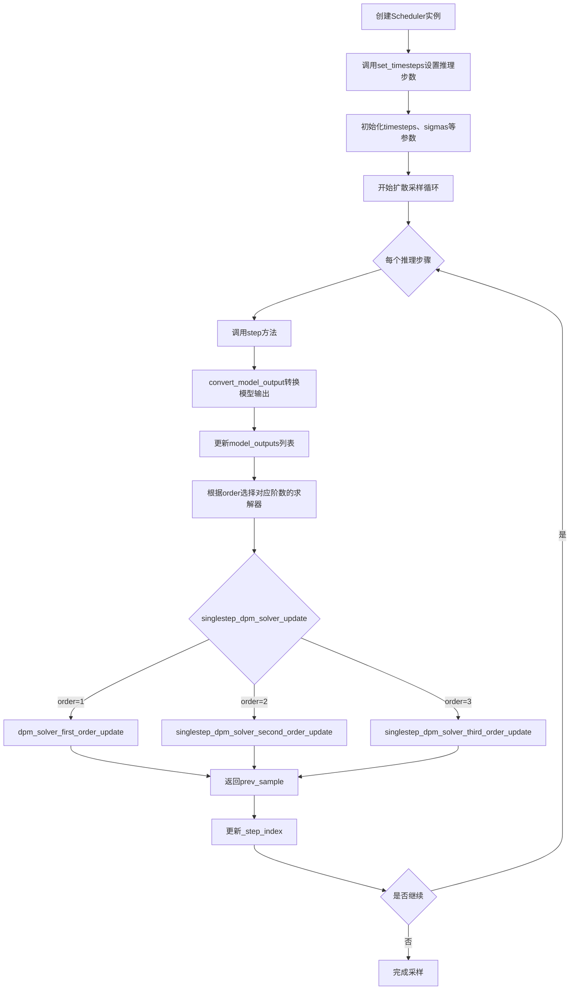
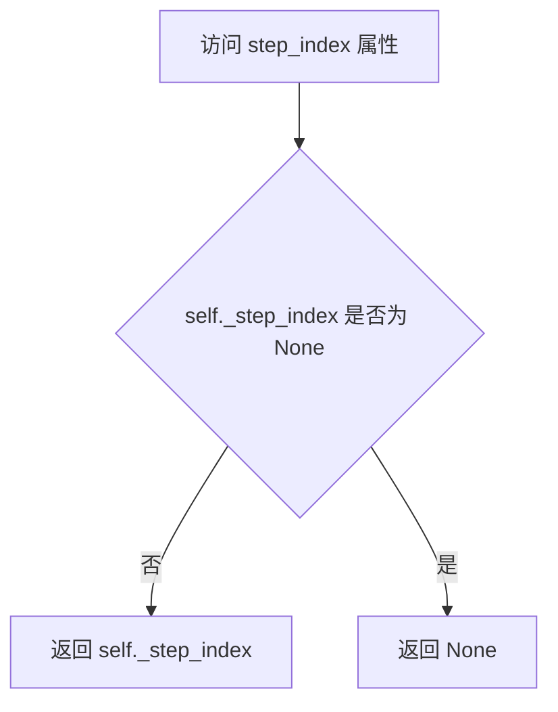
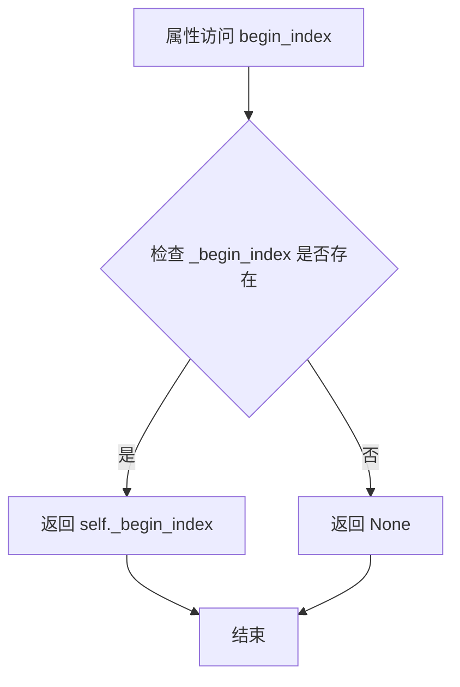
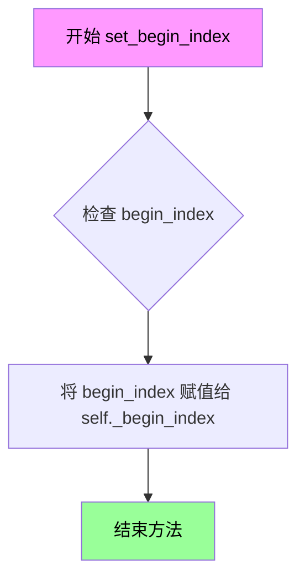
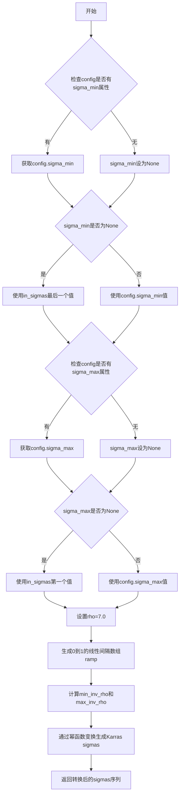
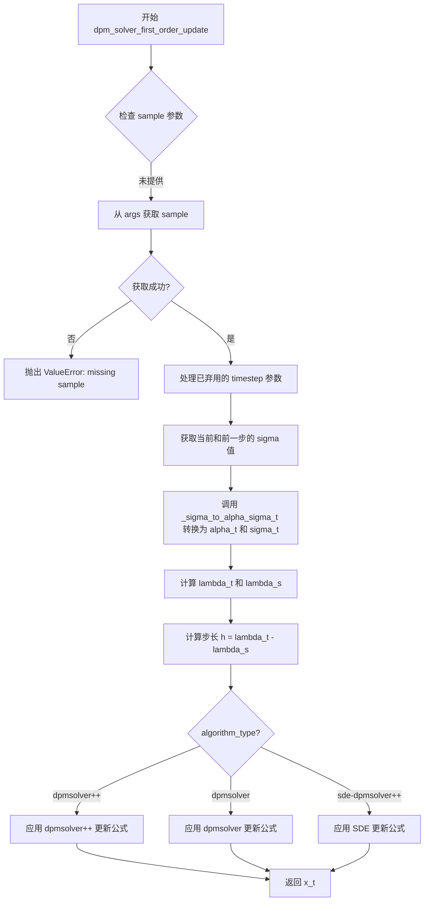
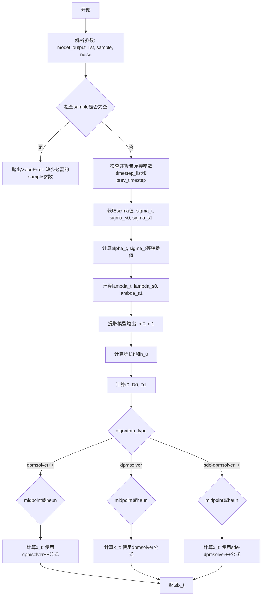
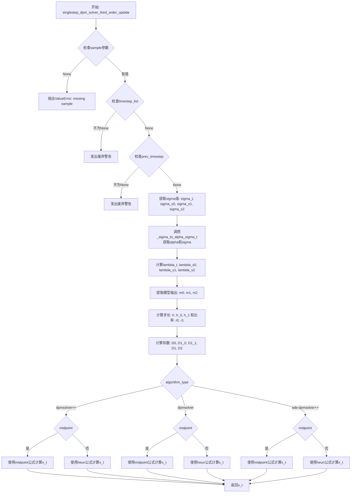
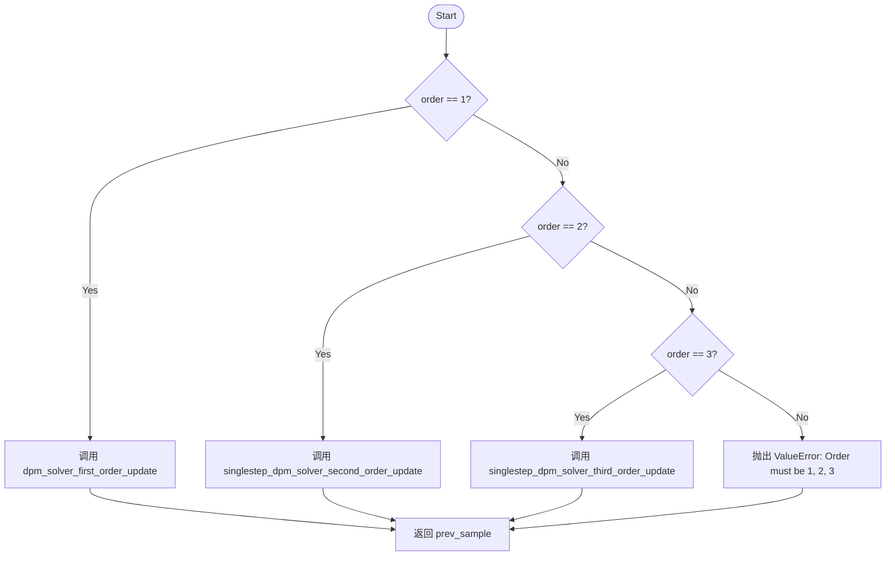

# `diffusers\src\diffusers\schedulers\scheduling_dpmsolver_singlestep.py` 详细设计文档

DPMSolverSinglestepScheduler是一个快速的高阶求解器，用于扩散ODEs的采样。该调度器实现了DPM-Solver算法，支持1/2/3阶求解器，可用于加速扩散模型的推理过程。它支持多种算法类型（dpmsolver、dpmsolver++、sde-dpmsolver++）和噪声调度策略（线性、缩放线性、余弦等），并提供动态阈值、Karras sigmas等优化选项。

## 整体流程



## 类结构

```
SchedulerMixin (抽象基类)
└── DPMSolverSinglestepScheduler (主调度器类)
```

## 全局变量及字段


### `logger`
    
Logger instance for the module, used for warning and informational messages.

类型：`logging.Logger`
    


### `math`
    
Python standard math module for mathematical operations.

类型：`module`
    


### `np`
    
NumPy module imported for array operations and numerical computations.

类型：`module`
    


### `torch`
    
PyTorch module for tensor operations and neural network computations.

类型：`module`
    


### `DPMSolverSinglestepScheduler.betas`
    
Beta values for the noise schedule used in the diffusion process.

类型：`torch.Tensor`
    


### `DPMSolverSinglestepScheduler.alphas`
    
Alpha values computed as 1.0 - betas for the diffusion process.

类型：`torch.Tensor`
    


### `DPMSolverSinglestepScheduler.alphas_cumprod`
    
Cumulative product of alpha values used for computing noise schedule parameters.

类型：`torch.Tensor`
    


### `DPMSolverSinglestepScheduler.alpha_t`
    
Square root of cumulative alpha values representing the noise scaling factor.

类型：`torch.Tensor`
    


### `DPMSolverSinglestepScheduler.sigma_t`
    
Square root of (1 - alphas_cumprod) representing the noise standard deviation at time t.

类型：`torch.Tensor`
    


### `DPMSolverSinglestepScheduler.lambda_t`
    
Log signal-to-noise ratio (log(alpha_t) - log(sigma_t)) for the diffusion process.

类型：`torch.Tensor`
    


### `DPMSolverSinglestepScheduler.sigmas`
    
Sigma values representing noise levels at each timestep in the diffusion schedule.

类型：`torch.Tensor`
    


### `DPMSolverSinglestepScheduler.init_noise_sigma`
    
Standard deviation of the initial noise distribution, typically set to 1.0.

类型：`float`
    


### `DPMSolverSinglestepScheduler.num_inference_steps`
    
Number of inference steps used when generating samples with a pre-trained model.

类型：`int | None`
    


### `DPMSolverSinglestepScheduler.timesteps`
    
Discrete timesteps used for the diffusion chain during inference.

类型：`torch.Tensor`
    


### `DPMSolverSinglestepScheduler.model_outputs`
    
List storing model outputs at different timesteps for multi-order solver computations.

类型：`list[torch.Tensor | None]`
    


### `DPMSolverSinglestepScheduler.sample`
    
Current sample being processed during the denoising step.

类型：`torch.Tensor | None`
    


### `DPMSolverSinglestepScheduler.order_list`
    
List of solver orders for each timestep in the inference process.

类型：`list[int]`
    


### `DPMSolverSinglestepScheduler._step_index`
    
Internal counter tracking the current step index during inference.

类型：`int | None`
    


### `DPMSolverSinglestepScheduler._begin_index`
    
Index for the first timestep, set from pipeline before inference.

类型：`int | None`
    


### `DPMSolverSinglestepScheduler.order`
    
Class attribute representing the default solver order (set to 1).

类型：`int`
    


### `DPMSolverSinglestepScheduler._compatibles`
    
List of compatible scheduler names for this scheduler class.

类型：`list[str]`
    
    

## 全局函数及方法


### `betas_for_alpha_bar`

该函数用于创建beta调度表，根据给定的alpha_t_bar函数进行离散化处理。alpha_t_bar函数定义了从t = [0,1]开始的(1-beta)的累积乘积。函数支持三种alpha转换类型：cosine（余弦）、exp（指数）和laplace（拉普拉斯），通过数值积分的方式计算每个时间步的beta值，以控制扩散过程中的噪声添加策略。

参数：

- `num_diffusion_timesteps`：`int`，要生成的beta数量，即扩散时间步的数量
- `max_beta`：`float`，默认为0.999，用于避免数值不稳定性的最大beta值
- `alpha_transform_type`：`Literal["cosine", "exp", "laplace"]`，默认为"cosine"，alpha_bar的噪声调度类型

返回值：`torch.Tensor`，调度器用于逐步模型输出的beta值

#### 流程图

```mermaid
flowchart TD
    A[开始 betas_for_alpha_bar] --> B{alpha_transform_type == 'cosine'?}
    B -->|Yes| C[定义 alpha_bar_fn: cos²((t+0.008)/1.008*π/2)]
    B -->|No| D{alpha_transform_type == 'laplace'?}
    D -->|Yes| E[定义 alpha_bar_fn: 拉普拉斯分布]
    D -->|No| F{alpha_transform_type == 'exp'?}
    F -->|Yes| G[定义 alpha_bar_fn: exp(t*-12.0)]
    F -->|No| H[抛出 ValueError: 不支持的类型]
    
    C --> I[初始化空列表 betas]
    E --> I
    G --> I
    
    I --> J[遍历 i 从 0 到 num_diffusion_timesteps-1]
    J --> K[计算 t1 = i/num_diffusion_timesteps]
    J --> L[计算 t2 = (i+1)/num_diffusion_timesteps]
    K --> M[计算 beta = min(1 - alpha_bar_fn(t2)/alpha_bar_fn(t1), max_beta)]
    M --> N[将beta添加到betas列表]
    N --> O{还有下一个i?}
    O -->|Yes| J
    O -->|No| P[返回torch.tensor(betas, dtype=torch.float32)]
    
    H --> Q[结束]
    P --> Q
```

#### 带注释源码

```
def betas_for_alpha_bar(
    num_diffusion_timesteps: int,
    max_beta: float = 0.999,
    alpha_transform_type: Literal["cosine", "exp", "laplace"] = "cosine",
) -> torch.Tensor:
    """
    Create a beta schedule that discretizes the given alpha_t_bar function, which defines the cumulative product of
    (1-beta) over time from t = [0,1].

    Contains a function alpha_bar that takes an argument t and transforms it to the cumulative product of (1-beta) up
    to that part of the diffusion process.

    Args:
        num_diffusion_timesteps (`int`):
            The number of betas to produce.
        max_beta (`float`, defaults to `0.999`):
            The maximum beta to use; use values lower than 1 to avoid numerical instability.
        alpha_transform_type (`str`, defaults to `"cosine"`):
            The type of noise schedule for `alpha_bar`. Choose from `cosine`, `exp`, or `laplace`.

    Returns:
        `torch.Tensor`:
            The betas used by the scheduler to step the model outputs.
    """
    # 根据alpha_transform_type选择不同的alpha_bar函数
    # cosine: 使用余弦函数进行平滑的噪声调度，模仿余弦衰减曲线
    if alpha_transform_type == "cosine":

        def alpha_bar_fn(t):
            # 余弦调度：cos²((t+0.008)/1.008 * π/2)
            # 偏移量0.008和1.008用于避免t=0和t=1时的边界问题
            return math.cos((t + 0.008) / 1.008 * math.pi / 2) ** 2

    # laplace: 使用拉普拉斯分布进行噪声调度
    elif alpha_transform_type == "laplace":

        def alpha_bar_fn(t):
            # 拉普拉斯分布：计算lambda参数
            # copysign(1, 0.5 - t)确保在t<0.5和t>0.5时方向正确
            lmb = -0.5 * math.copysign(1, 0.5 - t) * math.log(1 - 2 * math.fabs(0.5 - t) + 1e-6)
            # 计算信噪比SNR
            snr = math.exp(lmb)
            # 返回sqrt(snr/(1+snr))
            return math.sqrt(snr / (1 + snr))

    # exp: 使用指数函数进行噪声调度
    elif alpha_transform_type == "exp":

        def alpha_bar_fn(t):
            # 指数调度：exp(-12.0 * t)
            return math.exp(t * -12.0)

    else:
        raise ValueError(f"Unsupported alpha_transform_type: {alpha_transform_type}")

    # 初始化beta列表
    betas = []
    # 遍历每个扩散时间步
    for i in range(num_diffusion_timesteps):
        # 计算当前时间步的归一化时间
        t1 = i / num_diffusion_timesteps
        # 计算下一个时间步的归一化时间
        t2 = (i + 1) / num_diffusion_timesteps
        # 计算beta值：1 - alpha_bar(t2)/alpha_bar(t1)
        # 并限制最大值不超过max_beta以避免数值不稳定性
        betas.append(min(1 - alpha_bar_fn(t2) / alpha_bar_fn(t1), max_beta))
    
    # 将beta列表转换为PyTorch张量并返回
    return torch.tensor(betas, dtype=torch.float32)
```


### `DPMSolverSinglestepScheduler.__init__`

初始化DPM-Solver单步调度器，设置扩散过程的噪声调度参数、求解器配置和内部状态，为后续采样提供必要的预计算张量和可配置选项。

参数：

- `num_train_timesteps`：`int`，默认为1000，扩散过程训练时的时间步总数
- `beta_start`：`float`，默认为0.0001，推理时beta的起始值
- `beta_end`：`float`，默认为0.02，beta的最终值
- `beta_schedule`：`Literal["linear", "scaled_linear", "squaredcos_cap_v2"]`，默认为"linear"，beta调度策略
- `trained_betas`：`np.ndarray | list[float] | None`，可选，直接传入的beta数组以绕过beta_start和beta_end
- `solver_order`：`int`，默认为2，DPM-Solver的阶数（1、2或3）
- `prediction_type`：`Literal["epsilon", "sample", "v_prediction", "flow_prediction"]`，默认为"epsilon"，调度器函数的预测类型
- `thresholding`：`bool`，默认为False，是否使用动态阈值处理
- `dynamic_thresholding_ratio`：`float`，默认为0.995，动态阈值方法的比率
- `sample_max_value`：`float`，默认为1.0，动态阈值的阈值
- `algorithm_type`：`Literal["dpmsolver", "dpmsolver++", "sde-dpmsolver++"]`，默认为"dpmsolver++"，求解器算法类型
- `solver_type`：`Literal["midpoint", "heun"]`，默认为"midpoint"，二阶求解器的求解器类型
- `lower_order_final`：`bool`，默认为False，是否在最后几步使用低阶求解器
- `use_karras_sigmas`：`bool`，默认为False，是否使用Karras sigma
- `use_exponential_sigmas`：`bool`，默认为False，是否使用指数sigma
- `use_beta_sigmas`：`bool`，默认为False，是否使用beta sigma
- `use_flow_sigmas`：`bool`，默认为False，是否使用流sigma
- `flow_shift`：`float`，默认为1.0，流模型的流移位参数
- `final_sigmas_type`：`Literal["zero", "sigma_min"]`，默认为"zero"，采样过程中噪声计划的最终sigma值
- `lambda_min_clipped`：`float`，默认为-inf，lambda(t)最小值的裁剪阈值
- `variance_type`：`Literal["learned", "learned_range"] | None`，可选，扩散模型预测的方差类型
- `use_dynamic_shifting`：`bool`，默认为False，是否使用动态移位
- `time_shift_type`：`Literal["exponential"]`，默认为"exponential"，时间移位类型

返回值：`None`，无返回值（构造函数）

#### 流程图

```mermaid
flowchart TD
    A[开始 __init__] --> B{use_beta_sigmas已安装scipy?}
    B -->|否| C[抛出ImportError]
    B --> D{只启用一个sigma选项?}
    D -->|否| E[抛出ValueError]
    D --> F{algorithm_type是否为dpmsolver?}
    F -->|是| G[发出废弃警告]
    F -->|否| H{trained_betas是否提供?}
    H -->|是| I[从trained_betas创建betas张量]
    H -->|否| J{beta_schedule类型}
    J -->|linear| K[创建线性beta计划]
    J -->|scaled_linear| L[创建缩放线性beta计划]
    J -->|squaredcos_cap_v2| M[使用betas_for_alpha_bar]
    J -->|其他| N[抛出NotImplementedError]
    K --> O
    L --> O
    M --> O
    I --> O
    O[计算alphas] --> P[计算alphas_cumprod]
    P --> Q[计算alpha_t和sigma_t]
    Q --> R[计算lambda_t和sigmas]
    R --> S[设置init_noise_sigma]
    S --> T{algorithm_type有效性?}
    T -->|无效| U[设置默认值或抛出错误]
    T -->|有效| V{solver_type有效性?}
    V -->|无效| W[设置默认值或抛出错误]
    V -->|有效| X{final_sigmas_type兼容性?]
    X -->|不兼容| Y[抛出ValueError]
    X -->|兼容| Z[初始化推理相关变量]
    Z --> AA[计算order_list]
    AA --> AB[移动sigmas到CPU]
    AB --> AC[结束 __init__]
```

#### 带注释源码

```python
@register_to_config
def __init__(
    self,
    num_train_timesteps: int = 1000,  # 扩散训练步数，默认1000
    beta_start: float = 0.0001,       # beta起始值
    beta_end: float = 0.02,           # beta结束值
    beta_schedule: Literal["linear", "scaled_linear", "squaredcos_cap_v2"] = "linear",  # beta调度类型
    trained_betas: np.ndarray | list[float] | None = None,  # 直接传入的beta数组
    solver_order: int = 2,             # DPM-Solver阶数（1/2/3）
    prediction_type: Literal["epsilon", "sample", "v_prediction", "flow_prediction"] = "epsilon",  # 预测类型
    thresholding: bool = False,        # 是否启用动态阈值
    dynamic_thresholding_ratio: float = 0.995,  # 动态阈值比率
    sample_max_value: float = 1.0,    # 样本最大值
    algorithm_type: Literal["dpmsolver", "dpmsolver++", "sde-dpmsolver++"] = "dpmsolver++",  # 算法类型
    solver_type: Literal["midpoint", "heun"] = "midpoint",  # 求解器类型
    lower_order_final: bool = False,   # 最终步骤是否使用低阶
    use_karras_sigmas: bool = False,   # 使用Karras sigma
    use_exponential_sigmas: bool = False,  # 使用指数sigma
    use_beta_sigmas: bool = False,     # 使用beta sigma
    use_flow_sigmas: bool = False,     # 使用流sigma
    flow_shift: float = 1.0,          # 流移位参数
    final_sigmas_type: Literal["zero", "sigma_min"] = "zero",  # 最终sigma类型
    lambda_min_clipped: float = -float("inf"),  # lambda最小值裁剪
    variance_type: Literal["learned", "learned_range"] | None = None,  # 方差类型
    use_dynamic_shifting: bool = False,  # 动态移位
    time_shift_type: Literal["exponential"] = "exponential",  # 时间移位类型
) -> None:
    # 检查beta sigmas需要scipy
    if self.config.use_beta_sigmas and not is_scipy_available():
        raise ImportError("Make sure to install scipy if you want to use beta sigmas.")
    
    # 确保只启用一个sigma选项
    if sum([self.config.use_beta_sigmas, self.config.use_exponential_sigmas, self.config.use_karras_sigmas]) > 1:
        raise ValueError(
            "Only one of `config.use_beta_sigmas`, `config.use_exponential_sigmas`, `config.use_karras_sigmas` can be used."
        )
    
    # dpmsolver已废弃警告
    if algorithm_type == "dpmsolver":
        deprecation_message = "algorithm_type `dpmsolver` is deprecated and will be removed in a future version. Choose from `dpmsolver++` or `sde-dpmsolver++` instead"
        deprecate("algorithm_types=dpmsolver", "1.0.0", deprecation_message)

    # 根据不同策略创建betas张量
    if trained_betas is not None:
        self.betas = torch.tensor(trained_betas, dtype=torch.float32)
    elif beta_schedule == "linear":
        self.betas = torch.linspace(beta_start, beta_end, num_train_timesteps, dtype=torch.float32)
    elif beta_schedule == "scaled_linear":
        # 特定于潜在扩散模型的调度
        self.betas = torch.linspace(beta_start**0.5, beta_end**0.5, num_train_timesteps, dtype=torch.float32) ** 2
    elif beta_schedule == "squaredcos_cap_v2":
        # Glide cosine调度
        self.betas = betas_for_alpha_bar(num_train_timesteps)
    else:
        raise NotImplementedError(f"{beta_schedule} is not implemented for {self.__class__}")

    # 计算alphas、累积乘积及相关量
    self.alphas = 1.0 - self.betas
    self.alphas_cumprod = torch.cumprod(self.alphas, dim=0)
    # 当前仅支持VP类型噪声调度
    self.alpha_t = torch.sqrt(self.alphas_cumprod)
    self.sigma_t = torch.sqrt(1 - self.alphas_cumprod)
    self.lambda_t = torch.log(self.alpha_t) - torch.log(self.sigma_t)
    self.sigmas = ((1 - self.alphas_cumprod) / self.alphas_cumprod) ** 0.5

    # 初始噪声分布的标准差
    self.init_noise_sigma = 1.0

    # DPM-Solver设置
    if algorithm_type not in ["dpmsolver", "dpmsolver++", "sde-dpmsolver++"]:
        if algorithm_type == "deis":
            self.register_to_config(algorithm_type="dpmsolver++")
        else:
            raise NotImplementedError(f"{algorithm_type} is not implemented for {self.__class__}")
    if solver_type not in ["midpoint", "heun"]:
        if solver_type in ["logrho", "bh1", "bh2"]:
            self.register_to_config(solver_type="midpoint")
        else:
            raise NotImplementedError(f"{solver_type} is not implemented for {self.__class__}")

    # 检查final_sigmas_type兼容性
    if algorithm_type not in ["dpmsolver++", "sde-dpmsolver++"] and final_sigmas_type == "zero":
        raise ValueError(
            f"`final_sigmas_type` {final_sigmas_type} is not supported for `algorithm_type` {algorithm_type}. Please choose `sigma_min` instead."
        )

    # 可设置的值
    self.num_inference_steps = None
    timesteps = np.linspace(0, num_train_timesteps - 1, num_train_timesteps, dtype=np.float32)[::-1].copy()
    self.timesteps = torch.from_numpy(timesteps)
    self.model_outputs = [None] * solver_order
    self.sample = None
    self.order_list = self.get_order_list(num_train_timesteps)
    self._step_index = None
    self._begin_index = None
    self.sigmas = self.sigmas.to("cpu")  # 避免过多CPU/GPU通信
```


### `DPMSolverSinglestepScheduler.get_order_list`

该函数用于计算 DPMSolver 单步求解器在每个时间步的求解阶数（order），根据配置的训练步数、求解器阶数和是否使用低阶最终步等参数，生成一个包含每步求解阶次的列表，用于指导扩散模型采样过程中的数值求解策略。

参数：

- `num_inference_steps`：`int`，推理时使用的扩散步数，即生成样本时总共需要的时间步数量

返回值：`list[int]`，返回每个时间步对应的求解阶数列表，阶数可为 1、2 或 3

#### 流程图

```mermaid
flowchart TD
    A[开始 get_order_list] --> B[获取 num_inference_steps 和 solver_order]
    B --> C{order > 3?}
    C -->|是| D[抛出 ValueError: Order > 3 不支持]
    C -->|否| E{lower_order_final?}
    E -->|是| F{order == 3?}
    E -->|否| G{order == 3?}
    F -->|是| H{steps % 3 == 0?}
    F -->|否| I{order == 2?}
    H -->|是| J[orders = 1,2,3 循环 + 1,2 + 1]
    H -->|否| K{steps % 3 == 1?}
    K -->|是| L[orders = 1,2,3 循环 + 1]
    K -->|否| M[orders = 1,2,3 循环 + 1,2]
    I -->|是| N{steps % 2 == 0?}
    I -->|否| O{order == 1?}
    N -->|是| P[orders = 1,2 循环 + 1,1]
    N -->|否| Q[orders = 1,2 循环 + 1]
    O -->|是| R[orders = 1 重复 steps 次]
    G -->|是| S[orders = 1,2,3 重复 steps//3 次]
    G -->|否| T{order == 2?}
    T -->|是| U[orders = 1,2 重复 steps//2 次]
    T -->|否| V[orders = 1 重复 steps 次]
    J --> W{final_sigmas_type == 'zero'?}
    L --> W
    M --> W
    P --> W
    Q --> W
    R --> W
    S --> W
    U --> W
    V --> W
    W -->|是| X[orders[-1] = 1]
    W -->|否| Y[返回 orders]
    X --> Y
    D --> Y
```

#### 带注释源码

```python
def get_order_list(self, num_inference_steps: int) -> list[int]:
    """
    Computes the solver order at each time step.

    Args:
        num_inference_steps (`int`):
            The number of diffusion steps used when generating samples with a pre-trained model.

    Returns:
        `list[int]`:
            The list of solver orders for each timestep.
    """
    # 将推理步数赋值给局部变量 steps
    steps = num_inference_steps
    # 从配置中获取求解器阶数（1、2 或 3）
    order = self.config.solver_order
    
    # 检查阶数是否超过 3，DPMSolver 目前最高支持 3 阶
    if order > 3:
        raise ValueError("Order > 3 is not supported by this scheduler")
    
    # 判断是否启用"低阶最终步"模式
    # 该模式在推理步数较少时（<15步）使用，可提高稳定性
    if self.config.lower_order_final:
        if order == 3:
            # 三阶求解器：当总步数能被 3 整除时，最后三步使用 [1,2,1] 结尾
            # 这种设计确保在关键的最后步骤使用更稳定的低阶方法
            if steps % 3 == 0:
                # 例如 steps=9 时：生成 [1,2,3] * 2 + [1,2] + [1] = [1,2,3,1,2,3,1,2,1]
                orders = [1, 2, 3] * (steps // 3 - 1) + [1, 2] + [1]
            elif steps % 3 == 1:
                # 例如 steps=10 时：生成 [1,2,3] * 3 + [1] = [1,2,3,1,2,3,1,2,3,1]
                orders = [1, 2, 3] * (steps // 3) + [1]
            else:
                # 例如 steps=11 时：生成 [1,2,3] * 3 + [1,2] = [1,2,3,1,2,3,1,2,3,1,2]
                orders = [1, 2, 3] * (steps // 3) + [1, 2]
        elif order == 2:
            # 二阶求解器：偶数步时最后两步使用 [1,1]，奇数步时最后一步使用 [1]
            if steps % 2 == 0:
                orders = [1, 2] * (steps // 2 - 1) + [1, 1]
            else:
                orders = [1, 2] * (steps // 2) + [1]
        elif order == 1:
            # 一阶求解器：始终使用一阶
            orders = [1] * steps
    else:
        # 不使用低阶最终步时，使用固定的阶数循环模式
        if order == 3:
            orders = [1, 2, 3] * (steps // 3)
        elif order == 2:
            orders = [1, 2] * (steps // 2)
        elif order == 1:
            orders = [1] * steps

    # 如果最终 sigma 类型为 "zero"，强制将最后一步设为一阶
    # 这是因为零 sigma 时刻使用一阶求解更稳定
    if self.config.final_sigmas_type == "zero":
        orders[-1] = 1

    return orders
```


### `DPMSolverSinglestepScheduler.step_index`

这是一个只读属性（property），用于获取当前时间步的索引计数器。在每次调度器步骤（`step` 方法）执行后，该索引会自动增加 1。如果调度器尚未开始推理（即 `set_timesteps` 未被调用或推理尚未开始），则返回 `None`。

参数：
- 无（该属性不接受任何参数）

返回值：`int` 或 `None`，表示当前推理步骤的索引。如果调度器未初始化，则返回 `None`。

#### 流程图



#### 带注释源码

```python
@property
def step_index(self) -> int:
    """
    The index counter for current timestep. It will increase 1 after each scheduler step.

    Returns:
        `int` or `None`:
            The current step index.
    """
    return self._step_index
```


### `DPMSolverSinglestepScheduler.begin_index`

获取调度器的起始时间步索引，用于在 pipeline 中设置推理起始点。

参数：无（属性访问器不接受外部参数）

返回值：`int | None`，返回调度器的起始索引值，若未设置则为 `None`

#### 流程图



#### 带注释源码

```python
@property
def begin_index(self) -> int:
    """
    The index for the first timestep. It should be set from pipeline with `set_begin_index` method.

    Returns:
        `int` or `None`:
            The begin index.
    """
    return self._begin_index
```

---

### 补充说明

该属性是 `DPMSolverSinglestepScheduler` 调度器类的一个只读属性，用于：

1. **追踪起始位置**：记录推理过程的起始时间步索引
2. **支持 pipeline 集成**：通过 `set_begin_index` 方法由外部 pipeline 设置
3. **状态管理**：与 `_step_index` 配合使用，管理调度器的推理进度

当 `begin_index` 为 `None` 时，表示调度器用于训练模式或 pipeline 未实现 `set_begin_index` 方法；在 `add_noise` 等方法中会以此判断如何计算噪声添加的步进索引。


### `DPMSolverSinglestepScheduler.set_begin_index`

该方法用于设置调度器的起始索引，通常在推理前由pipeline调用，以指定从哪个时间步开始进行去噪处理。

参数：

- `begin_index`：`int`，默认为 `0`，调度器的起始索引，用于指定扩散过程开始的时间步位置。

返回值：`None`，该方法不返回任何值，仅修改对象内部状态。

#### 流程图



#### 带注释源码

```python
def set_begin_index(self, begin_index: int = 0) -> None:
    """
    Sets the begin index for the scheduler. This function should be run from pipeline before the inference.

    Args:
        begin_index (`int`, defaults to `0`):
            The begin index for the scheduler.
    """
    # 将传入的 begin_index 参数赋值给实例变量 _begin_index
    # 该变量用于跟踪调度器的起始时间步索引
    # 在推理过程中，begin_index 可以帮助实现图像到图像的扩散任务
    # 例如在 inpainting 或 img2img 场景下，可能不需要从最初的时间步开始
    self._begin_index = begin_index
```


### `DPMSolverSinglestepScheduler.set_timesteps`

设置离散的时间步，用于扩散链的推理过程。该方法根据指定的推理步数或自定义时间步列表，计算并设置对应的时间步和噪声强度（sigma）序列，同时处理多种噪声调度策略（如 Karras、Exponential、Beta、Flow 等）。

参数：

- `num_inference_steps`：`int | None`，可选参数，用于生成样本的扩散推理步数
- `device`：`str | torch.device`，可选参数，时间步要移动到的设备。如果为 `None`，则不移动时间步
- `mu`：`float | None`，可选参数，动态时间偏移参数，用于指数时间偏移类型
- `timesteps`：`list[int] | None`，可选参数，自定义时间步列表，用于支持任意间隔的时间步。如果传入此参数，`num_inference_steps` 必须为 `None`

返回值：`None`，该方法无返回值（通过修改内部状态完成时间步设置）

#### 流程图

```mermaid
flowchart TD
    A[开始 set_timesteps] --> B{mu is not None?}
    B -->|Yes| C[验证动态偏移配置<br/>设置 flow_shift = exp(mu)]
    B -->|No| D{num_inference_steps<br/>and timesteps 校验}
    
    D --> E{num_inference_steps<br/>is None AND<br/>timesteps is None?}
    E -->|Yes| F[抛出 ValueError:<br/>必须传入其中一个参数]
    E -->|No| G{num_inference_steps<br/>AND timesteps<br/>都非空?}
    G -->|Yes| H[抛出 ValueError:<br/>只能传入其中一个参数]
    G -->|No| I{timesteps 非空<br/>AND use_karras_sigmas?}
    I -->|Yes| J[抛出 ValueError:<br/>不能同时使用]
    I -->|No| K{timesteps 非空<br/>AND use_exponential_sigmas?}
    K -->|Yes| L[抛出 ValueError:<br/>不能同时使用]
    K -->|No| M{timesteps 非空<br/>AND use_beta_sigmas?}
    M -->|Yes| N[抛出 ValueError:<br/>不能同时使用]
    M -->|No| O[计算 num_inference_steps]
    
    O --> P{timesteps is not None?}
    P -->|Yes| Q[将 timesteps 转换为 numpy int64]
    P -->|No| R[计算 clipped_idx 用于数值稳定性<br/>生成等间距时间步]
    Q --> S[计算 sigmas 和 log_sigmas]
    R --> S
    
    S --> T{use_karras_sigmas?}
    T -->|Yes| U[转换为 Karras sigmas<br/>计算对应 timesteps]
    T -->|No| V{use_exponential_sigmas?}
    V -->|Yes| W[转换为指数 sigmas<br/>计算对应 timesteps]
    V -->|No| X{use_beta_sigmas?}
    X -->|Yes| Y[转换为 Beta sigmas<br/>计算对应 timesteps]
    X -->|No| Z{use_flow_sigmas?}
    Z -->|Yes| AA[计算 Flow sigmas<br/>转换 timesteps]
    Z -->|No| AB[使用默认线性插值<br/>计算 sigmas]
    
    U --> AC[确定 sigma_last 值]
    W --> AC
    Y --> AC
    AA --> AC
    AB --> AC
    
    AC --> AD[拼接 sigmas 数组<br/>添加 final_sigma]
    AD --> AE[转换 sigmas 和 timesteps<br/>移动到指定设备]
    AE --> AF[重置 model_outputs<br/>清空 sample]
    
    AG{lower_order_final<br/>配置校验}
    AF --> AG
    AG --> AH{推理步数不可整除<br/>solver_order?}
    AH -->|Yes| AI[记录警告<br/>设置 lower_order_final=True]
    AH -->|No| AJ{final_sigmas_type=zero<br/>且 lower_order_final=False?}
    AI --> AJ
    AJ -->|Yes| AK[记录警告<br/>设置 lower_order_final=True]
    AJ -->|No| AL[调用 get_order_list<br/>生成 order_list]
    
    AL --> AM[重置 _step_index<br/>和 _begin_index]
    AM --> AN[将 sigmas 移至 CPU<br/>避免频繁通信]
    AN --> AO[结束]
```

#### 带注释源码

```python
def set_timesteps(
    self,
    num_inference_steps: int = None,
    device: str | torch.device = None,
    mu: float | None = None,
    timesteps: list[int] | None = None,
):
    """
    设置离散的时间步，用于扩散链的推理过程（在推理前运行）。

    参数:
        num_inference_steps (int, 可选):
            使用预训练模型生成样本时使用的扩散推理步数。
        device (str 或 torch.device, 可选):
            时间步要移动到的设备。如果为 None，则不移动时间步。
        timesteps (list[int], 可选):
            用于支持任意时间步间隔的自定义时间步。如果为 None，
            则使用默认的等间距时间步调度策略。如果传入 timesteps，
            则 num_inference_steps 必须为 None。
    """
    # 如果提供了 mu 参数，处理动态时间偏移
    if mu is not None:
        # 验证配置是否启用了动态偏移且为指数类型
        assert self.config.use_dynamic_shifting and self.config.time_shift_type == "exponential"
        # 根据 mu 计算 flow_shift 值
        self.config.flow_shift = np.exp(mu)
    
    # 参数互斥性校验：必须恰好传入 num_inference_steps 或 timesteps 之一
    if num_inference_steps is None and timesteps is None:
        raise ValueError("Must pass exactly one of `num_inference_steps` or `timesteps`.")
    if num_inference_steps is not None and timesteps is not None:
        raise ValueError("Must pass exactly one of `num_inference_steps` or `timesteps`.")
    
    # 校验 timesteps 与特定 sigma 配置的兼容性
    if timesteps is not None and self.config.use_karras_sigmas:
        raise ValueError("Cannot use `timesteps` when `config.use_karras_sigmas=True`.")
    if timesteps is not None and self.config.use_exponential_sigmas:
        raise ValueError("Cannot set `timesteps` with `config.use_exponential_sigmas = True`.")
    if timesteps is not None and self.config.use_beta_sigmas:
        raise ValueError("Cannot set `timesteps` with `config.use_beta_sigmas = True`.")

    # 确定推理步数
    num_inference_steps = num_inference_steps or len(timesteps)
    self.num_inference_steps = num_inference_steps

    # 处理时间步：自定义或生成默认时间步
    if timesteps is not None:
        # 直接使用传入的自定义时间步
        timesteps = np.array(timesteps).astype(np.int64)
    else:
        # 为保证数值稳定性，对 lambda(t) 的最小值进行裁剪
        # 这对 cosine (squaredcos_cap_v2) 噪声调度至关重要
        clipped_idx = torch.searchsorted(torch.flip(self.lambda_t, [0]), self.config.lambda_min_clipped)
        clipped_idx = clipped_idx.item()
        # 生成等间距的时间步序列
        timesteps = (
            np.linspace(0, self.config.num_train_timesteps - 1 - clipped_idx, num_inference_steps + 1)
            .round()[::-1][:-1]
            .copy()
            .astype(np.int64)
        )

    # 计算基础 sigmas（从 alphas_cumprod 推导）
    sigmas = np.array(((1 - self.alphas_cumprod) / self.alphas_cumprod) ** 0.5)
    log_sigmas = np.log(sigmas)
    
    # 根据配置选择不同的 sigma 调度策略
    if self.config.use_karras_sigmas:
        # 使用 Karras 噪声调度（推荐用于高质量采样）
        sigmas = np.flip(sigmas).copy()
        sigmas = self._convert_to_karras(in_sigmas=sigmas, num_inference_steps=num_inference_steps)
        # 将 sigma 值转换回时间步
        timesteps = np.array([self._sigma_to_t(sigma, log_sigmas) for sigma in sigmas]).round()
    elif self.config.use_exponential_sigmas:
        # 使用指数 Sigma 调度
        sigmas = np.flip(sigmas).copy()
        sigmas = self._convert_to_exponential(in_sigmas=sigmas, num_inference_steps=num_inference_steps)
        timesteps = np.array([self._sigma_to_t(sigma, log_sigmas) for sigma in sigmas])
    elif self.config.use_beta_sigmas:
        # 使用 Beta 分布 Sigma 调度
        sigmas = np.flip(sigmas).copy()
        sigmas = self._convert_to_beta(in_sigmas=sigmas, num_inference_steps=num_inference_steps)
        timesteps = np.array([self._sigma_to_t(sigma, log_sigmas) for sigma in sigmas])
    elif self.config.use_flow_sigmas:
        # 使用 Flow-based 模型的 Sigma 调度
        alphas = np.linspace(1, 1 / self.config.num_train_timesteps, num_inference_steps + 1)
        sigmas = 1.0 - alphas
        sigmas = np.flip(self.config.flow_shift * sigmas / (1 + (self.config.flow_shift - 1) * sigmas))[:-1].copy()
        timesteps = (sigmas * self.config.num_train_timesteps).copy()
    else:
        # 默认：使用线性插值计算 sigma
        sigmas = np.interp(timesteps, np.arange(0, len(sigmas)), sigmas)

    # 确定最后一个 sigma 值
    if self.config.final_sigmas_type == "sigma_min":
        # 最终 sigma 使用训练时的最小值
        sigma_last = ((1 - self.alphas_cumprod[0]) / self.alphas_cumprod[0]) ** 0.5
    elif self.config.final_sigmas_type == "zero":
        # 最终 sigma 设置为 0（确定性采样）
        sigma_last = 0
    else:
        raise ValueError(
            f" `final_sigmas_type` must be one of `sigma_min` or `zero`, but got {self.config.final_sigmas_type}"
        )
    
    # 拼接最终的 sigma 数组（包括最后一个 sigma 值）
    sigmas = np.concatenate([sigmas, [sigma_last]]).astype(np.float32)

    # 将数据转换为 Tensor 并移动到指定设备
    self.sigmas = torch.from_numpy(sigmas).to(device=device)
    self.timesteps = torch.from_numpy(timesteps).to(device=device, dtype=torch.int64)
    
    # 重置内部状态
    self.model_outputs = [None] * self.config.solver_order
    self.sample = None

    # 配置一致性检查与调整
    if not self.config.lower_order_final and num_inference_steps % self.config.solver_order != 0:
        logger.warning(
            "Changing scheduler {self.config} to have `lower_order_final` set to True to handle uneven amount of inference steps. Please make sure to always use an even number of `num_inference steps when using `lower_order_final=False`."
        )
        self.register_to_config(lower_order_final=True)

    if not self.config.lower_order_final and self.config.final_sigmas_type == "zero":
        logger.warning(
            " `last_sigmas_type='zero'` is not supported for `lower_order_final=False`. Changing scheduler {self.config} to have `lower_order_final` set to True."
        )
        self.register_to_config(lower_order_final=True)

    # 生成求解器阶数列表（每步使用不同阶数的求解器）
    self.order_list = self.get_order_list(num_inference_steps)

    # 重置调度器索引计数器
    self._step_index = None
    self._begin_index = None
    # 将 sigmas 保留在 CPU 以减少 GPU/CPU 通信开销
    self.sigmas = self.sigmas.to("cpu")
```


### `DPMSolverSinglestepScheduler._threshold_sample`

对预测样本应用动态阈值处理（Dynamic Thresholding），通过计算每个样本在特定百分位的绝对像素值作为动态阈值，将超过阈值的像素压缩到 [-s, s] 范围内并除以 s，从而防止像素在采样过程中饱和，提升图像真实感和文本-图像对齐度。

参数：

- `self`：隐式参数，指向 DPMSolverSinglestepScheduler 实例
- `sample`：`torch.Tensor`，需要被阈值处理的预测样本

返回值：`torch.Tensor`，经过阈值处理后的样本

#### 流程图

```mermaid
flowchart TD
    A[开始: _threshold_sample] --> B[保存原始dtype]
    B --> C[获取sample形状: batch_size, channels, *remaining_dims]
    C --> D{dtype not in<br/>float32/float64?}
    D -->|Yes| E[转换为float以进行quantile计算]
    D -->|No| F[继续]
    E --> F
    F --> G[将samplereshape为<br/>batch_size, channels*prod]
    G --> H[计算绝对值abs_sample]
    H --> I[计算动态阈值s:<br/>torch.quantileabs_sample]
    I --> J[clamp s到[1, sample_max_value]]
    J --> K[s unsqueeze(1)以支持广播]
    K --> L[clamp sample到[-s, s]并除以s]
    L --> M[reshape回原始维度]
    M --> N[转换回原始dtype]
    N --> O[返回处理后的sample]
```

#### 带注释源码

```python
def _threshold_sample(self, sample: torch.Tensor) -> torch.Tensor:
    """
    Apply dynamic thresholding to the predicted sample.

    "Dynamic thresholding: At each sampling step we set s to a certain percentile absolute pixel value in xt0 (the
    prediction of x_0 at timestep t), and if s > 1, then we threshold xt0 to the range [-s, s] and then divide by
    s. Dynamic thresholding pushes saturated pixels (those near -1 and 1) inwards, thereby actively preventing
    pixels from saturation at each step. We find that dynamic thresholding results in significantly better
    photorealism as well as better image-text alignment, especially when using very large guidance weights."

    https://huggingface.co/papers/2205.11487

    Args:
        sample (`torch.Tensor`):
            The predicted sample to be thresholded.

    Returns:
        `torch.Tensor`:
            The thresholded sample.
    """
    dtype = sample.dtype  # 保存原始数据类型以便于最后恢复
    batch_size, channels, *remaining_dims = sample.shape  # 解包样本形状信息

    # 如果数据类型不是float32或float64，则需要转换为float
    # 因为quantile计算和clamp操作在CPU上对half类型不支持
    if dtype not in (torch.float32, torch.float64):
        sample = sample.float()  # upcast for quantile calculation, and clamp not implemented for cpu half

    # 将样本展平以对每个图像独立进行quantile计算
    # 展平后形状: (batch_size, channels * height * width)
    sample = sample.reshape(batch_size, channels * np.prod(remaining_dims))

    # 计算绝对值样本，用于确定动态阈值s
    abs_sample = sample.abs()  # "a certain percentile absolute pixel value"

    # 计算动态阈值s: 取abs_sample在dynamic_thresholding_ratio百分位的值
    # dim=1表示沿batch维度计算每个样本独立的阈值
    s = torch.quantile(abs_sample, self.config.dynamic_thresholding_ratio, dim=1)
    
    # 将阈值s限制在[1, sample_max_value]范围内
    # 当min=1时，等价于标准的[-1, 1]裁剪
    s = torch.clamp(
        s, min=1, max=self.config.sample_max_value
    )  # When clamped to min=1, equivalent to standard clipping to [-1, 1]
    
    # 为s添加维度以便沿dim=0进行广播
    # s形状: (batch_size,) -> (batch_size, 1)
    s = s.unsqueeze(1)  # (batch_size, 1) because clamp will broadcast along dim=0
    
    # 将样本裁剪到[-s, s]范围，然后除以s进行归一化
    # 这实现了动态阈值处理的核心逻辑
    sample = torch.clamp(sample, -s, s) / s  # "we threshold xt0 to the range [-s, s] and then divide by s"

    # 将样本reshape回原始形状
    sample = sample.reshape(batch_size, channels, *remaining_dims)
    
    # 转换回原始数据类型
    sample = sample.to(dtype)

    return sample
```


### `DPMSolverSinglestepScheduler._sigma_to_t`

该方法通过插值将 sigma 值转换为对应的时间步 t 值，是扩散模型调度器中的核心转换函数，用于在不同 sigma 噪声调度和离散时间步之间建立映射关系。

参数：

- `sigma`：`np.ndarray`，要转换的 sigma 值（噪声标准差）
- `log_sigmas`：`np.ndarray`，sigma 调度表的自然对数，用于插值计算

返回值：`np.ndarray`，与输入 sigma 对应的插值时间步值

#### 流程图

```mermaid
flowchart TD
    A[开始: 输入 sigma 和 log_sigmas] --> B[计算 log_sigma = log/max sigma, 1e-10]
    B --> C[计算距离矩阵: dists = log_sigma - log_sigmas[:, np.newaxis]]
    C --> D[计算低位索引: low_idx = cumsumdists >= 0 argmax axis=0 clip to len-2]
    D --> E[计算高位索引: high_idx = low_idx + 1]
    E --> F[获取高低边界的 log_sigma 值: low, high]
    F --> G[计算插值权重: w = low - log_sigma / low - high]
    G --> H[限制权重范围: w = clipw, 0, 1]
    H --> I[计算时间步: t = 1 - w * low_idx + w * high_idx]
    I --> J[reshape 输出形状以匹配输入 sigma 形状]
    J --> K[返回时间步数组 t]
```

#### 带注释源码

```python
def _sigma_to_t(self, sigma: np.ndarray, log_sigmas: np.ndarray) -> np.ndarray:
    """
    Convert sigma values to corresponding timestep values through interpolation.

    Args:
        sigma (`np.ndarray`):
            The sigma value(s) to convert to timestep(s).
        log_sigmas (`np.ndarray`):
            The logarithm of the sigma schedule used for interpolation.

    Returns:
        `np.ndarray`:
            The interpolated timestep value(s) corresponding to the input sigma(s).
    """
    # get log sigma
    # 对 sigma 取对数，使用 max(sigma, 1e-10) 防止 log(0)
    log_sigma = np.log(np.maximum(sigma, 1e-10))

    # get distribution
    # 计算 log_sigma 与 log_sigmas 数组中每个值的差值
    # 结果形状: [len(log_sigmas), *sigma.shape]
    dists = log_sigma - log_sigmas[:, np.newaxis]

    # get sigmas range
    # 使用 cumsum + argmax 找到第一个大于等于 0 的位置（即下界索引）
    # clip 防止索引越界，确保 high_idx 不会超过数组长度
    low_idx = np.cumsum((dists >= 0), axis=0).argmax(axis=0).clip(max=log_sigmas.shape[0] - 2)
    high_idx = low_idx + 1

    # 获取对应索引位置的 log_sigma 边界值
    low = log_sigmas[low_idx]
    high = log_sigmas[high_idx]

    # interpolate sigmas
    # 计算线性插值权重 w
    # w = 0 表示完全使用 low，w = 1 表示完全使用 high
    w = (low - log_sigma) / (low - high)
    # 将权重限制在 [0, 1] 范围内，避免外推
    w = np.clip(w, 0, 1)

    # transform interpolation to time range
    # 使用权重插值计算时间步 t
    # t = 0 表示完全在 low_idx，t = 1 表示完全在 high_idx
    t = (1 - w) * low_idx + w * high_idx
    # 调整输出形状以匹配输入 sigma 的形状
    t = t.reshape(sigma.shape)
    return t
```


### `DPMSolverSinglestepScheduler._sigma_to_alpha_sigma_t`

该方法将 sigma 值转换为对应的 alpha_t 和 sigma_t 值，用于扩散调度器中的噪声调度计算。当使用流签名时采用线性关系，否则使用标准的方差保持关系进行转换。

参数：

- `self`：类的实例，包含配置信息 `self.config.use_flow_sigmas` 用于判断转换模式
- `sigma`：`torch.Tensor`，要转换的 sigma 值（噪声标准差）

返回值：`tuple[torch.Tensor, torch.Tensor]`，包含 (alpha_t, sigma_t) 的元组，其中 alpha_t 是缩放因子，sigma_t 是对应的噪声标准差

#### 流程图

```mermaid
flowchart TD
    A[开始: sigma] --> B{self.config.use_flow_sigmas?}
    B -->|True| C[alpha_t = 1 - sigma]
    C --> D[sigma_t = sigma]
    B -->|False| E[alpha_t = 1 / √(σ² + 1)]
    E --> F[sigma_t = sigma * alpha_t]
    D --> G[返回: (alpha_t, sigma_t)]
    F --> G
```

#### 带注释源码

```python
def _sigma_to_alpha_sigma_t(self, sigma: torch.Tensor) -> tuple[torch.Tensor, torch.Tensor]:
    """
    Convert sigma values to alpha_t and sigma_t values.

    Args:
        sigma (`torch.Tensor`):
            The sigma value(s) to convert.

    Returns:
        `tuple[torch.Tensor, torch.Tensor]`:
            A tuple containing (alpha_t, sigma_t) values.
    """
    # 检查配置是否使用流签名模式（flow-based models）
    if self.config.use_flow_sigmas:
        # 流签名模式下：alpha_t = 1 - sigma, sigma_t = sigma
        # 这种线性关系适用于基于流的扩散模型
        alpha_t = 1 - sigma
        sigma_t = sigma
    else:
        # 标准方差保持（VP）模式：alpha_t = 1/√(σ²+1), sigma_t = σ * α
        # 这确保了 α² + σ² = 1 的关系
        alpha_t = 1 / ((sigma**2 + 1) ** 0.5)
        sigma_t = sigma * alpha_t

    # 返回转换后的 alpha_t 和 sigma_t 值
    return alpha_t, sigma_t
```


### `DPMSolverSinglestepScheduler._convert_to_karras`

该方法用于将输入的sigma值转换为Karras噪声调度序列，基于论文"Elucidating the Design Space of Diffusion-Based Generative Models"中提出的Karras调度策略，通过幂函数变换创建非线性的噪声调度，使扩散模型在采样过程中能够更精细地控制噪声水平的分布。

参数：

- `self`：类的实例，隐式参数
- `in_sigmas`：`torch.Tensor`，输入的sigma值序列，用于确定噪声调度的边界范围
- `num_inference_steps`：`int`，推理步数，指定生成的Karras噪声调度序列的长度

返回值：`torch.Tensor`，转换后的sigma值序列，遵循Karras噪声调度规律

#### 流程图



#### 带注释源码

```python
def _convert_to_karras(self, in_sigmas: torch.Tensor, num_inference_steps: int) -> torch.Tensor:
    """
    Construct the noise schedule as proposed in [Elucidating the Design Space of Diffusion-Based Generative
    Models](https://huggingface.co/papers/2206.00364).

    Args:
        in_sigmas (`torch.Tensor`):
            The input sigma values to be converted.
        num_inference_steps (`int`):
            The number of inference steps to generate the noise schedule for.

    Returns:
        `torch.Tensor`:
            The converted sigma values following the Karras noise schedule.
    """

    # Hack to make sure that other schedulers which copy this function don't break
    # TODO: Add this logic to the other schedulers
    # 检查配置对象是否存在sigma_min属性，用于兼容不同调度器的配置结构
    if hasattr(self.config, "sigma_min"):
        sigma_min = self.config.sigma_min
    else:
        sigma_min = None

    # 检查配置对象是否存在sigma_max属性
    if hasattr(self.config, "sigma_max"):
        sigma_max = self.config.sigma_max
    else:
        sigma_max = None

    # 如果config中没有指定sigma_min，则使用输入sigmas的最后一个值（噪声最小的时刻）
    sigma_min = sigma_min if sigma_min is not None else in_sigmas[-1].item()
    # 如果config中没有指定sigma_max，则使用输入sigmas的第一个值（噪声最大的时刻）
    sigma_max = sigma_max if sigma_max is not None else in_sigmas[0].item()

    # rho是Karras调度中的关键参数，论文中建议使用7.0
    rho = 7.0  # 7.0 is the value used in the paper
    # 生成从0到1的等间距数组，用于线性插值
    ramp = np.linspace(0, 1, num_inference_steps)
    # 计算sigma_min和sigma_max的rho次根的倒数
    min_inv_rho = sigma_min ** (1 / rho)
    max_inv_rho = sigma_max ** (1 / rho)
    # 通过Karras公式计算最终的sigma序列：
    # sigma(t) = (sigma_max^(1/rho) + t * (sigma_min^(1/rho) - sigma_max^(1/rho)))^rho
    # 这创建了一个非线性的噪声调度，在低噪声区域有更细粒度的控制
    sigmas = (max_inv_rho + ramp * (min_inv_rho - max_inv_rho)) ** rho
    return sigmas
```


### `DPMSolverSinglestepScheduler._convert_to_exponential`

将输入的 sigma 值转换为遵循指数调度（exponential schedule）的 sigma 序列，用于生成扩散过程中的噪声调度表。

参数：

- `self`：类的实例，包含配置信息
- `in_sigmas`：`torch.Tensor`，输入的 sigma 值，用于转换为指数调度的 sigma 序列
- `num_inference_steps`：`int`，生成噪声调度表所需的推理步数

返回值：`torch.Tensor`，遵循指数调度格式的转换后 sigma 值序列

#### 流程图

```mermaid
flowchart TD
    A[开始 _convert_to_exponential] --> B{config 是否有 sigma_min 属性}
    B -->|是| C[sigma_min = self.config.sigma_min]
    B -->|否| D[sigma_min = None]
    C --> E{sigma_min 不为 None}
    D --> E
    E -->|是| F[使用 config.sigma_min]
    E -->|否| G[使用 in_sigmas[-1].item()]
    F --> H{config 是否有 sigma_max 属性}
    G --> H
    H -->|是| I[sigma_max = self.config.sigma_max]
    H -->|否| J[sigma_max = None]
    I --> K{sigma_max 不为 None}
    J --> K
    K -->|是| L[使用 config.sigma_max]
    K -->|否| M[使用 in_sigmas[0].item()]
    L --> N[计算指数 sigma 序列]
    M --> N
    N --> O[返回 sigmas]
```

#### 带注释源码

```python
def _convert_to_exponential(self, in_sigmas: torch.Tensor, num_inference_steps: int) -> torch.Tensor:
    """
    Construct an exponential noise schedule.

    Args:
        in_sigmas (`torch.Tensor`):
            The input sigma values to be converted.
        num_inference_steps (`int`):
            The number of inference steps to generate the noise schedule for.

    Returns:
        `torch.Tensor`:
            The converted sigma values following an exponential schedule.
    """

    # Hack to make sure that other schedulers which copy this function don't break
    # TODO: Add this logic to the other schedulers
    # 检查配置对象是否包含 sigma_min 属性，如果存在则获取其值，否则设为 None
    if hasattr(self.config, "sigma_min"):
        sigma_min = self.config.sigma_min
    else:
        sigma_min = None

    # 检查配置对象是否包含 sigma_max 属性，如果存在则获取其值，否则设为 None
    if hasattr(self.config, "sigma_max"):
        sigma_max = self.config.sigma_max
    else:
        sigma_max = None

    # 如果 sigma_min 为 None，则使用输入 sigma 序列的最后一个值（最小的 sigma）
    sigma_min = sigma_min if sigma_min is not None else in_sigmas[-1].item()
    # 如果 sigma_max 为 None，则使用输入 sigma 序列的第一个值（最大的 sigma）
    sigma_max = sigma_max if sigma_max is not None else in_sigmas[0].item()

    # 生成指数分布的 sigma 序列：在 sigma_max 和 sigma_min 的对数空间中进行线性插值，
    # 然后取指数得到最终的 sigma 值序列
    sigmas = np.exp(np.linspace(math.log(sigma_max), math.log(sigma_min), num_inference_steps))
    return sigmas
```


### `DPMSolverSinglestepScheduler._convert_to_beta`

该方法用于根据 Beta 分布构建噪声调度表（Beta noise schedule），这是基于论文 "Beta Sampling is All You Need" 提出的方法。它将输入的 sigma 值通过 Beta 分布的分位数函数（ppf）转换为符合 Beta 分布的噪声调度序列。

参数：

- `self`：`DPMSolverSinglestepScheduler` 类实例
- `in_sigmas`：`torch.Tensor`，输入的 sigma 值，用于确定 sigma 的范围（最小值和最大值）
- `num_inference_steps`：`int`，推理步骤数，生成噪声调度表的长度
- `alpha`：`float`（可选，默认为 `0.6`），Beta 分布的 alpha 参数，控制调度曲线的形状
- `beta`：`float`（可选，默认为 `0.6`），Beta 分布的 beta 参数，控制调度曲线的形状

返回值：`torch.Tensor`，转换后的 sigma 值序列，遵循 Beta 分布调度

#### 流程图

```mermaid
flowchart TD
    A[开始 _convert_to_beta] --> B{检查 config.sigma_min 是否存在}
    B -->|是| C[sigma_min = config.sigma_min]
    B -->|否| D[sigma_min = None]
    C --> E{检查 config.sigma_max 是否存在}
    D --> E
    E -->|是| F[sigma_max = config.sigma_max]
    E -->|否| G[sigma_max = None]
    F --> H{sigma_min 不为 None?}
    G --> H
    H -->|是| I[使用 config.sigma_min]
    H -->|否| J[使用 in_sigmas[-1].item()]
    I --> K{sigma_max 不为 None?}
    J --> K
    K -->|是| L[使用 config.sigma_max]
    K -->|否| M[使用 in_sigmas[0].item()]
    L --> N[计算 Beta 分布分位数]
    M --> N
    N --> O[生成 1 - np.linspace(0, 1, num_inference_steps) 时间点]
    O --> P[对每个时间点调用 scipy.stats.beta.ppf]
    P --> Q[将分位数映射到 [sigma_min, sigma_max] 范围]
    Q --> R[返回 sigmas 数组]
```

#### 带注释源码

```python
def _convert_to_beta(
    self, in_sigmas: torch.Tensor, num_inference_steps: int, alpha: float = 0.6, beta: float = 0.6
) -> torch.Tensor:
    """
    Construct a beta noise schedule as proposed in [Beta Sampling is All You
    Need](https://huggingface.co/papers/2407.12173).

    Args:
        in_sigmas (`torch.Tensor`):
            The input sigma values to be converted.
        num_inference_steps (`int`):
            The number of inference steps to generate the noise schedule for.
        alpha (`float`, *optional*, defaults to `0.6`):
            The alpha parameter for the beta distribution.
        beta (`float`, *optional*, defaults to `0.6`):
            The beta parameter for the beta distribution.

    Returns:
        `torch.Tensor`:
            The converted sigma values following a beta distribution schedule.
    """

    # Hack to make sure that other schedulers which copy this function don't break
    # TODO: Add this logic to the other schedulers
    if hasattr(self.config, "sigma_min"):
        sigma_min = self.config.sigma_min
    else:
        sigma_min = None

    if hasattr(self.config, "sigma_max"):
        sigma_max = self.config.sigma_max
    else:
        sigma_max = None

    # 如果 config 中没有指定 sigma_min，则使用输入 sigmas 的最后一个值（最小的 sigma）
    sigma_min = sigma_min if sigma_min is not None else in_sigmas[-1].item()
    # 如果 config 中没有指定 sigma_max，则使用输入 sigmas 的第一个值（最大的 sigma）
    sigma_max = sigma_max if sigma_max is not None else in_sigmas[0].item()

    # 使用 Beta 分布的分位数函数（ppf）将时间点映射到 sigma 值
    # 生成从 0 到 1 的时间点，然后取反（1 -），使得噪声水平从高到低
    sigmas = np.array(
        [
            sigma_min + (ppf * (sigma_max - sigma_min))
            for ppf in [
                scipy.stats.beta.ppf(timestep, alpha, beta)
                for timestep in 1 - np.linspace(0, 1, num_inference_steps)
            ]
        ]
    )
    return sigmas
```


### `DPMSolverSinglestepScheduler.convert_model_output`

该方法将扩散模型的输出转换为DPMSolver或DPMSolver++算法所需的形式。根据配置的算法类型（dpmsolver/dpmsolver++/sde-dpmsolver++）和预测类型（epsilon/sample/v_prediction/flow_prediction），执行不同的数学变换以获得噪声预测或数据预测。

参数：

- `model_output`：`torch.Tensor`，直接来自学习到的扩散模型的输出
- `*args`：可变位置参数，用于传递timestep（已弃用）
- `sample`：`torch.Tensor | None`，扩散过程中生成的当前样本实例
- `**kwargs`：可变关键字参数，用于传递timestep（已弃用）

返回值：`torch.Tensor`，转换后的模型输出（根据算法类型返回x0_pred或epsilon）

#### 流程图

```mermaid
flowchart TD
    A[开始 convert_model_output] --> B{args中有timestep?}
    B -->|是| C[发出弃用警告]
    B -->|否| D{args中有多个参数?}
    C --> D
    D -->|是| E[sample = args[1]]
    D -->|否| F{sample参数为None?}
    E --> G[获取sigma和alpha_t, sigma_t]
    F -->|是| G
    F -->|否| H[使用传入的sample]
    G --> I{algorithm_type in<br/>[dpmsolver++, sde-dpmsolver++]?}
    H --> I
    
    I -->|是| J{prediction_type<br/>== epsilon?}
    I -->|否| K{prediction_type<br/>== epsilon?}
    
    J -->|是| L[如果是learned variance,<br/>取前3通道]
    J -->|否| M{prediction_type<br/>== sample?}
    L --> N[计算x0_pred =<br/>sample - sigma_t * model_output<br/>/ alpha_t]
    M -->|是| O[x0_pred = model_output]
    M -->|否| P{prediction_type<br/>== v_prediction?}
    O --> Q{thresholding<br/>== True?}
    P -->|是| R[计算x0_pred =<br/>alpha_t * sample - sigma_t * model_output]
    P -->|否| S{prediction_type<br/>== flow_prediction?}
    R --> Q
    S -->|是| T[x0_pred = sample - sigma_t * model_output]
    S -->|否| U[抛出ValueError]
    T --> Q
    Q -->|是| V[调用_threshold_sample<br/>处理x0_pred]
    Q -->|否| W[返回x0_pred]
    V --> W
    
    K -->|是| L2{learned variance?}
    K -->|否| M2{prediction_type<br/>== sample?}
    L2 -->|是| L3[epsilon = model_output[:3]]
    L2 -->|否| L4[epsilon = model_output]
    L3 --> X[返回epsilon]
    L4 --> X
    M2 -->|是| N2[计算epsilon =<br/>sample - alpha_t * model_output<br/>/ sigma_t]
    M2 -->|否| P2{prediction_type<br/>== v_prediction?}
    N2 --> X
    P2 -->|是| R2[计算epsilon =<br/>alpha_t * model_output + sigma_t * sample]
    P2 -->|否| U[抛出ValueError]
    R2 --> X
```

#### 带注释源码

```python
def convert_model_output(
    self,
    model_output: torch.Tensor,
    *args,
    sample: torch.Tensor | None = None,
    **kwargs,
) -> torch.Tensor:
    """
    将模型输出转换为DPMSolver/DPMSolver++算法所需的相应类型。
    DPM-Solver用于离散化噪声预测模型的积分，
    DPM-Solver++用于离散化数据预测模型的积分。

    Args:
        model_output (torch.Tensor): 直接来自学习到的扩散模型的输出
        sample (torch.Tensor): 扩散过程中生成的当前样本实例

    Returns:
        torch.Tensor: 转换后的模型输出
    """
    # 从args或kwargs中获取timestep参数（已弃用）
    timestep = args[0] if len(args) > 0 else kwargs.pop("timestep", None)
    
    # 如果sample为None，尝试从args中获取，否则抛出错误
    if sample is None:
        if len(args) > 1:
            sample = args[1]
        else:
            raise ValueError("missing `sample` as a required keyword argument")
    
    # 如果timestep被传入，发出弃用警告
    if timestep is not None:
        deprecate(
            "timesteps",
            "1.0.0",
            "Passing `timesteps` is deprecated and has no effect as model output conversion is now handled via an internal counter `self.step_index`",
        )
    
    # DPM-Solver++ 需要离散化数据预测模型的积分
    if self.config.algorithm_type in ["dpmsolver++", "sde-dpmsolver++"]:
        # 处理epsilon预测类型
        if self.config.prediction_type == "epsilon":
            # DPM-Solver和DPM-Solver++只需要"mean"输出
            # 如果预测方差类型是learned或learned_range，只取前3个通道
            if self.config.variance_type in ["learned", "learned_range"]:
                model_output = model_output[:, :3]
            
            # 获取当前sigma值并转换为alpha_t和sigma_t
            sigma = self.sigmas[self.step_index]
            alpha_t, sigma_t = self._sigma_to_alpha_sigma_t(sigma)
            
            # 计算预测的原始数据x0: x0 = (sample - sigma_t * epsilon) / alpha_t
            x0_pred = (sample - sigma_t * model_output) / alpha_t
        
        # 处理sample预测类型
        elif self.config.prediction_type == "sample":
            # 直接使用模型输出作为x0预测
            x0_pred = model_output
        
        # 处理v_prediction预测类型
        elif self.config.prediction_type == "v_prediction":
            sigma = self.sigmas[self.step_index]
            alpha_t, sigma_t = self._sigma_to_alpha_sigma_t(sigma)
            # 根据Imagen Video论文: x0 = alpha_t * x_t - sigma_t * v
            x0_pred = alpha_t * sample - sigma_t * model_output
        
        # 处理flow_prediction预测类型
        elif self.config.prediction_type == "flow_prediction":
            sigma_t = self.sigmas[self.step_index]
            # flow prediction: x0 = x_t - sigma_t * v
            x0_pred = sample - sigma_t * model_output
        else:
            raise ValueError(
                f"prediction_type given as {self.config.prediction_type} must be one of `epsilon`, `sample`, "
                "`v_prediction`, or `flow_prediction` for the DPMSolverSinglestepScheduler."
            )

        # 如果启用动态阈值处理，对x0_pred进行阈值处理
        if self.config.thresholding:
            x0_pred = self._threshold_sample(x0_pred)

        return x0_pred

    # DPM-Solver 需要离散化噪声预测模型的积分
    elif self.config.algorithm_type == "dpmsolver":
        # 处理epsilon预测类型
        if self.config.prediction_type == "epsilon":
            # 如果预测方差类型是learned或learned_range，只取前3个通道作为epsilon
            if self.config.variance_type in ["learned", "learned_range"]:
                epsilon = model_output[:, :3]
            else:
                epsilon = model_output
        
        # 处理sample预测类型
        elif self.config.prediction_type == "sample":
            sigma = self.sigmas[self.step_index]
            alpha_t, sigma_t = self._sigma_to_alpha_sigma_t(sigma)
            # 从sample prediction转换回epsilon: epsilon = (sample - alpha_t * x0) / sigma_t
            epsilon = (sample - alpha_t * model_output) / sigma_t
        
        # 处理v_prediction预测类型
        elif self.config.prediction_type == "v_prediction":
            sigma = self.sigmas[self.step_index]
            alpha_t, sigma_t = self._sigma_to_alpha_sigma_t(sigma)
            # 从v prediction转换回epsilon: epsilon = alpha_t * v + sigma_t * x_t
            epsilon = alpha_t * model_output + sigma_t * sample
        else:
            raise ValueError(
                f"prediction_type given as {self.config.prediction_type} must be one of `epsilon`, `sample`, or"
                " `v_prediction` for the DPMSolverSinglestepScheduler."
            )

        # 如果启用动态阈值处理
        if self.config.thresholding:
            alpha_t, sigma_t = self.alpha_t[timestep], self.sigma_t[timestep]
            # 计算x0预测并进行阈值处理
            x0_pred = (sample - sigma_t * epsilon) / alpha_t
            x0_pred = self._threshold_sample(x0_pred)
            # 重新计算epsilon
            epsilon = (sample - alpha_t * x0_pred) / sigma_t

        return epsilon
```


### `DPMSolverSinglestepScheduler.dpm_solver_first_order_update`

该方法实现了 DPM-Solver 的一阶求解器（等同于 DDIM），用于在扩散模型的单步采样过程中，根据当前模型输出和采样状态计算前一个时间步的样本。

参数：

- `model_output`：`torch.Tensor`，模型直接输出的预测值（可能是噪声预测、数据预测或 v 预测，取决于配置）
- `sample`：`torch.Tensor | None`，当前扩散过程中的样本实例，若未提供则从位置参数中获取，否则抛出 ValueError
- `noise`：`torch.Tensor | None`，仅在 `algorithm_type="sde-dpmsolver++"` 时使用的噪声张量，用于随机微分方程求解
- `timestep`：`int | None`（从 `*args` 或 `**kwargs` 提取），当前离散时间步，已弃用，现由内部计数器 `self.step_index` 管理
- `prev_timestep`：`int | None`（从 `*args` 或 `**kwargs` 提取），前一个离散时间步，已弃用

返回值：`torch.Tensor`，前一个时间步的样本张量

#### 流程图



#### 带注释源码

```python
def dpm_solver_first_order_update(
    self,
    model_output: torch.Tensor,
    *args,
    sample: torch.Tensor | None = None,
    noise: torch.Tensor | None = None,
    **kwargs,
) -> torch.Tensor:
    """
    One step for the first-order DPMSolver (equivalent to DDIM).

    Args:
        model_output (`torch.Tensor`):
            The direct output from the learned diffusion model.
        timestep (`int`):
            The current discrete timestep in the diffusion chain.
        prev_timestep (`int`):
            The previous discrete timestep in the diffusion chain.
        sample (`torch.Tensor`):
            A current instance of a sample created by the diffusion process.

    Returns:
        `torch.Tensor`:
            The sample tensor at the previous timestep.
    """
    # 从位置参数或关键字参数中提取 timestep（已弃用）
    timestep = args[0] if len(args) > 0 else kwargs.pop("timestep", None)
    # 从位置参数或关键字参数中提取 prev_timestep（已弃用）
    prev_timestep = args[1] if len(args) > 1 else kwargs.pop("prev_timestep", None)
    
    # 如果 sample 未作为关键字参数提供，尝试从位置参数获取
    if sample is None:
        if len(args) > 2:
            sample = args[2]
        else:
            raise ValueError("missing `sample` as a required keyword argument")
    
    # 如果提供了 timestep 参数，发出弃用警告
    if timestep is not None:
        deprecate(
            "timesteps",
            "1.0.0",
            "Passing `timesteps` is deprecated and has no effect as model output conversion is now handled via an internal counter `self.step_index`",
        )

    # 如果提供了 prev_timestep 参数，发出弃用警告
    if prev_timestep is not None:
        deprecate(
            "prev_timestep",
            "1.0.0",
            "Passing `prev_timestep` is deprecated and has no effect as model output conversion is now handled via an internal counter `self.step_index`",
        )
    
    # 获取当前时间步（step_index+1）和前一个时间步（step_index）的 sigma 值
    sigma_t, sigma_s = self.sigmas[self.step_index + 1], self.sigmas[self.step_index]
    
    # 将 sigma 转换为 alpha 和 sigma（VP 型噪声调度）
    alpha_t, sigma_t = self._sigma_to_alpha_sigma_t(sigma_t)
    alpha_s, sigma_s = self._sigma_to_alpha_sigma_t(sigma_s)
    
    # 计算 lambda（对数信噪比）
    lambda_t = torch.log(alpha_t) - torch.log(sigma_t)
    lambda_s = torch.log(alpha_s) - torch.log(sigma_s)
    
    # 计算步长 h
    h = lambda_t - lambda_s
    
    # 根据算法类型应用不同的更新公式
    if self.config.algorithm_type == "dpmsolver++":
        # DPMSolver++ 公式：数据预测模型
        x_t = (sigma_t / sigma_s) * sample - (alpha_t * (torch.exp(-h) - 1.0)) * model_output
    elif self.config.algorithm_type == "dpmsolver":
        # DPMSolver 公式：噪声预测模型
        x_t = (alpha_t / alpha_s) * sample - (sigma_t * (torch.exp(h) - 1.0)) * model_output
    elif self.config.algorithm_type == "sde-dpmsolver++":
        # SDE 版本的 DPMSolver++，需要噪声参数
        assert noise is not None
        x_t = (
            (sigma_t / sigma_s * torch.exp(-h)) * sample
            + (alpha_t * (1 - torch.exp(-2.0 * h))) * model_output
            + sigma_t * torch.sqrt(1.0 - torch.exp(-2 * h)) * noise
        )
    
    return x_t
```


### `DPMSolverSinglestepScheduler.singlestep_dpm_solver_second_order_update`

该方法是 DPMSolver 单步求解器的二阶更新实现，用于在扩散模型的采样过程中根据当前及历史的模型输出来计算前一时间步的样本。该方法支持多种算法类型（dpmsolver++、dpmsolver、sde-dpmsolver++）和求解器类型（midpoint、heun），通过高阶数值方法来提高采样效率与质量。

参数：

- `model_output_list`：`list[torch.Tensor]`，来自学习扩散模型在当前及后续时间步的直接输出列表
- `sample`：`torch.Tensor | None`，扩散过程中创建的当前样本实例
- `noise`：`torch.Tensor | None`，用于 SDE 类型的随机噪声（仅在 sde-dpmsolver++ 算法中使用）

返回值：`torch.Tensor`，前一时间步的样本张量

#### 流程图



#### 带注释源码

```python
def singlestep_dpm_solver_second_order_update(
    self,
    model_output_list: list[torch.Tensor],
    *args,
    sample: torch.Tensor | None = None,
    noise: torch.Tensor | None = None,
    **kwargs,
) -> torch.Tensor:
    """
    One step for the second-order singlestep DPMSolver that computes the solution at time `prev_timestep` from the
    time `timestep_list[-2]`.

    Args:
        model_output_list (`list[torch.Tensor]`):
            The direct outputs from learned diffusion model at current and latter timesteps.
        timestep (`int`):
            The current and latter discrete timestep in the diffusion chain.
        prev_timestep (`int`):
            The previous discrete timestep in the diffusion chain.
        sample (`torch.Tensor`):
            A current instance of a sample created by the diffusion process.

    Returns:
        `torch.Tensor`:
            The sample tensor at the previous timestep.
    """
    # 解析废弃的位置参数timestep_list和prev_timestep
    timestep_list = args[0] if len(args) > 0 else kwargs.pop("timestep_list", None)
    prev_timestep = args[1] if len(args) > 1 else kwargs.pop("prev_timestep", None)
    
    # 确保sample参数存在，否则抛出异常
    if sample is None:
        if len(args) > 2:
            sample = args[2]
        else:
            raise ValueError("missing `sample` as a required keyword argument")
    
    # 警告并废弃timestep_list参数
    if timestep_list is not None:
        deprecate(
            "timestep_list",
            "1.0.0",
            "Passing `timestep_list` is deprecated and has no effect as model output conversion is now handled via an internal counter `self.step_index`",
        )

    # 警告并废弃prev_timestep参数
    if prev_timestep is not None:
        deprecate(
            "prev_timestep",
            "1.0.0",
            "Passing `prev_timestep` is deprecated and has no effect as model output conversion is now handled via an internal counter `self.step_index`",
        )
    
    # 获取当前及历史时间步的sigma值
    # sigma_t: 下一时间步的sigma, sigma_s0: 当前时间步的sigma, sigma_s1: 前一时间步的sigma
    sigma_t, sigma_s0, sigma_s1 = (
        self.sigmas[self.step_index + 1],
        self.sigmas[self.step_index],
        self.sigmas[self.step_index - 1],
    )

    # 将sigma值转换为alpha_t和sigma_t
    alpha_t, sigma_t = self._sigma_to_alpha_sigma_t(sigma_t)
    alpha_s0, sigma_s0 = self._sigma_to_alpha_sigma_t(sigma_s0)
    alpha_s1, sigma_s1 = self._sigma_to_alpha_sigma_t(sigma_s1)

    # 计算log-SNR (lambda)
    lambda_t = torch.log(alpha_t) - torch.log(sigma_t)
    lambda_s0 = torch.log(alpha_s0) - torch.log(sigma_s0)
    lambda_s1 = torch.log(alpha_s1) - torch.log(sigma_s1)

    # 提取模型输出: m0为当前输出, m1为前一输出
    m0, m1 = model_output_list[-1], model_output_list[-2]

    # 计算时间步长差
    h, h_0 = lambda_t - lambda_s1, lambda_s0 - lambda_s1
    
    # 计算导数系数
    r0 = h_0 / h
    D0, D1 = m1, (1.0 / r0) * (m0 - m1)
    
    # 根据算法类型选择不同的更新公式
    if self.config.algorithm_type == "dpmsolver++":
        # DPMSolver++ 算法 - 数据预测类型
        # 参考 https://huggingface.co/papers/2211.01095
        if self.config.solver_type == "midpoint":
            x_t = (
                (sigma_t / sigma_s1) * sample
                - (alpha_t * (torch.exp(-h) - 1.0)) * D0
                - 0.5 * (alpha_t * (torch.exp(-h) - 1.0)) * D1
            )
        elif self.config.solver_type == "heun":
            x_t = (
                (sigma_t / sigma_s1) * sample
                - (alpha_t * (torch.exp(-h) - 1.0)) * D0
                + (alpha_t * ((torch.exp(-h) - 1.0) / h + 1.0)) * D1
            )
    elif self.config.algorithm_type == "dpmsolver":
        # DPMSolver 算法 - 噪声预测类型
        # 参考 https://huggingface.co/papers/2206.00927
        if self.config.solver_type == "midpoint":
            x_t = (
                (alpha_t / alpha_s1) * sample
                - (sigma_t * (torch.exp(h) - 1.0)) * D0
                - 0.5 * (sigma_t * (torch.exp(h) - 1.0)) * D1
            )
        elif self.config.solver_type == "heun":
            x_t = (
                (alpha_t / alpha_s1) * sample
                - (sigma_t * (torch.exp(h) - 1.0)) * D0
                - (sigma_t * ((torch.exp(h) - 1.0) / h - 1.0)) * D1
            )
    elif self.config.algorithm_type == "sde-dpmsolver++":
        # SDE 版本的 DPMSolver++，包含随机噪声项
        assert noise is not None
        if self.config.solver_type == "midpoint":
            x_t = (
                (sigma_t / sigma_s1 * torch.exp(-h)) * sample
                + (alpha_t * (1 - torch.exp(-2.0 * h))) * D0
                + 0.5 * (alpha_t * (1 - torch.exp(-2.0 * h))) * D1
                + sigma_t * torch.sqrt(1.0 - torch.exp(-2 * h)) * noise
            )
        elif self.config.solver_type == "heun":
            x_t = (
                (sigma_t / sigma_s1 * torch.exp(-h)) * sample
                + (alpha_t * (1 - torch.exp(-2.0 * h))) * D0
                + (alpha_t * ((1.0 - torch.exp(-2.0 * h)) / (-2.0 * h) + 1.0)) * D1
                + sigma_t * torch.sqrt(1.0 - torch.exp(-2 * h)) * noise
            )
    return x_t
```


### `DPMSolverSinglestepScheduler.singlestep_dpm_solver_third_order_update`

执行三阶单步DPM-Solver算法的一次更新，从当前时间步`timestep`（对应`model_output_list[-1]`）和前两个时间步的模型输出（`model_output_list[-2]`、`model_output_list[-3]`）计算前一时间步的样本。该方法基于DPMSolver论文（https://huggingface.co/papers/2206.00927）和DPMSolver++论文（https://huggingface.co/papers/2211.01095）的三阶求解公式，支持`dpmsolver++`、`dpmsolver`和`sde-dpmsolver++`三种算法类型，以及`midpoint`和`heun`两种求解器类型。

参数：

- `model_output_list`：`list[torch.Tensor]`，来自学习到的扩散模型在当前及之前时间步的直接输出列表，需要至少包含3个元素
- `sample`：`torch.Tensor | None`，当前由扩散过程生成的样本实例
- `noise`：`torch.Tensor | None`，用于SDE求解器的噪声张量，仅在`sde-dpmsolver++`算法类型时需要
- `timestep_list`（`*args`中）：已废弃的参数，通过`self.step_index`内部计数器处理
- `prev_timestep`（`*args`中）：已废弃的参数，通过`self.step_index`内部计数器处理

返回值：`torch.Tensor`，计算得到的上一时间步的样本张量

#### 流程图



#### 带注释源码

```python
def singlestep_dpm_solver_third_order_update(
    self,
    model_output_list: list[torch.Tensor],
    *args,
    sample: torch.Tensor | None = None,
    noise: torch.Tensor | None = None,
    **kwargs,
) -> torch.Tensor:
    """
    One step for the third-order singlestep DPMSolver that computes the solution at time `prev_timestep` from the
    time `timestep_list[-3]`.

    Args:
        model_output_list (`list[torch.Tensor]`):
            The direct outputs from learned diffusion model at current and latter timesteps.
        timestep (`int`):
            The current and latter discrete timestep in the diffusion chain.
        prev_timestep (`int`):
            The previous discrete timestep in the diffusion chain.
        sample (`torch.Tensor`):
            A current instance of a sample created by diffusion process.

    Returns:
        `torch.Tensor`:
            The sample tensor at the previous timestep.
    """

    # 从*args中提取已废弃的timestep_list参数（现在由self.step_index内部处理）
    timestep_list = args[0] if len(args) > 0 else kwargs.pop("timestep_list", None)
    # 从*args中提取已废弃的prev_timestep参数
    prev_timestep = args[1] if len(args) > 1 else kwargs.pop("prev_timestep", None)
    
    # 检查sample是否为None，如果是则抛出错误
    if sample is None:
        if len(args) > 2:
            sample = args[2]
        else:
            raise ValueError("missing `sample` as a required keyword argument")
    
    # 如果传入了timestep_list，发出废弃警告
    if timestep_list is not None:
        deprecate(
            "timestep_list",
            "1.0.0",
            "Passing `timestep_list` is deprecated and has no effect as model output conversion is now handled via an internal counter `self.step_index`",
        )

    # 如果传入了prev_timestep，发出废弃警告
    if prev_timestep is not None:
        deprecate(
            "prev_timestep",
            "1.0.0",
            "Passing `prev_timestep` is deprecated and has no effect as model output conversion is now handled via an internal counter `self.step_index`",
        )

    # 从sigma表中获取四个时间步的sigma值：当前步、下一步、前一步、前两步
    sigma_t, sigma_s0, sigma_s1, sigma_s2 = (
        self.sigmas[self.step_index + 1],   # sigma_t: 目标时间步
        self.sigmas[self.step_index],         # sigma_s0: 当前时间步
        self.sigmas[self.step_index - 1],     # sigma_s1: 前一个时间步
        self.sigmas[self.step_index - 2],     # sigma_s2: 前两个时间步
    )

    # 将sigma值转换为alpha_t和sigma_t（VP型噪声调度）
    alpha_t, sigma_t = self._sigma_to_alpha_sigma_t(sigma_t)
    alpha_s0, sigma_s0 = self._sigma_to_alpha_sigma_t(sigma_s0)
    alpha_s1, sigma_s1 = self._sigma_to_alpha_sigma_t(sigma_s1)
    alpha_s2, sigma_s2 = self._sigma_to_alpha_sigma_t(sigma_s2)

    # 计算log-SNR (lambda = log(alpha) - log(sigma))
    lambda_t = torch.log(alpha_t) - torch.log(sigma_t)
    lambda_s0 = torch.log(alpha_s0) - torch.log(sigma_s0)
    lambda_s1 = torch.log(alpha_s1) - torch.log(sigma_s1)
    lambda_s2 = torch.log(alpha_s2) - torch.log(sigma_s2)

    # 从模型输出列表中提取三个时间步的输出
    m0, m1, m2 = model_output_list[-1], model_output_list[-2], model_output_list[-3]

    # 计算时间步之间的lambda差值（步长）
    h, h_0, h_1 = lambda_t - lambda_s2, lambda_s0 - lambda_s2, lambda_s1 - lambda_s2
    # 计算步长比率
    r0, r1 = h_0 / h, h_1 / h
    
    # D0是初始导数（m2）
    D0 = m2
    # D1_0和D1_1是第一种方式的的一阶导数估计
    D1_0, D1_1 = (1.0 / r1) * (m1 - m2), (1.0 / r0) * (m0 - m2)
    # D1是使用Hermite插值的一阶导数
    D1 = (r0 * D1_0 - r1 * D1_1) / (r0 - r1)
    # D2是二阶导数（使用有限差分估计）
    D2 = 2.0 * (D1_1 - D1_0) / (r0 - r1)

    # 根据算法类型和求解器类型计算更新后的样本
    if self.config.algorithm_type == "dpmsolver++":
        # DPMSolver++ 使用数据预测模型（x0预测）
        # 参考: https://huggingface.co/papers/2211.01095
        if self.config.solver_type == "midpoint":
            # 中点法求解（2阶精度）
            x_t = (
                (sigma_t / sigma_s2) * sample
                - (alpha_t * (torch.exp(-h) - 1.0)) * D0
                + (alpha_t * ((torch.exp(-h) - 1.0) / h + 1.0)) * D1_1
            )
        elif self.config.solver_type == "heun":
            # Heun方法（3阶精度）
            x_t = (
                (sigma_t / sigma_s2) * sample
                - (alpha_t * (torch.exp(-h) - 1.0)) * D0
                + (alpha_t * ((torch.exp(-h) - 1.0) / h + 1.0)) * D1
                - (alpha_t * ((torch.exp(-h) - 1.0 + h) / h**2 - 0.5)) * D2
            )
    elif self.config.algorithm_type == "dpmsolver":
        # DPMSolver 使用噪声预测模型（epsilon预测）
        # 参考: https://huggingface.co/papers/2206.00927
        if self.config.solver_type == "midpoint":
            x_t = (
                (alpha_t / alpha_s2) * sample
                - (sigma_t * (torch.exp(h) - 1.0)) * D0
                - (sigma_t * ((torch.exp(h) - 1.0) / h - 1.0)) * D1_1
            )
        elif self.config.solver_type == "heun":
            x_t = (
                (alpha_t / alpha_s2) * sample
                - (sigma_t * (torch.exp(h) - 1.0)) * D0
                - (sigma_t * ((torch.exp(h) - 1.0) / h - 1.0)) * D1
                - (sigma_t * ((torch.exp(h) - 1.0 - h) / h**2 - 0.5)) * D2
            )
    elif self.config.algorithm_type == "sde-dpmsolver++":
        # SDE版本的DPMSolver++，包含随机噪声项
        assert noise is not None
        if self.config.solver_type == "midpoint":
            x_t = (
                (sigma_t / sigma_s2 * torch.exp(-h)) * sample
                + (alpha_t * (1.0 - torch.exp(-2.0 * h))) * D0
                + (alpha_t * ((1.0 - torch.exp(-2.0 * h)) / (-2.0 * h) + 1.0)) * D1_1
                + sigma_t * torch.sqrt(1.0 - torch.exp(-2 * h)) * noise
            )
        elif self.config.solver_type == "heun":
            x_t = (
                (sigma_t / sigma_s2 * torch.exp(-h)) * sample
                + (alpha_t * (1.0 - torch.exp(-2.0 * h))) * D0
                + (alpha_t * ((1.0 - torch.exp(-2.0 * h)) / (-2.0 * h) + 1.0)) * D1
                + (alpha_t * ((1.0 - torch.exp(-2.0 * h) + (-2.0 * h)) / (-2.0 * h) ** 2 - 0.5)) * D2
                + sigma_t * torch.sqrt(1.0 - torch.exp(-2 * h)) * noise
            )
    return x_t
```


### `DPMSolverSinglestepScheduler.singlestep_dpm_solver_update`

这是 `DPMSolverSinglestepScheduler` 类中的一个核心调度方法。它充当一个分发器（Dispatcher），根据当前步骤指定的求解器阶数（`order`），选择并调用相应的一阶、二阶或三阶单步求解器更新算法，来计算前一个时间步的样本。

参数：

- `model_output_list`：`list[torch.Tensor]`，来自学习到的扩散模型在当前及后续时间步的直接输出列表。
- `sample`：`torch.Tensor | None`，由扩散过程生成的当前样本实例。
- `order`：`int`，此步骤的求解器阶数（1, 2, 或 3）。
- `noise`：`torch.Tensor | None`，用于 `sde-dpmsolver++` 算法的噪声张量。
- `*args` / `**kwargs`：接受可变参数，主要用于兼容旧版 API（已废弃的 `timestep_list` 和 `prev_timestep`）。

返回值：`torch.Tensor`，前一个时间步的样本张量。

#### 流程图



#### 带注释源码

```python
def singlestep_dpm_solver_update(
    self,
    model_output_list: list[torch.Tensor],
    *args,
    sample: torch.Tensor | None = None,
    order: int = None,
    noise: torch.Tensor | None = None,
    **kwargs,
) -> torch.Tensor:
    """
    One step for the singlestep DPMSolver.

    Args:
        model_output_list (`list[torch.Tensor]`):
            The direct outputs from learned diffusion model at current and latter timesteps.
        timestep (`int`):
            The current and latter discrete timestep in the diffusion chain.
        prev_timestep (`int`):
            The previous discrete timestep in the diffusion chain.
        sample (`torch.Tensor`):
            A current instance of a sample created by diffusion process.
        order (`int`):
            The solver order at this step.

    Returns:
        `torch.Tensor`:
            The sample tensor at the previous timestep.
    """
    # 处理可选的位置参数 (主要是为了向后兼容旧版本的接口)
    # 提取已废弃的 timestep_list，虽然不再使用，但需要捕获以防传入导致参数错位
    timestep_list = args[0] if len(args) > 0 else kwargs.pop("timestep_list", None)
    prev_timestep = args[1] if len(args) > 1 else kwargs.pop("prev_timestep", None)
    
    # 校验并获取必需的 sample 参数
    if sample is None:
        if len(args) > 2:
            sample = args[2]
        else:
            raise ValueError("missing `sample` as a required keyword argument")
    
    # 校验并获取必需的 order 参数
    if order is None:
        if len(args) > 3:
            order = args[3]
        else:
            raise ValueError("missing `order` as a required keyword argument")
            
    # 对已废弃参数发出警告
    if timestep_list is not None:
        deprecate(
            "timestep_list",
            "1.0.0",
            "Passing `timestep_list` is deprecated and has no effect as model output conversion is now handled via an internal counter `self.step_index`",
        )

    if prev_timestep is not None:
        deprecate(
            "prev_timestep",
            "1.0.0",
            "Passing `prev_timestep` is deprecated and has no effect as model output conversion is now handled via an internal counter `self.step_index`",
        )

    # 根据阶数(order)分发给不同的求解器实现
    if order == 1:
        # 一阶求解器 (等价于 DDIM)
        return self.dpm_solver_first_order_update(model_output_list[-1], sample=sample, noise=noise)
    elif order == 2:
        # 二阶单步求解器
        return self.singlestep_dpm_solver_second_order_update(model_output_list, sample=sample, noise=noise)
    elif order == 3:
        # 三阶单步求解器
        return self.singlestep_dpm_solver_third_order_update(model_output_list, sample=sample, noise=noise)
    else:
        raise ValueError(f"Order must be 1, 2, 3, got {order}")
```


### `DPMSolverSinglestepScheduler.index_for_timestep`

该方法用于在调度时间步序列中查找给定时间步的索引位置。这是扩散模型调度器中的核心辅助方法，确保在去噪过程中能够正确定位当前时间步在完整调度序列中的位置。

参数：

- `self`：类的实例引用
- `timestep`：`int | torch.Tensor`，需要查找索引的时间步，可以是整数或张量类型
- `schedule_timesteps`：`torch.Tensor | None`，可选参数，用于搜索的时间步调度序列。如果为 `None`，则使用 `self.timesteps`

返回值：`int`，返回时间步在调度序列中的索引位置

#### 流程图

```mermaid
flowchart TD
    A[开始: index_for_timestep] --> B{schedule_timesteps是否为None?}
    B -->|是| C[schedule_timesteps = self.timesteps]
    B -->|否| D[使用传入的schedule_timesteps]
    C --> E[在schedule_timesteps中查找与timestep相等的位置]
    D --> E
    E --> F[index_candidates = non-zero positions]
    F --> G{index_candidates数量 == 0?}
    G -->|是| H[step_index = len(self.timesteps) - 1]
    G -->|否| I{index_candidates数量 > 1?}
    I -->|是| J[step_index = index_candidates[1].item]
    I -->|否| K[step_index = index_candidates[0].item]
    H --> L[返回 step_index]
    J --> L
    K --> L
    L --> M[结束]
```

#### 带注释源码

```python
def index_for_timestep(
    self,
    timestep: int | torch.Tensor,
    schedule_timesteps: torch.Tensor | None = None,
) -> int:
    """
    Find the index for a given timestep in the schedule.

    Args:
        timestep (`int` or `torch.Tensor`):
            The timestep for which to find the index.
        schedule_timesteps (`torch.Tensor`, *optional`):
            The timestep schedule to search in. If `None`, uses `self.timesteps`.

    Returns:
        `int`:
            The index of the timestep in the schedule.
    """
    # 如果未提供schedule_timesteps，则使用实例的timesteps属性
    if schedule_timesteps is None:
        schedule_timesteps = self.timesteps

    # 查找与给定timestep相等的元素位置，返回它们的索引
    index_candidates = (schedule_timesteps == timestep).nonzero()

    # 如果没有找到匹配的时间步，返回调度序列的最后一个索引
    # 这是一个安全的fallback情况
    if len(index_candidates) == 0:
        step_index = len(self.timesteps) - 1
    # The sigma index that is taken for the **very** first `step`
    # is always the second index (or the last index if there is only 1)
    # This way we can ensure we don't accidentally skip a sigma in
    # case we start in the middle of the denoising schedule (e.g. for image-to-image)
    # 如果找到多个匹配（常见于时间步有重复的情况），选择第二个索引
    # 这样可以确保在图像到图像等场景下不会意外跳过sigma值
    elif len(index_candidates) > 1:
        step_index = index_candidates[1].item()
    # 只找到一个匹配时，直接返回该索引
    else:
        step_index = index_candidates[0].item()

    return step_index
```


### `DPMSolverSinglestepScheduler._init_step_index`

该方法用于初始化调度器的步骤索引计数器，根据当前的时间步确定采样过程中应该从哪个时间步开始执行。

参数：

- `timestep`：`int | torch.Tensor`，当前的时间步，用于初始化步骤索引

返回值：`None`，该方法直接修改内部状态，不返回任何值

#### 流程图

```mermaid
flowchart TD
    A[开始 _init_step_index] --> B{self.begin_index is None?}
    B -->|是| C{isinstance(timestep, torch.Tensor)?}
    C -->|是| D[timestep = timestep.to<br/>self.timesteps.device]
    C -->|否| E[pass]
    D --> F[self._step_index =<br/>self.index_for_timestep<br/>timestep]
    B -->|否| G[self._step_index =<br/>self._begin_index]
    F --> H[结束]
    G --> H
    E --> F
```

#### 带注释源码

```
# Copied from diffusers.schedulers.scheduling_dpmsolver_multistep.DPMSolverMultistepScheduler._init_step_index
def _init_step_index(self, timestep: int | torch.Tensor) -> None:
    """
    Initialize the step_index counter for the scheduler.

    Args:
        timestep (`int` or `torch.Tensor`):
            The current timestep for which to initialize the step index.
    """

    # 检查是否设置了起始索引（begin_index）
    # 如果为 None，则需要根据当前时间步计算索引
    if self.begin_index is None:
        # 如果时间步是张量类型，确保它与调度器的时间步设备一致
        if isinstance(timestep, torch.Tensor):
            timestep = timestep.to(self.timesteps.device)
        
        # 通过查找时间步在调度计划中的索引来初始化步骤索引
        self._step_index = self.index_for_timestep(timestep)
    else:
        # 如果已设置起始索引，则直接使用该值
        self._step_index = self._begin_index
```


### `DPMSolverSinglestepScheduler.step`

该方法是DPM-Solver单步调度器的核心函数，通过逆转扩散过程的随机微分方程(SDE)来预测前一个时间步的样本。它利用单步DPM-Solver算法（支持一阶、二阶和三阶）结合模型输出和当前样本，计算得到前一个时间步的采样结果。

参数：

- `model_output`：`torch.Tensor`，学习到的扩散模型的直接输出
- `timestep`：`int | torch.Tensor`，扩散链中的当前离散时间步
- `sample`：`torch.Tensor`，扩散过程创建的当前样本实例
- `generator`：`torch.Generator | None`，可选的随机数生成器，用于随机采样
- `return_dict`：`bool`，默认为`True`，是否返回`SchedulerOutput`或元组

返回值：`SchedulerOutput | tuple`，若`return_dict`为`True`返回`SchedulerOutput`对象，否则返回元组（第一个元素为样本张量）

#### 流程图

```mermaid
flowchart TD
    A[开始 step 方法] --> B{num_inference_steps 是否为 None}
    B -->|是| C[抛出 ValueError: 需要先运行 set_timesteps]
    B -->|否| D{step_index 是否为 None}
    D -->|是| E[调用 _init_step_index 初始化 step_index]
    D -->|否| F[继续执行]
    E --> F
    F --> G[调用 convert_model_output 转换模型输出]
    G --> H[更新 model_outputs 列表]
    H --> I{algorithm_type 是否为 sde-dpmsolver++}
    I -->|是| J[生成噪声 randn_tensor]
    I -->|否| K[noise = None]
    J --> L
    K --> L[从 order_list 获取当前阶数 order]
    L --> M{检查 model_outputs 是否需要降阶}
    M -->|是| N[order -= 1]
    M -->|否| O[继续执行]
    N --> O
    O --> P{order 是否等于 1}
    P -->|是| Q[设置 self.sample = sample]
    P -->|否| R[跳过]
    Q --> S
    R --> S[调用 singlestep_dpm_solver_update 计算 prev_sample]
    S --> T[_step_index += 1]
    T --> U{return_dict 是否为 True}
    U -->|是| V[返回 SchedulerOutput]
    U -->|否| W[返回 tuple]
    V --> X[结束]
    W --> X
```

#### 带注释源码

```python
def step(
    self,
    model_output: torch.Tensor,
    timestep: int | torch.Tensor,
    sample: torch.Tensor,
    generator: torch.Generator | None = None,
    return_dict: bool = True,
) -> SchedulerOutput | tuple:
    """
    Predict the sample from the previous timestep by reversing the SDE. This function propagates the sample with
    the singlestep DPMSolver.

    Args:
        model_output (`torch.Tensor`):
            The direct output from learned diffusion model.
        timestep (`int` or `torch.Tensor`):
            The current discrete timestep in the diffusion chain.
        sample (`torch.Tensor`):
            A current instance of a sample created by the diffusion process.
        generator (`torch.Generator`, *optional*):
            A random number generator for stochastic sampling.
        return_dict (`bool`, defaults to `True`):
            Whether or not to return a [`~schedulers.scheduling_utils.SchedulerOutput`] or `tuple`.

    Returns:
        [`~schedulers.scheduling_utils.SchedulerOutput`] or `tuple`:
            If return_dict is `True`, [`~schedulers.scheduling_utils.SchedulerOutput`] is returned, otherwise a
            tuple is returned where the first element is the sample tensor.

    """
    # 检查是否已设置推理步数，这是调度器正常工作的前提条件
    if self.num_inference_steps is None:
        raise ValueError(
            "Number of inference steps is 'None', you need to run 'set_timesteps' after creating the scheduler"
        )

    # 初始化步骤索引，用于跟踪当前在扩散链中的位置
    if self.step_index is None:
        self._init_step_index(timestep)

    # 将模型输出转换为DPMSolver所需格式（根据prediction_type转换为epsilon、sample或v_prediction等）
    model_output = self.convert_model_output(model_output, sample=sample)
    
    # 更新模型输出历史记录，移除最旧的输出，添加最新的输出
    # 这对于多阶DPM-Solver（2阶或3阶）需要保存多个历史输出
    for i in range(self.config.solver_order - 1):
        self.model_outputs[i] = self.model_outputs[i + 1]
    self.model_outputs[-1] = model_output

    # 对于SDE-DPMSolver++算法，需要生成额外的噪声用于随机微分方程求解
    if self.config.algorithm_type == "sde-dpmsolver++":
        noise = randn_tensor(
            model_output.shape, generator=generator, device=model_output.device, dtype=model_output.dtype
        )
    else:
        noise = None

    # 从预计算的有序列表中获取当前时间步的求解器阶数
    order = self.order_list[self.step_index]

    # 对于img2img去噪，可能从order>1开始，这是不可能的
    # 在这种情况下，确保前两步都是order=1
    # 处理边界情况：当model_outputs中某些历史输出为None时，降低阶数
    while self.model_outputs[-order] is None:
        order -= 1

    # 对于单步求解器，我们在每个时间步使用阶数=1的初始值
    # 这是DPM-SolverSinglestepScheduler的特点
    if order == 1:
        self.sample = sample

    # 调用单步DPM-Solver更新函数，根据阶数选择对应的求解方法
    # 支持1阶（DDIM等效）、2阶和3阶求解器
    prev_sample = self.singlestep_dpm_solver_update(
        self.model_outputs, sample=self.sample, order=order, noise=noise
    )

    # 完成一步后，索引递增，准备下一步
    # noise参数在此处没有实际作用，只是为了接口一致性
    self._step_index += 1

    # 根据return_dict参数决定返回格式
    if not return_dict:
        return (prev_sample,)

    # 返回SchedulerOutput对象，包含prev_sample字段
    return SchedulerOutput(prev_sample=prev_sample)
```


### `DPMSolverSinglestepScheduler.scale_model_input`

该函数是一个兼容性接口方法，确保调度器在与需要根据当前时间步缩放去噪模型输入的其他调度器交换使用时的互操作性。对于 DPM-Solver 单步调度器，此方法直接返回原始样本而不进行任何缩放。

参数：

- `sample`：`torch.Tensor`，当前扩散过程中的输入样本
- `*args`：可变位置参数，为保持接口兼容性而接受
- `**kwargs`：可变关键字参数，为保持接口兼容性而接受

返回值：`torch.Tensor`，返回与输入相同的样本（未经过缩放处理）

#### 流程图

```mermaid
flowchart TD
    A[开始 scale_model_input] --> B{检查输入 sample}
    B --> C[直接返回输入的 sample]
    C --> D[结束函数]
    
    style A fill:#e1f5fe
    style C fill:#c8e6c9
    style D fill:#ffcdd2
```

#### 带注释源码

```python
def scale_model_input(self, sample: torch.Tensor, *args, **kwargs) -> torch.Tensor:
    """
    Ensures interchangeability with schedulers that need to scale the denoising model input depending on the
    current timestep.

    此方法的主要目的是提供一个统一的接口，使得 DPMSolverSinglestepScheduler 可以与其他需要
    根据时间步缩放输入的调度器（如 EulerDiscreteScheduler）互换使用。对于 DPM-Solver 算法，
    不需要对输入进行缩放，因此直接返回原始样本。

    Args:
        sample (`torch.Tensor`):
            The input sample. 当前扩散过程中的输入样本

    Returns:
        `torch.Tensor`:
            A scaled input sample. 由于 DPM-Solver 不需要缩放，返回的是与输入相同的样本
    """
    # 直接返回输入样本，不进行任何处理
    # 这是因为 DPM-Solver 算法本身不需要根据时间步缩放模型输入
    return sample
```


### `DPMSolverSinglestepScheduler.add_noise`

该方法用于根据噪声调度表在指定的时间步将噪声添加到原始样本中，是扩散模型前向过程（向数据添加噪声）的核心实现。

参数：

- `self`：`DPMSolverSinglestepScheduler`，调度器实例本身
- `original_samples`：`torch.Tensor`，未添加噪声的原始样本
- `noise`：`torch.Tensor`，要添加到样本中的噪声
- `timesteps`：`torch.IntTensor`，要添加噪声的时间步

返回值：`torch.Tensor`，添加噪声后的样本

#### 流程图

```mermaid
flowchart TD
    A[开始 add_noise] --> B{检查设备类型是否为 MPS}
    B -->|是| C[将 timesteps 转换为 float32]
    B -->|否| D[保持原始 dtype]
    C --> E[获取 schedule_timesteps]
    D --> E
    E --> F{检查 begin_index}
    F -->|None| G[通过 index_for_timestep 计算每个 timestep 的索引]
    F -->|不为 None| H{检查 step_index}
    H -->|不为 None| I[使用 step_index 作为索引]
    H -->|为 None| J[使用 begin_index 作为索引]
    G --> K[从 sigmas 中获取对应的 sigma 值]
    I --> K
    J --> K
    K --> L[展开 sigma 并扩展维度匹配 original_samples]
    L --> M[调用 _sigma_to_alpha_sigma_t 获取 alpha_t 和 sigma_t]
    M --> N[计算 noisy_samples = alpha_t * original_samples + sigma_t * noise]
    N --> O[返回 noisy_samples]
```

#### 带注释源码

```python
def add_noise(
    self,
    original_samples: torch.Tensor,
    noise: torch.Tensor,
    timesteps: torch.IntTensor,
) -> torch.Tensor:
    """
    Add noise to the original samples according to the noise schedule at the specified timesteps.

    Args:
        original_samples (`torch.Tensor`):
            The original samples without noise.
        noise (`torch.Tensor`):
            The noise to add to the samples.
        timesteps (`torch.IntTensor`):
            The timesteps at which to add noise to the samples.

    Returns:
        `torch.Tensor`:
            The noisy samples.
    """
    # 确保 sigmas 和 timesteps 与 original_samples 具有相同的设备和数据类型
    sigmas = self.sigmas.to(device=original_samples.device, dtype=original_samples.dtype)
    
    # MPS 设备不支持 float64，需要特殊处理
    if original_samples.device.type == "mps" and torch.is_floating_point(timesteps):
        # mps does not support float64
        schedule_timesteps = self.timesteps.to(original_samples.device, dtype=torch.float32)
        timesteps = timesteps.to(original_samples.device, dtype=torch.float32)
    else:
        schedule_timesteps = self.timesteps.to(original_samples.device)
        timesteps = timesteps.to(original_samples.device)

    # begin_index 为 None 时表示调度器用于训练或 pipeline 未实现 set_begin_index
    if self.begin_index is None:
        # 为每个 timestep 计算对应的索引
        step_indices = [self.index_for_timestep(t, schedule_timesteps) for t in timesteps]
    elif self.step_index is not None:
        # add_noise 在第一次去噪步骤后调用（用于 inpainting）
        step_indices = [self.step_index] * timesteps.shape[0]
    else:
        # add_noise 在第一次去噪步骤前调用以创建初始潜在变量（用于 img2img）
        step_indices = [self.begin_index] * timesteps.shape[0]

    # 获取对应时间步的 sigma 值并展平
    sigma = sigmas[step_indices].flatten()
    
    # 扩展 sigma 的维度以匹配 original_samples 的形状
    while len(sigma.shape) < len(original_samples.shape):
        sigma = sigma.unsqueeze(-1)

    # 将 sigma 转换为 alpha_t 和 sigma_t
    alpha_t, sigma_t = self._sigma_to_alpha_sigma_t(sigma)
    
    # 根据扩散过程公式计算加噪样本: x_t = alpha_t * x_0 + sigma_t * epsilon
    noisy_samples = alpha_t * original_samples + sigma_t * noise
    return noisy_samples
```


### `DPMSolverSinglestepScheduler.__len__`

该方法返回调度器的训练时间步总数，使得调度器可以像标准集合一样使用 len() 函数获取时间步长度。

参数：

- `self`：实例本身，无需显式传递

返回值：`int`，返回配置中定义的训练时间步数量（默认为1000）

#### 流程图

```mermaid
flowchart TD
    A[调用 __len__] --> B{检查配置}
    B --> C[读取 self.config.num_train_timesteps]
    C --> D[返回整数值]
    
    style A fill:#f9f,stroke:#333
    style D fill:#9f9,stroke:#333
```

#### 带注释源码

```python
def __len__(self) -> int:
    """
    返回调度器的训练时间步总数。
    
    该方法使得调度器对象可以与 Python 的内置 len() 函数配合使用，
    便于在迭代和其他需要集合长度的场景中使用。
    
    Returns:
        int: 配置中定义的训练时间步数量，通常为 1000
    """
    return self.config.num_train_timesteps
```

## 关键组件


### DPMSolverSinglestepScheduler

DPM-Solver单步调度器类，继承自SchedulerMixin和ConfigMixin，用于实现扩散模型的快速高阶求解器，支持一阶、二阶和三阶单步求解算法。

### betas_for_alpha_bar

根据alpha_bar函数生成beta调度表的函数，支持cosine、exp和laplace三种alpha转换类型，用于离散步长的扩散过程。

### _sigma_to_t

将sigma值通过插值转换为对应的时间步值，用于噪声调度和推理步骤之间的映射。

### _sigma_to_alpha_sigma_t

将sigma值转换为alpha_t和sigma_t值，支持标准扩散和flow-based模型两种模式。

### _convert_to_karras

根据Karras论文构建噪声调度，将输入sigma值转换为Karras噪声调度格式。

### _convert_to_exponential

构建指数噪声调度，将输入sigma值转换为指数分布的噪声调度。

### _convert_to_beta

根据Beta Sampling论文构建beta分布噪声调度，支持自定义alpha和beta参数。

### convert_model_output

将模型的输出转换为DPMSolver或DPMSolver++算法所需的格式，支持epsilon、sample、v_prediction和flow_prediction四种预测类型。

### dpm_solver_first_order_update

一阶DPM-Solver更新（等同于DDIM），实现单步噪声预测到样本的转换。

### singlestep_dpm_solver_second_order_update

二阶单步DPM-Solver更新，通过midpoint或heun求解器类型计算前一步的样本。

### singlestep_dpm_solver_third_order_update

三阶单步DPM-Solver更新，实现更高精度的扩散求解，支持midpoint和heun两种求解器。

### singlestep_dpm_solver_update

单步DPM-Solver的统一接口，根据order参数调用对应阶数的求解器更新方法。

### _threshold_sample

动态阈值处理方法，根据预测样本的百分位数进行阈值裁剪，防止像素饱和。

### set_timesteps

设置离散的时间步，用于推理阶段的扩散链，支持自定义时间步和多种sigma类型（Karras、exponential、beta、flow）。

### step

主要的推理步骤方法，通过单步DPMSolver推进扩散过程，返回前一时间步的样本。

### add_noise

根据噪声调度在指定时间步向原始样本添加噪声，用于训练或img2img推理。

### get_order_list

计算每个时间步的求解器阶数，支持lower_order_final选项以稳定少量推理步骤。


## 问题及建议


### 已知问题

-   **重复的config检查逻辑**：`_convert_to_karras`、`_convert_to_exponential`、`_convert_to_beta`三个方法中都有完全相同的`sigma_min`和`sigma_max`获取逻辑，造成代码冗余。
-   **硬编码的magic numbers**：`betas_for_alpha_bar`函数中使用`0.008`和`1.008`等硬编码值，`_convert_to_karras`中`rho = 7.0`也是硬编码，缺乏可配置性。
-   **弃用处理不完整**：`convert_model_output`、`dpm_solver_first_order_update`等方法中对`timestep`、`prev_timestep`、`timestep_list`参数发出弃用警告，但在内部实现中仍然通过`self.step_index`获取值，这些弃用参数的检查逻辑是死代码。
-   **类型注解不一致**：部分地方使用`|`语法（如`list[float] | None`），部分使用`Optional`，代码库内部风格不统一。
-   **参数处理混乱**：多个方法同时支持位置参数`*args`和关键字参数`**kwargs`，导致参数解析逻辑复杂且容易出错，降低了代码可读性。
-   **内存管理效率低**：`self.sigmas`在`__init__`和`set_timesteps`中都被移到CPU（`self.sigmas.to("cpu")`），频繁的CPU/GPU数据迁移可能影响性能。
- **复制粘贴代码**：`betas_for_alpha_bar`函数头部注释说明是从`scheduling_ddpm`复制而来，存在代码重复问题。
- **缺乏边界检查**：在`singlestep_dpm_solver_second_order_update`和`singlestep_dpm_solver_third_order_update`中访问`self.sigmas[self.step_index - 1]`和`self.sigmas[self.step_index - 2]`时，没有显式检查`step_index`是否足够大，可能导致索引越界（虽然运行时通过`order`控制保证了安全性，但不够显式）。

### 优化建议

-   **提取公共逻辑**：将三个转换方法中的共同config检查逻辑抽取为私有方法`_get_sigma_min_max()`，减少重复代码。
-   **配置化magic numbers**：将`rho`值、`alpha_transform_type`相关参数等提取为配置项或类常量，提高灵活性。
-   **简化弃用参数**：既然已经决定使用`self.step_index`内部计数器，应完全移除对废弃参数` timestep`、`prev_timestep`的检查逻辑，简化代码。
-   **统一类型注解风格**：根据项目规范统一使用`Optional`或`|`语法，增强代码一致性。
-   **重构参数解析**：减少`*args`和`**kwargs`的混合使用，采用明确的函数签名，提高可维护性。
-   **优化内存管理**：考虑在`set_timesteps`中一次性完成设备转换，避免多次迁移；或提供选项让用户控制是否需要CPU迁移。
-   **增强边界检查**：在访问历史sigma值之前，显式添加`step_index`范围的断言或检查，使边界条件更加清晰。
-   **考虑继承优化**：将`betas_for_alpha_bar`等共享函数提升到基类或单独的工具模块，避免跨文件的代码复制。


## 其它


### 设计目标与约束

DPMSolverSinglestepScheduler的设计目标是为扩散模型提供一种快速、高阶的求解器，用于在推理阶段从噪声样本生成目标样本。该调度器实现了DPMSolver、DPMSolver++和SDE-DPMSolver++三种算法，支持1-3阶求解器阶数，通过单步求解方式在减少推理步骤的同时保持生成质量。设计约束包括：仅支持VP型噪声调度、不支持order>3的求解器、在使用beta_sigmas时需要scipy依赖、不支持同时使用多种sigma类型（karras/exponential/beta）。

### 错误处理与异常设计

代码中的错误处理主要通过以下方式实现：1）参数验证：检查beta_sigmas依赖、检查多种sigma类型互斥、检查algorithm_type与final_sigmas_type的兼容性；2）缺失参数抛出ValueError：如set_timesteps必须指定num_inference_steps或timesteps之一、convert_model_output需要sample参数；3）不支持的操作抛出NotImplementedError：如不支持的beta_schedule类型、algorithm_type、solver_type；4）数值稳定性保护：使用lambda_min_clipped防止cosine噪声调度下的数值不稳定、使用torch.clamp限制阈值范围。

### 数据流与状态机

调度器的核心状态包括：1）timesteps：离散时间步序列；2）sigmas：对应的噪声强度；3）model_outputs：保存最近solver_order个模型输出用于多阶求解；4）order_list：每个时间步使用的求解器阶数；5）_step_index：当前推理步骤索引。状态转换流程：初始化→set_timesteps设置推理步骤→step方法执行单步推理→更新model_outputs和step_index→返回prev_sample。关键状态转换点：step_index在第一次调用step时初始化、model_outputs通过右移更新（[None,...,None,old]→[...,old,new]）。

### 外部依赖与接口契约

外部依赖包括：1）torch和numpy用于张量运算；2）scipy.stats用于beta分布sigmas计算（可选）；3）diffusers内部模块：configuration_utils（ConfigMixin、register_to_config）、utils（deprecate、logging、randn_tensor）、scheduling_utils（KarrasDiffusionSchedulers、SchedulerMixin、SchedulerOutput）。接口契约：1）SchedulerMixin要求实现set_timesteps、step、scale_model_input、add_noise、__len__方法；2）ConfigMixin允许通过config对象访问所有注册的配置参数；3）step方法接受model_output/timestep/sample/generator参数，返回SchedulerOutput或tuple。

### 算法原理与数学基础

DPMSolver基于常微分方程（ODE）求解思想，将扩散过程的逆过程建模为ODE。对于ddpm类型（dpmsolver），求解噪声预测模型的积分；对于ddpm++类型（dpmsolver++），求解数据预测模型的积分。核心公式：一阶DPMSolver等价于DDIM采样；高阶求解器使用Taylor展开和多项式近似，通过历史model_outputs构建高阶导数估计。SDE-DPMSolver++引入随机项，使用随机微分方程求解。关键数学量：lambda_t = log(alpha_t) - log(sigma_t)表示信噪比对数，h = lambda_t - lambda_s表示时间步间隔，Di表示i阶导数估计。

### 配置参数详解

核心配置参数分为以下几类：1）噪声调度参数：num_train_timesteps、beta_start、beta_end、beta_schedule、trained_betas；2）求解器参数：solver_order（1/2/3）、algorithm_type（dpmsolver/dpmsolver++/sde-dpmsolver++）、solver_type（midpoint/heun）；3）sigma调度参数：use_karras_sigmas、use_exponential_sigmas、use_beta_sigmas、use_flow_sigmas、final_sigmas_type；4）数值稳定性参数：thresholding、dynamic_thresholding_ratio、sample_max_value、lambda_min_clipped；5）其他参数：prediction_type、variance_type、use_dynamic_shifting、time_shift_type、flow_shift。

### 性能考虑与优化空间

性能优化点：1）sigmas存储在CPU上（.to("cpu")）以减少CPU/GPU通信；2）模型输出仅保留mean部分（variance_type为learned/learned_range时取前3通道）；3）order_list预计算避免运行时重复计算。潜在优化空间：1）可使用torch.compile加速推理；2）部分计算可移至CPU仅在需要时传回GPU；3）对于小批量推理，可考虑向量化多个推理步骤；4）model_outputs列表可通过环形缓冲区优化。

### 版本兼容性

该调度器继承自SchedulerMixin和ConfigMixin，确保与diffusers调度器框架的兼容性。_compatibles列表包含所有KarrasDiffusionSchedulers枚举的调度器名称，支持通过调度器名称动态加载。对于遗留支持，algorithm_type="dpmsolver"已标记为deprecated，建议使用dpmsolver++或sde-dpmsolver++。deprecate函数用于警告用户即将移除的参数和功能。

### 使用示例与典型调用流程

典型使用流程：1）实例化调度器：scheduler = DPMSolverSinglestepScheduler(...)；2）设置推理步骤：scheduler.set_timesteps(num_inference_steps=20)；3）初始化噪声：sample = torch.randn(...)；4）迭代推理：for i, t in enumerate(scheduler.timesteps)：model_output = model(sample, t)；sample = scheduler.step(model_output, t, sample).prev_sample。guidance采样时，solver_order=2通常足够；unconditional采样可使用solver_order=3以获得更高精度。

### 测试与验证建议

测试应覆盖：1）不同algorithm_type（dpmsolver/dpmsolver++/sde-dpmsolver++）的输出正确性；2）不同solver_order（1/2/3）的数值稳定性；3）不同sigma类型（karras/exponential/beta/flow）的调度生成；4）thresholding功能对生成质量的影响；5）与DPMSolverMultistepScheduler的结果一致性验证；6）边界条件测试：num_inference_steps=1、steps<15启用lower_order_final等。验证方法：固定随机种子，对比不同配置下的采样结果质量。

    