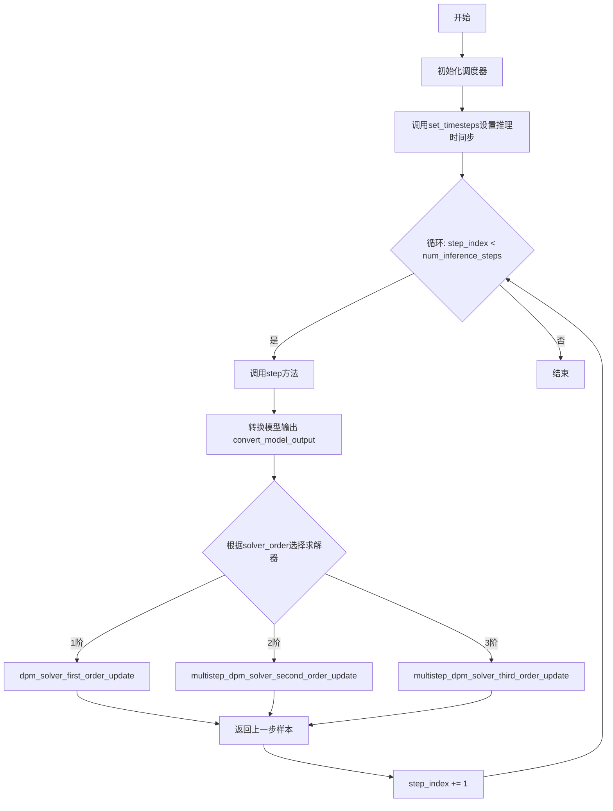
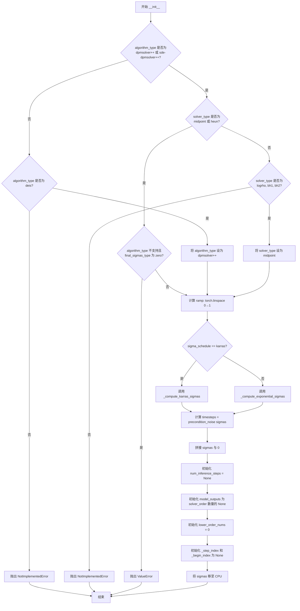
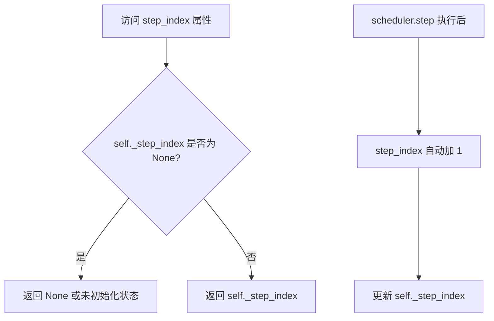
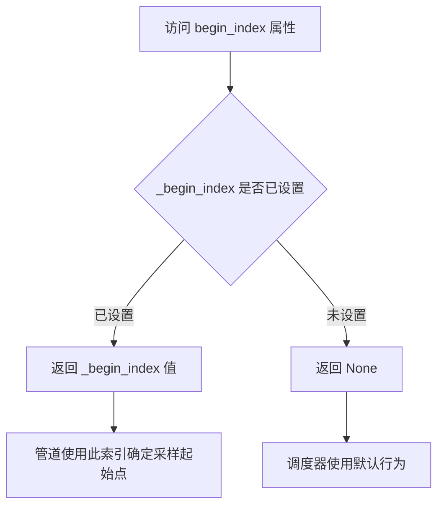
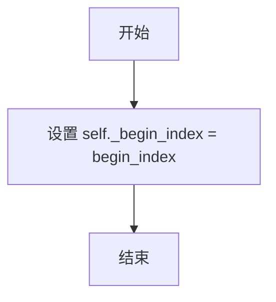
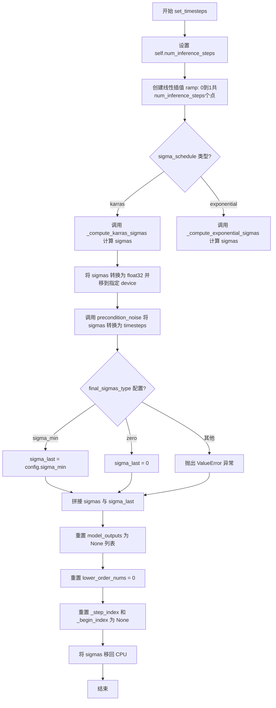
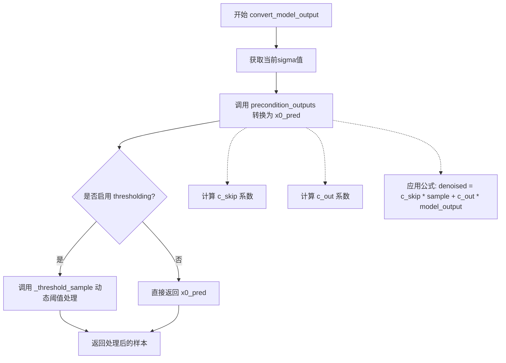
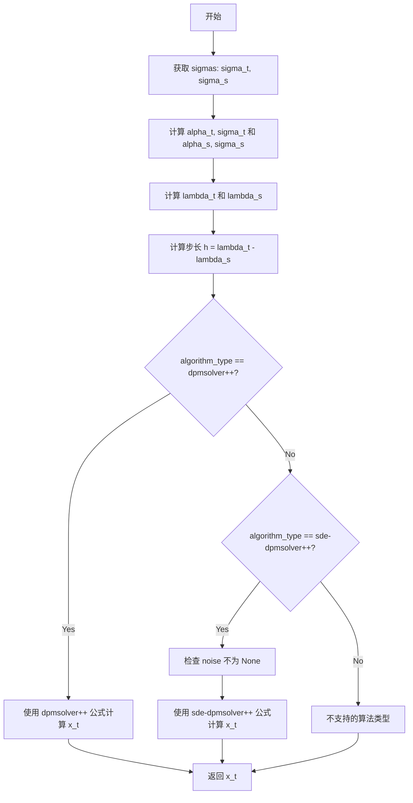
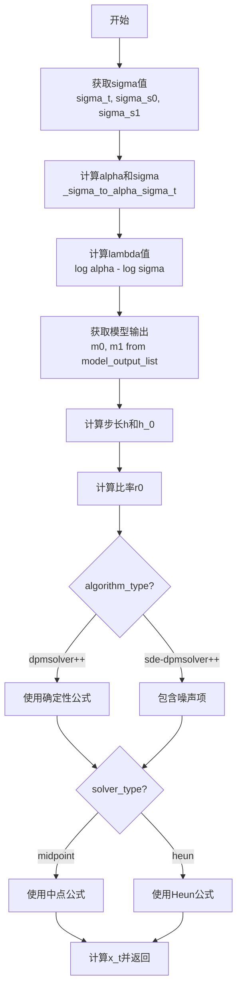

# `diffusers\src\diffusers\schedulers\scheduling_edm_dpmsolver_multistep.py` 详细设计文档

EDMDPMSolverMultistepScheduler实现了基于EDM（Elucidating the Design Space of Diffusion-Based Generative Models）公式的DPMSolver多步调度器，用于扩散模型的快速高质量采样。该调度器支持1-3阶求解器，采用Karras或指数噪声调度计划，并提供动态阈值化功能以提升采样质量。

## 整体流程



## 类结构

```
SchedulerMixin (抽象基类)
└── EDMDPMSolverMultistepScheduler

ConfigMixin (配置混入类)
└── EDMDPMSolverMultistepScheduler
```

## 全局变量及字段


### `_compatibles`
    
List of compatible scheduler classes

类型：`list`
    


### `order`
    
The order of the scheduler, defaults to 1

类型：`int`
    


### `EDMDPMSolverMultistepScheduler.sigma_min`
    
Minimum noise magnitude in the sigma schedule

类型：`float`
    


### `EDMDPMSolverMultistepScheduler.sigma_max`
    
Maximum noise magnitude in the sigma schedule

类型：`float`
    


### `EDMDPMSolverMultistepScheduler.sigma_data`
    
The standard deviation of the data distribution

类型：`float`
    


### `EDMDPMSolverMultistepScheduler.sigma_schedule`
    
Sigma schedule to compute the sigmas (karras or exponential)

类型：`str`
    


### `EDMDPMSolverMultistepScheduler.num_train_timesteps`
    
The number of diffusion steps to train the model

类型：`int`
    


### `EDMDPMSolverMultistepScheduler.prediction_type`
    
Prediction type of the scheduler function (epsilon, sample, or v_prediction)

类型：`str`
    


### `EDMDPMSolverMultistepScheduler.rho`
    
The rho parameter in the Karras sigma schedule

类型：`float`
    


### `EDMDPMSolverMultistepScheduler.solver_order`
    
The DPMSolver order which can be 1, 2, or 3

类型：`int`
    


### `EDMDPMSolverMultistepScheduler.thresholding`
    
Whether to use the dynamic thresholding method

类型：`bool`
    


### `EDMDPMSolverMultistepScheduler.dynamic_thresholding_ratio`
    
The ratio for the dynamic thresholding method

类型：`float`
    


### `EDMDPMSolverMultistepScheduler.sample_max_value`
    
The threshold value for dynamic thresholding

类型：`float`
    


### `EDMDPMSolverMultistepScheduler.algorithm_type`
    
Algorithm type for the solver (dpmsolver++ or sde-dpmsolver++)

类型：`str`
    


### `EDMDPMSolverMultistepScheduler.solver_type`
    
Solver type for the second-order solver (midpoint or heun)

类型：`str`
    


### `EDMDPMSolverMultistepScheduler.lower_order_final`
    
Whether to use lower-order solvers in the final steps

类型：`bool`
    


### `EDMDPMSolverMultistepScheduler.euler_at_final`
    
Whether to use Euler's method in the final step

类型：`bool`
    


### `EDMDPMSolverMultistepScheduler.final_sigmas_type`
    
The final sigma value type for the noise schedule (zero or sigma_min)

类型：`str`
    


### `EDMDPMSolverMultistepScheduler.timesteps`
    
The preprocessed timesteps for the diffusion schedule

类型：`Tensor`
    


### `EDMDPMSolverMultistepScheduler.sigmas`
    
The sigma values array for the noise schedule

类型：`Tensor`
    


### `EDMDPMSolverMultistepScheduler.num_inference_steps`
    
The number of inference steps for sampling

类型：`int`
    


### `EDMDPMSolverMultistepScheduler.model_outputs`
    
List of model outputs from previous timesteps

类型：`list`
    


### `EDMDPMSolverMultistepScheduler.lower_order_nums`
    
Counter for lower-order solver usage

类型：`int`
    


### `EDMDPMSolverMultistepScheduler._step_index`
    
The current step index in the diffusion process

类型：`int`
    


### `EDMDPMSolverMultistepScheduler._begin_index`
    
The starting index for the scheduler

类型：`int`
    


### `EDMDPMSolverMultistepScheduler.order`
    
The order of the scheduler

类型：`int`
    
    

## 全局函数及方法


### EDMDPMSolverMultistepScheduler.__init__

这是 `EDMDPMSolverMultistepScheduler` 类的构造函数，负责初始化 EDM 格式的 DPMSolverMultistepScheduler（一种基于 Karras 等人 2022 年论文的高速高阶扩散 ODE 求解器）。该构造函数设置了噪声调度参数、求解器配置、阈值处理选项等核心参数，并通过 `@register_to_config` 装饰器将参数注册到配置中。

参数：

- `sigma_min`：`float`，可选，默认值为 0.002。噪声调度中的最小噪声幅度（sigma 值），EDM 论文中设置为 0.002，合理范围为 [0, 10]。
- `sigma_max`：`float`，可选，默认值为 80.0。噪声调度中的最大噪声幅度，EDM 论文中设置为 80.0，合理范围为 [0.2, 80.0]。
- `sigma_data`：`float`，可选，默认值为 0.5。数据分布的标准差，EDM 论文中设置为 0.5。
- `sigma_schedule`：`Literal["karras", "exponential"]`，可选，默认值为 "karras"。计算 sigmas 的噪声调度方案，默认为 EDM 论文中引入的 Karras 调度，也可选 "exponential"（指数调度）。
- `num_train_timesteps`：`int`，可选，默认值为 1000。训练模型的扩散步数。
- `prediction_type`：`Literal["epsilon", "sample", "v_prediction"]`，可选，默认值为 "epsilon"。调度器函数的预测类型，可为 "epsilon"（预测噪声）、"sample"（直接预测噪声样本）或 "v_prediction"（见 Imagen Video 论文第 2.4 节）。
- `rho`：`float`，可选，默认值为 7.0。Karras sigma 调度中的 rho 参数，EDM 论文中设置为 7.0。
- `solver_order`：`int`，可选，默认值为 2。DPMSolver 的阶数，可为 1、2 或 3。建议对有条件采样使用 `solver_order=2`，无条件采样使用 `solver_order=3`。
- `thresholding`：`bool`，可选，默认值为 False。是否使用"动态阈值"方法，不适用于 Stable Diffusion 等潜在空间扩散模型。
- `dynamic_thresholding_ratio`：`float`，可选，默认值为 0.995。动态阈值方法的比率，仅在 `thresholding=True` 时有效。
- `sample_max_value`：`float`，可选，默认值为 1.0。动态阈值的阈值值，仅在 `thresholding=True` 且 `algorithm_type="dpmsolver++"` 时有效。
- `algorithm_type`：`Literal["dpmsolver++", "sde-dpmsolver++"]`，可选，默认值为 "dpmsolver++"。求解器的算法类型，"dpmsolver++" 实现 DPMSolver++ 论文中的算法，建议与 `solver_order=2` 结合使用。
- `solver_type`：`Literal["midpoint", "heun"]`，可选，默认值为 "midpoint"。二阶求解器的求解器类型，可选 "midpoint" 或 "heun"，对少量步数影响样本质量。
- `lower_order_final`：`bool`，可选，默认值为 True。是否在最后几步使用低阶求解器，仅对少于 15 个推理步有效，可稳定 DPMSolver 采样。
- `euler_at_final`：`bool`，可选，默认值为 False。是否在最后一步使用欧拉法，是数值稳定性和细节丰富度之间的权衡，可稳定 SDE 变体的采样。
- `final_sigmas_type`：`Literal["zero", "sigma_min"]`，可选，默认值为 "zero"。采样过程中噪声调度的最终 sigma 值，"sigma_min" 表示最终 sigma 与训练调度中的最后一个 sigma 相同，"zero" 表示设置为 0。

返回值：无（构造函数不返回任何值，但会初始化对象状态）

#### 流程图



#### 带注释源码

```python
@register_to_config
def __init__(
    self,
    sigma_min: float = 0.002,  # 最小噪声幅度，默认 0.002
    sigma_max: float = 80.0,  # 最大噪声幅度，默认 80.0
    sigma_data: float = 0.5,  # 数据分布标准差，默认 0.5
    sigma_schedule: Literal["karras", "exponential"] = "karras",  # 噪声调度类型
    num_train_timesteps: int = 1000,  # 训练扩散步数
    prediction_type: Literal["epsilon", "sample", "v_prediction"] = "epsilon",  # 预测类型
    rho: float = 7.0,  # Karras 调度 rho 参数
    solver_order: int = 2,  # DPMSolver 阶数
    thresholding: bool = False,  # 是否启用动态阈值
    dynamic_thresholding_ratio: float = 0.995,  # 动态阈值比率
    sample_max_value: float = 1.0,  # 动态阈值最大值
    algorithm_type: Literal["dpmsolver++", "sde-dpmsolver++"] = "dpmsolver++",  # 算法类型
    solver_type: Literal["midpoint", "heun"] = "midpoint",  # 求解器类型
    lower_order_final: bool = True,  # 最终步骤使用低阶求解器
    euler_at_final: bool = False,  # 最终步骤使用欧拉法
    final_sigmas_type: Literal["zero", "sigma_min"] = "zero",  # 最终 sigma 类型
):
    # 检查 algorithm_type 是否合法，不合法时尝试映射或抛出异常
    if algorithm_type not in ["dpmsolver++", "sde-dpmsolver++"]:
        if algorithm_type == "deis":  # 历史兼容性：deis 被映射为 dpmsolver++
            self.register_to_config(algorithm_type="dpmsolver++")
        else:
            raise NotImplementedError(f"{algorithm_type} is not implemented for {self.__class__}")

    # 检查 solver_type 是否合法，不合法时尝试映射或抛出异常
    if solver_type not in ["midpoint", "heun"]:
        if solver_type in ["logrho", "bh1", "bh2"]:  # 历史兼容性映射
            self.register_to_config(solver_type="midpoint")
        else:
            raise NotImplementedError(f"{solver_type} is not implemented for {self.__class__}")

    # 检查 final_sigmas_type 与 algorithm_type 的兼容性
    if algorithm_type not in ["dpmsolver++", "sde-dpmsolver++"] and final_sigmas_type == "zero":
        raise ValueError(
            f"`final_sigmas_type` {final_sigmas_type} is not supported for `algorithm_type` {algorithm_type}. Please choose `sigma_min` instead."
        )

    # 创建线性间隔的 ramp 张量，用于 sigma 调度计算
    ramp = torch.linspace(0, 1, num_train_timesteps)
    # 根据 sigma_schedule 选择 Karras 或指数调度计算 sigmas
    if sigma_schedule == "karras":
        sigmas = self._compute_karras_sigmas(ramp)  # Karras 2022 论文中的噪声调度
    elif sigma_schedule == "exponential":
        sigmas = self._compute_exponential_sigmas(ramp)  # 指数噪声调度

    # 通过 precondition_noise 将 sigma 转换为对应的时间步
    self.timesteps = self.precondition_noise(sigmas)

    # 将 sigmas 与 0 拼接，作为完整的噪声调度（包括最终sigma=0）
    self.sigmas = torch.cat([sigmas, torch.zeros(1, device=sigmas.device)])

    # 设置可调整的状态变量
    self.num_inference_steps = None  # 推理步数（在 set_timesteps 时设置）
    self.model_outputs = [None] * solver_order  # 模型输出缓存，用于多步求解
    self.lower_order_nums = 0  # 低阶求解器使用计数
    self._step_index = None  # 当前步索引
    self._begin_index = None  # 起始索引
    # 将 sigmas 移至 CPU 以减少 CPU/GPU 通信开销
    self.sigmas = self.sigmas.to("cpu")
```


### `EDMDPMSolverMultistepScheduler.init_noise_sigma`

该属性是 `EDMDPMSolverMultistepScheduler` 类的只读属性，用于获取 EDM（Elucidating the Design Space of Diffusion Models）公式中初始噪声分布的标准差。该值根据配置中的 `sigma_max` 参数计算得出，返回 $\sqrt{\sigma_{max}^2 + 1}$，用于在扩散采样过程开始时确定初始噪声的缩放因子。

参数：

- `self`：`EDMDPMSolverMultistepScheduler`，当前调度器实例，指向调用该属性的对象本身

返回值：`float`，初始噪声分布的标准差，根据 EDM 公式 $\sigma_{init} = \sqrt{\sigma_{max}^2 + 1}$ 计算得出

#### 流程图

```mermaid
flowchart TD
    A[开始: 访问 init_noise_sigma 属性] --> B[获取 self.config.sigma_max]
    B --> C[计算 sigma_max² + 1]
    C --> D[计算平方根: √(sigma_max² + 1)]
    D --> E[返回标准差 float 值]
```

#### 带注释源码

```python
@property
def init_noise_sigma(self) -> float:
    # 获取初始噪声分布的标准差
    # 根据 EDM 论文公式: σ_init = √(σ_max² + 1)
    # 其中 σ_max 是配置中的最大噪声水平
    return (self.config.sigma_max**2 + 1) ** 0.5
```


### `EDMDPMSolverMultistepScheduler.step_index`

该属性用于获取当前时间步的索引计数器。在每个调度器步骤（step）执行后，该索引会自动增加 1，用于追踪扩散模型采样的当前进度。

参数：
- （无参数，该属性不需要额外参数）

返回值：`int`，当前时间步的索引计数器

#### 流程图



#### 带注释源码

```python
@property
def step_index(self) -> int:
    """
    The index counter for current timestep. It will increase 1 after each scheduler step.
    """
    # 返回内部维护的 _step_index 变量，该变量在每次 step() 方法调用后会自动递增
    return self._step_index
```

#### 补充说明

- **属性类型**：这是一个只读的 `@property`，用于暴露内部私有变量 `self._step_index`
- **初始化**：`_step_index` 在 `set_timesteps()` 方法中被初始化为 `None`，在第一次调用 `step()` 方法时通过 `_init_step_index()` 方法设置为实际值
- **用途**：该属性被 `scale_model_input()`、`convert_model_output()`、`dpm_solver_first_order_update()` 等多个方法使用，用于获取当前 sigma 值和模型输出
- **状态管理**：索引会在 `step()` 方法执行完毕后自动递增（`self._step_index += 1`），确保正确追踪采样进度


### `EDMDPMSolverMultistepScheduler.begin_index`

该属性用于获取调度器第一个时间步的索引。该索引应通过 `set_begin_index` 方法从管道中设置，用于控制在扩散链中开始采样的位置。

参数： 无（这是一个属性而非方法）

返回值：`int`，返回第一个时间步的索引值。

#### 流程图



#### 带注释源码

```python
@property
def begin_index(self) -> int:
    """
    The index for the first timestep. It should be set from pipeline with `set_begin_index` method.
    """
    return self._begin_index
```

**代码说明：**

- 这是一个只读属性（read-only property），通过 `@property` 装饰器实现
- `self._begin_index` 是内部私有变量，用于存储第一个时间步的索引
- 该属性通常在管道（pipeline）中使用 `set_begin_index` 方法进行设置
- 如果未设置，则返回 `None`（因为在 `__init__` 中初始化为 `None`）
- 主要用于支持图像到图像（img2img）或修复（inpainting）等场景，允许从扩散过程的中间步骤开始采样


### `EDMDPMSolverMultistepScheduler.set_begin_index`

设置调度器的起始索引。该方法应在推理前从Pipeline调用，用于指定扩散链的起始时间步索引，以便在图像到图像等任务中从中间步骤开始采样。

参数：

- `begin_index`：`int`，默认值 `0`，调度器的起始索引，用于指定从哪个时间步开始推理。

返回值：`None`，无返回值，该方法直接修改内部状态。

#### 流程图



#### 带注释源码

```python
def set_begin_index(self, begin_index: int = 0):
    """
    设置调度器的起始索引。此方法应在推理前从pipeline调用。

    Args:
        begin_index (`int`, 默认为 `0`):
            调度器的起始索引。
    """
    # 将传入的 begin_index 值赋给内部属性 _begin_index
    # 该属性用于记录扩散过程的起始时间步索引
    self._begin_index = begin_index
```


### `EDMDPMSolverMultistepScheduler.precondition_inputs`

该方法用于根据EDM（Elucidating the Design Space of Diffusion-Based Generative Models）公式对输入样本进行预处理缩放，通过计算条件因子c_in并将样本乘以该因子来实现噪声水平的自适应调整。

参数：

- `sample`：`torch.Tensor`，输入的样本张量，需要进行预处理缩放
- `sigma`：`float | torch.Tensor`，当前的sigma（噪声水平）值，用于计算条件因子

返回值：`torch.Tensor`，缩放后的输入样本

#### 流程图

```mermaid
flowchart TD
    A[开始 precondition_inputs] --> B{sigma 是 torch.Tensor?}
    B -->|是| C[直接使用 sigma]
    B -->|否| D[将 sigma 转换为 torch.Tensor]
    D --> C
    C --> E[调用 _get_conditioning_c_in 计算 c_in]
    E --> F[计算 c_in = 1 / sqrt(sigma^2 + sigma_data^2)]
    F --> G[计算 scaled_sample = sample * c_in]
    G --> H[返回 scaled_sample]
```

#### 带注释源码

```python
def precondition_inputs(self, sample: torch.Tensor, sigma: float | torch.Tensor) -> torch.Tensor:
    """
    Precondition the input sample by scaling it according to the EDM formulation.
    根据EDM公式对输入样本进行预处理缩放

    Args:
        sample (`torch.Tensor`):
            The input sample tensor to precondition.
            需要预处理的输入样本张量
        sigma (`float` or `torch.Tensor`):
            The current sigma (noise level) value.
            当前的sigma（噪声水平）值

    Returns:
        `torch.Tensor`:
            The scaled input sample.
            缩放后的输入样本
    """
    # 获取条件因子 c_in，用于缩放样本
    # 计算公式: c_in = 1 / sqrt(sigma^2 + sigma_data^2)
    # sigma_data 是配置中的数据分布标准差（默认为0.5）
    c_in = self._get_conditioning_c_in(sigma)
    
    # 将输入样本乘以条件因子进行缩放
    scaled_sample = sample * c_in
    
    # 返回缩放后的样本
    return scaled_sample
```


### `EDMDPMSolverMultistepScheduler.precondition_noise`

该方法用于对噪声水平（sigma）进行对数变换预处理，是EDM公式中噪声调度的核心预处理步骤。

参数：

-  `sigma`：`float | torch.Tensor`，当前 sigma（噪声水平）值，用于预处理

返回值：`torch.Tensor`，预处理后的噪声值，计算公式为 `0.25 * log(sigma)`

#### 流程图

```mermaid
flowchart TD
    A[开始 precondition_noise] --> B{sigma 是否为 torch.Tensor}
    B -- 否 --> C[将 sigma 转换为 torch.Tensor]
    B -- 是 --> D[直接使用 sigma]
    C --> E[计算 c_noise = 0.25 * torch.log(sigma)]
    D --> E
    E --> F[返回 c_noise]
```

#### 带注释源码

```
def precondition_noise(self, sigma: float | torch.Tensor) -> torch.Tensor:
    """
    Precondition the noise level by applying a logarithmic transformation.
    对噪声水平进行对数变换预处理

    Args:
        sigma (`float` or `torch.Tensor`):
            The sigma (noise level) value to precondition.
            sigma（噪声水平）值，用于预处理

    Returns:
        `torch.Tensor`:
            The preconditioned noise value computed as `0.25 * log(sigma)`.
            预处理后的噪声值，计算公式为 0.25 * log(sigma)
    """
    # 如果 sigma 不是张量，则将其转换为张量
    # 这确保了后续的 log 操作能够正确执行
    if not isinstance(sigma, torch.Tensor):
        sigma = torch.tensor([sigma])

    # 使用 EDM 公式计算预处理后的噪声值
    # 公式：c_noise = 0.25 * log(sigma)
    # 这个变换将噪声水平映射到对数空间
    c_noise = 0.25 * torch.log(sigma)

    # 返回预处理后的噪声值
    return c_noise
```


### `EDMDPMSolverMultistepScheduler.precondition_outputs`

该函数实现了EDM（Elucidating the Design Space of Diffusion-Based Generative Models）公式中的输出预处理逻辑，根据不同的预测类型（epsilon或v_prediction）计算去噪样本所需的缩放系数，并将模型输出转换为去噪后的样本。

参数：

- `self`：`EDMDPMSolverMultistepScheduler`，调度器实例自身
- `sample`：`torch.Tensor`，输入样本张量
- `model_output`：`torch.Tensor`，学习到的扩散模型的直接输出
- `sigma`：`float | torch.Tensor`，当前sigma（噪声水平）值

返回值：`torch.Tensor`，通过结合skip连接和输出缩放计算得到的去噪样本

#### 流程图

```mermaid
flowchart TD
    A[开始 precondition_outputs] --> B[获取 sigma_data 配置值]
    B --> C[计算 c_skip 系数: sigma_data² / (sigma² + sigma_data²)]
    D{预测类型判断} -->|epsilon| E[计算 c_out: sigma * sigma_data / √(sigma² + sigma_data²)]
    D -->|v_prediction| F[计算 c_out: -sigma * sigma_data / √(sigma² + sigma_data²)]
    D -->|其他| G[抛出 ValueError 异常]
    E --> H[计算去噪样本: denoised = c_skip * sample + c_out * model_output]
    F --> H
    G --> I[结束]
    H --> J[返回 denoised 张量]
```

#### 带注释源码

```python
def precondition_outputs(
    self,
    sample: torch.Tensor,
    model_output: torch.Tensor,
    sigma: float | torch.Tensor,
) -> torch.Tensor:
    """
    Precondition the model outputs according to the EDM formulation.

    Args:
        sample (`torch.Tensor`):
            The input sample tensor.
        model_output (`torch.Tensor`):
            The direct output from the learned diffusion model.
        sigma (`float` or `torch.Tensor`):
            The current sigma (noise level) value.

    Returns:
        `torch.Tensor`:
            The denoised sample computed by combining the skip connection and output scaling.
    """
    # 从配置中获取数据分布的标准差 sigma_data
    sigma_data = self.config.sigma_data
    
    # 计算 skip 连接系数 c_skip，用于保留原始样本的部分信息
    # EDM 公式: c_skip = sigma_data² / (sigma² + sigma_data²)
    c_skip = sigma_data**2 / (sigma**2 + sigma_data**2)

    # 根据预测类型计算输出缩放系数 c_out
    if self.config.prediction_type == "epsilon":
        # epsilon 预测：预测噪声
        # EDM 公式: c_out = sigma * sigma_data / √(sigma² + sigma_data²)
        c_out = sigma * sigma_data / (sigma**2 + sigma_data**2) ** 0.5
    elif self.config.prediction_type == "v_prediction":
        # v_prediction 预测：速度预测
        # EDM 公式: c_out = -sigma * sigma_data / √(sigma² + sigma_data²)
        c_out = -sigma * sigma_data / (sigma**2 + sigma_data**2) ** 0.5
    else:
        # 不支持的预测类型，抛出异常
        raise ValueError(f"Prediction type {self.config.prediction_type} is not supported.")

    # 结合 skip 连接和输出缩放，计算最终的去噪样本
    # EDM 公式: x₀ = c_skip * x_t + c_out * ε_θ(x_t, σ)
    denoised = c_skip * sample + c_out * model_output

    return denoised
```


### `EDMDPMSolverMultistepScheduler.scale_model_input`

该方法用于根据当前时间步的噪声水平（sigma）对去噪模型的输入进行缩放预处理，以适配 Euler 算法。这是 EDM（Elucidating the Design Space of Diffusion-Based Generative Models）公式化调度器的关键预处理步骤，确保与其他需要根据时间步缩放输入的调度器的互操作性。

参数：

- `self`：`EDMDPMSolverMultistepScheduler`，调度器实例本身
- `sample`：`torch.Tensor`，输入的样本张量（通常为带噪声的图像或潜空间数据）
- `timestep`：`float | torch.Tensor`，扩散链中的当前时间步，可以是浮点数或张量

返回值：`torch.Tensor`，经过缩放预处理后的输入样本

#### 流程图

```mermaid
flowchart TD
    A[开始 scale_model_input] --> B{self.step_index 是否为 None?}
    B -->|是| C[调用 self._init_step_index(timestep) 初始化步索引]
    B -->|否| D[直接获取 sigma]
    C --> D
    D --> E[从 self.sigmas 获取当前 step_index 对应的 sigma 值]
    E --> F[调用 self.precondition_inputs 进行输入预处理]
    F --> G[设置 self.is_scale_input_called = True 标记已调用]
    G --> H[返回缩放后的 sample]
```

#### 带注释源码

```python
def scale_model_input(self, sample: torch.Tensor, timestep: float | torch.Tensor) -> torch.Tensor:
    """
    Scale the denoising model input to match the Euler algorithm. Ensures interchangeability with schedulers that
    need to scale the denoising model input depending on the current timestep.

    Args:
        sample (`torch.Tensor`):
            The input sample tensor.
        timestep (`float` or `torch.Tensor`):
            The current timestep in the diffusion chain.

    Returns:
        `torch.Tensor`:
            A scaled input sample.
    """
    # 如果当前步索引未初始化，则根据时间步初始化步索引
    # 这确保了调度器在首次调用时能正确定位到对应的时间步位置
    if self.step_index is None:
        self._init_step_index(timestep)

    # 获取当前时间步对应的 sigma 值（噪声水平）
    # sigma 是 EDM 公式中的关键参数，表示噪声的标准差
    sigma = self.sigmas[self.step_index]
    
    # 调用预处理函数对输入样本进行缩放
    # 预处理公式: scaled_sample = sample * c_in
    # 其中 c_in = 1 / sqrt(sigma^2 + sigma_data^2)
    # 这确保了输入数据的尺度与模型训练时的数据分布一致
    sample = self.precondition_inputs(sample, sigma)

    # 设置标记，表示 scale_model_input 已被调用
    # 这用于后续检查或其他调度器逻辑
    self.is_scale_input_called = True
    
    # 返回经过缩放预处理的样本，供去噪模型使用
    return sample
```


### `EDMDPMSolverMultistepScheduler.set_timesteps`

该方法用于在推理前设置扩散链的离散时间步，根据配置的sigma调度类型（karras或exponential）计算sigma值，并初始化调度器的内部状态。

参数：

- `num_inference_steps`：`int`，生成样本时使用的扩散步数
- `device`：`str | torch.device | None`，时间步移动到的设备，默认为None则不移动

返回值：无（`None`），该方法直接修改调度器实例的内部状态

#### 流程图



#### 带注释源码

```python
def set_timesteps(
    self,
    num_inference_steps: int = None,
    device: str | torch.device | None = None,
):
    """
    Sets the discrete timesteps used for the diffusion chain (to be run before inference).

    Args:
        num_inference_steps (`int`):
            The number of diffusion steps used when generating samples with a pre-trained model.
        device (`str` or `torch.device`, *optional*):
            The device to which the timesteps should be moved to. If `None`, the timesteps are not moved.
    """
    # 1. 设置推理步数
    self.num_inference_steps = num_inference_steps

    # 2. 创建从0到1的线性插值张量，用于生成sigma调度
    ramp = torch.linspace(0, 1, self.num_inference_steps)
    
    # 3. 根据配置选择sigma调度算法（karras或exponential）
    if self.config.sigma_schedule == "karras":
        # 使用Karras等人2022年论文中的sigma调度
        sigmas = self._compute_karras_sigmas(ramp)
    elif self.config.sigma_schedule == "exponential":
        # 使用指数sigma调度
        sigmas = self._compute_exponential_sigmas(ramp)

    # 4. 将sigmas转换为float32并移动到指定设备
    sigmas = sigmas.to(dtype=torch.float32, device=device)
    
    # 5. 使用precondition_noise将sigma值转换为时间步
    # 这是EDM公式的一部分，将噪声水平转换为对应的时间步
    self.timesteps = self.precondition_noise(sigmas)

    # 6. 根据final_sigmas_type确定最后一个sigma值
    if self.config.final_sigmas_type == "sigma_min":
        sigma_last = self.config.sigma_min
    elif self.config.final_sigmas_type == "zero":
        sigma_last = 0
    else:
        raise ValueError(
            f"`final_sigmas_type` must be one of 'zero', or 'sigma_min', but got {self.config.final_sigmas_type}"
        )

    # 7. 将sigmas与最后一个sigma值拼接，形成完整的sigma序列
    # 最后一个sigma为0表示最终去噪到纯数据
    self.sigmas = torch.cat([sigmas, torch.tensor([sigma_last], dtype=torch.float32, device=device)])

    # 8. 重置模型输出缓冲区，用于存储多步求解器的历史输出
    self.model_outputs = [
        None,
    ] * self.config.solver_order
    # 9. 重置低阶求解器计数
    self.lower_order_nums = 0

    # 10. 重置调度器索引，为支持重复时间步的调度器添加索引计数器
    self._step_index = None
    self._begin_index = None
    
    # 11. 将sigmas移回CPU以减少CPU/GPU通信开销
    # 这是因为在实际推理中，sigmas主要用于索引而非计算
    self.sigmas = self.sigmas.to("cpu")
```


### `EDMDPMSolverMultistepScheduler._compute_karras_sigmas`

该方法实现了 Karras 等人于 2022 年提出的噪声调度（Noise Schedule）算法。它通过非线性插值的方式，将线性空间 `[0, 1]` 的输入张量（ramp）映射为符合扩散模型采样需求的 sigma 值序列。该算法是 EDM (Elucidating the Design Space of Diffusion-Based Generative Models) 论文的核心组件之一，旨在提供更稳定的采样过程。

参数：

- `self`：实例本身。
- `ramp`：`torch.Tensor`，输入的线性插值张量，值通常分布在 `[0, 1]` 区间内，代表时间步的相对位置。
- `sigma_min`：`float | None`，最小 sigma 值（噪声水平）。如果未传入，则使用配置中的 `self.config.sigma_min`（默认 0.002）。
- `sigma_max`：`float | None`，最大 sigma 值（噪声水平）。如果未传入，则使用配置中的 `self.config.sigma_max`（默认 80.0）。

返回值：`torch.Tensor`，计算得出的 Karras sigma 调度序列，形状与 `ramp` 相同。

#### 流程图

```mermaid
graph TD
    A[开始: _compute_karras_sigmas] --> B{检查 sigma_min};
    B -->|传入值| C[使用传入的 sigma_min];
    B -->|None| D[使用 self.config.sigma_min];
    C --> E{检查 sigma_max};
    D --> E;
    E -->|传入值| F[使用传入的 sigma_max];
    E -->|None| G[使用 self.config.sigma_max];
    F --> H[获取配置参数 rho];
    G --> H;
    H --> I[计算 min_inv_rho = sigma_min ^ (1 / rho)];
    I --> J[计算 max_inv_rho = sigma_max ^ (1 / rho)];
    J --> K[应用 Karras 公式: sigmas = (max_inv_rho + ramp * (min_inv_rho - max_inv_rho)) ^ rho];
    K --> L[返回 sigmas 张量];
```

#### 带注释源码

```python
def _compute_karras_sigmas(
    self,
    ramp: torch.Tensor,
    sigma_min: float | None = None,
    sigma_max: float | None = None,
) -> torch.Tensor:
    """
    Construct the noise schedule of [Karras et al. (2022)](https://huggingface.co/papers/2206.00364).

    Args:
        ramp (`torch.Tensor`):
            A tensor of values in [0, 1] representing the interpolation positions.
        sigma_min (`float`, *optional*):
            Minimum sigma value. If `None`, uses `self.config.sigma_min`.
        sigma_max (`float`, *optional*):
            Maximum sigma value. If `None`, uses `self.config.sigma_max`.

    Returns:
        `torch.Tensor`:
            The computed Karras sigma schedule.
    """
    # 1. 确定最小和最大 sigma 值
    # 如果调用者没有显式提供，则回退到类的配置默认值
    sigma_min = sigma_min or self.config.sigma_min
    sigma_max = sigma_max or self.config.sigma_max

    # 2. 获取调度超参数 rho
    # rho 控制 sigma 变化的非线性程度，在 EDM 论文中通常设为 7.0
    rho = self.config.rho

    # 3. 预处理 sigma 值
    # 这里的公式对应论文中的: sigma = (sigma_max^(1/rho) + t * (sigma_min^(1/rho) - sigma_max^(1/rho)))^rho
    # 先计算 1/rho 次幂，将乘法转换为加法，便于线性插值
    min_inv_rho = sigma_min ** (1 / rho)
    max_inv_rho = sigma_max ** (1 / rho)

    # 4. 执行线性插值并还原幂次
    # ramp 是一个 [0, 1] 的线性张量
    sigmas = (max_inv_rho + ramp * (min_inv_rho - max_inv_rho)) ** rho
    
    return sigmas
```


### `EDMDPMSolverMultistepScheduler._compute_exponential_sigmas`

该方法用于计算指数（exponential）sigma调度表，这是扩散模型中噪声调度的一种实现方式。它通过在对数空间中线性插值生成sigma值，然后取指数并翻转顺序，以实现从高噪声到低噪声的过渡。

参数：

- `self`：类的实例方法，包含调度器的配置信息。
- `ramp`：`torch.Tensor`，表示插值位置的张量，值为[0, 1]范围内的浮点数序列。
- `sigma_min`：`float | None`，最小的sigma值。如果为`None`，则使用配置中的`sigma_min`（默认为0.002）。
- `sigma_max`：`float | None`，最大的sigma值。如果为`None`，则使用配置中的`sigma_max`（默认为80.0）。

返回值：`torch.Tensor`，计算得到的指数sigma调度表，是一个从大到小排列的张量。

#### 流程图

```mermaid
flowchart TD
    A[开始] --> B{sigma_min是否为None}
    B -->|是| C[使用self.config.sigma_min]
    B -->|否| D[使用传入的sigma_min]
    C --> E{sigma_max是否为None}
    D --> E
    E -->|是| F[使用self.config.sigma_max]
    E -->|否| G[使用传入的sigma_max]
    F --> H[计算对数空间线性插值]
    G --> H
    H --> I[torch.linspace log值]
    I --> J[取指数 .exp()]
    J --> K[翻转顺序 .flip]
    K --> L[返回sigmas张量]
```

#### 带注释源码

```python
def _compute_exponential_sigmas(
    self,
    ramp: torch.Tensor,
    sigma_min: float | None = None,
    sigma_max: float | None = None,
) -> torch.Tensor:
    """
    Compute the exponential sigma schedule. Implementation closely follows k-diffusion:
    https://github.com/crowsonkb/k-diffusion/blob/6ab5146d4a5ef63901326489f31f1d8e7dd36b48/k_diffusion/sampling.py#L26

    Args:
        ramp (`torch.Tensor`):
            A tensor of values representing the interpolation positions.
        sigma_min (`float`, *optional*):
            Minimum sigma value. If `None`, uses `self.config.sigma_min`.
        sigma_max (`float`, *optional*):
            Maximum sigma value. If `None`, uses `self.config.sigma_max`.

    Returns:
        `torch.Tensor`:
            The computed exponential sigma schedule.
    """
    # 如果未指定sigma_min，则使用配置中的默认值
    sigma_min = sigma_min or self.config.sigma_min
    # 如果未指定sigma_max，则使用配置中的默认值
    sigma_max = sigma_max or self.config.sigma_max
    
    # 在对数空间中创建线性插值，然后取指数得到指数分布的sigma值
    # 1. math.log(sigma_min)和math.log(sigma_max)在对数空间中定义范围
    # 2. torch.linspace在此范围内创建len(ramp)个点
    # 3. .exp()将對數值轉換回線性尺度
    # 4. .flip(0)翻轉順序，使sigma從大到小排列（高噪聲到低噪聲）
    sigmas = torch.linspace(math.log(sigma_min), math.log(sigma_max), len(ramp)).exp().flip(0)
    
    return sigmas
```


### `EDMDPMSolverMultistepScheduler._threshold_sample`

该方法用于对预测样本应用动态阈值处理（Dynamic Thresholding），通过计算每个样本的特定百分位绝对像素值作为动态阈值，将样本限制在 [-s, s] 范围内并除以 s 以实现归一化，从而防止像素饱和并提升图像真实感和文本对齐效果。

参数：

- `self`：隐式参数，调度器实例本身
- `sample`：`torch.Tensor`，需要进行阈值处理的预测样本

返回值：`torch.Tensor`，经过阈值处理后的样本

#### 流程图

```mermaid
flowchart TD
    A[开始] --> B[保存原始数据类型]
    B --> C{数据类型是否为float32或float64?}
    C -->|是| D[继续]
    C -->|否| E[转换为float32以进行分位数计算]
    E --> D
    D --> F[将样本reshape为batch_size x (channels × remaining_dims)]
    F --> G[计算绝对值样本abs_sample]
    G --> H[计算dynamic_thresholding_ratio百分位的阈值s]
    H --> I[将s限制在min=1和max=sample_max_value范围内]
    I --> J[将s扩展为batch_size x 1以支持广播]
    J --> K[将样本限制在[-s, s]范围内并除以s]
    K --> L[恢复原始形状batch_size x channels x remaining_dims]
    L --> M[恢复原始数据类型]
    M --> N[返回阈值处理后的样本]
```

#### 带注释源码

```python
def _threshold_sample(self, sample: torch.Tensor) -> torch.Tensor:
    """
    Apply dynamic thresholding to the predicted sample.

    "Dynamic thresholding: At each sampling step we set s to a certain percentile absolute pixel value in xt0 (the
    prediction of x_0 at timestep t), and if s > 1, then we threshold xt0 to the range [-s, s] and then divide by
    s. Dynamic thresholding pushes saturated pixels (those near -1 and 1) inwards, thereby actively preventing
    pixels from saturation at each step. We find that dynamic thresholding results in significantly better
    photorealism as well as better image-text alignment, especially when using very large guidance weights."

    https://huggingface.co/papers/2205.11487

    Args:
        sample (`torch.Tensor`):
            The predicted sample to be thresholded.

    Returns:
        `torch.Tensor`:
            The thresholded sample.
    """
    # 保存原始数据类型以便后续恢复
    dtype = sample.dtype
    # 获取样本的形状信息：批次大小、通道数、剩余维度
    batch_size, channels, *remaining_dims = sample.shape

    # 如果数据类型不是float32或float64，需要进行类型提升
    # 因为分位数计算和clamp操作在CPU上对半精度浮点数支持有限
    if dtype not in (torch.float32, torch.float64):
        sample = sample.float()  # upcast for quantile calculation, and clamp not implemented for cpu half

    # 展平样本以便沿每个图像进行分位数计算
    # 将形状从 [batch, channels, H, W] 转换为 [batch, channels*H*W]
    sample = sample.reshape(batch_size, channels * np.prod(remaining_dims))

    # 计算绝对值样本："a certain percentile absolute pixel value"
    abs_sample = sample.abs()

    # 计算指定百分比的阈值s（默认为0.995）
    # dim=1 表示沿着一维（每个样本的像素）计算分位数
    s = torch.quantile(abs_sample, self.config.dynamic_thresholding_ratio, dim=1)
    
    # 将s限制在[1, sample_max_value]范围内
    # 当min=1时，等价于标准裁剪到[-1, 1]
    s = torch.clamp(
        s, min=1, max=self.config.sample_max_value
    )  # When clamped to min=1, equivalent to standard clipping to [-1, 1]
    
    # 扩展s的维度为(batch_size, 1)以便沿dim=0进行广播
    s = s.unsqueeze(1)  # (batch_size, 1) because clamp will broadcast along dim=0
    
    # "we threshold xt0 to the range [-s, s] and then divide by s"
    # 将样本裁剪到[-s, s]范围，然后除以s进行归一化
    sample = torch.clamp(sample, -s, s) / s

    # 恢复原始形状
    sample = sample.reshape(batch_size, channels, *remaining_dims)
    
    # 恢复原始数据类型
    sample = sample.to(dtype)

    return sample
```


### `EDMDPMSolverMultistepScheduler._sigma_to_t`

该方法通过插值将sigma值（噪声水平）转换为对应的时间步索引值。它在离散的时间步调度中建立sigma与时间步之间的映射关系，支持在任意sigma值处进行时间步的查询和转换。

参数：

- `sigma`：`np.ndarray`，要转换的sigma值（噪声水平），可以是单个值或数组
- `log_sigmas`：`np.ndarray`，sigma值的对数序列，用于插值计算

返回值：`np.ndarray`，转换后的时间步索引值，与输入sigma的形状相同

#### 流程图

```mermaid
flowchart TD
    A[开始: _sigma_to_t] --> B[计算log_sigma = log/maxsigma, 1e-10]
    B --> C[计算距离矩阵: dists = log_sigma - log_sigmas[:, np.newaxis]]
    C --> D[找到low_idx: cumsum大于等于0后的第一个True位置]
    D --> E[计算high_idx = low_idx + 1]
    E --> F[获取low和high对应的log_sigma值]
    F --> G[计算插值权重: w = low - log_sigma / low - high]
    G --> H[裁剪权重: w = clipw, 0, 1]
    H --> I[计算时间步: t = 1-w * low_idx + w * high_idx]
    I --> J[reshape输出形状与sigma相同]
    J --> K[返回时间步t]
```

#### 带注释源码

```python
def _sigma_to_t(self, sigma, log_sigmas):
    """
    Convert sigma values to corresponding timestep values through interpolation.

    Args:
        sigma (`np.ndarray`):
            The sigma value(s) to convert to timestep(s).
        log_sigmas (`np.ndarray`):
            The logarithm of the sigma schedule used for interpolation.

    Returns:
        `np.ndarray`:
            The interpolated timestep value(s) corresponding to the input sigma(s).
    """
    # get log sigma
    # 计算sigma的对数值，使用maximum确保数值稳定性，避免log(0)
    log_sigma = np.log(np.maximum(sigma, 1e-10))

    # get distribution
    # 计算log_sigma与log_sigmas数组中每个值的差值
    # 结果形状为 [len(log_sigmas), len(sigma)]
    dists = log_sigma - log_sigmas[:, np.newaxis]

    # get sigmas range
    # 通过cumsum和argmax找到log_sigma在log_sigmas中的下界索引
    # clip确保索引不会超出数组范围
    low_idx = np.cumsum((dists >= 0), axis=0).argmax(axis=0).clip(max=log_sigmas.shape[0] - 2)
    # high_idx是low_idx的下一个索引
    high_idx = low_idx + 1

    # 获取上下界的log_sigma值
    low = log_sigmas[low_idx]
    high = log_sigmas[high_idx]

    # interpolate sigmas
    # 计算线性插值权重w
    w = (low - log_sigma) / (low - high)
    # 将权重裁剪到[0, 1]范围，确保是有效的概率值
    w = np.clip(w, 0, 1)

    # transform interpolation to time range
    # 使用线性插值计算最终的时间步索引
    t = (1 - w) * low_idx + w * high_idx
    # 调整输出形状与输入sigma形状一致
    t = t.reshape(sigma.shape)
    return t
```


### `EDMDPMSolverMultistepScheduler._sigma_to_alpha_sigma_t`

该函数用于将EDM格式的sigma值转换为对应的alpha值和sigma值。由于输入在进入UNet之前已经进行了预处理（pre-scaled），因此alpha_t固定返回1，sigma_t直接返回输入的sigma值。

参数：

- `sigma`：`float | torch.Tensor`，当前的sigma（噪声水平）值

返回值：`tuple[torch.Tensor, float | torch.Tensor]`，返回alpha_t和sigma_t的元组，其中alpha_t固定为1（因为输入已预处理），sigma_t为输入的sigma值

#### 流程图

```mermaid
flowchart TD
    A[开始 _sigma_to_alpha_sigma_t] --> B[创建alpha_t张量 = torch.tensor(1)]
    B --> C[将输入的sigma赋值给sigma_t]
    C --> D[返回 (alpha_t, sigma_t) 元组]
    
    B --> B1[注释: 输入已预缩放<br/>所以alpha_t = 1]
    B1 --> C
```

#### 带注释源码

```python
def _sigma_to_alpha_sigma_t(self, sigma):
    """
    将sigma值转换为对应的alpha值和sigma值。
    
    在EDM公式中，由于输入在进入UNet之前已经进行了预处理（pre-scaled），
    因此alpha_t固定返回1，sigma_t直接返回输入的sigma值。
    
    Args:
        sigma: 当前的sigma（噪声水平）值，可以是float或torch.Tensor
        
    Returns:
        tuple: (alpha_t, sigma_t)元组
            - alpha_t: 固定为torch.tensor(1)，因为输入已预处理
            - sigma_t: 输入的sigma值
    """
    # 由于输入在进入UNet之前已经进行了预处理（pre-scaled），
    # 因此 alpha_t = 1
    alpha_t = torch.tensor(1)
    
    # sigma_t 直接使用输入的sigma值
    sigma_t = sigma
    
    # 返回 (alpha_t, sigma_t) 元组
    return alpha_t, sigma_t
```


### `EDMDPMSolverMultistepScheduler.convert_model_output`

该方法将扩散模型的原始输出转换为DPMSolver/DPMSolver++算法所需的数据预测格式（x0预测），通过EDM公式的预处理和可选的动态阈值处理，使模型输出适用于多步DPM求解器的采样流程。

参数：
- `model_output`：`torch.Tensor`，扩散模型的直接输出（噪声预测或v预测）
- `sample`：`torch.Tensor`，当前由扩散过程创建的样本实例（带噪样本）

返回值：`torch.Tensor`，转换后的模型输出（预测的干净样本x0）

#### 流程图



#### 带注释源码

```python
def convert_model_output(
    self,
    model_output: torch.Tensor,
    sample: torch.Tensor,
) -> torch.Tensor:
    """
    Convert the model output to the corresponding type the DPMSolver/DPMSolver++ algorithm needs. DPM-Solver is
    designed to discretize an integral of the noise prediction model, and DPM-Solver++ is designed to discretize an
    integral of the data prediction model.

    > [!TIP] > The algorithm and model type are decoupled. You can use either DPMSolver or DPMSolver++ for both
    noise > prediction and data prediction models.

    Args:
        model_output (`torch.Tensor`):
            The direct output from the learned diffusion model.
        sample (`torch.Tensor`):
            A current instance of a sample created by the diffusion process.

    Returns:
        `torch.Tensor`:
            The converted model output.
    """
    # 步骤1: 获取当前时间步对应的sigma值（噪声水平）
    sigma = self.sigmas[self.step_index]
    
    # 步骤2: 使用EDM预处理公式将模型输出转换为预测的干净样本x0
    # 核心公式: denoised = c_skip * sample + c_out * model_output
    # 其中 c_skip = sigma_data^2 / (sigma^2 + sigma_data^2)
    #       c_out = sigma * sigma_data / sqrt(sigma^2 + sigma_data^2)
    x0_pred = self.precondition_outputs(sample, model_output, sigma)

    # 步骤3: 如果启用了动态阈值处理，则对x0_pred进行阈值处理
    # 动态阈值可以防止像素饱和，提高生成质量
    if self.config.thresholding:
        x0_pred = self._threshold_sample(x0_pred)

    # 步骤4: 返回转换后的模型输出（预测的x0）
    return x0_pred
```


### `EDMDPMSolverMultistepScheduler.dpm_solver_first_order_update`

该函数实现了 DPM-Solver 一阶更新（相当于 DDIM），用于在扩散模型的采样过程中根据当前模型输出和样本计算前一个时间步的样本。根据算法类型（dpmsolver++ 或 sde-dpmsolver++）采用不同的更新公式，后者还引入了随机噪声项。

参数：

- `self`：`EDMDPMSolverMultistepScheduler`，调度器实例，包含配置参数和状态
- `model_output`：`torch.Tensor`，来自学习到的扩散模型的直接输出（预测的噪声或去噪样本）
- `sample`：`torch.Tensor`，由扩散过程生成的当前样本实例
- `noise`：`torch.Tensor | None`，可选参数，要添加到原始样本的噪声张量，仅在 `sde-dpmsolver++` 算法类型下使用

返回值：`torch.Tensor`，前一个时间步的样本张量

#### 流程图



#### 带注释源码

```python
def dpm_solver_first_order_update(
    self,
    model_output: torch.Tensor,
    sample: torch.Tensor,
    noise: torch.Tensor | None = None,
) -> torch.Tensor:
    """
    One step for the first-order DPMSolver (equivalent to DDIM).

    Args:
        model_output (`torch.Tensor`):
            The direct output from the learned diffusion model.
        sample (`torch.Tensor`):
            A current instance of a sample created by the diffusion process.
        noise (`torch.Tensor`, *optional*):
            The noise tensor to add to the original samples.

    Returns:
        `torch.Tensor`:
            The sample tensor at the previous timestep.
    """
    # 获取当前时间步和前一个时间步的 sigma 值
    sigma_t, sigma_s = (
        self.sigmas[self.step_index + 1],  # 目标时间步的 sigma
        self.sigmas[self.step_index],       # 当前时间步的 sigma
    )
    
    # 转换为 alpha 和 sigma (在 EDM 公式中 alpha_t = 1 因为输入已经预处理过)
    alpha_t, sigma_t = self._sigma_to_alpha_sigma_t(sigma_t)
    alpha_s, sigma_s = self._sigma_to_alpha_sigma_t(sigma_s)
    
    # 计算 log-sigma 差值 (lambda = log(alpha) - log(sigma))
    lambda_t = torch.log(alpha_t) - torch.log(sigma_t)
    lambda_s = torch.log(alpha_s) - torch.log(sigma_s)

    # 计算步长 h
    h = lambda_t - lambda_s
    
    # 根据算法类型选择不同的更新公式
    if self.config.algorithm_type == "dpmsolver++":
        # DPMSolver++ 一阶更新 (确定性 ODE 求解)
        # 公式: x_t = (sigma_t / sigma_s) * x_s - alpha_t * (exp(-h) - 1) * model_output
        x_t = (sigma_t / sigma_s) * sample - (alpha_t * (torch.exp(-h) - 1.0)) * model_output
    elif self.config.algorithm_type == "sde-dpmsolver++":
        # SDE 版本的 DPMSolver++ 一阶更新 (包含随机噪声项)
        assert noise is not None
        x_t = (
            (sigma_t / sigma_s * torch.exp(-h)) * sample
            + (alpha_t * (1 - torch.exp(-2.0 * h))) * model_output
            + sigma_t * torch.sqrt(1.0 - torch.exp(-2 * h)) * noise
        )

    return x_t
```


### `EDMDPMSolverMultistepScheduler.multistep_dpm_solver_second_order_update`

这是二阶多步DPMSolver的单步更新方法，用于在扩散模型的采样过程中根据当前和之前的模型输出来计算前一个时间步的样本。

参数：

- `self`：`EDMDPMSolverMultistepScheduler`，调度器实例本身
- `model_output_list`：`List[torch.Tensor]`，"learned diffusion model"在当前及之前时间步的直接输出列表，通常包含当前时间步和前一个时间步的模型输出
- `sample`：`torch.Tensor`，由扩散过程生成的当前样本实例
- `noise`：`torch.Tensor | None`，可选参数，要添加到原始样本的噪声张量，仅在`algorithm_type`为"sde-dpmsolver++"时使用

返回值：`torch.Tensor`，前一个时间步的样本张量

#### 流程图



#### 带注释源码

```python
def multistep_dpm_solver_second_order_update(
    self,
    model_output_list: List[torch.Tensor],
    sample: torch.Tensor,
    noise: torch.Tensor | None = None,
) -> torch.Tensor:
    """
    One step for the second-order multistep DPMSolver.

    Args:
        model_output_list (`list[torch.Tensor]`):
            The direct outputs from learned diffusion model at current and latter timesteps.
        sample (`torch.Tensor`):
            A current instance of a sample created by the diffusion process.
        noise (`torch.Tensor`, *optional*):
            The noise tensor to add to the original samples.

    Returns:
        `torch.Tensor`:
            The sample tensor at the previous timestep.
    """
    # 从sigma列表中获取三个关键时间步的sigma值
    # sigma_t: 目标时间步(下一步)的sigma
    # sigma_s0: 当前时间步的sigma  
    # sigma_s1: 前一个时间步的sigma
    sigma_t, sigma_s0, sigma_s1 = (
        self.sigmas[self.step_index + 1],
        self.sigmas[self.step_index],
        self.sigmas[self.step_index - 1],
    )

    # 获取对应的alpha值和sigma值(在EDM formulation中alpha_t=1)
    alpha_t, sigma_t = self._sigma_to_alpha_sigma_t(sigma_t)
    alpha_s0, sigma_s0 = self._sigma_to_alpha_sigma_t(sigma_s0)
    alpha_s1, sigma_s1 = self._sigma_to_alpha_sigma_t(sigma_s1)

    # 计算lambda值: lambda = log(alpha) - log(sigma)
    # 这是DPMSolver中使用的对数信噪比(log-SNR)的等价形式
    lambda_t = torch.log(alpha_t) - torch.log(sigma_t)
    lambda_s0 = torch.log(alpha_s0) - torch.log(sigma_s0)
    lambda_s1 = torch.log(alpha_s1) - torch.log(sigma_s1)

    # 获取模型输出: m0是当前输出, m1是前一步输出
    m0, m1 = model_output_list[-1], model_output_list[-2]

    # 计算步长h(当前步长)和h_0(前一步长)
    h, h_0 = lambda_t - lambda_s0, lambda_s0 - lambda_s1
    # 计算比率r0，用于外推
    r0 = h_0 / h
    # D0是一阶导数近似(当前模型输出)
    # D1是二阶导数近似，通过一阶差分计算
    D0, D1 = m0, (1.0 / r0) * (m0 - m1)
    
    # 根据algorithm_type选择不同的更新公式
    if self.config.algorithm_type == "dpmsolver++":
        # DPMSolver++ 确定性版本
        # 参考: https://huggingface.co/papers/2211.01095
        if self.config.solver_type == "midpoint":
            # 中点法: 使用当前和前一步的线性组合
            x_t = (
                (sigma_t / sigma_s0) * sample
                - (alpha_t * (torch.exp(-h) - 1.0)) * D0
                - 0.5 * (alpha_t * (torch.exp(-h) - 1.0)) * D1
            )
        elif self.config.solver_type == "heun":
            # Heun法: 使用更复杂的外推公式
            x_t = (
                (sigma_t / sigma_s0) * sample
                - (alpha_t * (torch.exp(-h) - 1.0)) * D0
                + (alpha_t * ((torch.exp(-h) - 1.0) / h + 1.0)) * D1
            )
    elif self.config.algorithm_type == "sde-dpmsolver++":
        # SDE版本，包含随机噪声项
        assert noise is not None
        if self.config.solver_type == "midpoint":
            x_t = (
                (sigma_t / sigma_s0 * torch.exp(-h)) * sample
                + (alpha_t * (1 - torch.exp(-2.0 * h))) * D0
                + 0.5 * (alpha_t * (1 - torch.exp(-2.0 * h))) * D1
                + sigma_t * torch.sqrt(1.0 - torch.exp(-2 * h)) * noise
            )
        elif self.config.solver_type == "heun":
            x_t = (
                (sigma_t / sigma_s0 * torch.exp(-h)) * sample
                + (alpha_t * (1 - torch.exp(-2.0 * h))) * D0
                + (alpha_t * ((1.0 - torch.exp(-2.0 * h)) / (-2.0 * h) + 1.0)) * D1
                + sigma_t * torch.sqrt(1.0 - torch.exp(-2 * h)) * noise
            )

    return x_t
```


### `EDMDPMSolverMultistepScheduler.multistep_dpm_solver_third_order_update`

实现第三阶多步DPMSolver的单步更新。该方法利用当前及之前多个时间步的模型输出来计算更精确的去噪样本，通过三阶泰勒展开来估计前一步的样本，比一阶和二阶方法具有更高的数值精度。

参数：

- `model_output_list`：`list[torch.Tensor]` - 来自学习到的扩散模型在当前及之前时间步的直接输出列表（包含当前步及前两步的输出）
- `sample`：`torch.Tensor` - 扩散过程中产生的当前样本实例

返回值：`torch.Tensor` - 上一时间步的样本张量

#### 流程图

```mermaid
flowchart TD
    A[开始: 获取model_output_list和sample] --> B[获取sigma值]
    B --> B1[sigma_t = sigmas[step_index + 1]<br/>sigma_s0 = sigmas[step_index]<br/>sigma_s1 = sigmas[step_index - 1]<br/>sigma_s2 = sigmas[step_index - 2]]
    B1 --> C[计算alpha和sigma]
    C --> C1[alpha_t, sigma_t = _sigma_to_alpha_sigma_t(sigma_t)<br/>alpha_s0, sigma_s0 = _sigma_to_alpha_sigma_t(sigma_s0)<br/>alpha_s1, sigma_s1 = _sigma_to_alpha_sigma_t(sigma_s1)<br/>alpha_s2, sigma_s2 = _sigma_to_alpha_sigma_t(sigma_s2)]
    C1 --> D[计算lambda值]
    D --> D1[lambda_t = log(alpha_t) - log(sigma_t)<br/>lambda_s0 = log(alpha_s0) - log(sigma_s0)<br/>lambda_s1 = log(alpha_s1) - log(sigma_s1)<br/>lambda_s2 = log(alpha_s2) - log(sigma_s2)]
    D1 --> E[提取模型输出]
    E --> E1[m0 = model_output_list[-1]<br/>m1 = model_output_list[-2]<br/>m2 = model_output_list[-3]]
    E1 --> F[计算步长h及辅助变量]
    F --> F1[h = lambda_t - lambda_s0<br/>h_0 = lambda_s0 - lambda_s1<br/>h_1 = lambda_s1 - lambda_s2<br/>r0 = h_0 / h<br/>r1 = h_1 / h]
    F1 --> G[计算D0, D1, D2导数估计]
    G --> G1[D0 = m0<br/>D1_0 = (1/r0) * (m0 - m1)<br/>D1_1 = (1/r1) * (m1 - m2)<br/>D1 = D1_0 + r0/(r0+r1) * (D1_0 - D1_1)<br/>D2 = (1/(r0+r1)) * (D1_0 - D1_1)]
    G1 --> H[根据algorithm_type计算新样本]
    H --> H1{algorithm_type == 'dpmsolver++'}
    H1 -->|Yes| I[使用三阶DPMSolver++公式]
    I --> J[x_t = (sigma_t/sigma_s0)*sample<br/>- alpha_t*(exp(-h)-1)*D0<br/>+ alpha_t*((exp(-h)-1)/h+1)*D1<br/>- alpha_t*((exp(-h)-1+h)/h²-0.5)*D2]
    H1 -->|No| K[不支持其他algorithm_type]
    J --> L[返回x_t]
    K --> L
```

#### 带注释源码

```python
def multistep_dpm_solver_third_order_update(
    self,
    model_output_list: list[torch.Tensor],
    sample: torch.Tensor,
) -> torch.Tensor:
    """
    One step for the third-order multistep DPMSolver.

    Args:
        model_output_list (`list[torch.Tensor]`):
            The direct outputs from learned diffusion model at current and latter timesteps.
        sample (`torch.Tensor`):
            A current instance of a sample created by diffusion process.

    Returns:
        `torch.Tensor`:
            The sample tensor at the previous timestep.
    """
    # 获取当前及之前三个时间步的sigma值
    # sigma_t: 目标时间步的sigma
    # sigma_s0, sigma_s1, sigma_s2: 当前及之前时间步的sigma（用于插值）
    sigma_t, sigma_s0, sigma_s1, sigma_s2 = (
        self.sigmas[self.step_index + 1],
        self.sigmas[self.step_index],
        self.sigmas[self.step_index - 1],
        self.sigmas[self.step_index - 2],
    )

    # 将sigma转换为alpha和sigma（EDM公式中alpha_t=1，因为输入已经预处理）
    alpha_t, sigma_t = self._sigma_to_alpha_sigma_t(sigma_t)
    alpha_s0, sigma_s0 = self._sigma_to_alpha_sigma_t(sigma_s0)
    alpha_s1, sigma_s1 = self._sigma_to_alpha_sigma_t(sigma_s1)
    alpha_s2, sigma_s2 = self._sigma_to_alpha_sigma_t(sigma_s2)

    # 计算lambda值（对数sigma的差值，用于描述噪声调度）
    lambda_t = torch.log(alpha_t) - torch.log(sigma_t)
    lambda_s0 = torch.log(alpha_s0) - torch.log(sigma_s0)
    lambda_s1 = torch.log(alpha_s1) - torch.log(sigma_s1)
    lambda_s2 = torch.log(alpha_s2) - torch.log(sigma_s2)

    # 获取模型输出：m0=当前步, m1=前一步, m2=前两步
    m0, m1, m2 = model_output_list[-1], model_output_list[-2], model_output_list[-3]

    # 计算步长h和相邻步长h_0, h_1
    # h: 当前步到目标步的lambda差
    # h_0: 上一步到当前步的lambda差
    # h_1: 上上步到上一步的lambda差
    h, h_0, h_1 = lambda_t - lambda_s0, lambda_s0 - lambda_s1, lambda_s1 - lambda_s2
    
    # 计算比率r0和r1（用于导数插值）
    r0, r1 = h_0 / h, h_1 / h
    
    # D0: 零阶导数（当前模型输出）
    D0 = m0
    
    # D1_0, D1_1: 一阶导数的两种估计（使用不同的时间步间隔）
    # D1: 一阶导数的综合估计（加权平均）
    D1_0, D1_1 = (1.0 / r0) * (m0 - m1), (1.0 / r1) * (m1 - m2)
    D1 = D1_0 + (r0 / (r0 + r1)) * (D1_0 - D1_1)
    
    # D2: 二阶导数估计（用于三阶方法）
    D2 = (1.0 / (r0 + r1)) * (D1_0 - D1_1)
    
    # 根据algorithm_type计算更新后的样本
    if self.config.algorithm_type == "dpmsolver++":
        # 参考 https://huggingface.co/papers/2206.00927 的详细推导
        # 使用三阶DPMSolver++公式更新样本
        # 第一项: 样本的缩放 (sigma_t/sigma_s0) * sample
        # 第二项: D0的贡献（零阶项）
        # 第三项: D1的贡献（一阶项）
        # 第四项: D2的贡献（二阶项）
        x_t = (
            (sigma_t / sigma_s0) * sample
            - (alpha_t * (torch.exp(-h) - 1.0)) * D0
            + (alpha_t * ((torch.exp(-h) - 1.0) / h + 1.0)) * D1
            - (alpha_t * ((torch.exp(-h) - 1.0 + h) / h**2 - 0.5)) * D2
        )

    return x_t
```


### `EDMDPMSolverMultistepScheduler.index_for_timestep`

该方法用于在调度时间步序列（schedule）中查找给定时间步（timestep）对应的索引位置。主要用于扩散模型推理过程中，将当前的时间步映射到预计算的时间步序列中的位置，以便正确获取对应的噪声水平（sigma）值。

参数：

- `timestep`：`int | torch.Tensor`，需要查找索引的时间步值
- `schedule_timesteps`：`torch.Tensor | None`，可选参数，指定要在其中搜索的时间步调度序列。如果为 `None`，则使用 `self.timesteps`

返回值：`int`，返回给定时间步在调度序列中的索引位置

#### 流程图

```mermaid
flowchart TD
    A[开始 index_for_timestep] --> B{schedule_timesteps 是否为 None?}
    B -->|是| C[使用 self.timesteps]
    B -->|否| D[使用传入的 schedule_timesteps]
    C --> E[在 schedule_timesteps 中查找等于 timestep 的位置]
    D --> E
    E --> F[index_candidates = non_zero_indices]
    F --> G{index_candidates 长度是否为 0?}
    G -->|是| H[step_index = len(self.timesteps) - 1]
    G -->|否| I{index_candidates 长度是否大于 1?}
    I -->|是| J[step_index = index_candidates[1]]
    I -->|否| K[step_index = index_candidates[0]]
    H --> L[返回 step_index]
    J --> L
    K --> L
```

#### 带注释源码

```python
def index_for_timestep(
    self,
    timestep: int | torch.Tensor,
    schedule_timesteps: torch.Tensor | None = None,
) -> int:
    """
    Find the index for a given timestep in the schedule.

    Args:
        timestep (`int` or `torch.Tensor`):
            The timestep for which to find the index.
        schedule_timesteps (`torch.Tensor`, *optional*):
            The timestep schedule to search in. If `None`, uses `self.timesteps`.

    Returns:
        `int`:
            The index of the timestep in the schedule.
    """
    # 如果未指定调度序列，则使用实例的 timesteps 属性
    if schedule_timesteps is None:
        schedule_timesteps = self.timesteps

    # 查找与给定 timestep 相等的元素索引
    # 返回一个二维张量，每行是一个匹配项的索引
    index_candidates = (schedule_timesteps == timestep).nonzero()

    # 如果没有找到匹配项，返回调度序列中最后一个索引
    # 这是一种回退策略，处理边界情况
    if len(index_candidates) == 0:
        step_index = len(self.timesteps) - 1
    # The sigma index that is taken for the **very** first `step`
    # is always the second index (or the last index if there is only 1)
    # This way we can ensure we don't accidentally skip a sigma in
    # case we start in the middle of the denoising schedule (e.g. for image-to-image)
    # 如果找到多个匹配项（例如在某些调度配置下），返回第二个索引
    # 这样可以确保在图像到图像等场景中，不会意外跳过去噪调度中的某个 sigma 值
    elif len(index_candidates) > 1:
        step_index = index_candidates[1].item()
    # 只有一个匹配项的情况，直接返回该索引
    else:
        step_index = index_candidates[0].item()

    return step_index
```


### `EDMDPMSolverMultistepScheduler._init_step_index`

该方法用于初始化调度器的步索引计数器，根据当前时间步确定采样过程中应该从哪个sigma值开始执行。

参数：

- `timestep`：`int | torch.Tensor`，当前的时间步，用于初始化步索引

返回值：`None`，无返回值（该方法仅初始化内部计数器，不返回任何数据）

#### 流程图

```mermaid
flowchart TD
    A[开始 _init_step_index] --> B{self.begin_index 是否为 None}
    B -->|是| C{ timestep 是否为 torch.Tensor}
    C -->|是| D[将 timestep 移动到 self.timesteps 设备]
    C -->|否| E[直接使用 timestep]
    D --> F[调用 index_for_timestep 计算步索引]
    E --> F
    F --> G[将计算结果赋值给 self._step_index]
    B -->|否| H[将 self._begin_index 赋值给 self._step_index]
    G --> I[结束]
    H --> I
```

#### 带注释源码

```python
def _init_step_index(self, timestep: int | torch.Tensor) -> None:
    """
    Initialize the step_index counter for the scheduler.

    Args:
        timestep (`int` or `torch.Tensor`):
            The current timestep for which to initialize the step index.
    """

    # 检查是否设置了起始索引（begin_index）
    # 如果为 None，则需要根据当前 timestep 计算步索引
    if self.begin_index is None:
        # 如果 timestep 是 torch.Tensor 类型，需要确保它与 self.timesteps 在同一设备上
        if isinstance(timestep, torch.Tensor):
            timestep = timestep.to(self.timesteps.device)
        
        # 通过 index_for_timestep 方法查找 timestep 在调度计划中的索引位置
        self._step_index = self.index_for_timestep(timestep)
    else:
        # 如果已经设置了起始索引（begin_index），则直接使用该值作为步索引
        # 这种方式通常用于图像到图像的采样场景
        self._step_index = self._begin_index
```


### EDMDPMSolverMultistepScheduler.step

该方法是EDMDPMSolverMultistepScheduler的核心调度方法，负责通过反向SDE（随机微分方程）预测上一个时间步的样本。它根据配置的求解器阶数（solver_order）选择合适的多步DPMSolver算法（一阶、二阶或三阶），并处理数值稳定性优化，如低阶求解器的最终步骤降级和动态阈值处理。

参数：

- `model_output`：`torch.Tensor`，模型直接输出（从学习到的扩散模型获取的当前时间步预测）
- `timestep`：`int | torch.Tensor`，扩散链中的当前离散时间步
- `sample`：`torch.Tensor`，扩散过程生成的当前样本实例
- `generator`：`torch.Generator | None`，可选的随机数生成器，用于SDE变体的噪声生成
- `return_dict`：`bool`，是否返回[`~schedulers.scheduling_utils.SchedulerOutput`]或元组

返回值：`SchedulerOutput | tuple`，如果`return_dict`为`True`，返回`SchedulerOutput`对象，否则返回包含样本张量的元组

#### 流程图

```mermaid
flowchart TD
    A[step 方法开始] --> B{num_inference_steps 是否为 None?}
    B -->|是| C[抛出 ValueError: 需要先运行 set_timesteps]
    B -->|否| D{step_index 是否已初始化?}
    D -->|否| E[调用 _init_step_index 初始化]
    D -->|是| F[继续执行]
    E --> F
    
    F --> G[计算 lower_order_final 条件]
    G --> H[计算 lower_order_second 条件]
    
    H --> I[调用 convert_model_output 转换模型输出]
    I --> J[更新 model_outputs 列表]
    
    J --> K{algorithm_type 是 sde-dpmsolver++?}
    K -->|是| L[生成噪声 tensor]
    K -->|否| M[noise 设为 None]
    L --> N
    M --> N
    
    N --> O{求解器配置判断}
    O -->|solver_order==1 或 lower_order_nums<1 或 lower_order_final| P[调用 dpm_solver_first_order_update]
    O -->|solver_order==2 或 lower_order_nums<2 或 lower_order_second| Q[调用 multistep_dpm_solver_second_order_update]
    O -->|其他情况| R[调用 multistep_dpm_solver_third_order_update]
    
    P --> S
    Q --> S
    R --> S
    
    S --> T{lower_order_nums < solver_order?}
    T -->|是| U[lower_order_nums += 1]
    T -->|否| V
    U --> V
    
    V --> W[_step_index += 1]
    W --> X{return_dict 为 True?]
    
    X -->|是| Y[返回 SchedulerOutput 对象]
    X -->|否| Z[返回 tuple: (prev_sample,)]
    
    Y --> END[step 方法结束]
    Z --> END
```

#### 带注释源码

```python
def step(
    self,
    model_output: torch.Tensor,      # 模型直接输出，从学习到的扩散模型获取
    timestep: int | torch.Tensor,     # 扩散链中的当前离散时间步
    sample: torch.Tensor,            # 扩散过程生成的当前样本实例
    generator: torch.Generator | None = None,  # 可选的随机数生成器
    return_dict: bool = True,        # 是否返回 SchedulerOutput 对象
) -> SchedulerOutput | tuple:
    """
    通过反向SDE预测上一个时间步的样本。此函数使用多步DPMSolver传播样本。

    参数:
        model_output (torch.Tensor): 学习扩散模型的直接输出
        timestep (int): 扩散链中的当前离散时间步
        sample (torch.Tensor): 扩散过程创建的当前样本实例
        generator (torch.Generator, 可选): 随机数生成器
        return_dict (bool): 是否返回 SchedulerOutput 或 tuple

    返回:
        SchedulerOutput 或 tuple: 若 return_dict 为 True，返回 SchedulerOutput，否则返回元组
    """
    # 检查是否已设置推理步数，未设置则抛出错误
    if self.num_inference_steps is None:
        raise ValueError(
            "Number of inference steps is 'None', you need to run 'set_timesteps' after creating the scheduler"
        )

    # 初始化 step_index（如果尚未初始化）
    if self.step_index is None:
        self._init_step_index(timestep)

    # 计算低阶最终步骤条件：用于数值稳定性优化
    # 当最后一步、启用 euler_at_final、或使用 lower_order_final 且步数<15时触发
    lower_order_final = (self.step_index == len(self.timesteps) - 1) and (
        self.config.euler_at_final
        or (self.config.lower_order_final and len(self.timesteps) < 15)
        or self.config.final_sigmas_type == "zero"
    )
    # 计算低阶第二步条件
    lower_order_second = (
        (self.step_index == len(self.timesteps) - 2) and self.config.lower_order_final and len(self.timesteps) < 15
    )

    # 将模型输出转换为DPMSolver需要的格式（预处理输出）
    model_output = self.convert_model_output(model_output, sample=sample)
    
    # 更新模型输出历史列表，移出最旧的输出
    for i in range(self.config.solver_order - 1):
        self.model_outputs[i] = self.model_outputs[i + 1]
    # 将当前模型输出添加到列表末尾
    self.model_outputs[-1] = model_output

    # 如果使用SDE变体，生成噪声；否则为None
    if self.config.algorithm_type == "sde-dpmsolver++":
        noise = randn_tensor(
            model_output.shape,
            generator=generator,
            device=model_output.device,
            dtype=model_output.dtype,
        )
    else:
        noise = None

    # 根据求解器阶数和低阶条件选择合适的更新方法
    if self.config.solver_order == 1 or self.lower_order_nums < 1 or lower_order_final:
        # 一阶DPMSolver（等价于DDIM）
        prev_sample = self.dpm_solver_first_order_update(model_output, sample=sample, noise=noise)
    elif self.config.solver_order == 2 or self.lower_order_nums < 2 or lower_order_second:
        # 二阶多步DPMSolver
        prev_sample = self.multistep_dpm_solver_second_order_update(self.model_outputs, sample=sample, noise=noise)
    else:
        # 三阶多步DPMSolver
        prev_sample = self.multistep_dpm_solver_third_order_update(self.model_outputs, sample=sample)

    # 跟踪低阶求解器的使用次数
    if self.lower_order_nums < self.config.solver_order:
        self.lower_order_nums += 1

    # 完成时将步进索引增加1
    self._step_index += 1

    # 根据return_dict决定返回格式
    if not return_dict:
        return (prev_sample,)

    return SchedulerOutput(prev_sample=prev_sample)
```


### `EDMDPMSolverMultistepScheduler.add_noise`

该方法用于在扩散模型的采样或训练过程中，根据噪声调度表在原始样本上添加指定时间步的噪声。这是扩散模型前向过程的核心实现，通过将原始样本与噪声按照时间步对应的sigma值进行线性组合来生成带噪样本。

参数：

- `original_samples`：`torch.Tensor`，需要添加噪声的原始样本张量
- `noise`：`torch.Tensor`，要添加的噪声张量
- `timesteps`：`torch.Tensor`，表示噪声调度表中各个时间步的索引张量，用于确定每个样本应添加的噪声水平

返回值：`torch.Tensor`，返回添加噪声后的样本张量

#### 流程图

```mermaid
flowchart TD
    A[开始 add_noise] --> B[将 sigmas 移动到 original_samples 的设备和数据类型]
    C{设备是 MPS 且 timesteps 是浮点数?} -->|是| D[将 schedule_timesteps 和 timesteps 转换为 float32]
    C -->|否| E[将 schedule_timesteps 和 timesteps 移动到原始样本设备]
    D --> F[确定 step_indices]
    E --> F
    F --> G{判断 begin_index 和 step_index 状态}
    G -->|begin_index 为 None| H[为每个 timestep 计算索引]
    G -->|step_index 不为 None| I[使用 step_index 作为索引]
    G -->|其他情况| J[使用 begin_index 作为索引]
    H --> K[从 sigmas 中提取对应索引的 sigma 值]
    I --> K
    J --> K
    K --> L[展开 sigma 并扩展维度以匹配 original_samples]
    L --> M[计算 noisy_samples = original_samples + noise * sigma]
    M --> N[返回 noisy_samples]
```

#### 带注释源码

```python
def add_noise(
    self,
    original_samples: torch.Tensor,
    noise: torch.Tensor,
    timesteps: torch.Tensor,
) -> torch.Tensor:
    """
    Add noise to the original samples according to the noise schedule at the specified timesteps.

    Args:
        original_samples (`torch.Tensor`):
            The original samples to which noise will be added.
        noise (`torch.Tensor`):
            The noise tensor to add to the original samples.
        timesteps (`torch.Tensor`):
            The timesteps at which to add noise, determining the noise level from the schedule.

    Returns:
        `torch.Tensor`:
            The noisy samples with added noise scaled according to the timestep schedule.
    """
    # 确保 sigmas 和 timesteps 与 original_samples 在同一设备上且数据类型一致
    sigmas = self.sigmas.to(device=original_samples.device, dtype=original_samples.dtype)
    
    # MPS 设备不支持 float64，需要转换为 float32
    if original_samples.device.type == "mps" and torch.is_floating_point(timesteps):
        # mps does not support float64
        schedule_timesteps = self.timesteps.to(original_samples.device, dtype=torch.float32)
        timesteps = timesteps.to(original_samples.device, dtype=torch.float32)
    else:
        schedule_timesteps = self.timesteps.to(original_samples.device)
        timesteps = timesteps.to(original_samples.device)

    # 根据不同的调用场景确定 step_indices
    # self.begin_index is None when scheduler is used for training, or pipeline does not implement set_begin_index
    if self.begin_index is None:
        # 训练模式或未设置 begin_index：为每个 timestep 计算对应的索引
        step_indices = [self.index_for_timestep(t, schedule_timesteps) for t in timesteps]
    elif self.step_index is not None:
        # add_noise is called after first denoising step (for inpainting)
        # 图像修复场景：在第一次去噪步骤后调用
        step_indices = [self.step_index] * timesteps.shape[0]
    else:
        # add noise is called before first denoising step to create initial latent(img2img)
        # 图像到图像场景：创建初始潜在变量
        step_indices = [self.begin_index] * timesteps.shape[0]

    # 从 sigma 调度表中获取对应时间步的噪声标准差
    sigma = sigmas[step_indices].flatten()
    
    # 扩展 sigma 的维度以匹配 original_samples 的形状
    while len(sigma.shape) < len(original_samples.shape):
        sigma = sigma.unsqueeze(-1)

    # 根据 EDM 公式添加噪声：x_t = x_0 + σ * ε
    noisy_samples = original_samples + noise * sigma
    return noisy_samples
```


### EDMDPMSolverMultistepScheduler._get_conditioning_c_in

计算 EDM (Elucidating the Design Space of Diffusion-Based Generative Models) 公式中的输入调节因子 `c_in`，用于对输入样本进行预处理。

参数：

- `self`：实例本身，包含配置信息 `sigma_data`
- `sigma`：`float | torch.Tensor`，当前 sigma（噪声水平）值

返回值：`float | torch.Tensor`，输入调节因子 `c_in`

#### 流程图

```mermaid
flowchart TD
    A[开始] --> B[输入 sigma 值]
    B --> C{sigma 类型判断}
    C -->|Python float| D[使用标量计算]
    C -->|torch.Tensor| E[使用张量计算]
    D --> F[计算 sigma² + sigma_data²]
    E --> F
    F --> G[计算平方根]
    G --> H[计算 1 / sqrt(sigma² + sigma_data²)]
    H --> I[返回 c_in]
```

#### 带注释源码

```python
def _get_conditioning_c_in(self, sigma: float | torch.Tensor) -> float | torch.Tensor:
    """
    Compute the input conditioning factor for the EDM formulation.

    该方法实现了 EDM 论文中提出的输入调节因子计算公式，用于在去噪过程中
    对输入样本进行缩放，以适配扩散模型的输入格式。

    Args:
        sigma (`float` or `torch.Tensor`):
            The current sigma (noise level) value.
            表示当前扩散过程中的噪声水平，用于控制去噪强度

    Returns:
        `float` or `torch.Tensor`:
            The input conditioning factor `c_in`.
            返回的调节因子将用于 precondition_inputs 方法中对样本进行缩放
    """
    # 计算 EDM 公式中的输入调节因子 c_in
    # 公式: c_in = 1 / sqrt(sigma² + sigma_data²)
    # 其中 sigma_data 是配置中的数据分布标准差（默认 0.5）
    # 这个调节因子确保了不同噪声水平下输入样本的尺度一致性
    
    c_in = 1 / ((sigma**2 + self.config.sigma_data**2) ** 0.5)
    return c_in
```


### `EDMDPMSolverMultistepScheduler.__len__`

返回调度器配置中定义的训练时间步数（即扩散模型训练时使用的总步数）。

参数：

- 无（仅包含隐式参数 `self`）

返回值：`int`，返回配置中指定的训练时间步数

#### 流程图

```mermaid
flowchart TD
    A[调用 __len__ 方法] --> B[读取 self.config.num_train_timesteps]
    B --> C[返回训练时间步数]
```

#### 带注释源码

```python
def __len__(self) -> int:
    """
    返回调度器配置中定义的训练时间步数。
    
    该方法使调度器对象支持 Python 的内置 len() 函数，
    允许外部代码查询扩散过程的总训练步数。
    
    Returns:
        int: 训练过程中使用的时间步总数，通常为 1000
    """
    return self.config.num_train_timesteps
```


### `EDMDPMSolverMultistepScheduler.__init__`

这是 `EDMDPMSolverMultistepScheduler` 类的构造函数，用于初始化 EDM 格式的 DPMSolver 多步调度器。它接收多个参数来配置噪声调度、求解器类型、预测类型等，并通过 `register_to_config` 装饰器将参数注册到配置中。方法内部会验证参数合法性，计算 sigma 调度表，并初始化推理所需的状态变量。

参数：

- `sigma_min`：`float`，可选，默认值为 0.002。sigma 调度中的最小噪声幅度。
- `sigma_max`：`float`，可选，默认值为 80.0。sigma 调度中的最大噪声幅度。
- `sigma_data`：`float`，可选，默认值为 0.5。数据分布的标准差。
- `sigma_schedule`：`Literal["karras", "exponential"]`，可选，默认值为 "karras"。sigma 调度类型，支持 karras 调度或指数调度。
- `num_train_timesteps`：`int`，可选，默认值为 1000。扩散模型训练的步数。
- `prediction_type`：`Literal["epsilon", "sample", "v_prediction"]`，可选，默认值为 "epsilon"。调度器函数的预测类型。
- `rho`：`float`，可选，默认值为 7.0。Karras sigma 调度中的 rho 参数。
- `solver_order`：`int`，可选，默认值为 2。DPMSolver 的阶数，支持 1、2 或 3。
- `thresholding`：`bool`，可选，默认值为 False。是否使用动态阈值方法。
- `dynamic_thresholding_ratio`：`float`，可选，默认值为 0.995。动态阈值方法的比率。
- `sample_max_value`：`float`，可选，默认值为 1.0。动态阈值的阈值值。
- `algorithm_type`：`Literal["dpmsolver++", "sde-dpmsolver++"]`，可选，默认值为 "dpmsolver++"。求解器算法类型。
- `solver_type`：`Literal["midpoint", "heun"]`，可选，默认值为 "midpoint"。二阶求解器的求解器类型。
- `lower_order_final`：`bool`，可选，默认值为 True。是否在最后几步使用低阶求解器。
- `euler_at_final`：`bool`，可选，默认值为 False。是否在最后一步使用欧拉法。
- `final_sigmas_type`：`Literal["zero", "sigma_min"]`，可选，默认值为 "zero"。采样过程中噪声调度的最终 sigma 值类型。

返回值：`None`，构造函数没有返回值，仅初始化对象状态。

#### 流程图

```mermaid
flowchart TD
    A[__init__ 开始] --> B{验证 algorithm_type}
    B -->|不支持的类型| C[转换 deis 为 dpmsolver++]
    B -->|其他不支持类型| D[抛出 NotImplementedError]
    B -->|支持类型| E{验证 solver_type}
    
    E -->|不支持类型| F[转换 logrho/bh1/bh2 为 midpoint]
    E -->|其他不支持类型| G[抛出 NotImplementedError]
    E -->|支持类型| H{验证 final_sigmas_type}
    
    H -->|algorithm_type 不支持且 final_sigmas_type 为 zero| I[抛出 ValueError]
    H -->|验证通过| J[计算 ramp 向量]
    
    J --> K{sigma_schedule 类型}
    K -->|karras| L[_compute_karras_sigmas]
    K -->|exponential| M[_compute_exponential_sigmas]
    
    L --> N[precondition_noise]
    M --> N
    N --> O[设置 self.timesteps]
    O --> P[拼接 sigmas 和零]
    P --> Q[初始化推理状态变量]
    Q --> R[将 sigmas 移至 CPU]
    R --> S[__init__ 结束]
```

#### 带注释源码

```python
@register_to_config
def __init__(
    self,
    sigma_min: float = 0.002,
    sigma_max: float = 80.0,
    sigma_data: float = 0.5,
    sigma_schedule: Literal["karras", "exponential"] = "karras",
    num_train_timesteps: int = 1000,
    prediction_type: Literal["epsilon", "sample", "v_prediction"] = "epsilon",
    rho: float = 7.0,
    solver_order: int = 2,
    thresholding: bool = False,
    dynamic_thresholding_ratio: float = 0.995,
    sample_max_value: float = 1.0,
    algorithm_type: Literal["dpmsolver++", "sde-dpmsolver++"] = "dpmsolver++",
    solver_type: Literal["midpoint", "heun"] = "midpoint",
    lower_order_final: bool = True,
    euler_at_final: bool = False,
    final_sigmas_type: Literal["zero", "sigma_min"] = "zero",  # "zero", "sigma_min"
):
    # DPM-Solver 的设置验证
    # 如果 algorithm_type 不在支持列表中
    if algorithm_type not in ["dpmsolver++", "sde-dpmsolver++"]:
        # 如果是 deis 类型，自动转换为 dpmsolver++（向后兼容）
        if algorithm_type == "deis":
            self.register_to_config(algorithm_type="dpmsolver++")
        else:
            # 抛出未实现错误
            raise NotImplementedError(f"{algorithm_type} is not implemented for {self.__class__}")

    # 验证 solver_type 是否在支持列表中
    if solver_type not in ["midpoint", "heun"]:
        # 如果是 logrho、bh1 或 bh2 类型，自动转换为 midpoint（向后兼容）
        if solver_type in ["logrho", "bh1", "bh2"]:
            self.register_to_config(solver_type="midpoint")
        else:
            # 抛出未实现错误
            raise NotImplementedError(f"{solver_type} is not implemented for {self.__class__}")

    # 验证 final_sigmas_type 与 algorithm_type 的兼容性
    # 只有 dpmsolver++ 和 sde-dpmsolver++ 支持 final_sigmas_type="zero"
    if algorithm_type not in ["dpmsolver++", "sde-dpmsolver++"] and final_sigmas_type == "zero":
        raise ValueError(
            f"`final_sigmas_type` {final_sigmas_type} is not supported for `algorithm_type` {algorithm_type}. Please choose `sigma_min` instead."
        )

    # 创建从 0 到 1 的线性间隔向量，用于 sigma 调度计算
    ramp = torch.linspace(0, 1, num_train_timesteps)
    # 根据 sigma_schedule 类型计算对应的 sigma 值
    if sigma_schedule == "karras":
        # 使用 Karras 论文中的 sigma 调度
        sigmas = self._compute_karras_sigmas(ramp)
    elif sigma_schedule == "exponential":
        # 使用指数 sigma 调度
        sigmas = self._compute_exponential_sigmas(ramp)

    # 对 sigma 进行预处理，转换为时间步
    self.timesteps = self.precondition_noise(sigmas)

    # 将计算出的 sigmas 与一个零值拼接，作为最后一个时间步的 sigma（对应 t=0）
    self.sigmas = torch.cat([sigmas, torch.zeros(1, device=sigmas.device)])

    # ========== 可设置的推理参数 ==========
    # 推理步数（将在 set_timesteps 时设置）
    self.num_inference_steps = None
    # 用于存储历史模型输出的列表，长度等于 solver_order
    self.model_outputs = [None] * solver_order
    # 记录已使用的低阶求解器数量
    self.lower_order_nums = 0
    # 当前步骤索引
    self._step_index = None
    # 起始索引（用于管道中设置）
    self._begin_index = None
    # 将 sigmas 移至 CPU 以减少 CPU/GPU 通信开销
    self.sigmas = self.sigmas.to("cpu")  # to avoid too much CPU/GPU communication
```


### `EDMDPMSolverMultistepScheduler.init_noise_sigma`

该属性方法用于获取初始噪声的标准差，根据EDM论文的公式 `sqrt(sigma_max² + 1)` 计算得出。这是扩散模型在推理开始时的初始噪声水平。

参数：

- 无显式参数（`self` 为隐含参数，表示当前调度器实例）

返回值：`float`，初始噪声分布的标准差

#### 流程图

```mermaid
flowchart TD
    A[开始] --> B[获取 self.config.sigma_max]
    B --> C[计算 sigma_max² + 1]
    C --> D[计算平方根: sqrtsigma_max² + 1]
    D --> E[返回结果]
```

#### 带注释源码

```python
@property
def init_noise_sigma(self) -> float:
    # 返回初始噪声分布的标准差
    # 根据EDM论文公式: sqrt(sigma_max² + 1)
    # 这是因为在EDM参数化中，初始噪声的方差为 sigma_max² + 1
    return (self.config.sigma_max**2 + 1) ** 0.5
```


### `EDMDPMSolverMultistepScheduler.step_index`

这是一个属性方法（property），用于获取当前时间步的索引计数器。该索引在每次调度器步骤（scheduler step）后会自动增加1，用于跟踪扩散模型采样过程中的当前步骤位置。

参数：无（属性方法，仅有隐含的 `self` 参数）

返回值：`int`，当前时间步的索引计数器，初始为 `None`，在调用 `_init_step_index` 初始化后为从 0 开始的整数值。

#### 流程图

```mermaid
flowchart TD
    A[访问 step_index 属性] --> B{self._step_index 是否为 None?}
    B -- 是 --> C[返回 None 或通过 step 方法递增]
    B -- 否 --> D[返回 self._step_index 的值]
```

#### 带注释源码

```python
@property
def step_index(self) -> int:
    """
    The index counter for current timestep. It will increase 1 after each scheduler step.
    """
    # 返回内部维护的 _step_index 变量，该变量在每次 step() 方法调用结束后递增
    return self._step_index
```

#### 补充说明

- **设计意图**：`step_index` 属性是调度器的核心状态变量之一，用于在多步扩散采样过程中追踪当前执行到的步骤位置
- **初始化时机**：该值在首次调用 `step()` 方法时通过 `_init_step_index()` 方法进行初始化
- **递增机制**：在 `step()` 方法的最后通过 `self._step_index += 1` 语句实现递增
- **与 begin_index 的关系**：当设置了 `begin_index`（通过 `set_begin_index` 方法）时，`step_index` 会被初始化为 `begin_index` 的值，允许从扩散链的中途开始采样


### `EDMDPMSolverMultistepScheduler.begin_index`

该属性返回调度器的起始索引，用于指定扩散链的起始时间步。该值应通过 `set_begin_index` 方法从管道中设置。

参数：

- （无参数）

返回值：`int`，调度器的起始时间步索引。

#### 流程图

```mermaid
flowchart TD
    A[开始] --> B{self._begin_index 是否已设置}
    B -->|是| C[返回 self._begin_index]
    B -->|否| D[返回 None]
    C --> E[结束]
    D --> E
```

#### 带注释源码

```python
@property
def begin_index(self) -> int:
    """
    The index for the first timestep. It should be set from pipeline with `set_begin_index` method.
    """
    # 返回内部变量 _begin_index，该值由 set_begin_index 方法设置
    # 用于在扩散采样过程中指定起始时间步索引
    return self._begin_index
```


### `EDMDPMSolverMultistepScheduler.set_begin_index`

设置调度器的起始索引。该方法应在管道推理之前从管道调用，用于指定扩散采样过程的起始时间步索引，使调度器能够从指定的位置开始采样。

参数：

- `begin_index`：`int`，默认为 `0`，调度器的起始索引，用于指定从哪个时间步开始进行扩散采样。

返回值：`None`，该方法直接修改实例的内部状态，不返回任何值。

#### 流程图

```mermaid
graph TD
    A[开始 set_begin_index] --> B{检查 begin_index 参数}
    B --> C[将 begin_index 赋值给 self._begin_index]
    C --> D[结束方法]
    
    style A fill:#e1f5fe
    style D fill:#e8f5e8
```

#### 带注释源码

```python
def set_begin_index(self, begin_index: int = 0):
    """
    Sets the begin index for the scheduler. This function should be run from pipeline before the inference.

    Args:
        begin_index (`int`, defaults to `0`):
            The begin index for the scheduler.
    """
    # 将传入的 begin_index 参数值赋给实例变量 _begin_index
    # 该变量存储调度器的起始索引，用于在推理时确定采样起始点
    self._begin_index = begin_index
```


### EDMDPMSolverMultistepScheduler.precondition_inputs

该方法是EDMDPMSolverMultistepScheduler类的核心预处理方法之一，根据EDM（Elucidating the Design Space of Diffusion Models） formulation对输入样本进行缩放预处理，使输入样本与扩散模型的噪声水平相匹配。

参数：

- `self`：实例方法隐含的类实例引用，类型为`EDMDPMSolverMultistepScheduler`，表示当前调度器实例
- `sample`：`torch.Tensor`，需要预处理的输入样本张量，通常是去噪过程中的当前样本
- `sigma`：`float | torch.Tensor`，当前噪声水平（sigma值），可以是单个浮点数或张量

返回值：`torch.Tensor`，预处理后的缩放样本张量

#### 流程图

```mermaid
flowchart TD
    A[开始: precondition_inputs] --> B{sigma类型检查}
    B -->|非Tensor| C[调用_get_conditioning_c_in计算c_in]
    B -->|Tensor| D[直接调用_get_conditioning_c_in计算c_in]
    C --> E[计算c_in = 1 / sqrt(sigma² + sigma_data²)]
    D --> E
    E --> F[执行sample * c_in]
    F --> G[返回缩放后的样本]
```

#### 带注释源码

```
def precondition_inputs(self, sample: torch.Tensor, sigma: float | torch.Tensor) -> torch.Tensor:
    """
    Precondition the input sample by scaling it according to the EDM formulation.

    Args:
        sample (`torch.Tensor`):
            The input sample tensor to precondition.
        sigma (`float` or `torch.Tensor`):
            The current sigma (noise level) value.

    Returns:
        `torch.Tensor`:
            The scaled input sample.
    """
    # 调用_get_conditioning_c_in方法计算EDM公式中的输入条件因子c_in
    # c_in = 1 / sqrt(sigma² + sigma_data²)
    # 其中sigma_data是配置中的数据标准差（默认0.5）
    c_in = self._get_conditioning_c_in(sigma)
    
    # 将输入样本乘以条件因子c_in进行缩放
    scaled_sample = sample * c_in
    
    # 返回缩放后的样本，该样本已根据当前噪声水平进行了预处理
    return scaled_sample
```

**相关联方法 _get_conditioning_c_in：**

```
def _get_conditioning_c_in(self, sigma: float | torch.Tensor) -> float | torch.Tensor:
    """
    Compute the input conditioning factor for the EDM formulation.

    Args:
        sigma (`float` or `torch.Tensor`):
            The current sigma (noise level) value.

    Returns:
        `float` or `torch.Tensor`:
            The input conditioning factor `c_in`.
    """
    # 根据EDM论文公式计算输入条件因子
    # c_in = 1 / sqrt(sigma² + sigma_data²)
    # 该公式确保在不同噪声水平下输入样本的缩放保持一致性
    c_in = 1 / ((sigma**2 + self.config.sigma_data**2) ** 0.5)
    return c_in
```


### `EDMDPMSolverMultistepScheduler.precondition_noise`

该函数通过应用对数变换来预处理噪声级别，将输入的 sigma（噪声级别）值转换为适合 EDM（Elucidating the Design Space of Diffusion-Based Generative Models）公式的条件噪声值。

参数：

- `sigma`：`float | torch.Tensor`，sigma（噪声级别）值，用于预处理

返回值：`torch.Tensor`，预处理后的噪声值，计算方式为 `0.25 * log(sigma)`

#### 流程图

```mermaid
flowchart TD
    A[开始] --> B[输入 sigma]
    B --> C{sigma 是否为 torch.Tensor?}
    C -->|是| D[直接使用 sigma]
    C -->|否| E[将 sigma 转换为 torch.Tensor]
    D --> F[计算 c_noise = 0.25 * torch.log(sigma)]
    E --> F
    F --> G[返回 c_noise]
    G --> H[结束]
```

#### 带注释源码

```python
def precondition_noise(self, sigma: float | torch.Tensor) -> torch.Tensor:
    """
    Precondition the noise level by applying a logarithmic transformation.

    Args:
        sigma (`float` or `torch.Tensor`):
            The sigma (noise level) value to precondition.

    Returns:
        `torch.Tensor`:
            The preconditioned noise value computed as `0.25 * log(sigma)`.
    """
    # 如果 sigma 不是 Tensor，则将其转换为 Tensor
    # 这是为了统一处理标量和批量输入
    if not isinstance(sigma, torch.Tensor):
        sigma = torch.tensor([sigma])

    # 计算预处理后的噪声值：0.25 * log(sigma)
    # 这个变换将噪声级别映射到对数空间
    # 系数 0.25 是根据 EDM 论文中的公式得出的
    c_noise = 0.25 * torch.log(sigma)

    return c_noise
```


### `EDMDPMSolverMultistepScheduler.precondition_outputs`

该函数根据 EDM（Elucidating the Design Space of Diffusion-Based Generative Models）公式对扩散模型的输出进行预处理，将模型输出转换为去噪后的样本。

参数：

- `sample`：`torch.Tensor`，输入的样本张量
- `model_output`：`torch.Tensor`，来自学习到的扩散模型的直接输出
- `sigma`：`float | torch.Tensor`，当前的 sigma（噪声级别）值

返回值：`torch.Tensor`，通过组合跳跃连接和输出缩放计算得到的去噪样本

#### 流程图

```mermaid
flowchart TD
    A[开始 precondition_outputs] --> B[获取 sigma_data 配置]
    B --> C[计算 c_skip = sigma_data² / (sigma² + sigma_data²)]
    D{判断 prediction_type}
    D -->|epsilon| E[计算 c_out = sigma * sigma_data / √(sigma² + sigma_data²)]
    D -->|v_prediction| F[计算 c_out = -sigma * sigma_data / √(sigma² + sigma_data²)]
    D -->|其他| G[抛出 ValueError 异常]
    E --> H[计算 denoised = c_skip * sample + c_out * model_output]
    F --> H
    G --> I[结束]
    H --> J[返回 denoised]
```

#### 带注释源码

```python
def precondition_outputs(
    self,
    sample: torch.Tensor,
    model_output: torch.Tensor,
    sigma: float | torch.Tensor,
) -> torch.Tensor:
    """
    Precondition the model outputs according to the EDM formulation.

    Args:
        sample (`torch.Tensor`):
            The input sample tensor.
        model_output (`torch.Tensor`):
            The direct output from the learned diffusion model.
        sigma (`float` or `torch.Tensor`):
            The current sigma (noise level) value.

    Returns:
        `torch.Tensor`:
            The denoised sample computed by combining the skip connection and output scaling.
    """
    # 从配置中获取数据分布的标准差 sigma_data
    sigma_data = self.config.sigma_data
    
    # 计算跳跃连接系数 c_skip，用于保留原始样本的部分信息
    # EDM 公式: c_skip = sigma_data² / (sigma² + sigma_data²)
    c_skip = sigma_data**2 / (sigma**2 + sigma_data**2)

    # 根据预测类型计算输出缩放系数 c_out
    if self.config.prediction_type == "epsilon":
        # 对于噪声预测 (epsilon prediction)
        # EDM 公式: c_out = sigma * sigma_data / √(sigma² + sigma_data²)
        c_out = sigma * sigma_data / (sigma**2 + sigma_data**2) ** 0.5
    elif self.config.prediction_type == "v_prediction":
        # 对于速度预测 (v prediction)
        # EDM 公式: c_out = -sigma * sigma_data / √(sigma² + sigma_data²)
        c_out = -sigma * sigma_data / (sigma**2 + sigma_data**2) ** 0.5
    else:
        # 不支持的预测类型，抛出异常
        raise ValueError(f"Prediction type {self.config.prediction_type} is not supported.")

    # 根据 EDM 公式计算去噪样本
    # denoised = c_skip * sample + c_out * model_output
    denoised = c_skip * sample + c_out * model_output

    return denoised
```


### `EDMDPMSolverMultistepScheduler.scale_model_input`

该方法用于根据当前时间步对去噪模型的输入进行缩放，以匹配Euler算法。它通过获取当前时间步对应的sigma值，并调用`precondition_inputs`方法对输入样本进行预处理，确保与其他需要根据时间步缩放输入的调度器具有互换性。

参数：

- `sample`：`torch.Tensor`，输入的样本张量
- `timestep`：`float | torch.Tensor`，扩散链中的当前时间步

返回值：`torch.Tensor`，缩放后的输入样本

#### 流程图

```mermaid
flowchart TD
    A[开始 scale_model_input] --> B{step_index 是否为 None?}
    B -->|是| C[调用 _init_step_index 初始化 step_index]
    B -->|否| D[继续执行]
    C --> E[从 self.sigmas 获取当前 sigma 值]
    D --> E
    E --> F[调用 precondition_inputs 预处理样本]
    F --> G[设置 self.is_scale_input_called = True]
    G --> H[返回缩放后的样本]
```

#### 带注释源码

```python
def scale_model_input(self, sample: torch.Tensor, timestep: float | torch.Tensor) -> torch.Tensor:
    """
    Scale the denoising model input to match the Euler algorithm. Ensures interchangeability with schedulers that
    need to scale the denoising model input depending on the current timestep.

    Args:
        sample (`torch.Tensor`):
            The input sample tensor.
        timestep (`float` or `torch.Tensor`):
            The current timestep in the diffusion chain.

    Returns:
        `torch.Tensor`:
            A scaled input sample.
    """
    # 如果 step_index 为 None，则初始化 step_index
    if self.step_index is None:
        self._init_step_index(timestep)

    # 获取当前 step_index 对应的 sigma 值（噪声水平）
    sigma = self.sigmas[self.step_index]
    
    # 使用 precondition_inputs 方法对样本进行预处理（缩放）
    sample = self.precondition_inputs(sample, sigma)

    # 标记 scale_model_input 已被调用
    self.is_scale_input_called = True
    
    # 返回缩放后的样本
    return sample
```


### `EDMDPMSolverMultistepScheduler.set_timesteps`

该方法用于设置扩散链中使用的离散时间步（在推理之前运行），根据指定的推理步数和sigma调度类型计算并设置噪声调度的时间步和sigma值。

参数：

- `num_inference_steps`：`int`，用于生成样本的扩散步数
- `device`：`str | torch.device | None`，时间步要移动到的设备；如果为`None`，则不移动时间步

返回值：`None`，该方法直接修改调度器的内部状态

#### 流程图

```mermaid
flowchart TD
    A[开始 set_timesteps] --> B[设置 self.num_inference_steps]
    B --> C[创建线性间隔张量 ramp: 0到1, 共num_inference_steps个点]
    C --> D{sigma_schedule 配置}
    D -->|karras| E[调用 _compute_karras_sigmas]
    D -->|exponential| F[调用 _compute_exponential_sigmas]
    E --> G[转换为 float32 并移动到指定设备]
    F --> G
    G --> H[调用 precondition_noise 计算 timesteps]
    H --> I{final_sigmas_type 配置}
    I -->|sigma_min| J[sigma_last = sigma_min]
    I -->|zero| K[sigma_last = 0]
    J --> L[拼接 sigmas 和 sigma_last]
    K --> L
    L --> M[重置 model_outputs 列表]
    M --> N[重置 lower_order_nums = 0]
    N --> O[重置 _step_index 和 _begin_index 为 None]
    O --> P[将 sigmas 移至 CPU]
    P --> Q[结束]
```

#### 带注释源码

```
def set_timesteps(
    self,
    num_inference_steps: int = None,
    device: str | torch.device | None = None,
):
    """
    Sets the discrete timesteps used for the diffusion chain (to be run before inference).

    Args:
        num_inference_steps (`int`):
            The number of diffusion steps used when generating samples with a pre-trained model.
        device (`str` or `torch.device`, *optional*):
            The device to which the timesteps should be moved to. If `None`, the timesteps are not moved.
    """

    # 设置推理步数
    self.num_inference_steps = num_inference_steps

    # 创建从0到1的线性间隔张量，用于计算sigma调度
    # ramp 表示在噪声调度中的相对位置
    ramp = torch.linspace(0, 1, self.num_inference_steps)
    
    # 根据配置选择sigma调度类型
    if self.config.sigma_schedule == "karras":
        # 使用Karras等人2022年论文中的sigma调度
        sigmas = self._compute_karras_sigmas(ramp)
    elif self.config.sigma_schedule == "exponential":
        # 使用指数sigma调度
        sigmas = self._compute_exponential_sigmas(ramp)

    # 将sigmas转换为float32并移动到指定设备
    sigmas = sigmas.to(dtype=torch.float32, device=device)
    
    # 使用precondition_noise将sigma值转换为对应的时间步
    # 这会将sigma值映射到EDM公式所需的对数空间
    self.timesteps = self.precondition_noise(sigmas)

    # 根据final_sigmas_type确定最后一个sigma值
    if self.config.final_sigmas_type == "sigma_min":
        sigma_last = self.config.sigma_min
    elif self.config.final_sigmas_type == "zero":
        sigma_last = 0
    else:
        raise ValueError(
            f"`final_sigmas_type` must be one of 'zero', or 'sigma_min', but got {self.config.final_sigmas_type}"
        )

    # 将计算出的sigmas与最终的sigma值拼接
    # 这样sigmas数组包含了从高噪声到目标噪声的完整调度
    self.sigmas = torch.cat([sigmas, torch.tensor([sigma_last], dtype=torch.float32, device=device)])

    # 重置模型输出列表，长度由solver_order决定
    # 这些用于存储多步DPM求解器的历史输出
    self.model_outputs = [
        None,
    ] * self.config.solver_order
    
    # 重置低阶求解器计数
    self.lower_order_nums = 0

    # 重置索引计数器，支持允许重复时间步的调度器
    self._step_index = None
    self._begin_index = None
    
    # 将sigmas移回CPU以减少CPU/GPU通信开销
    # 这是一个性能优化，因为sigmas主要在推理开始时使用
    self.sigmas = self.sigmas.to("cpu")  # to avoid too much CPU/GPU communication
```


### `EDMDPMSolverMultistepScheduler._compute_karras_sigmas`

该方法实现了Karras等人于2022年提出的噪声调度算法，通过在sigma的对数空间中进行线性插值，然后映射回原始空间，生成非线性的sigma噪声调度曲线。这种设计使得噪声水平在低值区域变化更缓慢，在高值区域变化更剧烈，从而优化扩散模型的采样效率。

参数：

- `self`：`EDMDPMSolverMultistepScheduler`，调度器实例本身
- `ramp`：`torch.Tensor`，一个取值范围在[0, 1]的张量，表示插值位置，用于控制从sigma_max到sigma_min的过渡
- `sigma_min`：`float | None`，可选参数，表示sigma的最小值，如果为None则使用配置中的sigma_min
- `sigma_max`：`float | None`，可选参数，表示sigma的最大值，如果为None则使用配置中的sigma_max

返回值：`torch.Tensor`，计算得到的Karras sigma调度序列

#### 流程图

```mermaid
flowchart TD
    A[开始 _compute_karras_sigmas] --> B{sigma_min是否为None}
    B -->|是| C[使用 self.config.sigma_min]
    B -->|否| D[使用传入的 sigma_min]
    C --> E{sigma_max是否为None}
    D --> E
    E -->|是| F[使用 self.config.sigma_max]
    E -->|否| G[使用传入的 sigma_max]
    F --> H[获取 rho 参数]
    G --> H
    H --> I[计算 min_inv_rho = sigma_min ^ (1/rho)]
    I --> J[计算 max_inv_rho = sigma_max ^ (1/rho)]
    J --> K[计算 sigmas = (max_inv_rho + ramp × (min_inv_rho - max_inv_rho)) ^ rho]
    K --> L[返回 sigmas 张量]
```

#### 带注释源码

```python
def _compute_karras_sigmas(
    self,
    ramp: torch.Tensor,
    sigma_min: float | None = None,
    sigma_max: float | None = None,
) -> torch.Tensor:
    """
    Construct the noise schedule of [Karras et al. (2022)](https://huggingface.co/papers/2206.00364).

    Args:
        ramp (`torch.Tensor`):
            A tensor of values in [0, 1] representing the interpolation positions.
        sigma_min (`float`, *optional*):
            Minimum sigma value. If `None`, uses `self.config.sigma_min`.
        sigma_max (`float`, *optional*):
            Maximum sigma value. If `None`, uses `self.config.sigma_max`.

    Returns:
        `torch.Tensor`:
            The computed Karras sigma schedule.
    """
    # 如果未提供sigma_min，则使用配置中的默认值
    sigma_min = sigma_min or self.config.sigma_min
    # 如果未提供sigma_max，则使用配置中的默认值
    sigma_max = sigma_max or self.config.sigma_max

    # 获取rho参数，用于控制噪声调度曲线的形状
    rho = self.config.rho
    # 计算sigma_min的rho次根的倒数（在对数空间中进行插值）
    min_inv_rho = sigma_min ** (1 / rho)
    # 计算sigma_max的rho次根的倒数
    max_inv_rho = sigma_max ** (1 / rho)
    # 在对数空间中进行线性插值，然后映射回原始空间
    # 这会产生一个非线性的sigma调度，使得低sigma区域变化更缓慢
    sigmas = (max_inv_rho + ramp * (min_inv_rho - max_inv_rho)) ** rho
    return sigmas
```


### `EDMDPMSolverMultistepScheduler._compute_exponential_sigmas`

计算指数 sigma 调度，实现紧密遵循 k-diffusion 库，通过在对数空间中线性插值生成噪声调度。

参数：

- `self`：隐式参数，EDMDPMSolverMultistepScheduler 实例本身
- `ramp`：`torch.Tensor`，一个在 [0, 1] 范围内的值张量，表示插值位置
- `sigma_min`：`float | None = None`，最小 sigma 值。如果为 `None`，则使用 `self.config.sigma_min`
- `sigma_max`：`float | None = None`，最大 sigma 值。如果为 `None`，则使用 `self.config.sigma_max`

返回值：`torch.Tensor`，计算出的指数 sigma 调度序列

#### 流程图

```mermaid
flowchart TD
    A[开始 _compute_exponential_sigmas] --> B{sigma_min is None?}
    B -->|是| C[使用 self.config.sigma_min]
    B -->|否| D[使用传入的 sigma_min]
    C --> E{sigma_max is None?}
    D --> E
    E -->|是| F[使用 self.config.sigma_max]
    E -->|否| G[使用传入的 sigma_max]
    F --> H[计算 log 空间线性间隔: torch.linspace log⁻¹, log⁻², len(ramp)]
    G --> H
    H --> I[指数运算: .exp]
    I --> J[翻转顺序: .flip(0)]
    J --> K[返回 sigmas 张量]
```

#### 带注释源码

```python
def _compute_exponential_sigmas(
    self,
    ramp: torch.Tensor,
    sigma_min: float | None = None,
    sigma_max: float | None = None,
) -> torch.Tensor:
    """
    Compute the exponential sigma schedule. Implementation closely follows k-diffusion:
    https://github.com/crowsonkb/k-diffusion/blob/6ab5146d4a5ef63901326489f31f1d8e7dd36b48/k_diffusion/sampling.py#L26

    Args:
        ramp (`torch.Tensor`):
            A tensor of values representing the interpolation positions.
        sigma_min (`float`, *optional*):
            Minimum sigma value. If `None`, uses `self.config.sigma_min`.
        sigma_max (`float`, *optional*):
            Maximum sigma value. If `None`, uses `self.config.sigma_max`.

    Returns:
        `torch.Tensor`:
            The computed exponential sigma schedule.
    """
    # 如果未指定 sigma_min，则使用配置中的默认值
    sigma_min = sigma_min or self.config.sigma_min
    # 如果未指定 sigma_max，则使用配置中的默认值
    sigma_max = sigma_max or self.config.sigma_max
    # 在对数空间中创建线性间隔，然后指数化并翻转
    # 1. math.log(sigma_min) 和 math.log(sigma_max)在对数空间创建边界
    # 2. torch.linspace 在对数空间中创建等间距的点
    # 3. .exp() 将对数值转换回原始空间（实现指数分布）
    # 4. .flip(0) 翻转顺序，使 sigma 从大到小排列（噪声从高到低）
    sigmas = torch.linspace(math.log(sigma_min), math.log(sigma_max), len(ramp)).exp().flip(0)
    return sigmas
```


### `EDMDPMSolverMultistepScheduler._threshold_sample`

对预测样本应用动态阈值处理，根据输入样本的像素值分布动态计算阈值，将饱和像素（接近-1和1的像素）向内推送，防止像素在每个采样步骤中饱和，从而显著提高图像的真实感和文本-图像对齐度。

参数：

- `self`：`EDMDPMSolverMultistepScheduler`，调度器实例本身
- `sample`：`torch.Tensor`，需要阈值处理的预测样本（x_0预测）

返回值：`torch.Tensor`，阈值处理后的样本

#### 流程图

```mermaid
flowchart TD
    A[输入: sample tensor] --> B[获取原始dtype]
    B --> C{检查dtype是否为float32/float64?}
    C -->|否| D[转换为float32避免half精度问题]
    C -->|是| E[继续]
    D --> E
    E --> F[重塑tensor: (batch, channels*rest)]
    F --> G[计算绝对值: abs_sample]
    G --> H[计算分位数s: quantileabs_sample<br/>dynamic_thresholding_ratio]
    H --> I[clamp s: [1, sample_max_value]]
    I --> J[扩展s维度: (batch, 1)]
    J --> K[阈值处理: clamp sample到[-s, s]并除以s]
    K --> L[恢复原始形状]
    L --> M[恢复原始dtype]
    M --> N[输出: thresholded sample]
```

#### 带注释源码

```
def _threshold_sample(self, sample: torch.Tensor) -> torch.Tensor:
    """
    Apply dynamic thresholding to the predicted sample.

    "Dynamic thresholding: At each sampling step we set s to a certain percentile absolute pixel value in xt0 (the
    prediction of x_0 at timestep t), and if s > 1, then we threshold xt0 to the range [-s, s] and then divide by
    s. Dynamic thresholding pushes saturated pixels (those near -1 and 1) inwards, thereby actively preventing
    pixels from saturation at each step. We find that dynamic thresholding results in significantly better
    photorealism as well as better image-text alignment, especially when using very large guidance weights."

    https://huggingface.co/papers/2205.11487

    Args:
        sample (`torch.Tensor`):
            The predicted sample to be thresholded.

    Returns:
        `torch.Tensor`:
            The thresholded sample.
    """
    # 记录原始数据类型，以便最后恢复
    dtype = sample.dtype
    # 解包样本形状: batch_size, channels, 以及剩余维度(如height, width)
    batch_size, channels, *remaining_dims = sample.shape

    # 如果数据类型不是float32或float64，需要转换为float32
    # 原因: 分位数计算和clamp在CPU上对half精度未实现
    if dtype not in (torch.float32, torch.float64):
        sample = sample.float()  # upcast for quantile calculation, and clamp not implemented for cpu half

    # 将样本重塑为2D: (batch_size, channels * 其他维度乘积)
    # 这样可以对每个图像独立计算分位数
    sample = sample.reshape(batch_size, channels * np.prod(remaining_dims))

    # 计算绝对值样本，用于确定阈值百分位数
    abs_sample = sample.abs()  # "a certain percentile absolute pixel value"

    # 计算动态阈值s: 取abs_sample在dynamic_thresholding_ratio百分位的值
    # dim=1表示沿batch维度计算，每个样本有独立的阈值
    s = torch.quantile(abs_sample, self.config.dynamic_thresholding_ratio, dim=1)
    
    # 将s限制在[1, sample_max_value]范围内
    # 当min=1时，相当于标准的[-1, 1]裁剪
    s = torch.clamp(
        s, min=1, max=self.config.sample_max_value
    )  # When clamped to min=1, equivalent to standard clipping to [-1, 1]
    
    # 扩展s的维度为(batch_size, 1)以便广播操作
    s = s.unsqueeze(1)  # (batch_size, 1) because clamp will broadcast along dim=0
    
    # 核心步骤: 将样本裁剪到[-s, s]范围，然后除以s进行归一化
    # 这实现了动态阈值处理: 将饱和像素向内推送
    sample = torch.clamp(sample, -s, s) / s  # "we threshold xt0 to the range [-s, s] and then divide by s"

    # 恢复原始形状: (batch, channels, h, w, ...)
    sample = sample.reshape(batch_size, channels, *remaining_dims)
    
    # 恢复原始数据类型
    sample = sample.to(dtype)

    return sample
```


### `EDMDPMSolverMultistepScheduler._sigma_to_t`

该方法通过线性插值将sigma（噪声水平）值转换为对应的timestep（时间步）值。它利用对数空间的sigma分布，在预定义的log_sigmas调度表中找到相邻的sigma值，并计算插值权重，最终得到归一化的时间步索引。

参数：

- `sigma`：`np.ndarray` 或 `float`，要转换的sigma值（噪声水平）
- `log_sigmas`：`np.ndarray`，sigma调度表的对数值，用于插值查找

返回值：`np.ndarray`，转换后的时间步值

#### 流程图

```mermaid
flowchart TD
    A[开始: _sigma_to_t] --> B[计算log_sigma<br/>log_sigma = np.log max sigma, 1e-10]
    --> C[计算分布差值<br/>dists = log_sigma - log_sigmas[:, np.newaxis]]
    --> D[查找low_idx<br/>low_idx = cumsum dists>=0 argmax clip]
    --> E[计算high_idx<br/>high_idx = low_idx + 1]
    --> F[获取边界值<br/>low = log_sigmas[low_idx]<br/>high = log_sigmas[high_idx]]
    --> G[计算插值权重w<br/>w = low - log_sigma / low - high]
    --> H[裁剪权重w到0-1范围<br/>w = np.clip w, 0, 1]
    --> I[计算时间步t<br/>t = 1-w * low_idx + w * high_idx]
    --> J[reshape输出形状<br/>t = t.reshape sigma.shape]
    --> K[返回时间步t]
```

#### 带注释源码

```python
def _sigma_to_t(self, sigma, log_sigmas):
    """
    Convert sigma values to corresponding timestep values through interpolation.

    Args:
        sigma (`np.ndarray`):
            The sigma value(s) to convert to timestep(s).
        log_sigmas (`np.ndarray`):
            The logarithm of the sigma schedule used for interpolation.

    Returns:
        `np.ndarray`:
            The interpolated timestep value(s) corresponding to the input sigma(s).
    """
    # get log sigma: 对输入sigma取对数，添加1e-10避免log(0)
    log_sigma = np.log(np.maximum(sigma, 1e-10))

    # get distribution: 计算log_sigma与log_sigmas数组中每个值的差值
    # 结果形状为 [len(log_sigmas), *sigma.shape]
    dists = log_sigma - log_sigmas[:, np.newaxis]

    # get sigmas range: 找到log_sigma在log_sigmas中的插入位置
    # cumsum+argmax 找到第一个大于等于0的索引，即为low_idx
    # clip确保索引不超出范围
    low_idx = np.cumsum((dists >= 0), axis=0).argmax(axis=0).clip(max=log_sigmas.shape[0] - 2)
    high_idx = low_idx + 1  # high_idx为low_idx的下一个索引

    low = log_sigmas[low_idx]  # 获取low边界对应的log_sigma值
    high = log_sigmas[high_idx]  # 获取high边界对应的log_sigma值

    # interpolate sigmas: 计算线性插值权重w
    # w表示log_sigma在[low, high]区间内的相对位置
    w = (low - log_sigma) / (low - high)
    w = np.clip(w, 0, 1)  # 裁剪到[0,1]范围，确保数值稳定

    # transform interpolation to time range: 将权重转换为时间步
    # 使用线性插值公式计算最终的时间步t
    t = (1 - w) * low_idx + w * high_idx
    t = t.reshape(sigma.shape)  # 调整输出形状与输入sigma一致
    return t
```


### `EDMDPMSolverMultistepScheduler._sigma_to_alpha_sigma_t`

该函数是 DPMSolver 更新计算中的关键辅助方法，用于将当前的时间步噪声水平（Sigma）映射到 Alpha-Sigma 空间。由于该调度器（EDMDPMSolver）采用了特定的输入预处理机制（输入在进入网络前已缩放），因此 `alpha_t` 被固定为 1.0，而 `sigma_t` 则直接透传。

参数：

-  `self`：`EDMDPMSolverMultistepScheduler`，调度器类的实例本身。
-  `sigma`：`torch.Tensor`，当前扩散过程的噪声水平（sigma），通常来自调度器的 `self.sigmas` 张量列表。

返回值：`tuple[torch.Tensor, torch.Tensor]`，返回一个元组 `(alpha_t, sigma_t)`。其中 `alpha_t` 是一个值为 1 的标量张量，`sigma_t` 即输入的 sigma 值。

#### 流程图

```mermaid
flowchart TD
    A([Start]) --> B[Input: sigma]
    B --> C{alpha_t Assignment}
    C --> D[alpha_t = torch.tensor(1)]
    C --> E[sigma_t = sigma]
    D --> F[Return (alpha_t, sigma_t)]
    E --> F
```

#### 带注释源码

```python
def _sigma_to_alpha_sigma_t(self, sigma):
    """
    将 sigma 转换为 alpha 和 sigma 对应的值。

    Args:
        sigma (torch.Tensor): 当前扩散过程的噪声水平。

    Returns:
        tuple[torch.Tensor, torch.Tensor]: (alpha_t, sigma_t) 元组。
    """
    # 在 EDM 配方中，输入在传入 UNet 之前已经通过 precondition_inputs 进行了缩放（乘以 c_in）。
    # 这意味着在求解器的更新逻辑中，等效的 alpha_t 值为 1。
    alpha_t = torch.tensor(1)  
    
    # sigma_t 直接赋值为输入的 sigma。
    sigma_t = sigma
    
    return alpha_t, sigma_t
```


### `EDMDPMSolverMultistepScheduler.convert_model_output`

将扩散模型的输出转换为 DPMSolver/DPMSolver++ 算法所需对应类型的方法。DPM-Solver 设计为对噪声预测模型进行离散化积分，而 DPM-Solver++ 设计为对数据预测模型进行离散化积分。

参数：

- `model_output`：`torch.Tensor`，从学习到的扩散模型直接输出的张量
- `sample`：`torch.Tensor`，扩散过程中创建的当前样本实例

返回值：`torch.Tensor`，转换后的模型输出（预测的干净样本 x0_pred）

#### 流程图

```mermaid
flowchart TD
    A[开始 convert_model_output] --> B[获取当前 step_index 处的 sigma 值]
    B --> C[调用 precondition_outputs 方法]
    C --> D[输入: sample, model_output, sigma]
    D --> E[计算 c_skip 和 c_out 系数]
    E --> F{预测类型是 epsilon?}
    F -- 是 --> G[计算 c_out = sigma * sigma_data / sqrt(sigma² + sigma_data²)]
    F -- 否 --> H{预测类型是 v_prediction?}
    H -- 是 --> I[计算 c_out = -sigma * sigma_data / sqrt(sigma² + sigma_data²)]
    H -- 否 --> J[抛出 ValueError]
    G --> K[计算 denoised = c_skip * sample + c_out * model_output]
    I --> K
    K --> L{启用 thresholding?}
    L -- 是 --> M[调用 _threshold_sample 对 x0_pred 进行动态阈值处理]
    L -- 否 --> N[直接返回 x0_pred]
    M --> N
    N --> O[结束, 返回转换后的模型输出]
```

#### 带注释源码

```python
def convert_model_output(
    self,
    model_output: torch.Tensor,
    sample: torch.Tensor,
) -> torch.Tensor:
    """
    Convert the model output to the corresponding type the DPMSolver/DPMSolver++ algorithm needs. DPM-Solver is
    designed to discretize an integral of the noise prediction model, and DPM-Solver++ is designed to discretize an
    integral of the data prediction model.

    > [!TIP] > The algorithm and model type are decoupled. You can use either DPMSolver or DPMSolver++ for both
    noise > prediction and data prediction models.

    Args:
        model_output (`torch.Tensor`):
            The direct output from the learned diffusion model.
        sample (`torch.Tensor`):
            A current instance of a sample created by the diffusion process.

    Returns:
        `torch.Tensor`:
            The converted model output.
    """
    # 从 sigma 数组中获取当前 step_index 对应的噪声水平 sigma 值
    sigma = self.sigmas[self.step_index]
    
    # 使用 EDM 预处理方法将模型输出转换为预测的干净样本 (x0_pred)
    # 内部根据 prediction_type (epsilon/v_prediction) 计算 skip 和 output 系数
    x0_pred = self.precondition_outputs(sample, model_output, sigma)

    # 如果启用了动态阈值处理，则对预测的干净样本进行阈值处理
    # 动态阈值方法：将饱和像素（接近 -1 和 1）向内推动，防止像素在每一步饱和
    if self.config.thresholding:
        x0_pred = self._threshold_sample(x0_pred)

    # 返回转换后的模型输出（即预测的干净样本）
    return x0_pred
```


### `EDMDPMSolverMultistepScheduler.dpm_solver_first_order_update`

执行 DPMSolver（一种用于扩散 ODE 的快速求解器）的一阶更新步骤。该方法根据当前的模型输出和样本，计算并返回前一个时间步的样本状态。它等价于 DDIM 采样器的一步，支持 `dpmsolver++` 和 `sde-dpmsolver++`（SDE 变体）两种算法类型。

参数：

-  `model_output`：`torch.Tensor`，来自学习到的扩散模型的直接输出（通常是去噪后的预测或噪声预测）。
-  `sample`：`torch.Tensor`，由扩散过程生成的当前样本实例。
-  `noise`：`torch.Tensor | None`，要添加到原始样本的噪声张量，仅在 `algorithm_type` 为 `sde-dpmsolver++` 时需要。

返回值：`torch.Tensor`，前一个时间步的样本张量。

#### 流程图

```mermaid
graph TD
    A[开始: 一阶更新] --> B[获取 Sigmas]
    B --> C{sigma_t, sigma_s = self.sigmas[step_index + 1], self.sigmas[step_index]}
    C --> D[转换为 Alpha 和 Sigma]
    D --> E[计算 Lambda_t 和 Lambda_s]
    E --> F[计算步长 h = lambda_t - lambda_s]
    F --> G{algorithm_type?}
    G -- dpmsolver++ --> H[应用确定性公式: x_t = ...]
    G -- sde-dpmsolver++ --> I[检查 noise 不为空]
    I --> J[应用随机公式: x_t = ...]
    H --> K[返回 x_t]
    J --> K
```

#### 带注释源码

```python
def dpm_solver_first_order_update(
    self,
    model_output: torch.Tensor,
    sample: torch.Tensor,
    noise: torch.Tensor | None = None,
) -> torch.Tensor:
    """
    一阶 DPMSolver 的一步（等价于 DDIM）。

    参数:
        model_output (torch.Tensor):
            来自学习扩散模型的直接输出。
        sample (torch.Tensor):
            扩散过程中生成的当前样本实例。
        noise (torch.Tensor, 可选):
            要添加到原始样本的噪声张量。

    返回:
        torch.Tensor:
            前一个时间步的样本张量。
    """
    # 1. 获取当前时间步 (sigma_s) 和下一步 (sigma_t) 的噪声水平
    sigma_t, sigma_s = (
        self.sigmas[self.step_index + 1],
        self.sigmas[self.step_index],
    )
    
    # 2. 将 sigma 转换为 alpha_t 和 sigma_t (此处 alpha_t 实际为预处理后的缩放因子，在EDM中通常为1或与c_in相关，但此处主要利用 sigma 关系)
    # _sigma_to_alpha_sigma_t 返回 (alpha_t, sigma_t)，在输入已预处理的情况下，alpha_t 实际上可能为 1
    alpha_t, sigma_t = self._sigma_to_alpha_sigma_t(sigma_t)
    alpha_s, sigma_s = self._sigma_to_alpha_sigma_t(sigma_s)
    
    # 3. 计算 lambda 值，这是 DPMSolver 使用的对数 sigma 差值
    lambda_t = torch.log(alpha_t) - torch.log(sigma_t)
    lambda_s = torch.log(alpha_s) - torch.log(sigma_s)

    # 4. 计算步长 h
    h = lambda_t - lambda_s
    
    # 5. 根据算法类型执行不同的更新公式
    if self.config.algorithm_type == "dpmsolver++":
        # DPMSolver++ 确定性更新公式
        # 核心思想：将样本按 sigma 比例缩放，并加上由 model_output 修正的项
        x_t = (sigma_t / sigma_s) * sample - (alpha_t * (torch.exp(-h) - 1.0)) * model_output
        
    elif self.config.algorithm_type == "sde-dpmsolver++":
        # SDE 版本的 DPMSolver++ 更新公式
        # 需要噪声来模拟随机性
        assert noise is not None
        x_t = (
            (sigma_t / sigma_s * torch.exp(-h)) * sample
            + (alpha_t * (1 - torch.exp(-2.0 * h))) * model_output
            + sigma_t * torch.sqrt(1.0 - torch.exp(-2 * h)) * noise
        )

    return x_t
```


### `EDMDPMSolverMultistepScheduler.multistep_dpm_solver_second_order_update`

实现二阶多步DPMSolver（也称为二阶DPM-Solver）的单步更新，用于在扩散模型的采样过程中从当前时间步计算前一个时间步的样本。该方法基于当前及之前的模型输出，通过线性多步法（linear multistep method）来估计反向扩散过程。

参数：

- `model_output_list`：`List[torch.Tensor]` - 学习扩散模型在当前及之前时间步的直接输出列表，包含当前时间步和前一时间步的模型预测
- `sample`：`torch.Tensor` - 扩散过程产生的当前样本实例
- `noise`：`torch.Tensor | None` - 可选的噪声张量，仅在 `algorithm_type` 为 `"sde-dpmsolver++"` 时使用，用于SDE变体的随机微分方程更新

返回值：`torch.Tensor` - 前一个时间步的样本张量

#### 流程图

```mermaid
flowchart TD
    A[开始] --> B[获取sigma值<br/>sigma_t, sigma_s0, sigma_s1]
    B --> C[计算alpha和sigma<br/>alpha_t, sigma_t等]
    C --> D[计算lambda值<br/>lambda_t, lambda_s0, lambda_s1]
    D --> E[获取模型输出<br/>m0 = model_output_list[-1]<br/>m1 = model_output_list[-2]]
    E --> F[计算步长<br/>h = lambda_t - lambda_s0<br/>h_0 = lambda_s0 - lambda_s1]
    F --> G[计算比率r0 = h_0 / h]
    G --> H[计算D0和D1<br/>D0 = m0<br/>D1 = 1/r0 * (m0 - m1)]
    H --> I{algorithm_type?}
    I -->|dpmsolver++| J{solver_type?}
    I -->|sde-dpmsolver++| K{solver_type?}
    J -->|midpoint| L[使用中点公式计算x_t]
    J -->|heun| M[使用Heun公式计算x_t]
    K -->|midpoint| N[使用带噪声的中点公式]
    K -->|heun| O[使用带噪声的Heun公式]
    L --> P[返回x_t]
    M --> P
    N --> P
    O --> P
```

#### 带注释源码

```python
def multistep_dpm_solver_second_order_update(
    self,
    model_output_list: List[torch.Tensor],
    sample: torch.Tensor,
    noise: torch.Tensor | None = None,
) -> torch.Tensor:
    """
    One step for the second-order multistep DPMSolver.

    Args:
        model_output_list (`list[torch.Tensor]`):
            The direct outputs from learned diffusion model at current and latter timesteps.
        sample (`torch.Tensor`):
            A current instance of a sample created by the diffusion process.
        noise (`torch.Tensor`, *optional*):
            The noise tensor to add to the original samples.

    Returns:
        `torch.Tensor`:
            The sample tensor at the previous timestep.
    """
    # 获取三个相邻时间步的sigma值：当前时间步、下一个时间步、上一个时间步
    sigma_t, sigma_s0, sigma_s1 = (
        self.sigmas[self.step_index + 1],  # t+1 时刻的sigma（目标时刻）
        self.sigmas[self.step_index],      # t 时刻的sigma（当前时刻）
        self.sigmas[self.step_index - 1],  # t-1 时刻的sigma（前一时刻）
    )

    # 将sigma转换为alpha_t和sigma_t（EDM格式中alpha_t = 1，因为输入已经预处理过）
    alpha_t, sigma_t = self._sigma_to_alpha_sigma_t(sigma_t)
    alpha_s0, sigma_s0 = self._sigma_to_alpha_sigma_t(sigma_s0)
    alpha_s1, sigma_s1 = self._sigma_to_alpha_sigma_t(sigma_s1)

    # 计算lambda值（对数域的sigma），用于数值稳定的计算
    lambda_t = torch.log(alpha_t) - torch.log(sigma_t)
    lambda_s0 = torch.log(alpha_s0) - torch.log(sigma_s0)
    lambda_s1 = torch.log(alpha_s1) - torch.log(sigma_s1)

    # 获取最近的两个模型输出
    m0, m1 = model_output_list[-1], model_output_list[-2]

    # 计算步长h（相邻lambda值之差）和h_0
    h, h_0 = lambda_t - lambda_s0, lambda_s0 - lambda_s1
    # 计算比率r0，用于外推
    r0 = h_0 / h
    
    # D0是当前时刻的模型输出，D1是使用一阶外推计算的"速度"导数估计
    D0, D1 = m0, (1.0 / r0) * (m0 - m1)
    
    # 根据算法类型和求解器类型执行不同的更新公式
    if self.config.algorithm_type == "dpmsolver++":
        # DPM-Solver++ 是ODE求解器，使用确定性更新
        # 参考: https://huggingface.co/papers/2211.01095
        if self.config.solver_type == "midpoint":
            # 中点法：使用中点规则进行二阶近似
            x_t = (
                (sigma_t / sigma_s0) * sample
                - (alpha_t * (torch.exp(-h) - 1.0)) * D0
                - 0.5 * (alpha_t * (torch.exp(-h) - 1.0)) * D1
            )
        elif self.config.solver_type == "heun":
            # Heun法：使用两步预测-校正方案
            x_t = (
                (sigma_t / sigma_s0) * sample
                - (alpha_t * (torch.exp(-h) - 1.0)) * D0
                + (alpha_t * ((torch.exp(-h) - 1.0) / h + 1.0)) * D1
            )
    elif self.config.algorithm_type == "sde-dpmsolver++":
        # SDE-DPM-Solver++ 是随机微分方程求解器，包含噪声项
        assert noise is not None  # SDE变体必须提供噪声
        if self.config.solver_type == "midpoint":
            # 带噪声的中点公式
            x_t = (
                (sigma_t / sigma_s0 * torch.exp(-h)) * sample
                + (alpha_t * (1 - torch.exp(-2.0 * h))) * D0
                + 0.5 * (alpha_t * (1 - torch.exp(-2.0 * h))) * D1
                + sigma_t * torch.sqrt(1.0 - torch.exp(-2 * h)) * noise
            )
        elif self.config.solver_type == "heun":
            # 带噪声的Heun公式
            x_t = (
                (sigma_t / sigma_s0 * torch.exp(-h)) * sample
                + (alpha_t * (1 - torch.exp(-2.0 * h))) * D0
                + (alpha_t * ((1.0 - torch.exp(-2.0 * h)) / (-2.0 * h) + 1.0)) * D1
                + sigma_t * torch.sqrt(1.0 - torch.exp(-2 * h)) * noise
            )

    return x_t
```


### `EDMDPMSolverMultistepScheduler.multistep_dpm_solver_third_order_update`

该方法是 EDM 格式 DPMSolver 调度器的三阶多步更新函数，通过使用当前及前两个时间步的模型输出来计算前一个时间步的样本，实现基于 Karras 等人 2022 年论文中提出的三阶多项式外推算法的扩散 ODE 求解。

参数：

- `self`：`EDMDPMSolverMultistepScheduler`，调度器实例
- `model_output_list`：`list[torch.Tensor]`，从学习到的扩散模型在当前及之前时间步的直接输出列表
- `sample`：`torch.Tensor`，扩散过程生成的当前样本实例

返回值：`torch.Tensor`，前一个时间步的样本张量

#### 流程图

```mermaid
flowchart TD
    A[开始: 获取 model_output_list 和 sample] --> B[获取 sigma 值<br/>sigma_t, sigma_s0, sigma_s1, sigma_s2]
    B --> C[计算 alpha 和 sigma<br/>通过 _sigma_to_alpha_sigma_t]
    C --> D[计算 lambda 值<br/>lambda_t, lambda_s0, lambda_s1, lambda_s2]
    D --> E[提取模型输出<br/>m0, m1, m2]
    E --> F[计算步长差值<br/>h, h_0, h_1]
    F --> G[计算比率<br/>r0, r1]
    G --> H[计算导数估计<br/>D0, D1, D2]
    H --> I{algorithm_type<br/>== dpmsolver++}
    I -->|是| J[应用三阶多项式公式]
    I -->|否| K[返回当前 sample]
    J --> L[计算 x_t]
    L --> M[返回 x_t]
```

#### 带注释源码

```python
def multistep_dpm_solver_third_order_update(
    self,
    model_output_list: list[torch.Tensor],
    sample: torch.Tensor,
) -> torch.Tensor:
    """
    One step for the third-order multistep DPMSolver.

    Args:
        model_output_list (`list[torch.Tensor]`):
            The direct outputs from learned diffusion model at current and latter timesteps.
        sample (`torch.Tensor`):
            A current instance of a sample created by diffusion process.

    Returns:
        `torch.Tensor`:
            The sample tensor at the previous timestep.
    """
    # 1. 获取当前及之前时间步的 sigma 值
    # sigma_t: 目标时间步的噪声水平
    # sigma_s0, sigma_s1, sigma_s2: 连续三个历史时间步的噪声水平
    sigma_t, sigma_s0, sigma_s1, sigma_s2 = (
        self.sigmas[self.step_index + 1],
        self.sigmas[self.step_index],
        self.sigmas[self.step_index - 1],
        self.sigmas[self.step_index - 2],
    )

    # 2. 转换 sigma 到 alpha 和 sigma_t 格式
    # EDM 格式中，输入已预缩放，因此 alpha_t = 1
    alpha_t, sigma_t = self._sigma_to_alpha_sigma_t(sigma_t)
    alpha_s0, sigma_s0 = self._sigma_to_alpha_sigma_t(sigma_s0)
    alpha_s1, sigma_s1 = self._sigma_to_alpha_sigma_t(sigma_s1)
    alpha_s2, sigma_s2 = self._sigma_to_alpha_sigma_t(sigma_s2)

    # 3. 计算 lambda 值（对数 alpha 减去对数 sigma）
    # 这是 EDM 公式中的标准时间表示
    lambda_t = torch.log(alpha_t) - torch.log(sigma_t)
    lambda_s0 = torch.log(alpha_s0) - torch.log(sigma_s0)
    lambda_s1 = torch.log(alpha_s1) - torch.log(sigma_s1)
    lambda_s2 = torch.log(alpha_s2) - torch.log(sigma_s2)

    # 4. 从模型输出列表中提取最近的三个输出
    # m0: 当前时间步的模型输出
    # m1: 前一个时间步的模型输出
    # m2: 前两个时间步的模型输出
    m0, m1, m2 = model_output_list[-1], model_output_list[-2], model_output_list[-3]

    # 5. 计算相邻时间步之间的 lambda 差值（步长）
    h, h_0, h_1 = lambda_t - lambda_s0, lambda_s0 - lambda_s1, lambda_s1 - lambda_s2
    
    # 6. 计算步长比率 r0 和 r1
    # 用于后续的导数插值
    r0, r1 = h_0 / h, h_1 / h

    # 7. 计算零阶、一阶和二阶导数估计
    # D0: 零阶导数（当前模型输出）
    D0 = m0
    
    # D1_0, D1_1: 两个不同的一阶导数估计
    # 通过有限差分计算
    D1_0, D1_1 = (1.0 / r0) * (m0 - m1), (1.0 / r1) * (m1 - m2)
    
    # D1: 一阶导数的加权组合
    # 使用 r0 和 r1 的权重进行线性插值
    D1 = D1_0 + (r0 / (r0 + r1)) * (D1_0 - D1_1)
    
    # D2: 二阶导数估计
    # 通过两个一阶导数估计的差分计算
    D2 = (1.0 / (r0 + r1)) * (D1_0 - D1_1)

    # 8. 应用三阶多项式更新公式
    if self.config.algorithm_type == "dpmsolver++":
        # See https://huggingface.co/papers/2206.00927 for detailed derivations
        # 
        # 三阶公式由三部分组成：
        # (sigma_t / sigma_s0) * sample: 样本的缩放项
        # - (alpha_t * (torch.exp(-h) - 1.0)) * D0: 零阶校正项
        # + (alpha_t * ((torch.exp(-h) - 1.0) / h + 1.0)) * D1: 一阶校正项
        # - (alpha_t * ((torch.exp(-h) - 1.0 + h) / h**2 - 0.5)) * D2: 二阶校正项
        x_t = (
            (sigma_t / sigma_s0) * sample
            - (alpha_t * (torch.exp(-h) - 1.0)) * D0
            + (alpha_t * ((torch.exp(-h) - 1.0) / h + 1.0)) * D1
            - (alpha_t * ((torch.exp(-h) - 1.0 + h) / h**2 - 0.5)) * D2
        )

    return x_t
```


### `EDMDPMSolverMultistepScheduler.index_for_timestep`

该方法用于在给定时间步的情况下，在调度时间步序列中查找对应的索引位置。它通过将输入的时间步与调度中的时间步进行比较，找出匹配的索引。为了处理图像到图像等场景（可能从去噪调度中间开始），该方法在找到多个匹配时默认返回第二个索引，确保不会意外跳过调度中的某个 sigma 值。

参数：

- `self`：`EDMDPMSolverMultistepScheduler`，调度器实例
- `timestep`：`int | torch.Tensor`，需要查找索引的时间步
- `schedule_timesteps`：`torch.Tensor | None`，可选的时间步调度序列。如果为 `None`，则使用 `self.timesteps`

返回值：`int`，时间步在调度序列中的索引位置

#### 流程图

```mermaid
flowchart TD
    A[开始 index_for_timestep] --> B{schedule_timesteps 是否为 None?}
    B -- 是 --> C[使用 self.timesteps 作为 schedule_timesteps]
    B -- 否 --> D[保持传入的 schedule_timesteps]
    C --> E[在 schedule_timesteps 中查找与 timestep 相等的元素]
    D --> E
    E --> F[获取非零元素的索引 candidates]
    F --> G{匹配数量 == 0?}
    G -- 是 --> H[返回最后一个索引: len(self.timesteps) - 1]
    G -- 否 --> I{匹配数量 > 1?}
    I -- 是 --> J[返回第二个索引: index_candidates[1].item()]
    I -- 否 --> K[返回第一个索引: index_candidates[0].item()]
    H --> L[返回 step_index]
    J --> L
    K --> L
    L[结束]
```

#### 带注释源码

```python
def index_for_timestep(
    self,
    timestep: int | torch.Tensor,
    schedule_timesteps: torch.Tensor | None = None,
) -> int:
    """
    Find the index for a given timestep in the schedule.

    Args:
        timestep (`int` or `torch.Tensor`):
            The timestep for which to find the index.
        schedule_timesteps (`torch.Tensor`, *optional`):
            The timestep schedule to search in. If `None`, uses `self.timesteps`.

    Returns:
        `int`:
            The index of the timestep in the schedule.
    """
    # 如果未提供 schedule_timesteps，则使用调度器默认的 timesteps
    if schedule_timesteps is None:
        schedule_timesteps = self.timesteps

    # 查找与给定 timestep 相等的元素位置
    # 返回一个二维张量，每行是一个匹配位置的索引
    index_candidates = (schedule_timesteps == timestep).nonzero()

    # 如果没有找到匹配项，返回调度中的最后一个索引
    # 这通常发生在时间步超出范围的情况
    if len(index_candidates) == 0:
        step_index = len(self.timesteps) - 1
    # The sigma index that is taken for the **very** first `step`
    # is always the second index (or the last index if there is only 1)
    # This way we can ensure we don't accidentally skip a sigma in
    # case we start in the middle of the denoising schedule (e.g. for image-to-image)
    # 如果找到多个匹配（例如在某些边界情况下），选择第二个索引
    # 这样可以确保从去噪调度中间开始时不会意外跳过 sigma
    elif len(index_candidates) > 1:
        step_index = index_candidates[1].item()
    # 只有一个匹配项的情况，直接返回该索引
    else:
        step_index = index_candidates[0].item()

    return step_index
```


### `EDMDPMSolverMultistepScheduler._init_step_index`

初始化调度器的步骤索引计数器，根据给定的时间步确定当前采样过程中的执行位置。

参数：

- `timestep`：`int | torch.Tensor`，当前的时间步，用于初始化步骤索引

返回值：`None`，无返回值（更新内部 `_step_index` 状态）

#### 流程图

```mermaid
flowchart TD
    A[开始 _init_step_index] --> B{self.begin_index is None?}
    B -->|是| C{isinstance timestep, torch.Tensor?}
    C -->|是| D[timestep.to self.timesteps.device]
    C -->|否| E[pass]
    D --> F[self._step_index = self.index_for_timestep timestep]
    B -->|否| G[self._step_index = self._begin_index]
    F --> H[结束]
    G --> H
    E --> F
```

#### 带注释源码

```python
def _init_step_index(self, timestep: int | torch.Tensor) -> None:
    """
    Initialize the step_index counter for the scheduler.

    Args:
        timestep (`int` or `torch.Tensor`):
            The current timestep for which to initialize the step index.
    """

    # 检查是否设置了起始索引（begin_index）
    if self.begin_index is None:
        # 如果时间步是张量，确保它与调度器的时间步设备一致
        if isinstance(timestep, torch.Tensor):
            timestep = timestep.to(self.timesteps.device)
        
        # 通过时间步查找对应的索引
        self._step_index = self.index_for_timestep(timestep)
    else:
        # 如果已设置起始索引，直接使用该索引
        self._step_index = self._begin_index
```


### `EDMDPMSolverMultistepScheduler.step`

该方法是 EDMDPMSolverMultistepScheduler 的核心步骤函数，通过反转随机微分方程（SDE）来预测前一个时间步的样本。它使用多步 DPMSolver（DPMSolver++）算法来传播样本，支持一阶、二阶和三阶求解器，并包含对低推理步数的数值稳定性优化。

参数：

- `model_output`：`torch.Tensor`，直接从学习到的扩散模型输出的结果
- `timestep`：`int | torch.Tensor`，扩散链中的当前离散时间步
- `sample`：`torch.Tensor`，由扩散过程创建的当前样本实例
- `generator`：`torch.Generator | None`，可选的随机数生成器
- `return_dict`：`bool`，是否返回 `SchedulerOutput` 或元组，默认为 `True`

返回值：`SchedulerOutput | tuple`，如果 `return_dict` 为 `True`，返回包含去噪样本的 `SchedulerOutput` 对象，否则返回元组（第一个元素是样本张量）

#### 流程图

```mermaid
flowchart TD
    A[开始 step] --> B{num_inference_steps 是否为 None?}
    B -->|是| C[抛出 ValueError: 需要先运行 set_timesteps]
    B -->|否| D{step_index 是否为 None?}
    D -->|是| E[调用 _init_step_index 初始化步索引]
    D -->|否| F[计算 lower_order_final 条件]
    E --> F
    F --> G[计算 lower_order_second 条件]
    G --> H[调用 convert_model_output 转换模型输出]
    H --> I[更新 model_outputs 列表]
    I --> J{algorithm_type 是否为 sde-dpmsolver++?}
    J -->|是| K[使用 randn_tensor 生成噪声]
    J -->|否| L[设置 noise 为 None]
    K --> M
    L --> M{求解器阶数和 lower_order 条件}
    M -->|solver_order==1 或 lower_order_nums<1 或 lower_order_final| N[调用 dpm_solver_first_order_update]
    M -->|solver_order==2 或 lower_order_nums<2 或 lower_order_second| O[调用 multistep_dpm_solver_second_order_update]
    M -->|其他| P[调用 multistep_dpm_solver_third_order_update]
    N --> Q
    O --> Q
    P --> Q{lower_order_nums < solver_order?}
    Q -->|是| R[lower_order_nums += 1]
    Q -->|否| S[_step_index += 1]
    R --> S
    S --> T{return_dict 为 True?}
    T -->|是| U[返回 SchedulerOutput]
    T -->|否| V[返回 tuple]
```

#### 带注释源码

```python
def step(
    self,
    model_output: torch.Tensor,
    timestep: int | torch.Tensor,
    sample: torch.Tensor,
    generator: torch.Generator | None = None,
    return_dict: bool = True,
) -> SchedulerOutput | tuple:
    """
    Predict the sample from the previous timestep by reversing the SDE. This function propagates the sample with
    the multistep DPMSolver.

    Args:
        model_output (`torch.Tensor`):
            The direct output from learned diffusion model.
        timestep (`int`):
            The current discrete timestep in the diffusion chain.
        sample (`torch.Tensor`):
            A current instance of a sample created by the diffusion process.
        generator (`torch.Generator`, *optional*):
            A random number generator.
        return_dict (`bool`):
            Whether or not to return a [`~schedulers.scheduling_utils.SchedulerOutput`] or `tuple`.

    Returns:
        [`~schedulers.scheduling_utils.SchedulerOutput`] or `tuple`:
            If return_dict is `True`, [`~schedulers.scheduling_utils.SchedulerOutput`] is returned, otherwise a
            tuple is returned where the first element is the sample tensor.

    """
    # 检查是否已设置推理步数，如果没有则抛出错误
    if self.num_inference_steps is None:
        raise ValueError(
            "Number of inference steps is 'None', you need to run 'set_timesteps' after creating the scheduler"
        )

    # 如果步索引未初始化，则初始化它
    if self.step_index is None:
        self._init_step_index(timestep)

    # 提高少量步骤的数值稳定性
    # 检查是否处于最后一步，并应用低阶求解器优化
    lower_order_final = (self.step_index == len(self.timesteps) - 1) and (
        self.config.euler_at_final
        or (self.config.lower_order_final and len(self.timesteps) < 15)
        or self.config.final_sigmas_type == "zero"
    )
    # 检查是否处于倒数第二步
    lower_order_second = (
        (self.step_index == len(self.timesteps) - 2) and self.config.lower_order_final and len(self.timesteps) < 15
    )

    # 将模型输出转换为 DPMSolver 需要的格式（预测 x0）
    model_output = self.convert_model_output(model_output, sample=sample)
    
    # 更新模型输出历史列表，移最旧的，添加最新的
    for i in range(self.config.solver_order - 1):
        self.model_outputs[i] = self.model_outputs[i + 1]
    self.model_outputs[-1] = model_output

    # 如果使用 SDE 版本的 DPMSolver++，需要生成噪声
    if self.config.algorithm_type == "sde-dpmsolver++":
        noise = randn_tensor(
            model_output.shape,
            generator=generator,
            device=model_output.device,
            dtype=model_output.dtype,
        )
    else:
        noise = None

    # 根据求解器阶数和当前状态选择合适的更新方法
    if self.config.solver_order == 1 or self.lower_order_nums < 1 or lower_order_final:
        # 使用一阶求解器（等价于 DDIM）
        prev_sample = self.dpm_solver_first_order_update(model_output, sample=sample, noise=noise)
    elif self.config.solver_order == 2 or self.lower_order_nums < 2 or lower_order_second:
        # 使用二阶多步求解器
        prev_sample = self.multistep_dpm_solver_second_order_update(self.model_outputs, sample=sample, noise=noise)
    else:
        # 使用三阶多步求解器
        prev_sample = self.multistep_dpm_solver_third_order_update(self.model_outputs, sample=sample)

    # 如果尚未达到完整求解器阶数，增加低阶求解器使用计数
    if self.lower_order_nums < self.config.solver_order:
        self.lower_order_nums += 1

    # 完成后将步索引增加 1
    self._step_index += 1

    # 根据 return_dict 返回结果
    if not return_dict:
        return (prev_sample,)

    return SchedulerOutput(prev_sample=prev_sample)
```


### `EDMDPMSolverMultistepScheduler.add_noise`

向原始样本在指定时间步根据噪声计划添加噪声。

参数：

- `original_samples`：`torch.Tensor`，要添加噪声的原始样本
- `noise`：`torch.Tensor`，要添加到原始样本的噪声张量
- `timesteps`：`torch.Tensor`，要添加噪声的时间步，用于从噪声计划中确定噪声水平

返回值：`torch.Tensor`，添加了根据时间步计划缩放的噪声的噪声样本

#### 流程图

```mermaid
flowchart TD
    A[开始 add_noise] --> B[确保 sigmas 和 timesteps 与 original_samples 具有相同的设备和数据类型]
    B --> C{original_samples.device 是 'mps' 且 timesteps 是浮点类型?}
    C -->|是| D[将 schedule_timesteps 和 timesteps 转换为 float32]
    C -->|否| E[将 schedule_timesteps 和 timesteps 转换为与 original_samples 相同]
    D --> F{self.begin_index 是 None?}
    E --> F
    F -->|是| G[为每个 timestep 计算 step_index]
    F -->|否| H{self.step_index 不是 None?}
    G --> I[从 sigmas 中获取对应 step_index 的 sigma 值]
    H -->|是| J[使用 step_index]
    H -->|否| K[使用 begin_index]
    J --> I
    K --> I
    I --> L[将 sigma 展平并扩展维度以匹配 original_samples 的形状]
    L --> M[计算 noisy_samples = original_samples + noise * sigma]
    M --> N[返回 noisy_samples]
```

#### 带注释源码

```python
def add_noise(
    self,
    original_samples: torch.Tensor,
    noise: torch.Tensor,
    timesteps: torch.Tensor,
) -> torch.Tensor:
    """
    Add noise to the original samples according to the noise schedule at the specified timesteps.

    Args:
        original_samples (`torch.Tensor`):
            The original samples to which noise will be added.
        noise (`torch.Tensor`):
            The noise tensor to add to the original samples.
        timesteps (`torch.Tensor`):
            The timesteps at which to add noise, determining the noise level from the schedule.

    Returns:
        `torch.Tensor`:
            The noisy samples with added noise scaled according to the timestep schedule.
    """
    # 确保 sigmas 和 timesteps 与 original_samples 具有相同的设备和数据类型
    sigmas = self.sigmas.to(device=original_samples.device, dtype=original_samples.dtype)
    
    # 处理 MPS 设备不支持 float64 的情况
    if original_samples.device.type == "mps" and torch.is_floating_point(timesteps):
        # mps 不支持 float64
        schedule_timesteps = self.timesteps.to(original_samples.device, dtype=torch.float32)
        timesteps = timesteps.to(original_samples.device, dtype=torch.float32)
    else:
        schedule_timesteps = self.timesteps.to(original_samples.device)
        timesteps = timesteps.to(original_samples.device)

    # self.begin_index is None when scheduler is used for training, or pipeline does not implement set_begin_index
    # 根据不同情况确定 step_indices
    if self.begin_index is None:
        # 为每个 timestep 计算对应的 step_index
        step_indices = [self.index_for_timestep(t, schedule_timesteps) for t in timesteps]
    elif self.step_index is not None:
        # add_noise 在第一次去噪步骤之后调用（用于 inpainting）
        step_indices = [self.step_index] * timesteps.shape[0]
    else:
        # add_noise 在第一次去噪步骤之前调用以创建初始 latent（用于 img2img）
        step_indices = [self.begin_index] * timesteps.shape[0]

    # 从 sigmas 中获取对应 step_index 的噪声水平值
    sigma = sigmas[step_indices].flatten()
    
    # 扩展 sigma 的维度以匹配 original_samples 的形状
    while len(sigma.shape) < len(original_samples.shape):
        sigma = sigma.unsqueeze(-1)

    # 计算噪声样本: noisy_samples = original_samples + noise * sigma
    noisy_samples = original_samples + noise * sigma
    return noisy_samples
```


### `EDMDPMSolverMultistepScheduler._get_conditioning_c_in`

计算 EDM (Elucidating the Design Space of Diffusion Models) 公式中用于预处理输入的缩放因子 `c_in`，该因子根据当前噪声水平 sigma 和数据分布的标准差 sigma_data 计算得到，用于对输入样本进行归一化处理。

参数：

- `sigma`：`float | torch.Tensor`，当前噪声水平（sigma）值

返回值：`float | torch.Tensor`，输入缩放因子 `c_in`

#### 流程图

```mermaid
flowchart TD
    A[Start] --> B[Input: sigma]
    B --> C{Is sigma a tensor?}
    C -->|No| D[Convert sigma to tensor]
    C -->|Yes| E[Read sigma_data from config]
    D --> E
    E --> F[Calculate: c_in = 1 / sqrt(sigma² + sigma_data²)]
    F --> G[Output: c_in]
    G --> H[End]
```

#### 带注释源码

```python
def _get_conditioning_c_in(self, sigma: float | torch.Tensor) -> float | torch.Tensor:
    """
    Compute the input conditioning factor for the EDM formulation.
    计算 EDM 公式中的输入调节因子 c_in

    Args:
        sigma (`float` or `torch.Tensor`):
            The current sigma (noise level) value.
            当前噪声水平 sigma 值

    Returns:
        `float` or `torch.Tensor`:
            The input conditioning factor `c_in`.
            输入调节因子 c_in
    """
    # EDM 公式中的 c_in 计算:
    # c_in = 1 / sqrt(sigma^2 + sigma_data^2)
    # 其中 sigma_data 是数据分布的标准差，在配置中默认为 0.5
    # 这个因子用于在去噪过程中对输入样本进行缩放
    c_in = 1 / ((sigma**2 + self.config.sigma_data**2) ** 0.5)
    return c_in
```


### `EDMDPMSolverMultistepScheduler.__len__`

返回调度器在训练时使用的时间步总数，使得调度器对象可以直接通过 `len()` 函数获取训练步数。

参数：

-  `self`：`EDMDPMSolverMultistepScheduler`，调度器实例本身

返回值：`int`，返回 `self.config.num_train_timesteps`，即训练过程中使用的时间步总数。

#### 流程图

```mermaid
flowchart TD
    A[调用 len(scheduler)] --> B[执行 __len__ 方法]
    B --> C[读取 self.config.num_train_timesteps]
    C --> D[返回训练时间步数]
```

#### 带注释源码

```python
def __len__(self) -> int:
    """
    返回调度器训练时的时间步总数。
    
    该方法实现了 Python 的特殊方法 __len__，使得调度器对象可以直接使用内置的 len() 函数获取
    训练时间步数。这在与某些需要迭代调度器的工具或框架一起使用时非常有用。
    
    Returns:
        int: 训练时配置的时间步总数，默认值为 1000。
    """
    return self.config.num_train_timesteps
```

## 关键组件


### EDMDPMSolverMultistepScheduler

EDMDPMSolverMultistepScheduler是核心调度器类，继承自SchedulerMixin和ConfigMixin，实现了基于EDM(Elucidating the Design Space of Diffusion-Based Generative Models)公式的DPMSolver多步调度器，用于扩散模型的快速高阶求解。

### Sigma调度与噪声管理

管理噪声水平sigma的计算和调度，支持Karras和Exponential两种调度策略，用于生成推理过程中的噪声时间表。

### 输入预处理(precondition_inputs)

根据EDM公式对输入样本进行缩放预处理，通过计算c_in条件因子来调整输入样本以适应扩散过程。

### 噪声预处理(precondition_noise)

对噪声水平sigma进行对数变换，返回预处理的噪声值0.25*log(sigma)，用于模型条件输入。

### 输出预处理(precondition_outputs)

根据EDM公式后处理模型输出，计算c_skip和c_out系数，结合sample和model_output计算去噪样本。

### 一阶DPMSolver更新(dpm_solver_first_order_update)

实现一阶DPMSolver(等价于DDIM)的单步更新，根据algorithm_type(dpmsolver++或sde-dpmsolver++)应用不同的更新公式。

### 二阶多步DPMSolver更新(multistep_dpm_solver_second_order_update)

实现二阶多步DPMSolver的单步更新，支持midpoint和heun两种求解器类型，用于更精确的采样。

### 三阶多步DPMSolver更新(multistep_dpm_solver_third_order_update)

实现三阶多步DPMSolver的单步更新，进一步提高采样精度和效率。

### 动态阈值处理(_threshold_sample)

实现动态阈值方法，根据预测样本的像素值百分位数进行阈值处理，防止像素饱和，提高图像真实感和文本-图像对齐度。

### 模型输出转换(convert_model_output)

将模型输出转换为DPMSolver/DPMSolver++算法需要的格式，支持epsilon、v_prediction等预测类型，并可选应用动态阈值。

### 噪声添加(add_noise)

根据噪声计划在指定时间步向原始样本添加噪声，支持不同的设备类型(MPS/CPU/GPU)和数据类型处理。

### 推理步设置(set_timesteps)

设置推理阶段使用的离散时间步，根据sigma_schedule类型计算相应的sigma值序列，并初始化模型输出缓冲区。

### 调度器步进(step)

执行调度器的主要推理步骤，根据solver_order选择相应阶数的更新方法，处理低阶最终步的数值稳定性，返回去噪后的样本。


## 问题及建议


### 已知问题

- **硬编码的张量设备迁移**: `self.sigmas = self.sigmas.to("cpu")` 在多处被硬编码，这可能导致与当前设备不一致，增加CPU/GPU通信开销
- **魔法数字**: `precondition_noise` 中的 `0.25`、`_sigma_to_alpha_sigma_t` 中的 `torch.tensor(1)` 等魔法数字缺乏明确注释
- **潜在的除零风险**: `precondition_outputs` 和 `_get_conditioning_c_in` 中的 `sigma**2 + sigma_data**2` 在边界情况下可能导致数值不稳定
- **类型混合使用**: `float | torch.Tensor` 类型提示与运行时类型检查混用，可能导致运行时错误
- **模型输出管理低效**: `step` 方法中使用循环移位 `model_outputs`，对于高阶求解器可使用 `collections.deque` 优化
- **重复代码**: 多个调度器间存在大量复制粘贴的代码（如 `index_for_timestep`, `_init_step_index`），未抽象为共享基类
- **不完整的实现**: `_sigma_to_alpha_sigma_t` 方法始终返回 `alpha_t = 1`，注释表明这是简化处理但可能影响某些场景的准确性
- **缺失输入验证**: `set_timesteps` 方法未验证 `num_inference_steps` 是否为正整数
- **MPS设备兼容性处理不完整**: `add_noise` 中对MPS设备的处理仅部分覆盖float64情况

### 优化建议

- 使用 `torch.device` 对象替代字符串设备管理，建立统一的设备追踪机制
- 将所有魔法数字提取为类常量或配置参数并添加文档注释
- 在涉及除法运算处添加 `eps` 缓冲值防止除零
- 统一类型注解风格，考虑使用 `typing.Union` 或 `typing.Optional` 以保持兼容性
- 使用 `collections.deque(maxlen=solver_order)` 替代列表管理模型输出
- 抽象公共方法到 `SchedulerMixin` 或创建 `EDMSchedulerMixin` 混合类
- 补充 `num_inference_steps` 和其他关键参数的正向验证
- 完善MPS设备处理的类型转换逻辑，确保所有数值类型的兼容性

## 其它


### 设计目标与约束

本调度器的设计目标是实现EDM（Elucidating the Design Space of Diffusion-Based Generative Models）格式的DPMSolverMultistepScheduler，提供快速、高阶的扩散ODE求解器。核心约束包括：仅支持`dpmsolver++`和`sde-dpmsolver++`两种算法类型；仅支持`midpoint`和`heun`两种求解器类型；solver_order支持1-3阶；thresholding不适用于潜在空间扩散模型（如Stable Diffusion）。

### 错误处理与异常设计

代码中包含以下错误处理机制：1）algorithm_type不在支持列表时，抛出`NotImplementedError`；2）solver_type不在支持列表时，抛出`NotImplementedError`；3）当algorithm_type不是dpmsolver++且final_sigmas_type为"zero"时，抛出`ValueError`；4）prediction_type不支持时抛出`ValueError`；5）num_inference_steps为None时抛出`ValueError`。建议增加对输入tensor dtype和device不一致的检查，以及对NaN/Inf值的验证。

### 数据流与状态机

调度器状态机包含以下关键状态：`_step_index`（当前步索引）、`_begin_index`（起始索引）、`num_inference_steps`（推理步数）、`model_outputs`（历史模型输出列表，长度为solver_order）、`lower_order_nums`（低阶求解器使用计数）。状态转换流程：初始化→set_timesteps→scale_model_input→step循环→完成。每个step调用会更新step_index和model_outputs。

### 外部依赖与接口契约

主要外部依赖包括：1）torch和numpy用于张量运算；2）..configuration_utils.ConfigMixin和register_to_config用于配置管理；3）..utils.torch_utils.randn_tensor用于噪声生成；4）..scheduling_utils.SchedulerMixin和SchedulerOutput提供调度器基类接口。调用方需保证：model_output与sample的shape和device一致；timestep为有效整数；generator为torch.Generator类型或None。

### 性能考虑与优化建议

1）sigmas存储在CPU以减少GPU通信但可能影响性能；2）建议使用`torch.inverse()`预计算常量避免重复计算；3）动态thresholding的quantile计算可考虑使用inplace操作；4）对于大批量推理，可考虑将sigmas移至GPU；5）_compute_karras_sigmas和_compute_exponential_sigmas可加入缓存机制。

### 配置管理机制

通过`@register_to_config`装饰器实现配置管理，所有配置项在__init__中定义并自动注册。配置项包括：sigma_min/sigma_max/sigma_data/sigma_schedule/rho等噪声调度参数；prediction_type/solver_order/algorithm_type/solver_type等算法参数；thresholding/dynamic_thresholding_ratio/sample_max_value等后处理参数；lower_order_final/euler_at_final/final_sigmas_type等稳定性参数。

### 并发与线程安全性

当前实现非线程安全：1）model_outputs列表和lower_order_nums计数器为可变状态；2）step_index和begin_index为共享状态。建议：在多线程环境下使用调度器实例时，每个线程应拥有独立的调度器实例；或使用锁保护状态修改操作。

### 数值稳定性注意事项

代码处理了以下数值稳定性问题：1）_sigma_to_t中使用np.maximum(sigma, 1e-10)防止log(0)；2）thresholding中对float16/bfloat16进行upcast处理；3）lower_order_final和lower_order_second策略用于步数较少时提高稳定性；4）mps设备对float64的特殊处理。建议增加对输入NaN/Inf的检测和警告。

### 兼容性考虑

1）_compatibles = []定义了兼容的调度器列表（当前为空）；2）通过copy注释标记了从其他调度器复制的方法；3）支持多种prediction_type（epsilon/sample/v_prediction）；4）支持karras和exponential两种sigma_schedule。潜在兼容性问题：不同版本的torch可能影响quantile函数行为；某些GPU后端可能不完全支持所有张量操作。

    