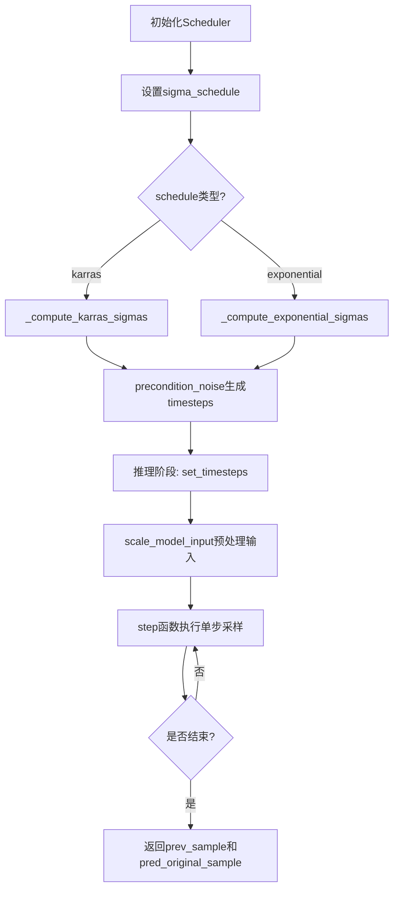
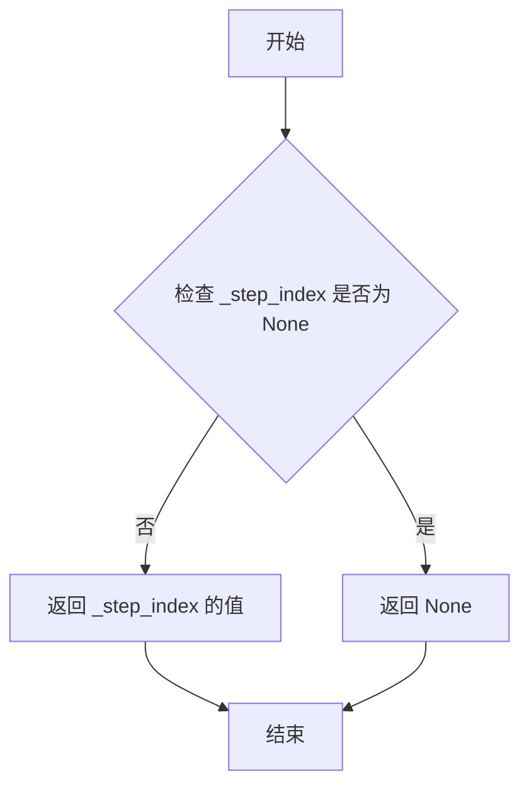
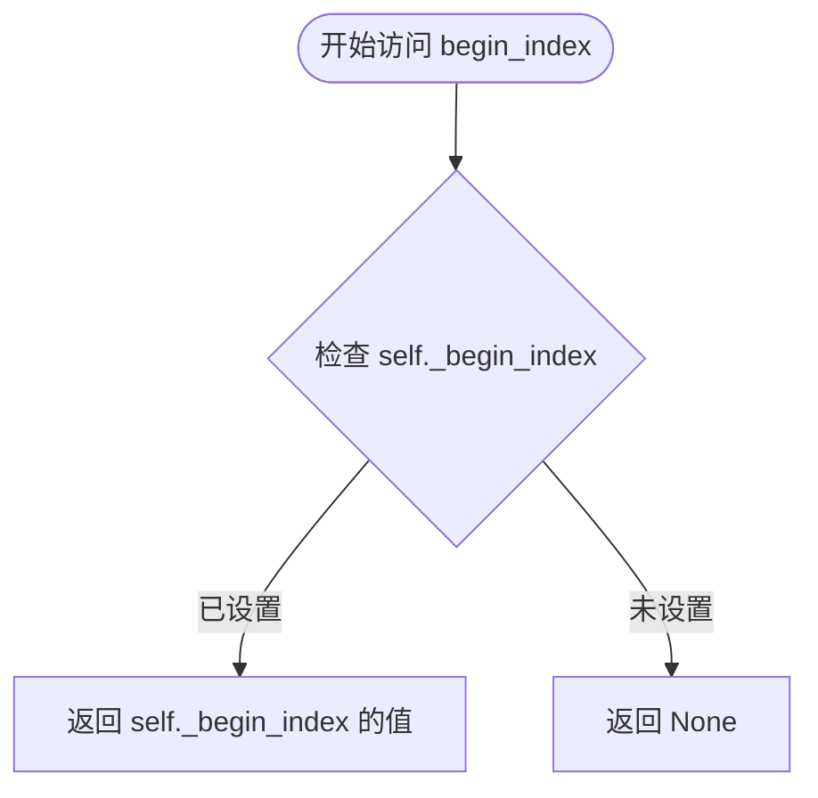
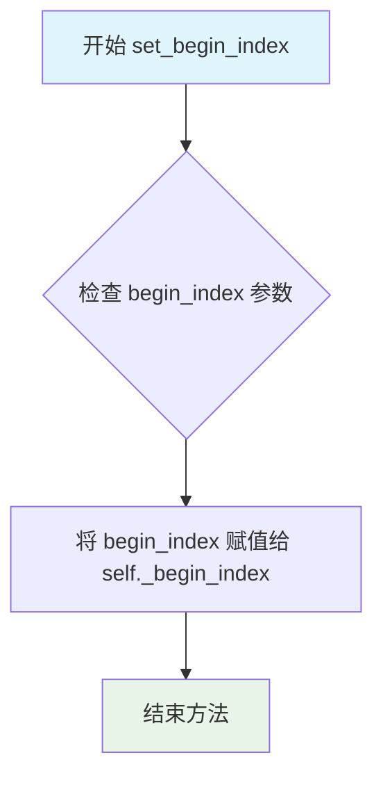
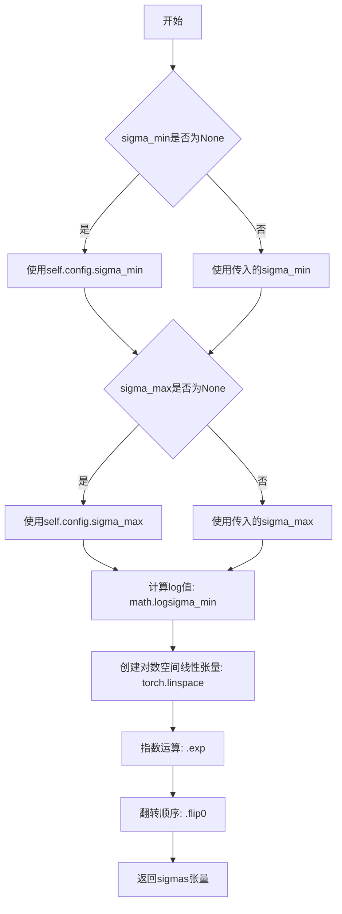
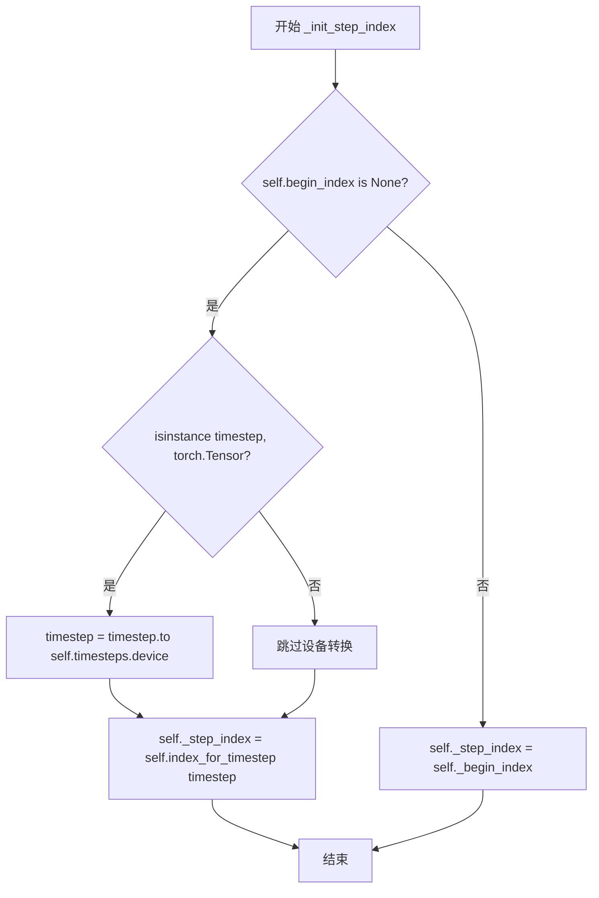
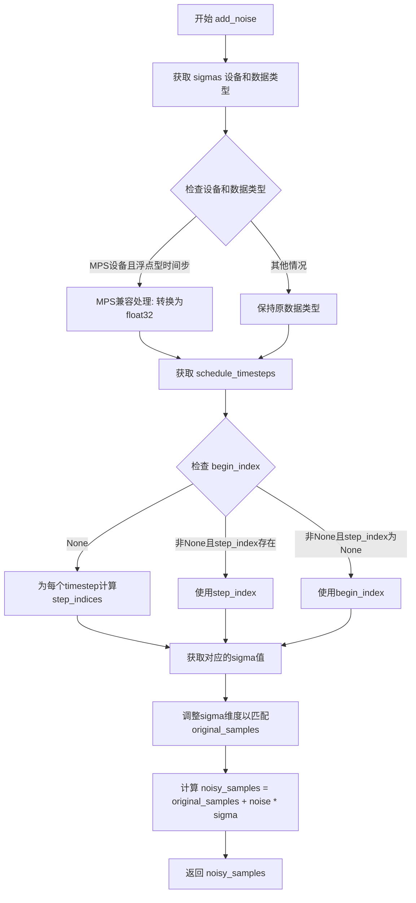
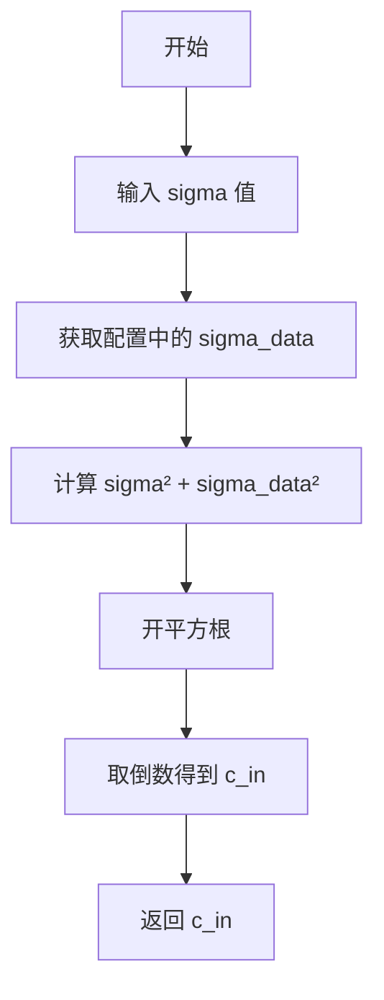
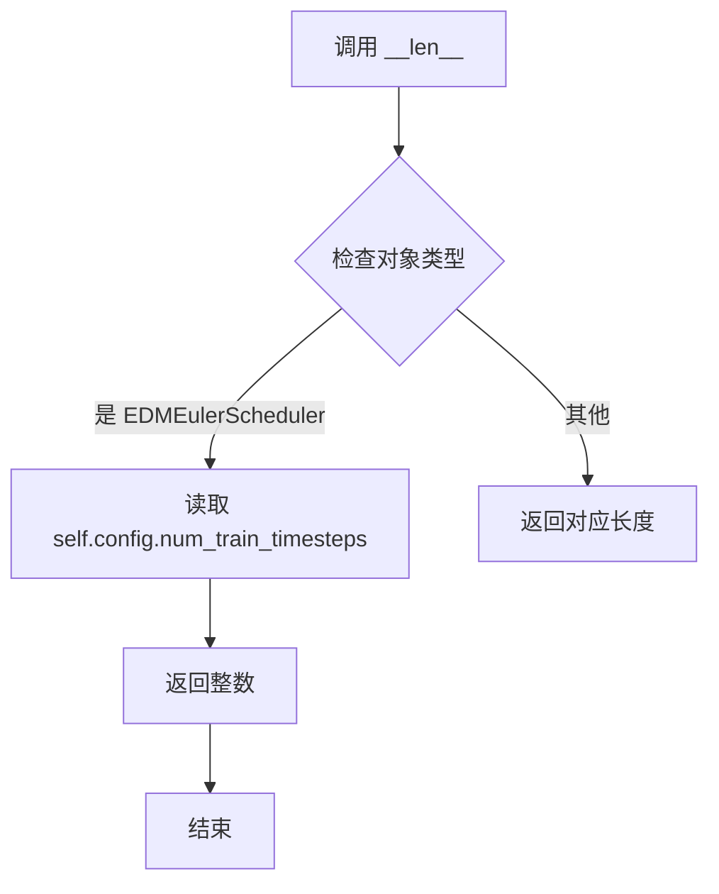

# `diffusers\src\diffusers\schedulers\scheduling_edm_euler.py` 详细设计文档

EDMEulerScheduler实现了基于Euler方法的离散采样调度器，采用EDM（Elucidating the Design Space of Diffusion-Based Generative Models）公式，用于扩散模型的推理过程，支持Karras和Exponential两种噪声调度策略。

## 整体流程



## 类结构

```
BaseOutput (抽象基类)
├── EDMEulerSchedulerOutput (数据类)
SchedulerMixin (混入类)
ConfigMixin (混入类)
└── EDMEulerScheduler (主调度器类)
```

## 全局变量及字段


### `logger`
    
模块级日志记录器，用于记录调度器运行过程中的警告和信息

类型：`logging.Logger`
    


### `EDMEulerSchedulerOutput.prev_sample`
    
前一步计算得到的样本 (x_{t-1})，作为下一步的去噪循环输入

类型：`torch.Tensor`
    


### `EDMEulerSchedulerOutput.pred_original_sample`
    
预测的原始去噪样本 (x_0)，可用于预览进度或引导

类型：`torch.Tensor | None`
    


### `EDMEulerScheduler._compatibles`
    
兼容的调度器列表，用于调度器兼容性检查

类型：`list`
    


### `EDMEulerScheduler.order`
    
调度器阶数，决定了数值方法的精度阶数

类型：`int`
    


### `EDMEulerScheduler.num_inference_steps`
    
推理步数，表示生成样本时使用的扩散步数

类型：`int | None`
    


### `EDMEulerScheduler.timesteps`
    
时间步张量，存储预处理后的噪声水平值

类型：`torch.Tensor`
    


### `EDMEulerScheduler.sigmas`
    
sigma值张量，存储扩散过程中的噪声标准差序列

类型：`torch.Tensor`
    


### `EDMEulerScheduler.is_scale_input_called`
    
标记是否已调用scale_model_input方法，确保正确的去噪流程

类型：`bool`
    


### `EDMEulerScheduler._step_index`
    
当前推理步骤的索引，用于追踪扩散过程的进度

类型：`int | None`
    


### `EDMEulerScheduler._begin_index`
    
起始索引，用于设置从管道的哪个步骤开始执行

类型：`int | None`
    
    

## 全局函数及方法


### EDMEulerScheduler.__init__

EDMEulerScheduler类的初始化方法，负责配置Euler调度器的各项参数，包括噪声调度、预测类型、训练时间步数等，并基于EDM（Elucidating the Design Space of Diffusion-Based Generative Models）公式构建噪声调度表。

参数：

- `sigma_min`：`float`，可选，默认值为`0.002`。EDM论文中设置的最小噪声幅度，推荐范围为[0, 10]。
- `sigma_max`：`float`，可选，默认值为`80.0`。EDM论文中设置的最大噪声幅度，推荐范围为[0.2, 80.0]。
- `sigma_data`：`float`，可选，默认值为`0.5`。数据分布的标准差，EDM论文中设置为0.5。
- `sigma_schedule`：`Literal["karras", "exponential"]`，可选，默认值为`"karras"`。用于计算sigmas的噪声调度表类型，默认为EDM论文中的调度方式，也可选择指数调度。
- `num_train_timesteps`：`int`，可选，默认值为`1000`。训练模型的扩散步数。
- `prediction_type`：`Literal["epsilon", "v_prediction"]`，可选，默认值为`"epsilon"`。调度器函数的预测类型，"epsilon"预测扩散过程的噪声，"v_prediction"见Imagen Video论文第2.4节。
- `rho`：`float`，可选，默认值为`7.0`。用于计算Karras sigma调度表的rho参数，EDM论文中设置为7.0。
- `final_sigmas_type`：`Literal["zero", "sigma_min"]`，可选，默认值为`"zero"`。采样过程中噪声调度的最终sigma值，"sigma_min"表示最终sigma与训练调度表中的最后一个sigma相同，"zero"表示设置为0。

返回值：`None`，该方法为构造函数，不返回任何值。

#### 流程图

```mermaid
flowchart TD
    A[开始 __init__] --> B{验证 sigma_schedule}
    B -->|无效| C[抛出 ValueError]
    B -->|有效| D[设置 num_inference_steps = None]
    D --> E[确定 sigmas_dtype: float32 或 float64]
    E --> F[创建基础 sigmas 张量: arange / num_train_timesteps]
    F --> G{sigma_schedule 类型?}
    G -->|karras| H[调用 _compute_karras_sigmas]
    G -->|exponential| I[调用 _compute_exponential_sigmas]
    H --> J[转换为 float32]
    I --> J
    J --> K[通过 precondition_noise 处理 sigmas 得到 timesteps]
    K --> L{final_sigmas_type?}
    L -->|sigma_min| M[sigma_last = sigmas[-1]]
    L -->|zero| N[sigma_last = 0]
    L -->|其他| O[抛出 ValueError]
    M --> P[连接 sigmas 和 sigma_last]
    N --> P
    P --> Q[设置 is_scale_input_called = False]
    Q --> R[初始化 _step_index = None, _begin_index = None]
    R --> S[将 sigmas 移至 CPU]
    S --> T[结束 __init__]
```

#### 带注释源码

```python
@register_to_config
def __init__(
    self,
    sigma_min: float = 0.002,
    sigma_max: float = 80.0,
    sigma_data: float = 0.5,
    sigma_schedule: Literal["karras", "exponential"] = "karras",
    num_train_timesteps: int = 1000,
    prediction_type: Literal["epsilon", "v_prediction"] = "epsilon",
    rho: float = 7.0,
    final_sigmas_type: Literal["zero", "sigma_min"] = "zero",
) -> None:
    """
    初始化 EDMEulerScheduler 实例。

    该方法配置 Euler 调度器的所有参数，并基于 EDM 公式构建噪声调度表。
    
    参数:
        sigma_min: 最小噪声幅度，默认 0.002
        sigma_max: 最大噪声幅度，默认 80.0
        sigma_data: 数据分布标准差，默认 0.5
        sigma_schedule: 噪声调度表类型，karras 或 exponential
        num_train_timesteps: 扩散训练步数，默认 1000
        prediction_type: 预测类型，epsilon 或 v_prediction
        rho: Karras 调度表的 rho 参数，默认 7.0
        final_sigmas_type: 最终 sigma 类型，zero 或 sigma_min
    """
    
    # 验证 sigma_schedule 参数的有效性
    if sigma_schedule not in ["karras", "exponential"]:
        raise ValueError(f"Wrong value for provided for `{sigma_schedule=}`.`")

    # 设置可配置的值：推理步数初始化为 None
    self.num_inference_steps = None

    # 根据设备类型选择精度：MPS 设备使用 float32，否则使用 float64
    sigmas_dtype = torch.float32 if torch.backends.mps.is_available() else torch.float64
    
    # 创建基础 sigmas：张量值为 [0, 1/num_train_timesteps, 2/num_train_timesteps, ..., 1]
    sigmas = torch.arange(num_train_timesteps + 1, dtype=sigmas_dtype) / num_train_timesteps
    
    # 根据 sigma_schedule 类型计算相应的 sigmas
    if sigma_schedule == "karras":
        # 使用 Karras 噪声调度表（推荐）
        sigmas = self._compute_karras_sigmas(sigmas)
    elif sigma_schedule == "exponential":
        # 使用指数噪声调度表
        sigmas = self._compute_exponential_sigmas(sigmas)
    
    # 转换为 float32 以保持一致性
    sigmas = sigmas.to(torch.float32)

    # 通过预处理噪声得到 timesteps（用于模型输入条件化）
    self.timesteps = self.precondition_noise(sigmas)

    # 根据 final_sigmas_type 确定最后一个 sigma 值
    if self.config.final_sigmas_type == "sigma_min":
        sigma_last = sigmas[-1]  # 使用调度表中最后一个 sigma
    elif self.config.final_sigmas_type == "zero":
        sigma_last = 0  # 设置为 0
    else:
        raise ValueError(
            f"`final_sigmas_type` must be one of 'zero', or 'sigma_min', but got {self.config.final_sigmas_type}"
        )

    # 将计算出的 sigmas 与最后一个 sigma 连接，形成完整的噪声调度表
    # 形状: (num_train_timesteps + 2,)
    self.sigmas = torch.cat([sigmas, torch.full((1,), fill_value=sigma_last, device=sigmas.device)])

    # 标记 scale_model_input 是否已被调用
    self.is_scale_input_called = False

    # 初始化步骤索引和起始索引
    self._step_index = None
    self._begin_index = None
    
    # 将 sigmas 移至 CPU 以减少 CPU/GPU 通信开销
    self.sigmas = self.sigmas.to("cpu")
```


### `EDMEulerScheduler.init_noise_sigma`

该属性方法用于返回初始噪声分布的标准差，基于EDM公式计算初始噪声sigma值。

参数：

- `self`：`EDMEulerScheduler` 实例，隐式参数，无需显式传递

返回值：`float`，初始噪声sigma值，计算公式为 `(sigma_max**2 + 1) ** 0.5`，其中 `sigma_max` 是配置中的最大噪声值。

#### 流程图

```mermaid
flowchart TD
    A[开始] --> B[读取 self.config.sigma_max]
    B --> C[计算 sigma_max² + 1]
    C --> D[计算平方根: (sigma_max² + 1) ** 0.5]
    D --> E[返回结果作为 float]
    E --> F[结束]
```

#### 带注释源码

```python
@property
def init_noise_sigma(self) -> float:
    """
    Return the standard deviation of the initial noise distribution.

    Returns:
        `float`:
            The initial noise sigma value computed as `(sigma_max**2 + 1) ** 0.5`.
    """
    # 根据 EDM 论文公式计算初始噪声标准差
    # 该值用于在采样过程开始时确定初始噪声水平
    return (self.config.sigma_max**2 + 1) ** 0.5
```


### `EDMEulerScheduler.step_index`

返回当前时间步的索引计数器。该索引在每个调度器步骤后增加1。

参数：

- （无参数，这是属性 getter）

返回值：`int` 或 `None`，当前步骤索引，如果尚未初始化则返回 `None`

#### 流程图



#### 带注释源码

```python
@property
def step_index(self) -> int:
    """
    Return the index counter for the current timestep. The index will increase by 1 after each scheduler step.

    Returns:
        `int` or `None`:
            The current step index, or `None` if not yet initialized.
    """
    return self._step_index
```

#### 说明

- 这是一个只读属性（read-only property），用于获取调度器当前执行的步骤索引
- `_step_index` 是内部私有变量，在 `_init_step_index` 方法中被初始化
- 该索引在 `step` 方法每执行一次后自动加 1，用于追踪当前在 `sigmas` 数组中的位置
- 如果调度器尚未执行过步骤（`scale_model_input` 或 `step` 尚未调用），则返回 `None`
- 索引从 0 开始，对应 `sigmas` 数组中的元素位置


### EDMEulerScheduler.begin_index

该属性用于获取调度器的起始索引（begin index）。起始索引定义了扩散采样过程中开始执行的具体时间步，通常在管道（pipeline）中通过 `set_begin_index` 方法进行设置。如果尚未设置，则返回 `None`。

参数：
- 无（该方法为属性 getter，不需要显式参数）

返回值：`int | None`，返回起始索引。如果已经通过 `set_begin_index` 设置，则返回对应的整数值；否则返回 `None`。

#### 流程图



#### 带注释源码

```python
@property
def begin_index(self) -> int:
    """
    Return the index for the first timestep. This should be set from the pipeline with the `set_begin_index`
    method.

    Returns:
        `int` or `None`:
            The begin index, or `None` if not yet set.
    """
    # 返回内部变量 _begin_index，如果未设置则为 None
    return self._begin_index
```


### `EDMEulerScheduler.set_begin_index`

设置调度器的起始索引。该函数应在推理前从pipeline运行，用于指定从哪个时间步开始进行去噪处理。

参数：

- `begin_index`：`int`，默认值 `0`，调度器的起始索引，用于控制推理时从哪个时间步开始执行去噪过程

返回值：`None`，无返回值

#### 流程图



#### 带注释源码

```
# 复制自 diffusers.schedulers.scheduling_dpmsolver_multistep.DPMSolverMultistepScheduler.set_begin_index
def set_begin_index(self, begin_index: int = 0) -> None:
    """
    设置调度器的起始索引。该函数应在推理前从pipeline运行。
    
    参数:
        begin_index (int, 默认为 0):
            调度器的起始索引。
    """
    # 将传入的 begin_index 值直接赋值给实例变量 _begin_index
    # 该变量用于记录调度器开始执行去噪的起始时间步索引
    self._begin_index = begin_index
```


### `EDMEulerScheduler.precondition_inputs`

该方法根据EDM公式对输入样本进行预处理和缩放，通过计算条件因子 c_in 并将其与输入样本相乘来实现噪声水平的自适应调整。

参数：

- `sample`：`torch.Tensor`，要预处理的输入样本张量
- `sigma`：`float | torch.Tensor`，当前 sigma（噪声级别）值

返回值：`torch.Tensor`，缩放后的输入样本

#### 流程图

```mermaid
flowchart TD
    A[开始 precondition_inputs] --> B{检查 sigma 类型}
    B -->|非 Tensor| C[调用 _get_conditioning_c_in 计算 c_in]
    B -->|Tensor| C
    C --> D[计算 c_in = 1 / sqrt(sigma² + sigma_data²)]
    D --> E[执行 scaled_sample = sample * c_in]
    E --> F[返回 scaled_sample]
```

#### 带注释源码

```python
def precondition_inputs(self, sample: torch.Tensor, sigma: float | torch.Tensor) -> torch.Tensor:
    """
    Precondition the input sample by scaling it according to the EDM formulation.

    Args:
        sample (`torch.Tensor`):
            The input sample tensor to precondition.
        sigma (`float` or `torch.Tensor`):
            The current sigma (noise level) value.

    Returns:
        `torch.Tensor`:
            The scaled input sample.
    """
    # 调用内部方法计算 EDM 公式中的输入条件因子 c_in
    # c_in = 1 / sqrt(sigma² + sigma_data²)
    c_in = self._get_conditioning_c_in(sigma)
    
    # 将输入样本乘以条件因子进行缩放
    scaled_sample = sample * c_in
    
    # 返回缩放后的样本
    return scaled_sample
```


### `EDMEulerScheduler.precondition_noise`

该方法用于对噪声级别（sigma）进行预处理，通过应用对数变换将其转换为符合EDM公式的形式。这是EDM（Elucidating the Design Space of Diffusion-Based Generative Models）调度器中的核心预处理步骤之一，用于将噪声sigma值映射到模型可用的时间步长表示。

参数：

- `sigma`：`float` 或 `torch.Tensor`，当前的噪声级别（sigma）值，可以是单个浮点数或张量

返回值：`torch.Tensor`，预处理后的噪声值，计算公式为 `0.25 * log(sigma)`

#### 流程图

```mermaid
flowchart TD
    A[开始 precondition_noise] --> B{sigma 是否为 Tensor?}
    B -- 是 --> C[直接使用 sigma]
    B -- 否 --> D[将 sigma 转换为 torch.tensor]
    D --> C
    C --> E[计算 c_noise = 0.25 * torch.log(sigma)]
    E --> F[返回 c_noise]
```

#### 带注释源码

```python
def precondition_noise(self, sigma: float | torch.Tensor) -> torch.Tensor:
    """
    Precondition the noise level by applying a logarithmic transformation.

    Args:
        sigma (`float` or `torch.Tensor`):
            The sigma (noise level) value to precondition.

    Returns:
        `torch.Tensor`:
            The preconditioned noise value computed as `0.25 * log(sigma)`.
    """
    # 检查 sigma 是否为 Tensor 类型，如果不是则转换为 Tensor
    # 这样可以统一处理标量和张量输入
    if not isinstance(sigma, torch.Tensor):
        sigma = torch.tensor([sigma])

    # 根据 EDM 论文中的公式，计算预处理后的噪声值
    # 0.25 * log(sigma) 将对数噪声级别缩放到合适的范围
    c_noise = 0.25 * torch.log(sigma)

    # 返回预处理后的噪声值，用于后续的时间步长处理
    return c_noise
```


### `EDMEulerScheduler.precondition_outputs`

该函数实现了 EDM (Elucidating the Design Space of Diffusion-Based Generative Models) 公式中的输出预处理逻辑，通过计算skip连接系数 (c_skip) 和输出缩放系数 (c_out)，将模型输出与输入样本组合，生成去噪后的样本。

参数：

- `self`：`EDMEulerScheduler` 实例，调度器对象本身
- `sample`：`torch.Tensor`，输入样本张量（通常是当前带噪声的样本）
- `model_output`：`torch.Tensor`，来自学习到的扩散模型的直接输出（预测的噪声或v-prediction）
- `sigma`：`float | torch.Tensor`，当前 sigma（噪声水平）值

返回值：`torch.Tensor`，通过组合 skip 连接和输出缩放计算得到的去噪样本

#### 流程图

```mermaid
flowchart TD
    A[开始 precondition_outputs] --> B[获取 sigma_data 配置参数]
    B --> C[计算 c_skip = sigma_data² / (sigma² + sigma_data²)]
    D{判断 prediction_type} -->|epsilon| E[计算 c_out = sigma * sigma_data / √(sigma² + sigma_data²)]
    D -->|v_prediction| F[计算 c_out = -sigma * sigma_data / √(sigma² + sigma_data²)]
    D -->|其他| G[抛出 ValueError 异常]
    E --> H[计算 denoised = c_skip * sample + c_out * model_output]
    F --> H
    H --> I[返回 denoised 张量]
```

#### 带注释源码

```python
def precondition_outputs(
    self,
    sample: torch.Tensor,
    model_output: torch.Tensor,
    sigma: float | torch.Tensor,
) -> torch.Tensor:
    """
    Precondition the model outputs according to the EDM formulation.

    Args:
        sample (`torch.Tensor`):
            The input sample tensor.
        model_output (`torch.Tensor`):
            The direct output from the learned diffusion model.
        sigma (`float` or `torch.Tensor`):
            The current sigma (noise level) value.

    Returns:
        `torch.Tensor`:
            The denoised sample computed by combining the skip connection and output scaling.
    """
    # 从配置中获取数据分布的标准差（EDM 论文中默认为 0.5）
    sigma_data = self.config.sigma_data
    
    # 计算 skip 系数 c_skip：用于将原始样本信息 skip 到输出
    # 公式：c_skip = sigma_data² / (sigma² + sigma_data²)
    # 当 sigma 很大时，c_skip 趋近于 0（更多依赖模型输出）
    # 当 sigma 很小时，c_skip 趋近于 1（更多保留原始样本信息）
    c_skip = sigma_data**2 / (sigma**2 + sigma_data**2)

    # 根据预测类型计算输出系数 c_out
    if self.config.prediction_type == "epsilon":
        # epsilon 预测：预测噪声
        # c_out = sigma * sigma_data / sqrt(sigma² + sigma_data²)
        c_out = sigma * sigma_data / (sigma**2 + sigma_data**2) ** 0.5
    elif self.config.prediction_type == "v_prediction":
        # v_prediction 预测：预测速度向量
        # 系数为负数，因为 v_prediction 的定义与 epsilon 相反
        c_out = -sigma * sigma_data / (sigma**2 + sigma_data**2) ** 0.5
    else:
        raise ValueError(f"Prediction type {self.config.prediction_type} is not supported.")

    # 计算去噪后的样本
    # 公式：denoised = c_skip * sample + c_out * model_output
    # 这是一个线性组合，结合了原始样本信息和模型预测信息
    denoised = c_skip * sample + c_out * model_output

    return denoised
```


### `EDMEulerScheduler.scale_model_input`

该方法用于根据当前时间步对去噪模型输入进行缩放，以匹配Euler算法。通过获取当前时间步对应的sigma值，并使用`precondition_inputs`方法对输入样本进行预处理，确保与其他需要根据时间步缩放去噪模型输入的调度器可互换使用。

参数：

- `sample`：`torch.Tensor`，输入样本张量，即需要缩放的去噪模型输入
- `timestep`：`float | torch.Tensor`，扩散链中的当前时间步

返回值：`torch.Tensor`，缩放后的输入样本

#### 流程图

```mermaid
flowchart TD
    A[开始 scale_model_input] --> B{self.step_index 是否为 None?}
    B -->|是| C[调用 self._init_step_index(timestep)]
    B -->|否| D[继续]
    C --> D
    D --> E[获取 sigma = self.sigmas[self.step_index]]
    E --> F[调用 self.precondition_inputs(sample, sigma)]
    F --> G[设置 self.is_scale_input_called = True]
    G --> H[返回缩放后的 sample]
```

#### 带注释源码

```python
def scale_model_input(self, sample: torch.Tensor, timestep: float | torch.Tensor) -> torch.Tensor:
    """
    Scale the denoising model input to match the Euler algorithm. Ensures interchangeability with schedulers that
    need to scale the denoising model input depending on the current timestep.

    Args:
        sample (`torch.Tensor`):
            The input sample tensor.
        timestep (`float` or `torch.Tensor`):
            The current timestep in the diffusion chain.

    Returns:
        `torch.Tensor`:
            A scaled input sample.
    """
    # 如果当前步索引未初始化，则根据时间步初始化步索引
    if self.step_index is None:
        self._init_step_index(timestep)

    # 获取当前步对应的sigma值（噪声水平）
    sigma = self.sigmas[self.step_index]
    # 使用EDM公式的输入预处理方法对样本进行缩放
    # precondition_inputs内部计算 c_in = 1 / ((sigma**2 + sigma_data**2) ** 0.5)
    # 并返回 sample * c_in
    sample = self.precondition_inputs(sample, sigma)

    # 标记scale_model_input已被调用，用于在step方法中进行警告检查
    self.is_scale_input_called = True
    # 返回缩放后的样本供去噪模型使用
    return sample
```


### `EDMEulerScheduler.set_timesteps`

该方法用于设置扩散链中使用的离散时间步，是在推理运行前必须调用的关键方法。它根据指定的推理步数或自定义的sigmas值，计算并初始化完整的时间步调度表，同时处理不同sigma调度策略（karras或exponential）的转换，并将结果存储在CPU设备上以优化计算效率。

参数：

- `num_inference_steps`：`int | None`，推理过程中使用的扩散步数，用于生成样本。如果为`None`且未提供`sigmas`，则使用默认值。
- `device`：`str | torch.device | None`，时间步要移动到的目标设备。如果为`None`，则不移动时间步。
- `sigmas`：`torch.Tensor | list[float] | None`，用于去噪过程的自定义sigmas数组。如果未定义，当传入`num_inference_steps`时将使用默认行为生成sigmas。

返回值：`None`，该方法直接修改调度器的内部状态，不返回任何值。

#### 流程图

```mermaid
flowchart TD
    A[开始 set_timesteps] --> B[设置 self.num_inference_steps]
    B --> C{判断 sigmas 是否为 None}
    C -->|是| D[使用 torch.linspace 生成 0 到 1 的 sigmas]
    C -->|否| E{sigmas 是否为 float}
    E -->|是| F[将 float 转换为 torch.tensor]
    E -->|否| G[将 sigmas 转换到指定 dtype]
    D --> H[统一 sigmas dtype]
    F --> H
    G --> H
    H --> I{判断 sigma_schedule 类型}
    I -->|karras| J[调用 _compute_karras_sigmas]
    I -->|exponential| K[调用 _compute_exponential_sigmas]
    J --> L[转换为 float32 并移到 device]
    K --> L
    L --> M[调用 precondition_noise 处理 sigmas 得到 timesteps]
    M --> N{判断 final_sigmas_type}
    N -->|sigma_min| O[sigma_last = sigmas[-1]]
    N -->|zero| P[sigma_last = 0]
    O --> Q[拼接 sigmas 和 sigma_last]
    P --> Q
    Q --> R[重置 _step_index 和 _begin_index]
    R --> S[将 sigmas 移到 CPU]
    S --> T[结束]
```

#### 带注释源码

```python
def set_timesteps(
    self,
    num_inference_steps: int = None,
    device: str | torch.device = None,
    sigmas: torch.Tensor | list[float] | None = None,
):
    """
    Sets the discrete timesteps used for the diffusion chain (to be run before inference).

    Args:
        num_inference_steps (`int`, *optional*):
            The number of diffusion steps used when generating samples with a pre-trained model.
        device (`str` or `torch.device`, *optional*):
            The device to which the timesteps should be moved to. If `None`, the timesteps are not moved.
        sigmas (`torch.Tensor | list[float]`, *optional*):
            Custom sigmas to use for the denoising process. If not defined, the default behavior when
            `num_inference_steps` is passed will be used.
    """
    # 1. 保存推理步数到调度器实例
    self.num_inference_steps = num_inference_steps

    # 2. 根据设备类型选择合适的数据精度
    # MPS 设备使用 float32，其他设备使用 float64以获得更高精度
    sigmas_dtype = torch.float32 if torch.backends.mps.is_available() else torch.float64
    
    # 3. 处理用户提供的 sigmas 参数
    if sigmas is None:
        # 如果没有提供 sigmas，则生成从 0 到 1 的线性间隔序列
        sigmas = torch.linspace(0, 1, self.num_inference_steps, dtype=sigmas_dtype)
    elif isinstance(sigmas, float):
        # 如果是单个 float 值，转换为 tensor
        sigmas = torch.tensor(sigmas, dtype=sigmas_dtype)
    else:
        # 已有 tensor 或 list，转换到指定精度
        sigmas = sigmas.to(sigmas_dtype)
    
    # 4. 根据配置选择的时间表类型计算 sigmas
    if self.config.sigma_schedule == "karras":
        # 使用 Karras 等人 2022 年提出的 sigma 调度
        sigmas = self._compute_karras_sigmas(sigmas)
    elif self.config.sigma_schedule == "exponential":
        # 使用指数 sigma 调度
        sigmas = self._compute_exponential_sigmas(sigmas)
    
    # 5. 统一转换为 float32 并移动到目标设备
    sigmas = sigmas.to(dtype=torch.float32, device=device)

    # 6. 使用 precondition_noise 将 sigmas 转换为对应的时间步
    # EDM 公式中使用对数变换: c_noise = 0.25 * log(sigma)
    self.timesteps = self.precondition_noise(sigmas)

    # 7. 根据配置决定最后一个 sigma 的值
    if self.config.final_sigmas_type == "sigma_min":
        # 使用训练时间表中最后一个 sigma 值
        sigma_last = sigmas[-1]
    elif self.config.final_sigmas_type == "zero":
        # 将最后一个 sigma 设置为 0
        sigma_last = 0
    else:
        raise ValueError(
            f"`final_sigmas_type` must be one of 'zero', or 'sigma_min', but got {self.config.final_sigmas_type}"
        )

    # 8. 将计算出的 sigmas 与最后一个 sigma 值拼接
    # 这里的 sigmas 是用于推理的噪声调度，最后一个额外的 sigma 用于最终的降噪步骤
    self.sigmas = torch.cat([sigmas, torch.full((1,), fill_value=sigma_last, device=sigmas.device)])
    
    # 9. 重置调度器的步进索引，为新的推理过程做准备
    self._step_index = None
    self._begin_index = None
    
    # 10. 将 sigmas 移到 CPU 以减少 CPU/GPU 之间的通信开销
    # 这是为了避免在推理循环中频繁地在设备间传输数据
    self.sigmas = self.sigmas.to("cpu")  # to avoid too much CPU/GPU communication
```


### `EDMEulerScheduler._compute_karras_sigmas`

构造 Karras 等人 (2022) 提出的噪声调度表，通过非线性插值在 sigma_min 和 sigma_max 之间生成平滑的 sigma 序列。

参数：

- `self`：`EDMEulerScheduler`，EDMEulerScheduler 实例本身
- `ramp`：`torch.Tensor`，值为 [0, 1] 范围内的张量，表示插值位置
- `sigma_min`：`float | None`，最小 sigma 值，如果为 None 则使用 self.config.sigma_min
- `sigma_max`：`float | None`，最大 sigma 值，如果为 None 则使用 self.config.sigma_max

返回值：`torch.Tensor`，计算得到的 Karras sigma 调度序列

#### 流程图

```mermaid
flowchart TD
    A[开始 _compute_karras_sigmas] --> B{sigma_min 是否为 None?}
    B -->|是| C[使用 self.config.sigma_min]
    B -->|否| D[使用传入的 sigma_min]
    D --> E{sigma_max 是否为 None?}
    E -->|是| F[使用 self.config.sigma_max]
    E -->|否| G[使用传入的 sigma_max]
    C --> H[获取 rho 参数]
    F --> H
    G --> H
    H --> I[计算 min_inv_rho = sigma_min \*\* (1/rho)]
    I --> J[计算 max_inv_rho = sigma_max \*\* (1/rho)]
    J --> K[计算 sigmas = (max_inv_rho + ramp \* (min_inv_rho - max_inv_rho)) \*\* rho]
    K --> L[返回 sigmas 张量]
```

#### 带注释源码

```python
def _compute_karras_sigmas(
    self,
    ramp: torch.Tensor,
    sigma_min: float | None = None,
    sigma_max: float | None = None,
) -> torch.Tensor:
    """
    Construct the noise schedule of [Karras et al. (2022)](https://huggingface.co/papers/2206.00364).

    Args:
        ramp (`torch.Tensor`):
            A tensor of values in [0, 1] representing the interpolation positions.
        sigma_min (`float`, *optional*):
            Minimum sigma value. If `None`, uses `self.config.sigma_min`.
        sigma_max (`float`, *optional*):
            Maximum sigma value. If `None`, uses `self.config.sigma_max`.

    Returns:
        `torch.Tensor`:
            The computed Karras sigma schedule.
    """
    # 如果未提供 sigma_min，则使用配置中的默认值
    sigma_min = sigma_min or self.config.sigma_min
    # 如果未提供 sigma_max，则使用配置中的默认值
    sigma_max = sigma_max or self.config.sigma_max

    # 获取 rho 参数，用于控制 sigma 曲线的形状
    rho = self.config.rho
    # 计算 sigma_min 的 rho 次根的倒数（即 sigma_min^(1/rho)）
    min_inv_rho = sigma_min ** (1 / rho)
    # 计算 sigma_max 的 rho 次根的倒数（即 sigma_max^(1/rho)）
    max_inv_rho = sigma_max ** (1 / rho)
    # 使用 Karras 公式计算 sigmas：
    # 先在线性 ramp 上进行插值，然后进行 rho 次幂运算
    # 这个公式来源于 Karras 等人的论文，旨在创建更优的噪声调度
    sigmas = (max_inv_rho + ramp * (min_inv_rho - max_inv_rho)) ** rho
    # 返回计算得到的 sigma 调度序列
    return sigmas
```


### `EDMEulerScheduler._compute_exponential_sigmas`

计算指数衰减的sigma调度表，用于扩散模型的去噪过程。该方法遵循k-diffusion的实现，通过在对数空间中线性插值并翻转顺序来生成从大到小的sigma值序列。

参数：

- `self`：`EDMEulerScheduler`，调度器实例，包含配置参数sigma_min、sigma_max等
- `ramp`：`torch.Tensor`，表示插值位置的tensor，值域在[0, 1]范围内
- `sigma_min`：`float | None`，最小sigma值，若为None则使用self.config.sigma_min（默认为0.002）
- `sigma_max`：`float | None`，最大sigma值，若为None则使用self.config.sigma_max（默认为80.0）

返回值：`torch.Tensor`，计算得到的指数sigma调度表

#### 流程图



#### 带注释源码

```python
def _compute_exponential_sigmas(
    self,
    ramp: torch.Tensor,
    sigma_min: float | None = None,
    sigma_max: float | None = None,
) -> torch.Tensor:
    """
    Compute the exponential sigma schedule. Implementation closely follows k-diffusion:
    https://github.com/crowsonkb/k-diffusion/blob/6ab5146d4a5ef63901326489f31f1d8e7dd36b48/k_diffusion/sampling.py#L26

    Args:
        ramp (`torch.Tensor`):
            A tensor of values representing the interpolation positions.
        sigma_min (`float`, *optional*):
            Minimum sigma value. If `None`, uses `self.config.sigma_min`.
        sigma_max (`float`, *optional*):
            Maximum sigma value. If `None`, uses `self.config.sigma_max`.

    Returns:
        `torch.Tensor`:
            The computed exponential sigma schedule.
    """
    # 如果未指定sigma_min，则使用配置中的默认值0.002
    sigma_min = sigma_min or self.config.sigma_min
    # 如果未指定sigma_max，则使用配置中的默认值80.0
    sigma_max = sigma_max or self.config.sigma_max
    # 在对数空间中创建线性插值，然后指数化并翻转顺序
    # 从最大sigma值逐渐减小到最小sigma值
    sigmas = torch.linspace(math.log(sigma_min), math.log(sigma_max), len(ramp)).exp().flip(0)
    return sigmas
```


### `EDMEulerScheduler.index_for_timestep`

该方法用于在调度器的时间步序列（timestep schedule）中定位特定时间步（timestep）值对应的索引位置。它包含一个特殊的索引选择逻辑：当存在多个匹配的时间步（常见于调度器初始阶段或图像生成中的图像修复场景）时，默认返回第二个索引，以防止在采样的第一步跳过必要的噪声水平（sigma）。

参数：
- `timestep`：`float | torch.Tensor`，要查找的时间步值（可能是浮点数或张量）。
- `schedule_timesteps`：`torch.Tensor | None`，可选参数。指定要在哪个时间步序列中查找，如果为 `None`，则默认使用 `self.timesteps`。

返回值：`int`，返回给定时间步在序列中的索引位置。

#### 流程图

```mermaid
flowchart TD
    A([开始 index_for_timestep]) --> B{schedule_timesteps 是否为 None?}
    B -- 是 --> C[使用 self.timesteps]
    B -- 否 --> D[使用传入的 schedule_timesteps]
    C --> E[查找匹配索引: (schedule_timesteps == timestep).nonzero()]
    D --> E
    E --> F{匹配到的索引数量 > 1?}
    F -- 是 --> G[设置 pos = 1<br>（取第二个索引，防止跳过 sigma）]
    F -- 否 --> H[设置 pos = 0<br>（取第一个索引）]
    G --> I[返回 indices[pos].item()]
    H --> I
    I([结束])
```

#### 带注释源码

```python
def index_for_timestep(
    self, timestep: float | torch.Tensor, schedule_timesteps: torch.Tensor | None = None
) -> int:
    """
    Find the index of a given timestep in the timestep schedule.

    Args:
        timestep (`float` or `torch.Tensor`):
            The timestep value to find in the schedule.
        schedule_timesteps (`torch.Tensor`, *optional*):
            The timestep schedule to search in. If `None`, uses `self.timesteps`.

    Returns:
        `int`:
            The index of the timestep in the schedule. For the very first step, returns the second index if
            multiple matches exist to avoid skipping a sigma when starting mid-schedule (e.g., for image-to-image).
    """
    # 如果未指定具体的schedule，则使用调度器当前的时间步序列
    if schedule_timesteps is None:
        schedule_timesteps = self.timesteps

    # 找出所有值等于传入timestep的索引位置
    indices = (schedule_timesteps == timestep).nonzero()

    # The sigma index that is taken for the **very** first `step`
    # is always the second index (or the last index if there is only 1)
    # This way we can ensure we don't accidentally skip a sigma in
    # case we start in the middle of the denoising schedule (e.g. for image-to-image)
    
    # 如果存在多个匹配（通常发生在schedule开头有重复值或者浮点数精度问题），
    # 则选择第二个位置（索引1），否则选择第一个位置（索引0）
    pos = 1 if len(indices) > 1 else 0

    # 将tensor转为Python标量并返回
    return indices[pos].item()
```


### `EDMEulerScheduler._init_step_index`

初始化调度器的步索引（step index），基于给定的时间步（timestep）。该方法在首次调用 `scale_model_input` 时自动被调用，用于确定当前推理过程中所在的步骤位置。

参数：

- `timestep`：`float | torch.Tensor`，当前时间步，用于初始化步索引

返回值：`None`，无返回值（此方法直接更新内部状态 `_step_index`）

#### 流程图



#### 带注释源码

```python
def _init_step_index(self, timestep: float | torch.Tensor) -> None:
    """
    Initialize the step index for the scheduler based on the given timestep.

    Args:
        timestep (`float` or `torch.Tensor`):
            The current timestep to initialize the step index from.
    """
    # 如果 begin_index 未设置（通常情况），则通过时间步查找索引
    if self.begin_index is None:
        # 如果时间步是张量，确保它与调度器的时间步在同一设备上
        if isinstance(timestep, torch.Tensor):
            timestep = timestep.to(self.timesteps.device)
        
        # 通过时间步在调度器的时间步序列中查找对应的索引
        self._step_index = self.index_for_timestep(timestep)
    else:
        # 如果 begin_index 已设置（通常用于图像到图像的推理），
        # 则直接使用预设的起始索引
        self._step_index = self._begin_index
```


### `EDMEulerScheduler.step`

该方法实现了Euler调度器的单步推理，通过反转SDE（随机微分方程）来预测前一个时间步的样本。它基于EDM（Elucidating the Design Space of Diffusion-Based Generative Models）公式，利用当前时间步的噪声水平sigma对模型输出进行预处理，计算预测的原始样本，并使用欧拉方法更新样本。

**参数：**

- `model_output`：`torch.Tensor`，学习到的扩散模型的直接输出（预测噪声）
- `timestep`：`float | torch.Tensor`，扩散链中的当前离散时间步
- `sample`：`torch.Tensor`，扩散过程创建的当前样本实例
- `s_churn`：`float`，可选，默认值 `0.0`，每步添加的随机性程度，值越高添加越多噪声
- `s_tmin`：`float`，可选，默认值 `0.0`，添加噪声的最小sigma阈值，低于此值不添加噪声
- `s_tmax`：`float`，可选，默认值 `float("inf")`，添加噪声的最大sigma阈值，高于此值不添加噪声
- `s_noise`：`float`，可选，默认值 `1.0`，添加到样本的噪声的缩放因子
- `generator`：`torch.Generator | None`，可选，默认值 `None`，用于可重复性的随机数生成器
- `return_dict`：`bool`，可选，默认值 `True`，是否返回 `EDMEulerSchedulerOutput` 或元组
- `pred_original_sample`：`torch.Tensor | None`，可选，默认值 `None`，来自上一步的预测去噪样本，如果提供则跳过重新计算

**返回值：** `EDMEulerSchedulerOutput | tuple`，如果 `return_dict` 为 `True`，返回包含 `prev_sample` 和 `pred_original_sample` 的 `EDMEulerSchedulerOutput` 对象；否则返回元组 `(prev_sample, pred_original_sample)`

#### 流程图

```mermaid
flowchart TD
    A[开始 step 方法] --> B{检查 timestep 类型}
    B -->|整数类型| C[抛出 ValueError 异常]
    B -->|非整数| D{is_scale_input_called?}
    D -->|False| E[输出警告日志]
    D -->|True| F{step_index is None?}
    E --> F
    F -->|None| G[调用 _init_step_index 初始化步索引]
    F -->|已有值| H[继续执行]
    G --> H
    H --> I[将 sample 上转为 float32]
    I --> J[获取当前 sigma 值]
    J --> K{计算 gamma 值}
    K --> L[gamma = min s_churn / n-1, 2^0.5 - 1<br/>当 s_tmin <= sigma <= s_tmax]
    K --> M[否则 gamma = 0]
    L --> N{gamma > 0?}
    M --> N
    N -->|是| O[生成随机噪声 eps]
    N -->|否| P[1. 计算预测原始样本]
    O --> Q[sample = sample + eps * sqrt(sigma_hat^2 - sigma^2)]
    Q --> P
    P --> R[计算导数 derivative = sample - pred_original_sample / sigma_hat]
    R --> S[计算 dt = sigmas[step_index + 1] - sigma_hat]
    S --> T[prev_sample = sample + derivative * dt]
    T --> U[将 prev_sample 转回 model_output.dtype]
    U --> V[_step_index += 1]
    V --> W{return_dict?}
    W -->|True| X[返回 EDMEulerSchedulerOutput]
    W -->|False| Y[返回 tuple]
    X --> Z[结束]
    Y --> Z
```

#### 带注释源码

```python
def step(
    self,
    model_output: torch.Tensor,
    timestep: float | torch.Tensor,
    sample: torch.Tensor,
    s_churn: float = 0.0,
    s_tmin: float = 0.0,
    s_tmax: float = float("inf"),
    s_noise: float = 1.0,
    generator: torch.Generator | None = None,
    return_dict: bool = True,
    pred_original_sample: torch.Tensor | None = None,
) -> EDMEulerSchedulerOutput | tuple:
    """
    Predict the sample from the previous timestep by reversing the SDE. This function propagates the diffusion
    process from the learned model outputs (most often the predicted noise).

    Args:
        model_output (`torch.Tensor`):
            The direct output from the learned diffusion model.
        timestep (`float` or `torch.Tensor`):
            The current discrete timestep in the diffusion chain.
        sample (`torch.Tensor`):
            A current instance of a sample created by the diffusion process.
        s_churn (`float`, *optional*, defaults to `0.0`):
            The amount of stochasticity to add at each step. Higher values add more noise.
        s_tmin (`float`, *optional*, defaults to `0.0`):
            The minimum sigma threshold below which no noise is added.
        s_tmax (`float`, *optional*, defaults to `float("inf")`):
            The maximum sigma threshold above which no noise is added.
        s_noise (`float`, *optional*, defaults to `1.0`):
            Scaling factor for noise added to the sample.
        generator (`torch.Generator`, *optional*):
            A random number generator for reproducibility.
        return_dict (`bool`, *optional*, defaults to `True`):
            Whether or not to return an [`~schedulers.scheduling_edm_euler.EDMEulerSchedulerOutput`] or tuple.
        pred_original_sample (`torch.Tensor`, *optional*):
            The predicted denoised sample from a previous step. If provided, skips recomputation.

    Returns:
        [`~schedulers.scheduling_edm_euler.EDMEulerSchedulerOutput`] or `tuple`:
            If `return_dict` is `True`, an [`~schedulers.scheduling_edm_euler.EDMEulerSchedulerOutput`] is
            returned, otherwise a tuple is returned where the first element is the previous sample tensor and the
            second element is the predicted original sample tensor.
    """

    # 步骤1: 验证 timestep 参数，不支持整数索引
    if isinstance(timestep, (int, torch.IntTensor, torch.LongTensor)):
        raise ValueError(
            (
                "Passing integer indices (e.g. from `enumerate(timesteps)`) as timesteps to"
                " `EDMEulerScheduler.step()` is not supported. Make sure to pass"
                " one of the `scheduler.timesteps` as a timestep."
            ),
        )

    # 步骤2: 检查是否已调用 scale_model_input，输出警告
    if not self.is_scale_input_called:
        logger.warning(
            "The `scale_model_input` function should be called before `step` to ensure correct denoising. "
            "See `StableDiffusionPipeline` for a usage example."
        )

    # 步骤3: 初始化步索引（如果尚未初始化）
    if self.step_index is None:
        self._init_step_index(timestep)

    # 步骤4: 上转样本到 float32 以避免精度问题
    sample = sample.to(torch.float32)

    # 步骤5: 获取当前时间步的 sigma 值
    sigma = self.sigmas[self.step_index]

    # 步骤6: 计算 gamma（随机性参数），用于控制是否添加额外噪声
    # gamma 限制在 [0, 2^0.5 - 1] 范围内
    gamma = min(s_churn / (len(self.sigmas) - 1), 2**0.5 - 1) if s_tmin <= sigma <= s_tmax else 0.0

    # 步骤7: 计算 sigma_hat
    sigma_hat = sigma * (gamma + 1)

    # 步骤8: 如果 gamma > 0，添加随机噪声（stochasticity）
    if gamma > 0:
        noise = randn_tensor(
            model_output.shape,
            dtype=model_output.dtype,
            device=model_output.device,
            generator=generator,
        )
        eps = noise * s_noise
        # 根据 EDM 公式添加噪声：sample = sample + eps * sqrt(sigma_hat^2 - sigma^2)
        sample = sample + eps * (sigma_hat**2 - sigma**2) ** 0.5

    # 步骤9: 计算预测的原始样本 x_0
    # 如果未提供 pred_original_sample，则通过 precondition_outputs 计算
    if pred_original_sample is None:
        pred_original_sample = self.precondition_outputs(sample, model_output, sigma_hat)

    # 步骤10: 转换为 ODE 导数
    # 这是 Euler 方法的核心：导数 = (x_t - x_0) / sigma_hat
    derivative = (sample - pred_original_sample) / sigma_hat

    # 步骤11: 计算时间步长 dt
    dt = self.sigmas[self.step_index + 1] - sigma_hat

    # 步骤12: 使用 Euler 方法更新样本
    # x_{t-1} = x_t + derivative * dt
    prev_sample = sample + derivative * dt

    # 步骤13: 将样本转回模型兼容的数据类型
    prev_sample = prev_sample.to(model_output.dtype)

    # 步骤14: 更新步索引
    self._step_index += 1

    # 步骤15: 根据 return_dict 返回结果
    if not return_dict:
        return (
            prev_sample,
            pred_original_sample,
        )

    return EDMEulerSchedulerOutput(prev_sample=prev_sample, pred_original_sample=pred_original_sample)
```


### EDMEulerScheduler.add_noise

向原始样本添加噪声，根据指定时间步的噪声调度表确定噪声水平。

参数：

- `self`：`EDMEulerScheduler`，调度器实例本身
- `original_samples`：`torch.Tensor`，要添加噪声的原始样本
- `noise`：`torch.Tensor`，要添加到原始样本的噪声张量
- `timesteps`：`torch.Tensor`，用于添加噪声的时间步，决定了调度表中的噪声级别

返回值：`torch.Tensor`，添加了按时间步调度缩放噪声的噪声样本

#### 流程图



#### 带注释源码

```python
def add_noise(
    self,
    original_samples: torch.Tensor,
    noise: torch.Tensor,
    timesteps: torch.Tensor,
) -> torch.Tensor:
    """
    Add noise to the original samples according to the noise schedule at the specified timesteps.

    Args:
        original_samples (`torch.Tensor`):
            The original samples to which noise will be added.
        noise (`torch.Tensor`):
            The noise tensor to add to the original samples.
        timesteps (`torch.Tensor`):
            The timesteps at which to add noise, determining the noise level from the schedule.

    Returns:
        `torch.Tensor`:
            The noisy samples with added noise scaled according to the timestep schedule.
    """
    # 确保 sigmas 与 original_samples 具有相同的设备和数据类型
    sigmas = self.sigmas.to(device=original_samples.device, dtype=original_samples.dtype)
    
    # MPS 设备特殊处理：MPS 不支持 float64
    if original_samples.device.type == "mps" and torch.is_floating_point(timesteps):
        # 将 schedule_timesteps 和 timesteps 转换为 float32 以兼容 MPS
        schedule_timesteps = self.timesteps.to(original_samples.device, dtype=torch.float32)
        timesteps = timesteps.to(original_samples.device, dtype=torch.float32)
    else:
        # 其他设备保持原有数据类型
        schedule_timesteps = self.timesteps.to(original_samples.device)
        timesteps = timesteps.to(original_samples.device)

    # 根据调度器的状态确定 step_indices
    # begin_index 为 None 表示调度器用于训练，或管道未实现 set_begin_index
    if self.begin_index is None:
        # 为每个 timestep 计算对应的索引
        step_indices = [self.index_for_timestep(t, schedule_timesteps) for t in timesteps]
    elif self.step_index is not None:
        # 在第一次去噪步骤之后调用 add_noise（用于 inpainting）
        step_indices = [self.step_index] * timesteps.shape[0]
    else:
        # 在第一次去噪步骤之前调用 add_noise 以创建初始 latent（img2img）
        step_indices = [self.begin_index] * timesteps.shape[0]

    # 获取对应时间步的 sigma 值（噪声级别）
    sigma = sigmas[step_indices].flatten()
    
    # 扩展 sigma 的维度以匹配 original_samples 的形状，实现广播
    while len(sigma.shape) < len(original_samples.shape):
        sigma = sigma.unsqueeze(-1)

    # 根据 EDM 公式计算噪声样本: x_t = x_0 + noise * sigma
    noisy_samples = original_samples + noise * sigma
    return noisy_samples
```


### `EDMEulerScheduler._get_conditioning_c_in`

该方法用于计算 EDM（Elucidating the Design Space of Diffusion-Based Generative Models）公式中的输入调节因子 `c_in`，该因子用于在去噪过程中对输入样本进行预处理缩放。

参数：

- `sigma`：`float | torch.Tensor`，当前 sigma（噪声水平）值

返回值：`float | torch.Tensor`，输入调节因子 `c_in`，用于缩放输入样本

#### 流程图



#### 带注释源码

```python
def _get_conditioning_c_in(self, sigma: float | torch.Tensor) -> float | torch.Tensor:
    """
    Compute the input conditioning factor for the EDM formulation.

    Args:
        sigma (`float` or `torch.Tensor`):
            The current sigma (noise level) value.

    Returns:
        `float` or `torch.Tensor`:
            The input conditioning factor `c_in`.
    """
    # 根据 EDM 论文公式计算输入调节因子
    # c_in = 1 / sqrt(sigma^2 + sigma_data^2)
    # 这确保了输入样本根据当前噪声水平进行适当缩放
    c_in = 1 / ((sigma**2 + self.config.sigma_data**2) ** 0.5)
    return c_in
```


### `EDMEulerScheduler.__len__`

返回调度器的训练时间步数量，用于使调度器对象支持 Python 的 `len()` 函数。

参数：

- `self`：`EDMEulerScheduler`，调度器实例本身

返回值：`int`，返回配置中定义的训练时间步数量（即 `self.config.num_train_timesteps`）

#### 流程图



#### 带注释源码

```python
def __len__(self) -> int:
    """
    返回调度器的训练时间步数量。

    该方法使得调度器对象支持 Python 内置的 len() 函数，
    允许用户通过 len(scheduler) 获取配置的训练时间步数。
    这在需要知道调度器总步数的场景中非常有用，
    例如在训练循环或推理过程中进行进度跟踪。

    Returns:
        int: 训练时间步的数量，通常为 1000（默认值）
    """
    return self.config.num_train_timesteps
```

## 关键组件


### EDMEulerScheduler

EDM Euler调度器实现，继承自SchedulerMixin和ConfigMixin，用于基于Euler方法的扩散模型采样，支持Karras和Exponential两种sigma调度策略。

### EDMEulerSchedulerOutput

调度器step函数的输出类，包含prev_sample（上一时间步的计算样本）和pred_original_sample（预测的去噪样本）两个张量字段。

### Sigma Scheduling（Sigma调度）

支持两种sigma调度策略：Karras调度（使用rho参数进行非线性插值）和Exponential调度（指数级变化），通过sigma_schedule参数选择。

### Preconditioning（预处理）

包含三个预处理方法：precondition_inputs对输入样本进行缩放、precondition_noise对噪声级别应用对数变换、precondition_outputs根据EDM公式计算去噪样本。

### step方法

核心采样方法，通过反转SDE（随机微分方程）预测上一时间步的样本，支持s_churn、s_tmin、s_tmax、s_noise等参数控制随机性，包含ODE导数计算和sigma_hat处理。

### add_noise方法

根据噪声调度在原始样本上添加噪声，支持训练阶段和图像到图像推理场景，通过index_for_timestep获取对应sigma值。

### _compute_karras_sigmas

实现Karras等人2022年论文中的sigma调度算法，使用rho参数进行min_inv_rho和max_inv_rho之间的插值。

### _compute_exponential_sigmas

实现指数sigma调度，使用对数空间的线性插值然后取指数，遵循k-diffusion库的实现。

### 关键配置参数

sigma_min（最小噪声幅度，默认0.002）、sigma_max（最大噪声幅度，默认80.0）、sigma_data（数据分布标准差，默认0.5）、prediction_type（预测类型，支持epsilon和v_prediction）、rho（Karras调度参数，默认7.0）、final_sigmas_type（最终sigma类型，支持zero和sigma_min）。


## 问题及建议


### 已知问题

-   **`__init__` 和 `set_timesteps` 方法存在大量重复代码**：sigma_schedule 计算逻辑、final_sigmas_type 处理、sigmas 转换为 CPU 等代码完全重复，违反了 DRY 原则。
-   **`set_timesteps` 方法参数类型错误**：`num_inference_steps: int = None` 应为 `int | None`，当前写法会导致类型检查工具警告。
-   **`step` 方法中浮点数精度处理不一致**：先强制转换为 `torch.float32`，最后又转回 `model_output.dtype`，多次类型转换可能引入精度损失和性能开销。
-   **硬编码设备管理**：`self.sigmas.to("cpu")` 硬编码移动到 CPU，缺乏灵活性，在某些场景下可能不是最优选择。
- **`index_for_timestep` 方法存在潜在越界风险**：当 `schedule_timesteps` 中只有一个匹配项且 `begin_index` 为 None 时，逻辑可能产生意外索引。
- **MPS 设备特殊处理散落多处**：在 `__init__`、`add_noise` 中分别有 MPS 相关判断，代码重复且难以维护。
- **`add_noise` 方法的索引逻辑复杂**：包含三个分支处理 begin_index 和 step_index 的不同状态，逻辑难以理解和维护。
- **`step` 方法在最后一个 step 时可能越界**：访问 `self.sigmas[self.step_index + 1]` 时，如果已经是最后一步，会导致 IndexError。

### 优化建议

-   **提取公共逻辑到私有方法**：将 sigma 计算和 final_sigmas 处理提取为 `_compute_sigmas` 等私有方法，消除 `__init__` 和 `set_timesteps` 中的重复代码。
-   **统一设备管理策略**：提供配置选项让用户控制 sigmas 的设备，而非强制移动到 CPU。
-   **修复类型注解**：更正 `set_timesteps` 的参数类型为 `num_inference_steps: int | None = None`。
-   **集中 MPS 设备处理**：创建统一的辅助方法处理 MPS 相关的类型转换和精度选择。
-   **简化 `add_noise` 索引逻辑**：重构分支逻辑，使用更清晰的索引计算方式。
-   **添加边界检查**：在 `step` 方法中增加对 `step_index` 的边界检查，防止越界访问。
-   **优化 `step` 方法的精度处理**：考虑在初始化时确定精度策略，避免运行时多次转换。

## 其它


### 设计目标与约束

EDMEulerScheduler的设计目标是实现Karras等人2022年论文中提出的Euler调度器的EDM（Elucidating the Design Space of Diffusion-Based Generative Models） formulation。核心约束包括：支持epsilon和v_prediction两种预测类型；兼容karras和exponential两种sigma调度策略；遵循diffusers库的SchedulerMixin和ConfigMixin接口规范；支持自定义训练步数和推理步数；最终sigma类型支持zero或sigma_min两种模式。

### 错误处理与异常设计

代码包含以下错误处理机制：sigma_schedule参数验证（非karras/exponential时抛出ValueError）；final_sigmas_type参数验证；prediction_type参数验证（仅支持epsilon和v_prediction）；timestep类型检查（不支持整数索引）；scale_model_input调用警告（未调用时提醒）。异常处理采用快速失败策略，在初始化阶段进行参数校验，运行时错误通过logger.warning提示。

### 数据流与状态机

调度器核心状态流转：初始化阶段设置sigmas数组和timesteps数组；set_timesteps阶段配置推理步数并重新计算sigma表；scale_model_input阶段根据当前step_index获取对应sigma值并预处理输入；step阶段执行单步去噪计算，包含sigma_hat计算、噪声注入（可选）、预测原始样本、ODE导数计算、prev_sample更新。状态变量包括_step_index（当前步索引）、_begin_index（起始索引）、is_scale_input_called（标志位）、num_inference_steps（推理步数）。

### 外部依赖与接口契约

主要依赖：torch（张量计算）；dataclasses（EDMEulerSchedulerOutput数据类）；typing（类型标注）；diffusers.configuration_utils.ConfigMixin（配置混入）；diffusers.utils.BaseOutput（输出基类）；diffusers.utils.logging（日志）；diffusers.utils.torch_utils.randn_tensor（随机张量生成）；diffusers.schedulers.scheduling_utils.SchedulerMixin（调度器混入）。对外接口遵循diffusers调度器标准协议：set_timesteps()、scale_model_input()、step()、add_noise()、__len__()。

### 性能考虑与优化

性能优化点包括：sigmas默认移至CPU避免频繁GPU/CPU通信；MPS后端使用float32替代float64；step函数中样本升cast至float32计算后转回原始dtype；sigma表预计算而非实时计算。潜在性能瓶颈：每次step都进行张量设备转移；未使用in-place操作更新prev_sample。

### 并发与线程安全性

该调度器为无状态设计（除内部状态变量），本身不涉及多线程并发问题。但_step_index和_begin_index状态在多pipeline并发调用时可能产生竞争条件，建议每个pipeline实例化独立的调度器对象。randn_tensor的generator参数支持可复现的确定性采样。

### 配置管理

通过@register_to_config装饰器实现配置序列化与反序列化。可配置参数包括：sigma_min（最小噪声幅度，默认0.002）、sigma_max（最大噪声幅度，默认80.0）、sigma_data（数据分布标准差，默认0.5）、sigma_schedule（调度类型，默认karras）、num_train_timesteps（训练步数，默认1000）、prediction_type（预测类型，默认epsilon）、rho（Karras调度参数，默认7.0）、final_sigmas_type（最终sigma类型，默认zero）。

### 版本兼容性

_class变量_compatibles = []声明调度器兼容性列表为空，表明需要显式注册才能与其他调度器兼容。代码从DPMSolverMultistepScheduler复制了set_begin_index方法，从EulerDiscreteScheduler复制了index_for_timestep和_init_step_index方法，体现了代码复用和接口一致性设计。

### 测试策略建议

应包含以下测试用例：参数边界值测试（sigma_min=0、sigma_max=80等）；sigma_schedule两种模式输出验证；prediction_type两种模式数值正确性；step函数单步输出维度检查；add_noise函数噪声添加正确性；set_timesteps后状态重置验证；MPS后端float32兼容性测试；整数timestep传入异常检测；scale_model_input未调用警告触发。

### 使用示例

典型推理流程：scheduler = EDMEulerScheduler.from_pretrained(path)；scheduler.set_timesteps(num_inference_steps=50)；noisy_sample = scheduler.add_noise(latents, noise, timesteps)；for t in timesteps: sample = scheduler.scale_model_input(sample, t)；output = model(sample, t)；sample = scheduler.step(output, t, sample).prev_sample。典型训练流程：scheduler = EDMEulerScheduler()；sigmas = scheduler.sigmas；noisy_latents = latents + noise * sigma。

    