# `diffusers\src\diffusers\schedulers\scheduling_euler_ancestral_discrete.py` 详细设计文档

EulerAncestralDiscreteScheduler 是扩散模型的去噪调度器，实现了基于 Euler 方法的祖先采样算法（Ancestral Sampling），用于在推理阶段逐步从噪声样本还原出目标图像，支持 epsilon、v_prediction 等多种预测类型，并提供灵活的时间步调度策略。

## 整体流程

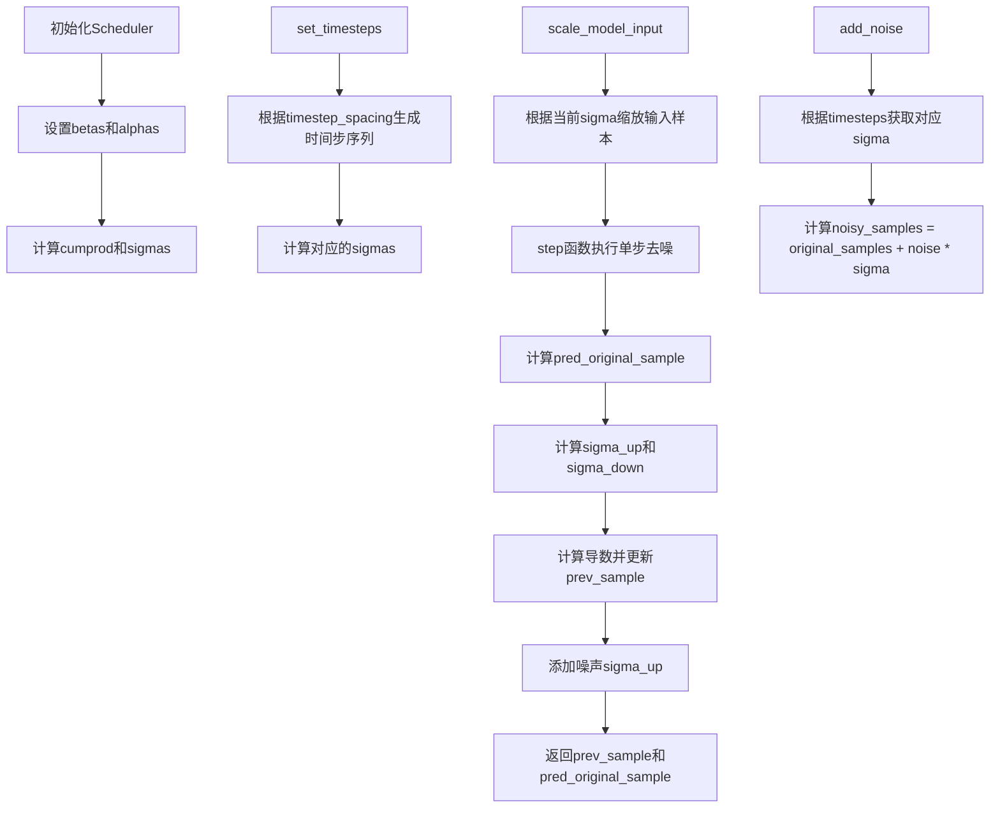

## 类结构

```
BaseOutput (基础输出类)
├── EulerAncestralDiscreteSchedulerOutput (调度器输出数据类)
├── SchedulerMixin (调度器混入类)
├── ConfigMixin (配置混入类)
└── EulerAncestralDiscreteScheduler (主调度器类)
```

## 全局变量及字段


### `logger`
    
模块级日志记录器，用于输出调度器运行时的警告和信息

类型：`logging.Logger`
    


### `EulerAncestralDiscreteSchedulerOutput.prev_sample`
    
上一步计算得到的样本x_{t-1}，用于作为下一步的输入

类型：`torch.Tensor`
    


### `EulerAncestralDiscreteSchedulerOutput.pred_original_sample`
    
预测的去噪样本x_0，可用于预览进度或引导

类型：`torch.Tensor | None`
    


### `EulerAncestralDiscreteScheduler.betas`
    
Beta调度参数序列，定义扩散过程中的噪声添加比例

类型：`torch.Tensor`
    


### `EulerAncestralDiscreteScheduler.alphas`
    
Alpha值，由1-betas计算得到，用于扩散过程

类型：`torch.Tensor`
    


### `EulerAncestralDiscreteScheduler.alphas_cumprod`
    
Alpha累积乘积，用于计算噪声标准差sigmas

类型：`torch.Tensor`
    


### `EulerAncestralDiscreteScheduler.sigmas`
    
噪声标准差序列，用于控制每步的噪声水平

类型：`torch.Tensor`
    


### `EulerAncestralDiscreteScheduler.num_inference_steps`
    
推理步数，指定生成样本时使用的扩散步数

类型：`int | None`
    


### `EulerAncestralDiscreteScheduler.timesteps`
    
时间步序列，定义扩散过程中的离散时间点

类型：`torch.Tensor`
    


### `EulerAncestralDiscreteScheduler.is_scale_input_called`
    
标记scale_model_input是否已调用，确保正确的去噪顺序

类型：`bool`
    


### `EulerAncestralDiscreteScheduler._step_index`
    
当前步索引，记录当前在扩散链中的位置

类型：`int | None`
    


### `EulerAncestralDiscreteScheduler._begin_index`
    
起始索引，用于设置推理的起始步数

类型：`int | None`
    


### `EulerAncestralDiscreteScheduler._compatibles`
    
兼容的调度器列表，包含所有兼容的KarrasDiffusionSchedulers调度器名称

类型：`list`
    


### `EulerAncestralDiscreteScheduler.order`
    
调度器阶数，用于多步求解器的阶数计算

类型：`int`
    
    

## 全局函数及方法


### `betas_for_alpha_bar`

该函数用于创建beta调度序列，通过离散化给定的alpha_t_bar函数来生成beta值。alpha_t_bar函数定义了从t=[0,1]开始的(1-beta)的累积乘积。根据alpha_transform_type参数可以选择不同的alpha_bar转换函数（cosine、exp或laplace），从而生成不同特性的噪声调度序列。

参数：

- `num_diffusion_timesteps`：`int`，要生成的beta数量，即扩散时间步的数量
- `max_beta`：`float`，默认为`0.999`，使用的最大beta值，用于避免数值不稳定
- `alpha_transform_type`：`Literal["cosine", "exp", "laplace"]`，默认为`"cosine"`，alpha_bar的噪声调度类型

返回值：`torch.Tensor`，调度器用于逐步模型输出的beta值张量

#### 流程图

```mermaid
flowchart TD
    A[开始] --> B{alpha_transform_type == 'cosine'}
    B -->|Yes| C[定义cosine alpha_bar_fn]
    B -->|No| D{alpha_transform_type == 'laplace'}
    D -->|Yes| E[定义laplace alpha_bar_fn]
    D -->|No| F{alpha_transform_type == 'exp'}
    F -->|Yes| G[定义exp alpha_bar_fn]
    F -->|No| H[抛出ValueError异常]
    C --> I[初始化空betas列表]
    E --> I
    G --> I
    I --> J[循环 i 从 0 到 num_diffusion_timesteps-1]
    J --> K[计算 t1 = i / num_diffusion_timesteps]
    K --> L[计算 t2 = (i + 1) / num_diffusion_timesteps]
    L --> M[计算 beta = min(1 - alpha_bar_fn(t2) / alpha_bar_fn(t1), max_beta)]
    M --> N[添加beta到betas列表]
    N --> O{是否还有下一个i}
    O -->|Yes| J
    O -->|No| P[将betas列表转换为torch.Tensor]
    P --> Q[返回torch.float32类型的tensor]
```

#### 带注释源码

```python
def betas_for_alpha_bar(
    num_diffusion_timesteps: int,
    max_beta: float = 0.999,
    alpha_transform_type: Literal["cosine", "exp", "laplace"] = "cosine",
) -> torch.Tensor:
    """
    Create a beta schedule that discretizes the given alpha_t_bar function, which defines the cumulative product of
    (1-beta) over time from t = [0,1].

    Contains a function alpha_bar that takes an argument t and transforms it to the cumulative product of (1-beta) up
    to that part of the diffusion process.

    Args:
        num_diffusion_timesteps (`int`):
            The number of betas to produce.
        max_beta (`float`, defaults to `0.999`):
            The maximum beta to use; use values lower than 1 to avoid numerical instability.
        alpha_transform_type (`str`, defaults to `"cosine"`):
            The type of noise schedule for `alpha_bar`. Choose from `cosine`, `exp`, or `laplace`.

    Returns:
        `torch.Tensor`:
            The betas used by the scheduler to step the model outputs.
    """
    # 根据alpha_transform_type选择对应的alpha_bar函数
    if alpha_transform_type == "cosine":
        # cosine schedule: 使用cos函数创建平滑的alpha_bar曲线
        # 使用公式 cos((t + 0.008) / 1.008 * pi / 2) ** 2
        def alpha_bar_fn(t):
            return math.cos((t + 0.008) / 1.008 * math.pi / 2) ** 2

    elif alpha_transform_type == "laplace":
        # laplace schedule: 使用拉普拉斯分布相关的SNR计算
        # 公式: sqrt(snr / (1 + snr))，其中snr = exp(lambda)
        def alpha_bar_fn(t):
            # 计算lambda值，使用copysign确保符号正确
            lmb = -0.5 * math.copysign(1, 0.5 - t) * math.log(1 - 2 * math.fabs(0.5 - t) + 1e-6)
            # 计算信号噪声比(SNR)
            snr = math.exp(lmb)
            return math.sqrt(snr / (1 + snr))

    elif alpha_transform_type == "exp":
        # exponential schedule: 指数衰减的alpha_bar
        # 使用公式 exp(t * -12.0)
        def alpha_bar_fn(t):
            return math.exp(t * -12.0)

    else:
        # 如果传入不支持的alpha_transform_type，抛出异常
        raise ValueError(f"Unsupported alpha_transform_type: {alpha_transform_type}")

    # 初始化betas列表
    betas = []
    # 遍历每个扩散时间步
    for i in range(num_diffusion_timesteps):
        # 计算当前时间步的起始和结束位置（归一化到[0,1]区间）
        t1 = i / num_diffusion_timesteps
        t2 = (i + 1) / num_diffusion_timesteps
        # 计算beta值：1减去alpha_bar的比值，并限制不超过max_beta
        # 这样确保beta值在合理范围内，避免数值不稳定
        betas.append(min(1 - alpha_bar_fn(t2) / alpha_bar_fn(t1), max_beta))
    
    # 将betas列表转换为PyTorch float32张量并返回
    return torch.tensor(betas, dtype=torch.float32)
```


### `rescale_zero_terminal_snr`

该函数用于重缩放betas以实现零终端SNR（信号噪声比），基于https://huggingface.co/papers/2305.08891论文中的算法1，通过调整beta值使扩散过程在最终时间步的信号噪声比为零，从而避免在采样结束时出现数值问题并提高生成质量。

参数：

- `betas`：`torch.Tensor`，扩散调度器初始化时使用的beta值张量

返回值：`torch.Tensor`，重缩放后的beta值，具有零终端SNR特性

#### 流程图

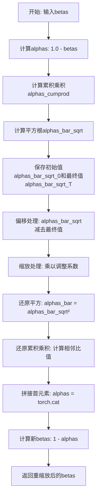

#### 带注释源码

```python
def rescale_zero_terminal_snr(betas: torch.Tensor) -> torch.Tensor:
    """
    Rescales betas to have zero terminal SNR
    基于 https://huggingface.co/papers/2305.08891 (Algorithm 1)
    
    Args:
        betas (torch.Tensor): 扩散调度器初始化时使用的beta值张量
    
    Returns:
        torch.Tensor: 重缩放后的beta值，具有零终端SNR特性
    """
    # 第一步：将betas转换为alphas（1 - beta）
    alphas = 1.0 - betas
    
    # 第二步：计算累积乘积 alpha_cumprod = alpha_0 * alpha_1 * ... * alpha_t
    alphas_cumprod = torch.cumprod(alphas, dim=0)
    
    # 第三步：计算平方根，得到 sqrt(alpha_cumprod)
    alphas_bar_sqrt = alphas_cumprod.sqrt()
    
    # 保存原始值用于后续缩放
    # alphas_bar_sqrt_0 是第一个时间步的平方根值
    alphas_bar_sqrt_0 = alphas_bar_sqrt[0].clone()
    # alphas_bar_sqrt_T 是最后一个时间步的平方根值（即终端SNR相关）
    alphas_bar_sqrt_T = alphas_bar_sqrt[-1].clone()
    
    # 第四步：偏移处理
    # 将所有值减去终端值，使最后一个时间步的SNR为零
    alphas_bar_sqrt -= alphas_bar_sqrt_T
    
    # 第五步：缩放处理
    # 调整系数 = alphas_bar_sqrt_0 / (alphas_bar_sqrt_0 - alphas_bar_sqrt_T)
    # 这样可以保证第一个时间步的值恢复到原始水平
    alphas_bar_sqrt *= alphas_bar_sqrt_0 / (alphas_bar_sqrt_0 - alphas_bar_sqrt_T)
    
    # 第六步：还原平方操作，得到 alphas_bar
    alphas_bar = alphas_bar_sqrt ** 2
    
    # 第七步：还原累积乘积
    # 通过相邻元素的比值来还原 alpha_t = alpha_bar_t / alpha_bar_{t-1}
    alphas = alphas_bar[1:] / alphas_bar[:-1]
    
    # 拼接第一个元素（t=0时的alpha值）
    alphas = torch.cat([alphas_bar[0:1], alphas])
    
    # 第八步：从alphas计算新的betas
    betas = 1 - alphas
    
    return betas
```


### `EulerAncestralDiscreteScheduler.__init__`

该方法是 `EulerAncestralDiscreteScheduler` 类的初始化构造函数，负责根据传入的参数构建欧拉祖先离散调度器。它根据指定的 beta 调度策略计算或使用预训练的 betas，计算累积乘积 alphas 和 sigmas，并初始化调度器所需的各类状态变量，为后续扩散模型的推理或训练提供必要的参数。

参数：

- `num_train_timesteps`：`int`，默认为 1000，扩散过程的总训练步数
- `beta_start`：`float`，默认为 0.0001，beta 调度曲线的起始值
- `beta_end`：`float`，默认为 0.02，beta 调度曲线的终止值
- `beta_schedule`：`str`，默认为 "linear"，beta 调度策略，可选 "linear"、"scaled_linear" 或 "squaredcos_cap_v2"
- `trained_betas`：`np.ndarray | list[float] | None`，可选的预训练 betas 数组，若提供则忽略 beta_start 和 beta_end
- `prediction_type`：`str`，默认为 "epsilon"，预测类型，可选 "epsilon"、"sample" 或 "v_prediction"
- `timestep_spacing`：`str`，默认为 "linspace"，时间步间隔策略，可选 "linspace"、"leading" 或 "trailing"
- `steps_offset`：`int`，默认为 0，推理步数的偏移量
- `rescale_betas_zero_snr`：`bool`，默认为 False，是否将 betas 重缩放为零终端信噪比

返回值：`None`，该方法无返回值

#### 流程图

```mermaid
flowchart TD
    A[开始 __init__] --> B{trained_betas 是否为 None}
    B -->|是| C{beta_schedule 类型}
    B -->|否| D[直接使用 trained_betas 创建 betas]
    C -->|"linear"| E[使用 torch.linspace 创建线性 betas]
    C -->|"scaled_linear"| F[使用平方根线性插值创建 betas]
    C -->|"squaredcos_cap_v2"| G[使用 betas_for_alpha_bar 创建 betas]
    C -->|其他| H[抛出 NotImplementedError]
    D --> I{rescale_betas_zero_snr 为 True}
    E --> I
    F --> I
    G --> I
    I -->|是| J[调用 rescale_zero_terminal_snr 重缩放 betas]
    I -->|否| K[跳过重缩放]
    J --> L[计算 alphas = 1.0 - betas]
    K --> L
    L --> M[计算 alphas_cumprod = torch.cumprod]
    M --> N{rescale_betas_zero_snr 为 True}
    N -->|是| O[设置 alphas_cumprod[-1] 为 2\*\*-24]
    N -->|否| P[跳过设置]
    O --> Q[计算 sigmas]
    P --> Q
    Q --> R[设置 num_inference_steps = None]
    R --> S[创建并设置 timesteps]
    S --> T[设置 is_scale_input_called = False]
    T --> U[初始化 _step_index 和 _begin_index 为 None]
    U --> V[将 sigmas 移至 CPU]
    V --> W[结束 __init__]
```

#### 带注释源码

```python
@register_to_config
def __init__(
    self,
    num_train_timesteps: int = 1000,          # 扩散训练的总步数，默认1000
    beta_start: float = 0.0001,               # beta起始值，默认0.0001
    beta_end: float = 0.02,                   # beta结束值，默认0.02
    beta_schedule: str = "linear",            # beta调度策略：linear/scaled_linear/squaredcos_cap_v2
    trained_betas: np.ndarray | list[float] | None = None,  # 可选的预定义betas数组
    prediction_type: str = "epsilon",        # 预测类型：epsilon/sample/v_prediction
    timestep_spacing: str = "linspace",       # 时间步间隔策略：linspace/leading/trailing
    steps_offset: int = 0,                    # 推理步数偏移量
    rescale_betas_zero_snr: bool = False,    # 是否重缩放betas为零终端SNR
) -> None:
    # 步骤1：根据条件初始化 betas
    if trained_betas is not None:
        # 如果直接提供了betas，直接使用
        self.betas = torch.tensor(trained_betas, dtype=torch.float32)
    elif beta_schedule == "linear":
        # 线性beta调度：从beta_start线性增加到beta_end
        self.betas = torch.linspace(beta_start, beta_end, num_train_timesteps, dtype=torch.float32)
    elif beta_schedule == "scaled_linear":
        # 缩放线性调度：先在线性空间中插值，再平方（特定于潜在扩散模型）
        self.betas = torch.linspace(beta_start**0.5, beta_end**0.5, num_train_timesteps, dtype=torch.float32) ** 2
    elif beta_schedule == "squaredcos_cap_v2":
        # Glide余弦调度：使用alpha_bar函数生成betas
        self.betas = betas_for_alpha_bar(num_train_timesteps)
    else:
        raise NotImplementedError(f"{beta_schedule} is not implemented for {self.__class__}")

    # 步骤2：可选的betas重缩放（零终端SNR）
    if rescale_betas_zero_snr:
        self.betas = rescale_zero_terminal_snr(self.betas)

    # 步骤3：计算alphas（1-beta）和累积乘积alphas_cumprod
    self.alphas = 1.0 - self.betas
    self.alphas_cumprod = torch.cumprod(self.alphas, dim=0)

    # 步骤4：处理alphas_cumprod的最后一个值（避免数值问题）
    if rescale_betas_zero_snr:
        # 接近0但不为0，使第一个sigma不是无穷大
        # FP16最小的正规格化数在这里效果很好
        self.alphas_cumprod[-1] = 2**-24

    # 步骤5：计算sigmas（噪声标准差）
    # sigmas = sqrt((1 - alphas_cumprod) / alphas_cumprod)
    sigmas = np.array(((1 - self.alphas_cumprod) / self.alphas_cumprod) ** 0.5)
    # 反转并添加最终sigma为0
    sigmas = np.concatenate([sigmas[::-1], [0.0]]).astype(np.float32)
    self.sigmas = torch.from_numpy(sigmas)

    # 步骤6：初始化可设置的状态值
    self.num_inference_steps = None  # 推理步数（在set_timesteps中设置）
    
    # 创建时间步数组：从0到num_train_timesteps-1，然后反转
    timesteps = np.linspace(0, num_train_timesteps - 1, num_train_timesteps, dtype=float)[::-1].copy()
    self.timesteps = torch.from_numpy(timesteps)
    
    self.is_scale_input_called = False  # 标记scale_model_input是否已调用

    # 步骤7：初始化内部索引状态
    self._step_index = None      # 当前时间步索引
    self._begin_index = None     # 起始索引（用于pipeline）

    # 步骤8：将sigmas移到CPU以减少CPU/GPU通信开销
    self.sigmas = self.sigmas.to("cpu")
```


### `EulerAncestralDiscreteScheduler.init_noise_sigma`

该属性返回初始噪声分布的标准差，用于在扩散过程的起始时刻确定噪声的强度。根据时间步间隔配置的不同，返回值会有所变化：当使用"linspace"或"trailing"时间步间隔时，返回最大sigma值；否则返回基于最大sigma计算的扩展标准差。

参数：

- `self`：`EulerAncestralDiscreteScheduler` 实例，隐式参数，调度器自身

返回值：`torch.Tensor`，初始噪声的标准差（标量张量），用于初始化扩散过程的噪声水平

#### 流程图

```mermaid
flowchart TD
    A[开始: 获取 init_noise_sigma] --> B{检查 timestep_spacing 配置}
    B -->|linspace 或 trailing| C[返回 self.sigmas.max]
    B -->|其他| D[计算 sqrt&#40;max_sigma² + 1&#41;]
    D --> C
    C --> E[返回标准差值]
```

#### 带注释源码

```python
@property
def init_noise_sigma(self) -> torch.Tensor:
    """
    Returns the standard deviation of the initial noise distribution.
    
    This property determines the noise level at the start of the diffusion process.
    The value depends on the timestep spacing configuration:
    - For 'linspace' and 'trailing' spacing: returns the maximum sigma value
    - For other spacing modes: returns sqrt(max_sigma^2 + 1) to account for
      the scaling needed in the Euler method
    
    Returns:
        torch.Tensor: The initial noise standard deviation (scalar tensor)
    """
    # standard deviation of the initial noise distribution
    # Check the timestep spacing configuration to determine the appropriate sigma value
    if self.config.timestep_spacing in ["linspace", "trailing"]:
        # For linspace and trailing spacing, use the maximum sigma directly
        return self.sigmas.max()

    # For other spacing modes (e.g., 'leading'), compute the extended sigma
    # This accounts for the (sigma^2 + 1)^0.5 scaling used in Euler method
    return (self.sigmas.max() ** 2 + 1) ** 0.5
```


### `EulerAncestralDiscreteScheduler.step_index`

该属性返回调度器在扩散链中当前时间步的索引计数器。在每次调用 `step` 方法后，该索引会自动增加 1，用于追踪当前处于哪个去噪步骤。

参数： 无（属性访问无需参数）

返回值：`int`，当前时间步的索引计数器。初始值为 `None`，在首次调用 `step` 或 `scale_model_input` 方法后被初始化，随后每执行一步去噪操作递增 1。

#### 流程图

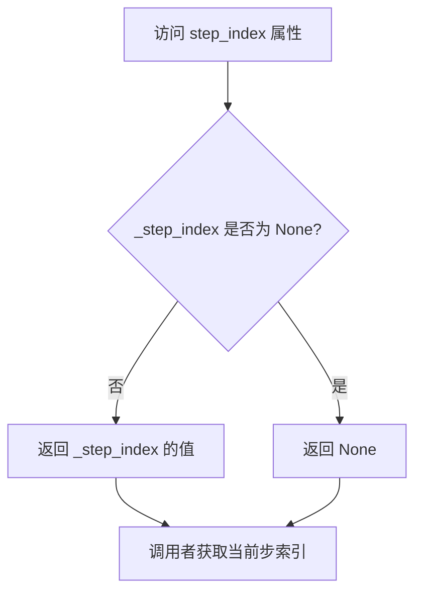

#### 带注释源码

```python
@property
def step_index(self) -> int:
    """
    The index counter for current timestep. It will increase 1 after each scheduler step.
    """
    return self._step_index
```

**代码说明**：
- 这是一个只读属性（property），返回内部变量 `_step_index` 的值
- `_step_index` 在调度器初始化时被设置为 `None`
- 首次调用 `scale_model_input()` 或 `step()` 方法时，会通过 `_init_step_index()` 方法根据当前时间步初始化该值
- 每执行一次 `step()` 方法，该值会自动递增 1（`self._step_index += 1`）
- 该属性用于在去噪循环中追踪当前所处的推理步骤位置


### `EulerAncestralDiscreteScheduler.begin_index`

该属性返回调度器的起始索引，用于指定扩散链的第一个时间步索引。该值需要通过 `set_begin_index` 方法从管道中设置。

参数：
- 该方法为属性装饰器，无显式参数

返回值：`int`，返回调度器的起始时间步索引。如果未设置，则返回 `None`。

#### 流程图

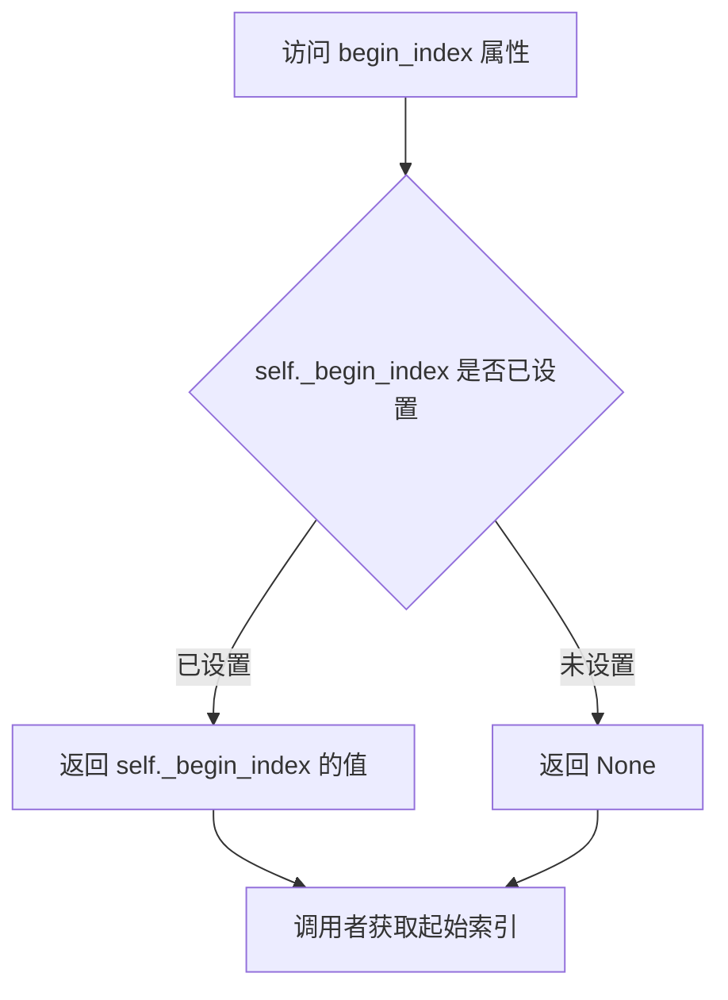

#### 带注释源码

```python
@property
def begin_index(self) -> int:
    """
    The index for the first timestep. It should be set from pipeline with `set_begin_index` method.
    """
    # 返回私有属性 _begin_index 的值
    # 该值在 __init__ 方法中初始化为 None
    # 可以通过 set_begin_index 方法设置具体值
    # 用于支持从扩散链的中间步骤开始采样（如 img2img 场景）
    return self._begin_index
```

#### 相关上下文信息

| 项目 | 说明 |
|------|------|
| 所属类 | `EulerAncestralDiscreteScheduler` |
| 关联属性 | `_begin_index`（私有属性，初始化为 `None`） |
| 关联方法 | `set_begin_index(begin_index: int)` - 用于设置起始索引 |
| 使用场景 | 在图像到图像（img2img）任务中，从中间时间步开始去噪时使用 |
| 初始化位置 | `__init__` 方法中 `self._begin_index = None` |
| 设置时机 | 在管道（pipeline）进行推理前调用 `set_begin_index` |


### `EulerAncestralDiscreteScheduler.set_begin_index`

设置调度器的起始索引。该方法应在推理前从管道调用，用于指定扩散过程从哪个时间步开始执行。

参数：

- `begin_index`：`int`，默认为 `0`，调度器的起始索引，用于控制从扩散链的哪个时间步开始采样。

返回值：`None`，无返回值，仅修改对象内部状态。

#### 流程图

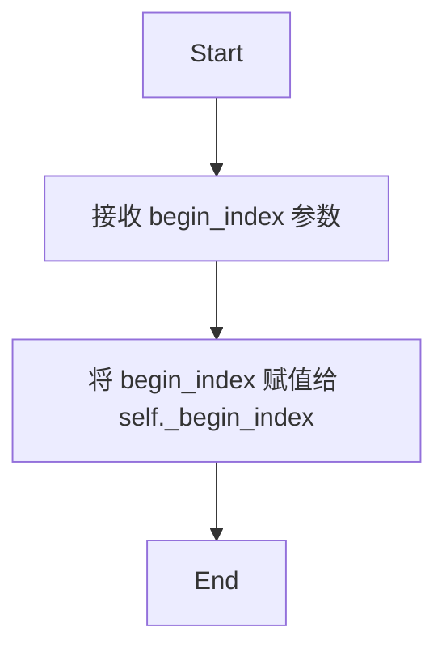

#### 带注释源码

```python
def set_begin_index(self, begin_index: int = 0) -> None:
    """
    设置调度器的起始索引。此方法应在推理前从管道调用。

    参数:
        begin_index (int, 默认为 0):
            调度器的起始索引。
    """
    # 将传入的 begin_index 参数赋值给实例变量 _begin_index
    # 该变量用于记录扩散过程的起始时间步位置
    self._begin_index = begin_index
```


### `EulerAncestralDiscreteScheduler.scale_model_input`

该方法用于根据当前时间步缩放去噪模型输入，确保与需要根据时间步调整输入的调度器可互换使用。它通过除以 `(sigma**2 + 1) ** 0.5` 来缩放输入样本，以匹配 Euler 算法。

参数：

- `sample`：`torch.Tensor`，当前由扩散过程生成的输入样本
- `timestep`：`float | torch.Tensor`，扩散链中的当前离散时间步

返回值：`torch.Tensor`，缩放后的输入样本

#### 流程图

```mermaid
flowchart TD
    A[开始 scale_model_input] --> B{step_index is None?}
    B -->|Yes| C[调用 _init_step_index 初始化 step_index]
    B -->|No| D[直接获取 sigma]
    C --> D
    D --> E[获取 sigma = self.sigmas[step_index]]
    E --> F[计算缩放因子: sample / ((sigma² + 1)⁰·⁵]
    F --> G[设置 self.is_scale_input_called = True]
    G --> H[返回缩放后的 sample]
```

#### 带注释源码

```python
def scale_model_input(self, sample: torch.Tensor, timestep: float | torch.Tensor) -> torch.Tensor:
    """
    Ensures interchangeability with schedulers that need to scale the denoising model input depending on the
    current timestep. Scales the denoising model input by `(sigma**2 + 1) ** 0.5` to match the Euler algorithm.

    Args:
        sample (`torch.Tensor`):
            The input sample.
        timestep (`float` or `torch.Tensor`):
            The current timestep in the diffusion chain.

    Returns:
        `torch.Tensor`:
            A scaled input sample.
    """

    # 如果尚未初始化 step_index，则根据当前 timestep 初始化它
    # 这确保了调度器能够正确跟踪当前处于扩散链的哪个步骤
    if self.step_index is None:
        self._init_step_index(timestep)

    # 获取当前时间步对应的 sigma 值
    # sigma 表示当前步骤的噪声水平，用于控制去噪强度
    sigma = self.sigmas[self.step_index]
    
    # 根据 Euler 算法要求缩放输入样本
    # 将样本除以 (sigma² + 1)的平方根，以将输入调整到正确的数值范围
    # 这是因为 Euler 方法假设输入已经被噪声水平缩放
    sample = sample / ((sigma**2 + 1) ** 0.5)
    
    # 标记 scale_model_input 已被调用
    # 用于在 step() 方法中进行警告检查，确保正确使用调度器
    self.is_scale_input_called = True
    
    # 返回缩放后的样本，可用于后续的去噪步骤
    return sample
```


### `EulerAncestralDiscreteScheduler.set_timesteps`

该方法用于在推理前设置扩散链中使用的离散时间步，根据配置的 `timestep_spacing` 策略（linspace/leading/trailing）计算推理过程中的时间步序列，并初始化对应的噪声sigma值。

参数：

- `num_inference_steps`：`int`，推理时使用的扩散步数，决定生成样本时需要执行多少次去噪迭代
- `device`：`str | torch.device`，可选参数，时间步和sigma张量要移动到的目标设备，默认为 None（不移动）

返回值：`None`，该方法通过修改调度器的内部状态（`timesteps`、`sigmas`、`num_inference_steps` 等）来生效

#### 流程图

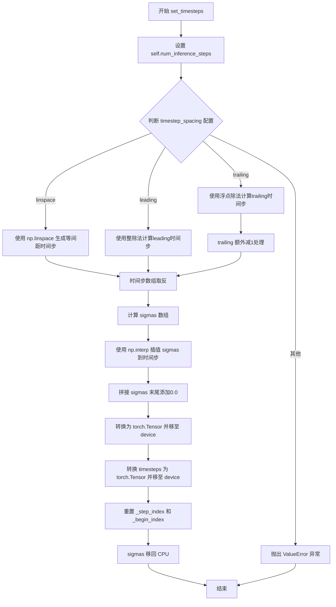

#### 带注释源码

```python
def set_timesteps(self, num_inference_steps: int, device: str | torch.device = None):
    """
    Sets the discrete timesteps used for the diffusion chain (to be run before inference).

    Args:
        num_inference_steps (`int`):
            The number of diffusion steps used when generating samples with a pre-trained model.
        device (`str` or `torch.device`, *optional*):
            The device to which the timesteps should be moved to. If `None`, the timesteps are not moved.
    """
    # 1. 设置推理步数
    self.num_inference_steps = num_inference_steps

    # 2. 根据 timestep_spacing 配置策略生成时间步序列
    # 参考: https://huggingface.co/papers/2305.08891 表2
    if self.config.timestep_spacing == "linspace":
        # linspace 策略: 在 [0, num_train_timesteps-1] 范围内生成等间距的时间步
        timesteps = np.linspace(0, self.config.num_train_timesteps - 1, num_inference_steps, dtype=np.float32)[
            ::-1  # 取反，使时间步从大到小排列（高噪声到低噪声）
        ].copy()
    elif self.config.timestep_spacing == "leading":
        # leading 策略: 生成领头的时间步序列，步长为整数
        step_ratio = self.config.num_train_timesteps // self.num_inference_steps
        # 乘以比例得到整数时间步，round()避免精度问题
        timesteps = (np.arange(0, num_inference_steps) * step_ratio).round()[::-1].copy().astype(np.float32)
        # 加上偏移量（某些模型族需要）
        timesteps += self.config.steps_offset
    elif self.config.timestep_spacing == "trailing":
        # trailing 策略: 生成末尾的时间步序列
        step_ratio = self.config.num_train_timesteps / self.num_inference_steps
        # 从最大时间步开始递减
        timesteps = (np.arange(self.config.num_train_timesteps, 0, -step_ratio)).round().copy().astype(np.float32)
        # trailing 策略需要减1以匹配正确的时间索引
        timesteps -= 1
    else:
        raise ValueError(
            f"{self.config.timestep_spacing} is not supported. Please make sure to choose one of 'linspace', 'leading' or 'trailing'."
        )

    # 3. 计算 sigma 数组（噪声标准差）
    # sigma = sqrt((1 - alphas_cumprod) / alphas_cumprod)
    sigmas = np.array(((1 - self.alphas_cumprod) / self.alphas_cumprod) ** 0.5)
    # 4. 将 sigmas 插值到生成的时间步上
    sigmas = np.interp(timesteps, np.arange(0, len(sigmas)), sigmas)
    # 5. 在末尾添加 0.0（最后一步无噪声，对应纯样本）
    sigmas = np.concatenate([sigmas, [0.0]]).astype(np.float32)
    
    # 6. 转换为 PyTorch 张量并移至目标设备
    self.sigmas = torch.from_numpy(sigmas).to(device=device)
    self.timesteps = torch.from_numpy(timesteps).to(device=device)
    
    # 7. 重置步进索引
    self._step_index = None
    self._begin_index = None
    
    # 8. 将 sigmas 保留在 CPU 端以减少 CPU/GPU 通信开销
    self.sigmas = self.sigmas.to("cpu")
```


### `EulerAncestralDiscreteScheduler.index_for_timestep`

该方法用于在时间步调度序列中查找给定时间步对应的索引位置。当在去噪调度中间开始采样时（如图像到图像任务），为避免跳过 sigma 值，对于第一个时间步会返回匹配的第二个索引（如果存在多个匹配）。

参数：

- `self`：`EulerAncestralDiscreteScheduler` 调度器实例本身
- `timestep`：`float | torch.Tensor`，需要查找的时间步值，可以是浮点数或张量
- `schedule_timesteps`：`torch.Tensor | None`，可选参数，指定要搜索的时间步调度序列。如果为 `None`，则使用 `self.timesteps`

返回值：`int`，返回给定时间步在调度序列中的索引位置。对于第一步，如果存在多个匹配，会返回第二个索引以避免在调度中间开始时跳过 sigma 值。

#### 流程图

```mermaid
flowchart TD
    A[开始 index_for_timestep] --> B{schedule_timesteps 为 None?}
    B -->|是| C[使用 self.timesteps 作为 schedule_timesteps]
    B -->|否| D[使用传入的 schedule_timesteps]
    C --> E[在 schedule_timesteps 中查找等于 timestep 的索引]
    D --> E
    E --> F[获取所有匹配的索引]
    F --> G{匹配数量 > 1?}
    G -->|是| H[pos = 1]
    G -->|否| I[pos = 0]
    H --> J[返回 indices[pos].item()]
    I --> J
    J --> K[结束]
```

#### 带注释源码

```python
# Copied from diffusers.schedulers.scheduling_euler_discrete.EulerDiscreteScheduler.index_for_timestep
def index_for_timestep(
    self, timestep: float | torch.Tensor, schedule_timesteps: torch.Tensor | None = None
) -> int:
    """
    Find the index of a given timestep in the timestep schedule.

    Args:
        timestep (`float` or `torch.Tensor`):
            The timestep value to find in the schedule.
        schedule_timesteps (`torch.Tensor`, *optional*):
            The timestep schedule to search in. If `None`, uses `self.timesteps`.

    Returns:
        `int`:
            The index of the timestep in the schedule. For the very first step, returns the second index if
            multiple matches exist to avoid skipping a sigma when starting mid-schedule (e.g., for image-to-image).
    """
    # 如果未提供 schedule_timesteps，则使用调度器自身的 timesteps
    if schedule_timesteps is None:
        schedule_timesteps = self.timesteps

    # 使用 nonzero() 查找所有等于给定 timestep 值的索引位置
    # 返回的是一个二维张量，每行是一个匹配位置的索引
    indices = (schedule_timesteps == timestep).nonzero()

    # The sigma index that is taken for the **very** first `step`
    # is always the second index (or the last index if there is only 1)
    # This way we can ensure we don't accidentally skip a sigma in
    # case we start in the middle of the denoising schedule (e.g. for image-to-image)
    # 如果存在多个匹配位置（常见于从调度中间开始的情况），
    # 则使用第二个位置以避免跳过 sigma 值
    pos = 1 if len(indices) > 1 else 0

    # 将索引转换为 Python 整数并返回
    return indices[pos].item()
```


### `EulerAncestralDiscreteScheduler._init_step_index`

该方法用于根据给定的时间步（timestep）初始化调度器的步骤索引（step_index），确保调度器能够正确定位当前推理过程中的时间步位置。

参数：

- `timestep`：`float | torch.Tensor`，当前时间步，用于初始化步骤索引

返回值：`None`，无返回值

#### 流程图

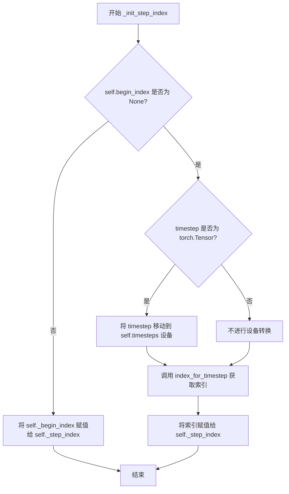

#### 带注释源码

```python
def _init_step_index(self, timestep: float | torch.Tensor) -> None:
    """
    Initialize the step index for the scheduler based on the given timestep.

    Args:
        timestep (`float` or `torch.Tensor`):
            The current timestep to initialize the step index from.
    """
    # 检查 begin_index 是否已设置
    if self.begin_index is None:
        # 如果 timestep 是张量，确保它与 self.timesteps 在同一设备上
        if isinstance(timestep, torch.Tensor):
            timestep = timestep.to(self.timesteps.device)
        # 通过 index_for_timestep 方法查找对应的时间步索引
        self._step_index = self.index_for_timestep(timestep)
    else:
        # 如果已设置 begin_index，直接使用该值作为步骤索引
        self._step_index = self._begin_index
```


### `EulerAncestralDiscreteScheduler.step`

该方法通过逆转扩散随机微分方程（SDE），基于当前时间步的模型预测（通常是预测的噪声）来预测前一个时间步的样本。这是Euler ancestral采样方法的核心步骤，用于在扩散模型的推理过程中逐步去噪。

参数：

- `model_output`：`torch.Tensor`，学习到的扩散模型的直接输出（预测的噪声）
- `timestep`：`float | torch.Tensor`，扩散链中的当前离散时间步
- `torch.Tensor`：当前由扩散过程创建的样本实例
- `generator`：`torch.Generator | None`，随机数生成器，用于产生可重现的噪声
- `return_dict`：`bool`，默认为`True`，是否返回`EulerAncestralDiscreteSchedulerOutput`对象或元组

返回值：`EulerAncestralDiscreteSchedulerOutput | tuple`，如果`return_dict`为`True`，返回包含`prev_sample`和`pred_original_sample`的对象；否则返回元组

#### 流程图

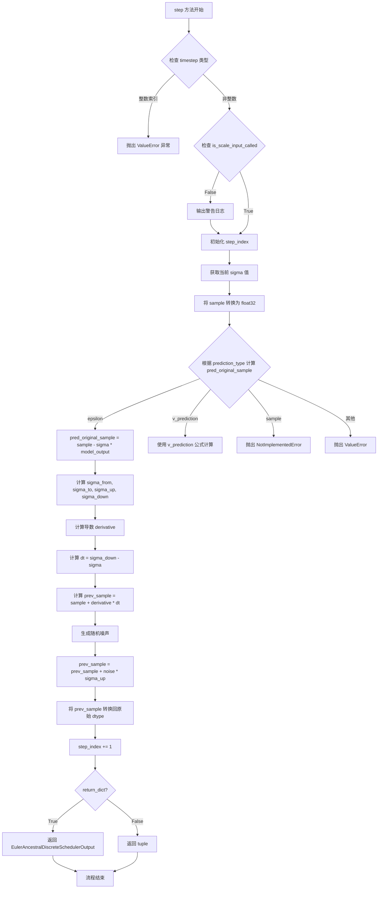

#### 带注释源码

```python
def step(
    self,
    model_output: torch.Tensor,
    timestep: float | torch.Tensor,
    sample: torch.Tensor,
    generator: torch.Generator | None = None,
    return_dict: bool = True,
) -> EulerAncestralDiscreteSchedulerOutput | tuple:
    """
    通过逆转SDE来预测前一个时间步的样本。此函数根据学习到的模型输出（通常是预测的噪声）推进扩散过程。

    参数:
        model_output (torch.Tensor): 学习到的扩散模型的直接输出
        timestep (float 或 torch.Tensor): 扩散链中的当前离散时间步
        sample (torch.Tensor): 扩散过程创建的当前样本实例
        generator (torch.Generator, 可选): 随机数生成器
        return_dict (bool, 默认为 True): 是否返回 EulerAncestralDiscreteSchedulerOutput 或元组

    返回:
        EulerAncestralDiscreteSchedulerOutput 或 tuple: 如果 return_dict 为 True，返回包含 prev_sample 和 pred_original_sample 的对象；否则返回元组
    """
    # 检查 timestep 是否为整数类型（不支持）
    if isinstance(timestep, (int, torch.IntTensor, torch.LongTensor)):
        raise ValueError(
            (
                "不支持将整数索引（例如从 `enumerate(timesteps)`）作为时间步传递给"
                " `EulerDiscreteScheduler.step()`。请确保传递 `scheduler.timesteps` 中的一个作为时间步。"
            ),
        )

    # 检查是否已调用 scale_model_input
    if not self.is_scale_input_called:
        logger.warning(
            "为确保正确的去噪，应在 `step` 之前调用 `scale_model_input` 函数。"
            "参见 `StableDiffusionPipeline` 的使用示例。"
        )

    # 初始化 step_index（如果尚未初始化）
    if self.step_index is None:
        self._init_step_index(timestep)

    # 获取当前时间步对应的 sigma 值
    sigma = self.sigmas[self.step_index]

    # 向上转换以避免计算精度问题
    sample = sample.to(torch.float32)

    # 1. 从 sigma 缩放的预测噪声计算原始样本 (x_0)
    if self.config.prediction_type == "epsilon":
        # epsilon 预测：x_0 = x_t - σ * ε
        pred_original_sample = sample - sigma * model_output
    elif self.config.prediction_type == "v_prediction":
        # v_prediction 预测：根据 Imagen Video 论文公式
        # c_out + input * c_skip
        pred_original_sample = model_output * (-sigma / (sigma**2 + 1) ** 0.5) + (sample / (sigma**2 + 1))
    elif self.config.prediction_type == "sample":
        raise NotImplementedError("prediction_type not implemented yet: sample")
    else:
        raise ValueError(
            f"prediction_type given as {self.config.prediction_type} must be one of `epsilon`, or `v_prediction`"
        )

    # 获取当前和下一个时间步的 sigma 值
    sigma_from = self.sigmas[self.step_index]
    sigma_to = self.sigmas[self.step_index + 1]
    # 计算向上和向下的 sigma 噪声参数
    sigma_up = (sigma_to**2 * (sigma_from**2 - sigma_to**2) / sigma_from**2) ** 0.5
    sigma_down = (sigma_to**2 - sigma_up**2) ** 0.5

    # 2. 转换为 ODE 导数
    # 这是 Euler 方法的核心：导数 = (x_t - x_0) / σ
    derivative = (sample - pred_original_sample) / sigma

    # 计算时间步长 dt
    dt = sigma_down - sigma

    # 使用 Euler 方法更新样本
    prev_sample = sample + derivative * dt

    # 生成随机噪声用于 ancestral sampling
    device = model_output.device
    noise = randn_tensor(model_output.shape, dtype=model_output.dtype, device=device, generator=generator)

    # 添加向上采样的噪声（ancestral sampling 的关键）
    prev_sample = prev_sample + noise * sigma_up

    # 将样本转回模型兼容的 dtype
    prev_sample = prev_sample.to(model_output.dtype)

    # 完成时将 step index 增加 1
    self._step_index += 1

    # 根据 return_dict 返回结果
    if not return_dict:
        return (
            prev_sample,
            pred_original_sample,
        )

    return EulerAncestralDiscreteSchedulerOutput(
        prev_sample=prev_sample, pred_original_sample=pred_original_sample
    )
```


### EulerAncestralDiscreteScheduler.add_noise

该方法用于根据噪声调度表在指定的时间步将噪声添加到原始样本中，是扩散模型前向过程（加噪过程）的实现。

参数：

- `self`：`EulerAncestralDiscreteScheduler`，调度器实例本身
- `original_samples`：`torch.Tensor`，需要添加噪声的原始样本
- `noise`：`torch.Tensor`，要添加到原始样本的噪声张量
- `timesteps`：`torch.Tensor`，指定添加噪声的时间步，用于从调度表中确定噪声级别

返回值：`torch.Tensor`，添加了按时间步调度缩放噪声后的噪声样本

#### 流程图

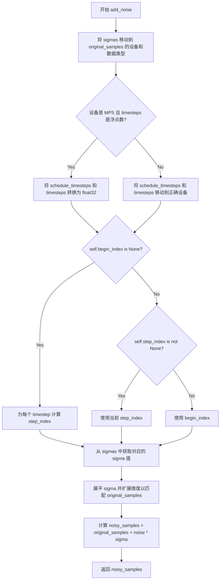

#### 带注释源码

```python
def add_noise(
    self,
    original_samples: torch.Tensor,
    noise: torch.Tensor,
    timesteps: torch.Tensor,
) -> torch.Tensor:
    """
    Add noise to the original samples according to the noise schedule at the specified timesteps.

    Args:
        original_samples (`torch.Tensor`):
            The original samples to which noise will be added.
        noise (`torch.Tensor`):
            The noise tensor to add to the original samples.
        timesteps (`torch.Tensor`):
            The timesteps at which to add noise, determining the noise level from the schedule.

    Returns:
        `torch.Tensor`:
            The noisy samples with added noise scaled according to the timestep schedule.
    """
    # Make sure sigmas and timesteps have the same device and dtype as original_samples
    sigmas = self.sigmas.to(device=original_samples.device, dtype=original_samples.dtype)
    
    # Handle MPS device specific case (MPS does not support float64)
    if original_samples.device.type == "mps" and torch.is_floating_point(timesteps):
        # mps does not support float64
        schedule_timesteps = self.timesteps.to(original_samples.device, dtype=torch.float32)
        timesteps = timesteps.to(original_samples.device, dtype=torch.float32)
    else:
        schedule_timesteps = self.timesteps.to(original_samples.device)
        timesteps = timesteps.to(original_samples.device)

    # Determine step indices based on scheduler state
    # self.begin_index is None when scheduler is used for training, or pipeline does not implement set_begin_index
    if self.begin_index is None:
        # Standard training case: compute step indices from timesteps
        step_indices = [self.index_for_timestep(t, schedule_timesteps) for t in timesteps]
    elif self.step_index is not None:
        # add_noise is called after first denoising step (for inpainting)
        step_indices = [self.step_index] * timesteps.shape[0]
    else:
        # add noise is called before first denoising step to create initial latent (img2img)
        step_indices = [self.begin_index] * timesteps.shape[0]

    # Get sigma values for the computed step indices and reshape to match sample dimensions
    sigma = sigmas[step_indices].flatten()
    while len(sigma.shape) < len(original_samples.shape):
        sigma = sigma.unsqueeze(-1)

    # Compute noisy samples: x_t = x_0 + σ * ε
    noisy_samples = original_samples + noise * sigma
    return noisy_samples
```


### `EulerAncestralDiscreteScheduler.__len__`

返回 `EulerAncestralDiscreteScheduler` 调度器配置中定义的训练时间步总数，使得调度器可以像序列一样被查询长度。

参数：

- 无显式参数（`self` 为隐式参数）

返回值：`int`，返回配置的训练时间步数量（即 `self.config.num_train_timesteps`），用于表示该调度器管理的扩散过程的总步数。

#### 流程图

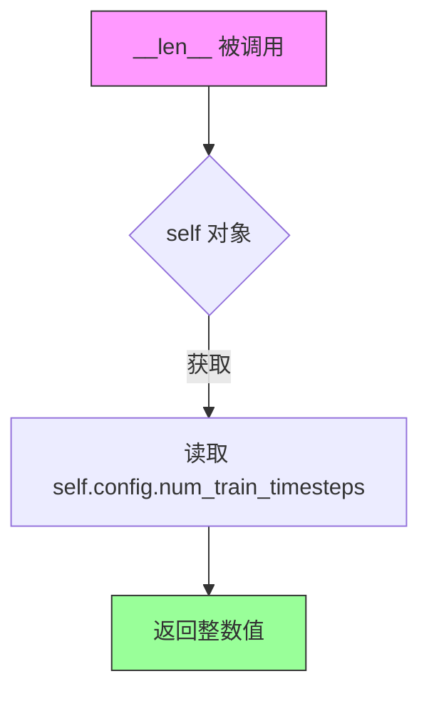

#### 带注释源码

```python
def __len__(self) -> int:
    """
    返回调度器训练时使用的时间步总数。
    
    该方法使得 EulerAncestralDiscreteScheduler 可以像普通序列一样
    使用 len() 函数获取其长度，便于与标准库或外部代码集成。
    
    Returns:
        int: 训练时间步的数量，通常在创建调度器时通过 num_train_timesteps 参数指定，
             默认为 1000。
    """
    return self.config.num_train_timesteps
```

---

#### 补充上下文

该方法对应的类字段信息：

| 字段名称 | 类型 | 描述 |
|---------|------|------|
| `num_train_timesteps` | `int` | 训练时使用的扩散步数（默认 1000） |
| `config` | `ConfigMixin` | 包含调度器所有配置属性的配置对象 |

该方法是 Python 魔术方法（`__len__`），使得调度器实例可以直接使用 `len(scheduler)` 获取训练时间步的总数，这在使用标准 Python 接口遍历或检查调度器状态时非常有用。

## 关键组件


### EulerAncestralDiscreteScheduler

核心调度器类，实现基于Euler方法的祖先采样（ancestral sampling），用于扩散模型的离散时间步推理过程。该调度器通过逆转SDE（随机微分方程）来预测前一个时间步的样本，支持epsilon、v_prediction等预测类型，并实现了噪声调度、模型输入缩放、步进和噪声添加等核心功能。

### EulerAncestralDiscreteSchedulerOutput

输出数据类，用于存储调度器step函数的输出结果。包含prev_sample（计算出的前一步样本x_{t-1}）和pred_original_sample（预测的原始去噪样本x_0，可用于预览进度或引导）两个张量字段。

### betas_for_alpha_bar 函数

用于创建beta调度的辅助函数，根据给定的alpha_t_bar函数生成离散的beta序列。支持三种alpha变换类型：cosine（余弦）、exp（指数）和laplace（拉普拉斯），通过数值积分将连续函数离散化为beta数组。

### rescale_zero_terminal_snr 函数

用于重新缩放beta以实现零终端SNR（信号噪声比）的辅助函数。基于论文https://huggingface.co/papers/2305.08891的Algorithm 1，实现将最后时间步的SNR设为零，从而允许模型生成非常亮或非常暗的样本，而不是限制在中等亮度范围内。

### 张量索引与惰性加载机制

调度器将sigma张量存储在CPU上（`self.sigmas = self.sigmas.to("cpu")`）以避免过多的CPU/GPU通信，在需要时才将其移动到目标设备。timesteps和sigmas在set_timesteps方法中根据配置动态生成和设备分配。

### 反量化支持

调度器通过prediction_type配置支持多种预测类型：epsilon（预测扩散过程的噪声）、sample（直接预测 noisy sample）和v_prediction（根据Imagen Video论文的v-prediction）。step方法中根据不同预测类型计算原始样本x_0，并使用float32精度进行计算以避免精度问题。

### 噪声调度与时间步间距

调度器实现三种时间步间距策略：linspace（等间距）、leading（领先间距）和trailing（尾部间距），参考Common Diffusion Noise Schedules论文的Table 2。通过steps_offset偏移量支持某些模型家族的需求。

### add_noise 方法

用于训练阶段的噪声添加方法，根据时间步调度在原始样本上添加噪声。通过index_for_timestep查找对应的时间步索引，获取相应的sigma值并将其广播到与输入样本相同的维度后进行噪声添加。

### scale_model_input 方法

确保与需要根据当前时间步缩放去噪模型输入的调度器互换性。通过除以(sigma^2 + 1)^0.5来匹配Euler算法的缩放要求。


## 问题及建议


### 已知问题

-   **代码重复（代码克隆）**：多处函数和方法从其他调度器复制而来（如`betas_for_alpha_bar`来自`scheduling_ddpm.py`，`rescale_zero_terminal_snr`来自`scheduling_ddim.py`，多个方法标注为"Copied from"），未进行抽象和复用，增加了维护成本。
-   **硬编码设备**：`self.sigmas.to("cpu")` 硬编码将张量移到CPU，导致在MPS设备或需要保持GPU张量的情况下无法灵活配置，可能引入不必要的CPU/GPU数据传输开销。
-   **魔法数字**：`self.alphas_cumprod[-1] = 2**-24` 使用魔法数字设置FP16最小次正规数，缺乏注释说明其数学意义和必要性。
-   **未实现功能**：`prediction_type="sample"` 在配置参数中列出为有效选项，但在`step()`方法中直接抛出`NotImplementedError`，导致API契约不一致。
-   **缺失输入验证**：未对`num_inference_steps`非正数、`timestep`负值等边界情况进行验证，可能导致运行时错误或难以调试的问题。
-   **状态管理问题**：`is_scale_input_called`标志在每次推理运行间未被重置，可能导致连续使用同一调度器实例时出现警告误报。
-   **性能优化空间**：`add_noise`方法中使用列表推导式`[self.index_for_timestep(t, schedule_timesteps) for t in timesteps]`逐个计算索引，在大批量推理时效率较低，可考虑向量化操作。

### 优化建议

-   **提取公共基类或Mixin**：将`betas_for_alpha_bar`、`rescale_zero_terminal_snr`及复制的调度方法提取到共享的基类或工具模块中，消除代码克隆。
-   **参数化设备管理**：将CPU回退行为改为可选配置项，或通过环境变量/配置类控制，避免硬编码。
-   **添加常量定义**：将`2**-24`等魔法数字定义为具有明确含义的常量，并添加详细注释。
-   **完善API一致性**：要么实现`prediction_type="sample"`的支持，要么从配置参数中移除该选项并给出明确文档说明。
-   **增强输入验证**：在`set_timesteps`、`step`等关键方法中添加参数验证逻辑，提前捕获非法输入。
-   **重置状态标志**：在`set_timesteps`方法中重置`is_scale_input_called`标志，确保每次推理运行时状态正确初始化。
-   **向量化索引计算**：优化`add_noise`中的批量索引计算，使用张量运算替代Python列表推导式。


## 其它


### 设计目标与约束

设计目标：实现基于欧拉方法（Euler Method）的祖先采样（Ancestral Sampling）离散调度器，用于扩散模型的逆向去噪过程。该调度器通过在每个时间步使用模型预测的噪声来逐步从噪声样本恢复出干净样本，同时引入随机性以实现多样化的采样结果。

约束条件：
- 仅支持PyTorch张量操作
- 需要与diffusers库的SchedulerMixin和ConfigMixin兼容
- beta schedule支持"linear"、"scaled_linear"、"squaredcos_cap_v2"三种类型
- prediction_type仅支持"epsilon"和"v_prediction"，不支持"sample"
- 时间步间隔策略支持"linspace"、"leading"、"trailing"三种模式

### 错误处理与异常设计

关键异常场景：
1. **beta_schedule不支持**：当传入不支持的beta_schedule时抛出NotImplementedError
2. **prediction_type不支持**：当prediction_type为"sample"时抛出NotImplementedError，为其他值时抛出ValueError
3. **timestep_spacing不支持**：当timestep_spacing不是"linspace"、"leading"或"trailing"时抛出ValueError
4. **整数timestep传递**：在step()方法中传递整数索引而非实际的timestep值时抛出ValueError
5. **scale_model_input未调用**：如果未先调用scale_model_input而直接调用step，会发出警告但不会中断执行
6. **alpha_transform_type不支持**：betas_for_alpha_bar函数中传入不支持的alpha_transform_type时抛出ValueError

### 数据流与状态机

调度器状态转换：
1. **初始化状态**（__init__）：设置betas、alphas、alphas_cumprod、sigmas等基础参数，_step_index和_begin_index为None
2. **配置时间步状态**（set_timesteps）：根据num_inference_steps设置具体的timesteps和sigmas序列，重置_step_index和_begin_index为None
3. **缩放输入状态**（scale_model_input）：根据当前step_index获取对应的sigma值，对输入样本进行缩放，标记is_scale_input_called为True
4. **单步去噪状态**（step）：根据model_output计算pred_original_sample，然后计算derivative、dt，最后添加噪声得到prev_sample，_step_index递增
5. **添加噪声状态**（add_noise）：根据timesteps从sigmas中获取对应的噪声水平，将噪声添加到原始样本

### 外部依赖与接口契约

依赖模块：
- torch：主要计算框架
- numpy：数值计算和数组操作
- math：数学函数（cos、sqrt、log等）
- dataclasses：数据类装饰器
- typing：类型提示（Literal）
- configuration_utils.ConfigMixin：配置混入类
- configuration_utils.register_to_config：配置注册装饰器
- utils.BaseOutput：输出基类
- utils.logging：日志工具
- utils.torch_utils.randn_tensor：随机张量生成
- scheduling_utils.SchedulerMixin：调度器混入基类
- scheduling_utils.KarrasDiffusionSchedulers：Karras调度器枚举

接口契约：
- SchedulerMixin：提供set_timesteps、step、scale_model_input、add_noise等标准接口
- ConfigMixin：提供config属性和从配置创建实例的能力
- 与Pipeline集成时需要实现set_begin_index方法

### 性能考虑

性能优化点：
1. sigmas存储在CPU上（self.sigmas.to("cpu")）以减少CPU/GPU通信开销
2. 在step方法中对sample进行float32向上转换以避免精度问题，计算完成后转回原始dtype
3. 使用np.interp进行sigmas的插值计算，比逐元素计算更高效
4. 批量处理add_noise中的step_indices，使用向量化操作而非循环

性能注意事项：
- 大批量推理时注意内存使用
- mps设备不支持float64，需要特别处理
- 频繁的设备间数据传输会影响性能

### 并发与线程安全性

线程安全性分析：
- 该调度器实例通常在单线程环境中使用
- 状态变量（_step_index、_begin_index、is_scale_input_called）在多线程环境下非线程安全
- 建议每个线程使用独立的调度器实例

### 版本兼容性

兼容性考虑：
- _compatibles类属性列出兼容的KarrasDiffusionSchedulers
- 支持从旧版本配置创建实例（通过ConfigMixin）
- prediction_type的"sample"类型尚未实现，需要未来版本支持

### 测试策略

建议测试场景：
1. 不同beta_schedule的初始化和参数计算
2. set_timesteps后各时间步的正确性验证
3. step方法输出的prev_sample和pred_original_sample的形状和数值范围
4. add_noise添加噪声后的信噪比验证
5. 不同prediction_type的兼容性测试
6. 边界条件测试（如最后一个时间步）
7. 设备迁移测试（CPU/GPU/MPS）

### 使用示例

基本使用流程：
```python
# 初始化调度器
scheduler = EulerAncestralDiscreteScheduler(
    num_train_timesteps=1000,
    beta_start=0.0001,
    beta_end=0.02,
    beta_schedule="linear"
)

# 设置推理时间步
scheduler.set_timesteps(num_inference_steps=50)

# 去噪循环
for i, t in enumerate(scheduler.timesteps):
    scaled_sample = scheduler.scale_model_input(sample, t)
    model_output = model(scaled_sample, t)
    result = scheduler.step(model_output, t, sample)
    sample = result.prev_sample
```

### 安全性考虑

安全检查：
- 数值稳定性检查：max_beta默认为0.999防止数值不稳定
- rescale_betas_zero_snr通过重新缩放betas避免极端的SNR值
- sigmas的最后一项设为0.0确保最终采样完成

### 监控与日志

日志记录：
- 当scale_model_input未在step前调用时发出Warning级别日志
- 使用logger记录模块级别的警告和信息

可监控指标：
- step_index：当前推理步骤
- begin_index：起始步骤索引
- num_inference_steps：推理总步数
- sigmas：当前的噪声水平序列


    