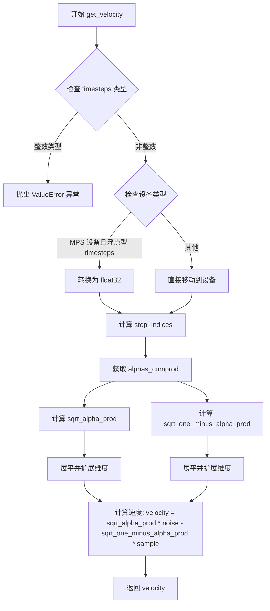
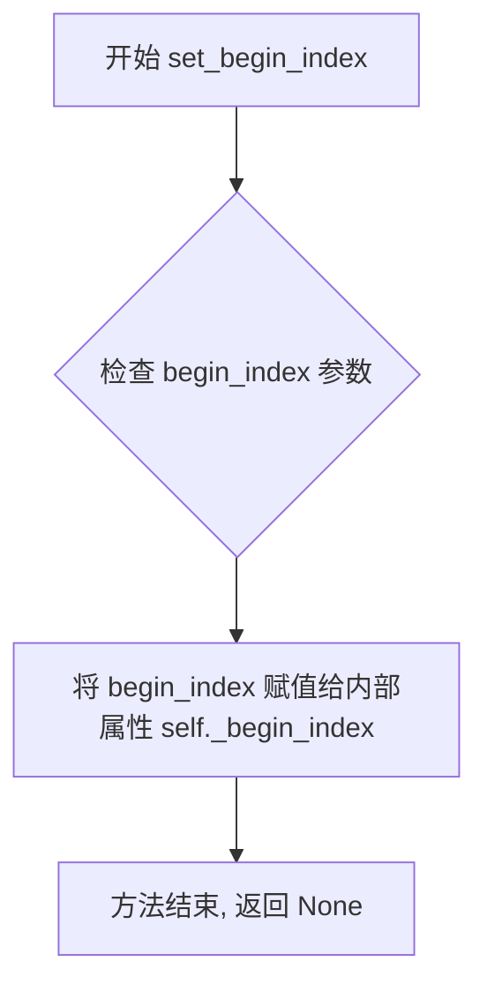
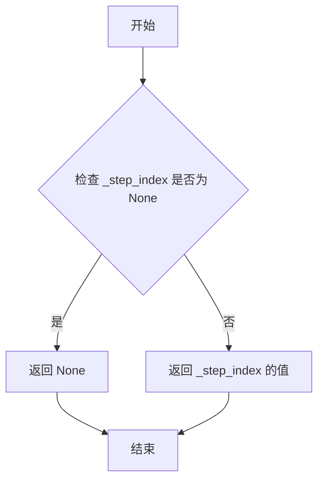
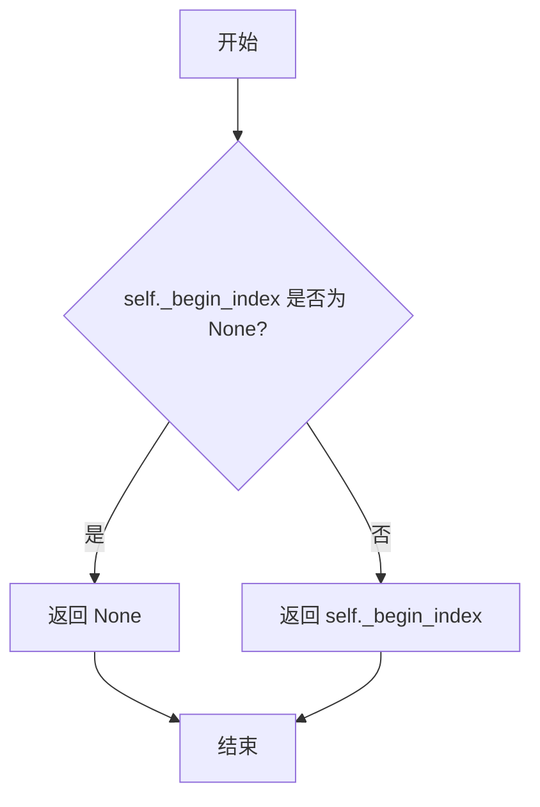
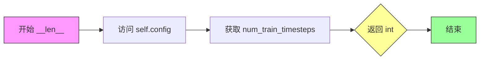

```mermaid
flowchart TD
    A[开始 set_timesteps] --> B{参数验证}
    
    B --> C{检查: timesteps 和 sigmas 同时设置?}
    C -->|是| D[抛出 ValueError]
    C -->|否| E{检查: num_inference_steps, timesteps, sigmas 均未设置?}
    E -->|是| D
    E -->|否| F{检查: num_inference_steps 与 timesteps/sigmas 同时设置?}
    F -->|是| D
    F -->|否| G{检查: timesteps 与 karras/exponential/beta sigmas 冲突?}
    G -->|是| D
    G -->|否| H{检查: timesteps 与 continuous timestep + v_prediction 冲突?}
    H -->|是| D
    H -->|否| I[确定 num_inference_steps]
    
    I --> J{sigmas 是否提供?}
    J -->|是| K[计算 log_sigmas 并转换 sigmas 为 numpy]
    K --> L[使用 _sigma_to_t 将 sigmas 转换为 timesteps]
    J -->|否| M{timesteps 是否提供?}
    
    M -->|是| N[转换 timesteps 为 numpy]
    M -->|否| O{根据 timestep_spacing 生成 timesteps}
    
    O --> P{"timestep_spacing == 'linspace'?"}
    P -->|是| Q[生成等间距时间步]
    P -->|否| R{"timestep_spacing == 'leading'?"}
    
    R -->|是| S[生成 leading 间隔时间步]
    R -->|否| T{"timestep_spacing == 'trailing'?"}
    T -->|是| U[生成 trailing 间隔时间步]
    T -->|否| V[抛出 ValueError]
    
    Q --> W
    S --> W
    U --> W
    N --> W
    L --> W
    
    W[计算基础 sigmas 和 log_sigmas] --> X{插值类型检查}
    
    X --> Y{"interpolation_type == 'linear'?"}
    Y -->|是| Z[使用线性插值计算 sigmas]
    Y -->|否| AA{"interpolation_type == 'log_linear'?"}
    AA -->|是| AB[使用对数线性插值计算 sigmas]
    AA -->|否| V
    
    Z --> AC
    AB --> AC
    
    AC{是否使用 Karras sigmas?}
    AC -->|是| AD[调用 _convert_to_karras 转换 sigmas]
    AD --> AE[使用 _sigma_to_t 重新计算 timesteps]
    
    AC -->|否| AF{是否使用 Exponential sigmas?}
    AF -->|是| AG[调用 _convert_to_exponential 转换 sigmas]
    AG --> AE
    
    AF -->|否| AH{是否使用 Beta sigmas?}
    AH -->|是| AI[调用 _convert_to_beta 转换 sigmas]
    AI --> AE
    
    AH -->|否| AJ[跳过 sigma 转换]
    AE --> AK
    AJ --> AK
    
    AK{根据 final_sigmas_type 设置最后一个 sigma} --> AL{"final_sigmas_type == 'sigma_min'?"}
    AL -->|是| AM[sigma_last = 初始 sigma]
    AL -->|否| AN{"final_sigmas_type == 'zero'?"}
    AN -->|是| AO[sigma_last = 0]
    AN -->|否| V
    
    AM --> AP
    AO --> AP
    
    AP[拼接 sigmas 和 sigma_last] --> AQ[转换为 torch.Tensor 并移至 device]
    
    AQ --> AR{continuous timestep + v_prediction?}
    AR -->|是| AS[使用对数计算连续时间步]
    AR -->|否| AT[直接转换 timesteps 为 torch.Tensor]
    
    AS --> AU
    AT --> AU
    
    AU[重置 _step_index 和 _begin_index 为 None] --> AV[将 sigmas 移至 CPU]
    AV --> AX[结束]
    
    D --> AY[错误处理]
    V --> AY
```

# `diffusers\src\diffusers\schedulers\scheduling_euler_discrete.py` 详细设计文档

Euler离散调度器（EulerDiscreteScheduler）实现了基于欧拉法的扩散模型噪声调度算法，用于在推理阶段从噪声样本逐步反向去噪生成图像，或在训练阶段向前扩散添加噪声。该调度器支持多种噪声beta调度方式（linear, scaled_linear, squaredcos_cap_v2）以及Karras、指数、Beta等高级sigma策略，并兼容epsilon、sample和v_prediction等预测类型。

## 整体流程

```mermaid
graph TD
    A[初始化 EulerDiscreteScheduler] --> B[计算 Beta, Alpha, Sigma 队列]
    B --> C[调用 set_timesteps]
    C --> D{配置检查 (karras/exponential/beta sigmas)}
    D --> E[生成/调整推理所需的时间步和Sigma序列]
    E --> F[推理循环开始]
    F --> G[调用 scale_model_input 缩放输入]
    G --> H[调用 step 执行欧拉一步]
    H --> I{是否完成所有步数?}
    I -- 否 --> F
    I -- 是 --> J[输出结果 prev_sample]
    K[训练/图像处理准备] --> L[add_noise 添加噪声]
    K --> M[get_velocity 计算速度]
```

## 类结构

```
SchedulerMixin (抽象基类)
ConfigMixin (配置基类)
└── EulerDiscreteScheduler (核心调度器)
    └── EulerDiscreteSchedulerOutput (输出数据类)
```

## 全局变量及字段


### `logger`
    
模块级日志记录器，用于输出调度器运行时的警告和信息

类型：`logging.Logger`
    


### `is_scipy_available`
    
检查scipy库是否可用的工具函数，用于条件导入beta分布相关功能

类型：`function`
    


### `betas_for_alpha_bar`
    
根据alpha变换函数生成离散的beta调度序列

类型：`function`
    


### `rescale_zero_terminal_snr`
    
重新缩放beta序列以实现零终端信噪比

类型：`function`
    


### `EulerDiscreteSchedulerOutput.EulerDiscreteSchedulerOutput.prev_sample`
    
计算出的上一步样本(x_{t-1})，作为去噪循环的下一个模型输入

类型：`torch.Tensor`
    


### `EulerDiscreteSchedulerOutput.EulerDiscreteSchedulerOutput.pred_original_sample`
    
基于当前时间步模型输出预测的去噪样本(x_0)，可用于预览进度或引导

类型：`torch.Tensor | None`
    


### `EulerDiscreteScheduler.EulerDiscreteScheduler.betas`
    
噪声beta系数序列，用于定义扩散过程中的噪声调度

类型：`torch.Tensor`
    


### `EulerDiscreteScheduler.EulerDiscreteScheduler.alphas`
    
1 - betas，计算得到的alpha系数序列

类型：`torch.Tensor`
    


### `EulerDiscreteScheduler.EulerDiscreteScheduler.alphas_cumprod`
    
累积alpha乘积，用于计算信噪比和采样参数

类型：`torch.Tensor`
    


### `EulerDiscreteScheduler.EulerDiscreteScheduler.sigmas`
    
噪声标准差序列，表示各时间步的噪声水平

类型：`torch.Tensor`
    


### `EulerDiscreteScheduler.EulerDiscreteScheduler.timesteps`
    
推理时的时间步序列，定义了去噪过程的离散时间点

类型：`torch.Tensor`
    


### `EulerDiscreteScheduler.EulerDiscreteScheduler.num_inference_steps`
    
推理步数，指定生成样本时使用的扩散步数

类型：`int`
    


### `EulerDiscreteScheduler.EulerDiscreteScheduler._step_index`
    
当前推理步骤索引，跟踪调度器在去噪循环中的进度

类型：`int`
    


### `EulerDiscreteScheduler.EulerDiscreteScheduler._begin_index`
    
起始索引，用于从pipeline设置调度器的起始步数

类型：`int`
    


### `EulerDiscreteScheduler.EulerDiscreteScheduler.is_scale_input_called`
    
标记输入是否已被缩放，确保在step前正确调用scale_model_input

类型：`bool`
    


### `EulerDiscreteScheduler.EulerDiscreteScheduler.config`
    
通过register_to_config装饰器注册的配置对象，存储所有调度器参数

类型：`dataclass`
    
    

## 全局函数及方法


### `betas_for_alpha_bar`

该函数用于创建离散化的beta调度表，它基于给定的alpha_t_bar函数（定义了扩散过程中(1-beta)的累积乘积）生成一系列beta值。函数支持三种alpha变换类型（cosine、exp、laplace），通过计算相邻时间步的alpha_bar比值来确定每个时间步的beta，同时确保beta值不超过指定的最大阈值以避免数值不稳定。

参数：

- `num_diffusion_timesteps`：`int`，要生成的beta数量，即扩散时间步的总数
- `max_beta`：`float`，默认值 0.999，最大beta值，用于避免数值不稳定
- `alpha_transform_type`：`Literal["cosine", "exp", "laplace"]`，默认值 "cosine"，alpha_bar函数的噪声调度类型，可选"cosine"（余弦）、"exp"（指数）或"laplace"（拉普拉斯）

返回值：`torch.Tensor`，返回计算得到的beta值张量，用于调度器逐步模型输出

#### 流程图

```mermaid
flowchart TD
    A[开始] --> B{alpha_transform_type == 'cosine'}
    B -->|Yes| C[定义cosine类型的alpha_bar_fn函数]
    B -->|No| D{alpha_transform_type == 'laplace'}
    D -->|Yes| E[定义laplace类型的alpha_bar_fn函数]
    D -->|No| F{alpha_transform_type == 'exp'}
    F -->|Yes| G[定义exp类型的alpha_bar_fn函数]
    F -->|No| H[抛出ValueError异常]
    C --> I[初始化空betas列表]
    E --> I
    G --> I
    I --> J[遍历i从0到num_diffusion_timesteps-1]
    J --> K[计算t1 = i / num_diffusion_timesteps]
    K --> L[计算t2 = (i + 1) / num_diffusion_timesteps]
    L --> M[计算beta = min(1 - alpha_bar_fn(t2) / alpha_bar_fn(t1), max_beta)]
    M --> N[将beta添加到betas列表]
    J --> O{遍历结束?}
    O -->|No| J
    O -->|Yes| P[将betas列表转换为torch.Tensor并指定dtype为float32]
    P --> Q[返回betas张量]
```

#### 带注释源码

```python
# Copied from diffusers.schedulers.scheduling_ddpm.betas_for_alpha_bar
def betas_for_alpha_bar(
    num_diffusion_timesteps: int,
    max_beta: float = 0.999,
    alpha_transform_type: Literal["cosine", "exp", "laplace"] = "cosine",
) -> torch.Tensor:
    """
    Create a beta schedule that discretizes the given alpha_t_bar function, which defines the cumulative product of
    (1-beta) over time from t = [0,1].

    Contains a function alpha_bar that takes an argument t and transforms it to the cumulative product of (1-beta) up
    to that part of the diffusion process.

    Args:
        num_diffusion_timesteps (`int`):
            The number of betas to produce.
        max_beta (`float`, defaults to `0.999`):
            The maximum beta to use; use values lower than 1 to avoid numerical instability.
        alpha_transform_type (`str`, defaults to `"cosine"`):
            The type of noise schedule for `alpha_bar`. Choose from `cosine`, `exp`, or `laplace`.

    Returns:
        `torch.Tensor`:
            The betas used by the scheduler to step the model outputs.
    """
    # 根据alpha_transform_type选择并定义对应的alpha_bar函数
    if alpha_transform_type == "cosine":
        # cosine类型的alpha_bar函数：使用余弦平方函数
        def alpha_bar_fn(t):
            # 使用cosine scheduling，添加偏移量0.008/1.008以确保t=0时不为1
            return math.cos((t + 0.008) / 1.008 * math.pi / 2) ** 2

    elif alpha_transform_type == "laplace":
        # laplace类型的alpha_bar函数：使用拉普拉斯分布的噪声调度
        def alpha_bar_fn(t):
            # 计算拉普拉斯分布的lambda参数
            lmb = -0.5 * math.copysign(1, 0.5 - t) * math.log(1 - 2 * math.fabs(0.5 - t) + 1e-6)
            # 计算信噪比(signal-to-noise ratio)
            snr = math.exp(lmb)
            # 根据SNR计算alpha值
            return math.sqrt(snr / (1 + snr))

    elif alpha_transform_type == "exp":
        # exp类型的alpha_bar函数：使用指数衰减的噪声调度
        def alpha_bar_fn(t):
            # 指数衰减函数，衰减率为-12.0
            return math.exp(t * -12.0)

    else:
        # 如果不支持的alpha_transform_type，抛出ValueError异常
        raise ValueError(f"Unsupported alpha_transform_type: {alpha_transform_type}")

    # 初始化空列表存储beta值
    betas = []
    # 遍历每个扩散时间步
    for i in range(num_diffusion_timesteps):
        # 计算当前时间步的起始点t1和结束点t2
        t1 = i / num_diffusion_timesteps
        t2 = (i + 1) / num_diffusion_timesteps
        # 计算beta值：1 - alpha_bar(t2) / alpha_bar(t1)，并限制不超过max_beta
        betas.append(min(1 - alpha_bar_fn(t2) / alpha_bar_fn(t1), max_beta))
    
    # 将beta列表转换为PyTorch张量，使用float32数据类型
    return torch.tensor(betas, dtype=torch.float32)
```


### `rescale_zero_terminal_snr`

该函数用于将扩散调度器（Diffusion Scheduler）的 beta 系数重新调整，使其具有零终端信噪比（Zero Terminal SNR）。基于论文 https://huggingface.co/papers/2305.08891 (Algorithm 1) 的算法，通过平移和缩放 alpha 累积乘积的平方根序列，使最后一个时间步的信噪比归零，同时保持第一个时间步的原始值不变。这一技术能让模型生成更极端亮度（非常亮或非常暗）的样本。

参数：

- `betas`：`torch.Tensor`，调度器初始化时使用的 beta 系数张量

返回值：`torch.Tensor`，经过零终端 SNR 调整后的新 beta 系数张量

#### 流程图

```mermaid
flowchart TD
    A[输入 betas] --> B[计算 alphas = 1 - betas]
    B --> C[计算 alphas_cumprod = cumprod<br/>alphas]
    C --> D[计算 alphas_bar_sqrt = sqrt<br/>alphas_cumprod]
    D --> E[保存初始值<br/>alphas_bar_sqrt_0]
    E --> F[保存终值<br/>alphas_bar_sqrt_T]
    F --> G[平移序列<br/>alphas_bar_sqrt -= alphas_bar_sqrt_T]
    G --> H[缩放序列<br/>alphas_bar_sqrt *= alphas_bar_sqrt_0<br/>/ alphas_bar_sqrt_0 - alphas_bar_sqrt_T]
    H --> I[恢复平方<br/>alphas_bar = alphas_bar_sqrt ** 2]
    I --> J[恢复累积乘积<br/>alphas = alphas_bar[1:]<br/>/ alphas_bar[:-1]]
    J --> K[拼接首元素<br/>alphas = cat<br/>[alphas_bar[0:1], alphas]]
    K --> L[计算新 betas<br/>betas = 1 - alphas]
    L --> M[输出调整后的 betas]
```

#### 带注释源码

```python
def rescale_zero_terminal_snr(betas: torch.Tensor) -> torch.Tensor:
    """
    Rescales betas to have zero terminal SNR Based on https://huggingface.co/papers/2305.08891 (Algorithm 1)

    Args:
        betas (`torch.Tensor`):
            The betas that the scheduler is being initialized with.

    Returns:
        `torch.Tensor`:
            Rescaled betas with zero terminal SNR.
    """
    # Step 1: 将 betas 转换为 alphas (α = 1 - β)
    alphas = 1.0 - betas
    
    # Step 2: 计算累积乘积 ᾱₜ = ∏ᵢ₌₀ᵗ αᵢ
    alphas_cumprod = torch.cumprod(alphas, dim=0)
    
    # Step 3: 取平方根得到 √ᾱₜ
    alphas_bar_sqrt = alphas_cumprod.sqrt()

    # Step 4: 保存原始序列的首尾值，用于后续缩放恢复
    alphas_bar_sqrt_0 = alphas_bar_sqrt[0].clone()  # 第一个时间步 √ᾱ₀
    alphas_bar_sqrt_T = alphas_bar_sqrt[-1].clone()  # 最后一个时间步 √ᾱₜ

    # Step 5: 平移序列，使最后一个时间步变为零
    # 操作后：√ᾱₜ ← √ᾱₜ - √ᾱₜ₊₁（最后一个为0）
    alphas_bar_sqrt -= alphas_bar_sqrt_T

    # Step 6: 缩放序列，使第一个时间步恢复到原始值
    # 公式：√ᾱₜ ← √ᾱₜ × √ᾱ₀ / (√ᾱ₀ - √ᾱₜ₊₁)
    alphas_bar_sqrt *= alphas_bar_sqrt_0 / (alphas_bar_sqrt_0 - alphas_bar_sqrt_T)

    # Step 7: 还原平方得到新的 ᾱₜ
    alphas_bar = alphas_bar_sqrt ** 2  # Revert sqrt

    # Step 8: 通过相邻 ᾱ 的比值还原 αₜ
    # αₜ = ᾱₜ / ᾱₜ₋₁
    alphas = alphas_bar[1:] / alphas_bar[:-1]  # Revert cumprod

    # Step 9: 拼接第一个元素（ᾱ₀/ᾱ₋₁ 无定义，用 ᾱ₀ 代替）
    alphas = torch.cat([alphas_bar[0:1], alphas])

    # Step 10: 通过 α 还原新的 betas (β = 1 - α)
    betas = 1 - alphas

    return betas
```


### `EulerDiscreteScheduler.__init__`

该方法是 Euler 离散调度器的构造函数，负责初始化扩散模型推理过程中所需的各种参数和状态，包括 beta 调度、alpha 累积乘积、sigma 值、时间步以及各种配置选项。

参数：

- `num_train_timesteps`：`int`，默认为 1000，训练时的扩散步数
- `beta_start`：`float`，默认为 0.0001，beta 调度起始值
- `beta_end`：`float`，默认为 0.02，beta 调度结束值
- `beta_schedule`：`str`，默认为 "linear"，beta 调度策略，可选 "linear"、"scaled_linear"、"squaredcos_cap_v2"
- `trained_betas`：`np.ndarray | list[float] | None`，可选，直接传入的 beta 数组
- `prediction_type`：`str`，默认为 "epsilon"，预测类型，可选 "epsilon"、"sample"、"v_prediction"
- `interpolation_type`：`str`，默认为 "linear"，sigma 插值类型，可选 "linear"、"log_linear"
- `use_karras_sigmas`：`bool | None`，默认为 False，是否使用 Karras sigmas
- `use_exponential_sigmas`：`bool | None`，默认为 False，是否使用指数 sigmas
- `use_beta_sigmas`：`bool | None`，默认为 False，是否使用 beta sigmas
- `sigma_min`：`float | None`，sigma 最小值
- `sigma_max`：`float | None`，sigma 最大值
- `timestep_spacing`：`Literal["linspace", "leading", "trailing"]`，默认为 "linspace"，时间步间隔策略
- `timestep_type`：`Literal["discrete", "continuous"]`，默认为 "discrete"，时间步类型
- `steps_offset`：`int`，默认为 0，推理步数偏移量
- `rescale_betas_zero_snr`：`bool`，默认为 False，是否重缩放 betas 使终端 SNR 为零
- `final_sigmas_type`：`Literal["zero", "sigma_min"]`，默认为 "zero"，最终 sigma 类型

返回值：`None`，构造函数无返回值

#### 流程图

```mermaid
flowchart TD
    A[开始 __init__] --> B{检查 beta_sigmas 依赖}
    B -->|use_beta_sigmas 为真且 scipy 不可用| C[抛出 ImportError]
    B -->|通过| D{检查 sigma 配置互斥}
    D -->|多个 sigma 选项同时为真| E[抛出 ValueError]
    D -->|通过| F{处理 betas}
    F -->|trained_betas 不为空| G[直接使用 trained_betas]
    F -->|beta_schedule == linear| H[使用 torch.linspace]
    F -->|beta_schedule == scaled_linear| I[使用缩放后的线性空间]
    F -->|beta_schedule == squaredcos_cap_v2| J[使用 betas_for_alpha_bar]
    F -->|其他| K[抛出 NotImplementedError]
    G --> L{rescale_betas_zero_snr}
    H --> L
    I --> L
    J --> L
    L -->|为真| M[调用 rescale_zero_terminal_snr]
    L -->|为假| N[跳过]
    M --> O[计算 alphas 和 alphas_cumprod]
    N --> O
    O --> P{rescale_betas_zero_snr}
    P -->|为真| Q[设置 alphas_cumprod 末尾值]
    P -->|为假| R[跳过]
    Q --> S[计算 sigmas 和 timesteps]
    R --> S
    S --> T[设置 num_inference_steps 为 None]
    T --> U{检查 continuous v_prediction]
    U -->|为真| V[计算连续时间 timesteps]
    U -->|为假| W[使用离散 timesteps]
    V --> X[拼接 sigmas 和零]
    W --> X
    X --> Y[初始化内部状态变量]
    Y --> Z[设置 sigmas 设备为 CPU]
    Z --> AA[结束 __init__]
```

#### 带注释源码

```python
@register_to_config
def __init__(
    self,
    num_train_timesteps: int = 1000,
    beta_start: float = 0.0001,
    beta_end: float = 0.02,
    beta_schedule: str = "linear",
    trained_betas: np.ndarray | list[float] | None = None,
    prediction_type: str = "epsilon",
    interpolation_type: str = "linear",
    use_karras_sigmas: bool | None = False,
    use_exponential_sigmas: bool | None = False,
    use_beta_sigmas: bool | None = False,
    sigma_min: float | None = None,
    sigma_max: float | None = None,
    timestep_spacing: Literal["linspace", "leading", "trailing"] = "linspace",
    timestep_type: Literal["discrete", "continuous"] = "discrete",
    steps_offset: int = 0,
    rescale_betas_zero_snr: bool = False,
    final_sigmas_type: Literal["zero", "sigma_min"] = "zero",
):
    """
    Euler 离散调度器构造函数。
    
    参数:
        num_train_timesteps: 训练时的扩散步数，默认 1000
        beta_start: beta 起始值，默认 0.0001
        beta_end: beta 结束值，默认 0.02
        beta_schedule: beta 调度策略，默认 "linear"
        trained_betas: 可选的预定义 beta 数组
        prediction_type: 预测类型，默认 "epsilon"
        interpolation_type: sigma 插值类型，默认 "linear"
        use_karras_sigmas: 是否使用 Karras sigmas
        use_exponential_sigmas: 是否使用指数 sigmas
        use_beta_sigmas: 是否使用 beta sigmas
        sigma_min: sigma 最小值
        sigma_max: sigma 最大值
        timestep_spacing: 时间步间隔策略
        timestep_type: 时间步类型
        steps_offset: 推理步数偏移
        rescale_betas_zero_snr: 是否重缩放 betas
        final_sigmas_type: 最终 sigma 类型
    """
    
    # 检查是否安装了 scipy（当使用 beta sigmas 时需要）
    if self.config.use_beta_sigmas and not is_scipy_available():
        raise ImportError("Make sure to install scipy if you want to use beta sigmas.")
    
    # 检查多个 sigma 选项是否互斥（只能选择一种）
    if sum([self.config.use_beta_sigmas, self.config.use_exponential_sigmas, self.config.use_karras_sigmas]) > 1:
        raise ValueError(
            "Only one of `config.use_beta_sigmas`, `config.use_exponential_sigmas`, `config.use_karras_sigmas` can be used."
        )
    
    # 根据配置生成 betas
    if trained_betas is not None:
        # 如果直接提供了 betas，则直接使用
        self.betas = torch.tensor(trained_betas, dtype=torch.float32)
    elif beta_schedule == "linear":
        # 线性 beta 调度
        self.betas = torch.linspace(beta_start, beta_end, num_train_timesteps, dtype=torch.float32)
    elif beta_schedule == "scaled_linear":
        # 缩放线性调度（常用于潜在扩散模型）
        self.betas = torch.linspace(beta_start**0.5, beta_end**0.5, num_train_timesteps, dtype=torch.float32) ** 2
    elif beta_schedule == "squaredcos_cap_v2":
        # Glide 余弦调度
        self.betas = betas_for_alpha_bar(num_train_timesteps)
    else:
        raise NotImplementedError(f"{beta_schedule} is not implemented for {self.__class__}")
    
    # 如果需要，重缩放 betas 使终端 SNR 为零
    if rescale_betas_zero_snr:
        self.betas = rescale_zero_terminal_snr(self.betas)
    
    # 计算 alphas 和累积乘积
    self.alphas = 1.0 - self.betas
    self.alphas_cumprod = torch.cumprod(self.alphas, dim=0)
    
    # 处理终端 SNR 重缩放后的特殊情况
    if rescale_betas_zero_snr:
        # 设置一个接近零但不为零的值，避免第一个 sigma 无穷大
        # FP16 最小正规格化数 works well here
        self.alphas_cumprod[-1] = 2**-24
    
    # 计算 sigmas（噪声标准差）
    sigmas = (((1 - self.alphas_cumprod) / self.alphas_cumprod) ** 0.5).flip(0)
    
    # 生成 timesteps（从最大到最小）
    timesteps = np.linspace(0, num_train_timesteps - 1, num_train_timesteps, dtype=float)[::-1].copy()
    timesteps = torch.from_numpy(timesteps).to(dtype=torch.float32)
    
    # 可设置的值
    self.num_inference_steps = None
    
    # 支持连续时间和 v_prediction 的完整 EDM 缩放（TODO）
    if timestep_type == "continuous" and prediction_type == "v_prediction":
        # 将 sigma 转换为连续时间表示
        self.timesteps = torch.Tensor([0.25 * sigma.log() for sigma in sigmas])
    else:
        self.timesteps = timesteps
    
    # 在 sigmas 末尾添加一个零（用于最终步骤）
    self.sigmas = torch.cat([sigmas, torch.zeros(1, device=sigmas.device)])
    
    # 标记 scale_model_input 是否已调用
    self.is_scale_input_called = False
    
    # 存储 sigma 类型配置
    self.use_karras_sigmas = use_karras_sigmas
    self.use_exponential_sigmas = use_exponential_sigmas
    self.use_beta_sigmas = use_beta_sigmas
    
    # 初始化步进索引
    self._step_index = None
    self._begin_index = None
    
    # 将 sigmas 移至 CPU 以减少 CPU/GPU 通信开销
    self.sigmas = self.sigmas.to("cpu")
```


### `EulerDiscreteScheduler.set_timesteps`

设置离散时间步，用于扩散链的推理过程。该方法根据传入的参数（推理步数、自定义时间步或自定义sigmas）计算并设置调度器的时间步序列，同时处理多种sigma生成策略（如Karras、Exponential、Beta），并将结果转换为PyTorch张量存储在指定设备上。

参数：

- `num_inference_steps`：`int | None`，推理时使用的扩散步数。如果为`None`，则必须提供`timesteps`或`sigmas`
- `device`：`str | torch.device | None`，时间步要移动到的设备。如果为`None`，则不移动
- `timesteps`：`list[int] | None`，自定义时间步列表，用于支持任意时间步调度。如果提供此参数，`num_inference_steps`和`sigmas`必须为`None`
- `sigmas`：`list[float] | None`，自定义sigma列表，用于支持任意sigma调度。如果提供此参数，`num_inference_steps`和`timesteps`必须为`None`

返回值：`None`，该方法直接修改调度器内部状态，不返回任何值

#### 流程图



#### 带注释源码

```python
def set_timesteps(
    self,
    num_inference_steps: int = None,
    device: str | torch.device = None,
    timesteps: list[int] | None = None,
    sigmas: list[float] | None = None,
):
    """
    设置扩散链中使用的离散时间步（用于推理前调用）。
    
    该方法支持三种方式设置时间步：
    1. 通过 num_inference_steps 自动生成
    2. 通过自定义 timesteps 列表
    3. 通过自定义 sigmas 列表
    
    同时支持多种sigma生成策略：Karras、Exponential、Beta分布等。
    """
    
    # ========== 参数验证阶段 ==========
    # 互斥性检查：timesteps 和 sigmas 不能同时设置
    if timesteps is not None and sigmas is not None:
        raise ValueError("Only one of `timesteps` or `sigmas` should be set.")
    
    # 必须提供至少一种时间步指定方式
    if num_inference_steps is None and timesteps is None and sigmas is None:
        raise ValueError("Must pass exactly one of `num_inference_steps` or `timesteps` or `sigmas.")
    
    # num_inference_steps 与 timesteps/sigmas 互斥
    if num_inference_steps is not None and (timesteps is not None or sigmas is not None):
        raise ValueError("Can only pass one of `num_inference_steps` or `timesteps` or `sigmas`.")
    
    # 与 Karras sigmas 冲突检测
    if timesteps is not None and self.config.use_karras_sigmas:
        raise ValueError("Cannot set `timesteps` with `config.use_karras_sigmas = True`.")
    
    # 与 Exponential sigmas 冲突检测
    if timesteps is not None and self.config.use_exponential_sigmas:
        raise ValueError("Cannot set `timesteps` with `config.use_exponential_sigmas = True`.")
    
    # 与 Beta sigmas 冲突检测
    if timesteps is not None and self.config.use_beta_sigmas:
        raise ValueError("Cannot set `timesteps` with `config.use_beta_sigmas = True`.")
    
    # 连续时间步与 v_prediction 不兼容
    if (
        timesteps is not None
        and self.config.timestep_type == "continuous"
        and self.config.prediction_type == "v_prediction"
    ):
        raise ValueError(
            "Cannot set `timesteps` with `config.timestep_type = 'continuous'` and `config.prediction_type = 'v_prediction'`."
        )

    # ========== 确定推理步数 ==========
    if num_inference_steps is None:
        # 从传入的 timesteps 或 sigmas 推断步数
        # sigmas 长度需要减1因为最后一个是结束sigma
        num_inference_steps = len(timesteps) if timesteps is not None else len(sigmas) - 1
    
    self.num_inference_steps = num_inference_steps

    # ========== 处理自定义 sigmas ==========
    if sigmas is not None:
        # 计算对数sigma用于后续转换
        log_sigmas = np.log(np.array(((1 - self.alphas_cumprod) / self.alphas_cumprod) ** 0.5))
        # 转换为 float32 numpy 数组
        sigmas = np.array(sigmas).astype(np.float32)
        # 使用 sigma 到时间的转换函数生成 timesteps
        # 排除最后一个 sigma（通常是0）
        timesteps = np.array([self._sigma_to_t(sigma, log_sigmas) for sigma in sigmas[:-1]])

    # ========== 处理自定义或生成 timesteps ==========
    else:
        if timesteps is not None:
            # 用户提供了自定义 timesteps，直接使用
            timesteps = np.array(timesteps).astype(np.float32)
        else:
            # 根据 timestep_spacing 策略生成 timesteps
            # 参考 Common Diffusion Noise Schedules and Sample Steps are Flawed (表2)
            # https://huggingface.co/papers/2305.08891
            
            if self.config.timestep_spacing == "linspace":
                # 等间距生成，从 T-1 到 0
                timesteps = np.linspace(
                    0, self.config.num_train_timesteps - 1, num_inference_steps, dtype=np.float32
                )[::-1].copy()
                
            elif self.config.timestep_spacing == "leading":
                # leading 间隔：步长均匀，从大到小
                step_ratio = self.config.num_train_timesteps // self.num_inference_steps
                # 通过乘以比例创建整数时间步
                # 转换为int避免num_inference_step是3的幂次时的问题
                timesteps = (
                    (np.arange(0, num_inference_steps) * step_ratio).round()[::-1].copy().astype(np.float32)
                )
                timesteps += self.config.steps_offset
                
            elif self.config.timestep_spacing == "trailing":
                # trailing 间隔：从T开始递减
                step_ratio = self.config.num_train_timesteps / self.num_inference_steps
                # 通过乘以比例创建整数时间步
                timesteps = (
                    (np.arange(self.config.num_train_timesteps, 0, -step_ratio)).round().copy().astype(np.float32)
                )
                timesteps -= 1
            else:
                raise ValueError(
                    f"{self.config.timestep_spacing} is not supported. Please make sure to choose one of 'linspace', 'leading' or 'trailing'."
                )

        # ========== 计算基础 sigmas ==========
        # sigma = sqrt((1-alpha_cumprod) / alpha_cumprod)
        sigmas = np.array(((1 - self.alphas_cumprod) / self.alphas_cumprod) ** 0.5)
        log_sigmas = np.log(sigmas)
        
        # 根据插值类型计算 sigmas
        if self.config.interpolation_type == "linear":
            # 线性插值：在离散时间步上插值 sigma
            sigmas = np.interp(timesteps, np.arange(0, len(sigmas)), sigmas)
        elif self.config.interpolation_type == "log_linear":
            # 对数线性插值：在对数空间线性插值后再指数化
            sigmas = torch.linspace(np.log(sigmas[-1]), np.log(sigmas[0]), num_inference_steps + 1).exp().numpy()
        else:
            raise ValueError(
                f"{self.config.interpolation_type} is not implemented. Please specify interpolation_type to either"
                " 'linear' or 'log_linear'"
            )

        # ========== 应用特殊 sigma 策略 ==========
        # Karras sigmas：使用 Karras 论文中的噪声调度
        if self.config.use_karras_sigmas:
            sigmas = self._convert_to_karras(in_sigmas=sigmas, num_inference_steps=self.num_inference_steps)
            # 重新计算对应的 timesteps
            timesteps = np.array([self._sigma_to_t(sigma, log_sigmas) for sigma in sigmas])

        # Exponential sigmas：指数噪声调度
        elif self.config.use_exponential_sigmas:
            sigmas = self._convert_to_exponential(in_sigmas=sigmas, num_inference_steps=num_inference_steps)
            timesteps = np.array([self._sigma_to_t(sigma, log_sigmas) for sigma in sigmas])

        # Beta sigmas：Beta分布噪声调度
        elif self.config.use_beta_sigmas:
            sigmas = self._convert_to_beta(in_sigmas=sigmas, num_inference_steps=self.num_inference_steps)
            timesteps = np.array([self._sigma_to_t(sigma, log_sigmas) for sigma in sigmas])

        # ========== 设置最后一个 sigma ==========
        if self.config.final_sigmas_type == "sigma_min":
            # 使用训练时的最小 sigma
            sigma_last = ((1 - self.alphas_cumprod[0]) / self.alphas_cumprod[0]) ** 0.5
        elif self.config.final_sigmas_type == "zero":
            # 最后一个 sigma 设为0
            sigma_last = 0
        else:
            raise ValueError(
                f"`final_sigmas_type` must be one of 'zero', or 'sigma_min', but got {self.config.final_sigmas_type}"
            )

        # 拼接 sigmas，在末尾添加最终的 sigma 值
        sigmas = np.concatenate([sigmas, [sigma_last]]).astype(np.float32)

    # ========== 转换为 PyTorch 张量 ==========
    sigmas = torch.from_numpy(sigmas).to(dtype=torch.float32, device=device)

    # ========== 处理连续时间步类型 ==========
    # 对于 continuous timestep + v_prediction，使用对数计算
    # TODO: 支持所有预测类型和时间步类型的完整 EDM 缩放
    if self.config.timestep_type == "continuous" and self.config.prediction_type == "v_prediction":
        # 0.25 * log(sigma) 转换
        self.timesteps = torch.Tensor([0.25 * sigma.log() for sigma in sigmas[:-1]]).to(device=device)
    else:
        # 标准离散时间步转换
        self.timesteps = torch.from_numpy(timesteps.astype(np.float32)).to(device=device)

    # ========== 重置状态并保存 ==========
    self._step_index = None      # 重置步索引
    self._begin_index = None     # 重置起始索引
    self.sigmas = sigmas.to("cpu")  # 移至 CPU 以减少 CPU/GPU 通信开销
```


### `EulerDiscreteScheduler.scale_model_input`

确保与需要根据当前时间步缩放去噪模型输入的调度器可互换。通过 `(sigma**2 + 1) ** 0.5` 缩放去噪模型输入以匹配 Euler 算法。

参数：

- `self`：`EulerDiscreteScheduler`，调度器实例
- `sample`：`torch.Tensor`，需要缩放的输入样本
- `timestep`：`float | torch.Tensor`，扩散链中的当前时间步

返回值：`torch.Tensor`，除以 `(sigma**2 + 1) ** 0.5` 后的缩放输入样本

#### 流程图

```mermaid
flowchart TD
    A[开始 scale_model_input] --> B{self.step_index 是否为 None?}
    B -->|是| C[调用 _init_step_index 初始化步索引]
    B -->|否| D[继续]
    C --> D
    D --> E[获取 sigma = self.sigmas[self.step_index]]
    E --> F[计算缩放因子: sample / ((sigma**2 + 1) ** 0.5)]
    F --> G[设置 self.is_scale_input_called = True]
    G --> H[返回缩放后的 sample]
    H --> I[结束]
```

#### 带注释源码

```python
def scale_model_input(self, sample: torch.Tensor, timestep: float | torch.Tensor) -> torch.Tensor:
    """
    Ensures interchangeability with schedulers that need to scale the denoising model input depending on the
    current timestep. Scales the denoising model input by `(sigma**2 + 1) ** 0.5` to match the Euler algorithm.

    Args:
        sample (`torch.Tensor`):
            The input sample to be scaled.
        timestep (`float` or `torch.Tensor`):
            The current timestep in the diffusion chain.

    Returns:
        `torch.Tensor`:
            A scaled input sample, divided by `(sigma**2 + 1) ** 0.5`.
    """
    # 如果 step_index 未初始化，则根据当前 timestep 初始化步索引
    if self.step_index is None:
        self._init_step_index(timestep)

    # 获取当前时间步对应的 sigma 值（噪声水平）
    sigma = self.sigmas[self.step_index]
    
    # 将样本除以 (sigma^2 + 1)^0.5 进行缩放
    # 这确保了输入与 Euler 算法兼容
    sample = sample / ((sigma**2 + 1) ** 0.5)

    # 标记 scale_model_input 已被调用
    self.is_scale_input_called = True
    
    # 返回缩放后的样本
    return sample
```


### `EulerDiscreteScheduler.step`

该方法是 Euler 离散调度器的核心去噪步骤，通过反向随机微分方程（SDE）根据当前时间步的模型输出预测上一时间步的样本，支持多种预测类型（epsilon、v_prediction）和噪声注入策略（s_churn）。

参数：

- `model_output`：`torch.Tensor`，模型直接输出的预测值（通常为预测噪声）
- `timestep`：`float | torch.Tensor`，扩散链中的当前离散时间步
- `sample`：`torch.Tensor`，扩散过程中当前创建的样本实例
- `s_churn`：`float`（可选，默认 `0.0`），控制采样期间添加噪声量的随机性参数
- `s_tmin`：`float`（可选，默认 `0.0`），应用随机性的最小时间步阈值，仅高于此值的时间步才会添加噪声
- `s_tmax`：`float`（可选，默认 `float("inf")`），应用随机性的最大时间步阈值，仅低于此值的时间步才会添加噪声
- `s_noise`：`float`（可选，默认 `1.0`），添加噪声的缩放因子
- `generator`：`torch.Generator | None`（可选），用于可重复采样的随机数生成器
- `return_dict`：`bool`（可选，默认 `True`），是否返回 `EulerDiscreteSchedulerOutput` 或元组

返回值：`EulerDiscreteSchedulerOutput | tuple`，若 `return_dict` 为 `True` 返回包含 `prev_sample` 和 `pred_original_sample` 的输出对象，否则返回元组

#### 流程图

```mermaid
flowchart TD
    A[开始 step] --> B{检查 timestep 类型}
    B -->|整数索引| C[抛出 ValueError 异常]
    B -->|非整数| D{is_scale_input_called?}
    D -->|否| E[输出警告日志]
    E --> F[初始化 step_index]
    D -->|是| F
    F --> G[sample 转换为 float32]
    G --> H[获取当前 sigma]
    H --> I{gamma 计算条件}
    I -->|s_tmin ≤ sigma ≤ s_tmax| J[计算 gamma = min(s_churn / (N-1), √2 - 1)]
    I -->|不满足| K[gamma = 0]
    J --> L{gamma > 0?}
    K --> M[计算 sigma_hat = sigma * (gamma + 1)]
    L -->|是| N[生成噪声并添加到 sample]
    L -->|否| M
    N --> O[计算 pred_original_sample]
    M --> O
    O --> P{prediction_type?}
    P -->|original_sample / sample| Q[pred_original_sample = model_output]
    P -->|epsilon| R[pred_original_sample = sample - sigma_hat * model_output]
    P -->|v_prediction| S[pred_original_sample = model_output * c_out + sample * c_skip]
    P -->|其他| T[抛出 ValueError 异常]
    Q --> U[计算 derivative = (sample - pred_original_sample) / sigma_hat]
    R --> U
    S --> U
    T --> U
    U --> V[计算 dt = sigmas[step_index + 1] - sigma_hat]
    V --> W[prev_sample = sample + derivative * dt]
    W --> X[prev_sample 转回 model_output.dtype]
    X --> Y[step_index += 1]
    Y --> Z{return_dict?}
    Z -->|True| AA[返回 EulerDiscreteSchedulerOutput]
    Z -->|False| AB[返回 tuple]
    AA --> AC[结束]
    AB --> AC
```

#### 带注释源码

```python
def step(
    self,
    model_output: torch.Tensor,
    timestep: float | torch.Tensor,
    sample: torch.Tensor,
    s_churn: float = 0.0,
    s_tmin: float = 0.0,
    s_tmax: float = float("inf"),
    s_noise: float = 1.0,
    generator: torch.Generator | None = None,
    return_dict: bool = True,
) -> EulerDiscreteSchedulerOutput | tuple:
    """
    Predict the sample from the previous timestep by reversing the SDE. This function propagates the diffusion
    process from the learned model outputs (most often the predicted noise).

    Args:
        model_output (`torch.Tensor`):
            The direct output from the learned diffusion model.
        timestep (`float` or `torch.Tensor`):
            The current discrete timestep in the diffusion chain.
        sample (`torch.Tensor`):
            A current instance of a sample created by the diffusion process.
        s_churn (`float`, *optional*, defaults to `0.0`):
            Stochasticity parameter that controls the amount of noise added during sampling. Higher values increase
            randomness.
        s_tmin (`float`, *optional*, defaults to `0.0`):
            Minimum timestep threshold for applying stochasticity. Only timesteps above this value will have noise
            added.
        s_tmax (`float`, *optional*, defaults to `inf`):
            Maximum timestep threshold for applying stochasticity. Only timesteps below this value will have noise
            added.
        s_noise (`float`, *optional*, defaults to `1.0`):
            Scaling factor for noise added to the sample.
        generator (`torch.Generator`, *optional*):
            A random number generator for reproducible sampling.
        return_dict (`bool`, *optional*, defaults to `True`):
            Whether or not to return a [`~schedulers.scheduling_euler_discrete.EulerDiscreteSchedulerOutput`] or
            tuple.

    Returns:
        [`~schedulers.scheduling_euler_discrete.EulerDiscreteSchedulerOutput`] or `tuple`:
            If `return_dict` is `True`, [`~schedulers.scheduling_euler_discrete.EulerDiscreteSchedulerOutput`] is
            returned, otherwise a tuple is returned where the first element is the sample tensor and the second
            element is the predicted original sample.
    """

    # 检查 timestep 是否为整数索引（不支持）
    if isinstance(timestep, (int, torch.IntTensor, torch.LongTensor)):
        raise ValueError(
            (
                "Passing integer indices (e.g. from `enumerate(timesteps)`) as timesteps to"
                " `EulerDiscreteScheduler.step()` is not supported. Make sure to pass"
                " one of the `scheduler.timesteps` as a timestep."
            ),
        )

    # 检查是否已调用 scale_model_input（用于正确的去噪）
    if not self.is_scale_input_called:
        logger.warning(
            "The `scale_model_input` function should be called before `step` to ensure correct denoising. "
            "See `StableDiffusionPipeline` for a usage example."
        )

    # 初始化步进索引
    if self.step_index is None:
        self._init_step_index(timestep)

    # 向上转型以避免计算精度问题
    sample = sample.to(torch.float32)

    # 获取当前 sigma 值
    sigma = self.sigmas[self.step_index]

    # 计算 gamma 参数（随机性控制）
    # 仅当 sigma 在 [s_tmin, s_tmax] 范围内时应用
    gamma = min(s_churn / (len(self.sigmas) - 1), 2**0.5 - 1) if s_tmin <= sigma <= s_tmax else 0.0

    # 计算扰动后的 sigma
    sigma_hat = sigma * (gamma + 1)

    # 如果 gamma > 0，添加噪声（随机性注入）
    if gamma > 0:
        noise = randn_tensor(
            model_output.shape, dtype=model_output.dtype, device=model_output.device, generator=generator
        )
        eps = noise * s_noise
        sample = sample + eps * (sigma_hat**2 - sigma**2) ** 0.5

    # 1. 从 sigma 缩放的预测噪声计算预测原始样本 (x_0)
    # NOTE: "original_sample" 不是预期的 prediction_type，但为保持向后兼容而保留
    if self.config.prediction_type == "original_sample" or self.config.prediction_type == "sample":
        pred_original_sample = model_output
    elif self.config.prediction_type == "epsilon":
        # epsilon 预测：x_0 = x_t - sigma * epsilon
        pred_original_sample = sample - sigma_hat * model_output
    elif self.config.prediction_type == "v_prediction":
        # v_prediction: denoised = model_output * c_out + input * c_skip
        pred_original_sample = model_output * (-sigma / (sigma**2 + 1) ** 0.5) + (sample / (sigma**2 + 1))
    else:
        raise ValueError(
            f"prediction_type given as {self.config.prediction_type} must be one of `epsilon`, or `v_prediction`"
        )

    # 2. 转换为 ODE 导数（Euler 方法核心）
    derivative = (sample - pred_original_sample) / sigma_hat

    # 计算时间步长 dt
    dt = self.sigmas[self.step_index + 1] - sigma_hat

    # Euler 步进：x_{t-1} = x_t + derivative * dt
    prev_sample = sample + derivative * dt

    # 将样本转回模型兼容的数据类型
    prev_sample = prev_sample.to(model_output.dtype)

    # 完成后将步进索引增加一
    self._step_index += 1

    # 根据 return_dict 返回结果
    if not return_dict:
        return (
            prev_sample,
            pred_original_sample,
        )

    return EulerDiscreteSchedulerOutput(prev_sample=prev_sample, pred_original_sample=pred_original_sample)
```


### `EulerDiscreteScheduler.add_noise`

该方法用于根据噪声调度表，在指定的时间步将噪声添加到原始样本中，生成带噪声的样本。它是扩散模型前向过程（加噪过程）的核心实现，支持训练阶段和推理阶段（如 img2img、inpainting）的噪声添加。

参数：

- `self`：`EulerDiscreteScheduler`，调度器实例本身
- `original_samples`：`torch.Tensor`，需要添加噪声的原始样本张量
- `noise`：`torch.Tensor`，要添加到原始样本的噪声张量
- `timesteps`：`torch.Tensor`，指定添加噪声的时间步，决定了噪声调度表中的噪声水平

返回值：`torch.Tensor`，添加噪声后的样本，噪声根据时间步调度表进行了缩放

#### 流程图

```mermaid
flowchart TD
    A[开始 add_noise] --> B[将 sigmas 移动到 original_samples 的设备和数据类型]
    B --> C{检查设备和数据类型}
    C -->|MPS 设备且 timesteps 为浮点| D[将 schedule_timesteps 和 timesteps 转换为 float32]
    C -->|其他情况| E[正常移动到对应设备]
    D --> F
    E --> F[检查 begin_index 状态]
    F -->|begin_index is None| G[为每个 timestep 计算 step_index]
    F -->|step_index is not None| H[使用 step_index 填充列表]
    F -->|其他情况| I[使用 begin_index 填充列表]
    G --> J[获取 sigmas[step_indices]]
    H --> J
    I --> J
    J --> K[flatten sigma 并扩展维度匹配 original_samples.shape]
    K --> L[计算 noisy_samples = original_samples + noise * sigma]
    L --> M[返回 noisy_samples]
```

#### 带注释源码

```python
def add_noise(
    self,
    original_samples: torch.Tensor,
    noise: torch.Tensor,
    timesteps: torch.Tensor,
) -> torch.Tensor:
    """
    Add noise to the original samples according to the noise schedule at the specified timesteps.

    Args:
        original_samples (`torch.Tensor`):
            The original samples to which noise will be added.
        noise (`torch.Tensor`):
            The noise tensor to add to the original samples.
        timesteps (`torch.Tensor`):
            The timesteps at which to add noise, determining the noise level from the schedule.

    Returns:
        `torch.Tensor`:
            The noisy samples with added noise scaled according to the timestep schedule.
    """
    # 确保 sigmas 与 original_samples 在同一设备上且数据类型一致
    sigmas = self.sigmas.to(device=original_samples.device, dtype=original_samples.dtype)
    
    # MPS 设备不支持 float64，需要转换为 float32
    if original_samples.device.type == "mps" and torch.is_floating_point(timesteps):
        schedule_timesteps = self.timesteps.to(original_samples.device, dtype=torch.float32)
        timesteps = timesteps.to(original_samples.device, dtype=torch.float32)
    else:
        schedule_timesteps = self.timesteps.to(original_samples.device)
        timesteps = timesteps.to(original_samples.device)

    # begin_index 为 None 时表示用于训练，或 pipeline 未实现 set_begin_index
    if self.begin_index is None:
        # 为每个 timestep 计算对应的 step index
        step_indices = [self.index_for_timestep(t, schedule_timesteps) for t in timesteps]
    elif self.step_index is not None:
        # 在 inpainting 场景中，第一次去噪步骤后调用 add_noise
        step_indices = [self.step_index] * timesteps.shape[0]
    else:
        # 在 img2img 场景中，第一次去噪步骤前调用 add_noise 创建初始 latent
        step_indices = [self.begin_index] * timesteps.shape[0]

    # 从 sigma 调度表中获取对应时间步的噪声强度
    sigma = sigmas[step_indices].flatten()
    
    # 扩展 sigma 的维度以匹配 original_samples 的形状
    while len(sigma.shape) < len(original_samples.shape):
        sigma = sigma.unsqueeze(-1)

    # 核心计算：noisy_sample = original_sample + noise * sigma
    noisy_samples = original_samples + noise * sigma
    return noisy_samples
```


### `EulerDiscreteScheduler.get_velocity`

该方法用于在 v-prediction 模型的扩散过程中，根据给定的样本、噪声和时间步计算速度预测值（velocity）。速度是样本和噪声的线性组合，系数由累积 alpha 乘积决定。

参数：

- `sample`：`torch.Tensor`，输入的样本张量，用于计算速度预测
- `noise`：`torch.Tensor`，与样本对应的噪声张量
- `timesteps`：`torch.Tensor`，时间步张量，用于确定在扩散过程中的位置

返回值：`torch.Tensor`，计算得到的速度预测值，公式为 `sqrt(alpha_prod) * noise - sqrt(1 - alpha_prod) * sample`

#### 流程图



#### 带注释源码

```python
def get_velocity(
    self,
    sample: torch.Tensor,
    noise: torch.Tensor,
    timesteps: torch.Tensor
) -> torch.Tensor:
    """
    计算给定样本和噪声在指定时间步的速度预测。

    该方法实现了 v-prediction 模型中使用的速度预测，通过预测样本和噪声的线性组合。

    参数:
        sample: 输入样本，用于计算速度。
        noise: 与样本对应的噪声张量。
        timesteps: 计算速度的时间步。

    返回:
        速度预测，公式为 sqrt(alpha_prod) * noise - sqrt(1 - alpha_prod) * sample。
    """
    
    # 检查 timesteps 是否为整数类型，不支持直接传入整数索引
    if (
        isinstance(timesteps, int)
        or isinstance(timesteps, torch.IntTensor)
        or isinstance(timesteps, torch.LongTensor)
    ):
        raise ValueError(
            "Passing integer indices (e.g. from `enumerate(timesteps)`) as timesteps to"
            " `EulerDiscreteScheduler.get_velocity()` is not supported. "
            "Make sure to pass one of the `scheduler.timesteps` as a timestep."
        )

    # 处理 MPS 设备的特殊兼容性（mps 不支持 float64）
    if sample.device.type == "mps" and torch.is_floating_point(timesteps):
        schedule_timesteps = self.timesteps.to(sample.device, dtype=torch.float32)
        timesteps = timesteps.to(sample.device, dtype=torch.float32)
    else:
        schedule_timesteps = self.timesteps.to(sample.device)
        timesteps = timesteps.to(sample.device)

    # 根据时间步获取对应的索引
    step_indices = [self.index_for_timestep(t, schedule_timesteps) for t in timesteps]
    
    # 获取累积 alpha 值并移动到样本设备
    alphas_cumprod = self.alphas_cumprod.to(sample)
    
    # 计算 sqrt(alpha_prod)
    sqrt_alpha_prod = alphas_cumprod[step_indices] ** 0.5
    sqrt_alpha_prod = sqrt_alpha_prod.flatten()
    # 扩展维度以匹配样本的形状
    while len(sqrt_alpha_prod.shape) < len(sample.shape):
        sqrt_alpha_prod = sqrt_alpha_prod.unsqueeze(-1)

    # 计算 sqrt(1 - alpha_prod)
    sqrt_one_minus_alpha_prod = (1 - alphas_cumprod[step_indices]) ** 0.5
    sqrt_one_minus_alpha_prod = sqrt_one_minus_alpha_prod.flatten()
    # 扩展维度以匹配样本的形状
    while len(sqrt_one_minus_alpha_prod.shape) < len(sample.shape):
        sqrt_one_minus_alpha_prod = sqrt_one_minus_alpha_prod.unsqueeze(-1)

    # 计算最终的速度预测
    # v = sqrt(alpha_prod) * noise - sqrt(1 - alpha_prod) * sample
    velocity = sqrt_alpha_prod * noise - sqrt_one_minus_alpha_prod * sample
    
    return velocity
```


### `EulerDiscreteScheduler._sigma_to_t`

将 sigma 值通过插值转换为对应的时间步（timestep）值。该方法在 sigma 和时间步之间建立映射关系，是欧拉离散调度器在推理阶段设置时间步的关键转换函数。

参数：

- `sigma`：`np.ndarray`，要转换的 sigma 值（可以是单个值或数组）
- `log_sigmas`：`np.ndarray`，sigma 调度表的自然对数，用于插值计算

返回值：`np.ndarray`，与输入 sigma 对应的时间步值（通过线性插值计算得出）

#### 流程图

```mermaid
flowchart TD
    A[开始: 输入 sigma 和 log_sigmas] --> B[计算 log_sigma = log/maxsigma, 1e-10]
    B --> C[计算 dists = log_sigma - log_sigmas[:, np.newaxis]]
    C --> D[使用 cumsum 和 argmax 找到 low_idx]
    D --> E[计算 high_idx = low_idx + 1]
    E --> F[获取 low = log_sigmas[low_idx], high = log_sigmas[high_idx]]
    F --> G[计算权重 w = low - log_sigma / low - high]
    G --> H[将权重 w 限制在 0 到 1 之间]
    H --> I[计算时间步 t = 1-w * low_idx + w * high_idx]
    I --> J[重塑输出形状以匹配输入 sigma 形状]
    J --> K[返回时间步 t]
```

#### 带注释源码

```python
def _sigma_to_t(self, sigma: np.ndarray, log_sigmas: np.ndarray) -> np.ndarray:
    """
    Convert sigma values to corresponding timestep values through interpolation.

    Args:
        sigma (`np.ndarray`):
            The sigma value(s) to convert to timestep(s).
        log_sigmas (`np.ndarray`):
            The logarithm of the sigma schedule used for interpolation.

    Returns:
        `np.ndarray`:
            The interpolated timestep value(s) corresponding to the input sigma(s).
    """
    # Step 1: 计算输入 sigma 的对数，使用 1e-10 避免 log(0)
    log_sigma = np.log(np.maximum(sigma, 1e-10))

    # Step 2: 计算 log_sigma 与 log_sigmas 数组中每个值的差值
    # 结果形状: (len(log_sigmas), len(sigma))
    dists = log_sigma - log_sigmas[:, np.newaxis]

    # Step 3: 找到每个 sigma 在 log_sigmas 中的位置索引
    # cumsum + argmax 找到第一个非负差值的索引，即为 low_idx
    low_idx = np.cumsum((dists >= 0), axis=0).argmax(axis=0).clip(max=log_sigmas.shape[0] - 2)
    
    # Step 4: high_idx 是 low_idx 的下一个索引
    high_idx = low_idx + 1

    # Step 5: 获取对应位置的 log sigma 值
    low = log_sigmas[low_idx]
    high = log_sigmas[high_idx]

    # Step 6: 计算插值权重 w
    # w 表示在 low 和 high 之间的相对位置
    w = (low - log_sigma) / (low - high)
    
    # Step 7: 将权重限制在 [0, 1] 范围内
    w = np.clip(w, 0, 1)

    # Step 8: 通过线性插值计算对应的时间步 t
    # t 是一个连续值，表示在 low_idx 和 high_idx 之间的位置
    t = (1 - w) * low_idx + w * high_idx
    
    # Step 9: 重塑输出形状以匹配输入 sigma 的形状
    t = t.reshape(sigma.shape)
    
    # Step 10: 返回计算得到的时间步值
    return t
```


### `EulerDiscreteScheduler._convert_to_karras`

该方法用于根据 Karras 噪声调度算法将输入的 sigma 值转换为遵循 Karras 噪声调度的 sigma 序列。这是基于论文"Elucidating the Design Space of Diffusion-Based Generative Models"中提出的方法，通过使用 rho 参数非线性地插值 sigma 值，以实现更稳定的扩散采样过程。

参数：

- `self`：`EulerDiscreteScheduler`，调度器实例本身
- `in_sigmas`：`torch.Tensor`，输入的 sigma 值，用于确定噪声调度的最小和最大边界
- `num_inference_steps`：`int`，推理步骤数，指定要生成的噪声调度长度

返回值：`torch.Tensor`，转换后的 sigma 值数组，遵循 Karras 噪声调度

#### 流程图

```mermaid
flowchart TD
    A[开始] --> B{检查config是否有sigma_min属性}
    B -->|是| C[sigma_min = config.sigma_min]
    B -->|否| D[sigma_min = None]
    C --> E{检查config是否有sigma_max属性}
    D --> E
    E -->|是| F[sigma_max = config.sigma_max]
    E -->|否| G[sigma_max = None]
    F --> H{sigma_min是否为None}
    G --> H
    H -->|是| I[sigma_min = in_sigmas[-1].item]
    H -->|否| J[保持sigma_min不变]
    I --> K{sigma_max是否为None}
    J --> K
    K -->|是| L[sigma_max = in_sigmas[0].item]
    K -->|否| M[保持sigma_max不变]
    L --> N[设置rho = 7.0]
    J --> N
    M --> N
    N --> O[生成ramp: np.linspace0 to 1 num_inference_steps]
    O --> P[计算min_inv_rho = sigma_min ** 1/rho]
    P --> Q[计算max_inv_rho = sigma_max ** 1/rho]
    Q --> R[计算sigmas = max_inv_rho + ramp × min_inv_rho - max_inv_rho ** rho]
    R --> S[返回转换后的sigmas张量]
```

#### 带注释源码

```python
def _convert_to_karras(self, in_sigmas: torch.Tensor, num_inference_steps: int) -> torch.Tensor:
    """
    Construct the noise schedule as proposed in [Elucidating the Design Space of Diffusion-Based Generative
    Models](https://huggingface.co/papers/2206.00364).

    Args:
        in_sigmas (`torch.Tensor`):
            The input sigma values to be converted.
        num_inference_steps (`int`):
            The number of inference steps to generate the noise schedule for.

    Returns:
        `torch.Tensor`:
            The converted sigma values following the Karras noise schedule.
    """

    # Hack to make sure that other schedulers which copy this function don't break
    # TODO: Add this logic to the other schedulers
    # 检查配置中是否存在sigma_min属性，用于兼容其他调度器
    if hasattr(self.config, "sigma_min"):
        sigma_min = self.config.sigma_min
    else:
        sigma_min = None

    if hasattr(self.config, "sigma_max"):
        sigma_max = self.config.sigma_max
    else:
        sigma_max = None

    # 如果配置中没有指定sigma_min，则使用输入sigmas的最后一个值（最小sigma）
    sigma_min = sigma_min if sigma_min is not None else in_sigmas[-1].item()
    # 如果配置中没有指定sigma_max，则使用输入sigmas的第一个值（最大sigma）
    sigma_max = sigma_max if sigma_max is not None else in_sigmas[0].item()

    rho = 7.0  # 7.0 is the value used in the paper
    # 生成从0到1的线性间隔数组，用于在min和max之间插值
    ramp = np.linspace(0, 1, num_inference_steps)
    # 计算sigma_min和sigma_max的rho次根的倒数
    min_inv_rho = sigma_min ** (1 / rho)
    max_inv_rho = sigma_max ** (1 / rho)
    # 使用Karras公式计算最终的sigma值：
    # sigma = (max_inv_rho + ramp × (min_inv_rho - max_inv_rho)) ^ rho
    # 这创建了一个非线性的sigma调度，使得噪声水平在采样过程中逐渐减小
    sigmas = (max_inv_rho + ramp * (min_inv_rho - max_inv_rho)) ** rho
    return sigmas
```


### `EulerDiscreteScheduler._convert_to_exponential`

构建一个指数噪声调度表，将输入的sigma值转换为遵循指数分布的sigma序列，用于扩散模型的推理过程。

参数：

- `self`：隐式参数，EulerDiscreteScheduler实例本身
- `in_sigmas`：`torch.Tensor`，输入的sigma值，通常是训练时生成的噪声调度表
- `num_inference_steps`：`int`，推理时采用的步数，用于生成对应数量的sigma值

返回值：`torch.Tensor`，转换后的sigma值数组，遵循指数调度规律

#### 流程图

```mermaid
flowchart TD
    A[开始 _convert_to_exponential] --> B{检查 sigma_min 是否存在}
    B -->|有 config.sigma_min| C[使用 config.sigma_min]
    B -->|无| D[使用 in_sigmas 最后一个值]
    C --> E{检查 sigma_max 是否存在}
    D --> E
    E -->|有 config.sigma_max| F[使用 config.sigma_max]
    E -->|无| G[使用 in_sigmas 第一个值]
    F --> H[计算指数 sigma 序列]
    G --> H
    H --> I[使用 np.exp 和 np.linspace]
    I --> J[从 log(sigma_max) 到 log(sigma_min) 线性插值]
    J --> K[返回 sigmas 张量]
    K --> L[结束]
```

#### 带注释源码

```python
def _convert_to_exponential(self, in_sigmas: torch.Tensor, num_inference_steps: int) -> torch.Tensor:
    """
    构建指数噪声调度表。

    该方法根据输入的sigma值和推理步数，生成一个遵循指数分布的sigma序列。
    指数调度可以使噪声在早期快速衰减，晚期缓慢衰减，有助于提高生成质量。

    Args:
        in_sigmas (torch.Tensor): 
            输入的sigma值，通常是训练时生成的噪声调度表。
        num_inference_steps (int):
            推理时采用的步数，决定输出sigma序列的长度。

    Returns:
        torch.Tensor:
            转换后的sigma值数组，遵循指数调度规律。
    """

    # Hack to make sure that other schedulers which copy this function don't break
    # TODO: Add this logic to the other schedulers
    # 检查配置中是否存在 sigma_min 参数（某些调度器可能没有此属性）
    if hasattr(self.config, "sigma_min"):
        sigma_min = self.config.sigma_min
    else:
        sigma_min = None

    # 检查配置中是否存在 sigma_max 参数
    if hasattr(self.config, "sigma_max"):
        sigma_max = self.config.sigma_max
    else:
        sigma_max = None

    # 如果 config 中没有指定，则使用输入 sigmas 的边界值
    # sigma_min 使用最后一个值（最小噪声），sigma_max 使用第一个值（最大噪声）
    sigma_min = sigma_min if sigma_min is not None else in_sigmas[-1].item()
    sigma_max = sigma_max if sigma_max is not None else in_sigmas[0].item()

    # 使用指数插值生成 sigma 序列
    # 从 log(sigma_max) 到 log(sigma_min) 进行线性插值，然后取指数
    # 这确保了 sigma 值按照指数规律从大到小变化
    sigmas = np.exp(np.linspace(math.log(sigma_max), math.log(sigma_min), num_inference_steps))
    
    return sigmas
```


### `EulerDiscreteScheduler._convert_to_beta`

该方法用于根据Beta分布构建噪声调度表（noise schedule），通过scipy.stats.beta.ppf（分位数函数）将线性间隔的时间步转换为符合Beta分布的sigma值，实现论文"Beta Sampling is All You Need"中提出的噪声调度策略。

参数：

- `self`：`EulerDiscreteScheduler`，调度器实例本身
- `in_sigmas`：`torch.Tensor`，输入的sigma值序列，用于确定sigma的取值范围
- `num_inference_steps`：`int`，推理步骤数，决定生成的sigma序列长度
- `alpha`：`float`，可选参数，默认值为0.6，Beta分布的alpha参数
- `beta`：`float`，可选参数，默认值为0.6，Beta分布的beta参数

返回值：`torch.Tensor`，转换后的sigma值序列，遵循Beta分布调度

#### 流程图

```mermaid
flowchart TD
    A[开始 _convert_to_beta] --> B{config.sigma_min 是否存在}
    B -->|是| C[sigma_min = self.config.sigma_min]
    B -->|否| D[sigma_min = None]
    C --> E{config.sigma_max 是否存在}
    D --> E
    E -->|是| F[sigma_max = self.config.sigma_max]
    E -->|否| G[sigma_max = None]
    F --> H{sigma_min 是否为 None}
    G --> H
    H -->|是| I[sigma_min = in_sigmas[-1].item]
    H -->|否| J[sigma_min 保持原值]
    I --> K{sigma_max 是否为 None}
    J --> K
    K -->|是| L[sigma_max = in_sigmas[0].item]
    K -->|否| M[sigma_max 保持原值]
    L --> N[生成线性时间步: 1 - np.linspace(0, 1, num_inference_steps)]
    M --> N
    N --> O[对每个时间步调用 scipy.stats.beta.ppf]
    O --> P[将ppf结果映射到 [sigma_min, sigma_max] 范围]
    P --> Q[转换为 numpy 数组]
    Q --> R[返回 torch.Tensor]
```

#### 带注释源码

```python
def _convert_to_beta(
    self, in_sigmas: torch.Tensor, num_inference_steps: int, alpha: float = 0.6, beta: float = 0.6
) -> torch.Tensor:
    """
    Construct a beta noise schedule as proposed in [Beta Sampling is All You
    Need](https://huggingface.co/papers/2407.12173).

    Args:
        in_sigmas (`torch.Tensor`):
            The input sigma values to be converted.
        num_inference_steps (`int`):
            The number of inference steps to generate the noise schedule for.
        alpha (`float`, *optional*, defaults to `0.6`):
            The alpha parameter for the beta distribution.
        beta (`float`, *optional*, defaults to `0.6`):
            The beta parameter for the beta distribution.

    Returns:
        `torch.Tensor`:
            The converted sigma values following a beta distribution schedule.
    """

    # Hack to make sure that other schedulers which copy this function don't break
    # TODO: Add this logic to the other schedulers
    # 检查配置中是否定义了sigma_min
    if hasattr(self.config, "sigma_min"):
        sigma_min = self.config.sigma_min
    else:
        sigma_min = None

    # 检查配置中是否定义了sigma_max
    if hasattr(self.config, "sigma_max"):
        sigma_max = self.config.sigma_max
    else:
        sigma_max = None

    # 如果配置中没有定义，则使用输入sigmas的边界值
    # sigma_min使用最后一个sigma值（最小值）
    sigma_min = sigma_min if sigma_min is not None else in_sigmas[-1].item()
    # sigma_max使用第一个sigma值（最大值）
    sigma_max = sigma_max if sigma_max is not None else in_sigmas[0].item()

    # 使用Beta分布的分位数函数(PPF)生成sigma序列
    # 1. 生成从1到0的线性间隔时间步（注意是反向的，从1到0）
    # 2. 对每个时间步计算Beta分布的分位数
    # 3. 将分位数映射到[sigma_min, sigma_max]范围
    sigmas = np.array(
        [
            sigma_min + (ppf * (sigma_max - sigma_min))
            for ppf in [
                scipy.stats.beta.ppf(timestep, alpha, beta)
                for timestep in 1 - np.linspace(0, 1, num_inference_steps)
            ]
        ]
    )
    return sigmas
```


### `EulerDiscreteScheduler.index_for_timestep`

在扩散调度器中，根据给定的时间步（timestep）查找其在时间步调度序列中的索引位置。该方法用于在去噪过程中定位当前时间步对应的sigma值，当存在多个匹配时，默认返回第二个索引以避免在图像到图像任务中间开始去噪时跳过sigma。

参数：

- `self`：`EulerDiscreteScheduler`，调度器实例本身
- `timestep`：`float | torch.Tensor`，要查找的时间步值，可以是单个浮点数或张量
- `schedule_timesteps`：`torch.Tensor | None`，可选参数，指定要搜索的时间步调度序列。如果为 `None`，则使用调度器实例的 `self.timesteps` 属性

返回值：`int`，返回给定时间步在调度序列中的索引位置。对于第一步，如果存在多个匹配项，返回第二个索引（仅有一个匹配时返回第一个索引），以确保在图像到图像等场景下从调度中间开始时不会意外跳过sigma值

#### 流程图

```mermaid
flowchart TD
    A[index_for_timestep 调用] --> B{schedule_timesteps 为 None?}
    B -->|是| C[使用 self.timesteps]
    B -->|否| D[使用传入的 schedule_timesteps]
    C --> E[执行 schedule_timesteps == timestep]
    D --> E
    E --> F[调用 .nonzero 获取匹配索引]
    F --> G{len<br/>indices > 1?}
    G -->|是| H[pos = 1]
    G -->|否| I[pos = 0]
    H --> J[返回 indices[pos].item]
    I --> J
```

#### 带注释源码

```python
def index_for_timestep(
    self, timestep: float | torch.Tensor, schedule_timesteps: torch.Tensor | None = None
) -> int:
    """
    Find the index of a given timestep in the timestep schedule.

    Args:
        timestep (`float` or `torch.Tensor`):
            The timestep value to find in the schedule.
        schedule_timesteps (`torch.Tensor`, *optional*):
            The timestep schedule to search in. If `None`, uses `self.timesteps`.

    Returns:
        `int`:
            The index of the timestep in the schedule. For the very first step, returns the second index if
            multiple matches exist to avoid skipping a sigma when starting mid-schedule (e.g., for image-to-image).
    """
    # 如果未提供 schedule_timesteps，则使用调度器实例的 timesteps 属性
    if schedule_timesteps is None:
        schedule_timesteps = self.timesteps

    # 使用 nonzero() 查找与给定 timestep 值相等的所有索引位置
    # 返回一个二维张量，每行一个匹配项的索引
    indices = (schedule_timesteps == timestep).nonzero()

    # 对于**第一个**采样步骤，总是选择第二个索引（如果只有一个匹配则选第一个）
    # 这样可以确保在从去噪调度中间开始时（例如图像到图像任务）不会意外跳过 sigma 值
    # 这是因为在某些场景下，同一个 timestep 可能在调度中出现多次
    pos = 1 if len(indices) > 1 else 0

    # 将索引转换为 Python 整数并返回
    return indices[pos].item()
```


### `EulerDiscreteScheduler._init_step_index`

该方法用于根据给定的时间步（timestep）初始化调度器的步进索引（step index），确定当前推理过程中应该使用哪个sigma值进行去噪计算。

参数：

- `self`：隐式参数，`EulerDiscreteScheduler`类型，调度器实例本身
- `timestep`：`float | torch.Tensor`类型，当前的时间步，用于初始化步进索引

返回值：`None`，该方法不返回任何值，仅修改实例的`_step_index`属性

#### 流程图

```mermaid
flowchart TD
    A[开始 _init_step_index] --> B{self.begin_index is None?}
    B -->|是| C{isinstance(timestep, torch.Tensor)?}
    B -->|否| D[设置 self._step_index = self._begin_index]
    D --> Z[结束]
    C -->|是| E[timestep = timestep.to(self.timesteps.device)]
    C -->|否| F[跳过设备转换]
    E --> G[调用 self.index_for_timestep(timestep)]
    F --> G
    G --> H[设置 self._step_index = 返回的索引]
    H --> Z
```

#### 带注释源码

```python
def _init_step_index(self, timestep: float | torch.Tensor) -> None:
    """
    Initialize the step index for the scheduler based on the given timestep.

    Args:
        timestep (`float` or `torch.Tensor`):
            The current timestep to initialize the step index from.
    """
    # 检查是否设置了起始索引（begin_index）
    # 如果没有设置，则需要根据timestep计算步进索引
    if self.begin_index is None:
        # 如果timestep是Tensor，需要确保它与self.timesteps在同一设备上
        if isinstance(timestep, torch.Tensor):
            timestep = timestep.to(self.timesteps.device)
        
        # 调用index_for_timestep方法查找timestep在调度计划中的索引位置
        self._step_index = self.index_for_timestep(timestep)
    else:
        # 如果已设置起始索引（用于某些pipeline场景如image-to-image），
        # 则直接使用_begin_index作为步进索引
        self._step_index = self._begin_index
```


### `EulerDiscreteScheduler.set_begin_index`

该方法用于设置调度器的起始索引，通常在管道执行推理之前从管道中调用，以确保从指定的起始时间步开始进行去噪过程。

参数：

- `begin_index`：`int`，默认为 `0`，调度器的起始索引值，用于指定从哪个时间步开始执行去噪过程。

返回值：`None`，该方法不返回任何值，仅修改对象内部状态。

#### 流程图



#### 带注释源码

```python
def set_begin_index(self, begin_index: int = 0) -> None:
    """
    设置调度器的起始索引。此方法应在推理前从管道中调用。

    参数:
        begin_index (`int`, 默认为 `0`):
            调度器的起始索引。
    """
    # 将传入的 begin_index 参数值赋值给实例变量 _begin_index
    # 该变量用于跟踪调度器的起始时间步位置
    self._begin_index = begin_index
```


### `EulerDiscreteScheduler.init_noise_sigma`

这是一个属性方法（Property），用于获取扩散模型推理流程开始时的初始噪声标准差（Sigma）。它根据调度器配置中的最大 Sigma 值和时间步间隔策略（timestep_spacing）计算并返回初始噪声的强度。

参数：
- （无，该方法为属性类型，无显式输入参数）

返回值：`float | torch.Tensor`，返回推理开始时的初始噪声标准差。如果 `timestep_spacing` 设置为 "linspace" 或 "trailing"，则直接返回 Sigma 序列的最大值；否则根据 EDM 公式 $( \sigma_{max}^2 + 1 )^{0.5}$ 计算返回。

#### 流程图

```mermaid
flowchart TD
    A[开始: 获取 init_noise_sigma] --> B[获取最大 Sigma 值]
    B --> C{检查 timestep_spacing 配置}
    C -- "linspace" 或 "trailing" --> D[返回 max_sigma]
    C -- "leading" 或 其他 --> E[返回公式结果]
    E --> E1[计算: (max_sigma² + 1) ^ 0.5]
    D --> F[结束]
    E1 --> F
```

#### 带注释源码

```python
@property
def init_noise_sigma(self) -> float | torch.Tensor:
    """
    The standard deviation of the initial noise distribution.

    Returns:
        `float` or `torch.Tensor`:
            The standard deviation of the initial noise distribution, computed based on the maximum sigma value and
            the timestep spacing configuration.
    """
    # 获取 Sigma 序列中的最大值。如果 sigmas 是列表则用 max，否则用 tensor.max()
    max_sigma = max(self.sigmas) if isinstance(self.sigmas, list) else self.sigmas.max()
    
    # 如果时间步间隔为 'linspace' 或 'trailing'，初始噪声直接取最大 Sigma 值
    if self.config.timestep_spacing in ["linspace", "trailing"]:
        return max_sigma

    # 否则（例如 'leading'），根据 EDM (Elucidating the Design Space of Diffusion Models) 论文公式
    # 返回 sqrt(sigma_max^2 + 1)，确保输入到模型的缩放一致
    return (max_sigma**2 + 1) ** 0.5
```


### `EulerDiscreteScheduler.step_index`

该属性返回当前时间步的索引计数器，用于跟踪调度器在去噪循环中的进度。它会在每次调度器 step 后增加 1。

参数：

- `self`：隐式参数，当前调度器实例

返回值：`int`，当前 step 索引，如果未初始化则返回 `None`

#### 流程图



#### 带注释源码

```python
@property
def step_index(self) -> int:
    """
    The index counter for current timestep. It will increase by 1 after each scheduler step.

    Returns:
        `int` or `None`:
            The current step index, or `None` if not initialized.
    """
    return self._step_index
```


### `EulerDiscreteScheduler.begin_index`

该属性用于获取调度器的起始索引（begin_index），该索引应该在 pipeline 中通过 `set_begin_index` 方法进行设置。它用于控制在扩散链中从哪个时间步开始进行采样。

参数：

- （无参数，这是一个属性 getter）

返回值：`int`，调度器的起始索引，如果未设置则返回 `None`

#### 流程图



#### 带注释源码

```python
@property
def begin_index(self) -> int:
    """
    The index for the first timestep. It should be set from pipeline with `set_begin_index` method.

    Returns:
        `int` or `None`:
            The begin index for the scheduler, or `None` if not set.
    """
    return self._begin_index  # 返回内部变量 _begin_index，用于指示扩散链的起始步骤
```


### `EulerDiscreteScheduler.__len__`

该方法实现了 Python 的魔术方法 `__len__`，用于返回 Euler 离散调度器的训练时间步总数，使得调度器对象可以直接通过 `len()` 函数获取其配置的扩散过程时间步数量。

参数：

- `self`：`EulerDiscreteScheduler`，隐式参数，调度器自身的实例，用于访问配置属性

返回值：`int`，返回调度器配置中定义的训练时间步数量（`num_train_timesteps`），默认为 1000

#### 流程图



#### 带注释源码

```python
def __len__(self) -> int:
    """
    返回 Euler 离散调度器的训练时间步总数。
    
    该魔术方法使调度器对象可以通过内置的 len() 函数获取
    其配置的扩散模型训练时间步数量，实现了 Python 的序列协议。
    
    Returns:
        int: 训练时间步的数量，即 config.num_train_timesteps 的值
    """
    return self.config.num_train_timesteps
```

## 关键组件


### EulerDiscreteScheduler

Euler 离散时间调度器实现，基于欧拉方法反向求解扩散随机微分方程，支持 epsilon、sample 和 v_prediction 三种预测类型，提供 Karras、指数和 Beta 等多种噪声调度策略。

### EulerDiscreteSchedulerOutput

调度器 step 函数的输出类，包含 prev_sample（反向步骤计算的样本）和 pred_original_sample（预测的去噪样本）两个张量字段。

### betas_for_alpha_bar

根据给定的 alpha_transform_type（cosine/exp/laplace）生成离散的 beta 序列，用于构建扩散过程的噪声调度表。

### rescale_zero_terminal_snr

将 betas 重新调整为零终端信噪比（SNR），基于论文 https://huggingface.co/papers/2305.08891 的算法 1，使模型能生成极亮或极暗的样本。

### _sigma_to_t

将 sigma 值通过插值转换为对应的时间步索引，通过在 log-sigma 空间中进行线性插值实现。

### _convert_to_karras

将输入 sigmas 转换为 Karras 噪声调度，基于论文 https://huggingface.co/papers/2206.00364 的设计空间。

### _convert_to_exponential

构建指数噪声调度，使用对数线性间隔的 sigma 值。

### _convert_to_beta

构建 Beta 分布噪声调度，基于论文 https://huggingface.co/papers/2407.12173 的 Beta 采样方法。

### set_timesteps

设置推理时使用的离散时间步，支持自定义 timesteps 或 sigmas，以及多种时间步间隔策略（linspace/leading/trailing）。

### scale_model_input

根据当前时间步缩放去噪模型输入，乘以 sigma 相关因子以匹配欧拉算法。

### step

核心采样步骤函数，通过反向求解 SDE 预测前一时间步的样本，支持随机性参数（s_churn）和多种预测类型。

### add_noise

根据噪声调度表在指定时间步向原始样本添加噪声，用于前向扩散过程。

### get_velocity

计算 v-prediction 模型的速度预测，基于 alpha_prod 和样本/噪声的线性组合。

### index_for_timestep

在时间步调度中查找给定时间步的索引，支持从中间开始采样以避免跳过 sigma。


## 问题及建议


### 已知问题

-   **硬编码的魔数**：代码中存在多个硬编码的数值，如 `rho = 7.0`、`2**-24`（FP16最小正子规范）、`0.25`（v预测缩放因子），这些值缺乏解释且难以配置。
-   **代码重复**：`_convert_to_karras`、`_convert_to_exponential`、`_convert_to_beta` 三个方法中获取 `sigma_min` 和 `sigma_max` 的逻辑完全重复，可提取为私有方法。
-   **设备管理不一致**：在 `__init__` 和 `set_timesteps` 中都执行 `self.sigmas.to("cpu")`，这会导致CPU/GPU之间不必要的张量复制，且在某些场景下可能不是最优选择。
-   **TODO注释未完成**：代码中有多处 `TODO` 标记，如"Support the full EDM scalings for all prediction types and timestep types"和"Add this logic to the other schedulers"，表明功能不完整。
-   **类型注解不一致**：部分方法参数使用 `float | torch.Tensor`，但实际调用时类型处理可能存在隐患，如 `step_index` 属性返回 `int | None` 而非 `Optional[int]`。
-   **性能瓶颈**：`index_for_timestep` 方法使用循环和 `nonzero()` 而非向量化操作，在大批量推理时可能成为瓶颈。
-   **不完整的类型检查**：部分类型注解使用了Python 3.10+的联合类型语法，但未统一应用到所有位置。

### 优化建议

-   **提取公共逻辑**：将 sigma_min/sigma_max 的获取逻辑提取为私有方法 `_get_sigma_bounds()`，减少代码重复。
-   **配置化魔数**：将硬编码的数值（如rho、FP16常量）提取为类属性或配置参数，提高可维护性。
-   **优化设备管理**：考虑使用 `torch.no_grad()` 上下文或延迟移动 sigmas 到 CPU，仅在需要时进行设备转换。
-   **向量化操作**：将 `index_for_timestep` 中的循环改为向量化实现，提高批量处理效率。
-   **统一类型注解**：统一使用 `Optional[X]` 或 `X | None` 风格，确保类型安全。
-   **完善文档**：为所有公共方法和复杂逻辑添加详细的文档字符串，说明参数来源和算法依据。
-   **增加错误边界处理**：在数值计算关键路径（如除法、开方）添加数值稳定性检查，防止 NaN/Inf 传播。


## 其它


### 设计目标与约束

**设计目标**：
EulerDiscreteScheduler 是一个基于欧拉方法（Euler Method）的离散时间扩散模型调度器，旨在通过逆向随机微分方程（SDE）来预测前一步的样本。该调度器支持多种噪声调度策略（线性、Karras、指数、Beta等），并提供了灵活的插值方式和预测类型（epsilon、v_prediction等），以适配不同的扩散模型和应用场景。

**设计约束**：
- 仅支持离散时间步，不支持连续时间步（除v_prediction特定情况外）。
- 同一时刻只能启用一种sigma策略（use_karras_sigmas、use_exponential_sigmas、use_beta_sigmas）。
- 需要scipy库支持Beta分布（当use_beta_sigmas为True时）。
- 模型输入数据类型需要兼容（float32用于计算，转换回原始类型）。

### 错误处理与异常设计

**输入校验异常**：
- `num_inference_steps`、`timesteps`、`sigmas` 三个参数必须且仅能设置一个。
- 当 `use_karras_sigmas`、`use_exponential_sigmas` 或 `use_beta_sigmas` 任一为True时，禁止手动设置timesteps。
- 不支持 `timestep_type='continuous'` 与 `prediction_type='v_prediction'` 的组合设置。
- `beta_schedule` 仅支持 "linear"、"scaled_linear"、"squaredcos_cap_v2" 三种。

**运行时异常**：
- 传入整数索引作为timestep时抛出ValueError，提示应使用scheduler.timesteps。
- 未调用 `scale_model_input` 直接调用 `step` 时会发出警告但不会中断执行。

**ImportError处理**：
- 使用Beta分布时检查scipy可用性，未安装则抛出ImportError提示安装scipy。

### 数据流与状态机

**核心状态转换**：
1. **初始化状态**：创建beta schedule -> 计算alphas -> 计算sigmas和timesteps
2. **配置状态**：通过 `set_timesteps()` 设置推理步骤数，生成推理专用的timesteps和sigmas序列
3. **去噪循环状态**：
   - `scale_model_input()`: 缩放输入样本以匹配欧拉算法
   - `step()`: 执行单步去噪预测，返回prev_sample和pred_original_sample
4. **噪声添加状态**：`add_noise()` 根据timesteps将噪声添加到原始样本
5. **速度预测状态**：`get_velocity()` 计算v-prediction模型的速度向量

**状态管理变量**：
- `_step_index`: 当前推理步骤索引
- `_begin_index`: 起始索引（用于image-to-image等场景）
- `is_scale_input_called`: 标记scale_model_input是否已被调用
- `num_inference_steps`: 推理步骤总数

### 外部依赖与接口契约

**依赖库**：
- `torch`: 张量运算和GPU计算
- `numpy`: 数值计算和数组操作
- `scipy.stats`: Beta分布（可选，当use_beta_sigmas=True时必需）
- `math`: 数学函数
- `dataclasses`: 数据类定义

**上游接口（调用方）**：
- 扩散管道（Diffusion Pipeline）：调用set_timesteps()、step()、add_noise()等方法
- 模型输出：接收模型预测的noise或velocity

**下游接口（被调用方）**：
- `randn_tensor`: 生成随机噪声张量
- `is_scipy_available()`: 检查scipy可用性
- `logging.get_logger()`: 日志记录
- `BaseOutput`: 输出数据基类
- `ConfigMixin` & `register_to_config`: 配置混入和注册
- `SchedulerMixin`: 调度器混入基类

### 性能考虑与优化空间

**当前优化**：
- sigmas默认存储在CPU以减少CPU/GPU通信开销
- 使用flip(0)而非创建新张量来生成sigma序列

**潜在优化空间**：
- `_sigma_to_t` 方法中使用numpy数组操作，可考虑使用torch实现以减少设备间数据传输
- `step()` 方法中的类型转换（to float32）可能影响精度，可探索混合精度策略
- 多次调用 `index_for_timestep` 时可考虑缓存结果

### 配置参数详解

**核心参数**：
- `num_train_timesteps`: 训练时的总时间步数（默认1000）
- `beta_start/end`: beta值范围，控制噪声添加的起始和终止水平
- `beta_schedule`: beta调度策略
- `prediction_type`: 预测类型（epsilon/v_prediction/sample）
- `timestep_spacing`: 时间步间距策略（linspace/leading/trailing）
- `final_sigmas_type`: 最终sigma类型（zero/sigma_min）
- `sigma_min/max`: sigma的边界值

**可选高级参数**：
- `use_karras_sigmas`: 使用Karras噪声调度
- `use_exponential_sigmas`: 使用指数噪声调度
- `use_beta_sigmas`: 使用Beta分布噪声调度
- `interpolation_type`: sigma插值方式
- `rescale_betas_zero_snr`: 重缩放beta以实现零终端SNR

### 数学原理与公式

**核心公式**：

1. **Beta Schedule生成**（`betas_for_alpha_bar`）：
   - alpha_bar函数根据transform_type定义（cosine/exp/laplace）
   - beta_i = min(1 - alpha_bar(t_i+1)/alpha_bar(t_i), max_beta)

2. **Sigma计算**：
   - sigma = sqrt((1 - alphas_cumprod) / alphas_cumprod)

3. **去噪步骤**（`step`方法）：
   - pred_original_sample根据prediction_type计算
   - derivative = (sample - pred_original_sample) / sigma_hat
   - prev_sample = sample + derivative * dt

4. **速度预测**：
   - velocity = sqrt(alpha_prod) * noise - sqrt(1 - alpha_prod) * sample

5. **零终端SNR重缩放**：
   - alphas_bar_sqrt调整使最后时间步为0，首时间步保持原值

### 使用示例与最佳实践

**典型使用流程**：
```python
# 1. 初始化调度器
scheduler = EulerDiscreteScheduler.from_pretrained("model_id", subfolder="scheduler")

# 2. 设置推理步骤
scheduler.set_timesteps(num_inference_steps=50)

# 3. 准备初始噪声
latents = torch.randn((batch_size, channels, height, width), device=device)

# 4. 去噪循环
for i, t in enumerate(scheduler.timesteps):
    latent_model_input = torch.cat([latents] * 2)
    latent_model_input = scheduler.scale_model_input(latent_model_input, t)
    
    # 获取模型预测
    noise_pred = model(latent_model_input, t)
    
    # 执行调度器步骤
    latents = scheduler.step(noise_pred, t, latents).prev_sample
```

**注意事项**：
- 必须在step()之前调用scale_model_input()
- 传入timestep应为scheduler.timesteps中的值，而非整数索引
- 使用image-to-image时需调用set_begin_index()设置起始点
- 使用Beta分布需要安装scipy库

### 版本历史与兼容性

**继承关系**：
- 继承自 `SchedulerMixin` 和 `ConfigMixin`
- 兼容 `KarrasDiffusionSchedulers` 中的所有调度器

**兼容性说明**：
- 与DDPMScheduler输出格式兼容（EulerDiscreteSchedulerOutput继承自DDPMSchedulerOutput）
- 支持从配置文件热加载配置
- `_compatibles` 列出了所有兼容的调度器类型

**已知兼容性问题**：
- integer timesteps不被支持，必须使用scheduler.timesteps中的浮点值
- continuous timestep与v_prediction组合暂不支持

### 测试与验证要点

**单元测试覆盖**：
- 各种beta_schedule的初始化正确性
- set_timesteps不同策略生成的timesteps序列
- step方法的输出维度一致性
- add_noise和get_velocity的数学正确性
- 错误输入的异常抛出

**集成测试验证**：
- 与完整扩散管道集成后的图像生成质量
- 不同预测类型的兼容性
- 多步去噪的收敛性


    