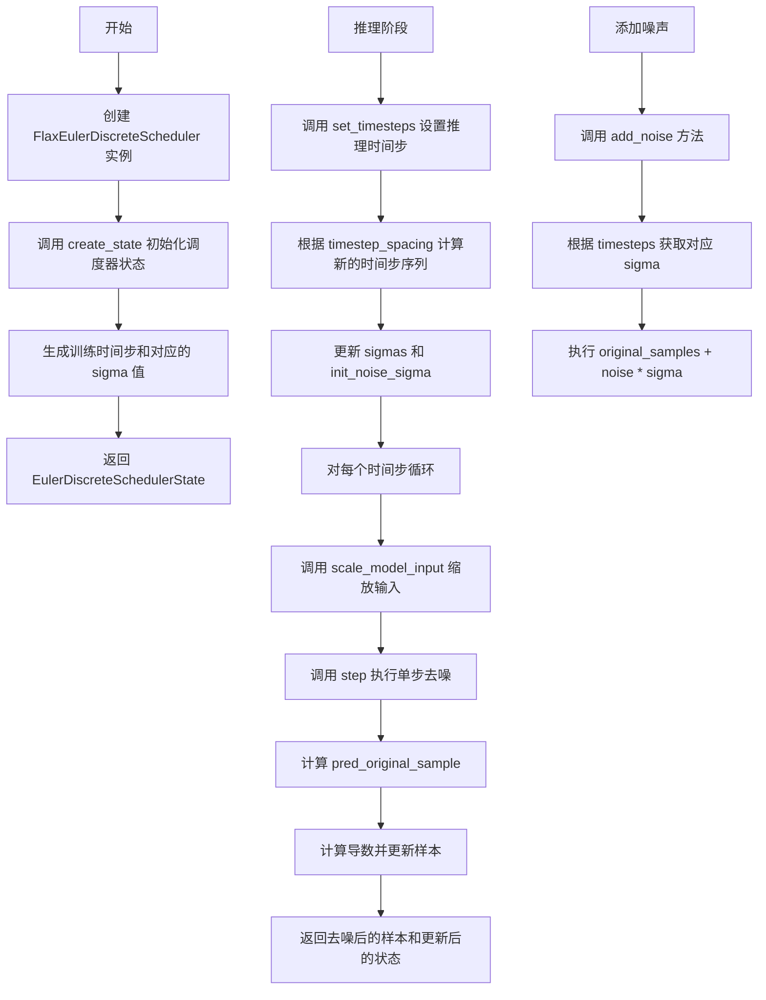
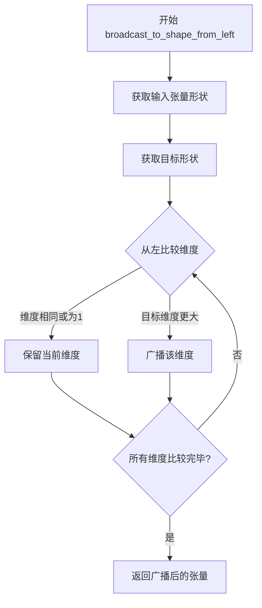
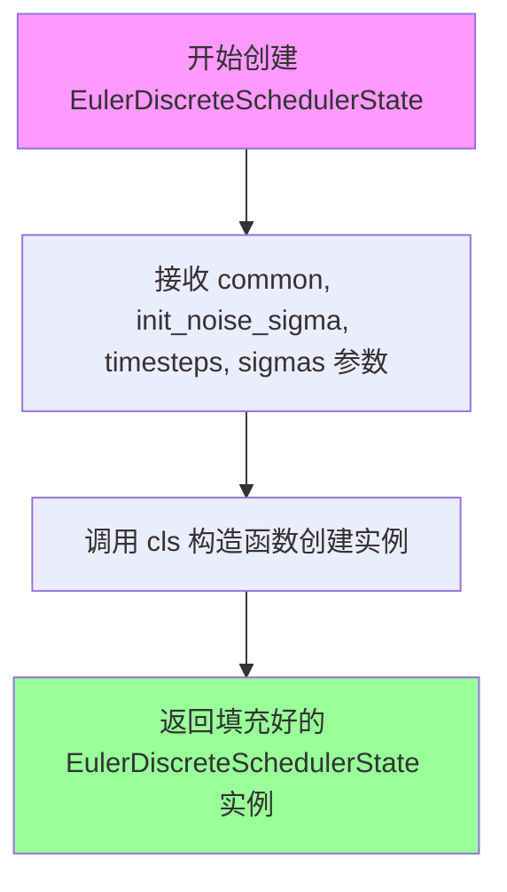
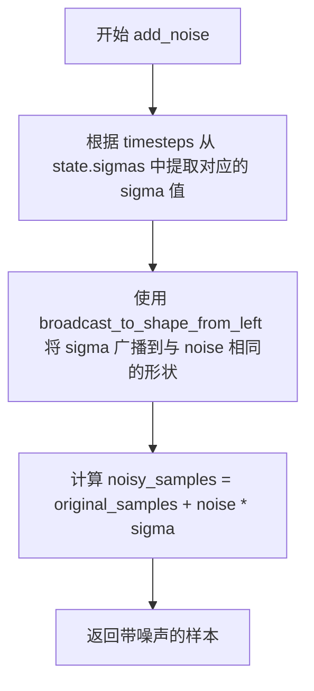
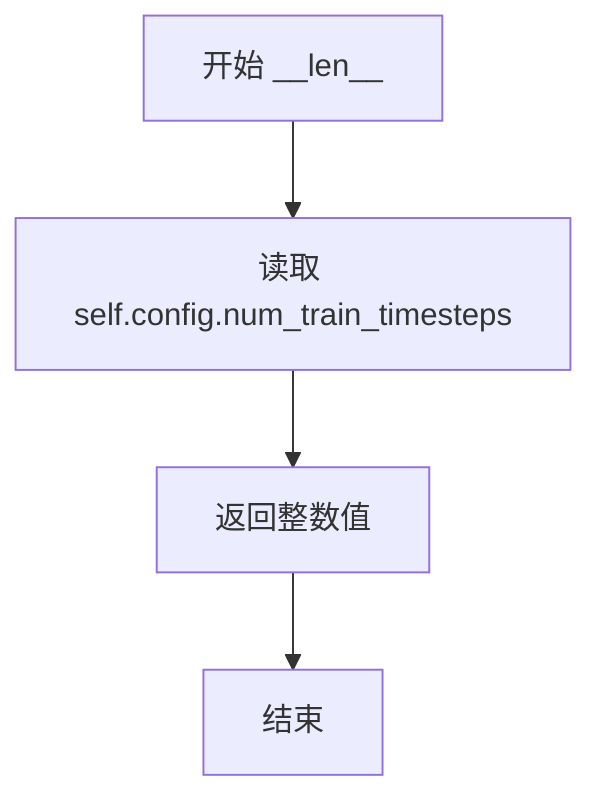
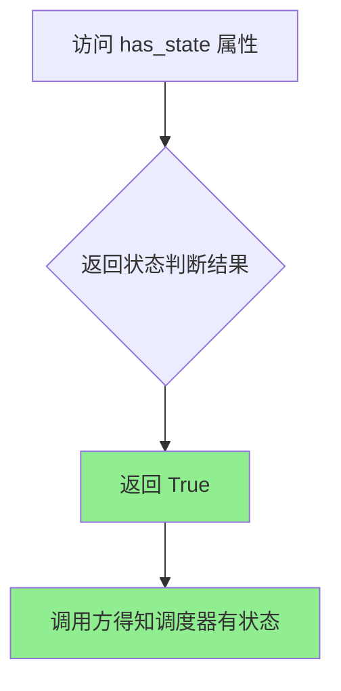

# `diffusers\src\diffusers\schedulers\scheduling_euler_discrete_flax.py` 详细设计文档

这是 Hugging Face Diffusers 库中的 FlaxEulerDiscreteScheduler 实现，提供了基于 Euler 方法的离散时间步扩散模型调度器，用于在推理阶段逐步去除噪声样本。该调度器实现了 Karras et al. (2022) 论文中的 Algorithm 2，支持 epsilon 和 v_prediction 两种预测类型，并提供了状态管理、时间步设置、模型输入缩放和单步推理功能。

## 整体流程



## 类结构

```
ConfigMixin (配置混入基类)
├── FlaxSchedulerMixin (Flax 调度器混入)
    └── FlaxEulerDiscreteScheduler (Euler 离散调度器)
        └── FlaxEulerDiscreteSchedulerOutput (输出数据类)
CommonSchedulerState (通用调度器状态)
└── EulerDiscreteSchedulerState (Euler 离散调度器状态)
```

## 全局变量及字段


### `logger`
    
模块级日志记录器，用于记录调度器的警告和信息

类型：`logging.Logger`
    


### `EulerDiscreteSchedulerState.common`
    
通用调度器状态，包含alphas_cumprod等扩散过程参数

类型：`CommonSchedulerState`
    


### `EulerDiscreteSchedulerState.init_noise_sigma`
    
初始噪声分布的标准差，用于扩散过程初始化

类型：`jnp.ndarray`
    


### `EulerDiscreteSchedulerState.timesteps`
    
时间步序列，表示扩散过程中的离散时间点

类型：`jnp.ndarray`
    


### `EulerDiscreteSchedulerState.sigmas`
    
对应时间步的噪声强度值，用于控制每步的噪声水平

类型：`jnp.ndarray`
    


### `EulerDiscreteSchedulerState.num_inference_steps`
    
推理步骤数，表示生成样本时的迭代次数

类型：`int`
    


### `FlaxEulerDiscreteSchedulerOutput.prev_sample`
    
去噪后的样本，即前一时间步的预测结果

类型：`jnp.ndarray`
    


### `FlaxEulerDiscreteSchedulerOutput.state`
    
更新后的调度器状态，包含最新的时间步和sigma值

类型：`EulerDiscreteSchedulerState`
    


### `FlaxEulerDiscreteScheduler._compatibles`
    
兼容的调度器列表，用于调度器类型检查和转换

类型：`list`
    


### `FlaxEulerDiscreteScheduler.dtype`
    
计算使用的数据类型，决定参数和计算的精度

类型：`jnp.dtype`
    


### `FlaxEulerDiscreteScheduler.num_train_timesteps`
    
训练时间步数，扩散模型训练时使用的时间步总数

类型：`int`
    


### `FlaxEulerDiscreteScheduler.beta_start`
    
beta起始值，beta调度线的起始beta值

类型：`float`
    


### `FlaxEulerDiscreteScheduler.beta_end`
    
beta结束值，beta调度线的终止beta值

类型：`float`
    


### `FlaxEulerDiscreteScheduler.beta_schedule`
    
beta调度策略，决定beta值随时间步的变化方式

类型：`str`
    


### `FlaxEulerDiscreteScheduler.trained_betas`
    
自定义betas数组，可直接指定beta值绕过beta_schedule

类型：`jnp.ndarray`
    


### `FlaxEulerDiscreteScheduler.prediction_type`
    
预测类型，决定模型预测的目标（epsilon/v_prediction/sample）

类型：`str`
    


### `FlaxEulerDiscreteScheduler.timestep_spacing`
    
时间步间隔策略，决定推理时时间步的分布方式

类型：`str`
    
    

## 全局函数及方法


### `broadcast_to_shape_from_left`

从调度工具导入的广播函数，用于将较小形状的张量广播到较大形状，从左侧维度开始匹配。

参数：

-  `tensor`：`jnp.ndarray`，需要进行广播的输入张量，通常是一维或低维数组
-  `target_shape`：`tuple`，目标形状，用于指定输出张量的维度

返回值：`jnp.ndarray`，广播后的张量，其形状与 `target_shape` 一致

#### 流程图



#### 带注释源码

```
# 从 scheduling_utils_flax 导入
# 该函数定义在调度工具模块中，用于将输入张量广播到目标形状
# 典型用途场景：
#   - 在 add_noise 方法中，将 sigma 值广播到与 noise 相同的形状
#   - 使得标量或低维张量能够与高维张量进行元素级运算

def broadcast_to_shape_from_left(tensor: jnp.ndarray, target_shape: tuple) -> jnp.ndarray:
    """
    将输入张量广播到目标形状，从左侧维度开始匹配。
    
    示例：
        输入 tensor 形状: (N,)
        目标 target_shape: (B, C, H, W)
        输出形状: (B, C, H, W)，其中 tensor 被广播到所有维度
    """
    # 获取输入张量的维度数
    tensor_ndim = tensor.ndim
    
    # 计算需要填充的维度数量
    # 例如：tensor 是 (N,)，target 是 (B, C, H, W)
    # 需要在左侧填充 4 - 1 = 3 个维度
    pad_ndim = len(target_shape) - tensor_ndim
    
    # 在张量左侧添加大小为1的维度
    # (N,) -> (1, 1, 1, N) 形式
    if pad_ndim > 0:
        tensor = tensor.reshape((1,) * pad_ndim + tensor.shape)
    
    # 使用 JAX 的 broadcast_to 扩展到目标形状
    # 从左开始广播，自动处理维度为1的情况
    return jnp.broadcast_to(tensor, target_shape)
```


### `EulerDiscreteSchedulerState.create`

用于创建 EulerDiscreteSchedulerState 类实例的类工厂方法，返回一个包含调度器状态、时间步、噪声水平等关键参数的不可变数据类实例。

参数：

- `cls`：类本身（classmethod 隐式参数），表示 EulerDiscreteSchedulerState 类
- `common`：`CommonSchedulerState`，调度器的通用状态对象，包含 alpha 累积乘积等共享数据
- `init_noise_sigma`：`jnp.ndarray`，初始噪声标准差，用于扩散过程的第一步
- `timesteps`：`jnp.ndarray`，离散的时间步数组，定义扩散链中的采样时刻
- `sigmas`：`jnp.ndarray`，噪声水平数组，对应每个时间步的 sigma 值

返回值：`EulerDiscreteSchedulerState`，返回一个填充了给定参数的 EulerDiscreteSchedulerState 不可变数据类实例

#### 流程图



#### 带注释源码

```python
@classmethod
def create(
    cls,
    common: CommonSchedulerState,
    init_noise_sigma: jnp.ndarray,
    timesteps: jnp.ndarray,
    sigmas: jnp.ndarray,
):
    """
    类工厂方法，用于创建 EulerDiscreteSchedulerState 实例。
    
    Args:
        cls: 类本身（classmethod 隐式参数）
        common: 调度器的通用状态，包含 alpha 累积乘积等共享数据
        init_noise_sigma: 初始噪声标准差
        timesteps: 离散的时间步数组
        sigmas: 对应各时间步的噪声水平数组
    
    Returns:
        填充了给定参数的 EulerDiscreteSchedulerState 不可变数据类实例
    """
    return cls(
        common=common,
        init_noise_sigma=init_noise_sigma,
        timesteps=timesteps,
        sigmas=sigmas,
    )
```


### `FlaxEulerDiscreteScheduler.create_state`

创建 Euler 离散调度器的初始状态，初始化时间步、噪声标准差和 sigma 值，为扩散模型的推理过程做准备。

参数：

- `self`：`FlaxEulerDiscreteScheduler`，调度器实例本身
- `common`：`CommonSchedulerState | None`，可选的通用调度器状态，如果为 None 则自动创建

返回值：`EulerDiscreteSchedulerState`，包含调度器完整初始状态的数据类实例

#### 流程图

```mermaid
flowchart TD
    A[开始 create_state] --> B{common 是否为 None?}
    B -->|是| C[创建 CommonSchedulerState]
    B -->|否| D[使用传入的 common]
    C --> E[生成时间步数组]
    D --> E
    E --> F[计算 sigmas: sqrt((1-αₜ)/αₜ)]
    F --> G[插值 sigmas 到时间步]
    G --> H[拼接 sigmas 末尾添加 0.0]
    H --> I{ timestep_spacing 类型?}
    I -->|linspace/trailing| J[init_noise_sigma = sigmas.max]
    I -->|其他| K[init_noise_sigma = sqrt(sigmas.max² + 1)]
    J --> L[创建并返回 EulerDiscreteSchedulerState]
    K --> L
```

#### 带注释源码

```python
def create_state(self, common: CommonSchedulerState | None = None) -> EulerDiscreteSchedulerState:
    """
    创建 Euler 离散调度器的初始状态
    
    参数:
        common: 可选的通用调度器状态，如果为 None 则自动创建
    
    返回:
        包含时间步、sigma 值和初始噪声标准差的调度器状态
    """
    # 1. 如果没有提供通用状态，则创建默认的 CommonSchedulerState
    #    这里会初始化 alpha_cumprod 等关键扩散参数
    if common is None:
        common = CommonSchedulerState.create(self)

    # 2. 生成时间步数组：从 0 到 num_train_timesteps，反转顺序
    #    例如 [999, 998, ..., 0]
    timesteps = jnp.arange(0, self.config.num_train_timesteps).round()[::-1]
    
    # 3. 计算 sigma 值：sigma = sqrt((1 - α_cumprod) / α_cumprod)
    #    这是扩散过程中噪声调度标准差的核心公式
    sigmas = ((1 - common.alphas_cumprod) / common.alphas_cumprod) ** 0.5
    
    # 4. 使用线性插值将 sigma 值映射到具体的时间步上
    #    确保 sigma 曲线与时间步对齐
    sigmas = jnp.interp(timesteps, jnp.arange(0, len(sigmas)), sigmas)
    
    # 5. 在 sigma 数组末尾添加 0.0，表示最终去噪状态（无噪声）
    sigmas = jnp.concatenate([sigmas, jnp.array([0.0], dtype=self.dtype)])

    # 6. 计算初始噪声标准差
    #    根据时间步间隔策略选择不同的计算方式
    if self.config.timestep_spacing in ["linspace", "trailing"]:
        # linspace/trailing 策略：直接使用最大 sigma 值
        init_noise_sigma = sigmas.max()
    else:
        # 其他策略（如 leading）：考虑方差公式 sqrt(σ_max² + 1)
        init_noise_sigma = (sigmas.max() ** 2 + 1) ** 0.5

    # 7. 创建并返回完整的调度器状态对象
    return EulerDiscreteSchedulerState.create(
        common=common,
        init_noise_sigma=init_noise_sigma,
        timesteps=timesteps,
        sigmas=sigmas,
    )
```


### FlaxEulerDiscreteScheduler.scale_model_input

该方法通过将去噪模型的输入除以`(sigma² + 1)⁰·⁵`来进行缩放，以匹配Euler算法的实现，确保在离散时间步长下正确地进行去噪过程。

参数：

- `state`：`EulerDiscreteSchedulerState`，FlaxEulerDiscreteScheduler 状态数据类实例，包含调度器的当前状态信息
- `sample`：`jnp.ndarray`，扩散过程中当前正在创建的样本
- `timestep`：`int`，扩散链中的当前离散时间步

返回值：`jnp.ndarray`，缩放后的输入样本

#### 流程图

```mermaid
flowchart TD
    A[开始 scale_model_input] --> B[在 state.timesteps 中查找与当前 timestep 匹配的索引]
    B --> C[获取对应索引的 sigma 值]
    C --> D[计算缩放因子: √(sigma² + 1)]
    D --> E[将 sample 除以缩放因子]
    E --> F[返回缩放后的 sample]
```

#### 带注释源码

```python
def scale_model_input(self, state: EulerDiscreteSchedulerState, sample: jnp.ndarray, timestep: int) -> jnp.ndarray:
    """
    Scales the denoising model input by `(sigma**2 + 1) ** 0.5` to match the Euler algorithm.

    Args:
        state (`EulerDiscreteSchedulerState`):
            the `FlaxEulerDiscreteScheduler` state data class instance.
        sample (`jnp.ndarray`):
            current instance of sample being created by diffusion process.
        timestep (`int`):
            current discrete timestep in the diffusion chain.

    Returns:
        `jnp.ndarray`: scaled input sample
    """
    # 在时间步数组中查找当前时间步对应的索引位置
    # 使用 jnp.where 找到匹配的时间步，返回值为元组，取第一个元素
    (step_index,) = jnp.where(state.timesteps == timestep, size=1)
    step_index = step_index[0]

    # 根据索引获取对应的 sigma 值（噪声标准差）
    sigma = state.sigmas[step_index]
    
    # 根据 Euler 算法缩放输入样本
    # 公式: sample / √(sigma² + 1)
    # 这确保了模型输入与 Euler 方法的方差匹配
    sample = sample / ((sigma**2 + 1) ** 0.5)
    
    # 返回缩放后的样本供去噪模型使用
    return sample
```


### FlaxEulerDiscreteScheduler.set_timesteps

设置推理过程中使用的扩散链时间步。在执行推理前需要运行此函数来配置时间步和sigma值。

参数：

- `self`：`FlaxEulerDiscreteScheduler`，FlaxEulerDiscreteScheduler调度器实例
- `state`：`EulerDiscreteSchedulerState`，FlaxEulerDiscreteScheduler 状态数据类实例，包含当前调度器的状态信息
- `num_inference_steps`：`int`，使用预训练模型生成样本时使用的扩散步骤数
- `shape`：`tuple`，可选，默认为空元组，用于指定输出形状（当前实现中未使用）

返回值：`EulerDiscreteSchedulerState`，更新后的调度器状态，包含新计算的时间步、sigma值和初始噪声标准差

#### 流程图

```mermaid
flowchart TD
    A[开始 set_timesteps] --> B{检查 timestep_spacing}
    B -->|linspace| C[使用 jnp.linspace 生成等间距时间步]
    B -->|leading| D[计算 step_ratio 并生成领先时间步]
    B -->|other| E[抛出 ValueError 异常]
    
    C --> F[计算 sigmas 公式]
    D --> F
    
    F --> G[使用 jnp.interp 插值 sigmas]
    G --> H[拼接 sigmas 末尾添加 0.0]
    
    H --> I{检查 timestep_spacing}
    I -->|linspace/trailing| J[init_noise_sigma = sigmas.max()]
    I -->|other| K[init_noise_sigma = (sigmas.max()² + 1)⁰·⁵]
    
    J --> L[使用 state.replace 更新状态]
    K --> L
    
    L --> M[返回更新后的 state]
    
    E --> M
```

#### 带注释源码

```python
def set_timesteps(
    self,
    state: EulerDiscreteSchedulerState,
    num_inference_steps: int,
    shape: tuple = (),
) -> EulerDiscreteSchedulerState:
    """
    Sets the timesteps used for the diffusion chain. Supporting function to be run before inference.

    Args:
        state (`EulerDiscreteSchedulerState`):
            the `FlaxEulerDiscreteScheduler` state data class instance.
        num_inference_steps (`int`):
            the number of diffusion steps used when generating samples with a pre-trained model.
    """

    # 根据配置的时间步间距策略生成时间步
    if self.config.timestep_spacing == "linspace":
        # 线性间距：从最大训练时间步-1到0，均匀分布
        timesteps = jnp.linspace(
            self.config.num_train_timesteps - 1,  # 起始点（最大时间步-1）
            0,                                     # 结束点（0）
            num_inference_steps,                  # 生成的时间步数量
            dtype=self.dtype,
        )
    elif self.config.timestep_spacing == "leading":
        # 领先间距：按固定步长生成时间步，保证每一步都在训练时间步范围内
        step_ratio = self.config.num_train_timesteps // num_inference_steps  # 计算步长比率
        timesteps = (jnp.arange(0, num_inference_steps) * step_ratio).round()[::-1].copy().astype(float)
        timesteps += 1  # 加1确保从1开始
    else:
        raise ValueError(
            f"timestep_spacing must be one of ['linspace', 'leading'], got {self.config.timestep_spacing}"
        )

    # 计算sigma值（噪声标准差）
    # sigma = sqrt((1 - α_cumprod) / α_cumprod)
    sigmas = ((1 - state.common.alphas_cumprod) / state.common.alphas_cumprod) ** 0.5
    # 将sigma插值到生成的时间步上
    sigmas = jnp.interp(timesteps, jnp.arange(0, len(sigmas)), sigmas)
    # 在末尾添加0.0（最终去噪步骤的sigma值）
    sigmas = jnp.concatenate([sigmas, jnp.array([0.0], dtype=self.dtype)])

    # 计算初始噪声分布的标准差
    if self.config.timestep_spacing in ["linspace", "trailing"]:
        init_noise_sigma = sigmas.max()  # 直接取最大sigma值
    else:
        init_noise_sigma = (sigmas.max() ** 2 + 1) ** 0.5  # 使用 (σ² + 1)⁰·⁵ 公式

    # 返回更新后的调度器状态
    return state.replace(
        timesteps=timesteps,                  # 更新后的时间步
        sigmas=sigmas,                        # 更新后的sigma值
        num_inference_steps=num_inference_steps,  # 推理步骤数
        init_noise_sigma=init_noise_sigma,    # 初始噪声标准差
    )
```


### `FlaxEulerDiscreteScheduler.step`

执行单步去噪操作，通过反转SDE（随机微分方程）来预测前一个时间步的样本。这是Euler调度器的核心函数，根据扩散模型预测的噪声计算去噪后的样本。

参数：

- `self`：`FlaxEulerDiscreteScheduler`实例，调度器本身
- `state`：`EulerDiscreteSchedulerState`，FlaxEulerDiscreteScheduler的状态数据类实例，包含时间步、sigma值等调度器状态信息
- `model_output`：`jnp.ndarray`，直接从学习到的扩散模型输出的预测噪声（或v-prediction）
- `timestep`：`int`，扩散链中的当前离散时间步
- `sample`：`jnp.ndarray`，扩散过程正在创建的当前样本实例
- `return_dict`：`bool`，可选参数，默认为True，决定是否返回FlaxEulerDiscreteSchedulerOutput而不是tuple

返回值：`FlaxEulerDiscreteSchedulerOutput | tuple`，当return_dict为True时返回FlaxEulerDiscreteSchedulerOutput对象，否则返回tuple（第一个元素是样本张量）

#### 流程图

```mermaid
flowchart TD
    A[开始 step] --> B{检查 num_inference_steps 是否为 None}
    B -->|是| C[抛出 ValueError: 需要先运行 set_timesteps]
    B -->|否| D[根据 timestep 查找 step_index]
    D --> E[获取当前 sigma = sigmas[step_index]]
    E --> F{prediction_type == epsilon?}
    F -->|是| G[pred_original_sample = sample - sigma * model_output]
    F -->|否| H{prediction_type == v_prediction?}
    H -->|是| I[pred_original_sample = model_output * (-sigma / sqrt(sigma²+1)) + sample / sqrt(sigma²+1)]
    H -->|否| J[抛出 ValueError: prediction_type 无效]
    G --> K[计算导数 derivative = (sample - pred_original_sample) / sigma]
    I --> K
    K --> L[计算 dt = sigmas[step_index+1] - sigma]
    L --> M[计算 prev_sample = sample + derivative * dt]
    M --> N{return_dict == True?}
    N -->|是| O[返回 FlaxEulerDiscreteSchedulerOutput]
    N -->|否| P[返回 tuple(prev_sample, state)]
    O --> Q[结束]
    P --> Q
```

#### 带注释源码

```python
def step(
    self,
    state: EulerDiscreteSchedulerState,
    model_output: jnp.ndarray,
    timestep: int,
    sample: jnp.ndarray,
    return_dict: bool = True,
) -> FlaxEulerDiscreteSchedulerOutput | tuple:
    """
    Predict the sample at the previous timestep by reversing the SDE. Core function to propagate the diffusion
    process from the learned model outputs (most often the predicted noise).

    Args:
        state (`EulerDiscreteSchedulerState`):
            the `FlaxEulerDiscreteScheduler` state data class instance.
        model_output (`jnp.ndarray`): direct output from learned diffusion model.
        timestep (`int`): current discrete timestep in the diffusion chain.
        sample (`jnp.ndarray`):
            current instance of sample being created by diffusion process.
        order: coefficient for multi-step inference.
        return_dict (`bool`): option for returning tuple rather than FlaxEulerDiscreteScheduler class

    Returns:
        [`FlaxEulerDiscreteScheduler`] or `tuple`: [`FlaxEulerDiscreteScheduler`] if `return_dict` is True,
        otherwise a `tuple`. When returning a tuple, the first element is the sample tensor.

    """
    # 步骤1: 检查是否已经设置了推理步数，如果没有则抛出错误
    if state.num_inference_steps is None:
        raise ValueError(
            "Number of inference steps is 'None', you need to run 'set_timesteps' after creating the scheduler"
        )

    # 步骤2: 根据当前timestep找到对应的step_index（时间步索引）
    (step_index,) = jnp.where(state.timesteps == timestep, size=1)
    step_index = step_index[0]

    # 步骤3: 获取当前时间步对应的sigma值（噪声标准差）
    sigma = state.sigmas[step_index]

    # 步骤4: 根据prediction_type计算原始样本x_0
    # 从sigma缩放的预测噪声计算原始样本
    if self.config.prediction_type == "epsilon":
        # epsilon预测：x_0 = x_t - sigma * noise
        pred_original_sample = sample - sigma * model_output
    elif self.config.prediction_type == "v_prediction":
        # v-prediction：使用v-prediction公式计算原始样本
        # 公式: pred_original_sample = model_output * c_out + sample * c_skip
        # 其中 c_out = -sigma/sqrt(sigma²+1), c_skip = 1/sqrt(sigma²+1)
        pred_original_sample = model_output * (-sigma / (sigma**2 + 1) ** 0.5) + (sample / (sigma**2 + 1))
    else:
        raise ValueError(
            f"prediction_type given as {self.config.prediction_type} must be one of `epsilon`, or `v_prediction`"
        )

    # 步骤5: 将问题转换为ODE导数形式
    # 计算导数（ODE的方向导数）
    derivative = (sample - pred_original_sample) / sigma

    # 步骤6: 计算时间步长dt
    # dt = sigma_down - sigma（下一个sigma值与当前sigma值的差）
    dt = state.sigmas[step_index + 1] - sigma

    # 步骤7: 使用Euler方法更新样本
    # x_{t-1} = x_t + derivative * dt
    prev_sample = sample + derivative * dt

    # 步骤8: 根据return_dict决定返回格式
    if not return_dict:
        return (prev_sample, state)

    return FlaxEulerDiscreteSchedulerOutput(prev_sample=prev_sample, state=state)
```


### `FlaxEulerDiscreteScheduler.add_noise`

向原始样本添加噪声，根据给定的时间步使用调度器的sigma值进行噪声混合。

参数：

- `self`：`FlaxEulerDiscreteScheduler`，隐式参数，表示调度器实例本身
- `state`：`EulerDiscreteSchedulerState`，包含调度器状态和sigma值的数据类实例
- `original_samples`：`jnp.ndarray`，要添加噪声的原始干净样本
- `noise`：`jnp.ndarray`，要添加到样本中的噪声
- `timesteps`：`jnp.ndarray`，用于确定每个样本应添加噪声程度的时间步索引

返回值：`jnp.ndarray`，添加噪声后的样本

#### 流程图



#### 带注释源码

```python
def add_noise(
    self,
    state: EulerDiscreteSchedulerState,
    original_samples: jnp.ndarray,
    noise: jnp.ndarray,
    timesteps: jnp.ndarray,
) -> jnp.ndarray:
    """
    向原始样本添加噪声，根据给定的时间步使用调度器的sigma值进行噪声混合。
    
    参数:
        state: 包含调度器状态和sigma值的数据类实例
        original_samples: 要添加噪声的原始干净样本
        noise: 要添加到样本中的噪声
        timesteps: 用于确定每个样本应添加噪声程度的时间步索引
    
    返回:
        添加噪声后的样本
    """
    # 1. 根据时间步索引从sigma数组中提取对应的sigma值
    # sigma代表当前时间步的噪声标准差
    sigma = state.sigmas[timesteps].flatten()
    
    # 2. 将sigma从左侧广播到与噪声相同的形状
    # 这样可以对多维张量的每个元素正确地进行噪声添加
    sigma = broadcast_to_shape_from_left(sigma, noise.shape)

    # 3. 计算带噪声样本: x_noisy = x_original + σ * ε
    # 这是扩散过程中前向加噪的标准公式
    noisy_samples = original_samples + noise * sigma

    # 4. 返回添加噪声后的样本
    return noisy_samples
```


### `FlaxEulerDiscreteScheduler.__len__`

返回训练时间步的数量，即 `num_train_timesteps` 配置属性的值。该方法使调度器对象支持 Python 的 `len()` 内置函数，便于获取训练过程中使用的时间步总数。

参数：

- `self`：`FlaxEulerDiscreteScheduler`，隐式参数，当前调度器实例对象

返回值：`int`，训练时间步的总数，通常默认为 1000，表示扩散模型训练时使用的时间步数量。

#### 流程图



#### 带注释源码

```python
def __len__(self):
    """
    返回训练时间步的数量。
    
    该方法实现了 Python 的魔术方法 __len__，使调度器对象可以通过
    len(scheduler) 的方式获取训练时间步的总数。这个值在调度器初始化
    时通过 num_train_timesteps 参数设置，默认值为 1000。
    
    Returns:
        int: 训练过程中使用的时间步总数
    """
    return self.config.num_train_timesteps
```


### `FlaxEulerDiscreteScheduler.has_state`

该属性用于判断调度器是否具有状态。在扩散模型的调度器中，某些调度器需要在推理过程中保存中间状态（如噪声样本、sigma值等），该属性返回True表示当前调度器维护状态。

参数：无（该方法为属性访问器，无需参数）

返回值：`bool`，返回调度器是否具有状态。此处固定返回 `True`，表示 `FlaxEulerDiscreteScheduler` 在推理过程中需要维护 `EulerDiscreteSchedulerState` 状态对象。

#### 流程图



#### 带注释源码

```python
@property
def has_state(self):
    """
    属性方法：返回调度器是否具有状态
    
    在扩散模型推理过程中，某些调度器需要在多个时间步之间保持内部状态，
    例如保存当前样本、sigma值、时间步信息等。该属性用于判断调度器是否
    维护有自己的状态对象。
    
    对于 FlaxEulerDiscreteScheduler，返回 True 表示：
    - 调度器维护 EulerDiscreteSchedulerState 状态对象
    - 需要在推理过程中保存和更新状态
    - 可以通过 create_state 方法创建初始状态
    - 可以通过 set_timesteps 方法更新状态中的时间步和sigma值
    
    Returns:
        bool: 固定返回 True，表示该调度器具有状态需要维护
    """
    return True
```

## 关键组件


### EulerDiscreteSchedulerState

状态数据类，用于存储Euler离散调度器的运行时状态，包括噪声标准差、时间步、sigma值和推理步数。通过`create`工厂方法实例化，支持惰性加载和状态管理。

### FlaxEulerDiscreteSchedulerOutput

调度器输出数据类，继承自FlaxSchedulerOutput，包含prev_sample（前一时刻的样本）和state（调度器状态），用于返回扩散过程的中间结果。

### FlaxEulerDiscreteScheduler

核心调度器类，实现了Euler算法（Karras et al. 2022），支持多种预测类型（epsilon预测和v_prediction），提供噪声调度、时间步缩放、模型输入缩放和单步推理功能。

### 张量索引与惰性加载

通过`jnp.where`在timesteps数组中查找当前步索引，实现离散时间步的动态查找；状态对象采用延迟求值策略，仅在需要时计算sigma和timesteps。

### 反量化支持

`scale_model_input`方法将去噪模型输入按`(sigma**2 + 1) ** 0.5`进行缩放，以匹配Euler算法的数学形式；`step`方法支持从预测噪声反向推导原始样本。

### 量化策略

通过`prediction_type`配置支持三种预测模式：`epsilon`（预测噪声）、`v_prediction`（速度预测）和直接预测样本；`trained_betas`允许传入自定义beta数组绕过默认调度。

### 时间步间距策略

`set_timesteps`方法支持`linspace`和`leading`两种时间步间距策略，通过`timestep_spacing`配置控制推理时的时间步分布。

### 噪声添加机制

`add_noise`方法使用broadcast_to_shape_from_left将sigma扩展到与噪声相同的shape，实现任意维度的噪声添加。

### 初始化噪声sigma计算

根据timestep_spacing策略（linspace/trailing vs leading）采用不同的公式计算初始噪声标准差，支持不同的扩散过程初始化方式。


## 问题及建议


### 已知问题

-   **弃用的框架**：代码中包含明确的弃用警告 `"Flax classes are deprecated and will be removed in Diffusers v1.0.0"`，整个Flax实现将在未来版本中被移除，这是重大技术债务。
-   **代码重复**：`create_state` 和 `set_timesteps` 方法中存在大量重复的 sigma 计算逻辑和 `init_noise_sigma` 计算，违反 DRY 原则。
-   **缺失参数**：`step` 方法的文档字符串中提到了 `order` 参数（用于多步推理），但函数签名中并未实现此参数。
-   **边界检查缺失**：`step` 方法中使用 `jnp.where` 查找 `step_index`，当找不到匹配 timestep 时会返回空数组，导致 `step_index[0]` 越界错误，缺乏防御性编程。
-   **类型注解兼容性**：使用了 `jnp.ndarray | None` 的 Python 3.10+ 联合类型语法，不兼容旧版本 Python。
-   **未使用参数**：`set_timesteps` 方法的 `shape` 参数有默认值但在实现中未被使用。

### 优化建议

-   将重复的 sigma 和 init_noise_sigma 计算提取为私有方法，如 `_compute_sigmas()` 和 `_compute_init_noise_sigma()`，以减少代码冗余。
-   添加边界检查或使用安全的数组索引访问，如在 `step` 方法中添加对 `step_index` 长度的验证。
-   移除或实现文档中提到的 `order` 参数，或更新文档以反映实际功能。
-   考虑使用 `Optional[jnp.ndarray]` 替代 `|` 语法以提高兼容性。
-   移除未使用的 `shape` 参数或实现其功能。
-   预计算 `sigma**2 + 1` 等重复表达式以提高性能，可以使用缓存机制存储中间计算结果。

## 其它


### 设计目标与约束

本调度器实现Karras等人(2022)论文中的Euler调度器(算法2)，核心设计目标是为扩散模型提供高效、稳定的采样机制。通过支持epsilon、v_prediction等多种预测类型，以及linspace、leading等时间步间隔策略，提供灵活的采样控制。设计约束包括：仅支持Flax/JAX后端，要求输入为jnp.ndarray类型，数值精度受dtype参数控制(默认float32)，且需要与CommonSchedulerState配合使用以获取alphas_cumprod等关键参数。

### 错误处理与异常设计

调度器在以下场景进行显式错误处理：1) timestep_spacing参数验证：仅接受"linspace"和"leading"两种值，其他值抛出ValueError；2) prediction_type参数验证：仅支持"epsilon"和"v_prediction"，否则抛出ValueError；3) 推理步骤数检查：step方法中检查num_inference_steps是否为None，若为None则抛出ValueError并提示需要先运行set_timesteps；4) 数组索引安全：通过jnp.where配合size=1确保返回标量后再索引，避免越界。

### 数据流与状态机

调度器状态流转遵循：初始化(create_state) -> 设置时间步(set_timesteps) -> 迭代去噪(step) -> 完成。核心数据流：输入噪声样本 -> scale_model_input缩放 -> 模型预测噪声 -> step方法计算原样本和导数 -> 更新样本 -> 输出。状态包含timesteps数组、sigmas数组、num_inference_steps整数，共同控制扩散过程的时间轴。

### 外部依赖与接口契约

本模块依赖以下外部组件：1) flax.struct.dataclass - 用于创建可变的JAX兼容数据结构；2) jax.numpy (jnp) - 数值计算后端；3) configuration_utils.ConfigMixin - 配置混合类，提供配置存储和加载；4) scheduling_utils_flax.CommonSchedulerState - 公共调度器状态，包含alphas_cumprod等扩散关键参数；5) scheduling_utils_flax.FlaxSchedulerMixin - 提供save_pretrained和from_pretrained方法；6) scheduling_utils_flax.FlaxSchedulerOutput - 调度器输出基类；7) utils.logging - 日志记录。调用方需保证传入的model_output与sample形状一致，且timestep必须存在于state.timesteps中。

### 配置参数详解

num_train_timesteps: 训练时的扩散步数，默认1000，决定噪声调度的时间轴长度；beta_start/beta_end: Beta线性调度的起点和终点值，用于生成beta_schedule；beta_schedule: Beta调度策略，可选"linear"或"scaled_linear"，影响alpha计算过程；trained_betas: 可选参数，允许直接传入自定义beta数组以覆盖上述参数；prediction_type: 预测类型，"epsilon"预测噪声，"v_prediction"执行v-prediction算法；timestep_spacing: 推理时时间步分布策略，"linspace"均匀分布，"leading"前向分布；dtype: 数值精度，默认float32，影响所有计算和存储的精度。

### 数值稳定性考虑

调度器在数值计算中采取以下措施保证稳定性：1) sigmas计算使用jnp.sqrt确保正值；2) 使用jnp.interp进行sigmas插值处理边界情况；3) init_noise_sigma根据timestep_spacing采用不同计算策略，leading模式使用(sigma_max^2 + 1)^0.5而非sigma_max以适应非均匀时间步；4) v_prediction中使用分母(sigma^2 + 1)^0.5防止除零；5) 导数计算derivative = (sample - pred_original_sample) / sigma，当sigma接近0时理论上可能出现问题，但step方法在最后一个时间步后结束此时sigmas最后一位为0.0，实际使用时dt也为0不会执行该计算。

### 使用示例与调用流程

标准调用流程：1) 实例化调度器：scheduler = FlaxEulerDiscreteScheduler(...)；2) 创建状态：state = scheduler.create_state()；3) 设置推理步数：state = scheduler.set_timesteps(state, num_inference_steps=50)；4) 迭代去噪：for timestep in state.timesteps: sample = scheduler.scale_model_input(state, sample, timestep)；model_output = model(sample, timestep)；output = scheduler.step(state, model_output, timestep, sample)；sample = output.prev_sample；state = output.state。add_noise方法用于训练阶段向干净样本添加噪声。

### 线程安全与并发特性

由于Flax/JAX函数式特性，调度器状态EulerDiscreteSchedulerState是不可变的，所有修改通过state.replace()返回新状态实现。这天然支持并行推理：可以为不同样本创建独立的状态副本并行执行step操作。但需注意：1) 同一状态对象不能被并发修改；2) 模型输出model_output必须在调度器step之前完成计算；3) 状态中的timesteps和sigmas数组在推理过程中保持不变，只有num_inference_steps可能变化。

    