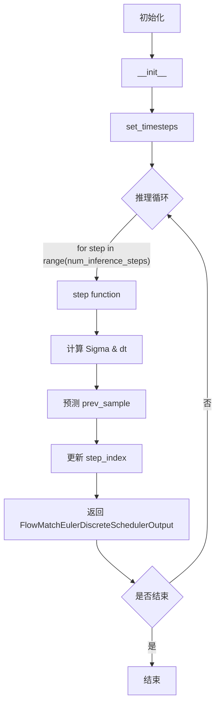
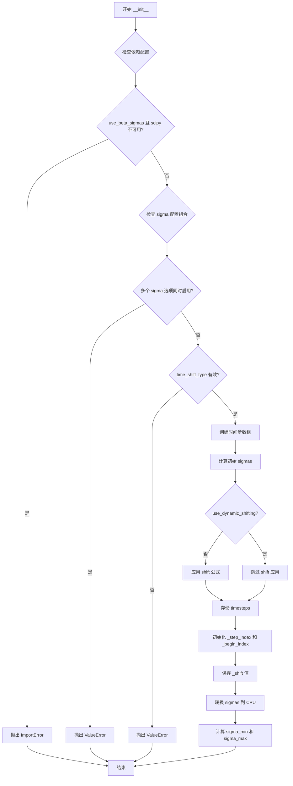
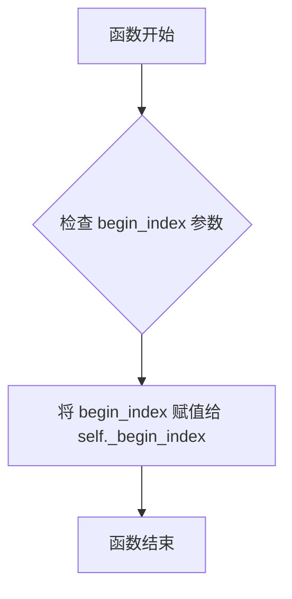
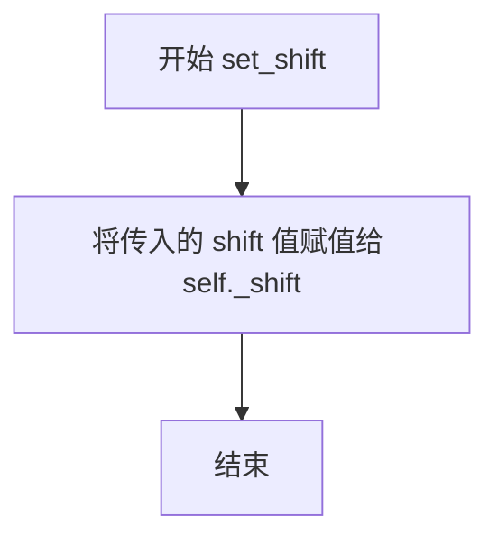
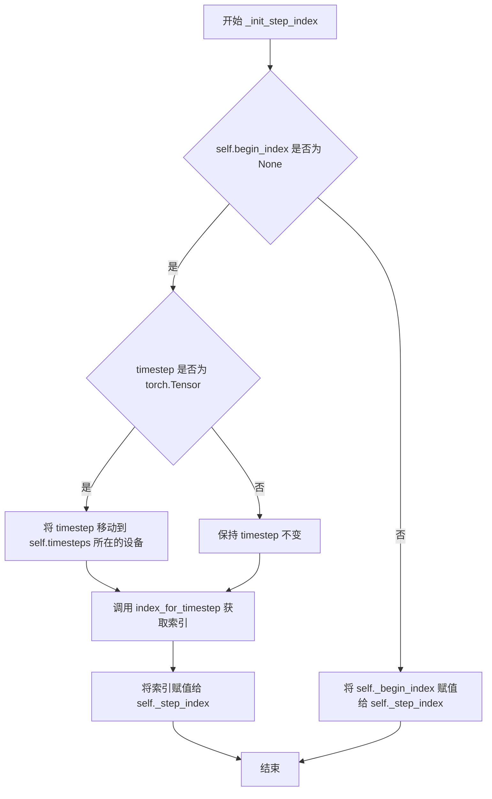
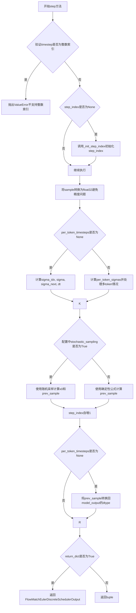
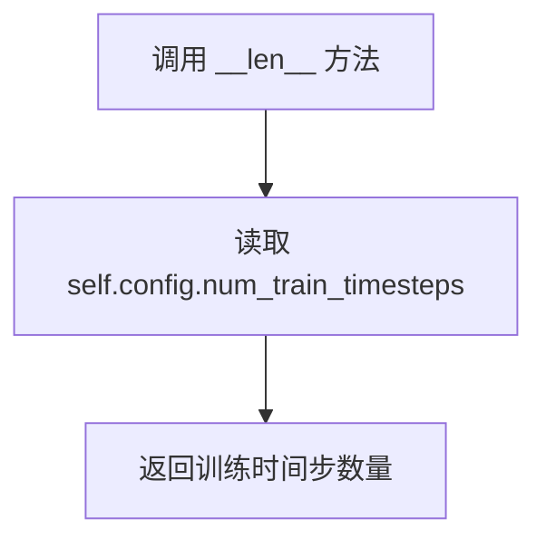

# `diffusers\src\diffusers\schedulers\scheduling_flow_match_euler_discrete.py` 详细设计文档

这是一个用于 Flow Matching（流匹配）或扩散模型的 Euler 离散调度器（Scheduler），负责管理推理过程中的时间步（timesteps）和噪声水平（sigmas），通过逐步降噪（reverse SDE）从随机噪声中生成样本。

## 整体流程



## 类结构

```
BaseOutput (数据基类)
├── FlowMatchEulerDiscreteSchedulerOutput (输出数据类)
SchedulerMixin & ConfigMixin (抽象基类)
└── FlowMatchEulerDiscreteScheduler (主调度器类)
```

## 全局变量及字段


### `logger`
    
模块级日志记录器，用于记录调度器运行过程中的日志信息

类型：`logging.Logger`
    


### `FlowMatchEulerDiscreteSchedulerOutput.prev_sample`
    
上一时间步计算出的样本

类型：`torch.FloatTensor`
    


### `FlowMatchEulerDiscreteScheduler.timesteps`
    
时间步张量

类型：`torch.Tensor`
    


### `FlowMatchEulerDiscreteScheduler.sigmas`
    
噪声水平张量

类型：`torch.Tensor`
    


### `FlowMatchEulerDiscreteScheduler._step_index`
    
当前推理步骤索引

类型：`Optional[int]`
    


### `FlowMatchEulerDiscreteScheduler._begin_index`
    
起始索引

类型：`Optional[int]`
    


### `FlowMatchEulerDiscreteScheduler._shift`
    
时间步偏移量

类型：`float`
    


### `FlowMatchEulerDiscreteScheduler.num_inference_steps`
    
推理步数

类型：`int`
    


### `FlowMatchEulerDiscreteScheduler.sigma_min`
    
最小sigma值

类型：`float`
    


### `FlowMatchEulerDiscreteScheduler.sigma_max`
    
最大sigma值

类型：`float`
    
    

## 全局函数及方法


### FlowMatchEulerDiscreteScheduler.__init__

用于初始化流匹配 Euler 离散调度器（FlowMatchEulerDiscreteScheduler），该调度器在图像生成任务中管理扩散过程的时间步和噪声调度。

参数：

- `num_train_timesteps`：`int`，训练扩散模型的总步数，默认为 1000
- `shift`：`float`，时间步偏移值，用于调整噪声调度，默认为 1.0
- `use_dynamic_shifting`：`bool`，是否根据图像分辨率动态计算时间步偏移，默认为 False
- `base_shift`：`float | None`，用于稳定图像生成的基础偏移值，默认为 0.5
- `max_shift`：`float | None`，允许 latent 向量的最大偏移值，增加变化性，默认为 1.15
- `base_image_seq_len`：`int`，基础图像序列长度，默认为 256
- `max_image_seq_len`：`int`，最大图像序列长度，默认为 4096
- `invert_sigmas`：`bool`，是否反转 sigmas 调度，默认为 False
- `shift_terminal`：`float`，偏移后时间步的终止值，默认为 None
- `use_karras_sigmas`：`bool`，是否使用 Karras 噪声调度策略，默认为 False
- `use_exponential_sigmas`：`bool`，是否使用指数噪声调度策略，默认为 False
- `use_beta_sigmas`：`bool`，是否使用 Beta 噪声调度策略，默认为 False
- `time_shift_type`：`Literal["exponential", "linear"]`，动态分辨率相关时间偏移的类型，默认为 "exponential"
- `stochastic_sampling`：`bool`，是否使用随机采样，默认为 False

返回值：无（`None`），该方法为构造函数，直接初始化实例属性

#### 流程图



#### 带注释源码

```python
@register_to_config
def __init__(
    self,
    num_train_timesteps: int = 1000,
    shift: float = 1.0,
    use_dynamic_shifting: bool = False,
    base_shift: float | None = 0.5,
    max_shift: float | None = 1.15,
    base_image_seq_len: int = 256,
    max_image_seq_len: int = 4096,
    invert_sigmas: bool = False,
    shift_terminal: float = None,
    use_karras_sigmas: bool = False,
    use_exponential_sigmas: bool = False,
    use_beta_sigmas: bool = False,
    time_shift_type: Literal["exponential", "linear"] = "exponential",
    stochastic_sampling: bool = False,
):
    # 检查是否启用了 beta_sigmas 但未安装 scipy
    if self.config.use_beta_sigmas and not is_scipy_available():
        raise ImportError("Make sure to install scipy if you want to use beta sigmas.")
    
    # 检查多个 sigma 策略是否同时启用（只能选一个）
    if (
        sum(
            [
                self.config.use_beta_sigmas,
                self.config.use_exponential_sigmas,
                self.config.use_karras_sigmas,
            ]
        )
        > 1
    ):
        raise ValueError(
            "Only one of `config.use_beta_sigmas`, `config.use_exponential_sigmas`, `config.use_karras_sigmas` can be used."
        )
    
    # 验证 time_shift_type 参数有效性
    if time_shift_type not in {"exponential", "linear"}:
        raise ValueError("`time_shift_type` must either be 'exponential' or 'linear'.")

    # 创建线性时间步数组：从 1 到 num_train_timesteps，然后反向
    timesteps = np.linspace(1, num_train_timesteps, num_train_timesteps, dtype=np.float32)[::-1].copy()
    timesteps = torch.from_numpy(timesteps).to(dtype=torch.float32)

    # 初始化 sigmas = timesteps / num_train_timesteps
    sigmas = timesteps / num_train_timesteps
    
    # 如果不使用动态偏移，应用 shift 公式调整 sigmas
    # 公式: sigmas = shift * sigmas / (1 + (shift - 1) * sigmas)
    if not use_dynamic_shifting:
        # when use_dynamic_shifting is True, we apply the timestep shifting on the fly based on the image resolution
        sigmas = shift * sigmas / (1 + (shift - 1) * sigmas)

    # 将 sigmas 转换为实际时间步
    self.timesteps = sigmas * num_train_timesteps

    # 初始化步索引（用于跟踪当前推理步骤）
    self._step_index = None
    self._begin_index = None

    # 保存 shift 值（通过属性访问器暴露）
    self._shift = shift

    # 将 sigmas 移到 CPU 以减少 CPU/GPU 通信开销
    self.sigmas = sigmas.to("cpu")  # to avoid too much CPU/GPU communication
    # 记录最小和最大 sigma 值
    self.sigma_min = self.sigmas[-1].item()
    self.sigma_max = self.sigmas[0].item()
```


### `FlowMatchEulerDiscreteScheduler.set_begin_index`

设置调度器的起始索引。该方法应在推理前从pipeline调用，用于指定调度器从哪个时间步索引开始执行。

参数：

- `begin_index`：`int`，默认值 `0`，调度器的起始索引。

返回值：`None`，无返回值。

#### 流程图



#### 带注释源码

```python
def set_begin_index(self, begin_index: int = 0):
    """
    Sets the begin index for the scheduler. This function should be run from pipeline before the inference.

    Args:
        begin_index (`int`, defaults to `0`):
            The begin index for the scheduler.
    """
    # 将传入的 begin_index 参数赋值给实例变量 _begin_index
    # 该变量用于记录调度器的起始时间步索引
    self._begin_index = begin_index
```


### `FlowMatchEulerDiscreteScheduler.set_shift`

设置调度器的shift值，用于调整时间步的时间偏移。

参数：

- `shift`：`float`，要设置的shift值

返回值：`None`，该方法直接修改实例属性，不返回任何值

#### 流程图



#### 带注释源码

```python
def set_shift(self, shift: float):
    """
    Sets the shift value for the scheduler.

    Args:
        shift (`float`):
            The shift value to be set.
    """
    # 将传入的 shift 参数赋值给实例变量 _shift
    # 该值会影响时间步的缩放计算，详见 __init__ 和 set_timesteps 方法
    self._shift = shift
```


### `FlowMatchEulerDiscreteScheduler.scale_noise`

该方法实现了流匹配（Flow Matching）的前向过程，根据给定的时间步（timestep）和噪声（noise）对输入样本（sample）进行线性插值缩放，返回经过噪声调节后的样本。在扩散模型的采样过程中，此方法用于根据当前时间步的噪声水平将原始样本与噪声进行混合。

参数：

- `sample`：`torch.FloatTensor`，输入的原始样本张量
- `timestep`：`float | torch.FloatTensor`，当前扩散链中的时间步，用于确定噪声水平
- `noise`：`torch.FloatTensor | None`，要添加的噪声张量，如果为 None 则仅进行缩放

返回值：`torch.FloatTensor`，经过噪声缩放后的样本张量

#### 流程图

```mermaid
flowchart TD
    A[开始 scale_noise] --> B[将 sigmas 移动到 sample 的设备和数据类型]
    B --> C{检查设备类型是否为 MPS}
    C -->|是| D[将 timesteps 转换为 float32]
    C -->|否| E[保持原始数据类型]
    D --> F[获取 schedule_timesteps]
    E --> F
    F --> G{判断 begin_index 状态}
    G -->|None| H[为每个 timestep 计算 step_index]
    G -->|step_index 不为 None| I[使用 step_index]
    G -->|begin_index 已设置| J[使用 begin_index]
    H --> K[从 sigmas 中获取对应 sigma 值]
    I --> K
    J --> K
    K --> L[flatten sigma 并扩展维度匹配 sample]
    L --> M[计算输出: sample = sigma * noise + (1 - sigma) * sample]
    M --> N[返回缩放后的 sample]
```

#### 带注释源码

```python
def scale_noise(
    self,
    sample: torch.FloatTensor,
    timestep: float | torch.FloatTensor,
    noise: torch.FloatTensor | None = None,
) -> torch.FloatTensor:
    """
    Forward process in flow-matching

    Args:
        sample (`torch.FloatTensor`):
            The input sample.
        timestep (`torch.FloatTensor`):
            The current timestep in the diffusion chain.
        noise (`torch.FloatTensor`):
            The noise tensor.

    Returns:
        `torch.FloatTensor`:
            A scaled input sample.
    """
    # 将 sigmas 和 timesteps 移动到与原始样本相同的设备和数据类型
    sigmas = self.sigmas.to(device=sample.device, dtype=sample.dtype)

    # MPS 设备特殊处理：MPS 不支持 float64
    if sample.device.type == "mps" and torch.is_floating_point(timestep):
        schedule_timesteps = self.timesteps.to(sample.device, dtype=torch.float32)
        timestep = timestep.to(sample.device, dtype=torch.float32)
    else:
        schedule_timesteps = self.timesteps.to(sample.device)
        timestep = timestep.to(sample.device)

    # 确定 step_indices：
    # - begin_index 为 None 时：用于训练模式，为每个 timestep 计算索引
    # - step_index 已设置时：用于 inpainting（首次去噪后）
    # - begin_index 已设置时：用于 img2img（首次去噪前创建初始潜变量）
    if self.begin_index is None:
        step_indices = [self.index_for_timestep(t, schedule_timesteps) for t in timestep]
    elif self.step_index is not None:
        step_indices = [self.step_index] * timestep.shape[0]
    else:
        step_indices = [self.begin_index] * timestep.shape[0]

    # 获取对应时间步的 sigma 值并展平
    sigma = sigmas[step_indices].flatten()
    
    # 扩展 sigma 维度以匹配 sample 的形状
    while len(sigma.shape) < len(sample.shape):
        sigma = sigma.unsqueeze(-1)

    # 核心公式：flow matching 的线性插值
    # sigma * noise + (1.0 - sigma) * sample
    # 当 sigma=0 时返回原始样本，sigma=1 时返回纯噪声
    sample = sigma * noise + (1.0 - sigma) * sample

    return sample
```


### `FlowMatchEulerDiscreteScheduler.time_shift`

应用时间偏移到 sigmas（噪声调度参数），根据配置的时间偏移类型（指数或线性）调用相应的私有方法进行计算。

参数：

- `mu`：`float`，时间偏移的 mu 参数，用于控制偏移的幅度
- `sigma`：`float`，时间偏移的 sigma 参数，用于控制偏移的指数/线性系数
- `t`：`torch.Tensor`，输入的时间步张量

返回值：`torch.Tensor`，经过时间偏移后的时间步张量

#### 流程图

```mermaid
flowchart TD
    A[开始: time_shift] --> B{检查 time_shift_type}
    B -->|exponential| C[调用 _time_shift_exponential]
    B -->|linear| D[调用 _time_shift_linear]
    C --> E[返回偏移后的张量]
    D --> E
    E --> F[结束]
    
    subgraph "_time_shift_exponential"
        C1[计算: math.exp(mu) / (math.exp(mu) + (1/t - 1) ** sigma)]
    end
    
    subgraph "_time_shift_linear"
        D1[计算: mu / (mu + (1/t - 1) ** sigma)]
    end
```

#### 带注释源码

```python
def time_shift(self, mu: float, sigma: float, t: torch.Tensor) -> torch.Tensor:
    """
    Apply time shifting to the sigmas.
    
    时间偏移是一种用于调整扩散模型采样过程中时间步分布的技术。
    通过调整 sigmas 的分布，可以更好地适应不同的图像分辨率和生成任务。

    Args:
        mu (`float`):
            The mu parameter for the time shift.
            mu 参数控制时间偏移的中心位置，影响偏移后的时间步分布。
        sigma (`float`):
            The sigma parameter for the time shift.
            sigma 参数控制偏移的陡峭程度，值越大偏移越明显。
        t (`torch.Tensor`):
            The input timesteps.
            输入的时间步张量，通常是原始的 sigma 值或时间步。

    Returns:
        `torch.Tensor`:
            The time-shifted timesteps.
            返回经过时间偏移处理后的时间步张量。
    """
    # 根据配置的时间偏移类型选择对应的偏移方法
    if self.config.time_shift_type == "exponential":
        # 指数时间偏移：使用指数函数进行非线性变换
        return self._time_shift_exponential(mu, sigma, t)
    elif self.config.time_shift_type == "linear":
        # 线性时间偏移：使用线性函数进行变换
        return self._time_shift_linear(mu, sigma, t)
```


### `FlowMatchEulerDiscreteScheduler.stretch_shift_to_terminal`

该方法用于将时间步调度序列进行拉伸和偏移，确保其终止于配置的 `shift_terminal` 配置值。该方法基于 LTX-Video 调度器的参考实现，通过计算缩放因子来调整时间步，使得调整后的最终时间步值等于配置中的 `shift_terminal` 值。

参数：

- `t`：`torch.Tensor`，需要被拉伸和偏移的时间步张量

返回值：`torch.Tensor`，调整后的时间步张量，使得最终值等于 `self.config.shift_terminal`

#### 流程图

```mermaid
flowchart TD
    A[输入: 时间步张量 t] --> B[计算 one_minus_z = 1 - t]
    B --> C[获取 one_minus_z 的最后一个元素: one_minus_z[-1]]
    C --> D[计算 scale_factor = one_minus_z[-1] / (1 - self.config.shift_terminal)]
    D --> E[计算 stretched_t = 1 - (one_minus_z / scale_factor)]
    E --> F[返回: 拉伸后的时间步张量 stretched_t]
```

#### 带注释源码

```python
def stretch_shift_to_terminal(self, t: torch.Tensor) -> torch.Tensor:
    r"""
    Stretches and shifts the timestep schedule to ensure it terminates at the configured `shift_terminal` config
    value.

    Reference:
    https://github.com/Lightricks/LTX-Video/blob/a01a171f8fe3d99dce2728d60a73fecf4d4238ae/ltx_video/schedulers/rf.py#L51

    Args:
        t (`torch.Tensor`):
            A tensor of timesteps to be stretched and shifted.

    Returns:
        `torch.Tensor`:
            A tensor of adjusted timesteps such that the final value equals `self.config.shift_terminal`.
    """
    # 计算 1 - t，得到 (1 - z) 形式的时间步表示
    # 这将时间步从 [0, 1] 范围转换到 (1-z) 形式，便于后续计算
    one_minus_z = 1 - t
    
    # 计算缩放因子：使用最后一个时间步的 (1-z) 值除以目标终端偏移的补值
    # scale_factor 确保调整后的时间步序列能够终止于 shift_terminal
    # 公式: scale_factor = (1 - t[-1]) / (1 - shift_terminal)
    scale_factor = one_minus_z[-1] / (1 - self.config.shift_terminal)
    
    # 应用缩放：stretched_t = 1 - (1-z) / scale_factor
    # 这会将原始时间步序列拉伸/压缩，使其最终值等于 shift_terminal
    stretched_t = 1 - (one_minus_z / scale_factor)
    
    # 返回调整后的时间步张量
    return stretched_t
```


### `FlowMatchEulerDiscreteScheduler.set_timesteps`

设置扩散链中使用的离散时间步（在推理前调用）。该方法负责计算和配置推理过程中的时间步调度，支持自定义sigmas、时间步和动态偏移策略。

参数：

- `num_inference_steps`：`int | None`，推理步数，用于生成样本的扩散步数
- `device`：`str | torch.device`，时间步要移动到的设备，如果为`None`则不移动
- `sigmas`：`list[float] | None`，每个扩散步使用的自定义sigma值列表
- `mu`：`float | None`，执行分辨率相关时间步偏移时应用于sigma的偏移量
- `timesteps`：`list[float] | None`，每个扩散步使用的自定义时间步列表

返回值：`None`，无返回值（该方法直接修改调度器内部状态）

#### 流程图

```mermaid
flowchart TD
    A[开始 set_timesteps] --> B{use_dynamic_shifting<br/>且 mu is None?}
    B -->|是| C[抛出 ValueError]
    B -->|否| D{sigmas 和 timesteps<br/>同时提供?}
    D -->|是| E{len(sigmas) ==<br/>len(timesteps)?}
    E -->|否| F[抛出 ValueError]
    D -->|否| G{num_inference_steps<br/>已提供?}
    G -->|是| H{len(sigmas/timesteps)<br/>== num_inference_steps?}
    H -->|否| I[抛出 ValueError]
    G -->|否| J[num_inference_steps =<br/>len(sigmas) 或 len(timesteps)]
    
    E -->|是| K[设置 num_inference_steps]
    H -->|是| K
    J --> K
    
    K --> L{is_timesteps_provided?}
    L -->|是| M[将 timesteps 转换为 float32 numpy数组]
    L -->|否| N{sigmas is None?}
    
    N -->|是| O{timesteps is None?}
    O -->|是| P[生成线性间隔 timesteps<br/>从 sigma_max 到 sigma_min]
    O -->|否| Q[sigmas = timesteps / num_train_timesteps]
    N -->|否| R[sigmas 转换为 float32 numpy数组<br/>更新 num_inference_steps]
    
    P --> S
    Q --> S
    R --> S
    
    S --> T{use_dynamic_shifting?}
    T -->|是| U[time_shift(mu, 1.0, sigmas)]
    T -->|否| V[shift * sigmas / (1 + (shift-1)*sigmas)]
    
    U --> W{shift_terminal<br/>已配置?}
    V --> W
    W -->|是| X[stretch_shift_to_terminal(sigmas)]
    W -->|否| Y
    
    X --> Y
    Y --> Z{use_karras_sigmas?}
    Z -->|是| AA[_convert_to_karras]
    Z -->|否| AB{use_exponential_sigmas?}
    AA --> AC
    
    AB -->|是| AD[_convert_to_exponential]
    AB -->|否| AE{use_beta_sigmas?}
    AD --> AC
    AE -->|是| AF[_convert_to_beta]
    AE -->|否| AG
    
    AF --> AC
    AG --> AC[继续]
    
    AC --> AH[转换为 torch.Tensor<br/>移动到指定 device]
    
    AH --> AI{is_timesteps_provided?}
    AI -->|是| AJ[timesteps 也转换为 Tensor]
    AI -->|否| AK[timesteps = sigmas * num_train_timesteps]
    
    AJ --> AL
    AK --> AL
    
    AL --> AM{invert_sigmas?}
    AM -->|是| AN[sigmas = 1.0 - sigmas<br/>timesteps 重新计算<br/>添加终值 1.0]
    AM -->|否| AO[添加终值 0.0]
    
    AN --> AP[保存到 self.timesteps<br/>self.sigmas]
    AO --> AP
    
    AP --> AQ[重置 _step_index<br/>和 _begin_index]
    AQ --> AR[结束]
```

#### 带注释源码

```python
def set_timesteps(
    self,
    num_inference_steps: int | None = None,
    device: str | torch.device = None,
    sigmas: list[float] | None = None,
    mu: float | None = None,
    timesteps: list[float] | None = None,
):
    """
    设置扩散链中使用的离散时间步（推理前运行）

    Args:
        num_inference_steps: 使用预训练模型生成样本时的扩散步数
        device: 时间步要移动到的设备，如果为None则不移动
        sigmas: 每个扩散步使用的自定义sigma值，如果为None则自动计算
        mu: 执行分辨率相关时间步偏移时应用的偏移量
        timesteps: 每个扩散步使用的自定义时间步，如果为None则自动计算
    """
    # 验证动态偏移参数
    if self.config.use_dynamic_shifting and mu is None:
        raise ValueError("当 use_dynamic_shifting 为 True 时必须传入 mu")

    # 验证sigmas和timesteps长度一致性
    if sigmas is not None and timesteps is not None:
        if len(sigmas) != len(timesteps):
            raise ValueError("sigmas 和 timesteps 长度应相同")

    # 验证与num_inference_steps的一致性
    if num_inference_steps is not None:
        if (sigmas is not None and len(sigmas) != num_inference_steps) or (
            timesteps is not None and len(timesteps) != num_inference_steps
        ):
            raise ValueError(
                "如果提供了 num_inference_steps，sigmas 和 timesteps 长度应与其一致"
            )
    else:
        # 从sigmas或timesteps推断推理步数
        num_inference_steps = len(sigmas) if sigmas is not None else len(timesteps)

    self.num_inference_steps = num_inference_steps

    # ===== 步骤1: 准备默认sigmas =====
    is_timesteps_provided = timesteps is not None

    if is_timesteps_provided:
        timesteps = np.array(timesteps).astype(np.float32)

    if sigmas is None:
        if timesteps is None:
            # 生成从sigma_max到sigma_min的线性间隔时间步
            timesteps = np.linspace(
                self._sigma_to_t(self.sigma_max),
                self._sigma_to_t(self.sigma_min),
                num_inference_steps,
            )
        # 将时间步转换为sigma
        sigmas = timesteps / self.config.num_train_timesteps
    else:
        sigmas = np.array(sigmas).astype(np.float32)
        num_inference_steps = len(sigmas)

    # ===== 步骤2: 执行时间步偏移 =====
    if self.config.use_dynamic_shifting:
        # 应用分辨率依赖的指数或线性偏移
        sigmas = self.time_shift(mu, 1.0, sigmas)
    else:
        # 应用固定偏移: sigma = shift * sigma / (1 + (shift-1) * sigma)
        sigmas = self.shift * sigmas / (1 + (self.shift - 1) * sigmas)

    # ===== 步骤3: 伸展到配置的 shift_terminal =====
    if self.config.shift_terminal:
        sigmas = self.stretch_shift_to_terminal(sigmas)

    # ===== 步骤4: 转换为 Karras/Exponential/Beta sigma 调度 =====
    if self.config.use_karras_sigmas:
        sigmas = self._convert_to_karras(in_sigmas=sigmas, num_inference_steps=num_inference_steps)
    elif self.config.use_exponential_sigmas:
        sigmas = self._convert_to_exponential(in_sigmas=sigmas, num_inference_steps=num_inference_steps)
    elif self.config.use_beta_sigmas:
        sigmas = self._convert_to_beta(in_sigmas=sigmas, num_inference_steps=num_inference_steps)

    # ===== 步骤5: 转换为张量并移动到指定设备 =====
    sigmas = torch.from_numpy(sigmas).to(dtype=torch.float32, device=device)
    if not is_timesteps_provided:
        timesteps = sigmas * self.config.num_train_timesteps
    else:
        timesteps = torch.from_numpy(timesteps).to(dtype=torch.float32, device=device)

    # ===== 步骤6: 添加终止sigma值 =====
    if self.config.invert_sigmas:
        # 翻转sigmas用于某些模型（如Mochi）
        sigmas = 1.0 - sigmas
        timesteps = sigmas * self.config.num_train_timesteps
        sigmas = torch.cat([sigmas, torch.ones(1, device=sigmas.device)])
    else:
        sigmas = torch.cat([sigmas, torch.zeros(1, device=sigmas.device)])

    # 更新调度器状态
    self.timesteps = timesteps
    self.sigmas = sigmas
    self._step_index = None  # 重置步索引
    self._begin_index = None  # 重置起始索引
```


### `FlowMatchEulerDiscreteScheduler.index_for_timestep`

获取给定时间步在调度时间步列表中的索引位置。

参数：

- `self`：隐式参数，FlowMatchEulerDiscreteScheduler 实例本身
- `timestep`：`Union[float, torch.FloatTensor]`，要查找索引的时间步
- `schedule_timesteps`：`Optional[torch.FloatTensor]`，用于验证的时间步列表。如果为 `None`，则使用调度器的 `self.timesteps`

返回值：`int`，时间步在调度列表中的索引

#### 流程图

```mermaid
flowchart TD
    A[开始 index_for_timestep] --> B{schedule_timesteps 是否为 None?}
    B -- 是 --> C[使用 self.timesteps 作为 schedule_timesteps]
    B -- 否 --> D[使用传入的 schedule_timesteps]
    C --> E[在 schedule_timesteps 中查找与 timestep 相等的元素]
    D --> E
    E --> F[获取匹配的索引 indices = (schedule_timesteps == timestep).nonzero()]
    F --> G{indices 长度 > 1?}
    G -- 是 --> H[pos = 1]
    G -- 否 --> I[pos = 0]
    H --> J[返回 indices[pos].item()]
    I --> J
    J --> K[结束]
```

#### 带注释源码

```python
def index_for_timestep(
    self,
    timestep: Union[float, torch.FloatTensor],
    schedule_timesteps: Optional[torch.FloatTensor] = None,
) -> int:
    """
    Get the index for the given timestep.

    Args:
        timestep (`float` or `torch.FloatTensor`):
            The timestep to find the index for.
        schedule_timesteps (`torch.FloatTensor`, *optional*):
            The schedule timesteps to validate against. If `None`, the scheduler's timesteps are used.

    Returns:
        `int`:
            The index of the timestep.
    """
    # 如果没有提供 schedule_timesteps，则使用调度器自身的 timesteps
    if schedule_timesteps is None:
        schedule_timesteps = self.timesteps

    # 在 schedule_timesteps 中查找与给定 timestep 相等的元素的索引
    # 返回一个包含所有匹配位置的张量
    indices = (schedule_timesteps == timestep).nonzero()

    # 对于**第一个** step，使用的 sigma 索引始终是第二个索引（如果只有1个则用最后一个）
    # 这样可以确保在 denoising 调度中间开始时（例如 image-to-image）不会意外跳过 sigma
    pos = 1 if len(indices) > 1 else 0

    # 返回找到的索引值（转换为 Python int）
    return indices[pos].item()
```


### `FlowMatchEulerDiscreteScheduler._init_step_index`

初始化调度器的步骤索引（step_index），根据给定的时间步确定当前所处的推理步骤位置。

参数：

- `timestep`：`Union[float, torch.FloatTensor]`，当前的时间步，可以是浮点数或张量形式

返回值：`None`，该方法直接修改内部状态 `_step_index`，无返回值

#### 流程图



#### 带注释源码

```python
def _init_step_index(self, timestep: Union[float, torch.FloatTensor]) -> None:
    """
    初始化步骤索引。

    该方法根据传入的 timestep 计算或设置当前的步骤索引 (_step_index)。
    如果 begin_index 已设置，则直接使用它；否则根据 timestep 在时间步序列中查找对应的索引。

    Args:
        timestep: 当前的时间步，可以是 float 或 torch.FloatTensor 类型

    Returns:
        None: 直接修改实例的 _step_index 属性
    """
    # 检查 begin_index 是否已设置
    if self.begin_index is None:
        # 如果 timestep 是 PyTorch 张量，确保它与调度器的时间步在同一设备上
        if isinstance(timestep, torch.Tensor):
            timestep = timestep.to(self.timesteps.device)
        
        # 通过查找时间步在时间步序列中的位置来确定步骤索引
        self._step_index = self.index_for_timestep(timestep)
    else:
        # 如果 begin_index 已设置，直接使用它作为步骤索引
        # 这通常用于从管道的中间开始推理的场景
        self._step_index = self._begin_index
```


### `FlowMatchEulerDiscreteScheduler.step`

该方法是Flow Match Euler离散调度器的核心步骤函数，通过逆转随机微分方程(SDE)来预测前一个时间步的样本。它接收扩散模型的输出（通常为预测噪声），结合当前时间步和样本，计算出前一个时间步的去噪样本。

参数：

- `model_output`：`torch.FloatTensor`，学习扩散模型的直接输出，通常为预测的噪声
- `timestep`：`float | torch.FloatTensor`，扩散链中的当前离散时间步
- `sample`：`torch.FloatTensor`，扩散过程生成的当前样本实例
- `s_churn`：`float = 0.0`，参数描述未提供
- `s_tmin`：`float = 0.0`，参数描述未提供
- `s_tmax`：`float = float("inf")`，参数描述未提供
- `s_noise`：`float = 1.0`，添加到样本的噪声缩放因子
- `generator`：`torch.Generator | None = None`，随机数生成器
- `per_token_timesteps`：`torch.Tensor | None = None`，样本中每个token对应的时间步
- `return_dict`：`bool = True`，是否返回FlowMatchEulerDiscreteSchedulerOutput或tuple

返回值：`FlowMatchEulerDiscreteSchedulerOutput | tuple`，当return_dict为True时返回FlowMatchEulerDiscreteSchedulerOutput，否则返回包含prev_sample的元组

#### 流程图



#### 带注释源码

```python
def step(
    self,
    model_output: torch.FloatTensor,
    timestep: float | torch.FloatTensor,
    sample: torch.FloatTensor,
    s_churn: float = 0.0,
    s_tmin: float = 0.0,
    s_tmax: float = float("inf"),
    s_noise: float = 1.0,
    generator: torch.Generator | None = None,
    per_token_timesteps: torch.Tensor | None = None,
    return_dict: bool = True,
) -> FlowMatchEulerDiscreteSchedulerOutput | tuple:
    """
    Predict the sample from the previous timestep by reversing the SDE. This function propagates the diffusion
    process from the learned model outputs (most often the predicted noise).

    Args:
        model_output (`torch.FloatTensor`):
            The direct output from learned diffusion model.
        timestep (`float`):
            The current discrete timestep in the diffusion chain.
        sample (`torch.FloatTensor`):
            A current instance of a sample created by the diffusion process.
        s_churn (`float`):
        s_tmin  (`float`):
        s_tmax  (`float`):
        s_noise (`float`, defaults to 1.0):
            Scaling factor for noise added to the sample.
        generator (`torch.Generator`, *optional*):
            A random number generator.
        per_token_timesteps (`torch.Tensor`, *optional*):
            The timesteps for each token in the sample.
        return_dict (`bool`, defaults to `True`):
            Whether or not to return a
            [`~schedulers.scheduling_flow_match_euler_discrete.FlowMatchEulerDiscreteSchedulerOutput`] or tuple.

    Returns:
        [`~schedulers.scheduling_flow_match_euler_discrete.FlowMatchEulerDiscreteSchedulerOutput`] or `tuple`:
            If return_dict is `True`,
            [`~schedulers.scheduling_flow_match_euler_discrete.FlowMatchEulerDiscreteSchedulerOutput`] is returned,
            otherwise a tuple is returned where the first element is the sample tensor.
    """

    # 检查timestep是否为整数类型（int、torch.IntTensor或torch.LongTensor）
    # 如果是整数索引，抛出ValueError，因为不支持这种传递方式
    if (
        isinstance(timestep, int)
        or isinstance(timestep, torch.IntTensor)
        or isinstance(timestep, torch.LongTensor)
    ):
        raise ValueError(
            (
                "Passing integer indices (e.g. from `enumerate(timesteps)`) as timesteps to"
                " `FlowMatchEulerDiscreteScheduler.step()` is not supported. Make sure to pass"
                " one of the `scheduler.timesteps` as a timestep."
            ),
        )

    # 如果step_index为None，初始化step_index
    if self.step_index is None:
        self._init_step_index(timestep)

    # 将sample向上转型为float32，以避免计算prev_sample时的精度问题
    sample = sample.to(torch.float32)

    # 处理per_token_timesteps（每个token有不同时间步的情况）
    if per_token_timesteps is not None:
        # 将token级别的时间步转换为sigma值
        per_token_sigmas = per_token_timesteps / self.config.num_train_timesteps

        sigmas = self.sigmas[:, None, None]
        # 创建掩码找出小于当前token sigma的sigma值
        lower_mask = sigmas < per_token_sigmas[None] - 1e-6
        lower_sigmas = lower_mask * sigmas
        # 获取每个token的最大下界sigma
        lower_sigmas, _ = lower_sigmas.max(dim=0)

        current_sigma = per_token_sigmas[..., None]
        next_sigma = lower_sigmas[..., None]
        dt = current_sigma - next_sigma
    else:
        # 标准情况：使用当前step_index对应的sigma值
        sigma_idx = self.step_index
        sigma = self.sigmas[sigma_idx]
        sigma_next = self.sigmas[sigma_idx + 1]

        current_sigma = sigma
        next_sigma = sigma_next
        dt = sigma_next - sigma

    # 根据是否启用随机采样来计算前一个样本
    if self.config.stochastic_sampling:
        # 随机采样模式：使用噪声和当前样本估计x0，然后添加噪声生成prev_sample
        x0 = sample - current_sigma * model_output
        noise = torch.randn_like(sample)
        prev_sample = (1.0 - next_sigma) * x0 + next_sigma * noise
    else:
        # 确定性模式：使用欧拉方法直接计算prev_sample
        # prev_sample = sample + dt * model_output
        prev_sample = sample + dt * model_output

    # 完成计算后，将step_index增加1
    self._step_index += 1
    if per_token_timesteps is None:
        # 将prev_sample转换回与model_output兼容的数据类型
        prev_sample = prev_sample.to(model_output.dtype)

    # 根据return_dict决定返回格式
    if not return_dict:
        return (prev_sample,)

    return FlowMatchEulerDiscreteSchedulerOutput(prev_sample=prev_sample)
```


### `FlowMatchEulerDiscreteScheduler._convert_to_karras`

将输入的 sigma 值转换为 Karras 噪声调度（Karras noise schedule）。Karras 调度是一种基于指数插值的噪声调度方法，源自论文 "Elucidating the Design Space of Diffusion-Based Generative Models"，通过非线性插值使噪声调度更加平滑，有助于提高生成质量。

参数：

- `self`：`FlowMatchEulerDiscreteScheduler`，调度器实例，包含配置信息（sigma_min, sigma_max 等）
- `in_sigmas`：`torch.Tensor`，输入的 sigma 值张量，待转换的原始噪声调度值
- `num_inference_steps`：`int`，推理步数，用于生成噪声调度的总步数

返回值：`torch.Tensor`，转换后的 sigma 值张量，遵循 Karras 噪声调度曲线

#### 流程图

```mermaid
flowchart TD
    A[开始 _convert_to_karras] --> B{config 是否有 sigma_min}
    B -->|是| C[sigma_min = config.sigma_min]
    B -->|否| D[sigma_min = None]
    D --> E{config 是否有 sigma_max}
    C --> E
    E -->|是| F[sigma_max = config.sigma_max]
    E -->|否| G[sigma_max = None]
    G --> H{sigma_min 是否为 None}
    F --> H
    H -->|是| I[sigma_min = in_sigmas 最后一个值]
    H -->|否| J[sigma_min 保持原值]
    I --> K{sigma_max 是否为 None}
    J --> K
    K -->|是| L[sigma_max = in_sigmas 第一个值]
    K -->|否| M[sigma_max 保持原值]
    L --> N[设置 rho = 7.0]
    M --> N
    N --> O[生成线性空间 ramp: 0 到 1, num_inference_steps 个点]
    O --> P[计算 min_inv_rho = sigma_min^(1/rho)]
    P --> Q[计算 max_inv_rho = sigma_max^(1/rho)]
    Q --> R[计算 sigmas = (max_inv_rho + ramp * (min_inv_rho - max_inv_rho))^rho]
    R --> S[返回转换后的 sigmas 张量]
```

#### 带注释源码

```python
def _convert_to_karras(self, in_sigmas: torch.Tensor, num_inference_steps: int) -> torch.Tensor:
    """
    Construct the noise schedule as proposed in [Elucidating the Design Space of Diffusion-Based Generative
    Models](https://huggingface.co/papers/2206.00364).

    Args:
        in_sigmas (`torch.Tensor`):
            The input sigma values to be converted.
        num_inference_steps (`int`):
            The number of inference steps to generate the noise schedule for.

    Returns:
        `torch.Tensor`:
            The converted sigma values following the Karras noise schedule.
    """

    # Hack to make sure that other schedulers which copy this function don't break
    # TODO: Add this logic to the other schedulers
    # 兼容性处理：如果配置中存在 sigma_min 属性则读取，否则设为 None
    if hasattr(self.config, "sigma_min"):
        sigma_min = self.config.sigma_min
    else:
        sigma_min = None

    # 兼容性处理：如果配置中存在 sigma_max 属性则读取，否则设为 None
    if hasattr(self.config, "sigma_max"):
        sigma_max = self.config.sigma_max
    else:
        sigma_max = None

    # 如果 sigma_min 为 None，则使用输入 sigmas 的最后一个值（最小 sigma）
    sigma_min = sigma_min if sigma_min is not None else in_sigmas[-1].item()
    # 如果 sigma_max 为 None，则使用输入 sigmas 的第一个值（最大 sigma）
    sigma_max = sigma_max if sigma_max is not None else in_sigmas[0].item()

    # Karras 调度参数：rho 控制噪声衰减的非线性程度
    # 论文推荐值为 7.0
    rho = 7.0  # 7.0 is the value used in the paper
    # 生成 0 到 1 之间的线性空间，用于插值
    ramp = np.linspace(0, 1, num_inference_steps)
    # 计算逆 rho 次方后的最小值和最大值
    min_inv_rho = sigma_min ** (1 / rho)
    max_inv_rho = sigma_max ** (1 / rho)
    # 使用 Karras 公式计算转换后的 sigmas
    # sigmas = (max_inv_rho + ramp * (min_inv_rho - max_inv_rho)) ** rho
    sigmas = (max_inv_rho + ramp * (min_inv_rho - max_inv_rho)) ** rho
    return sigmas
```


### `FlowMatchEulerDiscreteScheduler._convert_to_exponential`

将输入的 sigma 值转换为遵循指数衰减律（exponential decay）的噪声调度表，用于 diffusion 模型的采样过程。

参数：

- `self`：`FlowMatchEulerDiscreteScheduler`，调度器实例，隐式参数
- `in_sigmas`：`torch.Tensor`，输入的原始 sigma 值序列
- `num_inference_steps`：`int`，推理步数，决定生成的 sigma 调度表长度

返回值：`torch.Tensor`，转换后的指数 sigma 调度表序列

#### 流程图

```mermaid
flowchart TD
    A[开始 _convert_to_exponential] --> B{self.config 有 sigma_min 属性?}
    B -->|是| C[sigma_min = self.config.sigma_min]
    B -->|否| D[sigma_min = None]
    C --> E{self.config 有 sigma_max 属性?}
    D --> E
    E -->|是| F[sigma_max = self.config.sigma_max]
    E -->|否| G[sigma_max = None]
    F --> H{sigma_min 不为 None?}
    G --> H
    H -->|是| I[使用 config.sigma_min]
    H -->|否| J[sigma_min = in_sigmas[-1].item()]
    I --> K{sigma_max 不为 None?}
    J --> K
    K -->|是| L[使用 config.sigma_max]
    K -->|否| M[sigma_max = in_sigmas[0].item()]
    L --> N[计算指数 sigma 序列]
    M --> N
    N --> O[返回 sigmas 张量]
```

#### 带注释源码

```python
def _convert_to_exponential(self, in_sigmas: torch.Tensor, num_inference_steps: int) -> torch.Tensor:
    """
    Construct an exponential noise schedule.
    构建指数噪声调度表

    Args:
        in_sigmas (`torch.Tensor`):
            The input sigma values to be converted.
            输入的待转换 sigma 值
        num_inference_steps (`int`):
            The number of inference steps to generate the noise schedule for.
            生成噪声调度表所需的推理步数

    Returns:
        `torch.Tensor`:
            The converted sigma values following an exponential schedule.
            遵循指数调度规律的转换后 sigma 值
    """

    # Hack to make sure that other schedulers which copy this function don't break
    # TODO: Add this logic to the other schedulers
    # 兼容处理：检查配置对象是否具有 sigma_min 属性
    if hasattr(self.config, "sigma_min"):
        sigma_min = self.config.sigma_min
    else:
        sigma_min = None

    # 兼容处理：检查配置对象是否具有 sigma_max 属性
    if hasattr(self.config, "sigma_max"):
        sigma_max = self.config.sigma_max
    else:
        sigma_max = None

    # 如果配置中未指定，则从输入 sigmas 中推断边界值
    # sigma_min 取序列最后一个值（最小的 sigma）
    sigma_min = sigma_min if sigma_min is not None else in_sigmas[-1].item()
    # sigma_max 取序列第一个值（最大的 sigma）
    sigma_max = sigma_max if sigma_max is not None else in_sigmas[0].item()

    # 使用对数线性插值生成指数衰减的 sigma 序列
    # 从 log(sigma_max) 到 log(sigma_min) 等间距取 num_inference_steps 个点
    # 再通过 exp() 转换回线性空间，实现指数衰减效果
    sigmas = np.exp(np.linspace(math.log(sigma_max), math.log(sigma_min), num_inference_steps))
    return sigmas
```


### `FlowMatchEulerDiscreteScheduler._convert_to_beta`

构造基于Beta分布的噪声调度表（Beta noise schedule），参考自论文 [Beta Sampling is All You Need](https://huggingface.co/papers/2407.12173)。该方法将输入的sigma值转换为遵循Beta分布的sigma调度序列。

参数：

- `in_sigmas`：`torch.Tensor`，输入的sigma值，用于确定sigma的最小值和最大值范围
- `num_inference_steps`：`int`，生成噪声调度表所需的推理步数
- `alpha`：`float`，Beta分布的alpha参数，默认为0.6，控制调度表的形状
- `beta`：`float`，Beta分布的beta参数，默认为0.6，控制调度表的形状

返回值：`torch.Tensor`，转换后的sigma值序列，遵循Beta分布调度

#### 流程图

```mermaid
flowchart TD
    A[开始 _convert_to_beta] --> B{检查 config 是否有 sigma_min 属性}
    B -->|是| C[sigma_min = config.sigma_min]
    B -->|否| D[sigma_min = None]
    C --> E{检查 config 是否有 sigma_max 属性}
    D --> E
    E -->|是| F[sigma_max = config.sigma_max]
    E -->|否| G[sigma_max = None]
    F --> H{sigma_min 不为 None}
    G --> H
    H -->|是| I[使用 config.sigma_min]
    H -->|否| J[使用 in_sigmas 最后一个值]
    I --> K[sigma_min 确定]
    J --> K
    K --> L{sigma_max 不为 None}
    L -->|是| M[使用 config.sigma_max]
    L -->|否| N[使用 in_sigmas 第一个值]
    M --> O[sigma_max 确定]
    N --> O
    O --> P[生成等间距.linspace: 0到1的num_inference_steps个点]
    P --> Q[计算 1 - linspace 得到 timestep 序列]
    Q --> R[对每个timestep调用scipy.stats.beta.ppf计算分位点]
    R --> S[将分位点映射到[sigma_min, sigma_max]范围]
    S --> T[返回转换后的sigma数组]
    T --> U[结束]
```

#### 带注释源码

```python
# Copied from diffusers.schedulers.scheduling_euler_discrete.EulerDiscreteScheduler._convert_to_beta
def _convert_to_beta(
    self, in_sigmas: torch.Tensor, num_inference_steps: int, alpha: float = 0.6, beta: float = 0.6
) -> torch.Tensor:
    """
    Construct a beta noise schedule as proposed in [Beta Sampling is All You
    Need](https://huggingface.co/papers/2407.12173).

    Args:
        in_sigmas (`torch.Tensor`):
            The input sigma values to be converted.
        num_inference_steps (`int`):
            The number of inference steps to generate the noise schedule for.
        alpha (`float`, *optional*, defaults to `0.6`):
            The alpha parameter for the beta distribution.
        beta (`float`, *optional*, defaults to `0.6`):
            The beta parameter for the beta distribution.

    Returns:
        `torch.Tensor`:
            The converted sigma values following a beta distribution schedule.
    """

    # Hack to make sure that other schedulers which copy this function don't break
    # TODO: Add this logic to the other schedulers
    # 检查配置中是否存在 sigma_min 属性，如果存在则使用，否则设为 None
    if hasattr(self.config, "sigma_min"):
        sigma_min = self.config.sigma_min
    else:
        sigma_min = None

    # 检查配置中是否存在 sigma_max 属性，如果存在则使用，否则设为 None
    if hasattr(self.config, "sigma_max"):
        sigma_max = self.config.sigma_max
    else:
        sigma_max = None

    # 如果 sigma_min 为 None，则使用输入 sigmas 的最后一个值作为最小值
    sigma_min = sigma_min if sigma_min is not None else in_sigmas[-1].item()
    # 如果 sigma_max 为 None，则使用输入 sigmas 的第一个值作为最大值
    sigma_max = sigma_max if sigma_max is not None else in_sigmas[0].item()

    # 使用 Beta 分布的百分位点函数（ppf）将线性间隔的 timestep 转换为 Beta 分布的 sigma 值
    # 1. 生成从 0 到 1 的 num_inference_steps 个等间距点
    # 2. 用 1 减去这些点，使方向反转（从大 sigma 到小 sigma）
    # 3. 对每个 timestep 应用 Beta 分布的逆累积分布函数（ppf）得到分位点
    # 4. 将分位点从 [0, 1] 范围映射到 [sigma_min, sigma_max] 范围
    sigmas = np.array(
        [
            sigma_min + (ppf * (sigma_max - sigma_min))
            for ppf in [
                scipy.stats.beta.ppf(timestep, alpha, beta)
                for timestep in 1 - np.linspace(0, 1, num_inference_steps)
            ]
        ]
    )
    return sigmas
```


### `FlowMatchEulerDiscreteScheduler._time_shift_exponential`

该方法实现了指数类型的时间偏移（time shifting）算法，用于在流匹配（Flow Matching）扩散模型的采样过程中，根据图像分辨率动态调整时间步スケジュール。通过指数函数对时间步进行重新映射，使得不同分辨率的图像都能获得合适的噪声调度。

参数：

- `mu`：`float`，时间偏移的缩放参数，控制偏移的强度
- `sigma`：`float`，时间偏移的指数参数，控制偏移曲线的形状
- `t`：`torch.Tensor`，输入的时间步张量，表示原始的时间步或 sigma 值

返回值：`torch.Tensor`，经过指数时间偏移处理后的时间步张量

#### 流程图

```mermaid
flowchart TD
    A[开始] --> B[接收输入: mu, sigma, t]
    B --> C[计算 math.exp(mu)]
    C --> D[计算 1/t - 1]
    D --> E[计算 (1/t - 1) ** sigma]
    F[math.exp(mu)] --> G[计算分母: math.exp(mu) + (1/t - 1) ** sigma]
    E --> G
    G --> H[计算结果: math.exp(mu) / 分母]
    H --> I[返回偏移后的时间步]
```

#### 带注释源码

```python
def _time_shift_exponential(self, mu: float, sigma: float, t: torch.Tensor) -> torch.Tensor:
    """
    Apply exponential time shifting to the timesteps.
    
    This method implements an exponential time shifting scheme that adjusts
    the timestep schedule based on image resolution. The formula used is:
    
    t_shifted = exp(mu) / (exp(mu) + (1/t - 1)^sigma)
    
    This transformation helps maintain consistent sampling behavior across
    different image resolutions by dynamically adjusting the noise schedule.
    
    Args:
        mu (float):
            The scaling parameter for time shift. Higher values result in
            more aggressive shifting towards lower timesteps.
        sigma (float):
            The exponent parameter for time shift. Controls the curvature
            of the shifting function.
        t (torch.Tensor):
            The input timesteps (or sigmas) to be shifted.
    
    Returns:
        torch.Tensor:
            The time-shifted timesteps with the same shape as input t.
    """
    # Calculate exponential of mu
    exp_mu = math.exp(mu)
    
    # Calculate (1/t - 1) raised to power sigma
    # This represents the inverse timestep relationship
    power_term = (1 / t - 1) ** sigma
    
    # Apply the exponential time shift formula
    # The result shifts the timestep schedule based on resolution
    shifted_t = exp_mu / (exp_mu + power_term)
    
    return shifted_t
```


### `FlowMatchEulerDiscreteScheduler._time_shift_linear`

该方法实现了线性时间偏移（linear time shifting）算法，用于在基于流的扩散模型中对时间步进行动态调整。它根据给定的 mu 和 sigma 参数，通过特定的数学公式重新映射输入的时间步，以实现分辨率依赖的时间步偏移。

参数：

- `self`：隐式参数，调度器实例本身
- `mu`：`float`，时间偏移的 mu 参数，用于控制偏移的基准强度
- `sigma`：`float`，时间偏移的 sigma 参数，用于控制偏移的指数因子
- `t`：`torch.Tensor`，输入的时间步张量（通常是 sigmas 或 timesteps）

返回值：`torch.Tensor`，经过线性时间偏移后的时间步张量

#### 流程图

```mermaid
flowchart TD
    A[开始] --> B[接收 mu, sigma, t 参数]
    B --> C[计算 1/t - 1]
    C --> D[计算 (1/t - 1) 的 sigma 次方]
    D --> E[计算 mu + (1/t - 1)^sigma]
    E --> F[计算 mu / mu + (1/t - 1)^sigma]
    F --> G[返回结果张量]
```

#### 带注释源码

```python
def _time_shift_linear(self, mu: float, sigma: float, t: torch.Tensor) -> torch.Tensor:
    """
    线性时间偏移函数
    
    该方法实现线性时间偏移算法，公式为:
    t_shifted = mu / (mu + (1/t - 1)^sigma)
    
    这种偏移方式与指数偏移(_time_shift_exponential)不同，
    线性偏移在低 sigma 值区域提供更线性的过渡。
    
    参数:
        mu (float): 偏移的基准参数，控制整体偏移强度
        sigma (float): 指数参数，控制偏移的曲率
        t (torch.Tensor): 输入的时间步张量
    
    返回:
        torch.Tensor: 经过线性偏移后的时间步张量
    """
    # 核心公式实现:
    # 1. (1/t - 1): 将时间步从 [0,1] 范围转换
    # 2. ** sigma: 应用 sigma 指数进行非线性变换
    # 3. mu + ...: 加上 mu 基准值
    # 4. mu / ...: 完成线性偏移计算
    return mu / (mu + (1 / t - 1) ** sigma)
```


### `FlowMatchEulerDiscreteScheduler.__len__`

该方法返回调度器配置中定义的训练时间步数量，使 Python 的 `len()` 函数能够获取调度器所包含的时间步总数。

参数：无（该方法不接受除 `self` 以外的参数）

返回值：`int`，返回 `self.config.num_train_timesteps`，即训练过程中使用的时间步总数。

#### 流程图



#### 带注释源码

```python
def __len__(self) -> int:
    """
    返回调度器配置中定义的训练时间步数量。
    
    该魔术方法使得可以通过 len(scheduler) 获取调度器的时间步总数，
    方便在训练循环中获取调度器的长度信息。
    
    Returns:
        int: 训练时间步的数量，默认为 1000
    """
    return self.config.num_train_timesteps
```


## 关键组件


### FlowMatchEulerDiscreteScheduler (主调度器类)

基于Flow Matching的Euler离散调度器，用于扩散模型的噪声调度和样本生成，支持动态时间偏移、多种sigma调度策略（Karras、Exponential、Beta）和随机采样。

### FlowMatchEulerDiscreteSchedulerOutput (输出类)

存储调度器step函数的输出，包含prev_sample（前一时间步的计算样本）。

### 张量索引与惰性加载机制

通过`_step_index`和`_begin_index`实现惰性加载的时间步索引跟踪，支持在推理过程中动态初始化步索引，并提供`index_for_timestep`方法进行时间步到索引的映射。

### 反量化支持 (invert_sigmas)

通过`invert_sigmas`配置参数支持反转sigma调度，当设置为True时，将sigmas从1-sigma转换，适应某些模型（如Mochi）的特殊需求。

### 量化策略

支持三种sigma调度策略：Karras噪声调度（基于Elucidating the Design Space论文）、Exponential指数调度、Beta分布调度（基于Beta Sampling is All You Need论文），通过对应的转换函数实现。

### 动态时间偏移 (use_dynamic_shifting)

支持基于图像分辨率的动态时间偏移，包含指数型（exponential）和线性（linear）两种偏移类型，通过`time_shift`方法和`stretch_shift_to_terminal`实现。

### 随机采样 (stochastic_sampling)

在`step`方法中实现随机采样模式，当启用时使用随机噪声进行样本生成，增加生成多样性。

### scale_noise (流匹配前向过程)

实现Flow Matching的前向过程，将输入样本、噪声和时间步进行线性插值缩放，公式为：`sample = sigma * noise + (1.0 - sigma) * sample`。

### set_timesteps (时间步设置)

配置推理阶段使用的离散时间步，包含默认sigma计算、动态偏移应用、sigma调度转换、设备转移和终端sigma追加等完整流程。

### step (单步去噪)

执行扩散链的单步反向过程，根据模型输出预测前一时间步的样本，支持per-token时间步和随机采样器。

### 时间偏移方法 (time_shift / _time_shift_exponential / _time_shift_linear)

实现时间偏移的数学变换，指数型使用`math.exp(mu) / (math.exp(mu) + (1 / t - 1) ** sigma)`公式，线性型使用`mu / (mu + (1 / t - 1) ** sigma)`公式。

### Sigma转换方法 (_convert_to_karras / _convert_to_exponential / _convert_to_beta)

将输入sigma转换为不同噪声调度曲线的专用方法，分别基于论文建议的rho=7.0指数插值、对数空间线性插值和Beta分布分位点实现。

### 索引初始化与查询 (_init_step_index / index_for_timestep)

处理时间步索引的初始化和查询，确保从去噪调度中间开始时不会意外跳过sigma，提供从调度中间开始的补偿机制。

### 配置属性 (shift / step_index / begin_index)

提供对调度器内部状态的安全访问，包括偏移值、当前步索引和起始索引的只读属性接口。

## 问题及建议


### 已知问题

- **硬编码的魔法数字**：代码中存在多个硬编码的常量值，如 `rho = 7.0`、`alpha = 0.6`、`beta = 0.6`，这些参数应该通过配置或构造函数参数暴露，以便用户根据不同模型进行调整。
- **重复代码模式**：`_convert_to_karras`、`_convert_to_exponential` 和 `_convert_to_beta` 方法中存在重复的 `sigma_min`/`sigma_max` 获取逻辑，可以提取为私有方法减少代码冗余。
- **未使用的参数**：`step` 方法中的 `s_churn`、`s_tmin`、`s_tmax` 参数在文档字符串中声明但实际未被使用，造成 API 混乱和潜在的误导。
- **类型注解不一致**：`__init__` 中 `base_shift` 和 `max_shift` 声明为 `float | None`，但默认值是具体浮点数，语义不清晰；`shift_terminal` 类型注解与实际使用场景不符。
- **设备管理冗余**：类中同时维护 `self.sigmas` (保存在 CPU) 和可能保存在 GPU/CPU 的 `timesteps`，增加了内存占用和设备转换开销。
- **输入验证缺失**：构造函数中未验证 `base_image_seq_len > max_image_seq_len`、`num_train_timesteps <= 0`、负数 shift 值等非法输入情况。
- **MPS 特殊处理不完整**：仅对 `timestep` 做了 MPS 设备 float32 转换，但 `sigmas` 等其他张量在 MPS 上可能仍存在精度问题。
- **Per-token 逻辑复杂**：`_init_step_index` 方法在处理 `per_token_timesteps` 时使用了较为复杂的三维张量操作和掩码计算，代码可读性较低。

### 优化建议

- 将 `rho`、`alpha`、`beta` 等超参数提取为 `__init__` 的可选参数，通过 `@register_to_config` 装饰器注册到配置中。
- 提取 `_get_sigma_bounds()` 私有方法，用于统一获取 `sigma_min` 和 `sigma_max`，消除三个转换方法中的重复代码。
- 移除 `step` 方法中未使用的参数 `s_churn`、`s_tmin`、`s_tmax`，或在文档中明确标记为保留参数以兼容其他调度器接口。
- 统一类型注解，为可选浮点参数提供明确的默认值语义（如使用 `Optional[float] = None`）。
- 考虑延迟初始化 `self.sigmas` 的 CPU 版本，或在 `set_timesteps` 时统一管理设备，避免维护多份数据。
- 在 `__init__` 和 `set_timesteps` 方法开头添加输入验证逻辑，使用明确的异常信息提示非法参数。
- 扩展 MPS 设备处理逻辑，对所有关键张量进行设备兼容性检查和类型统一。
- 将 per-token 相关逻辑封装为独立方法，并添加详细的代码注释以提高可维护性。
- 添加对 `model_output`、`sample` 等张量的 NaN/Inf 检查，在调试模式下提供警告信息。
- 考虑使用 `@torch.jit.script` 装饰器加速关键计算路径，如 `time_shift` 系列方法。


## 其它


### 设计目标与约束

本调度器实现基于Flow Match的Euler离散调度算法，用于扩散模型的采样过程。其核心目标是通过反转随机微分方程(SDE)来预测前一时间步的样本。设计约束包括：仅支持PyTorch张量操作；支持多种sigma调度策略（Karras、指数、Beta）；支持动态时间步偏移以适应不同分辨率的图像生成；仅支持一阶求解（order=1）。

### 错误处理与异常设计

代码中包含以下异常处理设计：

1. **ImportError**: 当`use_beta_sigmas`为True但scipy不可用时抛出，提示需安装scipy库
2. **ValueError**: 
   - 当同时设置多个sigma类型（use_beta_sigmas、use_exponential_sigmas、use_karras_sigmas）时抛出
   - 当time_shift_type不是"exponential"或"linear"时抛出
   - 当use_dynamic_shifting为True但未提供mu参数时抛出
   - 当sigmas和timesteps长度不匹配时抛出
   - 当传入整数时间步索引而非实际timestep值时抛出

### 数据流与状态机

调度器内部维护以下关键状态：
- `_step_index`: 当前时间步索引，每调用step()后递增1
- `_begin_index`: 推理起始索引，由pipeline通过set_begin_index设置
- `timesteps`: 离散时间步张量
- `sigmas`: 对应的sigma值张量

数据流：初始化时通过set_timesteps()设置推理阶段的timesteps和sigmas → 每轮迭代调用step()根据model_output计算prev_sample → 更新_step_index → 返回FlowMatchEulerDiscreteSchedulerOutput

### 外部依赖与接口契约

**外部依赖**：
- `numpy`: 数值计算
- `torch`: 深度学习张量操作
- `scipy.stats`: Beta分布计算（仅在use_beta_sigmas=True时需要）
- `..configuration_utils.ConfigMixin`: 配置混入类
- `..configuration_utils.register_to_config`: 配置注册装饰器
- `..utils.BaseOutput`: 输出基类
- `..utils.is_scipy_available`: scipy可用性检查
- `..utils.logging`: 日志工具
- `.scheduling_utils.SchedulerMixin`: 调度器混入类

**接口契约**：
- 输入：model_output（模型预测值）、timestep（当前时间步）、sample（当前样本）
- 输出：FlowMatchEulerDiscreteSchedulerOutput包含prev_sample（前一时间步样本）
- 兼容pipeline调用：set_begin_index()、set_timesteps()、step()等方法

### 配置参数详解

| 参数名 | 类型 | 默认值 | 描述 |
|--------|------|--------|------|
| num_train_timesteps | int | 1000 | 训练时的扩散步数 |
| shift | float | 1.0 | 时间步偏移值 |
| use_dynamic_shifting | bool | False | 是否启用动态分辨率相关时间步偏移 |
| base_shift | float\|None | 0.5 | 稳定图像生成的基础偏移值 |
| max_shift | float\|None | 1.15 | 允许的最大偏移值 |
| base_image_seq_len | int | 256 | 基础图像序列长度 |
| max_image_seq_len | int | 4096 | 最大图像序列长度 |
| invert_sigmas | bool | False | 是否反转sigmas |
| shift_terminal | float | None | 偏移时间表的终端值 |
| use_karras_sigmas | bool | False | 是否使用Karras sigmas |
| use_exponential_sigmas | bool | False | 是否使用指数sigmas |
| use_beta_sigmas | bool | False | 是否使用Beta sigmas |
| time_shift_type | str | "exponential" | 动态分辨率依赖时间偏移类型 |
| stochastic_sampling | bool | False | 是否使用随机采样 |

### 算法实现细节

**Flow Match正向过程**：通过scale_noise()方法实现，将样本与噪声按sigma比例混合：`sample = sigma * noise + (1.0 - sigma) * sample`

**Euler方法求解**：在step()方法中实现，分为两种模式：
1. 确定性模式（默认）：`prev_sample = sample + dt * model_output`
2. 随机采样模式：`prev_sample = (1.0 - next_sigma) * x0 + next_sigma * noise`，其中x0 = sample - current_sigma * model_output

**Sigma调度转换**：
- Karras调度：使用rho=7.0的幂函数映射
- 指数调度：使用对数空间线性插值
- Beta调度：使用Beta分布的逆累积分布函数(PPF)

### 性能优化考虑

1. **CPU/GPU通信优化**：sigmas存储在CPU上（`self.sigmas = sigmas.to("cpu")`）以减少频繁的设备间数据传输
2. **精度处理**：在step()中对sample进行float32上cast以避免精度问题，计算完成后再转回model_output的数据类型
3. **MPS设备特殊处理**：对MPS设备使用float32替代float64以确保兼容性

### 版本与兼容性信息

- `_compatibles = []`: 表明该调度器未声明与其他调度器兼容
- `order = 1`: 表明这是一阶调度器（Euler方法）
- 继承自`SchedulerMixin`和`ConfigMixin`，遵循Diffusers库调度器标准接口

### 使用注意事项

1. 推理前必须调用set_timesteps()方法初始化推理时间步
2. 传入step()的timestep必须是scheduler.timesteps中的值，不能是整数索引
3. 当使用动态偏移(use_dynamic_shifting=True)时，必须提供mu参数
4. per_token_timesteps参数支持对每个token使用不同的时间步，用于更精细的控制
5. stochastic_sampling启用时会增加随机性，可能产生不同的生成结果

    